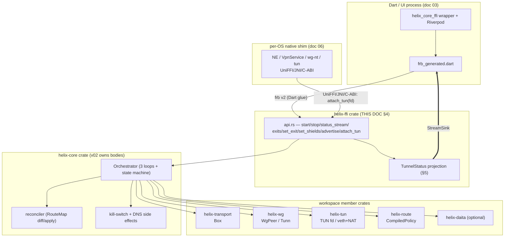
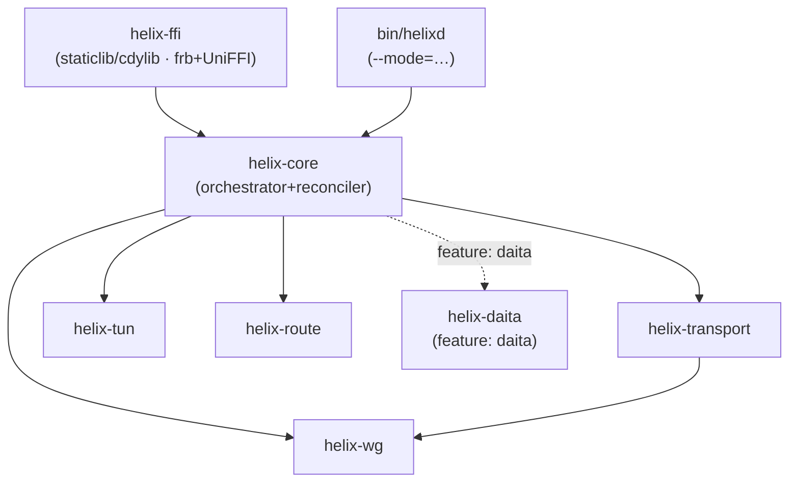
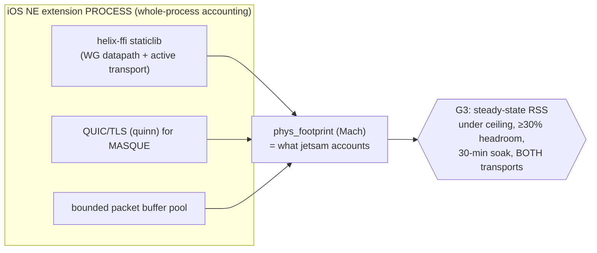
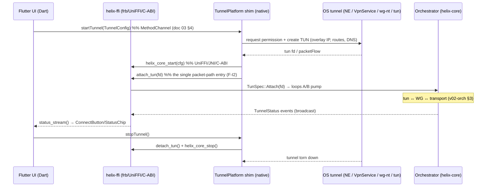
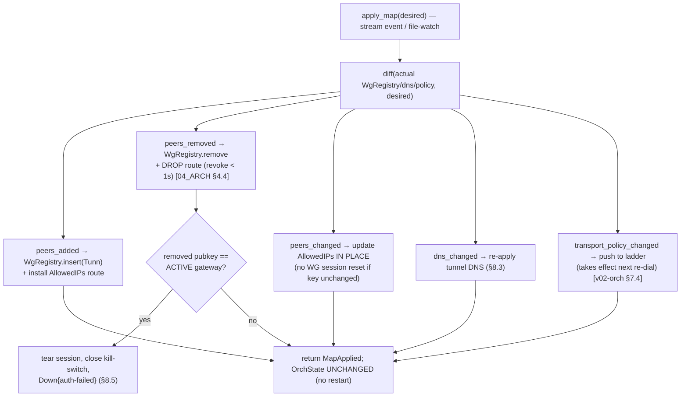
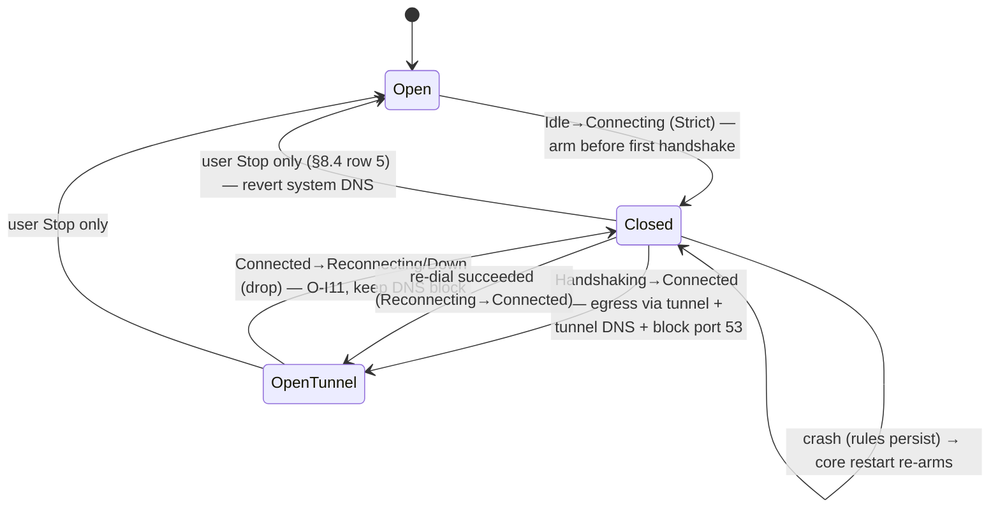
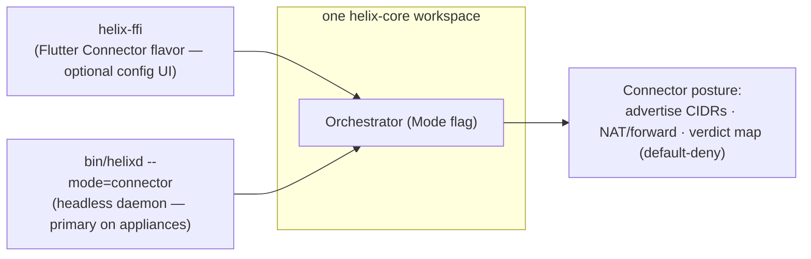

# helix-core (Rust client/connector core)

**Revision:** 2
**Last modified:** 2026-07-04T12:00:00Z

> Master technical specification — **Volume 4 (Clients)**, nano-detail deep-dive.
> This document **deepens** the `helix-core` (Rust client/connector core) part of
> the pass-1 client overview [04_UI §0/§1/§5, 04_ARCH §5.1] into an
> implementation-ready specification of **the Rust workspace that the FFI consumes**:
> the cargo crate layout (`helix-transport`, `helix-wg`, `helix-ffi`, the
> orchestrator+reconciler in `helix-core`), the size/memory build strategy
> (`opt-level=z` · LTO · `panic=abort` · strip), the network-map reconciler
> (consume `RouteMap`/`MapDelta` → bring WG peers up/down, update `AllowedIPs`),
> the kill-switch + DNS state machine, the `--mode=connector` posture sharing the
> same core, and **how the core sits beneath the FFI**.
>
> **Boundary with sibling docs.** This document is the *client-core* counterpart of
> the data-plane internals owned by Volume 2: the **orchestrator three-loop, the
> `TunnelStatus` broadcast, the reconciler diff/apply, the backoff machine, and the
> kill-switch/DNS coupling are specified in depth by**
> [`v02-data-plane/orchestrator-and-state.md`](../v02-data-plane/orchestrator-and-state.md)
> (cited `[v02-orch §N]`) and the carrier seam by
> [`v02-data-plane/transport-trait.md`](../v02-data-plane/transport-trait.md)
> (cited `[v02-tx §N]`). This document **owns** the *packaging + FFI seam* of that
> core: the cargo workspace, the per-platform library artifacts, the build/memory
> profile, the `helix-ffi` crate surface, and the FFI-driven *entry points* into
> the orchestrator/reconciler/kill-switch (it drives them; v02 defines their
> bodies). It does **not** re-specify the three loops, the `Tunn` crypto, the
> ladder algorithm, or the per-carrier wire formats. The FFI surface and the
> `TunnelStatus` enum here are **kept byte-consistent with** [v02-orch §4.1, §5] and
> the FFI sketch in [04_UI §5 / doc 03 §3].
>
> **Evidence base.** Citations inline by id: `[04_UI]` =
> `04_VPN_CLD/HelixVPN-helix-ui-Flutter.md`; `[04_ARCH §N]` =
> `04_VPN_CLD/HelixVPN-Architecture-Refined.md`; `[04_P0 §N]` =
> `…Phase0-Spike.md`; `[research-flutter_ffi]` / `[research-ios_android]` =
> the cited research digests; `[v02-orch §N]` / `[v02-tx §N]` = the Volume-2
> data-plane nano-docs; `[SYN §N]` = cross-document synthesis. Any claim not
> grounded in the evidence base is tagged `UNVERIFIED` per constitution §11.4.6 —
> never fabricated.

---

## Table of contents

- [0. Position, ownership, and invariants](#0-position-ownership-and-invariants)
- [1. The cargo workspace & crate layout](#1-the-cargo-workspace--crate-layout)
- [2. Per-platform library artifacts (how the core ships)](#2-per-platform-library-artifacts-how-the-core-ships)
- [3. Size / memory build strategy](#3-size--memory-build-strategy)
- [4. The `helix-ffi` crate — the surface beneath the FFI](#4-the-helix-ffi-crate--the-surface-beneath-the-ffi)
- [5. `TunnelStatus` — core enum ⇄ FFI projection](#5-tunnelstatus--core-enum--ffi-projection)
- [6. FFI lifecycle & the TUN-fd handoff (the shim seam)](#6-ffi-lifecycle--the-tun-fd-handoff-the-shim-seam)
- [7. The network-map reconciler beneath the FFI](#7-the-network-map-reconciler-beneath-the-ffi)
- [8. Kill-switch + DNS state machine](#8-kill-switch--dns-state-machine)
- [9. Connector mode (`--mode=connector`)](#9-connector-mode---modeconnector)
- [10. Error handling & edge cases](#10-error-handling--edge-cases)
- [11. Config knobs (`CoreTunables`)](#11-config-knobs-coretunables)
- [12. Test points (§11.4.169)](#12-test-points-1114169)
- [13. Open decisions & cross-doc contracts](#13-open-decisions--cross-doc-contracts)
- [Sources verified](#sources-verified)

---

## 0. Position, ownership, and invariants

`helix-core` is the **bounded-memory Rust data-plane core** shared by three
consumers — Helix Access (client), Helix Connector (advertise/route), and the
gateway edge — from *one* workspace [04_ARCH §5.1/§5.5, SYN §5, v02-tx §0]. On the
client side it is consumed **through an FFI**: `flutter_rust_bridge` (frb) v2 emits
the Dart glue, `UniFFI` emits the Swift/Kotlin glue where a native OS extension
links the core directly [04_UI §5, research-flutter_ffi §1/§2]. This document is
the nano-detail of *that core as a shippable, FFI-consumable artifact*.

### 0.1 What this document owns

| # | Owned here | Deepened from |
|---|---|---|
| W1 | The **cargo workspace** — crates, `crate-type`, feature flags, dependency DAG (§1) | [04_ARCH §11, SYN §6] |
| W2 | The **per-platform library artifacts** (`staticlib`/`cdylib`/xcframework/`.so`/`.a`/`.dll`) and how each shim links them (§2) | [research-flutter_ffi §3, research-ios_android §2/§3] |
| W3 | The **size/memory build profile** (`opt-level=z` · LTO · `codegen-units=1` · `panic=abort` · strip · iOS `build-std`) + budgets (§3) | [research-ios_android §1/§2, 04_P0 §6] |
| W4 | The **`helix-ffi` crate surface** — `api.rs` (`start/stop/status_stream/exits/set_exit/set_shields/advertise/attach_tun/detach_tun`), the mirrored value types (§4) | [04_UI §5, doc 03 §3, v02-orch §2.1] |
| W5 | The **`TunnelStatus` projection** — core 5-variant (v02) ⇄ Dart-facing FFI enum, the `StreamSink` pump, receiver contract (§5) | [v02-orch §4.1, doc 03 §3.1] |
| W6 | The **FFI-driven entry points** into the orchestrator/reconciler/kill-switch — `attach_tun`, `apply_map`, `set_shields` — and the C-ABI TUN-fd seam (§6, §7, §8) | [v02-orch §2.1/§6/§8, research-ios_android §3] |
| W7 | The **`--mode=connector` packaging** — one binary, mode flag, headless daemon entrypoint (§9) | [v02-orch §9, 04_ARCH §5.4] |

### 0.2 What this document does NOT own

- The orchestrator three loops, the backoff machine, the broadcast sender body —
  [v02-orch §3/§4/§7]. This doc drives them through `helix-ffi`.
- The `Transport` trait, `dial()`, per-carrier wire formats — [v02-tx §2/§4]. The
  core holds opaque `Box<dyn Transport>` handles.
- WireGuard crypto / the `Tunn` state machine (`helix-wg`) — doc 01 §4.
- The Dart `helix_core_ffi` wrapper, Riverpod, `TunnelPlatform` Dart contract, and
  every pixel of UI — doc 03 §3.2/§4/§8 [04_UI §4/§5/§6].
- The `WatchNetworkMap` protobuf that *delivers* the `RouteMap` — doc 02. The core
  consumes the map's *shape*; a file-watch on `map.json` is the Phase-0 stand-in
  [04_P0 §10].

### 0.3 Invariants this document inherits and enforces at the FFI seam

| # | Invariant | Source | FFI-seam enforcement |
|---|---|---|---|
| F-I1 | **The core owns truth about protection state; the UI is a pure function of the status stream.** | [04_UI §4.2 CI2] | The FFI exposes *only* `status_stream()`; there is no `is_connected()` poll getter (§5.4). |
| F-I2 | **The core never opens the OS tunnel.** The shim creates the TUN and hands the core a packet fd / pump via `attach_tun` (the one place crypto+transport live stays in Rust). | [04_UI §5 CI1, v02-tx I4] | `start()` does logic only; `attach_tun(fd)` is the sole packet-path entry (§6). |
| F-I3 | **One core, three consumers, no forked bodies** — client/connector differ only by `Mode`. | [v02-orch O-I13] | `CoreMode` is a `start()` parameter; §9 adds no second loop body. |
| F-I4 | **Fail-closed by construction** — kill-switch/DNS side effects are a function of `OrchState` transitions, surviving crash. | [v02-orch O-I11] | The FFI cannot open the firewall directly; only a state transition does (§8). |
| F-I5 | **No-logging / no-secret-leak by construction.** | [v02-tx I5, §11.4.10] | `SecretBytes` redacts+zeroizes; the FFI never returns a secret; the status stream carries only aggregate state (§5.5). |
| F-I6 | **iOS-NE memory ceiling is the hardest budget** and the reason the core is Rust not Go; every build/runtime decision defers to it. | [04_ARCH §5.6 CI4, research-ios_android §1] | §3 build profile + §3.3 runtime budget. |



---

## 1. The cargo workspace & crate layout

`helix-core/` is a **single cargo workspace** (snake_case, flat submodule per
§11.4.28/.29/.74) [v02-tx §0, SYN §6/§9]. Each member is decoupled and
independently testable; only `helix-ffi` and the binary depend on the OS/FFI.

```
helix-core/                         # the Rust workspace (own vasic-digital repo)
├── Cargo.toml                      # [workspace] members + shared [profile.*] (§3)
├── upstreams/                      # install_upstreams recipes (§11.4.36)
├── crates/
│   ├── helix-transport/            # L2 carriers: Transport trait + impls   [v02-tx]
│   │   └── crate-type = ["rlib"]
│   ├── helix-wg/                   # WG crypto core: WgPeer (boringtun wrap) [doc 01 §4]
│   │   └── crate-type = ["rlib"]
│   ├── helix-tun/                  # TUN device abstraction (client fd / connector veth+NAT)
│   │   └── crate-type = ["rlib"]
│   ├── helix-route/                # RouteMap, CompiledPolicy, verdict map   [doc 01 §6-§7]
│   │   └── crate-type = ["rlib"]
│   ├── helix-daita/                # optional L2.5 shaping (maybenot)        [doc 01 §9]
│   │   └── crate-type = ["rlib"]
│   ├── helix-core/                 # ORCHESTRATOR + RECONCILER + state machine [v02-orch]
│   │   └── crate-type = ["rlib"]   #   (the "conductor" — owns the loops, NOT exported directly)
│   └── helix-ffi/                  # THE FFI SURFACE (THIS DOC §4)
│       └── crate-type = ["staticlib", "cdylib"]   # platform-selected at build (§2)
└── bin/
    └── helixd.rs                   # the daemon: --mode={client|connector}, no Flutter (§9)
```

### 1.1 Dependency DAG (acyclic, FFI at the apex)



Rules: (1) **no crate depends on `helix-ffi`** — the FFI is a sink, never a
dependency, so the same `helix-core` links into the edge binary with zero FFI
weight [v02-tx I4]. (2) `helix-core` depends only on `rlib` members; the
`crate-type` distinction (`staticlib`/`cdylib`) lives *only* in `helix-ffi`, so the
heavy linker artifact is produced once at the apex (§2). (3) `helix-daita` is
behind a cargo `feature = "daita"` (off in Phase-1) so DAITA code is not even
compiled into the lean MVP staticlib [doc 01 §9].

### 1.2 Workspace `Cargo.toml` (skeleton)

```toml
# helix-core/Cargo.toml
[workspace]
members  = ["crates/*", "bin/*"]
resolver = "2"

[workspace.dependencies]
tokio       = { version = "1", features = ["rt-multi-thread", "net", "time", "sync", "macros"] }
tokio-util  = "0.7"           # CancellationToken
bytes       = "1"
async-trait = "0.1"
thiserror   = "1"
zeroize     = "1"             # SecretBytes scrubbing (§11.4.10)
boringtun   = "*"             # helix-wg backend (version pinned at Phase-0 graduation; UNVERIFIED exact)

# frb + UniFFI live ONLY in helix-ffi (§4); not workspace-wide.

[profile.release]             # the lean default (§3.1) — every crate inherits
opt-level     = "z"
lto           = "fat"
codegen-units = 1
panic         = "abort"
strip         = true
```

---

## 2. Per-platform library artifacts (how the core ships)

The **only** crate that changes shape per platform is `helix-ffi`; everything
below it is `rlib` [research-flutter_ffi §3]. Two binding generators read one Rust
surface (the canonical Mullvad/WARP pattern [04_ARCH §5.1, research-flutter_ffi §2]):

| Consumer | Linkage | `crate-type` | Generator | Artifact |
|---|---|---|---|---|
| **Dart (all in-process FFI platforms)** | linked or dlopened by the Flutter engine | `staticlib` (iOS/macOS) / `cdylib` (Android/Linux/Windows) | **frb v2** (`flutter_rust_bridge_codegen`) → `frb_generated.dart` + Rust glue | `.a` / `.so` / `.dll` |
| **iOS / macOS NE (Swift)** | linked into the `NEPacketTunnelProvider` extension | `staticlib` → xcframework | **UniFFI** (Swift) + cbindgen for the raw `attach_tun` C-ABI | `libhelix_ffi.a` in `.xcframework` |
| **Android (Kotlin)** | `System.loadLibrary` in `VpnService` | `cdylib` per ABI via `cargo-ndk` | **UniFFI** (Kotlin) + JNI for `attach_tun(fd)` | `libhelix_core.so` (arm64-v8a, armeabi-v7a, x86_64) |
| **Windows (C#)** | privileged service hosts the core | `cdylib` | cbindgen C header (named-pipe IPC marshals the FFI verbs) | `helix_core.dll` |
| **Linux (Dart-FFI / in-process)** | `DynamicLibrary.open` | `cdylib` | frb v2 | `libhelix_core.so` |
| **HarmonyOS NEXT (ArkTS)** | NAPI `.so`, ArkTS bridge | `cdylib` | cbindgen / N-API (UniFFI-Kotlin not available) | `libhelix_core.so` |
| **Aurora OS (C++/Qt)** | linked into the Qt backend | `cdylib`/`staticlib` | cbindgen C ABI | `libhelix_core.so` / `.a` |

> **Generator decision (D-CORE-1, surfaced per §11.4.66).** **frb v2 for Dart,
> UniFFI for native Swift/Kotlin, cbindgen C-ABI where UniFFI is thin.**
> `flutter_rust_bridge` 2.12.0 is a Flutter Favorite with first-class `StreamSink`
> support — the canonical way to push the status stream Rust→Dart
> [research-flutter_ffi §1/§7]. `uniffi-dart` is community WIP and "should not be
> trusted" [research-flutter_ffi §2], so UniFFI is used **only** for its
> first-party Kotlin/Swift output where a native extension links the core directly
> (iOS NE, Android VpnService) [research-flutter_ffi §2/§7]. HarmonyOS/Aurora fall
> back to cbindgen C-ABI because neither has UniFFI-target support
> [research-flutter_ffi §4/§5]. **frb-crate version MUST equal the Dart-dep
> version** — a drift is a build-blocking finding (§12 `UT`/`IT`)
> [research-flutter_ffi §1 caveat].

### 2.1 Build commands (per target)

```bash
# Android: cdylib per ABI, bundled into jniLibs  [research-ios_android §3]
cargo ndk -t arm64-v8a -t armeabi-v7a -t x86_64 -o ../apps/access/android/app/src/main/jniLibs build --release

# iOS/macOS: staticlib → xcframework, nightly build-std for the smallest NE footprint (§3.2)
cargo +nightly build --release -p helix-ffi --target aarch64-apple-ios \
  -Z build-std=std,panic_abort -Z build-std-features=panic_immediate_abort,optimize_for_size
# then: lipo/xcodebuild -create-xcframework

# Linux/Windows desktop: cdylib loaded via Dart FFI DynamicLibrary
cargo build --release -p helix-ffi --target x86_64-unknown-linux-gnu
```

---

## 3. Size / memory build strategy

The iOS Network-Extension memory ceiling is the architecture (F-I6) [04_ARCH
§5.6 CI4, research-ios_android §1/§4]. The strategy has two halves: the **build
profile** (smaller code → fewer mapped pages → lower resident footprint) and the
**runtime budget** (bounded buffers, no per-flow growth).

### 3.1 Release profile (the lean default, every crate inherits)

```toml
# [profile.release] from the workspace Cargo.toml (§1.2)  [research-ios_android §2]
opt-level     = "z"     # smallest code. (Evaluate "s": often ~similar size, faster — §3.4 measure)
lto           = "fat"   # whole-program optimization across crates
codegen-units = 1       # better cross-module size opt (slower compile, accepted)
panic         = "abort" # drops unwinding tables + landing pads → smaller + sometimes faster
strip         = true    # strip symbols (Rust 1.59+), ~3–8% extra reduction
```

`panic = "abort"` is doubly motivated: it shrinks the binary AND removes
unwinding, which the FFI boundary requires anyway — **a Rust `panic!` must never
unwind across the C-ABI into Swift/Kotlin/Dart** (UB) [research-ios_android §2].

> **Corrected panic-boundary contract (fixes a self-contradiction, §11.4.6).** An
> earlier draft of this section claimed the `helix-ffi` entry points wrap their
> bodies in `std::panic::catch_unwind`-equivalent guards that convert a caught
> panic into `CoreError::Internal`. **This is impossible under `panic=abort`:**
> `catch_unwind` requires the *unwind* panic strategy to have anything to catch;
> under `abort`, the process terminates at the panic site before any unwinding
> (and therefore any catching) can occur. The two cannot coexist in one profile —
> the corrected, honest contract is:
> 1. **No panic is ever caught at the FFI boundary.** With `panic=abort` set
>    workspace-wide (§1.2), a `panic!` anywhere in `helix-core`/`helix-ffi`
>    terminates the **entire hosting process** — the iOS NE extension, the
>    Android app process, the Windows service, or the edge binary. This is a
>    real availability risk (an aborted NE extension is not guaranteed a prompt
>    OS-triggered relaunch), not a caught-and-recovered error.
> 2. **The mitigation is defensive-coding rigor at the boundary, not runtime
>    recovery.** Every `helix-ffi` entry point (§4.1) MUST validate
>    externally-supplied input and return a typed `CoreError` variant
>    (`Config`/`BadFd`/`Auth`/…) instead of ever reaching a `.unwrap()`/
>    `.expect()`/panicking-index/`unreachable!()` on FFI-boundary data. A
>    `CoreError` is the ONLY sanctioned way an FFI call reports failure — a
>    panic is by definition a bug, not an expected error path.
> 3. **Enforced mechanically, not by convention.** `helix-ffi` (and any crate an
>    FFI entry point calls into on the hot path) carries a `clippy.toml`/lint
>    config denying `unwrap_used`, `expect_used`, `panic`, `unimplemented`,
>    `todo`, and `indexing_slicing` — a pre-build gate (§11.4.4(b) layer 1),
>    with a paired §1.1 mutation (reintroduce a denied lint call → the gate
>    FAILs).
> 4. **Accepted tradeoff, stated honestly.** A genuine internal-invariant
>    violation (a real bug, not user error) aborts the host process. This is
>    the deliberate, accepted cost of the `panic=abort` size optimization
>    (this section); the alternative (`panic=unwind` + a real `catch_unwind`)
>    would re-admit the unwinding machinery §3.2's `build-std` reduction
>    removes, undermining the iOS memory budget (§3.3) this whole strategy
>    exists to protect. The lint-enforced no-panic-on-boundary-data discipline
>    (point 3) is what keeps this an acceptable risk rather than a routine
>    crash surface.

### 3.2 iOS-only: `build-std` for the largest reduction

For the `aarch64-apple-ios` target the standard library is rebuilt with size
features — this drops the `gimli` backtrace machinery and all panic-formatting
code from `std` [research-ios_android §2]:

```
-Z build-std=std,panic_abort
-Z build-std-features=panic_immediate_abort,optimize_for_size
```

Representative published reduction: ~43 % over the baseline release profile
[research-ios_android §2, markaicode]. This is the make-or-break lever for the G3
memory gate (§3.3). **`staticlib` (not `dylib`) for iOS** — no dynamic-loading
entitlement friction, and the linker dead-strips unreferenced symbols
[research-ios_android §2].

### 3.3 Runtime memory budget & the G3 gate



| Fact | Value | Source |
|---|---|---|
| Documented NE limit (iOS 15–18) | **50 MiB** (whole process incl. all linked libs) | [research-ios_android §1, Apple DTS] |
| Observed real-world jetsam kill | **~15 MB on iOS 17.3.1** (root cause `PENDING_FORENSICS`) | [research-ios_android §1] |
| Dominant kill cause | **memory spikes** during upload-heavy throughput, not steady-state | [research-ios_android §1, sing-box #3976] |
| **Engineering target (this spec)** | **steady-state ≤ ~12–15 MB working set**, never plan to 50 MiB | [research-ios_android §1/§4] |
| The limit | **undocumented, MUST NOT be hardcoded** — measure on real devices | [research-ios_android §1, Quinn DTS] |

Runtime rules: (1) **bounded packet-buffer pool** sized to negotiated MTU +
headroom (§6.3), never an arbitrary large read buffer [research-ios_android §1];
(2) **WG-class low-state datapath** — no TCP connection tracking, minimal
persistent heap [research-ios_android §1/§4]; (3) **measure `phys_footprint` /
`task_vm_info`** (the value jetsam accounts against — `UNVERIFIED` exact Mach
field, verify on device) sampled from inside the extension, plus Instruments
Allocations/VM-Tracker [research-ios_android §1].

**G3 (make-or-break) gate** [04_P0 §6, doc 03 §5.1]: build the same `helix-ffi`
as `aarch64-apple-ios` with §3.1+§3.2; drive a **1 GB transfer on a real device**
(Simulator memory is *not* representative); sample the **extension process** RSS;
run **plain-UDP and MASQUE separately** (QUIC buffers cost more). **Pass =
steady-state under the device-enforced ceiling with ≥ 30 % headroom across a
30-minute soak, both transports.** Documented fallbacks in order (each a real
product decision — D-CLIENT-1, surfaced [04_P0 §6.4, doc 03 §14]): (a) shrink
buffers / cap QUIC flow-control windows in the iOS build; (b) move MASQUE
off-device for iOS (plain WG + on-path obfuscation only — partial feature loss);
(c) split the core so only the lean WG datapath is in-extension and QUIC
negotiation lives in the app via app-extension IPC.

### 3.4 Android memory posture (contrast)

Android `VpnService` runs as a normal foreground service — **no hard
15/50 MiB jetsam cap**; standard per-app `lowmemorykiller` applies, far more
generous [research-ios_android §3]. The severe constraint is **iOS-only**; the
same lean build is used everywhere (smaller is always better), but the budget is
gated on iOS.

### 3.5 App-size budgets (the install-size half)

| Budget | Target | Means | Source |
|---|---|---|---|
| Mobile install (per ABI) | Access **< ~15–20 MB** | `--split-per-abi`, lean staticlib (LTO+strip), tree-shake | [04_UI §10] |
| Core staticlib size | record per target; smallest is the goal | §3.1/§3.2; audit fat deps (regex/formatting/async) [research-ios_android §2 bitdrift] | [research-ios_android §2] |

---

## 4. The `helix-ffi` crate — the surface beneath the FFI

`helix-ffi/src/api.rs` is the **only hand-authored FFI source**; both generators
read it [04_UI §5, doc 03 §3.1]. It is a thin, panic-safe adapter over the
`helix-core` `Orchestrator` (§6) — it holds the live `Orchestrator` behind a
process-global handle and translates FFI calls into orchestrator methods. The
surface is **frozen at the Phase-0 → Phase-1 graduation** [04_P0 §11]; its shape
matches [04_UI §5 / doc 03 §3] and its `TunnelStatus` matches [v02-orch §4.1] via
the §5 projection.

### 4.1 `api.rs` — the exported function surface

```rust
// helix-ffi/src/api.rs — frb v2 + UniFFI generate Dart/Swift/Kotlin/C bindings.
// Transport/WG/orchestrator internals are v02/doc-01's; this is the EXPORTED surface only.
use flutter_rust_bridge::frb;

pub struct ClientConfig {
    pub map_path_or_session: String, // Phase 0: path to map.json; Phase 1+: control-plane session token
    pub transport: String,           // "auto" | "plain" | "masque" | "shadowsocks" | "uot" | "lwo"
    pub mode: CoreMode,              // Client | Connector  (F-I3)
}

#[frb(mirror(CoreMode))]
pub enum CoreMode { Client, Connector }

// ---- lifecycle (LOGIC ONLY — NOT the OS tunnel; the shim owns that, F-I2) ----
/// Build the Orchestrator (§6.1), arm the kill-switch closed (§8.2), spawn the
/// loops, emit Connecting. Idempotent: a second start while running is Err(AlreadyStarted) (§6.1).
pub async fn start(cfg: ClientConfig) -> Result<(), CoreError>;
/// Graceful stop: cancel loops, FIN transport, revert kill-switch+DNS per §8.6, emit Down{stopped}.
pub async fn stop() -> Result<(), CoreError>;

// ---- the live status stream (maps to the orchestrator broadcast, §5) ----
/// frb StreamSink → Dart broadcast Stream. Many concurrent sinks are allowed (broadcast
/// fan-out, §5.3); each call subscribes a fresh receiver and immediately re-emits the
/// cached latest status (§5.2). Returns Err(NotStarted) if the core is not running.
pub fn status_stream(sink: StreamSink<FfiTunnelStatus>) -> Result<(), CoreError>;

// ---- exits / routing (Phase 1+) ----
pub async fn exits() -> Result<Vec<ExitOption>, CoreError>;
pub async fn set_exit(id: String, multi_hop_chain: Option<Vec<String>>) -> Result<(), CoreError>;

// ---- privacy shields (pure logic — no OS tunnel touched, F-I2) ----
pub async fn set_shields(s: Shields) -> Result<(), CoreError>;

// ---- connector mode only (§9) ----
pub async fn advertise(cidrs: Vec<String>) -> Result<AdvertiseResult, CoreError>;

// ---- desired-state push (Phase 1: bridges WatchNetworkMap; Phase 0: file-watch) (§7) ----
pub async fn apply_map(map_json: String) -> Result<MapApplied, CoreError>;

// ---- shim handoff: the core NEVER opens the TUN; the shim hands it a packet fd / pump (F-I2, §6) ----
pub fn attach_tun(fd: i32) -> Result<(), CoreError>;   // Android ParcelFileDescriptor / Linux tun fd
pub fn detach_tun() -> Result<(), CoreError>;
```

> **Canonical FFI contract (R7-reconciled).** Every FFI verb returns the typed
> `CoreError` (§10.1), never `anyhow::Result` — `anyhow` stays *internal* to the
> orchestrator and is converted at the boundary via `From` impls (see
> `v04-client/ffi-surface.md` §8.1, the canonical owner of the exported surface).
> The Dart-facing status enum is `FfiTunnelStatus` (§5.1); `ffi-surface.md` writes it
> path-qualified as `ffi::TunnelStatus` purely to contrast with the orchestrator's
> `core::TunnelStatus` — it is **the same Rust type**.

### 4.2 Mirrored value types (frb `#[frb(mirror)]` → identical Dart/Swift/Kotlin)

```rust
#[frb(mirror(Shields))]
pub struct Shields {
    pub kill_switch:  bool,          // → KillSwitchConfig.mode Strict/Off (§8.2)
    pub dns_protection: bool,        // → DnsConfig.block_plaintext_53 (§8.3)
    pub daita:        bool,          // feature-gated; Phase 2 [doc 01 §9]
    pub post_quantum: bool,          // PQ PSK; Phase 2 [SYN §4]
    pub split_tunnel: Vec<String>,   // per-route bypass; per-APP split handled in the shim layer
}

#[frb(mirror(ExitOption))]
pub struct ExitOption {
    pub id: String, pub kind: String,        // "privacy_exit" | "network"
    pub label: String, pub country: Option<String>, pub rtt_ms: Option<u32>,
    pub jurisdiction: Option<String>,        // for multi-hop labels
}

#[frb(mirror(AdvertiseResult))]
pub struct AdvertiseResult { pub accepted: Vec<String>, pub conflicts: Vec<String> }

#[frb(mirror(MapApplied))]
pub struct MapApplied {                      // §7 reconcile outcome surfaced to the UI
    pub peers_added: u32, pub peers_removed: u32, pub peers_changed: u32,
    pub dns_changed: bool, pub restart_free: bool,   // always true (O-I12); a false here is a bug
}
```

### 4.3 Panic-safety & the process-global handle

```rust
// helix-ffi/src/state.rs — exactly one live Orchestrator per process.
use once_cell::sync::OnceCell;
use tokio::sync::Mutex;
static RUNTIME: OnceCell<tokio::runtime::Runtime> = OnceCell::new();   // multi-thread runtime
static ORCH:    OnceCell<Mutex<Option<helix_core::Orchestrator>>> = OnceCell::new();

// Every async fn body is dispatched on RUNTIME and guarded:
//   - frb v2 marshals async Rust to a Dart Future; a Rust Err becomes a Dart exception.
//   - with panic=abort (§3.1) a genuine bug ABORTS the process — it is NEVER caught
//     at this boundary (no catch_unwind is possible under abort; see §3.1's corrected
//     panic-boundary contract). "Guarded" here means INPUT-VALIDATED, not panic-caught:
//     every body validates its arguments and returns CoreError on anything unexpected,
//     so the only path left to an abort is a genuine internal-invariant bug, not bad input.
//   - CoreError (§10) is the structured, surfaced failure; never a silent bluff (§11.4.6).
```

`UNVERIFIED`: whether frb v2's generated async runtime obviates a hand-rolled
`RUNTIME` (frb manages a worker pool) — confirm at codegen; if frb owns the
runtime, `RUNTIME` collapses to frb's [research-flutter_ffi §1]. The single-live-
orchestrator invariant (one TUN, one tunnel per app process) is enforced
regardless.

---

## 5. `TunnelStatus` — core enum ⇄ FFI projection

The **core** broadcast type is the frozen 5-variant enum owned by [v02-orch §4.1]:

```rust
// helix-core/src/status.rs  (OWNED by v02-orch §4.1 — reproduced for the seam, MUST match)
#[derive(Clone, Debug, PartialEq, Eq)]
pub enum TunnelStatus {
    Connecting,                                   // dialling the first/seeded rung
    Handshaking,                                  // carrier up, WG handshake in flight
    Connected { transport: String, rtt_ms: u32 }, // e.g. ("masque-h3", 23)
    Reconnecting,                                 // a working tunnel dropped; re-dialling
    Down { reason: String },                      // terminal for this attempt (§10 reasons)
}
```

The **FFI-facing** enum (the Dart/Swift/Kotlin surface, doc 03 §3.1) is a strict
*projection* of the core enum plus three FFI-only additions. The projection is
the **only** place the two differ; the §12 contract test asserts the mapping
byte-for-byte so they can never silently drift.

```rust
// helix-ffi/src/api.rs
#[frb(mirror(FfiTunnelStatus))]
pub enum FfiTunnelStatus {
    Disconnected,                                              // FFI-only: clean idle (pre-start / post user-stop)
    Connecting,                                               // ← core Connecting
    Handshaking,                                              // ← core Handshaking
    Connected { transport: String, path: String, rtt_ms: u32 }, // ← core Connected; `path`="direct"|"relay" (§5.1)
    Reconnecting,                                             // ← core Reconnecting
    Down { reason: String },                                 // ← core Down{reason} (unexpected drop)
    Danger { kind: String },                                 // FFI-only: "leak" | "killswitch_tripped" (§5.2)
}
```

### 5.1 The projection map (core → FFI)

| Core `TunnelStatus` | FFI `FfiTunnelStatus` | Notes |
|---|---|---|
| *(no live orchestrator)* | `Disconnected` | pre-`start()` and after `stop()` → `Down{stopped}` is re-mapped to `Disconnected` for the UI (clean idle) |
| `Connecting` | `Connecting` | 1:1 |
| `Handshaking` | `Handshaking` | 1:1 |
| `Connected{transport,rtt_ms}` | `Connected{transport, path, rtt_ms}` | `path` derived: `"relay"` if the active leg is DERP-style relay, else `"direct"` (P2P/NAT-traversal — doc 01 §8); Phase-1 default `"direct"` |
| `Reconnecting` | `Reconnecting` | 1:1 |
| `Down{reason: "stopped"}` | `Disconnected` | user-stop is clean, not a danger |
| `Down{reason: r}` (r≠stopped) | `Down{reason: r}` | unexpected/terminal drop (kill-switch stays closed, §8) |
| *(kill-switch trip / leak detected)* | `Danger{kind}` | FFI-only overlay derived from the §8 sub-machine + leak probe; drives the red `stateDanger` palette (doc 03 §7) |

> **Consistency note (§11.4.6).** The core never emits `Disconnected` or `Danger`
> — they are FFI-layer derivations, so the v02 5-variant broadcast contract is
> untouched. `Danger` is **not** a guessed UI state: it is raised only on a
> concrete signal — the §8 kill-switch sub-machine reporting `killswitch_tripped`,
> or an explicit DNS/leak probe firing — never inferred from prose.

### 5.2 The `StreamSink` pump

```rust
// helix-ffi/src/api.rs — status_stream wiring
pub fn status_stream(sink: StreamSink<FfiTunnelStatus>) {
    let mut rx = orchestrator().subscribe();             // broadcast::Receiver<core::TunnelStatus> [v02-orch §2.1]
    spawn_on_runtime(async move {
        // emit initial Disconnected so the UI has a value before the first transition (CI2)
        let _ = sink.add(FfiTunnelStatus::Disconnected);
        loop {
            match rx.recv().await {
                Ok(core_s) => { let _ = sink.add(project(core_s)); }            // §5.1 map
                Err(broadcast::error::RecvError::Lagged(_)) => continue,        // skip-to-latest, NOT an error [v02-orch §4.6]
                Err(broadcast::error::RecvError::Closed)    => break,           // orchestrator gone → stream ends
            }
        }
    });
}
```

frb v2 turns this `StreamSink<FfiTunnelStatus>` into a Dart `Stream` that feeds a
Riverpod `StreamProvider.autoDispose` [research-flutter_ffi §6]. **Riverpod 3.0
pauses the subscription when no widget listens** — so the FFI pump is torn down
when the UI backgrounds the status, and re-subscribes on resume; the core keeps
running regardless (the broadcast sender outlives any receiver)
[research-flutter_ffi §6].

### 5.3 Receiver contract (Dart side, doc 03 §8.2 honors this)

`Lagged` MUST be treated as "re-read latest", never an error; `Closed` ends the
stream. The status is edge-coalesced (emissions are rare — state changes), so the
64-slot broadcast ring [v02-orch §4.2] never lags unless a receiver is wedged.

### 5.4 No poll getter (F-I1)

The FFI exposes **no** `is_connected()` / `current_status()` synchronous getter.
The UI's only source of protection truth is `status_stream()` — this structurally
prevents the "UI says connected while the tunnel is down" bug (CI2) [04_UI §4.2].

### 5.5 What the FFI MUST NOT return (F-I5)

No endpoint, SSID, gateway IP, per-packet/per-flow datum, or `SecretBytes` ever
crosses the FFI. `Connected.transport` is a *kind* label; `rtt_ms` is an aggregate
EWMA [v02-orch §4.5, v02-tx I5]. A code-review gate (§11.4.142) rejects any FFI
return embedding an endpoint or secret.

---

## 6. FFI lifecycle & the TUN-fd handoff (the shim seam)

The seam that prevents the classic VPN bug [doc 03 §3.3, v02-orch §2.1]:
**lifecycle commands flow UI → shim → core** (the OS owns the tunnel process),
while **status events flow core → FFI → UI** (the core owns protection truth).
`set_shields`/`set_exit`/`exits` are pure logic and go straight UI → FFI without
touching the OS tunnel (F-I2).

### 6.1 `start()` → builds the `Orchestrator`

```rust
// helix-ffi/src/api.rs (body sketch) — drives helix-core; v02-orch §2.1 owns Orchestrator::start
pub async fn start(cfg: ClientConfig) -> Result<(), CoreError> {
    let mut guard = orch_cell().lock().await;
    if guard.is_some() { return Err(CoreError::AlreadyStarted); } // idempotent: no double tunnel
    let initial_map = load_map(&cfg.map_path_or_session).await?; // Phase 0: file; Phase 1: session→WatchNetworkMap
    let oc = helix_core::OrchestratorConfig {
        mode: cfg.mode.into(),                                    // F-I3
        tun:  TunSpec::AttachLater,                               // the shim calls attach_tun (§6.2) — core does NOT open it
        initial_map,
        transport_policy: TransportPolicy::from_hint(&cfg.transport),
        kill_switch: KillSwitchConfig::default(),                // armed-closed-until-connected (§8.2)
        dns: DnsConfig::from(&initial_map),
        tunables: CoreTunables::default(),                       // §11
    };
    *guard = Some(helix_core::Orchestrator::start(oc).await?);   // arms kill-switch CLOSED, spawns loops, emits Connecting
    Ok(())
}
```

`start()` does **not** open the TUN. The orchestrator is built in
`TunSpec::AttachLater` and idles loop A/B until `attach_tun(fd)` injects the packet
pipe (F-I2). This is the contract that keeps the *only* per-platform code in the
shim [04_UI §5/§6].

### 6.2 The TUN-fd handoff (the C-ABI seam, per OS)



Per-OS fd source [research-ios_android §3, doc 03 §5]:

- **Android (Kotlin/JNI):** `ParcelFileDescriptor.detachFd()` transfers ownership;
  the int fd is passed into JNI; the core `read(2)`/`write(2)`s directly on it.
  Every outbound transport socket the core opens MUST be `protect()`ed
  (ideally native `protectFromVpn` to avoid per-socket JNI upcalls) so the
  tunnel's own packets don't loop back into the tun
  [research-ios_android §3].

  ```kotlin
  // apps/access/android/.../HelixVpnService.kt
  external fun coreStart(sessionToken: String): Int          // JNI → helix_ffi start()
  external fun attachTun(fd: Int): Int                       // JNI → helix_ffi attach_tun()
  // ...
  val pfd: ParcelFileDescriptor = builder.establish()!!      // OS creates the TUN
  coreStart(cfg.sessionToken); attachTun(pfd.detachFd())     // hand raw fd to the core
  ```

- **iOS/macOS (Swift, NE):** the extension owns `packetFlow`; there is no integer
  fd — instead the shim wires the read/write callbacks. The C-ABI exposes a
  `tun_out` push and a `set_tun_writer` callback (the core has no fd, it pumps via
  the closures):

  ```swift
  // apps/access/ios/HelixTunnel/PacketTunnelProvider.swift
  helix_core_start(cfg.sessionToken)                          // UniFFI/cbindgen
  packetFlow.readPackets { packets, _ in
    for p in packets { helix_core_tun_out(p) }                // core encrypts + sends via transport
  }
  helix_core_set_tun_writer { data in                         // core → OS: decrypted IP packets
    self.packetFlow.writePackets([data], withProtocols: [AF_INET])
  }
  ```

- **Linux (in-process):** the core opens/owns the tun fd directly (a
  `setcap cap_net_admin` helper or polkit-gated daemon covers privilege); the
  Phase-0 G5 reference platform "the core can drive the TUN directly"
  [04_P0 §9, doc 03 §5.4].

- **Windows:** a privileged service hosts the core + the `wireguard-nt`/`wintun`
  adapter; the Flutter app marshals the FFI verbs over a named pipe; the wintun
  ring is the core↔OS packet path [doc 03 §5.3].

- **HarmonyOS NEXT (ArkTS):** the `VpnExtensionAbility` tun is bridged via NAPI to
  the `.so`; honest SKIP-with-reason (§11.4.3) where the SIG port lacks the VPN
  API [research-flutter_ffi §5, research-ios_android n/a].

- **Aurora OS (Qt/C++):** the Qt backend owns the tun; the C-ABI receives the fd
  [doc 03 §5.6].

### 6.3 The C-ABI surface for the native packet path (cbindgen)

```c
// helix_ffi.h (cbindgen-generated) — the raw seam UniFFI does not cover (packet hot path)
int32_t  helix_core_start(const char* session_token, int32_t mode);   // 0=Client 1=Connector
int32_t  helix_core_attach_tun(int32_t fd);                           // Android/Linux fd path
void     helix_core_tun_out(const uint8_t* pkt, uintptr_t len);       // iOS push-in path (one IP packet)
void     helix_core_set_tun_writer(void (*writer)(const uint8_t*, uintptr_t)); // core → OS callback
int32_t  helix_core_detach_tun(void);
int32_t  helix_core_stop(void);
```

The read buffer the core allocates for `tun_out`/the fd read loop is **bounded to
the negotiated MTU + headroom** (§3.3), never an arbitrary large value — the
single strongest lever against iOS jetsam spikes [research-ios_android §1].

---

## 7. The network-map reconciler beneath the FFI

> **Ownership.** The reconciler's diff/apply bodies are specified in depth by
> [v02-orch §6]. This section specifies the **FFI-driven entry** (`apply_map`),
> the consumed `RouteMap`/`MapDelta` shapes, and the *client-core* obligation to
> bring WG peers up/down and update `AllowedIPs` restart-free — kept byte-consistent
> with [v02-orch §6.2/§6.3].

The core is a **declarative reconciler** [04_ARCH §4.4, 04_P0 §10]: it diffs a
*desired* `RouteMap` (Phase 1: pushed by `WatchNetworkMap`, doc 02; Phase 0: a
file-watch on `map.json`) against live state and converges — peers up/down,
`AllowedIPs`, transport policy, DNS — **without restarting** (O-I12), `< 1 s`
convergence [04_ARCH §4.4].

### 7.1 Consumed shapes (frozen, from [v02-orch §6.2])

```rust
// helix-route (consumed by the reconciler) — MUST match v02-orch §6.2 byte-for-byte
pub struct RouteMap {
    pub self_overlay: IpAddr,               // this node's overlay IP (ULA /48, D4)
    pub peers: Vec<PeerRoute>,              // already policy-filtered (need-to-know, I6)
    pub dns: Vec<IpAddr>,                   // tunnel DNS servers (§8.3)
    pub transport_policy: TransportPolicy,  // per-leg ladder order/pin/budget [v02-tx §6.2]
    pub daita: Option<DaitaMachines>,       // optional shaping config (data, not code; feature-gated)
}
pub struct PeerRoute {
    pub wg_pubkey: [u8; 32],
    pub endpoint_candidates: Vec<SocketAddr>, // NAT traversal (Phase 2)
    pub allowed_ips: Vec<IpNet>,              // overlay prefixes this peer is next hop for
    pub via_connector: Option<SiteId>,        // 4via6 site disambiguation [doc 01 §6.1]
}
pub struct MapDelta {                        // produced by diff(), surfaced to the FFI as MapApplied (§4.2)
    pub peers_added: Vec<PeerRoute>,
    pub peers_removed: Vec<[u8; 32]>,         // pubkeys to tear down (revocation path)
    pub peers_changed: Vec<PeerRoute>,        // allowed_ips / endpoint changed
    pub dns_changed: bool, pub policy_changed: bool, pub transport_policy_changed: bool,
}
```

### 7.2 `apply_map` — the FFI-driven converge

```rust
// helix-ffi/src/api.rs — Phase 1 wires WatchNetworkMap → this; Phase 0 the file-watch task calls it.
pub async fn apply_map(map_json: String) -> Result<MapApplied, CoreError> {
    let desired: RouteMap = serde_json::from_str(&map_json)?;       // Phase-0 stand-in shape == Phase-1 stream
    let delta = orchestrator().apply_map(desired).await?;          // v02-orch §6.4 in-place converge (O-I12)
    Ok(MapApplied {
        peers_added: delta.peers_added.len() as u32,
        peers_removed: delta.peers_removed.len() as u32,
        peers_changed: delta.peers_changed.len() as u32,
        dns_changed: delta.dns_changed,
        restart_free: true,                                        // ALWAYS true; a false here is a bug (O-I12)
    })
}
```

### 7.3 Apply flow (restart-free) — what the client core does per delta class



- **`peers_added`** → insert a `Tunn` into the WG registry and install its
  `allowed_ips` as overlay routes; the new peer is reachable without a tunnel
  restart [v02-orch §6.4].
- **`peers_removed`** → remove the `Tunn` and DROP its routes; if the removed
  pubkey is the **active** gateway (revocation-of-self), tear the session, close
  the kill-switch, emit `Down{auth-failed}` → FFI `Down{"auth-failed"}` (§8.5).
  Effective `< 1 s` [04_ARCH §4.4].
- **`peers_changed`** touching only `allowed_ips` → update the routing map **in
  place**, **no WG session reset** (the key is unchanged) — the "policy edit
  < 1 s, no restart" MVP gate (AC5) [v02-orch §6.4, 04_P1 §11.2].

### 7.4 Reconcile is a side task (fail-static, I3)

The reconcile source dying (stream disconnect / file-watch error) never tears the
tunnel — the loops keep forwarding on the last-applied map (fail-static)
[04_ARCH §2.1, v02-orch §6.5]. The FFI surface is unaffected; `apply_map` simply
isn't called until the source recovers (Phase-1 stream re-subscribes with its own
backoff, independent of the data-plane backoff).

---

## 8. Kill-switch + DNS state machine

> **Ownership.** The kill-switch/DNS coupling bodies are specified by [v02-orch §8].
> This section specifies how the **core configures and exposes** them beneath the
> FFI (the `Shields` mapping, the `Danger` projection) — kept consistent with
> [v02-orch §8.4].

The kill-switch and DNS-leak protection are **owned by the core state machine**,
never hand-edited firewall rules [04_ARCH §5.6/§7]. Every open/close and DNS
apply/revert is a side effect of an `OrchState` transition (O-I10), so there is no
window where the UI shows "connected" but the firewall is open (F-I4).

### 8.1 Config (from `Shields` + `RouteMap`)

```rust
// helix-core (configured by start() from ClientConfig+RouteMap; v02-orch §8.2/§8.3 owns bodies)
pub struct KillSwitchConfig {
    pub mode: KillSwitchMode,                 // Strict | Permissive | Off
    pub allow_lan: bool,                      // permit RFC1918 LAN while closed (printers etc.)
    pub allow_gateway_endpoints: Vec<IpNet>,  // gateway IPs the transport MUST reach (stay open)
}
pub enum KillSwitchMode { Strict, Permissive, Off }
pub struct DnsConfig {
    pub servers: Vec<IpAddr>,                 // tunnel DNS (from RouteMap.dns)
    pub block_plaintext_53: bool,             // drop off-tunnel :53 when Connected (leak guard)
    pub apply: DnsApplyMethod,                // resolvconf | systemd-resolved | /etc/resolv.conf | shim
}
```

The FFI `Shields` (§4.2) maps onto these: `kill_switch=true` ⇒
`KillSwitchMode::Strict`; `dns_protection=true` ⇒ `block_plaintext_53=true`.
`set_shields()` re-applies live (no restart) [doc 03 §3.1].

### 8.2 The side-effect matrix (from [v02-orch §8.4], drives `Danger` projection)

| Transition | Kill-switch | DNS | FFI projection |
|---|---|---|---|
| `Idle → Connecting` (Strict) | install **closed** (allow gw endpoints only) | system DNS | `Connecting` |
| `Handshaking → Connected` | **open** (egress via tunnel) | apply tunnel DNS + block off-tunnel :53 | `Connected` |
| `Connected → Reconnecting` (drop) | **close** (O-I11) | keep tunnel-DNS block (fail-closed) | `Reconnecting` |
| `* → Down{reason≠stopped}` | **stay closed** | keep block | `Down{reason}` (or `Danger{killswitch_tripped}` if a leak probe fired) |
| `ShuttingDown → Down{stopped}` (user) | revert to **off** (open) | revert system DNS | `Disconnected` |
| crash / panic | closed rules **remain** | block **remains** | (process restarts; `start()` re-arms) |

### 8.3 Kill-switch + DNS sub-machine (from [v02-orch §8.7])



### 8.4 `Danger` projection (the FFI-only overlay, §5.2)

The FFI raises `Danger{kind}` when, and only when, a concrete signal fires:
- `kind="killswitch_tripped"` — the sub-machine reports the kill-switch closed
  *while the user intends connected* (a drop the user can see); or
- `kind="leak"` — an explicit DNS/leak probe detects off-tunnel egress.

`Danger` overrides any optimistic UI intent and paints the red `stateDanger`
palette immediately (doc 03 §7/§8.4). It is never guessed (§11.4.6) — absent a
signal the FFI emits `Reconnecting`/`Down`, not `Danger`.

### 8.5 `auth-failed` is closed-and-terminal

A revoked device (`peers_removed` includes the active gateway, §7.3) reaches
`Down{auth-failed}` with the kill-switch **closed** and DNS **blocked** — a
revoked client cannot leak onto the underlay by virtue of being revoked
[v02-orch §8.5]. Recovery requires explicit user re-enroll through `start()`.

---

## 9. Connector mode (`--mode=connector`)

> **Ownership.** The connector forwarding/NAT/verdict-map bodies are [v02-orch §9].
> This section specifies the **packaging** — one binary, the mode flag, the
> headless daemon, and the FFI `advertise` verb sharing the same core.

### 9.1 One binary, one core, two postures (F-I3)

The connector is the **same** `helix-core` `Orchestrator` with
`Mode::Connector` [v02-orch §9.1, 04_P0 §4.5]. The three loops, status stream,
reconciler, backoff, and transport layer are byte-for-byte identical to the
client; only the routing posture differs (no default-route capture; instead
advertise served CIDRs + NAT/forward decapsulated packets into the LAN)
[v02-orch §9.1/§9.2]. The connector is **outbound-only** — it dials the gateway,
never listens (the founding no-port-forward constraint [SYN §1]).

```
client:    [app traffic] → TUN → WG encrypt → [DAITA] → Transport ──▶ gateway
connector: gateway ──▶ Transport → WG decrypt → forward into served CIDR (and reverse)
```

### 9.2 The two entrypoints share the core



- **Headless daemon** (`bin/helixd --mode=connector`) is the **primary** form on
  network appliances — no Flutter, no FFI weight, just the core [04_ARCH §5.4,
  doc 03 §6]. It reads its `RouteMap` from the control plane (or `map.json`) and
  runs the same reconciler (§7) + kill-switch knobs (typically
  `KillSwitchMode::Off` — a connector is an appliance, not a privacy client
  [v02-orch §9.4]).
- **Flutter Connector flavor** is the **optional** config surface; it links
  `helix-ffi` and drives the *same* core with `CoreMode::Connector`, calling
  `advertise(cidrs)` for the advertise UI [doc 03 §6, §3.1].

### 9.3 `advertise` (FFI verb, connector only)

```rust
// helix-ffi/src/api.rs (connector mode)
pub async fn advertise(cidrs: Vec<String>) -> Result<AdvertiseResult, CoreError>;
// → orchestrator pushes the served CIDRs into its RouteMap; the gateway reconciles them.
// AdvertiseResult.conflicts surfaces overlapping-CIDR rejections to the Connector UI (doc 03 §6).
```

### 9.4 Status semantics on the connector

The connector emits the **same** `TunnelStatus` stream — its tunnel *to the
gateway* is what `Connected{transport,rtt}` describes; `Down` means "the connector
lost its gateway tunnel" [v02-orch §9.4]. The Connector Flutter flavor subscribes
to `status_stream()` exactly as Access does (the FFI/UI code is shared, F-I3).

---

## 10. Error handling & edge cases

### 10.1 FFI error taxonomy

```rust
// helix-ffi/src/error.rs — what crosses the FFI as a Dart exception / Swift-Kotlin throw
#[derive(thiserror::Error, Debug)]
pub enum CoreError {                                              // canonical = ffi-surface.md §8.1
    #[error("core not started")]            NotStarted,           // status_stream/stop/apply_map/exits before start
    #[error("core already started")]        AlreadyStarted,       // start() while running (§6.1)
    #[error("invalid config: {0}")]         Config(String),       // bad transport/map path; apply_map bad JSON (§7.2)
    #[error("auth failed (revoked)")]       Auth,                 // maps from Down{auth-failed} (§8)
    #[error("host fatal: {0}")]             HostFatal(String),    // TUN open / firewall apply failed (§8)
    #[error("tun fd invalid")]              BadFd,                // attach_tun on a dead/foreign fd
    #[error("internal: {0}")]               Internal(String),     // panic guard (§4.3) — bug, surfaced not hidden; never a secret (§11.4.10)
}
// The orchestrator's internal anyhow / OrchestratorError / TransportError are converted to
// CoreError at the FFI boundary via `From` impls (ffi-surface.md §8.1): map-parse → Config,
// tun-attach → BadFd, auth-revoked → Auth, leak-unprotectable → HostFatal, else → Internal.
```

Classification: `HostFatal` (the core refuses to run a tunnel it cannot
leak-protect) → the orchestrator emits `Down{host-fatal}` (§8) and `start()`
returns `Err`. `AlreadyStarted`/`NotStarted` are caller-discipline errors surfaced as Dart
exceptions, never silent no-ops (§11.4.6). A caught panic becomes `Internal` (a
bug, surfaced honestly); with `panic=abort` (§3.1) an uncatchable panic aborts the
process rather than corrupting the C-ABI.

### 10.2 Edge cases (each maps to a §12 test point)

| # | Edge case | Required behaviour | Source |
|---|---|---|---|
| C1 | `start()` called twice | second returns `Err(AlreadyStarted)`; one live orchestrator, one tunnel (§6.1) | §4.3 |
| C2 | `attach_tun(fd)` on a closed/foreign fd | `Err(BadFd)`; no half-open pump; kill-switch unchanged | §6.2 |
| C3 | `status_stream` receiver wedged > 64 events behind | `Lagged` → skip-to-latest; core unaffected (§5.3) | [v02-orch §4.2] |
| C4 | iOS NE memory spike during upload soak | bounded buffer pool (§3.3); G3 soak must hold ≥30% headroom; else D-CLIENT-1 fallback | [research-ios_android §1] |
| C5 | `apply_map` with malformed JSON | `Err(Config)`; last-applied map stays live (fail-static, §7.4) | §7.2 |
| C6 | Revoke (`peers_removed` = active gateway) | tear session, close kill-switch, FFI `Down{auth-failed}`; < 1 s (§7.3/§8.5) | [v02-orch §6.4] |
| C7 | `Lagged`/`Closed` on the FFI pump | `Lagged`→continue; `Closed`→end Dart stream (§5.2) | §5 |
| C8 | Rust `panic!` in an FFI body | caught → `CoreError::Internal`; uncatchable → `panic=abort` process abort (never unwind across C-ABI) | §3.1/§4.3 |
| C9 | `stop()` then `start()` | clean re-arm: ladder reset to top, kill-switch re-armed closed (L-I8) | [v02-orch §5.2] |
| C10 | frb-crate ≠ Dart-dep version | build-blocking drift finding (§12 `UT`) | [research-flutter_ffi §1] |
| C11 | Android socket not `protect()`ed | tunnel loops its own packets back into tun — MUST protect every outbound transport socket | [research-ios_android §3] |
| C12 | HarmonyOS/Aurora VPN API absent in the fork | honest §11.4.3 SKIP-with-reason + tracked migration item; never a faked PASS | [research-flutter_ffi §4/§5] |

---

## 11. Config knobs (`CoreTunables`)

The FFI passes through the orchestrator tunables [v02-orch §11]; the client-core
adds the FFI/runtime knobs. Every numeric default tagged "derived" is the **spec
recommendation**, calibrated against Phase-0 gates with captured evidence before
it is frozen (§11.4.6 — a number is a guess until measured).

```rust
pub struct CoreTunables {
    pub orch: helix_core::Tunables,        // [v02-orch §11]: tick/handshake/keepalive/backoff/status
    // --- FFI / runtime ---
    pub tun_read_buf: usize,               // bounded to negotiated MTU + headroom; default 1500+64 (§3.3) [research-ios_android §1]
    pub status_initial_emit: bool,         // emit Disconnected on subscribe; default true (CI2, §5.2)
    pub ios_mem_sample_period: Duration,   // phys_footprint sampler cadence in NE; default 1 s (derived) [research-ios_android §1]
}
```

`UNVERIFIED`: `keepalive_timeout = 25 s` mirrors WG's REKEY-after-no-recv window
but the exact boringtun-surfaced value is a Phase-0 measurement item
[v02-orch §11]. `tun_read_buf` is the single strongest iOS-memory lever and is
measured on device, never assumed (§3.3).

---

## 12. Test points (§11.4.169)

Per §11.4.169 every workable item declares its required test types from the
closed vocabulary [06-phase0-spike-wbs §0.4]; every PASS cites rock-solid captured
evidence (§11.4.5/.69/.107), never config-only. The `FfiTunnelStatus` event trace
+ the on-device RSS report are the captured evidence for the core's claims.

| Test id | §11.4.169 codes | What it proves | Rig / captured evidence | Source |
|---|---|---|---|---|
| HC-1 | `UT` | the §5.1 projection map is total + correct: every core `TunnelStatus` → expected `FfiTunnelStatus`; `Down{stopped}`→`Disconnected` | table-driven unit over the §5.1 matrix; mocks allowed (unit only) | §5 |
| HC-2 | `UT` | FFI ⇄ Dart mirror parity: the generated Dart `FfiTunnelStatus`/`Shields`/`ExitOption` match the Rust `#[frb(mirror)]` types byte-for-byte; frb-crate==Dart-dep version | generated-fixture diff; a drift FAILs the build | §4.2, [research-flutter_ffi §1] |
| HC-3 | `UT` | `SecretBytes` `Debug` redacts + zeroizes on drop; no FFI return embeds an endpoint/secret (F-I5) | redaction assertion; grep-empty proof | §5.5, [v02-tx §3.2] |
| HC-4 | `IT` | `start()` builds the orchestrator, `attach_tun(fd)` pumps real WG datagrams tun↔transport on the netns rig; `curl` reaches LAN host | netns + boringtun + plain-udp; tcpdump + curl 200 | §6, [04_P0 §3] |
| HC-5 | `E2E`+`FA` | full status arc `Disconnected→Connecting→Handshaking→Connected{plain-udp,direct,rtt}` driven ONLY by the FFI stream; N=3 identical traces (deterministic §11.4.50) | Flutter-Linux toggle (G5); window-scoped MP4 + vision verdict (§11.4.159) | §5, [04_P0 §9] |
| HC-6 | `E2E` | reconcile restart-free: `apply_map` edit → peer reachable, pid unchanged, `MapApplied.restart_free==true` | file-watch delta; curl newly-reachable host; pid unchanged (G6) | §7, [04_P0 §10] |
| HC-7 | `E2E`+`PERF` | revoke < 1 s: `peers_removed`=active gateway → session torn, FFI `Down{auth-failed}`, kill-switch closed | timestamped status trace; < 1 s revoke→drop | §7.3, AC6 [04_P1 §11.2] |
| HC-8 | `SEC` | kill-switch closes on drop — **no plaintext egress** while `Reconnecting`/`Down`; off-tunnel `:53` dropped when `Connected` | block gateway mid-Connected; tcpdump underlay shows ZERO leaked packets | §8, AC7 [04_P1 §11.2] |
| HC-9 | `MEM` | **G3 make-or-break:** iOS NE extension RSS under the device ceiling with ≥30% headroom, 30-min soak, plain-UDP AND MASQUE separately; upload-spike soak holds | real-device Instruments / phys_footprint RSS CSV | §3.3, [04_P0 §6, research-ios_android §1] |
| HC-10 | `BENCH` | the §3.1/§3.2 build profile produces the recorded staticlib size; `build-std` reduction measured (not assumed) | per-target `.a`/`.so` size CSV; before/after build-std | §3, [research-ios_android §2] |
| HC-11 | `SC` (stress+chaos) | `start`/`stop`/`attach_tun`/`detach_tun` churn N×; reconcile-source SIGKILL mid-Connected → loops keep forwarding (fail-static); no fd leak, bounded RSS | ≥100 churn iters; RSS bounded; no leaked fd/packet | §6/§7.4, §11.4.85 |
| HC-12 | `CONC`+`RACE` | concurrent FFI calls (status_stream listener + set_shields + apply_map) on one core: no torn state, no deadlock; `cargo test --features loom` on the handle cell | concurrency harness log; loom report | §4.3, [v02-orch §12] |
| HC-13 | `IT` | connector posture: `bin/helixd --mode=connector` + the Flutter Connector flavor drive the SAME core; gateway→connector→LAN forward + reverse, ACL default-deny | netns LAN; allowed host reachable, unauthorized DROPPED | §9, [v02-orch §9] |
| HC-14 | `SEC` | Android `protect()`/`protectFromVpn` applied to every outbound transport socket — no tunnel-loopback | netns/device capture: outbound transport packets not re-entering tun | §6.2, [research-ios_android §3] |
| HC-15 | `CH`+`HQA` | a `challenges`/`helix_qa` bank entry scores PASS only on the captured status arc + leak-free capture + G3 RSS report | HelixQA autonomous session, evidence-gated (§11.4.27/.107) | [SYN §8] |

Each meta-test ships a paired §1.1 mutation (e.g. flip the §5.1 projection to map
`Down{stopped}`→`Down` → HC-1 FAILs; emit `Connected` before opening the
kill-switch → HC-8 FAILs; remove the `tun_read_buf` bound → HC-9 must FAIL on the
upload soak) so the gates provably cannot bluff [04_P0 §8, §11.4.5].

---

## 13. Open decisions & cross-doc contracts

### 13.1 Decisions surfaced (options + recommendation, never silently resolved — §11.4.6/§11.4.66)

| # | Decision | Option A | Option B | Recommendation |
|---|---|---|---|---|
| **D-CORE-1** | FFI binding generator | **frb v2 (Dart) + UniFFI (Swift/Kotlin) + cbindgen (HarmonyOS/Aurora)** | cbindgen C-ABI everywhere | **A** — frb's `StreamSink` is the mature status-stream path; UniFFI gives typed Swift/Kotlin; cbindgen where UniFFI is thin [research-flutter_ffi §2/§7] |
| **D-CLIENT-1** | iOS NE memory fallback (if G3 fails) | shrink buffers / cap QUIC windows in iOS build | move MASQUE off-device **or** split-core app-extension IPC | **Gate on the G3 measurement** (§3.3); prefer A if it reaches ≥30% headroom [04_P0 §6.4] |
| **D-CORE-2** | iOS `build-std` adoption | nightly `build-std` + `optimize_for_size` (~43% smaller) | stable toolchain, `[profile.release]` only | **A for the iOS target** if the size win is needed to pass G3; **B** elsewhere (stable) [research-ios_android §2] |

### 13.2 Cross-document contracts this document fixes

| Contract | Fixed value | Consumed by |
|---|---|---|
| **`helix-ffi` exported surface** (`start/stop/status_stream/exits/set_exit/set_shields/advertise/apply_map/attach_tun/detach_tun`) | §4.1 | doc 03 (Dart wrapper), every native shim |
| **`FfiTunnelStatus`** + its projection from the core 5-variant `TunnelStatus` | §5 | doc 03 §3.2 (Dart mirror), [v02-orch §4.1] (must emit the 5 core variants) |
| **TUN-fd C-ABI seam** (`attach_tun(fd)` / `tun_out` / `set_tun_writer` / `detach_tun`) | §6.3 | every per-platform shim (NE/VpnService/wg-nt/tun) |
| **`apply_map` reconcile entry** (RouteMap/MapDelta shape, restart-free) | §7 | doc 02 (`WatchNetworkMap` source), [v02-orch §6] |
| **Build/memory profile** (`opt-level=z`·LTO·`panic=abort`·strip + iOS `build-std`; ≤~12–15 MB steady-state, G3) | §3 | the iOS NE build, [04_P0 §6] |
| **`--mode=connector` packaging** (one binary + headless daemon, `advertise`) | §9 | doc 03 §6 (Connector flavor), [v02-orch §9] |

---

## Sources verified

- `04_VPN_CLD/HelixVPN-helix-ui-Flutter.md` `[04_UI]` — §0 (is/is-not), §1 (melos
  layout), §2 (flavors), §4 (Riverpod), §5 (FFI surface), §6 (per-platform shim
  matrix + HarmonyOS/Aurora), §10 (budgets).
- `04_VPN_CLD/HelixVPN-Architecture-Refined.md` `[04_ARCH §5]` — §5.1 (two-cores
  strategy + frb/UniFFI), §5.3 (shim matrix), §5.4 (connector headless), §5.5
  (reuse map), §5.6 (size/memory, iOS-NE = Rust-not-Go), §5.7 (Web/Aurora caveats),
  §11 (repo layout).
- `04_VPN_CLD/HelixVPN-Phase0-Spike.md` `[04_P0]` — §6 (iOS NE memory experiment
  G3 + fallbacks), §9 (FFI boundary G5 + Rust/Dart skeletons), §10 (static-map
  shape), §11 (graduation).
- `v09-research/research-flutter_ffi.md` `[research-flutter_ffi]` — §1 (frb v2
  2.12.0 + StreamSink), §2 (UniFFI not Dart-production-ready), §3 (staticlib/cdylib
  packaging), §4 (Aurora fork), §5 (HarmonyOS SIG fork), §6 (Riverpod 3.0
  StreamProvider pause/autoDispose), §7 (synthesis).
- `v09-research/research-ios_android.md` `[research-ios_android]` — §1 (NE memory:
  50 MiB documented iOS 15–18, ~15 MB observed kills, target ~12–15 MB,
  do-not-hardcode), §2 (Rust size optimization: `opt-level=z`/LTO/`panic=abort`/
  strip + `build-std`), §3 (Android VpnService `detachFd`/`protect`/JNI), §4
  (cross-platform synthesis).
- Sibling Volume-2 docs `v02-data-plane/orchestrator-and-state.md` `[v02-orch]`
  (`Orchestrator`, the 5-variant `TunnelStatus`, the reconciler diff/apply, the
  kill-switch/DNS coupling, `Mode::Connector`) and `v02-data-plane/transport-trait.md`
  `[v02-tx]` (the `Transport` trait, `SecretBytes`, invariants I1–I5). `[SYN]`
  cross-document synthesis — §5 (client architecture), §6 (repo layout), §8/§9
  (submodules, constitution bindings).

*Constitution: §11.4.44 (revision header), §11.4.6/§11.4.66 (decisions = options +
recommendation, UNVERIFIED never fabricated), §11.4.5/§11.4.69/§11.4.107/§11.4.159
(captured/window-scoped evidence), §11.4.10 (`SecretBytes` no-leak), §11.4.28/.29/.74
(decoupled reusable workspace, snake_case, flat submodule), §11.4.169 (mandatory
per-item test types). SPEC-ONLY — describes what to build, does not build it.*

*End of nano-detail specification — Volume 4 (Clients), `helix-core-rust.md`. Pairs
with `v02-data-plane/orchestrator-and-state.md` (the orchestrator this FFI drives),
`v02-data-plane/transport-trait.md` (the carrier seam), and doc 03 (the Dart
`helix_core_ffi` wrapper + `TunnelPlatform` shim contract above this surface). The
`helix-ffi` surface (§4.1), the `FfiTunnelStatus` projection (§5), the TUN-fd C-ABI
seam (§6.3), and the `--mode=connector` packaging (§9) are the frozen Phase-0
surviving contracts [04_P0 §11]; their implementations may evolve, their shapes may
not.*
