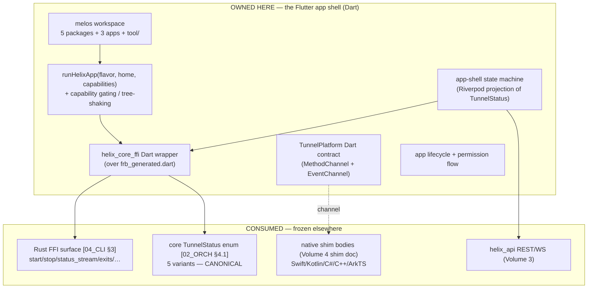
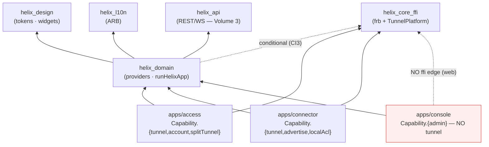
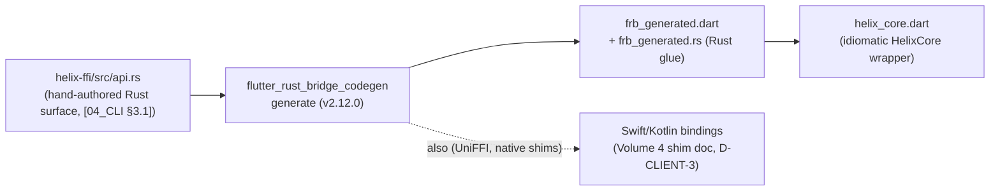
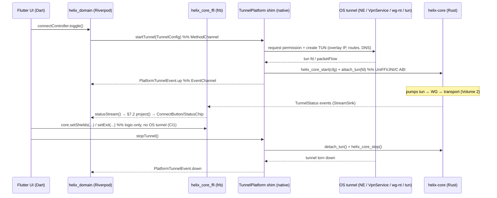
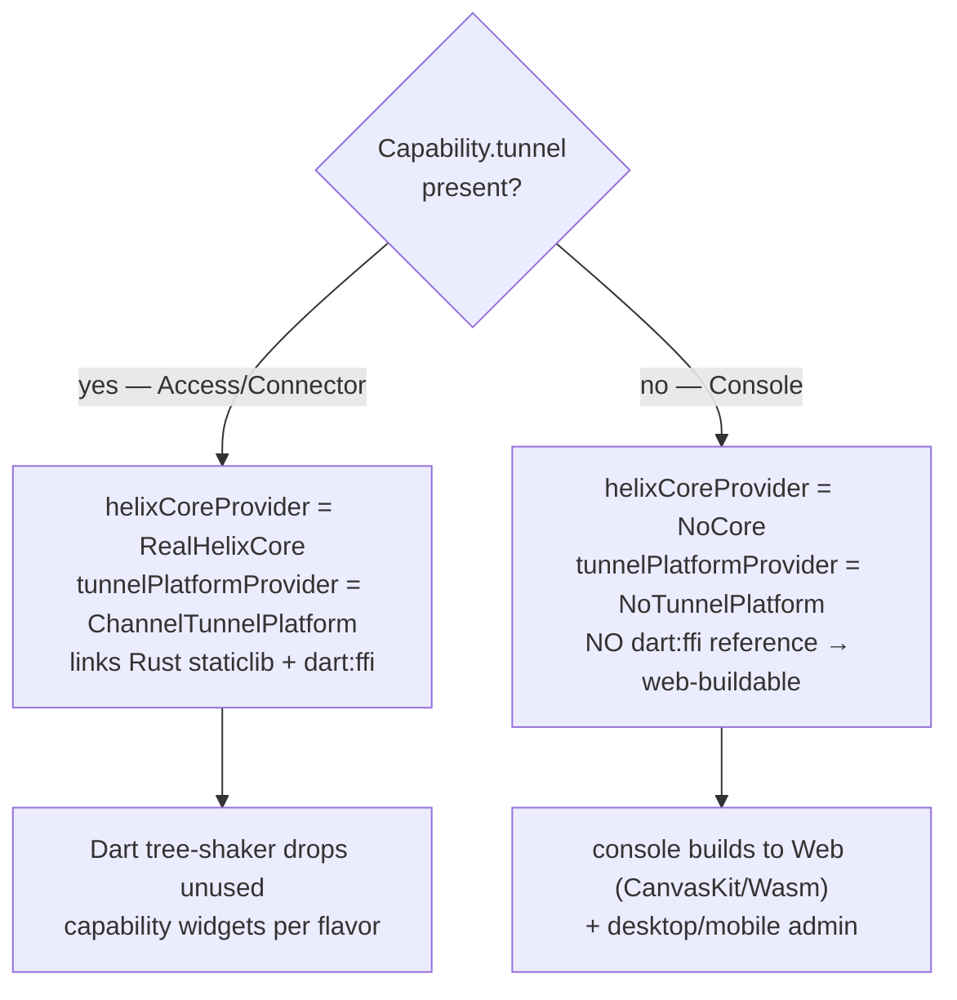
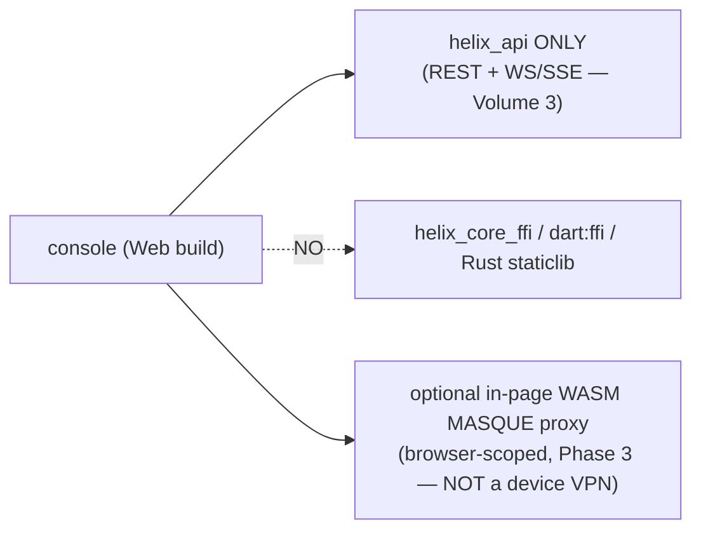
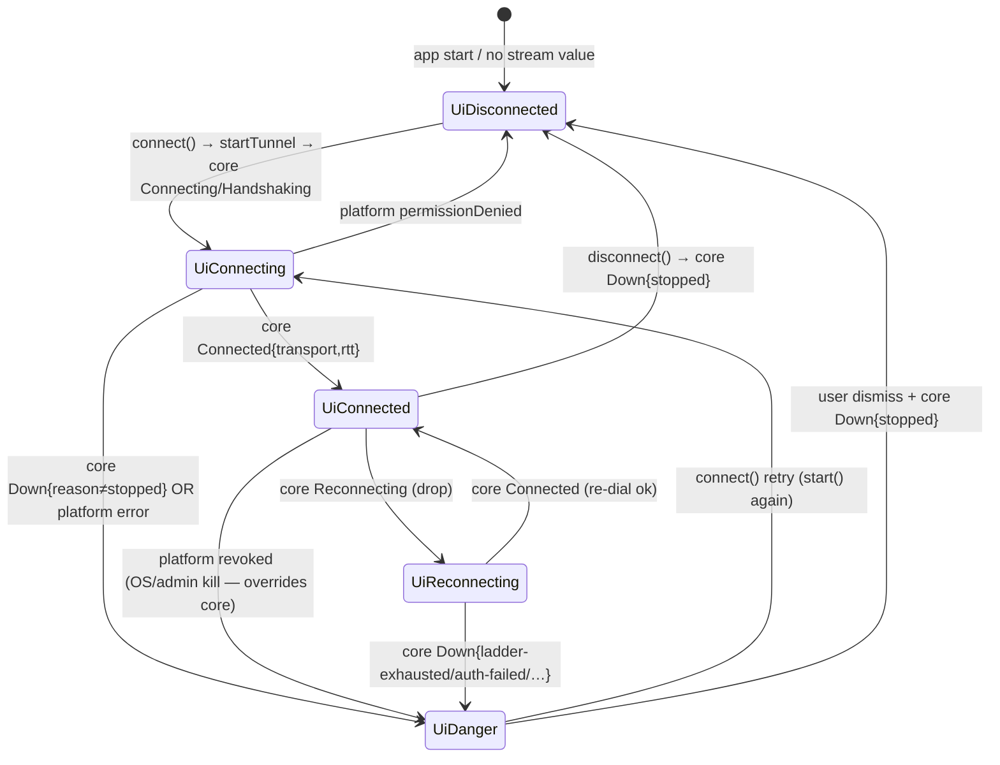
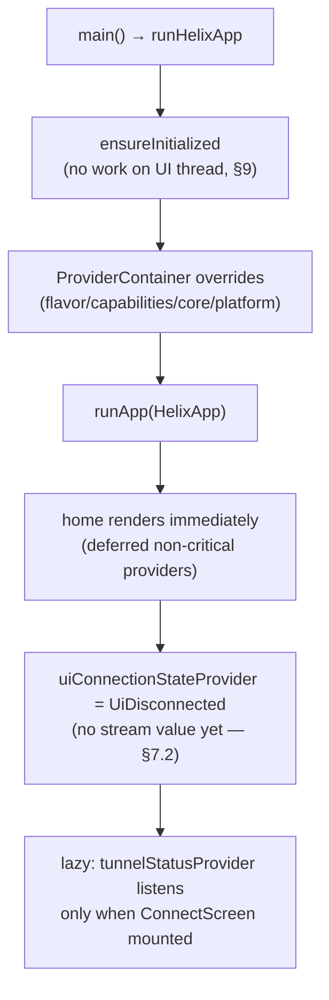

# helix-ui (Flutter app shell)

**Revision:** 1
**Last modified:** 2026-06-25T00:00:00Z

> Master technical specification — Volume 4 (Clients), nano-detail deep-dive.
> This document **deepens** the *Flutter `helix-ui` codebase* part of the pass-1
> client overview [04_CLI §1/§2/§6/§8] into an implementation-ready specification
> of the **app shell**: the `melos` monorepo (its five packages + three apps), the
> `runHelixApp(flavor, home, capabilities)` wiring point, capability-gating /
> tree-shaking, the Dart-facing FFI wrapper, the `TunnelPlatform` MethodChannel +
> EventChannel contract, the Riverpod app-shell state machine, app lifecycle
> (foreground/background/permission), and the test points tied to the §11.4.169
> closed test-type vocabulary. SPEC-ONLY: it describes **what to build**, not the
> shipping product.
>
> **Boundary with sibling docs.** This document **consumes** (a) the *exported*
> Rust FFI surface owned by the pass-1 client doc [04_CLI §3] — `start`/`stop`/
> `status_stream`/`exits`/`set_exit`/`set_shields`/`advertise`/`attach_tun`; and
> (b) the **core-emitted `TunnelStatus` enum** owned by Volume 2's
> orchestrator [02_ORCH §4.1]. It **owns** everything Dart-side from the generated
> bindings upward: the package graph, the wiring, the flavor/capability model, the
> Dart-side `TunnelPlatform` impls' contract, the UI state projection, and app
> lifecycle. It does **not** own the Rust internals (Volume 1/2), the per-platform
> *native* shim bodies (Volume 4 shim doc — it owns only the Dart side of the
> channel), nor the control-plane wire (Volume 3).
>
> **Evidence base.** Citations inline by id: `[04_CLI §N]` =
> `final/03-client-core-and-ui.md` (the pass-1 overview this deepens); `[04_UI]` =
> `04_VPN_CLD/HelixVPN-helix-ui-Flutter.md`; `[04_ARCH §N]` =
> `04_VPN_CLD/HelixVPN-Architecture-Refined.md`; `[04_P0 §N]` = `…Phase0-Spike.md`;
> `[02_ORCH §N]` = `final/v02-data-plane/orchestrator-and-state.md` (canonical
> `TunnelStatus`); `[02_TX §N]` = `final/v02-data-plane/transport-trait.md`;
> `[research-flutter_ffi]` = `v09-research/research-flutter_ffi.md`;
> `[research-ios_android]` = the per-platform shim research; `[SYN §N]` =
> cross-document synthesis; `[05_YBO]` = operator mandate. Any claim not grounded
> in the evidence base is tagged `UNVERIFIED` per constitution §11.4.6 — never
> fabricated.

---

## Table of contents

- [0. Position, ownership, and invariants](#0-position-ownership-and-invariants)
- [1. The `melos` monorepo (`helix-ui/`)](#1-the-melos-monorepo-helix-ui)
- [2. The five packages — public surfaces](#2-the-five-packages--public-surfaces)
- [3. The Dart FFI surface (`helix_core_ffi`)](#3-the-dart-ffi-surface-helix_core_ffi)
- [4. The `TunnelPlatform` channel contract (Dart side)](#4-the-tunnelplatform-channel-contract-dart-side)
- [5. `runHelixApp` + capability gating + tree-shaking](#5-runhelixapp--capability-gating--tree-shaking)
- [6. Which flavor builds to Web (Console only, no core_ffi)](#6-which-flavor-builds-to-web-console-only-no-core_ffi)
- [7. The app-shell state machine (Riverpod)](#7-the-app-shell-state-machine-riverpod)
- [8. App lifecycle, permission flow, edge cases](#8-app-lifecycle-permission-flow-edge-cases)
- [9. Size / memory / startup budgets (app-shell scope)](#9-size--memory--startup-budgets-app-shell-scope)
- [10. Error handling taxonomy (Dart side)](#10-error-handling-taxonomy-dart-side)
- [11. Test points — tied to §11.4.169](#11-test-points--tied-to-1141169)
- [12. Phase → task → subtask plan (app shell)](#12-phase--task--subtask-plan-app-shell)
- [13. Open decisions surfaced by this document](#13-open-decisions-surfaced-by-this-document)
- [14. Cross-document contracts this document fixes](#14-cross-document-contracts-this-document-fixes)
- [Sources verified](#sources-verified)

---

## 0. Position, ownership, and invariants

### 0.1 What this document owns



This document owns six Dart-side contracts and nothing else:

| # | Contract | Owned here | Consumed from |
|---|---|---|---|
| A1 | **`melos` workspace shape** — the five packages, three apps, their pubspec dependency graph, the codegen/`tool/` scripts | §1–§2 | — |
| A2 | **Dart FFI wrapper** — the idiomatic `HelixCore` abstract class over `frb_generated.dart`; the Dart `TunnelStatus` mirror (kept byte-consistent with [02_ORCH §4.1]) | §3 | Rust surface [04_CLI §3]; `TunnelStatus` [02_ORCH §4.1] |
| A3 | **`TunnelPlatform` channel contract (Dart side)** — the `MethodChannel("helixvpn/tunnel")` + `EventChannel("helixvpn/tunnel/events")` method names, argument codecs, `TunnelConfig`/`PlatformTunnelEvent` serialization | §4 | native shim bodies (Volume 4 shim doc) |
| A4 | **Flavor + capability model** — `runHelixApp`, `HelixFlavor`, `Capability`, `NoCore` null impl, the tree-shake mechanism | §5–§6 | — |
| A5 | **App-shell state machine** — `UiConnectionState` projection of the core `TunnelStatus`; the `ConnectController` AsyncNotifier; the "UI is a pure function of the status stream" rule | §7 | `helix_api` (Volume 3) |
| A6 | **App lifecycle + permission flow** — `AppLifecycleState` handling, the permission state machine, web-no-core path | §8 | OS lifecycle APIs |

### 0.2 Non-negotiable invariants (inherited + tightened)

| # | Invariant | Source | App-shell tightening |
|---|---|---|---|
| CI1 | `helix_core_ffi` owns logic + status; it does **NOT** own the OS tunnel lifecycle — that is the `TunnelPlatform` shim. | [04_CLI CI1] | §3 wrapper exposes no "create TUN" verb; only `attachTun(fd)` (called *by* the shim). §4. |
| CI2 | **The UI is a pure function of the core's status stream.** No polling. | [04_CLI CI2, 04_UI §4.2] | §7: the only writer of `UiConnectionState` is the `tunnelStatusProvider` fold; widgets `watch`, never `read`-and-poll. |
| CI3 | **Console builds to Web; Access/Connector do not.** Console depends on `helix_api` *only* — no `helix_core_ffi`, no `dart:ffi`. | [04_CLI CI3, 04_ARCH §5.7] | §5–§6: capability gating + conditional imports make `dart:ffi` unreachable on the Console/Web build. |
| CI5 | **State must be announced, not just colored.** | [04_CLI CI5, 04_UI §9] | §7.4: every `UiConnectionState` carries a `semanticLabel`; the `ConnectButton` `Semantics` reads it. |
| **AS-I7** | **One core `TunnelStatus` enum on the wire (5 variants).** The Dart frb mirror MUST match [02_ORCH §4.1] byte-for-byte; any richer UI state (`disconnected`, `danger`, `path`) is a **Dart-side projection** computed in §7.2, never a fabricated extra wire variant. | derived from [02_ORCH §4.1] + §11.4.6 | §3.3, §7.2. |
| **AS-I8** | **Native ⇄ Dart channel is the only untyped seam** and is covered by a per-OS real-device smoke (never a mock-claiming-PASS). | [04_CLI O5, §11.4.27] | §4.1 O1–O6; §11 `IT`/`SC`/`MEM`. |
| **AS-I9** | **Capability absent ⇒ code tree-shaken out.** A flavor that lacks `Capability.tunnel` MUST NOT link the Rust staticlib (so Console reaches Web). | [04_UI §2/§8] | §5.3, §6 (the conditional-import mechanism, not a runtime `if`). |

### 0.3 The reconciliation this document fixes (TunnelStatus)

The pass-1 overview [04_CLI §3.1] sketched a **7-variant** client mirror that added
`Disconnected`, a `path` field on `Connected`, and `Danger{kind}`. Volume 2's
orchestrator [02_ORCH §4.1] — the code that actually *emits* the stream — froze the
enum at **5 variants** (`Connecting | Handshaking | Connected{transport,rtt_ms} |
Reconnecting | Down{reason}`). Per AS-I7 and §11.4.6, this document resolves the
divergence:

- **The frb mirror IS the 5-variant core enum** (§3.3) — byte-for-byte, asserted by
  the FFI contract test (§11 `UT`).
- **`disconnected` and `danger` are Dart-side derived UI states** (§7.2): a pure
  `project(AsyncValue<TunnelStatus>) -> UiConnectionState` function. `disconnected`
  is the synthetic pre-stream / post-`Down{reason:"stopped"}` state; `danger` is
  derived by **classifying `Down.reason`** against the closed vocabulary of
  [02_ORCH §4.4] (`auth-failed`/`ladder-exhausted`/`host-fatal`/`no-route`/
  `pinned-transport-failed` ⇒ danger; `stopped` ⇒ neutral disconnected).
- **`path` (direct vs relay) is a proposed Phase-2 core extension**, NOT present in
  the v1 mirror — surfaced as decision **D-UI-3** (§13), `UNVERIFIED` until the core
  adds it; the `StatusChip` renders `path` only when present.

This keeps the wire enum consistent with [02_ORCH §4.1] while still delivering the
overview's UX (CI5, the red-on-danger palette).

---

## 1. The `melos` monorepo (`helix-ui/`)

`helix-ui/` is a `melos`-managed multi-package Dart workspace [04_UI §1, 04_CLI §2].
Decoupling per §11.4.28/§11.4.74: `helix_design`, `helix_core_ffi`, `helix_api`, and
`helix_l10n` are independently publishable / reusable; project-specific glue lives
only in `helix_domain` and the three `apps/`.

### 1.1 Tree layout

```
helix-ui/
├── melos.yaml                       # workspace task runner (bootstrap/version/run-everywhere)
├── pubspec.yaml                     # workspace root (dev_dependencies: melos)
├── packages/
│   ├── helix_design/                # tokens · theme · widgets · icons · motion  → reusable
│   ├── helix_core_ffi/              # frb bindings to helix-core (Access/Connector only)
│   │   ├── lib/
│   │   │   ├── frb_generated.dart    # GENERATED — do not hand-edit
│   │   │   ├── helix_core.dart       # idiomatic wrapper over the generated API (§3)
│   │   │   ├── tunnel_platform.dart  # TunnelPlatform channel contract (§4)
│   │   │   └── src/no_core.dart       # NoCore null impl (Console/web; §5.2)
│   │   └── rust/ -> ../../../helix-core/crates/helix-ffi   # symlink to the Rust FFI crate
│   ├── helix_api/                   # generated OpenAPI REST client + WS/SSE client (all apps)
│   ├── helix_domain/                # models, Riverpod providers, use-cases, runHelixApp() (§5)
│   └── helix_l10n/                  # ARB localization (en, ru, zh-Hans, …)
├── apps/
│   ├── access/      lib/main_access.dart   + ios/ macos/ android/ windows/ linux/ ohos/ aurora/
│   ├── connector/   lib/main_connector.dart + lib/main_connector_headless.dart (no UI)
│   └── console/     lib/main_console.dart    (the ONLY flavor that builds to Web)
└── tool/                            # codegen scripts (frb, openapi, intl) + drift checks
```

### 1.2 Package dependency graph (the decoupling contract)



**The load-bearing edges**: `helix_domain` depends on `helix_core_ffi` only through a
**conditional import** (§6.1), so the Console app — which never adds the `ffi`
dependency to its `pubspec.yaml` — pulls in the `NoCore` stub instead and never links
`dart:ffi` / the Rust staticlib (CI3, AS-I9). Every other package edge is unconditional.

### 1.3 `melos.yaml` (workspace scripts)

```yaml
# helix-ui/melos.yaml
name: helix_ui
packages:
  - packages/**
  - apps/**
command:
  bootstrap:
    runPubGetInParallel: true
scripts:
  analyze:   { exec: "dart analyze --fatal-infos", concurrency: 6 }
  test:      { exec: "flutter test", packageFilters: { dirExists: test } }
  gen:                # codegen — run on any Rust-API / OpenAPI / ARB change
    run: |
      dart run tool/frb_generate.dart        # flutter_rust_bridge_codegen generate
      dart run tool/openapi_generate.dart     # OpenAPI -> helix_api/lib/rest_generated.dart
      flutter gen-l10n --arb-dir packages/helix_l10n/lib/arb
  gen-check:          # CI/pre-tag drift gate (§11 UT): regenerate, fail if `git diff` non-empty
    run: "melos run gen && git diff --exit-code"
```

`melos run gen-check` is the **no-drift guarantee** [04_UI §11, 04_ARCH §4.2]: a Rust
FFI-surface change that is not regenerated, or an OpenAPI change the Dart client lags,
is a build-blocking finding — the apps can never silently diverge from the core or the
control plane (§11.4.156: this runs in the local pre-tag sweep, not a hosted runner).

### 1.4 Versioning & per-package pins (research-pinned)

| Package | Key dep | Pinned version | Source |
|---|---|---|---|
| `helix_core_ffi` | `flutter_rust_bridge` | **2.12.0** (Dart dep == bridge-crate version) | [research-flutter_ffi §1/§7] |
| `helix_domain` | `flutter_riverpod` | **3.3.2** (Riverpod 3.x line) | [research-flutter_ffi §6] |
| `helix_design` | Flutter SDK | mainline (Material 3) | [04_UI §3] |
| `apps/access` (ohos) | OpenHarmony SIG fork | **pin per fork** (lags mainline) | [research-flutter_ffi §5] |
| `apps/access` (aurora) | OMP fork `flutter-aurora` | **pin per fork** | [research-flutter_ffi §4] |

> **Pin discipline (§11.4.6).** The frb Dart-dep version MUST equal the bridge-crate
> version or codegen output mismatches at runtime [research-flutter_ffi §1]. The two
> forked targets pin a *specific* fork commit (HarmonyOS/Aurora lag mainline Flutter)
> and build on **isolated local runners** so a fork lag never blocks a mainline
> release (§12 Phase 3, [04_UI §6.1]).

---

## 2. The five packages — public surfaces

### 2.1 `helix_design` (tokens · theme · widgets)

Reusable, project-agnostic. Owns the connection-state palette mapped to the core
`TunnelStatus` and the signature components [04_CLI §7].

```dart
// helix_design/lib/tokens.dart
class HelixTokens {
  static const stateDisconnected = Color(0xFF6B7280); // neutral grey
  static const stateConnecting   = Color(0xFFF59E0B); // amber, in-motion
  static const stateConnected    = Color(0xFF10B981); // green, safe
  static const stateDanger       = Color(0xFFEF4444); // red
  static const brandSeed         = Color(0xFF3B5BDB); // drives M3 ColorScheme, per-role override
  // spacing 4-base {4,8,12,16,24,32,48}; radius {sm8,md12,lg20,pill999};
  // motion {fast120,base220,slow360}; elevation 0..3 (flat, color-as-hierarchy).
}

// helix_design/lib/theme.dart — the state→color map the whole app reads (consumes §7.2 UiConnectionState)
extension HelixThemeX on BuildContext {
  Color colorForUiState(UiConnectionState s) => switch (s) {
    UiDisconnected() => HelixTokens.stateDisconnected,
    UiConnecting()   => HelixTokens.stateConnecting,
    UiConnected()    => HelixTokens.stateConnected,
    UiReconnecting() => HelixTokens.stateConnecting,
    UiDanger()       => HelixTokens.stateDanger,
  };
}
```

Public widget surface (consumed by `helix_domain`/apps): `ConnectButton`, `StatusChip`,
`ExitPicker`, `ShieldIndicator`, `NetworkTile`, `PolicyEditor`, `AdaptiveScaffold`
[04_CLI §7.2]. `AdaptiveScaffold` branches on **width**, never `Platform.isX` (CI3
corollary — a resized desktop window behaves like a phone; web "just works")
[04_UI §7]. `helix_design` depends on no other Helix package (pure design system).

### 2.2 `helix_core_ffi` (frb + TunnelPlatform)

Owns the generated bindings + the idiomatic wrapper + the `TunnelPlatform` Dart
contract + the `NoCore` null impl. Detailed in §3–§4. Depends only on `flutter` +
`flutter_rust_bridge` + `helix_l10n` (for error strings). **The only package that
references `dart:ffi`** — gated behind a conditional import so it is unreachable on web
(§6.1).

### 2.3 `helix_api` (REST/WS — Volume 3 client)

Generated OpenAPI Dart client (`rest_generated.dart`) + a hand-written WS/SSE client
(`ws_client.dart`) for the control-plane event stream (`device.online`,
`route.changed`, `policy.compiled`, `device.revoked`) [04_CLI §8.3]. Same generated
model types are used by the test fakes (§11 `UT`). Depends on no Helix package
(pure transport client). **This is the *only* dependency the Console/Web build needs**
(CI3).

### 2.4 `helix_domain` (providers · use-cases · `runHelixApp`)

The project-specific glue: Riverpod providers (`tunnelStatusProvider`,
`connectControllerProvider`, `flavorProvider`, `capabilitiesProvider`,
`helixCoreProvider`, `tunnelPlatformProvider`), use-cases, models, and the
`runHelixApp` wiring (§5). Depends on `helix_design`, `helix_l10n`, `helix_api`, and —
**conditionally** — `helix_core_ffi`.

### 2.5 `helix_l10n` (ARB localization)

Flutter `intl`/ARB. First-tier locales: **en** (baseline), **ru** (Aurora market),
**zh-Hans** (HarmonyOS market); RTL-ready [04_UI §9]. Censorship-region users are core
users, so clear localized connection state matters most here. Generated via
`flutter gen-l10n` (wired into `melos run gen`, §1.3). Depends on nothing.

---

## 3. The Dart FFI surface (`helix_core_ffi`)

### 3.1 The generation pipeline (`research-flutter_ffi`)



**flutter_rust_bridge v2.12.0** [research-flutter_ffi §1/§7] is a *codegen* binding
generator: it reads the annotated Rust `helix-ffi` crate and emits the Dart FFI glue +
a Rust wrapper. v2 supports `async fn`, opaque `RustOpaque` handles, and — load-bearing
for this VPN core — **`StreamSink<T>` → Dart `Stream<T>`** for the status channel
(frb issue #347, solved) [research-flutter_ffi §1]. UniFFI is used *additionally* for
the native shims where a platform extension links the core directly (Swift/Kotlin) —
`uniffi-dart` itself is not production-ready, so frb owns the Dart side and UniFFI owns
only the native-shim side (decision D-CLIENT-3) [research-flutter_ffi §2].

### 3.2 The Dart-facing wrapper (`helix_core.dart`)

frb mirrors every `#[frb(mirror)]` Rust type into an identical Dart type — the Dart
`TunnelStatus`/`Shields`/`ExitOption` are the *generated* mirrors, never hand-written
parallels. The wrapper adds ergonomics only [04_CLI §3.2]:

```dart
// helix_core_ffi/lib/helix_core.dart — idiomatic facade over frb_generated.dart
abstract interface class HelixCore {
  /// Logic-only start (NOT the OS tunnel; the shim owns that — CI1).
  Future<void> start({required String transport, String? mapPathOrSession,
                      CoreMode mode = CoreMode.client});
  Future<void> stop();

  /// frb StreamSink<TunnelStatus> → broadcast Dart Stream (NO polling — CI2).
  Stream<TunnelStatus> statusStream();

  Future<List<ExitOption>> exits();
  Future<void> setExit(String id, {List<String>? multiHopChain});
  Future<void> setShields(Shields s);

  // connector mode:
  Future<AdvertiseResult> advertise(List<String> cidrs);

  // shim handoff — called BY the TunnelPlatform shim (§4), NOT by UI widgets:
  Future<void> attachTun(int fd);
  Future<void> detachTun();
}

/// The real, frb-backed impl (Access/Connector). Wraps frb_generated.dart calls.
final class RealHelixCore implements HelixCore { /* delegates to frb generated API */ }
```

The happy path a client app drives (mirrors the Phase-0 G5 demo [04_P0 §9]):

```dart
await core.start(transport: 'auto', mapPathOrSession: session.token);
core.statusStream().listen(uiFold);  // Riverpod fold, §7.1
// …later:
await core.stop();
```

### 3.3 The `TunnelStatus` Dart mirror (canonical — AS-I7)

The frb mirror MUST equal [02_ORCH §4.1] byte-for-byte. frb renders a Rust enum with
data variants as a Dart **sealed class** hierarchy:

```dart
// helix_core_ffi/lib/frb_generated.dart (GENERATED — shown for the contract; do not hand-edit)
sealed class TunnelStatus {
  const TunnelStatus();
}
final class Connecting  extends TunnelStatus { const Connecting(); }
final class Handshaking extends TunnelStatus { const Handshaking(); }
final class Connected   extends TunnelStatus {
  final String transport;  // Transport::kind() e.g. "plain-udp" | "masque-h3" [02_TX §2]
  final int    rttMs;      // WG-handshake RTT EWMA (u32 → Dart int)
  const Connected({required this.transport, required this.rttMs});
}
final class Reconnecting extends TunnelStatus { const Reconnecting(); }
final class Down extends TunnelStatus {
  final String reason;     // stable-prefix vocabulary [02_ORCH §4.4]
  const Down({required this.reason});
}
```

> **Consistency assertion (§11 `UT` — the FFI contract test).** A shared fixture
> corpus of `(Rust TunnelStatus value, expected Dart value)` pairs proves the mirror
> matches the Rust source byte-for-byte; a drift FAILs the build (§1.3 `gen-check`).
> The mirror has **exactly five** variants — no `Disconnected`, no `Danger`, no `path`
> on the wire (AS-I7). Those are derived in §7.2.

### 3.4 The remaining mirrored types

```dart
// GENERATED mirrors of [04_CLI §3.1] (#[frb(mirror)] Rust types):
enum CoreMode { client, connector }

final class Shields {
  final bool killSwitch, dnsProtection, daita, postQuantum;
  final List<String> splitTunnel;  // per-route bypass; per-app handled in the shim layer
  const Shields({required this.killSwitch, required this.dnsProtection,
    required this.daita, required this.postQuantum, this.splitTunnel = const []});
}
final class ExitOption {
  final String id, kind, label;      // kind = "privacy_exit" | "network"
  final String? country, jurisdiction;
  final int? rttMs;
  const ExitOption({required this.id, required this.kind, required this.label,
    this.country, this.jurisdiction, this.rttMs});
}
final class AdvertiseResult { final List<String> accepted, conflicts;
  const AdvertiseResult({required this.accepted, required this.conflicts}); }
```

### 3.5 Stream resource discipline (Riverpod 3.x)

The frb `Stream<TunnelStatus>` is wrapped in a `StreamProvider.autoDispose` (§7.1) so
the underlying Rust `StreamSink` subscription is torn down when no UI listens
[research-flutter_ffi §6]. **Riverpod 3.0 caveat**: `StreamProvider` *pauses* its
`StreamSubscription` when not actively listened — relevant because a paused subscription
means the Rust side may stop being polled. For the *foreground connected* screen this is
correct (always listened); for a backgrounded app the pause is desirable (§8.3). The
provider is `autoDispose` so a non-autoDispose "almost never destroyed" leak is avoided
[research-flutter_ffi §6].

---

## 4. The `TunnelPlatform` channel contract (Dart side)

Every native shim implements **one contract** and does **only three things**: configure
the OS tunnel, hand packets to/from `helix-core`, and report lifecycle [04_CLI §4]. This
document owns the **Dart side** of that channel (the abstract class + the codec); the
native bodies (Swift/Kotlin/C#/C++/ArkTS) are Volume 4's shim doc.

```dart
// helix_core_ffi/lib/tunnel_platform.dart
// One MethodChannel ("helixvpn/tunnel") + one EventChannel ("helixvpn/tunnel/events").
abstract interface class TunnelPlatform {
  /// OS asks permission, creates the TUN, links the core, starts the pump.
  Future<void> startTunnel(TunnelConfig cfg);
  /// Tear down: detach core, destroy TUN, release permission hold (O4).
  Future<void> stopTunnel();
  /// Lifecycle ONLY — NOT data. up/down/permissionDenied/revoked/error.
  Stream<PlatformTunnelEvent> events();
}

final class TunnelConfig {
  final String overlayIp;              // e.g. 100.64.0.7/32 (or fd7a:…/128 v6 overlay)
  final List<String> routes;           // AllowedIPs the OS should send into the tunnel
  final List<String> dnsServers;       // tunnel DNS (kill plaintext :53 off-tunnel)
  final List<String> splitExcludeApps; // Android/desktop per-app bypass (platform-handled)
  final int mtu;                       // negotiated; 1280 over MASQUE, 1420 plain WG [02_TX §4.8]
  final String sessionOrMapToken;      // handed straight to helix_core_start
  const TunnelConfig({required this.overlayIp, required this.routes,
    required this.dnsServers, this.splitExcludeApps = const [], this.mtu = 1280,
    required this.sessionOrMapToken});
}

enum PlatformTunnelEventKind { up, down, permissionDenied, revoked, error }
final class PlatformTunnelEvent {
  final PlatformTunnelEventKind kind;
  final String? detail;                // honest reason on error/revoked (§11.4.6: no guessing)
  const PlatformTunnelEvent(this.kind, [this.detail]);
}
```

### 4.1 Contract obligations (every shim MUST satisfy)

| # | Obligation | Why |
|---|---|---|
| O1 | `startTunnel` is **idempotent + permission-aware**: an OS VPN-permission denial emits `permissionDenied` (not `error`) and leaves no half-open TUN (§11.4.14). | clean UX, no leaks |
| O2 | The shim **hands the core a packet fd / pump**; it never crypto/obfuscates. `helix-core` is the only place WG + transport live [02_TX I4]. | one core, no fork |
| O3 | `events()` emits `revoked` when the OS (or admin via `device.revoked`, Volume 3) kills the tunnel out-of-band — the UI must reflect it, never claim "connected". | CI2 honesty |
| O4 | `stopTunnel` restores the OS to a quiescent state (no orphan routes, no leaked DNS, kill-switch rules removed) on **every** exit path. | §11.4.14 |
| O5 | The shim is the **only untyped seam** (native ⇄ Dart) — covered by a per-OS real-device smoke, never a mock-claiming-PASS (AS-I8). | §11.4.27 |
| O6 | The `EventChannel` stream is **at-least-once + idempotent**: a duplicate `up`/`down` is collapsed by the UI fold (§7.3); a torn re-listen after backgrounding re-emits the latest event. | §8.3 robustness |

### 4.2 Channel wire (method names + argument codec)

The `MethodChannel` uses the **`StandardMethodCodec`** (default), so `TunnelConfig` is
marshalled as a `Map<String, Object?>`:

| Direction | Channel | Method / event | Payload |
|---|---|---|---|
| Dart → native | `helixvpn/tunnel` | `startTunnel` | `{overlayIp, routes:[…], dnsServers:[…], splitExcludeApps:[…], mtu, sessionOrMapToken}` |
| Dart → native | `helixvpn/tunnel` | `stopTunnel` | `null` |
| native → Dart | `helixvpn/tunnel/events` | (stream) | `{kind:"up"\|"down"\|"permissionDenied"\|"revoked"\|"error", detail?}` |

```dart
// helix_core_ffi/lib/src/channel_tunnel_platform.dart — the default MethodChannel impl
final class ChannelTunnelPlatform implements TunnelPlatform {
  static const _m = MethodChannel('helixvpn/tunnel');
  static const _e = EventChannel('helixvpn/tunnel/events');

  @override
  Future<void> startTunnel(TunnelConfig c) => _m.invokeMethod('startTunnel', {
        'overlayIp': c.overlayIp, 'routes': c.routes, 'dnsServers': c.dnsServers,
        'splitExcludeApps': c.splitExcludeApps, 'mtu': c.mtu,
        'sessionOrMapToken': c.sessionOrMapToken,
      });

  @override
  Future<void> stopTunnel() => _m.invokeMethod('stopTunnel');

  @override
  Stream<PlatformTunnelEvent> events() => _e
      .receiveBroadcastStream()
      .map((m) => PlatformTunnelEvent(
            PlatformTunnelEventKind.values.byName((m as Map)['kind'] as String),
            m['detail'] as String?,
          ));
}
```

### 4.3 The FFI ⇄ shim seam (the bug-preventing division of labor)



The seam: **lifecycle commands flow UI → shim → core** (the OS owns the tunnel
process), while **status events flow core → FFI → UI** (the core owns truth about
protection state). `setShields`/`setExit`/`exits` are pure logic and go straight
UI → FFI without touching the OS tunnel (CI1). This is precisely the boundary that
prevents "UI says connected while the OS tunnel is down": the UI believes only the
core's `statusStream`, never its own intent (CI2; §7.5).

### 4.4 Native-shim signatures (the verbs the channel marshals to)

The Dart channel marshals to these per-platform entry points (bodies = Volume 4 shim
doc; signatures fixed here so the Dart codec is implementable) [04_CLI §5,
research-ios_android]:

```swift
// iOS/macOS — apps/access/ios/HelixTunnel/PacketTunnelProvider.swift (Swift)
final class PacketTunnelProvider: NEPacketTunnelProvider {
  override func startTunnel(options: [String:NSObject]?, completionHandler: @escaping (Error?) -> Void)
  override func stopTunnel(with reason: NEProviderStopReason, completionHandler: @escaping () -> Void)
}
// core entry (UniFFI/cbindgen): helix_core_start(_ token: String, _ mode: CoreMode)
//                               helix_core_attach_tun(_ fd: Int32); helix_core_stop()
```

```kotlin
// Android — apps/access/android/.../HelixVpnService.kt (Kotlin)
class HelixVpnService : VpnService() {
  private external fun coreStart(sessionToken: String, fd: Int)   // JNI → helix-core .so
  private external fun coreStop()
  override fun onStartCommand(intent: Intent?, flags: Int, startId: Int): Int  // establish() → fd → coreStart
  override fun onRevoke()   // O3: OS killed us → emit revoked
  override fun onDestroy()  // O4: coreStop + stopForeground
}
```

```cpp
// Aurora — apps/access/aurora/helix_tunnel_backend.cpp (C++; Qt/C++ backend)
extern "C" {
  int  helix_core_start(const char* token, int mode);   // C ABI into the Rust cdylib
  int  helix_core_attach_tun(int fd);
  void helix_core_stop(void);
}
class HelixTunnelBackend { /* opens tun, calls helix_core_attach_tun(fd), bridges via Friflex plugin */ };
```

```typescript
// HarmonyOS NEXT — apps/access/ohos/.../HelixVpnAbility.ets (ArkTS → NAPI)
// ArkTS VpnExtensionAbility; NAPI bridges to the Rust .so; MethodChannel bridges ArkTS↔Flutter.
import vpnExtension from '@ohos.net.vpnExtension';
// native (N-API): helixCoreStart(token: string, mode: number): void; helixCoreAttachTun(fd: number): void;
```

```csharp
// Windows — HelixTunnelSvc (C#, SYSTEM service) + Rust core in-service.
// Flutter side is a TunnelPlatform impl marshalling startTunnel/stopTunnel/events over a NAMED PIPE
// (\\.\pipe\helixvpn) — the Dart channel impl is WindowsPipeTunnelPlatform, not the default MethodChannel.
```

> **Windows / Web are the two non-default Dart impls.** Windows uses a named-pipe
> `WindowsPipeTunnelPlatform` (the Flutter app is unprivileged; the SYSTEM service hosts
> the core) [04_CLI §5.3]. Web uses `NoTunnelPlatform` (throws if invoked — Console
> never tunnels, CI3, §6.2). Every other platform uses the default
> `ChannelTunnelPlatform` (§4.2). The impl is selected in `runHelixApp` (§5.2).

---

## 5. `runHelixApp` + capability gating + tree-shaking

### 5.1 The three entrypoints (one tree, three flavors)

```dart
// apps/access/lib/main_access.dart
void main() => runHelixApp(
  flavor: HelixFlavor.access,
  home: const ConnectScreen(),
  capabilities: const {Capability.tunnel, Capability.account, Capability.splitTunnel},
);

// apps/connector/lib/main_connector.dart
void main() => runHelixApp(
  flavor: HelixFlavor.connector,
  home: const ConnectorDashboard(),
  capabilities: const {Capability.tunnel, Capability.advertise, Capability.localAcl},
);

// apps/console/lib/main_console.dart  — the ONLY flavor that builds to Web
void main() => runHelixApp(
  flavor: HelixFlavor.console,
  home: const ConsoleShell(),
  capabilities: const {Capability.admin},   // NO Capability.tunnel → no core_ffi linked (CI3)
);
```

### 5.2 The wiring point (`helix_domain/lib/run_helix_app.dart`)

```dart
enum HelixFlavor { access, connector, console }
enum Capability { tunnel, account, splitTunnel, advertise, localAcl, admin }

Future<void> runHelixApp({
  required HelixFlavor flavor,
  required Widget home,
  required Set<Capability> capabilities,
}) async {
  WidgetsFlutterBinding.ensureInitialized();
  final container = ProviderContainer(overrides: [
    flavorProvider.overrideWithValue(flavor),
    capabilitiesProvider.overrideWithValue(capabilities),
    // Capability.tunnel ⇒ a real frb-backed core; else the NoCore stub (Console/web):
    helixCoreProvider.overrideWith((ref) =>
      capabilities.contains(Capability.tunnel) ? makeRealHelixCore() : const NoCore()),
    // platform impl selected once, here:
    tunnelPlatformProvider.overrideWith((ref) =>
      capabilities.contains(Capability.tunnel) ? makeTunnelPlatform() : const NoTunnelPlatform()),
  ]);
  runApp(UncontrolledProviderScope(
    container: container,
    child: HelixApp(home: home, theme: helixTheme(flavor)),  // theme per role (§2.1)
  ));
}
```

`makeRealHelixCore()` and `makeTunnelPlatform()` are resolved through the **conditional
import** of §6.1, so on the Console/Web build they resolve to the `NoCore`/
`NoTunnelPlatform` stubs and `dart:ffi` / the Rust staticlib is never referenced (CI3,
AS-I9).

```dart
// helix_core_ffi/lib/src/no_core.dart — the null impl (Console/web)
final class NoCore implements HelixCore {
  const NoCore();
  @override Stream<TunnelStatus> statusStream() => const Stream.empty();
  @override Future<void> start({...}) async => throw const UnsupportedTunnelError();
  // every tunnel verb throws UnsupportedTunnelError; exits()/advertise() likewise.
}
```

### 5.3 Capability → compiled-in map (the tree-shake table)

| Capability | Compiles in | In flavor |
|---|---|---|
| `tunnel` | `helix_core_ffi`, `TunnelPlatform` shim, `ConnectButton`, `ShieldIndicator`, `StatusChip` | Access, Connector |
| `account` | account screen, OIDC + anonymous device-token enrollment, QR enroll | Access |
| `splitTunnel` | per-app/per-route bypass UI | Access |
| `advertise` | CIDR advertise UI, overlapping-CIDR conflict surface | Connector |
| `localAcl` | site-local restriction editor | Connector |
| `admin` | tenants/devices/networks/policy/audit/topology + `helix_api` heavy tables | Console |



> **Why it tree-shakes (mechanism, not a runtime `if`).** The Console app's
> `pubspec.yaml` does **not** declare a dependency on `helix_core_ffi`; the conditional
> import (§6.1) resolves the `makeRealHelixCore`/`makeTunnelPlatform` symbols to the
> stub library at compile time. Dart's AOT tree-shaker then has no reachable reference
> to `dart:ffi` or the staticlib from the Console entrypoint, so neither is linked
> [04_UI §2/§8]. Capability gating of *widgets* (e.g. `SplitTunnelScreen` only under
> `Capability.splitTunnel`) is a const-set membership the tree-shaker resolves when the
> screen is never reachable from a flavor's route table.

### 5.4 The connector headless entrypoint

Connector additionally ships `apps/connector/lib/main_connector_headless.dart` — the
**same Rust core, no Flutter UI** — for appliance deployments [04_CLI §6, 04_ARCH §5.4].
It calls `helix_core_start(mode: connector)` directly (no `runApp`), is the *primary*
Connector surface on appliances, and the Flutter Connector UI is the *optional* config
surface (decision D-CLIENT-4). It links `helix_core_ffi` but not `helix_design`.

---

## 6. Which flavor builds to Web (Console only, no core_ffi)

### 6.1 The conditional-import mechanism

```dart
// helix_domain/lib/src/core_factory.dart
export 'core_factory_stub.dart'        // default: throws / NoCore (used by web + Console)
    if (dart.library.ffi) 'core_factory_ffi.dart';  // dart:ffi present (native) → real core

// core_factory_ffi.dart  (compiled only where dart:ffi exists — native targets)
HelixCore     makeRealHelixCore()  => RealHelixCore();         // links frb + staticlib
TunnelPlatform makeTunnelPlatform() => ChannelTunnelPlatform(); // (or WindowsPipe…)

// core_factory_stub.dart  (compiled on Web AND when no tunnel capability)
HelixCore      makeRealHelixCore()  => const NoCore();
TunnelPlatform makeTunnelPlatform() => const NoTunnelPlatform();
```

`if (dart.library.ffi)` is the Dart conditional-import guard: on the **Web** target
`dart:ffi` is absent, so the stub is compiled and the Rust staticlib is never
referenced. This is the *mechanical* reason the Console flavor — and only the Console
flavor — builds to Web (CI3, AS-I9). Access/Connector build to Web would compile, but
their `Capability.tunnel` core would be a `NoCore` stub — so they are **not shipped to
Web** (a tunnel-less Access app is meaningless); only the Console targets Web by design.

### 6.2 The web Console surface (what Web actually is)



Browsers cannot open a TUN device [04_ARCH §5.7, CI3]. The Web build = **Helix Console
(management) + account/config**, *plus* an optional in-page WASM MASQUE client that
proxies *the browser's own* traffic to a joined network — **not** a system-wide tunnel
(Phase 3, decision D-CLIENT-5). State this plainly to users: "fully responsive web app"
= the Console and a browser-scoped proxy, never a device VPN. The Web flavor has **no
`TunnelPlatform` implementation and no `helix_core_ffi` dependency**.

---

## 7. The app-shell state machine (Riverpod)

### 7.1 The providers (compile-safe DI)

**Riverpod 3.x** is the choice [04_CLI §8, 04_UI §4]: compile-safe DI, first-class
turning of the FFI/WS streams into reactive UI, trivial test overrides, no
`BuildContext` coupling (Bloc is the viable alternative — decision D-CLIENT-2).

```dart
// helix_domain/lib/providers/tunnel.dart
final flavorProvider       = Provider<HelixFlavor>((_) => throw UnimplementedError());      // overridden in runHelixApp
final capabilitiesProvider = Provider<Set<Capability>>((_) => throw UnimplementedError());
final helixCoreProvider    = Provider<HelixCore>((_) => throw UnimplementedError());
final tunnelPlatformProvider = Provider<TunnelPlatform>((_) => throw UnimplementedError());

// The raw core stream → reactive Dart state (NO polling — CI2):
final tunnelStatusProvider = StreamProvider.autoDispose<TunnelStatus>((ref) {
  return ref.watch(helixCoreProvider).statusStream();   // frb StreamSink → Dart Stream
});

// The platform lifecycle event stream (up/down/permissionDenied/revoked/error):
final platformEventProvider = StreamProvider.autoDispose<PlatformTunnelEvent>((ref) {
  return ref.watch(tunnelPlatformProvider).events();
});

// The single derived UI state the whole app renders (§7.2):
final uiConnectionStateProvider = Provider.autoDispose<UiConnectionState>((ref) {
  final status = ref.watch(tunnelStatusProvider);
  final pevent = ref.watch(platformEventProvider).valueOrNull;
  return projectUiState(status, pevent);                 // pure function, §7.2
});
```

### 7.2 The UI-state projection (`projectUiState` — AS-I7)

The only place `disconnected`/`danger` are synthesized — a **pure function** of the
5-variant core enum + the latest platform event, never a fabricated wire variant:

```dart
// helix_domain/lib/src/ui_state.dart
sealed class UiConnectionState {
  String get semanticLabel;   // CI5 — announced, never color-only
}
final class UiDisconnected extends UiConnectionState { String get semanticLabel => 'Not protected'; }
final class UiConnecting   extends UiConnectionState { String get semanticLabel => 'Connecting'; }
final class UiConnected extends UiConnectionState {
  final String transport; final int rttMs; final String? path;  // path: D-UI-3, null until core emits
  UiConnected(this.transport, this.rttMs, [this.path]);
  String get semanticLabel => 'Protected via $transport, $rttMs ms';
}
final class UiReconnecting extends UiConnectionState { String get semanticLabel => 'Reconnecting'; }
final class UiDanger extends UiConnectionState {
  final String kind;  // "leak" | "killswitch_tripped" | "<Down.reason>"
  UiDanger(this.kind);
  String get semanticLabel => 'Not protected — $kind';
}

/// Maps the canonical 5-variant TunnelStatus (+ platform events) to the UI palette.
UiConnectionState projectUiState(AsyncValue<TunnelStatus> s, PlatformTunnelEvent? pe) {
  // platform-side danger overrides core state immediately (revoke / OS kill):
  if (pe?.kind == PlatformTunnelEventKind.revoked)         return UiDanger('revoked');
  if (pe?.kind == PlatformTunnelEventKind.permissionDenied) return UiDisconnected();
  return switch (s.valueOrNull) {
    null              => UiDisconnected(),                 // pre-stream / no value yet
    Connecting()      => UiConnecting(),
    Handshaking()     => UiConnecting(),
    Connected(:final transport, :final rttMs) => UiConnected(transport, rttMs),
    Reconnecting()    => UiReconnecting(),
    Down(:final reason) => _classifyDown(reason),          // §7.2.1
  };
}

UiConnectionState _classifyDown(String reason) => switch (reason) {
  'stopped'                 => UiDisconnected(),            // clean, user-initiated (neutral)
  'auth-failed'             => UiDanger('auth-failed'),     // revoked/bad key — closed (§02_ORCH §8.5)
  'ladder-exhausted'        => UiDanger('ladder-exhausted'),
  'host-fatal'              => UiDanger('host-fatal'),
  'no-route'                => UiDanger('no-route'),
  'pinned-transport-failed' => UiDanger('pinned-transport-failed'),
  _                         => UiDanger(reason),            // unknown reason → fail-safe to danger
};
```

#### 7.2.1 The `Down.reason` classification source

The closed prefix vocabulary is owned by [02_ORCH §4.4]: `stopped` (clean) ⇒
`UiDisconnected`; everything else (`auth-failed`/`ladder-exhausted`/`host-fatal`/
`no-route`/`pinned-transport-failed`) ⇒ `UiDanger` (red palette). An *unknown* reason
fails **safe to danger** (§11.4.6 — never paint green/neutral on an unrecognized down).

### 7.3 The connect controller (the only place lifecycle is commanded)

```dart
final connectControllerProvider =
    AsyncNotifierProvider.autoDispose<ConnectController, void>(ConnectController.new);

final class ConnectController extends AutoDisposeAsyncNotifier<void> {
  @override Future<void> build() async {}

  Future<void> connect({String transport = 'auto'}) async {
    state = const AsyncLoading();
    state = await AsyncValue.guard(() async {
      final cfg = await ref.read(sessionProvider).resolveTunnelConfig();  // overlayIp/routes/dns/token
      await ref.read(tunnelPlatformProvider).startTunnel(cfg);            // shim creates TUN + links core
    });
  }
  Future<void> disconnect() async {
    state = await AsyncValue.guard(() => ref.read(tunnelPlatformProvider).stopTunnel());
  }
  Future<void> toggle(UiConnectionState ui) =>
    (ui is UiConnected) ? disconnect() : connect();
}
```

The `ConnectButton` is a pure function of `uiConnectionStateProvider` — no polling, no
manual refresh (CI2):

```dart
final ui = ref.watch(uiConnectionStateProvider);
ConnectButton(
  state: ui,
  onTap: () => ref.read(connectControllerProvider.notifier).toggle(ui),
);
```

### 7.4 The app-shell UI state machine (diagram)



### 7.5 Offline / optimistic honesty (the no-lie rule)

Access/Connector keep last-known status + a local *intent* (user wants connected) so a
flaky control channel never makes the UI lie [04_CLI §8.4, CI2]. **The core's status
stream is always the source of truth for *actual* protection state**; the UI
distinguishes intended from actual (`UiReconnecting`) and never paints green on intent
alone. A `UiDanger` (leak / kill-switch tripped / revoke) **overrides any intent** and
paints red immediately (§7.2). The platform `revoked`/`permissionDenied` events take
precedence over a stale core `Connected` so an OS-side kill is never masked (O3).

### 7.6 Console live data (no core_ffi)

The Console watches the control-plane WS/SSE (`GET /v1/stream`, Volume 3) and folds
events (`device.online`, `route.changed`, `policy.compiled`, `device.revoked`) into
Riverpod state, so device lists / topology / audit feed update **live without refresh**
[04_CLI §8.3, 04_UI §4.3]. The Console uses `helix_api` only — there is no
`tunnelStatusProvider` (its `helixCoreProvider` is `NoCore`).

---

## 8. App lifecycle, permission flow, edge cases

### 8.1 Cold start (the budget path)



Cold-start target **< 1 s** on mid-range mobile [04_CLI §10]: AOT, no `dart:ffi` symbol
resolution at launch (the core is started by the shim only on `connect()`), deferred
non-critical providers. `uiConnectionStateProvider` is `UiDisconnected` until the first
core event (correct — the tunnel is not up at launch).

### 8.2 Permission flow state machine

```mermaid
stateDiagram-v2
    [*] --> NoPermission
    NoPermission --> Requesting : connect() → shim requests VPN permission
    Requesting --> Granted : OS grants (Android prepare()/iOS NE config saved)
    Requesting --> Denied : OS denies → PlatformTunnelEvent.permissionDenied (O1)
    Granted --> Tunnelling : startTunnel proceeds → core Connecting
    Denied --> NoPermission : user re-taps connect (re-request)
    Tunnelling --> Revoked : OS/admin kills → PlatformTunnelEvent.revoked (O3)
    Revoked --> NoPermission : tunnel torn down; UI = UiDanger('revoked')
```



`permissionDenied` is a **first-class event** (O1), distinct from `error` — the UI
shows a "VPN permission needed" affordance (`UiDisconnected` + a banner), never a
half-open TUN and never a fabricated "connected" (§11.4.6).

### 8.3 Foreground / background (resource discipline)

```dart
// helix_domain/lib/src/lifecycle.dart
class HelixLifecycleObserver extends WidgetsBindingObserver {
  HelixLifecycleObserver(this.ref);
  final WidgetRef ref;
  @override void didChangeAppLifecycleState(AppLifecycleState s) {
    switch (s) {
      case AppLifecycleState.resumed:
        ref.invalidate(tunnelStatusProvider);   // re-listen → core re-pushes latest (O6 re-emit)
      case AppLifecycleState.paused:
      case AppLifecycleState.detached:
        // autoDispose + Riverpod-3 pause-when-unlistened drops the StreamSink subscription
        // (the OS tunnel keeps running in its own extension/service — CI1; only the UI stream pauses)
        break;
      default: break;
    }
  }
}
```

Backgrounding the **UI** does not stop the **tunnel** — the tunnel runs in its own OS
extension/service process (CI1), so `AppLifecycleState.paused` only pauses the Dart
status subscription (Riverpod 3.0 pause-when-unlistened + `autoDispose`,
[research-flutter_ffi §6]). On `resumed` the provider re-listens and the core re-pushes
the latest `TunnelStatus` (the broadcast channel's latest-state semantics, [02_ORCH §4.2/§4.6]).

### 8.4 Edge-case table

| # | Edge case | Dart-side handling | Source |
|---|---|---|---|
| E1 | VPN permission denied | `permissionDenied` event → `UiDisconnected` + banner; no half-open TUN | O1, §8.2 |
| E2 | OS/admin revokes tunnel mid-session | `revoked` event overrides core `Connected` → `UiDanger('revoked')` | O3, §7.5 |
| E3 | Core emits `Down{auth-failed}` (device revoked) | `_classifyDown` → `UiDanger('auth-failed')` (kill-switch stays closed, [02_ORCH §8.5]) | §7.2.1 |
| E4 | broadcast lag (`RecvError::Lagged`) on the FFI stream | frb surfaces only the latest value; the Dart `Stream` never errors on lag — treat as "re-read latest" | [02_ORCH §4.6] |
| E5 | App process death while tunnelling | OS tunnel survives (separate process, CI1); on relaunch `tunnelStatusProvider` re-subscribes and renders the live core state, never a stale optimistic "connected" | §7.5, CI2 |
| E6 | Web Console invokes a tunnel verb | `NoCore`/`NoTunnelPlatform` throw `UnsupportedTunnelError`; the Console UI never wires a `ConnectButton` (no `Capability.tunnel`) so this is unreachable, asserted by a test | §6.2, §11 `UT` |
| E7 | `startTunnel` called twice (double-tap) | shim `startTunnel` is idempotent (O1); the controller's `AsyncLoading` guard disables the button mid-call | O1, §7.3 |
| E8 | Channel error (native crash) | `error` event → `UiDanger('error', detail)` with the honest native detail string (§11.4.6 — never "probably fine") | O3, §10 |

---

## 9. Size / memory / startup budgets (app-shell scope)

The brief demands tiny, fast, stable [04_UI §10, 05_YBO]. These are the **app-shell**
(Dart/Flutter) budgets; the tunnel-core RSS budget (iOS NE G3 ceiling) belongs to the
Rust core / shim doc and is the reason the core is Rust not Go [04_CLI §10, 04_ARCH §5.6].

| Budget | Target | App-shell means |
|---|---|---|
| Mobile install size (Access) | **< ~15–20 MB per ABI** | `--split-per-abi`, tree-shake icons/fonts (§5.3), no bundled video, lean staticlib (LTO+strip) |
| Cold start | **< 1 s** mid-range mobile | AOT; no core start at launch (§8.1); deferred non-critical providers; const widgets |
| Idle app memory | single-digit → low-tens MB | Flutter AOT (never Electron, CI6); `autoDispose` status stream (§3.5) |
| Frame budget | 60/120 fps, no jank | `const` widgets, `RepaintBoundary` on the animated `ConnectButton`, motion only on state change |
| Web (Console) | fast first paint | Wasm/CanvasKit, route-level deferred loading, **no core_ffi weight** (§6) |
| Console heavy tables/topology | never bloat Access/Connector | deferred-loaded (`deferred as`), different flavor anyway [04_UI §8] |

**Non-negotiable (CI6):** never Electron, never a webview-wrapped app for native
targets — Flutter AOT + Rust core is the only way the size/speed targets are reachable
on eight platforms at once [04_CLI §10, 04_ARCH §5.6].

---

## 10. Error handling taxonomy (Dart side)

The Dart layer faces three error sources; each maps to a deterministic UI outcome
(never a guess, §11.4.6):

| Source | Dart type | Trigger | UI outcome |
|---|---|---|---|
| frb FFI call | `AnyhowException` (frb) | Rust `start`/`stop`/`exits`/`setShields` returned `Err` | `AsyncError` in the controller → snackbar with the honest message; state stays `UiDisconnected`/last |
| MethodChannel | `PlatformException(code, message, details)` | native shim threw / channel not implemented | `error` event semantics → `UiDanger('error', message)` (E8) |
| EventChannel | `PlatformTunnelEvent(error\|revoked\|permissionDenied)` | native lifecycle | §7.2 projection (E1/E2/E8) |
| capability misuse | `UnsupportedTunnelError` | a `NoCore`/`NoTunnelPlatform` verb invoked (web/Console) | unreachable by construction; asserted by test (E6) |

```dart
// helix_core_ffi/lib/src/errors.dart
final class UnsupportedTunnelError implements Exception {
  const UnsupportedTunnelError();
  @override String toString() => 'Tunnel capability not present in this flavor (CI3).';
}
```

**Rules.** (1) Every error surface carries an **honest** message — a `PlatformException`
detail or a frb reason, never "something went wrong, probably transient" (§11.4.6).
(2) A failed `connect()` leaves the kill-switch posture to the **core** (the Dart layer
never assumes the firewall opened) — the UI reflects only the core's next `TunnelStatus`
(CI2). (3) No error path paints green; an unrecognized `Down.reason` fails safe to
`UiDanger` (§7.2.1).

---

## 11. Test points — tied to §11.4.169

Every app-shell workable item declares its required test types from the §11.4.169 closed
set; the ONLY permitted absence of a warranted type is an honest §11.4.3
SKIP-with-reason, never a silent gap. Four-layer enforcement per §11.4.4(b) applies to
every closure. Every PASS ships captured evidence per §11.4.5/§11.4.69/§11.4.107; the
native ⇄ Dart channel is the only untyped seam and is covered on real devices (AS-I8/O5).

| Code (§11.4.169) | Type | Concrete app-shell test point | Evidence |
|---|---|---|---|
| `UT` | unit | (a) **FFI contract test** — Dart `TunnelStatus`/`Shields`/`ExitOption` mirrors match the Rust `helix-ffi` types byte-for-byte (5-variant enum, AS-I7), a drift FAILs `gen-check`; (b) `projectUiState` truth-table over all 5 core variants × platform events; (c) `_classifyDown` over the [02_ORCH §4.4] vocabulary; (d) `NoCore` throws `UnsupportedTunnelError` (E6) | golden fixture diff; truth-table log |
| `IT` | integration (real System) | flavor wiring: `runHelixApp` builds each flavor; `helixCoreProvider`=`RealHelixCore` for Access/Connector, `NoCore` for Console; the MethodChannel marshals `TunnelConfig` to a real shim (per-OS) | provider-graph dump; channel round-trip log |
| `E2E` | end-to-end | the Phase-0 G5 demo: Linux window connect/disconnect toggle + `StatusChip` going `Connecting → Handshaking → Connected(masque-h3,23ms)` driven *only* by the core event stream [04_P0 §9] | window-scoped MP4 (§11.4.159) |
| `FA` | full-automation (deterministic §11.4.50) | `integration_test` drives connect→status→disconnect **N=3 identical** runs producing the same ordered `UiConnectionState` trace | 3× identical state-trace artifacts |
| `CH` | Challenges (challenges submodule) | per-flavor Challenge scores the captured connect-journey evidence (not config); asserts the `StatusChip` text via OCR | Challenge `result.json` |
| `HQA` | HelixQA (helix_qa submodule) | autonomous QA session drives connect / exit-pick / shields-toggle across flavors | HelixQA session evidence |
| `WIDGET`(`UT`) | widget (`flutter_test`) | each `helix_design` component renders per `UiConnectionState` (`ConnectButton` across **every** state incl. `UiDanger`); `Semantics` label asserted (CI5) | golden frames + semantics dump |
| `GOLDEN`(`UI`) | golden (`golden_toolkit`) | design system stable across themes/breakpoints (light+dark, compact/medium/expanded) | golden PNGs |
| `UX` | UX | `AdaptiveScaffold` BottomNav↔Rail↔extended-rail transition on resize; touch targets ≥ 48 dp; ⌘K palette on desktop/web | resize recording |
| `SEC` | security (§11.4.10) | the session token / map token never logged; `flavorProvider` overrides cannot inject a real core into Console; no secret in the marshalled `TunnelConfig` log | grep-empty proof |
| `SC` | stress + chaos (§11.4.85) | EventChannel chaos: duplicate `up`/`down` (O6 idempotent fold), torn re-listen after background (§8.3), `revoked` mid-`Connected` (E2), permission-denied mid-`connect` (E1) | recovery trace |
| `CONC` | concurrency | double-tap `connect()` (E7) — `AsyncLoading` guard + idempotent shim; concurrent `setShields` + status fold drop no event | concurrency harness log |
| `RACE` | race / deadlock | provider rebuild during a stream emission; `autoDispose` teardown while a `startTunnel` future is in flight | Riverpod test log |
| `MEM` | memory | app-shell idle RSS (low-tens MB, §9); no per-event heap growth over a 30-min connect/disconnect soak; **(the iOS NE core RSS G3 ceiling is the shim doc's `MEM`, cross-referenced)** | `/proc`/DevTools RSS sample |
| `BENCH` | benchmarking | cold-start `< 1 s` mid-range mobile (§9); first-frame time; status-fold latency core-emit → pixel | startup/latency CSV |

### 11.1 Anti-bluff rule for the app shell (§11.4.107/§11.4.158)

A green widget test is **not** proof the user is protected. The **`E2E` + `IT` (real
device)** layers are the evidence: a window-scoped MP4 (§11.4.159) of the real connect
journey on a real device, with the `StatusChip` reading `masque-h3 · 23ms` confirmed by
OCR/vision validation (§11.4.160). Fake the core/API with the **same generated model
types** so unit tests exercise real contracts [research-flutter_ffi §6
`overrideWithValue`]; but the user-visible claim is earned only by the device recording
(§11.4.143 — the real browse→connect journey, not a deep-link shortcut).

---

## 12. Phase → task → subtask plan (app shell)

Aligned to the program roadmap [SYN §4, 04_P0/P1/P2/P3]. Each subtask is a workable item
(§11.4.93 SQLite SSoT).

### Phase 0 — prove the Dart seams (the spike) [04_P0]

- **T0.1 frb FFI boundary (gate G5).** S0.1.1 `frb generate` → `frb_generated.dart`;
  S0.1.2 thin `HelixCore` wrapper + 5-variant `TunnelStatus` mirror (AS-I7);
  S0.1.3 Flutter-Linux window: connect/disconnect toggle + `StatusChip` going
  `Connecting → Handshaking → Connected(masque-h3,23ms)` driven only by the Rust stream.
  **G5 pass = that demo recorded** [04_P0 §9].
- **T0.2 melos scaffold.** `melos.yaml` + 5 packages + `gen`/`gen-check` drift gate.
- **T0.3 static-map reconcile in the UI (gate G6).** Drive `core.start(mapPath)` against
  `/etc/helix/map.json`; prove the `ConnectButton` reflects reconcile outcomes.

### Phase 1 — MVP client app shell [04_P1]

- **T1.1 Promote the Dart wrapper** to the Phase-1 field set (`exits`/`setExit`/
  `setShields`/`advertise`/`attachTun`); regenerate + drift-gate.
- **T1.2 `helix_design` v1** — tokens, `HelixTheme`, the 7 signature components,
  light+dark, golden tests.
- **T1.3 Riverpod data layer** — `tunnelStatusProvider`, `projectUiState`,
  `ConnectController`, `helix_api` + WS client; offline/intent honesty (§7.5).
- **T1.4 Three flavors** — `runHelixApp` + capability gating; Access / Connector /
  Console (Web build via §6 conditional import).
- **T1.5 `TunnelPlatform` Dart impls** — `ChannelTunnelPlatform`,
  `WindowsPipeTunnelPlatform`, `NoTunnelPlatform`; per-OS real-device smoke (AS-I8).
- **T1.6 Enrollment UX** — device-generated WG keypair (private key never leaves), OIDC
  + anonymous device-token paths, QR enroll-token minting in Console.
- **T1.7 Permission + lifecycle** — the §8.2 permission state machine + §8.3
  foreground/background discipline.

### Phase 2 — parity (app shell) [04_P2]

- **T2.1 `ExitPicker` multi-hop** — chain builder, jurisdiction labels, RTT sort.
- **T2.2 DAITA + PQ shields** — toggles + honest cost notes; `Shields` fields wired.
- **T2.3 `path` indicator** — surface the `Connected.path` field (decision D-UI-3) once
  the core emits it; `StatusChip` renders direct/relay.
- **T2.4 Console policy-as-code** — `PolicyEditor` effect-diff + version history.

### Phase 3 — the forked targets (app shell) [04_P3, research-flutter_ffi §4/§5]

- **T3.1 HarmonyOS NEXT** — OpenHarmony SIG fork build, ArkTS `VpnExtensionAbility` Dart
  channel impl, DevEco signing (biggest platform risk; honest SKIP where the SIG port
  lacks a VPN/permission API).
- **T3.2 Aurora OS** — OMP fork build, Friflex-bridged C++ backend Dart channel impl, RPM
  signing; enterprise SKU CI (honest SKIP where the embedder lacks an API).
- **T3.3 Web WASM MASQUE proxy** — optional in-page browser-scoped proxy in Console
  (not a system tunnel; CI3, §6.2).

---

## 13. Open decisions surfaced by this document

Per §11.4.6/§11.4.66 — options + recommendation, never silently resolved. These are
*app-shell* decisions (program-level D1–D8 live in doc `00`; client-stack D-CLIENT-1..5
in [04_CLI §14]).

| # | Decision | Option A | Option B | Recommendation |
|---|---|---|---|---|
| **D-UI-1** | State management | **Riverpod 3.x** | Bloc | **Riverpod** — best fit for the stream-driven status fold + testable provider overrides [research-flutter_ffi §6]; the §7 layering maps onto Bloc if the team prefers explicit event/state classes [04_CLI D-CLIENT-2]. |
| **D-UI-2** | `TunnelStatus` richness | **5-variant core enum + Dart projection** (this doc, AS-I7) | extend the *core* enum to 7 variants (`Disconnected`/`Danger`/`path`) | **A** — keep the wire enum consistent with [02_ORCH §4.1]; synthesize `disconnected`/`danger` in `projectUiState` (§7.2). Revisit only if multiple consumers need the richer wire shape. |
| **D-UI-3** | `Connected.path` (direct vs relay) | add `path: String` to the **core** `Connected` variant (Phase 2) | derive nothing — omit the chip detail | **A (Phase 2)** — the P2P/relay indicator [04_CLI §13 T2.3] needs a core-emitted field; `UNVERIFIED` until [02_ORCH] adds it. Until then `UiConnected.path == null` and the chip omits it (no fabrication, §11.4.6). |
| **D-UI-4** | Windows Dart channel | **named-pipe `WindowsPipeTunnelPlatform`** (unprivileged app ↔ SYSTEM service) | in-process FFI (requires running Flutter as admin) | **A** — never run the UI privileged [04_CLI §5.3]; the service hosts the core + `wireguard-nt`. |
| **D-UI-5** | Native shim binding generator | **UniFFI (Swift/Kotlin) + frb (Dart)** | cbindgen C header everywhere | **UniFFI for native shims, frb for Dart**; cbindgen is the fallback where UniFFI is thin (HarmonyOS/Aurora may need raw C) [research-flutter_ffi §2, 04_CLI D-CLIENT-3]. |

---

## 14. Cross-document contracts this document fixes

| Contract | Fixed value | Consumed by |
|---|---|---|
| **Dart FFI wrapper** (`HelixCore`: `start/stop/statusStream/exits/setExit/setShields/advertise/attachTun/detachTun`) | §3.2 | the three apps; the FFI contract test |
| **`TunnelStatus` Dart mirror** = the 5-variant core enum (AS-I7) | §3.3 | every reactive widget; `projectUiState` |
| **`UiConnectionState` projection** (`projectUiState` / `_classifyDown`) | §7.2 | `helix_design` palette; the app-shell state machine |
| **`TunnelPlatform` channel wire** (`helixvpn/tunnel` + `helixvpn/tunnel/events`, `TunnelConfig`/`PlatformTunnelEvent` codec) | §4.2 | every native shim (Volume 4 shim doc); `device.revoked` → `revoked` (Volume 3) |
| **Flavor + capability model** (`runHelixApp`, `Capability.*`, `NoCore`, conditional import) | §5–§6 | the three apps; the Console-no-core-ffi / Web-only rule |
| **The "UI is a pure function of the status stream" rule** (CI2) + offline-honesty | §7.1/§7.5 | all reactive UI; the protection-honesty guarantee |
| **Web-build gate** (`if (dart.library.ffi)` conditional import ⇒ Console-only Web) | §6.1 | the build matrix; CI3 |

---

## Sources verified

- `final/03-client-core-and-ui.md` `[04_CLI]` — §0.1 (invariants CI1–CI6), §2 (melos
  layout), §3 (FFI surface + `TunnelStatus`/`Shields`/`ExitOption` mirrors), §4
  (`TunnelPlatform` contract O1–O5), §5 (per-platform shim matrix), §6 (flavors +
  capability gating), §7 (design system + palette), §8 (Riverpod layer + offline
  honesty), §10 (budgets), §12 (testing), §13 (phase plan), §14 (D-CLIENT-1..5).
- `final/v02-data-plane/orchestrator-and-state.md` `[02_ORCH]` — §4.1 (the **canonical
  5-variant `TunnelStatus`**), §4.2/§4.6 (broadcast latest-state + receiver contract),
  §4.4 (`Down.reason` closed-ish vocabulary), §8.5 (`auth-failed` closed-and-terminal).
- `final/v02-data-plane/transport-trait.md` `[02_TX]` — §2 (`kind()` strings), §4.8
  (per-carrier `effective_mtu`: 1420 plain / 1280 masque), §9 (the §11.4.169 test-type
  codes reused in §11), I4 (one core, three consumers).
- `04_VPN_CLD/HelixVPN-helix-ui-Flutter.md` `[04_UI]` — §1 (melos), §2 (flavors +
  tree-shake), §3 (design system), §4 (Riverpod), §6 (shim matrix + HarmonyOS/Aurora),
  §7 (responsive), §9 (a11y/i18n/l10n), §10 (budgets), §11 (build/codegen drift).
- `04_VPN_CLD/HelixVPN-Architecture-Refined.md` `[04_ARCH]` — §5.2 (why Flutter / forks),
  §5.4 (connector headless), §5.6/§5.7 (size/memory, Web = no TUN), §4.2 (codegen
  no-drift).
- `04_VPN_CLD/HelixVPN-Phase0-Spike.md` `[04_P0]` — §9 (G5 frb demo + Rust/Dart
  skeleton), §10 (static map shape, G6).
- `v09-research/research-flutter_ffi.md` `[research-flutter_ffi]` — §1 (frb 2.12.0,
  `StreamSink`→`Stream`, version pin), §2 (UniFFI for native shims only; uniffi-dart not
  production-ready), §3 (staticlib/cdylib packaging), §4 (Aurora omprussia fork), §5
  (HarmonyOS OpenHarmony SIG fork), §6 (Riverpod 3.x `StreamProvider.autoDispose`,
  pause-when-unlistened, `overrideWithValue`), §7 (synthesis).
- `v09-research/_SYNTHESIS.md` `[SYN]` — §4 (phases), §5 (client architecture), §9
  (constitution bindings). `[05_YBO]` operator mandate — eight-platform requirement;
  tiny/fast/stable bar.

*Constitution: §11.4.44 (revision header), §11.4.6 (no-guessing / UNVERIFIED tags,
fail-safe `Down.reason` classification), §11.4.66 (decisions = options + recommendation),
§11.4.169 (comprehensive test-type coverage), §11.4.5/§11.4.69/§11.4.107/§11.4.158/
§11.4.159/§11.4.160 (captured / window-scoped / vision-verified evidence), §11.4.143
(real connect-journey, not a deep-link shortcut), §11.4.28/§11.4.74 (decoupled reusable
packages), §11.4.10 (token-handling / no-leak), §11.4.156 (no active CI — local
`gen-check` sweep).*

*End of nano-detail specification — helix-ui (Flutter app shell) (Volume 4, Clients).
Pairs with [04_CLI §1/§2/§6/§8] (the overview this deepens), [02_ORCH §4] (the canonical
`TunnelStatus` this mirrors), and the Volume 4 per-platform shim doc (the native bodies
this document's channel marshals to). Surfaced decisions: **D-UI-1** state management,
**D-UI-2** TunnelStatus richness, **D-UI-3** `Connected.path`, **D-UI-4** Windows pipe,
**D-UI-5** binding generator — all presented, none silently resolved (§11.4.66).*
