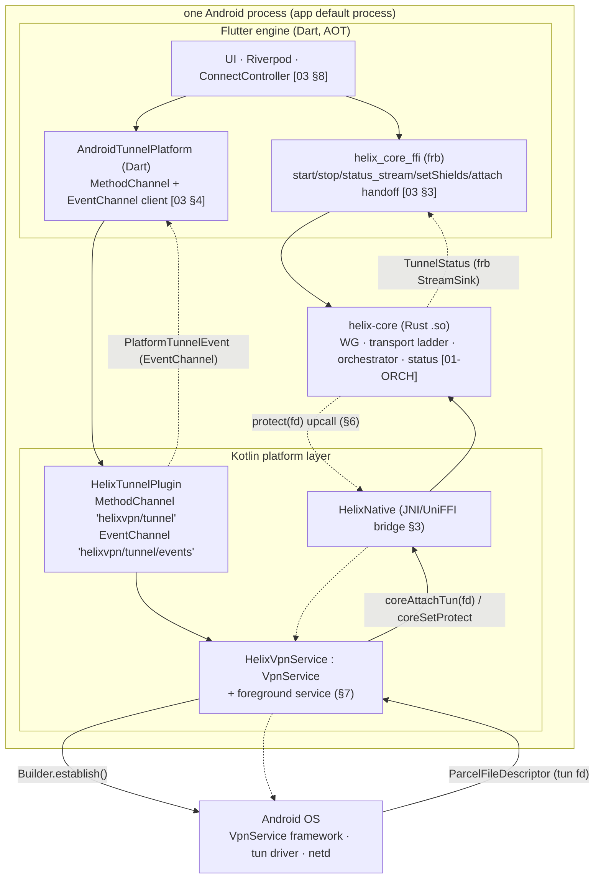
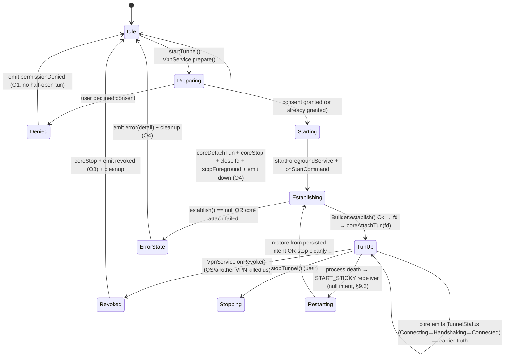
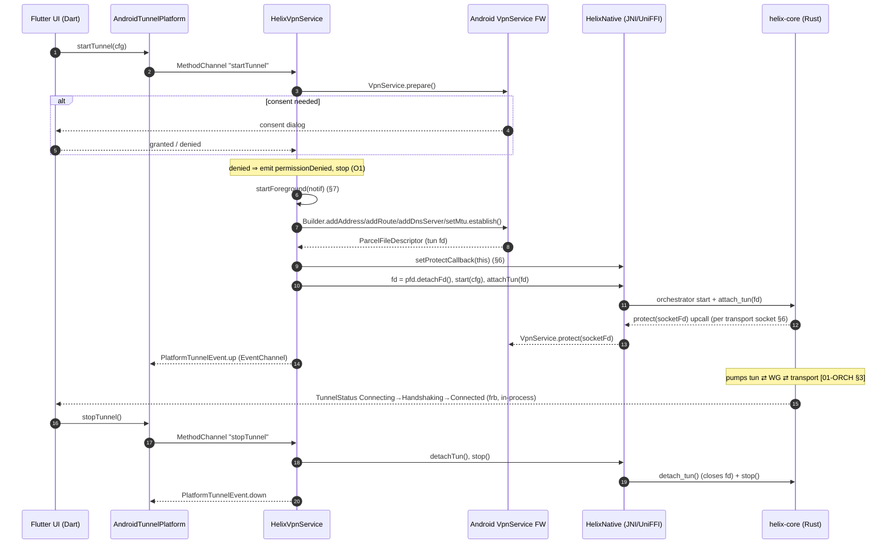
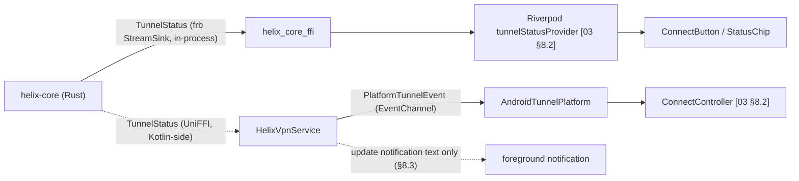
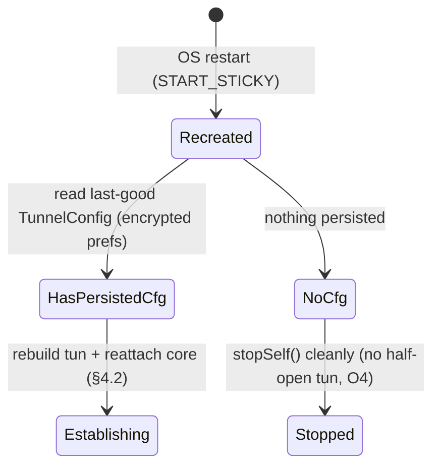

# Android shim (VpnService + JNI)

**Revision:** 2
**Last modified:** 2026-07-04T12:00:00Z
**Rev 2:** Added §7.5 (battery-optimization / Doze / OEM-aggressive-killer mitigation —
the foreground-service priority §7 already secures is necessary but not sufficient
against OEM-specific background-kill behavior on MIUI/EMUI/One UI-class skins) and
§14.1 (Google Play VPN-policy compliance requirements) — closing a gap identified in
an independent enterprise-hardening pass over Volume 4.

> Volume 4 (Clients) nano-detail specification — deepens the **Android
> `TunnelPlatform` shim** sketched in the pass-1 client overview [03 §5.2] into an
> implementation-ready design of the single platform-specific component that lets
> HelixVPN's shared Rust `helix-core` drive a system VPN on Android. SPEC ONLY: it
> describes **what to build** (Kotlin/Rust signatures, the channel contract, the
> `VpnService` lifecycle state machine, the JNI/UniFFI bridge, the `tun` fd
> handoff, `protect()` loop-avoidance, the foreground service, memory budget,
> error taxonomy, edge cases, and §11.4.169 test points) — it does **not** write
> the shipping product.
>
> **Boundary.** This shim is the *only* Android-specific code in the client stack
> [03 §0, §4]. It **consumes**: the FFI surface + `TunnelStatus` enum owned by the
> core (`helix-core/src/status.rs` [01-ORCH §4.1]; the Dart-facing FFI [03 §3]),
> and the `TunnelPlatform` channel contract [03 §4]. It **owns**: the Kotlin
> `VpnService` + foreground service, the `VpnService.Builder → ParcelFileDescriptor`
> tun-fd handoff, the JNI/UniFFI bridge that hands that fd to `helix-core` and
> registers the `protect()` upcall, and the `MethodChannel`/`EventChannel`
> marshalling. It does **not** own WG crypto, the transport ladder, the
> orchestrator loops, or the kill-switch/DNS state machine — those are core
> [01-ORCH], identical on every platform.
>
> **Evidence base, cited inline by id.** `[03 §N]` =
> `final/03-client-core-and-ui.md` (pass-1 client overview); `[01-ORCH §N]` =
> `final/v02-data-plane/orchestrator-and-state.md` (the `TunnelStatus` /
> orchestrator the shim drives); `[01-TT §N]` =
> `final/v02-data-plane/transport-trait.md`; `[04_ARCH §N]` =
> `04_VPN_CLD/HelixVPN-Architecture-Refined.md`; `[04_UI §N]` =
> `04_VPN_CLD/HelixVPN-helix-ui-Flutter.md`; `[research-ios_android]` =
> `v09-research/research-ios_android.md` (Apple DTS + Android `VpnService`
> primary-source research, all accessed 2026-06-25); `[10-QA §N]` =
> `final/10-testing-acceptance-and-qa.md`; `[06-WBS §0.4]` =
> `final/06-phase0-spike-wbs.md` (the §11.4.169 code map); `[SYN §N]` =
> cross-document synthesis. Anything not grounded in that base is tagged
> `UNVERIFIED` per constitution §11.4.6 — never fabricated.

---

## Table of contents

- [0. Position, ownership, and invariants](#0-position-ownership-and-invariants)
- [1. Component & process map](#1-component--process-map)
- [2. The `TunnelPlatform` contract — Android impl surface](#2-the-tunnelplatform-contract--android-impl-surface)
- [3. The JNI / UniFFI bridge to `helix-core`](#3-the-jni--uniffi-bridge-to-helix-core)
- [4. `VpnService` lifecycle state machine](#4-vpnservice-lifecycle-state-machine)
- [5. `VpnService.Builder` → `tun` fd handoff](#5-vpnservicebuilder--tun-fd-handoff)
- [6. `protect()` — the loopback-avoidance contract](#6-protect--the-loopback-avoidance-contract)
- [7. Foreground service — surviving background-kill](#7-foreground-service--surviving-background-kill)
- [8. Status & event flow (the two channels)](#8-status--event-flow-the-two-channels)
- [9. Permission, always-on, and boot](#9-permission-always-on-and-boot)
- [10. Split-tunnel, DNS, routes, MTU](#10-split-tunnel-dns-routes-mtu)
- [11. Memory & performance budget](#11-memory--performance-budget)
- [12. Error taxonomy & edge cases](#12-error-taxonomy--edge-cases)
- [13. Threading & cancel model](#13-threading--cancel-model)
- [14. Manifest & build requirements](#14-manifest--build-requirements)
- [15. Test points (§11.4.169)](#15-test-points-1114169)
- [16. Open decisions & cross-doc seams](#16-open-decisions--cross-doc-seams)
- [Sources verified](#sources-verified)

---

## 0. Position, ownership, and invariants

The Android shim does **only three things** [03 §4]: (a) configure the OS tunnel
(`VpnService.Builder`), (b) hand `helix-core` a packet `fd` + the `protect()`
upcall, and (c) report lifecycle. Everything above it — `ConnectButton`,
`ExitPicker`, settings, the `TunnelStatus`-driven UI — is shared Dart [03 §5,
04_UI §6]. The shim is the *only untyped seam* (native ⇄ Dart) and is therefore
covered by an on-device smoke test, never a mock-claiming-PASS (§11.4.27)
[03 §4.1 O5].

### 0.1 Inherited invariants (the shim MUST keep)

| # | Invariant | Source | Android-specific consequence |
|---|---|---|---|
| CI1 | The shim does **not** own logic/status; it owns the OS tunnel lifecycle. | [03 §0.1] | The Kotlin `VpnService` creates the `tun` + foreground service; `helix-core` (the same `.so` as every platform) owns WG + transport + status. |
| O2 | The shim hands the core a packet `fd`/pump; it **never** does crypto/obfuscation. | [03 §4.1] | `coreAttachTun(fd)`; no WG/QUIC code in Kotlin. |
| CI2 | The UI is a pure function of the core's status stream; never paint "connected" on intent. | [03 §0.1] | `PlatformTunnelEvent.up` ≠ `TunnelStatus::Connected`; `Connected` is emitted by the core *only* after the WG handshake reply [01-ORCH §5.4], never by the shim. |
| O1 | `startTunnel` is idempotent + permission-aware: a denied VPN consent emits `permissionDenied` (not `error`) and leaves **no** half-open `tun`. | [03 §4.1] | §4, §9.1; cleanup on every exit path (§11.4.14). |
| O3 | `events()` reports `revoked` when the OS kills the tunnel out-of-band. | [03 §4.1] | `VpnService.onRevoke()` → `revoked` (§4.4); never claim "connected". |
| O4 | `stopTunnel` restores a quiescent OS state on **every** exit path. | [03 §4.1] | `coreDetachTun()` → close fd → `stopForeground` → remove notification (§4.5, §11.4.14). |
| I1 | The transport never sees plaintext; the shim never inspects payload. | [01-TT I1] | The shim moves an opaque `fd` integer; it reads/writes **no** packet bytes (those flow inside the core). |

### 0.2 What this document does NOT own

- The `TunnelStatus` enum + its `Down.reason` vocabulary — frozen in
  `helix-core/src/status.rs` [01-ORCH §4.1, §4.4]; the shim is a transparent
  carrier of those events to Dart.
- The `TransportConfig` ladder, WG `Tunn` state machine, kill-switch/DNS state
  machine — core [01-ORCH §7, §8]; identical on every platform.
- The Dart-side `TunnelPlatform` *caller* / Riverpod wiring [03 §8]; this doc
  owns the Android *implementation* the Dart contract dispatches to.

---

## 1. Component & process map

HelixVPN runs the Flutter engine, the Rust `helix-core` `.so`, **and** the
`VpnService` in **one Android process** (the app's default process). This is a
load-bearing decision (§16 D-ANDROID-1): a single process lets `flutter_rust_bridge`
(frb) stream `TunnelStatus` and serve `setShields`/`setExit` **directly** from
Dart to the in-process core [03 §3.2, §3.3], while the same in-process core holds
the `tun` fd the `VpnService` produced — no cross-process IPC for status.



Two event paths leave the core (§8): **`TunnelStatus`** (core → frb → Dart,
in-process, the truth about protection state), and **`PlatformTunnelEvent`**
(Kotlin → EventChannel → Dart, the OS-tunnel lifecycle: `up`/`down`/
`permissionDenied`/`revoked`/`error`). They are distinct and MUST NOT be conflated
(CI2).

---

## 2. The `TunnelPlatform` contract — Android impl surface

The frozen Dart contract [03 §4] is one `MethodChannel` (`helixvpn/tunnel`) + one
`EventChannel` (`helixvpn/tunnel/events`). The Android side implements the method
handler and the event sink.

### 2.1 Dart `TunnelPlatform` (consumed — frozen [03 §4])

```dart
// helix_core_ffi/lib/tunnel_platform.dart  (frozen contract — restated, not redefined)
abstract class TunnelPlatform {
  Future<void> startTunnel(TunnelConfig cfg);     // OS permission + create TUN + link core + pump
  Future<void> stopTunnel();                       // detach core, destroy TUN, release hold
  Stream<PlatformTunnelEvent> events();            // lifecycle only — up/down/permissionDenied/revoked/error
}

class TunnelConfig {                               // [03 §4]
  final String overlayIp;                          // e.g. 100.64.0.7  (overlay /32, IPAM-assigned)
  final List<String> routes;                       // AllowedIPs into the tunnel (e.g. "10.10.0.0/24" | "0.0.0.0/0")
  final List<String> dnsServers;                   // tunnel DNS (anti-leak)
  final List<String> splitExcludeApps;             // Android per-app bypass (package names)
  final int mtu;                                   // 1280 MASQUE default, 1420 plain WG [03 §4, 01-TT §4.8]
  final String sessionOrMapToken;                  // handed straight to helix_core start (logic, not OS)
  // ... ctor as in [03 §4]
}

enum PlatformTunnelEventKind { up, down, permissionDenied, revoked, error }
class PlatformTunnelEvent { final PlatformTunnelEventKind kind; final String? detail; /* §11.4.6 honest reason */ }
```

### 2.2 The Android `MethodChannel` verb map

| Dart call | MethodChannel method | Kotlin handler | Returns |
|---|---|---|---|
| `startTunnel(cfg)` | `"startTunnel"` (args = `cfg` map) | `Plugin.onMethodCall` → `prepare` check → start `HelixVpnService` (§4.2) | `Future<void>` (completes when the service is *started*, NOT when `Connected`) |
| `stopTunnel()` | `"stopTunnel"` | broadcast/`stopService` → `Service.onDestroy` (§4.5) | `Future<void>` |
| `events()` | EventChannel `onListen` | `Plugin` registers an `EventSink`; the service posts `PlatformTunnelEvent`s to it (§8.2) | `Stream<PlatformTunnelEvent>` |

`startTunnel`'s `Future` resolving means "the OS VPN bring-up was *requested* and
consent is granted" — **not** that the tunnel is up. Up-ness arrives later as a
`PlatformTunnelEvent.up` (carrier/tun ready) and, authoritatively, as a core
`TunnelStatus::Connected` (WG handshake done) (CI2, §8).

### 2.3 Arg marshalling (the one untyped seam, made honest)

`TunnelConfig` crosses Dart→Kotlin as a `Map<String, Any?>` over the
`MethodChannel`. The Kotlin side parses it into a typed `TunnelConfig` data class;
a missing/invalid field is a **hard** parse error → `PlatformTunnelEvent.error`
with an honest `detail` (§11.4.6 — never a silent default), never a half-open
tunnel (O1). A round-trip fixture test (§15 `UT`) asserts every field survives the
`Map` encoding byte-for-byte.

```kotlin
// HelixTunnelConfig.kt
data class HelixTunnelConfig(
  val overlayIp: String,
  val routes: List<CidrRoute>,        // parsed "a.b.c.d/n" → (InetAddress, prefix)
  val dnsServers: List<String>,
  val splitExcludeApps: List<String>,
  val mtu: Int,
  val sessionOrMapToken: String,
) {
  companion object {
    fun from(args: Map<String, Any?>): HelixTunnelConfig = /* typed parse; throw on missing/invalid */
  }
}
data class CidrRoute(val address: String, val prefix: Int)
```

---

## 3. The JNI / UniFFI bridge to `helix-core`

The shared Rust core is loaded as a native `.so` via JNI [03 §5 matrix, SYN §5,
research-ios_android §3]. The **binding generator** is **UniFFI** for the typed
Kotlin surface (decision D-CLIENT-3 [03 §14] — UniFFI gives typed Swift/Kotlin),
with a **raw JNI export** reserved for the hot `protect()` upcall path where a
per-socket UniFFI round-trip is undesirable (§6.3). frb generates the *Dart* surface
[03 §3.2]; UniFFI generates the *native-shim* surface — two generators, one Rust
source of truth [03 §3].

### 3.1 The exported Rust FFI surface used by the Android shim

This is the subset of the frozen FFI surface [03 §3.1] the Kotlin shim drives,
plus the **one Android-specific addition** the contract needs (`set_protect_callback`,
§6). `TunnelStatus` is the 5-variant core enum [01-ORCH §4.1] — kept consistent
below (§3.3).

```rust
// helix-ffi/src/api.rs  — UniFFI + frb generate from this (restated subset; full surface in [03 §3.1])
// All bodies live in helix-core; this crate is the EXPORTED surface only [03 §0].

pub struct ClientConfig {                 // [03 §3.1]
    pub map_path_or_session: String,      // = TunnelConfig.sessionOrMapToken
    pub transport: String,                // "auto" | "plain" | "masque" | ...
    pub mode: CoreMode,                   // Client (Android Access app) | Connector
}
#[derive(uniffi::Enum)] pub enum CoreMode { Client, Connector }

pub fn start(cfg: ClientConfig) -> Result<(), HelixError>;   // logic bring-up (orchestrator start, [01-ORCH §2.1])
pub fn stop() -> Result<(), HelixError>;                     // graceful teardown

/// Shim handoff: the core NEVER opens the TUN; the VpnService produces the fd and
/// hands it here. The core takes OWNERSHIP of the fd (closes it on detach) — see §5.3.
pub fn attach_tun(fd: i32) -> Result<(), HelixError>;        // [03 §3.1]
pub fn detach_tun() -> Result<(), HelixError>;               // [03 §3.1]

/// Live status stream — maps to the orchestrator broadcast channel [01-ORCH §4].
/// frb delivers this directly to Dart (in-process, §1); UniFFI exposes it to Kotlin
/// too (the shim only needs it to drive PlatformTunnelEvent.up — §8.3).
pub fn status_stream(sink: StreamSink<TunnelStatus>);        // [03 §3.1]

/// ANDROID-SPECIFIC ADDITION (§6). The core invokes this callback to protect every
/// outbound transport socket against the VPN routing loop BEFORE it connects.
/// Registered once at attach time. No-op / returns Ok on non-Android targets.
pub fn set_protect_callback(cb: Box<dyn ProtectCallback>);   // NEW — Android contract extension
pub trait ProtectCallback: Send + Sync {
    /// Bind socket `fd` to the underlying physical network; true = protected.
    fn protect(&self, fd: i32) -> bool;
}

#[derive(uniffi::Error, Debug)] pub enum HelixError { Tun(String), KillSwitch(String), Dns(String), Internal(String) }
```

### 3.2 The UniFFI-generated Kotlin surface (primary path)

```kotlin
// generated by UniFFI from helix-ffi (do not hand-edit); HelixNative wraps it for ergonomics.
object HelixNative {
  init { System.loadLibrary("helix_core") }     // load the .so once per process

  fun start(cfg: ClientConfig)                  // throws HelixException
  fun stop()
  fun attachTun(fd: Int)                        // hand the VpnService tun fd to the core (§5)
  fun detachTun()
  fun setProtectCallback(cb: ProtectCallback)   // §6
  fun subscribeStatus(sink: TunnelStatusSink)   // Kotlin-side status subscription (shim uses for .up only, §8.3)
}
interface ProtectCallback { fun protect(fd: Int): Boolean }     // implemented by HelixVpnService.protect (§6.2)
```

### 3.3 `TunnelStatus` — consistency with the core (frozen)

The shim is a **transparent carrier** of the core's `TunnelStatus`; it never
defines its own. The canonical enum is `helix-core/src/status.rs` [01-ORCH §4.1]:

```rust
// helix-core/src/status.rs  (frozen, mirrored across the FFI [01-ORCH §4.1]) — restated for the binding
#[derive(Clone, Debug, PartialEq, Eq)]
pub enum TunnelStatus {
    Connecting,                                   // dialling a rung (carrier handshake in flight)
    Handshaking,                                  // carrier up; WG Noise IK handshake in flight
    Connected { transport: String, rtt_ms: u32 }, // e.g. ("masque-h3", 23) — WG established
    Reconnecting,                                 // a working tunnel dropped; re-dialling (ladder/backoff)
    Down { reason: String },                      // terminal for this attempt; stable-prefix reason [01-ORCH §4.4]
}
```

> **Consistency note (§11.4.6).** The pass-1 client overview presents an
> *extended* Dart mirror that adds `Disconnected`, a `path` field on `Connected`,
> and a `Danger{kind}` variant for the UI palette [03 §3.1 status-enum note]. Those
> are **FFI-presentation extensions** layered on top of this 5-variant core enum;
> this shim spec anchors on the **core 5-variant `TunnelStatus`** [01-ORCH §4.1] as
> the source of truth, exactly as the orchestrator emits it. The shim forwards
> whatever variant the core emits, unmodified — if/when the extended variants are
> ratified into the core enum, the shim needs **no change** (it is a transparent
> carrier). The Android shim emits its own **separate** `PlatformTunnelEvent` for
> OS-tunnel lifecycle (§8.2); it never synthesises a `TunnelStatus`.

### 3.4 Raw-JNI fallback (the hot `protect()` path)

For the per-socket `protect()` upcall (§6) the core may, instead of a UniFFI
callback object, call a `#[no_mangle] extern "system"` JNI function or — as a
perf option — the native `protectFromVpn` symbol (§6.3). The raw-JNI export shape:

```rust
// helix-ffi/src/jni_android.rs  (cfg(target_os="android")) — fallback / hot-path only
#[no_mangle]
pub extern "system" fn Java_dev_helixvpn_core_HelixNative_coreAttachTun(
    env: JNIEnv, _class: JClass, fd: jint) -> jint { /* attach_tun(fd) → 0 | errcode */ }
```

UniFFI is the **primary** typed surface; the raw JNI export exists only where the
hot path or a UniFFI gap (`UNVERIFIED`: UniFFI callback-interface overhead per
upcall — measure in BENCH, §15) justifies it.

---

## 4. `VpnService` lifecycle state machine

### 4.1 States (Kotlin-side, distinct from `TunnelStatus`)

The `VpnService` has its **own** lifecycle — the OS-tunnel layer — that the shim
projects to `PlatformTunnelEvent`. It is *not* `TunnelStatus`: the tun can be `Up`
(fd established, core attached) while `TunnelStatus` is still `Handshaking` (WG
not yet established). The UI trusts `TunnelStatus` for protection state (CI2); the
shim's lifecycle drives only the foreground service + the up/down/revoked events.



### 4.2 `startTunnel` → `onStartCommand` (the bring-up)

```kotlin
// HelixVpnService.kt
class HelixVpnService : VpnService(), HelixNative.ProtectCallback {

  override fun onStartCommand(intent: Intent?, flags: Int, startId: Int): Int {
    // null intent ⇒ START_STICKY redelivery after process death (§9.3) — restore or stop.
    val cfg = HelixTunnelConfig.from(intent?.bundleExtras() ?: return restoreOrStop())

    // 1. Foreground FIRST (must call startForeground within the OS window, §7) — survive bg-kill.
    startForeground(NOTIF_ID, buildPersistentNotification())          // §7

    // 2. Build + establish the TUN (§5). Null ⇒ another VPN active / invalid config (§12 E3).
    val pfd: ParcelFileDescriptor = buildTun(cfg)
        ?: return failAndStop("establish() returned null")            // ErrorState

    // 3. Register protect upcall BEFORE the core opens any transport socket (§6).
    HelixNative.setProtectCallback(this)

    // 4. Hand the fd to the core; take ownership via detachFd (§5.3). Then start the core logic.
    val fd = pfd.detachFd()                                           // native now owns close()
    HelixNative.start(cfg.toClientConfig())                          // orchestrator start [01-ORCH §2.1]
    HelixNative.attachTun(fd)                                         // core pumps fd ⇄ WG ⇄ transport

    emitEvent(PlatformTunnelEventKind.up, null)                       // OS-tunnel up (NOT "connected", CI2)
    return START_STICKY                                              // §9.3 (with redelivery handling)
  }
}
```

Ordering is load-bearing: **foreground first** (or the OS may kill a
just-started background service before `establish()`), **establish before
attach** (the core needs a live fd), **protect-callback before `start`** (the
core may open a transport socket the instant it starts — it must be protectable,
§6).

### 4.3 `Handshaking → Connected` is the core's call, not the shim's

The shim emits `PlatformTunnelEvent.up` once the *carrier* (fd + core attach) is
ready. The user-visible "Connected" (green) is driven by the core's
`TunnelStatus::Connected` over frb [01-ORCH §5.4, §3 §3.2] — emitted only after
the **WG handshake reply** lands, never on tun-up. This split is the exact
mechanism that prevents "UI says connected while the tunnel is actually down"
(CI2) [03 §3.3].

### 4.4 `onRevoke` (O3)

```kotlin
override fun onRevoke() {                 // OS or another VPN app took over, or user revoked consent
  HelixNative.detachTun(); HelixNative.stop()
  emitEvent(PlatformTunnelEventKind.revoked, "os_revoked")
  stopForeground(STOP_FOREGROUND_REMOVE); stopSelf()
}
```

`onRevoke` is the out-of-band kill path (O3). It also covers the control-plane
revocation reflected as `device.revoked` (doc 02) when that propagates to a tunnel
teardown — though a *cryptographic* WG revoke surfaces first as the core's
`Down{reason:"auth-failed"}` over `TunnelStatus` [01-ORCH §5.4]; `onRevoke` is the
*OS-level* VPN-permission revoke. Both end in a cleaned-up quiescent state (O4).

### 4.5 `stopTunnel` / `onDestroy` (O4)

```kotlin
override fun onDestroy() {                // user stop OR system teardown
  HelixNative.detachTun()                 // core closes the owned fd (§5.3)
  HelixNative.stop()                      // orchestrator graceful stop [01-ORCH §2.4]
  stopForeground(STOP_FOREGROUND_REMOVE)  // remove the persistent notification (§7)
  emitEvent(PlatformTunnelEventKind.down, null)
  super.onDestroy()
}
```

Every exit path (`stopTunnel`, `onRevoke`, `onDestroy`, `ErrorState`,
process-death) MUST leave: **no orphan fd** (core closed it), **no foreground
notification**, **no leaked routes/DNS** (those were tun-scoped and die with the
tun). A post-stop sanity assertion (§15 `SEC`/`SC`) FAILs the test if any orphan
survives (§11.4.14).

---

## 5. `VpnService.Builder` → `tun` fd handoff

### 5.1 Building the interface

`VpnService.Builder` configures a Layer-3 interface: at least one address +
routes/MTU before `establish()`, which returns a `ParcelFileDescriptor` for the
TUN [research-ios_android §3, 04_UI §6 row]. The app reads/writes **raw IP
packets** on that fd — there is no per-socket model [research-ios_android §3].

```kotlin
private fun buildTun(cfg: HelixTunnelConfig): ParcelFileDescriptor? {
  val b = Builder()
    .setSession("HelixVPN")                                  // label in the system VPN UI
    .addAddress(cfg.overlayIp, 32)                           // overlay /32 (IPAM-assigned)
    .setMtu(cfg.mtu)                                         // 1280 MASQUE / 1420 plain [01-TT §4.8]
    .setBlocking(false)                                      // non-blocking fd (core pumps async)
  cfg.routes.forEach { b.addRoute(it.address, it.prefix) }   // AllowedIPs (e.g. 0.0.0.0/0 full-tunnel)
  cfg.dnsServers.forEach { b.addDnsServer(it) }              // tunnel DNS (anti-leak, §10.2)
  applySplitTunnel(b, cfg.splitExcludeApps)                  // §10.1 (per-app bypass)
  // Allow the app's OWN sockets to bypass the tun so the transport can reach the gateway:
  // handled by protect() per-socket (§6), NOT by a bypass route — keeps the kill-switch tight.
  return b.establish()                                       // null ⇒ no VpnService permission / invalid
}
```

### 5.2 The fd is Layer-3 IP, owned by the core

Once attached, `helix-core` does `read(2)`/`write(2)` of IP packets directly on
the fd inside its loop A/B [01-ORCH §3.1, §3.2] — exactly the tun2socks-style
native consumption pattern [research-ios_android §3]. The Kotlin side never
touches packet bytes (I1, O2).

### 5.3 fd ownership: `detachFd()` (recommended) vs `getFd()`

| Option | Ownership | Who closes | Trade-off |
|---|---|---|---|
| **`detachFd()`** (recommended) | transfers the raw int fd to native; the `ParcelFileDescriptor` is invalidated | the **core** closes it in `detach_tun()` | clean single-owner lifecycle; the core controls fd close exactly when it stops pumping [research-ios_android §3] |
| `getFd()` | Kotlin keeps the `ParcelFileDescriptor` alive | Kotlin must keep `pfd` referenced and `close()` it on stop | risks a double-close or a leak if the service dies before Kotlin closes; needs careful lifecycle bookkeeping |

**Decision (D-ANDROID-2, §16):** use `detachFd()` → the core owns and closes the
fd via `detach_tun()`. The Kotlin side keeps **no** `ParcelFileDescriptor`
reference after `detachFd()` (it is invalidated). Edge: if the core process dies,
the fd is reclaimed at process death — acceptable, no cross-process leak.



---

## 6. `protect()` — the loopback-avoidance contract

### 6.1 Why it is mandatory

`VpnService.protect(socket)` binds a socket to the **underlying physical
network**, so the tunnel's own outbound transport packets (to the gateway) do
**not** get routed back into the tun — which would infinite-loop. It MUST be
called **before** the socket connects/sends, for **every** outbound transport
socket the core opens [research-ios_android §3]. Without it the tunnel cannot
carry its own carrier traffic. This is the single Android-specific obligation
that forces a **core → shim upcall** (the core opens the socket inside
`helix-transport::dial()` [01-TT §6], so only the core knows the fd; only the
shim can `protect()` it).

### 6.2 The upcall (primary path: `VpnService.protect`)

The core invokes the registered `ProtectCallback` synchronously, before
`connect()`, for each transport socket:

```kotlin
// HelixVpnService implements HelixNative.ProtectCallback
override fun protect(fd: Int): Boolean = protect(fd)   // VpnService.protect(int) — true on success
```

```rust
// inside helix-transport dial(), cfg(target_os="android"): protect every socket before connect
let sock = socket2::Socket::new(domain, ty, proto)?;
if !PROTECT.get().map_or(false, |cb| cb.protect(sock.as_raw_fd())) {
    return Err(TransportError::Io(io::Error::other("protect() failed")));  // never connect an unprotected socket
}
sock.connect(&peer.into())?;   // [01-TT §6.1]
```

A failed `protect()` is a **hard** dial error (`TransportError::Io` →
ladder/backoff [01-TT §7, 01-ORCH §7]) — the core MUST NOT connect an unprotected
socket (it would leak onto the underlay and loop). This is verified by the §15
`SEC` test (a captured pcap shows transport packets egress the physical iface, not
the tun).

### 6.3 Hot-path option: native `protectFromVpn` (perf)

`VpnService.protect()` ultimately calls the C function `protectFromVpn`
(`NetdClient.h`); a native core can bind that symbol and protect sockets entirely
in native space, avoiding a JNI/UniFFI upcall on the hot connect path
[research-ios_android §3]. **Decision (D-ANDROID-3, §16):** use the
`ProtectCallback` upcall as the **safe default** (protect is not on the per-packet
hot path — it fires once per *socket* / per dial, which is rare); adopt native
`protectFromVpn` only if BENCH (§15) shows the upcall cost matters.
`UNVERIFIED`: `protectFromVpn`'s symbol stability across Android versions / OEM
images — it is **not** a public NDK symbol; binding it is a documented community
pattern, not a guaranteed-stable ABI [research-ios_android §3]. Treat as an
optimization behind a measured gate, never the default (§11.4.6).

### 6.4 Re-protect on roam

When the device's primary network changes (Wi-Fi→cellular), the previously-`protect`ed
socket's underlying network may vanish → the carrier dies → the core re-dials
[01-ORCH §7.5] → a **new** transport socket is opened → `protect()` is invoked
again on the **new** network. The shim feeds the roam signal to the core via a
`ConnectivityManager.NetworkCallback` → `RoamDetected{new_local}` [01-ORCH §7.5,
§9]; the core's `< 3 s` roam recovery [01-ORCH §7.1] then re-establishes a freshly
protected socket. No special shim logic beyond delivering the roam event and
answering the protect upcall.

---

## 7. Foreground service — surviving background-kill

A VPN tunnel must keep running when the app is backgrounded; Android only keeps a
service alive in the background if it is a **foreground service** with a persistent
notification [research-ios_android §3 implies via `VpnService` foreground
practice; 03 §5.2 `startForeground`].

```kotlin
private fun buildPersistentNotification(): Notification {
  // Notification channel created once at app start (API 26+).
  return NotificationCompat.Builder(this, CHANNEL_ID)
    .setSmallIcon(R.drawable.ic_helix_shield)
    .setContentTitle("HelixVPN")
    .setContentText("Protected")              // updated from TunnelStatus over a status subscription (§8.3)
    .setOngoing(true)
    .setCategory(NotificationCompat.CATEGORY_SERVICE)
    .build()
}
// onStartCommand: startForeground(NOTIF_ID, buildPersistentNotification() [, foregroundServiceType])
```

| Concern | Requirement | Note |
|---|---|---|
| Foreground window | `startForeground()` MUST be called promptly inside `onStartCommand` (before `establish()` in §4.2) | else the OS may kill the just-started service |
| Notification channel | created once (API 26+) before first `startForeground` | `POST_NOTIFICATIONS` runtime permission on API 33+ |
| Foreground service type | a `foregroundServiceType` MUST be declared (manifest) + passed on API 34+ | `UNVERIFIED`: the exact constant for a VPN foreground service on API 34+ — verify against the latest Android docs (§11.4.99) before coding; declare the matching `FOREGROUND_SERVICE_*` permission. Do not hardcode a guessed type. |
| Restart | `START_STICKY` so the OS recreates the service after a low-memory kill (§9.3) | with null-intent redelivery handling |
| Notification text | reflects `TunnelStatus` (Connecting/Connected/Reconnecting) | the shim keeps a lightweight Kotlin-side status subscription only to update this text (§8.3) |

> **Android memory posture (contrast iOS).** Android `VpnService` runs as a normal
> foreground service — there is **no** iOS-NE-style hard ~15/50 MiB jetsam cap; the
> standard Android per-app memory / `lowmemorykiller` applies, which is far more
> generous, and a foreground service is high-priority [research-ios_android §3].
> The severe memory constraint is **iOS-only**; on Android the foreground-service
> priority is the survival mechanism, not a tight RSS budget (§11). The shim still
> bounds buffer pools in the core (size receive buffers to MTU+headroom
> [research-ios_android §3, §4]) because the **same lean Rust core** ships on both.

### 7.5 Battery-optimization / Doze / OEM-aggressive-killer mitigation

§7's foreground-service + persistent-notification discipline is AOSP's own
background-kill defense and is **necessary but not sufficient**: several major OEM
Android skins (commonly cited: Xiaomi MIUI, Huawei EMUI/HarmonyOS-for-phones,
Samsung One UI, OPPO ColorOS, Vivo FuntouchOS) ship an **additional, non-AOSP
battery-management layer** that can kill or freeze a foreground service — including
a VPN foreground service — despite AOSP Doze/App-Standby already exempting active
VPN sessions. This is a well-known, real-world class of complaint for VPN apps
specifically (a foreground "Protected" notification stays visible while the tunnel
is silently frozen by the OEM layer) and MUST be mitigated, not merely documented as
a known limitation:

| Mitigation | Mechanism | Note |
|---|---|---|
| Request battery-optimization exemption | `Intent(Settings.ACTION_REQUEST_IGNORE_BATTERY_OPTIMIZATIONS)` (AOSP-standard, requires the `REQUEST_IGNORE_BATTERY_OPTIMIZATIONS` manifest permission — a Google Play policy-sensitive permission, §14.1) | shown once during onboarding with an honest explanation of *why* (not a generic "improve performance" dialog — CI5-consistent honesty); user can decline, app functions but is warned it may be OEM-killed |
| Detect OEM skin + surface a targeted deep link | `Build.MANUFACTURER`/`Build.BRAND` sniff (closed, maintained list) → deep-link to the OEM's own "autostart"/"protected apps"/"battery saver whitelist" settings screen (package+activity names are OEM- and OS-version-specific, `UNVERIFIED` — maintain a small, tested per-OEM table, degrade to the generic Android battery-settings screen if the OEM-specific intent is not resolvable) | this is the actual fix for MIUI/EMUI-class killers — the AOSP exemption alone does not disable the OEM's separate autostart/protected-apps gate |
| Detect a suspected OEM-kill post-hoc | if the shim transitions `Up → Restarting` (§9.3) with **no** corresponding user action AND no `onRevoke`/network-loss signal, classify as `suspected_oem_kill` rather than a generic restart, and surface a one-time in-app notice pointing the user back to the OEM settings deep link | honest, evidence-based classification (§11.4.6 — never a guess dressed as fact; the classification is a heuristic on an observable state transition, tagged as such) |
| Reconnect after an OEM-kill | on `Restarting` with a persisted last-good `TunnelConfig` (§9.3), reconnect automatically if the user's last intent was "connected" — same rule as D-ANDROID-4, so an OEM-kill and a plain process-death recover identically | §9.3 |

This closes the operational reality that "foreground service" is a *necessary*
survival mechanism (§7) but the *sufficient* one on OEM-modified Android requires an
explicit exemption request + a per-OEM escape hatch; shipping only the AOSP-standard
foreground service and calling the background-kill risk "handled" would be an
enterprise-hardening gap for the very OEM skins that are common in several of
HelixVPN's target markets (self-hosted/home-lab operators on consumer Android
devices).

---

## 8. Status & event flow (the two channels)

### 8.1 The two distinct streams

| Stream | Producer → consumer | Transport | Carries | Truth about |
|---|---|---|---|---|
| **`TunnelStatus`** | `helix-core` → Dart | frb `StreamSink`, in-process [03 §3.2] | `Connecting`/`Handshaking`/`Connected{transport,rtt}`/`Reconnecting`/`Down{reason}` [01-ORCH §4.1] | **protection state** (WG/tunnel) — the UI paints from this (CI2) |
| **`PlatformTunnelEvent`** | Kotlin shim → Dart | `EventChannel` `helixvpn/tunnel/events` [03 §4] | `up`/`down`/`permissionDenied`/`revoked`/`error` | **OS-tunnel lifecycle** (consent, fd, foreground service) |



### 8.2 `PlatformTunnelEvent` emission rules

The shim emits exactly one event per OS-tunnel transition (§4): `up` on
`establish()`+attach success; `down` on graceful stop; `permissionDenied` on
declined consent; `revoked` on `onRevoke`; `error{detail}` on `establish()==null`
/ attach failure / config-parse failure. `detail` is an **honest** string
(§11.4.6 — never "likely"/"maybe"). Events post to the registered `EventSink` on
the platform thread; if no listener is attached yet, the latest lifecycle event is
buffered (`UNVERIFIED`: buffer depth = 1 latest, sufficient because the UI
re-reads latest on listen — calibrate in §15 `UT`).

### 8.3 Why the shim also subscribes to `TunnelStatus` (notification text)

The shim keeps a **lightweight** Kotlin-side `TunnelStatus` subscription
(`HelixNative.subscribeStatus`) for **one** purpose: updating the persistent
notification text (`Connecting…`/`Protected · masque-h3 · 23 ms`/`Reconnecting…`).
This is presentation only; the shim never *re-derives* protection state nor feeds
it back to the UI (the UI already has the authoritative frb stream, CI2). A
`RecvError::Lagged` on this subscription is treated as "re-read latest", never an
error [01-ORCH §4.6].

---

## 9. Permission, always-on, and boot

### 9.1 Permission flow (`VpnService.prepare`)

`VpnService.prepare(context)` returns an `Intent` if the user has not yet
consented to this app acting as a VPN (must be launched via
`startActivityForResult`), or `null` if already consented. Declined consent →
`PlatformTunnelEvent.permissionDenied`, **no** service start, no half-open tun
(O1).

```kotlin
fun startTunnel(cfg): Future {
  val prep = VpnService.prepare(context)          // null = already granted
  if (prep != null) { launchConsent(prep) /* on result: granted→continue | denied→permissionDenied */ }
  else startService(cfg)
}
```

### 9.2 Always-on VPN & lockdown (the Android kill-switch)

Android's system **Always-on VPN** + **Block connections without VPN (lockdown)**
setting *is* the OS-level kill-switch on Android [04_ARCH §5.6 "kill-switch+DNS
driven by core state machine"; the OS lockdown is the platform mechanism]. When
lockdown is on, the OS starts `HelixVpnService` via an OS-issued intent (no UI)
and drops all non-VPN traffic. The shim MUST therefore:
- handle a service start with **no** UI in the foreground (start foreground +
  build the tun from a **persisted** last-good `TunnelConfig`, §9.3);
- never assume the Flutter UI is alive when `onStartCommand` fires.

The core's own fail-closed kill-switch posture [01-ORCH §8] composes with the OS
lockdown: the core drops on `Reconnecting`/`Down` regardless, and Android lockdown
additionally blocks at the OS routing layer. The two are complementary, not
redundant.

### 9.3 Process death & `START_STICKY`

If the OS kills the service under memory pressure, `START_STICKY` recreates it and
re-delivers `onStartCommand` with a **null** intent. The shim must then:



The last-good `TunnelConfig` is persisted (the `sessionOrMapToken` is a secret →
stored in EncryptedSharedPreferences / Keystore-backed store, never plaintext,
§11.4.10) so always-on/lockdown and post-kill restarts can re-establish without
the UI. `UNVERIFIED`: whether to auto-reconnect on every redelivery vs only under
lockdown — surface as D-ANDROID-4 (§16); default = reconnect only if the user's
last intent was "connected" (mirrors [03 §8.4] intent honesty).

---

## 10. Split-tunnel, DNS, routes, MTU

### 10.1 Per-app split tunnel

`VpnService.Builder` supports **either** `addDisallowedApplication(pkg)`
(exclude-list: everything tunnels except these) **or**
`addAllowedApplication(pkg)` (include-list: only these tunnel) — the two modes are
**mutually exclusive** (you cannot mix them on one Builder).

```kotlin
private fun applySplitTunnel(b: Builder, exclude: List<String>) {
  // HelixVPN MVP uses the exclude model (cfg.splitExcludeApps) [03 §4 TunnelConfig.splitExcludeApps].
  exclude.forEach { pkg -> runCatching { b.addDisallowedApplication(pkg) } }  // ignore unknown pkg (honest skip)
}
```

A package that is not installed throws `NameNotFoundException`; the shim skips it
with an honest log, never aborts the whole tunnel (§11.4.6 — but the skip is
*recorded*, not silent). Include-mode (`addAllowedApplication`) is a Phase-2
config knob (D-ANDROID-5, §16).

### 10.2 DNS leak protection

Tunnel DNS is set via `addDnsServer(it)` for each `cfg.dnsServers`. Because all
routes (including `0.0.0.0/0` in full-tunnel mode) go into the tun and no bypass
route is added, off-tunnel `:53` cannot egress — this is the Android realisation
of the core's "force tunnel DNS; block plaintext :53 off-tunnel" guarantee
[04_ARCH §5.6, 01-ORCH §8.3]. Split-tunnel excluded apps deliberately bypass (per
user config); that is an explicit user choice, surfaced honestly in the UI, not a
leak.

### 10.3 Routes & MTU

- Routes = `cfg.routes` (AllowedIPs): `0.0.0.0/0` (+ `::/0` for v6) for
  full-tunnel privacy-exit mode; specific overlay CIDRs (e.g. `10.10.0.0/24`) for
  joined-network-only mode [SYN §1].
- MTU = `cfg.mtu`: 1280 over MASQUE, 1420 plain WG [01-TT §4.8] — the value the
  core computed from `effective_mtu()` of the active transport and pushed into the
  `TunnelConfig` [01-ORCH §6.6]. The shim does not invent the MTU.

---

## 11. Memory & performance budget

| Budget | Android target | Basis |
|---|---|---|
| Core steady-state RSS | low-tens MB; **no hard jetsam cap** like iOS NE | Android `VpnService` is a normal foreground service; `lowmemorykiller` is generous [research-ios_android §3] |
| Buffer pools | bounded; receive buffer sized to MTU+headroom | same lean Rust core as iOS; bound pools to avoid spike-kills [research-ios_android §3, §4] |
| Foreground priority | high (foreground service) protects against bg-kill | §7 |
| App install size | shares the `--split-per-abi` lean Rust staticlib | [03 §10] |
| Packet path | core does `read`/`write` on the fd in its own tokio threads | no Kotlin on the per-packet path (§5.2) |
| `protect()` cost | once per transport socket (rare), not per packet | §6.3 (native `protectFromVpn` only if BENCH demands) |

The binding memory constraint of the program is **iOS NE**, not Android
[research-ios_android §3, §4; CI4 03 §0.1]. On Android the shim's job is survival
(foreground service) and correctness (protect, fd lifecycle), not a tight RSS
ceiling. The Android `MEM` test (§15) is a **regression guard** (`dumpsys
meminfo`, no leak over a soak), not a make-or-break gate (the make-or-break G3 is
iOS-only [03 §5.1]).

---

## 12. Error taxonomy & edge cases

| # | Condition | Required behaviour | Event / state | Source |
|---|---|---|---|---|
| E1 | VPN consent declined | no service start; no half-open tun (O1) | `permissionDenied` → Idle | §9.1 |
| E2 | Config map missing/invalid field | hard parse error; no tun | `error{detail}` → Idle | §2.3 |
| E3 | `establish()` returns null (another VPN active / invalid Builder) | cleanup; no orphan fd | `error{"establish_null"}` → Idle | §5.1, [research-ios_android §3] |
| E4 | `protect()` fails on a transport socket | core does NOT connect; ladder/backoff | core `TransportError::Io` → `Reconnecting` | §6.2 |
| E5 | `onRevoke` (OS / another VPN / user revoke) | coreStop; quiescent restore (O3,O4) | `revoked` → Idle | §4.4 |
| E6 | Roam (Wi-Fi→cellular) while connected | feed `RoamDetected`; core re-dials + re-protects; `< 3 s` recovery | core `Reconnecting`→`Connected` | §6.4, [01-ORCH §7.5] |
| E7 | Process death (lowmemorykiller) while connected | `START_STICKY` redeliver; restore from persisted cfg OR stop cleanly | Restarting → Establishing/Stopped | §9.3 |
| E8 | Always-on/lockdown start with no UI | start foreground + build tun from persisted cfg without the Flutter engine | Establishing (headless) | §9.2 |
| E9 | WG cryptographic revoke (device.revoked) | core emits `Down{auth-failed}` over `TunnelStatus`; kill-switch stays closed | `TunnelStatus::Down` + shim `down` | [01-ORCH §5.4, §8.5] |
| E10 | `stopTunnel` while mid-handshake | detach+stop cleanly; close fd; no orphan | `down` → Idle | §4.5 |
| E11 | Unknown split-exclude package | skip with honest record; tunnel proceeds | (logged) | §10.1 |
| E12 | Notification permission denied (API 33+) | foreground still required; surface the limitation honestly; tunnel proceeds if OS allows | (logged) | §7 (`UNVERIFIED`: per-OEM behaviour) |

Error-classification rule (§11.4.6): the shim never labels a failure
"transient/flaky"; `error.detail` is a concrete observed cause or an explicit
`UNKNOWN:`/`PENDING_FORENSICS:` marker with a tracked follow-up.

---

## 13. Threading & cancel model

- `onStartCommand` runs on the **main thread**; `establish()` is cheap; the
  per-packet pump runs inside the **core's own tokio threads** after `attach_tun`
  (the shim never blocks the main thread with packet I/O) [01-ORCH §3].
- The frb `TunnelStatus` stream is delivered off the platform thread by frb
  [03 §3.2]; the Kotlin-side notification subscription (§8.3) hops to the main
  thread only to update the notification.
- `protect()` upcalls are synchronous and brief (one `protect(int)` syscall);
  they occur on whatever core thread opened the socket — the `ProtectCallback`
  impl MUST be thread-safe and reentrancy-free (it only calls
  `VpnService.protect`, which is thread-safe).
- Cancellation: `stopTunnel`/`onDestroy`/`onRevoke` call `detach_tun()`+`stop()`,
  which cancel the core's `CancellationToken` and join its loops within
  `shutdown_grace` (2 s default) [01-ORCH §2.4]; the fd is closed by the core on
  detach (§5.3). No core thread outlives the service.

---

## 14. Manifest & build requirements

```xml
<!-- AndroidManifest.xml (essentials) -->
<uses-permission android:name="android.permission.FOREGROUND_SERVICE"/>
<!-- API 34+: declare the matching FOREGROUND_SERVICE_<type> permission (UNVERIFIED exact type, §7) -->
<uses-permission android:name="android.permission.POST_NOTIFICATIONS"/>   <!-- API 33+ -->

<service
    android:name=".HelixVpnService"
    android:permission="android.permission.BIND_VPN_SERVICE"
    android:exported="false">
    <!-- android:foregroundServiceType="..." on API 34+ (UNVERIFIED exact value, §7) -->
    <intent-filter><action android:name="android.net.VpnService"/></intent-filter>
</service>
```

- The `.so` is the shared lean Rust `helix-core` staticlib→cdylib for Android
  ABIs (`arm64-v8a`, `armeabi-v7a`, `x86_64`), `--split-per-abi` to keep install
  size lean [03 §10]; same `opt-level="z"/"s"` + LTO + `panic=abort` + strip
  profile as iOS for code-size/footprint parity [research-ios_android §2].
- UniFFI Kotlin bindings + frb Dart bindings are **generated and drift-checked**
  in the local `melos` build (no active CI per §11.4.156 [SYN §9]); a binding
  drift vs the Rust `helix-ffi` source is a build-blocking finding [03 §11].

### 14.1 Google Play VPN-policy compliance (engineering-relevant subset)

Google Play applies a dedicated review policy to any app declaring
`BIND_VPN_SERVICE` — this is a build/ship dependency the WBS must schedule for,
not a detail discovered at submission time:

| Requirement | What it means for this shim |
|---|---|
| Prominent disclosure + in-app disclosure of VPN behavior | the onboarding flow (Volume 10 `v10-design/ux-flows-and-interaction.md`) must state what the app does before first connect — consistent with the no-logging-as-code privacy stance this project already leads with, so disclosure is a documentation task, not a design conflict |
| Data-safety form (Play Console) accuracy | must match the ACTUAL data handled — `no durable connection/traffic log` (per `v05-security/no-logging-as-code.md`) is a claim the Play Store data-safety form must reflect precisely; a mismatch between the form and shipped behavior is a policy violation independent of code correctness |
| `REQUEST_IGNORE_BATTERY_OPTIMIZATIONS` permission scrutiny | Play policy restricts this permission to apps with a legitimate need; a VPN foreground service (§7.5) is an accepted use case, but the permission request flow must present the honest justification dialog (§7.5) rather than a generic one, since Play reviewers evaluate the user-facing justification text |
| Foreground service type declaration (API 34+) | the manifest `foregroundServiceType` (§14, `UNVERIFIED` exact constant) must be one Play accepts for a VPN class service — verify against the current Play Console policy + Android docs together (§11.4.99), not Android docs alone, since Play policy can be stricter than the platform API surface |
| Repeated policy-violation risk | a VPN app that is later found to log traffic content despite claiming not to is a Play *policy* strike, not merely a bug — this is additional motivation (beyond the architectural `no-logging-as-code` mandate) for the CI schema-lint in `v05-security/no-logging-as-code.md` to stay green at every release |

This does not change any technical design in this document; it is recorded here so
`06-phase0-spike-wbs.md`/`07-phase1-mvp-wbs.md` schedule the Play Console
data-safety-form + policy-review lead time as a real dependency of the Phase-1 MVP
ship date.

---

## 15. Test points (§11.4.169)

§11.4.169 (a LIVE constitution anchor) mandates that every workable item declare
its required test types from the closed vocabulary [06-WBS §0.4, 10-QA §2]; the
only permitted absence of a warranted type is an honest §11.4.3 SKIP-with-reason,
never a silent gap. The shim is the **only untyped seam**, so its evidence bar is
the on-device smoke (O5). Four-layer enforcement per §11.4.4(b) applies to every
closure.

| Code | Type | Android-shim test point | Evidence (§11.4.5/.69/.107) |
|---|---|---|---|
| `UT` | unit | `HelixTunnelConfig.from(map)` round-trip (every field survives, §2.3); `PlatformTunnelEvent` mapping; split-tunnel mode-exclusivity guard; `detail` honesty (no forbidden vocab) | `gradle test` / Robolectric logs |
| `INT` | integration (real system, infra via containers submodule §11.4.76) | the Kotlin shim + real `helix-core` `.so` on an emulator: `startTunnel` → `establish()` → `attachTun` → core reaches a real edge booted on-demand | logcat + netns/edge round-trip |
| `E2E` | end-to-end | on-device: real Access flavor → connect → `curl`/app traffic reaches an authorized LAN host through the tun; plain-UDP **blocked** path escalates to MASQUE [01-ORCH §7] | window-scoped MP4 (§11.4.159) + capture |
| `FA` | full-automation (§11.4.25/.52/.98, deterministic §11.4.50) | scripted (uiautomator/adb) connect→status→disconnect, **N=3 identical** `PlatformTunnelEvent` + `TunnelStatus` traces, zero human-in-loop | 3× identical trace artifacts |
| `SEC` | security (§11.4.10 + security submodule) | (a) pcap proves transport sockets egress the **physical** iface (protect works, §6) not the tun; (b) no off-tunnel `:53` leak (§10.2); (c) `sessionOrMapToken` never in logs / plaintext prefs (§9.3, §11.4.10) | pcap + secret-leak grep-empty |
| `STRESS` | stress (§11.4.85) | sustained connect/disconnect churn (≥100 cycles); fd-leak census (`/proc/<pid>/fd` count stable); bounded RSS | fd-count + RSS CSV |
| `CHAOS` | chaos (§11.4.85) | iface flap (toggle Wi-Fi/cellular) mid-transfer → `< 3 s` recovery (§6.4, E6); process-kill (`am kill`) → `START_STICKY` restore (E7); `onRevoke` mid-transfer (E5) | recovery trace + logcat |
| `CONC` | concurrency / atomicity | concurrent `startTunnel`/`stopTunnel` calls (idempotency, O1); `protect()` upcalls from multiple core threads thread-safe | harness log |
| `RACE` | race / deadlock | no deadlock between `onDestroy` (detach) and an in-flight `protect()` upcall; fd close-vs-use ordering | stress harness + tsan-style assertions |
| `MEM` | memory | regression guard: `dumpsys meminfo` RSS stable over a soak; no fd/handle leak; **not** a make-or-break (iOS owns G3) | `dumpsys meminfo` series |
| `BENCH`/`PERF` | benchmarking / performance | through-tunnel throughput on device; `protect()` upcall cost (decides D-ANDROID-3 §6.3); attach→Connected latency | throughput/latency CSV |
| `UI`/`UX` | UI / UX | the shared Flutter `ConnectButton`/`StatusChip` driven by real `TunnelStatus` on device; consent-dialog flow | golden + flow MP4 |
| `REC` | recorded-evidence | window-scoped MP4 (§11.4.154/.155) of the real connect journey, `StatusChip` reading e.g. `masque-h3 · 23 ms` confirmed by vision/OCR (§11.4.163) | `helixvpn---android-connect---<run-id>.mp4` |
| `CHAL`/`HQA` | Challenge / HelixQA (§11.4.27) | a `challenges`/`helix_qa` bank entry scoring PASS only on the captured on-device evidence above | bank `result.json` |
| `DDOS` / `SCALE` | — | `NOT_APPLICABLE: single-node-selfhost` (§11.4.3 topology-SKIP) — re-arm Phase 2 | tracked SKIP-with-reason |

> **Anti-bluff (§11.4.107/.158).** A green Kotlin unit test is not proof the user
> is protected. The authoritative evidence is the **on-device** `E2E`+`SEC`+`REC`
> bundle: a window-scoped MP4 of the real connect journey on a real device, the
> pcap proving `protect()` keeps the carrier off the tun, and the `curl`-reaches-LAN
> capture — never a mock-claiming-PASS (O5, §11.4.27).

---

## 16. Open decisions & cross-doc seams

Per §11.4.6/§11.4.66 — surfaced with a recommendation, never silently resolved.

| # | Decision | Option A | Option B | Recommendation |
|---|---|---|---|---|
| **D-ANDROID-1** | Process model | single process (core `.so` + `VpnService` + Flutter share one process) | `:vpn` separate service process | **A** — single process lets frb stream `TunnelStatus` and serve `setShields`/`setExit` directly Dart↔core in-process (§1, §8.1); `:vpn` would force IPC (Messenger/AIDL) for status, contradicting the direct-frb model [03 §3.3]. |
| **D-ANDROID-2** | `tun` fd ownership | `detachFd()` → core owns + closes (§5.3) | `getFd()` → Kotlin owns | **A** — clean single-owner lifecycle; core closes exactly on `detach_tun()` [research-ios_android §3]. |
| **D-ANDROID-3** | `protect()` mechanism | `VpnService.protect` upcall (typed, safe) | native `protectFromVpn` (perf) | **A** default; **B** only if BENCH shows the upcall matters — `protectFromVpn` symbol stability is `UNVERIFIED` (§6.3). |
| **D-ANDROID-4** | Auto-reconnect on `START_STICKY` redelivery | always reconnect | reconnect only if last intent = connected (or lockdown) | **B** — mirror [03 §8.4] intent honesty; avoid surprise re-connect (§9.3). |
| **D-ANDROID-5** | Split-tunnel model | exclude-list (`addDisallowedApplication`, MVP) | include-list (`addAllowedApplication`, Phase 2) | **A for MVP** (`cfg.splitExcludeApps`); B as a Phase-2 knob (§10.1, mutually exclusive modes). |
| **D-ANDROID-6** | API-34+ foreground-service type | (must be resolved before coding) | — | **Verify the exact `FOREGROUND_SERVICE_*` type + permission for a VPN foreground service against the latest Android docs (§11.4.99) — `UNVERIFIED` here; do not hardcode a guess** (§7, §14). |

**Cross-doc seams this shim fixes / consumes:**

| Seam | Direction | Counterpart |
|---|---|---|
| `TunnelStatus` (5-variant) | consumed, transparently forwarded | `helix-core/src/status.rs` [01-ORCH §4.1] |
| FFI surface (`start/stop/attach_tun/detach_tun/status_stream`) + the **new** `set_protect_callback` | consumed + the protect addition proposed here | [03 §3.1]; the protect-callback is the Android-specific extension (§3.1, §6) |
| `TunnelPlatform` channel contract (`startTunnel/stopTunnel/events`, `TunnelConfig`, `PlatformTunnelEvent`) | implemented | [03 §4] |
| `RoamDetected{new_local}` | produced by the shim's `ConnectivityManager` callback | consumed by the orchestrator [01-ORCH §7.5, §9] |
| `device.revoked` → OS-tunnel teardown | the OS-level `onRevoke` complements the core's `Down{auth-failed}` | doc 02 control plane + [01-ORCH §5.4] |

---

## Sources verified

- `final/03-client-core-and-ui.md` `[03]` — §0.1 (client invariants CI1–CI6), §3
  (FFI surface, `ClientConfig`, `attach_tun`/`detach_tun`, the Dart `TunnelStatus`
  mirror + status-enum note), §4 (the `TunnelPlatform` contract, `TunnelConfig`,
  `PlatformTunnelEvent`, obligations O1–O5), §5.2 (the Android `VpnService`+JNI
  Kotlin sketch this doc deepens), §8 (Riverpod wiring), §10 (budgets), §11
  (build/CI), §14 (D-CLIENT-3 binding generator).
- `final/v02-data-plane/orchestrator-and-state.md` `[01-ORCH]` — §4.1 (the frozen
  5-variant `TunnelStatus`), §4.4 (`Down.reason` vocabulary), §4.6 (receiver
  contract / `Lagged`), §5.4 (`Connected` only after WG handshake; `auth-failed`),
  §7.5 (`RoamDetected`, `< 3 s` roam), §8 (kill-switch/DNS state machine), §2.4
  (shutdown).
- `final/v02-data-plane/transport-trait.md` `[01-TT]` — §4.8 (`effective_mtu` per
  carrier → MTU 1280/1420), §6 (`dial` opens the socket the shim must `protect`),
  §7 (error taxonomy → ladder).
- `v09-research/research-ios_android.md` `[research-ios_android]` (all sources
  accessed 2026-06-25) — §3 (Android `VpnService.Builder`
  `addAddress`/`addRoute`/`addDnsServer`/`setMtu`/`establish()`→`ParcelFileDescriptor`;
  Layer-3 fd I/O; `detachFd()` vs `getFd()` ownership; `protect()` mandatory before
  connect; native `protectFromVpn`/`NetdClient`; Android has no iOS-NE-style jetsam
  cap), §4 (cross-platform synthesis; bound buffers to MTU+headroom; iOS is the
  binding constraint), §2 (size-first Rust profile shared with Android).
- `04_VPN_CLD/HelixVPN-Architecture-Refined.md` `[04_ARCH]` — §5.3 shim matrix
  (Android = `VpnService`+JNI, Kotlin, `ParcelFileDescriptor` fd ⇄ core), §5.6
  (kill-switch/DNS driven by core state machine; tunnel DNS forces, blocks
  off-tunnel :53).
- `04_VPN_CLD/HelixVPN-helix-ui-Flutter.md` `[04_UI]` — §6 shim row (Android core
  via JNI; foreground service), build/CI matrix.
- `final/06-phase0-spike-wbs.md` `[06-WBS §0.4]` + `final/10-testing-acceptance-and-qa.md`
  `[10-QA §2]` — the §11.4.169 closed test-type code map.
- `v09-research/_SYNTHESIS.md` `[SYN]` — §5 (client shim architecture), §9
  (constitution bindings: §11.4.156 no-CI, §11.4.151/.155 prefixes, §11.4.10).

*Constitution: §11.4.6 (no-guessing — every `UNVERIFIED` marked, none fabricated),
§11.4.66 (decisions = options + recommendation), §11.4.10 (secret token handling),
§11.4.14 (cleanup on every exit path), §11.4.99 (verify API-34 foreground type
against latest docs), §11.4.107/.158/.159 (captured on-device window-scoped
evidence), §11.4.169 (per-item test-type coverage), §11.4.156 (no active CI).*

*End of Volume 4 nano-detail specification — Android shim (VpnService + JNI).
Pairs with [03 §5.2] (the overview this deepens), [01-ORCH §4] (`TunnelStatus`),
and the sibling per-platform shim specs (apple/windows/linux/harmonyos/aurora).
Surfaced decisions D-ANDROID-1…6 — presented, none silently resolved (§11.4.66).*
