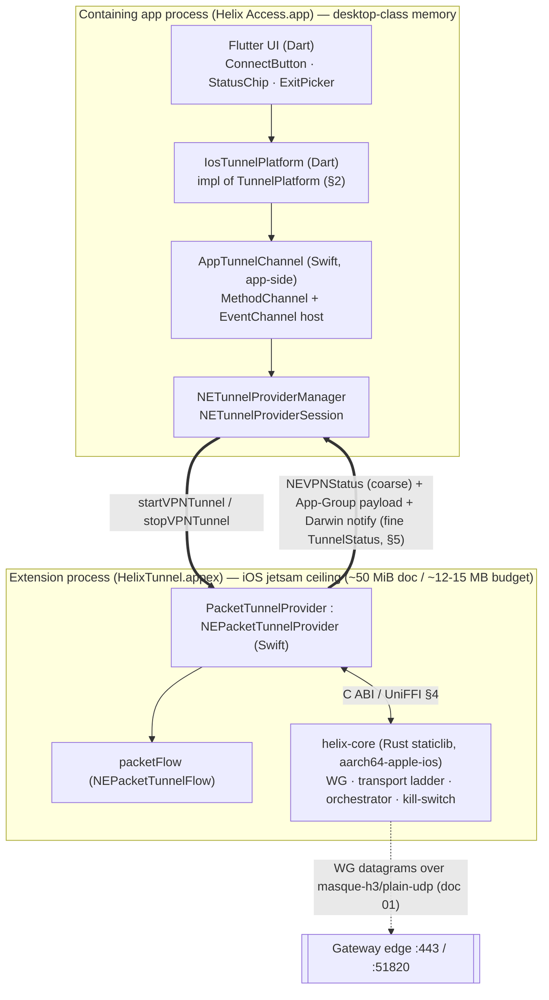

# Apple shim (iOS/macOS NEPacketTunnelProvider)

**Revision:** 1
**Last modified:** 2026-06-25T00:00:00Z

> Master technical specification — Volume 4 (Clients), nano-detail deep-dive. This
> document **deepens** the Apple row of the per-platform shim matrix
> [03-client §5.1] into an implementation-ready specification of the
> `apps/access/{ios,macos}` `NEPacketTunnelProvider` (Swift), the Apple impl of the
> `TunnelPlatform` contract [03-client §4], the Swift⇄Rust `helix-core` staticlib FFI
> surface, the two-process status bridge, the **iOS Network-Extension memory ceiling**
> (the program's single hardest constraint, CI4), the size-first `aarch64-apple-ios`
> build, and macOS desktop-class differences. SPEC-ONLY: it describes **what to build**,
> not the shipping product. Sources cited inline by id — `[03-client §N]` =
> `final/03-client-core-and-ui.md`; `[01-TT §N]` = `final/v02-data-plane/transport-trait.md`;
> `[01-ORCH §N]` = `final/v02-data-plane/orchestrator-and-state.md`; `[04_UI]` =
> `04_VPN_CLD/HelixVPN-helix-ui-Flutter.md`; `[04_ARCH §N]` =
> `04_VPN_CLD/HelixVPN-Architecture-Refined.md`; `[04_P0 §N]` =
> `04_VPN_CLD/HelixVPN-Phase0-Spike.md`; `[research-ios_android]` =
> `v09-research/research-ios_android.md`; `[research-flutter_ffi]` = the
> flutter_rust_bridge/UniFFI research digest; `[SYN §N]` = the cross-document synthesis.
> Any claim not grounded in that evidence base is tagged `UNVERIFIED` per constitution
> §11.4.6 — never fabricated.

---

## Table of contents

- [0. Position, ownership, and invariants](#0-position-ownership-and-invariants)
- [1. The two-process reality (extension vs containing app)](#1-the-two-process-reality-extension-vs-containing-app)
- [2. The Apple `TunnelPlatform` implementation (Dart side)](#2-the-apple-tunnelplatform-implementation-dart-side)
- [3. `NEPacketTunnelProvider` (Swift) — full lifecycle](#3-nepackettunnelprovider-swift--full-lifecycle)
- [4. The Swift⇄Rust FFI surface (C ABI / UniFFI)](#4-the-swiftrust-ffi-surface-c-abi--uniffi)
- [5. The status bridge — core `TunnelStatus` → Dart EventChannel](#5-the-status-bridge--core-tunnelstatus--dart-eventchannel)
- [6. The iOS NE memory ceiling — the hard constraint](#6-the-ios-ne-memory-ceiling--the-hard-constraint)
- [7. Swift⇄Rust staticlib build (`aarch64-apple-ios`)](#7-swiftrust-staticlib-build-aarch64-apple-ios)
- [8. macOS desktop-class differences](#8-macos-desktop-class-differences)
- [9. Lifecycle state machines](#9-lifecycle-state-machines)
- [10. Error handling & edge cases](#10-error-handling--edge-cases)
- [11. Memory / size / performance budgets](#11-memory--size--performance-budgets)
- [12. Test points — tied to the §11.4.169 test-type vocabulary](#12-test-points--tied-to-the-114169-test-type-vocabulary)
- [13. Cross-doc seams & surfaced decisions](#13-cross-doc-seams--surfaced-decisions)
- [Sources verified](#sources-verified)

---

## 0. Position, ownership, and invariants

### 0.1 What this document owns

This document owns the **Apple `TunnelPlatform` shim** — the only Apple-specific code in
the client stack [03-client §4 O-payoff]. Concretely:

1. The Dart `IosTunnelPlatform` / `MacosTunnelPlatform` impls of the `TunnelPlatform`
   contract [03-client §4] that marshal `startTunnel`/`stopTunnel`/`events()` onto
   `NETunnelProviderManager` (§2).
2. The `NEPacketTunnelProvider` subclass (`PacketTunnelProvider.swift`) that owns
   `packetFlow`, configures `NEPacketTunnelNetworkSettings`, and pumps packets
   through the in-extension Rust `helix-core` (§3) [03-client §5.1, 04_P0 §6].
3. The **Swift⇄Rust C-ABI FFI surface** the extension links against (the `cbindgen`
   header over the `helix-ffi` crate; UniFFI is the typed alternative — decision
   D-CLIENT-3) (§4) [03-client §3, D-CLIENT-3].
4. The **two-process status bridge** that carries the core's `TunnelStatus` stream
   (emitted *inside the extension process*) back to the Flutter UI (running in the
   *containing app process*) as `PlatformTunnelEvent`s (§5) [01-ORCH §4].
5. The **iOS NE memory-ceiling discipline** (G3 make-or-break) — measurement,
   budgets, and the documented fallback ladder (§6) [04_P0 §6.4, research-ios_android §1].
6. The **size-first `aarch64-apple-ios` staticlib build** of `helix-core` (§7)
   [research-ios_android §2].

### 0.2 What this document does NOT own

- The `helix-core` internals (WG crypto, `helix-transport` carriers, the orchestrator
  three-loop, the ladder) — owned by Volume 2 [01-TT, 01-ORCH]; this doc links the
  staticlib and drives its *exported* surface only [03-client §0].
- The shared Flutter UI (`ConnectButton`, `ExitPicker`, `helix_design`, Riverpod) — it
  is byte-identical across all platforms and ports for free; the shim does not
  [03-client §5 payoff, §7, §8].
- The FFI *surface contract* itself (`start/stop/status_stream/attach_tun/…` + the
  mirrored `TunnelStatus`) — fixed by [03-client §3]; this doc owns only the *Apple
  binding* of that surface (the cbindgen/UniFFI header + the in-extension call sites).
- The `TransportConfig` source (`WatchNetworkMap`) — doc 02; the shim hands the core a
  resolved session/map token and never invents an endpoint (I3) [01-TT §3.1].

### 0.3 Invariants this document inherits and tightens

| # | Invariant | Source | Apple-specific tightening |
|---|---|---|---|
| CI1 | The shim owns the OS tunnel lifecycle; `helix_core_ffi` owns logic + status. | [03-client §0.1 CI1] | On Apple the tunnel lives in a **separate extension process**; the core runs *inside* that process, so the status stream must be **bridged cross-process** to the app (§5). |
| CI2 | The UI is a pure function of the core status stream; never paints green on intent. | [03-client §0.1 CI2] | `NEVPNStatus` (coarse, app-side) is **not** the source of truth — the fine-grained `TunnelStatus` pushed from the extension is (§5.4). |
| CI4 | The iOS NE memory ceiling is the hardest constraint and the reason the core is Rust. | [03-client §0.1 CI4, 04_ARCH §5.6] | Quantified, measured-on-device, fallback-laddered in §6; design budget is **~12–15 MB working set**, NOT the 50 MiB headline (research-ios_android §1). |
| O1 | `startTunnel` is idempotent + permission-aware; deny ⇒ `permissionDenied`, no half-open TUN. | [03-client §4.1 O1] | Maps to `NETunnelProviderManager.loadAllFromPreferences` + `saveToPreferences` + `startVPNTunnel(options:)`; permission denial surfaces as a specific `NEVPNError` (§2.3, §10). |
| O2 | The shim hands the core a packet path; it never does crypto/obfuscation. | [03-client §4.1 O2] | Apple has **no userspace TUN fd** — it pumps `NEPacketTunnelFlow` packets via callbacks (`helix_core_tun_out` / `helix_core_set_tun_writer`), NOT `attach_tun(fd)` (§3.3, §4.2). This is the load-bearing Apple-vs-Android difference. |
| O3 | `events()` reports `revoked` when the OS/admin kills the tunnel out-of-band. | [03-client §4.1 O3] | `stopTunnel(with:.userInitiated/.providerFailed/...)` + `device.revoked` (doc 02) → `Down{reason:"auth-failed"}` → `revoked` (§5.5, §10). |
| O4 | On `stopTunnel` the shim restores a quiescent OS state on every exit path. | [03-client §4.1 O4] | `helix_core_stop()` in `stopTunnel`'s completion + the kill-switch posture is handled *inside* the core (`includeAllNetworks`/`excludeLocalNetworks` + on-demand rules) (§3.4, §10). |
| I1 | The transport never sees plaintext; the shim never inspects payload. | [01-TT §1 I1] | `packetFlow` packets are plaintext IP **only on the app→core inbound write to the tunnel**; the shim copies bytes opaquely and never logs them (§3.3, §11.4.10). |

---

## 1. The two-process reality (extension vs containing app)

The single fact that shapes every Apple decision: **on Apple a Packet Tunnel Provider is a
separate process from the app that hosts the UI** [research-ios_android §1.4, 04_P0 §6].
The Flutter UI runs in the *containing app* (`Helix Access.app`); the
`NEPacketTunnelProvider` runs in a *system-spawned extension process*
(`HelixTunnel.appex`) with its **own address space and its own jetsam memory budget**.
`helix-core` runs **inside the extension**, because that is where `packetFlow` (the
packet I/O) lives. Therefore the core's `TunnelStatus` stream is generated in the
extension and must cross a process boundary to reach the UI.



> **Why this matters (CI2).** The app cannot read the core's in-process broadcast channel
> directly. It must (a) observe `NEVPNStatusDidChange` for coarse transitions
> (`connecting/connected/reconnecting/disconnected`), and (b) receive the *fine* status
> (`Handshaking` vs `Connecting`, `Connected{transport,rtt}`, `Down{reason}`) via the
> cross-process push of §5. Painting the UI on `NEVPNStatus` alone would lose the
> transport/rtt/reason detail the `StatusChip` needs and would risk the "connected but
> actually handshaking" lie CI2 forbids.

---

## 2. The Apple `TunnelPlatform` implementation (Dart side)

The Apple shim satisfies the shared `TunnelPlatform` contract [03-client §4]:

```dart
abstract class TunnelPlatform {
  Future<void> startTunnel(TunnelConfig cfg);
  Future<void> stopTunnel();
  Stream<PlatformTunnelEvent> events();
}
```

### 2.1 `IosTunnelPlatform` (Dart) — the marshaller

```dart
// helix_core_ffi/lib/src/platform/ios_tunnel_platform.dart
class IosTunnelPlatform implements TunnelPlatform {
  static const _method = MethodChannel('helixvpn/tunnel');
  static const _events = EventChannel('helixvpn/tunnel/events');

  @override
  Future<void> startTunnel(TunnelConfig cfg) async {
    // App-side ONLY configures + starts NETunnelProviderManager; it does NOT touch packets.
    await _method.invokeMethod('startTunnel', <String, dynamic>{
      'overlayIp':   cfg.overlayIp,             // 100.64.0.7/32 or fd7a:…/128
      'routes':      cfg.routes,                // AllowedIPs → includedRoutes
      'dnsServers':  cfg.dnsServers,            // tunnel DNS (anti-leak)
      'mtu':         cfg.mtu,                   // 1280 MASQUE / 1420 plain WG [01-TT §4.8]
      'sessionToken':cfg.sessionOrMapToken,     // → helix_core_start, never logged (§11.4.10)
      // NOTE: splitExcludeApps is NOT honoured on iOS (no per-app VPN for 3rd-party apps,
      //       §10 E7); macOS supports excludeLocalNetworks only. Surfaced, not silently dropped.
    });
  }

  @override
  Future<void> stopTunnel() => _method.invokeMethod('stopTunnel');

  @override
  Stream<PlatformTunnelEvent> events() =>
      _events.receiveBroadcastStream().map(_decodeEvent); // §5.6
}
```

### 2.2 Channel verbs (Dart → app-side Swift)

| Verb | Direction | Swift handler | Effect |
|---|---|---|---|
| `startTunnel(args)` | Dart → app Swift | `AppTunnelChannel.start` | load/save `NETunnelProviderManager`, `startVPNTunnel(options: {token,…})` |
| `stopTunnel()` | Dart → app Swift | `AppTunnelChannel.stop` | `session.stopVPNTunnel()` |
| `events()` stream | app Swift → Dart | `EventChannel.EventSink` | emits `up/down/permissionDenied/revoked/error` decoded from §5 |

`startTunnel`/`stopTunnel` complete on the app-side `MethodChannel`; they do **not** carry
status — status flows out-of-band on the EventChannel fed by the §5 bridge so the contract's
"`events()` is lifecycle only, never data" rule [03-client §4 O3] holds.

### 2.3 Permission-aware start (O1)

```swift
// apps/access/ios/Runner/AppTunnelChannel.swift  (app process)
func start(_ args: [String: Any], result: @escaping FlutterResult) {
  NETunnelProviderManager.loadAllFromPreferences { managers, err in
    if let err { return result(self.flError("load", err)) }          // O1: surface, no half-open
    let mgr = managers?.first ?? NETunnelProviderManager()
    let proto = NETunnelProviderProtocol()
    proto.providerBundleIdentifier = "io.helixvpn.access.tunnel"      // the .appex bundle id
    proto.serverAddress = (args["overlayIp"] as? String) ?? "HelixVPN"
    // Non-secret config travels in providerConfiguration; the SESSION TOKEN travels in
    // startVPNTunnel(options:) (kept out of the saved preferences plist → §11.4.10):
    proto.providerConfiguration = ["routes": args["routes"]!, "dns": args["dnsServers"]!,
                                   "mtu": args["mtu"]!]
    mgr.protocolConfiguration = proto
    mgr.localizedDescription  = "HelixVPN"
    mgr.isEnabled = true
    mgr.saveToPreferences { saveErr in
      if let saveErr = saveErr as NSError? {
        // Permission sheet declined → NEVPNError.configurationReadWriteFailed / .Code(1)
        if saveErr.domain == NEVPNErrorDomain { return result(self.flPermissionDenied()) } // O1
        return result(self.flError("save", saveErr))
      }
      mgr.loadFromPreferences { _ in
        do {
          let opts: [String: NSObject] = [
            "sessionToken": (args["sessionToken"] as! String) as NSObject  // ephemeral, not persisted
          ]
          try (mgr.connection as! NETunnelProviderSession).startVPNTunnel(options: opts)
          result(nil)                                                   // start accepted (NOT "connected")
        } catch { result(self.flError("startVPNTunnel", error)) }
      }
    }
  }
}
```

> **O1 honesty (§11.4.6).** A declined VPN-permission sheet MUST surface as
> `PlatformTunnelEventKind.permissionDenied`, never `error`, and leave **no** saved-enabled
> manager behind (the next `loadAllFromPreferences` must not find a dangling config). The
> session token rides in `startVPNTunnel(options:)` and is therefore **never written to the
> preferences plist** (§11.4.10 no-secret-at-rest).

---

## 3. `NEPacketTunnelProvider` (Swift) — full lifecycle

The make-or-break class [04_P0 §6]. It runs in the extension process, owns `packetFlow`,
configures the tunnel network settings, links the Rust staticlib, and pumps packets.

### 3.1 Class skeleton

```swift
// apps/access/ios/HelixTunnel/PacketTunnelProvider.swift   (extension process)
import NetworkExtension
import os

final class PacketTunnelProvider: NEPacketTunnelProvider {
  private let log = Logger(subsystem: "io.helixvpn.tunnel", category: "provider")
  private var started = false                    // idempotency guard (O1)

  override func startTunnel(options: [String: NSObject]?,
                            completionHandler: @escaping (Error?) -> Void) {
    guard !started else { return completionHandler(nil) }   // idempotent (O1)
    started = true
    let cfg = decodeTunnelConfig(options, protocolConfig: self.protocolConfiguration)
    applyNetworkSettings(cfg) { [weak self] err in
      guard let self else { return }
      if let err { self.started = false; return completionHandler(err) }  // no half-open (O1/O4)
      // 1. Wire the core's outbound writer (core → packetFlow → OS) BEFORE start, so no race:
      installTunWriter()                                                  // §3.3
      installStatusCallback()                                             // §5.2
      // 2. Start the Rust core in-process (it owns WG + transport ladder + kill-switch):
      var c = HelixClientConfig(
        sessionToken: cfg.sessionToken,                                   // ephemeral, never logged
        mode: HELIX_MODE_CLIENT,
        mtu: cfg.mtu)
      let rc = helix_core_start(&c)                                       // §4.1
      guard rc == HELIX_OK else {
        self.started = false
        return completionHandler(self.mapCoreError(rc))                   // §10 error map
      }
      // 3. Begin the read pump (packetFlow → core), recursively:
      self.pumpOutbound()                                                 // §3.3
      // 4. Return SUCCESS once the carrier+settings are ready. The fine status
      //    (Handshaking→Connected) is pushed via the §5 bridge, NOT here (CI2).
      completionHandler(nil)
    }
  }

  override func stopTunnel(with reason: NEProviderStopReason,
                           completionHandler: @escaping () -> Void) {
    log.notice("stopTunnel reason=\(reason.rawValue)")
    helix_core_stop()                                                     // §4.1 (O4 quiescent)
    started = false
    // Map the OS stop reason into a Down{reason} for the bridge (§5.5):
    publishStatus(downReasonFor(reason))                                  // best-effort final push
    completionHandler()
  }

  // App→extension request/response (e.g. "getStatus") — the §5 pull path:
  override func handleAppMessage(_ data: Data,
                                 completionHandler: ((Data?) -> Void)?) {
    completionHandler?(currentStatusPayload())                           // §5.3
  }

  // OS is about to suspend the device; flush nothing durable (I5), keep tunnel:
  override func sleep(completionHandler: @escaping () -> Void) { completionHandler() }
  override func wake() { /* WG roams on the new path automatically [01-ORCH §7.5] */ }
}
```

### 3.2 Network settings (the anti-leak configuration)

```swift
private func applyNetworkSettings(_ cfg: TunnelConfig,
                                  _ done: @escaping (Error?) -> Void) {
  let settings = NEPacketTunnelNetworkSettings(tunnelRemoteAddress: cfg.gatewayHost)
  // overlay IPv4:
  let v4 = NEIPv4Settings(addresses: [cfg.overlayIp], subnetMasks: ["255.255.255.255"])
  v4.includedRoutes = cfg.routes.map { NEIPv4Route(destinationAddress: $0.addr,
                                                   subnetMask: $0.mask) }   // AllowedIPs
  settings.ipv4Settings = v4
  // overlay IPv6 (ULA /48 per tenant, D4 [SYN §3]) when present:
  if let v6 = cfg.overlayIp6 {
    let s6 = NEIPv6Settings(addresses: [v6], networkPrefixLengths: [128])
    s6.includedRoutes = cfg.routes6.map { NEIPv6Route(destinationAddress: $0.addr,
                                                     networkPrefixLength: $0.prefix) }
    settings.ipv6Settings = s6
  }
  // tunnel DNS — the anti-leak core: all :53 goes into the tunnel:
  let dns = NEDNSSettings(servers: cfg.dnsServers)
  dns.matchDomains = [""]                       // match ALL domains → no plaintext :53 off-tunnel
  settings.dnsSettings = dns
  settings.mtu = NSNumber(value: cfg.mtu)        // 1280 MASQUE / 1420 plain WG [01-TT §4.8]
  setTunnelNetworkSettings(settings, completionHandler: done)
}
```

> **DNS-leak note (CI-aligned).** `matchDomains = [""]` forces *every* DNS query through
> the tunnel DNS — the iOS-NE realization of the orchestrator's "force tunnel DNS; block
> plaintext :53 off-tunnel" rule [01-ORCH §8.3]. iOS NE has **no userspace firewall**, so
> the kill-switch is realized by (a) `includeAllNetworks` / `excludeLocalNetworks` on the
> protocol (§3.4), and (b) the default-route capture above — not by `nft` rules as on Linux.

### 3.3 The packet pump (the O2 seam — no TUN fd on Apple)

Apple gives the extension `packetFlow: NEPacketTunnelFlow` with `readPackets`/`writePackets`
— there is **no file descriptor** to hand to the core, so the Android/Linux `attach_tun(fd)`
path does **not** apply here [research-ios_android §3 contrast, 03-client §5.1]. Instead the
shim pumps packets across the FFI by value:

```swift
// Outbound: OS app traffic → packetFlow → core (encrypt+send over transport)
private func pumpOutbound() {
  packetFlow.readPackets { [weak self] packets, protocols in
    guard let self else { return }
    for (i, pkt) in packets.enumerated() {
      let isV6 = protocols[i].int32Value == AF_INET6
      pkt.withUnsafeBytes { raw in
        helix_core_tun_out(raw.bindMemory(to: UInt8.self).baseAddress,
                           UInt(pkt.count), isV6)                    // §4.2 — opaque copy (I1)
      }
    }
    self.pumpOutbound()                                              // recurse (NE idiom)
  }
}

// Inbound: core (decrypted IP packets) → packetFlow → OS. Registered ONCE at start:
private func installTunWriter() {
  // The C callback trampolines back into Swift; `ctx` carries `self` (Unmanaged).
  let ctx = Unmanaged.passUnretained(self).toOpaque()
  helix_core_set_tun_writer({ pkt, len, isV6, ctx in
    let me = Unmanaged<PacketTunnelProvider>.fromOpaque(ctx!).takeUnretainedValue()
    let data = Data(bytes: pkt!, count: Int(len))
    let proto = isV6 ? NSNumber(value: AF_INET6) : NSNumber(value: AF_INET)
    me.packetFlow.writePackets([data], withProtocols: [proto])      // §4.2
  }, ctx)
}
```

> **O2/I1 discipline.** The shim copies packet bytes opaquely (`Data(bytes:count:)`) and
> never parses, logs, or mutates them. All crypto + obfuscation lives in `helix-core`
> (one core, no fork) [03-client §4 O2, 01-TT §1 I1]. The recursive `readPackets`
> continuation is the canonical NE pump idiom; it is cancel-safe (a `stopTunnel` tears the
> provider down and the continuation simply stops being called).

### 3.4 Kill-switch posture on Apple (O4)

iOS/macOS NE realize the "no leaks if the tunnel drops" guarantee [04_ARCH §5.6] through
the **protocol configuration**, set on the app side at save time, not by in-extension
firewall rules:

| Knob | Effect | Helix mapping |
|---|---|---|
| `NETunnelProviderProtocol.includeAllNetworks` | route ALL traffic into the tunnel; on drop, traffic is blocked | the iOS kill-switch ON state (Strict mode [01-ORCH §8.2]) |
| `.excludeLocalNetworks` | permit RFC1918 LAN (printers) even when `includeAllNetworks` | `KillSwitchConfig.allow_lan` [01-ORCH §8.2] |
| `.enforceRoutes` | OS enforces `includedRoutes` even when other VPNs/configs exist | hardens AllowedIPs capture |
| on-demand rules (`NEOnDemandRule`) | auto-reconnect / always-on | the "always-on VPN" UX (Phase 2) |

The core's internal kill-switch state machine [01-ORCH §8] still drives *when* the tunnel
should be up; on Apple the *enforcement* is the OS routing + `includeAllNetworks`, so the
in-extension core does NOT install `nft`-equivalent rules (none exist in the NE sandbox).
`UNVERIFIED`: whether `includeAllNetworks` fully blocks egress during the
extension-restart window on every iOS version — measured in the G3/SC soak (§12), never
assumed (§11.4.6).

---

## 4. The Swift⇄Rust FFI surface (C ABI / UniFFI)

The extension links `helix-core` as a **staticlib** (`crate-type = ["staticlib"]`) and
calls its exported C surface generated from the `helix-ffi` crate [03-client §3,
research-ios_android §2.4]. Decision **D-CLIENT-3**: UniFFI for typed Swift, cbindgen as
the fallback for the raw-callback pump where UniFFI's async/callback ergonomics are thin
[03-client D-CLIENT-3]. This section pins the **cbindgen C ABI** (the lowest common
denominator both binding generators agree on); the UniFFI typed wrapper is a thin overlay.

### 4.1 Lifecycle + config (C ABI)

```c
// helix_core.h  — cbindgen-generated from helix-ffi/src/ffi_capi.rs
#include <stdint.h>

typedef enum {                       // mirrors api.rs CoreMode [03-client §3.1]
  HELIX_MODE_CLIENT    = 0,
  HELIX_MODE_CONNECTOR = 1,
} HelixCoreMode;

typedef enum {                       // start/stop result; maps to NEVPNError + Down.reason (§10)
  HELIX_OK            = 0,
  HELIX_ERR_CONFIG    = 1,           // bad token / unparseable map      → "host-fatal"
  HELIX_ERR_HANDSHAKE = 2,           // carrier dialled, WG never replied → retry/escalate
  HELIX_ERR_HOST      = 3,           // settings/packetFlow unusable      → "host-fatal"
  HELIX_ERR_AUTH      = 4,           // WG handshake rejected (revoked)   → "auth-failed", NO retry
} HelixResult;

typedef struct {
  const char* session_token;         // ephemeral; NEVER persisted or logged (§11.4.10)
  HelixCoreMode mode;
  uint16_t      mtu;                 // inner WG MTU ceiling [01-TT §4.8]
} HelixClientConfig;

// Start the in-extension core. Returns once WG+transport tasks are spawned (NOT once
// the tunnel is "connected" — that is reported via the status callback, CI2).
HelixResult helix_core_start(const HelixClientConfig* cfg);

// Idempotent graceful stop: FIN the carrier, revert state, stop loops (O4).
void        helix_core_stop(void);

// Apply a fresh resolved map (Phase 1 WatchNetworkMap delta; Phase 0 static map).
HelixResult helix_core_apply_map(const uint8_t* map_cbor, uintptr_t len);
```

### 4.2 The packet pump (C ABI — the Apple-specific seam)

```c
// Outbound: hand ONE plaintext IP packet from packetFlow to the core (it encrypts+sends).
// `is_v6` selects the AF for the inner WG router. Bytes are copied in-crate; the caller's
// buffer is NOT retained past the call (no aliasing of packetFlow storage).
void helix_core_tun_out(const uint8_t* pkt, uintptr_t len, bool is_v6);

// Inbound writer: the core invokes this callback with a DECRYPTED IP packet to write to
// packetFlow. Registered ONCE before start. `ctx` is an opaque app pointer (Unmanaged self).
typedef void (*HelixTunWriter)(const uint8_t* pkt, uintptr_t len, bool is_v6, void* ctx);
void helix_core_set_tun_writer(HelixTunWriter cb, void* ctx);
```

> **Why a callback pump and not `attach_tun(fd)`.** `NEPacketTunnelFlow` exposes
> `readPackets`/`writePackets`, never a kernel fd, so the [03-client §3] `attach_tun(fd:i32)`
> entry point is unused on Apple. Android/Linux DO use `attach_tun(fd)` (the
> `ParcelFileDescriptor`/`tun` fd) [research-ios_android §3]. The FFI crate exports **both**
> entry points; each platform shim wires the one its OS provides — the core's internal
> `tun → wg` loop A and `wg → tun` loop B [01-ORCH §3] read/write through whichever sink
> was installed. This is the only place the otherwise-uniform FFI surface diverges per OS.

### 4.3 Status callback (C ABI — feeds the §5 bridge)

```c
// The core pushes EVERY TunnelStatus transition here (in-extension). Payload is a compact
// CBOR/JSON encoding of the 5-variant TunnelStatus enum (§5.1). Called from the core's
// state-driver task; the Swift handler must be cheap + non-blocking (§5.2).
typedef void (*HelixStatusCb)(const uint8_t* status_cbor, uintptr_t len, void* ctx);
void helix_core_set_status_cb(HelixStatusCb cb, void* ctx);

// Pull the latest status synchronously (for handleAppMessage "getStatus", §5.3).
// Writes up to `cap` bytes into `out`, returns the written length (0 if none yet).
uintptr_t   helix_core_current_status(uint8_t* out, uintptr_t cap);
```

### 4.4 FFI safety & memory rules (release-blocking)

| # | Rule | Why |
|---|---|---|
| F1 | Every `*const u8`/`*mut u8` is **copied in-crate** on entry; no Rust struct ever aliases a Swift-owned buffer past the call. | avoids use-after-free across the FFI; required for `panic=abort` safety (§7). |
| F2 | The status/writer callbacks are `extern "C"` `fn` pointers with a `void* ctx`; the core stores them behind an `AtomicPtr` set once before `helix_core_start`. | no captured-closure ABI mismatch; callback set is happens-before the loops. |
| F3 | A Rust `panic` inside the core MUST NOT unwind across the C ABI — `panic = "abort"` (§7) makes any panic a clean process abort (the extension is restarted by NE) rather than UB. | `panic=abort` is both a size win AND an FFI-soundness requirement. |
| F4 | The session token (`*const c_char`) is copied into a `SecretBytes`-class buffer [01-TT §3.2] and zeroized on drop; it is never logged on either side (§11.4.10). | no-secret-leak. |
| F5 | All FFI functions are `#[no_mangle] pub extern "C"`; the header is **drift-checked** in CI against the crate (a divergence FAILs the build, mirroring the frb contract test [03-client §12]). | one source of truth, no silent surface drift. |

---

## 5. The status bridge — core `TunnelStatus` → Dart EventChannel

The core's status stream lives **inside the extension**; the UI lives **in the app**. This
section pins how a `TunnelStatus` transition becomes a Dart `PlatformTunnelEvent`. **The
core-emitted enum is the 5-variant `TunnelStatus` from [01-ORCH §4.1]** — this doc keeps the
FFI status payload byte-consistent with that enum; the richer Dart-facing `TunnelStatus`
(adding `Disconnected`/`path`/`Danger`) [03-client §3.1] is a *UI projection* layered in
`helix_core.dart`, not a second wire enum.

### 5.1 The canonical core-emitted enum (consistency anchor)

```rust
// helix-core/src/status.rs — the SINGLE wire enum the FFI status callback serializes.
// IDENTICAL to [01-ORCH §4.1]; the Apple bridge MUST NOT invent variants.
#[derive(Clone, Debug, PartialEq, Eq)]
pub enum TunnelStatus {
    Connecting,                                    // dialling a rung (carrier handshake)
    Handshaking,                                   // carrier up; WG Noise IK in flight
    Connected { transport: String, rtt_ms: u32 },  // ("masque-h3", 23)
    Reconnecting,                                  // a working tunnel dropped; re-dialling
    Down { reason: String },                       // terminal for this attempt (§5.5 prefixes)
}
```

`Down.reason` uses the [01-ORCH §4.4] stable prefixes (`"stopped" | "pinned-transport-failed"
| "ladder-exhausted" | "auth-failed" | "no-route" | "host-fatal"`) so the bridge can classify
without parsing prose (§11.4.6 no-guessing).

### 5.2 Push path (extension → app): App-Group file + Darwin notify

The extension cannot call into the app process directly. The recommended **push** mechanism
(`UNVERIFIED` exact API names verified on device, but all are standard NE-IPC primitives):

```mermaid
sequenceDiagram
    autonumber
    participant CORE as helix-core (Rust, ext)
    participant CB as HelixStatusCb (Swift, ext)
    participant AG as App-Group container (shared file)
    participant DN as Darwin Notify Center (kernel)
    participant APP as AppTunnelChannel (Swift, app)
    participant EC as EventChannel sink (Dart)

    CORE->>CB: status_cb(cbor(Connected{masque-h3,23}))
    CB->>AG: atomic write status.cbor  (App-Group shared container)
    CB->>DN: post "io.helixvpn.status"  (CFNotificationCenter Darwin notify)
    DN-->>APP: observer fires (no payload — just a wake)
    APP->>AG: read status.cbor  (latest only; coalesced)
    APP->>EC: sink.add(PlatformTunnelEvent.up / down / ...)  (§5.6 mapping)
    EC-->>EC: Riverpod tunnelStatusProvider folds it (CI2)
```

- The status callback writes the latest `TunnelStatus` (CBOR) **atomically** (write-temp +
  rename) into the App-Group container both processes share, then posts a **Darwin
  notification** (`CFNotificationCenterGetDarwinNotifyCenter`) — a payload-less cross-process
  wake. The app's observer reads the *latest* file (coalesced; only the newest state matters,
  matching the broadcast "skip-to-latest" semantics [01-ORCH §4.2/§4.6]).
- The status callback is **cheap**: serialize + one atomic write + one notify post; it never
  blocks the core's state-driver task (§4.3 contract).
- **Why not `sendProviderMessage` for push?** `NETunnelProviderSession.sendProviderMessage`
  is **app→extension request/response only**; the extension cannot originate it. Hence the
  App-Group-file + Darwin-notify push for extension→app, and `sendProviderMessage` for the
  *pull* path (§5.3).

### 5.3 Pull path (app → extension): `sendProviderMessage`

On app foreground / cold start / after a Darwin-notify miss, the app pulls the current
status to resync (defends against a dropped notification):

```swift
// app process
func refreshStatus() {
  guard let session = mgr.connection as? NETunnelProviderSession else { return }
  try? session.sendProviderMessage("getStatus".data(using: .utf8)!) { reply in
    if let reply { self.emit(decodeTunnelStatus(reply)) }   // → EventChannel (§5.6)
  }
}
```

The extension answers in `handleAppMessage` (§3.1) via `helix_core_current_status` (§4.3).

### 5.4 Coarse `NEVPNStatus` as a backstop only

`NEVPNStatusDidChange` (`.connecting/.connected/.reconnecting/.disconnecting/.disconnected/
.invalid`) is observed by the app as a **backstop** — it guarantees the app learns of OS-side
transitions (e.g. the OS tearing the tunnel) even if a Darwin notify is missed. But it is
**coarse** (no transport/rtt/reason), so the fine `TunnelStatus` from §5.2/§5.3 is always the
source of truth for the `StatusChip`; `NEVPNStatus` only triggers a §5.3 pull (CI2).

### 5.5 `NEProviderStopReason` → `Down{reason}` mapping (O3)

```swift
func downReasonFor(_ r: NEProviderStopReason) -> String {
  switch r {
  case .userInitiated:           return "stopped"            // user toggled off (§8.6 only open path)
  case .providerFailed,
       .internalError:           return "host-fatal"
  case .authenticationCanceled,
       .configurationFailed:     return "auth-failed"        // → revoked (O3)
  case .noNetworkAvailable,
       .unrecoverableNetworkChange: return "ladder-exhausted"
  case .providerDisabled,
       .configurationDisabled,
       .configurationRemoved,
       .superceded:              return "auth-failed"        // admin/OS revoked the config (O3)
  @unknown default:              return "host-fatal"
  }
}
```

`device.revoked` propagated from the control plane (doc 02) reaches the core as a map delta
whose `peers_removed` includes the active peer → the core emits `Down{reason:"auth-failed"}`
[01-ORCH §6.4] → the bridge maps it to `PlatformTunnelEventKind.revoked` (§5.6).

### 5.6 `TunnelStatus` → `PlatformTunnelEvent` decode (Dart)

```dart
PlatformTunnelEvent _decodeEvent(dynamic raw) {
  final s = TunnelStatus.fromCbor(raw as Uint8List); // mirrors the §5.1 enum
  return switch (s) {
    Connecting()  || Handshaking() || Reconnecting() => PlatformTunnelEvent(PlatformTunnelEventKind.up),  // "in motion"; UI shows amber via the richer projection
    Connected()                                      => PlatformTunnelEvent(PlatformTunnelEventKind.up),
    Down(:final reason) when reason == 'auth-failed' => PlatformTunnelEvent(PlatformTunnelEventKind.revoked, reason),
    Down(:final reason) when reason == 'stopped'     => PlatformTunnelEvent(PlatformTunnelEventKind.down, reason),
    Down(:final reason)                              => PlatformTunnelEvent(PlatformTunnelEventKind.error,  reason),
  };
}
```

> **Boundary note.** `PlatformTunnelEvent` (lifecycle: up/down/permissionDenied/revoked/error)
> [03-client §4] is intentionally coarser than `TunnelStatus`. The *rich* status
> (`Connected{transport,rtt}`, `Handshaking`, `Danger`) reaches the UI **directly** via
> `tunnelStatusProvider` folding the core's `statusStream()` projection [03-client §8.2] — on
> Apple that stream is fed by the same App-Group/Darwin bridge. `events()` carries only the
> lifecycle transitions the `TunnelPlatform` contract owns; the two are complementary, not
> redundant.

---

## 6. The iOS NE memory ceiling — the hard constraint

CI4: this is the single strongest architectural driver and the reason the core is Rust, not
Go [04_ARCH §5.6, SYN §5]. The facts (every figure cited; never hardcoded — §11.4.6):

### 6.1 The facts (research-ios_android §1)

| Fact | Value | Source / status |
|---|---|---|
| Documented Packet-Tunnel-Provider limit (iOS 15–18) | **50 MiB** | Apple DTS (Quinn), measured iOS 16, reconfirmed 17/18 [research-ios_android §1] |
| Historical limit (iOS 11–14, 64-bit) | 15 MiB | [research-ios_android §1] |
| Observed real-world jetsam kill on iOS 17.3.1 | **~15 MB** (despite 50 MiB docs) | reported, root cause `PENDING_FORENSICS` [research-ios_android §1] |
| Dominant kill cause | **transient spikes** during upload-heavy throughput (buffer-pool/QUIC) | sing-box/WireGuard jetsam during speedtest [research-ios_android §1] |
| Scope | the **whole extension process** — Swift + Rust staticlib + every linked lib | [research-ios_android §1.4] |
| Official guidance | **"do not hard code knowledge of these limits"; measure on device** | Quinn, verbatim [research-ios_android §1.2] |

### 6.2 The design rule (engineering conclusion)

> **Target a steady-state working set of ~12–15 MB, NOT the 50 MiB headline**
> [research-ios_android §1, §4]. The 50 MiB is undocumented, may be lower on older devices,
> and 15 MB kills are reported in the wild. Because WireGuard is IP-level with no TCP
> connection tracking, a WG-class datapath fits comfortably; the risk is **spikes**, not
> steady state.

Concrete budget-keeping rules the Rust core MUST honour (the in-extension build):

| # | Rule | Realization |
|---|---|---|
| M1 | **Bound every buffer pool.** No per-flow state growth. | fixed-size receive buffer = negotiated MTU + headroom (not an arbitrary large value) [research-ios_android §1.6]; pre-allocated send scratch reused per loop [01-ORCH §3.1]. |
| M2 | **Cap QUIC flow-control windows** in the iOS build. | `masque-h3` carrier built with reduced `quinn` `receive_window`/`stream_receive_window` (iOS profile) — the §6.4 fallback rung 1. |
| M3 | **No backtrace/unwind machinery.** | `panic = "abort"` + `build-std` `panic_immediate_abort` (§7) drops `gimli`/format code [research-ios_android §2]. |
| M4 | **Single fixed receive buffer**, sized to MTU+headroom. | bound the NE read-buffer; do not allocate per `readPackets` burst. |
| M5 | **No durable per-connection state** (also I5). | only aggregate `TransportHealth` counters [01-TT §2.3]; nothing per-packet retained. |

### 6.3 How to measure on device (G3)

There is **no API to query or raise** the NE limit [research-ios_android §1.5]; footprint
must be measured empirically:

1. Build `helix-core` as `aarch64-apple-ios` (z/s + LTO + `panic=abort` + strip, §7); record
   the static archive size.
2. Attach Instruments **Allocations** + **VM Tracker** (or the Xcode Memory gauge) to the
   **extension** target (debug-attach to the running `.appex`, NOT the app). **Simulator
   memory is not representative** — real device only [04_P0 §6.3].
3. Drive a **sustained 1 GB transfer** with `plain-udp` **and** `masque-h3` **separately**
   (QUIC buffers cost more memory; both must pass) [04_P0 §6.3].
4. Sample `phys_footprint` via Mach `task_vm_info` (the value jetsam accounts against;
   `UNVERIFIED` — verify on device) and/or log Rust allocator stats periodically to catch
   spikes [research-ios_android §1.5].
5. Run the **upload-heavy speedtest scenario** specifically — it is the documented spike
   trigger that kills sing-box/WireGuard extensions [research-ios_android §1].

**G3 pass = steady-state `phys_footprint` under the device-enforced ceiling with ≥ 30 %
headroom across a 30-minute soak, for both transports, on a real device** [04_P0 §6.4,
03-client §5.1]. The number is captured evidence (Instruments RSS report + window-scoped MP4
per §11.4.159), never asserted (§11.4.6/.123).

### 6.4 The fallback ladder (if G3 fails) — D-CLIENT-1

Each rung is a real product decision, surfaced to the operator (§11.4.66), never hand-waved
[04_P0 §6.4, 03-client D-CLIENT-1]:

```mermaid
stateDiagram-v2
  [*] --> Measure : G3 soak (both transports, real device)
  Measure --> Pass : >=30% headroom, 30-min, no jetsam
  Measure --> Rung1 : FAIL (over ceiling / jetsam kill)
  Rung1 : Rung 1 — shrink buffers + cap QUIC windows (iOS build)
  Rung1 --> Measure : re-soak
  Rung1 --> Rung2 : still FAIL
  Rung2 : Rung 2 — MASQUE off-device for iOS (plain WG + on-path obfs only; PARTIAL feature loss)
  Rung2 --> Measure : re-soak
  Rung2 --> Rung3 : still FAIL
  Rung3 : Rung 3 — split core: lean WG datapath in-extension; QUIC negotiation in APP via app-extension IPC
  Rung3 --> Measure : re-soak
  Pass --> [*]
```

- **Rung 1** (preferred): cap QUIC flow-control windows (M2) + shrink buffer pools (M1) in
  the iOS build profile; re-soak. Prefer this if it reaches ≥ 30 % headroom [03-client
  D-CLIENT-1].
- **Rung 2**: move MASQUE off-device for iOS — ship only `plain-udp` + on-path/lwo obfs
  in-extension; the heavier QUIC carrier is not used on iOS. **Partial feature loss**
  (no MASQUE on the most censorship-hostile networks for iOS) — an explicit product decision.
- **Rung 3**: split the core — only the lean WG datapath runs in the extension; QUIC
  CONNECT-UDP negotiation runs in the *app* process and the established carrier is handed to
  the extension via app-extension IPC. Highest complexity; last resort.

### 6.5 macOS does NOT share this constraint

macOS `NEPacketTunnelProvider` (delivered as a System Extension or app-extension) runs with
**desktop-class memory** — there is **no 15/50 MiB jetsam cap** equivalent
[research-ios_android §3.5 contrast (Android), §8 here]. The full `masque-h3` carrier and
generous buffers are fine on macOS. **Only iOS is the binding memory constraint**; the same
Rust core links into both, but the **iOS build profile** (M1–M5, §6.2) is the lean one (§7,
§8).

---

## 7. Swift⇄Rust staticlib build (`aarch64-apple-ios`)

The core is built as a size-first static archive and linked into the extension
[research-ios_android §2]. Smaller code = fewer mapped pages = lower NE footprint *and*
smaller app.

### 7.1 Crate type & Cargo profile

```toml
# helix-ffi/Cargo.toml
[lib]
crate-type = ["staticlib"]          # .a linked into the .appex (no dylib entitlement friction)

# Cargo.toml — size-first release profile (research-ios_android §2)
[profile.release]
opt-level     = "z"                 # smallest code (benchmark "s" too — often faster, ~same size)
lto           = "fat"               # whole-program; max size reduction
codegen-units = 1                   # better cross-module size opt (slower compile)
panic         = "abort"             # drops unwinding tables + FFI-soundness (F3) — REQUIRED
strip         = true                # strip symbols (~3–8% extra)
```

### 7.2 iOS target build (size-first), with the nightly `build-std` win

```bash
# Stable, baseline:
cargo build --release --target aarch64-apple-ios -p helix-ffi

# Largest reduction (nightly build-std — drops std unwinding/format machinery, incl. gimli):
cargo +nightly build --release --target aarch64-apple-ios -p helix-ffi \
  -Z build-std=std,panic_abort \
  -Z build-std-features=panic_immediate_abort,optimize_for_size
# Representative reported reduction ~43% (build-std + panic_immediate_abort + optimize_for_size)
# [research-ios_android §2].
```

| Flag | Effect | Source |
|---|---|---|
| `opt-level="z"`/`"s"` | smallest code; benchmark both | [research-ios_android §2] |
| `lto="fat"` | whole-program inlining/dead-strip | [research-ios_android §2] |
| `codegen-units=1` | cross-module size opt | [research-ios_android §2] |
| `panic="abort"` | drops unwind tables; FFI-sound (F3) | [research-ios_android §2] |
| `strip=true` | removes names/debug (~3–8%) | [research-ios_android §2] |
| `build-std` + `panic_immediate_abort` + `optimize_for_size` | drops gimli/format from std (~43%) | [research-ios_android §2] |
| dependency audit | avoid fat deps (regex/format/heavy async) that bloat code | bitdrift [research-ios_android §2] |
| prefer `dyn` over generic explosion on cold paths | curb monomorphization bloat | bitdrift [research-ios_android §2] |

### 7.3 Linking into the extension & binding generation

- The `.a` is linked into the `HelixTunnel.appex` target; the linker dead-strips unreferenced
  symbols [research-ios_android §2.4]. A universal/xcframework packaging is `UNVERIFIED`
  per device-arch matrix — Phase-0/1 ships `aarch64-apple-ios` device + `aarch64-apple-ios-sim`
  + `aarch64/x86_64-apple-darwin` for macOS, assembled into an `xcframework`.
- **Bindings (D-CLIENT-3):** UniFFI generates the typed Swift wrapper (`HelixClientConfig`,
  enums) from the `helix-ffi` UDL/proc-macro; the raw callback pump (§4.2/§4.3) uses the
  cbindgen C header where UniFFI's callback ergonomics are thin [03-client D-CLIENT-3,
  research-flutter_ffi]. Both read **one** Rust surface; a header/UDL drift FAILs CI (F5).
- The Dart side links the **same** core via `flutter_rust_bridge` for the in-app logic-only
  calls (`exits`/`setExit`/`setShields`) that do not touch the OS tunnel [03-client §3.2] —
  but those run in the **app** process, distinct from the extension's linked copy. The two
  linked copies share source, never runtime state (the extension's core owns the tunnel;
  the app's frb core is logic-only). `UNVERIFIED`: whether Phase-1 links the frb core in the
  app at all on iOS, or routes all logic calls through `sendProviderMessage` to the single
  in-extension core — a Phase-0 G5 decision (recommend the latter to keep ONE live core).

---

## 8. macOS desktop-class differences

The same Apple shim serves macOS with three differences from iOS:

| Aspect | iOS | macOS |
|---|---|---|
| Memory | hard jetsam ceiling (~50 MiB doc / ~12–15 MB budget, §6) | **desktop-class, no NE jetsam cap** [research-ios_android §3.5 contrast] — full `masque-h3` + generous buffers |
| Extension packaging | app-extension (`.appex`) bundled in the app | **System Extension** (`.systemextension`, `NEMachServiceName`) OR app-extension; sysext needs `OSSystemExtensionRequest` activation + user approval in System Settings |
| Per-app split tunnel | not available to 3rd-party apps | `excludeLocalNetworks` + app-aware routing possible; still no arbitrary per-app like Android |
| Build profile | the lean §6.2 M1–M5 profile | may relax buffer caps (M1/M2) for throughput; same source, different feature flags |
| Signing | Apple notarize (App Store / TestFlight) | Apple notarize + **System Extension entitlement** (`com.apple.developer.networking.networkextension` = `packet-tunnel-provider`, sysext gatekeeper) [03-client §11] |

The Swift `PacketTunnelProvider` source is **shared** between iOS and macOS targets (one
`PacketTunnelProvider.swift`); the build flavors differ only in (a) extension packaging, (b)
the Rust core build profile, and (c) entitlements/signing. The Dart `TunnelPlatform` impl is
shared too (`AppleTunnelPlatform` with a thin `Platform.isMacOS` branch only for the sysext
activation request) [03-client §5 payoff].

---

## 9. Lifecycle state machines

### 9.1 Extension-process tunnel lifecycle (NE provider)

```mermaid
stateDiagram-v2
  [*] --> Stopped
  Stopped --> Starting : startTunnel(options) / decode cfg
  Starting --> SettingsApplied : setTunnelNetworkSettings ok
  Starting --> StartFailed : settings error (no half-open, O1/O4)
  SettingsApplied --> CoreStarting : install writer+status cb; helix_core_start
  CoreStarting --> Pumping : HELIX_OK; pumpOutbound begins
  CoreStarting --> StartFailed : HELIX_ERR_* (map → Down{reason}, §10)
  Pumping --> Pumping : packetFlow.readPackets ⇄ helix_core_tun_out / tun_writer
  Pumping --> Stopping : stopTunnel(reason) / device.revoked
  StartFailed --> Stopped : completionHandler(err)
  Stopping --> Stopped : helix_core_stop(); publish Down{reason} (§5.5); completionHandler()
```

### 9.2 App-side connect controller (drives the extension)

```mermaid
sequenceDiagram
    autonumber
    participant UI as Flutter UI (Dart)
    participant PLAT as IosTunnelPlatform (Dart)
    participant APP as AppTunnelChannel (Swift, app)
    participant NEM as NETunnelProviderManager
    participant PTP as PacketTunnelProvider (ext)
    participant CORE as helix-core (ext)

    UI->>PLAT: startTunnel(cfg)
    PLAT->>APP: MethodChannel start(cfg)
    APP->>NEM: load/save prefs + startVPNTunnel(options:{token})
    NEM->>PTP: spawn ext; startTunnel(options)
    PTP->>PTP: applyNetworkSettings (overlay IP, routes, tunnel DNS)
    PTP->>CORE: helix_core_start(cfg) + set_tun_writer + set_status_cb
    CORE-->>PTP: status Connecting → Handshaking → Connected{masque-h3,23}
    PTP->>APP: App-Group write + Darwin notify (§5.2)
    APP-->>PLAT: EventChannel.up  ;  StatusChip via tunnelStatusProvider
    UI->>PLAT: stopTunnel()
    PLAT->>APP: MethodChannel stop()
    APP->>NEM: session.stopVPNTunnel()
    NEM->>PTP: stopTunnel(.userInitiated)
    PTP->>CORE: helix_core_stop()  (O4)
    PTP->>APP: Down{reason:"stopped"} (§5.5)
    APP-->>PLAT: EventChannel.down
```

---

## 10. Error handling & edge cases

| # | Edge case | Handling | Constitution / source |
|---|---|---|---|
| E1 | VPN permission sheet declined | `saveToPreferences` returns `NEVPNError` → `permissionDenied` (not `error`); no enabled config left behind (O1) | §11.4.6, [03-client §4 O1] |
| E2 | `setTunnelNetworkSettings` fails | `started=false`, `completionHandler(err)`; never enter Pumping with no settings (no half-open) | [03-client §4 O1/O4] |
| E3 | `helix_core_start` → `HELIX_ERR_AUTH` (revoked key) | terminal **without retry**; `Down{reason:"auth-failed"}` → `revoked`; ladder escalation pointless (would mask revocation) | [01-ORCH §5.4] |
| E4 | `HELIX_ERR_HANDSHAKE` (carrier up, WG silent) | core escalates the ladder internally; status shows `Reconnecting`; not a provider failure | [01-ORCH §7], [01-TT §6] |
| E5 | iOS jetsam kills the extension (OOM) | NE restarts the provider; on-demand rules + `includeAllNetworks` keep traffic blocked during the gap (no leak); §6 budget is the prevention | [research-ios_android §1], §6 |
| E6 | Device sleep / network change (Wi-Fi→cellular) | `wake()` no-op; **WG roams** onto the new path on the next handshake/keepalive — no re-dial needed; the core's roam fast-path applies | [01-ORCH §7.5] |
| E7 | Per-app split tunnel requested on iOS | NOT available to 3rd-party apps on iOS; `splitExcludeApps` is surfaced as unsupported (honest, not silently dropped) | §11.4.6, [03-client §4] |
| E8 | App killed/backgrounded while connected | the extension keeps running (separate process); on app relaunch the §5.3 pull resyncs status — UI never lies (CI2) | §1, §5.3 |
| E9 | Darwin notification missed (delivery is best-effort) | the §5.4 `NEVPNStatus` backstop + the §5.3 cold-start pull recover the latest status | §5.3/§5.4 |
| E10 | `Oversize` datagram from the core | the core lowers inner MTU / fragments; the shim never truncates a packet (I2) | [01-TT §4.8], [01-ORCH §6.6] |
| E11 | Rust panic across the C ABI | `panic=abort` → clean process abort (NE restarts), never UB across FFI (F3) | §4.4 F3, §7 |
| E12 | Session token leak risk | token rides in `startVPNTunnel(options:)` (never in saved prefs plist), copied to `SecretBytes`, zeroized, never logged (F4) | §11.4.10, §4.4 F4 |
| E13 | macOS System Extension not yet approved | `OSSystemExtensionRequest` pends; surface a "approve in System Settings" prompt; do not claim connected | §11.4.6, §8 |

---

## 11. Memory / size / performance budgets

| Budget | Target | How | Source |
|---|---|---|---|
| **iOS extension steady-state `phys_footprint`** | **under device ceiling, ≥ 30 % headroom** across a 30-min soak, both transports (G3) | M1–M5 (§6.2): bounded buffer pools, capped QUIC windows, single MTU-sized rx buffer, no per-flow state, `panic=abort` | [04_P0 §6.4], [research-ios_android §1] |
| iOS design working-set | **~12–15 MB** (NOT 50 MiB) | the budget the build targets; 50 MiB is undocumented + 15 MB kills observed | [research-ios_android §1, §4] |
| Rust staticlib size | as small as feasible | z/s + fat LTO + codegen-units=1 + `panic=abort` + strip; `build-std`/`optimize_for_size` (~43%) | [research-ios_android §2] |
| iOS spike avoidance (upload-heavy) | no jetsam during 1 GB speedtest | bound send/QUIC buffers (M1/M2); the documented kill scenario | [research-ios_android §1] |
| macOS memory | desktop-class, no NE cap | full `masque-h3` + generous buffers permitted | [research-ios_android §3.5], §8 |
| Inner WG MTU | 1280 over MASQUE / 1420 plain WG | `settings.mtu` = `min(active.effective_mtu(), path_mtu)` | [01-TT §4.8], [01-ORCH §6.6] |
| Status bridge latency | sub-second app-visible transition | Darwin notify + atomic App-Group read; coalesced (latest only) | §5.2 |
| Pump overhead | no per-packet heap growth | opaque copy into a reused path; core reuses scratch buffers | [01-ORCH §3.1], M1 |

All budgets are **captured evidence** (Instruments RSS report + throughput CSV +
window-scoped MP4 per §11.4.159), measured on a real device, never asserted
(§11.4.6/.123).

---

## 12. Test points — tied to the §11.4.169 test-type vocabulary

Every Apple-shim workable item declares its required test types from the §11.4.169 closed set;
the only permitted absence of a warranted type is an honest §11.4.3 SKIP-with-reason, never a
silent gap. Four-layer enforcement per §11.4.4(b) applies to every closure. Codes match the
sibling data-plane spec [01-TT §9].

| Code | Type | Concrete Apple-shim test point | Evidence (§11.4.5/.69/.107) |
|---|---|---|---|
| `UT` | unit | `decodeTunnelConfig`/`downReasonFor`/`_decodeEvent` mapping tables; `TunnelStatus` CBOR round-trip identity; FFI header drift check (F5) | `xcodebuild test` + `cargo test` logs; drift diff |
| `IT` | integration | app↔extension `sendProviderMessage` round-trip returns current status; App-Group write + Darwin notify → app observer fires; core staticlib links + starts in a host-extension harness | provider-message capture; notify-observed log |
| `E2E` | end-to-end | real-device: tap Connect → overlay IP assigned → `curl http://<LAN host>/` over `plain-udp` **and** `masque-h3`; tap Disconnect → traffic blocked (kill-switch) | window-scoped MP4 of the journey (§11.4.159) + OCR `StatusChip "masque-h3 · 23ms"` |
| `FA` | full-automation (§11.4.25/.52/.98, deterministic §11.4.50) | scripted XCUITest drives connect→status→disconnect **N=3 identical** runs producing the same ordered `PlatformTunnelEvent` trace | 3× identical event-trace artifacts |
| `CH` | Challenges (challenges submodule §11.4.27(B)) | a Challenge scores the captured G3 + E2E evidence (not config) | Challenge `result.json` |
| `HQA` | HelixQA (helix_qa submodule) | autonomous QA session drives connect/roam/revoke across iOS + macOS targets | HelixQA session evidence |
| `LOAD` | DDoS / load-flood | sustained 1 GB transfer + handshake churn; no fd/buffer leak in the extension | throughput CSV + footprint trace |
| `SEC` | security (§11.4.10 + security submodule) | (a) session token appears in **no** log / no saved prefs plist (plant-and-grep); (b) `tshark` shows `masque-h3` flow = HTTP/3 with **no WG signature** (G2); (c) no plaintext packet logged by the shim | grep-empty proof; `tshark` classification |
| `SC` | stress + chaos (§11.4.85) | iface flap (Wi-Fi→cellular) → reconnect < 3 s (roam); kill the extension mid-transfer → NE restart, **no leak** during gap (E5); device sleep/wake | recovery trace; no-leak capture |
| `CONC` | concurrency / atomicity | concurrent outbound pump + inbound writer under load; status push during a transport swap drops zero packets | concurrency harness log |
| `RACE` | race / deadlock | `cargo test --features loom` on the in-crate status/writer atomics; TSan on the Swift bridge | loom + TSan report |
| `MEM` | memory (**G3 make-or-break**) | extension `phys_footprint` under ceiling with ≥ 30 % headroom, 30-min soak, **both** transports, real device + upload-heavy spike scenario | Instruments RSS report (§6.3) |
| `BENCH` | benchmarking / performance | per-transport through-tunnel throughput / CPU on device; status-bridge latency; staticlib size delta per build flag | throughput/CPU/size CSV |

### 12.1 Apple-specific acceptance gates

- **G3 (iOS NE memory) — make-or-break** [04_P0 §6.4]: §6.3 soak passes for both transports
  with ≥ 30 % headroom; if it fails, the §6.4 fallback ladder is engaged and the chosen rung
  is surfaced to the operator (§11.4.66) — never a silent feature drop.
- **G5 (FFI drives the core)** [04_P0 §9]: the extension's `helix_core_start` + pump + status
  callback drive a `Connecting → Handshaking → Connected{masque-h3,23}` transition observed by
  the Dart UI via the §5 bridge — recorded.
- **No-leak gate** (SEC + SC): with `includeAllNetworks`, no egress escapes during the
  extension-restart window; proven by capture, not assumed (§11.4.6).

### 12.2 Anti-bluff rule for this shim (§11.4.5/.69/.107)

The shim is the **only untyped seam** (Swift⇄Rust⇄Dart, cross-process) [03-client §4 O5] and
is covered on **real devices**, never by a mock-claiming-PASS (§11.4.27). A green Swift unit
test does NOT prove the user is protected — the authoritative evidence is the on-device E2E
window-scoped MP4 with the `StatusChip` reading `masque-h3 · direct · 23ms` confirmed by
OCR/vision validation (§11.4.158/.159), plus the Instruments G3 RSS report.

---

## 13. Cross-doc seams & surfaced decisions

| Seam | Fixed value | Owned by / consumed from |
|---|---|---|
| **FFI surface** (`helix_core_start/stop/apply_map`, `tun_out`, `set_tun_writer`, `set_status_cb`, `current_status`) | §4 (cbindgen C ABI) | binds [03-client §3] (the surface contract); the core internals are [01-TT]/[01-ORCH] |
| **Core-emitted `TunnelStatus`** (5-variant, byte-consistent) | §5.1 = [01-ORCH §4.1] | the Dart UI projection extension is [03-client §3.1]; this doc keeps the wire enum consistent |
| **`TunnelPlatform` channel** (`startTunnel/stopTunnel/events`, `PlatformTunnelEvent`) | §2 | [03-client §4]; `device.revoked` → `revoked` from doc 02 |
| **Packet-pump-not-fd** (Apple uses `tun_out`/`tun_writer`; Android/Linux use `attach_tun(fd)`) | §3.3, §4.2 | the only per-OS FFI divergence; [research-ios_android §3] |
| **iOS NE memory ceiling = the Rust-not-Go justification** (G3) | §6 | [04_ARCH §5.6], the whole "Rust core" thesis; build flags §7 |

### 13.1 Surfaced decisions (per §11.4.66 — options + recommendation, never silently resolved)

| # | Decision | Option A | Option B | Recommendation |
|---|---|---|---|---|
| **D-CLIENT-1** | iOS NE memory fallback if G3 fails | shrink buffers / cap QUIC windows in iOS build (rung 1) | move MASQUE off-device (rung 2) **or** split-core app-extension IPC (rung 3) | **Gate on the G3 measurement** (§6.3). Prefer A if it reaches ≥ 30 % headroom; B only if A insufficient. Each is a real product decision — surface to operator [04_P0 §6.4]. |
| **D-CLIENT-3** | Native binding generator | **UniFFI** (typed Swift) + cbindgen for the raw pump | cbindgen C header everywhere | **UniFFI for typed types, cbindgen for the callback pump** (§4) [03-client D-CLIENT-3]. |
| **D-APPLE-1** | iOS logic-only calls (`exits`/`setExit`) location | frb core linked in the **app** (second linked copy, logic-only) | route all logic via `sendProviderMessage` to the **single** in-extension core | **B (single live core)** to avoid two cores' state divergence; confirm at Phase-0 G5. `UNVERIFIED` until measured. |
| **D-APPLE-2** | Status push mechanism (ext→app) | App-Group file + Darwin notify (push) + `sendProviderMessage` (pull backstop) | poll `sendProviderMessage` on a timer only | **A** — push is sub-second + battery-friendly; the pull is the cold-start/missed-notify backstop (§5.2/§5.3). |

---

## Sources verified

- `final/03-client-core-and-ui.md` `[03-client]` — §0.1 (client invariants CI1–CI6), §3 (FFI
  surface + `TunnelStatus`/`Shields`/`ExitOption`), §4 (`TunnelPlatform` contract + obligations
  O1–O5), §5.1 (iOS/macOS NE shim skeleton + memory gate + fallbacks), §10 (budgets), §11
  (signing/CI), §12 (testing), §14 (D-CLIENT-1/2/3).
- `final/v02-data-plane/orchestrator-and-state.md` `[01-ORCH]` — §4.1 (the 5-variant
  `TunnelStatus` enum — the consistency anchor), §4.4 (`Down.reason` prefixes), §5.4
  (auth-failed terminal-no-retry), §6.4 (revocation), §6.6 (MTU coupling), §7.5 (roam
  fast-path), §8 (kill-switch + DNS coupling).
- `final/v02-data-plane/transport-trait.md` `[01-TT]` — §1 (invariants I1/I2), §2.3
  (`TransportHealth`), §3.2 (`SecretBytes` redaction/zeroize), §4.8 (effective_mtu per
  carrier), §6 (ladder), §9 (the §11.4.169 test-type vocabulary).
- `v09-research/research-ios_android.md` `[research-ios_android]` — §1 (NE 50 MiB documented /
  15 MB historical / 15 MB observed kills / do-not-hardcode / measure on device / whole-process
  scope / spike-driven jetsam), §2 (staticlib opt-level=z+fat-LTO+codegen-units=1+panic=abort+
  strip + build-std/optimize_for_size ~43%), §3 (Android fd contrast: detachFd/protect — Apple
  has no userspace fd), §4 (cross-platform synthesis: iOS is the binding constraint, ~12–15 MB
  budget). All sources accessed 2026-06-25.
- `04_VPN_CLD/HelixVPN-Phase0-Spike.md` `[04_P0]` — §6 (iOS NE memory experiment G3 +
  fallbacks), §9 (FFI boundary G5). `04_VPN_CLD/HelixVPN-Architecture-Refined.md` `[04_ARCH]` —
  §5.6 (iOS NE ceiling = Rust-not-Go), §5.1–§5.7 (shim matrix). `04_VPN_CLD/HelixVPN-helix-ui-
  Flutter.md` `[04_UI]` — §5/§6 (FFI surface, per-platform shim). `[SYN]` — §5 (client
  architecture), §3 (D4 overlay addressing).

*Constitution: §11.4.44 (revision header), §11.4.6/§11.4.66 (decisions = options +
recommendation; UNVERIFIED never fabricated), §11.4.10 (no secret leak — session token never
persisted/logged), §11.4.5/§11.4.69/§11.4.107/§11.4.158/§11.4.159 (captured/window-scoped
evidence; G3 RSS + on-device MP4), §11.4.169 (test-type coverage), §11.4.133 (signed
privileged code / target safety).*

*End of nano-detail specification — Apple shim (iOS/macOS NEPacketTunnelProvider), Volume 4
(Clients). Pairs with [03-client §5.1] (the overview this deepens), [01-ORCH §4] (the
`TunnelStatus` enum it mirrors), and [01-TT] (the carrier the core drives). Surfaced
decisions: D-CLIENT-1 (iOS memory fallback), D-CLIENT-3 (binding generator), D-APPLE-1
(single-core vs dual), D-APPLE-2 (status push mechanism) — all presented, none silently
resolved (§11.4.66).*
