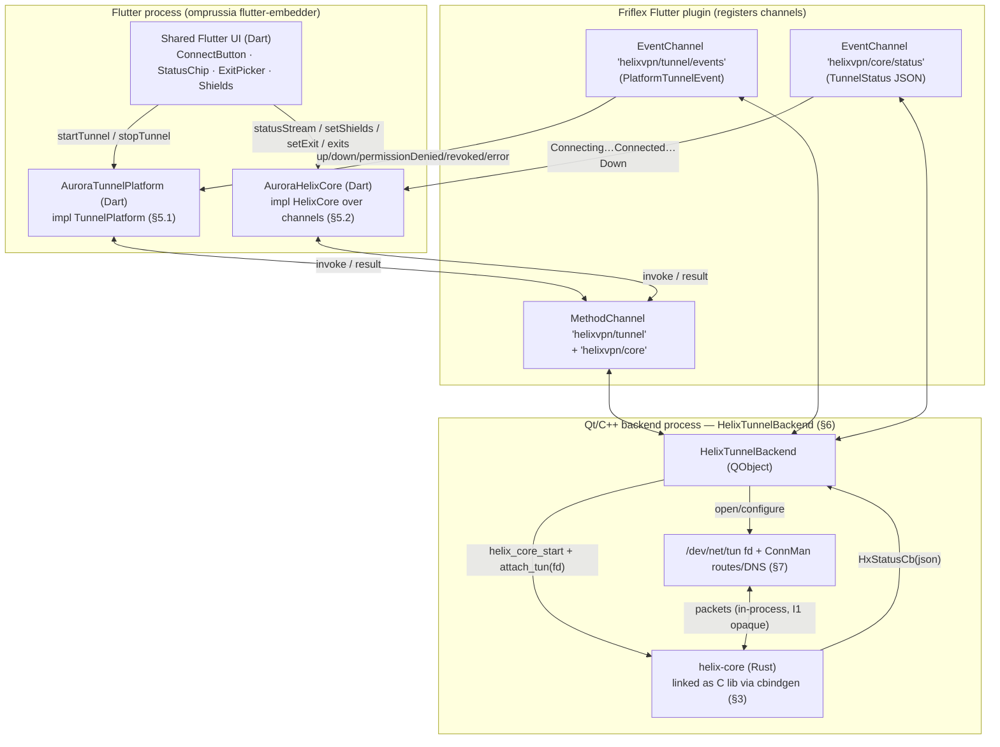
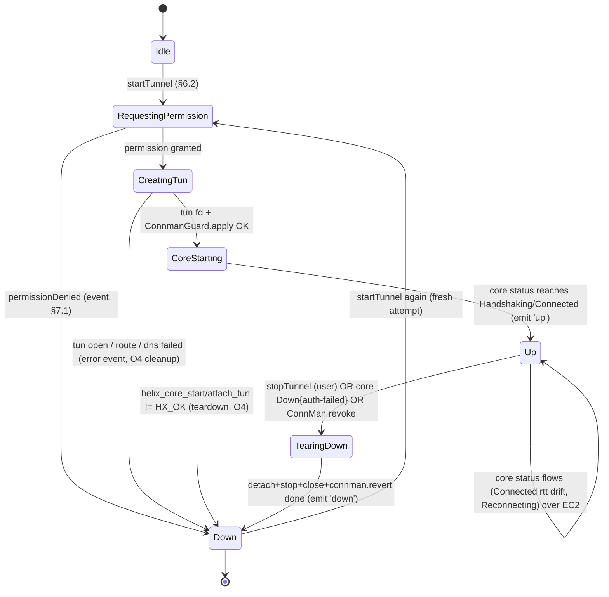
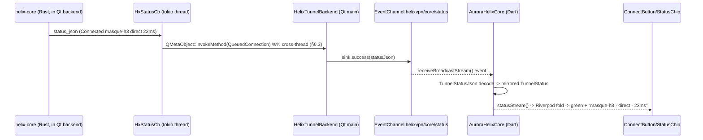

# Aurora OS shim (Qt/C++ tun)

**Revision:** 1
**Last modified:** 2026-06-25T00:00:00Z

> Volume 4 (Clients) nano-detail specification — deepens the **Aurora OS** row of
> the per-platform shim matrix in doc 03 [03-client §5, §5.6] into an
> implementation-ready spec of the **omprussia Flutter-fork + Qt/C++ + `/dev/net/tun`**
> shim that satisfies the `TunnelPlatform` contract [03-client §4] and hosts the
> Rust `helix-core` over a **C ABI** [03-client §5, D-CLIENT-3]. SPEC ONLY:
> describes **what to build** (signatures, channel contracts, state machines,
> lifecycle, memory budgets, error taxonomy, edge cases, test points) — it does
> **not** build the product.
>
> **Boundary.** This document **consumes** the FFI surface + `TunnelStatus`
> enum frozen by doc 03 [03-client §3] and the orchestrator/status contract
> owned by Volume 2 [v02 orchestrator-and-state §4.1, §5]. It **owns** only the
> Aurora-specific seam: the Qt/C++ tunnel backend, the Friflex Flutter-plugin
> channel bridge, the `/dev/net/tun` lifecycle, the cbindgen C-ABI binding to
> `helix-core`, and the Aurora build/sign pipeline. Every other pixel is shared
> Dart and is **out of scope** here [03-client §0, §5 "the UI ports for free,
> the shim does not"].
>
> **Evidence base.** Citations inline by id: `[03-client §N]` =
> `final/03-client-core-and-ui.md`; `[v02-tt §N]` =
> `final/v02-data-plane/transport-trait.md`; `[v02-orch §N]` =
> `final/v02-data-plane/orchestrator-and-state.md`; `[04_ARCH §N]` =
> `04_VPN_CLD/HelixVPN-Architecture-Refined.md`; `[04_UI §N]` =
> `04_VPN_CLD/HelixVPN-helix-ui-Flutter.md`; `[research-flutter_ffi]` =
> `v09-research/research-flutter_ffi.md`; `[SYN §N]` =
> `v09-research/_SYNTHESIS.md`. Claims not grounded in this evidence base are
> tagged `UNVERIFIED` per constitution §11.4.6 — never fabricated.

---

## Table of contents

- [0. Position, ownership, and the one-sentence contract](#0-position-ownership-and-the-one-sentence-contract)
- [1. Why Aurora is the hardest seam (the real-native-work risk)](#1-why-aurora-is-the-hardest-seam-the-real-native-work-risk)
- [2. Process & seam topology (where the core lives)](#2-process--seam-topology-where-the-core-lives)
- [3. The cbindgen C-ABI binding to `helix-core`](#3-the-cbindgen-c-abi-binding-to-helix-core)
- [4. The Friflex channel contract (Dart ⇄ Qt/C++)](#4-the-friflex-channel-contract-dart--qtc)
- [5. The Dart side — `AuroraTunnelPlatform` + `AuroraHelixCore`](#5-the-dart-side--auroratunnelplatform--aurorahelixcore)
- [6. The Qt/C++ backend — `HelixTunnelBackend`](#6-the-qtc-backend--helixtunnelbackend)
- [7. `/dev/net/tun` lifecycle, routes, DNS, kill-switch](#7-devnettun-lifecycle-routes-dns-kill-switch)
- [8. Shim lifecycle state machine](#8-shim-lifecycle-state-machine)
- [9. `TunnelStatus` consistency + the status bridge](#9-tunnelstatus-consistency--the-status-bridge)
- [10. Error taxonomy + edge cases](#10-error-taxonomy--edge-cases)
- [11. Memory / size / performance budgets](#11-memory--size--performance-budgets)
- [12. Build, RPM packaging, signing](#12-build-rpm-packaging-signing)
- [13. Test points — tied to the §11.4.169 test-type vocabulary](#13-test-points--tied-to-the-114169-test-type-vocabulary)
- [14. Open decisions surfaced by this document](#14-open-decisions-surfaced-by-this-document)
- [15. Cross-document contracts this document fixes](#15-cross-document-contracts-this-document-fixes)
- [Sources verified](#sources-verified)

---

## 0. Position, ownership, and the one-sentence contract

**The one-sentence contract.** The Aurora shim is *one `TunnelPlatform`
implementation* [03-client §4] that, on Aurora OS, (a) configures a
`/dev/net/tun` device, (b) hands its fd to a `helix-core` instance **linked as a
C library into a Qt/C++ backend**, and (c) reports lifecycle + bridges the
core's `TunnelStatus` back to the shared Flutter UI over **Friflex** Flutter-
plugin channels — and does **nothing else** [03-client §5.6, 04_UI §6.1,
04_ARCH §5.3].

It owns exactly five things and nothing more:

| # | Owned here | Consumed from |
|---|---|---|
| A1 | The **cbindgen C-ABI** header `helix-core` exposes to non-Dart native hosts (Aurora is the canonical raw-C consumer, D-CLIENT-3) | `helix-ffi` crate → doc 03 owns the Rust surface |
| A2 | The **Friflex channel contract** (`MethodChannel`/`EventChannel` names + payload schemas) | `TunnelPlatform`/`HelixCore` abstractions [03-client §3, §4] |
| A3 | The **Qt/C++ `HelixTunnelBackend`** that opens the tun, links the core, pumps lifecycle | OS: `/dev/net/tun`, ConnMan, Sailjail (Aurora primitives) |
| A4 | The **`/dev/net/tun` + routes + DNS + kill-switch** Aurora mechanics | `TunnelConfig` [03-client §4] |
| A5 | The **Aurora RPM build/sign** pipeline | melos build matrix [03-client §11] |

It does **NOT** own: any screen/widget/state (shared Dart, [03-client §7-§8]);
the `helix-core` internals, the `Transport` trait, the orchestrator loops
([v02-tt], [v02-orch]); the `TunnelStatus` *enum definition* (frozen by
[v02-orch §4.1], mirrored by [03-client §3.1]); or the control-plane wire
([02] doc).

### 0.1 Aurora-specific invariants (extend the §0.1 client invariants)

| # | Invariant | Source |
|---|---|---|
| AI1 | On Aurora the core lives in the **Qt/C++ backend**, not the Flutter process — therefore `statusStream`, `setShields`, `setExit`, `exits`, `advertise` all cross the **Friflex channel** (not frb), because frb-in-the-embedder is UNVERIFIED on the omprussia fork (§2, §14 D-AUR-1). | [03-client §5.6], [research-flutter_ffi §4] |
| AI2 | The shim **hands the core a tun fd** (`attach_tun(fd)` model, like Linux/Android) — it never does crypto/obfuscation; `helix-core` is the only place WG + transport live (O2 [03-client §4.1]). | [03-client §4.1 O2], [v02-tt I1] |
| AI3 | Aurora is an **enterprise/government SKU** with Russian-hosted toolchain (GitLab omprussia / Mos.Hub), its **own** CI runners + RPM signing, isolated so a fork lag never blocks mainline (§12). | [03-client §5.6], [04_ARCH §5.7] |
| AI4 | Every Aurora-required OS API the embedder/SDK does **not** expose is an **honest SKIP-with-reason** (§11.4.3), never a faked PASS; Phase-3 biggest-platform-risk discipline [SYN §4]. | [research-flutter_ffi §4], [03-client §13 T3.2] |
| AI5 | `events()` reports `revoked` when ConnMan / the OS / an admin (`device.revoked`, doc 02) kills the tunnel out-of-band; the UI shows it within budget, never claims "connected" (O3, CI2). | [03-client §4.1 O3] |

---

## 1. Why Aurora is the hardest seam (the real-native-work risk)

Aurora OS (Sailfish-derived, Qt/QML-native, Linux-kernel-based) has **no
mainline Flutter support**; the only single-codebase path is the **OMP Russia
fork** `gitlab.com/omprussia/flutter` (`flutter` SDK fork + `flutter-embedder`
runtime + `flutter-community-plugins` group, plugins follow the `*_aurora`
naming pattern) [research-flutter_ffi §4, 04_ARCH §5.2]. Phase-3 honest risk
register [SYN §4, 03-client §13]:

| Risk | Concrete shape | Mitigation in this spec |
|---|---|---|
| R1 **Forked, lagging Flutter** | `flutter-aurora` tracks a Flutter baseline behind mainline; plugins need Aurora variants | Pin the exact fork tag; isolate the Aurora runner (§12); the UI ports unchanged, only this shim is bespoke (AI3) |
| R2 **No frb-in-embedder guarantee** | dart:ffi `DynamicLibrary` loading a cdylib on the omprussia embedder is `UNVERIFIED` [research-flutter_ffi §4] | Put the core in the **Qt/C++ backend via cbindgen C ABI** (§3) — depends only on a C ABI (universal) + Friflex MethodChannel (provided), not on frb (AI1, D-AUR-1) |
| R3 **VPN-permission / tun API unknown** | Whether a sandboxed (Sailjail) Aurora app may `open("/dev/net/tun")` + hold `CAP_NET_ADMIN` is `UNVERIFIED` (§7.1) | Two paths: in-process raw tun if permitted, else a privileged D-Bus helper daemon (§7.2); honest SKIP if neither is reachable (AI4) |
| R4 **Route/DNS via ConnMan** | Aurora uses ConnMan for connectivity; route+DNS install is ConnMan/netlink, not Android `VpnService.Builder` | Spec the ConnMan + netlink path; mark ConnMan D-Bus specifics `UNVERIFIED` (§7.3) |
| R5 **No device in lab** | The team likely lacks an Aurora device/emulator for autonomous device tests | Device-gated test rows are honest SKIP-with-reason per §11.4.3/§11.4.52 (§13), never a bluff PASS |

> **The payoff is still real** [03-client §5 "the UI ports for free"]: `ConnectButton`,
> `ExitPicker`, `StatusChip`, settings, account, policy views — **every pixel** —
> are the identical shared Dart. Adding Aurora is "write **this** shim + bend the
> build," not "port the app."

---

## 2. Process & seam topology (where the core lives)

On most platforms the core is loaded into (or beside) the Flutter process and
status flows `core → frb → UI` [03-client §3.3]. On Aurora the core lives in the
**Qt/C++ backend** [03-client §5.6], so **both** the lifecycle commands **and**
the status/logic calls cross a **Friflex channel**:



> **UNVERIFIED (§2.1):** whether the Friflex plugin runs the Qt backend
> **in-process** with the embedder (same address space, fd shared directly) or
> as a **separate D-Bus service** (fd passed via `SCM_RIGHTS` over a Unix socket)
> is an Aurora-platform implementation detail not settled by the evidence base.
> The contract below (§3–§6) is identical either way; §7.2 covers the
> separate-service fd-passing case. Phase-0/3 spike settles it (D-AUR-2).

**Why core-in-Qt-backend, not core-in-Flutter-via-frb** (AI1, R2): the C ABI
(cbindgen) is universal and proven; frb on the omprussia embedder is unproven.
Hosting the core in the Qt/C++ backend trades a small duplication (the status
plumbing is a channel instead of frb) for **eliminating the frb-on-fork
unknown** — the right Phase-3 risk posture. The alternative (frb in the embedder)
is surfaced as **D-AUR-1** (§14) and gated on a spike.

---

## 3. The cbindgen C-ABI binding to `helix-core`

`helix-core` exposes **two** generator-fed surfaces from one Rust source
[03-client §3, D-CLIENT-3]: **frb** for Dart (mainline platforms) and a
**cbindgen C header** for native hosts where frb/UniFFI are thin — Aurora
(Qt/C++) and HarmonyOS (NAPI) are the raw-C consumers. This section pins the C
ABI the Aurora backend links against.

### 3.1 The C header (`helix_core.h`, cbindgen-generated)

```c
/* helix_core.h — generated by cbindgen from helix-ffi/src/c_abi.rs.
 * Hand-authored Rust source is helix-ffi/src/api.rs (frb) [03-client §3.1];
 * c_abi.rs is a thin #[no_mangle] extern "C" wrapper over the SAME functions,
 * so frb-Dart and C-Aurora drive byte-identical core logic (no fork). */
#ifndef HELIX_CORE_H
#define HELIX_CORE_H
#include <stdint.h>

/* ---- return codes (mirror anyhow::Result -> i32; 0 == Ok) ---- */
typedef enum HxResult {
  HX_OK                = 0,
  HX_ERR_CONFIG        = 1,   /* bad/empty token, unknown transport string */
  HX_ERR_TUN           = 2,   /* attach_tun: fd invalid / not a tun device */
  HX_ERR_ALREADY       = 3,   /* start called while already running        */
  HX_ERR_NOT_RUNNING   = 4,   /* stop/detach/logic call while stopped       */
  HX_ERR_AUTH          = 5,   /* WG handshake rejected (revoked/bad key)    */
  HX_ERR_INTERNAL      = 6,   /* unexpected; detail in last-error string    */
} HxResult;

typedef enum HxMode { HX_MODE_CLIENT = 0, HX_MODE_CONNECTOR = 1 } HxMode;

/* ---- lifecycle (logic only — NOT the OS tunnel; the shim owns tun, AI2) ---- */
/* start: spins up the core's tokio runtime + orchestrator (v02-orch §2),
 * arms the kill-switch (v02-orch §8.2), emits Connecting. BLOCKING but bounded:
 * returns once the orchestrator reaches Connecting (sub-ms); status thereafter
 * arrives via the registered callback (§3.2). */
HxResult helix_core_start(const char* session_or_map_token,
                          const char* transport /* "auto"|"plain"|"masque"|... */,
                          HxMode mode);

/* attach_tun: hand the core the tun fd; the core OWNS the fd lifetime until
 * detach_tun/stop. Must be called AFTER start, BEFORE the WG handshake can pump.
 * Linux/Aurora tun fd model [03-client §5 matrix]. */
HxResult helix_core_attach_tun(int32_t fd);
HxResult helix_core_detach_tun(void);

/* stop: graceful teardown (v02-orch §2.4): close transport, revert DNS,
 * kill-switch per §8.6, join loops within shutdown_grace, emit Down{stopped}. */
HxResult helix_core_stop(void);

/* ---- logic calls (no OS tunnel touched; UI->channel->backend->core) ---- */
HxResult helix_core_set_shields(const char* shields_json); /* schema §4.4 */
HxResult helix_core_set_exit(const char* exit_id,
                             const char* multihop_chain_json /* nullable */);
/* exits/advertise return owned UTF-8 JSON; caller MUST helix_core_string_free.
 * On error return NULL and set last-error (helix_core_last_error). */
char*    helix_core_exits_json(void);                 /* JSON array, schema §4.5 */
char*    helix_core_advertise_json(const char* cidrs_json); /* connector mode   */
void     helix_core_string_free(char* s);

/* ---- status push (core -> backend), the statusStream source on Aurora ---- */
/* cb is invoked from a core tokio thread; the backend MUST marshal to the Qt
 * event loop before touching Friflex (§6.3). json schema = §9.1. user is opaque. */
typedef void (*HxStatusCb)(const char* status_json, void* user);
void     helix_core_set_status_cb(HxStatusCb cb, void* user);

/* ---- diagnostics (redacted; never secrets, §11.4.10) ---- */
const char* helix_core_last_error(void); /* thread-local, valid until next core call */
const char* helix_core_version(void);    /* "helixvpn-<ver>" §11.4.151               */

#endif /* HELIX_CORE_H */
```

### 3.2 C-ABI ⇄ frb correspondence (no fork, I4)

Each C function is the synchronous facade over the identical frb async surface
[03-client §3.1]; cbindgen cannot express `async fn`, so the wrapper blocks on
the core's internal tokio runtime (bounded) and pushes continuous status via the
`HxStatusCb` callback (the C analogue of frb's `StreamSink<TunnelStatus>`
[research-flutter_ffi §1]):

| frb (Dart) [03-client §3.1] | C ABI (Aurora) | Notes |
|---|---|---|
| `start(cfg) -> Result<()>` | `helix_core_start(token, transport, mode)` | cfg fields flattened to C args |
| `stop() -> Result<()>` | `helix_core_stop()` | idempotent |
| `status_stream(sink: StreamSink<TunnelStatus>)` | `helix_core_set_status_cb(cb, user)` | callback ≅ StreamSink |
| `exits() -> Result<Vec<ExitOption>>` | `helix_core_exits_json()` → free | JSON-serialized (§4.5) |
| `set_exit(id, chain)` | `helix_core_set_exit(id, chain_json)` | |
| `set_shields(Shields)` | `helix_core_set_shields(json)` | (§4.4) |
| `advertise(cidrs)` | `helix_core_advertise_json(cidrs_json)` | connector only |
| `attach_tun(fd)` / `detach_tun()` | `helix_core_attach_tun(fd)` / `helix_core_detach_tun()` | tun fd model (AI2) |

> **Anti-bluff (§11.4.27/§11.4.50).** The frb path and the C-ABI path MUST be
> proven equivalent by a **shared serialization test-vector corpus** (the same
> pattern the edge uses for encode/decode [v02-tt §8.3]): a frozen set of
> `(core-action, status-JSON)` and `(exits-call, exits-JSON)` pairs both the frb
> Dart binding and the C-ABI consumer must satisfy bit-for-bit. A divergence is a
> release blocker — the mechanical proof that "Aurora drives the same core."

### 3.3 cbindgen build configuration

```toml
# helix-ffi/cbindgen.toml (the C-ABI half of D-CLIENT-3)
language = "C"
include_guard = "HELIX_CORE_H"
[export]
include = ["HxResult", "HxMode", "HxStatusCb"]
prefix  = "helix_core_"          # symbol namespace; matches §11.4.151 project prefix
[fn]
sort_by = "None"
[parse]
parse_deps = false               # only helix-ffi's own #[no_mangle] surface
```

`helix-ffi` builds for Aurora as `crate-type = ["staticlib"]` (linked into the
Qt backend, smallest footprint) targeting the Aurora ARM triple
(`UNVERIFIED` exact triple — Aurora is ARM/aarch64; settled by the §12 SDK), with
`opt-level = "z"` + LTO + `panic = "abort"` + strip (the lean-core recipe
[03-client §10, §5.1]). The Aurora build does **not** carry the iOS NE 15 MB
ceiling (Aurora is a full Linux process, §11), but stays lean by AI3 discipline.

---

## 4. The Friflex channel contract (Dart ⇄ Qt/C++)

Three channels, registered by the Friflex Flutter plugin on Aurora
[03-client §5.6, 04_UI §6.1]. Two are the standard `TunnelPlatform`
channels [03-client §4]; one is the **Aurora-specific status bridge** (AI1,
because the core is not in the Flutter process).

| Channel | Type | Direction | Carries |
|---|---|---|---|
| `helixvpn/tunnel` | MethodChannel | Dart → backend | `startTunnel`, `stopTunnel` (the `TunnelPlatform` verbs) |
| `helixvpn/tunnel/events` | EventChannel | backend → Dart | `PlatformTunnelEvent` (lifecycle only, [03-client §4]) |
| `helixvpn/core` | MethodChannel | Dart → backend | `setShields`, `setExit`, `exits`, `advertise` (the `HelixCore` logic verbs) |
| `helixvpn/core/status` | EventChannel | backend → Dart | `TunnelStatus` JSON (the `statusStream` source, §9) |

### 4.1 `helixvpn/tunnel` method payloads

```jsonc
// invoke("startTunnel", <TunnelConfig>) — TunnelConfig per [03-client §4]
{ "overlayIp": "100.64.0.7/32", "routes": ["0.0.0.0/0"],
  "dnsServers": ["100.64.0.1"], "splitExcludeApps": [],
  "mtu": 1280, "sessionOrMapToken": "<opaque session/map token>" }
// invoke("stopTunnel") — no args; returns null on success, PlatformException on failure
```

`startTunnel` returns `null` (success) once the backend has reached the **Up**
state (§8) — i.e. tun created + core started + first `Connected`/`Handshaking`
observed — OR throws a `PlatformException(code, detail)` mapping to a
`PlatformTunnelEvent` kind (§10). It is **idempotent** (O1 [03-client §4.1]): a
second `startTunnel` while Up is a no-op success.

### 4.2 `helixvpn/tunnel/events` payloads (lifecycle, [03-client §4])

```jsonc
{ "kind": "up" }                                  // PlatformTunnelEventKind.up
{ "kind": "down" }                                // graceful or post-stop
{ "kind": "permissionDenied" }                    // tun/CAP_NET_ADMIN refused (§7.1)
{ "kind": "revoked", "detail": "connman-off" }    // OS/admin killed tunnel (AI5/O3)
{ "kind": "error", "detail": "tun open EPERM" }   // honest reason (§11.4.6 no guessing)
```

### 4.3 `helixvpn/core` method payloads

```jsonc
invoke("setShields", <Shields JSON §4.4>)   -> null | PlatformException
invoke("setExit", { "id": "se-fra-1", "multiHopChain": ["se-fra-1","se-zrh-2"] }) -> null
invoke("exits")                              -> [ <ExitOption §4.5>, ... ]
invoke("advertise", { "cidrs": ["10.10.0.0/24"] }) -> { "accepted": [...], "conflicts": [...] }
```

### 4.4 `Shields` JSON (mirrors `Shields` [03-client §3.1])

```jsonc
{ "killSwitch": true, "dnsProtection": true, "daita": false,
  "postQuantum": false, "splitTunnel": ["10.0.0.0/8"] }
```

### 4.5 `ExitOption` JSON (mirrors `ExitOption` [03-client §3.1])

```jsonc
{ "id": "se-fra-1", "kind": "privacy_exit", "label": "Frankfurt",
  "country": "DE", "rttMs": 23, "jurisdiction": "EU" }
```

### 4.6 Channel codec + threading rules

- All payloads are the **standard Flutter `StandardMessageCodec`** maps/lists
  (the Friflex plugin marshals to/from the Qt `QVariantMap`). JSON-shaped above
  for clarity; the wire type is the codec's native map.
- The backend MUST **never** block the Qt event loop in a channel handler
  (§6.3): `startTunnel`/`stopTunnel` dispatch to a worker and complete the
  `MethodChannel.Result` asynchronously.
- EventChannel sinks are touched **only** from the Qt main thread; the core's
  `HxStatusCb` (a tokio thread) is marshalled via `QMetaObject::invokeMethod(...,
  Qt::QueuedConnection)` before any sink call (§6.3) — a cross-thread sink write
  is a defect.
- No `SecretBytes`-class value (session token aside, which is opaque) crosses any
  channel as a logged field; channel tracing redacts `sessionOrMapToken`
  (§11.4.10).

---

## 5. The Dart side — `AuroraTunnelPlatform` + `AuroraHelixCore`

The shared Dart UI is **unchanged**; Aurora provides two channel-backed
implementations of the existing abstractions [03-client §3.2, §4] selected by the
platform at `runHelixApp` wiring time [03-client §6]. No widget knows it is on
Aurora (CI2 honesty preserved).

### 5.1 `AuroraTunnelPlatform` (impl `TunnelPlatform`)

```dart
// apps/access/aurora/lib/aurora_tunnel_platform.dart
class AuroraTunnelPlatform implements TunnelPlatform {
  static const _m = MethodChannel('helixvpn/tunnel');
  static const _e = EventChannel('helixvpn/tunnel/events');

  @override
  Future<void> startTunnel(TunnelConfig cfg) async {
    try {
      await _m.invokeMethod<void>('startTunnel', cfg.toMap());   // §4.1
    } on PlatformException catch (pe) {
      // map to the honest event; do NOT swallow (O1: leave no half-open tun)
      throw TunnelStartException(_kindFromCode(pe.code), pe.message);
    }
  }

  @override
  Future<void> stopTunnel() => _m.invokeMethod<void>('stopTunnel');

  @override
  Stream<PlatformTunnelEvent> events() => _e
      .receiveBroadcastStream()
      .map((m) => PlatformTunnelEvent(
            _kind(m['kind'] as String), m['detail'] as String?));
}
```

### 5.2 `AuroraHelixCore` (impl `HelixCore` — the Aurora status/logic bridge)

Because the core lives in the Qt backend (AI1), Aurora's `HelixCore` is
**channel-backed** instead of frb-backed — the **only** platform where this is
true. The Dart `TunnelStatus` it yields is the **same generated/mirrored type**
[03-client §3.1], deserialized from the status JSON (§9.1), so every widget
folds it identically (§8 of doc 03).

```dart
// apps/access/aurora/lib/aurora_helix_core.dart
class AuroraHelixCore implements HelixCore {
  static const _m = MethodChannel('helixvpn/core');
  static const _status = EventChannel('helixvpn/core/status');

  @override
  Future<void> start({required String transport, String? mapPathOrSession,
                      CoreMode mode = CoreMode.client}) =>
      // on Aurora, start is driven THROUGH the tunnel shim (startTunnel) because
      // the tun fd must exist before the core pumps; this is a no-op pass-through
      // kept for interface symmetry. The real start is AuroraTunnelPlatform.startTunnel.
      Future<void>.value();

  @override
  Future<void> stop() => Future<void>.value();   // ditto -> stopTunnel

  @override
  Stream<TunnelStatus> statusStream() => _status
      .receiveBroadcastStream()
      .map((j) => TunnelStatusJson.decode(j as Map));   // §9.1 -> mirrored enum

  @override
  Future<List<ExitOption>> exits() async {
    final raw = await _m.invokeMethod<List<dynamic>>('exits');
    return raw!.map((e) => ExitOption.fromMap(e as Map)).toList();
  }

  @override
  Future<void> setExit(String id, {List<String>? multiHopChain}) =>
      _m.invokeMethod<void>('setExit', {'id': id, 'multiHopChain': multiHopChain});

  @override
  Future<void> setShields(Shields s) =>
      _m.invokeMethod<void>('setShields', s.toMap());

  @override
  Future<AdvertiseResult> advertise(List<String> cidrs) async =>
      AdvertiseResult.fromMap(
          (await _m.invokeMethod<Map>('advertise', {'cidrs': cidrs}))!);

  @override
  Future<void> attachTun(int fd) => Future<void>.value();  // backend-internal on Aurora
  @override
  Future<void> detachTun() => Future<void>.value();
}
```

### 5.3 Wiring (the only Aurora-aware line in `helix_domain`)

```dart
// helix_domain/lib/run_helix_app.dart — platform select (branch on the FORK target,
// the one permitted Platform check; UI never branches on Platform.isX, [03-client §7.3])
helixCoreProvider.overrideWith((ref) =>
  capabilities.contains(Capability.tunnel)
    ? (HelixPlatform.isAurora ? AuroraHelixCore() : RealHelixCore() /* frb */)
    : NoCore());
tunnelPlatformProvider.overrideWith((ref) =>
  HelixPlatform.isAurora ? AuroraTunnelPlatform() : /* per-OS shim */ defaultShim());
```

`HelixPlatform.isAurora` is a **compile-time** flavor constant set by the Aurora
build (a `--dart-define=HELIX_TARGET=aurora`), not a runtime probe — so the
non-Aurora branches tree-shake out of every other build (lean binary, §6 of doc
03).

---

## 6. The Qt/C++ backend — `HelixTunnelBackend`

The Qt/C++ class that the Friflex plugin instantiates; it is the native owner of
the tun, the core, and the channel handlers.

### 6.1 Class sketch

```cpp
// shims/aurora/HelixTunnelBackend.h
#include <QObject>
#include <QVariantMap>
#include <atomic>
extern "C" {
  #include "helix_core.h"          // §3.1 cbindgen header
}

class HelixTunnelBackend : public QObject {
  Q_OBJECT
public:
  explicit HelixTunnelBackend(QObject* parent = nullptr);
  ~HelixTunnelBackend() override;   // RAII: stopTunnel() on destroy (O4 cleanup)

  // MethodChannel 'helixvpn/tunnel' handlers (async; complete the Result later)
  void startTunnel(const QVariantMap& cfg, MethodResult result);  // §4.1
  void stopTunnel(MethodResult result);

  // MethodChannel 'helixvpn/core' handlers
  void setShields(const QVariantMap& shields, MethodResult result);
  void setExit(const QString& id, const QVariantList& chain, MethodResult result);
  void exits(MethodResult result);
  void advertise(const QStringList& cidrs, MethodResult result);

signals:
  // marshalled to the EventChannels on the Qt main thread (§6.3)
  void lifecycleEvent(const QVariantMap& event);   // -> 'helixvpn/tunnel/events'
  void coreStatus(const QString& statusJson);      // -> 'helixvpn/core/status'

private:
  // C status callback trampoline: tokio-thread -> Qt main thread (§6.3)
  static void onStatus(const char* json, void* user);

  int            tunFd_ {-1};                 // /dev/net/tun fd (§7)
  std::atomic<int> state_ {Idle};             // ShimState (§8); atomic for cross-thread reads
  QString        ifName_;                     // e.g. "helix0"
  ConnmanGuard   connman_;                    // RAII routes+DNS+kill-switch (§7.3)
};
```

### 6.2 `startTunnel` flow (the make-it-work path)

```cpp
void HelixTunnelBackend::startTunnel(const QVariantMap& cfg, MethodResult result) {
  if (state_ == Up) { result.success(); return; }           // O1 idempotent
  QtConcurrent::run([this, cfg, result]() mutable {
    setState(RequestingPermission);
    if (!ensureVpnPermission()) {                            // §7.1 (UNVERIFIED API)
      emitLifecycle("permissionDenied");
      result.error("permissionDenied", "tun/CAP_NET_ADMIN refused", {});
      setState(Down); return;
    }
    setState(CreatingTun);
    tunFd_ = openTun(&ifName_);                              // §7.2: ioctl(TUNSETIFF)
    if (tunFd_ < 0) {
      emitLifecycle("error", strerror(errno));
      result.error("tunOpen", QString("tun open: %1").arg(strerror(errno)), {});
      setState(Down); return;
    }
    if (!connman_.apply(ifName_, cfg)) {                     // §7.3 routes+DNS+kill-switch
      ::close(tunFd_); tunFd_ = -1;
      emitLifecycle("error", "route/dns apply failed");
      result.error("netConfig", "ConnMan/netlink apply failed", {});
      setState(Down); return;
    }
    setState(CoreStarting);
    helix_core_set_status_cb(&HelixTunnelBackend::onStatus, this);
    HxResult r = helix_core_start(cfg["sessionOrMapToken"].toString().toUtf8(),
                                  "auto", HX_MODE_CLIENT);   // transport from policy
    if (r == HX_OK) r = helix_core_attach_tun(tunFd_);       // hand fd to core (AI2)
    if (r != HX_OK) {
      teardown(/*userInitiated=*/false);                    // O4 cleanup on every exit path
      emitLifecycle("error", helix_core_last_error());
      result.error("coreStart", QString::number(r), {});
      setState(Down); return;
    }
    setState(Up);
    emitLifecycle("up");
    result.success();                                       // §4.1 returns once Up
  });
}
```

### 6.3 Status trampoline (the cross-thread rule)

```cpp
// invoked from a core tokio thread — MUST NOT touch Friflex/Qt sinks directly
void HelixTunnelBackend::onStatus(const char* json, void* user) {
  auto* self = static_cast<HelixTunnelBackend*>(user);
  const QString s = QString::fromUtf8(json);               // copy out before returning
  QMetaObject::invokeMethod(self, [self, s]() {
      emit self->coreStatus(s);                            // now on Qt main thread
    }, Qt::QueuedConnection);
}
```

The copy-out-before-return is mandatory: `json` is owned by the core and valid
only for the callback duration (the C analogue of frb's StreamSink lifetime). A
torn read or a sink touch from the tokio thread is a defect caught by the `RACE`
test (§13).

### 6.4 `stopTunnel` / teardown (O4 — quiescent on every exit path)

```cpp
void HelixTunnelBackend::teardown(bool userInitiated) {
  helix_core_detach_tun();
  helix_core_stop();                       // v02-orch §2.4 graceful order
  if (tunFd_ >= 0) { ::close(tunFd_); tunFd_ = -1; }
  connman_.revert(userInitiated);          // §8.6: kill-switch reverts ONLY on user stop
  emitLifecycle("down");
}
```

`~HelixTunnelBackend()` calls `teardown(false)` (RAII) so a backend crash leaves
the kill-switch **closed** (O-I11 [v02-orch §8.4], no leak on abnormal exit), and
no orphan tun/routes/DNS survive (O4 [03-client §4.1]).

---

## 7. `/dev/net/tun` lifecycle, routes, DNS, kill-switch

### 7.1 VPN permission (the UNVERIFIED gate, R3)

Whether a Sailjail-sandboxed Aurora app may open `/dev/net/tun` and hold
`CAP_NET_ADMIN` is **`UNVERIFIED`** [research-flutter_ffi §4 "VPN permission…
needs an Aurora-specific implementation, with honest SKIP where the embedder
lacks a needed API"]. Two designed paths, chosen by what the platform actually
grants (settled by the §13 `IT`/device spike, AI4):

- **P-A (in-process):** the app declares the tun/`CAP_NET_ADMIN` capability in
  its RPM manifest / Sailjail profile and opens the tun directly in
  `HelixTunnelBackend`. Lowest complexity.
- **P-B (privileged helper):** a small `systemd`/D-Bus-activated helper daemon
  (running with `CAP_NET_ADMIN`) opens the tun and passes the fd to the
  unprivileged backend via `SCM_RIGHTS` over a Unix socket (§7.4). Required if
  Sailjail denies P-A. Mirrors the Windows privileged-service pattern
  [03-client §5.3] and the Linux polkit-helper note [03-client §5.4].

`ensureVpnPermission()` returns false ⇒ `permissionDenied` event (not `error`,
O1) ⇒ honest UX, no half-open tun. If **neither** path is grantable on a given
Aurora build, the feature is an honest **SKIP-with-reason** (§11.4.3, AI4) — a
tracked migration item, never a faked PASS.

### 7.2 Opening the tun (`openTun`)

```cpp
// shims/aurora/tun.cpp — standard Linux tun (Aurora is Linux-kernel-based)
int openTun(QString* ifNameOut) {
  int fd = ::open("/dev/net/tun", O_RDWR | O_CLOEXEC);
  if (fd < 0) return -1;
  struct ifreq ifr {}; ifr.ifr_flags = IFF_TUN | IFF_NO_PI;     // L3, no packet-info hdr
  std::strncpy(ifr.ifr_name, "helix0", IFNAMSIZ);
  if (::ioctl(fd, TUNSETIFF, &ifr) < 0) { ::close(fd); return -1; }
  *ifNameOut = QString::fromUtf8(ifr.ifr_name);
  // non-blocking: the core's loop owns readiness (v02-orch §3); set O_NONBLOCK
  ::fcntl(fd, F_SETFL, ::fcntl(fd, F_GETFL) | O_NONBLOCK);
  return fd;
}
```

`IFF_NO_PI` matters: the core's `helix-tun` expects raw L3 packets with **no**
4-byte packet-info prefix — the same fd contract the Linux shim uses
[03-client §5.4]. A wrong flag silently corrupts every packet → caught by the
`E2E` round-trip (§13), never shipped.

### 7.3 Routes + DNS + kill-switch (`ConnmanGuard`)

Aurora uses **ConnMan** for connectivity [R4]; route/DNS install is via ConnMan's
D-Bus API and/or direct `rtnetlink`. The core owns the kill-switch *state machine*
[v02-orch §8]; the shim is the OS-effect arm that ConnMan/netlink executes.

```cpp
// ConnmanGuard: RAII over routes + DNS + kill-switch firewall rules (O4).
struct ConnmanGuard {
  bool apply(const QString& ifName, const QVariantMap& cfg);   // overlayIp, routes, dns
  void revert(bool userInitiated);                            // §8.6 semantics
  // apply():
  //   1. ip addr add <overlayIp> dev helix0; ip link set helix0 up; set mtu cfg.mtu
  //   2. for r in cfg.routes: ip route add <r> dev helix0      (AllowedIPs)
  //   3. DNS: push cfg.dnsServers via ConnMan service config (UNVERIFIED exact D-Bus
  //      method name — connman.Service SetProperty "Nameservers.Configuration"?);
  //      fallback /etc/resolv.conf rewrite if ConnMan path unavailable [v02-orch §8.3]
  //   4. kill-switch: nftables default-drop egress except gateway endpoints + DHCP/ND
  //      (the v02-orch §8.2 Strict ruleset, executed here on netlink/nft)
};
```

> **UNVERIFIED (§7.3):** the precise ConnMan D-Bus surface for setting per-service
> nameservers and for a default-route override on Aurora is not in the evidence
> base. The netlink (`ip route`/`ip addr`) + nftables path is standard Linux and
> the safe fallback; the ConnMan-native path is preferred if it exists (it avoids
> fighting ConnMan's own DNS management). Settled by the §13 device spike.

### 7.4 fd-passing (P-B only)

If P-B (privileged helper) is required, the helper opens the tun and the backend
receives the fd via `recvmsg` + `SCM_RIGHTS`:

```cpp
int recvTunFd(int unixSock) {                 // helper -> backend fd handoff
  char ctl[CMSG_SPACE(sizeof(int))] = {};
  struct msghdr msg {}; struct iovec io {(void*)"x", 1};
  msg.msg_iov = &io; msg.msg_iovlen = 1; msg.msg_control = ctl; msg.msg_controllen = sizeof ctl;
  if (::recvmsg(unixSock, &msg, 0) <= 0) return -1;
  struct cmsghdr* c = CMSG_FIRSTHDR(&msg);
  if (!c || c->cmsg_type != SCM_RIGHTS) return -1;
  int fd; std::memcpy(&fd, CMSG_DATA(c), sizeof fd); return fd;   // pass to attach_tun
}
```

---

## 8. Shim lifecycle state machine

The shim's own state (distinct from the core's `OrchState` [v02-orch §5] and the
user-facing `TunnelStatus` [v02-orch §4.1]). The shim state governs tun + channel
lifecycle; the core state governs tunnel liveness. They are coupled at two points:
`CoreStarting→Up` waits for the first non-`Connecting` core status, and a core
`Down{auth-failed}`/OS revoke drives the shim to `TearingDown`.



### 8.1 Coupling table (shim transition → OS/core effect)

| Shim transition | Effect | Source |
|---|---|---|
| `Idle → RequestingPermission` | check Sailjail/CAP_NET_ADMIN (§7.1) | AI4 |
| `CreatingTun` | `openTun` + `ConnmanGuard.apply` (routes/DNS) + **arm kill-switch closed** | [v02-orch §8.2] |
| `CoreStarting → Up` | `helix_core_start` + `attach_tun(fd)`; wait first non-`Connecting` status | AI2, §9 |
| `Up` (steady) | bridge `TunnelStatus` over `helixvpn/core/status` (§9) | AI1 |
| `Up → TearingDown` (user) | `teardown(true)` → kill-switch **reverts open** (§8.6) | [v02-orch §8.6] |
| `Up → TearingDown` (revoke/auth-fail/crash) | `teardown(false)` → kill-switch **stays closed** (O-I11) | [v02-orch §8.4] |

### 8.2 Revoke / out-of-band drop (AI5/O3)

A ConnMan "connection lost" signal, a `device.revoked` propagated as a core
`Down{reason:"auth-failed"}` (over EC2), or the OS killing the backend all drive
`Up → TearingDown` and emit `{"kind":"revoked"}` (with an honest `detail`,
§11.4.6). The UI must show this within the convergence budget and never paint
green — the shim never claims "connected" once the core/OS says otherwise (CI2,
O3). The `< 3 s` recovery target for a transient flap is the core's reconnect
job [v02-orch §7.1], not the shim's — the shim keeps the tun + closed kill-switch
in place while the core re-dials.

---

## 9. `TunnelStatus` consistency + the status bridge

The status enum is **frozen by the orchestrator** [v02-orch §4.1] and **mirrored
+ extended by the client FFI** [03-client §3.1]. The Aurora status JSON is the
serialization of that enum; the Dart side deserializes into the **same mirrored
Dart `TunnelStatus`** every other platform uses — keeping "every pixel identical
Dart" true on Aurora.

### 9.1 Status JSON schema (the `helixvpn/core/status` payload)

```jsonc
// serialization of the core TunnelStatus (v02-orch §4.1) extended per [03-client §3.1].
// "tag" is the variant; payload fields are variant-specific.
{ "tag": "disconnected" }                                            // clean idle (03-client ext)
{ "tag": "connecting" }                                              // v02-orch Connecting
{ "tag": "handshaking" }                                             // v02-orch Handshaking
{ "tag": "connected", "transport": "masque-h3", "path": "direct", "rttMs": 23 } // +path (03-client ext)
{ "tag": "reconnecting" }                                            // v02-orch Reconnecting
{ "tag": "down", "reason": "ladder-exhausted" }                      // v02-orch Down{reason}
{ "tag": "danger", "kind": "killswitch_tripped" }                    // 03-client ext (leak|killswitch_tripped)
```

### 9.2 Core-enum → Aurora-JSON → Dart-mirror mapping (consistency proof)

| Core `OrchState`/`TunnelStatus` [v02-orch §4.1, §5.1] | Aurora `tag` | Dart `TunnelStatus` [03-client §3.1] |
|---|---|---|
| `Idle` (pre-start) / clean post-`stop` | `disconnected` | `Disconnected` |
| `Connecting` | `connecting` | `Connecting` |
| `Handshaking` | `handshaking` | `Handshaking` |
| `Connected{transport, rtt_ms}` (+`path` from `Connected.path`) | `connected` | `Connected{transport, path, rtt_ms}` |
| `Reconnecting{since_drop}` | `reconnecting` | `Reconnecting` |
| `Down{reason}` (incl. `auth-failed`, `ladder-exhausted`, `stopped`) | `down` | `Down{reason}` |
| derived from `Down{leak}`/kill-switch trip | `danger` | `Danger{kind}` |

`ShuttingDown` and `Idle` have **no** public projection ([v02-orch §5.1]): they
map to `connecting`/`disconnected` at this boundary — identical to the frb
projection [03-client §3.1], so Aurora is byte-consistent with every other
platform. The **FFI contract test** [03-client §12] asserts the Aurora JSON
round-trips to the same Dart `TunnelStatus` the frb path produces (the shared
test-vector corpus, §3.2) — a drift FAILs the build.

### 9.3 Status bridge sequence



This is the Aurora analogue of doc 03 §3.3's `core → FFI → UI` flow — the only
difference is the EventChannel-over-Friflex hop replacing frb's `StreamSink`. The
**UI is still a pure function of the status stream** (CI2): the shim never lets
the UI believe its own intent.

---

## 10. Error taxonomy + edge cases

### 10.1 Error mapping (C-ABI / OS → `PlatformTunnelEvent` / `PlatformException`)

| Origin | Condition | Surfaced as | Kind | Source |
|---|---|---|---|---|
| Sailjail/cap | tun/`CAP_NET_ADMIN` denied | `permissionDenied` event + `PlatformException("permissionDenied")` | `permissionDenied` | O1, §7.1 |
| `open("/dev/net/tun")` | `EPERM`/`ENOENT`/`EBUSY` | `error` event, honest `detail=strerror` | `error` | §7.2, §11.4.6 |
| `ConnmanGuard.apply` | route/DNS/nft install failed | `error` event `detail="route/dns apply failed"` | `error` | §7.3 |
| `helix_core_start` | `HX_ERR_CONFIG`/`HX_ERR_ALREADY` | `error`; teardown (O4) | `error` | §3.1 |
| `helix_core_attach_tun` | `HX_ERR_TUN` (bad fd) | `error`; teardown; close fd | `error` | §3.1 |
| core status | `Down{auth-failed}` (revoke) | `revoked` event | `revoked` | §8.2, AI5 |
| ConnMan/OS | connection lost / backend killed | `revoked` (OS) or RAII `down` (crash) | `revoked`/`down` | §8.2, O-I11 |

`helix_core_last_error()` (§3.1) is the honest `detail` source — redacted, never
a secret (§11.4.10). No error is labelled "transient/flaky" without captured
evidence (§11.4.6); the `RACE`/`SC` tests (§13) reproduce each class N times.

### 10.2 Edge cases (each is a test point, §13)

| # | Edge case | Required behaviour |
|---|---|---|
| E1 | `startTunnel` twice (double-tap) | second is idempotent no-op success (O1) |
| E2 | `stopTunnel` while `CreatingTun` (race) | cancel cleanly, no orphan tun/routes (O4); end in `Down` |
| E3 | tun opened but `helix_core_start` fails | `teardown(false)` closes fd + reverts net + kill-switch **stays closed** (O-I11) |
| E4 | ConnMan revokes connectivity mid-`Up` | `revoked` event; core re-dials (`< 3 s` flap, [v02-orch §7.1]); kill-switch closed during gap |
| E5 | backend process killed (OOM/crash) | RAII `~HelixTunnelBackend` runs `teardown(false)`; closed nft rules persist (O-I11); no leak |
| E6 | `IFF_NO_PI` mismatch | corrupt packets; caught by `E2E` round-trip — never ship (§7.2) |
| E7 | status callback fires after `stop` (in-flight) | trampoline checks `state_ != Idle`; drop late events (no use-after-free) |
| E8 | MTU edge: app sends > `effective_mtu` | core returns `Oversize`; orchestrator lowers inner MTU ([v02-tt §4.8]); shim untouched |
| E9 | omprussia embedder lacks a needed API | honest SKIP-with-reason (§11.4.3, AI4) + tracked migration item — never faked |
| E10 | revoke during teardown (overlapping) | teardown is idempotent (helix_core_stop idempotent [v02-orch §2.4]); single `down` emit |

---

## 11. Memory / size / performance budgets

Aurora is a **full Linux process** — it does **NOT** carry the iOS Network-
Extension ~15 MB ceiling (the iOS-only make-or-break, [03-client §5.1, CI4]).
But Aurora targets modest enterprise mobile hardware, so the backend stays lean
by the AI3 discipline and the lean-core recipe.

| Budget | Target | How | Source |
|---|---|---|---|
| Qt backend RSS (Qt runtime + core, plain-udp) | low-tens MB (`UNVERIFIED` ceiling — calibrate on device, §11.4.107(13)) | lean Rust staticlib (`opt-level=z`+LTO+`panic=abort`+strip), no per-datagram heap growth ([v02-tt §9 MEM]) | [03-client §10] |
| Qt backend RSS (masque-h3) | budget separately (QUIC buffers cost more — both transports measured) | cap QUIC flow-control windows if needed (the iOS fallback A applies as a knob, not a ceiling) | [03-client §5.1], [v02-tt §11] |
| App install size (RPM) | lean (`< ~20 MB` order, `UNVERIFIED` per Aurora packaging) | tree-shake icons/fonts, no bundled media, AOT Flutter (never Electron, CI6) | [03-client §10] |
| Cold start | `< 1 s` order on target hardware | AOT, deferred non-critical providers | [03-client §10] |
| tun pump throughput | within the core's per-carrier budget ([v02-tt §11]); shim adds ~zero (it only hands the fd) | the shim does no crypto (AI2); throughput is the core's | [v02-tt §11] |
| `setShields`/`setExit` round-trip | sub-100 ms (channel hop + core logic) | logic-only calls, no OS tunnel touched (O2) | §4.3 |

All numbers are **`UNVERIFIED` until measured on a real Aurora device** (§11.4.6/
§11.4.123) — recorded in the §13 `MEM`/`BENCH` evidence, never asserted. Aurora
device unavailability ⇒ honest SKIP-with-reason for the device-gated rows (AI4).

---

## 12. Build, RPM packaging, signing

Per AI3 + [03-client §11, §5.6, 04_ARCH §5.7], Aurora is an **isolated enterprise
SKU** on its own (local, §11.4.156 no-active-CI) runner — a fork lag must never
block mainline.

```mermaid
flowchart LR
  src["helix-ui (shared Dart)<br/>+ shims/aurora (Qt/C++ + Friflex plugin)"] --> ffi["build helix-ffi staticlib<br/>(Aurora ARM triple, opt-z+LTO+strip) (§3.3)"]
  ffi --> hdr["cbindgen -> helix_core.h"]
  hdr --> qt["compile HelixTunnelBackend (Qt/C++)<br/>link libhelix_core.a"]
  qt --> fa["flutter-aurora build (omprussia fork, pinned tag)<br/>--dart-define=HELIX_TARGET=aurora"]
  fa --> rpm["package signed RPM<br/>(Aurora SDK, Mos.Hub / omprussia toolchain)"]
  rpm --> sign["RPM sign (§11.4.133 no unsigned privileged code)"]
  sign --> rec["QA evidence: helixvpn---aurora-<feature>---<run-id>.mp4 (§11.4.155)<br/>release tag helixvpn-<ver> (§11.4.151)"]
```



- **Toolchain:** omprussia `flutter` SDK fork + `flutter-embedder`; plugins via
  Friflex / `flutter-community-plugins` (`*_aurora` variants)
  [research-flutter_ffi §4]. **Pin the exact fork tag** (R1); the Aurora runner is
  isolated [03-client §11].
- **Signing:** Aurora RPM is signed via the Aurora SDK; the privileged helper
  (P-B, §7.1) and any `CAP_NET_ADMIN` component are signed — no unsigned
  privileged code (§11.4.133).
- **Drift gate:** the cbindgen `helix_core.h` is regenerated + drift-checked
  against `helix-ffi` in the same build [03-client §11] — the Aurora backend can
  never silently diverge from the Rust core (a drift is a build-blocking finding,
  the shared-vector corpus §3.2).
- **No active CI** (§11.4.156): the "matrix" is the **local** melos + Aurora-SDK
  build ritual + the operator's pre-tag sweep (§11.4.40); any preserved workflow
  is `*.disabled-local-only`.

---

## 13. Test points — tied to the §11.4.169 test-type vocabulary

Every Aurora-shim workable item declares its required test types from the
**§11.4.169 closed test-type vocabulary** (the LIVE constitution anchor mandating
comprehensive test-type coverage); the **only** permitted absence of a warranted
type is an honest §11.4.3 **SKIP-with-reason**, never a silent gap. Four-layer
enforcement per §11.4.4(b) applies to every closure. The Aurora hard truth (R5):
**device-gated rows are SKIP-with-reason** until an Aurora device/emulator is in
the lab — this is anti-bluff honesty (AI4, §11.4.52), not a faked PASS.

| Code (§11.4.169) | Type | Concrete Aurora-shim test point | Evidence (§11.4.5/.69/.107) | Device-gated? |
|---|---|---|---|---|
| `UT` | unit | C-ABI ↔ frb test-vector corpus (§3.2) round-trips bit-for-bit; `TunnelStatusJson.decode` maps every variant (§9.1); error-code → event mapping (§10.1); `openTun` flag assembly (`IFF_TUN\|IFF_NO_PI`) | `cargo test` + Dart test logs + vector diff | no |
| `WT` | widget | shared `ConnectButton`/`StatusChip` render across **every** `TunnelStatus` fed by a fake `AuroraHelixCore` (override per [research-flutter_ffi §6]) | golden frames | no |
| `GOLD` | golden | design system stable across themes/breakpoints (the Aurora flavor uses the **same** `helix_design`, so this is the shared suite) | golden PNGs | no |
| `IT` | integration (real System) | `HelixTunnelBackend` opens a real tun in a Linux netns standing in for Aurora; `attach_tun` + core pump; ping over overlay | netns capture; round-trip log | partial (netns proxy) |
| `E2E` | end-to-end | full journey on a real Aurora device: launcher → `ConnectButton` → tun up → `curl` to LAN host → `StatusChip` reads `masque-h3 · direct · 23ms` confirmed by OCR/vision (§11.4.159) | window-scoped MP4 (§11.4.155) | **YES → SKIP-with-reason if no device (§11.4.3)** |
| `FA` | full-automation (§11.4.25/.52/.98, deterministic §11.4.50) | N=3 identical scripted connect→status→disconnect runs producing the same ordered `TunnelStatus` trace over the EventChannel | 3× identical status-trace artifacts | partial (netns proxy yes; device SKIP) |
| `CH` | Challenges (§11.4.27(B)) | per-gate Challenge scores the captured connect-journey evidence, not config | Challenge `result.json` | inherits E2E gate |
| `HQA` | HelixQA | autonomous QA session drives connect→shields→exit over the channels (netns proxy) | HelixQA session evidence | partial |
| `SEC` | security (§11.4.10) | plant `sessionOrMapToken` value → prove it appears in **no** channel log / tracked file / `helix_core_last_error`; verify no `SecretBytes`-class leak; Sailjail profile least-privilege audit | grep-empty proof; profile audit | no |
| `SC` | stress + chaos (§11.4.85) | iface flap (ConnMan down/up) → `revoked` + core `< 3 s` recovery; backend process-kill mid-transfer → RAII teardown leaves no leak (E5); `stopTunnel` during `CreatingTun` (E2) | recovery trace; leak-scan after kill | partial (netns yes; device SKIP) |
| `CONC` | concurrency / atomicity | concurrent `setShields` (channel) + status callback (tokio thread) → no torn `state_`; double `startTunnel` (E1) | concurrency harness log | no |
| `RACE` | race / deadlock | status callback after `stop` (E7); cross-thread sink touch detection (must use `QueuedConnection`, §6.3); `--features loom` on the C-ABI state cell | loom / TSan report | no |
| `MEM` | memory | Qt-backend RSS for plain-udp **and** masque (no per-datagram heap growth); no fd leak across 100 connect/disconnect cycles | `/proc/<pid>` RSS sample; fd-count CSV | partial (device for true target RSS → SKIP) |
| `BENCH` | benchmarking | tun-pump throughput (shim adds ~0); `setShields`/`setExit` round-trip latency; `effective_mtu` **measured not assumed** ([v02-tt §11]) | throughput/latency CSV | partial |

### 13.1 Anti-bluff rule for this shim (§11.4.5/.69/.107)

Every Aurora-shim PASS ships **captured evidence** (netns round-trip log, device
MP4, RSS CSV, grep-empty secret proof), never a config-only or grep-only PASS. A
green widget test does **not** prove the Aurora user is protected — the
`IT`/`E2E`/`SC` layers are the proof, and the user-visible claim is earned only by
the device recording. Where the device is genuinely absent, the row is an honest
**SKIP-with-reason** (`hardware_not_present` per §11.4.69 / §11.4.3) with a
tracked migration item — **the Phase-3 biggest-platform-risk discipline made
mechanical** (AI4, [SYN §4]).

---

## 14. Open decisions surfaced by this document

Per §11.4.6/§11.4.66 — options + recommendation, never silently resolved. These
are *Aurora-shim* decisions (the program-level D1–D8 in doc 00, the client-stack
D-CLIENT-1..5 in [03-client §14]).

| # | Decision | Option A | Option B | Recommendation |
|---|---|---|---|---|
| **D-AUR-1** | Where the core lives on Aurora | **Qt/C++ backend via cbindgen C ABI** (this spec, §2) | core in the Flutter process via frb (like Linux) | **A** — A depends only on a universal C ABI + Friflex (both proven); B depends on frb-in-the-omprussia-embedder which is `UNVERIFIED` (R2). Gate B on a frb-on-fork spike; if it passes, B collapses the status plumbing to frb and is simpler. Surface to operator. |
| **D-AUR-2** | Backend process model | in-process with the embedder (fd shared directly) | separate D-Bus service (fd via `SCM_RIGHTS`, §7.4) | **Gate on the §7.1 permission spike** — if Sailjail permits in-process tun (P-A), prefer in-process; if not, the privileged-helper service (P-B) forces the separate-service model. Real platform measurement, not a guess (§11.4.6). |
| **D-AUR-3** | VPN permission path | P-A in-process `CAP_NET_ADMIN` | P-B privileged D-Bus helper daemon | **Measure first** (§7.1). Prefer P-A (simpler); fall to P-B (Windows-service-analogue [03-client §5.3]) if Sailjail denies. Honest SKIP if neither (AI4). |
| **D-AUR-4** | Route/DNS mechanism | ConnMan D-Bus native | direct `rtnetlink` + nftables + `/etc/resolv.conf` | **Prefer ConnMan-native** (avoids fighting ConnMan's DNS manager) **if** its D-Bus surface supports it (`UNVERIFIED`, §7.3); netlink/nft is the proven fallback. |
| **D-AUR-5** | Status bridge granularity | two EventChannels (lifecycle `helixvpn/tunnel/events` + status `helixvpn/core/status`, this spec) | one merged channel | **A (two channels)** — keeps `TunnelPlatform.events()` = lifecycle-only per the [03-client §4] contract (shared with every other shim) and the status bridge Aurora-specific; cleaner separation, no merged-payload demux. |

---

## 15. Cross-document contracts this document fixes

| Contract | Fixed value | Consumed by |
|---|---|---|
| **Aurora cbindgen C ABI** (`helix_core_*` in `helix_core.h`, §3.1) + the frb-correspondence (§3.2) | §3 | `helix-ffi` (must emit the C ABI), the Qt backend |
| **Friflex channel contract** (`helixvpn/tunnel`, `helixvpn/tunnel/events`, `helixvpn/core`, `helixvpn/core/status` + payload schemas, §4) | §4 | the Friflex plugin, `AuroraTunnelPlatform`, `AuroraHelixCore` |
| **`AuroraTunnelPlatform`/`AuroraHelixCore`** channel-backed impls of the existing abstractions (AI1) | §5 | `helix_domain` wiring (the one Aurora-aware line, §5.3) |
| **Aurora status JSON ↔ `TunnelStatus` mapping** (consistency with [v02-orch §4.1] + [03-client §3.1]) | §9 | the FFI contract test [03-client §12]; every Aurora widget |
| **tun fd / `IFF_NO_PI` / kill-switch-on-crash** Aurora mechanics | §6–§8 | the Qt backend, the device smoke test |
| **Phase-3 risk + honest-SKIP discipline** (device-gated rows SKIP-with-reason) | §13, AI4 | the coverage ledger [03-client §12]; release-gate sweep |

---

## Sources verified

- `final/03-client-core-and-ui.md` `[03-client]` — §3 (FFI surface + `TunnelStatus`
  mirror + `Shields`/`ExitOption`), §3.2 (`HelixCore` Dart abstraction), §3.3
  (FFI⇄shim seam), §4 (`TunnelPlatform` contract + obligations O1–O5 + `TunnelConfig`
  + `PlatformTunnelEvent`), §5/§5.6 (per-platform matrix + Aurora row: Qt/C++ + tun,
  core as C lib, Friflex), §6 (flavor/capability wiring), §7 (design system,
  branch-on-size-not-Platform), §8 (Riverpod pure-function-of-status), §10 (budgets),
  §11 (build/sign/drift, no-CI), §12 (testing + FFI contract test), §13 (Phase-3
  T3.2 Aurora), §14 (D-CLIENT-1..5, incl. D-CLIENT-3 cbindgen-for-Aurora).
- `final/v02-data-plane/orchestrator-and-state.md` `[v02-orch]` — §2.4 (graceful
  teardown order), §4.1 (frozen `TunnelStatus` enum — the consistency anchor), §5.1
  (`OrchState` + Idle/ShuttingDown projection), §7.1 (`< 3 s` roam recovery), §8
  (kill-switch + DNS coupling; §8.2 arm-closed, §8.4 closed-on-crash O-I11, §8.6
  open-only-on-user-stop).
- `final/v02-data-plane/transport-trait.md` `[v02-tt]` — I1 (transport never sees
  plaintext), §4.8 (`effective_mtu`/`Oversize`), §8.3 (shared encode/decode
  test-vector corpus pattern), §9 (§11.4.169 test-type vocabulary), §11 (perf budget).
- `04_VPN_CLD/HelixVPN-Architecture-Refined.md` `[04_ARCH]` — §5.2 (why Flutter;
  Aurora OMP fork the only path; KMP not viable), §5.3 (shim matrix incl. Aurora
  Qt/C++ + tun + C lib), §5.7 (Aurora enterprise SKU, Russian-hosted toolchain,
  own CI/signing).
- `04_VPN_CLD/HelixVPN-helix-ui-Flutter.md` `[04_UI]` — §6/§6.1 (Aurora row: Qt/C++
  backend, core as C lib, Friflex bridge, OMP fork; Russian/Chinese first-tier
  l10n), §11 (CI matrix: separate isolated Aurora runner, RPM signing).
- `v09-research/research-flutter_ffi.md` `[research-flutter_ffi]` — §2/§4 (UniFFI-Dart
  not production-ready → raw C for Aurora; omprussia `flutter`+`flutter-embedder`+
  `flutter-community-plugins`, `*_aurora` pattern, Mobius 2025, second-tier target,
  bespoke per-platform VPN plugin, honest SKIP where embedder lacks API), §3
  (staticlib/cdylib packaging), §6 (Riverpod StreamProvider + overrideWithValue for
  fakes), §7 (synthesis).
- `v09-research/_SYNTHESIS.md` `[SYN]` — §4 (Phase-3 Aurora real-native-work,
  biggest platform risk), §5 (client architecture, shim is the only platform code),
  §9 (constitution bindings: §11.4.151/.155 prefixes, §11.4.156 no-CI, §11.4.133).

*Constitution: §11.4.44 (revision header), §11.4.6/§11.4.66 (decisions = options +
recommendation; `UNVERIFIED` never fabricated), §11.4.3/§11.4.52 (honest
SKIP-with-reason, no faked device PASS), §11.4.5/§11.4.69/§11.4.107/§11.4.159
(captured/window-scoped evidence), §11.4.10 (no secret leak), §11.4.27/§11.4.50
(no-fakes + deterministic), §11.4.151/§11.4.155 (release/recording prefixes),
§11.4.156 (no active CI), §11.4.133 (signed privileged code), §11.4.169 (test-type
coverage vocabulary).*

*End of nano-detail specification — Aurora OS shim (Qt/C++ tun) (Volume 4,
Clients). Deepens [03-client §5.6]; pairs with [v02-orch §4.1] (the `TunnelStatus`
consistency anchor) and the sibling shim docs. Surfaced decisions: D-AUR-1
(core-in-Qt-backend vs frb), D-AUR-2 (process model), D-AUR-3 (VPN permission
path), D-AUR-4 (route/DNS mechanism), D-AUR-5 (status-bridge granularity) — all
presented, none silently resolved (§11.4.66).*
