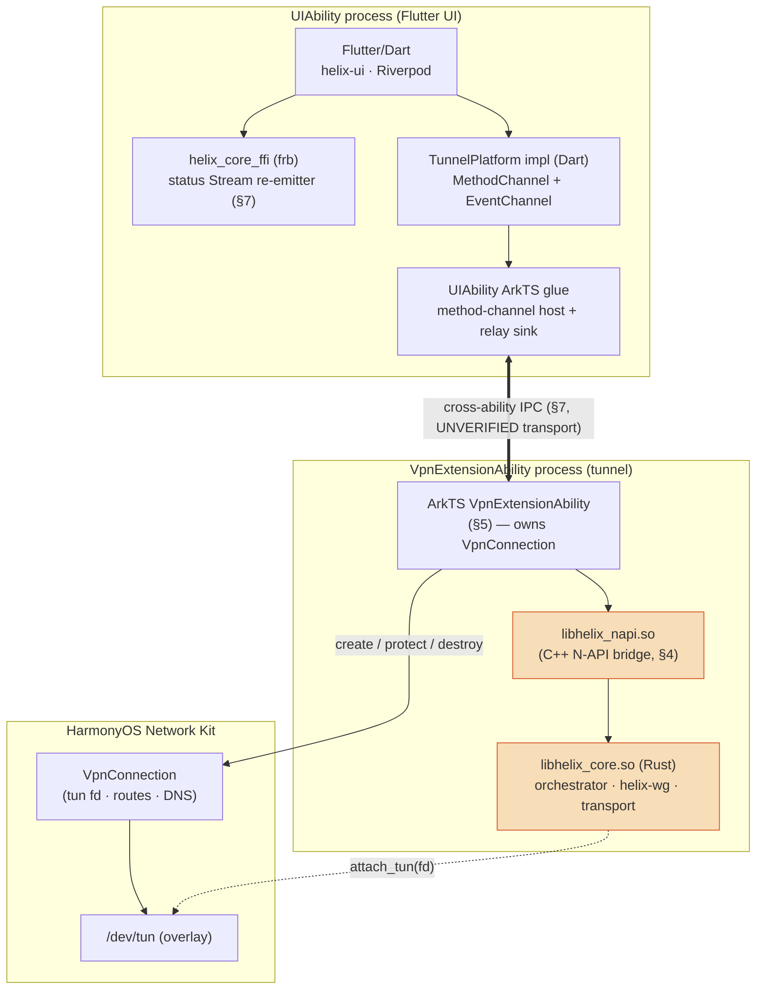
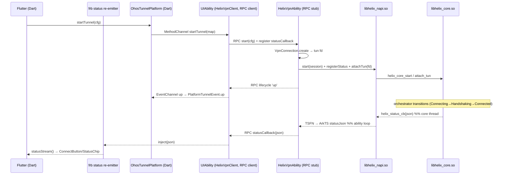
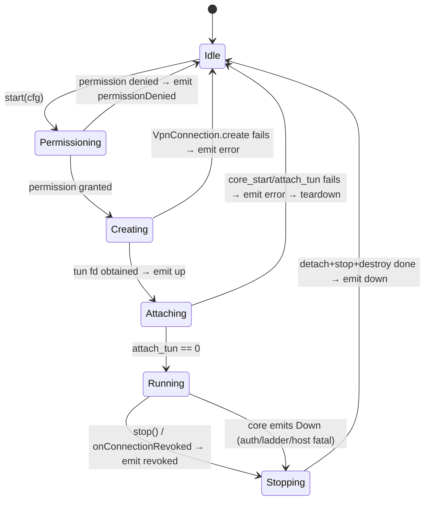

# HarmonyOS NEXT shim (Network Kit VPN)

**Revision:** 1
**Last modified:** 2026-06-25T00:00:00Z

> Master technical specification — Volume 4 (Clients), document
> `v04-client/shim-harmonyos.md` of the HelixVPN set. It **deepens** the
> HarmonyOS NEXT row of pass-1 doc `03` §5.5 (the Network Kit VPN *ability*
> shim) to nano-detail, implementation-ready granularity. It is SPEC-ONLY:
> it describes the exact shim to build — process topology, ArkTS ↔ NAPI ↔
> Rust signatures, the `TunnelPlatform` contract impl, state machines,
> lifecycle, memory budgets, error handling, edge cases, and per-test-type
> coverage — but does not build it.
>
> **Boundary with sibling docs.** This document **owns** the HarmonyOS NEXT
> tunnel shim only. It **consumes** (and must stay byte-consistent with):
> the `Transport` trait + `helix-wg` data plane (`v02-data-plane/transport-trait.md`),
> the orchestrator + frozen `TunnelStatus` broadcast enum
> (`v02-data-plane/orchestrator-and-state.md` §4.1), and the FFI surface +
> `TunnelPlatform` contract owned by doc `03` §3–§4. The Rust *internals* of
> `helix-core` are doc `01`/`02`'s; this doc owns only the HarmonyOS-specific
> binding + ability.
>
> **Evidence base.** Citations inline by id: `[04_ARCH §N]` =
> `04_VPN_CLD/HelixVPN-Architecture-Refined.md`; `[04_UI]` =
> `04_VPN_CLD/HelixVPN-helix-ui-Flutter.md`; `[03_CLIENT]` = pass-1 doc
> `final/03-client-core-and-ui.md`; `[01-DP]`/`[01-ORCH]` =
> `final/v02-data-plane/*`; `[research-flutter_ffi]` = the cited FFI/port
> research; `[research-ios_android]` = the sibling NE/VpnService shim research.
> Unproven platform facts are marked **UNVERIFIED** per §11.4.6 (no-guessing);
> they are Phase-3 verification gates, never assumed parity with Android/iOS.

---

## Table of contents

- [0. Position, status, and the Phase-3 risk](#0-position-status-and-the-phase-3-risk)
- [1. Process topology — split-process is the architecture](#1-process-topology--split-process-is-the-architecture)
- [2. The contract this shim satisfies (`TunnelPlatform`)](#2-the-contract-this-shim-satisfies-tunnelplatform)
- [3. The stable C ABI (`helix-core` exported surface)](#3-the-stable-c-abi-helix-core-exported-surface)
- [4. The NAPI bridge layer (C++ ↔ Rust `.so`)](#4-the-napi-bridge-layer-c--rust-so)
- [5. The ArkTS `VpnExtensionAbility` (the shim core)](#5-the-arkts-vpnextensionability-the-shim-core)
- [6. The UIAbility side — MethodChannel/EventChannel plumbing](#6-the-uiability-side--methodchannelEventchannel-plumbing)
- [7. The status relay (preserving CI2 across the process boundary)](#7-the-status-relay-preserving-ci2-across-the-process-boundary)
- [8. Lifecycle state machines](#8-lifecycle-state-machines)
- [9. `TunnelStatus` consistency mapping](#9-tunnelstatus-consistency-mapping)
- [10. Memory & resource budgets](#10-memory--resource-budgets)
- [11. Error handling & edge cases](#11-error-handling--edge-cases)
- [12. Build, signing, packaging](#12-build-signing-packaging)
- [13. Test points — §11.4.169 comprehensive test-type coverage](#13-test-points--114169-comprehensive-test-type-coverage)
- [14. Open decisions surfaced by this document](#14-open-decisions-surfaced-by-this-document)
- [Sources verified](#sources-verified)

---

## 0. Position, status, and the Phase-3 risk

HarmonyOS NEXT dropped Android/ART compatibility entirely — native ArkTS / ArkUI /
DevEco only, so an Android APK or KMP artifact will not run on it
[04_ARCH §5.2/§5.6]. The single-codebase path is the **OpenHarmony SIG Flutter
fork** (`gitee.com/openharmony-sig/flutter_flutter`, `ohos` device channel →
builds a `.hap`), engine recompiled for OHOS, tracking a **lagging Flutter
baseline** (commonly cited Flutter OHOS ~3.22.x atop HarmonyOS SDK 5.0.0(12) /
OpenHarmony API 10–12 — **UNVERIFIED**, pin at Phase-3 entry) [research-flutter_ffi §5].

**The payoff/risk split** [04_UI §6.1, 03_CLIENT §5.5]: *the UI ports for free,
the shim does not.* Every Dart pixel (`ConnectButton`, `ExitPicker`, settings,
account, policy) compiles unchanged; the irreducible per-platform work is this
shim — an ArkTS `VpnExtensionAbility` driving the Network Kit VPN API, a NAPI
bridge to the Rust `.so`, and a status relay. This is flagged the **biggest
single platform risk in the program** (doc `03` §13 Phase 3, [04_UI §6.1]) for
three reasons: (a) the SIG fork lags mainline and its plugin/embedder surface may
lack a needed API (honest SKIP-with-reason per §11.4.3 is the fallback, never a
faked PASS); (b) HarmonyOS's VPN extension API + its memory/lifecycle limits are
**UNVERIFIED** against our data-plane needs; (c) the toolchain (DevEco, signing)
is a separate, China-hosted CI lane.

| Property | Value | Source |
|---|---|---|
| Flutter fork | `openharmony-sig/flutter_flutter`, `ohos` channel | [research-flutter_ffi §5] |
| Artifact | `.hap` (signed in DevEco Studio) | [research-flutter_ffi §5], [04_ARCH §5.2] |
| Rust core packaging | `cdylib` → `libhelix_core.so` (OHOS is Linux-kernel-based) | [research-flutter_ffi §3/§5] |
| Native bridge | **N-API (Node-API)** C++ module ↔ stable C ABI of the `.so` | [03_CLIENT §5.5], [research-flutter_ffi §5] |
| VPN mechanism | Network Kit **`VpnExtensionAbility`** + `VpnConnection` (ArkTS) | [research-flutter_ffi §5] (API names **UNVERIFIED**) |
| Phase | **Phase 3** (second-tier target) | doc `03` §13 |

---

## 1. Process topology — split-process is the architecture

The load-bearing fact that shapes every signature below: on HarmonyOS NEXT the
VPN runs in a **`VpnExtensionAbility`** — a separate ability, **almost certainly a
separate OS process** from the `UIAbility` that hosts the Flutter engine
(**UNVERIFIED** whether OHOS may co-locate them; design for separate-process and
the co-located case degrades gracefully). This mirrors iOS's `NEPacketTunnelProvider`
(separate extension process) and is **unlike** Android's in-process
`VpnService` [research-ios_android]. Consequence: the data-plane core (the Rust
`.so` + orchestrator, the status authority per O-I10) lives in the **ability
process**, so its frb `StreamSink<TunnelStatus>` **cannot** reach the Dart isolate
in the UI process directly. Status must be **relayed** across the process boundary
(§7), then re-emitted on the Dart status stream so the UI contract (CI2: *the UI
is a pure function of the status stream*) is preserved physically as well as
logically.



The seam (identical in spirit to doc `03` §3.3): **lifecycle commands flow
UI → shim → core** (`startTunnel`/`stopTunnel` cross the IPC into the ability),
while **status flows core → relay → UI** (the core owns truth; the relay carries
it back). `setShields`/`setExit`/`exits` are pure-logic FFI calls **but** because
the orchestrator lives in the ability process, on HarmonyOS they are *also*
marshalled across the IPC as ability commands (§5.4), unlike Android where they
hit the in-process core directly.

---

## 2. The contract this shim satisfies (`TunnelPlatform`)

The HarmonyOS shim implements **exactly** the Dart `TunnelPlatform` contract from
doc `03` §4 — one `MethodChannel("helixvpn/tunnel")` + one
`EventChannel("helixvpn/tunnel/events")`. No HarmonyOS type leaks above the
channel; everything above is shared Dart.

```dart
// packages/helix_core_ffi/lib/tunnel_platform_ohos.dart
// The OHOS realization of the abstract TunnelPlatform (doc 03 §4).
class OhosTunnelPlatform implements TunnelPlatform {
  static const _m = MethodChannel('helixvpn/tunnel');
  static const _e = EventChannel('helixvpn/tunnel/events');

  @override
  Future<void> startTunnel(TunnelConfig cfg) async {
    // cfg fields are doc 03 §4: overlayIp, routes, dnsServers, splitExcludeApps,
    // mtu, sessionOrMapToken. Marshalled to a map the ArkTS host decodes (§6).
    await _m.invokeMethod('startTunnel', cfg.toMap());
  }

  @override
  Future<void> stopTunnel() => _m.invokeMethod('stopTunnel');

  @override
  Stream<PlatformTunnelEvent> events() => _e
      .receiveBroadcastStream()
      .map(PlatformTunnelEvent.fromMap); // up|down|permissionDenied|revoked|error
}
```

`PlatformTunnelEventKind` is the doc `03` §4 closed set — `up`, `down`,
`permissionDenied`, `revoked`, `error`. The `EventChannel` carries **only**
lifecycle (not `TunnelStatus`, not packet data); `TunnelStatus` arrives on the
separate frb status stream fed by the §7 relay.

---

## 3. The stable C ABI (`helix-core` exported surface)

All native shims (iOS cbindgen, Android JNI thunk, HarmonyOS NAPI) bind to one
**stable C ABI** exported from the `helix-ffi` crate via `cbindgen`
(`crate-type = ["staticlib", "cdylib"]`; HarmonyOS consumes the `cdylib`
`libhelix_core.so`). This is the C projection of the frb/UniFFI surface in doc
`03` §3.1 and is consistent with the iOS `helix_core_*` symbols seen in
`[03_CLIENT §5.1]`. The HarmonyOS shim uses the **fd-pump model** (like Android's
`ParcelFileDescriptor`, unlike iOS's `packetFlow` callback) because
`VpnConnection.create` returns a tun **file descriptor** — so the core pumps the
fd itself in-process (in the ability process).

```c
/* helix_core.h — generated by cbindgen from crates/helix-ffi. Stable C ABI.
 * Thread-safety: all functions are safe to call from the ability's main ArkTS
 * worker thread; the core spawns its own tokio runtime threads internally.
 * Every int return: 0 = OK, <0 = HelixErr (see §3.1). */

#include <stdint.h>
#include <stddef.h>

/* ---- handle lifecycle ---- */
/* mode: 0 = Client, 1 = Connector (doc 03 CoreMode). session_or_map = NUL-term
 * session token (Phase 1+) or map file path (Phase 0). Returns a handle id >0,
 * or <0 HelixErr. Idempotent guard: a second start without stop returns
 * HELIX_ERR_ALREADY_STARTED. */
int64_t helix_core_start(const char* session_or_map, int32_t mode);

/* Graceful stop of handle h: cancels loops, FINs transport, reverts
 * kill-switch+DNS, emits Down{reason="stopped"} on the status callback, frees h.
 * Idempotent: stopping an unknown/stopped handle returns 0. */
int32_t helix_core_stop(int64_t h);

/* ---- TUN handoff (CI1: the core never opens the TUN; the ability does) ---- */
/* Hand the core an OS tun fd from VpnConnection.create. The core dup()s it and
 * owns the dup; caller may close its copy. Starts the in-process pump. */
int32_t helix_core_attach_tun(int64_t h, int32_t tun_fd, uint32_t mtu);
int32_t helix_core_detach_tun(int64_t h);

/* ---- status callback (the relay source, §7) ---- */
/* cb receives a UTF-8 JSON encoding of TunnelStatus (§9) on every transition.
 * ctx is opaque, passed through. Called from a core thread — the C++ bridge MUST
 * forward via a NAPI threadsafe-function, never touch the ArkTS VM directly. */
typedef void (*helix_status_cb)(const char* status_json, void* ctx);
int32_t helix_core_set_status_cb(int64_t h, helix_status_cb cb, void* ctx);

/* ---- logic-only ops (doc 03 §3.1) — marshalled JSON in/out ---- */
/* exits(): caller frees the returned malloc'd JSON via helix_string_free. */
char*   helix_core_exits(int64_t h);                       /* JSON Vec<ExitOption> */
int32_t helix_core_set_exit(int64_t h, const char* exit_json);   /* {id, multiHopChain?} */
int32_t helix_core_set_shields(int64_t h, const char* shields_json); /* Shields (doc 03 §3.1) */
char*   helix_core_advertise(int64_t h, const char* cidrs_json); /* connector mode; JSON AdvertiseResult */
void    helix_string_free(char* s);

/* ---- diagnostics ---- */
const char* helix_core_version(void);   /* static, do not free */
const char* helix_last_error(void);     /* thread-local last HelixErr detail; static lifetime per call */
```

### 3.1 `HelixErr` closed set (negative C returns)

Mirrors the orchestrator's `Down.reason` vocabulary [01-ORCH §4.4] plus
shim-startup errors, so a numeric code maps to a stable string (§11.4.6).

| C const | int | Meaning | Relayed `Down.reason` |
|---|---|---|---|
| `HELIX_ERR_ALREADY_STARTED` | -1 | start on a live handle | (no Down) |
| `HELIX_ERR_BAD_CONFIG` | -2 | unparseable session/map/json | `host-fatal` |
| `HELIX_ERR_TUN_ATTACH` | -3 | `attach_tun` dup/ioctl failed | `host-fatal` |
| `HELIX_ERR_AUTH` | -4 | WG handshake rejected | `auth-failed` |
| `HELIX_ERR_NO_ROUTE` | -5 | RouteMap has no peer | `no-route` |
| `HELIX_ERR_LADDER_EXHAUSTED` | -6 | every transport rung failed | `ladder-exhausted` |
| `HELIX_ERR_PINNED_FAILED` | -7 | pinned transport failed | `pinned-transport-failed` |
| `HELIX_ERR_INTERNAL` | -99 | unexpected; detail in `helix_last_error()` | `host-fatal` |

---

## 4. The NAPI bridge layer (C++ ↔ Rust `.so`)

DevEco's native module template produces a CMake `.so` that registers N-API
functions. `libhelix_napi.so` is that module — a thin, **stateless-per-call**
C++ translator between ArkTS values and the §3 C ABI. It owns one global: the
NAPI **threadsafe-function (TSFN)** used to ferry status JSON from a core thread
into the ArkTS event loop (§7). No business logic lives here.

```cpp
// entry/src/main/cpp/helix_napi.cpp  — HarmonyOS NAPI module for the ability.
#include "napi/native_api.h"
#include "helix_core.h"
#include <cstring>

static napi_threadsafe_function g_status_tsfn = nullptr;  // set by registerStatus()

// ---- napi_value Start(env, [sessionOrMap: string, mode: number]): bigint(handle) ----
static napi_value Start(napi_env env, napi_callback_info info) {
  size_t argc = 2; napi_value args[2];
  napi_get_cb_info(env, info, &argc, args, nullptr, nullptr);
  char sess[2048]; size_t n = 0;
  napi_get_value_string_utf8(env, args[0], sess, sizeof(sess), &n);
  int32_t mode = 0; napi_get_value_int32(env, args[1], &mode);
  int64_t h = helix_core_start(sess, mode);                 // §3 C ABI
  napi_value out; napi_create_bigint_int64(env, h, &out);
  return out;                                                // <0 => ArkTS checks HelixErr
}

// ---- AttachTun(env, [handle: bigint, fd: number, mtu: number]): number ----
static napi_value AttachTun(napi_env env, napi_callback_info info) {
  size_t argc = 3; napi_value a[3];
  napi_get_cb_info(env, info, &argc, a, nullptr, nullptr);
  int64_t h; bool lossless; napi_get_value_bigint_int64(env, a[0], &h, &lossless);
  int32_t fd, mtu; napi_get_value_int32(env, a[1], &fd); napi_get_value_int32(env, a[2], &mtu);
  int32_t rc = helix_core_attach_tun(h, fd, (uint32_t)mtu);
  napi_value out; napi_create_int32(env, rc, &out); return out;
}

// ---- the C status callback runs on a CORE thread → bounce to TSFN (never touch VM here)
static void status_trampoline(const char* json, void* /*ctx*/) {
  if (!g_status_tsfn) return;
  char* dup = strdup(json);                                  // freed in js_status_cb
  napi_call_threadsafe_function(g_status_tsfn, dup, napi_tsfn_nonblocking);
}
// js_status_cb (omitted) runs on the ArkTS loop: builds a JS string, invokes the
// ArkTS callback, then free(dup). Registered via RegisterStatus(handle, jsCb).

EXTERN_C_START
static napi_value Init(napi_env env, napi_value exports) {
  napi_property_descriptor desc[] = {
    {"start", nullptr, Start, nullptr, nullptr, nullptr, napi_default, nullptr},
    {"stop", nullptr, Stop, nullptr, nullptr, nullptr, napi_default, nullptr},
    {"attachTun", nullptr, AttachTun, nullptr, nullptr, nullptr, napi_default, nullptr},
    {"detachTun", nullptr, DetachTun, nullptr, nullptr, nullptr, napi_default, nullptr},
    {"registerStatus", nullptr, RegisterStatus, nullptr, nullptr, nullptr, napi_default, nullptr},
    {"setShields", nullptr, SetShields, nullptr, nullptr, nullptr, napi_default, nullptr},
    {"setExit", nullptr, SetExit, nullptr, nullptr, nullptr, napi_default, nullptr},
    {"exits", nullptr, Exits, nullptr, nullptr, nullptr, napi_default, nullptr},
  };
  napi_define_properties(env, exports, sizeof(desc)/sizeof(desc[0]), desc);
  return exports;
}
EXTERN_C_END
static napi_module helixMod = { .nm_version = 1, .nm_flags = 0, .nm_filename = nullptr,
  .nm_register_func = Init, .nm_modname = "helix_napi", .nm_priv = nullptr, {0} };
extern "C" __attribute__((constructor)) void RegisterHelix(void) { napi_module_register(&helixMod); }
```

> **N-API rationale** [03_CLIENT §5.5, research-flutter_ffi §2/§5]: rather than
> `uniffi-dart` (community, "should not be trusted") or a HarmonyOS-native UniFFI
> path, the shim binds the **stable cbindgen C ABI** through a hand-written ~200-LOC
> N-API module. This keeps **one** Rust surface (frb for Dart, cbindgen C for all
> native shims) and avoids a fourth binding generator. The exact ArkTS↔C++ N-API
> import path (`import helix from 'libhelix_napi.so'`) and the `oh-package.json5`
> native-module declaration are DevEco conventions — **UNVERIFIED** version
> specifics, pin at Phase-3 entry.

---

## 5. The ArkTS `VpnExtensionAbility` (the shim core)

The ability is the HarmonyOS analogue of iOS `PacketTunnelProvider` /
Android `VpnService`. It (a) requests VPN permission + creates the
`VpnConnection`, (b) hands the tun fd to the core via NAPI, (c) registers the
status relay, (d) reports lifecycle on the EventChannel. **API names below are
the OpenHarmony Network Kit VPN surface (`@ohos.net.vpnExtension`) as cited by
[research-flutter_ffi §5] — exact method signatures are UNVERIFIED and MUST be
pinned against DevEco SDK docs at Phase-3 entry (§11.4.99 latest-source).**

```typescript
// entry/src/main/ets/serviceability/HelixVpnAbility.ets
import VpnExtensionAbility from '@ohos.app.ability.VpnExtensionAbility';   // UNVERIFIED path
import vpnExt from '@ohos.net.vpnExtension';                              // UNVERIFIED path
import helix from 'libhelix_napi.so';                                    // §4 N-API module
import type Want from '@ohos.app.ability.Want';

interface HelixTunnelCfg {            // decoded from the MethodChannel map (doc 03 §4)
  overlayIp: string; routes: string[]; dnsServers: string[];
  splitExcludeApps: string[]; mtu: number; sessionOrMapToken: string;
}

export default class HelixVpnAbility extends VpnExtensionAbility {
  private conn: vpnExt.VpnConnection | null = null;
  private handle: bigint = 0n;        // helix_core handle (§3); 0n = stopped

  // Phase A — permission + tun creation + core start. Invoked by the cross-ability
  // start command (§7). cfg arrives marshalled from Dart (§6).
  async onStart(want: Want, cfg: HelixTunnelCfg): Promise<void> {
    this.conn = vpnExt.createVpnConnection(this.context);                // UNVERIFIED
    const cfgBuilder: vpnExt.VpnConfig = {
      addresses: [{ address: { address: cfg.overlayIp, family: 1 }, prefixLength: 32 }],
      routes: cfg.routes.map(r => parseRoute(r)),     // AllowedIPs → OS routes
      dnsAddresses: cfg.dnsServers,                   // tunnel DNS (anti-leak)
      mtu: cfg.mtu,                                   // 1280 MASQUE / 1420 plain WG
      // splitExcludeApps → trustedApplications/blockedApplications (UNVERIFIED field name)
      blockedApplications: cfg.splitExcludeApps,
    };
    let tunFd: number;
    try {
      tunFd = await this.conn.create(cfgBuilder);     // returns tun fd — UNVERIFIED return shape
    } catch (e) {
      this.emitLifecycle(isPermDenied(e) ? 'permissionDenied' : 'error', `${e}`);
      return;
    }
    this.handle = helix.start(cfg.sessionOrMapToken, 0 /*Client*/);      // §4
    if (this.handle <= 0n) { this.emitLifecycle('error', `core_start ${this.handle}`); return; }
    helix.registerStatus(this.handle, (json: string) => this.relayStatus(json)); // §7
    const rc = helix.attachTun(this.handle, tunFd, cfg.mtu);            // §4 fd-pump
    if (rc !== 0) { this.emitLifecycle('error', `attach_tun ${rc}`); await this.onStop(); return; }
    this.emitLifecycle('up', 'tun-attached');                           // EventChannel up
  }

  async onStop(): Promise<void> {
    if (this.handle > 0n) { helix.detachTun(this.handle); helix.stop(this.handle); this.handle = 0n; }
    try { await this.conn?.destroy(); } catch (_) { /* best-effort */ }  // UNVERIFIED
    this.conn = null;
    this.emitLifecycle('down', 'stopped');
  }

  // OS-initiated revoke (another VPN took over / user revoked permission):
  onConnectionRevoked(): void { this.emitLifecycle('revoked', 'os-revoked'); void this.onStop(); }

  // logic-only commands marshalled in from the UI process (§5.4):
  setShields(json: string): number { return this.handle > 0n ? helix.setShields(this.handle, json) : -2; }
  setExit(json: string): number    { return this.handle > 0n ? helix.setExit(this.handle, json) : -2; }
  exits(): string                  { return this.handle > 0n ? helix.exits(this.handle) : '[]'; }

  private relayStatus(statusJson: string): void { /* §7 — push to UI process */ }
  private emitLifecycle(kind: string, detail: string): void { /* §7 — push to EventChannel */ }
}
```

### 5.4 Why logic ops cross the IPC on HarmonyOS

On Android the orchestrator is in-process, so `core.setShields(...)` is a direct
frb call (doc `03` §3.3). On HarmonyOS the orchestrator lives in the **ability**
process, so `setShields`/`setExit`/`exits`/`advertise` MUST be marshalled across
the cross-ability IPC (§7) into `HelixVpnAbility`, which forwards to NAPI. The
Dart `HelixCore` wrapper (doc `03` §3.2) is unchanged; only its OHOS
*implementation* routes through the platform channel instead of frb-in-process.
This is the one place the HarmonyOS FFI wiring deviates from the doc `03` §3.3
"logic goes straight UI→FFI" rule — documented here so the deviation is explicit,
not silent (§11.4.6).

---

## 6. The UIAbility side — MethodChannel/EventChannel plumbing

The Flutter engine is hosted in a `UIAbility`. The SIG fork's
`FlutterAbility`/`FlutterEngine` exposes the standard `MethodChannel`/`EventChannel`
host APIs in ArkTS (the OHOS equivalent of Android's `MethodChannel` registrar —
**UNVERIFIED** exact class names, pin at Phase-3). The UIAbility glue registers
the two channels and bridges them to the ability via the §7 IPC.

```typescript
// entry/src/main/ets/entryability/EntryAbility.ets (UIAbility, hosts Flutter)
import { MethodChannel, EventChannel } from '@ohos/flutter_ohos';        // UNVERIFIED package
import { HelixVpnClient } from '../relay/HelixVpnClient';                // §7 IPC client

export function registerHelixChannels(messenger: BinaryMessenger): void {
  const client = new HelixVpnClient();                                   // talks to the ability
  const m = new MethodChannel(messenger, 'helixvpn/tunnel');
  m.setMethodCallHandler({
    onMethodCall: async (call, result) => {
      switch (call.method) {
        case 'startTunnel': await client.start(call.args as Record<string, Object>); result.success(null); break;
        case 'stopTunnel':  await client.stop();  result.success(null); break;
        case 'setShields':  result.success(await client.setShields(call.args as string)); break;
        case 'setExit':     result.success(await client.setExit(call.args as string)); break;
        case 'exits':       result.success(await client.exits()); break;
        default: result.notImplemented();
      }
    },
  });
  const e = new EventChannel(messenger, 'helixvpn/tunnel/events');
  e.setStreamHandler({
    onListen: (_args, sink) => client.bindLifecycleSink(sink),           // up|down|permissionDenied|revoked|error
    onCancel: (_args) => client.unbindLifecycleSink(),
  });
}
```

The `TunnelConfig.toMap()` (Dart) ⇄ `HelixTunnelCfg` (ArkTS) marshalling keys are
the doc `03` §4 field names verbatim (`overlayIp`, `routes`, `dnsServers`,
`splitExcludeApps`, `mtu`, `sessionOrMapToken`) — a contract test (§13) asserts
the round-trip is lossless.

---

## 7. The status relay (preserving CI2 across the process boundary)

The core's `TunnelStatus` originates in the ability process; the UI must see it on
the frb status stream (CI2). The relay is the bridge. Two physical transports are
candidates — pick one at Phase-3 entry; **the choice is UNVERIFIED** and is open
decision **D-OHOS-1** (§14):

| Candidate IPC | Pros | Cons |
|---|---|---|
| `@ohos.rpc` (IRemoteObject, ability connect) | typed, request/response + callback | most boilerplate; lifecycle binding |
| `@ohos.commonEventManager` (publish/subscribe) | simplest fan-out for status events | best-effort delivery; ordering not guaranteed |
| `@ohos.distributedKVStore` / shared storage watch | survives ability restart | latency; not event-shaped |

**Recommended (UNVERIFIED): `@ohos.rpc`** — the ability exposes an
`IRemoteObject`; the UIAbility's `HelixVpnClient` connects to it, sends
`start/stop/setShields/...` requests, and registers a **callback object** the
ability invokes on every status transition and lifecycle event. RPC ordering +
delivery guarantees are what the single-state-authority contract (O-I10) needs.



The frb status re-emitter (`FFIr`) is a thin Dart sink: the OHOS build feeds the
relayed JSON into the same `Stream<TunnelStatus>` the rest of the app watches, so
**no UI code is platform-aware** (CI2 holds). On single-process platforms the frb
`StreamSink` feeds this stream directly; on HarmonyOS the relay feeds it — the
*shape* is identical.

---

## 8. Lifecycle state machines

### 8.1 Ability lifecycle (shim-owned)



The ability state machine is **lifecycle only**; it never invents a
`TunnelStatus`. Protection-state truth (Connecting/Handshaking/Connected/...) is
the orchestrator's (O-I10), surfaced via the §7 relay, never synthesized by the
ability. This is the seam that prevents "UI says connected while the tunnel is
down" (doc `03` §3.3).

### 8.2 Kill-switch ordering across the process boundary

Per O-I11 (kill-switch fails closed), the firewall side-effects are the
orchestrator's and execute **in the ability process before the status emit**: on
any transition into `Reconnecting`/`Down`, the core closes the firewall, *then*
relays the status. The relay carries already-applied truth, so a UI reacting to
`Connected` can trust the tunnel is open and a UI reacting to `Danger`/`Down`
knows the firewall is already closed. The ability process crashing leaves the OS
`VpnConnection` torn down by the OS (fail-closed by construction — no
`VpnConnection`, no route); the UIAbility observes the RPC death and surfaces
`PlatformTunnelEvent.down` (§11).

---

## 9. `TunnelStatus` consistency mapping

The frozen orchestrator broadcast enum is the 5-variant contract
[01-ORCH §4.1]:

```rust
// crates/helix-core — the SINGLE state authority (O-I10). FROZEN.
pub enum TunnelStatus {
    Connecting,
    Handshaking,
    Connected { transport: String, rtt_ms: u32 },
    Reconnecting,
    Down { reason: String },   // reason vocab: §3.1 / [01-ORCH §4.4]
}
```

The **FFI-facing** enum (doc `03` §3.1) mirrors-and-extends it with three
client-only additions — `Disconnected` (clean idle, distinct from `Down`), `path`
on `Connected` (`"direct"|"relay"`), and `Danger{kind}` (leak / kill-switch
tripped). The HarmonyOS relay carries the **FFI-facing** JSON, so the OHOS build's
`Stream<TunnelStatus>` is byte-identical to every other platform's. The mapping
(orchestrator → FFI projection) the relay applies:

| Orchestrator `OrchState`/`TunnelStatus` | Relayed FFI `TunnelStatus` JSON | Notes |
|---|---|---|
| `Idle` (internal) | `{"t":"Disconnected"}` | clean idle; never `Down` |
| `Connecting` | `{"t":"Connecting"}` | |
| `Handshaking` | `{"t":"Handshaking"}` | carrier up, WG handshake in flight |
| `Connected{transport,rtt_ms}` | `{"t":"Connected","transport":..,"path":..,"rtt_ms":..}` | `path` from doc `01` direct/relay |
| `Reconnecting{..}` | `{"t":"Reconnecting"}` | emitted once per drop [01-ORCH §4.3] |
| `ShuttingDown` (internal) | `{"t":"Down","reason":"stopped"}` | maps to Down [01-ORCH §4.4] |
| `Down{reason}` | `{"t":"Down","reason":..}` | reason ∈ §3.1 vocab |
| (leak / kill-switch tripped) | `{"t":"Danger","kind":"leak"\|"killswitch_tripped"}` | drives red palette (doc `03` §7) |

> **Consistency gate (§13 unit/contract test):** the ArkTS relay's JSON tag set
> and the Dart `TunnelStatus` frb mirror MUST match the orchestrator enum + the
> three documented extensions exactly. A drift (extra/missing tag, renamed field)
> FAILs the contract test — the same byte-for-byte assertion doc `03` §3.1 mandates
> for the frb mirror, here applied to the relay JSON codec.

---

## 10. Memory & resource budgets

The iOS Network Extension working-set ceiling (historically ~15 MB) is the
program's hardest constraint and the reason the core is Rust (CI4)
[04_ARCH §5.6, research-ios_android]. **HarmonyOS's `VpnExtensionAbility` process
memory ceiling is UNVERIFIED** — it is a Phase-3 G-gate measurement, not an
assumption. Design targets (mirroring the iOS discipline so the OHOS build
inherits the lean profile for free):

| Budget | Target | Verification (Phase 3) |
|---|---|---|
| Ability-process steady-state RSS | ≤ ~16 MB design target (**actual ceiling UNVERIFIED**) | 1 GB sustained transfer on a real HarmonyOS device, sample ability-process RSS via DevEco profiler |
| Rust `.so` build profile | `opt-level=z` + thin-LTO + `panic=abort` + strip, `aarch64` OHOS target | matches the iOS G3 recipe [research-ios_android] |
| MASQUE vs plain-UDP RSS | both pass separately (QUIC buffers cost more) | run each transport in isolation, ≥30 % headroom over the device ceiling across a 30-min soak |
| NAPI bridge overhead | ~constant; no per-packet allocation (fd-pump, not callback) | TSFN used only for status (≪1 msg/s), never packets |
| `.hap` size | within the doc `03` §10 client size budget | DevEco artifact inspection |

**Fallback ladder if the ability ceiling is breached** (each a real product
decision, never hand-waved — mirrors the iOS §5.1 fallbacks): (1) shrink
buffers / cap QUIC flow-control windows in the OHOS build; (2) move MASQUE
off-device for HarmonyOS (plain WG + on-path obfuscation only — partial feature
loss); (3) split so only the lean WG datapath is in the ability and QUIC
negotiation lives in the UI process via the RPC channel. The chosen rung is
**D-OHOS-2** (§14).

---

## 11. Error handling & edge cases

| # | Edge case | Detection | Handling |
|---|---|---|---|
| E1 | VPN permission denied | `VpnConnection.create` throws perm error | `PlatformTunnelEvent.permissionDenied`; no core start; UI prompts re-grant |
| E2 | Another VPN active / OS revokes | `onConnectionRevoked` | emit `revoked`, teardown, kill-switch already closed (O-I11) |
| E3 | `attach_tun` fails (bad fd) | `helix_core_attach_tun` returns `HELIX_ERR_TUN_ATTACH` | emit `error`, run `onStop`, surface `Down{host-fatal}` |
| E4 | Ability process crash | UIAbility RPC death callback | `PlatformTunnelEvent.down`; OS auto-tears `VpnConnection` (fail-closed); UI offers reconnect |
| E5 | UI process killed, tunnel alive | OS keeps the ability running | on UI relaunch, `HelixVpnClient` re-binds RPC + re-subscribes status; relay replays last `TunnelStatus` (latest-wins, not history) |
| E6 | Status callback after stop | core stopped but a late `helix_status_cb` fires | TSFN guarded by handle generation; stale-handle status dropped (no UI flicker) |
| E7 | WG auth rejected | core returns `Down{auth-failed}` | relay → `Danger`? No — `Down{auth-failed}`; UI shows re-enroll path; kill-switch stays closed |
| E8 | DNS leak / kill-switch trip | core emits `Danger{kind}` | relay → red palette; firewall already closed before emit (§8.2) |
| E9 | SIG-fork lacks a channel API | build/integration time | honest **SKIP-with-reason** per §11.4.3 + tracked migration item; never a faked PASS |
| E10 | MTU mismatch (1280 MASQUE vs 1420 plain) | negotiated `mtu` in `TunnelConfig` | passed to both `VpnConfig.mtu` and `attach_tun(mtu)`; mismatch is a contract-test failure (§13) |
| E11 | Split-tunnel app list unsupported | `blockedApplications` field absent in SIG SDK | SKIP-with-reason; degrade to full-tunnel + surface to user (no silent drop, §11.4.6) |
| E12 | TSFN backpressure | status burst | `napi_tsfn_nonblocking` drops oldest on full queue; status is latest-wins so a dropped intermediate is harmless (final state always delivered) |

All `helix_last_error()` strings are logged **without** the session token / map
contents (§11.4.10 credentials never logged).

---

## 12. Build, signing, packaging

| Step | Tool / artifact | Notes |
|---|---|---|
| Rust core | `cargo build --target aarch64-unknown-linux-ohos` (OHOS target via `ohos-rs`/NDK — **UNVERIFIED** target triple, pin Phase-3) → `libhelix_core.so` | `cdylib`; lean profile (§10) |
| C ABI header | `cbindgen` → `helix_core.h` | shared with iOS/Android shims (§3) |
| NAPI module | DevEco CMake native module → `libhelix_napi.so` (§4) | links `libhelix_core.so` |
| Flutter engine | `openharmony-sig/flutter_flutter`, `ohos` channel | pinned baseline (§0) |
| App assembly | `flutter build hap` (SIG fork) → DevEco project | embeds both `.so`s under the ability module |
| Signing | DevEco Studio (HarmonyOS app cert/profile) | separate CI lane; cert material per §11.4.10 (gitignored, never logged) |
| `module.json5` | declares `VpnExtensionAbility` + `ohos.permission.VPN`-class permission (**UNVERIFIED** exact permission id) | pin Phase-3 |

The OHOS target triple, the VPN permission identifier, and the `oh-package.json5`
native-module declaration are **UNVERIFIED** DevEco/SDK specifics — each is a
Phase-3 latest-source verification (§11.4.99), not a memorized constant.

---

## 13. Test points — §11.4.169 comprehensive test-type coverage

Per the LIVE constitution anchor §11.4.169 (mandatory comprehensive test-type
coverage) composed with §11.4.27 (100 % test-type coverage) and §11.4.3
(topology-aware SKIP-with-reason where the SIG embedder genuinely lacks an API —
never a faked PASS), every shim surface carries the applicable test types with
**real captured evidence** (§11.4.5/§11.4.69) — no metadata-only PASS.

| Test type | What it exercises here | Evidence / anti-bluff |
|---|---|---|
| **Unit** | NAPI value marshalling (string/bigint/int round-trips, §4); `TunnelConfig.toMap` ⇄ `HelixTunnelCfg`; HelixErr→`Down.reason` map (§3.1); relay JSON codec ↔ frb `TunnelStatus` mirror (§9). Riverpod fakes via `StreamProvider.overrideWithValue` [research-flutter_ffi §6]. | golden-good/golden-bad fixtures (§11.4.107(10)); a renamed enum tag FAILs the §9 consistency gate. |
| **Contract / consistency** | the §9 byte-for-byte `TunnelStatus` assertion across orchestrator enum ↔ relay JSON ↔ Dart mirror; the doc `03` §4 `TunnelPlatform` channel signature. | drift = FAIL (mirrors doc `03` §3.1 frb-mirror test). |
| **Integration** | ArkTS ability ↔ NAPI ↔ real `libhelix_core.so` against a real local gateway: `start → attach_tun → Connected` over plain-UDP **and** MASQUE; `setShields/setExit/exits` across the RPC (§5.4). No mocks beyond unit (§11.4.27). | captured status timeline + sink-side evidence (§11.4.69 `network_connectivity`). |
| **E2E (full-automation)** | real device: launch HAP → grant VPN permission → connect → real traffic flows through the overlay → toggle kill-switch → leak check → stop; fully self-driving (§11.4.98). UI non-introspectable parts via the §11.4.117 pixel/OCR oracle. | window-scoped MP4 + vision verdict (§11.4.159); `docs/qa/<run-id>/`. |
| **Security** | DNS-leak + kill-switch-fails-closed across process crash (E4/E8); session token never in logs (§11.4.10); permission-revoke teardown (E2). | leak-probe captures; log audit. |
| **Stress** | 1 GB+ sustained transfer; 30-min soak; TSFN status burst (E12); rapid start/stop cycles (handle generation guard, E6). | per-iteration latency + RSS series (§11.4.85). |
| **Chaos** | kill the ability process mid-transfer (E4); revoke VPN mid-stream (E2); kill UI process, keep tunnel, relaunch + re-bind (E5); corrupt/short tun fd (E3). | categorised recovery traces; fail-closed asserted. |
| **Performance / benchmarking** | ability-process RSS vs the §10 budget (MASQUE vs plain separately); throughput vs Android baseline; NAPI per-call overhead (status only). | DevEco profiler RSS series; the §10 G-gate. |
| **Scaling** | many routes / large RouteMap reconcile in the ability without RSS blowup. | RSS vs route-count curve. |
| **UI / UX** | the shared Dart screens render identically on OHOS (the UI ports for free); `ConnectButton` is a pure function of the relayed status stream (CI2); state announced not just colored (CI5). | visual-regression + a11y assertions [04_UI §9]. |
| **Challenges / HelixQA** | a HelixQA bank entry drives the E2E journey + scores PASS only on positive captured evidence (§11.4.27). | unforgeable on-device evidence. |

Paired §1.1 meta-test mutations protect each gate (e.g. strip the §9 consistency
assertion → contract test must FAIL; force the relay to emit `Connected` while
the core is `Down` → E2E leak/kill-switch test must FAIL). Where the SIG fork
genuinely lacks an API (E9/E11), the test is an honest **SKIP-with-reason**
(§11.4.3) plus a tracked migration item — never a green that masks a missing
capability.

---

## 14. Open decisions surfaced by this document

| ID | Decision | Options | Default (pending verification) |
|---|---|---|---|
| **D-OHOS-1** | cross-ability status/command IPC transport (§7) | `@ohos.rpc` · `commonEventManager` · shared KV-store | `@ohos.rpc` (ordering + delivery for O-I10) — **UNVERIFIED** |
| **D-OHOS-2** | memory-ceiling fallback rung if the ability RSS budget is breached (§10) | shrink buffers · MASQUE-off-device · split WG/QUIC | rung 1 (shrink buffers) first; escalate on G-gate failure |
| **D-OHOS-3** | OHOS Rust target triple + NDK toolchain (§12) | `*-linux-ohos` via `ohos-rs` / Huawei NDK | pin at Phase-3 entry — **UNVERIFIED** |
| **D-OHOS-4** | split-tunnel field mapping (`splitExcludeApps` → `blockedApplications`/`trustedApplications`, §5/§11) | SDK-version dependent | verify against DevEco SDK; SKIP+degrade if absent (E11) |
| **D-OHOS-5** | whether `VpnExtensionAbility` is guaranteed a separate process (§1) | separate / co-located | design for separate; co-located degrades gracefully — **UNVERIFIED** |

---

## Sources verified

- `04_VPN_CLD/HelixVPN-Architecture-Refined.md` §5 (Flutter-for-8-platforms, HarmonyOS SIG fork, per-platform shims, NE memory ceiling) — accessed 2026-06-25.
- `04_VPN_CLD/HelixVPN-helix-ui-Flutter.md` §6/§6.1 (TunnelPlatform contract, "UI ports for free / shim does not", Phase-3 risk) — accessed 2026-06-25.
- `final/03-client-core-and-ui.md` §3 (FFI surface, frb `TunnelStatus` mirror + extensions), §4 (TunnelPlatform/TunnelConfig/PlatformTunnelEventKind), §5.1 (iOS C-ABI `helix_core_*` pattern), §5.5 (HarmonyOS row) — accessed 2026-06-25.
- `final/v02-data-plane/orchestrator-and-state.md` §4.1 (frozen 5-variant `TunnelStatus`), §4.3 (emit cadence), §4.4 (`Down.reason` vocab), O-I10/O-I11 — accessed 2026-06-25.
- `research-flutter_ffi.md` §2 (UniFFI-Dart not production-ready → NAPI/C-ABI path), §3 (cdylib packaging), §5 (OpenHarmony SIG `flutter_flutter`, `ohos` channel→HAP, Flutter OHOS baseline, ArkTS `vpnExtension`/`VpnExtensionAbility` bridged via NAPI — version specifics flagged UNVERIFIED), §6 (Riverpod StreamProvider) — accessed 2026-06-25.
- `research-ios_android.md` (NE memory ceiling discipline reused as the OHOS design target; VpnService in-process vs NE separate-process contrast) — accessed 2026-06-25.

> **UNVERIFIED markers** in this document (§0, §1, §4, §5, §10, §12, §14) are the
> Phase-3 latest-source verification gates (§11.4.99) against the DevEco SDK +
> OpenHarmony Network Kit docs; none is assumed true. Per §11.4.6 they are
> explicitly flagged rather than guessed, and per §11.4.3 a SIG-fork capability
> gap resolves to an honest SKIP-with-reason, never a fabricated PASS.
