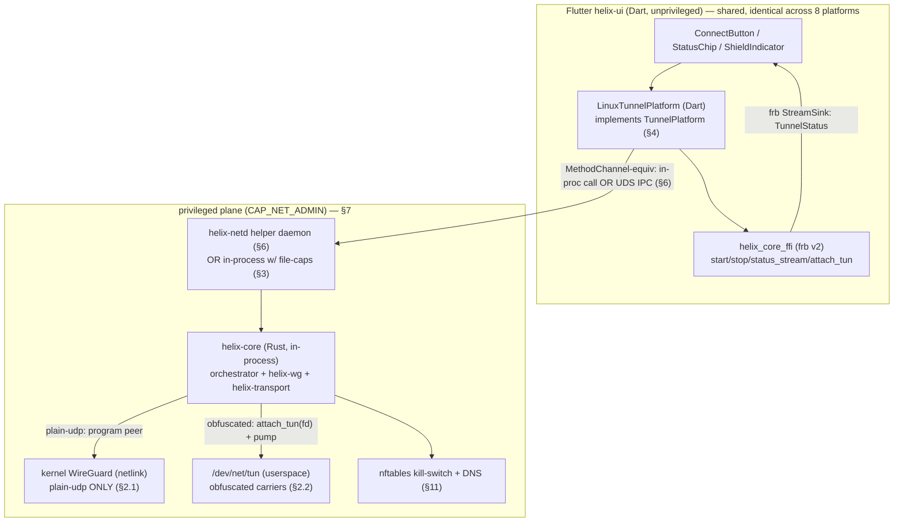
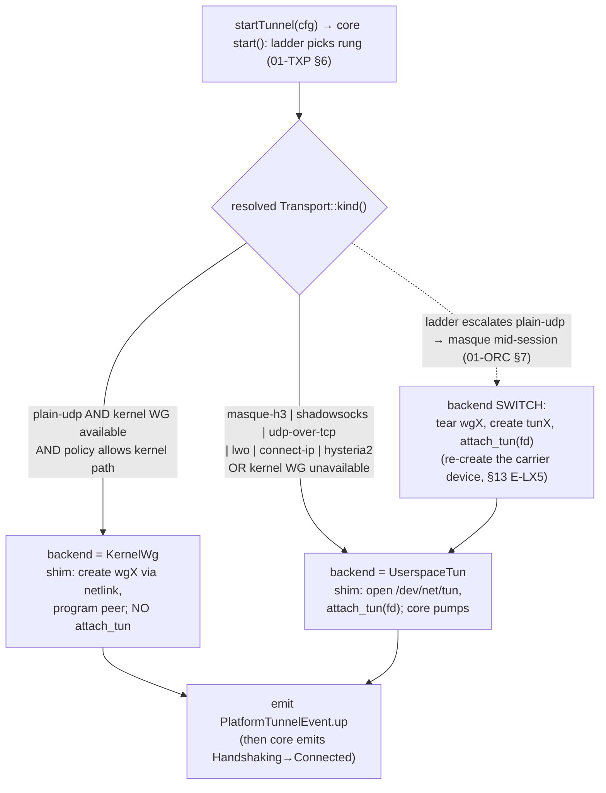
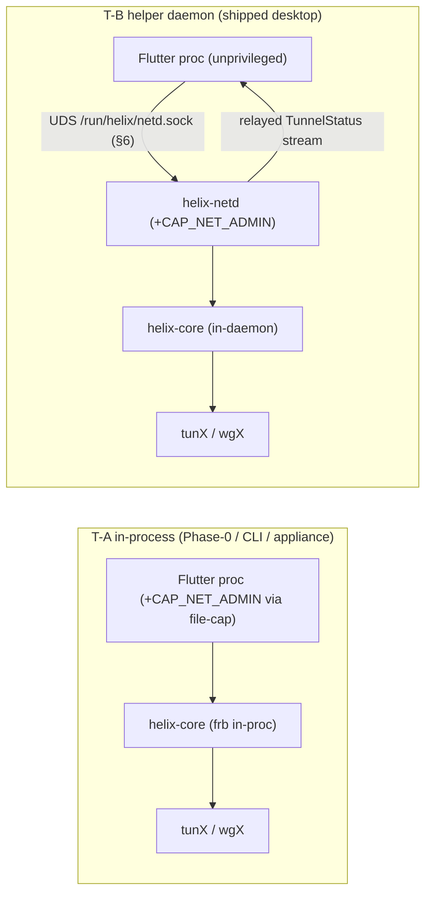
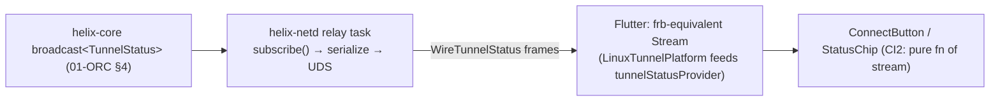
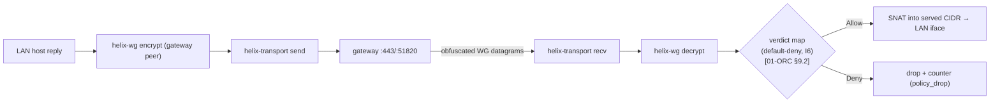

# Linux shim (kernel WG / tun)

**Revision:** 1
**Last modified:** 2026-06-25T00:00:00Z

> Volume 4 (Clients) nano-detail specification — deepens the **Linux** row of the
> `TunnelPlatform` shim matrix [03-client §5.4]. SPEC ONLY: it pins **what to
> build** — concrete Rust/Dart signatures, the `TunnelPlatform` contract impl,
> FFI surface, the helper-daemon IPC, state machines, lifecycle, privilege
> model, memory budgets, error handling, edge cases, and test points tied to the
> §11.4.169 closed test-type vocabulary. It does **not** write the shipping
> product. Sources cited inline by id — `[03-client §N]` =
> `final/03-client-core-and-ui.md` (the pass-1 client overview this deepens);
> `[01-TXP §N]` = `final/v02-data-plane/transport-trait.md`; `[01-ORC §N]` =
> `final/v02-data-plane/orchestrator-and-state.md`; `[04_ARCH §N]` =
> `04_VPN_CLD/HelixVPN-Architecture-Refined.md`; `[04_UI §N]` =
> `04_VPN_CLD/HelixVPN-helix-ui-Flutter.md`; `[04_P0 §N]` =
> `04_VPN_CLD/HelixVPN-Phase0-Spike.md`; `[SYN §N]` =
> `v09-research/_SYNTHESIS.md`. `[research-flutter_ffi]` /
> `[research-ios_android]` = the FFI / native-shim pattern digests (referenced
> for the generic `flutter_rust_bridge`/UniFFI patterns doc 03 already grounds).
> Anything not grounded in that evidence base is tagged `UNVERIFIED` per
> constitution §11.4.6 — never fabricated.

---

## Table of contents

- [0. Position, ownership, and what makes Linux different](#0-position-ownership-and-what-makes-linux-different)
- [1. Non-negotiable Linux-shim invariants](#1-non-negotiable-linux-shim-invariants)
- [2. The two data-path backends (kernel WG vs userspace tun)](#2-the-two-data-path-backends-kernel-wg-vs-userspace-tun)
- [3. Deployment topologies (in-process vs privileged helper daemon)](#3-deployment-topologies-in-process-vs-privileged-helper-daemon)
- [4. The `TunnelPlatform` contract — Linux impl](#4-the-tunnelplatform-contract--linux-impl)
- [5. FFI surface consumed on Linux + the TUN handoff](#5-ffi-surface-consumed-on-linux--the-tun-handoff)
- [6. The privileged helper daemon (`helix-netd`) + IPC](#6-the-privileged-helper-daemon-helix-netd--ipc)
- [7. Privilege model — CAP_NET_ADMIN, rootless, polkit, setcap](#7-privilege-model--cap_net_admin-rootless-polkit-setcap)
- [8. systemd integration](#8-systemd-integration)
- [9. The connector-daemon deployment (`--mode=connector`)](#9-the-connector-daemon-deployment---modeconnector)
- [10. Shim lifecycle state machine](#10-shim-lifecycle-state-machine)
- [11. Kill-switch + DNS on Linux (nftables / resolved)](#11-kill-switch--dns-on-linux-nftables--resolved)
- [12. Memory / size / performance budgets](#12-memory--size--performance-budgets)
- [13. Error taxonomy & edge cases](#13-error-taxonomy--edge-cases)
- [14. Test points (§11.4.169)](#14-test-points-1114169)
- [15. Open decisions surfaced by this document](#15-open-decisions-surfaced-by-this-document)
- [16. Cross-document contracts this document consumes/fixes](#16-cross-document-contracts-this-document-consumesfixes)
- [Sources verified](#sources-verified)

---

## 0. Position, ownership, and what makes Linux different

The Linux shim is one row of the `TunnelPlatform` matrix [03-client §5,
04_ARCH §5.3]: *configure the OS tunnel, hand packets to/from `helix-core`,
report lifecycle — everything else is shared Dart* [04_UI §6]. This document
owns **only** the Linux instantiation of that contract; it does not re-specify
the FFI surface (owned by [03-client §3]), the `Transport` trait ([01-TXP]), or
the orchestrator/`TunnelStatus` ([01-ORC]) — it **consumes** them.

Linux is the **reference / simplest** shim platform [04_P0 §9, 03-client §5.4]:
on desktop the core can drive the TUN **in-process** — there is no OS-managed
extension process (unlike iOS Network Extension or Android `VpnService`), no
mandatory IPC hop (unlike the Windows privileged service). That simplicity is
exactly why Phase-0 gate G5 (`flutter_rust_bridge` drives the core from Dart)
ships on Flutter-Linux first [04_P0 §9].

But Linux carries **two structural complications the other shims do not**:

| # | Linux-specific reality | Consequence |
|---|---|---|
| L0a | **Two real data-path backends** exist — kernel WireGuard (netlink) and userspace `/dev/net/tun` — with *different obfuscation reach* (§2). | A backend-selection decision the core makes per active `Transport`, not a fixed choice. |
| L0b | **CAP_NET_ADMIN is mandatory** to create a TUN, program routes, and install the kill-switch, yet the Flutter GUI runs unprivileged. | A privilege seam (§7) — either file-caps on a helper or a polkit-gated helper daemon (§6), mirroring the Windows service model. |
| L0c | **Linux is the connector's primary host** — the headless `--mode=connector` daemon (§9) runs on Linux far more than the GUI does [04_ARCH §5.4, 01-ORC §9]. | This doc owns the *daemon* deployment too, not only the desktop GUI shim. |

> **Ownership boundary (CI1 [03-client §0.1]).** The shim owns the OS tunnel
> *lifecycle and privilege* (create/configure/destroy the TUN, acquire
> CAP_NET_ADMIN, install/remove firewall rules). It does **not** own crypto,
> obfuscation, or status truth — `helix-core` is the only place WG + transport
> live (O2 [03-client §4.1]), and `TunnelStatus` is core-sourced (CI2). On
> Linux the core is linked **in-process** (desktop GUI / connector daemon) so
> the seam is a function-call boundary, not a socket — but the *ownership* split
> is identical to every other platform.



---

## 1. Non-negotiable Linux-shim invariants

Inherits the five `TunnelPlatform` obligations O1–O5 [03-client §4.1] and adds
the Linux-specific ones below. A violation is a release blocker (§11.4 anti-bluff
at the platform-shim layer; the shim is the only untyped seam — O5).

| # | Invariant | Why / mechanical consequence |
|---|---|---|
| **LX1** | The shim **never crypts/obfuscates**; it only creates the carrier device and hands the core a tun fd (userspace) or programs a kernel-WG peer (plain-udp). | O2 [03-client §4.1]; one core, no fork [01-TXP I4]. |
| **LX2** | **CAP_NET_ADMIN is acquired through exactly one sanctioned path** (file-cap helper *or* polkit-gated `helix-netd`, §7) — never `sudo` from the GUI, never a setuid-root blob. | §11.4.161 rootless-first; §11.4.133 target-system safety. |
| **LX3** | **`startTunnel` is idempotent + permission-aware**: if privilege acquisition is denied, emit `permissionDenied` (not `error`), leave **no** half-open tun / orphan route / dangling nft table (§11.4.14). | O1 [03-client §4.1]. |
| **LX4** | On `stopTunnel` **and on every abnormal exit path** the shim restores a quiescent host: tun destroyed, routes withdrawn, nft kill-switch table flushed *per the §8.6/§11 fail-closed rule* (kill-switch stays closed on crash, opens only on user-stop). | O4 [03-client §4.1]; O-I11 [01-ORC §0.3]; `trap`/`Drop`/systemd `ExecStopPost`. |
| **LX5** | The shim reports **lifecycle** as `PlatformTunnelEvent` (up/down/permissionDenied/revoked/error); it **never** synthesizes a `TunnelStatus`. Protection-state truth flows core→FFI→UI (CI2). | prevents "UI says connected while tunnel is down". |
| **LX6** | **Backend choice is determined by the active `Transport::kind()`** (§2), never guessed: plain-udp MAY use kernel WG; any obfuscated carrier MUST use the userspace tun path. The shim asks the core which backend the resolved rung needs; it does not infer. | §11.4.6 no-guessing; §2.3. |
| **LX7** | The **connector daemon and the desktop GUI run the byte-identical core** (`--mode={client\|connector}`), differing only in routing posture and privilege host (§9). | O-I13 [01-ORC §0.3], I4 [01-TXP]. |

---

## 2. The two data-path backends (kernel WG vs userspace tun)

The single most consequential Linux nano-detail. HelixVPN's obfuscation is
**pluggable beneath WireGuard** [04_ARCH §2/§3, SYN §2]; `helix-transport`
carriers (`masque-h3`, `shadowsocks`, `udp-over-tcp`, `lwo`, …) sit *below* the
WG datagram [01-TXP §0]. This collides with how Linux kernel WireGuard works.

### 2.1 Kernel WireGuard (netlink) — `plain-udp` ONLY

Kernel WG owns its **own** UDP socket to the peer endpoint; it encrypts in the
kernel and sends WG datagrams directly out a raw UDP port [04_ARCH §3 table,
SYN §5]. It is the fast path (zero userspace copies, no per-packet
context-switch). It is configured over **netlink** (the `wireguard` genl family)
+ `rtnetlink` for addresses/routes — via the `wireguard-control` /
`defguard_wireguard_rs` + `rtnetlink` crates (`UNVERIFIED` exact crate choice —
a Phase-1 dependency decision; the netlink *mechanism* is grounded
[04_ARCH §5.3]).

**Hard limitation (FACT, not a guess — §11.4.6):** kernel WG speaks only plain
WireGuard-over-UDP. It cannot route its datagrams *through* a userspace MASQUE /
Shadowsocks / TCP obfuscator. Therefore **kernel WG is usable only when the
active rung is `plain-udp`** (the unrestricted-network baseline [01-TXP §4.1]).

```
plain-udp via kernel WG:
  [app traffic] → kernel route → wgX (kernel WG iface) → kernel encrypts
       → kernel UDP :51820 → peer        (helix-core only PROGRAMS the peer; no per-packet pump)
```

In this mode `helix-core`'s data loops (`01-ORC §3`) **do not pump packets** —
the kernel does the datapath. The orchestrator still owns control: reconcile,
kill-switch, DNS, status. It programs the kernel WG device (peer pubkey,
endpoint, AllowedIPs) and reads `last_handshake_time` / rx/tx counters via
netlink to drive `Handshaking → Connected` and `PeerTimeout` (§10, §13).

### 2.2 Userspace `/dev/net/tun` — every obfuscated carrier

When the active rung is **any** obfuscating transport, the datapath MUST be
userspace: the shim opens `/dev/net/tun`, `ioctl(TUNSETIFF, IFF_TUN|IFF_NO_PI)`
to create `tunX`, programs addresses/routes/MTU on it, and hands the **fd** to
the core via `attach_tun(fd)` [03-client §3.1, 01-ORC §2.1]. The core's three
loops [01-ORC §3] then run: plaintext IP ← tun → helix-wg (boringtun userspace)
encrypt → helix-transport obfuscate → OS socket; and the reverse.

```
masque-h3 (or any obfs) via userspace tun:
  [app traffic] → kernel route → tunX (/dev/net/tun) → read by helix-core loop A
       → helix-wg encrypt → helix-transport (masque-h3) → QUIC/H3 :443 → gateway
```

This is the path that the iOS NE / Android `VpnService` shims use universally
(they have no kernel-WG option) [03-client §5.1/§5.2]; on Linux it is the
**obfuscated** path and the **fallback** path when kernel WG is unavailable
(no `wireguard` module, missing CAP, container without the genl family)
[04_ARCH §5.3 "boringtun userspace only as fallback"].

### 2.3 Backend selection (the core decides, the shim obeys — LX6)



Selection rule (closed, §11.4.6 — no guessing):

1. The core's ladder resolves the rung → `Transport::kind()` [01-TXP §6.3].
2. `kind() == "plain-udp"` **and** the host advertised `kernel_wg = true` at
   `startTunnel` **and** `KernelPathPolicy != ForceUserspace` ⇒ **KernelWg**.
3. Otherwise ⇒ **UserspaceTun** (the universal path; always available where
   `/dev/net/tun` + CAP_NET_ADMIN exist).
4. A **ladder escalation that changes `kind()`** across the kernel/userspace
   boundary (e.g. `plain-udp` blocked → escalate to `masque-h3`) is a **backend
   switch**: the orchestrator's atomic carrier swap [01-ORC §7.3] is paired with
   a shim-side carrier-device swap — tear the kernel wgX, create the userspace
   tunX, `attach_tun(fd)`, re-program routes/DNS/kill-switch on the new device.
   The kill-switch stays **closed** across the swap (O-I11) so no leak window.

> **Decision D-LXN-1 (surfaced, §11.4.66).** Whether to ship the kernel-WG fast
> path in Phase 1 at all, or default every Linux session to the userspace tun
> for one uniform datapath (simpler, slightly slower for the plain-udp case).
> Option A (ship both): best plain-udp throughput on cooperative networks.
> Option B (userspace-only Phase 1): one datapath, no backend-switch complexity,
> matches iOS/Android exactly — defer kernel WG to Phase 2 as a perf
> optimisation. **Recommendation: B for Phase 1** (kill-switch/backend-switch
> correctness > peak plain-udp throughput; the userspace path is the one every
> obfuscated carrier needs anyway), promote A in Phase 2 behind a measured
> `BENCH` gain. See §15.

---

## 3. Deployment topologies (in-process vs privileged helper daemon)

Two ways the privileged datapath is reached from the unprivileged Flutter GUI
[04_ARCH §5.3, 03-client §5.4]. Both implement the same Dart `TunnelPlatform`
(§4); they differ only in *where CAP_NET_ADMIN lives*.

| Topology | Core runs | Privilege held by | When | Mirrors |
|---|---|---|---|---|
| **T-A in-process** | inside the Flutter process via frb | the Flutter process itself (file-caps on the launcher, §7.2) — or the app was launched by a service manager with caps | dev / single-user appliance / CLI; **Phase-0 G5 reference** [04_P0 §9] | (none — Linux-only simplicity) |
| **T-B helper daemon** | inside a privileged `helix-netd` system service (§6); Flutter is unprivileged | `helix-netd` (systemd `AmbientCapabilities=CAP_NET_ADMIN`, polkit-gated) | desktop GUI on a multi-user workstation — **recommended for shipped desktop** | the Windows privileged-service + named-pipe model [03-client §5.3] |

> **Why T-B for the shipped desktop GUI.** Giving the whole Flutter+Skia process
> CAP_NET_ADMIN (T-A) widens the privileged attack surface to all of Dart + the
> UI toolkit. T-B confines privilege to a small audited Rust daemon (§6) and
> keeps the GUI unprivileged — the same reasoning that puts the core in a
> Windows service [03-client §5.3]. T-A remains the **Phase-0 spike** and the
> **CLI / headless appliance** topology where there is no separate GUI process
> to de-privilege [04_P0 §9].

In **T-A** the `helix-core` link is the frb in-process bridge
[research-flutter_ffi; 03-client §3]; `attach_tun(fd)` is a direct call. In
**T-B** the core lives in `helix-netd`; the Dart `LinuxTunnelPlatform` marshals
`startTunnel/stopTunnel` over a Unix-domain socket (§6) and the **status stream
crosses the socket** too — the GUI's frb binding subscribes to a relayed stream
(§6.4), preserving CI2 (UI is a pure function of the core's status stream).



---

## 4. The `TunnelPlatform` contract — Linux impl

The Dart contract is fixed by [03-client §4] (one `MethodChannel`
`helixvpn/tunnel` + one `EventChannel` `helixvpn/tunnel/events`,
`startTunnel/stopTunnel/events`, `TunnelConfig`, `PlatformTunnelEvent`). On
Linux the "channel" is **not** a Flutter platform channel to native code — there
is no Kotlin/Swift layer — it is either an in-process frb call (T-A) or a UDS
RPC (T-B). The Dart class is identical regardless:

```dart
// helix_core_ffi/lib/src/linux/linux_tunnel_platform.dart
// Implements the shared TunnelPlatform contract [03-client §4].
final class LinuxTunnelPlatform implements TunnelPlatform {
  LinuxTunnelPlatform(this._core, this._priv);     // _priv = InProcPriv (T-A) | NetdClient (T-B)
  final HelixCore _core;                            // frb-generated core handle [03-client §3.2]
  final PrivilegedTunnelOps _priv;                  // §4.1 — the only privileged seam

  @override
  Future<void> startTunnel(TunnelConfig cfg) async {
    // 1. ask the privileged plane to acquire CAP_NET_ADMIN + decide backend (§2.3)
    final backend = await _priv.acquireAndSelectBackend(cfg);   // throws PermissionDenied → §10
    // 2. create the carrier device under privilege; for userspace get the tun fd
    final created = await _priv.createCarrier(cfg, backend);     // KernelWgHandle | TunFd
    // 3. start the core; userspace path hands it the fd (CI1: core never opens the tun)
    await _core.start(transport: 'auto', mapPathOrSession: cfg.sessionOrMapToken);
    if (created is TunFd) { await _core.attachTun(created.fd); } // §5
    // 4. lifecycle event (NOT status — LX5); status arrives via _core.statusStream()
    _emit(PlatformTunnelEvent(PlatformTunnelEventKind.up));
  }

  @override
  Future<void> stopTunnel() async {
    await _core.detachTun();                         // userspace path; no-op on kernel path
    await _core.stop();
    await _priv.destroyCarrier();                    // tear tun/wgX, withdraw routes (LX4)
    await _priv.revertKillSwitch(userInitiated: true); // §11 — the ONLY open path (§8.6)
    _emit(PlatformTunnelEvent(PlatformTunnelEventKind.down));
  }

  @override
  Stream<PlatformTunnelEvent> events() => _events.stream;  // up/down/permissionDenied/revoked/error
}
```

### 4.1 `PrivilegedTunnelOps` — the privileged seam (the only Linux-specific surface)

```dart
// The abstraction that hides T-A (in-proc) vs T-B (helper daemon) from the rest of the app.
abstract interface class PrivilegedTunnelOps {
  /// Acquire CAP_NET_ADMIN (file-cap path: already held; helper path: polkit auth) and
  /// resolve the data-path backend for the ladder's chosen rung (§2.3). Throws
  /// PermissionDenied (→ permissionDenied event, LX3) if privilege is refused.
  Future<TunBackend> acquireAndSelectBackend(TunnelConfig cfg);

  /// Create the carrier device under privilege. KernelWg → program wgX peer (no fd);
  /// UserspaceTun → open /dev/net/tun, ioctl(TUNSETIFF), program addrs/routes/MTU, return fd.
  Future<CarrierHandle> createCarrier(TunnelConfig cfg, TunBackend backend);

  /// Switch backend mid-session on a ladder escalation crossing the kernel/userspace
  /// boundary (§2.3 swap); kill-switch stays closed across the swap (O-I11).
  Future<CarrierHandle> switchCarrier(TunBackend to, TunnelConfig cfg);

  Future<void> destroyCarrier();                 // idempotent (LX4)
  Future<void> applyKillSwitch(KillSwitchSpec s);// §11
  Future<void> revertKillSwitch({required bool userInitiated}); // §8.6 — open only if userInitiated
}

enum TunBackend { kernelWg, userspaceTun }
sealed class CarrierHandle {}
final class KernelWgHandle extends CarrierHandle { final String iface; KernelWgHandle(this.iface); }
final class TunFd          extends CarrierHandle { final int fd; final String iface; TunFd(this.fd, this.iface); }
```

`TunnelConfig` is unchanged from [03-client §4]: `overlayIp`, `routes`,
`dnsServers`, `splitExcludeApps` (per-route bypass on Linux — see §11),
`mtu` (1280 default over MASQUE, 1420 plain WG [03-client §4]), `sessionOrMapToken`.

---

## 5. FFI surface consumed on Linux + the TUN handoff

The Linux shim consumes the **frozen** FFI surface [03-client §3.1] — it adds no
new FFI verbs except the tun-fd handoff that already exists for Android
(`attach_tun`/`detach_tun`) [03-client §3.1, 01-ORC §2.1]. Reproduced here for
the Linux-relevant subset (consistency anchor — the canonical definition lives
in [03-client §3.1]):

```rust
// helix-ffi/src/api.rs (subset consumed on Linux) — canonical surface: [03-client §3.1]
pub async fn start(cfg: ClientConfig) -> anyhow::Result<()>;   // ClientConfig{ map_path_or_session, transport, mode }
pub async fn stop()  -> anyhow::Result<()>;
pub fn status_stream(sink: StreamSink<TunnelStatus>);          // §5.1
pub fn attach_tun(fd: i32) -> anyhow::Result<()>;              // userspace path: hand the /dev/net/tun fd
pub fn detach_tun() -> anyhow::Result<()>;                     // userspace path teardown; no-op on kernel path
```

### 5.1 `TunnelStatus` — consistency with the data plane (LX5)

The **canonical data-plane status enum** is the 5-variant `TunnelStatus` emitted
by the orchestrator over `tokio::broadcast` [01-ORC §4.1]:

```rust
// CANONICAL — [01-ORC §4.1]. The Linux shim NEVER constructs this; it is core-sourced.
pub enum TunnelStatus {
    Connecting,
    Handshaking,
    Connected { transport: String, rtt_ms: u32 },   // transport = Transport::kind() (e.g. "plain-udp","masque-h3")
    Reconnecting,
    Down { reason: String },                          // reason prefix vocabulary: [01-ORC §4.4]
}
```

The **FFI mirror** [03-client §3.1] is a *UI superset* of the same enum — it adds
`Disconnected` (the clean-idle projection of pre-`start`/`stopped`), a `path`
field on `Connected` (`"direct"|"relay"`, Phase 2 [03-client §3.1]), and
`Danger{kind}` (leak/kill-switch-tripped, a UI projection driven by the §11
detector). Per [01-ORC §5.1], `Idle`/`ShuttingDown` map to
`Disconnected`/`Down` at the FFI; `Danger` is *not* an orchestrator state — it is
a UI overlay derived from a leak signal. **The Linux shim emits none of these**;
it emits `PlatformTunnelEvent` only (LX5), and the orchestrator's broadcast
reaches Dart over frb (T-A) or the relayed UDS stream (T-B, §6.4). This keeps
the FFI surface byte-consistent with [01-ORC §4.1] and [03-client §3.1]; a drift
FAILs the FFI contract test [03-client §12].

### 5.2 The userspace tun-fd lifecycle (the one Linux-specific FFI flow)

```mermaid
sequenceDiagram
  autonumber
  participant TP as LinuxTunnelPlatform (Dart)
  participant PV as PrivilegedTunnelOps (§4.1)
  participant K as kernel (/dev/net/tun)
  participant CO as helix-core (Rust, in-proc/daemon)
  participant TX as helix-transport carrier

  TP->>PV: acquireAndSelectBackend(cfg) → UserspaceTun (obfs rung, §2.3)
  PV->>K: open("/dev/net/tun"); ioctl(TUNSETIFF, IFF_TUN|IFF_NO_PI, "helix0")
  K-->>PV: fd
  PV->>K: rtnetlink: addr=overlayIp/32, mtu=cfg.mtu, up; routes=cfg.routes
  TP->>CO: start(ClientConfig{ session, transport:"auto", Client })
  TP->>CO: attach_tun(fd)            %% CI1: core receives the fd, never opens the tun
  Note over CO: loops A/B/C pump tun ↔ helix-wg ↔ TX (01-ORC §3)
  CO->>TX: WG datagrams over masque-h3 :443
  CO-->>TP: status_stream → Handshaking → Connected{"masque-h3",rtt}
  TP-->>TP: PlatformTunnelEvent.up (LX5)
```

**fd ownership.** After `attach_tun(fd)` the **core owns** the fd for read/write;
the shim retains the fd only to `close()` it on teardown *after* `detach_tun()`
returns (double-close guard: `detach_tun` makes the core drop its read loop and
relinquish the fd; the shim then closes — never the reverse). `IFF_NO_PI`
(no 4-byte packet-info prefix) is mandatory so the core's loop A reads raw IP
packets [01-ORC §3.1] (`UNVERIFIED`: exact flags confirmed against the running
kernel in the Phase-0 `IT` rig, not assumed).

---

## 6. The privileged helper daemon (`helix-netd`) + IPC

T-B's privileged plane. A small Rust daemon that **is** the privileged carrier
manager + core host; the unprivileged Flutter GUI is a thin client. Mirrors the
Windows `HelixTunnelSvc` + named-pipe design [03-client §5.3] with a Unix-domain
socket instead of a named pipe.

### 6.1 Surface (the same `TunnelPlatform` verbs, over UDS)

```rust
// helix-netd/src/ipc.rs — length-prefixed CBOR (or protobuf) frames over a SOCK_SEQPACKET UDS.
// Socket: /run/helix/netd.sock  (systemd socket-activated, §8). 0660 root:helix-netd group.
pub enum NetdRequest {
    StartTunnel { cfg: WireTunnelConfig },     // mirrors Dart TunnelConfig [03-client §4]
    StopTunnel,
    SetPin     { kind: Option<String> },        // manual transport pin [01-ORC §2.1 set_pin]
    ApplyMap   { map: WireRouteMap },           // Phase 0 file-watch stand-in is daemon-side; Phase 1 stream
    Subscribe,                                  // opens the status relay (§6.4)
}
pub enum NetdResponse {
    Ok,
    PermissionDenied { detail: String },        // → permissionDenied event (LX3)
    Error { detail: String },                   // honest reason (§11.4.6), never a secret (§11.4.10)
    Status(WireTunnelStatus),                    // streamed after Subscribe (§6.4)
}
```

### 6.2 Authn / authz of the IPC

- The UDS is `0660 root:helix-netd`; only members of the `helix-netd` group (the
  GUI's runtime user, added at install) may connect — coarse gate.
- **Per-action authorization is polkit** (§7.3): `StartTunnel`/`StopTunnel`
  trigger the polkit action `digital.vasic.helixvpn.manage-tunnel`; the daemon
  calls `polkit` with the caller's `SO_PEERCRED` (pid/uid) to authorize, so an
  interactive auth prompt is shown for a non-allowlisted user (`auth_admin_keep`)
  and silently allowed for an allowlisted desktop session
  (`UNVERIFIED`: exact polkit rule shipped — a Phase-1 packaging decision).
- The daemon **never** accepts a WG private key or a `SecretBytes` over the IPC
  in the clear beyond what the wire config already carries (§11.4.10); secrets in
  `WireTunnelConfig` are redacted in every daemon log (§13).

### 6.3 Single-owner discipline

`helix-netd` serves **one** active tunnel at a time (one carrier device, one
core). A second `StartTunnel` while a tunnel is up is rejected `Error{busy}`
(idempotency: a `StartTunnel` with the *same* cfg fingerprint is a no-op `Ok` —
LX3). This is the §11.4.119 single-resource-owner rule applied to the host's tun
device.

### 6.4 Status relay (preserving CI2 across the socket)



The relay applies the **same** receiver contract as the FFI [01-ORC §4.6]:
`Lagged` → skip-to-latest (never an error), `Closed` → daemon gone → GUI shows
`Down{reason:"helper-unavailable"}` and offers reconnect. Coalescing
([01-ORC §4.3]) happens core-side before the relay, so the socket carries only
rare state-change frames.

---

## 7. Privilege model — CAP_NET_ADMIN, rootless, polkit, setcap

### 7.1 What needs privilege (FACT — §11.4.6)

| Operation | Capability required | Used by |
|---|---|---|
| `open("/dev/net/tun")` + `ioctl(TUNSETIFF)` (create tun) | **CAP_NET_ADMIN** | userspace backend (§2.2) |
| Create/configure a kernel `wireguard` netlink device | **CAP_NET_ADMIN** | kernel backend (§2.1) |
| `rtnetlink` addr/route/MTU programming | **CAP_NET_ADMIN** | both backends |
| nftables kill-switch table install/flush | **CAP_NET_ADMIN** | §11 |
| Bind a low transport port (none — carriers bind ephemeral/`:443`-dest, not listen) | none (client dials outbound, SYN §1) | — |

> **Honest boundary (§11.4.6).** A **fully unprivileged** (zero-CAP) system-wide
> Linux tunnel is **not possible** — creating a TUN and programming routes both
> require CAP_NET_ADMIN; this is a kernel constraint, not a design choice
> (cf. §11.4.112 structural-impossibility class). `UNVERIFIED`: some distros
> allow a pre-created persistent tun owned by a group (`tunctl`/`ip tuntap … user`)
> that an unprivileged process may then *open*, but route/firewall programming
> still needs CAP_NET_ADMIN — so the privilege cannot be fully eliminated, only
> *confined* (T-B). The §11.4.161 "rootless" mandate is satisfied by **never
> escalating to full root** — CAP_NET_ADMIN ≠ root, and the daemon drops every
> other capability (§8.2).

### 7.2 setcap / file-capability path (T-A, and the helper binary in T-B)

```
# install-time (packaging), the ONLY sanctioned grant (LX2):
setcap 'cap_net_admin,cap_net_raw=ep' /usr/lib/helixvpn/helix-netd     # T-B helper
# (T-A appliance/CLI:)  setcap 'cap_net_admin=ep' /usr/bin/helixvpn-cli
```

`cap_net_raw` is added only if a carrier needs raw sockets (`UNVERIFIED` — none
of the §2 carriers does today; included defensively for ICMP-based path probing,
removed if unused per §11.4.124 dead-capability discipline). The GUI binary
**never** carries file-caps in T-B (LX2).

### 7.3 polkit (T-B per-action gate)

A polkit action file `digital.vasic.helixvpn.manage-tunnel` (allow_active =
`auth_admin_keep` by default; a desktop install MAY relax to `yes` for the
console user via a shipped rule). `helix-netd` authorizes each `StartTunnel`/
`StopTunnel` against the caller's `SO_PEERCRED`. Denial → `PermissionDenied` →
`permissionDenied` event (LX3) — **never** an `error` (clean UX, [03-client O1]).

### 7.4 Rootless containerized path (connector, §11.4.161)

For the connector daemon shipped as a rootless Podman container (§9.4): the
container is granted `--cap-add NET_ADMIN` and `--device /dev/net/tun` and runs
as a non-root UID. `UNVERIFIED`: rootless Podman + `/dev/net/tun` + NET_ADMIN
requires the host `tun` module loaded and the rootless user's netns to permit it
— verified in the §11.4.76 containers-submodule on-demand `IT` rig, never
assumed. The userspace tun backend (§2.2) is mandatory inside a container
(kernel WG netlink to the *host* wg subsystem is generally not available to a
rootless container netns — `UNVERIFIED`, measured in `IT`).

---

## 8. systemd integration

### 8.1 Desktop helper units (T-B)

```ini
# /usr/lib/systemd/system/helix-netd.socket  — socket activation (daemon idle until first connect)
[Socket]
ListenStream=/run/helix/netd.sock
SocketMode=0660
SocketUser=root
SocketGroup=helix-netd
[Install]
WantedBy=sockets.target
```

```ini
# /usr/lib/systemd/system/helix-netd.service
[Service]
Type=notify                         # sd_notify READY=1 once the IPC loop is serving (§8.3)
ExecStart=/usr/lib/helixvpn/helix-netd
AmbientCapabilities=CAP_NET_ADMIN   # the ONLY cap granted (LX2 / §7.1); NOT root
CapabilityBoundingSet=CAP_NET_ADMIN # nothing else is even reachable
NoNewPrivileges=yes
ProtectSystem=strict
ProtectHome=yes
PrivateTmp=yes
ProtectKernelModules=yes
ProtectControlGroups=yes
RestrictAddressFamilies=AF_UNIX AF_INET AF_INET6 AF_NETLINK   # UDS + sockets + netlink only
SystemCallFilter=@system-service
MemoryDenyWriteExecute=yes
ExecStopPost=/usr/lib/helixvpn/helix-netd --flush-killswitch-on-crash   # LX4 / O-I11
```

`ProtectSystem=strict` etc. are §11.4.133 target-system-safety hardening; the
daemon keeps **only** CAP_NET_ADMIN (§7.1). `RestrictAddressFamilies` includes
`AF_NETLINK` (kernel-WG/route programming) and `AF_INET/6` (the transport
carriers dial outbound). `ExecStopPost` enforces fail-closed kill-switch on an
abnormal stop (O-I11 [01-ORC §0.3]).

### 8.2 sd_notify lifecycle (the daemon ↔ systemd contract)

```rust
// helix-netd readiness + watchdog (Type=notify, WatchdogSec= set in §9 connector unit).
sd_notify(false, "READY=1\nSTATUS=serving on /run/helix/netd.sock");
// per loop: sd_notify(false, &format!("WATCHDOG=1"));               // liveness ping
// on reconfigure: sd_notify(false, "RELOADING=1"); … "READY=1";
// on stop:        sd_notify(false, "STOPPING=1\nSTATUS=tearing down tunnel");
```

### 8.3 Why socket activation

The desktop helper is **idle (not running)** until the GUI first connects — zero
resident cost when no tunnel is wanted. systemd starts `helix-netd` on the first
UDS connection and (optionally) stops it after an idle timeout post-`stopTunnel`.
For the **connector** (§9) socket activation is *off* — it is a persistent
network appliance that must reconnect autonomously (fail-static, I3
[01-ORC §0.3]).

---

## 9. The connector-daemon deployment (`--mode=connector`)

The connector is the **same `helix-core`**, `Mode::Connector` — byte-identical
loops, status stream, reconciler, transport ladder; only the routing posture
differs (O-I13 [01-ORC §9], I4 [01-TXP]). Linux is its primary host
[04_ARCH §5.4]. It is **headless** (no Flutter UI required; the Connector flavor
GUI is optional config surface [03-client §6, D-CLIENT-4]).

### 9.1 What differs from the GUI client

| Aspect | GUI client | Connector daemon |
|---|---|---|
| Topology | T-A or T-B (§3) | **standalone privileged service** (no GUI; core in the daemon process) |
| Carrier device | tun capturing the device default route | LAN iface + tun; **forwards** decapsulated packets into the served CIDR + NAT (no default-route capture) [01-ORC §9.1] |
| Kill-switch | `Strict`/`Permissive` (privacy) | typically `Off` — it is an appliance, not a privacy client (config knob, [01-ORC §9.4]) |
| Inbound | n/a | **outbound-only** — dials the gateway, never listens (founding no-port-forward constraint [SYN §1]) |
| Verdict map | n/a | installs the compiled policy as an **nftables/eBPF verdict map**, re-installed `<1s` on reconcile, default-deny fail-closed [01-ORC §9.2/§9.3] |
| Lifecycle host | GUI process / helper | systemd `Type=notify` service or rootless Podman quadlet (§9.4) |

### 9.2 The connector data path (loop B branch)



The connector runs **loop A driven by the LAN iface** (not a TUN) and **loop B
forwarding into the LAN** — `TunSpec` abstracts both so the loop bodies are
unchanged [01-ORC §9.2]. CAP_NET_ADMIN is required for the tun, the LAN-forward
NAT, and the nftables verdict map (§7.1).

### 9.3 systemd unit (connector)

```ini
# /usr/lib/systemd/system/helix-connectord.service
[Unit]
Description=Helix VPN Connector (outbound-only network agent)
After=network-online.target
Wants=network-online.target
[Service]
Type=notify
ExecStart=/usr/lib/helixvpn/helix-connectord --mode=connector --config /etc/helixvpn/connector.toml
AmbientCapabilities=CAP_NET_ADMIN
CapabilityBoundingSet=CAP_NET_ADMIN
NoNewPrivileges=yes
WatchdogSec=30                       # §8.2 sd_notify WATCHDOG=1 every <15s; restart on hang
Restart=on-failure
RestartSec=2                         # bounded; complements the core's own backoff [01-ORC §7]
ProtectSystem=strict
ProtectHome=yes
PrivateTmp=yes
RestrictAddressFamilies=AF_UNIX AF_INET AF_INET6 AF_NETLINK
SystemCallFilter=@system-service
[Install]
WantedBy=multi-user.target
```

`Restart=on-failure` + `WatchdogSec` give the appliance autonomous recovery
*on top of* the core's in-process reconnect ladder [01-ORC §7] — the systemd
restart is the last-resort supervisor (E10 [01-ORC §12]: a panicked core is
restarted; `start()` resets the ladder). The credential file
`/etc/helixvpn/connector.toml` and any enrollment secret are `0600`
root-owned and git-ignored (§11.4.10/.30) — never in the unit, never logged.

### 9.4 Rootless Podman quadlet (§11.4.76 / §11.4.161)

Per §11.4.76 all containerized deploy goes through the `vasic-digital/containers`
submodule; the connector ships as an OCI image run by a Podman **quadlet**
(`.container` unit managed by systemd, rootless) [04_ARCH §4, SYN §2]:

```ini
# ~/.config/containers/systemd/helix-connectord.container  (rootless quadlet)
[Container]
Image=ghcr.io/vasic-digital/helix-connectord:helixvpn-<version>   # §11.4.151 prefix
AddCapability=NET_ADMIN              # ONLY this; rootless, non-root UID inside (§11.4.161)
AddDevice=/dev/net/tun
Exec=--mode=connector --config /etc/helixvpn/connector.toml
Notify=true                          # quadlet → Type=notify passthrough
[Service]
Restart=on-failure
[Install]
WantedBy=default.target
```

Inside the container the **userspace tun backend is mandatory** (§7.4); the
container boots its integration infra on-demand via the containers submodule
(§11.4.76 on-demand-infra invariant) for the `IT` test rig (§14).

---

## 10. Shim lifecycle state machine

The shim's **own** lifecycle (distinct from the core's `OrchState`
[01-ORC §5]). It emits `PlatformTunnelEvent` (LX5), never `TunnelStatus`.

```mermaid
stateDiagram-v2
  [*] --> Idle
  Idle --> AcquiringPriv : startTunnel(cfg)
  AcquiringPriv --> PermissionDenied : polkit/file-cap refused → emit permissionDenied (LX3)
  AcquiringPriv --> CreatingCarrier : CAP_NET_ADMIN held + backend selected (§2.3)
  CreatingCarrier --> CarrierError : tun open / netlink / ioctl failed → emit error (honest detail §13)
  CreatingCarrier --> CoreStarting : tun fd / wgX ready
  CoreStarting --> Up : core.start ok (+ attach_tun on userspace) → emit up
  Up --> Switching : ladder escalation crosses kernel/userspace boundary (§2.3)
  Switching --> Up : switchCarrier ok (kill-switch stayed closed, O-I11)
  Up --> Revoked : OS/admin revoked out-of-band (device.revoked, O3) → emit revoked
  Up --> Stopping : stopTunnel()
  Revoked --> Stopping : auto-teardown after revoke
  CarrierError --> Cleanup
  PermissionDenied --> Cleanup
  Stopping --> Cleanup : detach_tun + core.stop + destroyCarrier
  Cleanup --> Idle : host quiescent (LX4); emit down ; kill-switch per §8.6/§11
  CarrierError --> [*]
```

State→event map (the only events crossing to the UI per [03-client §4]):

| Shim state reached | `PlatformTunnelEventKind` emitted | Notes |
|---|---|---|
| `Up` | `up` | UI still waits for the **core** `Connected` before painting green (CI2) |
| `PermissionDenied` | `permissionDenied` | distinct from `error` (LX3) — UI offers "grant access" |
| `CarrierError` | `error` (+ honest `detail`) | tun/netlink failure; no half-open device left (LX4) |
| `Revoked` | `revoked` | admin/out-of-band kill (O3); core also emits `Down{auth-failed}` |
| `Cleanup→Idle` | `down` | host quiescent; kill-switch closed unless user-initiated stop (§8.6) |

---

## 11. Kill-switch + DNS on Linux (nftables / resolved)

The kill-switch and DNS-leak protection are **owned by the core state machine**
[01-ORC §8], *applied* by the privileged plane on Linux. The shim never
hand-edits rules independently — it executes the core's side-effect commands
(O-I10 [01-ORC §0.3]).

### 11.1 nftables kill-switch

```
# installed on Idle→Connecting (Strict mode) [01-ORC §8.2]; flushed only on user-stop (§8.6)
table inet helix_killswitch {
  chain output {
    type filter hook output priority 0; policy drop;       # default-DROP egress (fail-closed, O-I11)
    oifname "helix0" accept                                  # the tun/wg carrier device
    ip daddr <gateway_endpoints> udp dport 443 accept        # allow_gateway_endpoints [01-ORC §8.2]
    ip daddr <gateway_endpoints> tcp dport 443 accept        # masque/uot dial
    meta l4proto { icmp, icmpv6 } accept                     # ND/DHCP link bring-up
    ip daddr <rfc1918> accept                                # allow_lan (config; printers etc.)
  }
}
```

`<gateway_endpoints>` = `KillSwitchConfig.allow_gateway_endpoints`
[01-ORC §8.2] — the carrier MUST always reach `:443`. The table is installed
**closed before the first handshake** (Strict) so there is no pre-connect leak,
and **stays installed on crash** (O-I11) — the systemd `ExecStopPost`
(§8.1) only flushes on a *clean* user stop (§8.6). `splitExcludeApps`
[03-client §4] maps on Linux to per-cgroup / per-`fwmark` accept rules
(`UNVERIFIED` exact mechanism — Phase-2 split-tunnel item; the cgroup-net-cls /
nftables `meta cgroup` path is the design reference).

### 11.2 DNS (the `DnsApplyMethod` matrix [01-ORC §8.3])

| Host DNS stack | `DnsApplyMethod` | Mechanism |
|---|---|---|
| `systemd-resolved` present | `systemd-resolved` | `resolvectl dns helix0 <tunnelDns>` + `resolvectl domain helix0 '~.'` (route all) |
| `resolvconf` present | `resolvconf` | `resolvconf -a helix0` with the tunnel servers |
| neither (static) | `/etc/resolv.conf` | atomic rewrite + restore-on-stop (backup the original) |

`block_plaintext_53` [01-ORC §8.3] adds nft rules dropping any off-tunnel `:53`
(UDP+TCP) when `Connected` — closing the classic DNS leak. The block **stays**
on `Reconnecting`/`Down` (fail-closed) and reverts only on user-stop (§8.6,
[01-ORC §8.4]). A DNS-apply failure at start is `host-fatal` → core emits
`Down{host-fatal}` [01-ORC §8.2] — the shim never proceeds with an unverified
DNS posture (§11.4.6).

---

## 12. Memory / size / performance budgets

Linux has **no iOS-NE-class hard ceiling** (CI4 [03-client §0.1] is iOS-only) —
but the connector appliance / embedded host and the §11.4.161 rootless container
warrant a real budget. Captured in the Phase-0 `MEM`/`BENCH` evidence, never
asserted (§11.4.6/.123) [04_P0 §8].

| Budget | Target | Basis |
|---|---|---|
| Kernel-WG backend userspace RSS | **near-zero datapath** (kernel owns packets); core resident = control only | §2.1 — fast path |
| Userspace-tun backend core RSS | low-tens MB steady-state (boringtun + transport buffers); no per-datagram heap growth | shares the `helix-core` budget [03-client §10]; reused `scratch` buffers [01-ORC §3.1] |
| `helix-netd` daemon RSS (idle, socket-activated) | **0 (not running)** until first connect (§8.3) | socket activation |
| `helix-netd` RSS (active, T-B) | core RSS + a thin IPC relay (single-digit MB overhead) | §6 |
| Connector daemon RSS | low-tens MB; bounded by `peers × Tunn` + verdict map (no per-conn state, I5) | [01-ORC §13.2] |
| Through-tunnel throughput (plain-udp, kernel WG) | ≥ 80% bare link (G1) | [04_P0 §8]; kernel datapath ≈ native WG |
| Through-tunnel throughput (userspace tun, masque-h3) | ≥ 50% of plain-udp (G2); double-crypto/CC tax acknowledged | [01-TXP §11], [04_P0 §8] |
| Roam / iface-flap recovery | < 3 s | [01-ORC §7.5]; netlink iface watcher posts `RoamDetected` |
| Backend switch (kernel→userspace) latency | bounded; kill-switch closed throughout (no leak window) | §2.3, O-I11 |

The Linux iface watcher feeding `RoamDetected` [01-ORC §7.5] is **netlink**
(`RTM_NEWADDR`/`RTM_DELADDR` on the `rtnetlink` route socket) — the shim's only
ongoing background duty besides the carrier pump.

---

## 13. Error taxonomy & edge cases

Shim-layer errors map to `PlatformTunnelEvent` (§10); core errors flow through
`TunnelStatus` ([01-ORC §10]). The shim's honest `detail` strings (§11.4.6) never
carry a secret (§11.4.10).

| Code | Cause | Event / mapping |
|---|---|---|
| `LX-E1` | polkit / file-cap refused | `permissionDenied` (NOT error, LX3) |
| `LX-E2` | `/dev/net/tun` absent (no `tun` module) | `error{detail:"tun-module-missing"}`; suggest `modprobe tun` (CLI) |
| `LX-E3` | `ioctl(TUNSETIFF)` / netlink addr/route failed | `error` + full host cleanup (LX4); no orphan iface |
| `LX-E4` | kernel `wireguard` genl family absent (kernel backend) | fall back to userspace tun (§2.3 rule 3), not an error |
| `LX-E5` | nft kill-switch install failed | core → `Down{host-fatal}` [01-ORC §8.2]; shim emits `error` |
| `LX-E6` | `helix-netd` UDS unreachable (T-B) | `error{detail:"helper-unavailable"}`; GUI offers retry/install |

Edge cases (each → a §14 test point):

| # | Edge case | Required behaviour |
|---|---|---|
| E-LX1 | `startTunnel` called twice (same cfg) | idempotent no-op `Ok` (LX3); different cfg while up → `Error{busy}` (§6.3) |
| E-LX2 | privilege granted but tun create fails | full cleanup, **no half-open device** (LX4); `error` |
| E-LX3 | core crashes while shim holds the tun fd | T-A: process dies, kill-switch rules persist (O-I11), systemd/supervisor restarts; T-B: daemon `ExecStopPost` flush-on-crash leaves closed rules |
| E-LX4 | `detach_tun` then shim closes fd, but a core read loop lingered | ordering guard (§5.2): core drops the loop on `detach_tun` *before* shim `close()`; double-close impossible |
| E-LX5 | ladder escalates `plain-udp`(kernel)→`masque-h3`(userspace) mid-session | backend switch (§2.3): tear wgX, create tunX, `attach_tun`, re-program routes/DNS/KS; **kill-switch stays closed across the swap** (O-I11); recovery within the [01-ORC §7] budget |
| E-LX6 | host has no `systemd` (e.g. minimal container/Alpine-OpenRC) | T-A path only; helper-daemon socket-activation degrades to a plain spawned daemon; `UNVERIFIED` non-systemd init support is a Phase-2 packaging item |
| E-LX7 | `device.revoked` arrives out-of-band (admin kills the connector) | core → `Down{auth-failed}`; shim emits `revoked` (O3); kill-switch stays closed (connector `Off` → traffic just stops forwarding) |
| E-LX8 | rootless container lacks NET_ADMIN | `startTunnel` → `permissionDenied` with `detail:"container-missing-net-admin"`; documented remediation (§7.4) — never a fake success |

---

## 14. Test points (§11.4.169)

Every Linux-shim workable item declares its required test types from the
§11.4.169 closed vocabulary [06-phase0-spike-wbs §0.4]; the ONLY permitted
absence of a warranted type is an honest §11.4.3 SKIP-with-reason, never a silent
gap. Four-layer enforcement per §11.4.4(b) on every closure. Every PASS ships
rock-solid captured evidence (§11.4.5/.69/.107) — config-only / grep-only PASS
forbidden.

| Test id | §11.4.169 types | What it proves | Rig / captured evidence |
|---|---|---|---|
| LX-1 | `UT` | `PrivilegedTunnelOps` backend-selection table (§2.3) is total + correct for every `kind()` × `kernel_wg`× policy | table-driven Rust/Dart unit test; mocks allowed (unit only, §11.4.27) |
| LX-2 | `UT` | nft kill-switch ruleset render is exact for Strict/Permissive/Off + `allow_lan`/`allow_gateway` | golden nft-script diff |
| LX-3 | `IT` | userspace path: open `/dev/net/tun`, `attach_tun(fd)`, loop A/B move real WG datagrams; `curl http://10.10.0.20/` over plain-udp **and** masque-h3 | netns + edge + connector booted via containers submodule (§11.4.76); `tcpdump` + curl 200 |
| LX-4 | `IT` | kernel-WG path: program wgX via netlink, `last_handshake_time` drives `Connected`; `curl` over plain-udp | netns + kernel `wireguard`; netlink dump + curl 200 |
| LX-5 | `E2E`+`FA` | full status arc `Connecting→Handshaking→Connected{plain-udp,rtt}` driven ONLY by the core stream on Flutter-Linux (G5) | window-scoped MP4 + vision/OCR verdict (§11.4.159) of `StatusChip` reading `plain-udp · 23ms` |
| LX-6 | `E2E`+`FA` | **backend switch** plain-udp(kernel)→masque-h3(userspace) on a DPI block; zero leak across the swap (E-LX5) | `nft` block plain WG mid-session; `tcpdump` underlay shows ZERO app packets during swap; ordered status trace (N=3 identical, §11.4.50) |
| LX-7 | `SEC` | kill-switch closes on drop — no plaintext egress while `Reconnecting`/`Down`; closed rules persist on simulated crash (E-LX3) | block gateway mid-`Connected`; `tcpdump` underlay = ZERO leaked packets; SIGKILL the core, assert nft table still present |
| LX-8 | `SEC` | DNS-leak guard: off-tunnel `:53` dropped when `Connected`; system DNS restored on user-stop only (§11.2) | `dig @off-tunnel` blocked; `resolvectl`/`resolv.conf` capture before/after |
| LX-9 | `SEC` | privilege confinement: `helix-netd` holds **only** CAP_NET_ADMIN; GUI binary carries no file-caps (LX2); secrets absent from daemon logs (§11.4.10) | `getpcaps`/`capsh` dump; `getcap` on GUI; plant-a-secret grep-empty proof |
| LX-10 | `E2E` | polkit denial → `permissionDenied` (NOT error), no half-open tun (LX3/E-LX2) | deny the polkit action; assert event kind + `ip tuntap show` empty |
| LX-11 | `INT` | connector posture: gateway→connector→LAN forward + reverse, ACL-gated default-deny; verdict map re-install `<1s` on reconcile | netns LAN; authorized host reachable, unauthorized DROPPED+counted; pid unchanged on policy edit |
| LX-12 | `SC` | iface flap → `RoamDetected` (netlink) → re-dial → `Connected` `<3s`; process-kill mid-transfer → systemd restart recovers | netns flap + SIGKILL; status-trace timing CSV; recovery `<3s` |
| LX-13 | `CONC`+`RACE` | concurrent `startTunnel`/`stopTunnel` + backend switch under load drop zero datagrams; UDS relay no deadlock | concurrency harness; `cargo test --features loom` on the swap; relay log |
| LX-14 | `MEM`+`BENCH` | kernel-WG ≥80% bare link (G1); userspace masque ≥50% of plain (G2); core RSS bounded, no per-datagram heap growth | `iperf3` via `bench.sh` CSV; `/proc/<pid>/status` RSS sample |
| LX-15 | `LOAD` | connector under 1/10/100 concurrent client sessions + handshake-flood: no fd leak, bounded mem, verdict map holds | iperf3 fan-in + handshake-flood CSV; `ls /proc/<pid>/fd` count stable |
| LX-16 | `CH`+`HQA` | a `challenges`/`helix_qa` bank entry scores PASS only on the captured LX-5/LX-6/LX-7 evidence (not config) | HelixQA autonomous session, evidence-gated (§11.4.27/.107); Challenge `result.json` |

Each gate ships a paired §1.1 meta-test mutation so it provably cannot bluff —
e.g. flip the shim to `close()` the tun fd *before* `detach_tun` returns → LX-13
double-close guard FAILs; weaken the connector verdict gate → LX-11 FAILs; emit
`up` before privilege is acquired → LX-10 FAILs; flush the kill-switch on crash →
LX-7 FAILs.

---

## 15. Open decisions surfaced by this document

Per §11.4.6/§11.4.66 — options + recommendation, never silently resolved.

| # | Decision | Option A | Option B | Recommendation |
|---|---|---|---|---|
| **D-LXN-1** | Kernel-WG fast path in Phase 1? | ship both backends (best plain-udp throughput) | userspace-tun-only Phase 1 (one datapath, no swap complexity, matches iOS/Android) | **B for Phase 1**; promote A in Phase 2 behind a measured `BENCH` gain (§2.3). |
| **D-LXN-2** | Desktop GUI privilege topology | T-A in-process (file-caps on the GUI) | T-B helper daemon `helix-netd` (polkit, confined caps) | **T-B for the shipped GUI** (small audited privileged surface, mirrors Windows); T-A for Phase-0 spike + CLI/appliance (§3). |
| **D-LXN-3** | netlink crate for kernel WG + routes | `defguard_wireguard_rs` + `rtnetlink` | hand-rolled genl/`rtnetlink` | **A (reuse a maintained crate)** per §11.4.74 catalogue-first; `UNVERIFIED` maturity — confirm in Phase-1 spike before committing. |
| **D-LXN-4** | Split-tunnel (`splitExcludeApps`) mechanism | cgroup-net-cls + `fwmark` + nft `meta cgroup` | network-namespace per app | **A (Phase 2)** — lower blast radius, no per-app netns; surfaced, not built in MVP (§11.1). |
| **D-LXN-5** | Non-systemd init support (OpenRC/Alpine) | T-A spawned daemon only | full OpenRC service scripts | **A for MVP**, B as a Phase-2 packaging item (E-LX6); `UNVERIFIED` demand. |

---

## 16. Cross-document contracts this document consumes/fixes

| Contract | Source of truth | This doc's role |
|---|---|---|
| FFI surface (`start/stop/status_stream/attach_tun/detach_tun`) | [03-client §3.1] | **consumes** unchanged; adds no FFI verb (§5) |
| `TunnelStatus` (5-variant canonical) | [01-ORC §4.1] | **consumes**; shim never constructs it (LX5); FFI mirror superset noted (§5.1) |
| `TunnelPlatform` channel contract (`startTunnel/stopTunnel/events`, `TunnelConfig`, `PlatformTunnelEvent`) | [03-client §4] | **implements** for Linux (§4); fixes the `PrivilegedTunnelOps` Linux seam |
| `Transport::kind()` → backend selection | [01-TXP §2/§6] | **consumes** to choose kernel-WG vs userspace tun (§2.3, LX6) |
| Kill-switch/DNS side-effect matrix | [01-ORC §8] | **applies** on Linux via nftables/resolved (§11) |
| Connector posture (`Mode::Connector`) | [01-ORC §9] | **fixes** the Linux daemon deployment (§9): systemd + rootless Podman quadlet |
| CAP_NET_ADMIN / rootless / containers | §11.4.76/.161/.133, [SYN §2] | **fixes** the privilege model (§7) + quadlet deploy (§9.4) |

---

## Sources verified

- `final/03-client-core-and-ui.md` `[03-client]` — §0.1 (CI1/CI2/CI4 invariants),
  §3 (FFI surface + `TunnelStatus` FFI mirror), §4 (`TunnelPlatform` contract,
  obligations O1–O5), §5.3 (Windows service/pipe parallel), §5.4 (Linux row),
  §6 (flavors), §10 (budgets), §12 (testing).
- `final/v02-data-plane/orchestrator-and-state.md` `[01-ORC]` — §0.3 (O-I10/11/13),
  §2.1 (`attach_tun`, `Mode`, `TunSpec`), §3 (three loops), §4.1 (canonical
  `TunnelStatus`), §4.4 (`Down.reason`), §5 (state machine), §7 (backoff/roam),
  §8 (kill-switch + DNS apply methods), §9 (connector posture/verdict map),
  §12 (edge cases), §13.2 (perf budgets).
- `final/v02-data-plane/transport-trait.md` `[01-TXP]` — §0/§2 (`Transport`,
  `kind()`), §4 (per-carrier dial: plain-udp vs obfuscated), §6 (ladder/dial),
  §11 (throughput budgets G1/G2).
- `04_VPN_CLD/HelixVPN-Architecture-Refined.md` `[04_ARCH]` — §3 (WG crypto core +
  pluggable transports), §5.3 (per-platform shim matrix; Linux = kernel WG/tun,
  Rust), §5.4 (connector daemon), kernel-vs-userspace WG note, Podman quadlets.
- `04_VPN_CLD/HelixVPN-Phase0-Spike.md` `[04_P0]` — §9 (G5 Flutter-Linux FFI demo;
  "on Linux the core can drive the TUN directly"), §8 (gates / recovery <3s).
- `04_VPN_CLD/HelixVPN-helix-ui-Flutter.md` `[04_UI]` — §6 (shim contract: shim does
  only configure/handoff/lifecycle).
- `v09-research/_SYNTHESIS.md` `[SYN]` — §1 (outbound-only), §2 (rootless Podman,
  kernel-WG-fast-path/boringtun-fallback), §5 (client architecture), §9
  (constitution bindings).
- `06-phase0-spike-wbs.md` §0.4 — the §11.4.169 test-type code map (UT/IT/E2E/FA/
  CH/HQA/LOAD/SEC/SC/CONC/RACE/MEM/BENCH).
- `[research-flutter_ffi]` — generic `flutter_rust_bridge` v2 in-process binding
  pattern (as grounded by [03-client §3]); `[research-ios_android]` — native-shim
  precedent (Linux in-process contrast). Items not in the read evidence base are
  tagged `UNVERIFIED` per §11.4.6 (kernel-WG crate choice, `IFF_NO_PI` flags,
  rootless-container tun reachability, polkit rule, non-systemd init, split-tunnel
  cgroup mechanism).

*Constitution: §11.4.6 (no-guessing / `UNVERIFIED` tags), §11.4.10 (secret
redaction), §11.4.66 (decisions = options + recommendation), §11.4.76 (containers
submodule), §11.4.112 (structural-impossibility honesty — zero-CAP tunnel),
§11.4.119 (single-resource-owner), §11.4.124 (dead-capability discipline),
§11.4.133 (target-system safety / systemd hardening), §11.4.151/.155 (release/
recording prefixes), §11.4.159 (window-scoped vision-verified evidence),
§11.4.161 (rootless), §11.4.169 (test-type coverage), §1.1 (paired mutations).*

*End of nano-detail specification — Linux shim (kernel WG / tun), Volume 4
(Clients). Pairs with [03-client §5.4] (the row this deepens), [01-ORC]
(the core it hosts in-process), [01-TXP] (the carrier whose `kind()` drives
backend selection), and the sibling shim docs (apple / android / windows /
harmonyos / aurora). Surfaced decisions: D-LXN-1..5 (§15) — presented, none
silently resolved (§11.4.66).*
