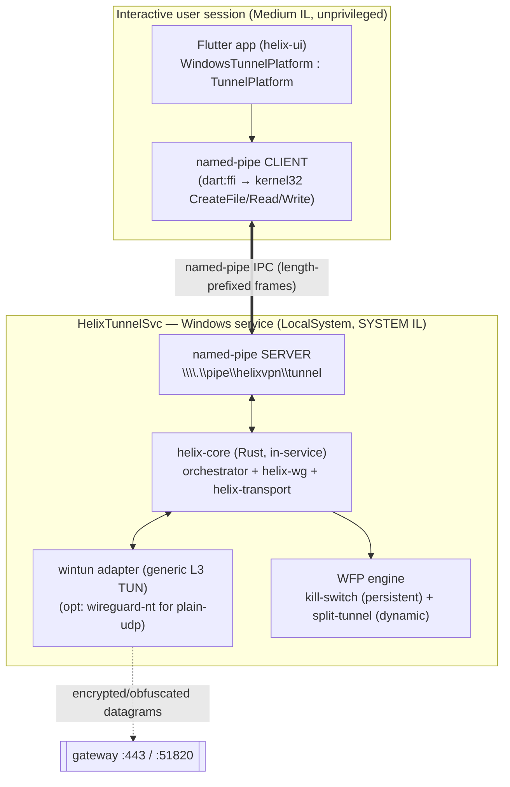
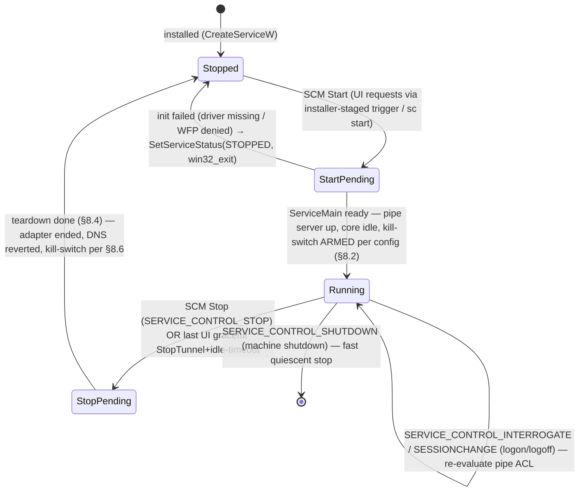
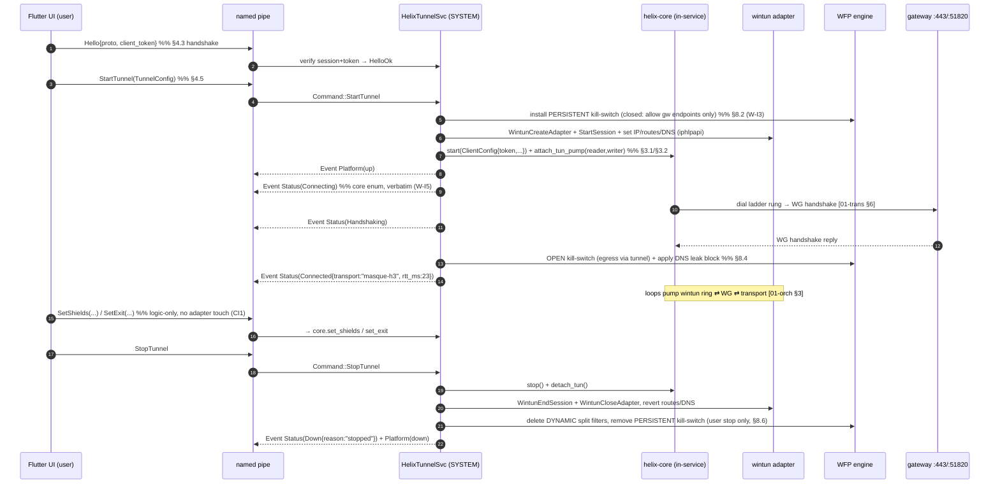

# Windows shim (wireguard-nt + service)

**Revision:** 1
**Last modified:** 2026-06-25T00:00:00Z

> Volume 4 (Clients) nano-detail specification — deepens the **Windows row** of the
> per-platform shim matrix in the pass-1 client overview [04_UI §5/§6, 03-client §5.3].
> Where doc `03` says *one sentence* ("a privileged Windows service hosts the core and the
> `wireguard-nt` adapter; the Flutter app talks to it over a named pipe"), this document pins
> the **process model, the named-pipe IPC wire protocol, the SYSTEM service lifecycle, the
> wintun/wireguard-nt adapter handoff, WFP-based split-tunnel + kill-switch, the Authenticode
> signing chain, and the `TunnelPlatform` contract implementation** to near-code granularity.
>
> **SPEC ONLY** — it describes *what to build and why* (signatures, state machines, wire
> formats, error taxonomy, memory budgets, edge cases, test points). It does not build the
> product. Sources cited inline by id: `[03-client §N]` = `final/03-client-core-and-ui.md`;
> `[04_UI §N]` = `04_VPN_CLD/HelixVPN-helix-ui-Flutter.md`; `[04_ARCH §N]` =
> `04_VPN_CLD/HelixVPN-Architecture-Refined.md`; `[01-orch §N]` =
> `final/v02-data-plane/orchestrator-and-state.md`; `[01-trans §N]` =
> `final/v02-data-plane/transport-trait.md`; `[SYN §N]` = `v09-research/_SYNTHESIS.md`.
> External Windows-platform facts that the evidence base does not itself contain are tagged
> `UNVERIFIED` per constitution §11.4.6 — recommendations to be ratified against the Microsoft
> WFP / Service / wintun / wireguard-nt documentation and a real machine, never fabricated.
>
> **Boundary with sibling docs.** This document **consumes** the FFI surface + `TunnelStatus`
> enum owned by `[03-client §3]` and the orchestrator/`TunnelStatus` contract owned by
> `[01-orch §4.1]`, and the `TunnelPlatform` channel contract owned by `[03-client §4]`. It
> **owns** everything Windows-specific from those contracts down to the OS: the service, the
> pipe, the adapter, WFP, and signing. It does **not** redefine the FFI surface, the
> `Transport` trait `[01-trans]`, the orchestrator loops `[01-orch §3]`, nor the WG crypto core.

---

## Table of contents

- [0. Position, ownership, and the Windows-specific invariants](#0-position-ownership-and-the-windows-specific-invariants)
- [1. Process & trust model (why a SYSTEM service at all)](#1-process--trust-model-why-a-system-service-at-all)
- [2. The adapter: wintun vs wireguard-nt (the load-bearing choice)](#2-the-adapter-wintun-vs-wireguard-nt-the-load-bearing-choice)
- [3. The in-service core host (FFI surface on Windows)](#3-the-in-service-core-host-ffi-surface-on-windows)
- [4. Named-pipe IPC — the UI ⇄ service wire protocol](#4-named-pipe-ipc--the-ui--service-wire-protocol)
- [5. The `TunnelPlatform` contract implementation (Dart side)](#5-the-tunnelplatform-contract-implementation-dart-side)
- [6. Windows service lifecycle (SCM state machine)](#6-windows-service-lifecycle-scm-state-machine)
- [7. Tunnel lifecycle on Windows (end-to-end sequence)](#7-tunnel-lifecycle-on-windows-end-to-end-sequence)
- [8. WFP — kill-switch + split-tunnel](#8-wfp--kill-switch--split-tunnel)
- [9. Code signing & driver trust (§11.4.133)](#9-code-signing--driver-trust-1141133)
- [10. Memory / resource budgets](#10-memory--resource-budgets)
- [11. Error taxonomy & edge cases](#11-error-taxonomy--edge-cases)
- [12. Test points — §11.4.169 closed test-type vocabulary](#12-test-points--1141169-closed-test-type-vocabulary)
- [13. Open decisions surfaced by this document](#13-open-decisions-surfaced-by-this-document)
- [Sources verified](#sources-verified)

---

## 0. Position, ownership, and the Windows-specific invariants

Windows is the one desktop target where the tunnel **cannot** run in the same process as the
Flutter UI: creating a TUN adapter, loading a driver, and installing WFP filters all require
administrator / `SYSTEM` privilege, while the Flutter app runs unprivileged in the interactive
user's session [04_UI §6, 03-client §5.3]. The shim is therefore split across a **privilege
boundary**: a long-lived **privileged Windows service** (`HelixTunnelSvc`, runs as
`LocalSystem`) hosts `helix-core` + the network adapter, and the unprivileged Flutter app
drives it over a **named pipe** that satisfies the `TunnelPlatform` contract `[03-client §4]`.

This document owns five Windows-specific contracts and nothing else:

| # | Contract | Owned here | Consumed from |
|---|---|---|---|
| W-C1 | **Process/trust model** — unprivileged UI ⇄ `SYSTEM` service split; who holds the adapter, WFP, and the core | §1 | OS privilege model |
| W-C2 | **Named-pipe IPC protocol** — pipe name, security descriptor, framing, the request/response + event envelope that carries the FFI surface `[03-client §3]` and `TunnelPlatform` verbs `[03-client §4]` | §4 | `[03-client §3/§4]` |
| W-C3 | **Adapter handoff** — wintun (production) / wireguard-nt (optional plain-udp fast path); how the service pumps packets into `helix-core` without a Unix fd | §2–3 | wintun / wireguard-nt API |
| W-C4 | **WFP kill-switch + split-tunnel** — the Windows realisation of the core's kill-switch/DNS state effects `[01-orch §8]` and per-app/per-route split `[03-client §4 TunnelConfig]` | §8 | `[01-orch §8]` |
| W-C5 | **Signing chain** — Authenticode for the service + installer, driver trust for wintun/wireguard-nt (§11.4.133) | §9 | operator-supplied certs |

### 0.1 Windows-specific invariants (extend, never weaken, the client invariants)

| # | Invariant | Source / rationale |
|---|---|---|
| W-I1 | **The unprivileged UI never touches the adapter, the driver, or WFP.** All privileged operations happen only inside `HelixTunnelSvc`; the UI's only capability is "send a `TunnelPlatform` command, receive events" over the pipe. A compromised UI cannot install firewall rules or open a TUN. | least privilege; W-C1 |
| W-I2 | **`helix-core` is the *only* place WG + transport live** — the service hosts the same Rust core as every other platform; it does **not** re-implement crypto or obfuscation. wintun is a *generic L3 carrier*, not a WG implementation (O2 `[03-client §4]`, I4 `[01-trans §1]`). | one core, no fork |
| W-I3 | **Kill-switch filters survive a service crash (fail-closed).** WFP kill-switch filters are installed in a **persistent** sub-layer so an abnormal service exit leaves egress blocked (O-I11 `[01-orch §8]`); only a *graceful user stop* removes them. Split-tunnel exclusion filters are **dynamic** (auto-removed when the engine handle closes with the tunnel). | O-I11; §8.4 |
| W-I4 | **The pipe is authenticated by its DACL, not by trust in the caller.** The pipe's security descriptor restricts `CONNECT` to the interactive desktop user(s); the service verifies the connecting client's token (§4.3) before honouring any command. | W-C2; §11.4.10 |
| W-I5 | **Status truth flows core → service → pipe → UI; the UI never paints "connected" on intent.** The pipe re-emits the core's `TunnelStatus` `[01-orch §4.1]` byte-for-byte; the UI is a pure function of that stream (CI2 `[03-client §0.1]`). | CI2 honesty |
| W-I6 | **No secret crosses the pipe in cleartext logs or tracked files.** The session/map token + any transport `SecretBytes` `[01-trans §3.2]` ride the pipe body but are never logged; the pipe body is local-only (kernel-mediated), never persisted (§11.4.10). | §11.4.10 |



---

## 1. Process & trust model (why a SYSTEM service at all)

Three facts force the split [04_UI §6, 03-client §5.3]:

1. **wintun / wireguard-nt require privilege.** Creating or opening a tunnel adapter and
   loading the kernel driver need `SeLoadDriverPrivilege` + administrator rights; WFP filter
   installation needs `FWPM_ACTRL_ADD` (administrator). The interactive Flutter app does not
   and must not hold these.
2. **A tunnel must outlive the UI.** The user closes the app window; the VPN stays up. A
   service is the OS-native "runs without an interactive session, survives logoff" host.
3. **One privileged surface, audited once.** Concentrating every privileged operation in one
   signed service (W-I1) gives a single, small, reviewable attack surface instead of scattering
   elevation prompts through the UI.

### 1.1 Who runs as what

| Component | Process | Security context | Holds |
|---|---|---|---|
| Flutter UI + `WindowsTunnelPlatform` | `helix_access.exe` | interactive user, Medium IL | nothing privileged — only the pipe client |
| `HelixTunnelSvc` | `helix_tunnel_svc.exe` | `LocalSystem` (SYSTEM IL) | the core, the adapter, WFP filters, the pipe server |
| wintun / wireguard-nt | kernel driver | kernel | the L3 adapter object |

> **Service-account hardening (recommended, §11.4.133).** `LocalSystem` is the simplest
> account that can load the driver + edit WFP. A hardened variant runs the service under a
> dedicated **virtual service account** (`NT SERVICE\HelixTunnelSvc`) granted only the required
> privileges (`SeLoadDriverPrivilege`, the WFP `FWPM_ACTRL_*` rights, `SeChangeNotifyPrivilege`)
> and a write-restricted token. `UNVERIFIED`: whether wintun adapter creation succeeds under a
> non-`LocalSystem` service SID is a Phase-1 SEC/IT measurement, not an assumption — surfaced as
> decision **D-WIN-3 (§13)**.

---

## 2. The adapter: wintun vs wireguard-nt (the load-bearing choice)

The doc-03 row reads "`wireguard-nt`/`wintun`" [03-client §5.3]; this section pins **which one
carries the obfuscated datapath and why**, honouring W-I2 (one core, no fork).

| Adapter | What it is | Carries | Compatible with helix-core's obfuscation ladder? |
|---|---|---|---|
| **wintun** | a generic, signed **L3 TUN** adapter (raw IP packets to/from userspace via a ring buffer) | whatever userspace puts on the ring | **Yes** — the service does WG + `Transport` in `helix-core` and pumps the wintun ring, exactly mirroring the iOS `packetFlow ⇄ core` pump `[03-client §5.1]` |
| **wireguard-nt** | the **kernel WireGuard** driver — does WG Noise + ChaCha20-Poly1305 **in kernel**, speaks **plain WG-over-UDP only** | inner WG only, plain UDP | **No** for `masque-h3`/`shadowsocks`/`lwo`/… — kernel WG cannot be wrapped in the `helix-transport` carriers; using it would duplicate WG outside the one core (violates O2/I4) |

**Decision (surfaced as D-WIN-1, §13).** The **production carrier is wintun**: the service runs
`helix-core` (WG + the full `Transport` ladder `[01-trans §6]`) in userspace and pumps the
wintun ring, so every obfuscation transport works identically to every other platform (W-I2,
I4 `[01-trans §1]`). **wireguard-nt is an *optional* kernel fast path for the `plain-udp` rung
only** — when the ladder selects `plain-udp` on a cooperative network it MAY hand the WG config
to wireguard-nt for in-kernel throughput, and MUST fall back to the wintun+core path the instant
the ladder escalates to any obfuscated rung. Phase-1 ships **wintun only**; the wireguard-nt
fast path is a Phase-2 throughput optimisation gated on a BENCH measurement (§12).

### 2.1 wintun adapter handle & session (the packet ring)

The wintun API (`wintun.dll`, the official WireGuard component) exposes an adapter + a session
holding a ring buffer; userspace allocates/sends and receives/releases packets. The
`helix-core` Windows shim wraps it behind a `WinTunDevice` that satisfies the same
packet-source/sink role the Unix `helix-tun::TunDevice` plays `[01-orch §2.1]`.

```rust
// helix-core/src/platform/windows/wintun.rs  (the Windows TunDevice impl)
// FFI to wintun.dll — names per the official WireGuard wintun.h. UNVERIFIED: exact
// argument list pinned against the shipped wintun.h header, not memory.
#[link(name = "wintun")]
extern "C" {
    fn WintunCreateAdapter(name: PCWSTR, tunnel_type: PCWSTR, guid: *const GUID) -> WINTUN_ADAPTER_HANDLE;
    fn WintunStartSession(adapter: WINTUN_ADAPTER_HANDLE, capacity: u32) -> WINTUN_SESSION_HANDLE; // capacity = pow2, 0x20000..=0x4000000
    fn WintunGetReadWaitEvent(session: WINTUN_SESSION_HANDLE) -> HANDLE;                            // wait-handle for rx readiness
    fn WintunReceivePacket(session: WINTUN_SESSION_HANDLE, size: *mut u32) -> *mut u8;              // borrow an inbound IP packet
    fn WintunReleaseReceivePacket(session: WINTUN_SESSION_HANDLE, packet: *const u8);
    fn WintunAllocateSendPacket(session: WINTUN_SESSION_HANDLE, size: u32) -> *mut u8;              // borrow an outbound slot
    fn WintunSendPacket(session: WINTUN_SESSION_HANDLE, packet: *const u8);
    fn WintunEndSession(session: WINTUN_SESSION_HANDLE);
    fn WintunCloseAdapter(adapter: WINTUN_ADAPTER_HANDLE);
}

/// Windows L3 carrier — drop-in for the orchestrator's TunDevice role [01-orch §2.1].
pub struct WinTunDevice {
    adapter: WintunAdapter,   // RAII: WintunCloseAdapter on Drop
    session: WintunSession,   // RAII: WintunEndSession on Drop
    read_evt: HANDLE,         // WintunGetReadWaitEvent — awaited on the rx loop
}

impl WinTunDevice {
    /// Create+configure the adapter: overlay IP, routes (AllowedIPs), MTU, tunnel DNS.
    /// IP/route/DNS are set via the iphlpapi / netsh route table, NOT via wintun (it is L3-only).
    pub fn create(cfg: &TunnelConfig) -> Result<Self, WinShimError>;     // §4.5 TunnelConfig
    /// Cancel-safe async recv: wait on read_evt, WintunReceivePacket → copy out → release.
    pub async fn recv(&self) -> Result<Bytes, WinShimError>;             // → orchestrator loop A [01-orch §3.1]
    /// Send a decrypted inbound IP packet onto the ring (orchestrator loop B) [01-orch §3.2].
    pub async fn send(&self, ip_pkt: Bytes) -> Result<(), WinShimError>;
}
```

The orchestrator's three loops `[01-orch §3]` are **unchanged** on Windows: loop A reads
`WinTunDevice::recv` (plaintext IP) → WG encrypt → `Transport::send`; loop B `Transport::recv`
→ WG decrypt → `WinTunDevice::send`. The wintun ring replaces the Unix `tun fd`; nothing else
in the core differs (W-I2). IP address, routes (`AllowedIPs`), and tunnel DNS are applied via
`iphlpapi` (`CreateUnicastIpAddressEntry`, `CreateIpForwardEntry2`, `SetInterfaceDnsSettings`)
against the adapter's LUID — not via wintun, which is pure L3 transport.

---

## 3. The in-service core host (FFI surface on Windows)

The service hosts the **same Rust FFI surface** authored in `helix-ffi/src/api.rs`
`[03-client §3.1]` — but unlike Dart-driven platforms, on Windows the *consumer* of that
surface is the **pipe server inside the same process**, not flutter_rust_bridge. The FFI
surface is therefore called natively (Rust → Rust), and its `StreamSink<TunnelStatus>` is wired
to the pipe's event pump (§4.4) rather than to frb.

### 3.1 The surface the service drives (consistent with `[03-client §3.1]` and `[01-orch §4.1]`)

```rust
// The service calls these exact functions; the TunnelStatus they emit is the CANONICAL
// orchestrator enum [01-orch §4.1], re-emitted over the pipe verbatim (W-I5).
pub async fn start(cfg: ClientConfig) -> anyhow::Result<()>;       // ClientConfig [03-client §3.1]
pub async fn stop() -> anyhow::Result<()>;
pub fn status_stream(sink: StreamSink<TunnelStatus>);              // → pipe event pump (§4.4)
pub async fn exits() -> anyhow::Result<Vec<ExitOption>>;
pub async fn set_exit(id: String, multi_hop_chain: Option<Vec<String>>) -> anyhow::Result<()>;
pub async fn set_shields(s: Shields) -> anyhow::Result<()>;
pub async fn advertise(cidrs: Vec<String>) -> anyhow::Result<AdvertiseResult>; // connector flavor
```

### 3.2 The Windows TUN handoff — `attach_tun(fd)` has no fd here

The cross-platform FFI exposes `attach_tun(fd: i32)` for Unix fd platforms (Android
`ParcelFileDescriptor`, Linux `tun` fd) `[03-client §3.1]`. **Windows has no fd**: wintun hands
userspace a *ring*, exactly as iOS hands the extension a `packetFlow` `[03-client §5.1]`. The
core therefore exposes the **pump-callback variant** (identical in shape to the iOS
`helix_core_set_tun_writer` / `helix_core_tun_out` pair `[03-client §5.1]`), and the Windows
service wires `WinTunDevice` into it:

```rust
// helix-ffi/src/api.rs — the writer-callback pump variant (Windows + iOS; consistent surface)
pub fn attach_tun_pump(reader: WinTunReader, writer: WinTunWriter) -> anyhow::Result<()>;
pub fn detach_tun() -> anyhow::Result<()>;   // shared with the fd variant [03-client §3.1]
```

> **Consistency note (§11.4.6).** `attach_tun(fd)` and `attach_tun_pump(reader, writer)` are the
> two members of *one* TUN-handoff contract: fd-platforms call the former, ring/packetFlow
> platforms (Windows, iOS) call the latter. The exported set, the `TunnelStatus` enum, and the
> `Shields`/`ExitOption`/`AdvertiseResult` types are otherwise **byte-for-byte the doc-03 surface**
> `[03-client §3.1]` — the FFI contract test (§12 `UT`) asserts the mirror.

### 3.3 The canonical `TunnelStatus` the pipe carries (CONSISTENT with `[01-orch §4.1]`)

The service marshals the **orchestrator's** five-variant `TunnelStatus` `[01-orch §4.1]` onto
the pipe verbatim — this is the frozen core contract:

```rust
// helix-core/src/status.rs — the wire form on the pipe (W-I5) [01-orch §4.1]
#[derive(Clone, Debug, PartialEq, Eq)]   // + serde for the pipe envelope (§4.2)
pub enum TunnelStatus {
    Connecting,                                   // dialling a rung
    Handshaking,                                  // carrier up, WG handshake in flight
    Connected { transport: String, rtt_ms: u32 }, // e.g. ("masque-h3", 23)
    Reconnecting,                                 // a working tunnel dropped; re-dialling
    Down { reason: String },                      // terminal for this attempt (§11 reasons)
}
```

The **client-side FFI extension** (`Disconnected`, `Connected.path`, `Danger{kind}`) defined in
`[03-client §3.1]` is layered **above** the pipe in the Dart `helix_core_ffi` package, derived
from this core enum + `PlatformTunnelEvent`s (§5.2) — it is NOT a second wire enum. Keeping the
pipe on the orchestrator's five-variant enum is what makes the Windows pipe consistent with
`[01-orch §4.1]` while the UI still gets the richer doc-03 surface (mapping in §5.2).

---

## 4. Named-pipe IPC — the UI ⇄ service wire protocol

The named pipe is the single seam between the unprivileged UI and the privileged service. It
**is** the Windows `TunnelPlatform` transport: every `TunnelPlatform` verb `[03-client §4]` and
the core's status stream cross it.

### 4.1 Pipe identity & connection model

| Property | Value | Rationale |
|---|---|---|
| Pipe name | `\\.\pipe\helixvpn\tunnel` | well-known, single instance; service is the server |
| Type | byte-stream, **duplex** (`PIPE_ACCESS_DUPLEX`), message-read mode (`PIPE_READMODE_MESSAGE`) `UNVERIFIED` (byte-mode + own framing is the fallback) | one channel carries both req/resp and pushed events |
| Instances | `PIPE_UNLIMITED_INSTANCES` capped at a small N (e.g. 4) | one UI + headroom; reject excess (§11) |
| Server | `HelixTunnelSvc` creates it at service start (`CreateNamedPipeW`) | the privileged side owns it |
| Client | the UI opens it (`CreateFileW` via `dart:ffi`, §5.1) | unprivileged side connects |

### 4.2 Frame format & message envelope

Every message is a **4-byte little-endian length prefix + a serialized body**. Body encoding is
a self-describing binary format (recommended **MessagePack** via `rmp-serde`; `UNVERIFIED`
final pick — JSON acceptable for debuggability, bincode for size — tracked as a minor decision,
not surfaced).

```rust
// helixvpn-ipc/src/lib.rs  — SHARED crate compiled into BOTH the Rust service and (via cbindgen
// or a hand-mirrored Dart type) the Dart client, so the wire types can never drift (§12 UT).
#[derive(Serialize, Deserialize)]
pub enum PipeFrame {
    Req  { id: u64, cmd: Command },        // UI → service (request/reply correlated by id)
    Resp { id: u64, result: CmdResult },   // service → UI (reply to a Req)
    Event(PipeEvent),                      // service → UI (unsolicited push: status + lifecycle)
}

#[derive(Serialize, Deserialize)]
pub enum Command {                         // mirrors TunnelPlatform [03-client §4] + the FFI surface [03-client §3]
    StartTunnel(TunnelConfig),             // §4.5
    StopTunnel,
    SetShields(Shields),                   // logic-only, forwarded to core.set_shields
    SetExit { id: String, multi_hop_chain: Option<Vec<String>> },
    Exits,                                 // → Vec<ExitOption>
    Advertise(Vec<String>),                // connector flavor
    Hello { protocol_version: u32, client_token: [u8; 32] }, // §4.3 handshake
    Ping,                                  // liveness keepalive (§4.6)
}

#[derive(Serialize, Deserialize)]
pub enum CmdResult {
    Ok,
    Exits(Vec<ExitOption>),
    Advertised(AdvertiseResult),
    HelloOk { protocol_version: u32, service_version: String },
    Err(PipeError),                        // §11 error taxonomy (never carries a secret, W-I6)
}

#[derive(Serialize, Deserialize)]
pub enum PipeEvent {
    Status(TunnelStatus),                  // the CANONICAL core enum (§3.3) [01-orch §4.1]
    Platform(PlatformTunnelEvent),         // up/down/permissionDenied/revoked/error [03-client §4]
}
```

> **Why both `Status` and `Platform` events.** `TunnelStatus` carries the *core's* truth (it is
> connecting/connected/reconnecting); `PlatformTunnelEvent` carries the *shim's* lifecycle truth
> (adapter up/down, the service was revoked/stopped out-of-band, a privileged step errored). The
> `TunnelPlatform` contract `[03-client §4]` is realised by mapping these two event streams into
> its `events()` stream (§5.2). They are distinct because a `permissionDenied`/`error` can occur
> *before* the core ever emits a `TunnelStatus` (e.g. WFP install failed).

### 4.3 Pipe security descriptor + client authentication (W-I4)

Two layers guard the pipe:

1. **DACL on the pipe object.** `CreateNamedPipeW` is given a `SECURITY_ATTRIBUTES` whose
   security descriptor (SDDL) grants **connect/read/write only to the interactive desktop
   user(s)** and full control to `SYSTEM` + `Administrators`, and **denies `NETWORK`** (no remote
   pipe access — pipes are reachable over SMB by default; this MUST be blocked):
   ```text
   D:(D;;FA;;;NU)(A;;0x12019b;;;IU)(A;;FA;;;SY)(A;;FA;;;BA)
   ;  NU = NETWORK USERS  → DENY ;  IU = INTERACTIVE USERS → connect+rw ;  SY/BA → full
   ```
   `UNVERIFIED`: exact access mask `0x12019b` (= `GENERIC_READ|GENERIC_WRITE|SYNCHRONIZE` minus
   `FILE_CREATE_PIPE_INSTANCE`) is a recommendation to pin against `winnt.h`, calibrated so a
   client can read/write but **cannot create a second server instance**.
2. **Token check on connect.** On `ConnectNamedPipe`, the service calls
   `GetNamedPipeClientProcessId` → opens the client process token → asserts the client runs in
   the **same interactive session** (`WTSGetActiveConsoleSessionId`) and is not elevated beyond
   what is expected, then requires the first frame to be a `Command::Hello` carrying a
   `client_token` minted at install/launch time. A connection that does not `Hello` within
   `HELLO_TIMEOUT` (recommend 2 s, `UNVERIFIED`) is dropped (§11). This defeats a malicious
   local process racing to the pipe before the real UI.

### 4.4 The event pump (core `StreamSink` → pipe)

`status_stream(sink)` (§3.1) is handed a `StreamSink<TunnelStatus>` whose implementation, in the
service, **serialises each `TunnelStatus` into a `PipeFrame::Event(PipeEvent::Status(..))` and
writes it to every connected pipe instance**. The service also injects
`PipeEvent::Platform(..)` for adapter/WFP/service-lifecycle transitions (§7). Backpressure: the
pipe write uses a bounded per-client queue (recommend 64 frames, mirroring the
`STATUS_CHANNEL_CAP` of `[01-orch §4.2]`); a wedged client that overflows is **disconnected**
(not blocked) so a stuck UI never stalls the core — the UI reconnects and re-reads latest
(§5.3), exactly the `Lagged → re-read latest` discipline of `[01-orch §4.6]`.

### 4.5 `TunnelConfig` on the wire (consistent with `[03-client §4]`)

```rust
#[derive(Serialize, Deserialize, Clone)]
pub struct TunnelConfig {                    // mirrors Dart TunnelConfig [03-client §4]
    pub overlay_ip: String,                  // "100.64.0.7/32" | "fd7a:…/128"
    pub routes: Vec<String>,                 // AllowedIPs → wintun route table (iphlpapi)
    pub dns_servers: Vec<String>,            // tunnel DNS (§8.3 leak guard)
    pub split_exclude_apps: Vec<String>,     // per-app bypass → WFP app-id filters (§8.5)
    pub split_exclude_routes: Vec<String>,   // per-route bypass → route-table exclusions (§8.5)
    pub mtu: u16,                            // default 1280 over MASQUE / 1420 plain WG
    pub session_or_map_token: String,        // → ClientConfig.map_path_or_session [03-client §3.1] (W-I6: never logged)
}
```

### 4.6 Pipe-level liveness & reconnect

- **Keepalive.** The UI sends `Command::Ping` every `PING_INTERVAL` (recommend 5 s,
  `UNVERIFIED`); the service replies `CmdResult::Ok`. A missed reply past `PING_TIMEOUT`
  (recommend 3× interval) ⇒ the UI treats the pipe as dead, tears it, and reconnects.
- **Service-restart resilience.** If the service restarts (crash → SCM recovery, §6.4) the pipe
  handle breaks; the UI's read returns `ERROR_BROKEN_PIPE`. The UI reconnects with backoff and
  re-issues `Hello`; the service replays the **current** `TunnelStatus` as the first event so the
  UI re-syncs (W-I5). The *tunnel itself is unaffected* by a UI/pipe drop — the core keeps
  forwarding (the pipe is control-only, never in the packet path; the Windows analogue of the
  fail-static I3 `[01-orch §0.3]`).

---

## 5. The `TunnelPlatform` contract implementation (Dart side)

On Windows, `WindowsTunnelPlatform` is the `TunnelPlatform` `[03-client §4]` impl whose body is
"marshal the verb to the pipe, fold the pipe's event stream into `events()`" [03-client §5.3].

### 5.1 The Dart implementation

```dart
// helix_core_ffi/lib/src/windows/windows_tunnel_platform.dart
class WindowsTunnelPlatform implements TunnelPlatform {       // contract: [03-client §4]
  final _PipeClient _pipe;                                    // dart:ffi → kernel32 (§5.1.1)
  final _events = StreamController<PlatformTunnelEvent>.broadcast();

  @override
  Future<void> startTunnel(TunnelConfig cfg) async {
    await _pipe.ensureConnected();                            // CreateFileW + Hello (§4.3)
    final r = await _pipe.request(Command.startTunnel(cfg));  // O1: idempotent, permission-aware
    if (r is CmdErr) throw TunnelException(r.error);          // never a half-open adapter (O1)
  }

  @override
  Future<void> stopTunnel() => _pipe.request(const Command.stopTunnel()); // O4: quiescent restore

  @override
  Stream<PlatformTunnelEvent> events() => _events.stream;     // O3: surfaces revoked/error

  // wiring: pipe events → TunnelPlatform.events() + the helix_core status stream (§5.2)
  void _onPipeEvent(PipeEvent e) => switch (e) {
    StatusEvent(:final status)   => _statusController.add(status),      // → helix_core.statusStream()
    PlatformEvt(:final platform) => _events.add(platform),             // → TunnelPlatform.events()
  };
}
```

```dart
// §5.1.1 — the pipe client is a thin dart:ffi binding to kernel32 (no third-party plugin needed):
//   CreateFileW(r'\\.\pipe\helixvpn\tunnel', GENERIC_READ|GENERIC_WRITE, 0, null, OPEN_EXISTING, FILE_FLAG_OVERLAPPED, null)
//   ReadFile / WriteFile with the 4-byte length-prefix framing (§4.2), on a dedicated isolate so
//   the overlapped reads never block the UI isolate. UNVERIFIED: overlapped-IO ergonomics from Dart
//   vs a blocking read on a background isolate — pick by the FA/IT smoke (§12); a small native
//   helper DLL is the fallback if dart:ffi overlapped-IO proves awkward.
```

### 5.2 Mapping the two pipe event streams to the doc-03 surface

`WindowsTunnelPlatform` feeds **two** Dart sinks from the **one** pipe event stream, and the
Dart `helix_core_ffi` wrapper composes them into the **richer doc-03 `TunnelStatus`**
(`Disconnected`/`path`/`Danger`) `[03-client §3.1]`:

| Pipe event | Drives | Doc-03 UI surface |
|---|---|---|
| `Status(Connecting/Handshaking/Reconnecting)` | `helix_core.statusStream()` | amber `stateConnecting` `[03-client §7.1]` |
| `Status(Connected{transport,rtt})` | `helix_core.statusStream()` | green `stateConnected`; `StatusChip` shows transport·rtt |
| `Status(Down{reason})` | `helix_core.statusStream()` | mapped to `Disconnected` (reason `"stopped"`) or `Danger`/`Down` palette (any other reason) `[03-client §7.1]` |
| `Platform(revoked)` | `TunnelPlatform.events()` | `Danger{kind:"revoked"}` overlay — admin/OS killed the tunnel (O3) |
| `Platform(permissionDenied)` | `TunnelPlatform.events()` | a permission/elevation prompt, never silent failure (O1) |
| `Platform(error, detail)` | `TunnelPlatform.events()` | honest error surface with `detail` (§11.4.6 no guessing) |

This is the W-I5 + CI2 honesty guarantee made concrete: the green palette is painted **only** on
a core `Connected`, never on UI intent `[03-client §8.4]`.

### 5.3 Contract obligations on Windows (the O1–O5 of `[03-client §4.1]`)

| O# | Windows realisation |
|---|---|
| **O1** idempotent + permission-aware `startTunnel` | a second `StartTunnel` while connected is a no-op `Ok`; if the service is not installed / not elevated, the UI emits `permissionDenied` (offering to (re)install/repair the service via an elevated installer), **never** a half-open adapter — the service rolls back the adapter + WFP on any start failure (§7.4) |
| **O2** shim hands the core packets, never crypto | the service pumps the wintun ring into `helix-core`; WG + transport live only in the core (W-I2) |
| **O3** report `revoked` out-of-band | `device.revoked` (doc 02) → core `Down{auth-failed}` `[01-orch §5.4]` → `Platform(revoked)`; an admin/MDM `sc stop` → `Platform(down)`; SCM `SERVICE_CONTROL_STOP` → graceful teardown event |
| **O4** quiescent restore on stop | on `StopTunnel` the service removes routes, reverts DNS, deletes **dynamic** split-tunnel WFP filters, and (user stop only) removes the **persistent** kill-switch filters, then ends the wintun session — on **every** exit path (`Drop`/`finally`), §8.4 |
| **O5** the only untyped seam, covered on real hardware | the pipe + adapter + WFP are exercised by a real-Windows-VM smoke (§12 `IT`/`SC`), never a mock-claiming-PASS (§11.4.27) |

---

## 6. Windows service lifecycle (SCM state machine)

### 6.1 Service identity & install

| Property | Value |
|---|---|
| Service name | `HelixTunnelSvc` |
| Display name | `Helix VPN Tunnel Service` |
| Binary | `helix_tunnel_svc.exe` (Authenticode-signed, §9) |
| Account | `LocalSystem` (or hardened virtual account, §1.1 / D-WIN-3) |
| Start type | `SERVICE_AUTO_START` (so a tunnel can auto-reconnect at boot) or `DEMAND_START` (privacy default — only runs when the UI asks) — **D-WIN-4 (§13)** |
| Error control | `SERVICE_ERROR_NORMAL` |
| Recovery | restart on failure with backoff (§6.4) |

Install is performed by the **signed installer** (MSI/MSIX, §9) via the Service Control Manager
(`CreateServiceW` / `ChangeServiceConfig2W` for recovery actions), **never** by the unprivileged
UI. The installer also drops `wintun.dll` (+ optional `wireguard.sys`) into the service
directory and stages the pipe `client_token` (§4.3) in a per-machine location the UI can read.

> **Service authoring language — D-WIN-2 (§13).** Recommended: a **Rust** service binary
> (`windows-service` crate for the SCM `ServiceMain`/`ServiceCtrlHandler` plumbing) so
> `helix-core` is hosted **in-process with zero intra-process FFI** and no GC on the datapath
> (W-I2, byte-for-byte core reuse). The doc-03 "C#/Rust" note `[03-client §5.3]` is honoured as
> the alternative: a **.NET Worker Service** hosting the core as a native DLL via P/Invoke —
> viable but adds a CLR + a marshalling seam. Both are surfaced; Rust is the recommendation.

### 6.2 SCM state machine



### 6.3 ServiceMain skeleton

```rust
// helix_tunnel_svc/src/main.rs  (Rust, windows-service crate)
fn service_main(_args: Vec<OsString>) {
    let status_handle = service_control_handler::register("HelixTunnelSvc", ctrl_handler)?;
    set_status(&status_handle, StartPending);
    let rt = tokio::runtime::Builder::new_multi_thread().enable_all().build()?;
    rt.block_on(async {
        let pipe = PipeServer::create(PIPE_NAME, security_descriptor())?;  // §4.1/§4.3
        let svc = ServiceState::new();                                     // owns Option<Orchestrator>
        set_status(&status_handle, Running);
        svc.serve(pipe, shutdown_rx).await;                                // accept clients, dispatch Commands
    });
    set_status(&status_handle, Stopped);
}

extern "system" fn ctrl_handler(control: ServiceControl) -> ServiceControlHandlerResult {
    match control {
        ServiceControl::Stop | ServiceControl::Shutdown => { signal_shutdown(); Handled }
        ServiceControl::Interrogate => Handled,
        ServiceControl::SessionChange(_) => { reeval_pipe_acl(); Handled }  // logon/logoff
        _ => NotImplemented,
    }
}
```

### 6.4 Crash recovery & fail-closed coupling (W-I3)

SCM recovery actions (`SC_ACTION_RESTART`) restart the service after a crash with backoff
(recommend: 1st failure +1 s, 2nd +5 s, subsequent +30 s, reset window 24 h — `UNVERIFIED`,
tune). **Critically:** because kill-switch WFP filters are **persistent** (W-I3, §8.4), a crash
leaves egress blocked until the restarted service either re-establishes the tunnel (→ open via
tunnel) or a user graceful-stop removes them — there is **no leak window across a crash**. On
restart the service re-reads its last desired state and re-dials (the core's own reconnection
backoff `[01-orch §7]` then governs).

---

## 7. Tunnel lifecycle on Windows (end-to-end sequence)



The seam mirrors the cross-platform rule `[03-client §3.3]`: **lifecycle commands flow
UI → pipe → service → core**, **status events flow core → service → pipe → UI**, and
`setShields`/`setExit`/`exits` are pure logic that never touch the adapter or WFP (CI1).

### 7.1 Start ordering (the no-leak ordering)

1. Install **persistent closed** kill-switch (egress blocked except gateway endpoints) — *before*
   the adapter exists, so there is no pre-connect leak window (§8.2, mirrors `[01-orch §8.2]`).
2. Create + configure the wintun adapter (IP/routes/DNS).
3. `core.start(...)` + `attach_tun_pump(...)`; the orchestrator drives the ladder.
4. On core `Connected`: **open** the kill-switch to route via the tunnel + apply the DNS-leak
   block (§8.4). The UI sees green only here.

### 7.2 Stop ordering (the quiescent restore, O4)

`stop` reverses: `core.stop()` → end wintun session → revert routes/DNS → delete dynamic split
filters → (user stop only) remove persistent kill-switch → emit `Down{stopped}`. On a **crash**
or **non-user terminal** (`ladder-exhausted`, `auth-failed`, `host-fatal`
`[01-orch §4.4/§8.4]`) the persistent kill-switch **stays** (W-I3 / O-I11).

### 7.3 Idempotency & rollback

Every privileged step is paired with a rollback registered in reverse order (a Rust `Drop`-guard
stack). If step 3 fails (e.g. dial never succeeds within the ladder budget), the guard stack
runs: detach core → end session → close adapter → keep kill-switch closed (no leak) → emit
`Platform(error, detail)` + `Status(Down{reason})`. There is never a half-configured adapter
left behind (O1).

---

## 8. WFP — kill-switch + split-tunnel

The Windows realisation of the core's kill-switch + DNS coupling `[01-orch §8]` and the
`TunnelConfig` split fields (§4.5) is **WFP (Windows Filtering Platform)** — filters installed by
the service against the FWPM filter engine, driven by the core's `OrchState` transitions
`[01-orch §8.4]` (never hand-edited).

### 8.1 WFP object model used

| WFP object | Use |
|---|---|
| Engine handle (`FwpmEngineOpen0`) | one per service; opened at start, closed at stop |
| **Persistent** sub-layer (`FWPM_SUBLAYER` + `FWPM_FILTER_FLAG_PERSISTENT`) | the **kill-switch** filters — survive a service crash / reboot (W-I3, fail-closed) |
| **Dynamic** sub-layer (`FWPM_SESSION_FLAG_DYNAMIC`) | the **split-tunnel** exclusion filters — auto-removed when the engine handle closes with the tunnel |
| Layers | `FWPM_LAYER_ALE_AUTH_CONNECT_V4/_V6` (per-connection allow/block, incl. app-id conditions) and `FWPM_LAYER_OUTBOUND_IPPACKET_V4/_V6` (catch-all egress) |
| Conditions | `FWPM_CONDITION_IP_REMOTE_ADDRESS` (gateway allow), `FWPM_CONDITION_IP_LOCAL_INTERFACE` (the wintun LUID), `FWPM_CONDITION_ALE_APP_ID` (per-app split), `FWPM_CONDITION_IP_REMOTE_PORT` (`:53` DNS leak guard) |

`UNVERIFIED`: exact GUIDs / struct layouts pinned against the Microsoft `fwpmu.h` / `fwpmtypes.h`
headers; the model above is the documented WFP usage pattern (the same one WireGuard's own
Windows kill-switch uses).

### 8.2 Kill-switch filters (persistent, fail-closed)

On `Idle → Connecting` (Strict mode `[01-orch §8.2]`) the service installs, in the persistent
sub-layer, a **default-block** egress filter (high weight) plus narrow **permit** filters:

| Permit filter | Why |
|---|---|
| remote-address ∈ `allow_gateway_endpoints` `[01-orch §8.2]` | the transport must reach `:443`/`:51820` |
| local-interface = wintun LUID | tunnelled traffic is always allowed |
| DHCP / ND (bootstrap) | link bring-up |
| optional: RFC1918 LAN if `allow_lan` | printers etc. `[01-orch §8.2]` |

Everything else egress is **blocked**. A WFP-install failure at start ⇒ `Down{host-fatal}`
`[01-orch §4.4]` — never proceed on an unverified kill-switch (§11.4.6). Because these filters
are persistent, a service crash leaves them installed (W-I3).

### 8.3 DNS-leak guard

On `Handshaking → Connected` `[01-orch §8.4]` the service (if `block_plaintext_53`) installs a
filter dropping any `:53` egress (UDP+TCP) **not** destined for the tunnel DNS over the wintun
interface, and applies the tunnel DNS via `SetInterfaceDnsSettings` on the adapter LUID. The
block **stays** across `Connected → Reconnecting/Down` (fail-closed) until reconnect re-applies
tunnel DNS or a user stop reverts to system resolvers (§8.6) — exactly `[01-orch §8.3]`.

### 8.4 Coupling table (Windows realisation of `[01-orch §8.4]`)

| Core transition `[01-orch §5.2]` | Kill-switch (persistent) | DNS / split (dynamic) |
|---|---|---|
| `Idle → Connecting` (Strict) | install **block** + gateway permits | leave system DNS |
| `Handshaking → Connected` | **add tunnel permit** (egress via wintun) | apply tunnel DNS + `:53` block + install split-tunnel excludes |
| `Connected → Reconnecting` | revoke tunnel permit (block holds) | keep `:53` block; keep split excludes |
| `* → Down{reason≠stopped}` | **stays blocked** | keep block |
| `ShuttingDown → Down{stopped}` (user) | **remove all** kill-switch filters | revert system DNS; delete split excludes |
| crash / panic | persistent filters **remain** | dynamic excludes auto-removed (engine handle closed) — kill-switch still blocks |

> **The crash asymmetry is deliberate (W-I3).** Kill-switch = persistent → *survives* crash
> (fail-closed, no leak). Split-tunnel excludes = dynamic → *vanish* on crash (so a crash can
> only make traffic *more* tunnelled / blocked, never *less* protected). This is the WFP
> encoding of O-I11.

### 8.5 Split-tunnel (per-app + per-route)

- **Per-route** (`split_exclude_routes`): the excluded CIDRs are **removed from the wintun route
  table** (they egress on the physical adapter) AND a dynamic WFP *permit* filter lets them
  bypass the kill-switch. Simplest, app-agnostic.
- **Per-app** (`split_exclude_apps`): a dynamic `FWPM_CONDITION_ALE_APP_ID` filter at the
  `ALE_AUTH_CONNECT` layer permits the named executable's connections to bypass the tunnel.
  `app_id` is the device-path form of the binary (`FwpmGetAppIdFromFileName0`). `UNVERIFIED`:
  full per-app split fidelity (vs route-based) is a Phase-2 item — Phase-1 ships per-route split,
  per-app behind a capability flag (`Capability.splitTunnel` `[03-client §6]`).

### 8.6 The only open path

The persistent kill-switch is removed on **exactly one** path — a user-initiated graceful stop
(`StopTunnel` → `ShuttingDown` → `Down{stopped}`) — identical to the core rule `[01-orch §8.6]`.
Every other terminal leaves it closed.

---

## 9. Code signing & driver trust (§11.4.133)

§11.4.133 (target-system safety) + the doc-03 signing note `[03-client §11]` require **no
unsigned privileged code**. Three trust tiers:

| Artifact | Signing requirement |
|---|---|
| `wintun.dll` / `wireguard.sys` | **Microsoft/WireGuard-LLC signed** drivers, shipped **as-is** — we do **not** re-sign third-party drivers. If a custom driver were ever needed it would require **EV + Microsoft attestation signing** (Partner Center hardware dashboard) — out of scope for MVP (we use the upstream signed wintun). |
| `helix_tunnel_svc.exe` + DLLs | **Authenticode** signed with the project's **EV (or OV) code-signing cert**, SHA-256, **RFC-3161 timestamped** so signatures outlive cert expiry. |
| Installer (MSI/MSIX) | Authenticode signed (same cert); MSIX additionally for Store/sideload trust. |

### 9.1 Signing pipeline (local, §11.4.156 no server CI)

```text
# local pre-tag step (§11.4.40 sweep) — operator runs with the EV token/HSM present
signtool sign /fd SHA256 /tr http://timestamp.acme/rfc3161 /td SHA256 /a helix_tunnel_svc.exe
signtool sign /fd SHA256 /tr http://timestamp.acme/rfc3161 /td SHA256 /a HelixVPN-Setup.msi
signtool verify /pa /v helix_tunnel_svc.exe        # MUST pass before the artifact ships
```

`UNVERIFIED`: the cert is **operator-supplied** (§11.4.10 — the private key lives on an EV
token/HSM, never in the repo, never in `.env` tracked files). SmartScreen reputation accrues
over EV-signed releases. The signing step is a **release-gate blocker**: an unsigned
`helix_tunnel_svc.exe` cannot ship (§11.4.133). The verification output (`signtool verify /pa`)
is the captured evidence (§12 `SEC`).

### 9.2 What signing buys (honest boundary, §11.4.6)

Signing proves **provenance + integrity** (the binary is ours, untampered) and is required for
the driver to load + for SmartScreen/UAC trust. It does **not** prove the code is *correct* or
*leak-free* — that is the §12 test matrix's job. Do not conflate "signed" with "safe".

---

## 10. Memory / resource budgets

Windows has **no iOS-NE-class ~15 MB ceiling** [03-client §0.1 CI4]; the service is a normal
desktop process. Budgets are nonetheless bounded (host-safety adjacency, §12.6):

| Budget | Target (recommendation, `UNVERIFIED` — calibrate in BENCH §12) | How |
|---|---|---|
| Service idle RSS | **< ~30–40 MB** | Rust service (no CLR/GC); reused encrypt/decrypt scratch buffers per loop (no per-packet alloc, `[01-orch §3.1]`); LTO + strip release build |
| wintun ring capacity | **4 MiB** (`0x400000`, power-of-two within `0x20000..=0x4000000`) | bounded send/recv ring; back-pressure rather than unbounded growth |
| Pipe per-client queue | **64 frames** (mirrors `STATUS_CHANNEL_CAP` `[01-orch §4.2]`) | overflow ⇒ disconnect the wedged client, never block the core (§4.4) |
| Status broadcast cap | 64 (the core's `[01-orch §4.2]`) | unchanged from the cross-platform core |
| UI (unprivileged) idle | single-digit → low-tens MB | Flutter AOT, no core linked in the UI process (the core is in the service) |
| CPU per Gbps | per the transport BENCH `[01-trans §11]` | core is identical to every platform; the shim adds only the wintun copy + pipe marshalling of *control* frames (not packets) |

> **The pipe never carries packets.** Data packets flow wintun ⇄ core ⇄ network entirely inside
> the service; only *control* (commands + status events) crosses the pipe. The pipe is therefore
> low-bandwidth and never a throughput bottleneck (W-C2).

---

## 11. Error taxonomy & edge cases

```rust
// helixvpn-ipc / helix-core/src/platform/windows  — surfaced as PipeError on the wire + PlatformTunnelEvent
#[derive(Serialize, Deserialize, Debug)]
pub enum PipeError {
    ServiceNotInstalled,        // UI: offer elevated (re)install → PlatformTunnelEvent.permissionDenied
    NotElevatedToInstall,       // installer needs admin
    AdapterCreateFailed(String),// wintun WintunCreateAdapter failed (driver missing / name clash)
    WfpInstallFailed(String),   // kill-switch could not be installed → Down{host-fatal} (never proceed)
    PipeAuthRejected,           // Hello failed / wrong session / token mismatch (§4.3)
    ProtocolVersionMismatch { service: u32, client: u32 },
    Busy,                       // too many pipe instances / a start already in flight
    CoreError(String),          // forwarded anyhow::Error from the FFI surface (never a secret, W-I6)
}
```

### 11.1 Edge-case matrix

| # | Edge case | Required behaviour |
|---|---|---|
| E1 | Service not installed / stopped when UI calls `startTunnel` | `permissionDenied` + offer elevated installer/repair; never silent failure (O1) |
| E2 | UI process killed mid-tunnel | pipe breaks; **tunnel keeps running** (control-only pipe, §4.6); UI reconnects + re-syncs `TunnelStatus` |
| E3 | Service crashes mid-tunnel | SCM restarts it (§6.4); **persistent kill-switch holds → no leak** (W-I3); core re-dials on restart |
| E4 | Two UIs (or a malicious local proc) race the pipe | DACL + `Hello` token gate (§4.3); excess instances → `Busy`; `NETWORK` denied (W-I4) |
| E5 | wintun driver absent / wrong version | `AdapterCreateFailed` → installer repair flow; never a half-open adapter |
| E6 | WFP filter install denied (policy/AV) | `WfpInstallFailed` → `Down{host-fatal}`; **do not run with a believed-but-unverified kill-switch** (§11.4.6) |
| E7 | Machine sleep/resume; NIC change (Wi-Fi→Ethernet) | the core's `RoamDetected` fast-path `[01-orch §7.5]` re-dials; the wintun adapter persists across the roam (WG roams on top) |
| E8 | User logoff while tunnel up (auto-start mode) | service keeps running headless; pipe ACL re-evaluated on `SESSIONCHANGE` (§6.3); UI reconnects on next logon |
| E9 | Machine shutdown | `SERVICE_CONTROL_SHUTDOWN` → fast quiescent stop; persistent kill-switch is fine to leave (next boot re-arms) |
| E10 | `Oversize` datagram on MTU change (transport swap) | core lowers inner MTU / re-fragments (`[01-trans §4.8]` rule 3); shim re-applies adapter MTU via iphlpapi |

### 11.2 No-guessing classification (§11.4.6)

A pipe/adapter/WFP failure is **never** reported as "transient" without captured evidence; each
`PipeError` variant maps to a concrete observed signal (a Win32 error code, a WFP HRESULT, a
wintun return). Ambiguous "the UI lost the pipe" is `ERROR_BROKEN_PIPE` → reconnect, not a guess
about *why* — the core's `TunnelStatus` remains the truth about the *tunnel* (W-I5).

---

## 12. Test points — §11.4.169 closed test-type vocabulary

Every Windows-shim workable item declares its required test types from the §11.4.169 closed set;
the only permitted absence of a warranted type is an honest §11.4.3 SKIP-with-reason, never a
silent gap. Four-layer enforcement per §11.4.4(b) applies to every closure. Captured evidence
per §11.4.5/.69/.107; the shim is the only untyped seam and is covered on a **real Windows VM /
machine**, never a mock-claiming-PASS (O5, §11.4.27).

| Code (§11.4.169) | Concrete Windows-shim test point | Evidence |
|---|---|---|
| `UT` | `PipeFrame`/`Command`/`TunnelStatus` serde round-trip is identity; the Dart mirror types match the Rust `helixvpn-ipc` types byte-for-byte (drift FAILs build); `PipeError` mapping; SDDL string builds the intended DACL | `cargo test` + Dart `flutter test` output; mirror-diff |
| `IT` | on a real Windows VM (booted via the containers submodule §11.4.76 where virtualisation allows, else a pinned VM runner): install the service, create a wintun adapter, open the pipe, drive `Hello → StartTunnel → Connected` against a real edge | adapter-up log + pipe transcript + per-carrier round-trip |
| `E2E` | UI → pipe → service → core → wintun → gateway: `curl` to a LAN host succeeds over `plain-udp` and over `masque-h3` (with plain WG `nft`-blocked at the edge) | window-scoped MP4 (§11.4.159) of the connect journey + `curl` capture |
| `FA` | one-shot scripted install→connect→shields→stop→uninstall, **N=3 identical** runs producing the same ordered `TunnelStatus` trace (deterministic §11.4.50) | 3× identical status-trace artifacts |
| `CH` | a Challenge (challenges submodule §11.4.27(B)) scores the captured E2E evidence (real connect, not config) | Challenge `result.json` |
| `HQA` | HelixQA autonomous session drives install→connect→roam→stop across carriers | HelixQA session evidence |
| `LOAD` | rapid connect/disconnect churn (100×) + many concurrent pipe `Hello` attempts: no adapter leak, no handle leak, bounded RSS | handle-count + RSS CSV |
| `SEC` | (a) `signtool verify /pa` passes on the service + installer (§9); (b) pipe DACL denies a `NETWORK`/non-interactive caller (W-I4); (c) plant the session token + a `SecretBytes` → grep proves it appears in **no** log/tracked file (§11.4.10, W-I6); (d) kill-switch: pull the carrier, assert **zero** egress leaks via packet capture | `signtool` output; rejected-connect log; grep-empty proof; leak-capture |
| `SC` | crash the service mid-tunnel → assert persistent kill-switch **still blocks** (W-I3) + SCM restart recovers < 3 s `[01-orch §7.1]`; NIC flap (Wi-Fi→Ethernet) → roam recovery; kill the UI → tunnel survives (E2) | recovery trace + leak-during-crash capture (MUST be empty) |
| `CONC` | concurrent pipe clients (allowed N) + atomic transport swap under load → zero dropped control frames; loop A send / loop B recv during a wintun-ring contention burst | concurrency harness log |
| `RACE` | `cargo test --features loom` on the pipe per-client queue + the service `ServiceState` shared cell; pipe-connect race vs `Hello` token gate | loom report |
| `MEM` | service RSS bound under churn (§10); no per-datagram heap growth on the wintun pump; no handle leak across 100 connect cycles | `/proc`-equivalent (PerfMon) RSS + handle CSV |
| `BENCH` | per-carrier throughput / CPU-per-Gbps through the wintun path; wintun vs (optional) wireguard-nt plain-udp fast-path delta (informs D-WIN-1) | throughput/CPU/p99 CSV |

### 12.1 Anti-bluff rule (§11.4.5/.69/.107)

A green `UT` serde test does **not** prove the tunnel works — the **`IT`/`E2E`/`SC` layers on a
real Windows machine are the authoritative evidence**: the window-scoped MP4 of the real connect
journey (`StatusChip` reading `masque-h3 · 23ms`, OCR/vision-validated §11.4.159) + the
**empty** leak capture during a forced crash (W-I3) + the `signtool verify` pass. The kill-switch
claim in particular is proven by a packet capture showing zero egress while the carrier is down,
never asserted (§11.4.6/.123).

---

## 13. Open decisions surfaced by this document

Per §11.4.6/§11.4.66 — options + recommendation, never silently resolved. These are
*Windows-shim* decisions; program-level D1–D8 live in doc `00`, client-stack D-CLIENT-1..5 in
`[03-client §14]`.

| # | Decision | Option A | Option B | Recommendation |
|---|---|---|---|---|
| **D-WIN-1** | Primary tunnel adapter | **wintun** + core-owned WG/transport (every obfuscation carrier works, W-I2) | wireguard-nt kernel WG (plain-udp only, in-kernel speed) | **A for the datapath**; wireguard-nt as an *optional* Phase-2 `plain-udp` kernel fast path, gated on the `BENCH` delta. Ship **wintun-only** in Phase 1. |
| **D-WIN-2** | Service language | **Rust** (`windows-service`, core in-process, no GC/marshalling) | C# .NET Worker Service (core via P/Invoke) | **A** — byte-for-byte core reuse (I4), smaller, no CLR; honours the doc-03 "C#/Rust" note as the alternative. |
| **D-WIN-3** | Service account | `LocalSystem` (simplest, certainly works) | dedicated virtual service account `NT SERVICE\HelixTunnelSvc` with minimal privileges | **B if a SEC/IT measurement (§12) confirms wintun + WFP work under the reduced token**; else A. Surface the measurement, do not assume. |
| **D-WIN-4** | Service start type | `DEMAND_START` (privacy: runs only when asked) | `AUTO_START` (reconnect-at-boot convenience) | **A default** (least-surprise/privacy); offer `AUTO_START` as an explicit user opt-in for always-on. |
| **D-WIN-5** | Pipe body encoding | **MessagePack** (`rmp-serde`, compact, self-describing) | JSON (debuggable) / bincode (smallest) | **A** — compact + cross-language; the `helixvpn-ipc` crate freezes the schema so Dart + Rust cannot drift (§12 `UT`). |

---

## Sources verified

- `final/03-client-core-and-ui.md` `[03-client]` — §0.1 (client invariants CI1–CI6), §3
  (FFI surface, `TunnelStatus`/`Shields`/`ExitOption` types, the iOS pump pattern this doc
  mirrors for wintun), §4 (`TunnelPlatform` contract + `TunnelConfig` + `PlatformTunnelEvent` +
  obligations O1–O5), §5.1 (iOS `packetFlow ⇄ core` pump — the model for the wintun pump), §5.3
  (Windows row: wireguard-nt/wintun + privileged service + named-pipe IPC + WFP + Authenticode),
  §6 (capabilities incl. `splitTunnel`), §7.1 (state palette), §8.4 (intent-vs-actual honesty),
  §11 (signing), §12 (testing + anti-bluff).
- `final/v02-data-plane/orchestrator-and-state.md` `[01-orch]` — §0.3 (invariants incl. O-I11
  fail-closed), §2.1 (`TunDevice` role wintun fills), §3 (the three loops — unchanged on
  Windows), §4.1 (the canonical five-variant `TunnelStatus` the pipe carries), §4.2 (channel
  cap), §4.4 (`Down.reason` vocabulary), §4.6 (receiver `Lagged → re-read latest`), §5.2 (state
  diagram), §7 (reconnection backoff + roam fast-path), §8 (kill-switch + DNS coupling — the
  WFP realisation in §8 here).
- `final/v02-data-plane/transport-trait.md` `[01-trans]` — §1 (invariant I4: one core, three
  consumers — why wintun not wireguard-nt for obfuscated carriers), §3.2 (`SecretBytes`
  no-leak), §4.8 (MTU/`Oversize`), §6 (the ladder the in-service core runs), §11 (perf budget).
- `04_VPN_CLD/HelixVPN-helix-ui-Flutter.md` `[04_UI]` — §5/§6 (per-platform shim matrix:
  Windows = wireguard-nt/wintun + privileged service + named-pipe IPC, C#/Rust; signing note).
- `04_VPN_CLD/HelixVPN-Architecture-Refined.md` `[04_ARCH]` — §5.3 (shim matrix), §5.6 (kill
  switch + DNS-leak driven by core state), §5.7 (desktop posture).
- `[SYN]` cross-document synthesis — §5 (client architecture: Windows wireguard-nt/wintun +
  privileged service + named-pipe IPC), §9 (constitution bindings).

*Constitution: §11.4.44 (revision header), §11.4.6/§11.4.66 (decisions = options +
recommendation; no guessing), §11.4.10 (no secret leak — `SecretBytes`/token never logged,
W-I6), §11.4.27 (no fakes beyond unit tests — the shim covered on real hardware),
§11.4.5/§11.4.69/§11.4.107/§11.4.159 (captured / window-scoped evidence), §11.4.133 (signed
privileged code / target safety — §9), §11.4.156 (no active CI — local signing/test ritual),
§11.4.169 (comprehensive test-type coverage — §12).*

*End of nano-detail specification — Windows shim (wireguard-nt + service), Volume 4 (Clients).
Pairs with `[03-client §5.3]` (the overview this deepens), `[01-orch §4.1/§8]` (the
`TunnelStatus` + kill-switch contracts this realises on WFP), and the sibling per-platform shim
docs. Surfaced decisions: D-WIN-1 (adapter), D-WIN-2 (service language), D-WIN-3 (service
account), D-WIN-4 (start type), D-WIN-5 (pipe encoding) — all presented, none silently resolved
(§11.4.66).*
