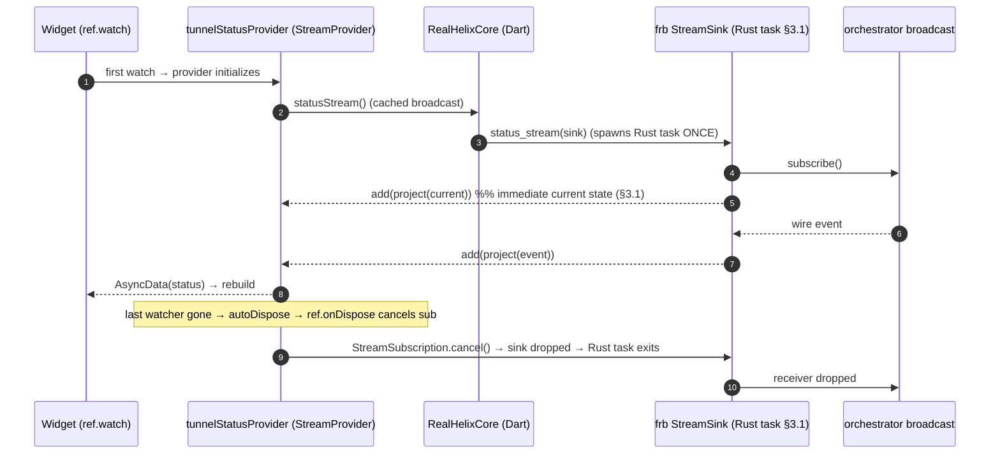
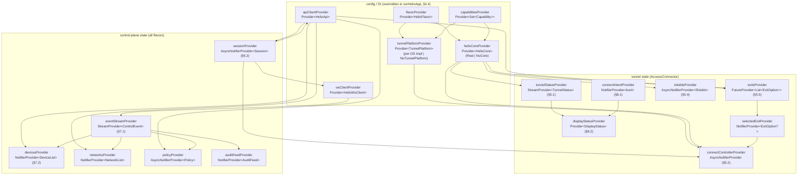
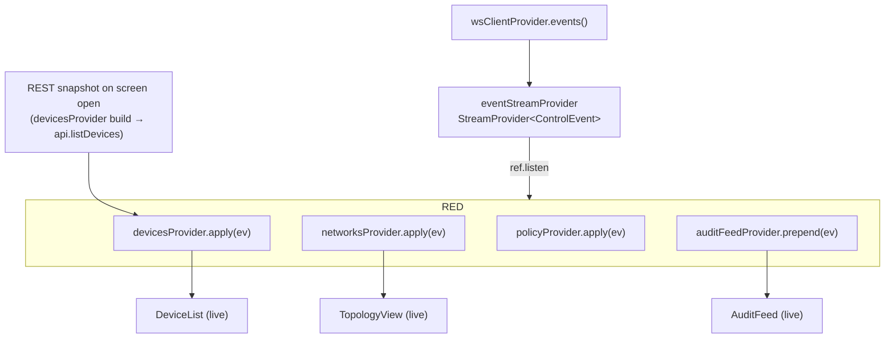
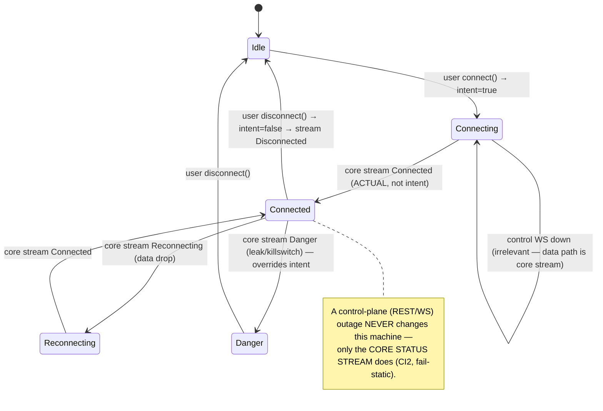

# State management & data layer (Riverpod)

**Revision:** 2
**Last modified:** 2026-07-04T12:00:00Z

> Master technical specification — **Volume 4 (Clients)**, nano-detail deep-dive.
> This document **deepens** the *Riverpod data layer* (§8) and the *FFI surface*
> (§3) of the pass-1 client overview [04_UI §4/§5, doc `03` §3/§8] into an
> implementation-ready specification of the `helix_domain` state layer: the
> Riverpod provider graph, the rule that **the UI is a pure function of the Rust
> core's status stream** (CI2), the `flutter_rust_bridge` `StreamSink → Stream`
> mechanics, the `helix_api` REST + WS/SSE client, how **Helix Console** folds
> control-plane events into Riverpod state, and the offline / optimistic
> (intent-vs-actual) honesty machine. SPEC-ONLY: it describes **what to build**,
> not the shipping product.
>
> **Boundary with sibling docs.** This document **consumes**: the FFI surface +
> `TunnelStatus` mirror owned by doc `03` [03 §3]; the orchestrator
> `tokio::broadcast<TunnelStatus>` stream + state machine owned by
> `v02-data-plane/orchestrator-and-state.md` [02-ORCH §4/§5]; the `Transport`
> contract [02-TT]; and the control-plane REST/WS/SSE + event taxonomy owned by
> doc `02`. It **owns** everything from the Dart `HelixCore` wrapper upward: how
> providers turn streams into reactive UI, how controllers issue commands, how
> events are reduced, and the offline honesty rule. It does **NOT** own the Rust
> orchestrator internals, the per-platform `TunnelPlatform` shim implementations
> (doc `03` §4–5, doc `06`), the `helix_design` widgets (doc `03` §7), or the
> REST/WS wire schema (doc `02`).
>
> **Evidence base.** Citations inline by id: `[04_UI]` =
> `04_VPN_CLD/HelixVPN-helix-ui-Flutter.md`; `[04_ARCH §N]` =
> `04_VPN_CLD/HelixVPN-Architecture-Refined.md`; `[03 §N]` =
> `final/03-client-core-and-ui.md`; `[02-ORCH §N]` =
> `final/v02-data-plane/orchestrator-and-state.md`; `[02-TT §N]` =
> `final/v02-data-plane/transport-trait.md`; `[SYN §N]` =
> `v09-research/_SYNTHESIS.md`; `[research-flutter_ffi]` /
> `[research-ios_android]` = the cited platform research digests. Any claim not
> grounded in the evidence base is tagged `UNVERIFIED` per constitution §11.4.6 —
> never fabricated.

---

## Table of contents

- [0. Position, ownership, and invariants](#0-position-ownership-and-invariants)
- [1. The single load-bearing rule: UI = pure function of the status stream](#1-the-single-load-bearing-rule-ui--pure-function-of-the-status-stream)
- [2. The `TunnelStatus` type — FFI mirror & projection from the orchestrator wire enum](#2-the-tunnelstatus-type--ffi-mirror--projection-from-the-orchestrator-wire-enum)
- [3. The FFI seam — `StreamSink` → Dart broadcast `Stream`](#3-the-ffi-seam--streamsink--dart-broadcast-stream)
- [4. The provider graph](#4-the-provider-graph)
- [5. `tunnelStatusProvider` + `ConnectController` (Access/Connector)](#5-tunnelstatusprovider--connectcontroller-accessconnector)
- [6. The `helix_api` client — REST + WS/SSE](#6-the-helix_api-client--rest--wsse)
- [7. Console: folding control-plane events into Riverpod state](#7-console-folding-control-plane-events-into-riverpod-state)
- [8. Offline / optimistic — the intent-vs-actual honesty machine](#8-offline--optimistic--the-intent-vs-actual-honesty-machine)
- [9. App lifecycle, provider disposal & memory budgets](#9-app-lifecycle-provider-disposal--memory-budgets)
- [10. Error handling & edge cases](#10-error-handling--edge-cases)
- [11. Test points — tied to the §11.4.169 closed test-type vocabulary](#11-test-points--tied-to-the-1141169-closed-test-type-vocabulary)
- [12. Frozen contracts this document fixes](#12-frozen-contracts-this-document-fixes)
- [Sources verified](#sources-verified)

---

## 0. Position, ownership, and invariants

### 0.1 What this document owns

The state layer lives in the `helix_domain` melos package [03 §2] (`packages/
helix_domain/lib/`). It owns five contracts:

| # | Contract | Owned here | Consumed from |
|---|---|---|---|
| S1 | **The Dart `TunnelStatus` projection** + the mapping from the orchestrator wire enum to the FFI/Dart enum | §2 | wire enum [02-ORCH §4.1]; FFI mirror [03 §3.1] |
| S2 | **The provider graph** — every Riverpod provider, its dependencies, its lifetime, its override seams for flavor + test | §4 | — |
| S3 | **`tunnelStatusProvider` + `ConnectController`** — the stream→state binding and the command controller | §5 | `HelixCore` FFI [03 §3.2], `TunnelPlatform` [03 §4] |
| S4 | **The `helix_api` consumption layer** — REST repositories + the WS/SSE client + the Console event reducer | §6, §7 | REST/WS schema, event taxonomy → doc `02` |
| S5 | **The offline / optimistic honesty machine** — intent vs actual, never green-on-intent (CI2) | §8 | — |

### 0.2 What this document does NOT own

- The Rust orchestrator (its loops, state machine, kill-switch, broadcast
  *sender*) — owned by [02-ORCH]; this doc owns the *receiver* side.
- The `helix-ffi` Rust source `api.rs` (the hand-authored FFI surface) — owned by
  [03 §3.1]; this doc consumes its **generated** Dart mirror.
- The per-platform `TunnelPlatform` shim impls (Swift/Kotlin/C#/C++/ArkTS) — owned
  by [03 §4–5]; this doc owns only the Dart `TunnelPlatform` *abstract contract*
  it drives and the provider that injects the per-OS impl.
- REST/WS/SSE wire schema, auth, the `device.revoked`/`route.changed`/… event
  payloads — owned by doc `02`; this doc owns only the Dart *reducer* over them.
- Widgets / tokens / theming — owned by [03 §7].

### 0.3 Invariants this document inherits and tightens

| # | Invariant | Source | State-layer tightening |
|---|---|---|---|
| CI2 | **The UI is a pure function of the core's status stream.** No polling. | [03 §0.1 CI2, 04_UI §4.2] | §1, §5: the ONLY writer of the rendered connection state is `tunnelStatusProvider`, fed by the FFI `StreamSink`. A widget never derives "connected" from its own command success. |
| CI5 | **State must be announced, not just colored.** | [03 §0.1 CI5] | §2: the Dart enum carries a `semanticLabel` projection so a11y readers announce state from the same source the color reads. |
| H-I1 | **Intent ≠ actual.** The user's wish to be connected is local optimistic state; *actual* protection is only the core stream. | [04_UI §4.4, 03 §8.4] | §8: a dedicated `connectIntentProvider`, never conflated with `tunnelStatusProvider`. |
| H-I2 | **A `Danger` state overrides any intent**, paints red immediately, and cannot be optimistically suppressed. | [03 §8.4] | §8.3. |
| H-I3 | **Console links `helix_api` ONLY** (no `helix_core_ffi`) — so it builds to Web. | [03 §0.1 CI3] | §4.4: `helixCoreProvider` is overridden to `NoCore()` in the Console flavor; `tunnelStatusProvider` is never watched in Console screens. |
| H-I4 | **Every provider is overridable** for flavor wiring (§4.4) and for tests (fake `HelixCore` + fake API with the *same generated model types*). | [03 §12, 04_UI §12] | §4.5, §11. |
| H-I5 | **Lag is not an error.** A `broadcast`/WS receiver that falls behind re-reads latest, never surfaces an error to the user. | [02-ORCH §4.6] | §3.4, §10. |

---

## 1. The single load-bearing rule: UI = pure function of the status stream

A VPN client's one safety-critical claim is *"am I protected right now?"* The
architecture makes that claim un-faleable by construction: the rendered
connection state is **derived only** from a stream the Rust core pushes
[04_UI §4.2, 03 §0.1 CI2]. The button reflects the stream; it never reflects its
own `onTap`.

```mermaid
flowchart LR
    CORE["helix-core orchestrator (Rust)<br/>tokio::broadcast&lt;TunnelStatus_wire&gt;<br/>[02-ORCH §4]"]
    FFI["helix-ffi adapter (Rust)<br/>project wire→FFI enum (§2.3)<br/>StreamSink&lt;TunnelStatus&gt;"]
    FRB["frb_generated.dart<br/>StreamSink → Dart Stream (§3)"]
    SP["tunnelStatusProvider<br/>StreamProvider&lt;TunnelStatus&gt; (§5.1)"]
    W["ConnectButton / StatusChip / ShieldIndicator<br/>ref.watch(tunnelStatusProvider)"]
    CTRL["ConnectController (§5.2)<br/>start/stop COMMANDS only"]
    SHIM["TunnelPlatform shim (§5.3)"]

    CORE --> FFI --> FRB --> SP --> W
    W -. "onTap (a command, NOT a state write)" .-> CTRL
    CTRL -. "startTunnel / stopTunnel" .-> SHIM
    SHIM -. "creates TUN, links core" .-> CORE
    classDef truth fill:#10B98122,stroke:#10B981;
    class CORE,FFI,FRB,SP,W truth;
```



The asymmetry is the whole point [03 §3.3]: **commands flow down**
(widget → controller → shim → core), **truth flows up** (core → FFI → provider →
widget), and the two paths never short-circuit. A `connect()` that succeeds does
not let the UI paint green — only the subsequent `Connected` event on the stream
does. This structurally eliminates the classic "UI says connected while the OS
tunnel is down" defect (it is the UI-layer mirror of [02-ORCH §13.1] "single
state authority" O-I10).

---

## 2. The `TunnelStatus` type — FFI mirror & projection from the orchestrator wire enum

### 2.1 The two enums and why both exist

There are **two** `TunnelStatus` shapes in the system, and they are deliberately
not identical:

1. **The orchestrator wire enum** (the broadcast payload, [02-ORCH §4.1]) — the
   lean five-variant truth the data plane emits:
   `Connecting | Handshaking | Connected{transport, rtt_ms} | Reconnecting |
   Down{reason}`.
2. **The FFI/Dart enum** (the mirror the UI binds, [03 §3.1]) — extends the wire
   enum with three UI-affordances: `Disconnected` (clean idle, distinct from an
   unexpected `Down`), a `path` field on `Connected` (`"direct" | "relay"`), and
   `Danger{kind}` (`"leak" | "killswitch_tripped"` — drives the red palette).

This document **fixes the projection** between them (§2.3) so the two never drift
silently — the projection is the single, auditable place the extension happens,
and it is consistent with both [02-ORCH §4.1] (which it consumes verbatim) and
[03 §3.1] (which it produces verbatim). The projection lives in the **Rust
`helix-ffi` adapter** (so frb mirrors one enum into Dart — never a hand-written
Dart parallel), per [03 §3.2].

### 2.2 The Rust FFI source (consumed verbatim from [03 §3.1])

```rust
// helix-ffi/src/api.rs — frb mirrors #[frb(mirror)] types into identical Dart types.
// CONSISTENCY: this is the [03 §3.1] enum, byte-for-byte; the FFI-contract test
// (§11 FFI-1) asserts the Dart mirror matches it. Do NOT re-define it here.
#[frb(mirror)]
pub enum TunnelStatus {
    Disconnected,                                                 // clean idle (FFI-synth, §2.3)
    Connecting,
    Handshaking,
    Connected { transport: String, path: String, rtt_ms: u32 },  // path = "direct" | "relay"
    Reconnecting,
    Down { reason: String },                                     // unexpected drop; stable prefix [02-ORCH §4.4]
    Danger { kind: String },                                     // "leak" | "killswitch_tripped"
}
```

### 2.3 The projection adapter (wire → FFI), the single mapping authority

```rust
// helix-ffi/src/status_adapter.rs
// Subscribes to the orchestrator broadcast [02-ORCH §2.1 Orchestrator::subscribe()],
// projects each lean wire event into the extended FFI enum, and re-emits on the
// StreamSink the Dart side listens to (§3). This is the ONLY place the extension
// from 5→7 variants happens. It is a pure function of (wire event, danger signal).
fn project(wire: WireStatus, danger: Option<DangerKind>) -> TunnelStatus {
    match (wire, danger) {
        // Danger overrides everything (H-I2): a leak / tripped kill-switch paints red
        // regardless of the underlying wire state.
        (_, Some(DangerKind::Leak))             => TunnelStatus::Danger { kind: "leak".into() },
        (_, Some(DangerKind::KillSwitchTripped))=> TunnelStatus::Danger { kind: "killswitch_tripped".into() },

        (WireStatus::Connecting,  None)         => TunnelStatus::Connecting,
        (WireStatus::Handshaking, None)         => TunnelStatus::Handshaking,
        (WireStatus::Connected { transport, rtt_ms }, None) =>
            TunnelStatus::Connected { transport, path: path_label(), rtt_ms }, // §2.4 path source
        (WireStatus::Reconnecting, None)        => TunnelStatus::Reconnecting,

        // The KEY reconciliation: a CLEAN user-stop (Down{reason:"stopped"}) projects to
        // Disconnected (idle), NOT Down. Every OTHER Down reason stays Down. This mirrors the
        // orchestrator's own Idle/ShuttingDown→Connecting/Down internal projection [02-ORCH §5.1].
        (WireStatus::Down { reason }, None) if reason == "stopped" => TunnelStatus::Disconnected,
        (WireStatus::Down { reason }, None)     => TunnelStatus::Down { reason },
    }
}
```

| Wire enum [02-ORCH §4.1] | Danger signal | FFI/Dart enum [03 §3.1] | Notes |
|---|---|---|---|
| (pre-start / post-clean-stop) | — | `Disconnected` | FFI-synthesized idle; the orchestrator's `Idle`/`Down{stopped}` |
| `Connecting` | — | `Connecting` | 1:1 |
| `Handshaking` | — | `Handshaking` | 1:1 |
| `Connected{transport,rtt_ms}` | — | `Connected{transport,path,rtt_ms}` | `path` added by FFI (§2.4) |
| `Reconnecting` | — | `Reconnecting` | 1:1 |
| `Down{reason="stopped"}` | — | `Disconnected` | clean idle, **not** Down |
| `Down{reason≠"stopped"}` | — | `Down{reason}` | reason prefix preserved [02-ORCH §4.4] |
| any | `Leak` / `KillSwitchTripped` | `Danger{kind}` | overrides all (H-I2) |

### 2.4 `path` and `danger` provenance (honest boundary, §11.4.6)

- **`path`** (`"direct"`|`"relay"`) is a Phase-2 affordance (direct P2P vs
  DERP-style relay [SYN §4]). `UNVERIFIED`: the Phase-0/1 wire enum does **not**
  carry a path field. Until the orchestrator surfaces NAT-traversal state, the
  FFI adapter sets `path` from the active transport posture — `"relay"` for any
  gateway-routed carrier, `"direct"` only when the orchestrator reports a
  hole-punched P2P session [SYN §4]. The default in Phase 1 is `"relay"`; the
  `StatusChip` renders it but MUST NOT claim "direct" without that signal.
- **`danger`** is a separate orchestrator signal, **not** a wire `TunnelStatus`
  variant: a DNS-leak detection or a tripped kill-switch firewall rule
  [02-ORCH §8] raises a `DangerKind` the adapter folds in. `UNVERIFIED`: the exact
  leak-detection mechanism (continuous resolver probe vs firewall-counter) is a
  doc-`02`/orchestrator concern; this doc only consumes the resulting `DangerKind`.

### 2.5 The Dart-facing type (generated mirror) + a11y projection (CI5)

```dart
// helix_core_ffi/lib/frb_generated.dart  — GENERATED from §2.2; do NOT hand-edit.
sealed class TunnelStatus { const TunnelStatus(); }
class Disconnected extends TunnelStatus { const Disconnected(); }
class Connecting   extends TunnelStatus { const Connecting(); }
class Handshaking  extends TunnelStatus { const Handshaking(); }
class Connected    extends TunnelStatus { final String transport, path; final int rttMs;
                                          const Connected(this.transport, this.path, this.rttMs); }
class Reconnecting extends TunnelStatus { const Reconnecting(); }
class Down         extends TunnelStatus { final String reason; const Down(this.reason); }
class Danger       extends TunnelStatus { final String kind;   const Danger(this.kind); }
```

```dart
// helix_domain/lib/models/tunnel_status_x.dart — a11y + classification helpers (CI5).
// Color is read in helix_design [03 §7.1]; the SEMANTIC LABEL is read here, from the
// SAME source, so "announced, not just colored" cannot drift (CI5).
extension TunnelStatusX on TunnelStatus {
  /// The screen-reader announcement — never color alone (CI5).
  String get semanticLabel => switch (this) {
    Disconnected() => 'Not protected. Disconnected.',
    Connecting()   => 'Connecting…',
    Handshaking()  => 'Establishing secure tunnel…',
    Connected(:final transport, :final path, :final rttMs) =>
        'Protected via $transport, $path path, $rttMs milliseconds.',
    Reconnecting() => 'Connection dropped. Reconnecting…',
    Down(:final reason) => 'Disconnected unexpectedly: $reason.',
    Danger(:final kind) => kind == 'leak'
        ? 'WARNING: traffic may be leaking. Not protected.'
        : 'WARNING: kill-switch tripped. Traffic is blocked.',
  };

  bool get isProtected   => this is Connected;             // the ONLY protected state
  bool get isTransitional=> this is Connecting || this is Handshaking || this is Reconnecting;
  bool get isDanger      => this is Danger;
}
```

> **Consistency assertion (FFI-1, §11).** The Dart sealed class above MUST be the
> frb-generated mirror of §2.2, and §2.2 MUST equal [03 §3.1] verbatim, which in
> turn projects [02-ORCH §4.1] via §2.3. The contract test asserts all three
> links so a drift at any seam FAILs the build [03 §12].

---

## 3. The FFI seam — `StreamSink` → Dart broadcast `Stream`

### 3.1 The Rust side: one `StreamSink` per subscription

```rust
// helix-ffi/src/api.rs  [03 §3.1]
// frb turns this into a Dart `Stream<TunnelStatus>`. The sink is fed by the projection
// adapter (§2.3), which is driven by the orchestrator broadcast receiver [02-ORCH §4.6].
pub fn status_stream(sink: StreamSink<TunnelStatus>) {
    let mut rx = ORCH.get().expect("started").subscribe();          // broadcast::Receiver
    tokio::spawn(async move {
        // emit the current state immediately so a late Dart listener is never blank (§3.3)
        let _ = sink.add(project(current_wire(), current_danger()));
        loop {
            match rx.recv().await {
                Ok(wire)                        => { let _ = sink.add(project(wire, current_danger())); }
                Err(RecvError::Lagged(_))       => { let _ = sink.add(project(current_wire(), current_danger())); } // re-read latest (H-I5)
                Err(RecvError::Closed)          => break,            // orchestrator gone → close the sink
            }
        }
        // sink dropped here → Dart Stream completes (§3.4)
    });
}
```

Key properties: (1) the **first** `sink.add` is the *current* projected state, so
a Dart `StreamProvider` that subscribes after a connection is already up renders
correctly without a race (§3.3); (2) a broadcast `Lagged` is converted to a
re-emit of latest, **never** propagated as an error (H-I5) [02-ORCH §4.6]; (3) the
spawned task ends when the orchestrator's sender closes, completing the Dart
stream cleanly.

### 3.2 The frb threading & isolate model

`flutter_rust_bridge` v2 runs Rust async on its own worker (a Rust-side Tokio
runtime, not the Dart isolate) and marshals each `sink.add(value)` across the
isolate boundary onto the Dart event loop [research-flutter_ffi]. Consequences
the state layer MUST respect:

| Concern | Behaviour | State-layer rule |
|---|---|---|
| Threading | events arrive on the Dart **platform** isolate's event queue (frb serializes) | providers may mutate freely; no extra isolate hop needed |
| Ordering | frb preserves per-sink `add` order [research-flutter_ffi] | the reducer (§5.1) may assume monotonic delivery within one sink |
| Backpressure | the Dart side cannot stall the Rust broadcast (the §3.1 loop drops to latest on `Lagged`) | a slow widget rebuild never wedges the core (H-I5) |
| Cancellation | dropping the Dart `StreamSubscription` drops the sink; the §3.1 task exits on next `add` failure | `ref.onDispose` MUST cancel the subscription (§3.4, §9.2) |
| Memory | one spawned Rust task + one channel per `status_stream()` call | call `status_stream()` **once**, fan-out in Dart via a broadcast `StreamProvider` (§3.3, §9.3) |

### 3.3 The Dart wrapper: one sink, broadcast fan-out

```dart
// helix_core_ffi/lib/helix_core.dart — the idiomatic wrapper [03 §3.2].
class RealHelixCore implements HelixCore {
  Stream<TunnelStatus>? _statusCache;           // single underlying sink, fanned out

  @override
  Stream<TunnelStatus> statusStream() =>
      // frb StreamSink → a single-subscription Dart Stream; .asBroadcastStream()
      // lets N widgets watch via the StreamProvider without N Rust sinks (§9.3).
      _statusCache ??= HelixCoreFfi.instance.statusStream().asBroadcastStream();

  @override
  Future<void> start({required String transport, String? mapPathOrSession,
                      CoreMode mode = CoreMode.client}) =>
      HelixCoreFfi.instance.start(cfg: ClientConfig(
          transport: transport, mapPathOrSession: mapPathOrSession ?? '', mode: mode));

  @override Future<void> stop()                       => HelixCoreFfi.instance.stop();
  @override Future<List<ExitOption>> exits()          => HelixCoreFfi.instance.exits();
  @override Future<void> setExit(String id, {List<String>? multiHopChain}) =>
      HelixCoreFfi.instance.setExit(id: id, multiHopChain: multiHopChain);
  @override Future<void> setShields(Shields s)        => HelixCoreFfi.instance.setShields(s: s);
  @override Future<AdvertiseResult> advertise(List<String> cidrs) =>
      HelixCoreFfi.instance.advertise(cidrs: cidrs);
  @override Future<void> attachTun(int fd)            => HelixCoreFfi.instance.attachTun(fd: fd);
  @override Future<void> detachTun()                  => HelixCoreFfi.instance.detachTun();
}

/// Console flavor: no Rust staticlib linked (CI3, H-I3). statusStream is a const idle.
class NoCore implements HelixCore {
  @override Stream<TunnelStatus> statusStream() => const Stream.empty();
  @override Future<void> start({required String transport, String? mapPathOrSession,
      CoreMode mode = CoreMode.client}) async => throw UnsupportedError('Console has no tunnel (CI3)');
  // …every tunnel method throws UnsupportedError; Console never calls them (§4.4).
  @override Future<void> stop() async {}
  @override Future<List<ExitOption>> exits() async => const [];
  @override Future<void> setExit(String id, {List<String>? multiHopChain}) async {}
  @override Future<void> setShields(Shields s) async {}
  @override Future<AdvertiseResult> advertise(List<String> cidrs) async =>
      throw UnsupportedError('Console cannot advertise');
  @override Future<void> attachTun(int fd) async {}
  @override Future<void> detachTun() async {}
}
```

### 3.4 Stream lifecycle & disposal



The `StreamProvider` is **NOT** `autoDispose` for Access/Connector (the status
must survive screen navigation so a backgrounded connect keeps streaming) — it is
explicitly `keepAlive` and disposed only at app teardown (§9.2). The single Rust
sink (§3.3) is therefore long-lived; this is intentional and bounded (one task,
one channel; §9.3).

---

## 4. The provider graph

### 4.1 The full graph (Mermaid)



### 4.2 Provider catalogue (type, lifetime, flavor scope)

| Provider | Riverpod kind | Lifetime | Flavors | Reads | Source |
|---|---|---|---|---|---|
| `flavorProvider` | `Provider<HelixFlavor>` | keepAlive (overridden) | all | — | §4.4 |
| `capabilitiesProvider` | `Provider<Set<Capability>>` | keepAlive (overridden) | all | — | [03 §6] |
| `helixCoreProvider` | `Provider<HelixCore>` | keepAlive (overridden) | Access/Connector real; Console `NoCore` | caps | [03 §6] |
| `tunnelPlatformProvider` | `Provider<TunnelPlatform>` | keepAlive (overridden) | Access/Connector | flavor/OS | [03 §4] |
| `apiClientProvider` | `Provider<HelixApi>` | keepAlive | all | session | doc `02` |
| `wsClientProvider` | `Provider<HelixWsClient>` | keepAlive | Console (+Access for own events) | session | §6.3 |
| `tunnelStatusProvider` | `StreamProvider<TunnelStatus>` | **keepAlive** (§3.4) | Access/Connector | core | §5.1 |
| `connectControllerProvider` | `AsyncNotifierProvider<…,void>` | keepAlive | Access/Connector | platform, session, intent | §5.2 |
| `connectIntentProvider` | `NotifierProvider<…,bool>` | keepAlive | Access/Connector | — | §8.1 |
| `displayStatusProvider` | `Provider<DisplayStatus>` | autoDispose | Access/Connector | status, intent | §8.2 |
| `shieldsProvider` | `AsyncNotifierProvider<…,Shields>` | keepAlive | Access | core | §5.4 |
| `exitsProvider` | `FutureProvider<List<ExitOption>>` | autoDispose | Access | core | §5.5 |
| `selectedExitProvider` | `NotifierProvider<…,ExitOption?>` | keepAlive | Access | — | §5.5 |
| `sessionProvider` | `AsyncNotifierProvider<…,Session>` | keepAlive | all | api | §6.2 |
| `eventStreamProvider` | `StreamProvider<ControlEvent>` | keepAlive | Console (+Access) | ws | §7.1 |
| `devicesProvider`/`networksProvider`/`policyProvider`/`auditFeedProvider` | `NotifierProvider`/`AsyncNotifierProvider` | autoDispose per screen | Console | api, events | §7.2 |

### 4.3 Generator vs hand-written providers (decision)

Both `@riverpod` codegen (`riverpod_generator`) and hand-written providers are
viable. **Recommendation:** use `@riverpod` codegen for the family providers
(`devicesProvider(tenantId)`, `policyProvider(networkId)`) where typed arguments
matter, and hand-written `StreamProvider`/`Provider` for the small fixed set
(status/intent/core) — keeping the FFI-adjacent providers hand-written makes the
stream wiring auditable. Codegen drift is checked in the `melos` drift gate
[03 §11]. (`UNVERIFIED`: the exact `riverpod_generator` version is a Phase-1
pin.)

### 4.4 Flavor wiring — `runHelixApp` overrides (the only DI seam)

```dart
// helix_domain/lib/run_helix_app.dart  [03 §6]
Future<void> runHelixApp({
  required HelixFlavor flavor,
  required Widget home,
  required Set<Capability> capabilities,
}) async {
  final container = ProviderContainer(overrides: [
    flavorProvider.overrideWithValue(flavor),
    capabilitiesProvider.overrideWithValue(capabilities),

    // Only flavors with Capability.tunnel link a real Rust core (CI3, H-I3):
    helixCoreProvider.overrideWith((ref) =>
        capabilities.contains(Capability.tunnel) ? RealHelixCore() : NoCore()),

    // The per-OS shim impl is injected here; Console gets a no-op:
    tunnelPlatformProvider.overrideWith((ref) =>
        capabilities.contains(Capability.tunnel)
            ? TunnelPlatform.forCurrentOs()      // §5.3 — MethodChannel/EventChannel impl
            : const NoTunnelPlatform()),
  ]);
  runApp(UncontrolledProviderScope(container: container,
      child: HelixApp(home: home, theme: helixTheme(flavor))));   // [03 §7]
}
```

The override list is the **single** place flavor capability gates the graph:
Console's `NoCore`/`NoTunnelPlatform` mean its widget tree never even references
`tunnelStatusProvider`, so the Rust staticlib is tree-shaken (CI3) [03 §6].

### 4.5 Test override seam (H-I4)

```dart
// test: same generated model types, faked behaviour (no mocks-claiming-PASS, [03 §12]).
ProviderContainer(overrides: [
  helixCoreProvider.overrideWithValue(FakeHelixCore(scriptedStatus: [
    const Connecting(), const Handshaking(), const Connected('masque-h3', 'relay', 23),
  ])),                                                   // drives a real StreamProvider
  tunnelPlatformProvider.overrideWithValue(FakeTunnelPlatform()),
  apiClientProvider.overrideWithValue(FakeHelixApi.fromFixtures()),
]);
```

`FakeHelixCore` emits the **generated** `TunnelStatus` types (never a parallel
stub), so a state test exercises the real contract — the §11 STATE/FFI invariant.

---

## 5. `tunnelStatusProvider` + `ConnectController` (Access/Connector)

### 5.1 The status provider (the truth binding)

```dart
// helix_domain/lib/providers/tunnel.dart
final tunnelStatusProvider = StreamProvider<TunnelStatus>((ref) {
  final core = ref.watch(helixCoreProvider);
  ref.keepAlive();                                    // survive navigation (§3.4)
  return core.statusStream();                         // frb StreamSink → broadcast Stream (CI2)
});
```

`AsyncValue<TunnelStatus>` semantics the UI relies on:

| `AsyncValue` | Meaning at the UI | Rendered state |
|---|---|---|
| `AsyncLoading` (no value yet) | provider initialized, first `sink.add` not arrived | treat as `Disconnected` placeholder (§3.1 emits current immediately, so this is sub-frame) |
| `AsyncData(s)` | latest projected status | render `s` |
| `AsyncError(e)` | the Dart stream errored (should be unreachable — §3.1 never adds errors) | log + render last good; surface as `Down{reason:"ffi-stream-error"}` (§10) |

### 5.2 `ConnectController` — commands only (never writes rendered state)

```dart
// helix_domain/lib/providers/connect_controller.dart
final connectControllerProvider =
    AsyncNotifierProvider<ConnectController, void>(ConnectController.new);

class ConnectController extends AsyncNotifier<void> {
  @override Future<void> build() async {}             // no state of its own (CI2)

  /// Issue the CONNECT command. Does NOT set "connected" — the stream does (§1).
  Future<void> connect({String transport = 'auto'}) async {
    state = const AsyncLoading();
    ref.read(connectIntentProvider.notifier).set(true);          // optimistic intent (§8.1)
    state = await AsyncValue.guard(() async {
      final cfg = await ref.read(sessionProvider.future)
                          .then((s) => s.resolveTunnelConfig(   // §6.2 → TunnelConfig [03 §4]
                              exit: ref.read(selectedExitProvider)));
      await ref.read(tunnelPlatformProvider).startTunnel(cfg);   // shim creates TUN + links core
      // NOTE: returns when the COMMAND is accepted, NOT when Connected. The
      // tunnelStatusProvider stream is the sole source of the green state (CI2).
    });
    if (state.hasError) {
      ref.read(connectIntentProvider.notifier).set(false);       // command failed → drop intent
    }
  }

  Future<void> disconnect() async {
    ref.read(connectIntentProvider.notifier).set(false);
    state = await AsyncValue.guard(
        () => ref.read(tunnelPlatformProvider).stopTunnel());
  }

  /// Toggle off the LATEST stream value (the actual state), not internal guesswork.
  Future<void> toggle(TunnelStatus? s) =>
      (s is Connected) ? disconnect() : connect();
}
```

```dart
// the ConnectButton — a pure function of the stream (CI2), command on tap (§1)
final status = ref.watch(tunnelStatusProvider);
final display = ref.watch(displayStatusProvider);   // intent-vs-actual blend (§8.2)
ConnectButton(
  state: status.valueOrNull ?? const Disconnected(),
  display: display,                                  // shows "Reconnecting…" honestly (§8)
  busy: ref.watch(connectControllerProvider).isLoading,
  onTap: () => ref.read(connectControllerProvider.notifier).toggle(status.valueOrNull),
);
```

### 5.3 `TunnelPlatform` injection (the command channel)

```dart
// helix_core_ffi/lib/tunnel_platform.dart  [03 §4] — the abstract contract (recap).
abstract class TunnelPlatform {
  Future<void> startTunnel(TunnelConfig cfg);
  Future<void> stopTunnel();
  Stream<PlatformTunnelEvent> events();              // up/down/permissionDenied/revoked/error

  /// Factory selecting the per-OS MethodChannel/EventChannel impl (§4.4).
  static TunnelPlatform forCurrentOs() => switch (defaultTargetPlatform) {
    TargetPlatform.iOS || TargetPlatform.macOS => const _AppleTunnelPlatform(),
    TargetPlatform.android                     => const _AndroidTunnelPlatform(),
    TargetPlatform.windows                     => const _WindowsPipeTunnelPlatform(),
    TargetPlatform.linux                       => const _LinuxTunnelPlatform(),
    _                                          => const _ChannelTunnelPlatform(), // ohos/aurora
  };
}
```

The `events()` stream (lifecycle: `permissionDenied`/`revoked`/`error`) is a
**separate** signal from `tunnelStatusProvider` (protection state). The state
layer folds it: a `revoked` event (OS or admin killed the tunnel out-of-band,
[03 §4.1 O3]) sets intent=false and lets the core stream's subsequent
`Down`/`Danger` paint the truth — the UI never claims connected after a revoke
[03 §4.1 O3, CI2].

```dart
// helix_domain/lib/providers/platform_events.dart
final platformEventsProvider = StreamProvider<PlatformTunnelEvent>((ref) {
  ref.keepAlive();
  return ref.watch(tunnelPlatformProvider).events();
});

// folded by a listener wired once at app start (§9.1):
void wirePlatformEvents(Ref ref) {
  ref.listen(platformEventsProvider, (_, next) {
    final ev = next.valueOrNull; if (ev == null) return;
    switch (ev.kind) {
      case PlatformTunnelEventKind.permissionDenied:
        ref.read(connectIntentProvider.notifier).set(false);     // honest: not connecting
      case PlatformTunnelEventKind.revoked:
      case PlatformTunnelEventKind.error:
        ref.read(connectIntentProvider.notifier).set(false);     // core stream paints Down/Danger
      case PlatformTunnelEventKind.up:
      case PlatformTunnelEventKind.down:
        break;                                                    // the core stream is authoritative
    }
  });
}
```

### 5.4 `shieldsProvider` — logic-only, no OS tunnel (CI1)

```dart
// helix_domain/lib/providers/shields.dart — setShields is pure core logic (no shim) [03 §3.3].
final shieldsProvider = AsyncNotifierProvider<ShieldsController, Shields>(ShieldsController.new);

class ShieldsController extends AsyncNotifier<Shields> {
  @override Future<Shields> build() async =>
      const Shields(killSwitch: true, dnsProtection: true, daita: false,
                    postQuantum: false, splitTunnel: []);
  Future<void> update(Shields s) async {
    state = const AsyncLoading();
    state = await AsyncValue.guard(() async {
      await ref.read(helixCoreProvider).setShields(s);            // UI→FFI direct (CI1, no shim)
      return s;
    });
  }
}
```

### 5.5 `exitsProvider` + `selectedExitProvider`

```dart
final exitsProvider = FutureProvider.autoDispose<List<ExitOption>>((ref) async {
  final list = await ref.watch(helixCoreProvider).exits();        // core.exits() [03 §3]
  list.sort((a, b) => (a.rttMs ?? 1 << 30).compareTo(b.rttMs ?? 1 << 30)); // RTT-sorted [03 §7.2]
  return list;
});
final selectedExitProvider = NotifierProvider<SelectedExit, ExitOption?>(SelectedExit.new);
class SelectedExit extends Notifier<ExitOption?> {
  @override ExitOption? build() => null;
  Future<void> choose(ExitOption e, {List<String>? chain}) async {
    await ref.read(helixCoreProvider).setExit(e.id, multiHopChain: chain); // logic-only (CI1)
    state = e;
  }
}
```

---

## 6. The `helix_api` client — REST + WS/SSE

### 6.1 Package surface

`helix_api` is a decoupled, reusable package [03 §2]: a **generated** OpenAPI REST
client (`rest_generated.dart`) plus a hand-written WS/SSE client (`ws_client.dart`)
[04_UI §1]. The wire schema, auth, and event payloads are doc `02`'s; this doc
fixes only the Dart consumption surface.

```dart
// helix_api/lib/helix_api.dart — the typed facade over rest_generated.dart (doc 02 schema).
abstract class HelixApi {
  // auth / enrollment (doc 02):
  Future<Session> enrollOidc(String idToken);
  Future<Session> enrollDeviceToken(String enrollToken, WgPublicKey devicePub);
  Future<Session> refresh(Session expiring);
  // resources (Console + Access):
  Future<List<Device>>  listDevices(TenantId t);
  Future<void>          revokeDevice(DeviceId d);          // → device.revoked event (doc 02)
  Future<List<Network>> listNetworks(TenantId t);
  Future<Policy>        getPolicy(NetworkId n);
  Future<PolicyDiff>    previewPolicy(NetworkId n, PolicyDraft draft); // effect-diff [03 §7.2]
  Future<void>          applyPolicy(NetworkId n, PolicyDraft draft);
  Future<EnrollToken>   mintEnrollToken(NetworkId n);      // QR enroll [03 §13 T1.6]
}
```

### 6.2 `sessionProvider` — the auth root every repo depends on

```dart
final sessionProvider = AsyncNotifierProvider<SessionController, Session>(SessionController.new);

class SessionController extends AsyncNotifier<Session> {
  @override Future<Session> build() async {
    final stored = await ref.read(secureStoreProvider).readSession();   // §11.4.10: secure storage
    if (stored == null) throw const UnauthenticatedException();
    if (stored.isExpiring) return ref.read(apiClientProvider).refresh(stored);
    // schedule a refresh before expiry so REST/WS never 401 mid-session:
    ref.onDispose(_refreshTimer.cancel);
    _scheduleRefresh(stored);
    return stored;
  }
  // resolveTunnelConfig: turn the session + selected exit into the [03 §4] TunnelConfig the shim needs.
}
```

`apiClientProvider` and `wsClientProvider` `ref.watch(sessionProvider)` so a
token refresh transparently re-bears every request and re-auths the socket
(§6.3). The **device WG private key never leaves the device** [SYN §7] — only its
public key + the session token cross `helix_api` (the keypair is shim/secure-store
owned, doc `06`).

### 6.3 The WS/SSE client (`HelixWsClient`)

```dart
// helix_api/lib/ws_client.dart — live control-plane events (doc 02 GET /v1/stream).
class HelixWsClient {
  HelixWsClient(this._session);
  final Session _session;

  /// Long-lived event stream. Auto-reconnects with backoff; replays from the last
  /// acked cursor so no event is lost across a flap (doc 02 stream resume semantics).
  Stream<ControlEvent> events() async* {
    var backoff = const Duration(milliseconds: 500);
    var cursor = await _store.lastCursor();
    while (true) {
      try {
        final socket = await _connect(_session.bearer, since: cursor);  // WS upgrade or SSE fallback
        backoff = const Duration(milliseconds: 500);                    // reset on success
        await for (final raw in socket) {
          final ev = ControlEvent.fromJson(raw);                        // doc 02 schema
          cursor = ev.cursor; await _store.saveCursor(cursor);          // at-least-once
          yield ev;
        }
      } on SocketException {
        await Future.delayed(backoff);
        backoff = _capped(backoff * 2, const Duration(seconds: 30));    // jittered, capped
      }
    }
  }
}
```

> **Transport choice (§11.4.6).** `UNVERIFIED`: whether the control stream is WS or
> SSE per platform — doc `02` fixes the wire (`GET /v1/stream` [04_UI §4.3]). The
> Dart client MUST support **both** (WS where bi-directional acks are wanted, SSE
> where a plain `EventSource` suffices — Web/Console) and present the **same**
> `Stream<ControlEvent>` upward so the reducer (§7) is transport-agnostic.

---

## 7. Console: folding control-plane events into Riverpod state

### 7.1 The event provider + taxonomy

```dart
// helix_domain/lib/providers/events.dart
final eventStreamProvider = StreamProvider<ControlEvent>((ref) {
  ref.keepAlive();
  return ref.watch(wsClientProvider).events();         // §6.3
});
```

The closed event taxonomy the reducer handles [04_UI §4.3, doc `02`] — Console
folds each into the relevant collection so the device list, topology view, and
audit feed update **live without refresh** [03 §8.3]:

| Event | Payload (doc 02) | Reduced into |
|---|---|---|
| `device.online` / `device.offline` | `{deviceId, at}` | `devicesProvider` presence |
| `device.revoked` | `{deviceId, reason}` | `devicesProvider` (mark revoked) + (Access self) drop intent (§5.3) |
| `route.changed` | `{networkId, delta}` | `networksProvider` topology |
| `policy.compiled` | `{networkId, version, hash}` | `policyProvider` version + audit |
| `enroll.completed` | `{deviceId, networkId}` | `devicesProvider` add |
| `audit.appended` | `{actor, action, at}` | `auditFeedProvider` prepend |

### 7.2 The reducer (fold events into collection state)



```dart
// helix_domain/lib/providers/devices.dart — snapshot from REST, then live deltas from WS.
final devicesProvider = NotifierProvider<DevicesController, DeviceList>(DevicesController.new);

class DevicesController extends Notifier<DeviceList> {
  @override DeviceList build() {
    final tenant = ref.watch(currentTenantProvider);
    // initial snapshot (REST) — render immediately, then live-patch from events:
    ref.read(apiClientProvider).listDevices(tenant).then((d) => state = DeviceList(d));
    // subscribe to the live stream; fold each relevant event:
    ref.listen(eventStreamProvider, (_, next) {
      final ev = next.valueOrNull; if (ev == null) return;
      state = switch (ev) {
        DeviceOnline(:final id)  => state.markOnline(id),
        DeviceOffline(:final id) => state.markOffline(id),
        DeviceRevoked(:final id) => state.markRevoked(id),
        EnrollCompleted(:final device) => state.add(device),
        _ => state,                                       // not ours → ignore
      };
    });
    return const DeviceList.empty();
  }
}
```

The pattern is **snapshot-then-stream**: a REST `list*` for the initial state (so
the screen is not blank on open), then `eventStreamProvider` deltas patch it in
place — the same "snapshot+deltas, push-don't-poll" shape the coordinator uses
on the data plane [SYN §2, 04_UI §4.3]. The reducer is a pure
`(state, event) → state` function (testable per §11 STATE).

### 7.3 Idempotency & ordering (no double-apply)

- Each `ControlEvent` carries a monotonic `cursor` (§6.3). The reducer is
  **idempotent**: re-applying an event already folded (post-reconnect replay) is a
  no-op (e.g. `markOnline` of an already-online device). This is required because
  the WS resume (§6.3) is **at-least-once**, not exactly-once.
- A snapshot that arrives *after* some deltas (slow REST, fast WS) reconciles by
  **last-writer-by-cursor**: deltas with a cursor newer than the snapshot's
  `as_of` are re-applied on top of the snapshot. `UNVERIFIED`: the exact
  snapshot `as_of` field is doc `02`'s; the reducer assumes it exists and SKIPs
  reconciliation with an honest log line if absent (§11.4.6).

---

## 8. Offline / optimistic — the intent-vs-actual honesty machine

### 8.1 `connectIntentProvider` — local wish, never truth

```dart
// helix_domain/lib/providers/intent.dart
final connectIntentProvider = NotifierProvider<ConnectIntent, bool>(ConnectIntent.new);
class ConnectIntent extends Notifier<bool> {
  @override bool build() => false;                     // default: user wants disconnected
  void set(bool wantConnected) => state = wantConnected;
}
```

Intent is set true on `connect()` and false on `disconnect()`/`revoked`/command
failure (§5.2/§5.3). It is **never** read as protection state — it only refines
*how* a transitional/idle status is *labelled* (§8.2). This is the literal
"distinguish intended from actual" rule [04_UI §4.4, 03 §8.4].

### 8.2 `displayStatusProvider` — blend (actual is authoritative)

```dart
// helix_domain/lib/providers/display_status.dart
enum DisplayState { disconnected, connecting, reconnecting, connected, danger }
class DisplayStatus {
  final DisplayState state; final TunnelStatus actual; final bool intended;
  const DisplayStatus(this.state, this.actual, this.intended);
}

final displayStatusProvider = Provider.autoDispose<DisplayStatus>((ref) {
  final actual = ref.watch(tunnelStatusProvider).valueOrNull ?? const Disconnected();
  final intended = ref.watch(connectIntentProvider);

  // RULE (H-I1, H-I2): ACTUAL is authoritative for color/protection. Intent only
  // refines the LABEL of a non-connected state so the UI never freezes on a stale
  // "Disconnected" while a connect is genuinely in flight.
  final state = switch (actual) {
    Danger()        => DisplayState.danger,                         // overrides intent (H-I2)
    Connected()     => DisplayState.connected,                      // actual green only
    Connecting() || Handshaking() => DisplayState.connecting,
    Reconnecting()  => DisplayState.reconnecting,
    // idle but the user WANTS connected (e.g. control channel flaky, command sent,
    // stream not yet flowing) → show "connecting…", NOT a misleading green, NOT a
    // dead "disconnected" (honest in-between):
    Disconnected() || Down() => intended ? DisplayState.connecting : DisplayState.disconnected,
  };
  return DisplayStatus(state, actual, intended);
});
```

| `actual` (stream) | `intended` | `DisplayState` | Color [03 §7.1] |
|---|---|---|---|
| `Connected` | any | `connected` | green `stateConnected` |
| `Danger` | any | `danger` | red `stateDanger` (override) |
| `Connecting`/`Handshaking` | any | `connecting` | amber `stateConnecting` |
| `Reconnecting` | any | `reconnecting` | amber `stateConnecting` |
| `Disconnected`/`Down` | `true` | `connecting` | amber (honest "trying") |
| `Disconnected`/`Down` | `false` | `disconnected` | grey `stateDisconnected` |

**The honesty guarantee (H-I1):** the only path to `connected` (green) is an
`actual` `Connected` event — intent can never produce green. The only thing
intent does is upgrade a *grey idle* to an *amber connecting* while a command is
in flight, so the UI is neither lying-green nor frozen-grey.

### 8.3 `Danger` is non-suppressible (H-I2)

A `Danger{leak|killswitch_tripped}` projection (§2.3) maps to `DisplayState.danger`
**before** any intent check, paints red immediately, and cannot be optimistically
hidden. This mirrors the orchestrator's fail-closed posture [02-ORCH §8.4]: the
data plane has closed the kill-switch / detected a leak, and the UI must say so
the instant the event arrives — the user's "I want connected" intent is
irrelevant to a safety alarm.

### 8.4 Offline control channel ≠ offline tunnel

A flaky **control** channel (REST/WS to the coordinator, §6) is independent of the
**data** tunnel (the core stream, §5): the tunnel keeps forwarding on its
last-applied map even if the coordinator is unreachable (fail-static
[02-ORCH §6.5, I3]). The state layer reflects this honestly:



A WS reconnect banner ("reconnecting to console…") is a **separate** UI affordance
driven by `eventStreamProvider`'s `AsyncError`/reconnect state — it MUST NOT be
confused with the tunnel's `Reconnecting` (different stream, different meaning).

---

## 9. App lifecycle, provider disposal & memory budgets

### 9.1 Startup wiring (once, at `runHelixApp`)

```dart
// after runApp: wire the cross-cutting listeners that fold side-streams (§5.3, §7.2).
// Done via a top-level Consumer/ref so they live for the app's lifetime and are
// disposed only at teardown.
class HelixApp extends ConsumerStatefulWidget { /* … */ }
class _HelixAppState extends ConsumerState<HelixApp> with WidgetsBindingObserver {
  @override void initState() {
    super.initState();
    WidgetsBinding.instance.addObserver(this);
    if (ref.read(capabilitiesProvider).contains(Capability.tunnel)) {
      wirePlatformEvents(ref);                       // §5.3 — fold shim lifecycle events
    }
  }
  @override void dispose() { WidgetsBinding.instance.removeObserver(this); super.dispose(); }

  @override void didChangeAppLifecycleState(AppLifecycleState s) {
    // §9.4: on resume, force-refresh the control snapshot (WS may have flapped while backgrounded);
    // the tunnel status stream needs no action (the core kept running in its OS process, [03 §4]).
    if (s == AppLifecycleState.resumed) ref.invalidate(devicesProvider);
  }
}
```

### 9.2 Disposal rules

| Provider class | Disposal | Why |
|---|---|---|
| `tunnelStatusProvider`, `platformEventsProvider`, `eventStreamProvider` | **keepAlive** | streams must survive screen navigation; one Rust sink / one WS (§3.4) |
| `helixCoreProvider`, `tunnelPlatformProvider`, `apiClientProvider`, `wsClientProvider`, `sessionProvider` | keepAlive | app-singletons; disposed only at container teardown |
| `exitsProvider`, screen `devicesProvider`/`policyProvider` | **autoDispose** | re-fetched on screen open; freed when the screen pops |
| `connectIntentProvider`, `selectedExitProvider`, `shieldsProvider` | keepAlive | user state spanning screens |

Every provider that holds a `StreamSubscription` MUST cancel it in `ref.onDispose`
(`StreamProvider` does this automatically; hand-folded `ref.listen` subscriptions
are auto-cancelled when the host provider disposes). A leaked subscription is a
§11 MEM defect.

### 9.3 Memory budget (state layer)

| Item | Budget | How |
|---|---|---|
| Rust FFI status sinks | **exactly 1** live `status_stream()` task | Dart caches + `asBroadcastStream()` (§3.3) — N widgets, 1 sink |
| WS/SSE socket | exactly 1 per session | `wsClientProvider` singleton (§6.3) |
| Event history retained | bounded ring (audit feed cap, e.g. last 500) | `auditFeedProvider` caps + drops oldest (no unbounded growth) |
| Provider graph footprint | low-tens of KB | sealed states, no large caches; heavy Console tables are `autoDispose` + deferred-loaded [03 §7.3] |
| Rebuild cost | only widgets watching the changed provider rebuild | granular providers (status ≠ devices ≠ policy); `select` for field-level watches |

These sit under the app-wide budgets [03 §10]: idle memory single-digit→low-tens
MB; the *tunnel core* memory is the Rust budget (the iOS NE ceiling, [03 §5.1]),
**not** the Dart state layer's.

### 9.4 Background / resume

- **Access/Connector:** the tunnel runs in a separate OS process/extension
  [03 §0.1 CI1], so backgrounding the Flutter app does **not** stop the tunnel;
  on resume, `tunnelStatusProvider` re-reads the current state via the §3.1
  immediate-emit, so the UI is correct within a frame — no re-poll.
- **Console:** on resume, the WS may have dropped while backgrounded;
  `eventStreamProvider`'s auto-reconnect (§6.3) replays from the cursor, and
  `didChangeAppLifecycleState` invalidates the visible collection so a fresh REST
  snapshot reconciles any missed deltas (§7.3).

---

## 10. Error handling & edge cases

| # | Edge case | Required state-layer behaviour | Source |
|---|---|---|---|
| C1 | FFI stream emits nothing yet (cold start) | §3.1 emits *current* immediately; `AsyncLoading` is sub-frame; render `Disconnected` placeholder | §3.1, §5.1 |
| C2 | broadcast `Lagged` (UI wedged > 64 events behind) | §3.1 converts to a re-emit of latest; provider never sees an error (H-I5) | [02-ORCH §4.6] |
| C3 | `connect()` command throws (shim `permissionDenied`) | `ConnectController` sets `AsyncError`, intent←false; `displayStatus`→`disconnected`; show permission rationale (NOT `error` red — distinct from `Danger`) [03 §4.1 O1] | §5.2, §5.3 |
| C4 | OS `revoked` event mid-`Connected` | platform-events listener sets intent←false; core stream emits `Down`/`Danger`; UI paints honestly, never stays green [03 §4.1 O3] | §5.3 |
| C5 | control WS down while tunnel `Connected` | tunnel UI unaffected (different stream, fail-static); only a "reconnecting to console" banner shows | §8.4 |
| C6 | session token expired mid-use | `sessionProvider` auto-refreshes (§6.2); REST/WS re-bear; on hard-fail → `UnauthenticatedException` routes to re-enroll | §6.2 |
| C7 | duplicate control event after WS replay | idempotent reducer no-ops (§7.3) | §7.3 |
| C8 | snapshot arrives after deltas | last-writer-by-cursor reconciliation; SKIP-with-log if `as_of` absent (§11.4.6) | §7.3 |
| C9 | `Danger` arrives while user intent=true | `displayStatus`→`danger` (red) regardless of intent (H-I2) | §8.3 |
| C10 | Console screen watches `tunnelStatusProvider` (mis-wire) | `NoCore().statusStream()` = `Stream.empty()` → `AsyncLoading` forever; a lint/test (§11 STATE) flags any Console widget referencing tunnel providers (H-I3) | §3.3, §4.4 |
| C11 | rapid toggle (connect→disconnect→connect) | `AsyncNotifier.guard` serializes; `toggle` reads the *latest* stream value, not stale intent; no torn state | §5.2 |
| C12 | FFI stream errors (should be unreachable) | `tunnelStatusProvider` surfaces `AsyncError`; mapped to synthetic `Down{reason:"ffi-stream-error"}`; logged; NOT shown as `Danger` (it is an app fault, not a leak) | §5.1 |

> **No-guessing on causes (§11.4.6).** Error labels are observational, never
> guessed: `permissionDenied` (C3) comes from the shim's explicit
> `PlatformTunnelEventKind.permissionDenied` [03 §4], never inferred from a
> generic failure; an ambiguous failure is `Down{reason}` with the shim's honest
> `detail` string, never silently upgraded to `Danger`.

---

## 11. Test points — tied to the §11.4.169 closed test-type vocabulary

Per **§11.4.169** every workable item declares its required test types from the
CLOSED set (unit · integration · e2e · full-automation · Challenges · HelixQA ·
DDoS/load · security · stress+chaos · concurrency · race · memory · benchmarking);
the ONLY permitted absence of a warranted type is an honest §11.4.3
SKIP-with-reason, never a silent gap; every PASS cites rock-solid captured
evidence (§11.4.5/.69/.107). Four-layer §11.4.4(b) enforcement applies to every
closure; each meta-test ships a paired §1.1 mutation.

| Test id | §11.4.169 type | What it proves for the state layer | Rig / captured evidence | §1.1 mutation (must FAIL) |
|---|---|---|---|---|
| ST-1 | **unit** | `project()` (§2.3) maps every (wire, danger) pair → exact FFI enum; `Down{stopped}`→`Disconnected`, danger overrides | table-driven test over §2.3 matrix | flip `Down{stopped}`→`Down` → ST-1 FAILs |
| ST-2 | **unit** | `displayStatusProvider` (§8.2) never yields `connected` without `actual==Connected`; `Danger` overrides intent | truth-table over (actual × intent) | let intent force `connected` → ST-2 FAILs |
| ST-3 | **unit** | the §7.2 reducer is a pure idempotent `(state,event)→state`; double-apply = no-op | golden event sequences incl. replay | make `markOnline` non-idempotent → ST-3 FAILs |
| ST-4 | **integration** (real System, infra via containers submodule §11.4.76) | `tunnelStatusProvider` reflects a REAL `helix-core` stream over frb on Linux; `helix_api` hits a booted coordinator | netns + booted gateway/coordinator; provider-value capture log | swap stream source to a constant → ST-4 FAILs |
| ST-5 | **e2e** | full Access journey: tap Connect → `Connecting→Handshaking→Connected{masque-h3,relay,23}` rendered ONLY from the stream; tap → Disconnected | Flutter-Linux app; window-scoped MP4 + vision verdict (§11.4.159) of the StatusChip | paint green on `connect()` success → ST-5 FAILs (CI2) |
| ST-6 | **full-automation** (deterministic §11.4.50) | N=3 identical runs of the connect→status arc produce byte-identical rendered-state traces | scripted `FakeHelixCore`; 3× identical trace artifacts | introduce intent-derived green → diverges → ST-6 FAILs |
| ST-7 | **Challenges** (challenges submodule §11.4.27(B)) | a Challenge bank scores PASS only on the captured ST-5 status-arc MP4 + the no-green-on-intent assertion, not config | Challenge `result.json` | weaken assertion to "any green" → Challenge FAILs |
| ST-8 | **HelixQA** (helix_qa submodule) | autonomous QA session drives connect/disconnect/revoke across flavors; asserts honest display state each step | HelixQA session evidence bundle | — (SKIP only if HelixQA bank absent, honest §11.4.3) |
| ST-9 | **DDoS / load-flood** | Console WS event-flood (≥10k events/s) folds without dropping UI frames or unbounded growth; audit ring caps | event-flood harness; frame-time + RSS CSV | remove ring cap → memory grows → ST-9 FAILs |
| ST-10 | **security** (§11.4.10 + security submodule) | no `Session` bearer / WG key / `SecretBytes` ever logged or rendered; secure-store read/write only | plant-and-grep over logs + tracked files (grep-empty proof) | log the bearer → ST-10 FAILs |
| ST-11 | **stress + chaos** (§11.4.85) | control WS killed mid-`Connected` → tunnel UI unchanged (fail-static); revoke mid-connect → honest Down; rapid toggle (C11) no torn state | chaos harness: WS SIGKILL, revoke injection, 100× toggle; recovery trace | let a WS drop flip the tunnel state → ST-11 FAILs (§8.4) |
| ST-12 | **concurrency / atomicity** | concurrent stream event + command + WS event mutating providers leaves consistent state; `guard` serializes commands | concurrency harness over `connectControllerProvider` | drop the `AsyncValue.guard` → torn state → ST-12 FAILs |
| ST-13 | **race / deadlock** | provider re-entrancy / `ref.listen` fold during dispose has no use-after-dispose / deadlock | Riverpod `ProviderContainer` stress + dispose-during-emit | leak a subscription past dispose → ST-13 FAILs |
| ST-14 | **memory** | exactly 1 live frb status sink + 1 WS socket regardless of widget count; no subscription leak across 1000 navigations | sink/socket counter + RSS over a navigation soak | drop `asBroadcastStream` cache → N sinks → ST-14 FAILs |
| ST-15 | **benchmarking / performance** | only providers whose value changed trigger rebuilds; status emit → frame within budget; no jank on the connect transition | rebuild-count + frame-time CSV (`select` granularity) | watch the whole status object instead of `select` → extra rebuilds → ST-15 regresses |
| FFI-1 | **unit** (contract) | the Dart `TunnelStatus` mirror == §2.2 Rust == [03 §3.1] == projection of [02-ORCH §4.1]; a drift FAILs the build | shared generated fixtures; byte-for-byte enum diff [03 §12] | add a Dart-only variant → FFI-1 FAILs |

> **Anti-bluff coupling (§11.4.107/§11.4.158).** A green widget/state unit test is
> NOT proof the user sees the truth. ST-5 (e2e, window-scoped MP4 + vision verdict
> of the StatusChip reading `MASQUE · relay · 23ms`) + ST-4 (real-core
> integration) are the load-bearing evidence; the unit layer (ST-1..3, FFI-1)
> exercises real contracts via the *generated* model types (H-I4), never
> mocks-claiming-PASS [03 §12]. Honest §11.4.3 SKIP applies where a type is not
> warranted at this layer (e.g. ST-9 DDoS for Access — a pure end-user app has no
> server-side flood surface; the Console event-flood IS the warranted instance, so
> it is NOT skipped).

---

## 12. Frozen contracts this document fixes

| Contract | Fixed value | Consumed by |
|---|---|---|
| **wire→FFI `TunnelStatus` projection** (§2.3) — the single 5→7 variant mapping authority | §2.3 table | the FFI adapter [03 §3], FFI-1 test |
| **`tunnelStatusProvider` = the sole rendered-state source** (CI2) | §5.1 | every reactive Access/Connector widget |
| **command/truth asymmetry** — controllers issue commands, never write rendered state | §1, §5.2 | `ConnectController`, ST-5 |
| **intent-vs-actual blend** (`displayStatusProvider`) — green only on actual `Connected`; `Danger` overrides | §8.2 | `ConnectButton`, the honesty guarantee |
| **snapshot-then-stream reducer** (idempotent, cursor-ordered) | §7.2/§7.3 | Console live collections |
| **provider override DI seam** (`runHelixApp`) — flavor + test wiring | §4.4/§4.5 | the three flavors; all state tests |
| **single frb sink + single WS socket** memory invariant | §3.3/§9.3 | ST-14 MEM gate |

---

## Sources verified

- `final/03-client-core-and-ui.md` `[03]` — §0.1 (client invariants CI1–CI6), §3
  (FFI surface, `TunnelStatus` mirror + extension note, FFI⇄shim seam), §4
  (`TunnelPlatform` contract + obligations), §6 (flavor/capability gating,
  `runHelixApp`), §7 (tokens/state→color, a11y CI5), §8 (Riverpod data layer,
  tunnel-state provider, Console live data, offline/optimistic), §12 (testing +
  FFI contract test).
- `final/v02-data-plane/orchestrator-and-state.md` `[02-ORCH]` — §4.1 (the lean
  wire `TunnelStatus` enum), §4.4 (`Down.reason` prefixes), §4.6 (receiver
  contract / `Lagged`), §5.1 (`OrchState` internal-vs-projection), §6.5
  (fail-static), §8 (kill-switch/DNS / `Danger` source), §13.1 (single state
  authority O-I10), §14 (test points / §11.4.169).
- `final/v02-data-plane/transport-trait.md` `[02-TT]` — §2 (`Transport` trait),
  §5.2 (tunnel-level `TunnelStatus` projection note), §9 (§11.4.169 test-type
  table precedent).
- `04_VPN_CLD/HelixVPN-helix-ui-Flutter.md` `[04_UI]` — §1 (melos packages,
  Console-no-core-ffi), §4 (Riverpod choice, layering, `tunnelStatusProvider`,
  `ConnectController`, Console live data §4.3, offline/optimistic §4.4), §5 (FFI
  surface `HelixCore`), §6 (`TunnelPlatform` MethodChannel+EventChannel), §7
  (responsive), §12 (state tests with fake core + fake API).
- `04_VPN_CLD/HelixVPN-Architecture-Refined.md` `[04_ARCH]` — §5 (two-cores
  strategy, FFI via flutter_rust_bridge v2 + UniFFI, why Flutter), §5.6/§5.7 (iOS
  NE ceiling, Console-web/CI3).
- `v09-research/_SYNTHESIS.md` `[SYN]` — §2 (push-don't-poll, event-driven map),
  §4 (phases — direct-P2P/relay path is Phase 2), §5 (client architecture, Riverpod
  = pure function of core status stream), §7 (no-logging, keys never leave device),
  §9 (constitution bindings).
- `[research-flutter_ffi]` / `[research-ios_android]` — frb v2 `StreamSink`→Dart
  `Stream` isolate/threading model; per-OS shim channel mechanics. `UNVERIFIED`
  items (path-field provenance §2.4, WS-vs-SSE per platform §6.3, exact
  riverpod_generator pin §4.3) flagged inline per §11.4.6, never fabricated.

*Constitution: §11.4.44 (revision header), §11.4.6 (no-guessing — UNVERIFIED
markers, observational error labels), §11.4.66 (decisions surfaced not silently
resolved), §11.4.5/§11.4.69/§11.4.107/§11.4.158/§11.4.159 (captured/window-scoped
evidence), §11.4.169 (comprehensive test-type coverage), §11.4.10 (no secret
leak — ST-10), §11.4.28/§11.4.74 (decoupled reusable packages), §11.4.50
(deterministic FA), §11.4.85 (stress+chaos), §11.4.27 (Challenges/HelixQA), §1.1
(paired mutations).*

*End of nano-detail specification — Volume 4 (Clients), `state-management.md`.
Pairs with `03-client-core-and-ui.md` (the client overview this deepens),
`v02-data-plane/orchestrator-and-state.md` (the `TunnelStatus` stream + state
machine this consumes), and `v02-data-plane/transport-trait.md` (the carrier the
`Connected.transport` label names). The wire→FFI projection (§2.3), the
provider graph (§4), and the intent-vs-actual honesty machine (§8) are the frozen
state-layer contracts; their implementations may evolve, their shapes may not.*
