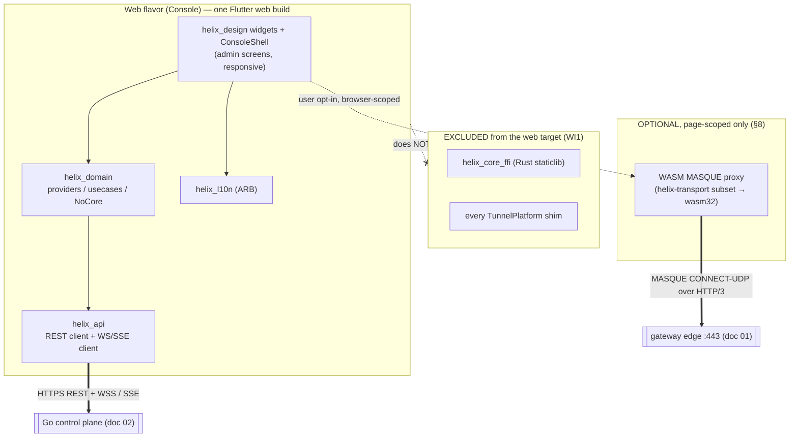
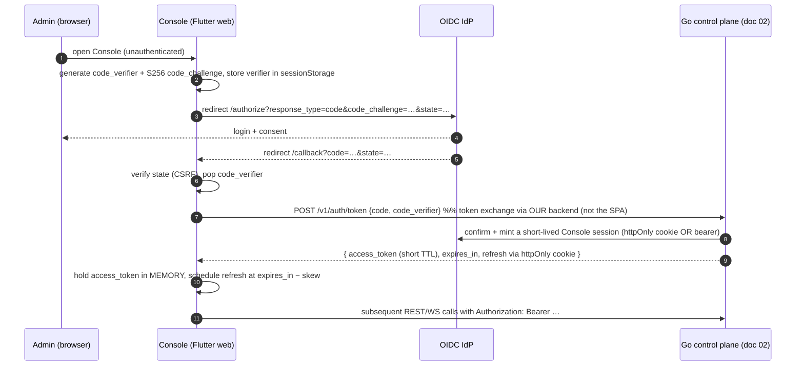
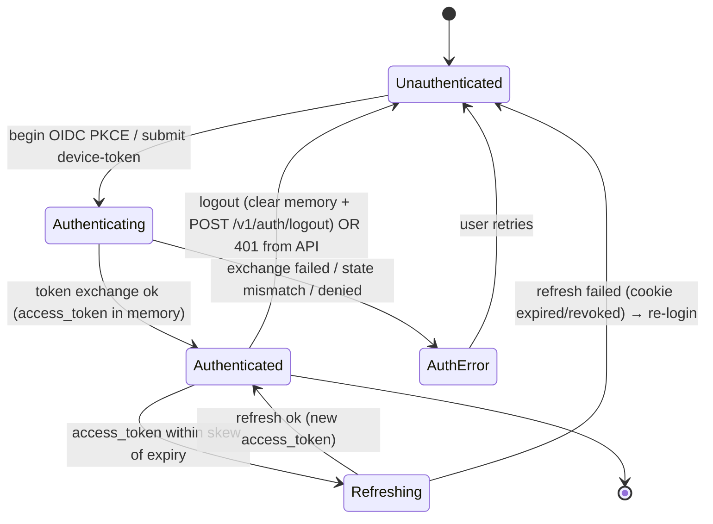
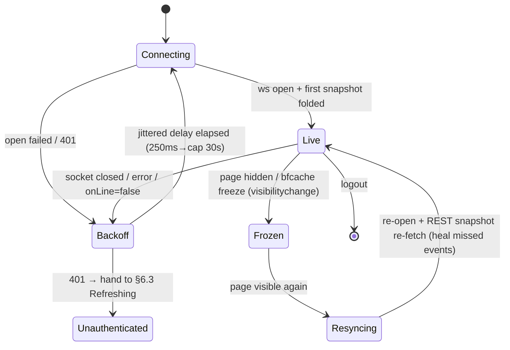
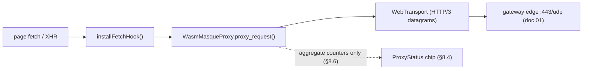

# Web Console (no tunnel)

**Revision:** 1
**Last modified:** 2026-06-25T00:00:00Z

> Master technical specification — Volume 4 (Clients), nano-detail deep-dive.
> This document **deepens** the *Helix Console builds to Web (API-only, no
> `core_ffi`)* and the *optional in-page WASM MASQUE proxy* parts of the pass-1
> client overview [04_UI §5.7, §6, 03-CLIENT §5.7/§6/CI3] into an
> implementation-ready specification of the **Web flavor**: the build-time
> exclusion of every tunnel surface, the `NoCore` null-object contract, the
> responsive admin UI, browser auth (OIDC + anonymous device-token), the
> `helix_api` REST + WS/SSE consumption with its reconnect state machine, and the
> **browser-scoped WASM MASQUE proxy** (explicitly *not* a system VPN).
> SPEC-ONLY: it describes **what to build**, not the shipping product.
>
> **Boundary with sibling docs.** This document **consumes**: the FFI surface +
> `TunnelStatus` enum owned by `03-client-core-and-ui.md` §3 [03-CLIENT §3]; the
> orchestrator `TunnelStatus` source-of-truth in `v02-data-plane/
> orchestrator-and-state.md` §4.1 [ORCH §4.1]; the `Transport` trait owned by
> `v02-data-plane/transport-trait.md` [TX-TRAIT]; the control-plane REST/WS
> contract owned by doc `02`. It **owns**: the Web-flavor build manifest, the
> `NoCore`/no-`TunnelPlatform` contract, the Console session + WS-reconnect state
> machines, browser auth lifecycle, and the WASM MASQUE proxy contract.
>
> **Evidence base, cited inline by id.** `[04_UI §N]` =
> `04_VPN_CLD/HelixVPN-helix-ui-Flutter.md`; `[04_ARCH §N]` =
> `04_VPN_CLD/HelixVPN-Architecture-Refined.md`; `[03-CLIENT §N]` =
> `final/03-client-core-and-ui.md`; `[ORCH §N]` = `v02-data-plane/
> orchestrator-and-state.md`; `[TX-TRAIT]` = `v02-data-plane/transport-trait.md`;
> `[SYN §N]` = `final/.../v09-research/_SYNTHESIS.md`; `[research-flutter_ffi]`,
> `[research-ios_android]` = cited research digests; `[05_YBO]` = operator
> mandate. Any claim not grounded in the evidence base is marked **UNVERIFIED**
> per constitution §11.4.6.

---

## Table of contents

- [0. Position, ownership, invariants](#0-position-ownership-invariants)
- [1. The structural fact: no system TUN in a browser](#1-the-structural-fact-no-system-tun-in-a-browser)
- [2. The Web-flavor build manifest (what compiles, what is excluded)](#2-the-web-flavor-build-manifest-what-compiles-what-is-excluded)
- [3. The `NoCore` null-object contract](#3-the-nocore-null-object-contract)
- [4. Console capability gating + `runHelixApp` web path](#4-console-capability-gating--runhelixapp-web-path)
- [5. Responsive admin UI](#5-responsive-admin-ui)
- [6. Auth — OIDC + anonymous device-token (browser lifecycle)](#6-auth--oidc--anonymous-device-token-browser-lifecycle)
- [7. `helix_api` consumption — REST + WS/SSE + reconnect state machine](#7-helix_api-consumption--rest--wsse--reconnect-state-machine)
- [8. The optional in-page WASM MASQUE proxy (caveat surface)](#8-the-optional-in-page-wasm-masque-proxy-caveat-surface)
- [9. Memory / size / performance budgets (Web)](#9-memory--size--performance-budgets-web)
- [10. Error handling & edge cases](#10-error-handling--edge-cases)
- [11. Test points (mapped to §11.4.169 test-type set)](#11-test-points-mapped-to-1141169-test-type-set)
- [12. Phase → task → subtask plan](#12-phase--task--subtask-plan)
- [13. Open decisions surfaced by this document](#13-open-decisions-surfaced-by-this-document)
- [14. Cross-document contracts this document fixes](#14-cross-document-contracts-this-document-fixes)
- [Sources verified](#sources-verified)

---

## 0. Position, ownership, invariants

The **Web flavor is the Helix Console only** — the admin app (tenants, users,
devices, networks, routes, policies, audit, billing-optional) [04_ARCH §2 roles,
04_UI §8.3]. Access and Connector **do not** build to Web, because a browser
cannot open a system TUN device (§1). The Web flavor is the *single* flavor that
omits `helix_core_ffi` and ships **no `TunnelPlatform` implementation**
[03-CLIENT CI3, 04_UI §1/§5.7]. Optionally, a Console page may host a
**browser-scoped WASM MASQUE proxy** that tunnels *only the page/browser's own*
fetch traffic — never the OS (§8) [04_ARCH §5.7].

### 0.1 What this document owns

| # | Contract | §  |
|---|---|---|
| C1 | **Web-flavor build manifest** — the exact set of packages that compile (`helix_design`, `helix_api`, `helix_domain`, `helix_l10n`) and the exact set excluded (`helix_core_ffi`, every `TunnelPlatform` shim) | §2 |
| C2 | **`NoCore` null-object** — the compile-time stand-in for `HelixCore` when `Capability.tunnel` is absent; every method throws `UnsupportedOnWeb`, never silently no-ops | §3 |
| C3 | **Console session + auth lifecycle** — OIDC code-flow (PKCE) + anonymous device-token, token storage, refresh, logout, the session state machine | §6 |
| C4 | **`helix_api` consumption + WS/SSE reconnect state machine** — the reactive admin data layer driven by the control-plane event stream | §7 |
| C5 | **WASM MASQUE proxy contract** — `WasmMasqueProxy` Dart facade + the `wasm-bindgen` exports it drives; its own `ProxyStatus` enum (distinct from `TunnelStatus`); the honest "not a VPN" boundary | §8 |

### 0.2 What this document does NOT own

- The REST/WS schema, `WatchNetworkMap`, enrollment, `device.revoked` taxonomy —
  doc `02` (this doc *consumes* the generated `helix_api` client).
- The `TunnelStatus`/`Shields`/`ExitOption` FFI types — `03-CLIENT §3` (Console
  links none of them; the WASM proxy defines its *own* status type, §8.4).
- The `Transport` trait, MASQUE/`quinn`+`h3` internals — `[TX-TRAIT]` / doc `01`
  (the WASM proxy compiles a *subset* of `helix-transport` to `wasm32`, §8.2).
- `helix_design` tokens / signature components — `03-CLIENT §7` (Console reuses
  them; the connection-state palette is reused for the proxy chip only).

### 0.3 Invariants this document inherits and tightens

| # | Invariant | Source | Web-Console tightening |
|---|---|---|---|
| WI1 | Console depends on `helix_api` **only** — never `helix_core_ffi`; this is what lets it build to Web. | [03-CLIENT CI3, 04_UI §1] | §2: a build that links `helix_core_ffi` into the web target is a **build-blocking** drift finding (§2.3). |
| WI2 | **No system tunnel in a browser** — structural, not a missing feature (§11.4.112). | [04_ARCH §5.7] | §1: stated to the user in-product; the WASM proxy is page-scoped only. |
| WI3 | **UI is a pure function of a stream** — Console folds the WS/SSE event stream, not polling. | [03-CLIENT CI2, 04_UI §4.3] | §7: the same honesty rule applied to admin data; stale data is *labelled* stale, never silently shown as live. |
| WI4 | **State announced, not just colored** — a11y + safety. | [03-CLIENT CI5, 04_UI §9] | §5/§8.4: the proxy on/off and every "online/offline" badge carry a semantic label + icon, not color alone. |
| WI5 | **The WASM proxy is browser-scoped, evidence-honest** — it MUST NOT claim to protect the device. | [04_ARCH §5.7] | §8.5: the proxy UI text + the `ProxyStatus` enum forbid any "device protected" wording. |
| WI6 | **No secrets in JS-reachable storage beyond what the flow requires; no durable connection log.** | [SYN §7] | §6.4: tokens in memory + `sessionStorage` (not `localStorage`) by default; the WASM proxy keeps aggregate counters only (§8.6). |



---

## 1. The structural fact: no system TUN in a browser

A browser process **cannot** create or own a TUN/utun device, install routes,
or set system DNS — there is no Web API for it, by sandbox design [04_ARCH §5.7,
03-CLIENT §5.7]. Per constitution §11.4.112, this is a **structural
impossibility**, not unimplemented work: the Console therefore ships **no
`TunnelPlatform` implementation and no `helix_core_ffi` dependency** on Web. The
in-product copy states this plainly (WI2/WI5): *"On the web, Helix Console
manages your networks. To protect this device, install the Helix Access app."*

What a browser **can** do (and only this): open **MASQUE CONNECT-UDP over
HTTP/3** sockets from page JavaScript/WASM to the gateway edge, and rewrite the
**page's own** outbound `fetch`/`XMLHttpRequest` through them — a *browser-scoped
proxy*, not a device VPN (§8). The boundary is load-bearing and never blurred.

> **Honest boundary (§11.4.6, §11.4.112).** "Fully responsive web app" [05_YBO]
> = the Console **plus** an optional browser-scoped proxy. It is **never** a
> system-wide tunnel. A reopen of this verdict requires NEW evidence a browser
> gained TUN access (§11.4.7 / §11.4.34) — not a re-derivation.

---

## 2. The Web-flavor build manifest (what compiles, what is excluded)

### 2.1 Package set (melos workspace, web target) [04_UI §1, 03-CLIENT §2]

```yaml
# apps/console/pubspec.yaml — the Web flavor's dependency closure
name: helix_console
dependencies:
  helix_design:  { path: ../../packages/helix_design }   # tokens, theme, widgets, a11y
  helix_api:     { path: ../../packages/helix_api }       # generated REST + WS/SSE client (doc 02)
  helix_domain:  { path: ../../packages/helix_domain }    # providers, usecases, runHelixApp, NoCore
  helix_l10n:    { path: ../../packages/helix_l10n }      # ARB localization
  flutter_riverpod: ^2.x
  # NOTE: helix_core_ffi is DELIBERATELY ABSENT (WI1). It is NOT a transitive dep of any of the above.
flutter:
  uses-material-design: true
```

`helix_domain` MUST be authored so that **none** of its web-reachable code paths
import `helix_core_ffi`. The dependency is provided *only* to Access/Connector;
`helix_domain` references the core through an **interface** (`HelixCore`, §3)
that the Web build satisfies with `NoCore`. This is the standard
null-object/dependency-inversion pattern [research-flutter_ffi].

### 2.2 Conditional import seam (so one `helix_domain` serves all flavors)

```dart
// helix_domain/lib/src/core/core_factory.dart
// Dart conditional imports pick the platform-correct factory at compile time.
import 'core_factory_stub.dart'
    if (dart.library.io)  'core_factory_io.dart'    // mobile/desktop → RealHelixCore (links core_ffi)
    if (dart.library.js_interop) 'core_factory_web.dart'; // web → NoCore (never references core_ffi)

abstract interface class CoreFactory {
  HelixCore create(Set<Capability> caps);
}
```

```dart
// helix_domain/lib/src/core/core_factory_web.dart  — the WEB compilation unit
// CRITICAL: this file MUST NOT import helix_core_ffi (would pull the staticlib into the web build).
import 'no_core.dart';
class CoreFactoryWeb implements CoreFactory {
  @override HelixCore create(Set<Capability> caps) => const NoCore();
}
```

> **Why a conditional import and not a runtime `if`:** a runtime branch still
> *links* `helix_core_ffi` into the web bundle (dead weight + a `dart:ffi`
> reference that does not compile to Wasm/JS). The `if (dart.library.js_interop)`
> seam means the web compiler never sees the FFI unit at all
> [research-flutter_ffi].

### 2.3 Drift gate (the no-FFI-on-web guarantee)

A pre-build gate `CM-WEB-NO-CORE-FFI` (§11.4.110 clash-detector class) asserts:
the `flutter build web` dependency graph for `apps/console` contains **zero**
`package:helix_core_ffi/*` imports and zero `dart:ffi` references. A violation is
a **build-blocking** finding (WI1). Paired §1.1 mutation: add a `helix_core_ffi`
import to a console-reachable file → gate FAILs (§11). This is the mechanical
form of CI3.

### 2.4 Web build configuration

| Concern | Value | Rationale |
|---|---|---|
| Renderer | **CanvasKit** (default) for fidelity; **Wasm/`--wasm`** when the toolchain target supports it for the heavy admin tables | [04_UI §10.web, 04_ARCH §5.6] |
| Routing | URL-strategy = path (clean URLs); route-level **deferred loading** of heavy admin modules (`deferred as topology`) | [04_UI §7] |
| CSP | strict `Content-Security-Policy`; the WASM proxy module loaded under a nonce'd `script-src` + `wasm-unsafe-eval` only when the proxy capability is enabled (§8.3) | security |
| Base href | configurable for sub-path hosting behind the gateway's reverse proxy | deploy flexibility |

---

## 3. The `NoCore` null-object contract

`helix_domain` references the tunnel core through the `HelixCore` interface
[03-CLIENT §3.2]. On Web, `Capability.tunnel` is absent, so the provider is
overridden with `NoCore` — a null object whose every method **throws a typed,
honest error**, never silently succeeds (WI2; §11.4.6 no-bluff: a no-op that
returned a fake `Connected` would be a PASS-bluff).

```dart
// helix_domain/lib/src/core/no_core.dart
import 'package:helix_domain/src/core/helix_core.dart'; // the interface ONLY (no ffi)

/// Thrown by every NoCore method. The UI must never display "connected" on web.
final class UnsupportedOnWeb implements Exception {
  final String op;
  const UnsupportedOnWeb(this.op);
  @override String toString() =>
      'UnsupportedOnWeb: "$op" — Helix Console (web) has no system tunnel; '
      'install Helix Access to protect this device. (WI2, §11.4.112)';
}

final class NoCore implements HelixCore {
  const NoCore();

  // status stream is a SINGLE-element stream emitting the honest terminal state, then closes.
  // It never emits Connecting/Connected — the web build has no tunnel to report (WI2).
  @override
  Stream<TunnelStatus> statusStream() =>
      Stream.value(const TunnelStatus.disconnected()); // const, never updated

  @override Future<void> start({required String transport, String? mapPathOrSession,
      CoreMode mode = CoreMode.client}) async => throw const UnsupportedOnWeb('start');
  @override Future<void> stop() async => throw const UnsupportedOnWeb('stop');
  @override Future<List<ExitOption>> exits() async => throw const UnsupportedOnWeb('exits');
  @override Future<void> setExit(String id, {List<String>? multiHopChain}) async
      => throw const UnsupportedOnWeb('setExit');
  @override Future<void> setShields(Shields s) async => throw const UnsupportedOnWeb('setShields');
  @override Future<AdvertiseResult> advertise(List<String> cidrs) async
      => throw const UnsupportedOnWeb('advertise');
  @override Future<void> attachTun(int fd) async => throw const UnsupportedOnWeb('attachTun');
  @override Future<void> detachTun() async => throw const UnsupportedOnWeb('detachTun');
}
```

> **`TunnelStatus` consistency note.** The Dart `TunnelStatus` here is the
> *same* generated mirror Access/Connector use [03-CLIENT §3.1] — Console links
> the **type** (a tiny generated Dart enum, no Rust staticlib) but never the
> tunnel implementation. The canonical Rust source is the orchestrator's
> 5-variant enum `Connecting | Handshaking | Connected{transport,rtt_ms} |
> Reconnecting | Down{reason}` [ORCH §4.1], which `03-CLIENT §3.1` extends to
> 7 variants (`Disconnected`, `Connected{…,path}`, `Danger{kind}`). `NoCore`
> only ever uses `Disconnected`. The byte-for-byte FFI contract test
> [03-CLIENT §12] still applies to the *type definition* even on web.

The Console UI **never** renders a `ConnectButton`/`ShieldIndicator`
(`Capability.tunnel` tree-shakes them out, §4); `NoCore` exists purely so that
any accidental call surfaces as a loud typed error in tests rather than a silent
fake-success.

---

## 4. Console capability gating + `runHelixApp` web path

The Console entrypoint sets `capabilities: {Capability.admin}` only — no
`Capability.tunnel`, so `helixCoreProvider` resolves to `NoCore` and every
tunnel widget is tree-shaken [03-CLIENT §6, 04_UI §2.console].

```dart
// apps/console/lib/main_console.dart
void main() => runHelixApp(
  flavor: HelixFlavor.console,
  home: const ConsoleShell(),                 // tenants/devices/networks/policy/audit/topology
  capabilities: const {Capability.admin},     // NO Capability.tunnel → NoCore, no core_ffi (CI3)
);
```

```dart
// helix_domain/lib/run_helix_app.dart  (the web branch of the shared wiring point)
Future<void> runHelixApp({
  required HelixFlavor flavor,
  required Widget home,
  required Set<Capability> capabilities,
}) async {
  final factory = const CoreFactory.platform();   // §2.2 conditional import → CoreFactoryWeb on web
  final container = ProviderContainer(overrides: [
    flavorProvider.overrideWithValue(flavor),
    capabilitiesProvider.overrideWithValue(capabilities),
    // web: factory.create({admin}) returns NoCore (no Capability.tunnel) — never a RealHelixCore.
    helixCoreProvider.overrideWith((ref) => factory.create(capabilities)),
    // tunnelPlatformProvider is NULL on web — there is no TunnelPlatform impl (WI1):
    tunnelPlatformProvider.overrideWith((ref) =>
      capabilities.contains(Capability.tunnel) ? resolveShim() : const NoTunnelPlatform()),
  ]);
  runApp(UncontrolledProviderScope(container: container,
    child: HelixApp(home: home, theme: helixTheme(flavor))));   // Console theme (§5)
}
```

```dart
// helix_domain/lib/src/core/no_tunnel_platform.dart — web has no shim (WI1)
final class NoTunnelPlatform implements TunnelPlatform {
  const NoTunnelPlatform();
  @override Future<void> startTunnel(TunnelConfig cfg) async => throw const UnsupportedOnWeb('startTunnel');
  @override Future<void> stopTunnel() async => throw const UnsupportedOnWeb('stopTunnel');
  @override Stream<PlatformTunnelEvent> events() => const Stream.empty();
}
```

| Capability | Compiles in (web) | Notes |
|---|---|---|
| `admin` | tenants/devices/networks/policy/audit/topology screens + `helix_api` heavy tables | the only Console capability [03-CLIENT §6] |
| `tunnel` | **absent** → `ConnectButton`, `ShieldIndicator`, `ExitPicker`, `helix_core_ffi`, every shim tree-shaken | CI3 / WI1 |
| `proxyWasm` (optional, §8) | the WASM MASQUE proxy module + its on/off chip; deferred-loaded; gated behind a build flag + CSP | Phase 3; never implies a device tunnel |

---

## 5. Responsive admin UI

The Console reuses `helix_design` [03-CLIENT §7] and renders an `AdaptiveScaffold`
that reflows on **width**, never on `Platform.isX`, so a resized desktop window
behaves like a phone and "web just works" [04_UI §7].

```dart
// breakpoints (identical to the shared rule, 03-CLIENT §7.3) — branch on SIZE
compact  (< 600)    → BottomNavigationBar · single pane
medium   (600–1024) → NavigationRail · master/detail
expanded (> 1024)   → extended NavigationRail · multi-pane (list | detail | live events)
```

### 5.1 Console shell + input model

- **`ConsoleShell`** hosts the NavigationRail (Tenants · Devices · Networks ·
  Policy · Audit · Topology) and a multi-pane body on `expanded`.
- **Pointer + keyboard first** on desktop/web: `⌘K`/`Ctrl-K` command palette
  (jump-to-device, jump-to-network, run-policy-diff), full keyboard nav, focus
  rings [04_UI §7, §9].
- **Deferred loading** of the heavy modules (`PolicyEditor`, topology graph,
  audit table) via `deferred as` imports so first paint is fast (§9) [04_UI §7].
- **Live, never polled** (WI3): device lists / topology / audit fold the WS/SSE
  stream (§7) — a refresh button forces a snapshot re-fetch but the steady state
  is push-driven.

### 5.2 Signature components reused

| Component | Console use | Driven by |
|---|---|---|
| `NetworkTile` | a joined network row (connector health, advertised CIDRs, access level) | `helix_api` + WS `route.changed` |
| `PolicyEditor` | ACL editing with **effect-diff** preview + version history + one-click rollback | `helix_api` policy endpoints (doc `02`) |
| `AdaptiveScaffold` | the responsive shell | layout width |
| `StatusChip` | reused **only** by the optional WASM proxy chip (§8.4) — NOT a tunnel status | `ProxyStatus` (§8.4) |

### 5.3 Accessibility (WI4, CI5)

Every "online/offline / healthy/degraded / protected-page/unprotected" indicator
carries a **semantic label + icon shape**, never color alone [04_UI §9]: e.g. a
degraded connector is announced *"warehouse-gw: degraded"* with a warning glyph,
not just amber. Light + dark are both first-class (admins skew dark) [04_UI §3.1].

---

## 6. Auth — OIDC + anonymous device-token (browser lifecycle)

The Console authenticates the **admin user** (not a device tunnel). Two paths
[04_ARCH §4.2 `users`, 04_UI §8.2]: **OIDC** (managed orgs) and **anonymous
device-token** (self-host / homelab, no PII). The browser context constrains the
token handling more tightly than the native apps (XSS surface), so this section
fixes the web-specific lifecycle.

### 6.1 OIDC authorization-code flow with PKCE (browser-correct)



- **PKCE (S256) is mandatory** for the browser (public client) — no client
  secret ships in JS [research-flutter_ffi: SPA auth best practice; **UNVERIFIED**
  exact IdP product, gated on the §02 identity choice].
- **Token exchange goes through the Helix backend** (`POST /v1/auth/token`), not
  the SPA directly, so the refresh token can live in an **`httpOnly`,
  `Secure`, `SameSite=Strict` cookie** the JS never reads (XSS mitigation).
- `state` is verified on callback (CSRF); `nonce` echoed if the IdP returns an
  id_token.

### 6.2 Anonymous device-token (self-host)

For homelab/self-host with no IdP, the admin presents a **bootstrap admin token**
minted by `helixvpnctl init` [04_ARCH §10] (or a QR/enroll-token). The Console
exchanges it once at `POST /v1/auth/token {device_token}` for the same
short-lived session shape. No email/PII is stored (WI6) [04_UI §8.2].

### 6.3 Session state machine



### 6.4 Token storage policy (the web-specific hardening, WI6)

| Material | Storage | Rationale |
|---|---|---|
| `access_token` (short TTL) | **in-memory only** (Riverpod state) | not readable after tab close; minimal XSS exfil window |
| `refresh_token` | **`httpOnly Secure SameSite=Strict` cookie** (server-set) | JS cannot read it (XSS) |
| `code_verifier`, `state`, `nonce` | `sessionStorage` (cleared on tab close) | flow-scoped, single-use |
| PII (anonymous mode) | **none** | WI6, §11.4.10 |

`localStorage` is **never** used for tokens (persists across XSS, survives tab
close). On `401` from any REST/WS call, the session machine transitions to
`Refreshing`; a failed refresh forces `Unauthenticated` and a re-login
[research-flutter_ffi]. **UNVERIFIED:** whether the deployment fronts the Console
with the gateway reverse proxy doing the cookie handling vs the Go API directly —
recorded as a follow-up (§13 D-WEB-2), default = behind the gateway.

### 6.5 Auth controller (Dart, Riverpod)

```dart
// helix_domain/lib/src/auth/auth_controller.dart
final authProvider = AsyncNotifierProvider<AuthController, Session>(AuthController.new);

class AuthController extends AsyncNotifier<Session> {
  @override Future<Session> build() async => Session.unauthenticated();

  Future<void> beginOidc() async { /* PKCE: store verifier, redirect to /authorize */ }
  Future<void> completeOidc(Uri callback) async {
    _verifyState(callback);                                  // CSRF (§6.1)
    final code = callback.queryParameters['code']!;
    final tok = await ref.read(authApiProvider).exchange(code: code, verifier: _popVerifier());
    state = AsyncData(Session.authenticated(tok));
    _scheduleRefresh(tok.expiresIn);                         // §6.3 Refreshing
  }
  Future<void> loginWithDeviceToken(String t) async { /* POST /v1/auth/token {device_token} */ }
  Future<void> refresh() async { /* uses httpOnly cookie; on fail → unauthenticated */ }
  Future<void> logout() async { /* clear memory + POST /v1/auth/logout (clears cookie) */ }
}
```

---

## 7. `helix_api` consumption — REST + WS/SSE + reconnect state machine

The Console's data layer is `helix_api` (generated OpenAPI REST + a WS/SSE
client) folded into Riverpod, exactly the [03-CLIENT §8.3] Console live-data
pattern. This document fixes the **web reconnect state machine** (the browser's
WebSocket lifecycle differs from native: bfcache freeze, tab visibility,
network-change events).

### 7.1 REST layer

`helix_api` is the generated client; every call carries the
`Authorization: Bearer <access_token>` from §6 and surfaces typed errors. CRUD
on tenants/users/devices/networks/routes/policies/audit [04_ARCH §6, 04_UI §8.3].

```dart
final devicesProvider = FutureProvider<List<Device>>((ref) async {
  final api = ref.watch(restClientProvider);                // generated, auth-injected
  return api.listDevices(tenantId: ref.watch(currentTenantProvider));
});
```

### 7.2 WS/SSE live event fold (push, never poll — WI3)

```dart
// helix_domain/lib/src/live/event_stream_provider.dart
final eventStreamProvider = StreamProvider<ControlEvent>((ref) {
  final ws = ref.watch(wsClientProvider);                   // GET /v1/stream (doc 02)
  return ws.events();                                       // device.online | route.changed | policy.compiled | device.revoked
});

// folded views update live:
final deviceListProvider = NotifierProvider<DeviceListNotifier, List<Device>>(DeviceListNotifier.new);
class DeviceListNotifier extends Notifier<List<Device>> {
  @override List<Device> build() {
    ref.listen(eventStreamProvider, (_, ev) => ev.whenData(_apply)); // fold events into the list
    return ref.watch(devicesProvider).valueOrNull ?? const [];        // seed from REST snapshot
  }
  void _apply(ControlEvent e) { /* online/offline/route/policy/revoke → mutate state */ }
}
```

The Console event taxonomy is doc `02`'s Phase-1 set (`device.online`,
`route.changed`, `policy.compiled`, `device.revoked`) made visible [04_UI §4.3].

### 7.3 WS reconnect state machine (browser lifecycle aware)



| Trigger | Handling | Why |
|---|---|---|
| socket close / `error` | enter `Backoff`; jittered exp (base 250 ms, cap 30 s, full jitter) — **mirrors the data-plane backoff shape** [ORCH §7.2] | avoid thundering-herd on a gateway restart |
| `navigator.onLine = false` | pause re-dials until `online` event | browsers fire offline/online; don't burn retries |
| `visibilitychange → hidden` / bfcache | enter `Frozen`; do **not** mark data stale yet (a hidden tab is normal) | UX |
| `visibilitychange → visible` | `Resyncing`: re-open WS **and re-fetch the REST snapshot** to heal any events missed while frozen | correctness — WS gaps are not replayed |
| `401` on WS upgrade | hand to §6.3 `Refreshing`, then retry | token expiry mid-session |

> **Staleness honesty (WI3, §11.4.6).** While in `Backoff`/`Frozen`/`Resyncing`,
> the affected panes show a **"reconnecting… last updated HH:MM:SS"** banner —
> the UI never paints stale admin data as live. A device shown "online" whose
> last event is older than the staleness budget is labelled, not silently
> trusted (the admin-data analogue of the §8.4 Access honesty rule).

---

## 8. The optional in-page WASM MASQUE proxy (caveat surface)

A Console page **may** host a **browser-scoped MASQUE proxy** that tunnels *only
the page's / browser's own* outbound HTTP(S) to a joined network — **not** a
system VPN [04_ARCH §5.7, 03-CLIENT §5.7]. This is a Phase-3, opt-in, clearly
labelled feature. Its honesty is constitutional (WI5; §11.4.112): the UI and the
type system both forbid any "device protected" claim.

### 8.1 What it is and is NOT

| It IS | It is NOT |
|---|---|
| a page-scoped proxy: the Console's own `fetch`/XHR (and optionally same-origin app traffic) routed via MASQUE CONNECT-UDP/H3 to the gateway | a system TUN / OS VPN |
| a reuse of the **`helix-transport`** MASQUE client compiled to `wasm32-unknown-unknown` | a re-implementation of WG/transport in JS |
| evidence-honest: a `ProxyStatus` chip, aggregate counters only | a leak-proof device kill-switch (browser cannot enforce that) |

### 8.2 The WASM module (helix-transport subset → `wasm32`)

The proxy compiles the **MASQUE CONNECT-UDP** path of `helix-transport`
[TX-TRAIT, 04_ARCH §3.3] to WebAssembly via `wasm-bindgen`. It uses the browser's
**WebTransport** API (HTTP/3 datagrams) as the carrier where available; **UNVERIFIED**:
the exact browser WebTransport ↔ MASQUE CONNECT-UDP mapping is recorded as a
Phase-3 research item (§13 D-WEB-1) — the spike must prove a browser can drive
the gateway's `:443/udp` MASQUE endpoint, or the feature degrades to "not
available in this browser" (honest SKIP, never a fake proxy).

```rust
// helix-transport/src/wasm/masque_proxy.rs  — wasm-bindgen exported surface (browser-only build)
// Compiled with: wasm-pack build --target web --no-default-features --features "masque,wasm"
use wasm_bindgen::prelude::*;

#[wasm_bindgen]
pub struct WasmMasqueProxy { /* opaque: quinn-over-WebTransport session + CONNECT-UDP stream */ }

#[wasm_bindgen]
impl WasmMasqueProxy {
    /// gateway_url = "https://gw.example:443" ; session = the §6 Console session token.
    #[wasm_bindgen(constructor)]
    pub fn new(gateway_url: String, session_token: String) -> WasmMasqueProxy { /* … */ }

    /// Open the MASQUE CONNECT-UDP session. Resolves when the H3 datagram flow is up.
    #[wasm_bindgen]
    pub async fn start(&self) -> Result<(), JsValue>;       // Err = honest failure (no fake "up")

    /// Tear down the session; flushes counters. Idempotent.
    #[wasm_bindgen]
    pub async fn stop(&self) -> Result<(), JsValue>;

    /// Proxy ONE outbound request's bytes through the tunnel; returns the response bytes.
    /// The page's fetch hook (§8.3) calls this. Browser-scoped only.
    #[wasm_bindgen]
    pub async fn proxy_request(&self, req: web_sys::Request) -> Result<web_sys::Response, JsValue>;

    /// JSON status snapshot: { state, carrier, rtt_ms, bytes_in, bytes_out } — aggregate only (§8.6).
    #[wasm_bindgen]
    pub fn status(&self) -> JsValue;
}
```

### 8.3 Dart facade + fetch interception

```dart
// apps/console/lib/proxy/wasm_masque_proxy.dart  (loaded ONLY when Capability.proxyWasm, §4)
import 'dart:js_interop';

@JS('WasmMasqueProxy')
extension type _JsProxy._(JSObject _) implements JSObject {
  external _JsProxy(String gatewayUrl, String sessionToken);
  external JSPromise start();
  external JSPromise stop();
  external JSPromise<JSObject> proxyRequest(JSObject request);
  external JSObject status();
}

final class WasmMasqueProxy {
  final _JsProxy _p;
  WasmMasqueProxy(String gw, String session) : _p = _JsProxy(gw, session);

  Future<void> start() async => (await _p.start().toDart);     // throws on failure (no fake up)
  Future<void> stop()  async => (await _p.stop().toDart);
  ProxyStatus status() => ProxyStatus.fromJson(_p.status().dartify()! as Map);

  /// Install a fetch hook so the PAGE's requests go through the tunnel. Browser-scoped (WI5).
  void installFetchHook() { /* monkey-patch window.fetch → _p.proxyRequest, page scope only */ }
  void removeFetchHook()  { /* restore original fetch on stop */ }
}
```

- The WASM module + its `wasm-unsafe-eval` CSP allowance load **only** when the
  `proxyWasm` capability is on (§4) and behind a nonce'd `script-src` (§2.4).
- The fetch hook is **page-scoped**: it rewrites `window.fetch` for the Console
  tab only. It does **not** and **cannot** intercept other tabs, other apps, or
  the OS (WI5).

### 8.4 `ProxyStatus` — a DISTINCT type from `TunnelStatus`

The proxy MUST NOT reuse `TunnelStatus` (that type implies a *device* tunnel and
drives the `stateConnected` "you are protected" palette). It defines its own:

```dart
// apps/console/lib/proxy/proxy_status.dart
sealed class ProxyStatus {
  const ProxyStatus();
}
final class ProxyOff       extends ProxyStatus { const ProxyOff(); }
final class ProxyStarting  extends ProxyStatus { const ProxyStarting(); }
final class ProxyOn        extends ProxyStatus {                 // page-scoped, NOT a device VPN
  final String carrier;   // "masque-h3"
  final int rttMs;
  const ProxyOn(this.carrier, this.rttMs);
}
final class ProxyUnavailable extends ProxyStatus {              // browser lacks WebTransport, etc.
  final String reason;    // honest SKIP reason (§11.4.3)
  const ProxyUnavailable(this.reason);
}
final class ProxyError     extends ProxyStatus { final String detail; const ProxyError(this.detail); }
```

The proxy chip label is explicit: **"Browser proxy: ON · masque-h3 · 23ms"** with
a sub-line *"this tab only — not a device VPN"* (WI5). It reuses `StatusChip`
(§5.2) and the `stateConnecting`/`stateConnected` *amber/green motion* for ON,
but never the word "protected" and never the full-screen `ConnectButton`.

### 8.5 The honesty boundary (WI5, §11.4.112)

| Forbidden wording / behaviour | Required instead |
|---|---|
| "Your device is protected" / "VPN on" | "Browser proxy on (this tab only)" |
| a system-wide kill-switch claim | "browser-scoped; other apps are not tunnelled" |
| painting the device-`Connected` green full-bleed | the scoped chip only |
| silent fallback to no-proxy while showing "on" | `ProxyUnavailable{reason}` honest SKIP |

### 8.6 No-logging by construction (WI6, I5)

The WASM proxy keeps **aggregate counters only** (`bytes_in`, `bytes_out`,
`rtt_ms` EWMA, escalation count) — never per-request URLs, never durable
records, mirroring the data-plane no-logging rule [SYN §7, ORCH §4.5]. `status()`
exposes only those aggregates.

### 8.7 Memory (the browser-tab analogue of the iOS NE ceiling)



A browser tab has no hard ~15 MB ceiling like the iOS NE [03-CLIENT CI4], but the
WASM heap is still budgeted: cap QUIC flow-control windows in the wasm build,
bound the in-flight datagram buffers, and refuse (with `ProxyUnavailable`) rather
than OOM the tab (§9). **UNVERIFIED:** measured WASM RSS under sustained transfer
— a Phase-3 soak gate analogous to G3 (§11, §12).

---

## 9. Memory / size / performance budgets (Web)

| Budget | Target | How |
|---|---|---|
| Initial bundle (Console, no proxy) | first paint fast; main bundle lean | route-level **deferred loading** of topology/policy/audit; tree-shake icons/fonts; **no `core_ffi` weight** (WI1) [04_UI §10.web] |
| Renderer | fidelity + speed | CanvasKit default; `--wasm` for heavy tables where supported (§2.4) |
| Heavy admin modules | never block first paint | `deferred as` imports; load on route entry |
| WASM proxy module | loaded **only** on `proxyWasm` opt-in | not in the base bundle; gated by CSP (§8.3) |
| Proxy WASM heap | bounded, refuse-not-OOM | capped QUIC windows + bounded datagram buffers (§8.7) |
| Live data | push, not poll | WS/SSE fold (§7); no polling loops burning the event loop (WI3) |

**Non-negotiable (CI6):** never Electron, never webview-wrap — the Console is a
real Flutter web app [04_UI §10, 03-CLIENT CI6]. The whole point of excluding
`core_ffi` (WI1) is that the Web bundle stays lean precisely because it carries no
tunnel core.

---

## 10. Error handling & edge cases

| # | Edge case | Handling | Source |
|---|---|---|---|
| E1 | A `Capability.tunnel` widget reached on web (bug) | `NoCore` throws `UnsupportedOnWeb` → loud test failure, never a fake `Connected` | §3, WI2 |
| E2 | `helix_core_ffi` accidentally imported into a console path | `CM-WEB-NO-CORE-FFI` build gate FAILs (§2.3) | §2.3, WI1 |
| E3 | OIDC `state` mismatch on callback | `AuthError`; discard code; do not exchange (CSRF defence) | §6.1 |
| E4 | `access_token` expiry mid-session | session machine `Refreshing`; transparent retry; failed refresh → re-login | §6.3 |
| E5 | WS dropped while tab hidden (bfcache) | `Frozen` → on visible `Resyncing` re-fetches REST snapshot to heal missed events | §7.3 |
| E6 | `navigator.onLine = false` | pause re-dials; resume on `online` event (don't burn backoff) | §7.3 |
| E7 | Browser lacks WebTransport / MASQUE path | proxy → `ProxyUnavailable{reason}` (honest SKIP), feature greyed out, never a fake proxy | §8.2/§8.4 |
| E8 | Proxy WASM nears tab memory budget | refuse new flows with `ProxyError`/`ProxyUnavailable`, never OOM the tab | §8.7 |
| E9 | `401` from a REST call | route to §6.3 `Refreshing`; on fail force `Unauthenticated` | §6.4 |
| E10 | Stale admin data during reconnect | "reconnecting… last updated HH:MM:SS" banner; never paint stale as live | §7.3, WI3 |
| E11 | `device.revoked` event arrives | fold into device list live; if it is the *current admin's* session-tied device in anonymous mode, force re-auth | §7.2 |
| E12 | Sub-path hosting behind gateway reverse proxy | configurable base href + cookie path scoping (§6.4) | §2.4 |

---

## 11. Test points (mapped to §11.4.169 test-type set)

Constitution **§11.4.169** mandates comprehensive coverage of a CLOSED test-type
set, every PASS citing rock-solid captured **physical** evidence
(§11.4.5/.69/.107), zero bluff; the only permitted absence is an honest §11.4.3
SKIP-with-reason. Web-Console coverage:

| Test type (§11.4.169) | Web-Console coverage | Evidence |
|---|---|---|
| **unit** | `NoCore` every method throws `UnsupportedOnWeb` (E1); `ProxyStatus`/`Session` model round-trips; backoff timing math (§7.3) | test logs |
| **integration (real System, infra via containers §11.4.76)** | Console ↔ **real Go control plane** (booted via containers submodule): list/create/revoke device, policy edit → effect-diff, WS event fold; auth token exchange against a real IdP/stub | run recording |
| **e2e** | full admin journey in a real browser (Playwright/`integration_test` web): login (OIDC PKCE + device-token) → device list → policy edit → see live `route.changed` → logout | window-scoped MP4 (§11.4.159) |
| **full-automation (§11.4.25/.52/.98, deterministic §11.4.50)** | the e2e journey re-runnable headless `-count=3` identical, no human step; OCR-confirm the `NetworkTile`/audit values on screen (§11.4.158) | deterministic run logs + OCR verdict |
| **Challenges (challenges submodule §11.4.27(B))** | a Challenge bank entry: "open Console, edit a policy, observe live recompile within budget" scored on captured evidence | challenge `result.json` |
| **HelixQA (helix_qa submodule)** | written suites per Console screen + autonomous QA session driving the admin flows | HelixQA session report |
| **build gate (no-FFI-on-web)** | `CM-WEB-NO-CORE-FFI` asserts zero `helix_core_ffi`/`dart:ffi` in the web graph (§2.3); paired §1.1 mutation = add the import → gate FAILs | gate log + mutation diff |
| **DDoS/load-flood** | WS reconnect storm: N tabs reconnect against the gateway; backoff jitter prevents thundering herd (§7.3) | latency/connection-count chart |
| **security (§11.4.10 + security submodule)** | XSS cannot read `access_token` (memory-only) nor `refresh_token` (`httpOnly`); CSP blocks inline script; PKCE `state` CSRF; no token in `localStorage`; no PII in anonymous mode | security scan report |
| **stress+chaos (§11.4.85)** | kill the WS mid-session, drop network (`onLine=false`), bfcache freeze/thaw → `Resyncing` heals; corrupt/expire token mid-flight → re-auth; proxy carrier dropped → `ProxyError` honest | chaos recovery trace |
| **concurrency/atomicity** | simultaneous REST mutation + WS event fold do not double-apply a device state; optimistic edit + server event reconcile | test logs |
| **race-condition/deadlock** | token-refresh racing in-flight REST/WS calls (single-flight refresh, queued retries); no deadlock between auth + WS providers | race-probe logs |
| **memory** | Console bundle has no `core_ffi` weight (WI1); proxy WASM heap bounded, refuses-not-OOM (§8.7); soak the proxy and sample tab RSS | heap snapshot + RSS chart |
| **benchmarking/performance** | first-paint time (deferred modules), `⌘K` palette latency, WS event→render latency, proxy RTT vs direct | perf trace |

**Honest SKIPs (§11.4.3, never silent):** the WASM-proxy soak + RTT tests are
`ProxyUnavailable`-gated where a CI browser lacks WebTransport — recorded as a
tracked migration item, never a faked PASS (§8.2 UNVERIFIED, §13 D-WEB-1).

> **Anti-bluff coupling (§11.4.107/§11.4.158).** A green widget test is not proof
> an admin can manage the network. The **e2e + integration layers** are the
> evidence: a window-scoped MP4 of the real admin journey in a real browser
> against the real control plane, with the on-screen `NetworkTile`/audit values
> OCR-confirmed. The proxy's "on" claim is earned only by a captured request
> demonstrably traversing the gateway (aggregate counter delta), never by the
> chip color alone.

---

## 12. Phase → task → subtask plan

Aligned to the program roadmap [SYN §4]; each subtask is a workable item
(§11.4.93 SQLite SSoT).

### Phase 1 — Console MVP (Web build) [04_P1, 04_UI §8.3]

- **T1.W1 Web-flavor build manifest** — `apps/console` pubspec (no `core_ffi`),
  the §2.2 conditional-import seam, `NoCore` + `NoTunnelPlatform`, the
  `CM-WEB-NO-CORE-FFI` drift gate (§2.3).
- **T1.W2 Auth** — OIDC PKCE flow + anonymous device-token, the §6.3 session
  machine, the §6.4 token-storage policy, `AuthController`.
- **T1.W3 `helix_api` data layer** — generated REST client (auth-injected), the
  §7.2 WS/SSE event fold, the §7.3 reconnect state machine (bfcache/visibility/
  onLine aware).
- **T1.W4 Console screens** — `ConsoleShell` + AdaptiveScaffold, Devices,
  Networks (`NetworkTile`), Policy (`PolicyEditor` effect-diff), Audit (live),
  responsive breakpoints, `⌘K` palette, a11y (WI4).

### Phase 3 — WASM MASQUE proxy (opt-in, caveated) [04_P3, 03-CLIENT T3.3]

- **T3.W1 WASM spike (gate G-WEB)** — compile the `helix-transport` MASQUE subset
  to `wasm32`; prove a browser WebTransport session reaches the gateway
  `:443/udp` MASQUE endpoint and round-trips one request. **Pass = a captured
  request traversing the gateway** (counter delta), else honest
  `ProxyUnavailable` (§8.2 D-WEB-1).
- **T3.W2 Proxy facade + fetch hook** — `WasmMasqueProxy` Dart facade (§8.3),
  page-scoped fetch interception, `ProxyStatus` chip (§8.4), the §8.5 honesty
  copy, §8.6 aggregate-only counters, §8.7 bounded heap.
- **T3.W3 Proxy soak (gate G-WEB-MEM)** — sustained transfer, sample tab RSS,
  refuse-not-OOM (§8.7); the browser analogue of G3.

---

## 13. Open decisions surfaced by this document

Per §11.4.6/§11.4.66 — options + recommendation, never silently resolved.

| # | Decision | Option A | Option B | Recommendation |
|---|---|---|---|---|
| **D-WEB-1** | Browser MASQUE carrier | **WebTransport (HTTP/3 datagrams)** drive the gateway CONNECT-UDP endpoint | fall back to WebSocket-tunnelled datagrams where WebTransport absent | **A, gated on T3.W1** — prove the WebTransport↔MASQUE mapping (UNVERIFIED §8.2); where absent, honest `ProxyUnavailable` (never B-as-silent-fallback). |
| **D-WEB-2** | Token/cookie handling host | **behind the gateway reverse proxy** (cookie set by gateway) | Console talks the Go API directly (API sets cookie) | **A** — the gateway already fronts `:443`; keeps the `httpOnly` cookie same-site with the Console origin (§6.4 UNVERIFIED). |
| **D-WEB-3** | Web renderer | **CanvasKit** default | `--wasm` (Wasm GC) for heavy admin tables | **A now, B when toolchain-stable** — measure first-paint + table-scroll perf (§9, §11 benchmarking). |
| **D-WEB-4** | Ship the WASM proxy at all | **Phase-3 opt-in, caveated** | Console-only, no proxy ever | **A** — explicit browser-scoped value (CI3/WI5); it is never a device VPN [04_ARCH §5.7]. |

---

## 14. Cross-document contracts this document fixes

| Contract | Fixed value | Consumed by |
|---|---|---|
| **Web-flavor manifest** (`helix_design`+`helix_api`+`helix_domain`+`helix_l10n`, **no** `core_ffi`/shim) + `CM-WEB-NO-CORE-FFI` gate | §2 | `apps/console`, CI drift check |
| **`NoCore` / `NoTunnelPlatform` null objects** (throw `UnsupportedOnWeb`, never fake-success) | §3/§4 | `helix_domain`, all flavors' web compile |
| **Console session + auth lifecycle** (OIDC PKCE + device-token, token-storage policy) | §6 | doc `02` identity (`/v1/auth/token`), Console |
| **WS/SSE reconnect state machine** (bfcache/visibility/onLine aware, snapshot-heal) | §7.3 | doc `02` event taxonomy, Console live views |
| **`WasmMasqueProxy` contract + `ProxyStatus`** (distinct from `TunnelStatus`; browser-scoped; aggregate-only) | §8 | doc `01` gateway MASQUE edge, the proxy chip |
| **No-system-tunnel-in-browser** structural fact (WI2, §11.4.112) | §1 | every Web claim; the user-facing copy |

---

## Sources verified

- `04_VPN_CLD/HelixVPN-helix-ui-Flutter.md` `[04_UI]` — §1 (Console = no
  core_ffi, only Web build), §2.console (capabilities `{admin}`), §4.3 (Console
  live WS fold), §7 (responsive breakpoints, ⌘K, deferred admin modules), §8.2
  (OIDC + anonymous device-token), §8.3 (Console web+desktop), §9 (a11y, state
  announced not colored), §10.web (Wasm/CanvasKit, no core_ffi weight), §11 (web
  in the CI matrix).
- `04_VPN_CLD/HelixVPN-Architecture-Refined.md` `[04_ARCH]` — §2 (roles: Console
  = admin, Web responsive), §3.3 (MASQUE CONNECT-UDP/H3 = the QUIC mode), §5.2
  (Flutter reaches Web via CanvasKit/Wasm), §5.6 (no Electron), §5.7 (**web
  cannot run a real device VPN; optional in-page WASM MASQUE proxy = browser-
  scoped, not a system tunnel**), §6 (REST + WS/SSE), §7 (no-logging).
- `final/03-client-core-and-ui.md` `[03-CLIENT]` — CI3 (Console = Web,
  `helix_api` only), §3 (FFI surface + `TunnelStatus`/`Shields`/`ExitOption`
  mirror), §5.7 (Web — no shim), §6 (flavor + capability gating, `runHelixApp`),
  §7 (design tokens, signature components), §12 (testing + FFI contract test).
- `final/v02-data-plane/orchestrator-and-state.md` `[ORCH]` — §4.1 (canonical
  5-variant `TunnelStatus`), §4.5 (no per-conn records, aggregate only), §7.2
  (jittered-exponential backoff shape reused by §7.3).
- `final/v02-data-plane/transport-trait.md` `[TX-TRAIT]` — the `Transport` trait
  + MASQUE path the WASM proxy compiles a subset of (§8.2).
- `[05_YBO]` operator mandate — eight-platform requirement incl. responsive Web.
  `[SYN]` cross-document synthesis — §1 (roles/apps), §2 (Web = admin/proxy only,
  no system TUN), §5 (Console = only Web build, no core_ffi), §7 (no-logging).
- `[research-flutter_ffi]` — Dart conditional-import / null-object pattern for
  excluding `dart:ffi` from a web target; SPA PKCE + httpOnly-refresh-cookie
  hardening. `[research-ios_android]` — native-vs-browser tunnel capability
  boundary (browsers have no TUN API).

*Constitution: §11.4.44 (revision header), §11.4.6/§11.4.66 (decisions = options
+ recommendation; UNVERIFIED marks), §11.4.112 (structural-impossibility verdict
for browser TUN), §11.4.5/§11.4.69/§11.4.107/§11.4.158/§11.4.159 (captured/
window-scoped evidence), §11.4.10 (credentials/token handling), §11.4.169
(comprehensive test-type coverage), §11.4.28/§11.4.74 (decoupled reusable
packages), §11.4.76 (containers submodule for integration infra), §11.4.151/
§11.4.155 (release/recording prefixes), §11.4.156 (no active CI).*

*End of Volume 4 (Clients) — Web Console (no tunnel).*
