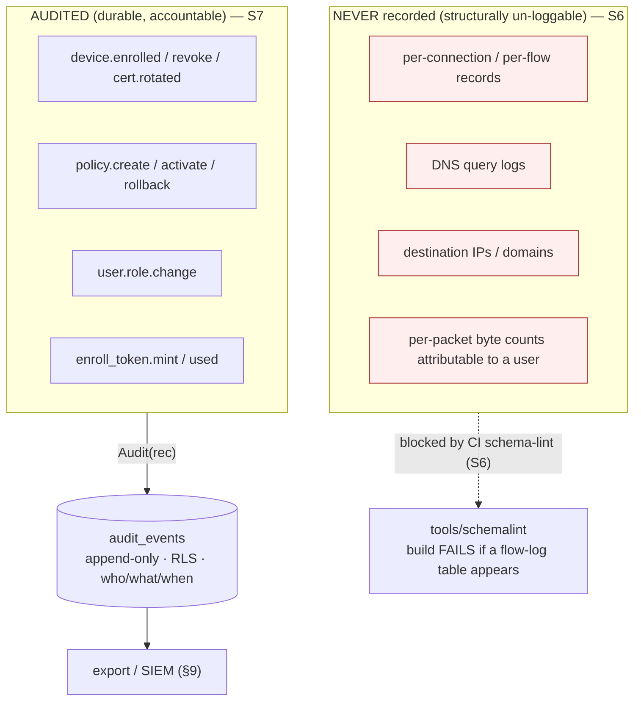
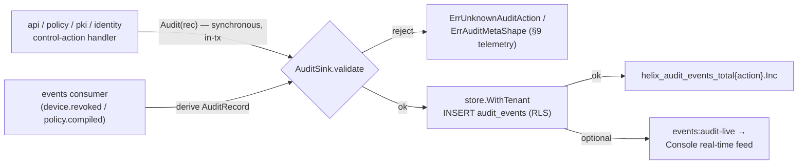
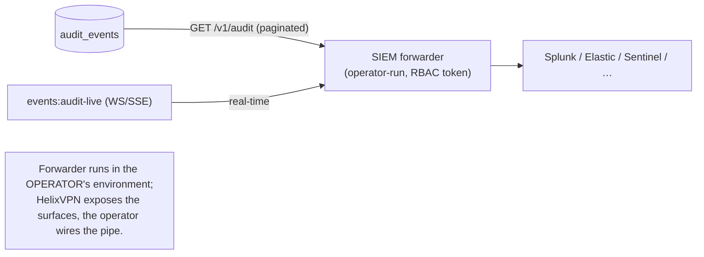

# Audit & compliance

**Revision:** 3
**Last modified:** 2026-07-04T12:00:00Z
**Rev 3:** Fixed an internal contradiction — §4's inline reconciliation note already resolved
`D-AC-1` (adopting `auth.login`/`auth.enroll.denied` into the closed enum) but §11's honest
boundary ledger and §13.1's decision table still listed it as an open "reconcile before tag"
item. Both now read RESOLVED, consistent with §4.

> Master technical specification — **Volume 5 (Security & Privacy)**, nano-detail
> deep-dive. This document **deepens** the audit + compliance posture of the master
> security doc ([`04-security-privacy-pki.md`](../04-security-privacy-pki.md) §6
> "no-logging-as-code", §7 "audit — control actions only", invariants **S6/S7**) into an
> implementation-ready specification of **what is auditable, what is structurally
> un-loggable, and what compliance posture follows from the no-traffic-logs stance.**
> It pins the `audit_events` write contract, the closed control-action taxonomy, the
> append-only / tamper-evident guarantees, the GDPR data-minimisation and SOC2-style
> control mapping, retention, and SIEM/export integration — and it draws the **honest
> line** (§11.4.6) between what is *designed-in and mechanically enforced* and what is
> *aspirational and `UNVERIFIED`* (a real audit/certification, not a code property).
> **SPEC ONLY** — it describes *what to build*, not the shipping product.
>
> **Ownership boundary.** The **audit_events DDL + RLS + the write path** are owned by
> the telemetry service, cited `[svc-telemetry §N]`
> ([`../v03-control-plane/svc-telemetry.md`](../v03-control-plane/svc-telemetry.md)). The
> **no-logging-as-code schema-lint** is owned by telemetry §7 + the no-logging-as-code
> sibling, cited `[no-log §N]` / `[svc-telemetry §7]`. The **security invariants** (S6/S7)
> are owned by the master security doc §6/§7, cited `[04-SEC §N]`. This document **owns**
> the *audit + compliance synthesis*: the auditable-vs-un-loggable taxonomy, the control
> mapping, the retention + SIEM contract, the honest aspirational-vs-designed-in ledger,
> and the §11.4.10 credentials / §11.4.156 no-remote-CI context that bounds the
> compliance claims. It does **not** redefine the telemetry interface, the DDL, or the RLS
> policy.
>
> **Evidence base, cited inline by id.** `[04-SEC §N]` =
> [`../04-security-privacy-pki.md`](../04-security-privacy-pki.md); `[svc-telemetry §N]` =
> [`../v03-control-plane/svc-telemetry.md`](../v03-control-plane/svc-telemetry.md);
> `[no-log §N]` = the no-logging-as-code sibling (the CI schema-lint, governed by
> telemetry §7); `[04_ARCH §N]` / `[04_P1 §N]` = the pass-1 architecture + Phase-1 MVP
> docs. Any claim not grounded in the evidence base — especially any *certification*
> claim — is tagged `UNVERIFIED` per constitution §11.4.6, never fabricated.

---

## Table of contents

- [0. Position, ownership, and invariants](#0-position-ownership-and-invariants)
- [1. The two halves: what is audited, what is structurally un-loggable](#1-the-two-halves-what-is-audited-what-is-structurally-un-loggable)
- [2. The control-action audit model](#2-the-control-action-audit-model)
- [3. The `audit_events` schema (append-only, tamper-evident)](#3-the-audit_events-schema-append-only-tamper-evident)
- [4. The closed control-action taxonomy](#4-the-closed-control-action-taxonomy)
- [5. A sample audit record](#5-a-sample-audit-record)
- [6. No-logging-as-code — the negative guarantee that IS the compliance feature](#6-no-logging-as-code--the-negative-guarantee-that-is-the-compliance-feature)
- [7. Compliance posture](#7-compliance-posture)
- [8. Retention & erasure](#8-retention--erasure)
- [9. Export / SIEM integration](#9-export--siem-integration)
- [10. Credentials, supply chain & the no-remote-CI context](#10-credentials-supply-chain--the-no-remote-ci-context)
- [11. Honest boundary — designed-in vs aspirational](#11-honest-boundary--designed-in-vs-aspirational)
- [12. Test points (§11.4.169)](#12-test-points-1114169)
- [13. Open decisions & cross-doc contracts](#13-open-decisions--cross-doc-contracts)
- [Sources verified](#sources-verified)

---

## 0. Position, ownership, and invariants

HelixVPN's audit model is defined as much by what it **refuses** to record as by what it
records. Two cooperating invariants from the master security doc bind every later choice
[04-SEC §0.1]:

| # | Invariant | Enforced where | Source |
|---|---|---|---|
| **S6** | **No durable connection/traffic log — by construction.** The only persistent traffic-derived data is aggregate counters. A CI schema-lint *fails the build* if a connection-log-shaped table appears. | §6; the no-logging-as-code lint | [04-SEC §6], [svc-telemetry §7] |
| **S7** | **Control actions are audited; traffic is not.** `audit_events` records *who-did-what to identity/policy/devices*, never destinations/flows. | §2–§5 | [04-SEC §7], [svc-telemetry §4] |

The non-obvious consequence: **the privacy promise and the compliance promise are the same
mechanism.** "We cannot hand a government a log of who connected where" and "we minimise
personal data to nothing for GDPR" are *one* build property — the absence of a connection
log — enforced by *one* CI gate, not two policies. The audit trail covers accountability
for *administrative* actions (who revoked a device, who changed a policy) precisely because
those are the *only* sensitive actions that exist to be recorded; user *traffic* is not
recorded, so it cannot be audited even by mistake [04-SEC §7].

### 0.1 What this document does NOT own

- The `audit_events` DDL, RLS policy, and the validated write path — [svc-telemetry §4].
- The Prometheus aggregate-counter registry (the *only* traffic-derived durable data) —
  [svc-telemetry §3].
- The Redis TTL presence mechanism (ephemeral, never durable) — [svc-telemetry §5].
- The CI schema-lint implementation — [no-log] / [svc-telemetry §7]; this doc states the
  *invariant* and the compliance consequence, not the regex.



---

## 1. The two halves: what is audited, what is structurally un-loggable

### 1.1 The auditable surface (control actions)

Every **state-changing control action** is audited [04-SEC §7, svc-telemetry §4]. These are
administrative facts about identity, policy, and devices — the actions a tenant admin, an
operator, or the system itself takes against the control plane. They are durable,
accountable, and tenant-scoped.

### 1.2 The un-loggable surface (traffic / usage)

The following **do not exist** as durable records, by construction [04-SEC §6,
svc-telemetry §0/§7]:

| NOT stored (ever) | Why it cannot be audited |
|---|---|
| Per-connection records | no `connections`/`sessions` durable table exists (lint-enforced) |
| Per-packet / per-flow records (src, dst, bytes, timestamps) | no `flows`/`packets`/`traffic` table; no src/dst+bytes/ts column shape outside `audit_events` (lint-enforced) |
| DNS query logs | no `dns_queries` table; DNS is resolved inside the tunnel, never recorded |
| Destination IPs / domains visited | nothing correlates a user to a destination |
| Anything correlating a user to a destination | the schema cannot express it; the lint blocks the build if it appears |

The distinction is **shape-based**, not policy-based: the no-logging-as-code lint (§6) fails
the build if *any* durable table looks like a flow log — a `src`/`dst` column **and** a
`bytes`/`ts` column outside `audit_events` is forbidden regardless of intent
[svc-telemetry §7.1, 04-SEC §6.2]. You cannot *accidentally* add traffic logging; the gate
catches it before merge.

### 1.3 The one ephemeral middle: presence

Live online/offline state lives **only in Redis with a TTL** [svc-telemetry §5,
04_ARCH §4.5]. `presence:{tenant}:{device}` carries health-only data (current transport +
rtt) and **never** a destination, byte count, or flow. It is **never copied to Postgres**;
`devices.last_seen_at` is *coarse* (refreshed at most every 5 min, not per-heartbeat) so
even the durable "last seen" cannot reconstruct a session timeline [svc-telemetry §5.1].
Presence is the mechanism that *operationalises* no-logging: the system knows who is online
*right now* without a durable session table.

---

## 2. The control-action audit model

### 2.1 The write contract (one validated sink)

Every audit row passes through one validated sink so the S6/S7/RLS guarantees hold exactly
once [svc-telemetry §4.3]. There are two ingestion paths into the same sink:



- **Synchronous path (authoritative).** A handler performing a privileged mutation calls
  `Audit()` *inside the same transaction* as the mutation it records, so a committed
  `policy.activate` **cannot exist without its audit row** — either both land or neither
  [svc-telemetry §4.3]. This is the primary path and the one the DoD asserts.
- **Event-derived path (best-effort enrichment).** The events consumer may *also* derive an
  audit row from a bus event for Console live-streaming; it is **idempotent** on
  `(tenant_id, trace_id, action)` via a partial unique index, so a double-write collapses to
  a no-op [svc-telemetry §4.3]. OFF by default in Phase 1.

### 2.2 Audit fails closed (the accountability guarantee)

If the audit insert is refused — unknown action, forbidden `meta` shape, or a Postgres write
failure — **the control action it records is rolled back** [svc-telemetry §9]. An
unrecordable *control* action must not proceed un-audited. This asymmetry is deliberate and
load-bearing: audit **fails closed** (no un-audited privileged mutation), while presence
**fails static** (a Redis blip never breaks a tunnel). Conflating them would either lose
audit or brick tunnels [svc-telemetry §9].

### 2.3 Actor binding (who-did-what)

`actor` is bound by the action's origin [04-SEC §7]:

| Action origin | `actor` value |
|---|---|
| human (Console / API, OIDC-authenticated) | the OIDC `sub` / user UUID |
| automated (scheduled key rotation, reaper) | `"system"` |
| agent-initiated control write (device self-action) | the device id |

The actor is the **identity of the principal that caused the change**, captured at the point
of the mutation, never inferred later (§11.4.6).

---

## 3. The `audit_events` schema (append-only, tamper-evident)

The DDL is canonical in [svc-telemetry §4.1]; reproduced here with the audit + compliance
constraints made explicit.

```sql
-- audit_events — owned by store; the WRITE PATH is owned by telemetry [svc-telemetry §4.1]
CREATE TABLE audit_events (
  id          bigint GENERATED ALWAYS AS IDENTITY PRIMARY KEY,
  tenant_id   uuid NOT NULL REFERENCES tenants(id) ON DELETE CASCADE,
  actor       text NOT NULL,             -- user id / "system" / device id (§2.3)
  action      text NOT NULL,             -- closed vocabulary (§4)
  target      text,                      -- opaque id (device / policy version / connector)
  ts          timestamptz NOT NULL DEFAULT now(),   -- WHEN
  meta        jsonb                       -- small; lint-checked shape (no traffic keys, §6.3)
);
CREATE INDEX ON audit_events (tenant_id, ts DESC);

-- (S7) There is NO ip/port/bytes/dst column on this table — by design [svc-telemetry §1.1].
-- (C8) RLS: FORCE ROW LEVEL SECURITY + tenant_isolation, identical to every tenant table.
--   The sink writes ONLY through store.WithTenant — never raw db.Exec.

-- APPEND-ONLY is a GRANT, not a trigger (simplest mechanical guarantee):
REVOKE UPDATE, DELETE ON audit_events FROM helix_app;
--   → an audit row cannot be mutated or erased by the request-path role.
--   Retention pruning (if ever enabled) runs as the out-of-band helix_sys role, not request-path.
```

### 3.1 Who/what/when — the three audit facts

| Fact | Column | Notes |
|---|---|---|
| **WHO** | `actor` (+ `tenant_id` scope) | the principal that caused the change (§2.3) |
| **WHAT** | `action` (closed vocab §4) + `target` (opaque id) + `meta` (small JSON) | *never* a traffic descriptor — the `meta` shape guard (§6.3) blocks `src_ip`/`dst_ip`/`bytes` keys |
| **WHEN** | `ts` (`timestamptz`, server clock) | append-only; the row's `id` is monotonic |

### 3.2 Append-only enforcement

`REVOKE UPDATE, DELETE ON audit_events FROM helix_app` is the **mechanical** append-only
guarantee [svc-telemetry §4.1]: the request-path role *cannot* mutate or erase an audit row.
This is simpler and harder to bypass than an `UPDATE`/`DELETE` trigger — the privilege is
simply absent. Retention pruning, if ever enabled, runs as a separate out-of-band role
(`helix_sys`) on a schedule, never from request handling (§8).

### 3.3 Tamper-evidence (Phase 2, `UNVERIFIED` as MVP)

Phase 2 reserves an optional **hash-chained** audit: each row carries
`meta.prev_hash = H(prev_row)` so a deletion or reorder breaks the chain and is detectable
[04-SEC §7]. **This is `UNVERIFIED` / not-MVP** — Phase 1 ships the append-only *grant* (§3.2)
as the tamper-resistance floor; the hash chain is the additive tamper-*evidence* upgrade, not
claimed for MVP. Stating it now reserves the `meta.prev_hash` key so the schema need not
change later (§11.4.6 — the additive seam is documented, the capability is not claimed
present).

---

## 4. The closed control-action taxonomy

Audit covers control actions **only**, drawn from a **closed Go enum** [svc-telemetry §4.2,
04-SEC §7]. A closed set is the mechanical guarantee that audit never silently grows toward
traffic logging — a typo cannot mint a new high-cardinality value, and the `action`
Prometheus label + the lint allow-list stay bounded.

```go
// internal/telemetry — the closed AuditAction vocabulary [svc-telemetry §4.2]
type AuditAction string
const (
    ActionDeviceEnrolled     AuditAction = "device.enrolled"
    ActionDeviceRevoked      AuditAction = "device.revoke"
    ActionDeviceCertIssued   AuditAction = "device.cert.issued"
    ActionDeviceCertRotated  AuditAction = "device.cert.rotated"
    ActionPolicyCreated      AuditAction = "policy.create"
    ActionPolicyActivated    AuditAction = "policy.activate"
    ActionPolicyRolledBack   AuditAction = "policy.rollback"
    ActionConnectorAttached  AuditAction = "connector.attached"
    ActionPrefixesChanged    AuditAction = "connector.prefixes.changed"
    ActionEnrollTokenMinted  AuditAction = "enroll_token.mint"
    ActionEnrollTokenUsed    AuditAction = "enroll_token.used"
    ActionTenantCreated      AuditAction = "tenant.create"
    ActionUserRoleChanged    AuditAction = "user.role.change"
    ActionAuthLogin          AuditAction = "auth.login"          // login (control-action audit)
    ActionAuthEnrollDenied   AuditAction = "auth.enroll.denied"  // rejected enroll (abuse signal)
)
// Audit() rejects any Action not in this closed set with ErrUnknownAuditAction (§9 telemetry).
```

> **Reconciled (§11.4.35, 2026-06-26) — `D-AC-1`: `auth.login` + `auth.enroll.denied` adopted
> into the `AuditAction` enum.** The master security doc §7 and this taxonomy both list
> `auth.login` and `auth.enroll.denied`; they are now adopted enum members in the canonical
> closed set [svc-telemetry §4.2] (the superset source of truth) and mirrored here — no longer
> an open reconciliation item. They are legitimate *control-action* audits (a login, a rejected
> enroll), never traffic; adopting them is an additive enum extension (the closed set + lint
> allow-list grow together), so audit still cannot silently drift toward traffic logging.

### 4.1 The taxonomy mapped to compliance categories

| Category | Actions | Why it matters for compliance |
|---|---|---|
| **Identity lifecycle** | `device.enrolled`, `device.revoke`, `enroll_token.mint`, `enroll_token.used`, `tenant.create` | accountability for *who joined / left* the network (access-management evidence) |
| **Credential lifecycle** | `device.cert.issued`, `device.cert.rotated` | evidence that short-lived certs are issued/rotated per policy (S4) |
| **Policy lifecycle** | `policy.create`, `policy.activate`, `policy.rollback` | accountability for *who changed access rules* (change-management evidence) |
| **Topology lifecycle** | `connector.attached`, `connector.prefixes.changed` | accountability for *what networks were exposed* |
| **Authorisation** | `user.role.change` | accountability for *privilege grants* (least-privilege evidence) |
| **Authentication** | `auth.login`, `auth.enroll.denied` | accountability for *who authenticated* + a rejected-enroll abuse signal (access-management evidence) |

Every one of these is an *administrative* fact. **None** describes user traffic — which is
the point: the audit trail is complete *for control actions* precisely because control
actions are the only sensitive events that durably exist.

---

## 5. A sample audit record

A concrete `device.revoke` row, showing the who/what/when shape and the deliberate absence of
any traffic descriptor:

```json
{
  "id": 84213,
  "tenant_id": "8f2c1e10-3a4b-4c5d-9e6f-0a1b2c3d4e5f",
  "actor": "u-7b3d9a02-1f44-4e88-bc21-9d0e6f4a55c1",   // OIDC sub of the admin who revoked
  "action": "device.revoke",
  "target": "dev-c19a77e4-2b8f-4a31-8e0c-6f2d1a9b3c44", // the revoked device id (opaque)
  "ts": "2026-06-25T11:42:07.318Z",
  "meta": {
    "reason": "lost-device",          // small, bounded, NO traffic keys (§6.3 shape guard)
    "trace_id": "01J9X7QH3K…",        // correlates to the originating event Envelope.trace_id
    "cert_serial": "5e:3a:9c:…"       // the blacklisted cert serial (identity, not traffic)
  }
}
```

What this record **does not** contain — and structurally cannot — is any destination,
domain, byte count, or flow attributable to the revoked device. The `meta` shape guard (§6.3)
rejects a row whose `meta` carries a `dst_ip`/`bytes_in`/`payload`-class key with
`ErrAuditMetaShape` [svc-telemetry §4.4]. The record answers "who revoked which device, when,
and why" — and nothing about what that device ever *did*.

### 5.1 What a reader can and cannot reconstruct

| Question | Answerable from `audit_events`? |
|---|---|
| "Who revoked device X, and when?" | ✅ yes — `actor` + `ts` |
| "Which admin activated policy version N?" | ✅ yes — `policy.activate` row |
| "When was device X enrolled, and with what token?" | ✅ yes — `device.enrolled` + `enroll_token.used` rows (correlated by `trace_id`) |
| "What sites did the user behind device X visit?" | ❌ **structurally impossible** — no such data exists (S6) |
| "How many bytes did device X transfer to host Y?" | ❌ **structurally impossible** — only aggregate, non-attributable counters exist [svc-telemetry §3] |

---

## 6. No-logging-as-code — the negative guarantee that IS the compliance feature

The privacy promise is a **build property**, enforced by *absence* and by a CI lint, not by
an operator's good intentions [04-SEC §6, svc-telemetry §7]. It is the single most important
compliance feature: a VPN that *cannot* produce a connection log cannot be compelled to hand
one over, and minimises personal data to nothing.

### 6.1 What is and is not stored

| Stored (durable, Postgres) | NOT stored (ever) |
|---|---|
| Identity: tenants, users, devices (pubkey, overlay IP, **coarse** `last_seen_at`) | Per-connection records |
| Topology: connectors, advertised prefixes, groups | Per-packet / per-flow records (src, dst, bytes, timestamps) |
| Policy: spec + compiled rules | DNS query logs |
| `device_certs`, `enroll_tokens` (hashed) | Destination IPs / domains visited |
| `audit_events` (control actions only, §2–§5) | Traffic content or metadata of any kind |
| Aggregate counters (handshakes, bytes-total, errors — Prometheus) | Anything correlating a user to a destination |

### 6.2 The CI schema-lint (mechanical enforcement)

A schema test **fails the build** if a durable table appears that is shaped like a connection
log [svc-telemetry §7.1, 04-SEC §6.2, no-log]: a forbidden table name
(`connections`/`flows`/`traffic`/`packets`/`sessions`/`dns_queries`/…), OR any table with
**both** a `src`/`dst`-type column **and** a `bytes`/`ts`-type column outside `audit_events`.
It parses **both** the migration SQL (static) **and** the live `information_schema` (dynamic),
so a table that drifts into the DB without a migration is also caught. The privacy promise is
enforced by tooling, not trust.

### 6.3 The `meta`-shape guard (closing the back door)

Audit could *become* a traffic log through the back door if a handler stuffed a destination
into `meta.jsonb`. `AuditSink.validate` runs a `meta` shape check before insert: the JSON
keys are matched against the **same** forbidden-column regex the schema-lint uses, so a
control-action audit carrying a `dst_ip`/`bytes_in`/`payload`/`sni_host` key is rejected with
`ErrAuditMetaShape` [svc-telemetry §4.4]. The bound (`maxMetaKeys`, default 16) also caps the
blob. This closes the "log traffic inside `meta`" evasion of S6.

### 6.4 Self-validating the lint (§11.4.107(10), §1.1)

The lint is itself anti-bluff: a paired meta-test plants a
`CREATE TABLE flows(src inet, dst inet, bytes bigint, ts timestamptz)` migration and asserts
the lint **FAILs**; removing it asserts it passes [04-SEC §6.2, svc-telemetry §7.2]. An
analyzer that PASSes its golden-bad fixture is a bluff gate. Wired as a **runtime signature**
(§11.4.108), the lint also runs against the *deployed* DB post-deploy, proving S6 is *active*,
not merely promised at build time [svc-telemetry §7.2].

---

## 7. Compliance posture

The no-traffic-logs stance is a *privacy* feature first and a *compliance* feature as a
direct consequence. This section maps the design to the standard frameworks — and §11
draws the honest line between what the *code* guarantees and what a *certification* would
require.

### 7.1 GDPR — data minimisation by construction

| GDPR principle (Art. 5) | How the design satisfies it | Mechanism |
|---|---|---|
| **Data minimisation** (5(1)(c)) | The anonymous-mode device has `email=NULL`, `oidc_sub=NULL`; no traffic is recorded; presence is ephemeral | [04-SEC §2.2] anonymous enroll tokens; §6 no-logging; [svc-telemetry §5] TTL presence |
| **Storage limitation** (5(1)(e)) | Presence self-expires (TTL); `last_seen_at` is coarse; audit is low-volume control-only; optional operator-driven prune (§8) | [svc-telemetry §5.1] TTL; §8 retention |
| **Purpose limitation** (5(1)(b)) | The only durable personal-ish data (audit actor) exists solely for administrative accountability, not profiling | §2–§5 control-action-only audit |
| **Integrity & accountability** (5(1)(f), 5(2)) | Append-only audit (§3.2) provides accountability for control actions; RLS isolates tenants | §3, [svc-telemetry §4.1 RLS] |
| **Right to erasure** (Art. 17) | Anonymous mode stores no PII to erase; for managed tenants, `helixvpnctl audit prune --before` + tenant deletion cascade | §8, [svc-telemetry §4.1] |

The strongest GDPR position is the **anonymous mode** ("account number, no PII"
[04-SEC §2.2]): a device obtains identity + a cert with *no* email and *no* SSO, so there is
no personal data to minimise, retain, or erase — the data-protection problem is dissolved,
not managed. **`UNVERIFIED`:** whether a given *deployment* qualifies for a specific GDPR
posture depends on the operator's own processing (e.g. a managed tenant that *does* collect
email) — the *code* minimises by construction; the *deployment's* GDPR compliance is the
operator's determination, not a property this spec can certify (§11).

### 7.2 SOC2-style control mapping (Trust Services Criteria)

This maps the design to SOC2 TSC categories. **It is a control *mapping*, not a SOC2
attestation** — a real SOC2 report requires an independent auditor and operational evidence
over a period, which is `UNVERIFIED` and out of scope for the code (§11).

| TSC area | Control the design provides | Evidence artefact |
|---|---|---|
| **Security / Access (CC6)** | Zero-trust default-deny (S1); short-lived device certs (S4); RBAC + RLS defence-in-depth | policy compiler output; `device_certs`; `audit_events` `user.role.change` |
| **Change management (CC8)** | Every policy change is audited (`policy.create/activate/rollback`) and atomically tied to its mutation | `audit_events` policy rows; §2.1 in-tx write |
| **Logical access provisioning/deprovisioning** | Enrollment + revocation are audited; revocation is sub-second (S5) | `device.enrolled`/`device.revoke` rows; revocation pipeline [04-SEC §4.6] |
| **Monitoring (CC7)** | Aggregate health/SLO metrics + control-action audit; live audit feed | Prometheus series [svc-telemetry §3]; `events:audit-live` |
| **Confidentiality (C1)** | No traffic logs to disclose; tenant isolation via RLS; CA key as the one protected secret (S11) | §6 no-logging lint; RLS; §10 secrets |
| **Privacy (P-series)** | Data-minimisation-by-construction; no destination/usage data | §6; §7.1 |

### 7.3 The no-traffic-logs stance as a feature, not just a compliance checkbox

The design treats "we keep no logs" as a **product feature** with a **mechanical proof**, not
a privacy-policy paragraph: the CI lint (§6.2) and its runtime signature (§6.4) mean an
operator (or an auditor, or a court order) can be *shown* that no connection-log table exists
in the deployed schema. This is the difference between a *claimed* no-logs VPN (a promise in
prose) and a *provable* one (a green schema-lint against the live DB). The honest limit
(§11): the lint proves *the durable schema* carries no flow log; it does **not** prove an
operator did not run an out-of-band packet capture on the host — that is an operational
control, not a code property (§11.2).

---

## 8. Retention & erasure

| Data class | Retention | Mechanism |
|---|---|---|
| **Presence** (Redis) | `PRESENCE_TTL` (default 45 s) | self-expires; never durable [svc-telemetry §5.1] |
| **`last_seen_at`** (Postgres) | coarse, overwritten | refreshed at most every 5 min; cannot reconstruct a timeline [svc-telemetry §5.1] |
| **`audit_events`** | **Phase 1 default: no auto-prune** (control-action audit is low-volume + operator-valuable) | append-only grant (§3.2); operator-driven prune below |
| **Aggregate counters** (Prometheus) | per the operator's Prometheus retention | non-attributable; not personal data |
| **Traffic / flows / DNS** | **never stored** | structurally impossible (§6) |

### 8.1 Operator-driven erasure

Phase 1 ships **no automatic** audit pruning — control-action audit is the operator's
accountability record [svc-telemetry §4.1]. A documented, operator-driven path exists for
GDPR-style erasure:

```text
helixvpnctl audit prune --before <ts>     # runs as the out-of-band helix_sys role, NOT request-path
```

Tenant deletion cascades (`ON DELETE CASCADE` on `tenant_id`), so deleting a tenant erases its
audit rows. Erasure is **operator-initiated and audited as an administrative action** — never
silent, never request-path (§11.4.122 — removing existing records is operator-confirmed). The
*choice* of a retention period for a given deployment is the operator's compliance
determination, surfaced not silently chosen (§11.4.66).

---

## 9. Export / SIEM integration

Enterprises integrating HelixVPN into a wider security posture need audit events in their
SIEM. The export model carries **only** the control-action audit — never traffic, because
none exists.

### 9.1 Export surfaces

| Surface | Shape | Auth | Notes |
|---|---|---|---|
| `GET /v1/audit` (REST, tenant-scoped) | paginated `audit_events` JSON | RBAC: `admin`/`operator` (`member` denied) | RLS floor: a mis-scoped query returns only the caller's tenant [svc-telemetry §4.5] |
| `events:audit-live` (WS/SSE) | real-time audit stream to the Console / a SIEM forwarder | RBAC + tenant scope | the live security feed [04-SEC §7, svc-telemetry §4.3] |
| Aggregate `/metrics` (Prometheus) | `helix_audit_events_total{action}` *counts only* | scrape-network only (mTLS / allow-list) | carries **no** audit content — only the aggregate count [svc-telemetry §4.5/§8.3] |

### 9.2 What export must never carry

- **No traffic.** There is no flow/DNS/destination data to export — the export is *complete*
  precisely because the un-loggable surface (§1.2) is empty.
- **No cross-tenant leakage.** Every export path runs through RLS (`store.WithTenant`); the
  Prometheus surface carries no `tenant_id` label (it would leak tenant population and be
  unbounded) [svc-telemetry §3.1]. Per-tenant counts, if ever needed, live behind the
  authenticated REST `/v1/stats`, never `/metrics`.
- **No secrets.** Audit `meta` is shape-guarded (§6.3); credentials never appear in an audit
  row (§10).

### 9.3 SIEM forwarding pattern



The forwarder is **operator-run** in the operator's own SIEM environment; HelixVPN exposes the
RBAC-gated surfaces, the operator wires the integration. **`UNVERIFIED`:** no specific SIEM
connector ships in MVP — the export is generic JSON over REST/WS, and a named connector
(Splunk HEC, Elastic ECS mapping) is a Phase-2 additive item, not claimed for MVP (§11.4.6).

---

## 10. Credentials, supply chain & the no-remote-CI context

Two cross-cutting constitution bindings frame the compliance posture; both are stated for
completeness because they bound what the audit/export surfaces may carry and how the build is
trusted.

### 10.1 Credentials handling (§11.4.10)

- **The CA root key and Postgres are the only secrets to protect** (S11 [04-SEC §0.1/§11]).
  In the KMS-backed deployment the CA *private* key is never in process memory — signing is
  delegated to KMS/HSM [04-SEC §4.7].
- **No credential ever appears in an audit row, a metric, a log line, or an export.** Audit
  `meta` is shape-guarded (§6.3); the telemetry write path redacts; enroll-token plaintext is
  stored only as an Argon2id hash and shown exactly once [04-SEC §2.2]. A credential reaching
  `audit_events.meta` would be both a §11.4.10 leak and an `ErrAuditMetaShape` rejection.
- Credentials live in gitignored config (`.env` / `secrets/`) per §11.4.10; the audit trail
  records *that* a token was minted/used (`enroll_token.mint`/`used`), never the token value.

### 10.2 The no-remote-CI context (§11.4.156)

All server-side CI/CD automation is **disabled** — no GitHub Actions / GitLab pipeline runs on
push [§11.4.156]. The no-logging-as-code lint (§6.2), the audit-sink tests (§12), and the
schema-lint runtime signature (§6.4) therefore run as the **local pre-build + pre-tag ritual**
(§11.4.40 / §11.4.75 local hooks), not on a remote runner. The compliance consequence: the
*proof* that no connection-log table exists is generated locally and captured as evidence
before a tag, not delegated to a cloud CI whose logs would themselves be a data surface. This
keeps the build-trust story entirely within the operator's controlled environment — itself a
small supply-chain hardening (the build pipeline is not a third party with access to the
schema). **`UNVERIFIED`:** the broader supply-chain controls (signed images via cosign, SBOM,
reproducible builds) are Phase-3 items [04-SEC §5.4], not MVP-claimed.

---

## 11. Honest boundary — designed-in vs aspirational

§11.4.6 forbids claiming a compliance *certification* as if it were a code property. This
ledger is the explicit line between what the **code mechanically guarantees** and what is
**aspirational / `UNVERIFIED`** (requires an external audit, an operator determination, or a
Phase-2/3 deliverable).

| Claim | Status | Why |
|---|---|---|
| No durable connection/traffic log exists in the schema | ✅ **designed-in, mechanically proven** | CI schema-lint (§6.2) + runtime signature against the deployed DB (§6.4); golden-bad self-validation (§6.4) |
| Control actions are audited atomically with their mutation | ✅ **designed-in** | in-tx synchronous audit (§2.1); fails-closed (§2.2) |
| Audit is append-only (request-path cannot mutate/erase) | ✅ **designed-in** | `REVOKE UPDATE,DELETE` grant (§3.2) |
| Anonymous mode stores no PII | ✅ **designed-in** | `email/oidc_sub = NULL` [04-SEC §2.2] |
| Data-minimisation (GDPR Art. 5(1)(c)) by construction | ✅ **designed-in** at the schema level | §6, §7.1 |
| Tamper-*evident* (hash-chained) audit | ⚠️ **`UNVERIFIED` / Phase 2** | §3.3 — MVP ships append-only *grant*, not the hash chain |
| `auth.login` / `auth.enroll.denied` are audited | ✅ **designed-in — reconciled 2026-06-26** | §4 — both adopted as regular closed-enum members (`D-AC-1` resolved, option A); no longer an open reconciliation item |
| "HelixVPN is GDPR compliant" | ⚠️ **aspirational — operator determination** | the code minimises data; a *deployment's* GDPR compliance depends on the operator's own processing (§7.1) |
| "HelixVPN is SOC2 certified" | ⚠️ **aspirational — requires an independent audit** | §7.2 is a control *mapping*, not an attestation; a SOC2 report needs an auditor + operational evidence over a period |
| A named SIEM connector (Splunk/Elastic) ships | ⚠️ **`UNVERIFIED` / Phase 2** | §9.3 — MVP exposes generic REST/WS; connectors are additive |
| The lint proves no operator-side packet capture occurs | ❌ **out of scope** | §7.3 — the lint proves the *durable schema*; host-level capture is an operational control, not a code property |

The discipline: every ✅ is a property a reviewer can *verify* against the code/schema; every
⚠️ is honestly flagged as needing an external audit, an operator decision, or a future phase —
**never** asserted as if the code certified it (§11.4.6/§11.4.123).

---

## 12. Test points (§11.4.169)

Every PASS cites captured evidence (§11.4.5/§11.4.69/§11.4.107); the audit-row trace and the
lint exit codes are the captured evidence.

| Test id | §11.4.169 codes | What it proves | Captured evidence |
|---|---|---|---|
| AC-1 | `UT` | `AuditSink.validate` rejects every non-vocabulary action + every forbidden `meta` key; accepts the closed set (§4, §6.3) | table-test report (mirrors [svc-telemetry §10] T-UNIT-1) |
| AC-2 | `IT` (RLS) | tenant A cannot read tenant B's `audit_events` even with a crafted query under `FORCE ROW LEVEL SECURITY`; `REVOKE UPDATE,DELETE` makes a row immutable (§3.2) | psql transcript (T-STORE-1) |
| AC-3 | `IT` | a committed `policy.activate` **always** has its `audit_events` row (atomic tx); a forced insert failure rolls back the activation (§2.1/§2.2) | tx-log evidence (T-INT-2) |
| AC-4 | `SEC`+meta-test (§1.1) | the no-logging schema-lint FAILs on a planted `flows(src,dst,bytes,ts)` migration; PASSes after removal; golden-bad fixture FAILs (self-validation §6.4) | lint exit codes (T-LINT-1) |
| AC-5 | `SEC` | runtime signature: the schema-lint runs GREEN against the *deployed* DB (S6 active, not just promised) (§6.4) | post-deploy lint exit code against live `information_schema` |
| AC-6 | `SEC` | `audit_events.meta` cannot smuggle `dst_ip`/`bytes` (§6.3); `GET /v1/audit` denied to `member`; `/metrics` carries no audit content (§9.2) | scan + RBAC matrix (T-SEC-1) |
| AC-7 | `SEC` | no credential appears in any audit row / metric / export (§10.1) | grep-empty proof over a captured audit corpus |
| AC-8 | `E2E`+`CH` | full enroll→revoke→policy drive produces the expected audit rows with correct actor/action/target/ts; a Challenge scores PASS only on the captured audit trace (§11.4.27) | HelixQA autonomous session `result.json` (T-CHAL-1) |

Each meta-test ships a paired §1.1 mutation (e.g. weaken the `meta`-shape regex → AC-6 must
FAIL; remove the `REVOKE UPDATE,DELETE` → AC-2 immutability must FAIL) so the gates provably
cannot bluff [svc-telemetry §10, §11.4.107(10)].

---

## 13. Open decisions & cross-doc contracts

### 13.1 Decisions surfaced (options + recommendation — §11.4.6/§11.4.66)

| # | Decision | Option A | Option B | Recommendation |
|---|---|---|---|---|
| **D-AC-1** | `auth.login`/`auth.enroll.denied` audit rows | add to the closed enum (MVP) | defer to Phase 2 | ✅ **RESOLVED 2026-06-26 — option A adopted** (§4 note): both are regular closed-enum members; master §7 aligned to the same taxonomy. No longer open. |
| **D-AC-2** | tamper-evident hash chain | ship in MVP | Phase 2 additive (append-only grant is the MVP floor) | **B** — §3.3; the `meta.prev_hash` seam is reserved now, the capability is not claimed for MVP |
| **D-AC-3** | audit retention default | no auto-prune (operator-driven) | a default TTL | **A** — §8; control-action audit is low-volume + accountability-valuable; the operator chooses a period per their compliance regime |
| **D-AC-4** | SIEM connector | named connector in MVP | generic REST/WS, connectors Phase 2 | **B** — §9.3; MVP exposes the generic surfaces, a named connector is additive |

### 13.2 Cross-document contracts this document fixes

| Contract | Fixed value | Consumed by / source |
|---|---|---|
| The auditable-vs-un-loggable taxonomy (S6/S7) | §1 | [04-SEC §6/§7], [svc-telemetry §0/§4] |
| The closed control-action vocabulary | §4 | [svc-telemetry §4.2] owns the enum; this doc maps it to compliance categories |
| The `audit_events` who/what/when + append-only contract | §3 | [svc-telemetry §4.1] owns the DDL/RLS/grant |
| The compliance-claim honesty ledger (designed-in vs aspirational) | §11 | §11.4.6/§11.4.123 — no certification claimed as a code property |
| The export/SIEM surface (control-action only, RBAC + RLS, no traffic) | §9 | [svc-telemetry §4.5] (REST RBAC), §3.1 (no PII labels) |

---

## Sources verified

- [`../04-security-privacy-pki.md`](../04-security-privacy-pki.md) `[04-SEC]` — §0.1
  (S6/S7/S11 invariants), §2.2 (anonymous enroll tokens — no-PII / GDPR posture), §4.6
  (revocation audited), §5.4 (Phase-3 supply chain), §6 (no-logging-as-code: stored-vs-not
  table + CI schema-lint + golden-bad self-validation), §7 (control-action-only audit:
  actions, actor binding, append-only, Phase-2 hash chain, live stream), §11 (CA key + Postgres
  as the protected secret set).
- [`../v03-control-plane/svc-telemetry.md`](../v03-control-plane/svc-telemetry.md)
  `[svc-telemetry]` — §0 (audit + presence charter, governs the schema-lint), §1.1 (the
  `AuditRecord` shape with NO ip/port/bytes field), §3 (aggregate Prometheus series — the only
  traffic-derived durable data; no PII labels), §4.1 (audit_events DDL + RLS + `REVOKE
  UPDATE,DELETE` append-only grant), §4.2 (closed `AuditAction` enum), §4.3 (synchronous in-tx
  + idempotent event-derived ingestion), §4.4 (`meta`-shape guard / `ErrAuditMetaShape`), §4.5
  (audit-read RBAC; `/metrics` carries no audit content), §5 (TTL presence operationalises
  no-logging; coarse `last_seen_at`), §7 (no-logging-as-code lint + runtime signature + golden-bad
  self-validation), §9 (audit fails closed, presence fails static), §10 (test matrix).
- The no-logging-as-code sibling `[no-log]` — the CI schema-lint governed by [svc-telemetry §7]:
  static + live `information_schema` parse, forbidden-table/column regex, allow-list,
  meta-shape guard, paired §1.1 mutation, post-deploy runtime signature (§6.2/§6.4).
- [`kill-switch-and-dns-leak.md`](kill-switch-and-dns-leak.md) — the sibling leak-proofing
  this audit/compliance posture supports (a dropped tunnel never persists a connection log;
  §1.3 presence is ephemeral).

*Constitution: §11.4.44 (revision header), §11.4.6/§11.4.66/§11.4.123 (decisions = options +
recommendation; `UNVERIFIED`/aspirational never asserted as a code property — the §11 honesty
ledger), §11.4.10 (credentials never in an audit row/metric/export — §10.1), §11.4.156 (no
remote CI — local pre-build/pre-tag proof of the no-logging lint — §10.2), §11.4.122 (audit
erasure operator-confirmed, never silent — §8.1), §11.4.69/§11.4.107/§11.4.107(10) (captured
audit-trace + lint-exit evidence; self-validated lint), §1.1 (paired mutations — §12).
SPEC-ONLY — describes what to build, does not build it.*

*End of nano-detail specification — Volume 5 (Security & Privacy),
`audit-and-compliance.md`. Pairs with
[`kill-switch-and-dns-leak.md`](kill-switch-and-dns-leak.md) (the leak-proofing that keeps the
no-traffic-logs stance honest at the data plane), the master security doc §6/§7 (the S6/S7
invariants it deepens), and [`../v03-control-plane/svc-telemetry.md`](../v03-control-plane/svc-telemetry.md)
(the audit_events write path + the no-logging schema-lint it synthesises).*
