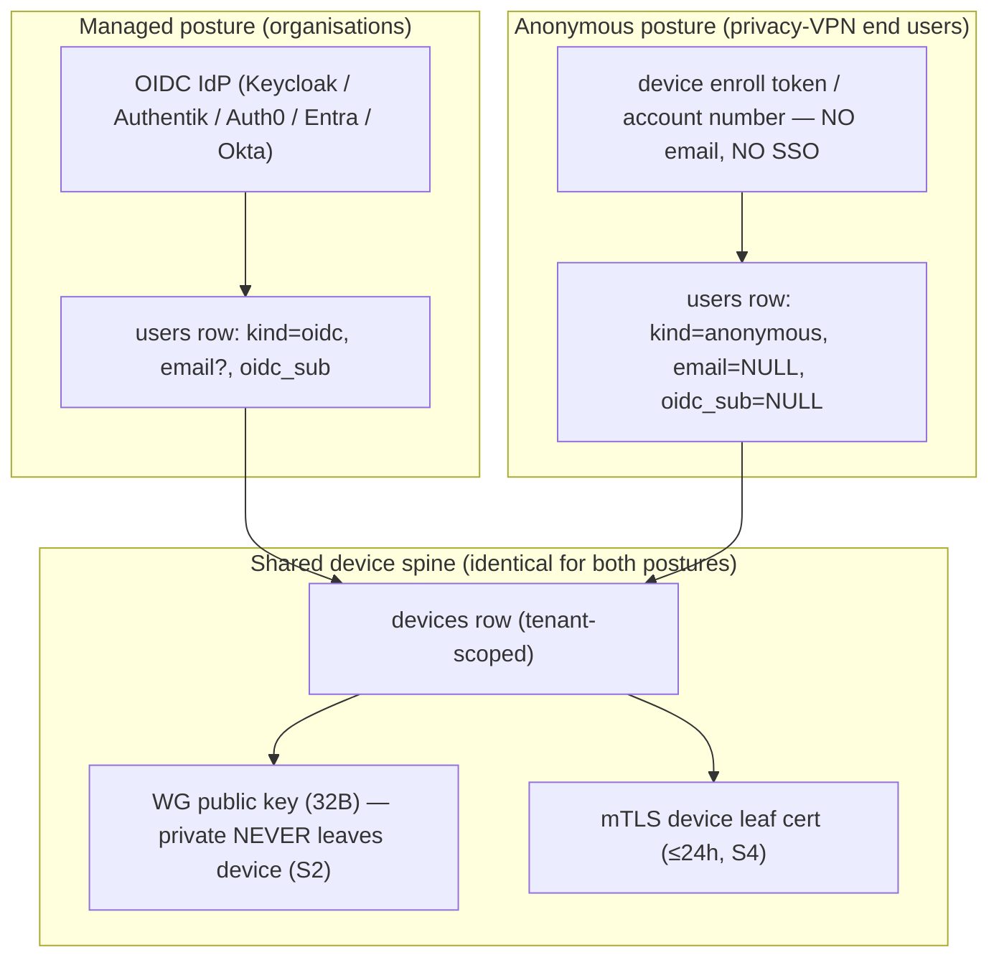
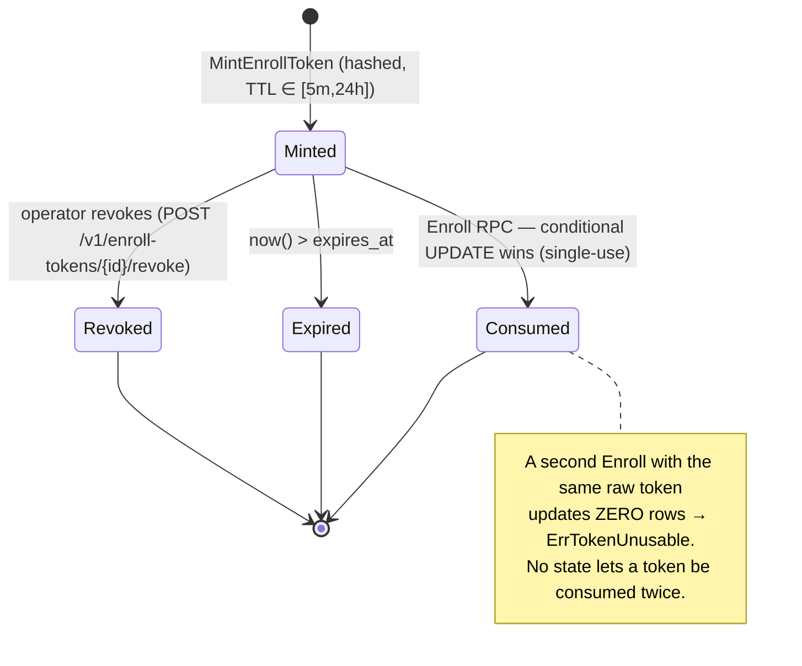

# Identity & Enrollment — the key-never-leaves invariant

**Revision:** 1
**Last modified:** 2026-06-25T12:00:00Z

> Master technical specification — Volume 5 (Security & Privacy), nano-detail document
> **identity-and-enrollment**. Deepens the **identity + enrollment slice** of the security
> spine [`04-security-privacy-pki.md` §2–§3] from a *security-and-privacy* lens: the identity
> model (tenants, users, SSO via OIDC, anonymous device tokens for privacy-VPN mode), the
> device-enrollment protocol and its load-bearing invariant — **the device private key is
> generated on the device and NEVER leaves it** (S2, "the key-never-leaves invariant") — the
> OIDC Authorization-Code + PKCE integration and claim→role binding, the anonymous
> device-token (account-number, no-PII) path, and re-enrollment + device revocation. SPEC
> ONLY — it *describes* the security properties the build must have; it builds nothing. This
> document is the **security/privacy contract**; the **control-plane mechanics** (Go
> interfaces, DDL/RLS, atomic single-use consumption) live in
> [`v03-control-plane/svc-identity.md`], the **cert lifecycle** in
> [`v03-control-plane/svc-pki.md`] and the sibling [`pki-and-certs.md`], and the **threat
> justification** in the sibling [`threat-model.md`]. Sources cited inline by id:
> `[04_ARCH §N]` (HelixVPN-Architecture-Refined.md), `[04_P1 §N]` (HelixVPN-Phase1-MVP.md),
> `[research-pki_pq_nat]` (the cited PKI/PQ/NAT research), `[SYNTHESIS §N]`, and sibling specs
> by filename. Invariant ids `S1`–`S11` are those of [`04-security-privacy-pki.md` §0.1];
> threat ids `T-*`/`LP-*` are those of [`threat-model.md`]. Any claim not grounded in the
> evidence base is flagged **UNVERIFIED** per constitution §11.4.6 — never fabricated; any
> measured-latency figure is stated as a **target**, never a result.

---

## Table of contents

- [0. Position, ownership & the invariants this document guards](#0-position-ownership--the-invariants-this-document-guards)
- [1. The identity model — two postures, one device spine](#1-the-identity-model--two-postures-one-device-spine)
- [2. The key-never-leaves invariant (S2)](#2-the-key-never-leaves-invariant-s2)
- [3. Device enrollment — the protocol](#3-device-enrollment--the-protocol)
- [4. OIDC SSO integration — managed posture](#4-oidc-sso-integration--managed-posture)
- [5. Anonymous device-token path — the privacy posture](#5-anonymous-device-token-path--the-privacy-posture)
- [6. Enroll-token security](#6-enroll-token-security)
- [7. Re-enrollment & device revocation](#7-re-enrollment--device-revocation)
- [8. Threat mapping — what enrollment defends](#8-threat-mapping--what-enrollment-defends)
- [9. Test & validation mapping (§11.4.169)](#9-test--validation-mapping-1141169)
- [10. Phase-2 forward seams](#10-phase-2-forward-seams)
- [Sources verified](#sources-verified)

---

## 0. Position, ownership & the invariants this document guards

Enrollment is the single most security-critical protocol in HelixVPN: it mints a network
identity for a brand-new device *without that device ever surrendering its WireGuard private
key* and *without an unauthenticated party being able to enroll* [04_P1 §6.2]. Every other
security property — zero-trust routing, sub-second revocation, no-logging — assumes the
identity established here is sound. This document owns the **security/privacy contract** of
that protocol; it cites, never re-defines, the control-plane wiring.

### 0.1 What this document owns vs. references

| Concern | Owner | Relationship here |
|---|---|---|
| Identity model **security properties** (what an attacker can/cannot do) | **this doc** | authoritative |
| The **key-never-leaves invariant** (S2) and its proof obligations | **this doc** | authoritative |
| Enrollment **protocol security** (anti-replay, PoP, no-PII path) | **this doc** | authoritative |
| OIDC **security** (PKCE, JWKS pinning, nonce/state, claim→role trust) | **this doc** | authoritative |
| `Identity` Go interface, DDL/RLS, atomic token consumption | [`v03-control-plane/svc-identity.md`] | referenced |
| Cert issuance / CSR signing / cert lifecycle | [`v03-control-plane/svc-pki.md`], [`pki-and-certs.md`] | referenced |
| Overlay-IP allocation, device rows, presence | `ipam`/`registry` (Volume 3) | referenced |
| Threat justification (STRIDE/LINDDUN rows) | [`threat-model.md`] | referenced |

### 0.2 The invariants this document is the guardian of

| # | Invariant (verbatim from [`04-security-privacy-pki.md` §0.1]) | This doc's role |
|---|---|---|
| **S2** | **Device private keys never leave the device.** The control plane only ever sees the 32-byte Curve25519 *public* key. | §2 is the full proof obligation set |
| **S4** | **Short-lived control-channel mTLS.** Every agent authenticates with a ≤24 h device cert. | §3.4 mints it; lifecycle in [`pki-and-certs.md`] |
| **S5** | **Revocation latency == convergence SLO (p99 < 1 s, a TARGET).** | §7.2 originates the cascade |
| **S11** | **The CA root + Postgres are the only secrets to protect.** | §6 keeps enroll-token plaintext out of the store |
| **—** | **Anonymous-by-default for end users** (Mullvad "account number, no PII"). | §5 is the no-PII path |

A violation of any is a release blocker (§11.4.169 / the §11.4 anti-bluff covenant), not a
tunable.

---

## 1. The identity model — two postures, one device spine

HelixVPN ships **two identity postures** that bind to the **same** `devices` table and the
**same** cert chain [04_P1 §6.1]. The posture decides *how a human (or none) is associated
with a device*; it does **not** change the cryptographic device-enrollment spine (§2–§3).



| Posture | Who authenticates | What PII is stored | Reverse-link to a human | Source |
|---|---|---|---|---|
| **Managed (OIDC)** | A human, via the tenant's IdP | `oidc_sub` (always), `email` (when the IdP provides it) | yes — by the tenant's own choice (stated, not hidden; LP-I-1 residual) | [04_P1 §6.1], §4 |
| **Anonymous** | A high-entropy token / account number, no human identity | none — `email=NULL`, `oidc_sub=NULL`; only `argon2id(secret)` stored | **none by design** (LP-I-1 mitigated) | [04_P1 §6.1], [04_ARCH §6], §5 |

HelixVPN is, in the managed posture, an OIDC **Relying Party — never an IdP**: it stores no
passwords and runs no credential database [`04-security-privacy-pki.md` §2.1]. The anonymous
posture is the privacy-VPN front end's **default for end users** and is the LINDDUN
*Identifying* mitigation LP-I-1: there is no human to tie a tunnel to.

> **Design note — RBAC vs. device reach.** Human roles (`admin > operator > member`,
> [`v03-control-plane/svc-identity.md` §7.3]) govern *Console/API* authorisation only. A
> *device's* reach is never a role — it is compiled need-to-know policy
> ([`v03-control-plane/svc-policy.md`]). A device principal that tries to authorise via RBAC
> is rejected (`PrincipalDevice ⇒ ErrForbidden`, AZ4) — closing T-COORD-E-1 / T-CP-E-1 at the
> identity layer.

---

## 2. The key-never-leaves invariant (S2)

This is the spine of enrollment security and the reason WireGuard's "the public key IS the
device identity" model [research-pki_pq_nat §1.1] is safe to build on. The device generates
its keypair locally; the control plane learns only the **public** half. An attacker who
fully owns the control plane (C-INS) still never possesses a device's WG private key.

### 2.1 What "never leaves" means — the proof obligations

| # | Obligation | Mechanism | Verified by |
|---|---|---|---|
| **K1** | The WG private key is generated **on the device** by a CSPRNG. | `helix-core` `X25519.gen()` at enroll time [`04-security-privacy-pki.md` §3.2] | unit: re-derive pub from a known priv fixture, assert the stored value equals the *public* ([`v03-control-plane/svc-pki.md` §3.3]) |
| **K2** | Only the 32-byte **public** key is transmitted (`EnrollRequest.wg_pubkey`). | wire contract names `wg_pubkey`; agent sends the public half only | §1.1 mutation: feed a private-shaped key → handler MUST reject |
| **K3** | No control-plane table has a private-key column. | `device_wg_keys.wg_pubkey` only; CA keys in KMS/sealed ([`v03-control-plane/svc-pki.md` §3.3]) | schema-lint asserts no `*_private*`/`*_secret*` cleartext column |
| **K4** | The key is **sealed in the OS keystore**, never serialised out, never logged. | `KeyStore.seal`; `Zeroizing` on drop; FFI exposes *operations*, not raw bytes [`04-security-privacy-pki.md` §3.3] | security test: attempt to read a sealed key via FFI → blocked; log-grep finds no key bytes |
| **K5** | A second leaf key (Ed25519, control channel) is **also** device-generated; only its CSR/public crosses the wire. | CSR proof-of-possession (§3.3) | sign refused on a CSR whose key the requester does not hold (T-PKI-S-1) |

> **The 32-byte ambiguity, handled honestly (§11.4.6).** A Curve25519 private key is *also*
> 32 bytes, so a length check alone cannot distinguish public from private. The structural
> guarantee a private key is never *accepted* is threefold: (a) the API contract names the
> field `wg_pubkey`; (b) the agent only ever transmits the public half (K1/K2); (c) a §1.1
> mutation test re-derives the public key from a known-private fixture and asserts the stored
> value equals the *public*, never the private ([`v03-control-plane/svc-pki.md` §3.3]). The
> invariant is enforced by the test, not by the byte length.

### 2.2 Two device keypairs, two planes (deliberately uncoupled)

The device generates **two** keypairs at enroll; they live on **independent** key planes so a
compromise of one does not cascade [`04-security-privacy-pki.md` §1.2, §4.1]:

```rust
// helix-core/crates/helix-pki/src/enroll.rs — the device-side contract (skeleton)
pub struct EnrolledIdentity {
    pub device_id:  String,
    pub overlay_ip: IpAddr,
    pub wg_secret:  StaticSecret, // X25519 PRIVATE — sealed in OS keystore, NEVER serialised out (S2/K4)
    pub cert_der:   Vec<u8>,      // current mTLS leaf (public material)
    pub cert_key:   SigningKey,   // Ed25519 leaf PRIVATE — also sealed (S2/K4)
    pub ca_chain:   Vec<Vec<u8>>, // root + issuing CA, for pinning the control channel
    pub renew_at:   SystemTime,   // = not_after - renew_window (auto-renew before expiry, §7.1)
}

pub trait Enroller {
    /// Generates WG + leaf keypairs LOCALLY, builds a CSR, calls Coordinator.Enroll,
    /// and persists the result via KeyStore. POSTCONDITION (S2): no private key is ever
    /// returned by value to FFI, logged, or written outside the sealed keystore.
    fn enroll(&self, token: &str, kind: DeviceKind, ks: &dyn KeyStore)
        -> Result<EnrolledIdentity, EnrollError>;
}
```

| Plane | Keypair | Purpose | Crosses the wire? |
|---|---|---|---|
| **Control-identity** | Ed25519 leaf (CSR) | authenticate the mTLS control channel (`WatchNetworkMap` etc., S4) | CSR (public) only |
| **Data** | X25519 WG static | decrypt the tunnel (WG Noise IK) | 32-byte public key only |

Compromising a device leaf cert does **not** yield the WG private key, and stealing the WG
key does **not** authenticate the control RPC — both must be valid for a device to *learn*
its peers (map) **and** *reach* them (tunnel) [`04-security-privacy-pki.md` §1.2].

### 2.3 Platform key storage — keystore-first, software-fallback-with-warning

The seal target is the strongest the platform exposes (this is the AS-WGK / AS-LEAF
mitigation T-CLI-I-1):

| Platform | Sealed by | Hardware-backed when present |
|---|---|---|
| iOS / macOS | Keychain | Secure Enclave |
| Android | Keystore | StrongBox / TEE |
| Windows | DPAPI | TPM |
| Linux | libsecret | TPM2 |

```rust
pub trait KeyStore {                                   // implemented per shim (Volume 6)
    fn seal(&self, label: &str, secret: &[u8]) -> Result<(), KeyStoreError>;
    fn open(&self, label: &str) -> Result<Zeroizing<Vec<u8>>, KeyStoreError>;
    fn wipe(&self, label: &str) -> Result<(), KeyStoreError>;
}
```

A software fallback is permitted **only with a logged warning** [`04-security-privacy-pki.md`
§3.3]; a device whose keystore is *already* defeated is the honest residual **R-DEV**
([`threat-model.md` §10]) — keys are sealed against *extraction*, but a rooted device (C-DEV)
can invoke key operations in place. Hardware-bound attestation that closes R-DEV is Phase-2
(§10, [`04-security-privacy-pki.md` §3.5]).

---

## 3. Device enrollment — the protocol

### 3.1 Enrollment sequence (security-annotated)

```mermaid
sequenceDiagram
    autonumber
    actor Admin as Console / Admin (operator+)
    participant ID as identity (Go)
    participant PKI as pki (Go)
    participant IPAM as ipam (Go)
    participant Dev as Device (helix-core)
    participant Coord as coordinator (Go)
    participant Edge as Rust edge (kernel WG)

    Admin->>ID: POST /v1/enroll-tokens {kind, site?, ttl, max_uses}  (PermMintEnrollToken)
    ID->>ID: token = rand256; store argon2id(token); audit "token.create"
    ID-->>Admin: {token, qr}  — PLAINTEXT SHOWN ONCE (never persisted, AS-TOKEN)
    Admin-->>Dev: out-of-band: paste token / scan QR

    Note over Dev: Device generates WG + leaf keypairs LOCALLY.<br/>Private keys NEVER leave the device (S2 / K1).
    Dev->>Dev: (wg_priv, wg_pub) = X25519.gen()
    Dev->>Dev: (leaf_priv, csr) = Ed25519.gen(); CSR CN = pending device-id

    Dev->>Coord: Enroll{enroll_token, wg_pubkey, csr, os, name, kind}  (only PUBLIC material, K2)
    Coord->>ID: verify token (const-time hash, TTL, uses, bind_kind)
    alt token invalid / expired / exhausted
        ID-->>Coord: DENY
        Coord-->>Dev: PermissionDenied  (no identity leaked — no oracle, §6.2)
    else token valid
        ID->>IPAM: allocate overlay IP (tenant ULA /48)
        IPAM-->>ID: fd7a:helix:<t>::N
        ID->>ID: INSERT devices(...); used_count++; emit device.enrolled
        ID->>PKI: SignDeviceCert(csr, device_id, ttl=24h)
        PKI->>PKI: verify CSR proof-of-possession (T-PKI-S-1); sign with tenant issuing CA
        PKI-->>ID: {leaf, serial}; INSERT device_certs + device_wg_keys (one tx)
        ID-->>Coord: EnrollResponse{device_id, overlay_ip, device_cert, ca_chain, gateway}
        Coord-->>Dev: EnrollResponse
        Note over Dev: persist sealed cert + keys in OS keystore (S2 / K4)
        Dev->>Coord: WatchNetworkMap (mTLS using the NEW device cert, S4)
        Coord->>Edge: add WG peer (pubkey, AllowedIPs from compiled policy)
        Coord-->>Dev: NetworkMap snapshot (policy-filtered peers, S3)
    end
```

Five security properties are visible in this one flow: (1) the plaintext token is shown
**once** and never stored (AS-TOKEN); (2) only public key material crosses the wire (S2/K2);
(3) a bad token returns an opaque `PermissionDenied` with no field-level oracle (§6.2); (4)
token-burn + device-insert + IP-alloc + cert-issue are **one transaction** so a partial
enrollment is impossible ([`v03-control-plane/svc-identity.md` §6]); (5) the freshly-minted
leaf is the credential for the very next call (`WatchNetworkMap`), so the unauthenticated
enroll RPC is the *only* unauthenticated agent RPC.

### 3.2 The `Enroll` wire contract (security-relevant fields)

The CSR field is what makes the device cert mint from a device-held private key
(proof-of-possession) rather than from a server-generated key — the structural defence
against T-PKI-S-1.

```protobuf
// helix-proto: the security-relevant Enroll messages (package helix.coordinator.v1)
message EnrollRequest {
  string     enroll_token = 1;  // single/bounded-use, TTL'd; verified by hash (§6, no oracle)
  bytes      wg_pubkey    = 2;  // 32-byte Curve25519 PUBLIC key; private stays on device (S2/K2)
  bytes      csr          = 3;  // PKCS#10 CSR, Ed25519 leaf key generated ON device (S2/K5)
  string     os           = 4;  // ios|android|linux|windows|macos|harmonyos|aurora
  string     name         = 5;
  DeviceKind kind         = 6;  // CLIENT | CONNECTOR — must match token bind_kind
  bytes      attestation  = 7;  // OPTIONAL platform key-attestation blob; empty in MVP (§10)
}

message EnrollResponse {
  string         device_id   = 1;
  string         overlay_ip  = 2;  // e.g. "fd7a:helix:1::2"
  bytes          device_cert = 3;  // X.509 leaf, signed by tenant issuing CA, not_after = now+24h
  repeated bytes ca_chain    = 4;  // root + issuing CA — the agent PINS the root (T-COORD-T-1)
  GatewayInfo    gateway     = 5;
  uint32         cert_ttl_s  = 6;  // renew-before-window hint for the core (§7.1)
}
```

`protovalidate` field constraints enforce `wg_pubkey` length == 32, `enroll_token` non-empty,
`kind ∈ {CLIENT, CONNECTOR}` declaratively next to the contract
([`v03-control-plane/svc-identity.md` §8.1]); a malformed request is `InvalidArgument`, never a
panic (§11.4.1 — no FAIL-bluff).

### 3.3 Anti-replay & abuse controls on `Enroll`

| Control | Mechanism | Threat closed |
|---|---|---|
| **Constant-time token check** | candidate `enroll_tokens` rows hash-compared in constant time; failure returns `PermissionDenied` with no field-level detail (no enumeration oracle) | token enumeration |
| **CSR proof-of-possession** | the CSR signature is verified before signing; the leaf public key in the CSR must match the signer | T-PKI-S-1 (sign a key you don't hold) |
| **Rate limiting** | per-source-IP and per-tenant Redis token buckets on `Enroll`; exponential backoff; `auth.enroll.denied` audit | T-PKI-D-1, T-CONN-D-1 (enroll flood) |
| **One pubkey, one device** | `UNIQUE (tenant_id, wg_pubkey)` ([`v03-control-plane/svc-pki.md` §3.3]) | WG-key re-use across devices |
| **`kind` must match token** | a `connector` token cannot enroll a `client` device (`ErrKindMismatch`) | privilege-shape confusion |

Rate-limit buckets hold **counters + timestamps only** — never IPs, destinations, or flows
(privacy invariant: this is abuse metering, not a connection log; LP-L-1 stays clean).

---

## 4. OIDC SSO integration — managed posture

Managed tenants log a human into the Console with **Authorization Code + PKCE**, validate the
ID token against the IdP's JWKS, and **JIT-provision** a `users` row [04_P1 §6.1]. The IdP is
*any* compliant OIDC provider; Keycloak/Authentik are reference IdPs but nothing is
provider-specific.

### 4.1 The flow & its security gates

```mermaid
sequenceDiagram
    autonumber
    participant B as Browser (Console — public client)
    participant API as api (Gin)
    participant ID as identity
    participant R as Redis (state TTL 10m)
    participant IDP as OIDC IdP
    participant PG as Postgres (RLS)
    B->>API: GET /v1/oidc/{provider}/login
    API->>ID: BeginOIDC(tenant, provider, redirectURI)
    ID->>R: SETEX oidc:state:<s> {nonce, verifier, tenant, provider}
    ID-->>B: 302 → IdP authorize?code_challenge=S256&state=<s>&nonce=<n>
    B->>IDP: authenticate (IdP-side; Helix NEVER sees the password)
    IDP-->>B: 302 → /callback?code&state
    B->>API: GET callback?code&state
    API->>ID: CompleteOIDC{code, state}
    ID->>R: GETDEL oidc:state:<s>   (single-use; missing ⇒ ErrStateInvalid — replay rejected)
    ID->>IDP: POST /token (code + code_verifier)   [PKCE]
    IDP-->>ID: id_token (JWT)
    ID->>IDP: GET /jwks (cached) → verify sig, iss, aud, exp, nonce
    ID->>PG: upsert user by (tenant, oidc_sub) [JIT]; map claim → role
    ID->>PG: INSERT session (token_hash = sha256(opaque))
    ID-->>B: Set-Cookie helix_session=<raw>; HttpOnly; Secure; SameSite=Lax
```

| Gate | What it stops | Threat |
|---|---|---|
| **PKCE `S256`** | code interception/injection even for a public client | T-CP-S-2 (forged-code path) |
| **`state` single-use (`GETDEL`)** | CSRF / login-fixation / replay of the callback | request forgery |
| **`nonce` bound to the ID token** | replay of a previously-issued ID token | token replay |
| **JWKS sig + `iss`/`aud` pinning** | a forged/foreign ID token granting admin | T-CP-S-2 |
| **`alg=none` rejected** | unsigned-token forgery | T-CP-S-2 |

The `state` carries the tenant + provider + PKCE verifier + nonce in Redis with a short TTL;
a callback whose state is missing/expired/replayed is `ErrStateInvalid` (single-use is the
defence). HelixVPN never sees the user's password — authentication happens entirely IdP-side.

### 4.2 Claim → role binding — the IdP is the role authority, re-evaluated every login

```go
// role = role_map[ valueAt(claims, role_claim) ] ?? oidc_providers.default_role
// highest role wins on multiple groups: admin > operator > member.
role := mapRole(prov, idt)
```

| Rule | Security property |
|---|---|
| Role asserted from an IdP **group claim**, mapped per tenant (`role_map`), never client-supplied | the client cannot self-elevate (a tampered claim fails the JWKS sig check first) |
| Role **refreshed on every login** | an IdP-side group removal **demotes on next sign-in** — no stale `admin` |
| Removed from all mapped groups ⇒ falls to `default_role` (default `member`) | never silently retains a privilege |
| A `SuspendedAt` user ⇒ `ErrUserSuspended`, no session | suspension denies login immediately |

The trust boundary here is explicit: HelixVPN **trusts the IdP** to assert group membership; a
compromised IdP is **out of scope** [`threat-model.md` §1.2] (residual of T-CP-S-2). Library
choice (`coreos/go-oidc` over `x/oauth2`) and exact pinned versions are **UNVERIFIED** until
implementation and MUST be re-verified against the IdP's current docs before shipping
(§11.4.99, [`v03-control-plane/svc-identity.md` §4]).

---

## 5. Anonymous device-token path — the privacy posture

The privacy-VPN default: a device obtains identity + cert with **no email and no SSO** — the
Mullvad "account number, no PII" stance [04_P1 §6.1, 04_ARCH §6]. This is the LINDDUN
*Identifying* mitigation LP-I-1: there is no human to which the tunnel can be tied.

### 5.1 Two anonymous front doors (both no-PII)

| Front door | Use | Secret | Stored as |
|---|---|---|---|
| **Device enroll token** | one device joins (paste/QR) | 256-bit base32-Crockford string (`het_…`) | `argon2id(token)` / `sha256(token)` (hash only) |
| **Account number** | a human-memorable login for a privacy account (Mullvad-style) | 16-digit decimal, grouped `####-####-####-####` | `argon2id(number)` (hash only) |

```sql
-- the anonymous account: a users row with NO PII + an accounts row whose ONLY
-- authenticator is a hashed high-entropy number ([`v03-control-plane/svc-identity.md` §2.2]).
-- users:    kind='anonymous', email=NULL, oidc_sub=NULL
-- accounts: number_hash = argon2id(number), number_last4 (display hint, NOT a secret)
```

> **Design D-ID1 — account-number entropy (carried from
> [`v03-control-plane/svc-identity.md` §3]).** 16 decimal digits ≈ **53.1 bits** of entropy;
> this is the *display* secret. Online-guessing resistance comes from (a) storing only
> `argon2id(number)`, (b) rate-limiting `LoginAccount` per `(tenant, ua_hash)` bucket, and (c)
> treating the number as a bearer credential the operator must store securely. That Mullvad
> uses exactly 16 digits internally is **UNVERIFIED** (not in the cited research) — 16 is *our*
> design, not a claim about Mullvad's implementation (§11.4.6).

### 5.2 What the anonymous path guarantees — and its honest boundary

| Guarantee | Mechanism |
|---|---|
| **No reverse-link to a human** | `email=NULL`, `oidc_sub=NULL`; the device is owned by a synthetic anonymous user scoped to the tenant; no directory maps the number to a person |
| **No password to phish** | the only authenticator is the high-entropy secret; argon2id verify is constant-time (hit and miss cost the same wall-clock) |
| **Lost secret is unrecoverable by design** | there is no "reset" path — no PII to recover against; the operator mints a fresh account |
| **Secret never persisted in plaintext** | only `argon2id(secret)` stored; the plaintext is returned to the caller exactly once |

> **Honest boundary (§11.4.6).** Anonymous *enrollment* removes the human link in the **stored
> data**. It does not make the user anonymous to a **network observer** (C-PASV/C-NAT) — that is
> the job of transport obfuscation + the no-logging invariant (S6), and traffic-analysis
> correlation remains the residual **R-TA** ([`threat-model.md` §10]). Anonymous mode closes
> LP-I-1 (identifying via *stored* data), not LP-D-1 (detecting VPN use on the wire).

> **D-ID2 — anonymous login needs a tenant scope.** Because the `accounts` table is RLS-scoped,
> the raw number alone cannot identify a tenant. MVP routes anonymous login tenant-addressed
> (`POST /v1/t/{tenant}/account/login`); a global `number→tenant` directory is **out of scope**
> — it would be a cross-tenant index that weakens isolation (C8). Multi-tenant-SaaS anonymous
> login is a Phase-2 decision (§10, [`v03-control-plane/svc-identity.md` §3.2]).

---

## 6. Enroll-token security

An enroll token is the device-bootstrap secret: a single-use (or bounded-multi-use),
short-lived, **hashed** credential an `operator`/`admin` mints and hands (paste/QR) to a
device, redeemed exactly once in the `Enroll` RPC. It is the *only* unauthenticated agent
RPC's credential.

### 6.1 Token security properties

| Property | Mechanism | Why |
|---|---|---|
| **High entropy** | 256-bit `randomBytes(32)`, `het_`-prefixed (greppable), base32-no-pad | infeasible to guess |
| **Hash-at-rest only** | `sha256(raw)` (or argon2id) stored; raw returned **once** | a DB read never yields a usable token (AS-TOKEN; S11-class hygiene) |
| **Short TTL** | clamped to `[5m, 24h]`, default 1h | a leaked token expires fast |
| **Single / bounded use** | `max_uses` (default 1); atomic conditional consume | no double-spend |
| **Kind-bound** | `bind_kind ∈ {client, connector}` enforced at `Enroll` | a connector token can't mint a client device |
| **Audited mint** | `enroll_token.minted` event carries `{token_id, kind}` — **never the raw token** | the audit trail itself doesn't leak the secret |

### 6.2 Atomic single-use consumption (no double-spend)

The double-spend hazard is two devices racing the same token. Atomicity is a **conditional
`UPDATE … RETURNING`** — the row lock serialises the racers and the `WHERE consumed_at IS NULL`
guard guarantees exactly one wins ([`v03-control-plane/svc-identity.md` §5.2]):

```sql
-- name: ConsumeEnrollToken :one  (runs INSIDE the Enroll transaction)
UPDATE enroll_tokens
   SET consumed_at = now(), consumed_device = sqlc.arg(device_id)
 WHERE tenant_id   = current_setting('app.tenant_id')::uuid
   AND token_hash  = sqlc.arg(token_hash)
   AND consumed_at IS NULL          -- single-use guard
   AND revoked_at  IS NULL          -- not revoked
   AND expires_at  > now()          -- not expired
 RETURNING id, kind, site_name, bind_user_id;
-- zero rows updated ⇒ token already used / expired / revoked / wrong-tenant ⇒ ErrTokenUnusable
```

The anti-bluff acceptance test is **N=100 concurrent `Enroll` of one token ⇒ exactly 1
success** ([`v03-control-plane/svc-identity.md` §11]); the paired §1.1 mutation removes the
`AND consumed_at IS NULL` guard and asserts the test now sees **2** successes (the gate is
proven not a tautology).

### 6.3 Enroll-token state machine



The only legal terminal-by-success transition is `Minted → Consumed`; every other terminal
state rejects redemption.

---

## 7. Re-enrollment & device revocation

### 7.1 Re-enrollment — degrade-to-re-enroll, never silent failure

A device's mTLS leaf is short-lived (≤24 h, S4). The **agent** proactively renews it over the
**existing authenticated channel** at `T − renewSkew` (`renewSkew = max(1h, 0.2 × TTL)` → ~4.8 h
before a 24 h cert expires) — **no enroll token, no human** ([`v03-control-plane/svc-pki.md`
§6.1]). Renewal is a re-issue over the authenticated channel: same `device_id`, new serial +
`not_after`, WG key unchanged. The security properties:

| Property | Detail |
|---|---|
| **No privilege escalation on renew** | renewal is authenticated by the *current still-valid* leaf — it never needs the enroll token again, so it cannot widen scope |
| **Make-before-break** | both old and new leaves are valid during the overlap; the old flips to `renewed` (the only non-`active` status `AuthDevice` tolerates, and only until its `not_after`) — no mid-stream cutoff |
| **Degrade to re-enroll** | a *missed* renewal (agent offline past expiry) degrades to full re-enrollment with a fresh token — **never a silent failure** [04_P1 §6.3] |

A full re-enrollment (lost device, wiped keystore, missed-renewal expiry) is the §3 protocol
run again with a fresh enroll token; the new keypairs are generated locally exactly as before
(S2 holds across re-enrollment — a re-enrolling device never re-uses or transmits old private
material).

### 7.2 Device revocation — origin of the sub-second cascade (S5)

Revocation is the security analogue of the convergence SLO: the same push-don't-poll machinery
that propagates a route change propagates a revocation. Identity is the **origin**;
`coordinator` measures the tail.

```mermaid
sequenceDiagram
    autonumber
    actor Op as Admin / automated trigger (PermRevokeDevice / PermManageUsers)
    participant API as api (Gin)
    participant ID as identity/pki
    participant Bus as Redis Streams (events:devices)
    participant Coord as coordinator
    participant Edge as Rust edge (kernel WG)
    participant Peers as Affected peers' open WatchNetworkMap streams

    Op->>API: POST /v1/devices/{id}:revoke   (RBAC: admin)
    API->>ID: tx{ devices.revoked_at=now; device_certs.revoked=true; retire WG key; audit }
    ID->>Bus: XADD device.revoked {device_id, tenant_id, wg_pubkey, serial}
    par fan-out (all within the < 1 s TARGET budget)
        Bus->>Coord: consume device.revoked
        Coord->>Edge: remove WG peer (pubkey) + drop verdict-map entries
        Coord->>Peers: MapDelta{remove peer device_id}  (need-to-know S3)
    and
        Coord->>Coord: blacklist cert serial in the in-mem revocation set
    end
    Note over Edge,Peers: kernel WG peer gone ⇒ no further handshake/data;<br/>the revoked device's OWN control stream is force-closed.
```

The two cooperating teeth (belt-and-suspenders [research-pki_pq_nat §1.2/§1.3]): **(a) stop
renewing** the short-lived mTLS cert → it self-expires within ≤24 h (defence-in-depth floor),
**and (b) remove the WG public key** from every peer set → instant data-path cutoff. There is
**no CRL/OCSP on the data path** — short-lived certs + active push obviate online revocation
checking.

> **Latency is a TARGET, not a measured result (§11.4.6).** The revoke→edge-enforced budget is
> **p99 < 1 s** as a design target measured by the `helix_pki_revoke_seconds` histogram
> ([`v03-control-plane/svc-pki.md` §10.3]); it is **UNVERIFIED** as an achieved number until the
> §9 soak captures it. The sub-second *race window* is honest, not zero — residual **R-RACE**
> ([`threat-model.md` §10]); the floor is fail-static (a stale grant never fails *open*), and
> ≤24 h cert expiry is the hard ceiling even if a push is missed.

### 7.3 User suspension cascades to every owned device

`SuspendUser` / `RevokeAccount` fan out to: session revoke (human Console access dies
immediately), cert revoke (control channel dies), and **N** `device.revoked` events
(data-path peers removed within the convergence budget). All session/cert writes commit in the
same tenant transaction; the events publish in-tx so no device is left half-revoked
([`v03-control-plane/svc-identity.md` §10]). A guard (`AZ3`) forbids the last active `admin`
from suspending themselves — preventing an un-administerable tenant.

---

## 8. Threat mapping — what enrollment defends

Every mechanism above closes specific threats from [`threat-model.md`]; conversely no
mechanism here is unjustified (§11.4 — a control with no threat is a removal candidate).

| Mechanism (this doc) | Invariant | Threats closed ([`threat-model.md`]) |
|---|---|---|
| Device keys generated on-device, sealed in OS keystore | S2 | T-CLI-I-1, T-PKI-S-1 (partial) |
| CSR proof-of-possession at sign | — | T-PKI-S-1 (sign a key you don't hold) |
| mTLS leaf ≤24 h + auto-renew over authenticated channel | S4 | T-CLI-S-1, T-CP-S-1, T-COORD-S-1 |
| OIDC PKCE + JWKS pin + nonce/state single-use | S4 | T-CP-S-2 (forged ID token / replay) |
| Claim→role re-evaluated every login | — | stale-privilege elevation (T-CP-E-1 adjacent) |
| Anonymous enroll (no email / no SSO) | — | **LP-I-1** (identifying), LP-N-1 (partial) |
| Enroll token: hashed, single-use, TTL, kind-bound | S11 | AS-TOKEN abuse, T-PKI-D-1 (enroll flood) |
| Constant-time token check, no field oracle | — | token enumeration |
| Sub-second revocation cascade (origin) | S5 | T-PKI-E-1 (revoked device keeps access) |
| RLS `FORCE ROW LEVEL SECURITY` under the app RBAC | P6 | T-CP-T-1, T-CP-I-1 (cross-tenant) |

The two honest residuals enrollment leaves open are **R-DEV** (a fully-compromised device can
use sealed keys in place — closed only by Phase-2 hardware attestation) and the managed-mode
PII choice behind **LP-I-1** (a tenant that *opts into* OIDC stores `email` — stated, not
hidden).

---

## 9. Test & validation mapping (§11.4.169)

Per constitution **§11.4.169** (comprehensive test-type coverage) composing §11.4.27
(no-fakes-beyond-unit), §11.4.5/§11.4.69/§11.4.107 (captured evidence), §11.4.85
(stress+chaos), §1.1 (paired mutation). Integration spins Postgres+Redis on-demand via the
`vasic-digital/containers` submodule (§11.4.76 — never ad-hoc `docker run`). Every PASS cites a
captured-evidence artefact; mocks live **only** in unit tests.

| Capability | Unit | Integration (real PG+Redis) | Security / fuzz | Stress / chaos | Paired §1.1 mutation |
|---|---|---|---|---|---|
| **Key-never-leaves (S2 / K1–K5)** | re-derive pub from known priv fixture; assert stored == public, never private | enroll → assert `device_wg_keys.wg_pubkey` is the public half | attempt FFI read of sealed key → blocked; log-grep finds no key bytes | — | feed a private-shaped key → enroll handler MUST reject (else FAIL) |
| **Enroll-token single-use** | state-machine transitions (Diagram §6.3) | mint → consume → re-consume = `ErrTokenUnusable` | token-guess fuzz over `het_` space | **N=100 concurrent Enroll of one token ⇒ exactly 1 success** | drop `AND consumed_at IS NULL` guard → 2 successes → test FAILs |
| **OIDC login** | `mapRole` claim→role; nonce/state checks | full auth-code+PKCE vs a Keycloak/Authentik container; JIT provision; role refresh on re-login | tampered ID-token sig rejected; replayed `state` rejected; `alg=none` rejected | — | accept `nonce` mismatch → replay test FAILs |
| **Anonymous account** | `genAccountNumber` unbiased (χ² over digits); argon2id calibration 30–150 ms | create → login → session; lost-number unrecoverable | constant-time hit vs miss; online-guess throttle | login brute-force ⇒ `ErrRateLimited` | store plaintext number → schema-lint FAILs |
| **Enroll all-or-nothing** | — | cert-issue failure ⇒ token NOT burned, IP NOT consumed (retry same token) | — | SIGKILL `helixd` mid-enroll ⇒ no orphan cert without device row | drop the in-tx publish (R3) → coordinator never adds peer → DoD test FAILs |
| **Revocation cascade (origin, S5)** | last-admin guard (AZ3) | suspend/revoke → sessions dead + N `device.revoked` emitted; revoke→edge **target p99 < 1 s** captured | suspended user cannot re-login | suspend a user owning 1k devices, all events emitted | drop in-tx publish → peer never removed → SLO test FAILs |
| **No-PII privacy (LP-I-1)** | — | anonymous enroll ⇒ `users.email IS NULL AND oidc_sub IS NULL` | grep live schema — anonymous device has no human link | — | set `email` on an anonymous user → privacy invariant test FAILs |

> **Anti-bluff floor (§11.4.107(10)).** Each analyzer/gate above ships with a golden-good +
> golden-bad fixture pair so the gate provably cannot pass everything; a security "PASS" is
> valid only with captured evidence that the *attack was attempted and blocked* — a green
> assertion that the mitigation "exists" is necessary, never sufficient. The enroll-DoD
> acceptance is the [04_P1 §11] "enroll a client; reach an authorized LAN host; *deny* an
> unauthorized one" criterion captured at packet level.

---

## 10. Phase-2 forward seams (additive, not a rewrite)

The enrollment interfaces extend without reshaping [`v03-control-plane/svc-identity.md` §12,
04_P1 §12]:

- **Platform attestation** — the reserved `EnrollRequest.attestation` field carries Apple
  App Attest / Android Key Attestation / Windows TPM attestation so a Phase-2 tenant can
  require hardware-bound WG/leaf keys — closing residual **R-DEV**. The wire format already
  reserves the slot so it need not change later [`04-security-privacy-pki.md` §3.5].
- **SCIM provisioning + group sync** — `oidc_providers` gains push-provisioning + directory
  sync, replacing per-login JIT for large tenants (role mapping stays the same).
- **WebAuthn / passkey step-up** — `sessions` gains a hardware-second-factor step-up for
  `admin` actions (revoke, CA rotation).
- **Anonymous recovery codes** — `accounts` gains optional recovery codes (still no PII) and a
  multi-tenant `number→tenant` directory behind an explicit operator opt-in (the §5 D-ID2
  deferral).
- **Service extraction** — the `Identity` interface itself is the seam along which a standalone
  `identity` service splits from the monolith; the `Bus` / `store.WithTenant` / `pki` / `ipam`
  boundaries already in place make the extraction wiring, not redesign.

Phase 2 is additive because Phase 1 drew the seams — the `Enroll` proto, the two key planes,
the OIDC provider table, the anonymous-account model — in the right places, honouring §11.4.6
(no silent reshape).

---

## Sources verified

- [`04-security-privacy-pki.md`] HelixVPN security spine — §0.1 invariants S1–S11, §1 trust
  model + two-channel auth, §2 identity (OIDC managed + anonymous device tokens), §3 enrollment
  + §3.2 Enroll proto + §3.3 device-side key handling/keystore + §3.4 anti-replay + §3.5
  attestation, §4 PKI/cert lifecycle, §4.6 revocation < 1 s (target). (Read 2026-06-25.)
- [`v03-control-plane/svc-identity.md`] — §1 ownership + `Identity` interface, §2 DDL/RLS
  (oidc_providers/accounts/enroll_tokens/sessions/api_tokens), §3 anonymous accounts (D-ID1/2,
  account-number entropy), §4 OIDC auth-code+PKCE + claim→role, §5 enroll-token mint + atomic
  single-use consumption, §6 Enroll orchestration (one tx), §7 RBAC (AZ1–AZ4), §10 suspend/revoke
  cascade, §11 test matrix, §12 Phase-2 seams. (Read 2026-06-25.)
- [`v03-control-plane/svc-pki.md`] — §1 WG-no-native-PKI baseline + SPIFFE two-identity split,
  §5 issuance (CSR PoP), §6 auto-renew (renewSkew, make-before-break), §9 revocation two-teeth.
  (Read 2026-06-25.)
- [`pki-and-certs.md`] (sibling) — CA hierarchy, cert profiles, revocation < 1 s target, PQ
  material slot — referenced for the cert lifecycle this doc mints into.
- [`threat-model.md`] (sibling) — attacker classes (C-DEV/C-INS/C-NAT…), threats T-CLI-S-1 /
  T-CLI-I-1 / T-CP-S-2 / T-PKI-S-1 / T-PKI-E-1, privacy threats LP-I-1 / LP-N-1, residuals
  R-DEV / R-RACE. (Read 2026-06-25.)
- [research-pki_pq_nat] — §1.1 WireGuard native identity (public key IS the identity, revocation
  trivial, no built-in PKI), §1.2/§1.3 SPIFFE/SPIRE short-lived-mTLS two-identity split,
  generate-the-WG-private-key-on-device, revocation = stop-renew + remove-pubkey. Access date
  2026-06-25.
- [04_P1] HelixVPN-Phase1-MVP.md §6 (two identity modes, enrollment flow, key-never-leaves, 24h
  cert, revoke < 1 s), §11 DoD (authorized/denied acceptance). [04_ARCH] §4.1/§6/§7 (identity
  service, Mullvad parity anonymous account #, OIDC + anonymous device tokens). [SYNTHESIS]
  §1/§7 (roles, security/privacy invariants). — cited via the spine doc.
- Constitution §11.4.6 (no-guessing — UNVERIFIED marks; latency stated as target), §11.4.10
  (credentials never logged), §11.4.27/§11.4.85/§11.4.107/§11.4.169/§1.1 (test-type coverage +
  self-validated analyzers), §11.4.76 (containers submodule), §11.4.99 (latest-source
  verification for OIDC libs/flows before shipping).
