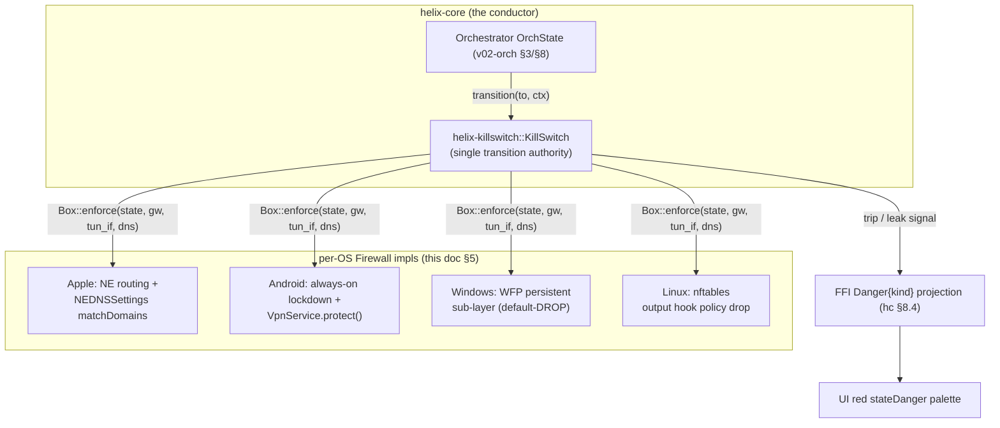
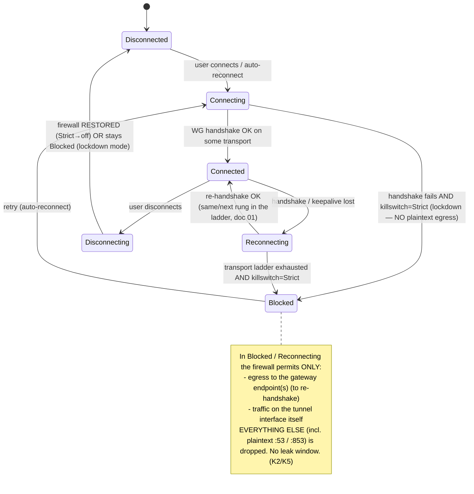
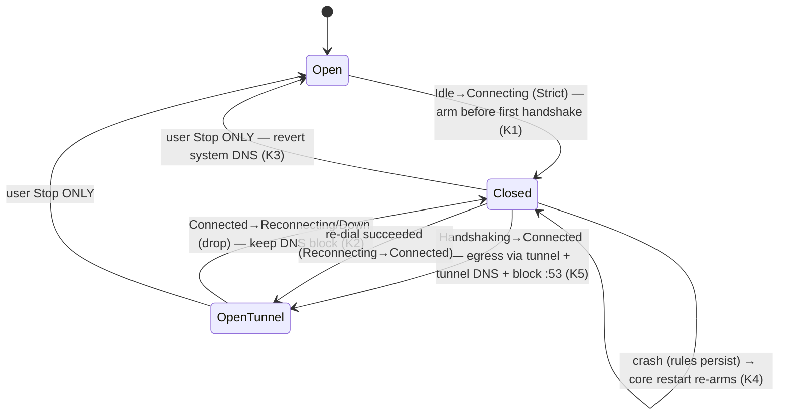
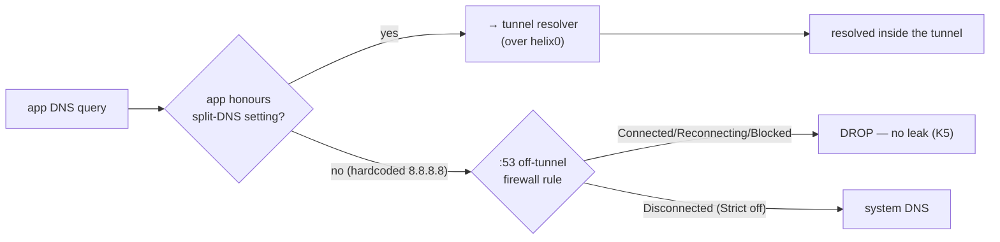
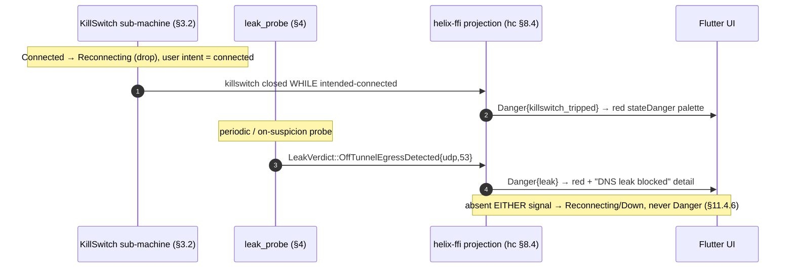

# Kill-switch & DNS-leak protection

**Revision:** 1
**Last modified:** 2026-06-25T12:00:00Z

> Master technical specification — **Volume 5 (Security & Privacy)**, nano-detail
> deep-dive. This document **deepens** the kill-switch / DNS-leak invariant
> ([`04-security-privacy-pki.md`](../04-security-privacy-pki.md) §8, invariant **S9**)
> into an implementation-ready specification of the **leak-proof firewall state
> machine**: how the core-owned `KillSwitch` arms *closed-before-the-first-handshake*,
> blocks every non-tunnel egress on a drop, and reverts only on a user-initiated
> stop; how each OS shim *realises* that single abstract state machine in its native
> firewall primitive (Apple NE routing + `NEDNSSettings`, Android always-on lockdown +
> `VpnService.protect()`, Windows WFP, Linux nftables); how DNS-leak and IPv6-leak
> windows are closed; and how a trip projects to the FFI `Danger` overlay the UI paints
> red. **SPEC ONLY** — it describes *what to build*, not the shipping product.
>
> **Ownership boundary.** The **state-machine bodies** (the `Firewall::enforce`
> contract, the side-effect matrix, the kill-switch ⇄ DNS coupling) are owned by the
> data-plane orchestrator, cited `[v02-orch §8]`
> ([`../v02-data-plane/orchestrator-and-state.md`](../v02-data-plane/orchestrator-and-state.md)).
> The **security invariant** (S9: no plaintext egress when the tunnel is down or
> escalating) is owned by the master security doc §8, cited `[04-SEC §8]`. The
> **per-OS firewall realisation** is owned by the four shim docs (cited `[shim-apple
> §N]`, `[shim-android §N]`, `[shim-windows §N]`, `[shim-linux §N]`). The **FFI
> `Danger` projection** is owned by the Rust client core, cited `[hc §5/§8]`
> ([`../v04-client/helix-core-rust.md`](../v04-client/helix-core-rust.md)). This
> document **owns** the *cross-platform synthesis*: the one abstract state machine, the
> per-OS capability matrix, the DNS/IPv6 leak-closure taxonomy, the honest-gap ledger,
> and the anti-bluff validation contract. It does **not** redefine the orchestrator
> loops, the `Transport` trait, or the WG crypto core.
>
> **Evidence base, cited inline by id.** `[04-SEC §N]` =
> [`../04-security-privacy-pki.md`](../04-security-privacy-pki.md); `[hc §N]` =
> [`../v04-client/helix-core-rust.md`](../v04-client/helix-core-rust.md); `[v02-orch §N]`
> = [`../v02-data-plane/orchestrator-and-state.md`](../v02-data-plane/orchestrator-and-state.md);
> `[shim-apple §N]` / `[shim-android §N]` / `[shim-windows §N]` / `[shim-linux §N]` = the
> four Volume-4 shim nano-docs; `[04_ARCH §N]` / `[04_P1 §N]` = the pass-1 architecture +
> Phase-1 MVP docs. Any claim not grounded in the evidence base is tagged `UNVERIFIED`
> per constitution §11.4.6 — never fabricated.

---

## Table of contents

- [0. Position, ownership, and invariants](#0-position-ownership-and-invariants)
- [1. The threat: a privacy VPN that leaks when the tunnel drops is broken](#1-the-threat-a-privacy-vpn-that-leaks-when-the-tunnel-drops-is-broken)
- [2. The abstract kill-switch state machine (one machine, all platforms)](#2-the-abstract-kill-switch-state-machine-one-machine-all-platforms)
- [3. Firewall posture per state — the rules the core emits](#3-firewall-posture-per-state--the-rules-the-core-emits)
- [4. The `Firewall` trait — the cross-platform seam](#4-the-firewall-trait--the-cross-platform-seam)
- [5. Per-OS enforcement realisation](#5-per-os-enforcement-realisation)
- [6. DNS-leak prevention](#6-dns-leak-prevention)
- [7. IPv6-leak closure](#7-ipv6-leak-closure)
- [8. The `Danger` projection — surfacing a trip to the UI](#8-the-danger-projection--surfacing-a-trip-to-the-ui)
- [9. Per-OS capability matrix + honest gaps](#9-per-os-capability-matrix--honest-gaps)
- [10. Anti-bluff validation (§11.4.107/§11.4.69)](#10-anti-bluff-validation-1141107114169)
- [11. Config knobs](#11-config-knobs)
- [12. Open decisions & cross-doc contracts](#12-open-decisions--cross-doc-contracts)
- [Sources verified](#sources-verified)

---

## 0. Position, ownership, and invariants

The kill-switch and DNS-leak protection are a **core-owned state machine**
(`helix-core`, the `helix-killswitch` crate), **never** hand-edited firewall rules an
operator can forget to apply or forget to revert [04-SEC §8, 04_ARCH §6 row]. The core
drives the OS firewall; **the rules are an *output* of the state machine, not an input**.
This is the load-bearing inversion: a VPN whose leak protection is a config-file the user
toggles has a leak window every time the config and the link state disagree. Here the
firewall posture is a *pure function of the `OrchState` transition* (O-I10/O-I11
[v02-orch §8]), re-applied **before** the network operation it guards, so there is no
instant where the UI shows "connected" while the firewall is open.

### 0.1 The invariants this document enforces

| # | Invariant | Enforced where | Source |
|---|---|---|---|
| **K1** | **Armed-closed-before-the-first-handshake.** In Strict mode the firewall installs the closed rule set on `Idle → Connecting` — *before* any packet can leave — so there is no pre-connect plaintext window. | §2, §3 | [v02-orch §8.2], [shim-linux §11.1] |
| **K2** | **Fail-closed on drop.** A lost handshake/keepalive transitions to `Reconnecting`/`Down` and the firewall **stays closed** (keeps the DNS block too). The user's apps cannot reach the underlay while the tunnel is re-dialling. | §2, §3 | [v02-orch §8.4], [04-SEC §8.1] |
| **K3** | **Revert only on user-stop.** The closed rule set is removed **only** on a user-initiated stop (`ShuttingDown → Down{stopped}`). Every other terminal (`auth-failed`, ladder-exhausted, crash) leaves it closed. | §2, §5 | [shim-windows §8.6], [shim-linux §8.6] |
| **K4** | **Survives crash.** If the core process dies, the closed firewall rules **remain** (Windows `FWPM_FILTER_FLAG_PERSISTENT`; Linux systemd `ExecStopPost`; the next `start()` re-arms). A crash must not become a leak. | §3, §5 | [v02-orch §8.4 crash row], [shim-windows §8.2] |
| **K5** | **DNS is forced through the tunnel; off-tunnel `:53`/`:853` is dropped** in every non-`Disconnected` state. A misbehaving app cannot reach a hardcoded `8.8.8.8`. | §6 | [04-SEC §8.3], [hc §8.1] |
| **K6** | **No partial IPv6 capture.** If the host has native IPv6, the core either routes the overlay v6 **and** blocks native v6 egress, or fully captures v6 — never a partial-capture leak. | §7 | [04-SEC §8.3] |
| **K7** | **A trip is surfaced, never hidden.** A kill-switch trip or a positive leak probe projects to the FFI `Danger{kind}` overlay and the red `stateDanger` palette — and is *never guessed* (raised only on a concrete signal). | §8 | [hc §5.2/§8.4], §11.4.6 |

### 0.2 What this document does NOT own

- The orchestrator state machine bodies and the `OrchState` enum — [v02-orch §3/§8].
- The `TunnelStatus` core 5-variant enum and its FFI projection mechanics — [hc §5].
- The transport ladder / re-dial backoff that drives `Reconnecting` — [v02-orch §7].
- The WireGuard crypto handshake whose success drives `Connected` — doc 01.



---

## 1. The threat: a privacy VPN that leaks when the tunnel drops is broken

The end-user promise of a privacy VPN is "my real IP and my DNS queries are never
visible on the underlay." That promise is **easiest to break at the seams** — the
moments the tunnel is *not* steadily up:

| Leak window | What leaks | Without a kill-switch |
|---|---|---|
| **Pre-connect** (app sends before the tunnel is up) | real IP + plaintext DNS to the underlay | every packet before the first handshake escapes |
| **Mid-session drop** (Wi-Fi flap, server restart, transport ladder re-dial) | real IP for the entire reconnect window | the OS silently falls back to the physical interface |
| **DNS bypass** (app hardcodes `8.8.8.8` / uses DoH to a public resolver) | the destinations the user visits | tunnel-DNS settings alone do not block a hardcoded resolver |
| **IPv6 fall-through** (overlay is v4/ULA-v6 only, host has native v6) | real v6 address + v6 destinations | native v6 egress bypasses a v4-only tunnel |
| **Crash / extension restart** | everything until the process re-arms | the firewall is gone with the process |

Each row is a real, observed failure class in commodity VPNs. HelixVPN closes **all five**
by construction: the firewall is armed *before* the first handshake (closes pre-connect),
stays closed on drop (closes mid-session), drops off-tunnel `:53` (closes DNS bypass for
plaintext; DoH/DoT handled in §6.4), captures-or-blocks v6 (closes IPv6 fall-through), and
persists the closed rules across a crash (closes the restart window). The **acceptance
test** is mechanical: drop the tunnel mid-transfer and assert via packet capture on the
host's *physical* interface that **zero** plaintext packets — including `:53` — egress
during `Reconnecting`/`Blocked` [04-SEC §8.4, 04_P1 §11 DoD #6]. See §10.

---

## 2. The abstract kill-switch state machine (one machine, all platforms)

There is exactly **one** kill-switch state machine. It lives in `helix-core`; every OS
shim implements only the `Firewall::enforce` primitive it calls (§4). The link states
mirror the orchestrator's `OrchState` and the `TunnelStatus` it broadcasts [hc §5,
v02-orch §4.1]; `Blocked` is the hard-lockdown sub-state the kill-switch adds.



### 2.1 The single transition authority

```rust
// helix-core/crates/helix-killswitch/src/sm.rs  (contract — state machine, not full impl)
// [04-SEC §8.4 reproduced; the body coupling is owned by v02-orch §8]
#[derive(Clone, Copy, PartialEq, Eq)]
pub enum LinkState { Disconnected, Connecting, Connected, Reconnecting, Blocked, Disconnecting }

pub enum KillSwitchMode { Strict, Permissive, Off }   // maps from Shields.kill_switch (hc §8.1)

pub struct LinkCtx {
    pub gateways: Vec<SocketAddr>,   // allow_gateway_endpoints — stay reachable to re-handshake
    pub tun_if:   String,            // the tun/wg carrier device name
    pub dns:      Vec<IpAddr>,       // tunnel DNS servers (from RouteMap.dns)
    pub allow_lan: bool,             // permit RFC1918 LAN while closed (printers etc.)
}

pub struct KillSwitch { fw: Box<dyn Firewall>, mode: KillSwitchMode }

impl KillSwitch {
    /// THE single authority for the transition. On EVERY transition it re-enforces the
    /// firewall BEFORE the network operation, so no plaintext can escape during the change
    /// (S9/K1/K2). Idempotent: re-applying the same state is a no-op at the OS layer.
    pub fn transition(&mut self, to: LinkState, ctx: &LinkCtx) -> Result<(), FwError> {
        if matches!(self.mode, KillSwitchMode::Off) { return self.fw.restore(); }
        self.fw.enforce(to, &ctx.gateways, &ctx.tun_if, &ctx.dns)?;   // firewall FIRST…
        // …then the orchestrator's link operation (bring up/down peer) proceeds (v02-orch §8).
        Ok(())
    }
}
```

The **ordering is the invariant**: `enforce` runs *before* the link op, so even a
transition that is about to open the tunnel first installs the closed-or-tunnel-only rule
set. There is never a window where the orchestrator has changed `OrchState` but the
firewall has not yet caught up (F-I4 [hc §0.3]).

### 2.2 Mode semantics

| `KillSwitchMode` | Behaviour | Typical user |
|---|---|---|
| **`Strict`** | armed-closed before the first handshake; fail-closed on every drop; `Blocked` lockdown when re-dial fails; revert only on user-stop | privacy client (default for Helix Access) |
| **`Permissive`** | tunnel-DNS + off-tunnel `:53` block while `Connected`, but a drop reverts to system networking (no `Blocked` lockdown) | a user who prefers connectivity-over-privacy on drop (explicit opt-out, surfaced not silent) |
| **`Off`** | no firewall side effects; `restore()` keeps the host's pre-VPN posture | the connector appliance (`KillSwitchMode::Off` default [v02-orch §9.4]) |

`Strict` is the default for the privacy client; the connector defaults to `Off` because it
is an appliance, not a privacy endpoint [hc §9.4, v02-orch §9.4]. `Permissive` exists so
the "connectivity on drop" choice is an **explicit, surfaced** mode, never an
undocumented silent fallback (§11.4.6).

---

## 3. Firewall posture per state — the rules the core emits

This is the abstract rule set every shim realises. The columns are the *intent*; §5 maps
each to a native primitive.

| State | Allowed egress | DNS | FFI projection | Notes |
|---|---|---|---|---|
| `Disconnected` | all (Strict→off) **or** none (lockdown-on-disconnect toggle) | system | `Disconnected` | lockdown toggle = "block until connected" |
| `Connecting` / `Reconnecting` | **only** to gateway endpoint IP:port | blocked (no off-tunnel `:53`) | `Connecting` / `Reconnecting` | prevents leak during the escalation ladder |
| `Connected` | **only** via the tunnel `utun`/`wg0` + the gateway endpoint | tunnel DNS only; off-tunnel `:53`/`:853` dropped | `Connected{...}` | the only steady state |
| `Blocked` | **only** to the gateway endpoint (to recover) | blocked | `Reconnecting` or `Danger{killswitch_tripped}` | hard lockdown; UI shows "protected, reconnecting" |

### 3.1 The side-effect matrix (drives both the firewall and the `Danger` projection)

This matrix is the canonical coupling [v02-orch §8.4, hc §8.2]; the FFI column is the §8
projection.

| Transition | Kill-switch (Strict) | DNS | FFI projection |
|---|---|---|---|
| `Idle → Connecting` | install **closed** (allow gateway endpoints only) — **K1** | system DNS | `Connecting` |
| `Handshaking → Connected` | **open** (egress via tunnel) | apply tunnel DNS + block off-tunnel `:53` — **K5** | `Connected{transport,rtt}` |
| `Connected → Reconnecting` (drop) | **close** — **K2** (O-I11) | keep tunnel-DNS block (fail-closed) | `Reconnecting` |
| `* → Down{reason≠stopped}` | **stay closed** — **K3** | keep block | `Down{reason}` (or `Danger{killswitch_tripped}` if a leak probe fired) |
| `ShuttingDown → Down{stopped}` (user) | revert to **off** (open) — **K3** | revert system DNS | `Disconnected` |
| crash / panic | closed rules **remain** — **K4** | block **remains** | (process restarts; `start()` re-arms) |

### 3.2 The kill-switch ⇄ DNS sub-machine



### 3.3 `auth-failed` is closed-and-terminal

A revoked device — whose `peers_removed` delta includes the *active* gateway (the
revocation path, [hc §7.3]) — reaches `Down{auth-failed}` with the kill-switch **closed**
and DNS **blocked**. A revoked client **cannot leak onto the underlay by virtue of being
revoked** [hc §8.5, v02-orch §8.5]: the firewall is in the `Closed` state, not `Open`.
Recovery requires explicit user re-enroll through `start()`. This is the security
intersection of revocation (S5, [04-SEC §4.6]) and the kill-switch (S9): a sub-second
revocation does not merely stop the tunnel, it leaves the device *leak-proofed*.

---

## 4. The `Firewall` trait — the cross-platform seam

Every shim implements **one** trait; the abstract state machine (§2) is platform-agnostic.

```rust
// helix-core/crates/helix-killswitch/src/firewall.rs  (the seam each shim implements)
// [04-SEC §8.4 reproduced; impls owned by the four shim docs §5]
pub trait Firewall {
    /// Apply the leak-proof rule set for `state`. MUST be ATOMIC — there is no transient
    /// open window between flushing the old rules and installing the new (K1). On a platform
    /// whose primitive is non-atomic, the impl uses a transaction/lock (nft atomic ruleset,
    /// WFP transaction) so a reader never observes a half-applied posture.
    fn enforce(&self, state: LinkState, gw: &[SocketAddr], tun_if: &str, dns: &[IpAddr])
        -> Result<(), FwError>;

    /// Restore the host's pre-VPN firewall. Called ONLY on Disconnected when the mode is Off
    /// or on a user-initiated stop (K3). Never called on a drop.
    fn restore(&self) -> Result<(), FwError>;

    /// Probe: does any off-tunnel egress currently escape? Used by the leak probe (§8/§10)
    /// to raise Danger{leak} on positive evidence — never to guess (§11.4.6).
    fn leak_probe(&self, tun_if: &str) -> Result<LeakVerdict, FwError>;
}

pub enum LeakVerdict { Clean, OffTunnelEgressDetected { proto: String, dport: u16 } }

pub enum FwError {
    /// The host firewall could not be programmed. The core treats this as HostFatal:
    /// it REFUSES to run a tunnel it cannot leak-protect (maps to CoreError::HostFatal, hc §10.1).
    EnforceFailed(String),
    NotPermitted(String),    // missing CAP_NET_ADMIN / WFP access / NE entitlement
}
```

The **`EnforceFailed → HostFatal`** rule is load-bearing: if the firewall cannot be
programmed, the core does **not** silently run an unprotected tunnel — it emits
`Down{host-fatal}` and `start()` returns `Err(HostFatal)` [hc §10.1]. A VPN that cannot
guarantee leak protection is honestly refused, not optimistically run. This is the §11.4
anti-bluff posture at the firewall layer: no "probably protected" PASS.

---

## 5. Per-OS enforcement realisation

One abstract machine, five native primitives. Each shim owns the column-3 mechanism; this
section is the synthesis with concrete rule sketches and exact citations.

### 5.1 Linux — nftables `output`-hook default-drop

The reference platform [shim-linux §11]. The kill-switch is an nftables table whose
`output` chain has `policy drop`, installed at `Idle → Connecting` (Strict):

```nftables
# helix-netd installs this at Idle→Connecting (Strict). [shim-linux §11.1]
table inet helix_killswitch {
  chain output {
    type filter hook output priority 0; policy drop;        # default-DROP egress (fail-closed, K1/K2)
    oifname "helix0" accept                                 # the tun/wg carrier device (tunnel traffic)
    ip  daddr <gateway_endpoints> udp dport 443 accept      # allow_gateway_endpoints (re-handshake)
    ip  daddr <gateway_endpoints> tcp dport 443 accept      # masque / uot dial
    ip6 daddr <gateway_endpoints6> udp dport 443 accept     # dual-stack gateway reach (K6)
    meta l4proto { icmp, icmpv6 } accept                    # ND / DHCP link bring-up
    ip  daddr <rfc1918> accept                              # allow_lan (config; printers etc.)
  }
}
# Plaintext :53 leak guard (block_plaintext_53 when Connected) — [shim-linux §11.2]:
#   chain output { ... meta l4proto { udp, tcp } th dport 53 oifname != "helix0" drop; }
```

- **`<gateway_endpoints>`** = `KillSwitchConfig.allow_gateway_endpoints` [v02-orch §8.2]
  — interpolated by the core, never hand-edited.
- **Fail-closed across crash (K4):** the table **stays installed on crash**; the systemd
  unit's `ExecStopPost=/usr/lib/helixvpn/helix-netd --flush-killswitch-on-crash` is the
  *only* path that flushes it, and only on a *user* stop [shim-linux §8.6, §11.1].
- **Atomicity:** the impl swaps the ruleset with an `nft -f` atomic transaction so no
  reader observes a half-applied table.
- **DNS:** conditional on the host stack — `resolvectl dns helix0 <dns>` +
  `resolvectl domain helix0 '~.'` (systemd-resolved), `resolvconf -a helix0` (resolvconf),
  or an atomic `/etc/resolv.conf` rewrite-with-backup-and-restore (static) [shim-linux §11.2].

### 5.2 Windows — WFP persistent sub-layer

A privileged `SYSTEM` service hosts the core and installs WFP filters [shim-windows §8].
On `Idle → Connecting` (Strict) it installs a **default-block** filter at the outbound IP
layers plus narrow permits:

```text
# WFP filters [shim-windows §8.2] — installed FWPM_FILTER_FLAG_PERSISTENT (survive crash, K4)
Layers:  FWPM_LAYER_OUTBOUND_IPPACKET_V4 / _V6      (dual-stack, K6)
Default: policy = DROP
Permits:
  - ip.remote_address ∈ allow_gateway_endpoints  (udp dport 443, tcp dport 443)
  - ip.local_interface = wintun LUID             (tunnelled traffic via the adapter)
  - meta l4proto { icmp, icmpv6 }                (ND / bootstrap)
  - ip.daddr ∈ RFC1918  (only if allow_lan)
# DNS guard [shim-windows §8.3] — on Handshaking→Connected:
  - drop any :53 (UDP+TCP) egress NOT over the wintun interface
  - apply tunnel DNS via SetInterfaceDnsSettings on the adapter LUID
# Per-app split: dynamic FWPM_CONDITION_ALE_APP_ID at ALE_AUTH_CONNECT [shim-windows §8.5]
```

- **Persistent filters survive a service crash (K4)** — the `FWPM_FILTER_FLAG_PERSISTENT`
  flag means the block holds even if `HelixTunnelSvc` dies; the next start reconciles.
- **The only open path (K3):** the persistent kill-switch is removed **only** on a
  user-initiated `StopTunnel → ShuttingDown → Down{stopped}`; every other terminal (crash,
  `auth-failed`, ladder-exhausted) leaves it closed [shim-windows §8.6].
- The full transition→filter coupling is the [shim-windows §8.4] table (mirrors §3.1).

### 5.3 Android — always-on lockdown + `protect()`

Android has no in-process firewall API for an app; the kill-switch is the **system**
always-on VPN with **"Block connections without VPN" (lockdown)** [shim-android §9.2]. The
OS drops all non-VPN egress at the routing layer when lockdown is enabled; the core's
`KillSwitch` state machine drives *when* the tunnel should be up, the OS lockdown is the
*platform mechanism*.

```kotlin
// Loopback avoidance — the Android-specific kill-switch corollary [shim-android §6.2]
// EVERY outbound transport socket the core opens MUST be protect()ed BEFORE connect(),
// else the tunnel's own packets loop back into the tun.
override fun protect(fd: Int): Boolean = protect(fd)   // VpnService.protect(int)
```

```rust
// helix-core: a failed protect() is a HARD dial error — never connect unprotected. [shim-android §6.2]
if !PROTECT.get().map_or(false, |cb| cb.protect(sock.as_raw_fd())) {
    return Err(TransportError::Io(io::Error::other("protect() failed")));
}
sock.connect(&peer.into())?;
```

- **DNS leak guard:** `b.addDnsServer(<tunnel-dns>)` for every tunnel resolver; with a
  full-tunnel `0.0.0.0/0` + `::/0` route set and no bypass route, off-tunnel `:53` cannot
  egress [shim-android §10.2].
- **Split-tunnel:** `VpnService.Builder.addDisallowedApplication(pkg)` (exclude-list
  model); an unknown package is skipped honestly, never aborts the tunnel
  [shim-android §10.1].
- **`protect()` is the kill-switch's twin:** without it the core would leak its *own*
  encrypted transport packets back through the tunnel — a loop, not a plaintext leak, but
  the same "socket escaped the intended path" defect class [shim-android §6].

### 5.4 Apple — NE routing + `NEDNSSettings`

The iOS/macOS `NEPacketTunnelProvider` extension has **no in-extension firewall** (the NE
sandbox provides none); the kill-switch is **protocol/routing enforcement** via the
Network Extension framework [shim-apple §3.4]:

```swift
// [shim-apple §3.2] — DNS forced into the tunnel; off-tunnel :53 blocked by OS routing
let dns = NEDNSSettings(servers: cfg.dnsServers)
dns.matchDomains = [""]                        // match ALL domains → no plaintext :53 off-tunnel (K5)
settings.dnsSettings = dns
// IPv6 capture (K6):
if let v6 = cfg.overlayIp6 {
  let s6 = NEIPv6Settings(addresses: [v6], networkPrefixLengths: [128])
  s6.includedRoutes = cfg.routes6.map { /* … */ }
  settings.ipv6Settings = s6
}
// Kill-switch routing: NETunnelProviderProtocol.includeAllNetworks = true
//   (+ excludeLocalNetworks if allow_lan) — [shim-apple §3.4]
```

- **Kill-switch = `includeAllNetworks`** plus `NEOnDemandRule` for always-on/lockdown; the
  OS routes *all* networks into the tunnel and there is no in-extension firewall to leak
  around [shim-apple §3.4].
- **Honest gap (UNVERIFIED, [shim-apple §3.4]):** whether `includeAllNetworks` fully
  blocks egress during the **extension-restart window** on *every* iOS version is
  *measured* in the G3 / SC soak, never assumed. This is a tracked, captured-evidence item
  (§9, §10), not a claimed guarantee.

---

## 6. DNS-leak prevention

DNS leakage is the subtlest privacy failure: the tunnel may carry the *traffic*, but if a
single query escapes to a public resolver, the destinations the user visits are exposed.
HelixVPN closes the plaintext path mechanically and documents the encrypted-resolver path
honestly.

### 6.1 Force all DNS through the tunnel

The core sets the **tunnel DNS** — pushed in the `NetworkMap` as `dns_servers` +
`search_domains` [04-SEC §8.3, hc §7.1] — and applies it via the platform's split-DNS
API: Apple `NEDNSSettings.servers` + `matchDomains=[""]`, Android
`VpnService.Builder.addDnsServer`, Windows `SetInterfaceDnsSettings` (NRPT-class), Linux
`resolvectl dns <if>` + `resolvectl domain <if> '~.'`. `matchDomains=[""]` /
`domain '~.'` is the "route *all* domains through this resolver" idiom — a partial
match-domain set would leak the unmatched domains.

### 6.2 Block plaintext `:53`/`:853` off-tunnel

The split-DNS *setting* tells well-behaved apps which resolver to use; it does **not** stop
an app that hardcodes `8.8.8.8`. So the firewall rule is the **belt-and-suspenders
backstop** [04-SEC §8.3]: in every non-`Disconnected` state, drop UDP+TCP `:53` (plaintext
DNS) and `:853` (DoT) that is **not** destined for the tunnel resolver over the tunnel
interface. The Linux rule (`th dport 53 oifname != "helix0" drop`), the Windows WFP `:53`
filter, and the Apple `matchDomains=[""]` routing each realise this; Android relies on the
no-bypass-route full-tunnel posture.

### 6.3 The two layers, why both



The split-DNS setting handles the 99% well-behaved case cheaply; the firewall rule catches
the hostile/buggy 1%. Setting *or* rule alone is a leak; both together is the guarantee.

### 6.4 DoH / DoT — the honest boundary

Plaintext `:53` and DoT `:853` are blocked off-tunnel by the firewall rule. **DoH** (DNS
over HTTPS on `:443`) is *indistinguishable from ordinary HTTPS at the firewall layer* — a
`:443` drop would break the web. The honest posture:

- **Plaintext `:53` / DoT `:853`:** mechanically blocked off-tunnel (§6.2). **Closed.**
- **DoH to a public resolver on `:443`:** **`UNVERIFIED` / out-of-firewall-scope.** The
  firewall cannot distinguish a DoH POST from a web request. Mitigation options, surfaced
  not silently chosen (§11.4.66): (a) the OS-level "disable private DNS / DoH" enterprise
  control on managed Android/Windows; (b) an app-level resolver-allowlist where the
  platform exposes one; (c) accept that an app *deliberately* configured for public DoH is
  the user's own choice — the VPN routes the `:443` bytes through the tunnel regardless, so
  the DoH query travels *inside* the tunnel and is **not** an underlay leak as long as the
  full-tunnel route holds. The genuine residual leak is a *split-tunnelled* app doing DoH
  to a public resolver on an excluded route — a documented split-tunnel caveat, tracked
  per §9, never claimed closed.

This DoH boundary is stated as a fact, not a guess: the firewall closes plaintext and DoT;
DoH-on-443 inside a full tunnel is not an underlay leak; DoH-on-443 on a split-tunnelled
route is a documented residual the operator configures around.

---

## 7. IPv6-leak closure

The classic dual-stack leak: the overlay is IPv4 (or ULA IPv6 via 4via6 [doc 03/D4]) but
the host has **native** IPv6 connectivity. A v4-only tunnel leaves native v6 egress on the
physical interface — the user's real v6 address and v6 destinations escape.

The rule (**K6**): the core **never** leaves a partial v6 capture. Two acceptable postures,
chosen by the platform's capability:

| Posture | Mechanism | Platforms |
|---|---|---|
| **Full v6 capture** | route `::/0` (or the overlay v6 prefix) into the tunnel; native v6 egress is then subject to the same kill-switch rules as v4 | Apple `NEIPv6Settings.includedRoutes`; Android `addRoute(::/0)`; Windows WFP `_V6` layer; Linux `inet6` nft family |
| **v6 block** | if the overlay carries no v6, drop *all* native v6 egress in the kill-switch (so v6 cannot fall through) | Linux nft `ip6` drop; Windows WFP `_V6` default-DROP; Apple — relies on `includeAllNetworks` |

What is **forbidden** is the third, leaky posture: overlay v6 present but native v6 egress
left open on the physical interface. The kill-switch rule sets are dual-stack by
construction — Linux nft has both `ip` and `ip6` daddr rules, Windows installs filters at
both `FWPM_LAYER_OUTBOUND_IPPACKET_V4` **and** `_V6`, Apple sets `NEIPv6Settings`
alongside `NEIPv4Settings` [shim-windows §8.2, shim-apple §3.2]. `UNVERIFIED`: the exact
interaction of `includeAllNetworks` with a host that gains native v6 *mid-session* on iOS
is a measured item (§9), not an assumed guarantee.

---

## 8. The `Danger` projection — surfacing a trip to the UI

A leak-proof firewall is necessary but not sufficient: the user must *see* that the tunnel
dropped and they are now in lockdown, not be told "connected" while re-dialling. The FFI
projects a kill-switch trip or a positive leak probe to the `Danger{kind}` overlay [hc §5.2,
§8.4].

### 8.1 The two danger kinds (raised only on a concrete signal)

```rust
// helix-ffi FfiTunnelStatus (hc §5.1) — Danger is an FFI-only overlay, the core never emits it.
Danger { kind: String },   // kind ∈ { "killswitch_tripped", "leak" }
```

- **`kind="killswitch_tripped"`** — the §3.2 sub-machine reports the kill-switch **closed
  while the user intends connected** (a drop the user can see). Raised on the
  `Connected → Reconnecting/Blocked` transition when the user's intent is "connected".
- **`kind="leak"`** — an **explicit** DNS/leak probe (`Firewall::leak_probe`, §4) returns
  `OffTunnelEgressDetected`. Raised only on a *positive probe result*, never inferred.

### 8.2 Never guessed (§11.4.6)

`Danger` is **not** a guessed UI state. Absent a concrete signal — the sub-machine
reporting closed-while-intended-connected, or a leak probe firing — the FFI emits
`Reconnecting` / `Down`, **never** `Danger` [hc §5.1 consistency note]. This is the
no-guessing mandate at the UI layer: the red `stateDanger` palette appears only when the
system has captured evidence of a danger condition, so a red screen is always a *true
positive*, never an alarmist guess. Conversely, a real trip is **never** hidden behind an
optimistic `Connected` — `Danger` overrides any optimistic UI intent and paints red
immediately [hc §8.4].



---

## 9. Per-OS capability matrix + honest gaps

The single abstract machine maps to five primitives of **differing strength**. This matrix
states, per OS, what is mechanically guaranteed vs. what is `UNVERIFIED` / operator-attended
— the honest-gap ledger (§11.4.6: a capability is `UNVERIFIED` until measured on a real
device, never assumed).

| Capability | Linux | Windows | Android | Apple (iOS/macOS) |
|---|---|---|---|---|
| **Kill-switch primitive** | nftables `output` `policy drop` [shim-linux §11.1] | WFP persistent sub-layer default-DROP [shim-windows §8.2] | always-on VPN + lockdown (OS) [shim-android §9.2] | `includeAllNetworks` routing [shim-apple §3.4] |
| **Arms before first handshake (K1)** | ✅ installed at `Idle→Connecting` | ✅ persistent filter installed at Connecting | ⚠️ relies on OS lockdown being enabled (user/MDM setting) | ✅ NE config applied before pump |
| **Fail-closed on drop (K2)** | ✅ table stays | ✅ filter stays | ✅ lockdown holds | ✅ routing holds |
| **Survives crash (K4)** | ✅ `ExecStopPost`-gated flush only | ✅ `FWPM_FILTER_FLAG_PERSISTENT` | ✅ OS lockdown is OS-side | ⚠️ **UNVERIFIED** extension-restart window [shim-apple §3.4] |
| **Off-tunnel `:53` block (K5)** | ✅ nft `:53 oifname != helix0 drop` | ✅ WFP `:53` filter | ✅ full-tunnel + no bypass route | ✅ `matchDomains=[""]` |
| **DoT `:853` block** | ✅ same nft rule (dport 853) | ✅ WFP filter | ✅ no bypass route | ✅ routing |
| **DoH-on-443 off-tunnel** | ⚠️ out-of-firewall-scope (§6.4) | ⚠️ out-of-firewall-scope (§6.4) | ⚠️ (enterprise DoH control on MDM) | ⚠️ out-of-firewall-scope (§6.4) |
| **IPv6 capture/block (K6)** | ✅ `inet6` family rules | ✅ `_V6` WFP layer | ✅ `addRoute(::/0)` | ⚠️ **UNVERIFIED** mid-session native-v6 gain [shim-apple §3.2] |
| **Self-protect socket loopback** | n/a (routing) | n/a (WFP) | ✅ `protect()` mandatory [shim-android §6] | n/a (NE owns the socket) |

### 9.1 The tracked honest gaps (each a captured-evidence item, never a claimed PASS)

| Gap | OS | Posture | Resolution path |
|---|---|---|---|
| `includeAllNetworks` egress during the extension-restart window | iOS | `UNVERIFIED` [shim-apple §3.4] | measured in the G3 / SC on-device soak (§10); tracked migration item, not a claimed guarantee |
| native-v6 gained mid-session | iOS | `UNVERIFIED` [shim-apple §3.2] | on-device dual-stack capture test (§10) |
| always-on lockdown **not enabled** by the user/MDM | Android | ⚠️ operator/user-attended | the app surfaces a "enable Always-on VPN + lockdown" prompt; until enabled, the core's kill-switch is the only layer (no OS backstop) — documented, not silently assumed protected |
| DoH-on-443 on a split-tunnelled excluded route | all | ⚠️ documented residual (§6.4) | enterprise DoH control / resolver allowlist where the platform exposes one; surfaced per §11.4.66 |

**No gap is a faked PASS.** Each is either `UNVERIFIED` pending a captured-evidence
measurement, or an operator/user-attended condition the app surfaces. The §11.4
anti-bluff posture forbids reporting "leak-proof on iOS" when the extension-restart window
is unmeasured — it is reported as `UNVERIFIED` with a tracked resolution path.

---

## 10. Anti-bluff validation (§11.4.107/§11.4.69)

The kill-switch claim is validated by **captured packet-level evidence**, never an
absence-of-error PASS [04-SEC §8.4, 04_P1 §11 DoD #6]. The canonical DoD test:

1. Establish a tunnel; start a continuous transfer.
2. **Drop the tunnel mid-transfer** (block the gateway endpoint at the upstream, or stop
   the edge) so the orchestrator transitions `Connected → Reconnecting → Blocked`.
3. **Capture on the host's *physical* interface** (`tcpdump`/`pktap`) for the entire
   `Reconnecting`/`Blocked` window.
4. **Assert zero plaintext packets egress** — including `:53` DNS — during the window. A
   single leaked packet is a FAIL. The captured pcap is the evidence (sink-side positive
   evidence per §11.4.69, captured-evidence per §11.4.107), not a green log line.

### 10.1 The test matrix (per §11.4.169, captured evidence per row)

| Test id | §11.4.169 codes | What it proves | Captured evidence |
|---|---|---|---|
| KS-1 | `SEC` | kill-switch closes on drop: **no plaintext egress** while `Reconnecting`/`Blocked`; off-tunnel `:53` dropped when `Connected` | physical-iface pcap shows ZERO leaked packets (mirrors [hc §12] HC-8) |
| KS-2 | `SEC` | pre-connect armed-closed (K1): packets sent *before* the first handshake do not escape | pcap during `Idle→Connecting` window |
| KS-3 | `SEC`+`CHAOS` | crash persistence (K4): SIGKILL the core mid-`Connected` → closed rules remain; no leak until re-arm | pcap across the kill→restart window; nft/WFP rule dump post-kill |
| KS-4 | `SEC` | DNS leak: an app hardcoding `8.8.8.8` cannot resolve off-tunnel when `Connected` | pcap shows the `:53` packet DROPPED |
| KS-5 | `SEC` | IPv6 leak (K6): host with native v6 → no native-v6 egress escapes the tunnel | dual-stack pcap |
| KS-6 | `E2E`+`UI` | `Danger{killswitch_tripped}` projects on a real drop; `Danger{leak}` projects on a positive probe; neither is raised absent a signal | `FfiTunnelStatus` event trace + window-scoped MP4 of the red palette (§11.4.159) |
| KS-7 | `SEC` (iOS) | the §9.1 extension-restart-window gap: measured, not assumed | on-device pcap across an NE restart — resolves the `UNVERIFIED` marker or files the migration item |

### 10.2 Self-validating the analyzer (§11.4.107(10))

Each leak-test ships a paired §1.1 mutation so the gate provably cannot bluff: emit a
`Connected` projection *before* the firewall opens → KS-1 must FAIL; a golden-bad pcap
*with* a leaked `:53` packet → the pcap analyzer must FAIL it (a golden-good leak-free pcap
PASSes). An analyzer that PASSes its golden-bad fixture is itself a bluff gate. The
`leak_probe` (§4) is likewise validated: a synthetic off-tunnel socket must make it return
`OffTunnelEgressDetected`, a clean run `Clean`.

---

## 11. Config knobs

```rust
// helix-core — configured by start() from Shields + RouteMap [hc §8.1, 04-SEC §8]
pub struct KillSwitchConfig {
    pub mode: KillSwitchMode,                 // Strict | Permissive | Off (§2.2)
    pub allow_lan: bool,                      // permit RFC1918 LAN while closed (printers etc.)
    pub allow_gateway_endpoints: Vec<IpNet>,  // gateway IPs the transport MUST reach (stay open)
    pub lockdown_on_disconnect: bool,         // "block until connected" toggle for Disconnected
}
pub struct DnsConfig {
    pub servers: Vec<IpAddr>,                 // tunnel DNS (from RouteMap.dns)
    pub block_plaintext_53: bool,             // drop off-tunnel :53/:853 when Connected (leak guard)
    pub apply: DnsApplyMethod,                // resolvconf | systemd-resolved | /etc/resolv.conf | shim
}
```

The FFI `Shields` (§4.2 of [hc]) maps onto these: `kill_switch=true ⇒ KillSwitchMode::Strict`;
`dns_protection=true ⇒ block_plaintext_53=true`. `set_shields()` re-applies live (no
restart) [hc §8.1]. Every numeric default is calibrated against captured evidence before it
is frozen (§11.4.6 — a number is a guess until measured); none is hardcoded as a guarantee.

---

## 12. Open decisions & cross-doc contracts

### 12.1 Decisions surfaced (options + recommendation, never silently resolved — §11.4.6/§11.4.66)

| # | Decision | Option A | Option B | Recommendation |
|---|---|---|---|---|
| **D-KS-1** | DoH-on-443 off-tunnel posture | accept (DoH inside full tunnel is not an underlay leak); document the split-tunnel residual | enterprise DoH-disable control on MDM platforms | **A** for the default; **B** offered to managed tenants — the split-tunnel residual is documented, never claimed closed (§6.4) |
| **D-KS-2** | Android lockdown enforcement | rely on user/MDM enabling Always-on VPN + lockdown | ship the core kill-switch as the sole layer with an in-app "enable lockdown" prompt | **both layers** — core kill-switch always on; surface the OS-lockdown prompt; never silently assume the OS backstop is present (§9.1) |
| **D-KS-3** | iOS extension-restart-window guarantee | claim leak-proof | measure on-device, mark `UNVERIFIED` until proven | **B** — measure in G3/SC (§10); the marker is honest until the pcap exists (§11.4.6) |

### 12.2 Cross-document contracts this document fixes

| Contract | Fixed value | Consumed by / source |
|---|---|---|
| The abstract kill-switch state machine (`LinkState`, the side-effect matrix) | §2/§3 | [v02-orch §8] owns the bodies; this doc owns the cross-platform synthesis |
| The `Firewall` trait seam (`enforce`/`restore`/`leak_probe`, `EnforceFailed → HostFatal`) | §4 | the four shim `Firewall` impls; [hc §10.1] for the error mapping |
| The DNS leak-closure taxonomy (split-DNS setting + `:53` block + DoH boundary) | §6 | [shim-* §DNS], [04-SEC §8.3] |
| The `Danger{kind}` projection contract (raised only on a concrete signal) | §8 | [hc §5.2/§8.4], the Flutter UI |
| The per-OS capability matrix + honest-gap ledger | §9 | [shim-apple §3], [shim-android §6/§9/§10], [shim-windows §8], [shim-linux §11] |
| The anti-bluff DoD (physical-iface pcap, zero plaintext) | §10 | [04-SEC §8.4], [04_P1 §11 DoD #6], [hc §12 HC-8] |

---

## Sources verified

- [`../04-security-privacy-pki.md`](../04-security-privacy-pki.md) `[04-SEC]` — §0.1 (S9
  invariant), §8 (kill-switch & DNS-leak state machine, the §8.2 posture table, §8.3 DNS
  specifics + IPv6, §8.4 Rust `Firewall` skeleton + anti-bluff pcap DoD), §4.6 (revocation
  intersection with §8.5 `auth-failed`).
- [`../v04-client/helix-core-rust.md`](../v04-client/helix-core-rust.md) `[hc]` — §5.1/§5.2
  (`FfiTunnelStatus` projection, the `Danger{kind}` overlay), §8.1 (`KillSwitchConfig` /
  `DnsConfig` + `Shields` mapping), §8.2 (side-effect matrix), §8.3 (sub-machine), §8.4
  (`Danger` projection raised only on a concrete signal), §8.5 (`auth-failed`
  closed-and-terminal), §10.1 (`CoreError::HostFatal`), §12 (HC-8 kill-switch test point).
- [`../v02-data-plane/orchestrator-and-state.md`](../v02-data-plane/orchestrator-and-state.md)
  `[v02-orch]` — §8 (the kill-switch/DNS coupling bodies, O-I10/O-I11 fail-closed), §8.2
  (`allow_gateway_endpoints`), §8.4 (side-effect matrix incl. crash row), §8.5 (`auth-failed`),
  §9.4 (connector `KillSwitchMode::Off`).
- [`../v04-client/shim-apple.md`](../v04-client/shim-apple.md) `[shim-apple]` — §3.2
  (`NEDNSSettings.matchDomains=[""]`, `NEIPv6Settings.includedRoutes`), §3.4 (kill-switch =
  `includeAllNetworks`; the `UNVERIFIED` extension-restart-window marker).
- [`../v04-client/shim-android.md`](../v04-client/shim-android.md) `[shim-android]` — §6
  (`protect()` loopback-avoidance contract), §9.2 (always-on VPN + lockdown kill-switch),
  §10.1 (`addDisallowedApplication` split-tunnel), §10.2 (`addDnsServer` DNS leak guard).
- [`../v04-client/shim-windows.md`](../v04-client/shim-windows.md) `[shim-windows]` — §8.2
  (WFP persistent default-DROP sub-layer, `FWPM_FILTER_FLAG_PERSISTENT`, dual-stack
  `_V4`/`_V6`), §8.3 (`:53` DNS guard + `SetInterfaceDnsSettings`), §8.4 (coupling table),
  §8.5 (`FWPM_CONDITION_ALE_APP_ID` per-app split), §8.6 (user-stop-only open path).
- [`../v04-client/shim-linux.md`](../v04-client/shim-linux.md) `[shim-linux]` — §11.1
  (nftables `helix_killswitch` table, `output` `policy drop`, gateway/LAN permits, atomic
  ruleset), §11.2 (systemd-resolved / resolvconf / `/etc/resolv.conf` DNS methods, `:53`
  block), §8.6 (`ExecStopPost` user-stop-only flush).
- [`svc-telemetry.md`](../v03-control-plane/svc-telemetry.md) `[svc-telemetry]` — §5
  (presence is ephemeral; an offline tunnel never persists a connection log — the privacy
  context this kill-switch protects).

*Constitution: §11.4.44 (revision header), §11.4.6/§11.4.66 (decisions = options +
recommendation, `UNVERIFIED` never fabricated, no-guessing for the `Danger` projection),
§11.4.69/§11.4.107/§11.4.159 (sink-side / captured / window-scoped leak evidence — physical
pcap, never absence-of-error), §11.4.107(10) (self-validated leak analyzer + golden-bad
pcap), §1.1 (paired mutations). SPEC-ONLY — describes what to build, does not build it.*

*End of nano-detail specification — Volume 5 (Security & Privacy),
`kill-switch-and-dns-leak.md`. Pairs with
[`audit-and-compliance.md`](audit-and-compliance.md) (the audit + compliance posture this
leak-proofing supports), the master security doc §8 (the invariant it deepens), and the
four Volume-4 shim docs (the per-OS firewall realisations it synthesises).*
