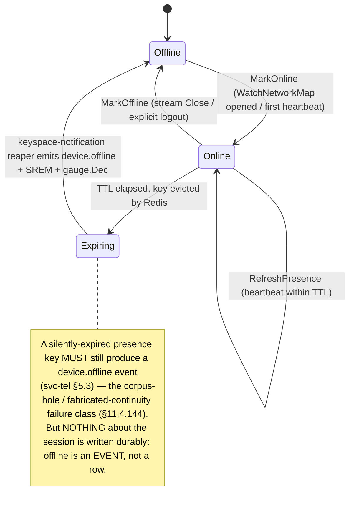
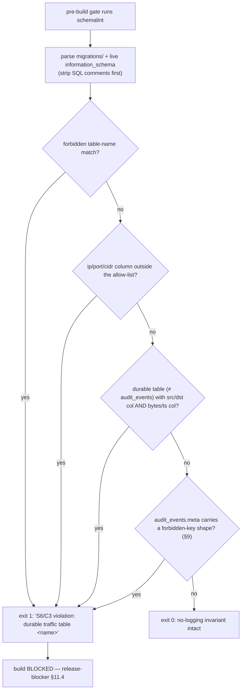

# No-Logging as Code (the privacy promise made mechanical)

**Revision:** 1
**Last modified:** 2026-06-25T12:00:00Z

> Master technical specification — Volume 5 (Security & Privacy), nano-detail spec.
> Deepens invariant **S6** (no durable connection/traffic log — by construction) and
> **S7** (control actions audited; traffic never) of [04-sec] (`04-security-privacy-pki.md`
> §6–§7). This document owns the *mechanical contract* that turns "we don't log" from an
> operator's good intentions into a **build property**: the data-minimization model (what is
> stored vs never-stored), the CI/pre-build **schema-lint** that fails the build if any
> log/event schema acquires a traffic/PII shape, the ephemeral-only presence model (Redis
> TTL, no durable connection records), the control-action-only audit model, the §11.4.10
> credentials discipline, and the paired §1.1 mutation that proves the lint is not a
> tautology. This is a **SPEC** — it describes the implementation; it does not build the
> product.
>
> Source evidence cited inline by id: [04-sec §6/§7] (`04-security-privacy-pki.md`
> no-logging-as-code + audit), [svc-tel] (`v03-control-plane/svc-telemetry.md` — the
> telemetry service that *governs* the schema-lint + owns presence + audit-sink), [svc-evt]
> (`v03-control-plane/svc-events.md` — the event bus C3 payload constraint + payload-lint),
> [04_P1 §11.4] (HelixVPN-Phase1-MVP no-logging CI lint), [04_ARCH §7/§4.5] (no-logging-as-code
> + ephemeral Redis presence). Access date for external facts: **2026-06-25**. Unproven
> claims are marked `UNVERIFIED:` per §11.4.6 — never fabricated.

---

## Table of contents

- [0. Position, ownership, and the one-sentence contract](#0-position-ownership-and-the-one-sentence-contract)
- [1. The privacy promise as a build property, not a config flag](#1-the-privacy-promise-as-a-build-property-not-a-config-flag)
- [2. The data-minimization model — stored vs never-stored](#2-the-data-minimization-model--stored-vs-never-stored)
- [3. Ephemeral-only presence (Redis TTL, no durable connection records)](#3-ephemeral-only-presence-redis-ttl-no-durable-connection-records)
- [4. Audit — control actions only, traffic never (S7)](#4-audit--control-actions-only-traffic-never-s7)
- [5. The forbidden-field list (the closed denylist)](#5-the-forbidden-field-list-the-closed-denylist)
- [6. The schema-lint gate (the mechanical enforcement)](#6-the-schema-lint-gate-the-mechanical-enforcement)
- [7. Schema examples — allowed vs rejected](#7-schema-examples--allowed-vs-rejected)
- [8. The event-payload lint (C3 on the bus)](#8-the-event-payload-lint-c3-on-the-bus)
- [9. The audit meta-shape guard (the jsonb back-door)](#9-the-audit-meta-shape-guard-the-jsonb-back-door)
- [10. Paired §1.1 mutation — proving the lint is not a tautology](#10-paired-11-mutation--proving-the-lint-is-not-a-tautology)
- [11. Runtime signature — green against the deployed DB (§11.4.108)](#11-runtime-signature--green-against-the-deployed-db-1148)
- [12. Credentials discipline (§11.4.10) intersection](#12-credentials-discipline-11410-intersection)
- [13. GDPR / privacy posture](#13-gdpr--privacy-posture)
- [14. Threat-model placement & residual risk](#14-threat-model-placement--residual-risk)
- [15. Phase → task → subtask plan (no-logging workstream)](#15-phase--task--subtask-plan-no-logging-workstream)
- [Sources verified](#sources-verified)

---

## 0. Position, ownership, and the one-sentence contract

**One-sentence contract.** HelixVPN's no-logging guarantee is enforced by *absence* and by a
CI/pre-build **schema-lint** that fails the build if any durable table, any event payload, or
any audit blob acquires a connection/traffic/PII shape — so the privacy promise is a mechanical
property of the build, not an operator's good intentions [04-sec §6, 04_P1 §11.4, svc-tel §7].

**What this document owns:**

- the data-minimization model (the closed stored-vs-never-stored partition);
- the forbidden-field denylist + the topology/identity allow-list;
- the schema-lint gate (static migrations + live `information_schema`) + its verdict logic;
- the event-payload lint (C3 on the bus) and the audit meta-shape guard;
- the paired §1.1 mutation that proves the lint catches a planted flow table;
- the runtime-signature requirement (green against the *deployed* DB, §11.4.108);
- the §11.4.10 credentials intersection and the GDPR posture.

**What this document does NOT own (referenced, not redefined):**

- the canonical DDL for `audit_events`, `devices`, `advertised_prefixes` — that is the data
  model (doc 02 / svc-tel); this doc quotes the relevant slices and the lint over them;
- the telemetry service's presence/audit/metric *implementation* — that is [svc-tel]; this doc
  owns the *invariant* (S6/S7) the telemetry service mechanizes;
- the event bus's transport/consumer machinery — that is [svc-evt]; this doc owns the *C3
  payload-shape constraint* on the bus, not the bus itself.

> **Governance note (§11.4.35).** The schema-lint binary lives at `tools/schemalint` but is
> **governed by the telemetry service** because "the privacy guarantee is telemetry's charter"
> [svc-tel §0]. This document is the cross-volume security spec for the *invariant*; [svc-tel
> §7] is the service-level nano-detail of the lint's parser. They agree by construction.

---

## 1. The privacy promise as a build property, not a config flag

A privacy VPN that *could* log but promises not to is one config edit, one rogue operator, or
one well-meaning "let's add a debug table" away from betraying every user. HelixVPN closes this
class **by construction**: the data simply does not exist, and a build gate refuses any change
that would make it exist [04-sec §6, 04_ARCH §7].

Three cooperating mechanisms make the promise mechanical:

1. **Absence by design (S6).** There is no `connections`, `flows`, `traffic`, `packets`, or
   durable `sessions` table anywhere in the schema. Per-flow / per-packet / per-destination data
   is *never written* — not "written then redacted," **never written** [04-sec §0.1 S6, §6.1].

2. **The schema-lint gate (§6).** A pre-build + post-deploy lint introspects *both* the
   migration SQL *and* the live `information_schema` and **fails the build** if any durable
   table is connection-log-shaped (forbidden name, or a src/dst column + a bytes/timestamp
   column outside `audit_events`) [04-sec §6.2, svc-tel §7]. The privacy promise is enforced by
   tooling, not trust.

3. **Ephemeral-only live state (§3).** "Who is online right now" lives only in Redis with a TTL,
   so the durable store never accumulates a connection log [04-sec §6.1, 04_ARCH §4.5, svc-tel
   §5]. Online/offline is operationalized *without* a session table.

The bar (per the §11.4 covenant): a green build is the *guarantee* the data cannot exist, backed
by a paired §1.1 mutation (§10) proving the lint is not a tautology that passes everything.

---

## 2. The data-minimization model — stored vs never-stored

The single most important table in this document: the **closed partition** of what HelixVPN's
durable store holds vs what it can never hold [04-sec §6.1, svc-tel §5].

| Stored (durable, Postgres) | NEVER stored (no table, no column, ever) |
|---|---|
| **Identity:** tenants, users (`oidc_sub`/`email` only for managed tenants), devices (`wg_pubkey`, `overlay_ip`, **coarse** `last_seen_at`) | Per-connection records (one row per tunnel session) |
| **Topology:** connectors, `advertised_prefixes` (CIDRs), groups, sites | Per-packet / per-flow records (src IP, dst IP, ports-in-use, byte counts, timestamps-of-use) |
| **Policy:** policy spec + compiled rules + version history | DNS query logs (which domains a user resolved) |
| **PKI:** `device_certs`, `enroll_tokens` (Argon2id-hashed, never plaintext) | Destination IPs / domains visited by any user |
| **Audit:** `audit_events` (control actions only, §4) | Traffic content or metadata of any kind |
| **Aggregate counters:** handshakes, bytes-total, errors — Prometheus series, *not* per-user | Anything correlating a user to a destination or a timestamp-of-use |

### 2.1 The two columns that look like traffic but are not (the allow-list)

Three identity/topology columns *do* carry IP/CIDR shape and are explicitly **allow-listed** —
they are the device's *own* stable address or a connector's *advertised* network, not traffic
[svc-tel §7.1, svc-evt §2.2]:

| Column | Type | Why it is identity/topology, not traffic |
|---|---|---|
| `devices.overlay_ip` | `inet` | the device's own stable overlay address (its identity on the mesh), assigned at enroll — never a destination it talked to |
| `devices.wg_pubkey` | `bytea` | 32-byte Curve25519 public key = the device identity |
| `advertised_prefixes.cidr` | `cidr` | a connector's *advertised* network (topology) — what the connector *offers*, not what anyone *visited* |
| `overlay_pools.ula_prefix` | `cidr` | IPAM — the tenant's ULA /48 allocation pool |

The allow-list is asserted **exhaustive** (§6): any `inet`/`cidr`/`*_ip`/`*_port`-shaped column
*not* in this list FAILs the lint. This is the discriminator that lets the lint pass legitimate
identity/topology while failing any traffic-shaped addition.

### 2.2 The coarsening rule (`last_seen_at` cannot reconstruct a timeline)

`devices.last_seen_at` is the one durable timestamp derived from presence — and it is
**deliberately coarse**. It is refreshed *at most* every `LAST_SEEN_COARSEN` (default **5 min**),
**not** per-heartbeat, and carries **no destination** [04-sec §6.1, svc-tel §5.1]. A coarse
5-minute "last seen" cannot reconstruct a session timeline; it is enough for "is this device
stale?" and nothing more.

---

## 3. Ephemeral-only presence (Redis TTL, no durable connection records)

The mechanism that lets HelixVPN know *which devices are online right now* **without a durable
session/connection table** — the literal operationalization of the no-logging promise [04-sec
§6.1, 04_ARCH §4.5/§4.6, svc-tel §5].

### 3.1 Presence is Redis-only, TTL'd, never copied to Postgres

| Key | Type | Value | TTL | Set/refreshed by |
|---|---|---|---|---|
| `presence:{tenant}:{device}` | string | `"1"` or compact health JSON `{"t":"masque-h3","rtt":21}` | `PRESENCE_TTL` (default **45 s**) | `MarkOnline`/`RefreshPresence` on each heartbeat |
| `presence:{tenant}:set` | set | device-ids currently online | members self-expire via the keyspace-notification reaper | reaper + `Mark*` |

Three invariants make this the *operationalization* of no-logging [svc-tel §5.1]:

1. **Ephemeral by construction.** Presence lives only in Redis with a TTL = **3× the agent
   heartbeat interval** (`PRESENCE_TTL = 3 * HEARTBEAT_INTERVAL`, default 45 s = 3 × 15 s). The
   TTL is *derived* from the heartbeat cadence, never invented (§11.4.6). When a device stops
   beating, the key *expires* — there is no record it was ever there.

2. **Health-only value.** The value carries the *current* transport + rtt — **no destination, no
   bytes, no flow** (C3). Same restriction as the `StatusReport` proto message [svc-tel §5.1].

3. **Never copied to Postgres.** Presence is *never* persisted to the durable store. The only
   durable derivative is the coarse `last_seen_at` (§2.2). Losing Redis loses **no durable
   state** (C2) — and crucially, loses no privacy-sensitive data because none was durable.

### 3.2 Expiry → offline event (no silent corpus hole, §11.4.144 spirit)



The expiry → offline event is mandatory so the coordinator flips relay availability — **but it
is an ephemeral event on `events:presence`, not a durable record** [svc-tel §5.3]. A belt-and-
suspenders sweeper (`PRESENCE_SWEEP`, default 30 s) reaps memberships whose key is gone, so even
a missed keyspace notification never leaves a stuck "online" — and never writes a session row.

> **`UNVERIFIED:`** Redis keyspace-expiry notifications are best-effort and can be delayed under
> load (Redis docs: expired events fire when the key is *accessed* or actively expired) [svc-tel
> §5.3]. Mitigation is the 30 s sweeper (the authoritative offline detector); notifications are
> the low-latency fast path. Neither path writes durable session data.

---

## 4. Audit — control actions only, traffic never (S7)

Every state-changing **control** action is audited; **traffic is never audited** because the
traffic data does not exist (S6) — so it *cannot* be audited even by mistake [04-sec §7, svc-tel
§4].

### 4.1 What is audited (the closed action vocabulary)

Audit covers **control actions only**, drawn from a closed Go enum so a typo cannot mint a new
high-cardinality value and the `action` Prometheus label stays bounded [svc-tel §4.2, 04-sec §7]:

```
device.enrolled · device.revoke · device.cert.issued · device.cert.rotated ·
policy.create · policy.activate · policy.rollback · connector.attached ·
connector.prefixes.changed · enroll_token.mint · enroll_token.used ·
tenant.create · user.role.change
```

`Audit()` **rejects** any action not in this closed vocabulary with `ErrUnknownAuditAction`
[svc-tel §4.2] — the mechanical guarantee that audit never silently grows toward traffic logging.

### 4.2 What is NEVER audited

- any packet, flow, destination, DNS query, or byte-count attributable to a user — **those don't
  exist (S6)**, so they cannot be audited [04-sec §7];
- the `meta jsonb` blob is shape-checked (§9) so traffic cannot be smuggled *inside* an audit row.

### 4.3 Audit is append-only by grant, control-only by vocabulary

The `audit_events` table is append-only by **grant**, not by trigger — the simplest mechanical
guarantee [svc-tel §4.1]:

```sql
-- audit_events (canonical DDL in doc 02 / svc-tel §4.1; the no-logging-relevant constraints):
CREATE TABLE audit_events (
  id          bigint GENERATED ALWAYS AS IDENTITY PRIMARY KEY,
  tenant_id   uuid NOT NULL REFERENCES tenants(id) ON DELETE CASCADE,
  actor       text NOT NULL,             -- user id / "system" (never a destination)
  action      text NOT NULL,             -- closed vocabulary (§4.1)
  target      text,                      -- opaque id (device/policy/connector) — NOT a destination
  ts          timestamptz NOT NULL DEFAULT now(),  -- when the ADMIN acted, not a timestamp-of-use
  meta        jsonb                       -- small; shape-checked (§9) to carry no traffic shape
);
-- Append-only by grant: helix_app has INSERT + SELECT but NOT UPDATE/DELETE.
-- REVOKE UPDATE, DELETE ON audit_events FROM helix_app;  -- a row cannot be mutated/erased by request-path.
```

`audit_events` is the **single allowed exception** in the schema-lint (§6): it is the only table
permitted a `ts` column alongside actor/target, *because* it audits control actions — and even it
is meta-shape-guarded (§9). Note the distinction the lint relies on: `audit_events.ts` is *when an
admin acted*, never *a timestamp-of-use of traffic*; `target` is an opaque control-object id,
never a destination.

---

## 5. The forbidden-field list (the closed denylist)

The schema-lint matches two regexes — a forbidden **table-name** set and a forbidden **column**
set — against parsed SQL [svc-tel §7.1, 04-sec §6.2]. These are the concrete denylists.

### 5.1 Forbidden durable table names (connection-log shapes)

```
connections   connection    sessions    session    flows     flow      traffic
packets       packet        netflow     bandwidth_samples     dns_queries
conn_log      access_log    session_log
```

A durable table whose name matches `(?i)\b(connections?|sessions?|flows?|traffic|packets?|netflow|
bandwidth_samples?|dns_queries?|conn_log|access_log|session_log)\b` **FAILs** the build [svc-tel
§7.1]. The name itself is a forbidden *signal* — privacy is about shape, and a `traffic_summary`
view "over only counts" still FAILs (rename to `metrics_summary`; the lint defaults to FAIL =
safe) [svc-tel §7.3].

### 5.2 Forbidden columns (traffic/PII shapes)

```
src_ip   dst_ip   dest_ip   src_port   dst_port
bytes_in bytes_out          packet_count
payload  sni_host
flow_id  session_id  conn_id
```

A column matching `(?i)\b(src_ip|dst_ip|dest_ip|src_port|dst_port|bytes_(in|out)|packet_count|
payload|sni_host|flow_id|session_id|conn_id)\b` **FAILs** [svc-tel §7.1]. Additionally, the
*combination* rule from [04-sec §6.2]: any durable table (outside `audit_events`) that has **both**
a `src`/`dst`-shaped column **AND** a `bytes`/`ts`-shaped column is a flow log by shape — FAIL,
even if the individual column names dodge the explicit denylist.

### 5.3 The exhaustive allow-list (the ONLY permitted ip/port/cidr columns)

```
devices.overlay_ip          (inet)  — identity: the device's own stable overlay addr (S6 not traffic)
devices.wg_pubkey           (bytea) — identity: 32B Curve25519 public key
advertised_prefixes.cidr    (cidr)  — topology: a connector's advertised network
overlay_pools.ula_prefix    (cidr)  — IPAM: the tenant's ULA /48 pool
```

Any ip/port/cidr-shaped column **not** in this allow-list → FAIL [svc-tel §7.1]. The allow-list is
asserted exhaustive: adding a new identity/topology column that carries IP shape requires an
*explicit* allow-list amendment in the same change (a visible, reviewed decision per §11.4.6),
not a silent pass.

---

## 6. The schema-lint gate (the mechanical enforcement)

The lint is the privacy guarantee turned into a build gate. It parses **both** the static
migration SQL **and** the live `information_schema`, so a table that exists in the DB but not in a
migration (drift) is also caught [04-sec §6.2, svc-tel §7].

### 6.1 What it parses and the verdict logic

```go
// tools/schemalint/main.go  (pre-build gate; constitution §11.4.27 / §1.1 / §11.4.108 runtime sig)
// Parses BOTH migrations/*.sql (static) AND the live information_schema (dynamic) so DB drift
// (a table present in the DB but absent from migrations) is ALSO caught. SQL comments are
// stripped before matching (no false-fail on a prose mention of "bytes_out", svc-tel §7.3).

var forbiddenTables = regexp.MustCompile(
    `(?i)\b(connections?|sessions?|flows?|traffic|packets?|netflow|bandwidth_samples?|` +
    `dns_queries?|conn_log|access_log|session_log)\b`)
var forbiddenCols = regexp.MustCompile(
    `(?i)\b(src_ip|dst_ip|dest_ip|src_port|dst_port|bytes_(in|out)|packet_count|payload|` +
    `sni_host|flow_id|session_id|conn_id)\b`)
// allowList = { devices.overlay_ip, devices.wg_pubkey, advertised_prefixes.cidr,
//               overlay_pools.ula_prefix }  (asserted exhaustive, §5.3)
```



### 6.2 The cross-check that closes the source-only-grep gap

A lint that only greps the migration *source text* is a §11.4.108 SOURCE-layer bluff: the deployed
DB could have a drifted table no migration mentions. So the lint reads the **live
`information_schema`** (the actual migrated schema, not the `.sql` text) [04-sec §6.2 "introspect
the live migrated schema, not the .sql source"]. This makes the green verdict a **runtime
signature** (§11), not a source-grep.

### 6.3 The four-test contract (§11.4.4(b) four-layer)

| Layer | What | Where |
|---|---|---|
| pre-build gate | lint runs static + live parse; build BLOCKED on FAIL | `tools/schemalint` in the pre-build sweep |
| post-deploy runtime signature | lint runs against the *deployed* DB (§11) | post-deploy assertion (§11.4.169 matrix) |
| paired §1.1 mutation | plant a `flows(src,dst,bytes,ts)` migration ⇒ lint MUST FAIL (§10) | meta-test |
| Challenge | end-to-end drive asserts `schemalint` green against the deployed DB | `helix_qa`/`challenges` [svc-tel T-CHAL-1] |

---

## 7. Schema examples — allowed vs rejected

Concrete cases the lint must classify correctly — **no false-pass, no false-fail** [svc-tel §7.3].

### 7.1 REJECTED (build BLOCKED)

```sql
-- REJECTED: forbidden table name + the canonical flow-log shape (this is the paired-mutation fixture, §10)
CREATE TABLE flows (
  src      inet,        -- forbidden: src-shaped
  dst      inet,        -- forbidden: dst-shaped
  bytes    bigint,      -- forbidden: bytes-shaped + (with src/dst) the flow-log combination rule
  ts       timestamptz  -- timestamp-of-use
);
-- → exit 1: "S6/C3 violation: durable traffic table flows"

-- REJECTED: dodges the table-name denylist but is a flow log by COMBINATION (src/dst + bytes/ts)
CREATE TABLE device_activity (
  device_id  uuid,
  remote     inet,          -- dst-shaped (a destination the device talked to)
  octets     bigint,        -- bytes-shaped
  seen_at    timestamptz    -- ts-shaped
);
-- → exit 1: combination rule (src/dst col + bytes/ts col outside audit_events)

-- REJECTED: a forbidden column even on an otherwise-fine table
ALTER TABLE devices ADD COLUMN dst_ip inet;   -- → exit 1: forbidden column dst_ip

-- REJECTED: a view whose NAME is a forbidden signal, even over only counts
CREATE VIEW traffic_summary AS SELECT count(*) FROM handshakes;  -- → exit 1: rename to metrics_summary

-- REJECTED: a connections-word column (aggregate must be a Prometheus counter, not a column)
ALTER TABLE devices ADD COLUMN device_connections_count bigint;  -- → exit 1: connections? word-boundary
```

### 7.2 ALLOWED (build PASSES)

```sql
-- ALLOWED: identity/topology on the exhaustive allow-list (§5.3)
CREATE TABLE devices (
  id          uuid PRIMARY KEY,
  tenant_id   uuid NOT NULL,
  wg_pubkey   bytea NOT NULL,          -- ALLOW: identity (32B Curve25519 public key)
  overlay_ip  inet  NOT NULL,          -- ALLOW: identity (device's OWN stable overlay addr)
  last_seen_at timestamptz,            -- ALLOW: COARSE (≥5min coarsened, §2.2) — not a session timeline
  name        text
);
CREATE TABLE advertised_prefixes (
  connector_id uuid NOT NULL,
  cidr         cidr NOT NULL           -- ALLOW: topology (a connector's ADVERTISED network)
);

-- ALLOWED: control-action audit (the single ts+actor exception, meta shape-checked §9)
CREATE TABLE audit_events (
  id        bigint GENERATED ALWAYS AS IDENTITY PRIMARY KEY,
  tenant_id uuid NOT NULL,
  actor     text NOT NULL,             -- a user id / "system" — never a destination
  action    text NOT NULL,             -- closed vocabulary (§4.1)
  target    text,                      -- opaque control-object id — never a destination
  ts        timestamptz NOT NULL DEFAULT now(),  -- when the ADMIN acted (not a timestamp-of-use)
  meta      jsonb                       -- shape-guarded (§9)
);

-- ALLOWED: a comment mentioning a forbidden word (parser strips comments first, no false-fail)
CREATE TABLE handshake_totals ( -- aggregate only; no src_ip/dst_ip here
  day   date PRIMARY KEY,
  total bigint
);
```

### 7.3 Edge-case classification table

| Case | Verdict | Rationale |
|---|---|---|
| `connections` table added | **FAIL** | direct S6/C3 breach (forbidden name) |
| `device_connections_count bigint` column | **FAIL** | `connections?` word-boundary; a legitimate aggregate must be a Prometheus counter, not a column |
| `device_activity(remote inet, octets bigint, seen_at ts)` | **FAIL** | combination rule (dst-shaped + bytes-shaped + ts) — a flow log dodging the name denylist |
| `audit_events.meta` containing `{"src_ip":"…"}` at runtime | **FAIL** | meta-shape guard (§9) — traffic-via-jsonb evasion |
| `advertised_prefixes.cidr` | **PASS** | topology allow-list |
| `devices.overlay_ip` | **PASS** | identity allow-list (the device's own addr) |
| `view traffic_summary` over only counts | **FAIL** | name is a forbidden signal; lint defaults to FAIL (safe); rename to `metrics_summary` |
| comment line mentioning `bytes_out` | **PASS** | parser strips SQL comments before matching (no false-fail on prose) |

---

## 8. The event-payload lint (C3 on the bus)

The schema-lint guards the *durable store*. The **event bus** is the second place a traffic shape
could leak in — an event payload could carry a src/dst pair just as a table column could. So C3
applies to the bus payload too, enforced by a mirror lint [svc-evt §2.2/§9.4, 04-sec §6].

### 8.1 The C3 payload constraint

Event `payload` objects are structurally constrained to **identity / topology / policy** keys.
There is **no** field anywhere in the event taxonomy for a source/destination pair in use, a port
a flow used, a byte count, or a DNS query [svc-evt §2.2]:

```go
// The entire event payload taxonomy (svc-evt §3.4) — note: ZERO src/dst/bytes/dns fields.
type DeviceEnrolled    struct { DeviceID uuid.UUID; Kind string; OverlayIP string }  // overlay_ip = identity
type DevicePresence    struct { DeviceID uuid.UUID; RTTMs uint32 }                    // rtt = health, not traffic
type DeviceRevoked     struct { DeviceID uuid.UUID }
type ConnectorAttached struct { DeviceID uuid.UUID; Site string }
type ConnectorPrefixes struct { ConnectorID uuid.UUID; CIDRs []string; Gen int64 }    // cidrs = topology
type RouteConflict     struct { CIDR string; ConnectorIDs []uuid.UUID }
type PolicyVersion     struct { Version int64 }
type GatewayFailover   struct { From string; To string }
```

`advertised_prefixes` CIDRs and a device's stable `overlay_ip` *do* appear — they are **topology,
not traffic** — exactly the same allow-list the schema-lint enforces [svc-evt §2.2]. The §9.4
payload-lint is the runtime signature that proves the constraint is live, not merely promised.

### 8.2 The bus payload-lint mirrors the schema-lint

The §1.1 payload-lint applies the same forbidden-field regex (§5) to event payload JSON shapes at
build time (a test that introspects every `payload` struct) and at publish time as a cheap guard
inside `events.New` [svc-evt §2.2/§9.4]. A payload struct that grows a `dst_ip`/`bytes_in`/
`sni_host` field FAILs the build — the bus-side analogue of the schema-lint. This closes the
"log traffic via an event payload" evasion of C3.

---

## 9. The audit meta-shape guard (the jsonb back-door)

`audit_events.meta` is a `jsonb` blob — the one place a developer could smuggle a traffic field
*inside* an otherwise-allowed audit row. The meta-shape guard closes that back door [svc-tel §4.4,
§7.3].

```go
// svc-tel audit.go (excerpt) — runs BEFORE every audit insert.
func (s *AuditSink) validate(r AuditRecord) error {
    if _, ok := auditVocabulary[r.Action]; !ok { return ErrUnknownAuditAction }   // closed vocab §4.1
    if len(r.Meta) > maxMetaKeys { return ErrAuditMetaShape }                     // bound the blob (default 16 keys)
    for k := range r.Meta {
        if forbiddenMetaKey.MatchString(k) { return ErrAuditMetaShape }           // §5 regex shared
    }
    return nil
}
```

- The `meta` keys are matched against the **same** forbidden-column regex the schema-lint uses
  (§5.2). A control-action audit carrying a `dst_ip`/`sni_host`/`bytes_in` key is **rejected** with
  `ErrAuditMetaShape` [svc-tel §4.4].
- `ErrAuditMetaShape` **fails the control action closed** — audit is part of the action's
  transaction, so a refused audit rolls back the mutation it would have recorded [svc-tel §9].
  Audit fails closed (accountability); presence fails static (never brick a tunnel) — the
  deliberate, load-bearing asymmetry [svc-tel §9].
- The blob is bounded (default 16 keys) so audit cannot grow into a traffic log by accumulation.

---

## 10. Paired §1.1 mutation — proving the lint is not a tautology

A lint that passes everything is worse than no lint — it is a green light over a hole. So the
no-logging gate is **self-validated** by a paired §1.1 mutation (§11.4.107(10) — an analyzer that
passes its golden-bad fixture is itself a bluff gate) [04-sec §6.2, svc-tel §7.2].

### 10.1 The mutation contract

```text
GOLDEN-BAD FIXTURE (the mutation):
  Plant a throwaway migration:
    CREATE TABLE flows (src inet, dst inet, bytes bigint, ts timestamptz);
  ASSERT: schemalint exits 1 (FAIL) on this fixture.   ← proves the lint CATCHES a flow log.

GOLDEN-GOOD FIXTURE (the restore):
  Remove the planted migration.
  ASSERT: schemalint exits 0 (PASS).                   ← proves the lint does not FAIL the clean schema.

VERDICT: the lint is real iff golden-bad FAILs AND golden-good PASSes.
  A lint that PASSes the golden-bad `flows` table is a tautology — itself a §11.4 bluff gate.
```

### 10.2 The mutations (one per evasion vector)

| Mutation (golden-bad) | Must produce |
|---|---|
| `CREATE TABLE flows(src inet, dst inet, bytes bigint, ts timestamptz)` | lint FAIL (forbidden name + combination) |
| `CREATE TABLE device_activity(remote inet, octets bigint, seen_at ts)` (name-dodge) | lint FAIL (combination rule) |
| `ALTER TABLE devices ADD COLUMN dst_ip inet` | lint FAIL (forbidden column) |
| event payload struct grows a `DstIP string` field | payload-lint FAIL (§8) |
| `audit_events.meta` insert with key `"src_ip"` | `ErrAuditMetaShape` (§9) |
| strip the `flows` denylist entry from the lint regex | the mutation-test that asserts FAIL now PASSes ⇒ the *meta-test* FAILs (proves the denylist is load-bearing) |

Each mutation must make its gate FAIL; restoring the clean state must make it PASS. This is the
mechanical proof the no-logging invariant is *enforced*, not merely documented.

---

## 11. Runtime signature — green against the deployed DB (§11.4.108)

A green lint against the migration *source* proves the SOURCE layer only — the deployed DB could
have drifted. The runtime signature (§11.4.108) requires the lint be green against the **live,
deployed schema** [svc-tel §7.2, §10 T-CHAL-1].

- **The observable.** `schemalint` exit 0 against the *live* `information_schema` of the deployed
  Postgres is the runtime signature that S6/C3 is **active**, not merely promised [svc-tel §7.2].
- **Where it runs.** Not just pre-build — the §11.4.169 test matrix wires the lint as a
  **post-deploy** assertion against the deployed DB, so a drifted table that no migration mentions
  is caught on the running system, not just in CI [svc-tel §7.2, §10 T-CHAL-1].
- **The Challenge.** `T-CHAL-1` drives a full enroll→policy→delta flow AND asserts `schemalint`
  green against the *deployed* DB, with captured evidence [svc-tel §10] — a Challenge that scores
  PASS on a privacy control that is actually broken is the same class of defect as a unit-test
  PASS-bluff.

This makes the no-logging guarantee a four-layer property (source / artifact / runtime-on-clean-
target / user-visible per §11.4.108): the data does not exist in the source schema, does not exist
in the deployed schema, and a passive observer correlating a user to a destination finds nothing
because there is nothing to find.

---

## 12. Credentials discipline (§11.4.10) intersection

No-logging composes tightly with the §11.4.10 credentials mandate — both forbid sensitive data
from landing where it can leak [04-sec §11, 04_ARCH §10, §11.4.10].

- **Secrets are never logged or printed.** `helixvpnctl` never prints or logs a credential, an
  enroll token, or an API token [04-sec §11]. The no-logging lint forbids *traffic* shapes; the
  §11.4.10 discipline forbids *secret* values in any log/output — complementary halves.
- **Hashed at rest.** Enroll tokens are Argon2id-hashed (`enroll_tokens.token_hash`, plaintext
  never stored); API tokens hashed at rest [04-sec §2.2, §11]. A leaked DB dump yields no usable
  token and no traffic log.
- **`.env`/secrets git-ignored project-wide** with a tracked `.example` + README, `chmod 600` on
  credential files [04-sec §11, §11.4.10/§11.4.30].
- **The intersection invariant.** A debug log line that printed a destination would be *both* a
  no-logging violation (S6) *and*, if it also printed a token, a §11.4.10 violation — the two
  mandates overlap precisely at "no sensitive data in any durable or logged form."

---

## 13. GDPR / privacy posture

The data-minimization model (§2) *is* the GDPR posture: the strongest privacy guarantee is data
that does not exist [04-sec §6, §7].

| GDPR concern | HelixVPN posture | Mechanism |
|---|---|---|
| **Data minimization (Art. 5(1)(c))** | only identity/topology/policy + control-action audit is stored; no traffic, no destinations, no DNS, no timestamps-of-use | §2 model + §6 schema-lint enforce it mechanically |
| **Purpose limitation (Art. 5(1)(b))** | audit records *control actions* (operate the service), never user traffic | §4 closed vocabulary + §9 meta guard |
| **Anonymous mode (no PII)** | a tenant can mint device enroll tokens with **no email, no SSO** — the Mullvad "account number, no PII" stance; `users.email = NULL`, `oidc_sub = NULL`, no reverse-link to a human | [04-sec §2.2] |
| **Right to erasure (Art. 17)** | identity/device data is deletable; there is no traffic log to erase because none exists; `helixvpnctl audit prune --before <ts>` exists for operator-driven audit erasure | [svc-tel §4.1] (operator-driven, not automatic) |
| **Storage limitation (Art. 5(1)(e))** | presence is ephemeral (TTL, §3); `last_seen_at` is coarse (§2.2); audit is low-volume control-only with optional operator prune | §3 + §2.2 + [svc-tel §4.1] |
| **Subject-access (Art. 15)** | what HelixVPN holds about a device is enumerable (identity/topology rows) and provably bounded by the schema-lint — there is no hidden traffic store to disclose | §2 + §6 |

> **Honest boundary (§11.4.6).** No-logging-as-code guarantees the *durable store and the bus and
> the audit blob* hold no traffic data — it does **not** claim a hot-compromised gateway holds
> nothing in RAM. Live in-RAM presence on a compromised running gateway, and aggregate counters,
> are the residual surface (§14, threat T5). The guarantee is "no durable correlation of a user to
> a destination ever exists," not "an attacker with root on a running box sees nothing in memory."

---

## 14. Threat-model placement & residual risk

No-logging-as-code closes threat **T5** in [04-sec §10]:

| # | Threat (STRIDE) | Vector | Mitigation (this doc) | Residual risk (§11.4.6) |
|---|---|---|---|---|
| T5 | **Information disclosure — traffic correlation** | Operator/host compromise reads a connection log | **No connection log exists** (S6, §2) + CI schema-lint (§6) + ephemeral Redis presence (§3) | Live in-RAM presence on a *hot-compromised* gateway; aggregate counters only — no durable user↔destination record to read |

**Residual risks stated honestly:**

1. **Hot-compromise RAM.** A gateway compromised *while running* has live presence keys in Redis
   RAM (who is online now) and in-flight state. This is ephemeral and carries no destination, but
   it is not nothing. The guarantee is *durable* absence, not *runtime-memory* absence.

2. **Aggregate counters.** Prometheus series (handshakes, bytes-total, errors) exist by design —
   they are aggregate, label-cardinality-bounded (no `tenant_id`/`device_id`/ip labels, §3.1 of
   svc-tel), and cannot correlate a user to a destination. But they reveal *operational shape*
   (tenant population via gauges), which is why `/metrics` is scrape-network-only (§8.3 svc-tel).

3. **Lint-evasion creativity.** The denylist (§5) is closed; a sufficiently creative column name
   could in principle dodge it. The combination rule (src/dst + bytes/ts) catches name-dodges, the
   live-schema cross-check catches drift, and the paired mutation (§10) keeps the denylist
   load-bearing — but a reviewer (§11.4.6) is the backstop for a genuinely novel shape, and the
   lint defaults to FAIL (safe) on an ambiguous name.

4. **Not a runtime-memory claim.** Per §13's honest boundary — no-logging is a durable-store +
   bus + audit guarantee, not a claim about an attacker with root on a live box.

---

## 15. Phase → task → subtask plan (no-logging workstream)

Each leaf becomes a §11.4.93 workable item. The no-logging lint + RLS audit are the **irreversible
privacy/correctness floor and land first** (§11.4.132 risk-descending) [svc-tel §11]. Anti-bluff:
every closure carries captured evidence (§11.4.5/§11.4.69) and a paired §1.1 mutation.

### Phase 1 (MVP)

- **NL-1 — schema-lint gate.** `tools/schemalint`: static migrations + live `information_schema`
  parse; forbidden-table regex (§5.1); forbidden-column regex (§5.2); exhaustive allow-list
  (§5.3); combination rule (src/dst + bytes/ts); comment-stripping; verdict logic (§6.1). Wire
  into pre-build [svc-tel TEL-T1, 04-sec §6.2].
- **NL-2 — paired §1.1 mutation.** Plant `flows(src,dst,bytes,ts)` ⇒ lint FAIL; remove ⇒ PASS;
  the name-dodge `device_activity` ⇒ FAIL; golden-good/golden-bad self-validation (§10) [svc-tel
  T-LINT-1].
- **NL-3 — ephemeral presence.** `PresenceTracker` Redis SET/SADD/Expire/Del with
  `PRESENCE_TTL = 3×HEARTBEAT`; keyspace-expiry reaper + `PRESENCE_SWEEP` sweeper; never copy to
  Postgres; coarse `last_seen_at` (≥5 min) (§3) [svc-tel TEL-T3].
- **NL-4 — control-action audit.** `audit_events` closed vocabulary (§4.1); append-only by grant
  (`REVOKE UPDATE,DELETE`); meta-shape guard (§9); `WithTenant` RLS insert; fails-closed (§9)
  [svc-tel TEL-T2, 04-sec §7].
- **NL-5 — event-payload lint.** Mirror the schema-lint over event payload structs (§8); build-time
  introspection + `events.New` publish-time guard [svc-evt §9.4].
- **NL-6 — runtime signature.** Wire `schemalint` as a post-deploy assertion against the deployed
  DB (§11); `T-CHAL-1` end-to-end Challenge asserting deployed-DB lint green [svc-tel §7.2, §10].
- **NL-7 — credentials intersection.** Argon2id token hashing; `helixvpnctl` never prints secrets;
  `.env`/secrets git-ignored (§12, §11.4.10/§11.4.30) [04-sec §11].

### Phase 2 (parity + hardening)

- **NL-2.1 — lint holds across phases.** The schema-lint gates the Phase-2 NATS-JetStream swap and
  the optional ClickHouse aggregate sink (an *export of already-aggregated counters*, never a
  connection log — C3 holds across phases, lint gates Phase 2 too) [svc-tel §12].
- **NL-2.2 — GDPR tooling.** Subject-access enumeration (§13 Art. 15) + operator-driven
  `helixvpnctl audit prune` (§13 Art. 17) hardened with captured-evidence tests.

---

## Sources verified

- `final/04-security-privacy-pki.md` (`[04-sec]`) — §0.1 invariants **S6** (no durable
  connection/traffic log by construction) + **S7** (control actions audited, traffic never); §6
  (no-logging as code: §6.1 stored-vs-not-stored table, §6.2 CI schema-lint Go code + anti-bluff
  paired mutation); §7 (audit control-actions only, closed action set, append-only, live stream);
  §2.2 (anonymous enroll tokens, no PII, Argon2id hash); §10 threat **T5** (traffic correlation) +
  residual risk; §11 (secrets hygiene, §11.4.10/§11.4.30); §13 S6/S7 verification rows. — local spec.
- `v03-control-plane/svc-telemetry.md` (`[svc-tel]`) — §0 (telemetry owns the no-logging-as-code
  invariant + governs `tools/schemalint`); §4 (control-action audit: §4.1 DDL append-only-by-grant,
  §4.2 closed `AuditAction` vocabulary, §4.4 meta-shape guard); §5 (live presence in TTL Redis:
  §5.1 key schema + `PRESENCE_TTL = 3×HEARTBEAT` + coarse `last_seen_at`, §5.3 expiry→offline event
  + sweeper, §5.4 drift handling); §7 (the schema-lint nano-detail: §7.1 forbidden-table/column
  regex + exhaustive allow-list, §7.2 verdict logic + runtime signature + paired mutation, §7.3
  edge-case table); §9 (error taxonomy — audit fails closed, presence fails static); §10
  (T-LINT-1 / T-CHAL-1 / T-STORE-1 test points); §11 (risk-descending task order — lint + RLS audit
  first); §3.1 (metric label cardinality bound — no tenant/device/ip labels); §12 (lint gates
  Phase-2 NATS/ClickHouse). — local spec.
- `v03-control-plane/svc-events.md` (`[svc-evt]`) — C3 (no-logging by construction on the bus);
  §2.2 (Envelope privacy boundary — payload is identity/topology/policy only, no src/dst/bytes/dns
  field; overlay_ip/CIDRs are topology not traffic; §9.4 payload-lint as runtime signature); §3.4
  (full payload taxonomy — zero traffic fields). — local spec.
- `[04_P1 §11.4]` HelixVPN-Phase1-MVP — no-logging CI lint + DoD; `[04_ARCH §7]` no-logging-as-code
  + control-only audit; `[04_ARCH §4.5/§4.6]` ephemeral Redis presence operationalizes no-logging.

*Constitution bindings applied: §11.4.44 (revision header), §11.4.6 (no-guessing — every unproven
claim marked `UNVERIFIED:`; presence TTL derived from heartbeat, never invented; lint defaults to
FAIL on ambiguous shape), §11.4.10/§11.4.30 (credentials/secrets hygiene intersection, §12),
§11.4.107(10) (self-validated analyzer — golden-bad `flows` table ⇒ lint FAILs, §10), §11.4.108
(runtime signature — lint green against the DEPLOYED DB, not source grep, §11), §11.4.132
(risk-descending — privacy floor lands first, §15), §11.4.144 (presence expiry never a silent
corpus hole, §3.2), §11.4.93 (phases → workable items), §11.4.169 (post-deploy test-type matrix
wires the runtime signature), §11.4.65/§11.4.153 (HTML+PDF[+DOCX] exports follow in refinement).
Honest boundary (§11.4.6): no-logging is a durable-store + bus + audit guarantee, NOT a claim about
runtime memory on a hot-compromised gateway (§13/§14 residual risk T5).*
