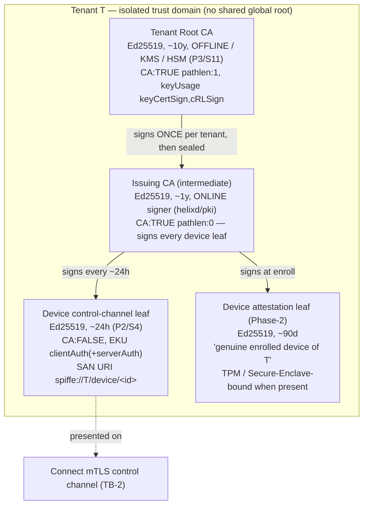

# PKI & Certificates — the tenant CA, short-lived mTLS, and sub-second revocation

**Revision:** 1
**Last modified:** 2026-06-25T12:00:00Z

> Master technical specification — Volume 5 (Security & Privacy), nano-detail document
> **pki-and-certs**. Deepens the **PKI slice** of the security spine
> [`04-security-privacy-pki.md` §4] from a *security* lens, grounded in the cited research
> [`research-pki_pq_nat`]: the **CA hierarchy** (root → tenant issuing CA → short-lived device
> leaf), the **certificate lifecycle** (issue / renew / rotate / revoke) with a state diagram,
> the **short-lived mTLS device certs** (TTL, auto-renew before expiry), **revocation**
> (target sub-second propagation via the event/coordinator path — stated as a TARGET, never a
> measured result, §11.4.6), **mTLS everywhere on the control plane**, the **post-quantum
> material slot** (hybrid PSK-into-WG, see sibling [`post-quantum.md`] / spine §9), **key
> storage** (KMS/HSM with software fallback; device-side secure-element where available), and
> the concrete **cert profiles / fields / TTLs / rotation timers**. SPEC ONLY — it *describes*
> the credential-lifecycle properties the build must have; it builds nothing. The **control-plane
> mechanics** (Go `PKI` interface, DDL/RLS, signer seam) live in
> [`v03-control-plane/svc-pki.md`]; the **enrollment protocol** in the sibling
> [`identity-and-enrollment.md`]; the **threat justification** in [`threat-model.md`]. Sources
> cited inline by id: `[research-pki_pq_nat §N]` (the cited PKI/PQ/NAT research — the primary
> evidence base for this doc), `[04_ARCH §N]`, `[04_P1 §N]`, `[SYNTHESIS §N]`, sibling specs by
> filename. Invariants `S1`–`S11` per [`04-security-privacy-pki.md` §0.1]; `P1`–`P7` per
> [`v03-control-plane/svc-pki.md` §1.3]; threat ids `T-*` per [`threat-model.md`]. Unproven
> facts are **UNVERIFIED** per §11.4.6; any latency figure is a **target**, never a result.

---

## Table of contents

- [0. Position, ownership & governing invariants](#0-position-ownership--governing-invariants)
- [1. Why PKI is built AROUND WireGuard, not inside it](#1-why-pki-is-built-around-wireguard-not-inside-it)
- [2. The CA hierarchy](#2-the-ca-hierarchy)
- [3. Certificate profiles — fields, TTLs, key algorithms](#3-certificate-profiles--fields-ttls-key-algorithms)
- [4. Certificate lifecycle — the state machine](#4-certificate-lifecycle--the-state-machine)
- [5. Short-lived mTLS device certs & auto-renew](#5-short-lived-mtls-device-certs--auto-renew)
- [6. Rotation — devices, CAs, WG keys, PQ PSK](#6-rotation--devices-cas-wg-keys-pq-psk)
- [7. Revocation — the sub-second target](#7-revocation--the-sub-second-target)
- [8. mTLS everywhere on the control plane](#8-mtls-everywhere-on-the-control-plane)
- [9. Post-quantum material slot (hybrid, never PQ-only)](#9-post-quantum-material-slot-hybrid-never-pq-only)
- [10. Key storage — KMS/HSM, secure element, software fallback](#10-key-storage--kmshsm-secure-element-software-fallback)
- [11. Threat mapping & test/validation (§11.4.169)](#11-threat-mapping--testvalidation-1141169)
- [12. Phase-2 forward seams](#12-phase-2-forward-seams)
- [Sources verified](#sources-verified)

---

## 0. Position, ownership & governing invariants

The PKI is the credential-lifecycle authority that makes WireGuard's keys-only identity model
safe to operate at scale: it adds the cert lifecycle, granular revocation, and rotation that
WireGuard itself does not have [research-pki_pq_nat §1.1]. This document owns the **security
contract** of that PKI; it cites, never re-defines, the Go wiring.

### 0.1 What this document owns vs. references

| Concern | Owner | Relationship here |
|---|---|---|
| CA-hierarchy **security model** (isolation, blast radius, offline root) | **this doc** | authoritative |
| Cert **profiles** (fields, TTLs, key usage) and their security rationale | **this doc** | authoritative |
| Cert **lifecycle** security (issue/renew/rotate/revoke properties) | **this doc** | authoritative |
| Revocation **target** + the two-teeth model | **this doc** | authoritative |
| PQ material **slot** security (hybrid-never-PQ-only, what is/isn't stored) | **this doc** | authoritative |
| Key-storage **security** (KMS/HSM, secure element, fallback) | **this doc** | authoritative |
| Go `PKI` interface, DDL/RLS, `CASigner` seam, hot-path `AuthDevice` | [`v03-control-plane/svc-pki.md`] | referenced |
| Enrollment protocol (CSR PoP, key-never-leaves) | [`identity-and-enrollment.md`] | referenced |
| PQ handshake mechanics (KEM exchange, PSK derivation) | [`post-quantum.md`] / spine §9 | referenced |
| Threat justification | [`threat-model.md`] | referenced |

### 0.2 Governing invariants (every clause below obeys these)

| # | Invariant | Source |
|---|---|---|
| **P1 / S2** | **Device private keys never leave the device.** The control plane receives/stores only the 32-byte WG *public* key. | [research-pki_pq_nat §1.3], [`04-security-privacy-pki.md` §0.1] |
| **P2 / S4** | **Short-lived control-channel certs.** Default device-cert TTL ≈ **24 h**; agent auto-renews ahead of expiry; revocation-latency *target* == the **p99 < 1 s** convergence SLO. | [04_P1 §6.3], [`v03-control-plane/svc-pki.md` §10.2] |
| **P3 / S11** | **The tenant CA key is the one true secret.** KMS/HSM or offline; it + Postgres are the only stateful things to protect. Never git-tracked, never logged (§11.4.10). | [04_P1 §6.3], [04_ARCH §10] |
| **P4 / S10** | **Hybrid-never-PQ-only PQ.** PQ is a **PSK fed into WG** (Mullvad/Rosenpass pattern), classical X25519 + ML-KEM; never a forked WG handshake, never PQ-only. | [research-pki_pq_nat §2.1/§2.4] |
| **P5** | **Default-deny, fail-closed.** A revoked or expired credential never authenticates; an unknown serial is rejected, not trusted. | [`v03-control-plane/svc-pki.md` §1.3] |
| **P6** | **Every credential mutation emits a bus event** so `coordinator`/`audit` react without polling. | [`v03-control-plane/svc-pki.md` §1.3] |
| **P7** | **Tenant-isolated at the DB** — every PKI table RLS-scoped under `FORCE ROW LEVEL SECURITY`. | [`v03-control-plane/svc-pki.md` §1.3] |

---

## 1. Why PKI is built AROUND WireGuard, not inside it

WireGuard has **no native PKI** [research-pki_pq_nat §1.1]: one Curve25519 keypair per device,
the **public key IS the device identity**, access = adding the peer's public key to the peer
set, and **revocation is structurally trivial** — remove the public key and the device is
instantly cut off; there is *no* CA, cert expiry, CRL, OCSP, or enrollment protocol in
WireGuard itself. So the cert/PKI lifecycle, granular revocation, and rotation are built
**around** WireGuard, not inside it.

The chosen pattern is the SPIFFE/SPIRE-style **two-identity split** [research-pki_pq_nat §1.2]:

1. a **long-lived device-attestation cert** (CA-signed leaf proving "I am a genuine enrolled
   device of tenant T", optionally TPM/Secure-Enclave-bound), and
2. a **short-lived mTLS credential** (the per-device control-channel cert, "I am authorised to
   call the control API right now"), auto-rotated by the agent before expiry.

Revocation therefore has **two cooperating teeth** (belt-and-suspenders, the dominant 2025
model) [research-pki_pq_nat §1.2/§1.3]:

- **(a) stop renewing** the short-lived mTLS cert → it self-expires within its TTL, **and**
- **(b) remove the WG public key** from every peer set → instant data-path cutoff.

> **Two key spaces, one device.** The CA-signed cert governs the **control channel**; the WG
> public key governs the **data channel**. They are **independent** (P1/S2,
> [`identity-and-enrollment.md` §2.2]) — a cert is **not** a WG key, and the CA never issues WG
> keys; WG keys are *registered* public keys, not *issued* certs. This separation is why a cert
> compromise does not yield tunnel decryption and vice versa.

---

## 2. The CA hierarchy

Each tenant gets its **own** isolated certificate hierarchy — there is no shared global root.
Multi-tenant isolation reaches into the **trust anchor**, not just the row filter
([`v03-control-plane/svc-pki.md` §2.1]).



### 2.1 The three tiers and their security properties

| Tier | Alg / TTL | Where the key lives | Security property |
|---|---|---|---|
| **Tenant Root CA** | Ed25519 / ~10 y | **offline or KMS/HSM** (P3) — used **once** per tenant to sign the issuing CA, then sealed; private key never touches the request path | theft mints arbitrary trusted identities (AS-CA, the "one true secret") — so it is kept off the hot path entirely |
| **Issuing CA (intermediate)** | Ed25519 / ~1 y | **online** signer (the key `pki` actually uses); KMS data-key-sealed or KMS-resident | rotating/compromising it does **not** require re-establishing the root — smaller blast radius, cleaner revocation |
| **Device control-channel leaf** | Ed25519 / ~24 h | device OS keystore (private), CA-signed (public) | short TTL caps blast radius (S4); SPIFFE SAN binds it to a `device_id` (T-COORD-T-1) |
| **Device attestation leaf** | Ed25519 / ~90 d | device keystore, TPM/SE-bound when present | **Phase-2** — Phase-1 schema-provisions it but issues the mTLS leaf only; the device row + consumed enroll token are the Phase-1 attestation surrogate (stated honestly, §11.4.6) |

> **CA topology decision (carried from [`04-security-privacy-pki.md` §4.2]).** **MVP default =
> single online issuing CA under an offline/KMS root** (option B in the spine: two-tier with the
> root offline and a short-lived online intermediate). The `ca_chain` delivered to the device at
> enroll has length ≥ 1, so clients **pin a chain from day one**; promoting topology (e.g. adding
> a second regional intermediate) is *additive* — the chain grows, honouring §11.4.6 (no silent
> reshape).

### 2.2 Chain delivery & verification (mutual pinning)

- The `EnrollResponse` ships the device leaf **plus the issuing-CA cert** so the agent builds
  and pins the chain root → issuing → leaf.
- The agent **pins the tenant root CA public key** (delivered once at enroll) and verifies every
  future leaf/issuing cert against it — so a rogue control plane cannot substitute a different
  root (closes a control-plane-MITM substitution; T-COORD-T-1 adjacent).
- The control plane (Connect server) verifies the **client** leaf against the tenant's issuing
  CA on **every** handshake (§8) — the auth is mutual.

### 2.3 Key-algorithm choice — Ed25519, with an honest escape hatch

Ed25519 for all CA + leaf signing: small keys, fast sign/verify, no parameter pitfalls, broad
TLS 1.3 support. **UNVERIFIED** whether every target platform's mTLS stack (HarmonyOS Network
Kit, Aurora Qt TLS) accepts Ed25519 client certs; if a platform rejects them, that tenant's
issuing CA MAY be provisioned as **ECDSA-P256** instead — the `ca_keys.key_alg` column carries
the choice so the issuer is algorithm-agnostic ([`v03-control-plane/svc-pki.md` §2.1]). This is
a per-tenant provisioning decision, **not** a code branch on the hot path.

---

## 3. Certificate profiles — fields, TTLs, key algorithms

The cert profile is **enforced in the signer, not taken from a request field** — a requester
cannot ask for a long-lived or wildcard cert (closes T-PKI-T-1). Concrete X.509 fields, TLS 1.3
mutual:

| Field | Device control-channel leaf | Tenant Root CA | Issuing CA (intermediate) | Device attestation leaf (Ph2) |
|---|---|---|---|---|
| **Key alg** | Ed25519 (ECDSA-P256 fallback, §2.3) | Ed25519 | Ed25519 | Ed25519 |
| **Validity** | **≤ 24 h** (P2) | ~10 y (offline) | ~1 y | ~90 d |
| **`subject`** | `CN=<device_id>, O=<tenant_id>` | `CN=HelixVPN Tenant CA <tenant_id>` | `CN=HelixVPN Issuing CA <tenant_id>` | `CN=<device_id>` |
| **`subjectAltName`** | URI `spiffe://<tenant_id>/device/<device_id>` | — | — | URI `spiffe://<tenant_id>/device/<device_id>` |
| **`keyUsage`** | `digitalSignature` | `keyCertSign, cRLSign` | `keyCertSign, cRLSign` | `digitalSignature` |
| **`extKeyUsage`** | `clientAuth` (+`serverAuth` for the gateway-facing edge cert) | — | — | `clientAuth` |
| **`basicConstraints`** | `CA:FALSE` | `CA:TRUE, pathlen:1` | `CA:TRUE, pathlen:0` | `CA:FALSE` |
| **`serialNumber`** | 20 random bytes (the mTLS lookup key + revocation-set key) | random | random | 20 random bytes |
| **custom ext** | `helix.deviceKind = client \| connector` | — | — | attestation evidence ref |

Key security choices: the **≤ 24 h leaf validity is the primary revocation mechanism** — even
if active sub-second revocation (§7) somehow misses, the cert **expires within a day** (S4
defence-in-depth). The **SPIFFE SAN** is a *structured URI bound to the device at issuance*
[research-pki_pq_nat §1.2] (not an IP or hostname), so `AuthDevice` can assert the leaf's SAN
matches the resolved device — a cert presented for the wrong device is rejected
(`ErrSpiffeMismatch`, a cert-swap attack signal). mTLS is **TLS 1.3 only — no downgrade**
([`04-security-privacy-pki.md` §4.3]).

---

## 4. Certificate lifecycle — the state machine

```mermaid
stateDiagram-v2
    [*] --> Active: IssueDeviceCert (CSR PoP verified, device_certs row inserted)
    Active --> Renewed: RenewDeviceCert (new leaf Active; old flips Renewed)
    Active --> Expired: now ≥ not_after, never renewed
    Active --> Revoked: Revoke() / device.revoked event
    Renewing --> Revoked: device.revoked DURING renewal
    Renewed --> [*]: GC after audit window
    Expired --> [*]: control channel rejected; device must re-enroll
    Revoked --> [*]: kept as revocation evidence until device delete
    note right of Active
      Exactly ONE Active mtls cert per device
      (one_active_mtls_per_device unique idx).
      AuthDevice accepts Active, OR Renewed until its
      own not_after (make-before-break overlap, §5).
    end note
    note right of Revoked
      Terminal. Never returns to Active. AuthDevice
      rejects on Revoked|Expired (fail-closed, P5).
      Serial blacklisted in the revoke cache (§7).
    end note
```

The lifecycle is **fail-closed** (P5): the only non-`Active` status `AuthDevice` tolerates is
`Renewed`, and only until that leaf's `not_after` (the renew overlap); `Revoked` and `Expired`
are hard rejections; an **unknown serial is rejected, not trusted**. The `Revoked` state is
*kept* (not GC'd immediately) as revocation evidence.

---

## 5. Short-lived mTLS device certs & auto-renew

### 5.1 Why short-lived (the SPIFFE 2025 model)

2025 best practice keeps SVID/mTLS TTL **≤ 60 min for hot paths**, auto-rotated by the agent
before expiry, so revocation becomes largely "stop renewing" — the credential self-expires
within the TTL window, **avoiding CRL/OCSP distribution latency** [research-pki_pq_nat §1.2].
HelixVPN's ≈ 24 h device-cert TTL [04_P1 §6.3] is the deliberate balance for a fleet of mobile
devices that go offline: short enough to be the defence-in-depth revocation floor, long enough
that a device asleep overnight is not forced to re-enroll. (A tenant MAY tighten the TTL; the
issuer clamps it to `[renewSkew, 7d]`.)

### 5.2 Auto-renew — agent-driven, over the existing authenticated channel

The **agent** drives renewal over the **existing authenticated channel** [04_P1 §6.3,
research-pki_pq_nat §1.2]. It renews at `T − renewSkew` where
`renewSkew = max(1h, 0.2 × TTL)` → for a 24 h TTL the agent renews **~4.8 h before expiry**,
giving generous margin for a flapping link. The renew RPC is authenticated by the *current
still-valid* leaf, so **renewal never needs the enroll token again** — no privilege escalation
path opens at renew.

```mermaid
sequenceDiagram
    autonumber
    participant Dev as Agent (helix-core)
    participant API as api / coordinator
    participant PKI as pki
    participant Store as Postgres (RLS)
    participant Bus as events bus
    Note over Dev: T − renewSkew reached (≈4.8h before a 24h expiry)
    Dev->>API: RenewCert{device_id, new_leaf_pub}  (mTLS w/ CURRENT leaf; only PUBLIC key, P1)
    API->>PKI: AuthDevice(current leaf) → ok, not revoked/expired (fail-closed, P5)
    API->>PKI: RenewDeviceCert{prior_cert_id, ttl=24h}
    PKI->>Store: INSERT new leaf Active + flip prior → Renewed + audit (ONE tx)
    PKI->>Bus: publish cert.renewed
    PKI-->>API: Cert{new leaf, issuing chain, not_after}
    API-->>Dev: RenewResponse{device_cert, issuing_ca, not_after}
    Dev->>API: reconnect WatchNetworkMap with NEW leaf (old still valid until ITS not_after)
```

Properties: the new leaf is inserted `Active` and the prior flips `Renewed` (so the
`one_active_mtls_per_device` unique index holds); `renewed_from` chains predecessor → successor;
the **WG key is unchanged** (renewal ≠ WG rotation — those are independent, §6.2); both leaves
are valid during the overlap so the open `WatchNetworkMap` stream is never mid-stream-cut
([`v03-control-plane/svc-pki.md` §6]).

### 5.3 Server-side expiry sweeper — safety net, not the primary path

A leader-elected background sweeper runs every 60 s and marks any `Active` leaf whose
`not_after` has passed as `Expired`:

```sql
UPDATE device_certs SET status='expired'
 WHERE status='active' AND not_after < now();
```

The sweeper is a **safety net** — the agent's proactive renewal (§5.2) is the primary path; the
sweeper only catches agents that went away. An expired-but-still-streaming device is
force-reconnected (its `AuthDevice` now fails → the stream closes at the next keepalive
boundary).

---

## 6. Rotation — devices, CAs, WG keys, PQ PSK

Three independent key planes rotate on **independent** schedules so a rotation in one does not
disturb the others:

### 6.1 Device leaf cert — auto, ~24 h cadence

Per §5.2: agent-driven, make-before-break, no token, no human. A missed renewal degrades to
re-enrollment, never a silent failure.

### 6.2 Device WG static key — overlap-then-retire

WG-key rotation is **independent of cert renewal** (a device can keep its 24 h-cert cadence
while rotating its WG key on a slower schedule or on demand). Default schedule 90 d
(tenant-configurable) + immediately on relevant compromise. The rotating device generates a new
keypair **locally** (P1 holds — the private never leaves) and registers the new **public** key;
the coordinator swaps the edge peer key.

> **Overlap window — make-before-break.** Because the MVP data path is hub-and-spoke through the
> gateway, the gateway holds **both** old+new WG peer keys for a short window (default **30 s**)
> so in-flight handshakes complete, then drops the old — preventing a momentary blackout. The
> 30 s value is **UNVERIFIED** as a tuned number; it MUST be validated by a rotation soak (zero
> dropped sessions across rotation) before being treated as fact
> ([`v03-control-plane/svc-pki.md` §7.2]).

### 6.3 Issuing-CA rotation — trusted overlap

Scheduled ~annually or on suspected compromise: the **offline root signs a new issuing CA**;
both old and new issuing certs are trusted during an overlap window (= the max device-cert TTL,
24 h) so in-flight 24 h leaves remain valid; after the window the old issuing CA is retired and
new leaves are signed by the new issuing CA. Tracked as `ca_keys.status ∈
{active, retiring, retired}`. The blast radius is bounded to the intermediate — the root is
untouched.

### 6.4 Root-CA rotation — rare, operator-gated

Multi-year, cross-sign the new root with the old during a long overlap. **Operator-gated**
(§11.4.66 / §11.4.101 — irreversible, high blast radius, cannot be auto-decided): Phase-1 models
the schema + the manual `helixvpnctl ca rotate-root` path; automation is Phase 2.

### 6.5 Gateway WG static key & PQ PSK

The **gateway** WG key rotates independently of devices (`helixvpnctl gateway keys`), pushed to
clients as a `NetworkMap` delta. The **PQ PSK** (§9) rotates on every WG rekey interval —
ephemeral, never persisted.

| Rotation | Default cadence | Trigger | Blast radius |
|---|---|---|---|
| Device leaf cert | ~24 h (renewSkew ~4.8 h early) | timer / on-demand | one device, one channel |
| Device WG static key | ~90 d | timer / compromise | one device, one tunnel (30 s overlap) |
| Issuing CA | ~1 y | timer / compromise | tenant intermediate (24 h overlap) |
| Root CA | multi-year | compromise (operator-gated) | tenant trust anchor (long cross-sign) |
| Gateway WG key | operator-set | operator | all clients (map delta) |
| PQ PSK | every WG rekey (~120 s) | rekey | one session (ephemeral) |

---

## 7. Revocation — the sub-second target

Revocation is the security analogue of the convergence SLO: the same push-don't-poll machinery
that propagates a route change propagates a revocation. There is **no CRL/OCSP on the data
path** — short-lived certs + active push obviate online revocation checking
[research-pki_pq_nat §1.2].

### 7.1 The two teeth (P5, fail-closed)

```go
// internal/pki: the revocation contract ([`v03-control-plane/svc-pki.md` §9.2])
func (s *Service) Revoke(ctx, deviceID, reason) error {
    // ONE tenant tx:
    //   tooth (a): mark the LIVE mtls cert revoked  → self-expiry safety net (≤24h ceiling)
    //   tooth (b): retire the WG public key         → data path cut even before TTL
    //   + audit row
    // then: revokeCache.Add(serial)                 → instant hot-path reject (no DB round-trip)
    //       bus.Publish("device.revoked", {device_id, serial, reason})  → coordinator fan-out
}
```

```mermaid
sequenceDiagram
    autonumber
    actor Admin as Console (admin)
    participant API as api (Gin)
    participant PKI as pki
    participant Store as Postgres
    participant Cache as in-mem revoke cache
    participant Bus as Redis Streams
    participant Coord as coordinator
    participant Edge as Rust edge (kernel WG)
    Admin->>API: POST /v1/devices/{id}/revoke
    API->>PKI: Revoke(device, reason)
    PKI->>Store: revoke cert + retire WG key + audit (1 tx, atomic, P7)
    PKI->>Cache: add serial (hot-path reject instantly — no DB hit, §8.2)
    PKI->>Bus: XADD device.revoked
    Bus-->>Coord: XReadGroup delivers
    Coord->>Coord: remove node; compute minimal affected set (need-to-know, S3)
    loop each affected open WatchNetworkMap stream
        Coord->>Edge: stream.Send(MapDelta remove_peer_ids=[device])
    end
    Coord->>Edge: force-close the revoked device's OWN stream (serial now in revoke cache)
    Edge->>Edge: remove kernel WG peer → data path cut, ZERO restarts
    Note over Admin,Edge: event → enforced TARGET p99 < 1 s (§7.3, a target — not yet a measured result)
```

The **fast revocation cache** (in-memory `map[serial]struct{}` hydrated from
`device_certs WHERE status='revoked'` on boot and updated by the `device.revoked` event) lets
`AuthDevice` reject a revoked serial **without a DB round-trip** on the hot path — the data
structure that makes the sub-second target achievable on open streams.

### 7.2 Revoke-reason closed set (no free-text in the audit trail)

`device_certs.revoked_reason ∈ { manual | compromise | superseded | deprovision }` — the
`RevokeReason` enum stringified; any other value is rejected at the DB CHECK and the API
validator, so no free-text reasons leak into the audit trail (keeps §11.4.6 no-guessing).

### 7.3 The latency budget is a TARGET, not a result (§11.4.6)

| Metric | **Target** | How it will be measured |
|---|---|---|
| device revoke → edge WG-peer removed | **p99 < 1 s** | `helix_pki_revoke_seconds` histogram: revoke-call → edge confirms peer gone |
| cert issue (enroll path) | < 150 ms | `helix_pki_issue_seconds` |
| cert renew round-trip | < 150 ms | `helix_pki_renew_seconds` |
| `AuthDevice` hot path (cache hit) | < 1 ms | `helix_pki_authdevice_seconds` |
| WG-key rotation → no dropped session | 0 drops across the 30 s overlap | rotation soak |
| CA issuing-rotation overlap | no leaf rejected during the 24 h window | overlap soak |

> Every figure above is a **design target / acceptance number**, **UNVERIFIED** until the §11
> soak captures the histogram on real hardware. The sub-second *race window* is honest, not
> zero — residual **R-RACE** ([`threat-model.md` §10]); the floor is fail-static (a stale grant
> never fails *open*) and the ≤ 24 h cert expiry is the hard ceiling even if a push is missed.

---

## 8. mTLS everywhere on the control plane

Every agent RPC — `WatchNetworkMap` / `AdvertisePrefixes` / `ReportStatus` / `RenewCert` /
`RotateWGKey` — is authenticated by the presented mTLS leaf (TLS 1.3 mutual). `Enroll` is the
**only** unauthenticated agent RPC, and it validates a single-use hashed enroll token
([`identity-and-enrollment.md` §6]). REST/Console surfaces use OIDC/RBAC; the two channels share
nothing (S4).

### 8.1 Hot-path device authentication (`AuthDevice`, fail-closed)

```go
// the hot-path auth ([`v03-control-plane/svc-pki.md` §8.2]) — every check fails CLOSED (P5)
func (s *Service) AuthDevice(ctx, leaf *x509.Certificate) (AuthedDevice, error) {
    // 1. chain: verify leaf against the tenant issuing CA (root pinned client-side, §2.2)
    if err := s.verifyChain(ctx, leaf); err != nil { return _, ErrCertChainInvalid }
    // 2. resolve serial → LIVE cert row (accepts Active OR Renewed-while-now<not_after)
    row, err := s.lookupBySerial(ctx, serialHex(leaf.SerialNumber))
    if err != nil                          { return _, ErrCertUnknownSerial } // unknown ⇒ REJECT
    if row.Status == "revoked"             { return _, ErrCertRevoked }        // belt + suspenders
    if time.Now().After(row.NotAfter)      { return _, ErrCertExpired }
    // 3. SPIFFE SAN in the leaf must match the resolved device (binding, not just serial)
    if leaf.URIs[0].String() != row.SpiffeUri { return _, ErrSpiffeMismatch }  // cert-swap signal
    return AuthedDevice{DeviceID: row.DeviceID, TenantID: row.TenantID, CertID: row.ID}, nil
}
```

The revoke-cache check makes step 2's revoked-serial rejection a **memory lookup, not a DB hit**
— the property that lets revocation enforce on **open** streams within the sub-second target.

### 8.2 PKI RPC/REST surface & authz

| Route / RPC | Auth | Effect |
|---|---|---|
| `Enroll` (Connect) | enroll token (only unauth RPC) | issue first leaf + register WG key (one tx) |
| `RenewCert` (Connect) | current mTLS leaf | re-issue ~24 h leaf over the existing channel |
| `RotateWGKey` (Connect) | current mTLS leaf | overlap-then-retire WG key swap |
| `POST /v1/devices/{id}/revoke` | RBAC admin | `Revoke()` → `device.revoked` (§7) |
| `POST /v1/ca/rotate-issuing` | RBAC admin | `RotateIssuingCA()` (24 h overlap) |
| `POST /v1/ca/rotate-root` | RBAC admin, **operator-gated** | manual root rotation (§6.4) |
| `POST /v1/tenants/{id}/pq` | RBAC admin | enable/disable the PQ suite (§9) |

RBAC gates the route; RLS is the database **floor** even if RBAC is misconfigured (defense in
depth). `RenewCert`/`RotateWGKey` carry **only public** key bytes (P1).

---

## 9. Post-quantum material slot (hybrid, never PQ-only)

WireGuard's Curve25519 handshake is vulnerable to **harvest-now-decrypt-later (HNDL)**: an
adversary records ciphertext today and decrypts it once quantum computers mature
[research-pki_pq_nat §2.1]. HelixVPN closes this **the way Mullvad/Rosenpass do — without
forking WireGuard crypto** — by deriving a **pre-shared key (PSK)** from a post-quantum KEM and
mixing it into the WG handshake. The PKI's role here is the **material slot + coordination
metadata**; the handshake mechanics live in the sibling [`post-quantum.md`] / spine §9.

### 9.1 Hybrid, never PQ-only (P4 / S10)

WireGuard already supports an optional symmetric PSK mixed into the Noise IK. If that PSK is
established via a **post-quantum KEM**, the session gains PQ resistance **even though the core
handshake stays classical Curve25519** — defence-in-depth: an attacker must break **both** the
classical ECDH **and** the PQ KEM [research-pki_pq_nat §2.1]. This is why **hybrid, never
PQ-only**: if the (younger, less-battle-tested) PQ KEM has a flaw, classical WG still protects;
if quantum breaks classical ECDH, the PQ PSK still protects. WireGuard's own crypto is
unchanged, so the result is "cryptographically no less secure than WireGuard on its own" plus PQ
protection [research-pki_pq_nat §2.1].

### 9.2 What the control plane stores — metadata only, never the PSK

PQ is a **PSK fed into WG** established **peer-to-peer / device↔gateway, ephemerally**; the
control plane stores only the **metadata** needed to coordinate PSK derivation
([`v03-control-plane/svc-pki.md` §3.4]):

| Stored (control plane) | NEVER stored |
|---|---|
| device's ML-KEM-768 **public** encapsulation key (~1184 B) | the derived **PSK** |
| `psk_epoch` (monotonic counter, bumps each rotation) | the ML-KEM **decapsulation (private)** key |
| negotiated KEM suite (`none` \| `x25519_mlkem768` \| `x25519_mlkem768_mceliece`) | the X25519 private half |

The control plane only *coordinates which suite + which epoch* applies, and ships the peer's
`mlkem_pubkey` inside the network map so two endpoints can encapsulate to each other. **The PSK
itself is never seen by the control plane** (P4).

### 9.3 KEM choice (decision, research-cited)

| Option | KEM | Rationale | Status |
|---|---|---|---|
| **Primary** | **ML-KEM-768 (FIPS 203)** — hybrid X25519 + ML-KEM-768 | NIST-standardized 2024-08-13; CNSA 2.0 requires ML-KEM; good size/speed; broad library support [research-pki_pq_nat §2.4] | **Default when PQ enabled** (Phase-2 roadmap) |
| **Conservative hybrid** | **ML-KEM-768 + Classic McEliece** | Mullvad's production parity (McEliece + ML-KEM); code-based is a very different hardness assumption — the HNDL hedge [research-pki_pq_nat §2.2] | **Phase-2 opt-in** for high-assurance tenants (McEliece public keys are large, amortised at setup/rekey) |
| **External protocol** | **Rosenpass** (audited PQ key-exchange daemon feeding WG a PSK, 2-min refresh) | independent symbolic analysis (ProVerif); clean separation; `mullvad/wgephemeralpeer` reference [research-pki_pq_nat §2.2/§2.3] | **Evaluate in the Phase-2 PQ spike** |

> **Phase-1 status (honest, §11.4.6).** PQ defaults to `kem='none', enabled=false`; the table +
> proto fields + plumbing **exist** so enabling PQ is config, not a schema change [SYNTHESIS §4 —
> PQ is Phase 2]. **UNVERIFIED**: Rosenpass's tagged release was still Kyber-512 (not yet ML-KEM)
> at research time [research-pki_pq_nat §2.3] — verify upstream before relying on ML-KEM in
> Rosenpass specifically. Do **not** claim PQ ships live in Phase 1.

### 9.4 PQ PSK epoch rotation

When enabled, the PSK is rotated by bumping `psk_epoch` and re-publishing the peer ML-KEM public
keys in the network map; the endpoints re-derive a fresh PSK and mix it into the WG handshake.
Rosenpass-style aggressive rotation refreshes the symmetric key every ~2 min
[research-pki_pq_nat §2.3]; HelixVPN's control-plane role is **only** to bump the epoch + ship
the public keys — the PSK is established at the endpoints (P4). The PQ exchange rides the
**authenticated control channel** (mTLS) so there is **no new public listener** to attack, and
PQ ciphertexts are KB-scale so the exchange happens at **session setup + rekey**, not per packet
— steady-state overhead is zero ([`04-security-privacy-pki.md` §9.3]).

---

## 10. Key storage — KMS/HSM, secure element, software fallback

The two highest-value secrets (AS-CA, AS-WGK) live in deliberately different places, each as
hardened as the platform allows.

### 10.1 The CA key — KMS/HSM, never in process memory (P3/S11)

The raw CA private key is **never stored in a plaintext column** and, in the recommended
deployment, **never enters `helixd` process memory** ([`v03-control-plane/svc-pki.md` §3.1]):

| Backend | Mechanism | Security property |
|---|---|---|
| **KMS/HSM-backed** (recommended) | `ca_keys.key_ref` = a KMS/HSM URN; signing is delegated (digest → KMS Sign API); the raw key stays in the HSM | a control-plane compromise (C-INS) never yields the CA key — assumption **A1** ([`threat-model.md` §1.3]) |
| **File-sealed** (self-host floor) | `ca_keys.key_sealed` = the DER private key envelope-encrypted under a KMS-wrapped data key; decrypted into a locked, zeroed-after buffer only at sign time | the key at rest is ciphertext; in-memory exposure is bounded to the sign window |

```go
// the signer seam — same interface, two backends ([`v03-control-plane/svc-pki.md` §4.3])
type CASigner interface {
    Sign(ctx, t uuid.UUID, tmpl *x509.Certificate, leafPub crypto.PublicKey) ([]byte, error)
}
// kmsSigner: digest sent to KMS Sign API; raw key stays in the HSM.
// fileSigner: key_sealed envelope-decrypted into a locked, zeroed-after buffer.
```

A schema-lint asserts **no column named `*_private*`/`*_secret*` holds cleartext** (the §11 gate
`CM-PKI-NO-PRIVATE-KEY-STORED`); the paired §1.1 mutation adds a plaintext key column and asserts
the lint **FAILs**. The CA key is the highest residual **R-CA** ([`threat-model.md` §10]) — an
insider with **both** DB and KMS-log access is the catastrophic case, shrunk (not eliminated) by
the offline-root two-tier topology and Phase-2 HSM quorum.

### 10.2 The device keys — OS keystore / secure element (S2)

Device WG + leaf private keys are sealed in the strongest store the platform exposes — Keychain
+ Secure Enclave (Apple), Keystore + StrongBox/TEE (Android), DPAPI + TPM (Windows), libsecret +
TPM2 (Linux) — with a software fallback **only on a logged warning**
([`identity-and-enrollment.md` §2.3]). FFI exposes *operations*, not raw bytes; `Zeroizing`
guarantees the bytes are wiped on drop. A device whose keystore is already defeated is residual
**R-DEV** (closed only by Phase-2 hardware attestation).

### 10.3 The PQ material — public stored, private ephemeral

Per §9.2: the control plane stores only ML-KEM **public** encapsulation keys + the epoch
counter; the decapsulation (private) key and the derived PSK are **never** persisted — they
live in device + edge memory per-session and are wiped on rekey.

---

## 11. Threat mapping & test/validation (§11.4.169)

### 11.1 What the PKI defends ([`threat-model.md`])

| Mechanism (this doc) | Invariant | Threats closed |
|---|---|---|
| CA key in KMS/HSM, never in process memory | S11 / P3 | T-PKI-I-1 (read CA key), T-PKI-T-1 (forge profile) |
| Cert profile fixed in the signer (≤24 h, `CA:FALSE`, `clientAuth`) | S4 | T-PKI-T-1 (long-lived/wildcard cert) |
| CSR proof-of-possession before sign | — | T-PKI-S-1 (sign a key you don't hold) |
| Short-lived leaf + auto-renew over authenticated channel | S4 | T-CLI-S-1, T-CP-S-1, T-COORD-S-1 |
| SPIFFE SAN bound at issuance; `AuthDevice` SAN check | — | `ErrSpiffeMismatch` cert-swap |
| Sub-second revocation, two teeth, revoke cache | S5 | T-PKI-E-1 (revoked device keeps access) |
| Fail-closed `AuthDevice` (unknown serial rejected) | P5 | spoofed/forged-serial control access |
| mTLS everywhere; two channels never conflated | S4 | T-CP-S-1, T-COORD-S-1 |
| Hybrid PQ PSK (never PQ-only) | S10 / P4 | T-DP-I-2 (harvest-now-decrypt-later) |
| RLS `FORCE ROW LEVEL SECURITY` on every PKI table | P7 | cross-tenant cert/CA read (T-CP-I-1) |

### 11.2 Test points (§11.4.169 — comprehensive test-type coverage)

Composing §11.4.27 (no-fakes-beyond-unit), §11.4.5/§11.4.69/§11.4.107 (captured evidence),
§11.4.85 (stress+chaos), §11.4.119 (single edge-resource owner for revoke/rotate tests), §1.1
(paired mutation). Integration spins Postgres+Redis on-demand via `vasic-digital/containers`
(§11.4.76).

| Test type | Concrete `pki` test point | Evidence / anti-bluff |
|---|---|---|
| **unit** | issued leaf has EKU `clientAuth(+serverAuth)`, ≤24 h `not_after`, SPIFFE SAN, `CA:FALSE`; revoke-reason round-trips | golden cert DER asserted field-by-field |
| **unit (property)** | `IssueDeviceCert` → `AuthDevice` accepts; revoked never authenticates (P5) — fuzz serials | property test, 10k cases |
| **unit (privacy, P1)** | enroll/rotate handlers store the *public* WG key — re-derive pub from a known private fixture, assert stored == public | §1.1 mutation: feed a private-shaped key → handler MUST reject |
| **integration** | enroll → issue → renew → revoke; assert `device_certs` state-machine transitions (§4) | captured DB snapshots + bus event log |
| **integration (RLS, P7)** | tenant A cannot SELECT/UPDATE tenant B's `ca_keys`/`device_certs`/`device_wg_keys` as `helix_app` under `FORCE ROW LEVEL SECURITY` | denied-query capture |
| **e2e** | enroll → WatchNetworkMap (mTLS) → renew-over-channel → revoke → stream force-closed | captured stream transcript |
| **security** | `ErrSpiffeMismatch` cert-swap rejected; expired/revoked rejected; CA private key never in a process-memory dump nor any log line (P3); schema-lint asserts no cleartext `*_private*`/`*_secret*` column | memory-scan + log-grep evidence; §1.1 adds a plaintext key column → lint FAILs |
| **performance** | `IssueDeviceCert` < 150 ms; `AuthDevice` cache-hit < 1 ms (targets, §7.3) | `go test -bench` histograms |
| **scaling** | 10k devices each with a live 24 h cert; renew-sweeper at 60 s stays bounded | `process_resident_memory_bytes` slope ≈ 0 |
| **stress** (§11.4.85) | N≥100 concurrent enroll+revoke on one tenant; no double-active-cert (unique idx holds); p50/p95/p99 recorded | `latency.json` captured |
| **chaos** (§11.4.85) | SIGKILL `helixd` mid-issue (tx atomic → no orphan cert without device row); Redis drop mid-revoke (PEL reclaimed) → revoke still converges to the < 1 s **target** on recovery | `recovery_trace.log` |
| **soak (24 h)** | continuous 24 h-cert renewal churn + WG-key rotations; assert **zero dropped sessions** across the rotation overlap (validates the §6.2 30 s window, removing its `UNVERIFIED` tag) | session-continuity counter |
| **Challenge / HelixQA** | a Challenge drives enroll→revoke and asserts edge WG-peer removed within the **< 1 s target** with captured runtime evidence (the revoke-SLO anti-bluff) | `result.json` + captured timing |
| **meta-test (§1.1)** | every gate (`CM-PKI-NO-PRIVATE-KEY-STORED`, `CM-REVOKE-SLO`, the schema-lint) has a paired mutation that makes it FAIL | mutation FAILs proven |

> **Anti-bluff floor (§11.4.107(10)).** The revoke-SLO Challenge is valid only with captured
> evidence the *peer was actually removed and timed* — a green assertion that "revocation exists"
> is necessary, never sufficient. The < 1 s figure is the **acceptance target** the soak must
> *measure*; until measured it is **UNVERIFIED** (§11.4.6), never reported as an achieved result.

---

## 12. Phase-2 forward seams (additive, not a rewrite)

The Phase-1 seams extend without reshaping ([`v03-control-plane/svc-pki.md` §13]):

- **Attestation leaf hardware binding** — the optional ~90 d attestation leaf gains TPM /
  Secure-Enclave binding [research-pki_pq_nat §1.2], closing residual R-DEV.
- **PQ flip** — `device_pq_material.enabled=true` with `kem='x25519_mlkem768'` (Mullvad-parity
  adds `+mceliece`); the PSK feeds the WG handshake at the endpoints (Rosenpass /
  `wgephemeralpeer` template) [research-pki_pq_nat §2.2/§2.4] — **config, not a schema change**.
- **Signer upgrade** — the `CASigner` swaps file-sealed → HSM with **no caller change** (the seam
  is already in place).
- **CA-rotation automation** — replaces the operator-gated manual root path (§6.4).
- **Two-tier CA topology growth** — `ca_chain` already ≥ 1, so adding a regional intermediate is
  the chain growing, not a redesign ([`04-security-privacy-pki.md` §4.2]).
- **Revoke-cache federation** — across regional `helixd` over NATS JetStream (the `events.Bus`
  swap), keeping the sub-second target as the fleet scales.

Phase 2 is additive because Phase 1 drew the seams — the `PKI` interface, the signer seam, the
four RLS tables, the bus events, the PQ material slot — in the right places, honouring §11.4.6
(no silent reshape).

---

## Sources verified

- [research-pki_pq_nat] — the primary evidence base for this doc. §1.1 WireGuard native identity
  (one Curve25519 keypair, public key IS the identity, revocation trivial = remove pubkey, no
  built-in PKI/CA/CRL/OCSP), §1.2 SPIFFE/SPIRE two-identity split (long-lived attestation +
  short-lived auto-rotated mTLS, ≤60 min hot-path TTL, structured-URI-bound-at-issuance,
  revocation = stop-renewing), §1.3 generate-the-WG-private-key-on-device + two-teeth revocation,
  §2.1 PSK-injection PQ (hybrid not PQ-only, "no less secure than WG"), §2.2 Mullvad production
  (McEliece + ML-KEM, default-on-desktop 2025-01-09, `mullvad/wgephemeralpeer`, Kyber→ML-KEM),
  §2.3 Rosenpass (Rust, PSK 2-min refresh, ProVerif symbolic analysis, tagged release still
  Kyber-512), §2.4 FIPS-203 ML-KEM (NIST 2024-08-13, CNSA 2.0), hybrid X25519+ML-KEM-768. Access
  date 2026-06-25.
- [`04-security-privacy-pki.md`] HelixVPN security spine — §0.1 invariants S1–S11, §4 PKI (key
  hierarchy, CA topology decision A/B, cert profiles, §4.4 lifecycle state machine, §4.5 rotation,
  §4.6 revocation < 1 s target, §4.7 `pki`/`CASigner` contract), §9 hybrid PQ PSK (KEM choice,
  control-channel exchange, zero per-packet cost). (Read 2026-06-25.)
- [`v03-control-plane/svc-pki.md`] — §1 ownership + WG-no-PKI baseline + governing invariants
  P1–P7, §2 CA hierarchy (three tiers, Ed25519/ECDSA fallback, rotation), §3 DDL/RLS (ca_keys,
  device_certs extended, device_wg_keys, device_pq_material), §4 `PKI` interface + signer seam,
  §5 issuance + state machine, §6 auto-renew (renewSkew, sweeper), §7 WG/PSK rotation, §8 proto +
  `AuthDevice` hot path + revoke cache, §9 events + revocation two-teeth, §10 errors + SLO
  targets, §11 test matrix, §12 task plan, §13 Phase-2 seams. (Read 2026-06-25.)
- [`identity-and-enrollment.md`] (sibling) — §2 key-never-leaves (two key planes, keystore),
  §3 enrollment protocol (CSR PoP), §6 enroll-token security, §7 re-enrollment & revocation
  origin — referenced for the enrollment this PKI mints into. (Read 2026-06-25.)
- [`threat-model.md`] (sibling) — assets AS-CA/AS-WGK/AS-LEAF/AS-PSK, threats T-PKI-* /
  T-CLI-S-1 / T-COORD-S-1 / T-DP-I-2, residuals R-CA / R-RACE / R-DEV / R-PQ, assumption A1
  (CA key in KMS). (Read 2026-06-25.)
- [04_P1] HelixVPN-Phase1-MVP.md §6 (24 h cert, revoke < 1 s, key-never-leaves). [04_ARCH]
  §4/§7/§10 (pki module, short-lived certs, CA = one true secret, backups = Postgres + CA root).
  [SYNTHESIS] §4 (PQ in Phase 2). — cited via the spine doc.
- Constitution §11.4.6 (no-guessing — UNVERIFIED marks; all latency stated as targets), §11.4.10
  (CA key never logged/git-tracked), §11.4.27/§11.4.85/§11.4.107/§11.4.119/§11.4.169/§1.1
  (test-type coverage + self-validated analyzers + single-resource-owner for edge tests),
  §11.4.66/§11.4.101 (operator-gated root rotation), §11.4.76 (containers submodule for
  integration infra).
