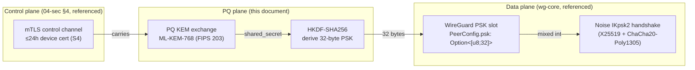
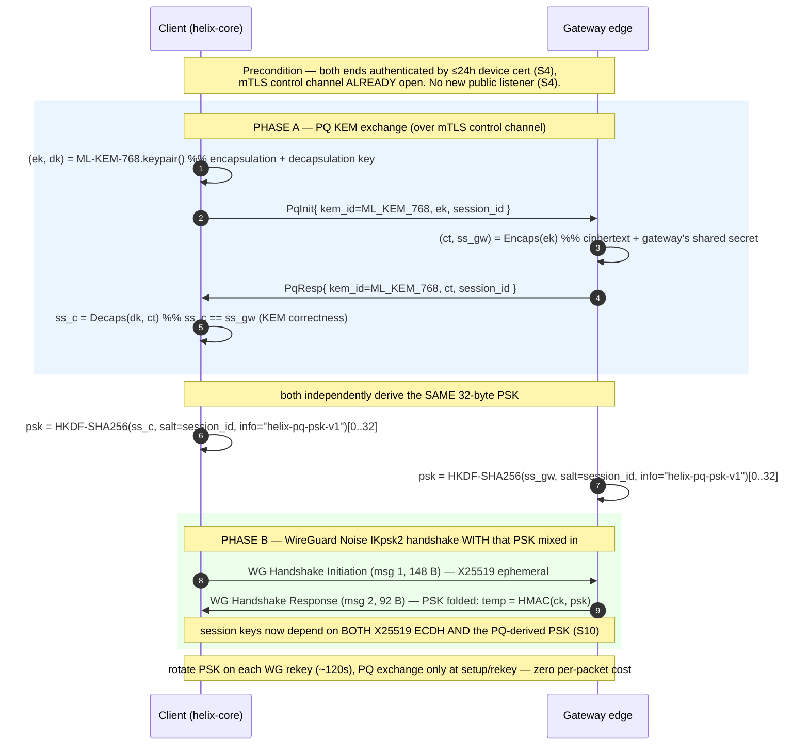

# Post-Quantum Handshake (PQ-derived PSK, hybrid never PQ-only)

**Revision:** 2
**Last modified:** 2026-06-26T12:00:00Z

> Master technical specification — Volume 5 (Security & Privacy), nano-detail spec.
> Deepens invariant **S10** and §9 of [04-sec] (`04-security-privacy-pki.md`): the
> **post-quantum handshake**. This document owns the *byte-level and operational
> contract* of HelixVPN's harvest-now-decrypt-later (HNDL) defence — the PQ KEM
> exchange, the HKDF→WireGuard-PSK derivation, the **hybrid-never-PQ-only** rule, the
> capability negotiation, the rekey lifecycle, the KEM decision (ML-KEM-768 vs
> Rosenpass vs Classic-McEliece-hybrid), the wire framing, the rollout phasing, and
> the anti-bluff validation. This is a **SPEC** — it describes the implementation; it
> does not build the product.
>
> The PQ exchange does **not** modify the WireGuard protocol: it fills WireGuard's
> *already-present, optional 32-byte preshared-key (PSK) slot* — the single injection
> point. The PSK mechanics, key schedule, and the `PeerConfig.psk` field live in the
> data plane (`helix-wg`); this document references them rather than redefining them.
>
> Source evidence cited inline by id: [04-sec §9] (`04-security-privacy-pki.md` §9 +
> S10 + threat T8), [wg-core §4.4] (`v02-data-plane/wireguard-core.md` PQ-PSK seam),
> [wg-core §2.2/§4.2] (the `PeerConfig.psk` field + key-schedule mix-in),
> [research-pq] (`v09-research/research-pki_pq_nat.md` §2 post-quantum WireGuard),
> [research-wg §6] (`v09-research/research-wireguard.md` §6 the PSK injection point),
> [research-mullvad] (the PQ-PSK-over-WG prior art). Access date for all external
> facts: **2026-06-25**. Unproven claims are marked `UNVERIFIED:` per §11.4.6 —
> never fabricated.

---

## Table of contents

- [0. Position, ownership, and the one-sentence contract](#0-position-ownership-and-the-one-sentence-contract)
- [1. The threat: harvest-now-decrypt-later (HNDL)](#1-the-threat-harvest-now-decrypt-later-hndl)
- [2. The mechanism: WireGuard's PSK slot is the only injection point](#2-the-mechanism-wireguards-psk-slot-is-the-only-injection-point)
- [3. The hybrid model — classical X25519 ⊕ PQ KEM, never PQ-only (S10)](#3-the-hybrid-model--classical-x25519--pq-kem-never-pq-only-s10)
- [4. The hybrid handshake (Mermaid + step-by-step)](#4-the-hybrid-handshake-mermaid--step-by-step)
- [5. KEM choice — decision with recommendation](#5-kem-choice--decision-with-recommendation)
- [6. Key sizes, performance, and the steady-state-zero-cost claim](#6-key-sizes-performance-and-the-steady-state-zero-cost-claim)
- [7. Negotiation, capability flags, and fallback](#7-negotiation-capability-flags-and-fallback)
- [8. Rekey & PSK rotation lifecycle](#8-rekey--psk-rotation-lifecycle)
- [9. Wire framing of the PQ exchange (on the mTLS control channel)](#9-wire-framing-of-the-pq-exchange-on-the-mtls-control-channel)
- [10. Pluggable KEM contract (Rust)](#10-pluggable-kem-contract-rust)
- [11. Rollout phasing (Phase 2+) and standardized-vs-experimental honesty](#11-rollout-phasing-phase-2-and-standardized-vs-experimental-honesty)
- [12. Threat-model placement & residual risk](#12-threat-model-placement--residual-risk)
- [13. Anti-bluff validation (how PQ is proven, not asserted)](#13-anti-bluff-validation-how-pq-is-proven-not-asserted)
- [14. Phase → task → subtask plan (PQ workstream)](#14-phase--task--subtask-plan-pq-workstream)
- [Sources verified](#sources-verified)

---

## 0. Position, ownership, and the one-sentence contract

**One-sentence contract.** HelixVPN derives a 32-byte symmetric pre-shared key from a
post-quantum KEM exchange and mixes it into WireGuard's existing optional-PSK slot, so a
session is secure unless an attacker breaks **both** the classical X25519 ECDH **and** the
PQ KEM — closing the HNDL threat without changing the WireGuard protocol [04-sec §9,
wg-core §4.4, research-pq §2.1].

**What this document owns:**

- the PQ KEM exchange protocol that runs *over the authenticated control channel*;
- the HKDF derivation `shared_secret → 32-byte WireGuard PSK`;
- the hybrid combiner (classical + PQ, S10) and the never-PQ-only rule;
- the capability negotiation + classical-WG fallback;
- the per-rekey PSK rotation lifecycle;
- the KEM decision (ML-KEM-768 default; Rosenpass / Classic-McEliece-hybrid options);
- the `PqKem` pluggable Rust contract and the wire framing.

**What this document does NOT own (referenced, not redefined):**

- the WireGuard Noise IK handshake, the PSK key-schedule mix-in, and the `PeerConfig.psk:
  Option<Psk>` field — those are [wg-core §4.2/§4.4/§2.2]; this doc only *fills* the field;
- the control channel mTLS + device-cert lifecycle the PQ exchange rides on — [04-sec §4];
- where the PQ code physically lives in `helix-core` crates + FFI — Volume 5 client-core
  (the `helix-pki` crate's `pq` module); this doc defines the *protocol*, not the file tree.



---

## 1. The threat: harvest-now-decrypt-later (HNDL)

WireGuard's handshake is **Noise_IK** over **Curve25519** (X25519) ECDH [research-wg §1,
§2]. X25519 is classically secure but **not** post-quantum secure: a sufficiently large
quantum computer running Shor's algorithm recovers the ECDH private key from observed
public values, decrypting any session whose key agreement used it.

The operative danger is **not** "quantum computers exist today" — they do not at the scale
required (§12 residual risk). The danger is **harvest-now-decrypt-later**: a passive
adversary (a censor, an ISP, a nation-state recorder) **records ciphertext today** and
**decrypts it years later** once a cryptographically-relevant quantum computer matures
[research-pq §2.1, 04-sec §9]. For a privacy VPN this is the worst class of threat because:

1. The victim cannot detect the recording — it is passive.
2. The damage is retroactive — every session recorded before the mitigation shipped is
   exposed; you cannot re-secure traffic an adversary already holds.
3. The window is long — HNDL captures accumulate for as long as the adversary chooses, and
   the decryption deadline is the adversary's, not the victim's.

This is exactly the threat invariant **S10** binds and threat **T8** enumerates in [04-sec
§0.1, §10]: *passive recorder + future quantum*, mitigated by the hybrid PQ PSK, residual
risk = "PQ KEM novelty → hybrid hedge; classical still protects."

**Honest boundary (§11.4.6).** PQ protection here defends *future* decryption of *today's*
recorded traffic. It is **not** a claim that classical WireGuard is broken now — X25519 +
ChaCha20-Poly1305 is sound against every classical adversary [research-wg §2]. The PQ layer
is a forward hedge, deliberately conservative.

---

## 2. The mechanism: WireGuard's PSK slot is the only injection point

WireGuard already supports an **optional 32-byte symmetric pre-shared key**. The protocol
page is explicit: *"When pre-shared key mode is not in use, the pre-shared key value used
below is assumed to be an all-zero string of 32 bytes"* [research-wg §6] — i.e. the PSK slot
**always exists**; it is simply all-zero when unused. In the Noise_IKpsk2 variant the PSK is
mixed into the chaining key during response generation:
`temp = HMAC(responder.chaining_key, preshared_key)` [research-wg §6].

> **Reconciled (§11.4.35, 2026-06-26):** this key-schedule formula is cited to `[research-wg §6]`
> only; the prior dual-citation to `wireguard-core.md §4.2` is dropped because wg-core §4.2 marks
> its key-schedule transcription **UNVERIFIED** — the authoritative source for the PSK mix-in is the
> WireGuard protocol research §6.

The PSK enters the **symmetric** key schedule (BLAKE2s/HMAC chaining), *downstream of* the
X25519 ECDH. The cryptographic consequence is the whole reason this works:

> Because the PSK is mixed into the symmetric chaining key, the tunnel stays confidential
> **even if the X25519 ECDH is later broken** — an attacker who recovers the ECDH secret
> still faces an unknown 32-byte symmetric secret folded into the key schedule. [research-wg
> §6]

So the injection point is **exactly one field** and the WireGuard protocol surface needs
**zero change** — only the PSK field is filled with a value derived from a PQ KEM, instead of
being left all-zero or a static manual key [research-pq §2.1, research-wg §6].

In HelixVPN's data plane this is the single seam `helix-wg` exposes:

```rust
// referenced from v02-data-plane/wireguard-core.md §2.2 — NOT redefined here.
pub type Psk = [u8; 32];                 // optional pre-shared key (post-quantum seam, §4.4)

pub struct PeerConfig {
    // ... allowed_ips, endpoint, persistent_keepalive, public_key ...
    pub psk: Option<Psk>,                // §4.4 — THIS is where the PQ-derived PSK lands
}
```

and the underlying boringtun `Tunn::new` takes the same slot directly [research-wg §10]:

```rust
// boringtun (referenced) — the PSK slot at the implementation floor.
pub fn new(
    static_private: StaticSecret,
    peer_static_public: PublicKey,
    preshared_key: Option<[u8; 32]>,     // ← the PQ-derived PSK installs here
    persistent_keepalive: Option<u16>,
    index: u32,
    rate_limiter: Option<Arc<RateLimiter>>,
) -> Self
```

The UAPI configures it as the `preshared_key` config key (hex; all-zero to remove)
[research-wg §6]. HelixVPN's only data-plane work is to *populate* `psk` from the PQ
exchange; everything below `PeerConfig.psk` is unmodified, well-audited WireGuard.

---

## 3. The hybrid model — classical X25519 ⊕ PQ KEM, never PQ-only (S10)

**Invariant S10: PQ is hybrid, never PQ-only.** The session derives security from *both* a
classical ECDH **and** a PQ KEM, combined so an attacker must break both [04-sec §0.1 S10,
research-pq §2.1].

The two halves and why each is load-bearing:

| Half | Primitive | Protects against | Failure mode it covers |
|---|---|---|---|
| Classical | X25519 ECDH (WireGuard's native handshake) | every *classical* adversary today | a flaw discovered in the (younger, less battle-tested) PQ KEM |
| Post-quantum | ML-KEM-768 KEM (FIPS 203), default | a *future quantum* HNDL adversary | quantum break of X25519 ECDH |

The combiner is **defence-in-depth**: the X25519 handshake runs exactly as WireGuard always
runs it (the classical half is *intrinsic* — it is the Noise IK handshake itself), and the PQ
KEM's shared secret is folded into the **same** session via the PSK slot. An attacker must
break **both** the classical ECDH **and** the PQ KEM to recover the session keys [04-sec §9.1,
research-pq §2.1].

**Why never PQ-only (the conservative choice, §11.4.6).** PQ KEMs are *younger* than X25519
and have had less cryptanalytic exposure. If the project shipped a PQ-only handshake and the
chosen PQ KEM later proved flawed, *every* session would be exposed. With the hybrid:

- if the PQ KEM has a flaw → classical WireGuard still protects you against today's attackers;
- if quantum breaks classical X25519 → the PQ PSK still protects you against HNDL.

This is the standing industry recommendation — *"hybrid, not PQ-only … production deployments
combine a classical KEM and a PQ KEM so the result is no weaker than either"* [research-pq
§2.1] — and matches Mullvad's production posture (Classic McEliece + ML-KEM, hybrid by
default) [research-pq §2.2, research-mullvad].

> **Combiner construction (the symmetric fold is the combiner).** HelixVPN does *not* build a
> bespoke KEM combiner construction. The classical half is the X25519 ECDH already inside the
> Noise IK handshake; the PQ half is the KEM shared secret installed as the WireGuard PSK. The
> WireGuard key schedule itself is the combiner: the final session keys depend on the X25519
> chaining **and** the PSK mix-in `temp = HMAC(chaining_key, psk)` [research-wg §6]. Breaking
> one input does not yield the session keys. `UNVERIFIED:` the formal IND-CCA composition
> argument for "Noise IKpsk2 with a KEM-derived PSK is a sound hybrid" — this rests on the
> WireGuard whitepaper's Noise_IKpsk2 security argument, which a human must read directly
> [research-wg §"Honest gaps", wg-paper UNREACHABLE]; flagged, not claimed.

---

## 4. The hybrid handshake (Mermaid + step-by-step)

The PQ KEM exchange rides the **authenticated mTLS control channel** (S4) — there is **no new
public listener** and no unauthenticated PQ endpoint to attack [04-sec §9.3, research-pq §1.2].
Both ends already hold a valid ≤24 h device cert (S4); the PQ exchange is one more
RPC over that channel, before/alongside the WireGuard data handshake.



### 4.1 Step-by-step (the contract)

1. **Both ends authenticate first.** The mTLS control channel is already open with valid
   ≤24 h device certs (S4) [04-sec §4]. PQ negotiation is gated on this — an unauthenticated
   party never reaches the PQ exchange.

2. **Capability check (§7).** Both ends advertise `pq_capable=true` + the supported `kem_id`
   set. If either end lacks PQ support, the session falls back to classical WireGuard (still
   secure today) and skips Phase A entirely [04-sec §9.3, research-pq §2.2 mobile-experimental].

3. **PQ KEM exchange (Phase A).** The client generates an ML-KEM-768 keypair `(ek, dk)`, sends
   the **encapsulation key** `ek` to the gateway. The gateway runs `Encaps(ek) → (ct, ss_gw)`,
   returns the **ciphertext** `ct`. The client runs `Decaps(dk, ct) → ss_c`. By KEM
   correctness, `ss_c == ss_gw` [research-pq §2.4]. The client's *decapsulation* key `dk`
   never leaves the device.

4. **PSK derivation.** Both ends independently compute
   `psk = HKDF-SHA256(shared_secret, salt=session_id, info=b"helix-pq-psk-v1")` truncated to
   32 bytes [04-sec §9.3 code, RFC 5869]. The `session_id` salt domain-separates each session
   so the same KEM material never yields the same PSK twice.

5. **WireGuard handshake with the PSK (Phase B).** The standard Noise IKpsk2 handshake runs;
   the 32-byte PSK is mixed into the chaining key `temp = HMAC(ck, psk)` during response
   generation [research-wg §6]. The resulting session keys depend on **both** the X25519 ECDH
   **and** the PQ-derived PSK (S10).

6. **Rotation.** On every WireGuard rekey (`REKEY_AFTER_TIME` ≈ 120 s [research-wg §9]) the PQ
   exchange re-runs and a fresh PSK is installed (§8). The PSK is *ephemeral* — never persisted
   (§4.5 of [04-sec], the PQ plane "per-session, never persisted").

### 4.2 What the adversary sees

A passive recorder on the data path sees only **opaque WireGuard datagrams** carried by the
obfuscation transport (doc 01) — the PQ exchange happened on the *encrypted, authenticated
mTLS control channel*, so the recorder cannot even observe the KEM ciphertext, let alone the
PSK [04-sec §9.3]. Even granting the adversary the KEM ciphertext, recovering the session
requires breaking ML-KEM-768 **and** X25519 (S10).

---

## 5. KEM choice — decision with recommendation

Per §11.4.66 (decision discipline) the KEM is surfaced as a **decision with options**, never a
silent pick. The `PqKem` trait (§10) makes the choice pluggable so the decision is reversible.

| Option | KEM(s) | Pro | Con | Recommendation |
|---|---|---|---|---|
| **Primary** | **ML-KEM-768 (FIPS 203, standardized Kyber)** | NIST-standardized (FIPS 203, published 2024-08-13); good size/speed balance; broad library support (`ml-kem` Rust crate, BoringSSL); NSA CNSA 2.0 mandates ML-KEM for NSS key-encapsulation | younger than X25519; lattice assumption is newer cryptanalysis | **DEFAULT.** Pluggable in `helix-core`'s `pq` module [04-sec §9.2, research-pq §2.4]. |
| **Conservative hybrid** | **ML-KEM-768 + Classic McEliece** | Mullvad's production posture combines McEliece + ML-KEM for exactly this hedge; code-based (McEliece) is a *very different* hardness assumption from lattice (ML-KEM) — a break of one does not imply a break of the other | Classic McEliece public/encapsulation keys are **large** (hundreds of KB) → larger control-channel exchange | **Phase-2 opt-in** for high-assurance tenants; runs only at setup/rekey so the size cost is amortised, not per-packet [04-sec §9.2, research-pq §2.2]. |
| **External protocol** | **Rosenpass** (audited PQ key-exchange daemon feeding WG a PSK) | independent symbolic analysis (ProVerif); clean separation of concerns; reference design Mullvad embeds in its agent (since v0.25.4) auto-rotating PSKs | extra daemon + integration surface; tagged release (v0.2.2, 2024-06-05) still uses **Kyber-512 + Classic McEliece**, *not* yet ML-KEM in the tagged build; full cryptographic proof "in progress", not complete | **Evaluate during the Phase-2 PQ spike** — prefer Rosenpass if an *audited external protocol* beats an in-house KEM exchange; verify upstream ML-KEM status before relying on it [04-sec §9.2, research-pq §2.3]. |

### 5.1 Decision rationale

- **ML-KEM-768 as the default** because it is the *standardized* primitive (FIPS 203), has the
  cleanest Rust library story (`ml-kem` crate), and gives the best size/speed for a per-rekey
  exchange. NSA CNSA 2.0 requiring ML-KEM for national-security systems means the ecosystem and
  tooling will converge on it [research-pq §2.4].

- **Why not 1024.** Mullvad uses ML-KEM-**1024** in its current production tunnels
  [research-wg §6 cross-ref]. HelixVPN's MVP/Phase-2 default is **768** for the size/speed
  balance, with the parameter set being a `kem_id` field (§9) so a tenant can negotiate 1024 if
  it wants the larger margin. `UNVERIFIED:` whether 768 vs 1024 is the right default for
  HelixVPN's threat model at GA — this is a Phase-2 spike decision; 768 is the documented
  starting recommendation, not a final pin (§11.4.6).

- **Rosenpass vs in-house.** The genuine question the Phase-2 spike answers: is it better to
  embed an *audited external* PQ protocol (Rosenpass, the path Mullvad took) or to drive ML-KEM
  directly via the `PqKem` trait? Rosenpass brings independent analysis and a maintained
  reference, at the cost of an extra daemon and a tagged release that is **not yet on ML-KEM**.
  The decision is deferred to the spike with captured evidence, not pre-judged here [04-sec
  §9.2, research-pq §2.3].

> **Honest gap (§11.4.6 / §11.4.99).** Rosenpass's verification status is a **symbolic
> analysis (ProVerif), NOT a full cryptographic proof** — the proof is "in progress" per its
> README [research-pq §2.3]. The tagged Rosenpass release (v0.2.2, 2024-06-05) still uses
> Kyber-512, not ML-KEM. Both facts MUST be re-verified against upstream at implementation time
> per §11.4.99 (latest-source) before relying on Rosenpass-specific ML-KEM behaviour.

---

## 6. Key sizes, performance, and the steady-state-zero-cost claim

The defining performance property: **the PQ exchange runs at session setup and rekey only —
never per packet** — so steady-state overhead is **zero** [04-sec §9.3, research-pq §2.4].

### 6.1 Approximate key/ciphertext sizes (orientation, verify at impl)

| KEM | Encapsulation key | Ciphertext | Shared secret | Note |
|---|---|---|---|---|
| ML-KEM-768 | `UNVERIFIED:` ≈ 1184 B | `UNVERIFIED:` ≈ 1088 B | 32 B | FIPS 203 Module-Lattice KEM; verify exact sizes against the `ml-kem` crate / FIPS 203 at impl time |
| ML-KEM-1024 | `UNVERIFIED:` ≈ 1568 B | `UNVERIFIED:` ≈ 1568 B | 32 B | larger margin; negotiable via `kem_id` |
| Classic McEliece | **hundreds of KB** (large public key) | small | 32 B | the size cost is at *setup/rekey only*, amortised [research-pq §2.2] |
| Rosenpass (Kyber-512 + McEliece) | dominated by McEliece public key | — | 32 B → WG PSK | external daemon; refreshes PSK every 2 min [research-pq §2.3] |

> **`UNVERIFIED:` byte sizes.** The exact ML-KEM-768/1024 key and ciphertext byte sizes are
> standardized in FIPS 203 but are **not** re-confirmed from a fetched primary source in this
> writing context (the figures above are orientation only) — they MUST be pinned against the
> chosen `ml-kem` crate version and FIPS 203 at implementation time per §11.4.6/§11.4.99.

### 6.2 Cost model

- **Per-packet cost: zero.** The PQ exchange does not touch the data path. Once the PSK is
  installed, every transport-data packet is plain ChaCha20-Poly1305 with the PSK-influenced
  session key — identical cost to classical WireGuard [04-sec §9.3].

- **Per-rekey cost: KB-scale exchange + one Encaps/Decaps.** ML-KEM Encaps/Decaps are fast
  (microsecond-class on commodity hardware) and the exchange is KB-scale; with `REKEY_AFTER_TIME
  ≈ 120 s` [research-wg §9] this is one small exchange every ~2 minutes per peer.

- **Handshake-time budget.** The PQ-PSK exchange adds roughly **~1–2 s at handshake**, with
  **steady-state unchanged** [wg-core §"perf table" / research-mullvad §4]. HelixVPN's handshake
  budget already allots for this (handshake < 1 s plain, < 2 s MASQUE) [wg-core §15].

- **Classic McEliece caveat.** McEliece's hundreds-of-KB public key makes its *setup/rekey*
  exchange materially larger; this is why it is the Phase-2 high-assurance opt-in, not the
  default, and why it runs only at setup/rekey where the size is amortised [research-pq §2.2].

---

## 7. Negotiation, capability flags, and fallback

PQ is **capability-negotiated** with a graceful classical fallback — a peer that does not
support PQ falls back to classical WireGuard, which is still secure today [04-sec §9.3,
research-pq §2.2].

### 7.1 The toggle and the default

- A **"Quantum-resistant" toggle** is exposed to the user, **on by default for new tunnels
  where both ends support it** [04-sec §9.3]. This mirrors Mullvad's posture: quantum-resistant
  tunnels became the **default on desktop as of 2025-01-09** [research-pq §2.2].

- **Mobile honesty (§11.4.6).** Mullvad shipped PQ for iOS, but its embedded
  Rosenpass-server PSK auto-rotation path is still marked **experimental and not yet supported
  on mobile** in the agent [research-pq §2.2]. HelixVPN treats mobile PQ as Phase-2 with the
  same honesty: the toggle exists, the on-by-default policy is platform-gated, and a platform
  where the PQ path is not yet proven ships PQ as opt-in, not silent default —
  never a faked "PQ on" that is actually classical (§11.4.6 no-guessing).

### 7.2 Negotiation outcomes (closed set)

| Client PQ | Gateway PQ | Outcome | PSK | Security posture |
|---|---|---|---|---|
| supports + toggle on | supports | **PQ hybrid** | PQ-derived (this doc) | X25519 ⊕ PQ KEM (S10) |
| supports + toggle off | supports | classical WG | all-zero (none) | X25519 only — secure today, no HNDL hedge |
| supports | does not support | classical WG (fallback) | all-zero | X25519 only — graceful degrade, never a faked PQ PASS |
| does not support | supports | classical WG (fallback) | all-zero | X25519 only |

The negotiation result is **observable**: the runtime signature for "PQ is actually on" is
*the WireGuard PSK is non-zero AND an ML-KEM exchange was observed* (§13). A toggle that reads
"on" while the PSK is all-zero is a §11.4 PASS-bluff and a §13 test catches it.

### 7.3 `kem_id` negotiation

Both ends advertise their supported `kem_id` set (ML-KEM-768, optionally ML-KEM-1024,
optionally McEliece-hybrid, optionally Rosenpass). They select the **strongest mutually
supported** KEM. An unknown `kem_id` is rejected (closed-set, §9) — never silently downgraded
to a weaker one without recording the negotiation outcome [§11.4.6].

---

## 8. Rekey & PSK rotation lifecycle

The PQ-derived PSK is **ephemeral and rotated on every WireGuard rekey** — it is never
persisted [04-sec §4.5 "PQ PSK rotated on every WG rekey interval; ephemeral, never
persisted"].

```mermaid
stateDiagram-v2
    [*] --> Negotiating: tunnel setup, both ends PQ-capable (§7)
    Negotiating --> PqExchange: capability + kem_id agreed
    Negotiating --> ClassicalOnly: either end not PQ-capable (fallback §7.2)
    PqExchange --> PskInstalled: HKDF(shared_secret) → 32B PSK → PeerConfig.psk
    PskInstalled --> Active: WG Noise IKpsk2 completes (PSK folded in)
    Active --> Rekeying: now ≥ session_start + REKEY_AFTER_TIME (≈120s)
    Rekeying --> PqExchange: re-run PQ KEM, derive FRESH PSK (new session_id salt)
    Active --> Torn: tunnel down / peer removed
    ClassicalOnly --> Torn: tunnel down
    Torn --> [*]: PSK zeroized on drop (Zeroizing); never written to disk
    note right of Rekeying
      WG drives rekey on its own timers (REKEY_AFTER_TIME≈120s,
      REKEY_AFTER_MESSAGES=2^60) [research-wg §9].
      Each rekey gets a FRESH PQ exchange + fresh session_id salt,
      so a recorded PSK from a prior epoch is useless next epoch.
    end note
```



### 8.1 Rotation contract

- **Trigger.** WireGuard's own rekey timers drive rotation: `REKEY_AFTER_TIME ≈ 120 s` or
  `REKEY_AFTER_MESSAGES = 2^60` [research-wg §9]. The PQ layer does *not* invent its own rotation
  cadence — it reuses WireGuard's, so the timings are never guessed (§11.4.6).

- **Fresh material each epoch.** Every rekey runs a **new** PQ KEM exchange with a **new**
  `session_id` salt, yielding a fresh PSK. A PSK recorded during epoch *N* (even if somehow
  extracted) is useless in epoch *N+1* — forward secrecy at the PSK layer.

- **Ephemerality (S11-class hygiene).** The PSK lives only in memory, wrapped in `Zeroizing`
  so it is wiped on drop; it is **never** written to disk, never logged, never serialized across
  the FFI boundary as raw bytes [04-sec §3.3 key-handling discipline, §4.5]. WireGuard's own
  session zeroization (`REJECT_AFTER_TIME × 3`) wipes the derived session keys [research-wg §9].

- **Rosenpass cadence cross-ref.** If Rosenpass is chosen (§5), it refreshes the PSK **every 2
  minutes** on its own [research-pq §2.3] — which aligns with WireGuard's ~120 s rekey, so the
  two cadences compose naturally. `UNVERIFIED:` exact interaction of Rosenpass's 2-min refresh
  with WireGuard's rekey timing under HelixVPN's specific wiring — a Phase-2 integration detail.

---

## 9. Wire framing of the PQ exchange (on the mTLS control channel)

The PQ exchange is **two messages** over the authenticated mTLS control channel — `PqInit`
(client → gateway, carries the encapsulation key) and `PqResp` (gateway → client, carries the
KEM ciphertext). It is an extension of the `Coordinator` RPC surface [04-sec §3.2 extends doc
03], so it inherits mTLS authentication and needs no new listener.

```protobuf
// helix-proto/coordinator.proto  (PQ additions — extends the Coordinator service)
// All PQ RPCs ride the SAME mTLS control channel as Enroll/WatchNetworkMap (S4). No new listener.

enum KemId {
  KEM_UNSPECIFIED   = 0;   // reject (closed-set; never silently downgrade)
  KEM_ML_KEM_768    = 1;   // DEFAULT (FIPS 203)
  KEM_ML_KEM_1024   = 2;   // larger margin, negotiable
  KEM_MCELIECE_HYB  = 3;   // Phase-2 ML-KEM-768 + Classic McEliece (high-assurance opt-in)
  KEM_ROSENPASS     = 4;   // Phase-2 external Rosenpass protocol (evaluated in the spike)
}

message PqCapabilities {                 // exchanged during negotiation (§7)
  bool            pq_capable    = 1;     // false ⇒ classical fallback, never a faked PQ PASS
  repeated KemId  supported     = 2;     // strongest mutually-supported wins
  bool            toggle_on     = 3;     // user "Quantum-resistant" toggle state (§7.1)
}

message PqInit {                          // client → gateway (PHASE A step 1)
  KemId   kem_id      = 1;               // selected per §7.3; KEM_UNSPECIFIED ⇒ PermissionDenied
  bytes   encap_key   = 2;               // ML-KEM-768 encapsulation key (ek); size per §6.1
  bytes   session_id  = 3;               // 16-byte random; the HKDF salt (domain-separates epochs)
}

message PqResp {                          // gateway → client (PHASE A step 2)
  KemId   kem_id      = 1;               // MUST echo PqInit.kem_id; mismatch ⇒ abort
  bytes   ciphertext  = 2;               // ML-KEM ciphertext (ct); client Decaps(dk, ct) → ss
  bytes   session_id  = 3;               // MUST echo PqInit.session_id
}
// NOTE: the decapsulation key (dk) and the derived 32-byte PSK NEVER appear on the wire (S2-class).
// Only ek (public) and ct (public) cross the channel; ss and psk are computed independently each side.
```

### 9.1 Framing invariants

1. **Public material only on the wire.** Only `ek` (encapsulation key, public) and `ct`
   (ciphertext, public) cross the channel. The decapsulation key `dk` and the derived `psk`
   are computed independently on each side and never transmitted (S2-class key hygiene).

2. **session_id binds the epoch.** The 16-byte random `session_id` is the HKDF salt; echoing
   it in `PqResp` binds request↔response and domain-separates each rekey epoch.

3. **Closed `kem_id` set.** `KEM_UNSPECIFIED` (0) is rejected; an unknown `kem_id` aborts the
   exchange — never a silent downgrade to a weaker KEM (§11.4.6).

4. **`UNVERIFIED:` exact PQ-PSK message sequence.** The precise KEM-exchange framing is a
   HelixVPN design choice — Mullvad's equivalent is *deliberately high-level in public docs*
   and is "a Mullvad-specific protocol on top of WireGuard … NOT part of the WireGuard protocol
   itself" [research-wg §6, research-pq §2.2]. The two-message `PqInit`/`PqResp` shape above is
   HelixVPN's spec design, not a copy of a published wire format; it MUST be reviewed against
   the chosen KEM library's API and (if Rosenpass) Rosenpass's own protocol at impl time.

---

## 10. Pluggable KEM contract (Rust)

The KEM is behind a trait so the §5 decision is reversible and the §13 self-validation can
swap a golden-good / golden-bad implementation [04-sec §9.3].

```rust
// helix-core/crates/helix-pki/src/pq.rs  (pluggable KEM contract — SPEC, not full impl)

/// A post-quantum KEM. The default impl is ML-KEM-768 (FIPS 203). Pluggable so the §5 decision
/// (ML-KEM vs McEliece-hybrid vs Rosenpass) is a swap, not a rewrite, and so the analyzer
/// self-validation (§13) can inject a golden-good and a golden-bad KEM.
pub trait PqKem {
    fn kem_id(&self) -> KemId;
    /// Generate an (encapsulation key, decapsulation key) pair. dk NEVER leaves the device.
    fn keypair(&self) -> (EncapKey, DecapKey);
    /// Gateway side: encapsulate to the client's ek, producing (ciphertext, shared_secret).
    fn encapsulate(&self, ek: &EncapKey) -> (Ciphertext, SharedSecret);
    /// Client side: decapsulate the ciphertext with dk, recovering the SAME shared_secret.
    fn decapsulate(&self, dk: &DecapKey, ct: &Ciphertext) -> SharedSecret;
}

/// PSK = HKDF-SHA256(shared_secret, salt=session_id, info=b"helix-pq-psk-v1") -> 32 bytes,
/// installed into the WireGuard Noise IKpsk2 preshared-key slot (PeerConfig.psk, wg-core §2.2/§4.4).
/// Rotated every WG rekey (§8). The returned WgPsk is Zeroizing — wiped on drop, never persisted.
pub fn derive_wg_psk(ss: &SharedSecret, session_id: &[u8]) -> WgPsk {
    // HKDF-Extract(salt=session_id, ikm=ss) -> prk; HKDF-Expand(prk, "helix-pq-psk-v1", 32) -> psk
    // (RFC 5869). The 32-byte output is exactly the WireGuard PSK width.
    /* HKDF-SHA256 */ unimplemented!("contract — impl batched per §11.4.9")
}

/// The hybrid combiner is NOT a bespoke construction: the classical X25519 half is intrinsic to
/// the Noise IK handshake; this PSK is the PQ half folded into the SAME session key schedule
/// (wg-core §4.2 `temp = HMAC(ck, psk)`). Breaking one input alone does not yield the session keys (S10).
```

### 10.1 Boundary discipline

- `EncapKey` and `Ciphertext` are public, serialized onto the wire (§9). `DecapKey` and
  `SharedSecret` and `WgPsk` are secret: `Zeroizing`-wrapped, never serialized, never logged,
  never crossing the FFI boundary as raw bytes [04-sec §3.3].

- The trait is the seam for the §13 self-validation: a **golden-bad** `PqKem` whose
  `decapsulate` returns a value ≠ the gateway's `encapsulate` shared secret MUST make the
  handshake **fail** (PSK mismatch ⇒ WG handshake fails) — proving the test catches a broken
  KEM, not just agreeing with a working one (§11.4.107(10)).

---

## 11. Rollout phasing (Phase 2+) and standardized-vs-experimental honesty

PQ is **Phase 2+**, not MVP — the MVP ships classical WireGuard (secure today) and reserves the
PSK seam so PQ is purely additive [04-sec §9, §12 Phase-2 plan, wg-core §4.4 "additive, Phase 2"].

| Phase | Scope | Status honesty (§11.4.6) |
|---|---|---|
| **MVP (Phase 1)** | Classical WireGuard only; PSK slot present but all-zero; `PqCapabilities` reserved in the proto | **STANDARDIZED + shipping** — X25519 Noise IK is mature, well-audited [research-wg §2] |
| **Phase 2** | `PqKem` ML-KEM-768 over mTLS; HKDF→WG PSK; capability negotiate; rotate on rekey; "Quantum-resistant" toggle on-by-default where both ends support; spike: ML-KEM vs Rosenpass vs McEliece-hybrid | ML-KEM-768 is **STANDARDIZED** (FIPS 203, 2024-08-13); the *HelixVPN wire framing* (§9) is **design work**, not a standard; Rosenpass is **EXPERIMENTAL** (symbolic-only analysis) [research-pq §2.3] |
| **Phase 2 (high-assurance opt-in)** | ML-KEM-768 + Classic McEliece hybrid for tenants wanting the code-based hedge | McEliece is a NIST-approved primitive; the *combination* matches Mullvad production [research-pq §2.2] |
| **Phase 3** | Reproducible builds + cosign-signed images + SBOM + third-party audit of the PQ core (so users can verify the PQ claim) [04-sec §12.3 Phase 3] | the PQ claim is only as trustworthy as the auditable build |

### 11.1 Standardized vs experimental — the honest split

- **Standardized (relyable now):** ML-KEM (FIPS 203, published 2024-08-13); the WireGuard PSK
  mechanism (the PSK slot is part of the WireGuard protocol) [research-pq §2.4, research-wg §6].

- **Design work (HelixVPN-specific, must be reviewed):** the §9 `PqInit`/`PqResp` wire framing;
  the capability-negotiation flow (§7); the HKDF info-string `"helix-pq-psk-v1"` and the PSK
  derivation parameters. These are HelixVPN's protocol design, not a published standard.

- **Experimental (do not over-claim):** Rosenpass — symbolic analysis (ProVerif) only, full
  cryptographic proof "in progress", tagged release still on Kyber-512 [research-pq §2.3];
  mobile PQ auto-rotation (Mullvad marks it experimental-not-yet-supported on mobile)
  [research-pq §2.2]. Any HelixVPN doc/UI that claims these as production-grade is a §11.4.99
  stale/over-claim violation — re-verify against latest upstream before relying on them.

---

## 12. Threat-model placement & residual risk

PQ closes threat **T8** in [04-sec §10]:

| # | Threat (STRIDE) | Vector | Mitigation (this doc) | Residual risk (§11.4.6) |
|---|---|---|---|---|
| T8 | **Information disclosure — harvest-now-decrypt-later** | Passive recorder + future quantum computer | Hybrid PQ PSK (S10, §3–§9): X25519 ⊕ ML-KEM-768, PSK rotated per rekey | PQ KEM novelty → the *hybrid hedge* covers it (classical still protects if the PQ KEM is flawed); a break of *both* X25519 *and* ML-KEM is required to recover a session |

**Residual risks stated honestly:**

1. **PQ KEM novelty.** ML-KEM is younger than X25519; a future cryptanalytic break is possible.
   The hybrid design (§3) is *exactly* the hedge: a PQ-KEM break leaves classical WireGuard
   intact for today's adversaries.

2. **HelixVPN wire-framing risk.** The §9 `PqInit`/`PqResp` framing is design work, not a
   standard — a protocol flaw in *the framing* (not the KEM) is possible and is why §13 + a
   third-party audit (Phase 3) are required before over-claiming.

3. **Mobile/Rosenpass maturity.** Where the PQ path is experimental (mobile, Rosenpass), PQ is
   opt-in, not silent default — never a faked "PQ on."

4. **Formal-composition gap.** The IND-CCA composition argument for Noise IKpsk2 + KEM-derived
   PSK rests on the WireGuard whitepaper's security argument, which was **UNREACHABLE** via the
   fetch tool and must be read directly by a human [research-wg §"Honest gaps"]. Flagged, not
   claimed.

5. **Not a claim classical WG is broken now.** PQ is a *forward* hedge; X25519 + ChaCha20-Poly1305
   is sound against every classical adversary today [research-wg §2].

---

## 13. Anti-bluff validation (how PQ is proven, not asserted)

Per S10's verification row [04-sec §13] and §11.4.107/§11.4.69, "PQ is on" is proven by
**captured evidence**, never by a toggle reading "on."

| Invariant | Captured-evidence proof (§11.4.5/§11.4.69/§11.4.107) |
|---|---|
| **PQ hybrid active** | Handshake with PQ on ⇒ the WireGuard **PSK is non-zero** AND an **ML-KEM exchange is observed** on the mTLS channel (captured `PqInit`/`PqResp` + non-zero `PeerConfig.psk`). A toggle "on" with an all-zero PSK is a §11.4 PASS-bluff and FAILs. |
| **Classical fallback works** | PQ off (or peer not PQ-capable) ⇒ classical WireGuard **still connects** (captured handshake), proving the fallback path is real and never a faked PQ PASS [04-sec §13]. |
| **Hybrid, not PQ-only** | With PQ on, the X25519 handshake is *still present* (captured msg-1/msg-2) AND the PSK is non-zero — both halves observed, proving the session depends on both (S10). |
| **Rotation** | Across a forced rekey, the captured PSK at epoch *N+1* ≠ epoch *N* (fresh PQ exchange), proving rotation is real, not a static reused PSK. |
| **KEM correctness** | `Decaps(dk, ct) == Encaps(ek).shared_secret` over N runs (§11.4.50 deterministic-consistency). |
| **Self-validated analyzer** | A **golden-bad** `PqKem` whose `decapsulate` returns the wrong shared secret MUST make the WG handshake FAIL (PSK mismatch) — proving the PQ test catches a broken KEM, not merely agreeing with a working one (§11.4.107(10), paired §1.1 mutation). |

The PQ validation runs as `helix_qa` + `challenges` suites (§11.4.27) — a Challenge that scores
PASS on a non-functional PQ control is the same class of defect as a unit-test PASS-bluff
[04-sec §13]. PQ is *not* in the highest-risk-first set (kill-switch + revocation are, per
§11.4.132) because it is Phase-2 additive, but its self-validation gate (golden-bad KEM ⇒
handshake fails) is mandatory before any "PQ on" claim ships.

---

## 14. Phase → task → subtask plan (PQ workstream)

Each leaf becomes a §11.4.93 workable item. Anti-bluff: every closure carries captured evidence
(§11.4.5/§11.4.69/§11.4.107) and a paired §1.1 mutation. Mirrors [04-sec §12 Phase-2 2.S1].

### Phase 1 (MVP) — reserve the seam, ship classical

- **PQ-1.a** — `PeerConfig.psk: Option<Psk>` present in `helix-wg`; all-zero in MVP (the seam
  exists, unfilled) [wg-core §2.2/§4.4].
- **PQ-1.b** — `PqCapabilities`/`PqInit`/`PqResp`/`KemId` reserved in `coordinator.proto` so the
  wire format need not change later (§9; additive per §11.4.6 no-silent-reshape).

### Phase 2 — PQ handshake

- **PQ-2.a** — `PqKem` trait + **ML-KEM-768** impl (`ml-kem` crate, pinned + re-verified per
  §11.4.99); `keypair`/`encapsulate`/`decapsulate` (§10).
- **PQ-2.b** — `derive_wg_psk` HKDF-SHA256 (salt=session_id, info=`"helix-pq-psk-v1"`) → 32 B,
  `Zeroizing` (§4, §8).
- **PQ-2.c** — `PqInit`/`PqResp` exchange over the mTLS control channel; no new listener (§9).
- **PQ-2.d** — capability negotiation + classical fallback; "Quantum-resistant" toggle
  on-by-default where both support (§7); mobile gated as opt-in (§7.1 honesty).
- **PQ-2.e** — rotate PSK on every WG rekey; ephemeral, never persisted (§8).
- **PQ-2.f** — **spike**: ML-KEM-768 vs Rosenpass vs McEliece-hybrid decision (§5), captured
  evidence, deep-research per §11.4.150 before the structural pick.
- **PQ-2.g** — anti-bluff suite: non-zero-PSK + observed-ML-KEM-exchange evidence; golden-bad
  KEM ⇒ handshake FAILs (§13); rotation evidence; N-iter KEM-correctness (§11.4.50).

### Phase 2 (high-assurance opt-in)

- **PQ-2.h** — ML-KEM-768 + Classic McEliece hybrid `PqKem` impl for high-assurance tenants
  (§5); size-amortised at setup/rekey only (§6).

### Phase 3 — auditable trust

- **PQ-3.a** — reproducible builds + cosign-signed images + SBOM so users verify the PQ binary
  matches source [04-sec §12.3].
- **PQ-3.b** — third-party cryptographic audit of the PQ core (KEM integration, HKDF derivation,
  wire framing, hybrid composition) [04-sec §12.3 3.S2].

---

## Sources verified

- `final/04-security-privacy-pki.md` (`[04-sec]`) — §0.1 invariant **S10** (PQ hybrid, never
  PQ-only) + **S11** (PQ plane, ephemeral, never persisted); §9 (post-quantum handshake:
  PQ-derived PSK §9.1, hybrid handshake Mermaid §9.1, KEM choice table §9.2, where-it-runs +
  capability-negotiate + on-by-default + steady-state-zero-cost §9.3, `PqKem`/`derive_wg_psk`
  §9.3); §10 threat **T8** (HNDL) + residual risk; §13 PQ verification row; §12 Phase-2 task
  2.S1 + Phase-3 reproducible builds/audit; §4.1 PQ plane key hierarchy; §4.5 PSK rotated on
  rekey, ephemeral. — local spec.
- `v02-data-plane/wireguard-core.md` (`[wg-core]`) — §2.2 (`PeerConfig.psk: Option<Psk>`,
  `Psk = [u8;32]`), §4.2 (key-schedule PSK mix-in `temp = HMAC(ck, psk)`), §4.4 (post-quantum
  PSK seam, additive Phase 2, no transport change, install negotiated shared secret as WG PSK),
  §15 (handshake budget), perf table (PQ-PSK ~1–2 s at handshake, steady-state unchanged). — local spec.
- `v09-research/research-pki_pq_nat.md` (`[research-pq]`) — §2.1 (PSK-injection approach,
  hybrid-not-PQ-only), §2.2 (Mullvad production: Classic McEliece + ML-KEM, default-on-desktop
  2025-01-09, mobile experimental, `wgephemeralpeer` reference, Kyber→ML-KEM migration), §2.3
  (Rosenpass: Rust, PSK refresh every 2 min, Classic McEliece + Kyber-512, ProVerif symbolic
  analysis not full proof, v0.2.2 2024-06-05 still Kyber-512), §2.4 (FIPS 203 ML-KEM published
  2024-08-13, NSA CNSA 2.0, target hybrid X25519 + ML-KEM-768, PSK feed not a WG fork). — cited
  research, access date 2026-06-25.
- `v09-research/research-wireguard.md` (`[research-wg]`) — §1/§2 (Noise IK, X25519, fixed crypto
  set), §6 (the PSK = post-quantum injection point: optional 32-byte PSK, all-zero when unused,
  `temp = HMAC(responder.chaining_key, preshared_key)`, enters symmetric schedule so secure even
  if X25519 broken; Mullvad ML-KEM-1024/McEliece-over-WG prior art; `PeerConfig.psk` surface;
  UAPI `preshared_key`; `UNVERIFIED:` exact PQ-PSK message sequence), §9 (rekey timers
  `REKEY_AFTER_TIME=120s`, `REKEY_AFTER_MESSAGES=2^60`, session zeroization), §10 (boringtun
  `Tunn::new` `preshared_key: Option<[u8;32]>`), §"Honest gaps" (whitepaper PDF UNREACHABLE).
  — cited research, access date 2026-06-25.
- `[research-mullvad]` (via research-wg §6 / wg-core perf table cross-ref) — PQ-PSK-over-WG prior
  art; PQ-PSK ~1–2 s at handshake, steady-state unchanged.

*Constitution bindings applied: §11.4.44 (revision header), §11.4.6 (no-guessing — every
unproven size/framing/composition claim marked `UNVERIFIED:`; KEM choice + 768-vs-1024 + Rosenpass
surfaced as decisions, never silent picks; rekey cadence reused from WireGuard, never invented),
§11.4.66 (decision discipline — §5 KEM table with options + recommendation), §11.4.99 (latest-source
— Rosenpass/ML-KEM status flagged for re-verification at impl), §11.4.107(10) (self-validated
analyzer — golden-bad KEM ⇒ handshake fails), §11.4.50 (deterministic KEM-correctness over N runs),
§11.4.150 (deep-research before the structural KEM pick), §11.4.93 (phases → workable items),
§11.4.65/§11.4.153 (HTML+PDF[+DOCX] exports follow in refinement). Honest boundary (§11.4.6): the
hybrid-composition formal proof rests on the WireGuard whitepaper, UNREACHABLE here — a human must
verify it before relying on §3's IND-CCA argument.*
