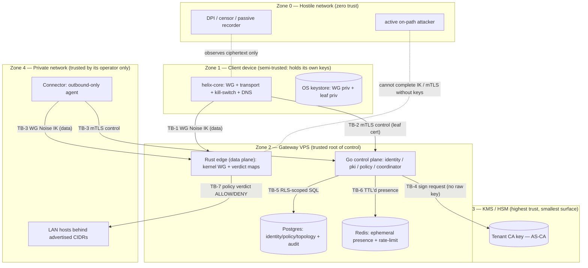
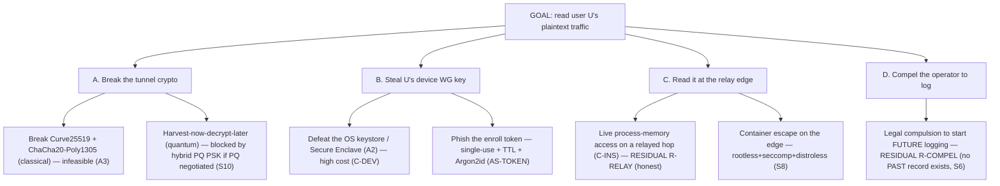
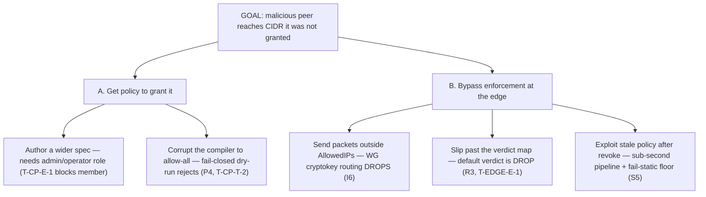

# Threat Model — STRIDE + LINDDUN

**Revision:** 3
**Last modified:** 2026-07-04T12:00:00Z
**Rev 3:** Closed a dangling residual-risk reference — T-CONN-S-1 cited "§10 R-CONN" but no
`R-CONN` row existed in the §10 residual-risk register; added it (compromised connector lying
about served CIDRs — attributable via audit, Phase-2 attestation hardening tracked, not MVP).

> Master technical specification — Volume 5 (Security & Privacy), nano-detail document
> **threat-model**. Deepens [`04-security-privacy-pki.md`] (the security spine: zero-trust,
> identity, PKI, no-logging, kill-switch, PQ) into an implementation-grade threat model:
> a STRIDE decomposition **per component**, a LINDDUN **privacy** decomposition, the
> attacker-class taxonomy, the trust-boundary diagram, every threat mapped to a concrete
> spec mechanism, an assets × threats × mitigation matrix, and an honest residual-risk
> register. SPEC ONLY — this document *describes* the security properties the build must
> have; it does not build the product. Sources are cited inline by id: `[04_ARCH §N]`
> (HelixVPN-Architecture-Refined.md), `[04_P1 §N]` (HelixVPN-Phase1-MVP.md), `[04_P2 §N]`
> (Phase-2 PQ/transport notes), `[research-pki_pq_nat]` (scratchpad/kb), `[SYNTHESIS §N]`,
> and sibling specs by filename. Every invariant id `S1`–`S11` is the one defined in
> [`04-security-privacy-pki.md` §0.1]; `P1`–`P8` in [`v03-control-plane/svc-policy.md` §0.1];
> `I5/I6/R1`–`R4` in [`v02-data-plane/routing-and-addressing.md` §0.2]. Any claim not
> grounded in the evidence base is flagged **UNVERIFIED** per constitution §11.4.6 — never
> fabricated.

---

## Table of contents

- [0. Position, ownership & what this document delivers](#0-position-ownership--what-this-document-delivers)
- [1. Methodology, scope & assumptions](#1-methodology-scope--assumptions)
- [2. Asset register — what we are protecting](#2-asset-register--what-we-are-protecting)
- [3. Trust boundaries](#3-trust-boundaries)
- [4. Attacker classes](#4-attacker-classes)
- [5. STRIDE per component](#5-stride-per-component)
  - [5.1 Connector](#51-connector-outbound-only-network-side-agent)
  - [5.2 Gateway — control plane](#52-gateway--go-control-plane)
  - [5.3 Gateway — Rust edge (data plane)](#53-gateway--rust-edge-data-plane)
  - [5.4 Client device](#54-client-device-helix-core)
  - [5.5 Coordinator](#55-coordinator-watchnetworkmap-fan-out)
  - [5.6 PKI / tenant CA](#56-pki--tenant-ca)
  - [5.7 Data plane (the tunnel on the wire)](#57-data-plane-the-tunnel-on-the-wire)
- [6. LINDDUN privacy threats](#6-linddun-privacy-threats)
- [7. Threat → mitigation map (every threat to a spec mechanism)](#7-threat--mitigation-map)
- [8. Assets × threats × mitigation matrix](#8-assets--threats--mitigation-matrix)
- [9. Attack trees (two worked)](#9-attack-trees-two-worked)
- [10. Residual risks — honestly stated](#10-residual-risks--honestly-stated)
- [11. Test & validation mapping (§11.4.169)](#11-test--validation-mapping-1141169)
- [Sources verified](#sources-verified)

---

## 0. Position, ownership & what this document delivers

HelixVPN is a self-hostable overlay network with a privacy-VPN front end: three roles —
**Connector** (outbound-only, advertises CIDRs) ⇄ **Gateway** (public VPS: control + data
plane) ⇄ **Client** (Mullvad-style end-user app) [04_ARCH §1.1, SYNTHESIS §1]. The security
spine is owned by [`04-security-privacy-pki.md`]; **this document owns the threat analysis
that justifies every mechanism in that spine.** A mechanism with no mapped threat is a
candidate for removal; a threat with no mapped mechanism is a release blocker.

This document **owns**: the STRIDE/LINDDUN decompositions (§5/§6), the attacker-class model
(§4), the trust-boundary diagram (§3), the asset register (§2), the threat→mitigation map
(§7), the assets×threats×mitigation matrix (§8), and the residual-risk register (§10).

It does **not** own: the mechanisms themselves (the enrollment protocol, the PKI lifecycle,
the kill-switch state machine, the PQ handshake — all [`04-security-privacy-pki.md`]); the
policy compiler ([`v03-control-plane/svc-policy.md`]); the WG crypto core and transports
(doc 01); the platform tunnel shims (doc 06). It *references* those by id and asserts what
each defends against.

### 0.1 How a threat is recorded here (the discipline)

Each threat carries: a stable id (`T-<COMPONENT>-<STRIDE-letter>-<n>` or `LP-<letter>-<n>`),
the STRIDE/LINDDUN category, the attacker class(es) that can reach it (§4), the asset(s) at
risk (§2), the **mitigation** (a cited spec mechanism), and an honest **residual** note
(§11.4.6 — "mitigated" never means "eliminated" unless proven). A mitigation that is only
"planned/Phase-2" is labelled so; claiming an unshipped control as live is itself a §11.4
bluff at the threat-model layer.

---

## 1. Methodology, scope & assumptions

### 1.1 Two complementary frameworks

| Framework | Question it answers | Applied in |
|---|---|---|
| **STRIDE** (Spoofing, Tampering, Repudiation, Information disclosure, Denial of service, Elevation of privilege) | *security* threats per component/data-flow crossing a trust boundary | §5 |
| **LINDDUN** (Linking, Identifying, Non-repudiation, Detecting, Data disclosure, Unawareness, Non-compliance) | *privacy* threats — the harms a privacy VPN exists to prevent | §6 |

STRIDE alone would miss the privacy core: a system can be STRIDE-clean (no spoofing, no
tampering) and still **link** a user to the sites they visit. The no-logging invariant (S6)
is a LINDDUN mitigation that STRIDE does not even ask about — hence both frameworks
[research-pki_pq_nat].

### 1.2 Scope

In scope: every trust boundary in §3 — the hostile network, the client device, the gateway
(control plane + edge + CA), and the connector. Out of scope (stated, not hidden): physical
attacks on the operator's datacenter (deployment doc 09's concern), supply-chain compromise
of upstream dependencies beyond the signed-image floor (S8, Phase-3 reproducible builds
[04_ARCH §12]), and the security of the operator's chosen IdP (HelixVPN is an OIDC Relying
Party, never an IdP — [`04-security-privacy-pki.md` §2.1]).

### 1.3 Assumptions (each is a load-bearing precondition — a false assumption is a finding)

| # | Assumption | If false → |
|---|---|---|
| A1 | The tenant CA private key is held in a KMS/HSM and never enters control-plane process memory in the recommended deployment (S11). | total identity compromise — §10 R-CA |
| A2 | The device OS keystore (Keychain / Android Keystore / TPM / DPAPI) is not already compromised when keys are sealed (S2, [`04-security-privacy-pki.md` §3.3]). | device-key exfiltration — §10 R-DEV |
| A3 | WireGuard's Curve25519 + ChaCha20-Poly1305 core is sound against a *classical* adversary today; quantum is addressed by hybrid PQ (S10). | data confidentiality — §10 R-PQ |
| A4 | TLS 1.3 mutual auth with a pinned tenant CA is sound for the control channel (S4). | control-channel MITM — §5.2 |
| A5 | The operator runs the published rootless-Podman hardened images, not a hand-modified host (S8). | edge container escape — §5.3 |

---

## 2. Asset register — what we are protecting

Threats are scored against concrete assets. The asset's **sensitivity** drives mitigation
priority (§11.4.132 risk-ordering applies to the security backlog too).

| Asset id | Asset | Where it lives | Sensitivity | Why it matters |
|---|---|---|---|---|
| **AS-CA** | Tenant CA private key | KMS/HSM (S11) | **Critical** | Signs every device cert; its theft mints arbitrary trusted identities. The "one true secret" [04_ARCH §10]. |
| **AS-DB** | Postgres control-plane truth (identity, policy, topology) | Gateway DB | **Critical** | The source of *who exists* and *who may reach what*; corruption = policy bypass; exfil = membership graph disclosure. |
| **AS-WGK** | Per-device WG static private key | Device OS keystore (S2) | **Critical** | Decrypts that device's tunnel; never leaves the device by design. |
| **AS-LEAF** | Device leaf cert private key (Ed25519) | Device OS keystore | High | Authenticates the control channel; ≤24 h lifetime caps blast radius (S4). |
| **AS-MAP** | A device's policy-filtered `NetworkMap` | In transit + device memory | High | Reveals the peers/routes that device may reach (need-to-know, S3); leak = topology disclosure for that device's slice. |
| **AS-TOKEN** | Enroll token (plaintext, shown once) | Out-of-band to the user; only Argon2id hash stored | High | Whoever holds it can enroll a device into the tenant (§2.2). |
| **AS-TRAFFIC** | User traffic content + metadata (dst, timing, volume) | On the wire (ciphertext) + transiently in the edge | **Critical (privacy)** | The thing a privacy VPN exists to protect; **never durably stored** (S6). |
| **AS-AUDIT** | `audit_events` (control actions) | Postgres | Medium | Tamper or deletion hides operator/insider abuse (S7). |
| **AS-PRESENCE** | Ephemeral presence/session state | Redis (TTL'd) | Medium (privacy) | Coarse "who is online now"; never a connection log; expires. |
| **AS-PSK** | PQ-derived session PSK | Device + edge memory, per-session | High | Adds harvest-now-decrypt-later resistance (S10); ephemeral, never persisted. |

---

## 3. Trust boundaries

A trust boundary is any edge a data flow crosses between principals of different trust
level. Each numbered boundary `TB-n` is where STRIDE is most productive — it is precisely
where an attacker tries to spoof, tamper, or escalate.

| Boundary | From → To | Crossing protection | Primary STRIDE risks |
|---|---|---|---|
| **TB-1** | Client → Edge (data) | WG Noise IK; peer pubkey via policy-filtered map | Spoofing, Information disclosure |
| **TB-2** | Client → CP (control) | TLS 1.3 mutual, ≤24 h leaf, pinned CA (S4) | Spoofing, Tampering, Elevation |
| **TB-3** | Connector → CP/Edge | same control mTLS + WG IK | Spoofing, Elevation |
| **TB-4** | CP → CA | KMS sign grant; CP never holds the raw key (S11) | Elevation, Tampering |
| **TB-5** | CP → Postgres | `WithTenant` under `FORCE ROW LEVEL SECURITY` (P6) | Elevation (cross-tenant), Disclosure |
| **TB-6** | CP → Redis | TTL'd presence; no durable flow data (S6/I5) | Disclosure (privacy) |
| **TB-7** | Edge → LAN | nftables/eBPF verdict map; default `DROP` (I6/R3) | Elevation (lateral), Tampering |

---

## 4. Attacker classes

Six classes, ordered by capability. Each STRIDE/LINDDUN threat in §5/§6 names the classes
that can reach it — a threat reachable only by a nation-state is weighted differently from
one reachable by any passive observer.

| Class id | Attacker | Capabilities | Cannot (under assumptions §1.3) | Primary goal |
|---|---|---|---|---|
| **C-PASV** | Passive network observer / DPI censor | Records all ciphertext on the path; classifies protocols; blocks by fingerprint | Decrypt; inject without detection | Identify VPN use; censor; harvest-now-decrypt-later |
| **C-ACT** | Active on-path / MITM | Drop, delay, reorder, inject, replay; spoof endpoints; attempt downgrade | Complete WG IK or mTLS without a valid key (A3/A4) | Hijack a session; downgrade crypto; block recovery |
| **C-PEER** | Malicious authenticated peer | A legitimately-enrolled device that turns hostile; can probe the overlay | Reach peers/CIDRs its compiled policy does not grant (S1/I6) | Lateral movement; reach unauthorized LAN hosts |
| **C-DEV** | Compromised client device | Root/admin on a device; reads app memory; drives the OS | Extract a keystore-sealed key without defeating the OS keystore (A2) | Exfiltrate keys; impersonate the user |
| **C-INS** | Malicious insider / operator | Admin on the Gateway host; can read Postgres, run code, edit config | Read traffic content/destinations that were never stored (S6); silently sign certs without an audit row (S7) — *see residual §10* | Surveil users; covertly grant access |
| **C-NAT** | Nation-state | Union of C-PASV+C-ACT at scale; legal compulsion of an operator; long-horizon cryptanalysis | Same crypto floor as A3/A4; cannot retroactively read PQ-protected sessions (S10) | Mass surveillance; targeted deanonymization |

---

## 5. STRIDE per component

Notation: each row is `T-<comp>-<X>-<n>`, `X ∈ {S,T,R,I,D,E}`. **Mitigation** cites the
owning spec; **Residual** is the honest gap (§11.4.6).

### 5.1 Connector (outbound-only, network-side agent)

The connector dials *out* to the Gateway and advertises CIDRs; it never accepts inbound from
the Internet [04_ARCH §1.1]. That outbound-only posture is itself the largest mitigation.

| id | Cat | Threat | Attacker | Asset | Mitigation | Residual |
|---|---|---|---|---|---|---|
| T-CONN-S-1 | Spoofing | A rogue agent claims to be a trusted connector and advertises a CIDR it does not serve | C-ACT, C-INS | AS-DB | Connector authenticates with a CA-signed device cert (S4); `bind_kind=connector` on its enroll token; advertised prefixes are tied to the authenticated `device_id` [`v03-control-plane/svc-policy.md` §1.1 `ConnPrefixes`] | A compromised connector *can* lie about CIDRs it is enrolled for → §10 R-CONN |
| T-CONN-T-1 | Tampering | Inject/alter advertised-prefix messages on the wire | C-ACT | AS-DB | Advertisement rides the mTLS control channel (TB-3); off-channel injection fails TLS auth | none under A4 |
| T-CONN-R-1 | Repudiation | Operator denies advertising a malicious route | C-INS | AS-AUDIT | `connector.prefixes.changed` is audited with actor binding (S7) | insider with DB write can edit audit → §10 R-INS |
| T-CONN-I-1 | Info disclosure | Connector leaks the LAN topology behind it | C-PEER, C-INS | AS-MAP | Need-to-know: only devices whose policy grants the connector's CIDR receive it (S3, R2) | a granted device legitimately learns that slice (by design) |
| T-CONN-D-1 | DoS | Flood the Gateway with bogus advertise/reconnect churn | C-PEER | AS-DB | Per-tenant + per-source rate limits on control RPCs (Redis, [`04-security-privacy-pki.md` §3.4]); recompile is debounced | sustained authenticated abuse → §10 R-DOS |
| T-CONN-E-1 | Elevation | Connector tries to be an exit node / full-tunnel target | C-PEER | AS-DB | `ERR_EXIT_IS_CONNECTOR` — the compiler **blocks** any `exitNodes` entry resolving to a connector (P-level, [`v03-control-plane/svc-policy.md` §5.1 / E7]) | none — mechanically rejected at compile |

### 5.2 Gateway — Go control plane

The control plane authors identity, signs certs (via KMS), compiles policy, and runs the
coordinator. It is the trust root for *who exists* and *who may reach what*.

| id | Cat | Threat | Attacker | Asset | Mitigation | Residual |
|---|---|---|---|---|---|---|
| T-CP-S-1 | Spoofing | Unauthenticated party calls a control RPC | C-ACT | AS-DB | mTLS device cert required on every `Coordinator` RPC (S4, TB-2); REST behind OIDC/RBAC ([`04-security-privacy-pki.md` §2.3]) | none under A4 |
| T-CP-S-2 | Spoofing | Forged OIDC ID token to gain admin | C-ACT | AS-DB | ID-token signature verified against pinned IdP JWKS; `iss`/`aud` pinned ([`04-security-privacy-pki.md` §2.1]) | a compromised IdP (out of scope §1.2) |
| T-CP-T-1 | Tampering | Cross-tenant write via a logic bug | C-INS, C-PEER | AS-DB | `WithTenant` under `FORCE ROW LEVEL SECURITY` as non-superuser `helix_app` (P6, TB-5) — RLS is the backstop *below* app RBAC | a superuser DB role bypasses RLS → §10 R-INS |
| T-CP-T-2 | Tampering | Push an allow-all policy by corrupting compile | C-INS | AS-DB | Pure deterministic compiler (P2) + fail-closed dry-run (P4): a bad spec is *rejected*, never silently widened to allow-all [`v03-control-plane/svc-policy.md` §5] | insider editing `spec` directly still passes a *valid* malicious policy → audited (S7) |
| T-CP-R-1 | Repudiation | Operator denies a privileged change | C-INS | AS-AUDIT | Every state-changing action → `audit_events` with actor (S7); live stream to Console | audit integrity vs. insider → §10 R-INS / Phase-2 hash-chain |
| T-CP-I-1 | Info disclosure | Read another tenant's policy/topology | C-INS, C-PEER | AS-DB, AS-MAP | RLS scope (P6); member role cannot read cross-tenant even with crafted `WHERE` ([`v03-control-plane/svc-policy.md` §9]) | none under non-superuser assumption |
| T-CP-D-1 | DoS | Compile-bomb: a huge spec stalls the service | C-PEER (operator role) | AS-DB | Compile is `O(devices × rules × targets)` bounded `<200 ms` at 1k devices (E10/§11 budget [`v03-control-plane/svc-policy.md`]) | a 10k×1k tenant is the measured ceiling, soak-tested |
| T-CP-E-1 | Elevation | Member role activates a policy | C-PEER | AS-DB | `requireRole("admin","operator")` + RLS floor; agents are read-only w.r.t. policy ([`v03-control-plane/svc-policy.md` §9]) | none |

### 5.3 Gateway — Rust edge (data plane)

The only component reachable from the hostile Internet on the data port, hence the most
hardened (S8). It sees **ciphertext only** and enforces the verdict map.

| id | Cat | Threat | Attacker | Asset | Mitigation | Residual |
|---|---|---|---|---|---|---|
| T-EDGE-S-1 | Spoofing | Forge a WG peer to inject into the tunnel | C-ACT | AS-TRAFFIC | WG Noise IK: only a peer holding the registered static private key completes the handshake (TB-1) | none under A3 |
| T-EDGE-T-1 | Tampering | Container escape to edit verdict rules | C-NAT, C-ACT (post-exploit) | AS-TRAFFIC | Rootless Podman, read-only rootfs, `DropCapability=ALL` + only `CAP_NET_ADMIN`/`CAP_NET_RAW`, default-deny seccomp allowlist, distroless/no-shell (S8, [`04-security-privacy-pki.md` §5]) | a kernel-level 0-day in the allowed syscall surface → §10 R-EDGE |
| T-EDGE-R-1 | Repudiation | n/a — edge keeps no per-flow record (S6) | — | — | by-construction: nothing to repudiate (no traffic log exists) | — |
| T-EDGE-I-1 | Info disclosure | Read user traffic at the edge | C-INS | AS-TRAFFIC | Edge sees ciphertext for the WG core; plaintext exists only transiently in-process during forwarding and is never written to disk (S6/I5) | an insider with live process memory access on a relayed (not E2E) hop *can* see plaintext in flight → §10 R-RELAY (honest) |
| T-EDGE-D-1 | DoS | Handshake/UDP flood on `:443` | C-ACT, C-NAT | AS-TRAFFIC | WG's stateless cookie-reply anti-DoS (doc 01); host firewall floor; rate-limit unauthenticated handshakes | volumetric DDoS needs upstream scrubbing (deployment doc 09) → §10 R-DOS |
| T-EDGE-E-1 | Elevation | A granted peer pivots to an *un*granted CIDR | C-PEER | AS-TRAFFIC, AS-MAP | WG `AllowedIPs` cryptokey routing **drops** any packet outside the grant + the edge verdict map default-`DROP` (I6/R3, TB-7) — two independent layers | none — both layers must fail |

### 5.4 Client device (helix-core)

Semi-trusted: it holds its own private keys but is otherwise least-privileged. The biggest
client threat is a fully-compromised device (C-DEV).

| id | Cat | Threat | Attacker | Asset | Mitigation | Residual |
|---|---|---|---|---|---|---|
| T-CLI-S-1 | Spoofing | Impersonate the user to the control plane | C-DEV, C-ACT | AS-LEAF | mTLS leaf cert + ≤24 h TTL (S4); CSR proof-of-possession at enroll prevents enrolling a key you don't control ([`04-security-privacy-pki.md` §3.4]) | C-DEV that already roots the device → §10 R-DEV |
| T-CLI-T-1 | Tampering | Patch the client to disable the kill-switch | C-DEV | AS-TRAFFIC | Kill-switch is a core-owned state machine that re-enforces the firewall *before* every transition (S9, [`04-security-privacy-pki.md` §8.4`]); signed app + platform integrity | a rooted device can patch anything — out of the device's own TCB (honest) |
| T-CLI-R-1 | Repudiation | n/a at the client (audit is server-side) | — | — | control writes the client triggers are audited server-side (S7) | — |
| T-CLI-I-1 | Info disclosure | Extract WG/leaf private keys from the app | C-DEV | AS-WGK, AS-LEAF | Keys sealed in OS keystore (Keychain/Secure Enclave, Android StrongBox, TPM, DPAPI); `Zeroizing` on drop; FFI exposes *operations* not raw bytes (S2, [`04-security-privacy-pki.md` §3.3]) | a device whose keystore is already defeated (A2 false) → §10 R-DEV |
| T-CLI-D-1 | DoS | Drain battery / wedge the tunnel | C-DEV | — | local-only impact; auto-reconnect ladder + `Blocked` lockdown (S9) prevents a *leak* during churn | device-local; not a system threat |
| T-CLI-E-1 | Elevation | App reads beyond its sandbox | C-DEV | AS-WGK | Platform sandbox + least-privilege tunnel entitlement (doc 06 shims) | OS sandbox escape — out of scope §1.2 |

### 5.5 Coordinator (`WatchNetworkMap` fan-out)

The coordinator streams policy-filtered maps and revocation deltas. Its central security job
is **need-to-know filtering before the wire** (S3).

| id | Cat | Threat | Attacker | Asset | Mitigation | Residual |
|---|---|---|---|---|---|---|
| T-COORD-S-1 | Spoofing | Open a `WatchNetworkMap` stream as another device | C-ACT, C-DEV | AS-MAP | mTLS device cert binds the stream to a `device_id` (S4); the server filters *for that device id*, not a client-supplied one | C-DEV with a valid live cert sees only *its own* map (by design) |
| T-COORD-T-1 | Tampering | Forge a map delta to grant a peer | C-ACT | AS-MAP | Deltas originate server-side from the compiled `CompiledPolicy`; the stream is server→client over authenticated mTLS | none under A4 |
| T-COORD-I-1 | Info disclosure | A device learns peers it cannot reach (over-share) | C-PEER, C-DEV | AS-MAP | Server filters to `CompiledPolicy.VisibleTo[self]` *before* serialization (S3/R2, [`v03-control-plane/svc-policy.md` §3 ARTIFACT 1]); revoked devices never enter `visible` (P1) | a filtering bug is the threat — caught by the §11 anti-bluff "denied an unauthorized peer" test |
| T-COORD-D-1 | DoS | Many streams exhaust fan-out resources | C-PEER | AS-MAP | Bounded streams; the <1 s convergence budget is measured under load ([`v03-control-plane/svc-policy.md` §11) | p99 under 10k streams is **UNVERIFIED** — a measured soak number, not yet a result |
| T-COORD-E-1 | Elevation | A device pushes a spec via the RPC | C-PEER | AS-DB | `Coordinator` RPC is read-only w.r.t. policy — devices receive maps, never author them ([`v03-control-plane/svc-policy.md` §9]) | none |

### 5.6 PKI / tenant CA

The CA is the highest-value asset (AS-CA). Compromise mints arbitrary trusted identities.

| id | Cat | Threat | Attacker | Asset | Mitigation | Residual |
|---|---|---|---|---|---|---|
| T-PKI-S-1 | Spoofing | Get the CA to sign a cert for a key the requester doesn't hold | C-PEER | AS-LEAF | CSR proof-of-possession verified before signing ([`04-security-privacy-pki.md` §3.4 / §4.7]) | none |
| T-PKI-T-1 | Tampering | Issue a long-lived or wildcard cert | C-INS | AS-CA | Cert profile fixes `≤24 h` validity + `CA:FALSE` + `clientAuth` only ([`04-security-privacy-pki.md` §4.3]); profile enforced in the signer, not a request field | insider editing the profile code → audited, code-reviewed (§11.4.142) |
| T-PKI-R-1 | Repudiation | Covert cert issuance with no record | C-INS | AS-AUDIT | `device.enrolled` / `device.cert.issued` audited (S7); KMS produces its own sign-event log (A1) | insider with both DB *and* KMS log access → §10 R-CA (highest residual) |
| T-PKI-I-1 | Info disclosure | Read the CA private key | C-INS, C-NAT | AS-CA | Key in KMS/HSM, never in process memory; `pki` holds a *signing grant* not the raw key (S11, A1, [`04-security-privacy-pki.md` §4.7 `CASigner`]) | a KMS-credential theft → §10 R-CA |
| T-PKI-D-1 | DoS | Flood `SignDeviceCert` to exhaust KMS quota | C-PEER | AS-CA | Enroll rate limits (§3.4); renewal rides the *existing* authenticated channel (no new token) | quota exhaustion under authenticated abuse → §10 R-DOS |
| T-PKI-E-1 | Elevation | A revoked device keeps control access | C-DEV | AS-DB | Revocation in `<1 s` (S5): cert serial blacklisted, open stream force-closed, WG peer removed; ≤24 h expiry is the defence-in-depth floor ([`04-security-privacy-pki.md` §4.6]) | the sub-second race window is honest, not zero (§10 R-RACE) |

### 5.7 Data plane (the tunnel on the wire)

| id | Cat | Threat | Attacker | Asset | Mitigation | Residual |
|---|---|---|---|---|---|---|
| T-DP-S-1 | Spoofing | Impersonate the gateway endpoint | C-ACT | AS-TRAFFIC | WG IK binds to the gateway's registered static pubkey delivered in the (authenticated) map; a wrong key fails the handshake | none under A3 |
| T-DP-T-1 | Tampering | Modify ciphertext in flight | C-ACT | AS-TRAFFIC | ChaCha20-Poly1305 AEAD: any tamper fails the auth tag (doc 01) | none under A3 |
| T-DP-I-1 | Info disclosure (now) | Read tunnel content today | C-PASV, C-NAT | AS-TRAFFIC | WG AEAD encryption; no plaintext on the wire | none classically (A3) |
| T-DP-I-2 | Info disclosure (future) | Harvest-now-decrypt-later once quantum matures | C-NAT | AS-TRAFFIC, AS-PSK | Hybrid PQ PSK (ML-KEM-768) mixed into the WG handshake — attacker must break *both* classical ECDH and the PQ KEM (S10, [`04-security-privacy-pki.md` §9]) | PQ is **capability-negotiated**; a peer without PQ falls back to classical (still secure *today*) → §10 R-PQ |
| T-DP-D-1 | DoS | Block/throttle the tunnel; censor the protocol | C-PASV, C-ACT, C-NAT | AS-TRAFFIC | Transport obfuscation / pluggable carriers + a reconnection ladder (doc 01); kill-switch keeps the leak window closed during recovery (S9) | a total network block is unbeatable from inside — honest (§10 R-CENSOR) |
| T-DP-I-3 | Info disclosure (metadata) | Traffic-analysis: infer activity from packet timing/size | C-PASV, C-NAT | AS-TRAFFIC | Encryption hides content; obfuscation hides the fingerprint; **timing/volume correlation is not fully defeated** | a global passive adversary can do traffic analysis → §10 R-TA (honest, hard) |

---

## 6. LINDDUN privacy threats

LINDDUN asks the questions a privacy VPN must answer. Most mitigations here are the
no-logging-by-construction family (S6/S7/I5) plus the anonymous-enroll posture.

| id | Cat | Privacy threat | Attacker | Asset | Mitigation | Residual |
|---|---|---|---|---|---|---|
| LP-L-1 | **Linking** | Link a user to the sites they visit (the cardinal privacy harm) | C-INS, C-NAT | AS-TRAFFIC | **No durable connection/traffic log exists (S6)** — there is no `dst`-bearing row to link from; CI schema-lint fails the build if a flow-shaped table appears ([`04-security-privacy-pki.md` §6.2]) | a *live* on-box insider can observe in-flight relayed traffic (not stored) → §10 R-RELAY |
| LP-L-2 | Linking | Correlate a device's sessions over time | C-INS | AS-PRESENCE | Presence is ephemeral in Redis (TTL'd); `last_seen_at` is coarse and carries no destination ([`04-security-privacy-pki.md` §6.1]) | coarse online/offline timing is observable while live |
| LP-I-1 | **Identifying** | Tie a tunnel to a real human identity | C-INS, C-NAT | AS-DB | Anonymous mode: enroll token with **no email, no SSO**; `users.email = NULL`, `oidc_sub = NULL`; no reverse-link to a human by design ([`04-security-privacy-pki.md` §2.2]) | managed-mode tenants *do* store `email` (the tenant's choice; stated, not hidden) |
| LP-N-1 | **Non-repudiation** (privacy-adverse) | Prove a specific user visited a specific site (court-compellable record) | C-NAT (legal compulsion) | AS-TRAFFIC | The record does not exist (S6) — the operator *cannot* produce what was never stored, even under compulsion | the operator *can* be compelled to start logging *future* traffic at the relay (warrant-canary class) → §10 R-COMPEL (honest) |
| LP-D-1 | **Detecting** | Detect that a person uses HelixVPN at all | C-PASV, C-NAT | AS-TRAFFIC | Transport obfuscation makes the protocol harder to fingerprint (doc 01) | obfuscation raises cost, does not guarantee undetectability → §10 R-CENSOR |
| LP-DD-1 | **Data disclosure** | A breach dumps the membership/destination graph | C-INS, C-NAT | AS-DB, AS-TRAFFIC | Destinations are never stored (S6); the DB holds identity+policy, scoped by RLS; CA key in KMS (S11) | a DB breach still discloses the *membership* graph (who is enrolled, what CIDRs exist) — minimized, not zero → §10 R-DB |
| LP-U-1 | **Unawareness** | User doesn't know what is/isn't collected | — | AS-PRESENCE | The "what is / is not stored" table is a published spec contract ([`04-security-privacy-pki.md` §6.1]); the no-log promise is mechanically enforced (S6) and auditable | transparency is a doc property; an end user must trust the published build (mitigated by open self-host) |
| LP-NC-1 | **Non-compliance** | Operator drifts into unlawful/over-broad logging | C-INS | AS-TRAFFIC | S6 schema-lint **fails the build** if a connection-log table is added; S7 limits audit to control actions only | an operator running a *forked* build can re-add logging (self-host honesty) → §10 R-FORK |

---

## 7. Threat → mitigation map

Every mechanism in [`04-security-privacy-pki.md`] is justified by the threats it closes; every
threat above is closed by a cited mechanism. The forward map (mechanism → threats it defends):

| Mechanism (owner) | Invariant | Threats it defends |
|---|---|---|
| WG Noise IK + ChaCha20-Poly1305 (doc 01) | — | T-EDGE-S-1, T-DP-S-1, T-DP-T-1, T-DP-I-1 |
| Two-channel auth (mTLS control / WG data), never conflated | S4 | T-CP-S-1, T-CLI-S-1, T-COORD-S-1, T-PKI-E-1 |
| Device keys never leave device; OS-keystore-sealed | S2 | T-CLI-I-1, T-PKI-S-1 |
| Need-to-know map filtering before the wire | S3 / R2 | T-CONN-I-1, T-COORD-I-1, LP-L-1(partial) |
| Short-lived ≤24 h leaf certs | S4 | T-CLI-S-1, T-PKI-T-1, T-PKI-E-1 |
| Sub-second revocation pipeline | S5 | T-PKI-E-1, T-COORD-* (stale grant) |
| No durable connection/traffic log + CI schema-lint | S6 / I5 | T-EDGE-R-1, LP-L-1, LP-N-1, LP-DD-1, LP-NC-1 |
| Control-action audit (actor-bound) | S7 | T-CONN-R-1, T-CP-R-1, T-PKI-R-1 |
| Edge hardening (rootless Podman, seccomp, no-SSH) | S8 | T-EDGE-T-1, T-EDGE-D-1 |
| Kill-switch + DNS-leak state machine | S9 | T-CLI-T-1, T-DP-D-1 (leak window) |
| Hybrid PQ PSK (never PQ-only) | S10 | T-DP-I-2 |
| CA key in KMS/HSM; cattle data-plane nodes | S11 | T-PKI-I-1, T-PKI-T-1 |
| Default-deny policy compiler (pure, fail-closed) | S1 / I6 / P1–P8 | T-CONN-E-1, T-CP-T-2, T-EDGE-E-1, T-COORD-I-1 |
| RLS `FORCE ROW LEVEL SECURITY` backstop | P6 | T-CP-T-1, T-CP-I-1, T-CP-E-1 |
| Anonymous enroll (no email/SSO) | — | LP-I-1, LP-N-1 |

---

## 8. Assets × threats × mitigation matrix

The compact cross-reference: for each asset, the dominant threats and the binding mitigation
invariant(s). "✓Phase-2" marks a mitigation that strengthens but is not MVP.

| Asset \ concern | Spoof | Tamper | Disclose | DoS | Elevate | Privacy (LINDDUN) | Binding invariants |
|---|---|---|---|---|---|---|---|
| **AS-CA** (CA key) | T-PKI-S-1 | T-PKI-T-1 | T-PKI-I-1 | T-PKI-D-1 | — | — | S11, A1, ✓MVP two-tier issuing CA (offline root + online intermediate); Phase-2 per-region/multi-intermediate + HSM root ceremony |
| **AS-DB** (control truth) | T-CP-S-1/2 | T-CP-T-1/2 | T-CP-I-1 | T-CP-D-1 | T-CP-E-1 | LP-DD-1 | P6 (RLS), S1, S7 |
| **AS-WGK** (device WG key) | — | — | T-CLI-I-1 | — | T-CLI-E-1 | — | S2, A2 |
| **AS-LEAF** (leaf key) | T-CLI-S-1 | — | T-CLI-I-1 | — | T-PKI-E-1 | — | S2, S4 |
| **AS-MAP** (filtered map) | T-COORD-S-1 | T-COORD-T-1 | T-COORD-I-1, T-CONN-I-1 | T-COORD-D-1 | — | LP-L-1 | S3, R2 |
| **AS-TOKEN** (enroll token) | T-PKI-S-1 | — | — | T-PKI-D-1 | — | LP-I-1 | Argon2id hash, single/bounded-use, TTL |
| **AS-TRAFFIC** (user data) | T-DP-S-1 | T-DP-T-1 | T-DP-I-1/2/3, T-EDGE-I-1 | T-DP-D-1, T-EDGE-D-1 | T-EDGE-E-1 | LP-L-1, LP-N-1 | S6, S9, S10, I6 |
| **AS-AUDIT** (audit log) | — | T-CP-R-1 (forge) | — | — | — | — | S7, ✓Phase-2 hash-chain |
| **AS-PRESENCE** (Redis) | — | — | LP-L-2 | — | — | LP-L-2 | I5 (ephemeral/TTL) |
| **AS-PSK** (PQ PSK) | — | — | T-DP-I-2 | — | — | — | S10 (ephemeral) |

---

## 9. Attack trees (two worked)

### 9.1 Goal: read a target user's traffic content

The tree shows the only *practical* leaves are residuals R-RELAY and R-COMPEL — both honestly
stated in §10, both about *live* traffic the operator's box necessarily handles, neither a
*retrospective* breach (S6 makes the past unrecoverable).

### 9.2 Goal: reach an unauthorized LAN host (lateral movement)

Every leaf terminates at a mechanical block — the two independent data-plane layers
(`AllowedIPs` *and* the verdict map) mean both must fail, and the control-plane path is
gated by RBAC + the fail-closed compiler.

---

## 10. Residual risks — honestly stated

Per §11.4.6, "mitigated" is not "eliminated". These are the gaps that survive the MVP
mitigations, each with its honest boundary and the planned/possible strengthening.

| id | Residual risk | Why it survives | Strengthening |
|---|---|---|---|
| **R-CA** | Tenant CA compromise mints arbitrary identities | A single critical secret; KMS theft or a malicious insider with KMS+DB access is catastrophic | MVP already ships the two-tier issuing CA (offline root + online issuing intermediate) so the root stays offline and a compromised issuing CA is rotated without touching the root, shrinking blast radius ([`04-security-privacy-pki.md` §4.2], [`../v03-control-plane/svc-pki.md` §2]); Phase-2 adds an HSM root ceremony with quorum/audited sign + per-region issuers |
| **R-RELAY** | An on-box insider can observe *live* relayed plaintext | A relay edge necessarily decrypts the WG core to forward; nothing is stored (S6) but in-flight memory is readable by root | True end-to-end (peer-to-peer) paths where the gateway only relays ciphertext; documented as a property, not yet universal — **UNVERIFIED** for all topologies |
| **R-COMPEL** | Operator can be legally compelled to start *future* logging | S6 removes the *past* record; it cannot prevent a court order to instrument the live path going forward | Warrant-canary-class transparency; open self-host so the user can run their own gateway |
| **R-INS** | Malicious insider with DB-superuser can edit/delete `audit_events` and bypass RLS | RLS is a non-superuser backstop; a superuser is above it (A1 scopes the CA, not the whole DB) | Phase-2 hash-chained audit (`meta.prev_hash`, [`04-security-privacy-pki.md` §7]); external append-only audit sink; least-privilege DB roles |
| **R-DEV** | A fully-compromised device (C-DEV) can patch the client and use keystore-sealed keys *in place* | Keys are sealed against *extraction*, but a rooted device can invoke key operations | Platform attestation (Phase-2, [`04-security-privacy-pki.md` §3.5]) to require hardware-bound keys |
| **R-RACE** | Sub-second revocation/convergence race window | The system targets p99 `<1 s`, not a globally-atomic instant; the floor is fail-static, never fail-open ([`v03-control-plane/svc-policy.md` §10.3]) | Measured under load (§11 soak); ≤24 h cert expiry is the hard ceiling |
| **R-EDGE** | Kernel 0-day in the allowed syscall surface escapes the edge container | Seccomp narrows but cannot eliminate kernel attack surface | Phase-2 SELinux type enforcement; signed/repro images (S8 Phase-3) |
| **R-DB** | A DB breach discloses the *membership* graph (who is enrolled, what CIDRs) | Destinations are never stored (S6) but identity/policy must be | Minimize stored fields; anonymous mode removes the human link (LP-I-1) |
| **R-PQ** | A non-PQ peer falls back to classical (harvest-now-decrypt-later possible) | PQ is capability-negotiated, on-by-default only when *both* ends support it (S10) | Make PQ mandatory per-tenant policy (Phase-2 toggle); conservative McEliece hybrid |
| **R-TA** | Global passive traffic-analysis (timing/volume correlation) | Encryption + obfuscation hide content+fingerprint, not timing | Padding/cover-traffic research (out of MVP scope) — **UNVERIFIED** as effective |
| **R-CENSOR** | A determined network can block the protocol entirely | No inside-the-tunnel mitigation beats a full network block | Pluggable transports / domain-fronting research (doc 01 carriers) |
| **R-DOS** | Authenticated abuse (compile-bomb, enroll/handshake flood) | Rate limits bound it; a large legitimate tenant is the measured ceiling | Upstream DDoS scrubbing (deployment doc 09); adaptive rate limits |
| **R-FORK** | A self-host operator can run a *forked* build that re-adds logging | S6 is a build property of the *published* build; forks are out of our control | Reproducible signed builds (S8 Phase-3) let users verify the binary matches the no-log source |
| **R-CONN** | A compromised (but still-authenticated) connector lies about which CIDRs it actually serves, or advertises a CIDR it is enrolled for but does not truly control | The connector authenticates via device cert (T-CONN-S-1) — auth proves *which enrolled connector* is speaking, not that its advertised prefixes are *true*; the control plane has no independent oracle for "what a LAN actually contains" | MVP: `advertised_prefixes` changes are audited (`connector.prefixes.changed`, S7) so a lying connector is at least attributable after the fact; a policy admin who grants reach to a connector's CIDR is trusting that connector's operator. Phase-2: an optional out-of-band prefix-attestation/verification step (e.g. a challenge-response probe of the advertised CIDR) before a new prefix is eligible for policy grants — **not MVP**, tracked as a hardening item, never silently assumed solved |

> **Honest summary (§11.4.6):** the MVP closes every *retrospective* confidentiality and every
> *lateral-movement* threat with mechanical, two-layer enforcement. The surviving residuals are
> (a) the single critical secret (R-CA), (b) *live* on-box observation/compulsion at a relay
> (R-RELAY/R-COMPEL), (c) the insider-vs-audit gap (R-INS), and (d) the unbeatable-from-inside
> network adversary (R-TA/R-CENSOR). None is a hidden bluff; each has a stated Phase-2 path or
> an explicit "out of scope" boundary.

---

## 11. Test & validation mapping (§11.4.169)

A threat model is itself anti-bluff: each high-severity threat MUST have a test whose PASS is
captured evidence the mitigation is *live*, not promised ([`v03-control-plane/svc-policy.md` §12
pattern], §11.4.5/§11.4.69/§11.4.107/§1.1).

| Threat(s) | Test type | Concrete test point | Captured evidence |
|---|---|---|---|
| T-EDGE-E-1, T-CONN-E-1, B2a/B2b | E2E / full-automation (§11.4.98) | enroll client; reach an *authorized* LAN host; **deny** an *unauthorized* one — packet-level | `docs/qa/<run-id>/` transcript + pcap of the DROP |
| T-CP-T-2, LP-NC-1 | Integration + meta-test (§1.1) | inject a `CREATE TABLE flows(src,dst,bytes,ts)` migration → S6 schema-lint MUST FAIL ([`04-security-privacy-pki.md` §6.2]) | lint FAIL log + restore PASS |
| T-PKI-E-1, R-RACE | Integration | `device.revoke` → assert WG peer gone + stream force-closed + serial blacklisted, timed `<1 s` p99 | revoke-to-removed timer trace |
| T-CLI-T-1, T-DP-D-1 | Runtime (§11.4.107) | drop tunnel mid-transfer; capture host physical iface; assert **zero plaintext (incl. :53)** egresses during `Reconnecting`/`Blocked` (S9) | host-interface pcap |
| T-CLI-I-1, T-PKI-S-1 | Security/unit | attempt to read a sealed key via FFI → blocked; CSR with mismatched key → sign refused | refusal capture |
| T-CP-I-1, T-CP-E-1 | RLS test (P6) | tenant-A session cannot read tenant-B rows even with crafted `WHERE`; member role cannot activate policy | denied-query capture |
| T-DP-I-2 | Integration | negotiate PQ; assert the WG handshake carries the ML-KEM-derived PSK; non-PQ peer falls back classically (S10) | handshake capture |
| T-EDGE-T-1 | Security/chaos | attempt `execve`/`mount`/`ptrace` inside the edge container → seccomp `EPERM` | seccomp denial log |
| T-COORD-I-1 | Integration | a device whose policy grants only conn-A receives a map with **only** conn-A; conn-B absent (S3) | served-map byte-compare |

> Anti-bluff floor: a security "PASS" is valid only with captured evidence that the *attack
> was actually attempted and blocked* — a green unit assertion that the mitigation "exists" is
> necessary, never sufficient ([`04-security-privacy-pki.md` §6.2 self-validated-analyzer
> pattern]). The §1.1 mutations (strip the schema-lint; widen the verdict default to ACCEPT;
> drop the revoked-serial check) are the runtime signatures (§11.4.108) that S1/S5/S6/I6 are
> live.

---

## Sources verified

- [`04-security-privacy-pki.md`] HelixVPN Volume-4/security spine — §0.1 invariants S1–S11,
  §1 trust model + two channels, §2 identity (OIDC + anonymous enroll), §3 enrollment + S2 key
  handling + §3.4 anti-replay + §3.5 attestation, §4 PKI/cert lifecycle/revocation `<1 s`,
  §5 edge hardening (rootless Podman/seccomp/no-SSH), §6 no-logging-as-code + CI schema-lint,
  §7 audit, §8 kill-switch/DNS-leak state machine, §9 hybrid PQ PSK. (Read 2026-06-25.)
- [`v03-control-plane/svc-policy.md`] — §0.1 invariants P1–P8, §3 `CompiledPolicy`
  {Version, SpecHash, VisibleTo, AllowedIPs, Verdicts, Via6, ExitNodes}, §5 fail-closed
  dry-run, §9 authz/RLS, §10.3 honest convergence-race boundary, §12 test matrix. (Read 2026-06-25.)
- [`v02-data-plane/routing-and-addressing.md`] — §0.2 invariants I5/I6/R1–R4 (no-logging,
  default-deny, converge `<1 s`, need-to-know, fail-closed verdict map). (Read 2026-06-25.)
- [04_ARCH] HelixVPN-Architecture-Refined.md §1.1 (roles), §3.4 (overlay/policy), §7 (zero-trust,
  no-logging, edge hardening), §10 (CA/secrets), §12 (Phase-3 repro builds) — cited via the
  spine doc.
- [04_P1] HelixVPN-Phase1-MVP.md §6 (identity/PKI/enroll), §7 (policy), §11 DoD (kill-switch,
  authorized/denied acceptance) — cited via the spine doc.
- [04_P2] Phase-2 PQ notes §5 (PQ PSK, ML-KEM, McEliece, Rosenpass) — cited via the spine doc.
- [research-pki_pq_nat], [SYNTHESIS §1/§3/§4/§7] — trust gradient, D4 4via6, key decisions.
- STRIDE (Microsoft threat-modeling) and LINDDUN (privacy threat-modeling, KU Leuven) are the
  two methodology frameworks applied; their category sets are used as defined. **UNVERIFIED**
  items (measured revocation/convergence p99 under 10k streams; universality of the
  ciphertext-only-relay property; traffic-analysis padding effectiveness) are flagged inline
  per §11.4.6 and tracked as residuals (§10), never asserted as results.
