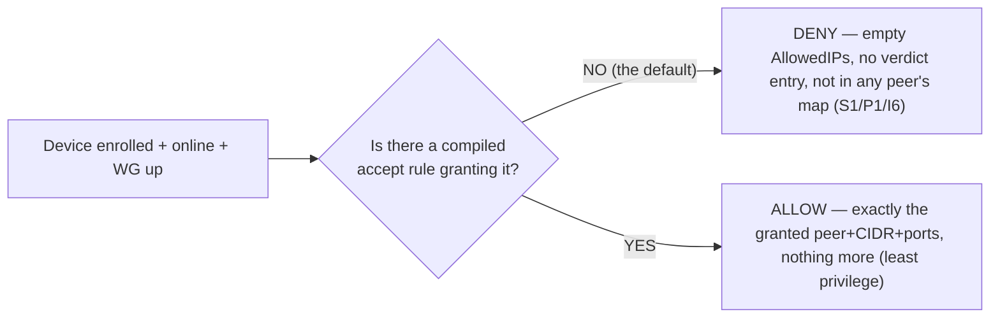
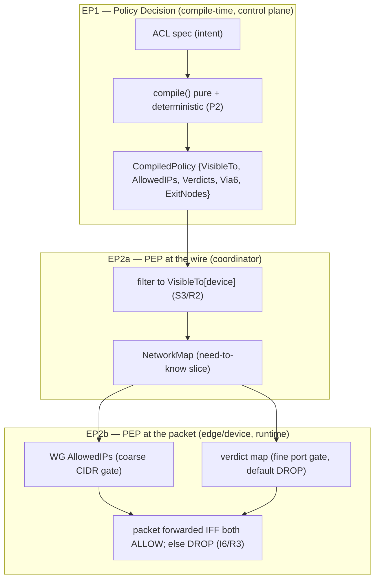
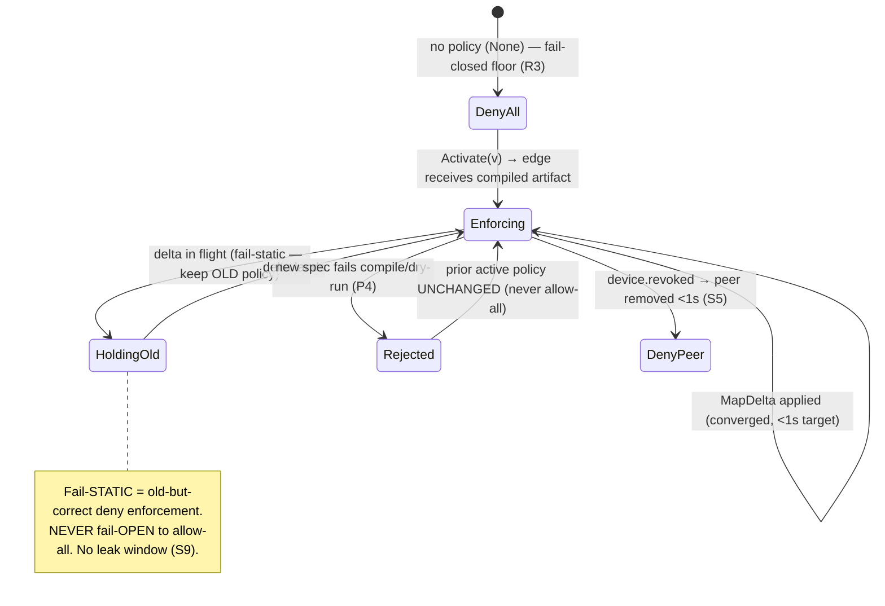
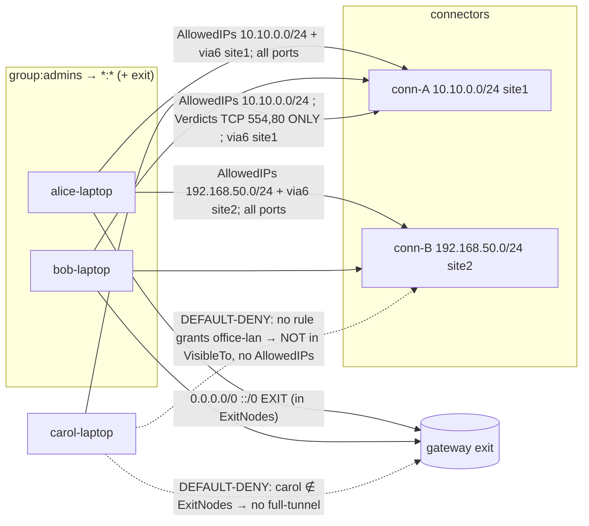

# Zero-Trust Model & Default-Deny Enforcement

**Revision:** 1
**Last modified:** 2026-06-25T12:00:00Z

> Master technical specification — Volume 5 (Security & Privacy), nano-detail document
> **zero-trust-and-default-deny**. Deepens the **S1 zero-trust default-deny** invariant of
> [`04-security-privacy-pki.md` §0.1/§1.3] into an implementation-grade contract: the
> no-implicit-trust-by-network-location model, the two policy enforcement points
> (control-plane compile-time + data-plane runtime), the least-privilege two-artifact output
> (`AllowedIPs` + verdict map), the need-to-know peer-filtering algorithm, fail-closed
> semantics on control-plane/policy unavailability, and a fully worked policy evaluation with
> Mermaid. SPEC ONLY — describe the implementation, do not build the product. This document
> **references** the policy compiler ([`v03-control-plane/svc-policy.md`]) and the data-plane
> verdict-map renderer ([`v02-data-plane/routing-and-addressing.md`]) rather than redefining
> them; it owns the *zero-trust property* and the *default-deny enforcement contract* that
> bind both. Sources cited inline by id: `[04_ARCH §N]`, `[04_P1 §N]`, `[research-pki_pq_nat]`,
> `[SYNTHESIS §N]`, and sibling specs by filename. Invariant ids: `S1`–`S11`
> ([`04-security-privacy-pki.md` §0.1]); `P1`–`P8` ([`v03-control-plane/svc-policy.md` §0.1]);
> `I5/I6/R1`–`R4` ([`v02-data-plane/routing-and-addressing.md` §0.2]). Unproven facts are
> flagged **UNVERIFIED** per constitution §11.4.6 — never fabricated.

---

## Table of contents

- [0. Position, ownership & governing invariants](#0-position-ownership--governing-invariants)
- [1. The zero-trust model — no implicit trust by network location](#1-the-zero-trust-model--no-implicit-trust-by-network-location)
- [2. Authenticate AND authorize — the two gates every peer crosses](#2-authenticate-and-authorize--the-two-gates-every-peer-crosses)
- [3. The two policy enforcement points (compile-time + runtime)](#3-the-two-policy-enforcement-points-compile-time--runtime)
- [4. Default-deny enforcement — the empty policy denies all](#4-default-deny-enforcement--the-empty-policy-denies-all)
- [5. Least-privilege artifacts — AllowedIPs + verdict map](#5-least-privilege-artifacts--allowedips--verdict-map)
- [6. Need-to-know peer filtering — the algorithm](#6-need-to-know-peer-filtering--the-algorithm)
- [7. Fail-closed semantics — deny on unavailability, never allow](#7-fail-closed-semantics--deny-on-unavailability-never-allow)
- [8. Worked policy evaluation (end to end)](#8-worked-policy-evaluation-end-to-end)
- [9. Edge cases (defined behavior, no guessing)](#9-edge-cases-defined-behavior-no-guessing)
- [10. Test & validation mapping (§11.4.169)](#10-test--validation-mapping-1141169)
- [Sources verified](#sources-verified)

---

## 0. Position, ownership & governing invariants

Zero-trust is the spine of HelixVPN: routing, no-logging, and revocation are all *properties
of the build* only because nothing is trusted by default [04_ARCH §7]. The mechanisms that
*realize* zero-trust live in other documents — the policy compiler in
[`v03-control-plane/svc-policy.md`], the verdict-map renderer in
[`v02-data-plane/routing-and-addressing.md`], the enrollment/PKI/mTLS in
[`04-security-privacy-pki.md`]. **This document owns the zero-trust *contract*** that binds
them: what "no implicit trust" means precisely, where it is enforced, and what "default-deny"
and "fail-closed" must do under every condition.

This document **owns**: the zero-trust property statement (§1), the authenticate-AND-authorize
gate model (§2), the two-enforcement-point map (§3), the default-deny floor (§4), the
least-privilege artifact contract (§5), the need-to-know filtering algorithm restated as a
zero-trust obligation (§6), and the fail-closed semantics (§7).

It does **not** own: the ACL DSL grammar, the compile algorithm, the version lifecycle, or
the protobuf wire — all [`v03-control-plane/svc-policy.md`]; the FIB/4via6 mechanics or the
nftables/eBPF rendering — [`v02-data-plane/routing-and-addressing.md`]; the auth handshakes
themselves — [`04-security-privacy-pki.md`].

### 0.1 Governing invariants (every clause obeys these)

| # | Invariant | Owner |
|---|---|---|
| **S1** | Zero-trust default-deny — no peer reaches anything without an explicit compiled policy rule; the empty policy denies all. | [`04-security-privacy-pki.md` §0.1] |
| **S3** | Need-to-know map distribution — a device's map contains only the peers/routes its policy grants; filtered server-side before the wire. | [`04-security-privacy-pki.md` §0.1] |
| **S4** | Two-channel auth — control (mTLS leaf cert) and data (WG Noise IK) are separate and both required. | [`04-security-privacy-pki.md` §0.1] |
| **P1** | Default-deny, need-to-know — a device appears in another's map only via a compiled `accept` edge; no `deny` verb (absence is denial). | [`v03-control-plane/svc-policy.md` §0.1] |
| **P4** | Fail-closed — a compile error rejects the change; it never degrades to allow-all or silently keeps the prior policy. | [`v03-control-plane/svc-policy.md` §0.1] |
| **I6** | Default-deny at the data plane — no peer reaches anything without an explicit rule expressed as `AllowedIPs` + an edge verdict map. | [`v02-data-plane/routing-and-addressing.md` §0.2] |
| **R2** | Peers delivered already policy-filtered (need-to-know): a node never learns of networks it cannot reach. | [`v02-data-plane/routing-and-addressing.md` §0.2] |
| **R3** | The verdict map fails closed — absent/stale compiled policy ⇒ drop. | [`v02-data-plane/routing-and-addressing.md` §0.2] |

---

## 1. The zero-trust model — no implicit trust by network location

### 1.1 The principle

Classic VPNs are **perimeter** models: once you are "on the network" (past the VPN
concentrator) you are implicitly trusted to reach everything on it. HelixVPN rejects this. The
overlay is **zero-trust**: being enrolled, online, and cryptographically connected grants a
device **nothing** by itself. Network *location* — "I have an overlay address; I completed a
WG handshake to the gateway" — confers **zero** reachability. Every reachable peer and every
reachable CIDR is the result of an *explicit, compiled, per-device* policy grant
[04_ARCH §7, S1, P1].

The contrast, stated as a contract:

| Perimeter VPN (rejected) | HelixVPN zero-trust (this spec) |
|---|---|
| "On the network" ⇒ reach the whole subnet | "On the overlay" ⇒ reach **nothing** until policy grants it |
| Trust derives from IP/segment location | Trust derives from *identity* (cert) **plus** *authorization* (compiled rule) |
| One firewall at the perimeter | Per-device least-privilege grant compiled into two enforcement layers |
| A breached host can move laterally freely | A breached host can reach only its compiled grant (microsegmentation) |
| Map = the whole topology | Map = only the need-to-know slice (S3/R2) |

### 1.2 What "no implicit trust" forbids — the closed list

A conforming implementation MUST NOT, anywhere, grant reachability from any of these implicit
signals (each is the perimeter-trust anti-pattern):

1. **Enrollment** — a freshly-enrolled device with no policy grant has an **empty**
   `AllowedIPs` and **no** verdict-map entry; it is online but isolated
   ([`04-security-privacy-pki.md` §1.3]).
2. **Online presence** — being in Redis presence state grants nothing.
3. **Overlay-address adjacency** — sharing a tenant ULA /48 grants nothing; two devices in the
   same /48 cannot reach each other without a rule.
4. **A completed WG handshake** — the data channel being up grants nothing the map did not
   already authorize (the map *is* the set of peers it may handshake with).
5. **Group membership alone** — membership resolves to a device set, but a group reaches a
   destination only via an `accept` rule naming that group as `src` ([`v03-control-plane/svc-policy.md` §4.1]).

There is no "default LAN", no "trusted subnet", no implicit gateway full-tunnel. **Absence of a
rule is denial** (P1) — there is no `deny` verb in the MVP model because there is nothing to
subtract from; the base state is already deny-all.



---

## 2. Authenticate AND authorize — the two gates every peer crosses

Zero-trust requires **both** authentication (*who are you*) and authorization (*what may you
reach*). HelixVPN keeps these on two separate, never-conflated channels (S4) — a property the
threat model relies on (compromising one does not yield the other,
[`threat-model.md` §5.2/§5.4]).

| Gate | Question | Mechanism | Owner | Failure mode |
|---|---|---|---|---|
| **G1 — Authenticate (control)** | *Who are you?* | mTLS with a ≤24 h CA-signed device leaf cert on every `Coordinator` RPC | [`04-security-privacy-pki.md` §1.2/§4] | no valid cert ⇒ stream refused; nothing learned |
| **G2 — Authorize (compile)** | *What may you reach?* | the device's compiled `CompiledPolicy` slice (`VisibleTo`/`AllowedIPs`/`Verdicts`) | [`v03-control-plane/svc-policy.md` §3] | empty slice ⇒ reach nothing (default-deny) |
| **G3 — Authenticate (data)** | *Are you the keyholder?* | WG Noise IK handshake to a peer pubkey delivered by G2's filtered map | doc 01 / [`04-security-privacy-pki.md` §1.2] | wrong key ⇒ handshake fails |
| **G4 — Enforce (runtime)** | *Is this packet within the grant?* | `AllowedIPs` cryptokey routing + verdict map at the edge | [`v02-data-plane/routing-and-addressing.md` §6] | outside grant ⇒ dropped |

A device must pass **G1 to learn anything**, **G2 to be granted anything**, **G3 to connect to
a peer**, and **G4 to send a packet to it**. The four gates are independent; bypassing one does
not bypass the others. In particular, even a device that somehow obtained a peer's pubkey
out-of-band cannot reach it: G4's `AllowedIPs` + verdict map drop the packet unless G2 compiled
the grant.

```mermaid
sequenceDiagram
    autonumber
    participant Dev as Device (helix-core)
    participant Coord as coordinator
    participant Pol as policy (CompiledPolicy)
    participant Edge as Rust edge (verdict map)
    Dev->>Coord: WatchNetworkMap (mTLS leaf cert)   %% G1 authenticate
    Coord->>Coord: bind stream to device_id from the CERT (never client-supplied)
    Coord->>Pol: read CompiledPolicy.VisibleTo[device_id]   %% G2 authorize (need-to-know)
    Pol-->>Coord: only the granted peers + AllowedIPs + Verdicts
    Coord-->>Dev: NetworkMap (filtered slice ONLY) (S3/R2)
    Dev->>Edge: WG Noise IK to a granted peer's pubkey   %% G3 authenticate (data)
    Dev->>Edge: packet to granted CIDR:port
    Edge->>Edge: AllowedIPs match? verdict ACCEPT?   %% G4 enforce (runtime)
    Edge-->>Dev: forward iff within grant; else DROP (default-deny, I6/R3)
```

---

## 3. The two policy enforcement points (compile-time + runtime)

Zero-trust in HelixVPN is enforced at **two** points — once when intent becomes least-privilege
artifacts (control plane, compile-time) and once when packets meet those artifacts (data plane,
runtime). This is the PDP/PEP split (policy decision point / policy enforcement point) made
concrete.

| Enforcement point | Where | What it decides/enforces | Artifact | Owner |
|---|---|---|---|---|
| **EP1 — Compile-time (PDP)** | Go control plane | resolves the ACL into per-device need-to-know reachability; rejects anything default-deny does not grant | `CompiledPolicy` (§5) | [`v03-control-plane/svc-policy.md` §4] |
| **EP2a — Distribution filter (PEP at the wire)** | coordinator | filters each device's map to its `VisibleTo` slice *before* serialization (S3/R2) | filtered `NetworkMap` | coordinator (doc 03) |
| **EP2b — Runtime (PEP at the packet)** | Rust edge / device | drops any packet outside `AllowedIPs` (cryptokey routing) and outside the verdict map (default `DROP`) | kernel WG `AllowedIPs` + nftables/eBPF verdict map | [`v02-data-plane/routing-and-addressing.md` §6] |

The two-layer runtime (EP2b) is deliberate defense-in-depth: WG's own `AllowedIPs` cryptokey
routing is a *coarse* CIDR gate, and the verdict map is the *fine* port-level gate; **both must
allow** for a packet to pass, and **both default to deny** ([`v03-control-plane/svc-policy.md`
§3 P3], I6). A bug in one layer is caught by the other.



---

## 4. Default-deny enforcement — the empty policy denies all

### 4.1 The floor: the empty policy

The base case proves the model. A tenant with **no ACL rules** (only groups/hosts, or nothing
at all) compiles to an **all-empty** `CompiledPolicy`: every map is empty, every `AllowedIPs`
is empty, every verdict entry is absent. Result: **everyone is denied everything**
([`v03-control-plane/svc-policy.md` §10 E1]). This is **valid, not an error** — it is the
default-deny floor (P1/S1). Reachability is *added* by rules; it is never the starting state.

### 4.2 Default-deny at each layer (the closed table)

| Layer | "No grant" state | Effect |
|---|---|---|
| `CompiledPolicy.VisibleTo[d]` | empty set | device `d` learns of no peers (S3) |
| `CompiledPolicy.AllowedIPs[d][peer]` | absent | WG cryptokey routing drops all packets to/from `peer` (I6) |
| `CompiledPolicy.Verdicts[d][peer]` | absent / default | edge verdict map default verdict is `DROP` (R3) |
| coordinator distribution | peer not in `VisibleTo` | peer never serialized into `d`'s map (S3/R2) |
| edge, no compiled policy at all | `policy: None` | the `RouteEngine` fails closed — every packet dropped ([`v02-data-plane/routing-and-addressing.md` §1 `policy: Option<CompiledPolicy>` `None ⇒ fail-closed (R3)`]) |

### 4.3 Least-privilege is the only addition path

A grant adds **exactly** the (peer, CIDR, ports) the rule names and **nothing more**
([`v03-control-plane/svc-policy.md` §4.1]):

- A `host:554,80` grant adds `AllowedIPs = [host CIDR]` *and* a `Verdicts` entry restricting to
  TCP/UDP 554 and 80 — not all ports.
- A `*:*` grant is the operator's explicit choice to grant broad reach (no implicit narrowing,
  E2); it is still *compiled per device*, not an ambient "trust the network" rule.
- A device absent from `ExitNodes` cannot full-tunnel through the gateway, even if it can reach
  individual CIDRs ([`v03-control-plane/svc-policy.md` §4.3]).

No rule ever *widens* beyond its tokens, and the compiler is **pure + deterministic** (P2) so
the same intent always yields the same least-privilege artifact — a property the §10 tests
assert byte-for-byte.

---

## 5. Least-privilege artifacts — AllowedIPs + verdict map

The compiler emits the single source of zero-trust truth: `CompiledPolicy`. Restated from
[`v03-control-plane/svc-policy.md` §3] for the zero-trust contract (this document references it,
does not redefine the Go types):

```go
// from internal/policy/compiled.go — the per-(tenant,version) zero-trust artifact.
type CompiledPolicy struct {
    Version   Version
    SpecHash  [32]byte // sha256(canonicalJSON(spec)) — ties artifact to intent (audit + dedup)

    // ARTIFACT 1 — need-to-know visibility (S3/P1): src device -> reachable peer set.
    VisibleTo  map[DeviceID]map[DeviceID]struct{}
    // ARTIFACT 1b — coarse WG AllowedIPs (CIDR-only, I6): src -> peer -> CIDRs.
    AllowedIPs map[DeviceID]map[DeviceID][]netip.Prefix
    // ARTIFACT 2 — fine port-level verdict map (R3 default-DROP): src -> peer -> port rules.
    Verdicts   map[DeviceID]map[DeviceID][]PortRule
    // 4via6 routes for colliding IPv4 LANs (D4): src -> peer(connector) -> mappings.
    Via6       map[DeviceID]map[DeviceID][]Via6Route
    // exit-node grants: devices permitted to full-tunnel through the gateway.
    ExitNodes  map[DeviceID]struct{}
}
```

The three reachability fields are the zero-trust enforcement surface:

| Field | Role | Default-deny meaning | Enforced at |
|---|---|---|---|
| `VisibleTo[d]` | who `d` may *learn about* | empty ⇒ learns nothing (S3) | EP2a coordinator filter |
| `AllowedIPs[d][peer]` | which CIDRs `d` may *reach* via `peer` | absent ⇒ all dropped (I6, coarse) | EP2b WG cryptokey routing |
| `Verdicts[d][peer]` | which ports of those CIDRs | absent ⇒ default `DROP` (R3, fine) | EP2b nftables/eBPF verdict map |

`SpecHash` ties every artifact back to the exact authored intent (a zero-trust audit anchor —
you can always prove *which* spec produced *this* grant), and `Version` makes rollback a flip
to a previously-compiled artifact, never a recompile under pressure
([`v03-control-plane/svc-policy.md` §6 P5]).

> The `Peer` protobuf the coordinator streams projects 1:1 from these fields —
> `allowed_ips` from `AllowedIPs[self][peer]`, `verdicts` from `Verdicts[self][peer]`
> ([`v03-control-plane/svc-policy.md` §7.2]). The wire delivers *only the filtered slice*, so a
> device physically never receives a peer it cannot reach (S3/R2) — least-privilege is enforced
> even at the byte level, not just at the firewall.

---

## 6. Need-to-know peer filtering — the algorithm

Need-to-know (S3/R2) is the zero-trust *distribution* obligation: filter the map **server-side,
before the wire**, so a device's map contains only its grant. A device that should not reach
`conn-B` never learns `conn-B` exists — preventing both reconnaissance and accidental
over-share.

### 6.1 The filtering algorithm

For a device `d` opening `WatchNetworkMap` (authenticated as `device_id = d` by its mTLS cert,
G1/§2), the coordinator builds `d`'s `NetworkMap` thus (deriving strictly from
`CompiledPolicy`, [`v03-control-plane/svc-policy.md` §3/§4.1]):

```
buildMap(d, cp /* active CompiledPolicy */) -> NetworkMap:
  # ZERO-TRUST RULE: start from nothing; add only what cp grants.
  m := NetworkMap{ peers: [] }                 # default-deny base (S1/P1)
  for peer in sortedKeys(cp.VisibleTo[d]):     # ONLY the need-to-know set (S3)
      if snapshot.Devices[peer].Revoked: continue   # revoked never visible (P1)
      p := Peer{
        device_id:   peer,
        wg_pubkey:   snapshot.Devices[peer].WGPubKey,        # so d can do WG IK (G3)
        allowed_ips: cp.AllowedIPs[d][peer],                 # coarse CIDR grant (I6)
        verdicts:    cp.Verdicts[d][peer],                   # fine port grant (R3)
        via6:        cp.Via6[d][peer],                       # 4via6 for colliding LANs (D4)
        is_connector: snapshot.Devices[peer].Kind == CONNECTOR,
        endpoint:    gatewayRelay,                           # MVP relays via gateway
      }
      m.peers.append(p)
  m.dns := tunnelDNS; m.exit_allowed := (d in cp.ExitNodes)  # exit only if granted (§4.3)
  return m                                       # contains EXACTLY d's grant — nothing else
```

Three zero-trust properties the algorithm guarantees:

1. **Server-authoritative identity** — `d` is taken from the *cert*, never from a client field,
   so a device cannot ask for another device's map ([`threat-model.md` §5.5 T-COORD-S-1]).
2. **Filter before serialize** — peers outside `VisibleTo[d]` are never placed in the message,
   so the over-share threat is closed at the data structure, not at a later firewall (S3/R2).
3. **Revoked-exclusion** — a revoked peer never enters `VisibleTo` (P1) and is re-checked here
   (belt-and-suspenders), tying into the `<1 s` revocation pipeline (S5,
   [`04-security-privacy-pki.md` §4.6]).

### 6.2 Delta updates preserve need-to-know

When policy changes, the coordinator pushes a **`MapDelta`** (peer upsert/remove) to each
affected open stream — the same need-to-know filter applies to the delta: a device only ever
receives upserts for peers in its new `VisibleTo` and removals for peers leaving it
([`v03-control-plane/svc-policy.md` §11]). A device never learns a peer it lost reach to *was*
reachable beyond the removal itself; it never learns a peer it never had.

---

## 7. Fail-closed semantics — deny on unavailability, never allow

Zero-trust must hold **especially** when something breaks. Every unavailability path resolves to
**deny**, never to allow (P4/R3). "When in doubt, drop" is the contract.

### 7.1 The fail-closed table (closed enumeration)

| Failure condition | Where | Behavior | Invariant |
|---|---|---|---|
| Policy spec fails to compile | control plane, EP1 | **reject** the update; no row inserted; prior active policy stays live (never allow-all) | P4 |
| `dst` CIDR not covered by an advertised prefix | EP1 dry-run | **blocking** `ERR_HOST_NOT_ADVERTISED`; change rejected | P4/P7 |
| Edge has no compiled policy (`policy: None`) | EP2b edge | **drop every packet** (the `Option<CompiledPolicy>` is `None`) | R3 |
| Compiled policy is stale (delta not yet applied) | EP2b edge | **fail-static**: keep enforcing the *old* policy (old tunnels keep forwarding under old rules) — never fail-open to allow-all | R3 / [`v03-control-plane/svc-policy.md` §10.3] |
| Control plane unreachable from a device | device | device keeps its *last* filtered map (fail-static to its existing grant); cannot *widen* without a new push; kill-switch keeps the leak window closed (S9) | R3 / S9 |
| Coordinator stream drops | coordinator | the device re-authenticates (G1) and re-fetches; until then it has only its prior grant | R2/R3 |
| Device revoked mid-flight | control + edge | revocation removes the peer + closes the stream in `<1 s` (S5); a revoked grant is re-checked at activation (E5) | S5 / P4 |

### 7.2 Fail-static is not fail-open — the honest distinction (§11.4.6)

"Fail-closed" here has two faces, both deny-leaning, and the spec is precise about which:

- **Fail-closed (reject)** — a *new* change that cannot be safely compiled/validated is
  **rejected**; the system does not adopt it (P4). Default-deny is preserved by *not widening*.
- **Fail-static (hold)** — when a *delta* is in flight, edges keep enforcing the **last known
  good** policy until the new one lands; they never drop to allow-all and never blindly widen.
  This is the `<1 s` convergence floor: a sub-second window of *old-but-correct* enforcement,
  never a window of *open* enforcement ([`v03-control-plane/svc-policy.md` §10.3]).

Neither face ever resolves to "allow because we're unsure". The honest boundary: the system
guarantees **no fail-open gap**; it does **not** claim globally-atomic instantaneous
convergence — there is a measured sub-second window where different edges may enforce different
*(both valid, both deny-correct)* versions. **UNVERIFIED:** the exact p99 of this window under
10k concurrent streams is a measured number the soak test produces
([`v03-control-plane/svc-policy.md` §10.3]) — this document states the *target* (`<1 s`), not a
measured result.



---

## 8. Worked policy evaluation (end to end)

Reusing the running example of [`v03-control-plane/svc-policy.md` §2.1/§4.3] to show zero-trust
+ default-deny operating concretely. Tenant devices: `alice-laptop`, `bob-laptop` (group
`admins`), `carol-laptop` (group `contractors`), `conn-A` (serves `10.10.0.0/24`, site 1),
`conn-B` (serves `192.168.50.0/24`, site 2), gateway `gw`.

Intent (the ACL):

```jsonc
{
  "acls": [
    { "action": "accept", "src": ["group:admins"],      "dst": ["*:*"] },
    { "action": "accept", "src": ["group:contractors"], "dst": ["warehouse-cams:554,80"] }
  ],
  "exitNodes": ["group:admins"]   // only admins may full-tunnel
}
```

### 8.1 Evaluation — what each device may reach (and may NOT)



### 8.2 The precise compiled slice for `carol-laptop` (least privilege made concrete)

```text
VisibleTo[carol-laptop]          = { conn-A }                       # need-to-know: only conn-A (S3)
AllowedIPs[carol-laptop][conn-A] = [ 10.10.0.0/24 ]                 # coarse grant (I6)
Verdicts[carol-laptop][conn-A]   = [ {10.10.0.0/24, ANY, 554,554},  # fine: ports 554 + 80 ONLY (R3)
                                     {10.10.0.0/24, ANY, 80,80} ]
Via6[carol-laptop][conn-A]       = [ {10.10.0.0/24, fd7a:helix:rrrr:0001::/96} ]   # 4via6 (D4)
ExitNodes                        ∌ carol-laptop                     # no full-tunnel (§4.3)
# carol-laptop has NO entry for conn-B / office-lan → DEFAULT-DENY (S1/P1/I6)
```

### 8.3 Runtime enforcement of carol's slice (EP2b, two layers)

A packet from `carol-laptop`:

| Destination attempt | WG `AllowedIPs` (coarse) | Verdict map (fine) | Result |
|---|---|---|---|
| `10.10.0.5:554` (TCP) | match `10.10.0.0/24` ✓ | match `554` ✓ | **ALLOW** — the granted camera port |
| `10.10.0.5:22` (SSH) | match `10.10.0.0/24` ✓ | no rule → default `DROP` | **DENY** — port not granted (least privilege) |
| `192.168.50.5:any` | no `AllowedIPs` → cryptokey-route DROP | (never reached) | **DENY** — office-lan not granted (S1) |
| full-tunnel `8.8.8.8` | not in `ExitNodes` → no `0.0.0.0/0` grant | — | **DENY** — not an exit node |

The two layers are visible: even where the *coarse* CIDR layer would pass (`10.10.0.0/24`), the
*fine* verdict map still denies the un-granted port — least privilege is enforced at **both**
the CIDR and the port granularity, and the default at each is **deny** (I6/R3).

### 8.4 Need-to-know proven

`carol-laptop`'s `NetworkMap` contains **only `conn-A`**. It does not receive `conn-B`'s pubkey,
endpoint, or even its existence (S3/R2). Carol cannot reconnoiter the office LAN, cannot attempt
a WG handshake to `conn-B` (no pubkey), and any packet toward `192.168.50.0/24` is dropped by
cryptokey routing (no `AllowedIPs`). Three independent layers — *filtered map*, *cryptokey
routing*, *verdict map* — each default-deny, all agree.

---

## 9. Edge cases (defined behavior, no guessing)

Per §11.4.6, every boundary has a *defined* zero-trust behavior. These extend
[`v03-control-plane/svc-policy.md` §10] with the zero-trust/default-deny lens.

| # | Edge case | Defined behavior |
|---|---|---|
| Z1 | Newly-enrolled device, no policy grant | Online but **isolated**: empty `AllowedIPs`, no verdict entry, in no peer's `VisibleTo` ([`04-security-privacy-pki.md` §1.3]). The acceptance criterion "enroll a client; deny an unauthorized host" made concrete. |
| Z2 | Empty ACL (only groups/hosts) | Compiles to all-empty → **everyone denied everything** (default-deny floor, E1). Valid, not an error. |
| Z3 | Device shares the tenant /48 with another | **No reach** without a rule — overlay adjacency confers nothing (§1.2 #3). |
| Z4 | Device obtains a peer pubkey out-of-band | Cannot reach it: G4 `AllowedIPs` + verdict map drop the packet (no compiled grant). Auth ≠ authorization. |
| Z5 | Control plane unreachable from a device | Fail-static to the **last** filtered map; cannot widen; kill-switch holds the leak window closed (S9). |
| Z6 | Edge boots with no compiled policy | `policy: None` ⇒ **drop everything** until a policy lands (R3 fail-closed). |
| Z7 | Policy update fails to compile | **Rejected** (P4); prior active policy stays live; never allow-all. |
| Z8 | A granted device is revoked | Removed from every `VisibleTo` + peer dropped + stream closed in `<1 s` (S5); re-checked at activation (E5). |
| Z9 | A wildcard `*:*` grant to a non-admin group | Honored — the operator *explicitly* chose broad reach (E2). Zero-trust is "no *implicit* trust"; an explicit broad grant is the operator's authorized decision, still compiled per-device. |
| Z10 | Two groups grant overlapping reach to one user | Union — `accept` rules are additive (no `deny` to subtract, E6). The broader *explicit* grant wins; default-deny still governs everything ungranted. |
| Z11 | Stale delta in flight across edges | Fail-static (each edge enforces last-good); honest sub-second window, never fail-open (§7.2). |
| Z12 | `exitNodes` names a connector | **Blocking** `ERR_EXIT_IS_CONNECTOR` — a connector cannot be a full-tunnel exit (E7). |

---

## 10. Test & validation mapping (§11.4.169)

Zero-trust is anti-bluff: each property's PASS is captured evidence that an *unauthorized*
attempt was actually **denied**, not merely that an authorized one succeeded — a green "allow"
test is necessary, never sufficient ([`v03-control-plane/svc-policy.md` §12 floor],
§11.4.5/§11.4.69/§1.1).

| Property | Test type | Concrete test point | Captured evidence |
|---|---|---|---|
| Default-deny floor (S1/E1/Z2) | Unit | `Compile(emptyACL)` → all maps empty; assert no device reaches any other | golden `compiled.json` byte-compare |
| New device isolated (Z1) | E2E (§11.4.98) | enroll a client with no grant → assert empty `AllowedIPs` + cannot reach any LAN host (packet-level) | `docs/qa/<run-id>/` transcript + DROP pcap |
| Least privilege port grant (§8.3) | E2E | carol reaches `10.10.0.0/24:554` **and is denied** `:22` and `192.168.50.0/24` | dual allow/deny pcap |
| Need-to-know filter (S3/R2/§8.4) | Integration | carol's served map contains **only** conn-A; conn-B absent | served-map byte-compare |
| Fail-closed compile (P4/Z7) | Integration + meta-test (§1.1) | spec citing an unadvertised CIDR → `Update` rejects; assert **no `policies` row inserted**; mutate to skip the gate → test FAILs | DB row-count before/after + mutate→FAIL log |
| Edge fail-closed (R3/Z6) | Integration | start edge with `policy: None` → every packet dropped | drop-counter trace |
| Fail-static, not fail-open (§7.2/Z11) | Chaos (§11.4.85) | kill the policy push mid-delta → edges keep enforcing **old** policy; assert no allow-all window | `recovery_trace.log` + pcap (no leaked flow) |
| Server-authoritative identity (§6.1 #1) | Security | a device requests another device's map → served **its own** slice only | request/response capture |
| Auth ≠ authorization (Z4/G4) | Security | send a packet to a known-pubkey peer with no compiled grant → dropped | DROP pcap |
| Revoked-exclusion (S5/Z8) | Integration | revoke a granted device → removed from `VisibleTo` + peer dropped, timed `<1 s` | revoke-to-removed timer |
| Two-layer enforcement (§3/§8.3) | Meta-test (§1.1) | (a) widen verdict default to `ACCEPT` → least-privilege port test FAILs; (b) skip `AllowedIPs` filter → CIDR-deny test FAILs | mutate→FAIL→restore→PASS |
| Determinism of the grant (P2) | Unit/property | compile same intent twice → byte-identical artifact (no nondeterministic widening) | hash-equality log |

> Anti-bluff floor (the §0.1 covenant): a zero-trust "PASS" requires captured evidence that
> **both** an authorized edge succeeded **and** an unauthorized edge was denied — under the same
> build, same topology. The §1.1 mutations (skip the dry-run gate; widen the verdict default;
> drop the need-to-know filter; remove the revoked check) are the runtime signatures
> (§11.4.108) that S1/S3/P4/I6/R3 are **live**, not merely promised.

---

## Sources verified

- [`04-security-privacy-pki.md`] — §0.1 invariants S1 (zero-trust default-deny), S3
  (need-to-know map distribution), S4 (two-channel auth), S5 (`<1 s` revocation), S9
  (kill-switch); §1.2 two authentication channels; §1.3 default-deny realisation (empty
  `AllowedIPs` + no verdict entry = isolated); §4.6 revocation pipeline. (Read 2026-06-25.)
- [`v03-control-plane/svc-policy.md`] — §0.1 invariants P1 (default-deny/need-to-know), P4
  (fail-closed), P6 (RLS); §2.1 running ACL example; §3 `CompiledPolicy`
  {Version, SpecHash, VisibleTo, AllowedIPs, Verdicts, Via6, ExitNodes} + §3 P3 two-artifact
  model; §4.1 compile algorithm (default-deny base); §4.3 worked carol-laptop slice; §5
  blocking/advisory taxonomy; §6 version lifecycle + instant rollback; §7.2 `Peer` projection;
  §10 edge cases (E1/E2/E6/E7) + §10.3 honest convergence-race boundary; §11 convergence SLO;
  §12 test matrix. (Read 2026-06-25.)
- [`v02-data-plane/routing-and-addressing.md`] — §0.2 invariants I5/I6 (default-deny),
  R2 (need-to-know delivery), R3 (verdict map fails closed); §1 `RouteEngine`
  (`policy: Option<CompiledPolicy>`, `None ⇒ fail-closed`); §6 ACL→AllowedIPs + verdict-map
  compiler. (Read 2026-06-25.)
- [`threat-model.md`] (this volume) — §5.2/§5.4/§5.5 component STRIDE referenced for the
  authenticate-vs-authorize separation and the over-share threat. (Authored alongside, 2026-06-25.)
- [04_ARCH] HelixVPN-Architecture-Refined.md §3.4 (overlay/policy, `AllowedIPs` + nftables/eBPF
  verdict map, ULA /48 + 4via6), §7 (zero-trust, no-logging) — cited via the sibling specs.
- [04_P1] HelixVPN-Phase1-MVP.md §7 (ACL model, two artifacts, fail-closed), §11 DoD
  (authorized/denied acceptance criterion) — cited via the sibling specs.
- [research-pki_pq_nat], [SYNTHESIS §1/§3/§7] — trust gradient, D4 4via6, need-to-know.
  **UNVERIFIED** items (measured `<1 s` convergence p99 under 10k streams; the exact stale-delta
  window distribution) are flagged inline per §11.4.6 and stated as targets, never results.
