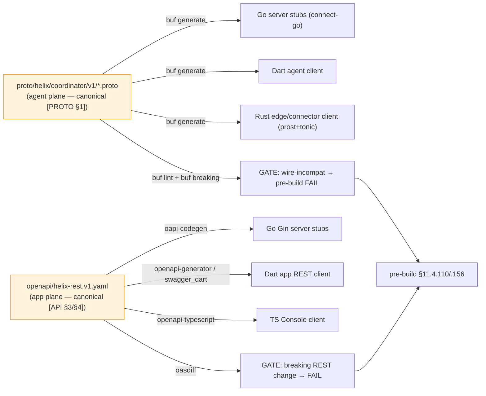
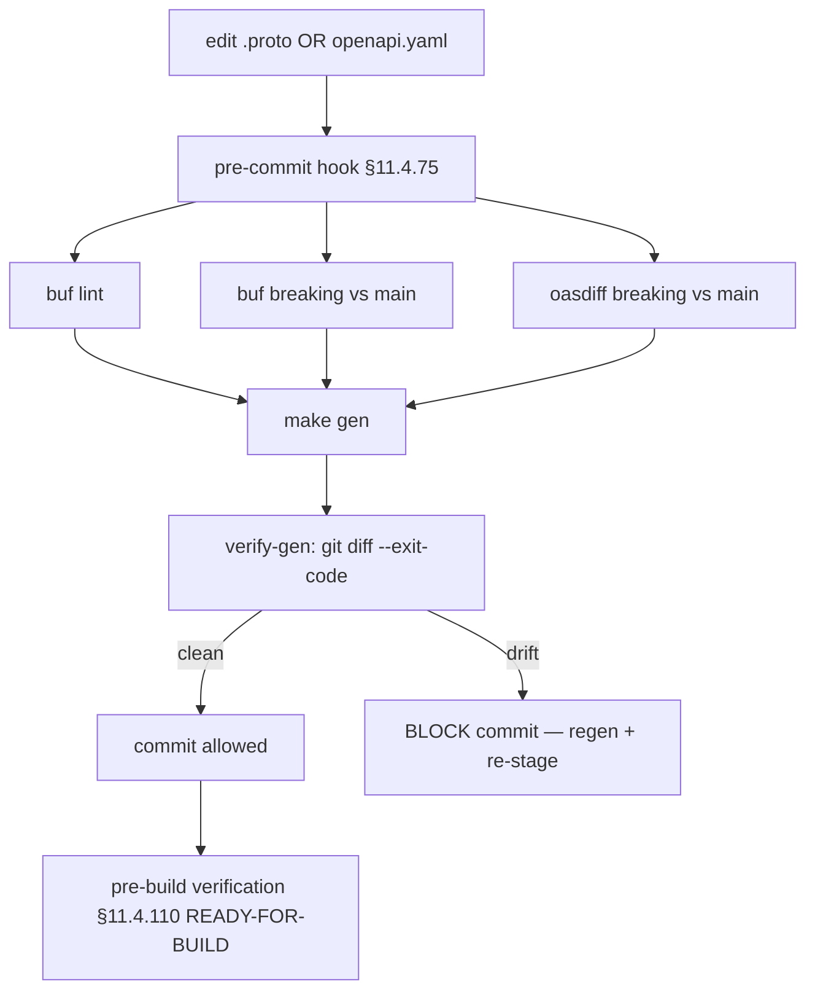
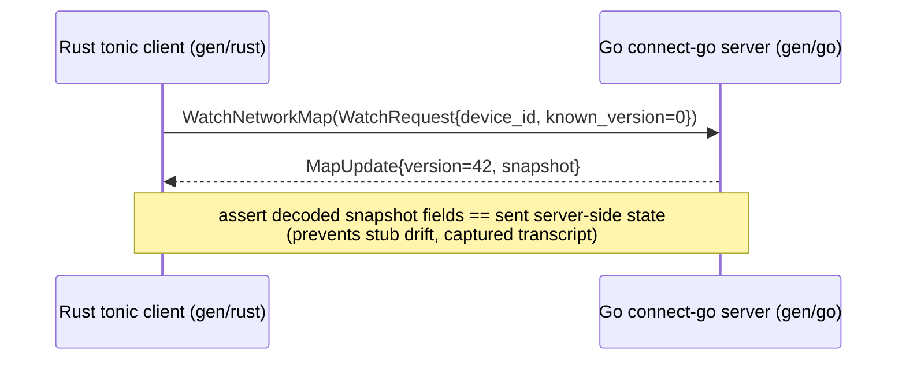

# Codegen Pipeline (zero-drift contract)

**Revision:** 1
**Last modified:** 2026-06-25T12:00:00Z

> Master technical specification — Volume 6 (Deployment, Tooling & Operations), nano-detail
> document. Scope: the **schema-first code generation pipeline** — `buf` → Go/Dart/Rust from the
> canonical `.proto`, OpenAPI → Dart/TS/Go from the canonical REST spec, the zero-drift guarantee
> (generated code is regenerated + diff-gated), the codegen gates wired into the local pre-build
> (§11.4.156 — NO server CI), and concrete `buf.gen.yaml` / `Makefile` / drift-check sketches.
> This deepens [05-overview §4] and operationalizes the codegen seams declared in
> [protobuf-spec §6] and [svc-api §12]. It is a SPEC: configs and skeletons are illustrative of
> the contract, not the shipping implementation (2–3 refinement passes follow).
>
> Evidence cited inline by id: **[05_OV §N]** = `05-repo-layout-tooling-and-helix-ecosystem.md`;
> **[PROTO §N]** = `v03-control-plane/protobuf-spec.md`; **[API §N]** =
> `v03-control-plane/svc-api.md`; **[04_ARCH §4.2]** = schema-generated clients, no drift;
> **[04_P1 §8]** = codegen (buf + OpenAPI); **[research-go_cp]** = the Go control-plane research
> digest. Unproven facts are marked **UNVERIFIED** per §11.4.6 — never fabricated. The proto
> package is `helix.coordinator.v1`, unified across the spec set [PROTO §0.2].

---

## 0. What this document owns (and does not)

This document owns the **codegen mechanics**: the two generator families (`buf` for protobuf,
OpenAPI generators for REST), their config files, the offline-reproducibility decision, the
`make gen` / `verify-gen` contract, the breaking-change gates (`buf breaking` + `oasdiff`), the
track-vs-gitignore decision for generated code, and how the gates wire into the local pre-build
sweep (§11.4.110/.156).

It does **not** own: the `.proto` field-by-field semantics (canonical in [PROTO §1]); the REST
route table / request schemas (canonical in [API §3/§4]); the FFI bridge surface (Volume 4
`ffi-surface.md`); the repo layout that places `helix-proto/` (that is
[`repo-layout-and-decoupling.md`](repo-layout-and-decoupling.md)). Those are referenced, never
redefined.

---

## 1. Why schema-first: the anti-drift thesis

The single most important anti-drift mechanism in HelixVPN is that **all** Go/Dart/Rust/TS
clients are *generated* from one canonical schema; hand-written clients are **forbidden** so the
four codebases cannot drift apart [04_ARCH §4.2, 04_P1 §8, PROTO §6]. The contract has two
canonical sources, each generating its language family:



The guarantee is **mechanical, not aspirational**: regenerate, then `git diff --exit-code` the
generated tree — a stale committed (or stale gitignored-but-required) client FAILs the gate
(§11.4.108 runtime-signature). This document specifies exactly that machinery.

---

## 2. `buf` for protobuf (agent plane)

The single `Coordinator` service `.proto` lives in `helix-proto`
(`proto/helix/coordinator/v1/coordinator.proto`) and generates **three** language stubs over
**Connect** (gRPC + gRPC-Web + Connect on one listener) so native agents and a future WASM
Console use the same generated stubs [PROTO §2/§6, 04_P1 §3].

### 2.1 `buf.yaml` (module + lint + breaking)

```yaml
# helix-proto/buf.yaml
version: v2
modules:
  - path: proto
lint:
  use:
    - STANDARD
  except:
    - PACKAGE_VERSION_SUFFIX   # we use helix.coordinator.v1 (suffix present) — documented exception [PROTO §6.1]
breaking:
  use:
    - FILE                     # field-number/type changes within v1 are breaking → gate (§5) [PROTO §6.1]
```

### 2.2 `buf.gen.yaml` (three language outputs)

Connect is the binding so ONE service serves native agents over HTTP/2 AND browser clients over
gRPC-Web [04_P1 §3, PROTO §6.2]:

```yaml
# helix-proto/buf.gen.yaml — remote-plugin convenience form
version: v2
plugins:
  # ---- Go (server) ----
  - remote: buf.build/protocolbuffers/go
    out: gen
    opt: paths=source_relative
  - remote: buf.build/connectrpc/go              # Connect Go handlers/clients
    out: gen
    opt: paths=source_relative
  - remote: buf.build/bufbuild/protovalidate-go  # buf.validate field constraints [API §5.3]
    out: gen
    opt: paths=source_relative
  # ---- Dart (client core boundary) ----
  - remote: buf.build/protocolbuffers/dart
    out: gen/dart
  - remote: buf.build/connectrpc/dart            # connect-dart client (UNVERIFIED plugin coord, §2.4)
    out: gen/dart
  # ---- Rust (edge / connector) ----
  - remote: buf.build/community/neoeinstein-prost   # prost messages
    out: gen/rust/src
  - remote: buf.build/community/neoeinstein-tonic   # tonic service stubs
    out: gen/rust/src
```

### 2.3 protovalidate constraints travel with the schema

Field constraints (`wg_pubkey` exactly 32 bytes, `enroll_token` min length, `kind` defined-only)
live in the `.proto` via `buf.validate` and are enforced by a `validateInterceptor` server-side
[API §5.3]; they generate into all three languages, so the same constraint cannot drift between
client and server. Example, overlaid on the canonical messages [PROTO §1]:

```protobuf
import "buf/validate/validate.proto";

message EnrollRequest {
  string     enroll_token = 1 [(buf.validate.field).string.min_len = 16];
  bytes      wg_pubkey    = 2 [(buf.validate.field).bytes.len = 32];   // exactly 32B Curve25519 (C6)
  string     os           = 3 [(buf.validate.field).string.max_len = 32];
  string     name         = 4 [(buf.validate.field).string.max_len = 128];
  DeviceKind kind         = 5 [(buf.validate.field).enum.defined_only = true];
}
```

### 2.4 UNVERIFIED plugin coordinates

The remote plugin coordinates/versions above are the **conventional** buf plugin names; the
**pinned** versions are chosen at implementation time and recorded in `buf.gen.yaml` + `buf.lock`
then — they are not asserted here as fixed [PROTO §6.2]. The `connectrpc/dart` plugin
coordinate in particular is **UNVERIFIED** (the Dart Connect ecosystem moved during the spec
window); the fallback is plain `protocolbuffers/dart` messages + a thin hand-checked-but-
generated transport shim, which keeps the message types generated even if the service stub is not.

---

## 3. OpenAPI for REST (app plane)

The app-facing REST surface is the canonical `openapi/helix-rest.v1.yaml` [API §4/§12]. Three
generated consumers, zero hand-written app clients:

| Target | Generator | Consumes |
|---|---|---|
| Go server stubs (Gin) | `oapi-codegen` | `helix-go/internal/api` handler signatures + request/response models |
| Dart app REST client | `openapi-generator` (or `swagger_dart_code_generator`) | the three Flutter apps (Access/Connector/Console) |
| TS Console client | `openapi-typescript` | the Console Web build |

### 3.1 Spec-first vs code-first (decision)

> **Decision D-OPENAPI-AUTHORING.** The OpenAPI spec is authored **spec-first** (hand-authored
> contract, handlers validated against it), NOT generated from handler annotations (code-first).
> Rationale [API §12.2, research-go_cp §1]: Gin is the thin edge; authoring the contract first
> lets the TS/Dart app clients generate from a stable surface, and a request-validation
> middleware (`kin-openapi`) then asserts every request/response conforms — a drift between
> handler and spec FAILs a test. **UNVERIFIED** until the validation middleware is wired whether
> the MVP enforces response-conformance as well as request-conformance; the lean path enforces
> request-conformance first.

`oapi-codegen` config (server stubs) is referenced from the `Makefile` (§5):

```yaml
# helix-go/internal/api/oapi.cfg.yaml (illustrative)
package: api
generate:
  gin-server: true
  models: true
  embedded-spec: true        # embed the spec so /v1 self-describes; never re-authored at runtime
output: internal/api/oapi_gen.go
```

### 3.2 The REST breaking-change gate

`oasdiff` compares the working `helix-rest.v1.yaml` against the last released git ref; a breaking
REST change (removed route, narrowed type, required-field addition) FAILs the gate [API §12].
This is the REST analogue of `buf breaking` (§5).

---

## 4. Track or gitignore the generated code? (the §11.4.77 decision)

> **Decision D-CODEGEN-TRACK.** Generated clients are **gitignored**, with `make gen` as the
> §11.4.77 regeneration mechanism (NOT committed). Rationale: the schema is the single source of
> truth (§11.4.93 spirit applied to code); a committed generated tree is a second copy that can
> rot and doubles review noise; `make gen` from a clean clone reproduces it deterministically.
> The gitignore entry carries a `.gitignore-meta/<slug>.yaml` declaring the mechanism (§11.4.77),
> and `scripts/setup.sh` runs `make gen-tools && make gen` post-clone so a fresh checkout builds.

This **refines** the overview, which kept generated code gitignored (`helix-proto/gen/` is
gitignored [05_OV §2]) — this document makes that the binding decision and pins the §11.4.77
mechanism. The trade-off: a fresh clone cannot `go build` until `make gen` runs once; the
post-clone bootstrap (`scripts/setup.sh`) closes that gap, and the §11.4.77 meta-file makes the
regeneration mechanism auditable.

**UNVERIFIED:** [svc-api §12.1] notes "generated Go/Dart/Rust stubs are committed (regeneratable)
so the three codebases cannot drift" — i.e. the *control-plane* doc leaned track-committed. This
is a **visible reconciliation** (§11.4.35): the binding Volume-6 decision is **gitignore +
regenerate** (D-CODEGEN-TRACK), with the drift gate (§6) providing the no-drift guarantee that
committing was meant to provide. Either choice satisfies §11.4.108 (the runtime signature is
"regenerate → diff is empty"); gitignore + the §11.4.77 mechanism is chosen for the smaller
review surface. The reconciliation is recorded so the two docs do not silently disagree.

---

## 5. The breaking-change gates (frozen wire + frozen REST)

Two gates make the contract frozen-by-machine, run in the local pre-build sweep (§11.4.156 — NO
server CI; enforcement is the local pre-build + git hooks, §11.4.75):

```bash
# agent plane (buf)
buf lint                                     # STANDARD rules
buf breaking --against '.git#branch=main'    # field renumber / type-change / reused-number → FAIL
buf generate --template buf.gen.local.yaml   # emits gen/ (Go), gen/dart, gen/rust

# app plane (OpenAPI)
oasdiff breaking helix-rest.v1.yaml@main helix-rest.v1.yaml  # breaking REST change → FAIL
```

`buf breaking` is the mechanical enforcement that the [PROTO §1.1] field-number registry stays
frozen: any commit renumbering a `v1` field, changing a field type, or reusing a removed number
FAILs the gate. Paired §1.1 mutation: a branch that renames `Peer.allowed_ips` field number 3 → 7
MUST make `buf breaking` FAIL; reverting MUST make it pass [PROTO §6.3].

---

## 6. The `make gen` / `verify-gen` contract (the drift gate)

### 6.1 Offline reproducibility (the §11.4.77 belt)

> **Decision D-CODEGEN-NET.** `buf` remote plugins need network. Per §11.4.77 the regeneration
> mechanism MUST work from a clean clone. **Recommended:** vendor `protoc-gen-*` plugins as
> pinned local binaries under `tools/` (Go via `tools.go` + `go install`, Rust via `cargo install
> --locked`) so `make gen` runs **offline** after a one-time `make gen-tools`; `buf generate
> --template buf.gen.local.yaml` points at the local binaries. The remote-plugin form (§2.2)
> stays as the convenience path [05_OV §4.1].

```makefile
# Makefile — codegen targets (§11.4.156 NO CI)
gen-tools:               ## one-time: install pinned local protoc-gen-* + oapi-codegen + openapi gens
	go install github.com/bufbuild/buf/cmd/buf@<pin>
	go install github.com/oapi-codegen/oapi-codegen/v2/cmd/oapi-codegen@<pin>
	cargo install --locked protoc-gen-prost protoc-gen-tonic
	# dart/ts generators per their pinned versions

gen: gen-proto gen-openapi gen-ffi          ## regenerate ALL clients from schema (run before build)
gen-proto:   ; buf generate --template buf.gen.local.yaml
gen-openapi: ; oapi-codegen -config helix-go/internal/api/oapi.cfg.yaml openapi/helix-rest.v1.yaml \
                && openapi-generator generate -i openapi/helix-rest.v1.yaml -g dart -o helix-ui/packages/helix_api_client \
                && npx openapi-typescript openapi/helix-rest.v1.yaml -o helix-ui/packages/app_console/src/gen/api.ts
gen-ffi:     ; cd helix-core/crates/helix-ffi && flutter_rust_bridge_codegen generate
```

`<pin>` placeholders are resolved to exact versions at implementation time and recorded in
`buf.lock` + `go.mod` + `Cargo.lock` — they are not asserted as fixed here (**UNVERIFIED** exact
versions, per §11.4.6).

### 6.2 `verify-gen` — the drift gate itself

```makefile
verify-gen: gen                              ## §11.4.108 artifact check: regen MUST be a no-op
	@git diff --exit-code helix-proto/gen helix-ui/packages/helix_core_ffi helix-ui/packages/helix_api_client \
	 || { echo "GENERATED CLIENTS STALE — run make gen and commit the schema change"; exit 1; }
```

`verify-gen` is the **drift gate** (the local equivalent of a CI check, run in the pre-commit
hook per §11.4.75): regenerate, then assert the tree is byte-identical. Because generated code is
gitignored (D-CODEGEN-TRACK), `verify-gen` runs against a freshly-generated tree and asserts the
generation is **deterministic** (two runs identical) AND that the schema → code mapping has no
manual edits creeping in via the FFI/`oapi` hand-config. This is the schema-first guarantee made
mechanical [05_OV §4.3].

### 6.3 The full gate wiring into pre-build (§11.4.110)



The pre-build READY-FOR-BUILD verdict (§11.4.110) refuses to start the main build unless `buf
lint`, `buf breaking`, `oasdiff`, and `verify-gen` are all green — codegen drift is a
build-blocker, not a warning.

---

## 7. Cross-language round-trip proof (no-stub-drift)

The strongest anti-bluff for "the stubs actually interoperate" is a **cross-language round-trip**:
a generated Rust `tonic` client and the generated Go `connect-go` server complete one real
`WatchNetworkMap` exchange [PROTO §7 T18]. This catches a class of drift that `verify-gen`
cannot — a generation that is internally consistent in each language but semantically divergent
across languages (e.g. a `oneof` mapped differently).



A Dart client variant proves the third language. Infra (Postgres+Redis) is booted on demand via
`vasic-digital/containers` (§11.4.76), never ad-hoc `docker run` [PROTO §7].

---

## 8. Test points (§11.4.169 comprehensive test-type coverage)

Each row is implementation-ready; every PASS cites captured evidence (§11.4.5/.69/.107) — a green
test that does not exercise the generated code is a §11.4 PASS-bluff.

| # | Test type (§11.4.169) | Target | Concrete assertion + evidence |
|---|---|---|---|
| C1 | unit | generator determinism | `make gen` twice → byte-identical output (hash compare); evidence under `docs/qa/<run-id>/` |
| C2 | unit | protovalidate constraints generated | the generated Go/Dart/Rust validators reject a 31/33-byte `wg_pubkey` (§2.3) |
| C3 | contract / compat | `buf breaking` freeze (§5) | renumber `Peer.allowed_ips` 3 → 7 → `buf breaking` FAILs; revert → passes (paired §1.1) |
| C4 | contract / compat | `oasdiff` REST freeze (§5) | remove a `/v1` route from the spec → `oasdiff` FAILs |
| C5 | contract / no-drift | `verify-gen` (§6.2) | hand-edit a generated stub → `verify-gen` `git diff` FAILs; regen restores |
| C6 | integration | cross-lang round-trip (§7) | Rust tonic client ↔ Go connect-go server complete `WatchNetworkMap`; captured transcript |
| C7 | integration | OpenAPI ↔ handler conformance (§3.1) | `kin-openapi` middleware: a request violating the spec → rejected; a handler diverging from spec → test FAIL |
| C8 | offline-repro | `make gen` from clean clone, network off (§6.1) | container clone with no network → `make gen-tools && make gen` exits 0; transcript captured |
| C9 | meta-test (§1.1) | every gate has a paired mutation | renumber field / hand-edit stub / remove route / inject volatile codegen → each makes its gate FAIL |

---

## 9. Phase-2 forward seams (additive, no v1 break)

Codegen seams permit Phase-2 growth without a v1 break [PROTO §8, API §14]: new `.proto` fields
(new field numbers, `buf breaking` stays green) regenerate into all three languages; new REST
routes added spec-first regenerate the app clients; a WASM Console gains the same generated Connect
stubs (gRPC-Web already supported [API §5.1]); the PQ pre-shared-key field is a `buf`-additive
field on `EnrollResponse`/`Peer`. Each is additive because v1 drew the field-number registry
[PROTO §1.1] with room and froze it under `buf breaking` (§5).

---

## Sources verified

- `05-repo-layout-tooling-and-helix-ecosystem.md` §4 (schema-first codegen — buf + OpenAPI, the
  `make gen`/`verify-gen` contract, D-CODEGEN-NET offline reproducibility) — `[05_OV]`.
- `v03-control-plane/protobuf-spec.md` §1 (canonical `.proto` + field-number registry), §2
  (Connect binding), §6 (buf pipeline + breaking gate), §7 (test points incl. T18 cross-lang),
  §8 (forward seams) — `[PROTO]`.
- `v03-control-plane/svc-api.md` §4 (REST schemas), §5.3 (protovalidate), §12 (schema-first
  no-drift gates — buf + OpenAPI + oasdiff + git-diff runtime signature), §14 (forward seams) —
  `[API]`.
- `04_VPN_CLD/HelixVPN-Architecture-Refined.md` §4.2 (schema-generated clients, no drift),
  `HelixVPN-Phase1-MVP.md` §8 (codegen), `02-control-plane.md` / research-go_cp §1–§2 (Gin thin
  edge, connect-go, protovalidate, single-server) — `[04_ARCH] [04_P1] [research-go_cp]`.
- Constitution anchors: §11.4.77 (regeneration mechanism for gitignored content), §11.4.108
  (runtime-signature: regen-diff-empty), §11.4.110 (READY-FOR-BUILD pre-build verdict), §11.4.156
  (no active CI — local pre-build enforcement), §11.4.76 (containers submodule for test infra),
  §11.4.35 (visible reconciliation — D-CODEGEN-TRACK vs the control-plane doc's track-committed
  note), §11.4.6 (no-guessing — UNVERIFIED plugin/version marks), §11.4.169 (test-type coverage),
  §1.1 (paired meta-test mutations).
