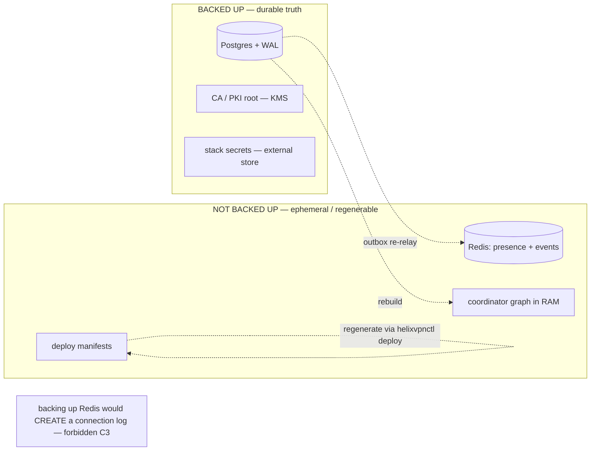
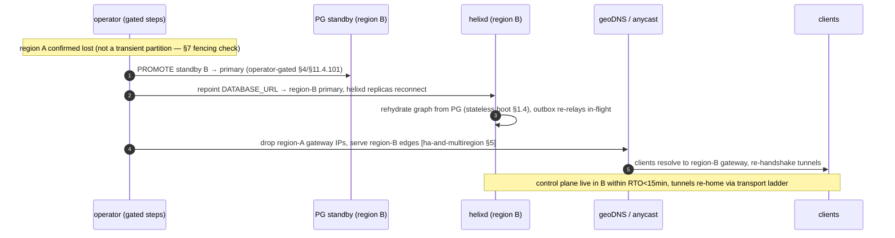

# Disaster recovery (RTO/RPO, backup & region-failover runbook)

**Revision:** 1
**Last modified:** 2026-06-25T12:00:00Z

> Master technical specification — Volume 6 (Deployment, Tooling & Operations), nano-detail
> document `disaster-recovery.md`. **This document CLOSES source-coverage ledger gap G1**
> (`99-source-coverage-ledger.md` — `[03_ZAI]`'s named DR posture: RTO/RPO budget, KMS-encrypted
> backups, Terraform region-failover runbook, "disaster recovery as a first-class operational
> section" — was scattered, never consolidated). Scope: the **RTO/RPO budget** (stated as
> **TARGETS**, §11.4.6), exactly **what is backed up and what deliberately is not** (Postgres =
> truth, backed up; Redis/NATS = ephemeral, NOT backed up — and why that is *safe* under the
> no-logging promise), backup cadence + restore runbook, the step-by-step region-failover
> runbook, the §9.2 absolute-data-safety discipline, and concrete backup/restore + verification
> commands. This is a SPEC (describe the procedure; do not run the product). Evidence cited
> inline: `[05 §N]`, `[svc-coordinator §N]`, `[svc-events §N]`, `[svc-telemetry §N]`,
> `[ha-and-multiregion §N]`, `[kubernetes §N]`, `[03_ZAI]` (the DR source), `[ledger G1]`.
> Unproven facts are marked `UNVERIFIED` per §11.4.6.

---

## Table of contents

- [0. DR thesis — back up truth, regenerate the rest](#0-dr-thesis--back-up-truth-regenerate-the-rest)
- [1. RTO / RPO budget (TARGETS, not guarantees)](#1-rto--rpo-budget-targets-not-guarantees)
- [2. What is backed up — and what deliberately is NOT](#2-what-is-backed-up--and-what-deliberately-is-not)
- [3. Backup cadence & mechanism (Postgres + secrets)](#3-backup-cadence--mechanism-postgres--secrets)
- [4. The §9.2 absolute-data-safety discipline applied to DR](#4-the-92-absolute-data-safety-discipline-applied-to-dr)
- [5. Restore runbook (single-store recovery)](#5-restore-runbook-single-store-recovery)
- [6. Region-failover runbook (whole-region loss)](#6-region-failover-runbook-whole-region-loss)
- [7. Restore verification (the anti-bluff gate)](#7-restore-verification-the-anti-bluff-gate)
- [8. DR drills & captured evidence](#8-dr-drills--captured-evidence)
- [9. UNVERIFIED register](#9-unverified-register)
- [Sources verified](#sources-verified)

---

## 0. DR thesis — back up truth, regenerate the rest

HelixVPN's DR design is shaped by the same architectural decision that makes HA cheap
(`[ha-and-multiregion §0]`): the system has **exactly one durable source of truth — Postgres
(C2)** — and *everything else is a regenerable projection of it*. From `[svc-events §7.4]`:

> "the bus is a fast-path accelerator over Postgres truth, never a second source of truth."

So DR reduces to a sharp, auditable statement:

1. **Back up Postgres** (truth) + **the secrets** needed to bring a stack up. That is the entire
   durable surface.
2. **Do NOT back up Redis/NATS** — they are ephemeral by construction; restoring them would
   restore *stale* presence/event state, and (critically) the no-logging promise means there is
   nothing in them worth persisting. The coordinator graph is rebuilt from Postgres on boot
   `[svc-coordinator §1.4]`; the outbox re-relays in-flight events `[svc-events §7.4]`.
3. **Regenerate the deploy substrate** (quadlets/compose/k8s) from the in-code spec via
   `helixvpnctl deploy` `[05 §6.3(B)]` — the manifests are a §11.4.77 build derivative, re-emitted,
   not restored.

The DR posture is therefore: *one thing to back up (Postgres), one thing to protect (the secrets),
everything else regenerated.* This is both simpler and **safer** than a "back up everything"
posture — there is no risk of restoring a stale connection log because there is no connection log.

---

## 1. RTO / RPO budget (TARGETS, not guarantees)

Per §11.4.6 these are stated explicitly as **TARGETS** the design aims at, to be *measured* in DR
drills (§8) — never asserted as achieved. They consolidate `[03_ZAI]`'s "RTO < 15 min" framing
that `[ledger G1]` found scattered.

| Scenario | RTO target (time to service) | RPO target (data loss window) | Basis |
|---|---|---|---|
| `helixd` replica loss | seconds (reconnect) | 0 | stateless reconnect `[svc-coordinator §3.2]`; no data lost |
| Postgres primary failover (HA standby) | < 60 s (promotion) | **0** for sync-committed | sync standby `remote_write` `[ha-and-multiregion §3]` |
| Redis/NATS loss | seconds–minutes (recovery) | 0 durable (ephemeral) | rehydrate from PG + outbox re-relay `[svc-events §7.4]` |
| **Postgres total loss → restore from backup** | **< 15 min** (`[03_ZAI]` target) | **≤ backup-cadence** (see §3) | restore latest backup + WAL replay |
| **Whole-region loss → failover to standby region** | **< 15 min** | **0** (sync) or **≤ async-lag** | promote cross-region standby `[ha-and-multiregion §1]` + repoint geoDNS `[ha-and-multiregion §5]` |

> **RPO precision (the honest number, §11.4.6).** RPO is **0** for any transaction that committed
> against a **synchronous** standby (`[ha-and-multiregion §3]`). RPO for a *backup-only* restore is
> bounded by **the most recent recoverable point** = last base backup + last shipped WAL segment
> (with continuous WAL archiving, RPO ≈ the WAL archive interval, typically seconds–minutes; see
> §3). The 15-min figure is RTO (*time to restore*), distinct from RPO (*data lost*) — conflating
> them is the bluff this note forbids. The data-plane impact during all of the above is **none for
> live tunnels** (C1 fail-static, `[ha-and-multiregion §3]`): DR pauses *control* operations, never
> drops *forwarding*.

---

## 2. What is backed up — and what deliberately is NOT

| Asset | Backed up? | Mechanism | Why |
|---|---|---|---|
| **Postgres** (tenants, devices, connectors, prefixes, policies, certs metadata, `audit_events`, `event_outbox`) | **YES** | base backup + continuous WAL archive (§3) | the only durable truth (C2); losing it loses the system |
| **CA private key / PKI root** (doc 04) | **YES** (separately, stricter) | KMS-encrypted, offline/HSM-class storage | catastrophic if lost (every device cert chains to it); catastrophic if leaked (§4) |
| **Stack secrets** (DB password, etc.) | **YES** (referenced) | external secret store (ESO/Sealed-Secrets, `[kubernetes §2]`) | needed to bring a stack up; §11.4.10 never plaintext-in-git |
| **Redis stream contents** | **NO** | — | ephemeral (C2); restoring = stale events; outbox re-relays in-flight `[svc-events §7.4]` |
| **Redis presence keys** | **NO** | — | ephemeral by design — this IS the no-logging mechanism `[svc-telemetry §5]`; persisting them would *create* a connection log |
| **NATS JetStream state** (Phase 2) | **NO** (replicated, not backed up) | cluster replication `[ha-and-multiregion §4]` | same ephemeral logic; HA via replication, not backup |
| **Coordinator in-mem graph** | **NO** | rebuilt on boot `[svc-coordinator §1.4]` | a projection of PG; not durable |
| **Deploy manifests** (quadlet/compose/k8s) | **NO** (regenerated) | `helixvpnctl deploy` `[05 §6.3B]` | §11.4.77 build derivative — re-emitted from in-code spec |

> **The privacy-positive DR property (the thing that makes "don't back up Redis" *safe*, not
> reckless).** Redis holds presence (who-is-online-now) and in-flight events. Presence is
> deliberately non-durable — "online/offline state lives only in Redis with a TTL, so the durable
> store never accumulates a connection log" `[svc-telemetry §0/§5]`. **Backing Redis up would
> manufacture exactly the durable connection log the no-logging promise (C3) forbids.** So the DR
> design's refusal to back up Redis is not a gap — it is the no-logging invariant extended into the
> backup layer. A DR plan that snapshotted Redis would be a §11.4 / C3 *violation*, not a safety
> improvement.



---

## 3. Backup cadence & mechanism (Postgres + secrets)

**Postgres = base backup + continuous WAL archiving** (point-in-time recovery, PITR). This is the
mechanism that makes RPO ≈ WAL-archive-interval rather than ≈ backup-interval.

| Layer | Cadence (target) | Mechanism | Retention |
|---|---|---|---|
| Base backup | every 24 h | `pg_basebackup` / CNPG scheduled backup → object store | 30 days (UNVERIFIED — operator policy) |
| WAL archive | continuous (seconds) | `archive_command` → object store (S3/GCS) | until next base backup + grace |
| Logical dump (belt-and-suspenders) | every 24 h | `pg_dump --format=custom` (portable, cross-version) | 7 days |
| CA / PKI root | on rotation only | KMS-encrypted export to offline storage | indefinite (the root) |

```bash
# deploy/scripts/dr/pg-backup.sh  (illustrative — KMS-encrypted, §11.4.10/§9.2)
set -euo pipefail
TS="$(date -u +%Y%m%dT%H%M%SZ)"
DEST="s3://helix-dr-backups/pg/${TS}"

# 1) consistent base backup (CNPG does this via its Backup CR; raw form shown for portability)
pg_basebackup -h helix-pg-rw -U helix_owner -D - -Ft -X fetch -z \
  | aws s3 cp - "${DEST}/base.tar.gz" --sse aws:kms --sse-kms-key-id "${HELIX_KMS_KEY}"   # [03_ZAI] KMS-encrypted

# 2) portable logical dump (cross-version restore safety net)
pg_dump -h helix-pg-rw -U helix_owner -d helix --format=custom \
  | aws s3 cp - "${DEST}/helix.dump" --sse aws:kms --sse-kms-key-id "${HELIX_KMS_KEY}"

# 3) record the recoverable point for the §7 verification gate
echo "{\"ts\":\"${TS}\",\"lsn\":\"$(psql -h helix-pg-rw -U helix_owner -tAc 'SELECT pg_current_wal_lsn()')\"}" \
  | aws s3 cp - "${DEST}/MANIFEST.json"
```

WAL archiving is configured on the cluster (CNPG `barmanObjectStore`, or raw `archive_command`):

```yaml
# CNPG continuous WAL archive (the RPO≈seconds mechanism)
spec:
  backup:
    barmanObjectStore:
      destinationPath: "s3://helix-dr-backups/pg"
      encryption: aws:kms                      # [03_ZAI] KMS-encrypted backups
      wal: { compression: gzip }
      data: { compression: gzip }
    retentionPolicy: "30d"
```

> **Secrets cadence.** Stack secrets are referenced from an external store (`[kubernetes §2]`); the
> store's own backup is the operator's responsibility. The CA root is the one secret whose loss is
> *unrecoverable* (every device cert chains to it) — it is exported KMS-encrypted on rotation only
> and stored offline/HSM-class (doc 04). Its handling is the highest-stakes part of DR and is
> governed by §9.2 (§4) + §11.4.10.

---

## 4. The §9.2 absolute-data-safety discipline applied to DR

Every DR operation is a destructive-or-high-stakes operation; §9.2 (absolute data safety, zero risk)
applies in full:

1. **Backup-first, always.** Before *any* restore overwrites a live store, take a fresh backup of
   the current (even if corrupt) state — a corrupt-but-present DB may still be more recoverable than
   a botched restore. Hardlinked/cheap snapshot first (§9.2 step 1).
2. **Record metadata.** Capture the pre-restore HEAD/LSN, the target recovery point, the expected
   post-restore row counts / schema version, and the recoverable-point `MANIFEST.json` (§3).
3. **Define expected post-op state.** The §7 verification gate's expected values, written down
   *before* the restore runs.
4. **Run the restore** — never with `--force` that skips integrity checks; never auto-retry a failed
   restore onto the same volume.
5. **Post-op gate (§7).** Schema present, RLS intact, `schemalint` green against the restored DB
   (no-logging runtime signature §11.4.108), row-count sanity, a live `WatchNetworkMap` snapshot
   matches expectation. If ANY check fails → do NOT promote the restored DB; investigate.
6. **CA-key handling is operator-gated (§11.4.101/.122).** Restoring or rotating the CA root is
   irreversible + catastrophic-blast-radius → it is NEVER autonomous; it goes through the operator
   with the exact commands surfaced (§11.4.66), never decided by the agent.
7. **Audit trail.** Every DR action recorded under `docs/qa/<run-id>/` (§11.4.83) + a
   `docs/changelogs/` DR-event section.

> **No-force-push analogue for DR (§11.4.113 spirit).** Just as history-rewrite is never autonomous,
> a *destructive restore over a live primary* is never autonomous — it is the §11.4.101
> block-only-when (irreversible + high-blast-radius) case, surfaced to the operator. The agent
> prepares the restore (fetches the backup, validates the manifest, stages the commands) but the
> "overwrite the live primary" step is operator-confirmed.

---

## 5. Restore runbook (single-store recovery)

The common case: Postgres is lost/corrupt, the region is intact. Restore from backup + WAL.

```bash
# deploy/scripts/dr/pg-restore.sh  (illustrative — §9.2 disciplined)
set -euo pipefail
SRC="s3://helix-dr-backups/pg/${RESTORE_TS:?set RESTORE_TS}"
TARGET_PITR="${TARGET_PITR:-latest}"   # PITR target time, or 'latest' for end-of-WAL

# §9.2 STEP 1 — backup-first: snapshot whatever is currently there (even if corrupt)
deploy/scripts/dr/pg-backup.sh || echo "WARN: pre-restore backup of current state failed — record + decide (§9.2)"

# §9.2 STEP 2/3 — record metadata + expected state (written to the run dir)
mkdir -p "qa-results/dr/${RESTORE_TS}"
aws s3 cp "${SRC}/MANIFEST.json" "qa-results/dr/${RESTORE_TS}/recoverable-point.json"

# §9.2 STEP 4 — restore to a FRESH volume (never overwrite the live primary in place; operator-gated promote)
#   CNPG: create a Cluster with bootstrap.recovery pointing at the barman store + recoveryTarget.
#   raw form:
aws s3 cp "${SRC}/base.tar.gz" - | tar -xzf - -C "${RESTORE_DATA_DIR:?}"
cat > "${RESTORE_DATA_DIR}/recovery.signal" <<'EOF'
EOF
# recovery.conf / postgresql.auto.conf: restore_command from the WAL archive + recovery_target_time
```

```yaml
# CNPG recovery cluster (the recommended form — restores to a NEW Cluster, not in-place)
apiVersion: postgresql.cnpg.io/v1
kind: Cluster
metadata: { name: helix-pg-restored, namespace: helixvpn }
spec:
  instances: 3
  bootstrap:
    recovery:
      source: helix-pg-backup
      recoveryTarget: { targetTime: "2026-06-25T11:59:00Z" }   # PITR; omit for end-of-WAL
  externalClusters:
    - name: helix-pg-backup
      barmanObjectStore: { destinationPath: "s3://helix-dr-backups/pg", encryption: aws:kms }
```

After the restored cluster is healthy and **§7-verified**, the operator repoints `helix-pg-rw`
(the `DATABASE_URL` host, `[kubernetes §2]`) to it. The coordinators then rehydrate from the
restored truth on their next boot/reconnect `[svc-coordinator §1.4]` — Redis is untouched (it
rebuilds itself), so no Redis restore is needed (§2). Live tunnels never dropped (C1).

---

## 6. Region-failover runbook (whole-region loss)

The catastrophic case: region A (primary) is gone. Promote region B's cross-region standby and
re-home clients. This consolidates `[03_ZAI]`'s "Terraform-driven region-failover" `[ledger G1]`
with the HA topology `[ha-and-multiregion §1]`.



Step-by-step:

1. **Confirm region loss, not a partition.** A transient partition must NOT trigger a promote
   (split-brain risk, `[ha-and-multiregion §7]`). The fencing/consensus check (§7) gates this — and
   per §4, the promote itself is operator-confirmed (irreversible + high-blast-radius).
2. **Promote the cross-region standby** (region B) to primary. RPO = 0 if it was synchronous,
   ≤ async-lag otherwise `[ha-and-multiregion §3, §1]`.
3. **Repoint `DATABASE_URL`** to region B's primary; `helixd` replicas in B reconnect and rehydrate
   from the (now-promoted) truth `[svc-coordinator §1.4]`; the outbox drains any staged events
   `[svc-events §7.4]`.
4. **Re-home gateway selection** — drop region A's edge IPs from geoDNS / withdraw its anycast
   route `[ha-and-multiregion §5]`; clients resolve to region B and re-handshake (the re-handshake
   budget is the data-plane ladder's, NOT the < 1 s control SLO — `[ha-and-multiregion §6]`).
5. **Re-establish HA in the surviving region** — bring up new standbys in region B (and a new
   region C if available) so the post-failover topology is not single-point-of-failure.
6. **Verify (§7)** at every step; record evidence (§8).

> **Terraform's role (`[03_ZAI]`).** The region's infra (gateway VPS, edges, PG nodes) is
> Terraform-provisioned `[05 §2 deploy/terraform]`; a region-failover may include
> `terraform apply` against the surviving/standby region to scale it up. The *infra* re-provision
> is Terraform; the *data* promote is the PG operator; the *traffic* re-home is geoDNS/anycast.
> Three distinct mechanisms, sequenced above.

---

## 7. Restore verification (the anti-bluff gate)

A restore is **not done when `pg_restore` exits 0** — it is done when the restored truth is proven
correct and serving (§11.4.108 runtime signature, §11.4.123 rock-solid proof). The gate, run before
any promote:

```bash
# deploy/scripts/dr/verify-restore.sh  (illustrative — the §9.2 step-5 post-op gate)
set -euo pipefail
PG="${RESTORED_PG_URL:?}"

# 1) schema + migration version present
psql "$PG" -tAc "SELECT max(version) FROM schema_migrations;"      # matches expected (§9.2 step 3)

# 2) RLS intact (C8) — helix_app cannot cross tenants
psql "$PG" -tAc "SELECT relrowsecurity AND relforcerowsecurity FROM pg_class WHERE relname='devices';"  # expect t

# 3) no-logging runtime signature (§11.4.108) — schemalint green against the RESTORED db
go run ./tools/schemalint --dsn "$PG"                              # exit 0 = C3 intact [svc-telemetry §7]

# 4) row-count sanity vs the recoverable-point manifest (no silent truncation)
psql "$PG" -tAc "SELECT count(*) FROM tenants;"                    # ≥ expected
psql "$PG" -tAc "SELECT count(*) FROM devices WHERE revoked_at IS NULL;"

# 5) live proof: point a throwaway helixd at the restored db, open a WatchNetworkMap, assert a
#    sane snapshot (the device sees its authorized peers — C4) — booted via containers (§11.4.76)
deploy/scripts/dr/smoke-watch.sh --dsn "$PG" --expect-peers-for "$KNOWN_DEVICE"
```

| Check | Proves |
|---|---|
| migration version | restored to the expected schema, no partial restore |
| RLS forced | C8 multi-tenant isolation survived the restore |
| `schemalint` green vs restored DB | no-logging C3 intact (a restore can't smuggle a traffic table) |
| row-count vs manifest | no silent data loss/truncation |
| live `WatchNetworkMap` snapshot | the restored truth actually *serves* a correct network map (the user-visible proof) |

A restore that passes (1)–(4) but fails (5) is NOT recovered — the durable bytes are back but the
system doesn't work; only the live snapshot proves end-to-end recovery (§11.4.108 RUNTIME →
USER-VISIBLE layers).

---

## 8. DR drills & captured evidence

DR is unproven until *rehearsed* (§11.4.85 chaos / §11.4.123 rock-solid proof). The drills:

| Drill | Procedure | Captured evidence (§11.4.5/§11.4.69) |
|---|---|---|
| **PG restore drill** | restore a base backup + WAL to a fresh cluster; run §7 gate; measure RTO | restore transcript + §7 gate output + measured RTO vs the 15-min target |
| **PITR drill** | restore to a target time *before* a known mutation; assert that mutation is absent | before/after row diff at the PITR boundary |
| **Region-failover drill** | tabletop → live: promote standby, repoint, re-home geoDNS; measure end-to-end RTO | the §6 sequence with timestamps; client re-handshake recording |
| **"Redis is NOT restored" assertion** | kill Redis, restore PG only, confirm presence/events rebuild without any Redis backup | rebuild trace `[svc-events §7.4]` — proves the §2 design |
| **No-logging-survives-restore** | restore PG, run `schemalint` against it | green lint = C3 intact; paired mutation planting a traffic table in the backup → restore gate FAILs |

> **The drill IS the spec's proof.** The RTO/RPO numbers in §1 are TARGETS (§11.4.6) until a drill
> *measures* them; a DR plan with no rehearsed restore is a §11.4 bluff (untested recovery is no
> recovery). Drills are scheduled (e.g. quarterly) and their evidence committed under
> `docs/qa/<run-id>/dr/`. The first drill's measured RTO replaces the target as the *stated
> capability* — never the design estimate (§11.4.6).

---

## 9. UNVERIFIED register

| # | UNVERIFIED item | Why / status |
|---|---|---|
| U1 | The 15-min RTO target (§1) | `[03_ZAI]`'s figure; a TARGET until a §8 drill measures it — never asserted as achieved |
| U2 | Backup retention windows (30d base / 7d dump) (§3) | operator policy, illustrative defaults |
| U3 | KMS provider + key management exact shape (§3/§4) | `[03_ZAI]` says KMS-encrypted; the specific KMS (AWS/GCP/HSM) is operator-chosen |
| U4 | CA-root recovery mechanism (§2/§4) | doc 04 owns PKI; DR only states it is the unrecoverable-if-lost secret, KMS-encrypted, operator-gated |
| U5 | Cross-region async standby lag → backup-restore RPO (§1) | depends on link/topology; sync standby gives RPO=0, async ≤ measured lag |
| U6 | Terraform region-failover automation depth (§6) | `[03_ZAI]`/`[05]` reference Terraform for infra; the exact `apply` automation is fleet-specific |

---

## Sources verified

- `99-source-coverage-ledger.md` **G1** (the gap this document closes) + `[03_ZAI]` (KMS-encrypted
  automated backups, Terraform-driven region-failover, RTO < 15 min, GitOps — the DR source whose
  scattered pieces are consolidated here) — `[ledger G1]`.
- `05-repo-layout-tooling-and-helix-ecosystem.md` §2 (`deploy/terraform`, `deploy/grafana`),
  §6.3(B) (deploy regeneration via `containers`/`helixvpnctl deploy`), §7 (substrates) — `[05]`.
- `v03-control-plane/svc-coordinator.md` §1.4 (boot rehydration from Postgres — why DR needs only
  PG), §3.2 (stateless reconnect) — `[svc-coordinator]`.
- `v03-control-plane/svc-events.md` §5.2 (outbox), §7.4 (cold-boot rehydration / Redis-loss
  recoverability — the basis for "don't back up Redis") — `[svc-events]`.
- `v03-control-plane/svc-telemetry.md` §0/§5 (ephemeral Redis presence operationalizes no-logging —
  why backing it up would CREATE a connection log), §7 (`schemalint` no-logging runtime signature
  used in the §7 restore gate) — `[svc-telemetry]`.
- `v06-deploy/ha-and-multiregion.md` §1 (multi-region topology), §3 (Postgres HA / sync standby /
  RPO=0), §4 (NATS replicated not backed up), §5 (gateway re-home), §6 (failover convergence
  semantics), §7 (split-brain fencing — gating the §6 promote) — `[ha-and-multiregion]` (sibling).
- `v06-deploy/kubernetes.md` §2 (`helix_app` DSN + external secret store), §3 (CloudNativePG /
  Patroni HA + backup CRs) — `[kubernetes]` (sibling).

*Constitution bindings applied: §11.4.44 (revision header), §11.4.6 (no-guessing — RTO/RPO stated
as TARGETS, RTO-vs-RPO distinction made explicit, UNVERIFIED register §9), §9.2 (absolute
data-safety DR discipline — §4 backup-first/verify/operator-gate), §11.4.10/.30 (KMS-encrypted,
never-plaintext secrets), §11.4.101/.122 (CA-root + destructive-restore operator-gated, never
autonomous), §11.4.108/.123 (restore verification = runtime signature + rock-solid proof, §7),
§11.4.85 (DR drills = chaos rehearsal, §8), §11.4.83 (evidence under docs/qa/<run-id>). Closes
ledger gap G1.*
