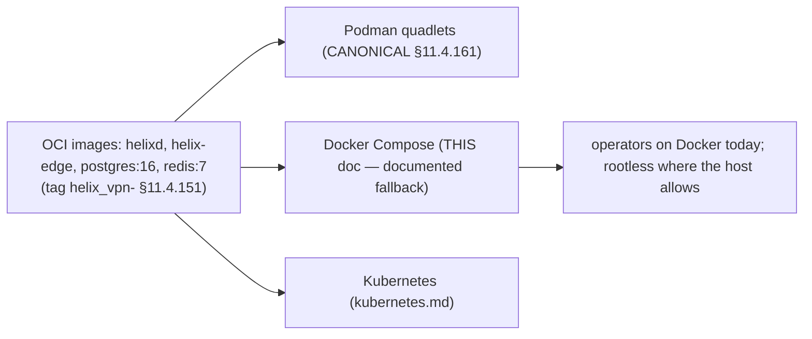

# Docker Compose (the documented fallback substrate)

**Revision:** 2
**Last modified:** 2026-06-26T12:00:00Z

> Master technical specification — Volume 6 (Deployment, Tooling & Operations), nano-detail
> document. **[RES]** research-backed. Scope: the **Docker Compose equivalent** of the HelixVPN
> gateway stack — the same OCI images as the canonical Podman-rootless substrate, mapped service-
> by-service to a `compose.yaml`, with all four services (coordinator/`helixd`, postgres, redis,
> edge), networks, volumes, secrets, healthchecks, and the capability/security posture. This is
> the **documented fallback** for environments without Podman — Podman-rootless quadlets remain the
> §11.4.161 default ([`podman-quadlets.md`](podman-quadlets.md)); Compose is the equivalence
> target for operators on Docker today [05-overview §7.2]. It deepens [05_OV §7.2] with the
> FACT-grade quadlet→Compose mapping from [research-podman_k8s]. It is a SPEC: the compose file is
> illustrative of the contract, not the shipping deployment (2–3 refinement passes follow).
>
> Evidence cited inline by id: **[05_OV §N]** = `05-repo-layout-tooling-and-helix-ecosystem.md`;
> **[RPK §N]** = `v09-research/research-podman_k8s.md` (verified vs latest Docker/Podman docs
> 2026-06-25 per §11.4.99); **[QUAD §N]** = [`podman-quadlets.md`](podman-quadlets.md); **[API §N]**
> = `v03-control-plane/svc-api.md`. Unproven facts are marked **UNVERIFIED** per §11.4.6.

---

## 0. What this document owns (and does not), and the honest default note

This document owns the **Compose substrate**: the `compose.yaml`, the quadlet→Compose directive
mapping, the secrets/volumes/networks/healthchecks, and the rootless-Docker caveats.

It does **not** own: the canonical rootless quadlet substrate ([QUAD], the §11.4.161 default); the
K8s manifests ([`kubernetes.md`](kubernetes.md)); the `helixvpnctl deploy compose` render command
([`helixvpnctl.md`](helixvpnctl.md)); the env/`readyz` contract (canonical in [API §4.7]).

> **Honest default (§11.4.161/.6).** Podman-rootless quadlets are the **canonical, mandated**
> substrate for HelixVPN (§11.4.161). Compose is the **documented fallback** for operators who
> already run Docker, NOT a co-equal recommendation. Where the operator's host can run **rootless
> Docker**, this stack runs rootless; where it can only run **rootful Docker**, that is a host
> constraint the operator owns — and per §11.4.112 the gap (rootful Docker on this host) is
> documented honestly, never silently presented as equivalent to the rootless default. A Compose
> deployment on rootful Docker carries a higher privilege posture than the canonical path, and the
> operator guide states so plainly.

---

## 1. Same images, same env contract — the equivalence target

All three substrates run the **same** OCI images (`helixd`, `helix-edge`, stock `postgres:16` /
`redis:7`) with the **same** env contract; Compose loses rootless-by-default but is otherwise a
direct mapping of the quadlet pod [05_OV §7, §7.2]. A "single pod" maps to **one Compose project /
shared network** — Compose has no pod primitive, so inter-service traffic uses the project network
(service DNS names like `pg`, `redis`) rather than the pod's `127.0.0.1` [RPK §4].



---

## 2. The quadlet → Compose directive mapping (FACT-grade)

The Compose service keys map the quadlet directives one-for-one [RPK §4/§6]:

| Concern | Quadlet ([QUAD §3]) | Docker Compose | FACT |
|---|---|---|---|
| Add capability | `AddCapability=NET_ADMIN NET_RAW` | `cap_add: [NET_ADMIN, NET_RAW]` | [RPK §4/§6] |
| Drop all caps | `DropCapability=ALL` | `cap_drop: [ALL]` | [RPK §4/§6] |
| Read-only rootfs | `ReadOnly=true` (+`ReadOnlyTmpfs`) | `read_only: true` (+`tmpfs: [/run,/tmp]`) | [RPK §4] |
| Seccomp | `SeccompProfile=<path>` | `security_opt: ["seccomp=<path>"]` | [RPK §4] |
| TUN device | `AddDevice=/dev/net/tun:/dev/net/tun` | `devices: ["/dev/net/tun:/dev/net/tun"]` | [RPK §4] |
| Publish `:443/udp` | `PublishPort=443:443/udp` | `ports: ["443:443/udp"]` | [RPK §4/§6] |
| Grouping | `.pod` + `Pod=helixvpn.pod` | one project / shared network (service DNS) | [RPK §4/§6] |
| Stateful DB | `Volume=helix-pgdata.volume` | named `volumes:` | [RPK §6] |
| Secrets | podman `Secret=` | `secrets:` (file-backed, `0600`) | [RPK §4], §11.4.10 |
| Rootless `:443` | host `ip_unprivileged_port_start=443` | same host sysctl (rootless Docker) | [RPK §3/§6] |

> **FACT [RPK §4] — NET_RAW + the host WG module still apply.** Exactly as for quadlets ([QUAD
> §3.2]), the edge needs **`NET_RAW` in addition to `NET_ADMIN`**, the **host WireGuard kernel
> module loaded outside the container**, and `/dev/net/tun` for the userspace path. Docker enables
> NET_RAW by default for root containers, but the least-privilege baseline here is `cap_drop:
> [ALL]` then `cap_add: [NET_ADMIN, NET_RAW]` — explicit, not implicit.

> **Reconciled (§11.4.35, 2026-06-26):** the canonical edge capability set is **`{NET_ADMIN,
> NET_RAW}` + `/dev/net/tun`** across every Volume-6 substrate (quadlets, this Compose doc,
> [`kubernetes.md`](kubernetes.md)) and the [`security` privesc scan](helix-ecosystem-integration.md).
> `NET_RAW` is **CONFIRMED required** by `[research-podman_k8s §2]` for the **kernel-mode WireGuard
> fast path** (the edge's primary path); `/dev/net/tun` serves the **userspace boringtun fallback**.
> The `DC4` gate below already asserts exactly this set ("ONLY NET_ADMIN+NET_RAW"); the earlier
> "ONLY NET_ADMIN" wording in the K8s/overview/security drafts was corrected to match (§11.4.6).

---

## 3. The `compose.yaml` (complete stack)

```yaml
# deploy/compose/compose.yaml  (illustrative — the documented fallback substrate)
name: helixvpn

services:
  pg:
    image: docker.io/library/postgres:16
    environment:
      POSTGRES_USER: helix_owner          # owner role; helixd connects as helix_app (RLS floor) [API §6.5]
      POSTGRES_DB: helix
    secrets: [helix_db_pw]                 # POSTGRES_PASSWORD_FILE pattern (§3.1)
    cap_drop: [ALL]
    volumes: [helix-pgdata:/var/lib/postgresql/data]
    healthcheck:
      test: ["CMD-SHELL", "pg_isready -U helix_owner -d helix"]
      interval: 5s
      timeout: 3s
      retries: 10

  redis:
    image: docker.io/library/redis:7
    cap_drop: [ALL]
    read_only: true                        # presence/events are EPHEMERAL (C2 — losing redis loses presence, not identity)
    tmpfs: ["/run", "/tmp"]
    healthcheck:
      test: ["CMD", "redis-cli", "ping"]
      interval: 5s
      timeout: 3s
      retries: 10

  helixd:
    image: ghcr.io/helixdevelopment/helixd:helix_vpn-1.0   # §11.4.151 prefixed tag
    environment:
      DATABASE_URL: postgres://helix_app@pg/helix          # non-superuser → RLS enforced [API §6.5]
      REDIS_URL: redis://redis:6379
      PGPASSWORD_FILE: /run/secrets/helix_db_pw            # read from the mounted secret (§3.1)
    secrets: [helix_db_pw]
    read_only: true
    tmpfs: ["/run", "/tmp"]
    cap_drop: [ALL]                                        # control plane needs no extra caps
    security_opt: ["no-new-privileges:true"]
    healthcheck:
      test: ["CMD", "/helixd", "healthz"]                  # → GET /readyz semantics [API §4.7]
      interval: 5s
      timeout: 3s
      retries: 10
    depends_on:
      pg:    { condition: service_healthy }
      redis: { condition: service_healthy }

  helix-edge:
    image: ghcr.io/helixdevelopment/helix-edge:helix_vpn-1.0
    cap_drop: [ALL]
    cap_add: [NET_ADMIN, NET_RAW]                          # ONLY these two (FACT [RPK §4]); NET_RAW required for WG
    devices: ["/dev/net/tun:/dev/net/tun"]                 # userspace WG (boringtun) fallback path
    read_only: true
    tmpfs: ["/run", "/tmp"]
    security_opt: ["seccomp=./helix-edge-seccomp.json"]    # tighter than the default profile
    ports:
      - "443:443/udp"                                       # MASQUE/QUIC ingress (Volume 2)
      - "51820:51820/udp"                                   # plain-WG ingress
    depends_on:
      helixd: { condition: service_healthy }

secrets:
  helix_db_pw:
    file: ./secrets/db_pw                  # 0600, gitignored (§11.4.10/.30) — NEVER committed

volumes:
  helix-pgdata: {}
```

### 3.1 Secret delivery (§11.4.10)

Compose secrets are **file-backed**: the raw DB password lives in `./secrets/db_pw` (mode `0600`,
parent `0700`, gitignored per §11.4.10/.30), mounted at `/run/secrets/helix_db_pw`. Postgres reads
`POSTGRES_PASSWORD_FILE` and `helixd` reads `PGPASSWORD_FILE` — **the raw value never appears in
`compose.yaml`, in `docker inspect`, or in any log** (§11.4.10). `helixvpnctl init --substrate
compose` writes `./secrets/db_pw` with the correct perms and a `.gitignore` entry; a pre-store
leak audit (§11.4.10.A) runs before any operator-supplied secret is written.

### 3.2 Healthchecks gate startup ordering

`depends_on: { condition: service_healthy }` makes `helixd` wait for Postgres + Redis to pass
their healthchecks, and `helix-edge` wait for `helixd` — the Compose analogue of the quadlet
pod's generator-ordered startup ([QUAD §2.2]). The `helixd` healthcheck maps to the `/readyz`
contract (`200` only if Postgres `SELECT 1` and Redis `PING` both succeed [API §4.7]), so a
half-ready control plane does not accept traffic.

---

## 4. Rootless-Docker caveats (FACT-grade)

The same networking caveats that bite rootless Podman ([QUAD §4]) apply to **rootless Docker**
[RPK §3/§4]:

| Caveat | FACT | HelixVPN handling |
|---|---|---|
| **`:443` rootless bind** | Host-level `net.ipv4.ip_unprivileged_port_start` still governs rootless-Docker privileged binds [RPK §4]. | Lower the sysctl (same as quadlets, [QUAD §4]); `init` prints it as a host prerequisite. |
| **Per-container sysctls** | Compose `sysctls:` sets per-container kernel params [RPK §4]. | Used for edge tunables (e.g. forwarding) where in-container is correct; host-level binds still need the host sysctl. |
| **Seccomp default** | Docker's default profile blocks ~44 syscalls; `security_opt: [seccomp=unconfined]` disables it [RPK §4]. | A **custom tighter** profile (`helix-edge-seccomp.json`) is shipped — never `unconfined`. |
| **No pod 127.0.0.1** | Compose has no pod; services reach each other by **project-network DNS** (`pg`, `redis`), not `127.0.0.1` [RPK §4]. | The env contract uses `@pg` / `redis://redis:6379` (service names), unlike the quadlet `127.0.0.1`. |
| **No auto firewall/NAT** | Rootless does not install iptables rules [RPK §3]. | Same as quadlets — host-side forwarding or in-container masquerade with NET_ADMIN; documented prerequisite. |

> **UNVERIFIED [RPK §3].** The pasta 5.8 throughput regression is a Podman-specific note; the
> rootless-Docker networking stack (slirp4netns / its own) has its own throughput profile — the
> operator guide says *benchmark the actual host*, never assume parity with the canonical Podman
> path.

---

## 5. The `podman kube` / Compose bridge (FACT)

Podman can consume a Compose-equivalent K8s YAML directly: `podman kube play` runs a K8s
Pod/Deployment YAML, and `podman kube generate` emits one from running containers [RPK §4]. This
gives a bridge between the three formats — an operator on Docker Compose can convert to the
canonical Podman path, and the K8s manifests ([`kubernetes.md`](kubernetes.md)) can be replayed
under Podman. HelixVPN renders all three from one in-code spec ([QUAD §6]), so the formats are
generated-equivalent, not hand-kept-in-sync.

---

## 6. `helixvpnctl deploy compose` render

`helixvpnctl deploy compose --out ./` renders the §3 `compose.yaml` + `secrets/` scaffold from the
**same** in-code spec as the quadlets (§11.4.81 cross-platform-parity) [05_OV §6.3, helixvpnctl
§10]. Parameterized by the `init` inputs (domain → edge MASQUE SNI, image tags →
`helix_vpn-<version>` [§11.4.151], data-dir → secret/volume paths). A change to the stack shape
lands in quadlet + compose + kube together, never in three divergent hand-edited files.

The rendered scaffold:

```text
deploy/compose/
├── compose.yaml                # §3 (the four services)
├── secrets/
│   └── db_pw                   # 0600, parent 0700, gitignored (§11.4.10/.30) — written by init
├── helix-edge-seccomp.json     # the tighter-than-default seccomp profile (§4)
└── .env                        # HELIX_RELEASE_PREFIX + image tags; gitignored (§11.4.30/.77)
```

The `.env` carries the resolved `helix_vpn-<version>` image tags and the domain, so a re-render is
idempotent against the same `init` state; `.env.example` (tracked) documents every key per
§11.4.77.

---

## 7. Operations posture (restart, resource budget, logging, upgrade)

Compose-specific operational rules so the fallback substrate stays within the same host-safety and
no-logging guarantees as the canonical path:

### 7.1 Restart policy

Every service carries `restart: unless-stopped` (the Compose analogue of the quadlet
`Restart=always` [QUAD §3]) so a crashed member recovers without operator action, but an operator-
initiated `docker compose stop` stays stopped (no fight with intentional maintenance).

```yaml
# applied to every service in §3 (omitted there for brevity):
    restart: unless-stopped
```

### 7.2 Resource budget (§12.6 — 60% host-memory ceiling)

Per the constitution host-safety ceiling (§12.6 — project procedures MUST NOT exceed 60% of total
host RAM), each service declares a memory limit so the gateway stack cannot starve the operator's
other workloads on a shared host:

```yaml
# per-service (illustrative budget; tuned per host):
    deploy:
      resources:
        limits:   { memory: 512M }     # helixd / edge: bounded send queues → bounded RSS [API §9]
        reservations: { memory: 128M }
    # postgres gets the largest share; redis the smallest (presence is tiny)
```

**UNVERIFIED:** the exact per-service megabyte budgets above are design defaults; they are tuned
against the §11.4.169 memory-soak evidence (24 h, RSS slope ≈ 0 [API §13]) at implementation time,
not asserted as fixed. The sum MUST stay under the §12.6 60% ceiling on the target host.

### 7.3 Logging (C3 — no traffic, no PII)

Compose logs inherit the control plane's no-logging-by-construction posture [API §4.6, C3]: the
access log records `route-template + status + latency + tenant + role`, never client IP, request
body, or auth token. The Compose `logging:` driver is set to a bounded `json-file` (size+rotation
caps) so logs cannot fill the host disk:

```yaml
    logging:
      driver: json-file
      options: { max-size: "10m", max-file: "3" }
```

A `docker compose logs` therefore surfaces operational events, never traffic — the no-logging
guarantee is structural (the app emits no traffic log line [API §4.8]), and the bounded driver is
the disk-safety belt.

### 7.4 Upgrade procedure

A version bump is a tag change + recreate, with the §11.4.151 prefixed tags making the release
greppable:

```bash
# 1. bump image tags in .env to the new helix_vpn-<version>
# 2. pull + recreate (Postgres data persists in the named volume):
docker compose pull
docker compose up -d                         # recreates changed services only; pgdata volume retained
# 3. verify:
helixvpnctl status                           # GREEN on the new images
```

Postgres schema migrations run inside `helixd` startup (goose, [research-go_cp §6]) against the
retained `helix-pgdata` volume — the upgrade never drops the volume. A rollback re-points `.env` to
the prior `helix_vpn-<version>` tag and `up -d` again (the images are immutable, the data persists).
Destructive operations on the `helix-pgdata` volume require the §9.2 hardlinked-backup + operator
authorization, never an autonomous `down -v`.

---

## 8. Test points (§11.4.169 comprehensive test-type coverage)

Every PASS cites captured evidence (§11.4.5/.69/.107). Where the test harness boots infra it does
so via the `containers` submodule (§11.4.76); the Compose substrate itself is exercised as a
fallback-parity target, never as the primary path.

| # | Test type (§11.4.169) | Target | Concrete assertion + evidence |
|---|---|---|---|
| DC1 | unit | render determinism | `deploy compose` twice → byte-identical `compose.yaml`; image tag carries `helix_vpn-` prefix |
| DC2 | integration | full-stack `compose up` | `docker compose up` → all 4 services healthy (healthchecks pass); `helixvpnctl status` GREEN |
| DC3 | integration | ordering via healthchecks (§3.2) | `helixd` starts only after pg+redis healthy; edge only after helixd; captured event order |
| DC4 | security | capability set (§3) | `docker inspect` shows edge has ONLY NET_ADMIN+NET_RAW; others none; mutation adding a cap → FAIL |
| DC5 | security | secret not in file/inspect (§3.1) | grep `compose.yaml` + `docker inspect` → no raw password; only secret references; perms `0600` |
| DC6 | security | seccomp not unconfined (§4) | edge uses the custom profile, never `unconfined`; mutation to `unconfined` → FAIL |
| DC7 | e2e | three-substrate parity (§5) | the same image boots under quadlet AND compose; `status` GREEN on each (recorded §11.4.159) |
| DC8 | chaos | dependency restart | kill `pg`; assert restart + `helixd` reconnect; redis loss degrades presence gracefully (C2) |
| DC9 | integration | `:443/udp` reachable (rootless) | with the host sysctl set, an agent completes a MASQUE handshake to the edge; captured |
| DC10 | meta-test (§1.1) | gates paired | add a cap / inline a secret / set `unconfined` → each makes its gate FAIL |

---

## 9. Decision callouts (options + recommendation — §11.4.66/.101)

| id | Decision | Options | Recommendation |
|---|---|---|---|
| **D-COMPOSE-ROOTLESS** | Compose on which Docker mode | (a) rootless Docker; (b) rootful Docker | **(a)** where the host allows; **(b)** is an honest §11.4.112-documented higher-privilege gap, not equivalent to the §11.4.161 default |
| **D-COMPOSE-SECRETS** | secret delivery | (a) file-backed `secrets:`; (b) env var | **(a)** — raw value never in `compose.yaml`/inspect/log (§11.4.10) |
| **D-COMPOSE-NET** | service addressing | (a) project-network DNS; (b) host network | **(a)** — Compose has no pod `127.0.0.1`; project DNS (`pg`,`redis`) is the idiomatic + isolated path [RPK §4] |

---

## Sources verified

- `v09-research/research-podman_k8s.md` §4 (quadlet→Compose mapping: `cap_drop`/`cap_add`,
  `devices`, `read_only`+`tmpfs`, `security_opt seccomp`, `ports`, single-pod→one-project-network,
  `sysctls`, `podman kube play/generate` bridge), §3 (rootless `:443` host sysctl, no auto
  firewall/NAT), §6 (cross-format mapping table), §2 (NET_RAW + host WG module) — verified vs latest
  Docker/Podman docs 2026-06-25 per §11.4.99 — `[RPK]`.
- `05-repo-layout-tooling-and-helix-ecosystem.md` §7.2 (Docker Compose equivalence target, the
  `docker-compose.yaml` sketch, rootless-where-allowed honest gap), §7 (same images/env contract),
  §6.3 (deploy render via containers submodule) — `[05_OV]`.
- `podman-quadlets.md` §2/§3/§4 (the canonical substrate this maps from: pod model, edge capability
  set, rootless caveats) — `[QUAD]`.
- `v03-control-plane/svc-api.md` §4.7 (`/readyz` for healthchecks), §6.5 (helix_app non-superuser →
  RLS), §4.2 (Redis presence ephemeral, C2) — `[API]`.
- Constitution anchors: §11.4.161 (rootless mandate — Compose is the documented fallback, not the
  default), §11.4.112 (honest documented gap for rootful-Docker hosts), §11.4.10/.30 (file-backed
  secrets, gitignored, never in compose.yaml/inspect/log), §11.4.76 (containers submodule for test
  infra), §11.4.81 (one-source three-substrate render), §11.4.6 (no-guessing — UNVERIFIED rootless-
  Docker throughput mark), §11.4.169 (test-type coverage), §1.1 (paired meta-test mutations).
