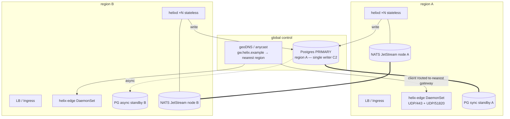
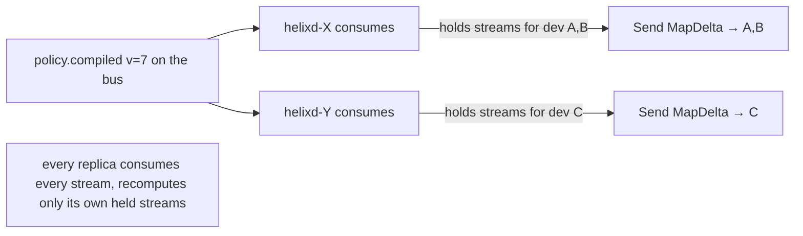
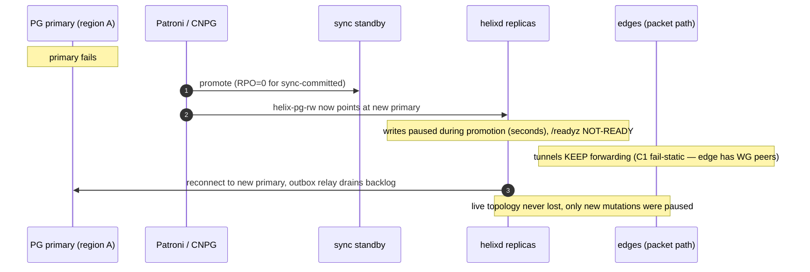
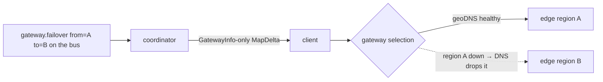
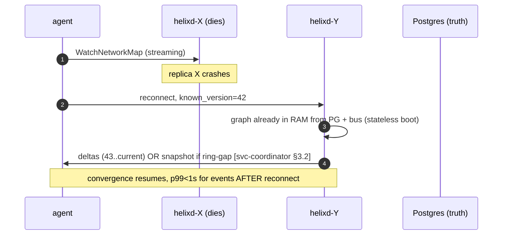

# High availability & multi-region (Phase-2 scale-out)

**Revision:** 1
**Last modified:** 2026-06-25T12:00:00Z

> Master technical specification — Volume 6 (Deployment, Tooling & Operations), nano-detail
> document `ha-and-multiregion.md`. Scope: how HelixVPN goes from the single-node Phase-1
> deploy to a **horizontally-scalable, multi-region, highly-available** topology — and how the
> **< 1 s convergence SLO survives a failover**. It deepens the HA hooks already designed into
> the control plane: stateless coordinators `[svc-coordinator §10]`, the bus-agnostic event
> seam `[svc-events §10]`, Postgres-as-truth / Redis-as-ephemeral (C2). It is **additive, not a
> rewrite** — every Phase-2 mechanism plugs into a seam Phase-1 already drew. This is a SPEC
> (describe the implementation; do not build the product). Evidence cited inline: `[05 §N]`
> (`05-repo-layout-tooling-and-helix-ecosystem.md`), `[svc-coordinator §N]`, `[svc-events §N]`,
> `[svc-telemetry §N]`, `[kubernetes §N]` (sibling), `[research-podman_k8s]`. The disaster-
> recovery runbook is its own sibling `disaster-recovery.md` (closes ledger gap G1); this
> document owns the *steady-state* HA topology and the *failover convergence* story. Unproven
> facts are marked `UNVERIFIED` per §11.4.6.

---

## Table of contents

- [0. The HA thesis — stateless coordinators make it cheap](#0-the-ha-thesis--stateless-coordinators-make-it-cheap)
- [1. Reference multi-region topology](#1-reference-multi-region-topology)
- [2. Stateless coordinators behind a load balancer](#2-stateless-coordinators-behind-a-load-balancer)
- [3. Postgres HA — Patroni / synchronous replication](#3-postgres-ha--patroni--synchronous-replication)
- [4. Event bus HA — Redis replication → NATS JetStream](#4-event-bus-ha--redis-replication--nats-jetstream)
- [5. Gateway selection — anycast / geoDNS](#5-gateway-selection--anycast--geodns)
- [6. Failover semantics — the convergence-during-failover story](#6-failover-semantics--the-convergence-during-failover-story)
- [7. Split-brain handling](#7-split-brain-handling)
- [8. SLOs under failover & anti-bluff evidence](#8-slos-under-failover--anti-bluff-evidence)
- [9. UNVERIFIED register](#9-unverified-register)
- [Sources verified](#sources-verified)

---

## 0. The HA thesis — stateless coordinators make it cheap

HelixVPN's HA story is unusually cheap because of one architectural decision made in Phase 1: the
coordinator is **stateless on disk** `[svc-coordinator §0/§10(c)]`. Its entire runtime state — the
per-tenant topology graph + open `WatchNetworkMap` streams — is a *projection* of Postgres truth
(C2) plus the live event stream, rebuilt from scratch on every boot `[svc-coordinator §1.4]`.

Consequences that define this document:

1. **Coordinators are cattle.** Any `helixd` replica can serve any agent's stream; killing one
   loses no state; scaling is a `Deployment` `replicas` bump + HPA `[kubernetes §5]`.
2. **The hard state is exactly two stores.** Postgres (truth — MUST be HA) and Redis/NATS
   (ephemeral — loss is recoverable, HA is a latency/availability nicety, not a correctness need,
   `[svc-events §7.4]`).
3. **Failover is a stream-reconnect, not a resync.** An agent whose coordinator dies reconnects to
   another and resumes by `known_version` against the version-namespace that survives restarts
   (`version namespace == policy-version namespace`, `[svc-coordinator §1.4/§3.2]`).

So HA = (a) make Postgres HA, (b) front stateless coordinators with a load balancer, (c) pick a
gateway-selection mechanism, (d) optionally make the bus HA. Each is below.

---

## 1. Reference multi-region topology



Design rules of the reference topology:

- **Single Postgres writer (C2).** There is exactly ONE primary at a time (region A here). All
  `helixd` replicas — in every region — write to it. Multi-master Postgres is NOT used (it breaks
  the single-truth invariant). Cross-region write latency is acceptable because control-plane
  writes are low-rate (enroll/revoke/policy-activate), not packet-path `[svc-coordinator §0 C1]`.
- **Regional read scale (Phase-2 optimization).** Coordinator boot-hydration reads MAY come from a
  regional read-replica (`[kubernetes §3]`, `helix-pg-ro`); UNVERIFIED whether the MVP routes
  hydration to replicas — Phase-1 reads the primary.
- **Per-region edges.** Each region runs its own `helix-edge` `DaemonSet` so a client connects to
  the nearest gateway; the coordinator's `MapDelta` carries the right `GatewayInfo.endpoint` per
  node `[svc-coordinator §2.1]`.
- **One logical event bus.** Phase-2 NATS JetStream clusters across regions behind the same
  `events.Bus` interface (D3, §4).

---

## 2. Stateless coordinators behind a load balancer

The control-plane API (`helixd:8443`, Connect-RPC + REST) sits behind a regional L7 LB / Ingress.
Because coordinators are stateless `[svc-coordinator §10(c)]`:

- **No sticky sessions required.** An agent's long-lived `WatchNetworkMap` stream is pinned to one
  pod for the life of the TCP/HTTP-2 connection (normal LB behaviour for a streaming RPC), but on
  reconnect it may land on any pod and resume by `known_version` `[svc-coordinator §3.2]`.
- **Each replica is a full consumer.** Every `helixd` joins the event-bus consumer groups with a
  distinct consumer name (pod name = `hostID`, `[svc-events §3.1]`); work is partitioned across
  replicas by the bus (Redis Streams / NATS), not duplicated. The outbox relay uses
  `FOR UPDATE SKIP LOCKED` so every replica safely runs the relay loop `[svc-events §5.2]`.
- **Fan-out reaches the right replica.** An event affecting device D is reacted by whichever
  replica owns D's open stream — but ALL replicas consume the same streams and recompute, and only
  the replica holding D's `WatchNetworkMap` subscription has a `subRegistry` entry to send to, so a
  replica with no affected streams simply produces a zero-send no-op `[svc-coordinator §5]`.

> **UNVERIFIED — cross-replica fan-out.** In the single-binary MVP, one coordinator owns every
> stream, so "the replica that consumed the event also holds the affected stream" is trivially
> true. In multi-replica Phase 2, an event consumed by replica X may affect a stream held by
> replica Y. The seam that makes this work is the **shared bus**: every replica consumes every
> stream and recomputes its *own* held streams `[svc-coordinator §10(d)]`. This is asserted as the
> design intent, not as validated behaviour — it is flagged for the Phase-2 multi-replica
> integration test (§8) and MUST NOT be claimed working until that test captures evidence.



---

## 3. Postgres HA — Patroni / synchronous replication

Postgres is the only store whose HA is a *correctness* requirement (C2). The recommended posture
(from `[kubernetes §3]` D-K8S-PG-HA option a, deepened here):

- **Topology:** 1 primary + ≥2 standbys. At least one standby is **synchronous** (`synchronous_commit
  = remote_write` or stricter) so an acknowledged control-plane write survives a primary loss with
  **RPO = 0** for committed transactions; additional async standbys (possibly cross-region) serve
  read scale + DR `[03_ZAI]` (DR detail in `disaster-recovery.md §3`).
- **Failover:** Patroni / CloudNativePG promotes a healthy standby on primary failure, fences the
  old primary, and re-points the `helix-pg-rw` Service to the new primary `[kubernetes §3]`.
- **What `helixd` sees:** during the promotion window, writes fail (the `rw` endpoint is briefly
  unavailable). This is **fail-static-correct** — existing tunnels keep forwarding (C1, the edge
  has the WG peers programmed; the Go control plane is not in the packet path), and `/readyz` goes
  NOT-READY so the LB stops sending new API traffic until the new primary is up `[svc-telemetry §8.2]`.
- **Recovery:** when the new primary is `rw`, coordinators reconnect, the outbox relay drains any
  staged-but-unrelayed events, and the graph (already in RAM, never lost) keeps serving — only
  *new* mutations were paused, never the live topology `[svc-events §7.4]`.



> **The HA payoff stated plainly:** a Postgres failover pauses *control* operations (you can't
> enroll/revoke/activate-policy for a few seconds) but NEVER drops *data-plane* traffic, because
> the Go control plane is structurally out of the packet path (C1). This is the single most
> important HA property and it is free — it falls out of the Phase-1 control/data separation.

---

## 4. Event bus HA — Redis replication → NATS JetStream

The bus is ephemeral (C2): losing it loses no durable state `[svc-events §7.4]`, so its HA is about
*availability + latency*, not correctness. Two stages:

**Phase-1 (Redis):** a Redis replica (`StatefulSet replicas` or Redis Sentinel) reduces the
recovery window, but even a total Redis loss is recoverable — the coordinator rehydrates from
Postgres and the outbox re-relays `[svc-events §7.4]`. HA Redis is OPTIONAL in Phase 1.

**Phase-2 (NATS JetStream):** the D3 swap `[svc-events §10]`. NATS JetStream gives clustered,
replicated, durable streams across regions behind the **same `events.Bus` interface** — "the
consumer loop is bus-agnostic" `[svc-coordinator §10(a)]`, so this is a transport change, not a
rewrite. JetStream consumer groups map onto the same `(stream, group, consumer=hostID)` topology
`[svc-events §3.1]`.

```go
// internal/events/natsbus.go — Phase-2 impl behind the SAME events.Bus interface (§2.1 [svc-events])
// NOTHING above this interface knows Redis vs NATS is live [svc-events §10].
type NatsBus struct {
    js     nats.JetStreamContext
    hostID string
    // Publish → js.Publish to the stream subject; Subscribe → durable pull consumer per group;
    // Ack/Nack → msg.Ack()/msg.Nak(); XAUTOCLAIM reclaim → JetStream redelivery + MaxDeliver (DLQ).
}
```

> **UNVERIFIED — NATS JetStream multi-region replication factor.** The exact JetStream cluster
> sizing (R3/R5, per-region placement, mirror vs cluster) is a Phase-2 capacity decision, not
> resolved here. What IS asserted: the `Bus` interface is the seam, the envelope/taxonomy are
> transport-neutral `[svc-events §2.2]`, and the at-least-once + idempotent-reaction contract
> `[svc-events §6.2]` holds identically on JetStream (whose redelivery + `MaxDeliver`→DLQ map onto
> the Redis `XAUTOCLAIM`→DLQ machinery). The replication topology is flagged for Phase-2 design.

---

## 5. Gateway selection — anycast / geoDNS

A client must reach the **nearest healthy** gateway (edge). Two mechanisms, recommendation explicit
(§11.4.66):

> **Decision D-GW-SELECT (options + recommendation).**
> **(a) geoDNS** — `gw.helix.example` resolves to the nearest region's edge IP(s) by client geo;
> health-checked DNS removes a dead region from rotation. Simplest; DNS-TTL-bound failover.
> **(b) Anycast** — a single advertised IP announced (BGP) from every region's edge; routing
> delivers the client to the topologically-nearest PoP; a dead PoP withdraws the route. Fastest
> failover, requires BGP/anycast capability.
> **(c) Client-side from the network map** — `GatewayInfo.endpoint` in the `MapDelta`
> `[svc-coordinator §2.1]` carries a per-node gateway; the client could be handed a region-specific
> endpoint by the coordinator at enroll time.
> **Recommended:** **(a) geoDNS** for the Phase-2 MVP (no BGP dependency); **(b) anycast** for
> latency-critical fleets that have the network capability; **(c)** as a complement — the
> coordinator already knows each node's region, so it can bias `GatewayInfo` regardless of (a)/(b).

The coordinator's role is consistent across all three: it sets `GatewayInfo.endpoint`/`MasqueSNI`
per node `[svc-coordinator §1.2/§2.1]`, and on a regional gateway failover it emits
`gateway.failover {from,to}` `[svc-events §3.4]`, which recomputes every affected node's
`GatewayInfo` and pushes a `GatewayInfo`-only delta `[svc-coordinator §4.2]`.



---

## 6. Failover semantics — the convergence-during-failover story

This is the heart of the document: **what does the < 1 s convergence SLO mean while something is
failing over?** The answer differs by what fails, and each case is governed by an existing
invariant — none is invented here.

| Failure | Data-plane effect | Control-plane effect | Convergence semantics |
|---|---|---|---|
| **One `helixd` replica dies** | none (C1 — not in packet path) | agents on that pod's streams reconnect to another replica | resume by `known_version`; deltas, not full snapshot `[svc-coordinator §3.2]`; SLO clock restarts on reconnect, p99<1s for subsequent events |
| **Postgres primary failover (§3)** | none (tunnels keep forwarding) | writes paused seconds; `/readyz` NOT-READY | *new* mutations queue/fail-and-retry; the **already-pushed** topology is intact in every coordinator's RAM; convergence resumes once the new primary is `rw` |
| **Redis/NATS blip (§4)** | none | event delivery paused; presence goes stale | outbox stages writes durably (C2); on bus recovery the relay drains and convergence catches up `[svc-events §7.4]`; presence reaper reconciles `[svc-telemetry §5.4]` |
| **Regional gateway (edge) loss (§5)** | clients on that gateway drop; reconnect to next-nearest | coordinator emits `gateway.failover`; re-points `GatewayInfo` | clients re-handshake against the new gateway; the WG/MASQUE re-handshake is the client's reconnection state machine (data-plane spec), bounded by the transport ladder, NOT by the <1s control SLO |
| **Whole region loss** | clients fail over to surviving region's gateways | surviving-region coordinators keep serving from RAM + the (cross-region) primary or its promoted standby | combines the rows above; DR runbook in `disaster-recovery.md §6` |

> **The crucial honesty (§11.4.6):** the **< 1 s SLO measures `event-receive → MapDelta-on-wire`**
> at a *healthy* coordinator `[svc-coordinator §7.1, svc-telemetry §6.1]`. It is NOT a promise that
> a client mid-failover re-handshakes its tunnel in < 1 s — that is the data-plane reconnection
> ladder's budget, a different and larger number. Conflating the two would be a bluff. What the HA
> design DOES guarantee: a failover **pauses** convergence (briefly) and never **corrupts** it —
> when the failed component returns, the graph is rebuilt-or-intact and deltas resume; no node ever
> converges to a *wrong* map because of a failover (idempotent recompute-from-state,
> `[svc-events §6.2]`).



---

## 7. Split-brain handling

Split-brain is the classic HA hazard. HelixVPN's exposure is bounded by the single-writer invariant:

- **Postgres split-brain (two primaries).** Prevented by the HA operator's fencing: Patroni/CNPG
  uses a distributed-consensus lock (etcd/Kubernetes lease) so at most one node holds the leader
  key; a partitioned old primary is demoted/fenced before a standby is promoted `[research-podman_k8s]`.
  If fencing genuinely fails (UNVERIFIED edge case), the sync-standby's `remote_write` requirement
  means an un-fenced old primary cannot acknowledge writes the new primary doesn't have — the
  damage is bounded, not silent.
- **Coordinator "split-brain" is a non-issue.** Two `helixd` replicas serving the same tenant is the
  *normal* steady state, not a fault — they are stateless, both read the same Postgres truth, both
  consume the same bus, and both recompute idempotently `[svc-events §6.2]`. The presence layer is
  explicitly split-brain-safe: "two helixd … both write same key — idempotent (SET is
  last-writer-wins; SADD is a set) — harmless" `[svc-telemetry §5.4]`.
- **Bus split-brain (NATS partition).** JetStream's RAFT-based clustering elects a single stream
  leader per partition; a minority partition cannot accept publishes (loses availability, not
  consistency). Outbox staging means a publish that can't land is retried, not lost `[svc-events §5.2]`.
  Exact behaviour is **UNVERIFIED** pending the Phase-2 NATS topology (§4).

The unifying principle: **every stateful component has exactly one writer/leader at a time, chosen
by a consensus lock; the stateless components are safe to run N-wide by construction.** Split-brain
is therefore a *bounded-availability* event, never a *silent-corruption* event.

---

## 8. SLOs under failover & anti-bluff evidence

| SLO / claim | Target | Captured-evidence proof (§11.4.5/§11.4.69/§11.4.85) |
|---|---|---|
| `helixd` replica loss → agent resumes | deltas not snapshot; p99<1s post-reconnect | chaos test: kill a replica mid-stream, capture the reconnect `known_version` resume transcript `[svc-coordinator §8.2-10]` |
| PG primary failover → no tunnel drop | data plane unaffected (C1) | chaos test: trigger CNPG switchover under load; packet capture shows tunnels keep forwarding; `/readyz` flaps, `/healthz` stays green `[svc-telemetry §8.2]` |
| bus loss → no lost events | RPO=0 for committed mutations | chaos test: kill Redis/NATS mid-flight; assert outbox re-relays every staged event on recovery; before/after event-ID ledger `[svc-events §7.4, §11.4.147]` |
| multi-replica cross-stream fan-out (§2, UNVERIFIED) | event on X reaches stream on Y | Phase-2 integration test: 2 replicas, event consumed by X affects a stream held by Y → Y sends the delta; captured `MapUpdate` transcript |
| gateway failover → clients re-home | clients reach surviving gateway | chaos test: drop a region's edge; geoDNS health-check drops it; clients re-handshake on the next region's gateway; recorded handshake |
| split-brain presence safe (§7) | two helixd, same key, no corruption | unit/integration: concurrent `MarkOnline` from two writers → consistent presence set `[svc-telemetry §5.4]` |

Integration infra (PG + Redis/NATS, multi-replica) booted on-demand via `containers` (§11.4.76),
never ad-hoc. Chaos tests are mandatory per §11.4.85 (process-death, network-fault, state-corruption
injection with categorised recovery). A "HA works" claim with no failover chaos evidence is a §11.4
bluff.

---

## 9. UNVERIFIED register

| # | UNVERIFIED item | Why / status |
|---|---|---|
| U1 | Multi-replica cross-stream fan-out (§2) | trivially true single-binary; Phase-2 multi-replica behaviour is design-intent, flagged for the §8 test, NOT claimed working |
| U2 | Hydration reads routed to regional read-replicas (§1/§3) | Phase-2 optimization; Phase-1 reads the primary |
| U3 | NATS JetStream replication factor / multi-region placement (§4) | Phase-2 capacity decision; only the `Bus`-seam neutrality is asserted |
| U4 | geoDNS vs anycast final pick (§5) | D-GW-SELECT options; recommendation given, not validated against a real fleet |
| U5 | Postgres fencing under a genuine partition (§7) | bounded by sync-standby `remote_write`; exact operator fencing behaviour is operator-specific |
| U6 | Whether the <1s SLO and the client re-handshake budget are ever conflated in tooling (§6) | the doc asserts they are distinct; a test must prove the tooling reports them separately |

---

## Sources verified

- `05-repo-layout-tooling-and-helix-ecosystem.md` §7.3 (K8s edge/coordinator/PG shapes the HA
  topology refines), §7.4 (multi-region-fleet → K8s recommendation), §12 (decision discipline) — `[05]`.
- `v03-control-plane/svc-coordinator.md` §0 (C1/C2/C5 + stateless-on-disk), §1.4 (boot hydration,
  version-namespace survives restart), §2.1 (`GatewayInfo`/`relayEndpoint`), §3.2 (`known_version`
  resume), §4.2 (`gateway.failover` reaction), §5 (fan-out), §7.1 (the SLO measurement point),
  §8.2-10 (coordinator-restart-mid-stream edge case), §10 (Phase-2 stateless/bus-agnostic seams) —
  `[svc-coordinator]`.
- `v03-control-plane/svc-events.md` §2.2 (transport-neutral envelope), §3.1 (consumer-group
  partitioning per replica), §5.2 (`SKIP LOCKED` relay safe on every replica), §6.2 (idempotent
  recompute-from-state), §7.4 (cold-boot rehydration / Redis-loss correctness), §10 (NATS
  JetStream swap behind `Bus`) — `[svc-events]`.
- `v03-control-plane/svc-telemetry.md` §5.4 (presence split-brain safety, drift reconciliation),
  §6.1 (convergence measured at a healthy coordinator), §8.2 (liveness/readiness fail-static
  semantics) — `[svc-telemetry]`.
- `v06-deploy/kubernetes.md` §3 (D-K8S-PG-HA / CloudNativePG), §5 (stateless Deployment + HPA),
  §6 (edge DaemonSet) — `[kubernetes]` (sibling).
- `99-source-coverage-ledger.md` G1 + `[03_ZAI]` (KMS backups, RTO, Terraform DR — the multi-region
  resilience framing this document operationalizes; DR runbook lives in `disaster-recovery.md`).
- `[research-podman_k8s]` — Patroni/CNPG failover + consensus-lock fencing, NATS JetStream
  clustering, UDP gateway ingress per region; cross-referenced against latest official docs per
  §11.4.99.

*Constitution bindings applied: §11.4.44 (revision header), §11.4.6 (no-guessing — the <1s-SLO vs
re-handshake-budget distinction made explicit, UNVERIFIED register in §9), §11.4.66 (D-GW-SELECT,
D-K8S-PG-HA referenced as options+recommendation), §11.4.85 (failover chaos evidence mandatory in
§8), §11.4.147 (no-work-loss outbox re-relay), §11.4.76 (containers submodule for HA integration
infra).*
