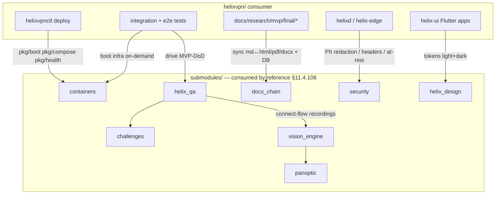
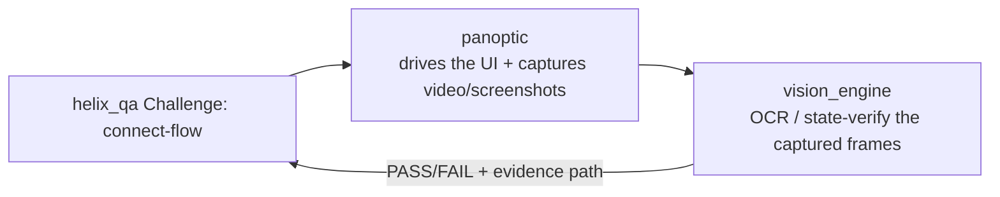

# Helix-ecosystem submodule integration

**Revision:** 3
**Last modified:** 2026-07-04T12:00:00Z
**Rev 3:** Reviewed against the Volume-6 enterprise-hardening pass (2026-07-04). Submodule wiring
and decoupling invariants already comprehensive; the `remote-testing-infra.md` PARKED status
(noted in this doc's header) is confirmed still accurate — the file genuinely does not exist on
disk, consistent with "PARKED... out of scope per the blueprint," not a stale claim. No gap found
in scope. Revision bumped for the pass.

> Master technical specification — Volume 6 (Deployment, Tooling & Operations), nano-detail
> document `helix-ecosystem-integration.md`. Scope: **how HelixVPN wires every already-
> incorporated `submodules/` member into a concrete role** — `vasic-digital/containers` (sole
> container orchestration, §11.4.76), `HelixDevelopment/helix_qa` (anti-bluff QA, §11.4.169),
> `vasic-digital/challenges` (Challenge banks, §11.4.27), `vasic-digital/docs_chain` (doc/DB
> sync, §11.4.106), `vasic-digital/security` (control-plane defensive libs), `vision_engine`
> (recording/vision bridge, §11.4.160), `helix_design` (Volume-10 design system, §11.4.162),
> plus the dev-loop-only members. It deepens `[05 §6]`
> (`05-repo-layout-tooling-and-helix-ecosystem.md`) with the **catalogue-first reuse decisions**
> (§11.4.74 — a per-submodule `Catalogue-Check: reuse|extend|no-match` table) and the
> **decoupling invariants** (§11.4.28 — submodules stay project-not-aware, reusable). This is a
> SPEC (describe the wiring; do not build the product). Evidence cited inline: `[05 §N]`,
> `[svc-telemetry §N]`, `[svc-events §N]`, `[kubernetes §N]`, `[observability §N]`,
> `[disaster-recovery §N]`. The PARKED `remote-testing-infra.md` is out of scope per the
> blueprint. Unproven facts are marked `UNVERIFIED` per §11.4.6.

---

## Table of contents

- [0. The three wiring rules that govern every submodule](#0-the-three-wiring-rules-that-govern-every-submodule)
- [1. Catalogue-Check table (§11.4.74 reuse decisions)](#1-catalogue-check-table-11474-reuse-decisions)
- [2. containers — sole orchestration + on-demand test infra](#2-containers--sole-orchestration--on-demand-test-infra)
- [3. helix_qa — anti-bluff QA orchestrator](#3-helix_qa--anti-bluff-qa-orchestrator)
- [4. challenges — the Challenge engine](#4-challenges--the-challenge-engine)
- [5. docs_chain — spec + workable-items sync](#5-docs_chain--spec--workable-items-sync)
- [6. security — control-plane defensive libraries](#6-security--control-plane-defensive-libraries)
- [7. vision_engine + panoptic — recording/vision bridge](#7-vision_engine--panoptic--recordingvision-bridge)
- [8. helix_design — the Volume-10 design system](#8-helix_design--the-volume-10-design-system)
- [9. doc_processor + the dev-loop-only members](#9-doc_processor--the-dev-loop-only-members)
- [10. Decoupling invariants (§11.4.28) & enforcement](#10-decoupling-invariants-11428--enforcement)
- [11. UNVERIFIED register](#11-unverified-register)
- [Sources verified](#sources-verified)

---

## 0. The three wiring rules that govern every submodule

Every submodule wiring in this document obeys three constitution rules, stated once:

1. **Consumed by reference, never copied (§11.4.106/.80, `[05 §6]`).** A submodule is invoked at its
   path / imported as a package — never vendored-by-copy. A copy diverges silently.
2. **Catalogue-first (§11.4.74).** Before any new helper is scaffolded in-project, the submodule
   catalogue is surveyed; ≥80% match ⇒ reuse; 80%+ with gaps ⇒ **extend upstream** (PR), never
   duplicate the 80%; no match ⇒ build, with the survey recorded as a `Catalogue-Check:` line (§1).
3. **Decoupling (§11.4.28(B)).** A submodule is given **zero** HelixVPN-specific context — no
   hardcoded hostnames, asset names, tenant assumptions. Project specifics enter only via config
   injection (env var / config struct / constructor param). Enforced by `CM-OWNED-SUBMODULE-DECOUPLING`
   (§10).



---

## 1. Catalogue-Check table (§11.4.74 reuse decisions)

Per §11.4.74 every submodule role records a reuse decision (`reuse` | `extend` | `no-match`) so a
future contributor does not re-implement an existing capability. This is the consolidated ledger
(derived from `[05 §6.1]`):

| Submodule | Catalogue-Check | What HelixVPN reuses / extends | Phase |
|---|---|---|---|
| **containers** | **reuse** `vasic-digital/containers@<sha>` | `pkg/boot`/`pkg/compose`/`pkg/health` for deploy render + on-demand test infra; extend only if a runtime primitive is missing (then PR upstream, §2) | 0–1 |
| **helix_qa** | **reuse** `HelixDevelopment/helix_qa@<sha>` | anti-bluff QA orchestrator drives the 8 MVP-DoD criteria; HelixVPN supplies *test banks*, not engine code (§3) | 1 |
| **challenges** | **reuse** `vasic-digital/challenges@<sha>` | Challenge engine; HelixVPN authors Challenge *definitions* referencing ATM-ids (§4) | 1 |
| **docs_chain** | **reuse** `vasic-digital/docs_chain@<sha>` | doc-export + DB-sync engine; HelixVPN supplies `.docs_chain/contexts/*.yaml` data, not engine code (§5) | 0+ |
| **security** | **reuse → extend-as-needed** `vasic-digital/security@<sha>` | PII-redaction, HTTP security headers, AES-256-GCM at-rest, SSRF-deny, privesc scan (§6); extend upstream for any missing primitive | 1 |
| **vision_engine** | **reuse** `vision_engine@<sha>` | video/screenshot evidence analysis for UI Challenges (§7) — test-infra, never shipped in an app bundle | 1–2 |
| **panoptic** | **reuse** `panoptic@<sha>` | UI automation + capture harness feeding vision_engine (§7) | 1–2 |
| **doc_processor** | **reuse** `doc_processor@<sha>` | feature-map extraction → per-feature Status ledger cross-check (§9) | 1 |
| **helix_design** | **extend** `vasic-digital/helix_design@<sha>` | the OpenDesign-based design system (Volume 10); HelixVPN *is* a primary consumer + extends it with brand tokens (§8) | 1+ |
| **llm_provider** | **no-match (conditional)** | binds ONLY if Phase-2 ships LLM-assisted policy authoring (D-LLM-POLICY); else dev-only (§9) | 2 (opt) |
| **llm_orchestrator** | **reuse (dev-loop only)** | subagent orchestration for the *build* loop; NOT a runtime dependency (§9) | dev-only |
| **llms_verifier** | **reuse (dev-loop only)** | verifies the dev loop's LLM ("do you see my code?"); NOT a runtime component (§9) | dev-only |

> The `@<sha>` placeholders are the pinned submodule pointers (§11.4.26 step 7); the actual SHAs
> live in `.gitmodules` + `helix-deps.yaml` `[05 §3.2]`, bumped in the same commit as cascade work.

---

## 2. containers — sole orchestration + on-demand test infra

`containers` is the **only** sanctioned path to docker/podman/k8s from HelixVPN (§11.4.76 — no
ad-hoc docker/podman outside `pkg/boot`/`pkg/compose`/`pkg/health`, `[05 §6.3]`). Two concrete uses,
both load-bearing:

**(A) On-demand integration-test infra** — the §11.4.76 on-demand-infra invariant: operators never
`podman machine` by hand; the test entry point boots the infra `[05 §6.3(A)]`. This is the seam every
sibling deploy doc's anti-bluff plan depends on (`[kubernetes §10]`, `[ha-and-multiregion §8]`,
`[observability §8]`, `[disaster-recovery §7]` all boot PG/Redis/cluster via `containers`):

```go
// helix-go/internal/store/integration_test.go  (from [05 §6.3A], the canonical pattern)
import (
    "digital.vasic.containers/pkg/boot"
    "digital.vasic.containers/pkg/health"
)
func TestWatchNetworkMapDeltaStream(t *testing.T) {
    ctx := context.Background()
    infra := boot.Compose(ctx, boot.Spec{                  // rootless Podman (§11.4.161)
        Services: []boot.Service{
            {Name: "pg",    Image: "docker.io/library/postgres:16", Port: 5432},
            {Name: "redis", Image: "docker.io/library/redis:7",     Port: 6379},
        },
    })
    t.Cleanup(func() { infra.Down(ctx) })                  // §11.4.14 quiescent teardown
    health.WaitReady(ctx, infra, 30*time.Second)           // real readiness probe, not a sleep
    // ... drive enroll → advertise → policy → assert MapDelta [svc-events §7.1]
}
```

**Anti-bluff (§11.4.76(5)):** an integration test claiming to exercise streamed `WatchNetworkMap`
MUST actually boot PG+Redis via the submodule — a short-circuit fake that skips boot is a §11.4
violation `[05 §6.3]`. The paired mutation: remove `boot.Compose` → the test FAILs (proves it wasn't
a fake) `[05 §11]`.

**(B) Deploy generation** — `helixvpnctl deploy {quadlet,compose,kube}` renders all three substrates
through `containers/pkg/compose` so one in-code spec yields three substrates (§11.4.81 parity), not
three hand-maintained files `[05 §6.3(B), kubernetes §1/§10]`.

> **Extend, don't fork (§11.4.74).** If a runtime primitive HelixVPN needs is missing from
> `containers` (e.g. a `kind`/`k3d` boot for the `[kubernetes §10]` cluster integration test), it is
> **added upstream via PR**, never worked around with a raw `podman`/`kind` command in-project. The
> `Catalogue-Check: extend vasic-digital/containers@<sha>` line records it `[05 §6.3]`.

---

## 3. helix_qa — anti-bluff QA orchestrator

`helix_qa` is the autonomous QA orchestrator that drives the **8 MVP-DoD acceptance criteria** with
captured evidence, crash detection, and ticket generation (§11.4.27/.107/.158, `[05 §6.1]`). HelixVPN
supplies *test banks*, not engine code (consumed by reference).

```makefile
# from [05 §8] — the QA entry point
qa: ; go run ./submodules/helix_qa/cmd/orchestrator --suite mvp-dod   # 8 acceptance Challenges
```

Wiring contract:

- **HelixVPN registers test banks** (per-app, per-service, per-platform) that helix_qa drives in
  autonomous sessions, each PASS citing captured wire evidence per check (§11.4.27/.169). Banks
  reference the workable-item ATM-ids (§4) so a feature, its Challenge, and its DB row are one chain
  `[05 §10]`.
- **helix_qa consumes the §11.4.116 sync channel** an autonomous test framework must expose
  (JSONL event stream + atomic status snapshot the conductor tails) — the orchestrator's per-verdict
  events carry the evidence path `[svc-coordinator §9]` pattern applied at the suite level.
- **Decoupling:** helix_qa is project-agnostic; HelixVPN registers its endpoints, package ids, sink
  hosts at runtime via the public API (§11.4.116), never hardcoded into the submodule (§10).

The 8 MVP-DoD criteria (from `[04_P1]`, surfaced via `[05 §6.1]`) become executable Challenges (§4);
helix_qa is the *driver*, challenges is the *engine* (§4). A green helix_qa suite with no captured
per-check evidence is a §11.4 bluff — the orchestrator's charter is precisely to make "tests pass
but feature broken" mechanically impossible (§11.4.169).

---

## 4. challenges — the Challenge engine

`challenges` (`digital.vasic.challenges`) is the Challenge engine underpinning the anti-bluff
acceptance Challenges — the MVP DoD expressed as executable Challenges scoring PASS only on positive
captured evidence (§11.4.27/.5/.69, `[05 §6.1]`).

Wiring contract:

- **HelixVPN authors Challenge *definitions*** (not engine code) referencing each PWU's ATM-id +
  dispatching to its on-device/integration test + scoring PASS only on positive captured evidence
  per §11.4.5 `[05 §6.1, §10]`. Example Challenge classes for HelixVPN:

| Challenge | Asserts (captured evidence) |
|---|---|
| `CH-CONVERGENCE-1S` | event→delta p99 < 1 s under a policy flip `[observability §3]`; histogram dump |
| `CH-REVOKE-1S` | device revoke → peer-removal delta < 1 s `[svc-coordinator §4.5]`; revoke-to-close timer |
| `CH-NO-LOGGING` | `schemalint` green vs the deployed DB (runtime signature §11.4.108) `[svc-telemetry §7]` |
| `CH-NEED-TO-KNOW` | a denied peer never appears in any node's snapshot (C4) `[svc-coordinator §9]`; per-node peer-set |
| `CH-DEPLOY-PARITY` | quadlet/compose/k8s boot the same gateway; `gateway status` GREEN on each `[05 §11]` |

- **challenges is the engine, helix_qa the driver (§3).** helix_qa runs the challenge banks; the
  challenges submodule scores them. Neither is copied; both are referenced.
- **Decoupling:** Challenge definitions live in-project (`tools/helixqa/banks/` per `[05 §11.4.58]`
  pattern); the engine stays project-agnostic.

A Challenge that scores PASS on a non-functional feature is the same defect class as a bluffing unit
test (the anti-bluff covenant's founding case) — the engine + the captured-evidence requirement
together forbid it.

---

## 5. docs_chain — spec + workable-items sync

This very specification set is a `docs_chain` corpus (§11.4.106, `[05 §6.4]`). `docs_chain` is the
canonical mechanical doc/DB sync engine — HelixVPN supplies *context data*, not engine code.

```yaml
# .docs_chain/contexts/helixvpn_spec.yaml  (from [05 §6.4])
version: 1
nodes:
  - id: spec-v06-deploy
    glob: docs/research/mvp/final/v06-deploy/*.md          # these five docs + siblings
    transforms:
      - exec: "pandoc {src} -o {src%.md}.html"
      - exec: "weasyprint {src%.md}.html {src%.md}.pdf"
      - exec: "pandoc {src} -o {src%.md}.docx"             # §11.4.153 DOCX for the Status ledger class
  - id: workable-items
    sync:
      - left: docs/.workable_items.db                       # git-tracked SSoT (§11.4.95)
        right: docs/Issues.md
        authority: db                                        # DB wins; the doc is a view
```

Wiring contract:

- **Engine by reference, contexts by data (§11.4.28).** HelixVPN registers `.docs_chain/contexts/*.yaml`
  declaring each `final/*.md` → `.html`/`.pdf`/`.docx` + the workable-items DB ↔ generated views.
  `state.json` + `*.docs_chain.tmp` are gitignored `[05 §6.4]`.
- **Content-hash change detection (§11.4.86, NOT mtime)** — a doc re-exports only when its content
  hash changes.
- **Invoked by `make docs-sync`, gated by `make docs-verify`** (the deterministic CI/pre-build gate,
  §11.4.106(C)) `[05 §8]`. A backdated `.html` → `docs-verify` FAILs `[05 §11]`.
- **Anti-bluff (§11.4.106(E)):** the engine NEVER fakes a transform — a missing pandoc/weasyprint
  surfaces a typed `ToolAbsentError` + honest SKIP-with-reason, never a fake PASS / partial write.
  Combined with §11.4.168 exported-document visual validation, a committed PDF that leaks raw
  Mermaid source as body text is caught.

These five v06-deploy docs are themselves docs_chain nodes — their `.html`/`.pdf`/`.docx` siblings
are generated, not hand-maintained, in the refinement pass (§11.4.65/.153).

---

## 6. security — control-plane defensive libraries

`security` (`digital.vasic.security`) provides the control-plane defensive libraries that keep the
no-logging + zero-trust promises honest at the code layer (`[05 §6.1]`, doc 04). Reuse → extend per
§11.4.74.

| Capability | HelixVPN wiring | Composes with |
|---|---|---|
| **PII redaction in logs** | wrap `helixd`'s `slog` so any accidental device-id/ip in a log line is redacted — keeps no-logging honest even on the error path | C3, `[svc-telemetry §7]` |
| **HTTP security headers** | middleware on the Gin REST surface (`[svc-events §3.6]` Console API) — HSTS, CSP, no-sniff | doc 04 |
| **AES-256-GCM at-rest** | encrypt the data-dir secrets (`helixvpnctl init` writes creds at mode 0600, `[05 §5.3]`) | §11.4.10 |
| **SSRF-deny on outbound** | guard any control-plane outbound call (OIDC discovery, webhook) against SSRF | doc 04 |
| **privesc scan of the edge container** | CI/pre-build scan asserting the edge holds **no caps beyond the canonical `{NET_ADMIN, NET_RAW}`** (plus the `/dev/net/tun` device), no shell, read-only rootfs `[podman-quadlets §3.2, kubernetes §6, research-podman_k8s §2]` | §11.4.133 |

> **Reconciled (§11.4.35, 2026-06-26):** the privesc scan asserts **no caps beyond the canonical
> edge set `{NET_ADMIN, NET_RAW}`** — matching the quadlet/Compose/K8s substrates, not the earlier
> "ONLY `NET_ADMIN`" wording. `NET_RAW` is **CONFIRMED required** by `[research-podman_k8s §2]` for
> the kernel-mode WireGuard fast path; `/dev/net/tun` is the userspace-fallback device. A scan that
> flagged `NET_RAW` as excess would have made the `Q4`/`DC4` capability gates and this security
> gate non-satisfiable together — they now agree on one set (§11.4.6).

Wiring contract:

- **Reuse the libraries; extend upstream for gaps (§11.4.74).** A missing primitive (e.g. a
  no-logging-aware log redactor tuned to the C3 forbidden-key set `[svc-telemetry §7.1]`) is added
  *upstream* via PR, never duplicated in-project.
- **Decoupling:** the security libs take the forbidden-key set / header policy as *config*, never
  hardcoded to HelixVPN (§10) — so the same redactor serves any no-logging project.
- **UNVERIFIED — exact `security` public surface.** The library's precise API is not enumerated in
  this writing context; the *roles* above are asserted from `[05 §6.1]`, the API binding is flagged
  for the integration pass (§11).

---

## 7. vision_engine + panoptic — recording/vision bridge

`vision_engine` + `panoptic` are **test-infra, never product** `[05 §6.2]` — they validate the
Flutter apps' user-visible flows with captured video/screenshot evidence and never ship inside an
app bundle.



Wiring contract:

- **panoptic** = the capture harness: drives the Client/Console/Connector apps (web+desktop+mobile)
  and captures **window-scoped** (§11.4.154) video/screenshots of the real connect flow.
- **vision_engine** = the analysis: OCR/state-verify the captured frames against SPECIFY-phase
  expected patterns, producing a per-frame PASS/FAIL with an evidence path — the §11.4.160
  vision-verified recording bridge feeding helix_qa.
- **Composes the recording mandates:** §11.4.107(10) self-validated analyzer (golden-good/golden-bad),
  §11.4.117 CV/OCR pixel oracle for non-introspectable UIs, §11.4.159 window-specific recording +
  vision validation, §11.4.163 media-validation pipeline. A connect-flow Challenge that records a
  *frozen* frame or a *bluff* "Connected" label is caught by the liveness + content oracle.
- **Decoupling:** both take the app under test + expected patterns as runtime config; they are
  project-agnostic capture/analysis engines (§10).

---

## 8. helix_design — the Volume-10 design system

`helix_design` (`vasic-digital/helix_design`) is the **OpenDesign-based design system** that is its
own decoupled reusable submodule and the whole subject of **Volume 10** (`MASTER_INDEX.md`,
§11.4.162). From the deployment/integration view this document owns only the *wiring*, not the
design content (Volume 10 owns that):

- **Catalogue-Check: extend (§11.4.74).** HelixVPN is a primary consumer *and* extends `helix_design`
  with its brand tokens (light+dark) — extending OpenDesign upstream for any missing pattern, never
  ad-hoc CSS (§11.4.162).
- **Consumed by the three Flutter apps** (`app_access`/`app_connector`/`app_console`, `[05 §2]`) via
  the `helix_design` package → design tokens drive palette/type/spacing/component tokens; every
  component ships light+dark variants (§11.4.162).
- **Decoupling (§11.4.28):** `helix_design` carries no HelixVPN-specific assets hardcoded — brand
  colors/tokens are injected; the submodule is reusable by any future app `[MASTER_INDEX V10]`.
- **Visual-regression coverage (§11.4.162/.168):** every UI change carries before/after screenshot
  diff coverage, captured via panoptic/vision_engine (§7).

The full design-system depth (every screen, component, token-export pipeline, per-platform
adaptation) is **Volume 10**, not this document — this section only records the *integration seam*
so the ecosystem map is complete (§11.4.6 — no submodule silently unaddressed).

---

## 9. doc_processor + the dev-loop-only members

**doc_processor** — feature-map extraction from this spec set → the per-feature Status ledger
(§11.4.153) coverage cross-check `[05 §6.1]`. Wiring: `doc_processor` parses the `final/*.md` corpus,
extracts the feature map, and cross-checks it against the codebase feature ledger so a code-present
feature missing from the Status doc (or vice-versa) is caught (§11.4.118). Reuse, by reference.

**Dev-loop-only members (§11.4.6 — N/A justified, never silently dropped, `[05 §6.2]`):**

| Member | Classification | Why runtime-N/A |
|---|---|---|
| **llm_orchestrator** | dev-loop only | headless subagent orchestration for the *build/QA* loop (§11.4.70); HelixVPN ships no LLM in its data/control path — not linked into `helixd`/`helix-edge` |
| **llms_verifier** | dev-loop only | verifies the dev loop's LLM ("do you see my code?" gate, §11.4.78); not a HelixVPN runtime component |
| **llm_provider** | conditional (D-LLM-POLICY) | binds ONLY if Phase-2 ships LLM-assisted policy authoring (a Console convenience: "natural language → ACL"); if cut, stays dev-only. NOT in the packet/control path `[05 §6.2, §12]` |

> Marking these runtime-N/A is the honest classification (§11.4.6), not an omission: HelixVPN *uses*
> them to **build itself** (autonomous subagent loop), but they are not product runtime dependencies.
> `D-LLM-POLICY` is the surfaced decision `[05 §12]` — default "no" until product-validated.

---

## 10. Decoupling invariants (§11.4.28) & enforcement

The decoupling invariant is the rule every section above repeats: **no submodule may carry
HelixVPN-specific context.** Concretely:

| Invariant (§11.4.28) | What it forbids | How HelixVPN complies |
|---|---|---|
| **(B) project-not-aware** | hardcoded `helixvpn` hostnames/asset names/tenant assumptions INSIDE a submodule | all project specifics injected via env var / config struct / constructor param (containers `boot.Spec`, helix_qa runtime register, docs_chain context YAML, security config) |
| **(C) flat dependency layout** | nested own-org `.gitmodules` chains | submodules are flat under `helixvpn/submodules/` `[05 §2/§3]`; deps reached from the root, no nesting |
| **equal-codebase engineering (A)** | treating a submodule as second-class | each owned submodule gets the same anti-bluff/test/doc attention; extensions go upstream via PR (§11.4.74) |

Enforcement (the gates from `[05]` + §11.4.28):

- **`CM-OWNED-SUBMODULE-DECOUPLING`** — pre-commit greps the submodule diff for parent-project context
  (a `helixvpn` literal inside a submodule = FAIL).
- **`CM-OWNED-SUBMODULE-LAYOUT`** — pre-merge verifies flat location + no nested own-org submodules +
  root-level dependency lookup `[05 §11]`.
- **`CM-OWNED-SUBMODULE-EQUAL-ENGINEERING`** — release-gate sweep audits parity.
- **Pointer hygiene (§11.4.26 step 7):** submodule pointers bumped to upstream HEAD in the same
  commit as cascade work; `helix-deps.yaml` declares own-org deps `[05 §3.2]`.

> **The catalogue-first + decoupling pair is the whole governance story:** §11.4.74 stops HelixVPN
> *reimplementing* what a submodule already does; §11.4.28 stops HelixVPN *contaminating* the
> submodule it reuses. Together they keep every `submodules/` member a clean, reusable,
> independently-testable component — and keep HelixVPN a thin consumer that wires them, not a fork
> that absorbs them.

---

## 11. UNVERIFIED register

| # | UNVERIFIED item | Why / status |
|---|---|---|
| U1 | Exact public API surface of `security` (§6) | roles asserted from `[05 §6.1]`; precise API binding flagged for the integration pass |
| U2 | Exact `helix_qa` / `challenges` registration API (§3/§4) | charter asserted; the concrete bank-registration call signature is submodule-version-specific |
| U3 | `vision_engine`/`panoptic` driver API for Flutter (§7) | the capture/analysis roles are asserted; the exact app-driving binding is flagged |
| U4 | `doc_processor` feature-extraction output schema (§9) | role asserted from `[05 §6.1]`; the ledger cross-check format is flagged |
| U5 | D-LLM-POLICY resolution (§9) | deferred to Phase 2, default "no" `[05 §12]` — not resolved here |
| U6 | Submodule pinned SHAs (§1) | placeholders; live in `.gitmodules`/`helix-deps.yaml`, bumped per §11.4.26 step 7 |

---

## Sources verified

- `05-repo-layout-tooling-and-helix-ecosystem.md` §2 (submodules/ tree), §3.2 (`helix-deps.yaml`,
  flat layout), §6 (the ecosystem role map — the spine of this document), §6.1 (per-submodule role
  table), §6.2 (dev-only / conditional justifications), §6.3 (containers: on-demand infra + deploy
  gen), §6.4 (docs_chain context + workable-items DB), §8 (`make qa`/`docs-sync`/`docs-verify`),
  §11 (anti-bluff evidence plan), §12 (D-LLM-POLICY decision) — `[05]`.
- `MASTER_INDEX.md` Volume 10 (`helix_design` as the decoupled OpenDesign submodule, §11.4.162) —
  `[MASTER_INDEX]`.
- `v03-control-plane/svc-telemetry.md` §7 (no-logging schema-lint the `security` redactor + the
  `CH-NO-LOGGING` Challenge compose with) — `[svc-telemetry]`.
- `v03-control-plane/svc-events.md` §3.6 (Console API surface the `security` headers protect),
  §7.1 (the `WatchNetworkMap` path the containers-booted integration test drives) — `[svc-events]`.
- `v03-control-plane/svc-coordinator.md` §4.5 (revoke <1s → `CH-REVOKE-1S`), §9 (per-feature
  Challenge/test-type mapping the helix_qa banks instantiate) — `[svc-coordinator]`.
- `v06-deploy/kubernetes.md` §6/§10 (edge privesc scan target; containers-booted cluster
  integration test) · `v06-deploy/observability.md` §3/§8 (the SLO Challenges) ·
  `v06-deploy/disaster-recovery.md` §7 (containers-booted restore-verification) — sibling docs.

*Constitution bindings applied: §11.4.44 (revision header), §11.4.74 (catalogue-first reuse —
the §1 Catalogue-Check table), §11.4.28 (decoupling invariants + enforcement gates §10),
§11.4.76/.161 (containers sole orchestration + rootless, §2), §11.4.106/.80 (consumed-by-reference,
never copied, §5), §11.4.27/.169 (anti-bluff QA via helix_qa/challenges, §3/§4), §11.4.107/.117/.159/.160/.163
(vision/recording bridge, §7), §11.4.162 (helix_design/OpenDesign, §8), §11.4.6 (no submodule
silently dropped — dev-only/conditional justified, UNVERIFIED register §11), §11.4.26 step 7
(pointer hygiene).*
