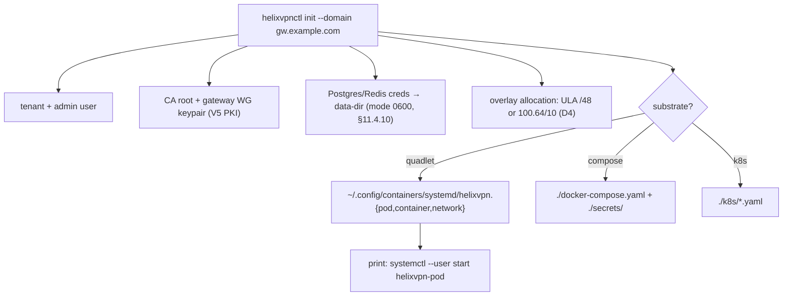

# helixvpnctl — the operator CLI (Cobra)

**Revision:** 1
**Last modified:** 2026-06-25T12:00:00Z

> Master technical specification — Volume 6 (Deployment, Tooling & Operations), nano-detail
> document. Scope: the **`helixvpnctl` operator CLI** — the Cobra command binary that is both the
> homelab front door (`init` + `systemctl start` = a running gateway) and the GitOps front door
> (`policy set`/`policy compile`). This deepens [05-overview §5] into a full command-by-command
> spec: the command tree, per-command flags / inputs / outputs / exit codes, how each command
> talks to `svc-api` over device-or-operator mTLS, credentials handling (§11.4.10), and concrete
> `--help` sketches per command. It is a SPEC: command surfaces and skeletons are illustrative of
> the contract, not the shipping implementation (2–3 refinement passes follow).
>
> Evidence cited inline by id: **[05_OV §N]** = `05-repo-layout-tooling-and-helix-ecosystem.md`;
> **[API §N]** = `v03-control-plane/svc-api.md`; **[PROTO §N]** =
> `v03-control-plane/protobuf-spec.md`; **[04_P1 §9]** = `HelixVPN-Phase1-MVP.md` (`helixvpnctl`
> + quadlets); **[04_ARCH §4.7]** = the operator-CLI-over-bash-scripts decision. Unproven facts
> are marked **UNVERIFIED** per §11.4.6 — never fabricated.

---

## 0. What this document owns (and does not)

This document owns the **`helixvpnctl` command surface**: the full command tree, every command's
flags / stdin / stdout / exit code, the auth/transport to `svc-api`, the credential-file
discipline, and the per-command `--help` text. It owns the CLI's *behavior contract* — what the
operator types and what comes back.

It does **not** own: the REST routes themselves (canonical in [API §3]); the `Coordinator`
`.proto` (canonical in [PROTO §1]); the deploy-substrate render output (those are
[`podman-quadlets.md`](podman-quadlets.md) / [`docker-compose.md`](docker-compose.md) /
[`kubernetes.md`](kubernetes.md)); the policy compiler internals (Volume 3 `svc-policy.md`). The
CLI is a **thin client** of the REST surface — it never re-implements server logic, only invokes
it. Where it renders deploy units, it delegates to the `containers` submodule + the substrate
docs.

---

## 1. Positioning: one binary replaces a pile of bash

`helixvpnctl` replaces the original deployment doc's pile of bash install scripts with one Go
binary [04_ARCH §4.7, 04_P1 §9]. Two front doors:

- **Homelab front door** — `helixvpnctl init --domain gw.example.com` bootstraps a single-node
  gateway (tenant, CA, keys, creds, deploy units), and `systemctl --user start helixvpn-pod`
  brings it up.
- **GitOps front door** — `helixvpnctl policy set ./policy.jsonc` dry-run-compiles → persists →
  emits `policy.updated`, so policy lives in a Git repo and applies declaratively.

It is built in `helix-go/cmd/helixvpnctl/` and ships from the `helix_deploy` repo after extraction
([repo-layout-and-decoupling §3.1]).

---

## 2. Command tree (complete)

```text
helixvpnctl
├── init              --domain --data-dir [--substrate quadlet|compose|k8s]   # §3
├── keys                                                                       # gateway WG key ops (§4)
│   ├── rotate        [--confirm]                                              #   rotate gateway WG keypair
│   └── show                                                                   #   print gateway WG public key
├── enroll-token      --kind client|connector [--site NAME] [--ttl DUR] [--qr] # §5 mint enrollment token
├── policy                                                                     # §6
│   ├── get           [--version N] [-o json|jsonc]                            #   fetch active/Nth policy
│   ├── set            ./policy.jsonc [--activate]                             #   submit (dry-run compile) [+ activate]
│   └── compile        ./policy.jsonc                                          #   dry-run compile ONLY (no persist)
├── device                                                                     # §7
│   ├── list          [--kind ...] [--online] [-o table|json]                  #   list tenant devices
│   └── revoke        <id> [--confirm]                                         #   revoke device (<1s edge enforce)
├── connector                                                                  # §8
│   ├── list          [-o table|json]                                          #   list connectors + advertised CIDRs
│   └── advertise     <id> --cidr CIDR[,CIDR...]                               #   set advertised CIDRs (declarative)
├── status            [-o table|json]                                          # §9 edge health + transport ladder
└── deploy                                                                     # §10 (delegates to substrate docs)
    ├── quadlet       --out DIR
    ├── compose       --out DIR
    └── kube          --out DIR
```

This refines [05_OV §5.1]: `policy apply`→`policy set`, `policy diff`→`policy compile`,
`gateway keys`→`keys rotate`/`keys show`, `gateway status`→`status`, `network advertise`→
`connector advertise`, and `join` is deferred to Phase 2 (fleet member join) — recorded as a
**visible reconciliation** (§11.4.35) so the two docs do not silently disagree on verb naming.

---

## 3. `init` — bootstrap a single-node gateway

```text
$ helixvpnctl init --help
Bootstrap a single-node HelixVPN gateway: tenant, admin, CA, gateway WG keys,
infra credentials, and the deploy units for the chosen substrate.

Usage:
  helixvpnctl init --domain <FQDN> [flags]

Flags:
      --domain string      public gateway FQDN (REQUIRED), e.g. gw.example.com
      --data-dir string    state + secrets dir (default "/var/lib/helixvpn")
      --substrate string   quadlet|compose|k8s  (default "quadlet")   # §11.4.76/.161 canonical=quadlet
      --overlay string     ula|cgnat overlay mode (default "ula")     # D4: ULA /48 vs 100.64/10
      --force              re-run on a non-empty data-dir (backs up first, §9.2)
  -h, --help               help for init
```

**What `init` writes** (the artifact set [05_OV §5.3, 04_P1 §9]):



Skeleton [05_OV §5.2]:

```go
// helix-go/cmd/helixvpnctl/init.go  (illustrative)
func initCmd() *cobra.Command {
	var domain, dataDir, substrate, overlay string
	var force bool
	c := &cobra.Command{Use: "init", Short: "Bootstrap a single-node gateway",
		RunE: func(cmd *cobra.Command, _ []string) error {
			// 1. tenant + admin user + overlay /48 (or 100.64/10 — D4)
			// 2. CA root + first gateway WG keypair (V5 PKI)
			// 3. Postgres+Redis creds → data-dir (mode 0600, §11.4.10)
			// 4. render deploy units for the chosen substrate (default quadlet, §11.4.76)
			// 5. print:  systemctl --user start helixvpn-pod
			return bootstrap(domain, dataDir, substrate, overlay, force)
		}}
	c.Flags().StringVar(&domain, "domain", "", "public gateway FQDN (required)")
	c.Flags().StringVar(&dataDir, "data-dir", "/var/lib/helixvpn", "state + secrets dir")
	c.Flags().StringVar(&substrate, "substrate", "quadlet", "quadlet|compose|k8s")
	c.Flags().StringVar(&overlay, "overlay", "ula", "ula|cgnat")
	c.Flags().BoolVar(&force, "force", false, "re-run on non-empty data-dir (backs up first)")
	_ = c.MarkFlagRequired("domain")
	return c
}
```

**Exit codes:** `0` success; `2` invalid flags (missing `--domain`, bad substrate); `3` data-dir
non-empty without `--force`; `4` overlay allocation failed; `5` PKI/keygen failed; `6` substrate
render failed. **UNVERIFIED:** the exact numeric mapping above is a design default; it is fixed at
implementation time and surfaced in `--help` then.

---

## 4. `keys` — gateway WG key operations

```text
$ helixvpnctl keys rotate --help
Rotate the gateway WireGuard keypair. The new public key is pushed to the control
plane so the coordinator distributes it to every agent via WatchNetworkMap; old key
is retired after a grace window so in-flight tunnels re-handshake without a hard drop.

Usage:
  helixvpnctl keys rotate [--confirm]

Flags:
      --confirm   required for a destructive rotation (re-handshakes all agents)
```

- `keys rotate` is **destructive-ish** (every agent re-handshakes); it requires `--confirm`, and
  the rotation is reversible within the grace window (§11.4.101 — reversible + bounded blast
  radius → the CLI may proceed once confirmed, but never silently). Old key retained for a grace
  window (**UNVERIFIED:** default grace = the gateway's WG rekey interval; pinned in V5 PKI).
- `keys show` prints the current gateway WG **public** key (never the private key — C6; the
  private key never leaves the gateway). Exit `0`/`2`.

---

## 5. `enroll-token` — mint a device enrollment token

```text
$ helixvpnctl enroll-token --help
Mint a single-use, short-lived device enrollment token. The raw token is printed
ONCE (only its sha256 is persisted server-side, §11.4.10); re-fetching shows metadata only.

Usage:
  helixvpnctl enroll-token --kind <client|connector> [flags]

Flags:
      --kind string   client|connector  (REQUIRED)
      --site string   site label for a connector (optional)
      --ttl duration  token lifetime (default 15m, min 1m, max 24h)
      --qr            also print a QR PNG (base64) for Access/Connector scan
      --bind-user string   bind token to a user (omit => anonymous enroll, C6 privacy)
```

Maps to `POST /v1/enroll-tokens` [API §4.1]. Output (table form):

```text
ID        2f9a...           Kind       connector
Token     hvpn_e_3K9x...    (shown ONCE — store it now)
Expires   2026-06-25T13:15:00Z
QR        [PNG written to ./enroll-2f9a.png]   (with --qr)
```

`-o json` emits `{id, token, kind, expires_at, qr_png_b64}`. **Anti-bluff (§11.4.10):** the raw
`token` is the only place the secret ever appears; the CLI never writes it to a log, never echoes
it under `-o json` to a file without `0600` perms, and a subsequent `enroll-token list`
(metadata-only) cannot recover it. Exit `0`; `2` bad flags; `5` mint failed (server 4xx/5xx).

---

## 6. `policy` — GitOps policy front door

```text
$ helixvpnctl policy set --help
Submit a policy spec. ALWAYS dry-run-compiles first (fail-closed): a compile error
prints the structured PolicyCompileError and writes NOTHING. A clean compile persists
a new policy version. --activate also flips it active (atomic), triggering per-agent
deltas within the <1s convergence SLO.

Usage:
  helixvpnctl policy set <FILE.jsonc> [--activate]

Flags:
      --activate   activate the new version after a clean compile
```

| Subcommand | REST call [API §4.5] | Behavior |
|---|---|---|
| `policy compile FILE` | `POST /v1/policies` (dry-run path) | compile ONLY; print `CompileStats` + any `RouteConflict`; **persist nothing** |
| `policy set FILE` | `POST /v1/policies` | dry-run compile → on clean, persist a new version (inactive) |
| `policy set FILE --activate` | `POST /v1/policies` then `POST /v1/policies/:v/activate` | persist + atomic activate (emits `policy.compiled`) |
| `policy get [--version N]` | `GET /v1/policies` | fetch active (or Nth) policy as jsonc |

**Fail-closed evidence:** a bad spec exits non-zero and prints the `PolicyCompileError`
(`stage`/`field`/`reason`/`detail`) from [API §10.1], e.g.:

```text
$ helixvpnctl policy set ./policy.jsonc
POLICY COMPILE FAILED (422):
  stage:  resolve_hosts
  field:  acls[1].dst[0]
  reason: cidr_not_advertised
  detail: 10.2.0.0/24 is not advertised by any connector
nothing written.
```

Exit `0` clean; `1` compile failed (`policy_compile_failed`, nothing written); `2` bad flags/file;
`5` server/transport error. The dry-run-before-persist is the load-bearing fail-closed guarantee
[API §4.5] — the CLI never persists an uncompilable policy.

---

## 7. `device` — device lifecycle

```text
$ helixvpnctl device revoke --help
Revoke a device. The control plane sets devices.revoked_at + revokes the device cert,
emits device.revoked, force-closes the device's WatchNetworkMap stream, and the edge
drops the WG peer — all within the <1s convergence SLO.

Usage:
  helixvpnctl device revoke <DEVICE_ID> [--confirm]

Flags:
      --confirm   required (revocation is high-impact: the device loses access immediately)
```

| Subcommand | REST call [API §4.2/§4.3] | Behavior |
|---|---|---|
| `device list` | `GET /v1/devices` (cursor-paginated) | table: id, kind, name, overlay_ip, online, revoked |
| `device revoke <id>` | `POST /v1/devices/:id/revoke` (admin only) | `202 Accepted`; CLI then polls/streams for the `< 1s` enforcement confirmation |

`device list` flags: `--kind client|connector`, `--online`, `-o table|json`, `--limit` (≤200),
`--cursor`. The wg public key is **not** shown (need-to-know C4 — it is an agent-plane datum
delivered via `WatchNetworkMap`, not exposed to the operator CLI) [API §4.2]. Exit `0`; `2` bad
flags; `3` `--confirm` missing on revoke; `4` device not found (404); `5` server error.

---

## 8. `connector` — connector advertised routes

```text
$ helixvpnctl connector advertise --help
Set the COMPLETE set of CIDRs a connector serves (declarative, not a diff). Re-sending
the same set is a no-op. Overlapping CIDRs across connectors are accepted with a conflict
advisory (resolved via 4via6 site disambiguation, D4); a malformed CIDR is rejected.

Usage:
  helixvpnctl connector advertise <CONNECTOR_ID> --cidr <CIDR>[,<CIDR>...]

Flags:
      --cidr strings   complete declarative CIDR set (REQUIRED)
```

Maps to `POST /v1/connectors/:id/prefixes` (Console path) / `AdvertisePrefixes` [PROTO §1, API
§4]. `connector list` → `GET /v1/connectors` (table: device_id, site, prefixes, 4via6). The
declarative-not-diff semantics are load-bearing [PROTO §4.5]: the CLI sends the **complete** set,
the server diffs and emits `connector.prefixes.changed` only on real change. A malformed CIDR
exits `1` (`prefix_conflict`/`validation_failed`); an overlap exits `0` with a printed advisory.

---

## 9. `status` — gateway/edge health

```text
$ helixvpnctl status
GATEWAY  gw.example.com:443
  edge          UP        (helix-edge 1.0, readyz 200)
  control       UP        (helixd 1.0)
  postgres      UP        redis  UP
  overlay       fd7a:helix:91a3::/48   devices=7   connectors=2
  transport     ladder: [plain-udp, lwo, masque-h3]   active-default: plain-udp
```

Composes `GET /readyz` + `GET /v1/networks` + `ReportStatus`-derived presence [API §4.4/§4.7].
`-o json` emits the structured health object. Exit `0` all-up; `1` degraded (any component down —
`readyz` 503); `5` unreachable (transport error). The transport-ladder posture (which obfuscation
transports the gateway offers) is read-only here; the agent walks the ladder (Volume 2
`transport-selection-ladder.md`).

---

## 10. `deploy` — render substrate units (delegates to substrate docs)

```text
$ helixvpnctl deploy quadlet --out ~/.config/containers/systemd/
```

| Subcommand | Output | Substrate doc |
|---|---|---|
| `deploy quadlet --out DIR` | `*.pod *.container *.network` rootless units | [`podman-quadlets.md`](podman-quadlets.md) |
| `deploy compose --out DIR` | `docker-compose.yaml` + `secrets/` | [`docker-compose.md`](docker-compose.md) |
| `deploy kube --out DIR` | `*.yaml` (DaemonSet/Deployment/StatefulSet/Service/NetworkPolicy) | [`kubernetes.md`](kubernetes.md) |

`deploy` renders the three substrates from **one in-code spec** via the `containers` submodule's
`pkg/compose` primitives (§11.4.76, §11.4.81 cross-platform-parity: one source, per-substrate
render) [05_OV §6.3]. It never hand-maintains three divergent files. The unit/manifest content is
specified in the substrate docs, not here.

---

## 11. Talking to `svc-api` — auth, transport, config

### 11.1 Transport

`helixvpnctl` is a REST client of `svc-api` (the Gin surface [API §3]); on a freshly-`init`ed
single-node gateway it talks to `https://localhost:8443` over the loopback. Two auth modes:

| Mode | Credential | Used for | Source |
|---|---|---|---|
| Operator API token | `Authorization: Bearer hvpn_<...>` | all REST ops (`enroll-token`, `policy`, `device`, `connector`, `status`) | `init` writes an admin API token to the data-dir; `--token`/`$HELIXVPNCTL_TOKEN` override |
| Local admin (init only) | direct DB/PKI bootstrap (no network) | `init` (before the API is up) | the bootstrap path runs in-process, not over REST |

`init` is special: it runs the bootstrap **before** the API server exists, so it writes state +
secrets directly (in-process), not over REST. Every other command is an authenticated REST call
[API §6.1].

### 11.2 Credentials handling (§11.4.10) — load-bearing

```text
$HELIXVPNCTL_TOKEN          # bearer token (env, never logged)            ── highest precedence
--token <TOKEN>             # explicit flag (discouraged: shell history)
<data-dir>/helixvpnctl.token   # file, mode 0600 in a 0700 parent dir     ── default source
```

- The token is **never** printed, never logged, never echoed in error messages (§11.4.10). On a
  4xx auth error the CLI prints `invalid_token` (the server's `code`), never the token value.
- The data-dir token file is `chmod 600`, its parent `chmod 700`; the CLI refuses to read a
  token file with looser perms and prints a remediation hint.
- `enroll-token`'s minted secret and `policy get`'s output go to stdout; redirecting to a file is
  the operator's choice, but `-o json > file` is documented to `chmod 600` the target. The CLI
  itself writes no secret to any log path.
- A pre-store leak audit (§11.4.10.A) applies if the operator supplies a token to store: grep the
  tree + history for the value before writing, surface findings.

### 11.3 mTLS note

REST/operator calls use bearer auth over TLS, NOT device mTLS — device mTLS is the **agent**
plane (`WatchNetworkMap`/`AdvertisePrefixes`/`ReportStatus`, [API §6.3]). `helixvpnctl` is an
operator tool, not an agent, so it carries an operator API token, never a device cert [API §6.1].
The TLS server cert is verified against the gateway's CA (pinned in the data-dir after `init`).

---

## 12. Global flags & conventions

| Flag | Meaning |
|---|---|
| `--control URL` / `$HELIXVPNCTL_CONTROL` | control-plane base URL (default `https://localhost:8443`) |
| `--token` / `$HELIXVPNCTL_TOKEN` | operator API token (§11.2) |
| `-o, --output table\|json\|jsonc` | output format (default `table` for humans, `json` for scripts) |
| `--ca-file PATH` | override the pinned CA (default: data-dir CA) |
| `-v, --verbose` | extra diagnostics to stderr — NEVER the token (§11.4.10) |

**Exit-code convention (uniform):** `0` success; `1` domain failure (compile failed, degraded
status); `2` usage error (bad flags); `3` missing `--confirm` on a destructive op; `4` not-found
(404); `5` transport/server error (5xx/unreachable); `6` render/IO error. The mapping is stable so
scripts can branch on it (the GitOps front door depends on `policy set` exiting `1` on a bad spec).

---

## 13. Test points (§11.4.169 comprehensive test-type coverage)

Every PASS cites captured evidence (§11.4.5/.69/.107); integration drives a real Postgres+Redis
booted on demand via `vasic-digital/containers` (§11.4.76), never ad-hoc `docker run`.

| # | Test type (§11.4.169) | Target | Concrete assertion + evidence |
|---|---|---|---|
| K1 | unit | flag parsing + exit-code map (§12) | table-driven: every command's required-flag + exit-code paths |
| K2 | unit | credential never logged (§11.2) | `-v` output + error paths scanned: token value never appears (mutation injecting it → FAIL) |
| K3 | integration | `init` → quadlet render → `systemctl start` (MVP-DoD #1) | fresh `init`, start the pod, `status` GREEN; captured transcript |
| K4 | integration | `policy set` fail-closed (§6) | bad spec → exit 1 + `PolicyCompileError`, zero `policies` rows; clean spec → version persisted |
| K5 | integration | `enroll-token` single-use (§5) | minted token enrolls once; second use → enroll rejected (token consumed, [API §5.4]) |
| K6 | integration | `device revoke` < 1s (§7) | `revoke` 202 → stream force-close + WG-peer-gone measured < 1s; captured timer |
| K7 | security | token file perms (§11.2) | loose-perm token file → CLI refuses + hints; `0600`/`0700` enforced |
| K8 | security | no secret in `-o json` to world-readable file | `enroll-token -o json > f` documents/sets `0600`; mutation removing the perm guard → FAIL |
| K9 | e2e / full-automation | enroll-token → enroll → advertise → policy set --activate → status | the GitOps loop drives a real reachability change; captured evidence |
| K10 | meta-test (§1.1) | each gate paired | inject token into a log line / skip `--confirm` guard / persist on bad compile → each makes its gate FAIL |

---

## 14. Phase-2 forward seams

The `join --control URL --token T` command (a fleet member joining a multi-node control plane) is
deferred to Phase 2 [05_OV §5.1] — the single-node `init` path is the MVP. Phase 2 also adds
`policy` GitOps endpoints (policy-as-code with a watched repo), `keys` rotation scheduling, and a
`status --watch` live stream over `/v1/stream` [API §14]. Each is additive; the Phase-1 command
tree (§2) draws the verbs in the right shape so Phase-2 growth is new subcommands, not a rename.

---

## Sources verified

- `05-repo-layout-tooling-and-helix-ecosystem.md` §5 (`helixvpnctl` command tree, `init` skeleton
  + artifact set, deploy delegation), §6.3 (substrate render via containers submodule) — `[05_OV]`.
- `v03-control-plane/svc-api.md` §3 (REST route table), §4 (request/response schemas:
  enroll-tokens, devices, networks, policies), §4.5 (policy dry-run fail-closed), §5.4 (Enroll
  single-use), §6.1/§6.3 (authn: API token vs device mTLS), §10.1 (PolicyCompileError) — `[API]`.
- `v03-control-plane/protobuf-spec.md` §1 (Coordinator messages), §4.5 (AdvertisePrefixes
  declarative-not-diff), §4.7 (revoke mid-stream < 1s) — `[PROTO]`.
- `04_VPN_CLD/HelixVPN-Phase1-MVP.md` §9 (`helixvpnctl` + quadlets, init→systemctl start),
  `HelixVPN-Architecture-Refined.md` §4.7 (operator CLI replaces bash scripts) — `[04_P1] [04_ARCH]`.
- Constitution anchors: §11.4.10 (credentials handling — token never logged, file perms,
  pre-store audit), §11.4.10.A (pre-store leak audit), §11.4.76 (containers submodule for deploy
  render + test infra), §11.4.81 (cross-platform-parity — one source, three substrates), §11.4.101
  (autonomous-decision/reversible — `keys rotate --confirm`), §11.4.35 (visible reconciliation —
  verb renames vs §5.1), §11.4.6 (no-guessing — UNVERIFIED exit-code/grace marks), §11.4.169
  (test-type coverage), §1.1 (paired meta-test mutations).
