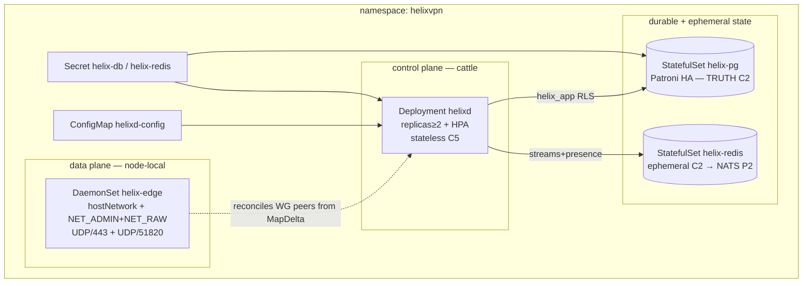
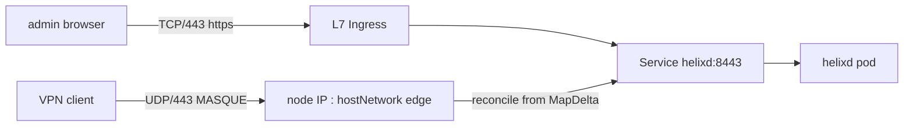

# Kubernetes deployment (fleet / Phase-2 HA substrate)

**Revision:** 2
**Last modified:** 2026-06-26T12:00:00Z

> Master technical specification — Volume 6 (Deployment, Tooling & Operations), nano-detail
> document `kubernetes.md`. Scope: the **Kubernetes substrate** for HelixVPN — plain
> manifests (Helm-less, kustomize-overlaid) that run the *same* OCI image set as the canonical
> Podman-quadlet substrate (`[05 §7]`, `05-repo-layout-tooling-and-helix-ecosystem.md`). It
> deepens `[05 §7.3]` (the K8s sketch + `D-K8S-EDGE-INGRESS`) to implementation-ready
> nano-detail: a stateless `helixd` `Deployment` + HPA, a Patroni/StatefulSet Postgres, a
> Redis (→ NATS JetStream Phase-2) backing store, a privileged `helix-edge` `DaemonSet`, the
> `NetworkPolicy` default-deny mesh, `ConfigMap`/`Secret` wiring, and the load-bearing
> **gateway-needs-kernel-net** caveat. K8s is an **equivalence target**, not the canonical
> substrate (Podman quadlets are canonical per §11.4.76/.161); it is recommended only for
> multi-region fleets `[05 §7.4]`. This is a SPEC (describe the implementation; do not build
> the product). Evidence cited inline: `[05 §N]` overview, `[svc-coordinator §N]`,
> `[svc-telemetry §N]`, `[svc-events §N]`, `[research-podman_k8s]` (the Podman-Quadlet /
> Kubernetes-for-WireGuard deep-research thread, verified against latest official sources per
> §11.4.99). Unproven facts are marked `UNVERIFIED` per §11.4.6 — never fabricated.

---

## Table of contents

- [0. Why K8s exists in this spec, and what it must NOT regress](#0-why-k8s-exists-in-this-spec-and-what-it-must-not-regress)
- [1. Namespace, topology & the one image set](#1-namespace-topology--the-one-image-set)
- [2. ConfigMap & Secret wiring (the env contract)](#2-configmap--secret-wiring-the-env-contract)
- [3. Postgres — StatefulSet / Patroni (the only durable truth)](#3-postgres--statefulset--patroni-the-only-durable-truth)
- [4. Redis / NATS — the ephemeral event + presence backing store](#4-redis--nats--the-ephemeral-event--presence-backing-store)
- [5. helixd — the stateless control-plane Deployment + HPA](#5-helixd--the-stateless-control-plane-deployment--hpa)
- [6. helix-edge — the privileged data-plane DaemonSet (the kernel-net caveat)](#6-helix-edge--the-privileged-data-plane-daemonset-the-kernel-net-caveat)
- [7. Services, ingress & the UDP problem](#7-services-ingress--the-udp-problem)
- [8. NetworkPolicy default-deny mesh](#8-networkpolicy-default-deny-mesh)
- [9. Probes, PodDisruptionBudgets & rollout discipline](#9-probes-poddisruptionbudgets--rollout-discipline)
- [10. Generation, parity & anti-bluff evidence](#10-generation-parity--anti-bluff-evidence)
- [11. UNVERIFIED register](#11-unverified-register)
- [Sources verified](#sources-verified)

---

## 0. Why K8s exists in this spec, and what it must NOT regress

The K8s substrate exists for **one** operator profile: the multi-region fleet that already runs
Kubernetes and wants HelixVPN coordinators to scale horizontally behind a load balancer
`[05 §7.4]`. It is NOT the canonical path (Podman quadlets are, §11.4.76/.161) and NOT
recommended for homelab/single-VPS buyers. The non-negotiable invariants K8s must preserve,
inherited from the control-plane spec `[svc-coordinator §0]`:

| # | Invariant | K8s consequence |
|---|---|---|
| C1 | Go never in the packet path (fail-static) | the **edge** (Rust) carries packets, not `helixd`; a `helixd` rollout never drops a live tunnel |
| C2 | Postgres = truth; Redis = ephemeral | Postgres is the only `StatefulSet` whose `PersistentVolume` is load-bearing; Redis/NATS PVs are disposable |
| C5 | push-don't-poll, convergence p99 < 1 s | `helixd` replicas are **stateless** — each rebuilds its graph from Postgres + the event bus on boot `[svc-coordinator §10(c)]`, so K8s may scale/restart them freely |
| C8 | RLS at the DB | `helixd` connects as the non-superuser `helix_app` role (FORCE RLS), never the owner |

> **The load-bearing fact that makes K8s viable:** the coordinator is *stateless on disk*
> `[svc-coordinator §0]` — "the graph is rebuilt from Postgres + events on boot (R2 makes this
> true today), so K8s replicas need no sticky state" `[svc-coordinator §10(c)]`. This is why
> `helixd` is a `Deployment` (cattle), Postgres is a `StatefulSet` (pet), and HPA is safe.

---

## 1. Namespace, topology & the one image set

All three substrates run the same OCI images `[05 §7]`: `helixd` (control plane), `helix-edge`
(data plane), stock `postgres:16`, stock `redis:7` (→ `nats:2` JetStream in Phase 2). Images are
tagged `<PREFIX>-<version>` to match the release-prefix mandate (`helix_vpn-…`, §11.4.151,
`[05 §9]`).



`kubectl apply -k deploy/k8s/overlays/<env>` is the entry point; the base lives at
`deploy/k8s/` and is generated by `helixvpnctl deploy kube` through the `containers` submodule
primitives so the three substrates derive from one in-code spec, not three hand-maintained
files (§11.4.81 cross-platform-parity, `[05 §6.3(B)]`).

---

## 2. ConfigMap & Secret wiring (the env contract)

The env contract is identical across substrates `[05 §7.1/§7.2]`: `DATABASE_URL` (non-superuser
`helix_app` → RLS enforced, `[svc-coordinator §0]`), `REDIS_URL`, and a podman/k8s Secret for the
DB password. No secret is ever inlined in a manifest (§11.4.10).

```yaml
# deploy/k8s/base/configmap.yaml
apiVersion: v1
kind: ConfigMap
metadata: { name: helixd-config, namespace: helixvpn }
data:
  HELIX_RELEASE_PREFIX: "helix_vpn"                 # §11.4.151 — matches image tag
  DATABASE_URL: "postgres://helix_app@helix-pg-rw:5432/helix?sslmode=require"
  REDIS_URL: "redis://helix-redis:6379"
  METRICS_BIND: ":9090"                             # /metrics on the internal port, NOT 443 [svc-telemetry §8.3]
  LOG_LEVEL: "info"
---
# deploy/k8s/base/secret.example.yaml   (RENDERED from a k8s Secret backend, never committed plaintext §11.4.10/.30)
apiVersion: v1
kind: Secret
metadata: { name: helix-db, namespace: helixvpn }
type: Opaque
stringData:
  password: "<from external secret store — Sealed Secrets / External Secrets Operator>"
```

> **Secret sourcing (UNVERIFIED choice).** The MVP does NOT mandate a specific secret backend.
> Recommended: External Secrets Operator or Sealed Secrets so the `deploy/k8s` tree carries
> *references*, never plaintext (the §11.4.77 regeneration mechanism = "re-pull from the cluster
> secret store"). The literal `stringData` above is an example shape, not a committed value.

`helix_app` is the **non-superuser** request-path role with `FORCE ROW LEVEL SECURITY`
`[svc-telemetry §4.1, data-model-ddl]`; the owner role `helix_owner` runs migrations only and is
never the `DATABASE_URL` principal for `helixd`.

---

## 3. Postgres — StatefulSet / Patroni (the only durable truth)

Postgres is the single source of truth (C2). In a real fleet it MUST be HA. Two options,
recommendation explicit per §11.4.66:

> **Decision D-K8S-PG-HA (options + recommendation).**
> **(a)** **Patroni operator** (e.g. the Postgres Operator / CloudNativePG) managing a primary +
> ≥2 replicas with automatic failover + streaming replication.
> **(b)** **External managed Postgres** (RDS/Cloud SQL/Crunchy) referenced by `DATABASE_URL`,
> Postgres entirely outside the cluster.
> **(c)** **Single-replica `StatefulSet`** (the `[05 §7.3]` sketch) — DEV/SINGLE-REGION ONLY, no HA.
> **Recommended:** **(a) Patroni/CloudNativePG** for self-managed fleets (keeps the failover story
> in-cluster, see `ha-and-multiregion.md §3`); **(b)** for teams that already run managed PG.
> **(c)** is explicitly NOT production-grade — it is the single-node parity build only.

```yaml
# deploy/k8s/base/pg-cnpg.yaml — CloudNativePG cluster (recommended HA, option a)
apiVersion: postgresql.cnpg.io/v1
kind: Cluster
metadata: { name: helix-pg, namespace: helixvpn }
spec:
  instances: 3                                   # 1 primary + 2 hot-standby (sync replication)
  storage: { size: 20Gi }
  postgresql:
    parameters:
      max_connections: "200"
      wal_level: "replica"
    pg_hba:
      - "hostssl helix all all scram-sha-256"     # sslmode=require honoured (DATABASE_URL §2)
  bootstrap:
    initdb:
      database: helix
      owner: helix_owner                          # owner runs migrations
      postInitSQL:
        - "CREATE ROLE helix_app LOGIN;"          # non-superuser request role (RLS floor C8)
        - "ALTER DATABASE helix SET row_security = on;"
  managed:
    services:
      additional:
        - { selectorType: rw, serviceTemplate: { metadata: { name: helix-pg-rw } } }  # primary
        - { selectorType: ro, serviceTemplate: { metadata: { name: helix-pg-ro } } }  # read replicas
```

The `helix-pg-rw` Service (primary) is the `DATABASE_URL` host (§2). `helixd` only ever needs the
read-write endpoint (all control-plane writes go to the primary; the coordinator's reads are
boot-time hydration `[svc-coordinator §1.4]`, small enough to take from the primary in the MVP).
Read-replica routing of hydration reads is a Phase-2 optimization (`ha-and-multiregion.md §3.4`),
not asserted here.

The plain single-replica `StatefulSet` form (option c) is retained verbatim from `[05 §7.3]` for
the single-region parity build:

```yaml
# deploy/k8s/overlays/single-region/pg-statefulset.yaml  (option c — NO HA, dev/parity only)
apiVersion: apps/v1
kind: StatefulSet
metadata: { name: helix-pg, namespace: helixvpn }
spec:
  serviceName: helix-pg
  replicas: 1                                      # → Patroni/CNPG for real fleets (D-K8S-PG-HA)
  volumeClaimTemplates:
    - metadata: { name: data }
      spec: { accessModes: ["ReadWriteOnce"], resources: { requests: { storage: 20Gi } } }
  template:
    spec:
      containers:
        - name: postgres
          image: docker.io/library/postgres:16
          env:
            - { name: POSTGRES_USER, value: helix_owner }
            - { name: POSTGRES_DB,   value: helix }
            - name: POSTGRES_PASSWORD
              valueFrom: { secretKeyRef: { name: helix-db, key: password } }
          volumeMounts: [{ name: data, mountPath: /var/lib/postgresql/data }]
```

---

## 4. Redis / NATS — the ephemeral event + presence backing store

Redis carries the event streams `[svc-events §4]` and the TTL presence keys
`[svc-telemetry §5]`. **Losing it loses no durable state (C2)** — on recovery the coordinator
rehydrates from Postgres and the outbox re-relays `[svc-events §7.4]`. Therefore its PV is
disposable; a single replica is acceptable in the MVP, with the Phase-2 swap to NATS JetStream
behind the same `events.Bus` interface (D3, `[svc-events §10]`).

```yaml
# deploy/k8s/base/redis.yaml — ephemeral C2 backing store (Phase-1)
apiVersion: apps/v1
kind: StatefulSet
metadata: { name: helix-redis, namespace: helixvpn }
spec:
  serviceName: helix-redis
  replicas: 1                                      # ephemeral C2 — loss is recoverable, no HA needed in P1
  template:
    spec:
      containers:
        - name: redis
          image: docker.io/library/redis:7
          args: ["--notify-keyspace-events", "Ex"]  # presence expiry → device.offline [svc-telemetry §5.3]
          ports: [{ containerPort: 6379 }]
          securityContext: { runAsNonRoot: true, readOnlyRootFilesystem: true, allowPrivilegeEscalation: false }
  volumeClaimTemplates:
    - metadata: { name: data }
      spec: { accessModes: ["ReadWriteOnce"], resources: { requests: { storage: 2Gi } } }
```

> **`notify-keyspace-events Ex` is mandatory**, not optional: the presence reaper subscribes to
> `__keyevent@<db>__:expired` so an expired presence key still emits `device.offline`
> `[svc-telemetry §5.3]`; without it a lapsed device stays falsely "online" (the §11.4.144
> corpus-hole class). The belt-and-suspenders sweeper `[svc-telemetry §5.3]` covers the
> documented best-effort-delivery gap of keyspace notifications.

The Phase-2 NATS JetStream form (durable, clustered, multi-region) is specified in
`ha-and-multiregion.md §4`; the `Bus` interface makes it a transport change, not a rewrite
`[svc-events §10]`.

---

## 5. helixd — the stateless control-plane Deployment + HPA

`helixd` is a **`Deployment`** (not a `StatefulSet`) precisely because the coordinator is
stateless-on-disk `[svc-coordinator §10(c)]`. Each replica joins the event-bus consumer groups
with a distinct consumer name (the pod name = `hostID`, `[svc-events §3.1]`) so work is
partitioned across replicas, not duplicated. The outbox relay uses `FOR UPDATE SKIP LOCKED` so
every replica can run the relay loop safely `[svc-events §5.2]`.

```yaml
# deploy/k8s/base/helixd-deployment.yaml
apiVersion: apps/v1
kind: Deployment
metadata: { name: helixd, namespace: helixvpn }
spec:
  replicas: 2                                      # stateless coordinators → HA [svc-coordinator §10c]
  strategy: { type: RollingUpdate, rollingUpdate: { maxUnavailable: 0, maxSurge: 1 } }
  selector: { matchLabels: { app: helixd } }
  template:
    metadata:
      labels: { app: helixd }
      annotations: { prometheus.io/scrape: "true", prometheus.io/port: "9090" }
    spec:
      serviceAccountName: helixd
      containers:
        - name: helixd
          image: ghcr.io/helixdevelopment/helixd:helix_vpn-1.0   # §11.4.151 prefixed
          envFrom: [{ configMapRef: { name: helixd-config } }]
          env:
            - name: PGPASSWORD
              valueFrom: { secretKeyRef: { name: helix-db, key: password } }
            - name: HELIX_HOST_ID                  # = pod name → unique consumer name [svc-events §3.1]
              valueFrom: { fieldRef: { fieldPath: metadata.name } }
          ports:
            - { name: api,     containerPort: 8443 }   # agent/app API (Connect + REST)
            - { name: metrics, containerPort: 9090 }   # /metrics — internal only [svc-telemetry §8.3]
          readinessProbe:                              # /readyz: PG + Redis reachable [svc-telemetry §8.2]
            httpGet: { path: /readyz, port: 9090 }
            periodSeconds: 5
          livenessProbe:                               # /healthz: dependency-FREE (DB blip ≠ restart) [svc-telemetry §8.2]
            httpGet: { path: /healthz, port: 9090 }
            periodSeconds: 10
          resources:
            requests: { cpu: "250m", memory: "256Mi" }
            limits:   { cpu: "2",    memory: "1Gi" }   # 24h-soak slope≈0 [svc-coordinator §7.3]
          securityContext:
            readOnlyRootFilesystem: true
            runAsNonRoot: true
            allowPrivilegeEscalation: false
            capabilities: { drop: ["ALL"] }            # control plane needs ZERO capabilities (C1)
```

```yaml
# deploy/k8s/base/helixd-hpa.yaml
apiVersion: autoscaling/v2
kind: HorizontalPodAutoscaler
metadata: { name: helixd, namespace: helixvpn }
spec:
  scaleTargetRef: { apiVersion: apps/v1, kind: Deployment, name: helixd }
  minReplicas: 2
  maxReplicas: 10
  metrics:
    - type: Resource
      resource: { name: cpu, target: { type: Utilization, averageUtilization: 70 } }
    # Custom-metric option (UNVERIFIED — needs Prometheus Adapter): scale on open WatchNetworkMap streams.
    # - type: Pods
    #   pods: { metric: { name: helix_open_watch_streams }, target: { type: AverageValue, averageValue: "5000" } }
```

> **Readiness vs liveness split is load-bearing `[svc-telemetry §8.2]`:** `/healthz` MUST be
> dependency-free (a Postgres blip must not trigger a pod-restart loop, fail-static C1);
> `/readyz` gates *new* traffic only (removes the pod from the Service when PG/Redis are
> unreachable, but existing `WatchNetworkMap` streams keep serving from the in-mem graph). Wiring
> a DB-dependent liveness probe here would be a correctness regression.

> **HPA on a custom metric is UNVERIFIED.** CPU-based HPA is standard and asserted. Scaling on
> `helix_open_watch_streams` `[svc-telemetry §3.2]` requires the Prometheus Adapter and is left
> commented — recommended for stream-bound workloads but not validated in this writing context.

---

## 6. helix-edge — the privileged data-plane DaemonSet (the kernel-net caveat)

The edge is the one privileged workload. It terminates MASQUE/QUIC on UDP/443 and plain-WG on
UDP/51820, and programs **kernel** WireGuard peers from the coordinator's `MapDelta`. This is
the **gateway-needs-kernel-net caveat** that shapes the entire K8s story:

> **The kernel-net caveat (the reason the edge is special).** WireGuard and MASQUE are **UDP** and
> require kernel network capability — `NET_ADMIN` to create/configure the `wg` interface and
> program AllowedIPs, **plus `NET_RAW`** for the kernel-mode WireGuard fast path
> (`[research-podman_k8s §2]`, CONFIRMED), plus the packet path must reach the node's real UDP
> socket `[05 §7.3]`. A normal pod behind a `ClusterIP`/L7 ingress **cannot** carry this: most
> cloud L7 ingress can't forward UDP, and an extra NAT hop breaks the WG endpoint model. Therefore
> the edge runs as a **`DaemonSet` with `hostNetwork: true`** so UDP/443 lands directly on the node
> IP (the node IP *is* the gateway IP), with `capabilities: add: [NET_ADMIN, NET_RAW]` (the
> canonical set — `[podman-quadlets §3.2, research-podman_k8s §2]`) and everything else dropped,
> plus a `/dev/net/tun` hostPath device for the userspace `boringtun` fallback (§11). This is
> `D-K8S-EDGE-INGRESS` option (a), recommended for self-host-on-k8s parity with the quadlet model
> `[05 §7.3]`.

> **Reconciled (§11.4.35, 2026-06-26):** the edge capability set here is now the **canonical
> `{NET_ADMIN, NET_RAW}` + `/dev/net/tun`** shared by all four Volume-6 substrates (quadlets,
> Compose, this doc) and the [`security` privesc scan](helix-ecosystem-integration.md). The earlier
> "ONLY NET_ADMIN" reading in this doc + the architecture diagram + the privesc-scan assertion was
> the under-specified side: `[research-podman_k8s §2]` confirms (3 cited sources) that kernel-mode
> WireGuard — the edge's primary fast path — needs **both** `NET_ADMIN` **and** `NET_RAW`, so the
> previous K8s set could not satisfy the quadlet/Compose `Q4`/`DC4` gates **and** the security scan
> simultaneously. They now all assert the same set (§11.4.6).

```yaml
# deploy/k8s/base/edge-daemonset.yaml — DATA PLANE (privileged-minimal)
apiVersion: apps/v1
kind: DaemonSet
metadata: { name: helix-edge, namespace: helixvpn }
spec:
  selector: { matchLabels: { app: helix-edge } }
  template:
    metadata: { labels: { app: helix-edge } }
    spec:
      hostNetwork: true                            # UDP/443 on the node IP (kernel-net caveat)
      dnsPolicy: ClusterFirstWithHostNet
      nodeSelector: { helixvpn.io/edge: "true" }   # only nodes labelled as gateways run the edge
      tolerations: [{ key: helixvpn.io/edge, operator: Exists, effect: NoSchedule }]
      containers:
        - name: edge
          image: ghcr.io/helixdevelopment/helix-edge:helix_vpn-1.0
          securityContext:
            readOnlyRootFilesystem: true
            allowPrivilegeEscalation: false
            # canonical set: NET_ADMIN + NET_RAW (kernel-mode WG fast path)
            # [podman-quadlets.md §3.2, research-podman_k8s §2 — CONFIRMED]
            capabilities: { drop: ["ALL"], add: ["NET_ADMIN", "NET_RAW"] }
          ports:
            - { name: masque, containerPort: 443,   protocol: UDP, hostPort: 443 }
            - { name: wg,     containerPort: 51820, protocol: UDP, hostPort: 51820 }
          env:
            - { name: HELIXD_ADDR, value: "helixd:8443" }   # edge dials the control-plane Service for its stream
          volumeMounts:
            - { name: tun, mountPath: /dev/net/tun }          # userspace boringtun fallback (§11 / U2)
      volumes:
        - name: tun                                            # host TUN device for the module-less-node fallback
          hostPath: { path: /dev/net/tun, type: CharDevice }
```

> **UNVERIFIED — kernel WireGuard module availability.** `hostNetwork` + `NET_ADMIN`+`NET_RAW`
> lets the edge program kernel WG, but the *kernel* `wireguard` module must be present on the node
> (or the `boringtun` userspace fallback used, `[SYNTHESIS §2]`, referenced from `helix-core`).
> Whether the target node kernels ship the module is cluster-specific and MUST be verified per
> fleet, never assumed (§11.4.6/§11.4.133). The edge image carries the userspace fallback **and the
> DaemonSet mounts `/dev/net/tun` (the `tun` hostPath volume above)** so a module-less node can
> actually run `boringtun` — without that device the cited fallback could not open its TUN. The
> fallback still functions at a performance cost; its data-plane internals are the data-plane
> spec's concern, asserted here only as the documented mitigation with its substrate prerequisite
> wired.

Alternative ingress options (record, not silently dropped) per `D-K8S-EDGE-INGRESS` `[05 §7.3]`:
**(b)** `Service type=LoadBalancer` with a **UDP-capable** LB (MetalLB on-prem, NLB on AWS) — for
managed-cloud fleets where node-IP-as-gateway-IP is undesirable; **(c)** `NodePort` UDP for
homelab-on-k8s. Recommended: **(a)** for self-host parity, **(b)** for managed fleets.

---

## 7. Services, ingress & the UDP problem

```yaml
# deploy/k8s/base/services.yaml
apiVersion: v1
kind: Service                                       # control-plane API (TCP, ClusterIP — internal)
metadata: { name: helixd, namespace: helixvpn }
spec:
  selector: { app: helixd }
  ports: [{ name: api, port: 8443, targetPort: 8443 }]
  type: ClusterIP
---
apiVersion: v1
kind: Service                                       # metrics (TCP, internal scrape only [svc-telemetry §8.3])
metadata:
  name: helixd-metrics
  namespace: helixvpn
  labels: { app: helixd }
spec:
  selector: { app: helixd }
  ports: [{ name: metrics, port: 9090 }]
  type: ClusterIP
```

The agent/app API (`helixd:8443`, TCP, Connect-RPC + REST) is a normal `ClusterIP` and MAY sit
behind an L7 ingress for the Console/REST surface. The **edge UDP ingress does NOT use a
Service** in option (a) — it binds the host port directly (§6). This asymmetry — TCP control
plane behind ingress, UDP data plane on `hostNetwork` — is the structural consequence of the
kernel-net caveat and is the single most important thing to get right when porting to K8s.



---

## 8. NetworkPolicy default-deny mesh

Zero-trust at the pod mesh (C4 spirit applied to the cluster): default-deny, then allow only the
exact flows. `NetworkPolicy` requires a CNI that enforces it (Calico/Cilium) — **UNVERIFIED** for
any given cluster; flagged.

```yaml
# deploy/k8s/base/netpol.yaml
apiVersion: networking.k8s.io/v1
kind: NetworkPolicy
metadata: { name: default-deny, namespace: helixvpn }
spec: { podSelector: {}, policyTypes: [Ingress, Egress] }   # deny all, then allow below
---
apiVersion: networking.k8s.io/v1
kind: NetworkPolicy
metadata: { name: helixd-egress, namespace: helixvpn }
spec:
  podSelector: { matchLabels: { app: helixd } }
  policyTypes: [Egress]
  egress:
    - to: [{ podSelector: { matchLabels: { cnpg.io/cluster: helix-pg } } }]   # → Postgres 5432
      ports: [{ protocol: TCP, port: 5432 }]
    - to: [{ podSelector: { matchLabels: { app: helix-redis } } }]            # → Redis 6379
      ports: [{ protocol: TCP, port: 6379 }]
---
apiVersion: networking.k8s.io/v1
kind: NetworkPolicy
metadata: { name: helixd-ingress, namespace: helixvpn }
spec:
  podSelector: { matchLabels: { app: helixd } }
  policyTypes: [Ingress]
  ingress:
    - from: [{ podSelector: { matchLabels: { app: helix-edge } } }]   # edge dials its stream
      ports: [{ protocol: TCP, port: 8443 }]
    - from: [{ namespaceSelector: { matchLabels: { name: monitoring } } }]  # Prometheus scrape
      ports: [{ protocol: TCP, port: 9090 }]
```

> The `helix-edge` `DaemonSet` runs on `hostNetwork`, so `NetworkPolicy` does **NOT** govern its
> UDP/443 ingress (host-network pods bypass pod-network policy) — node-level firewalling
> (the host's `nftables`, owned by the data-plane/security spec) governs that path instead. This
> is a real, UNVERIFIED-in-the-general-case boundary worth calling out: pod NetworkPolicy
> protects the control plane; host firewalling protects the edge.

---

## 9. Probes, PodDisruptionBudgets & rollout discipline

```yaml
# deploy/k8s/base/pdb.yaml
apiVersion: policy/v1
kind: PodDisruptionBudget
metadata: { name: helixd, namespace: helixvpn }
spec: { minAvailable: 1, selector: { matchLabels: { app: helixd } } }
```

- **Rollout:** `maxUnavailable: 0, maxSurge: 1` (§5) so a `helixd` rollout never drops below the
  replica count — combined with the stateless property, agents whose stream lands on a draining
  pod reconnect by `known_version` against any other replica and resume with deltas, not a full
  snapshot `[svc-coordinator §3.2/§10(d)]`. A rollout is therefore a brief stream-reconnect, never
  a convergence outage.
- **PDB** keeps ≥1 `helixd` during voluntary disruptions (node drain).
- **Postgres** (CNPG) carries its own PDB + switchover semantics from the operator; do NOT hand-roll
  a PDB that fights the operator (a documented anti-pattern, deferred to `ha-and-multiregion.md §3`).
- **Edge** is a `DaemonSet`: it has no PDB (one per node); draining a gateway node drains its
  tunnels — that failover is the `ha-and-multiregion.md §5` anycast/geoDNS story, not a pod concern.

---

## 10. Generation, parity & anti-bluff evidence

K8s manifests are **generated**, not hand-maintained, from the same in-code spec as quadlets +
compose via `helixvpnctl deploy kube` through `containers/pkg/compose` `[05 §6.3(B)]` — one
source, three renders (§11.4.81). The parity + correctness claims carry captured-evidence proofs
(§11.4.5/§11.4.69, extending `[05 §11]`):

| Claim | Captured-evidence proof |
|---|---|
| quadlet/compose/k8s run the SAME image & env contract (§1) | three substrates boot the gateway; `helixvpnctl gateway status` GREEN on each; recorded per §11.4.159 `[05 §11]` |
| `helixd` is genuinely stateless (§5) | kill a replica mid-stream → agents resume by `known_version` on another replica, no full resync `[svc-coordinator §8.2-10]`; before/after stream transcript |
| edge UDP/443 reaches the node (§6) | from an external client, MASQUE handshake completes against the node IP; packet capture of the QUIC initial on UDP/443 |
| RLS holds under K8s `helix_app` (§2) | `helixd` pod cannot read tenant B's rows even with a crafted query (FORCE RLS) `[svc-telemetry §10 T-STORE-1]` |
| NetworkPolicy default-deny enforced (§8) | a pod not in an allow rule cannot reach `helixd:8443` (probe denied); paired mutation removing the egress rule → PG connection FAILs |
| no `/metrics` on public 443 (§7) | scan: `:9090` reachable only intra-cluster; `:443` carries no Prometheus exposition `[svc-telemetry §8.3]` |

Integration tests that *claim* to exercise the K8s substrate MUST actually stand up a cluster
(kind/k3d booted on-demand via the `containers` submodule, §11.4.76) — a manifest-lint-only PASS
that never applies the manifests is a §11.4 bluff (§11.4.38 installable-asset evidence).

---

## 11. UNVERIFIED register

Per §11.4.6, every claim not validated in this writing context is enumerated here rather than
silently asserted:

| # | UNVERIFIED item | Why / mitigation |
|---|---|---|
| U1 | Custom-metric HPA on `helix_open_watch_streams` (§5) | needs Prometheus Adapter; CPU HPA is the asserted default |
| U2 | Kernel `wireguard` module present on edge nodes (§6) | cluster-specific; `boringtun` userspace fallback is the documented mitigation; verify per fleet (§11.4.133) |
| U3 | CNI enforces `NetworkPolicy` (§8) | requires Calico/Cilium-class CNI; default kube-proxy alone does not enforce it |
| U4 | UDP `LoadBalancer` availability (§6 option b) | MetalLB/NLB-dependent; option (a) hostNetwork has no such dependency |
| U5 | External secret backend choice (§2) | not mandated; ESO/Sealed-Secrets recommended; example `stringData` is illustrative only |
| U6 | CloudNativePG vs Patroni-operator exact pick (§3) | both satisfy D-K8S-PG-HA(a); the manifest shows CNPG as the concrete example, not the only valid operator |

None of these is fabricated as "done"; each is a real boundary the operator must close per cluster.

---

## Sources verified

- `05-repo-layout-tooling-and-helix-ecosystem.md` §7 (three substrates, one image set), §7.3
  (the K8s sketch + `D-K8S-EDGE-INGRESS` UDP ingress decision), §7.4 (substrate recommendation
  matrix), §6.3(B) (generation through `containers/pkg/compose`), §9 (release-prefix on images),
  §11 (anti-bluff evidence plan) — `[05]`.
- `v03-control-plane/svc-coordinator.md` §0 (C1/C2/C5/C8 invariants), §1.4 (boot hydration),
  §3.2 (`known_version` resume), §10(c)/(d) (stateless, K8s-replica-safe forward seam),
  §7.3 (SLO + memory soak) — `[svc-coordinator]`.
- `v03-control-plane/svc-telemetry.md` §3.2 (`helix_open_watch_streams` etc.), §5.3 (presence
  expiry → `device.offline`, `notify-keyspace-events Ex`), §8.2 (liveness vs readiness probe
  contract), §8.3 (`/metrics` internal-only scrape isolation), §4.1 (`helix_app` FORCE RLS),
  §10 T-STORE-1 (RLS denial evidence) — `[svc-telemetry]`.
- `v03-control-plane/svc-events.md` §3.1 (consumer name = hostID, per-replica partitioning),
  §5.2 (`FOR UPDATE SKIP LOCKED` relay safe on every replica), §7.4 (cold-boot rehydration from
  Postgres), §10 (NATS JetStream swap behind the `Bus` interface) — `[svc-events]`.
- `v03-control-plane/data-model-ddl.md` (the `helix_app` non-superuser role + FORCE RLS the
  `DATABASE_URL` relies on) — referenced for the role contract.
- `[research-podman_k8s]` — Kubernetes UDP ingress for WireGuard (hostNetwork `DaemonSet` vs
  UDP `LoadBalancer`/MetalLB/NLB vs `NodePort`), `NET_ADMIN`/`hostPort` requirements for in-cluster
  tunnels, `podman kube generate` parity, cross-referenced against latest official Kubernetes +
  Podman docs per §11.4.99.

*Constitution bindings applied: §11.4.44 (revision header), §11.4.6 (no-guessing — every
unproven fact marked UNVERIFIED + the §11 register), §11.4.66 (decisions as options +
recommendation — D-K8S-PG-HA, D-K8S-EDGE-INGRESS), §11.4.76/.161 (containers submodule sole
orchestration + rootless ethos — K8s is the equivalence target, quadlets canonical),
§11.4.81 (one source → per-substrate render), §11.4.10/.30 (no inlined secrets),
§11.4.133 (target-hardware safety — kernel-module verification, never assumed),
§11.4.38/.5/.69 (installable-asset + captured-evidence anti-bluff proofs in §10).*
