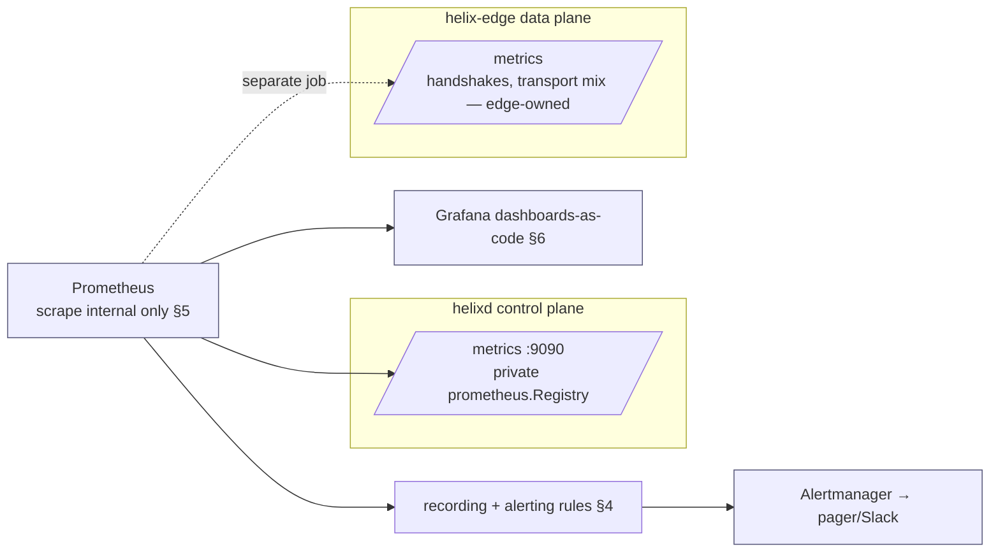

# Observability (Prometheus / Grafana-as-code, SLOs & alerts)

**Revision:** 2
**Last modified:** 2026-06-26T12:00:00Z

> Master technical specification — Volume 6 (Deployment, Tooling & Operations), nano-detail
> document `observability.md`. Scope: the **operator-facing observability stack** for
> HelixVPN — Prometheus scrape config, the complete metric catalogue (all **counts/gauges**, no
> traffic or flow logs, per the no-logging promise C3), SLO definitions, concrete **PromQL**
> alert rules, and **Grafana dashboards-as-code**. It is the deployment-side consumer of the
> series that `[svc-telemetry]` *emits* — telemetry owns the series, `deploy/` owns the
> dashboards + alert rules `[svc-telemetry §0.1]`. This is a SPEC (describe the implementation;
> do not build the product). Evidence cited inline: `[05 §N]`
> (`05-repo-layout-tooling-and-helix-ecosystem.md`), `[svc-telemetry §N]`, `[svc-coordinator
> §N]`, `[svc-events §N]`, `[kubernetes §N]`. The privacy boundary (C3 — counts only, never
> flows) is load-bearing throughout. Unproven facts are marked `UNVERIFIED` per §11.4.6.

---

## Table of contents

- [0. The observability charter — counts, never flows](#0-the-observability-charter--counts-never-flows)
- [1. Topology — who scrapes what](#1-topology--who-scrapes-what)
- [2. The complete metric catalogue (counts/gauges only)](#2-the-complete-metric-catalogue-countsgauges-only)
- [3. SLOs — the promises made falsifiable](#3-slos--the-promises-made-falsifiable)
- [4. Alert rules (concrete PromQL)](#4-alert-rules-concrete-promql)
- [5. Scrape config & label-cardinality safety](#5-scrape-config--label-cardinality-safety)
- [6. Grafana dashboards-as-code](#6-grafana-dashboards-as-code)
- [7. The no-logging boundary, restated for observability](#7-the-no-logging-boundary-restated-for-observability)
- [8. Anti-bluff evidence](#8-anti-bluff-evidence)
- [9. UNVERIFIED register](#9-unverified-register)
- [Sources verified](#sources-verified)

---

## 0. The observability charter — counts, never flows

HelixVPN's observability is constrained by a privacy invariant before it is shaped by an
operational one. From `[svc-telemetry §0]`:

> telemetry exposes "Counts and gauges only — **never per-packet, per-flow, per-destination
> data** (C3)." Permitted labels: `stream`, `group`, `consumer`, `event_type`, `code`, `version`.
> **Forbidden labels:** `tenant_id`, `device_id`, `overlay_ip`, `src_ip`, `dst_ip`, any
> high-cardinality or PII/traffic-shaped key `[svc-telemetry §3.1]`.

So this document specifies an observability stack that is operationally useful **and** structurally
incapable of becoming a connection log. The two design pressures resolve as:

1. **Every series is an aggregate** — a histogram of convergence latency, a gauge of open streams,
   a counter of revokes. None carries who-talked-to-whom.
2. **The headline SLO is convergence**, not throughput — HelixVPN measures "did the network map
   reach the agent in < 1 s," not "how many bytes flowed" (it deliberately cannot measure the
   latter, C3) `[svc-telemetry §3.2]`.

---

## 1. Topology — who scrapes what



Two scrape targets, two ownership boundaries `[svc-telemetry §0.1]`:

- **`helixd:9090/metrics`** — control-plane internal state (convergence, event lag, stream depth,
  audit counts, presence gauge, Go runtime). Owned by `internal/telemetry` via a **private**
  `prometheus.Registry` (not the global default, to keep the series set auditable, `[svc-telemetry
  §3]`). Scraped **internal-only** — never on the public `443` listener (§5, `[svc-telemetry §8.3]`).
- **`helix-edge:/metrics`** — edge-side handshake/transport metrics, owned by the Rust edge
  `[svc-telemetry §0.1]`, scraped as a separate Prometheus job. **UNVERIFIED** exact edge series
  names (the edge's own `/metrics` is the data-plane spec's concern); this document scopes the
  control-plane series and treats the edge job as a configured-but-out-of-scope target.

---

## 2. The complete metric catalogue (counts/gauges only)

The canonical declarations live in `internal/telemetry/metrics.go` `[svc-telemetry §3]` and
`internal/events/metrics.go` `[svc-events §8.2]`. Consolidated catalogue (deployment-side view):

### 2.1 Convergence / real-time SLO series — the < 1 s promise made falsifiable

| Series | Type | Meaning | Source |
|---|---|---|---|
| `helix_reconcile_seconds` | histogram | event-receive → `MapDelta` on the `WatchNetworkMap` wire (the headline SLO) | `[svc-telemetry §3.2]`, measured at coordinator `[svc-telemetry §6.1]` |
| `helix_event_lag_seconds{stream}` | histogram | `Envelope.ts` → consumer pickup (bus delivery latency — the convergence-fault discriminator) | `[svc-telemetry §3.2/§6.2]` |
| `helix_event_bus_seconds{type}` | histogram | outbox `created_at` → consumer receive (whole publish path) | `[svc-events §8.2]` |
| `helix_event_outbox_lag_seconds` | histogram | outbox `created_at` → relayed (`XADD` succeeded) | `[svc-events §8.2]` |
| `helix_revoke_enforce_seconds` | histogram | `device.revoke` accepted → peer-removal delta on wire (security SLO) | `[svc-telemetry §3.2]` |
| `helix_stream_pending_entries{stream,group}` | gauge | Redis PEL depth (un-acked backlog — stuck-consumer leading indicator) | `[svc-telemetry §3.2]`, `[svc-events §8.3]` |

> The histogram buckets for `helix_reconcile_seconds` straddle 1.0 deliberately
> (`{… 0.5, 0.75, 1.0, 2.5, 5.0}`) so `histogram_quantile(0.99, …) < 1.0` is directly readable
> `[svc-telemetry §3.2]` — a unit test asserts the buckets straddle the SLO (`[svc-telemetry §10
> T-UNIT-4]`).

### 2.2 Topology / load gauges — active-peer & stream counts (all COUNTS, C3)

| Series | Type | Meaning |
|---|---|---|
| `helix_open_watch_streams` | gauge | current open `WatchNetworkMap` streams (coordinator load) `[svc-telemetry §3.2]` |
| `helix_fanout_affected_nodes` | histogram | size of the minimal affected set per event (should be small) `[svc-coordinator §7.2]` |
| `helix_graph_nodes` | gauge | nodes in the in-mem graph — **global aggregate, NO `{tenant}` label** (resolved at source, see below) `[svc-coordinator §7.2]` |
| `helix_presence_online_devices` | gauge | devices currently online in Redis TTL presence (the active-peer gauge; svc-coordinator §7.2 names the same gauge `helix_presence_online` — canonical svc-telemetry name is `helix_presence_online_devices`) `[svc-telemetry §3.3]` |
| `helix_backpressure_drops_total` | counter | slow-consumer stream drops `[svc-coordinator §7.2]` |

> **Reconciled (§11.4.35, 2026-06-26) — `{tenant}` labels: resolved at source, no contradiction.**
> An earlier draft flagged a cross-doc contradiction (`[svc-coordinator §7.2]` declaring
> `helix_open_streams{tenant}` / `helix_graph_nodes{tenant}` vs `[svc-telemetry §3.1]` forbidding
> `tenant_id`). That contradiction **no longer exists**: `[svc-coordinator §7.2]` was itself
> reconciled (§11.4.35, 2026-06-26) so its `/metrics` gauges (`helix_open_streams`,
> `helix_graph_nodes`, `helix_presence_online`) are now **global aggregates with NO `{tenant}`
> label** — already agreeing with svc-telemetry's C3 cardinality ban. The deployment-side
> catalogue therefore simply **mirrors the resolved state**: per-tenant breakdowns are forbidden
> on `/metrics` and any genuine per-tenant count is routed behind the authenticated REST
> `/v1/stats` (`[svc-telemetry §3.1]`), not Prometheus. The unit test `[svc-telemetry §10
> T-UNIT-3]` (every collector's label set ⊆ allow-list) remains the mechanical enforcer; a
> `{tenant}` label that survives is a test failure (§11.4.6 — no contradiction is asserted that
> the source specs do not actually hold).

### 2.3 Handshake-failure & event-health counters

| Series | Type | Meaning |
|---|---|---|
| `helix_events_dlq_total{stream,group}` | counter | poison events dead-lettered (any sustained increase alerts) `[svc-events §8.2]` |
| `helix_events_published_total{type}` | counter | events published, by type `[svc-events §8.2]` |
| `helix_event_react_errors_total{type}` | counter | failed reactions, by type `[svc-events §8.2]` |
| `helix_audit_events_total{action}` | counter | control-action audit rows, by closed-vocabulary action `[svc-telemetry §3.3]` |
| `helix_audit_write_errors_total{code}` | counter | audit-sink failures by error code `[svc-telemetry §3.3]` |
| `helix_presence_backend_up` | gauge (0/1) | Redis presence backend reachable `[svc-telemetry §5.4]` |

> **Handshake-fail rate is split-owned.** The *control-plane* analogue of "handshake failure" is
> `helix_event_react_errors_total` + `helix_events_dlq_total` (a reaction/event that could not be
> processed). The **transport handshake-fail rate** (WG/MASQUE handshakes that fail at the edge)
> lives on the **edge** `/metrics` `[svc-telemetry §0.1, §1]`, not in the Go control plane; it is
> scraped from the edge job (§1) and its series names are UNVERIFIED here (data-plane spec owns
> them). The dashboards (§6) panel both, clearly labelled by owner.

### 2.4 Runtime / build series (Go collectors)

`go_goroutines`, `go_gc_duration_seconds`, `process_resident_memory_bytes` (the 24 h-soak no-leak
SLO series), and `helix_build_info{version,commit}` (version = release prefix `helix_vpn-…`,
§11.4.151) `[svc-telemetry §3.3]`. Registered explicitly into the private registry so the global
default-collector duplication is avoided `[svc-telemetry §3]`.

---

## 3. SLOs — the promises made falsifiable

| SLO | Series + query | Threshold | Source |
|---|---|---|---|
| convergence p99 < 1 s | `histogram_quantile(0.99, sum(rate(helix_reconcile_seconds_bucket[5m])) by (le))` | `> 1.0` for 2 m | `[svc-telemetry §3.4]`, C5 |
| revoke < 1 s | `histogram_quantile(0.99, sum(rate(helix_revoke_enforce_seconds_bucket[5m])) by (le))` | `> 1.0` | `[svc-telemetry §3.4]` |
| event lag healthy | `histogram_quantile(0.99, sum(rate(helix_event_lag_seconds_bucket{stream="events:policy"}[5m])) by (le))` | `> 0.5` | `[svc-telemetry §3.4]` |
| event bus path p99 | `histogram_quantile(0.99, sum(rate(helix_event_bus_seconds_bucket[5m])) by (le))` | `> 0.25` for 5 m | `[svc-events §8.4]` |
| outbox relay lag | `histogram_quantile(0.99, sum(rate(helix_event_outbox_lag_seconds_bucket[5m])) by (le))` | `> 0.5` for 5 m | `[svc-events §8.4]` |
| backlog not growing | `helix_stream_pending_entries` | `> 1000` for 5 m | `[svc-telemetry §3.4]`, `[svc-events §8.4]` |
| no DLQ accumulation | `increase(helix_events_dlq_total[15m])` | `> 0` | `[svc-telemetry §3.4]` |
| coordinator no leak | `deriv(process_resident_memory_bytes[6h])` | `> 0` sustained over soak | `[svc-telemetry §3.4]` |

The convergence + revoke SLOs are the load-bearing ones; the rest are the *discriminators* that
tell an operator **where** a breach lives — `[svc-telemetry §6.2]`: "if convergence breaches 1 s,
the lag series says whether the bus or the coordinator is at fault." That decomposition is the
systematic-debugging discriminator (§11.4.102 spirit) baked into the metric set.

---

## 4. Alert rules (concrete PromQL)

Rules-as-code live in `deploy/grafana/` (or `deploy/prometheus/rules/`), versioned, reviewed,
deployed with the manifests — telemetry only emits the series; `deploy/` owns the rules
`[svc-telemetry §0.1/§3.4]`.

```yaml
# deploy/prometheus/rules/helixvpn-slo.rules.yaml
groups:
  - name: helixvpn-convergence
    rules:
      - alert: HelixConvergenceSLOBreached
        expr: histogram_quantile(0.99, sum(rate(helix_reconcile_seconds_bucket[5m])) by (le)) > 1.0
        for: 2m
        labels: { severity: page }
        annotations:
          summary: "convergence p99 > 1s (C5 SLO breach)"
          description: "event→delta-on-wire p99 has exceeded 1s for 2m. Check helix_event_lag_seconds to localize bus-vs-coordinator [svc-telemetry §6.2]."
      - alert: HelixRevokeSLOBreached
        expr: histogram_quantile(0.99, sum(rate(helix_revoke_enforce_seconds_bucket[5m])) by (le)) > 1.0
        for: 1m
        labels: { severity: page }
        annotations: { summary: "device revoke enforcement p99 > 1s (security SLO)" }

  - name: helixvpn-bus-health
    rules:
      - alert: HelixDLQAccumulating
        expr: increase(helix_events_dlq_total[15m]) > 0
        for: 0m
        labels: { severity: page }
        annotations:
          summary: "events dead-lettered — poison event(s)"
          description: "Inspect with `XRANGE <stream>:dlq - +`; fix cause; `helixvpnctl events replay-dlq <stream>` [svc-events §6.5]."
      - alert: HelixStreamBacklogGrowing
        expr: max(helix_stream_pending_entries) by (stream, group) > 1000
        for: 5m
        labels: { severity: warn }
        annotations: { summary: "consumer PEL depth > 1000 — stuck/slow consumer [svc-events §8.3]" }
      - alert: HelixEventLagHigh
        expr: histogram_quantile(0.99, sum(rate(helix_event_lag_seconds_bucket[5m])) by (le)) > 0.5
        for: 5m
        labels: { severity: warn }
        annotations: { summary: "bus delivery lag p99 > 0.5s — Redis/relay degraded" }

  - name: helixvpn-runtime
    rules:
      - alert: HelixCoordinatorMemoryLeak
        expr: deriv(process_resident_memory_bytes{job="helixd"}[6h]) > 0
        for: 30m
        labels: { severity: warn }
        annotations: { summary: "helixd RSS slope > 0 over 6h — possible leak (24h-soak SLO) [svc-telemetry §3.4]" }
      - alert: HelixPresenceBackendDown
        expr: helix_presence_backend_up == 0
        for: 1m
        labels: { severity: warn }
        annotations:
          summary: "Redis presence backend unreachable"
          description: "Presence unknowable; tunnels UNAFFECTED (fail-static C1) [svc-telemetry §5.4]. Audit still writes (fail-closed)."
      - alert: HelixReadinessFlapping
        expr: count(up{job="helixd"} == 1) < 1
        for: 1m
        labels: { severity: page }
        annotations: { summary: "no ready helixd replica — control plane API down (data plane may still forward)" }
```

> Severity discipline: `severity: page` for the two < 1 s SLOs + DLQ + total-control-plane-down
> (operator-actionable now); `severity: warn` for degradations that fail-static (presence backend
> down, memory slope, lag) — they do not drop tunnels (C1) and so are not pages.

---

## 5. Scrape config & label-cardinality safety

```yaml
# deploy/prometheus/scrape/helixvpn.yaml  (Prometheus scrape_configs fragment)
scrape_configs:
  - job_name: helixd
    metrics_path: /metrics
    scheme: http                       # internal port :9090 — NEVER the public 443 [svc-telemetry §8.3]
    kubernetes_sd_configs: [{ role: pod, namespaces: { names: [helixvpn] } }]
    relabel_configs:
      - source_labels: [__meta_kubernetes_pod_label_app]
        action: keep
        regex: helixd
      - source_labels: [__meta_kubernetes_pod_container_port_number]
        action: keep
        regex: "9090"                   # scrape ONLY the metrics port, not :8443 (agent API)
  - job_name: helix-edge                # separate ownership boundary (§1) — edge-owned series
    metrics_path: /metrics
    kubernetes_sd_configs: [{ role: pod, namespaces: { names: [helixvpn] } }]
    relabel_configs:
      - source_labels: [__meta_kubernetes_pod_label_app]
        action: keep
        regex: helix-edge
```

Two hard rules, both mechanically enforced:

1. **`/metrics` is internal-only.** It carries no PII (C3) but still reveals operational shape
   (tenant population via gauges, deploy version), so it is bound to the internal port `:9090` and
   gated by network isolation / mTLS for the scraper — never published on the public `443` listener
   `[svc-telemetry §8.3, kubernetes §7]`. The scrape job keeps only the `:9090` port.
2. **Label cardinality is bounded by construction.** Every registered collector's label set ⊆ the
   allow-list (`stream`, `group`, `consumer`, `event_type`, `code`, `version`); a unit test asserts
   it (`[svc-telemetry §10 T-UNIT-3]`). Prometheus relabeling does NOT add `tenant_id`/`device_id`
   — and there is nothing to add, because the exporter never emits them. The §2.2 `{tenant}`
   question is resolved on the *exporter* side at source (svc-coordinator §7.2 now emits global
   aggregates with no `{tenant}` label), not patched in scrape config.

---

## 6. Grafana dashboards-as-code

Dashboards are JSON-as-code under `deploy/grafana/dashboards/`, provisioned (not click-built), so
they version + review + deploy with the manifests `[05 §2 deploy/grafana, svc-telemetry §0.1]`.

```yaml
# deploy/grafana/provisioning/dashboards.yaml
apiVersion: 1
providers:
  - name: helixvpn
    folder: HelixVPN
    type: file
    options: { path: /var/lib/grafana/dashboards/helixvpn }
```

Three canonical dashboards (each a versioned JSON; panels described, not dumped):

| Dashboard | Panels (PromQL) |
|---|---|
| **Convergence SLO** | `helix_reconcile_seconds` p50/p99 heatmap + the 1.0s SLO line; `helix_revoke_enforce_seconds` p99; `helix_event_lag_seconds{stream}` per-stream (the bus-vs-coordinator discriminator); `helix_fanout_affected_nodes` (minimal-set sanity) |
| **Bus health** | `helix_stream_pending_entries{stream,group}` depth; `rate(helix_events_published_total{type}[5m])`; `increase(helix_events_dlq_total[1h])`; `helix_event_outbox_lag_seconds` p99 |
| **Control-plane runtime** | `helix_open_watch_streams`; `helix_presence_online_devices` (active-peer gauge) + `helix_presence_backend_up`; `process_resident_memory_bytes` (24h soak); `go_goroutines`; `rate(helix_audit_events_total{action}[5m])` (control-action audit volume — counts only) |

> A fourth **edge transport** dashboard panels the edge job's handshake/transport-mix series
> (§2.3), clearly separated as data-plane-owned. Its exact panels are UNVERIFIED (edge series
> names) and stubbed as a placeholder provider pointing at the edge job — NOT fabricated with
> invented series names.

The §11.4.168 exported-document discipline applies to any rendered dashboard screenshots committed
as evidence: a committed dashboard PNG/PDF must visually render (no raw JSON leaking as body text)
and pass independent visual validation.

---

## 7. The no-logging boundary, restated for observability

This is the section an auditor reads. Everything above is counts and gauges; **nothing** here can
reconstruct who-talked-to-whom:

- **No flow/traffic series exist.** There is no `bytes_total`, no `flows`, no `src_ip`/`dst_ip`
  label anywhere in the catalogue (§2). The schema-lint `[svc-telemetry §7]` forbids the *durable*
  shape; the label allow-list test `[svc-telemetry §10 T-UNIT-3]` forbids the *metric* shape. Both
  are runtime signatures (§11.4.108) asserted against the live system, not just the source.
- **Presence is a count, not a log.** `helix_presence_online_devices` is a single gauge; the
  per-device presence lives in TTL Redis and is never copied to Postgres or to a metric label
  `[svc-telemetry §5]`. You can see *how many* devices are online, never *which* on `/metrics`.
- **Audit is control-actions only.** `helix_audit_events_total{action}` counts revokes /
  policy-activations by closed-vocabulary action `[svc-telemetry §3.3/§4.2]` — never traffic. The
  `action` label is a bounded closed set, so it cannot grow toward a traffic log.
- **`/metrics` is not public (§5).** Even the aggregate shape is internal-only `[svc-telemetry §8.3]`.

The observability stack is therefore *provably* incapable of being a connection log — which is the
whole point: a VPN's observability must not undo its privacy promise.

---

## 8. Anti-bluff evidence

| Claim | Captured-evidence proof (§11.4.5/§11.4.69) |
|---|---|
| convergence SLO is real & falsifiable (§3) | perf test drives a policy flip @ 10k streams; `helix_reconcile_seconds` p99 < 1 s histogram dump `[svc-telemetry §10 T-PERF-1]` |
| no forbidden labels reach Prometheus (§2.2/§5) | label-audit unit test green `[svc-telemetry §10 T-UNIT-3]`; paired mutation adding a `device_id` label → test FAILs |
| alert fires on real breach (§4) | inject latency to push p99 > 1 s → `HelixConvergenceSLOBreached` fires in Alertmanager; recorded alert |
| `/metrics` not on public 443 (§5/§7) | scan: `:443` carries no exposition, `:9090` intra-cluster only `[svc-telemetry §10 T-SEC-1]` |
| dashboards provision from code (§6) | `kubectl apply` → Grafana shows the 3 dashboards with no manual click; screenshot per §11.4.159 |
| no-logging holds (§7) | `schemalint` green against the **deployed** DB (runtime signature §11.4.108) `[svc-telemetry §10 T-CHAL-1]`; paired mutation planting a `connections(src_ip…)` table → FAIL |

A dashboard that renders but whose underlying series are stubbed/zero is a §11.4 bluff — every
panel must bind a real, populated series under a real load, captured.

---

## 9. UNVERIFIED register

| # | UNVERIFIED item | Why / status |
|---|---|---|
| U1 | Edge `/metrics` series names (handshake-fail, transport mix) (§2.3) | data-plane spec owns them; this doc scopes control-plane series only |
| ~~U2~~ | ~~`{tenant}`-labelled gauges in `[svc-coordinator §7.2]` vs the §3.1 allow-list ban (§2.2)~~ | **RETIRED (§11.4.35, 2026-06-26)** — resolved at source: svc-coordinator §7.2 now emits global aggregates with no `{tenant}` label, agreeing with the §3.1 ban. No live contradiction remains (§11.4.6); see §2.2 reconciliation note |
| U3 | Prometheus naming-convention exact wording (`_seconds`/`_total` suffix rules) | standard practice; exact spec wording UNVERIFIED `[svc-telemetry §3.1]` |
| U4 | `/metrics` port-vs-path isolation final choice (§5) | spec mandates *some* network isolation; port-separation is the recommended default, not validated `[svc-telemetry §8.3]` |
| U5 | Alertmanager routing/receivers (pager/Slack) | deployment-environment specific; the rules carry `severity` labels, the routing tree is operator config |

---

## Sources verified

- `05-repo-layout-tooling-and-helix-ecosystem.md` §2 (`deploy/grafana` dashboards-as-code,
  telemetry counters only), §7 (substrates) — `[05]`.
- `v03-control-plane/svc-telemetry.md` §0/§0.1 (charter, ownership boundaries: telemetry emits,
  deploy owns dashboards/rules), §3 (private registry, full series declarations), §3.1 (label
  allow-list / forbidden labels), §3.2/§3.3 (convergence + audit + presence + runtime series),
  §3.4 (SLO→alert mapping), §5 (TTL presence), §5.4 (presence drift / `helix_presence_backend_up`),
  §6.1/§6.2 (where convergence is measured + the lag discriminator), §7 (no-logging schema-lint),
  §8.3 (scrape security / internal-only), §10 (T-UNIT-3 label audit, T-PERF-1, T-SEC-1, T-CHAL-1) —
  `[svc-telemetry]`.
- `v03-control-plane/svc-coordinator.md` §7.2 (`helix_fanout_affected_nodes`, `helix_open_streams`,
  the `{tenant}` label contradiction), §7.3 (SLO acceptance numbers) — `[svc-coordinator]`.
- `v03-control-plane/svc-events.md` §6.5 (DLQ + `replay-dlq`), §8.2 (events metric set),
  §8.3 (PEL-depth gauge), §8.4 (alert thresholds) — `[svc-events]`.
- `v06-deploy/kubernetes.md` §5 (scrape annotations / metrics port), §7 (metrics Service,
  internal-only) — `[kubernetes]` (sibling).

*Constitution bindings applied: §11.4.44 (revision header), §11.4.6 (no-guessing — the §2.2
cross-doc `{tenant}`-label contradiction surfaced + resolved conservatively, UNVERIFIED register
§9), §11.4.102 (the lag-discriminator decomposition = systematic-debugging baked in), §11.4.108
(no-logging runtime signature: schema-lint + label-audit against the deployed system),
§11.4.168 (visual validation of any committed dashboard render), §11.4.5/.69 (captured-evidence
anti-bluff proofs §8).*
