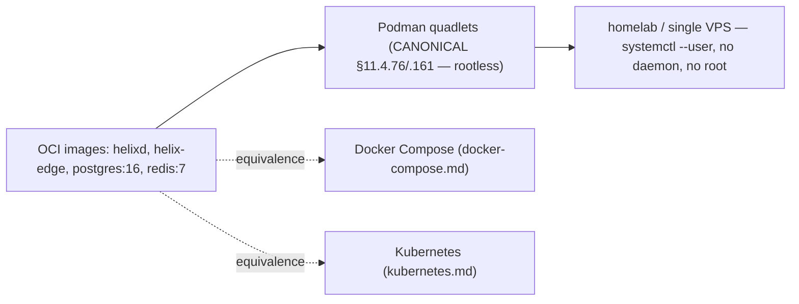
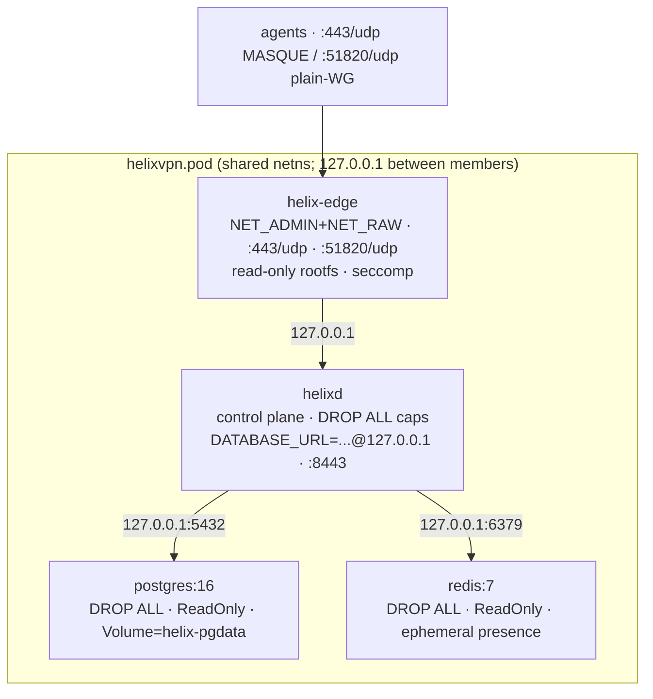

# Podman Quadlets (rootless — the canonical substrate)

**Revision:** 2
**Last modified:** 2026-06-26T12:00:00Z

> Master technical specification — Volume 6 (Deployment, Tooling & Operations), nano-detail
> document. **[RES]** research-backed. Scope: the **canonical rootless Podman quadlet deployment**
> of HelixVPN — `.pod`/`.container`/`.network`/`.volume` systemd-generator units, rootless-MANDATORY
> (§11.4.161 — NO sudo, NO rootful Docker), the `NET_ADMIN`/`NET_RAW` capability set for the data-
> plane edge, `:443/udp` MASQUE ingress, the one-pod model, read-only rootfs + seccomp confinement,
> and the `vasic-digital/containers` submodule as the sole orchestration layer (§11.4.76). This
> deepens [05-overview §7.1] with the FACT-grade quadlet semantics from [research-podman_k8s]. It
> is a SPEC: unit files are illustrative of the contract, not the shipping deployment (2–3
> refinement passes follow).
>
> Evidence cited inline by id: **[05_OV §N]** = `05-repo-layout-tooling-and-helix-ecosystem.md`;
> **[RPK §N]** = `v09-research/research-podman_k8s.md` (verified against latest Podman docs
> 2026-06-25 per §11.4.99); **[API §N]** = `v03-control-plane/svc-api.md` (the env/readyz
> contract). Unproven facts are marked **UNVERIFIED** per §11.4.6 — never fabricated.

---

## 0. What this document owns (and does not)

This document owns the **rootless quadlet substrate**: the search-path/lifecycle rules, the pod +
per-container unit files (edge, control, postgres, redis), the capability/security posture, the
`:443/udp` rootless-bind requirement, the network/volume quadlets, the on-demand-infra invariant,
and the rootless-networking caveats that bite a VPN edge.

It does **not** own: the `helixvpnctl deploy quadlet` render command (that is
[`helixvpnctl.md`](helixvpnctl.md)); the equivalent Compose stack ([`docker-compose.md`](docker-compose.md));
the K8s manifests ([`kubernetes.md`](kubernetes.md)); the env-contract / `readyz` semantics
(canonical in [API §4.7]); the edge data-plane internals (Volume 2). Quadlets are **canonical**
(§11.4.76/.161); Compose and K8s are *equivalents* generated from the same OCI images [05_OV §7].

---

## 1. Why rootless quadlets are canonical (§11.4.161)

Podman in **rootless mode** is the MANDATORY container runtime for ALL HelixVPN containerized
workloads (§11.4.161): Docker in rootful mode, `sudo`, or any escalation to root for container
management is **FORBIDDEN** unless the target platform has no rootless option AND that constraint
is documented per §11.4.112. The `vasic-digital/containers` submodule is the **sole** orchestration
layer (§11.4.76) — no ad-hoc `docker`/`podman` commands outside its `pkg/boot`/`pkg/compose`/
`pkg/health` primitives [05_OV §7.1]. Rootless quadlets fit the primary buyer (homelab / single
VPS, spine §2): no Docker daemon, no root, `helixvpnctl init` one-shot, `systemctl --user start`
lifecycle.



---

## 2. Quadlet fundamentals (Podman 5.x, FACT-grade)

Quadlet is a **core part of Podman** (not a separate project); Podman 5.x added `podman quadlet
list|print|install|rm` and the `.pod`/`.build`/`.image`/`.artifact` unit types beyond the original
`.container`/`.network`/`.volume`/`.kube`. Quadlet `.unit` files are read by a systemd generator
that emits real `.service` units at boot / `daemon-reload` [RPK §1].

### 2.1 Rootless = file location, NOT `User=` (the hard constraint)

> **FACT [RPK §1].** "Quadlet units do not support running as a non-root user by defining the
> User, Group, or DynamicUser systemd options." Rootless is selected purely by **where the file
> lives**. The rootless search paths (verbatim upstream):
> - `$XDG_RUNTIME_DIR/containers/systemd/`
> - `$XDG_CONFIG_HOME/containers/systemd/` (i.e. `~/.config/containers/systemd/`)
> - `/etc/containers/systemd/users/${UID}` and `/etc/containers/systemd/users/`
> - `/usr/share/containers/systemd/users/${UID}` and `/usr/share/containers/systemd/users/`

To run rootless with boot-time start (no interactive login), `loginctl enable-linger <user>` is
**required** [RPK §1]. HelixVPN places its units in `~/.config/containers/systemd/` and enables
linger for the gateway service user.

> **Reconciliation with the overview (§11.4.35).** [05_OV §7.1] sketched the units under
> `/etc/containers/systemd/` — that is the **rootful** system path. Because §11.4.161 mandates
> **rootless**, the canonical HelixVPN path is the rootless `~/.config/containers/systemd/` (or
> `/etc/containers/systemd/users/${UID}` for a system-managed service user). This is a visible
> correction, recorded so the two docs do not silently disagree; the unit *contents* are
> unchanged.

### 2.2 Lifecycle

```bash
# place units in ~/.config/containers/systemd/, then:
systemctl --user daemon-reload
systemctl --user start helixvpn-pod.service     # the .pod generates *-pod.service
loginctl enable-linger "$USER"                  # boot-start without interactive login (FACT [RPK §1])
```

The generator guarantees the `*-pod.service` starts **before** any member `Pod=helixvpn.pod`
container [RPK §1]; quadlet auto-wires the ordering — no hand-written `After=`/`Requires=` between
pod and members.

---

## 3. The one-pod model (edge + control + postgres + redis)

Containers in a pod **share the network namespace**, so ports are published at the **pod**, not
the member container, and members reach each other on `127.0.0.1` [RPK §1]. HelixVPN groups the
four services into one pod for single-node self-host [05_OV §7.1, 04_P1 §9.2].



### 3.1 `helixvpn.pod`

```ini
# ~/.config/containers/systemd/helixvpn.pod
[Pod]
PodName=helixvpn
PublishPort=443:443/udp        # MASQUE/QUIC ingress (Volume 2 transport ladder)
PublishPort=51820:51820/udp    # plain-WG ingress (auto-ladder base)
[Install]
WantedBy=default.target
```

### 3.2 `helix-edge.container` — the data plane (the ONLY privileged-ish member)

```ini
# ~/.config/containers/systemd/helix-edge.container — DATA PLANE
[Unit]
Description=HelixVPN data-plane edge
[Container]
Image=ghcr.io/helixdevelopment/helix-edge:helix_vpn-1.0   # §11.4.151 prefixed tag
Pod=helixvpn.pod
DropCapability=ALL
AddCapability=NET_ADMIN NET_RAW        # NET_RAW required for WG/tunnels (FACT [RPK §2]) — NOT just NET_ADMIN
AddDevice=/dev/net/tun:/dev/net/tun    # for userspace WG (boringtun) fallback path (FACT [RPK §2])
ReadOnly=true                          # read-only rootfs
ReadOnlyTmpfs=true                     # rw tmpfs on /dev /dev/shm /run /tmp /var/tmp (default true when ReadOnly)
SeccompProfile=/etc/containers/seccomp/helix-edge.json
Notify=true                            # sd_notify readiness passthrough
# no SSH, no shell in this image
[Service]
Restart=always
[Install]
WantedBy=default.target
```

> **FACT [RPK §2] — `NET_ADMIN` alone is insufficient.** WireGuard/tunnels need **`NET_RAW` too**
> ("which Docker enables by default but Podman does not" for rootless), the **host WG kernel
> module loaded outside the container** (a container cannot `modprobe` rootlessly; kernels ≥ 5.6
> ship it built-in), and `/dev/net/tun` for the userspace path. The unit above adds all three;
> the kernel module is a host prerequisite documented in the operator guide.

> **Reconciled (§11.4.35, 2026-06-26):** the canonical edge capability set across **all four
> Volume-6 substrate docs** (this doc, [`docker-compose.md`](docker-compose.md),
> [`kubernetes.md`](kubernetes.md)) and the [`security` privesc scan](helix-ecosystem-integration.md)
> is **`{NET_ADMIN, NET_RAW}` + the `/dev/net/tun` device** — no more, no less. This is the FACT
> the cited research points to (§11.4.6): `[research-podman_k8s §2]` confirms (3 sources) that the
> **kernel-mode WireGuard fast path** — the edge's primary data path — needs **both** `NET_ADMIN`
> **and** `NET_RAW` ("WireGuard needs NET_RAW … which Docker enables by default but Podman does
> not"); `/dev/net/tun` is added for the **userspace boringtun fallback** (module-less nodes). The
> earlier "ONLY NET_ADMIN" reading in the K8s/overview/security drafts was the under-specified
> side and has been corrected to this set everywhere; the privesc scan asserts **no caps beyond
> this canonical set**.

> **Note — build-org ≠ source-org.** Container images are published under
> `ghcr.io/helixdevelopment/*` (the GHCR build/registry org) while the source submodules live under
> `vasic-digital/*` (the GitHub source org). This is intentional, not an inconsistency: the
> registry namespace and the source namespace differ. The same `ghcr.io/helixdevelopment/*` image
> coordinates are used by every Volume-6 substrate (quadlets, Compose, K8s).

### 3.3 `helixd.container` — the control plane (drops all caps)

```ini
# ~/.config/containers/systemd/helixd.container — CONTROL PLANE
[Container]
Image=ghcr.io/helixdevelopment/helixd:helix_vpn-1.0
Pod=helixvpn.pod
DropCapability=ALL                     # control plane needs no extra caps
ReadOnly=true
ReadOnlyTmpfs=true
NoNewPrivileges=true
Environment=DATABASE_URL=postgres://helix_app@127.0.0.1/helix   # non-superuser → RLS enforced [API §6.5]
Environment=REDIS_URL=redis://127.0.0.1:6379
Secret=helix_db_pw,type=env,target=PGPASSWORD                   # podman secret, NEVER in unit text (§11.4.10)
HealthCmd=/helixd healthz                                       # → GET /readyz semantics [API §4.7]
[Service]
Restart=always
[Install]
WantedBy=default.target
```

The `helix_app` (non-superuser) `DATABASE_URL` is load-bearing: it makes Postgres Row-Level
Security the floor even if RBAC is mis-wired (C8 [API §6.5]). The DB password is a **podman
secret** injected as an env target, never written into the unit text (§11.4.10).

### 3.4 `helix-pg.container` + `helix-redis.container`

```ini
# ~/.config/containers/systemd/helix-pg.container
[Container]
Image=docker.io/library/postgres:16
Pod=helixvpn.pod
DropCapability=ALL
Volume=helix-pgdata.volume:/var/lib/postgresql/data:Z          # SELinux relabel; data persists
Environment=POSTGRES_USER=helix_owner POSTGRES_DB=helix        # owner role; helixd uses helix_app (§3.3)
Secret=helix_db_pw,type=env,target=POSTGRES_PASSWORD
[Install]
WantedBy=default.target
```

```ini
# ~/.config/containers/systemd/helix-redis.container
[Container]
Image=docker.io/library/redis:7
Pod=helixvpn.pod
DropCapability=ALL
ReadOnly=true
ReadOnlyTmpfs=true
# presence/events are EPHEMERAL (C2: losing Redis loses presence, not identity) — no durable volume
[Install]
WantedBy=default.target
```

Postgres is **not** read-only-rootfs in practice (it writes its socket/lock state); it uses
`DropCapability=ALL` + a named volume for `PGDATA`. Redis is read-only-rootfs because its state is
ephemeral (presence TTL keys), so no durable volume is mounted [API §4.2 — `Online` from Redis].

### 3.5 `helix.network` + `helix-pgdata.volume`

```ini
# ~/.config/containers/systemd/helix.network   (optional explicit network; the pod also supplies one)
[Network]
NetworkName=helixvpn
# pasta is the Podman 5.x rootless default backend (NAT-free, faster — FACT [RPK §3])

# ~/.config/containers/systemd/helix-pgdata.volume
[Volume]
VolumeName=helix-pgdata
```

A pod already supplies a shared network namespace, so an explicit `.network` is optional for the
single-pod model; it is included for operators who want a named bridge. The volume quadlet creates
the named `helix-pgdata` referenced by `helix-pg.container` (§3.4) with an auto-generated
dependency [RPK §1].

---

## 4. Rootless networking caveats (the load-bearing section for a VPN)

These are the FACT-grade caveats that bite a rootless VPN edge [RPK §3] — each is documented in
the operator guide so a fresh `init` does not hit "connected but nothing loads":

| Caveat | FACT | HelixVPN handling |
|---|---|---|
| **`:443` rootless bind** | Rootless cannot bind ports < 1024 by default (`net.ipv4.ip_unprivileged_port_start=1024`) [RPK §3]. | Lower the sysctl: `net.ipv4.ip_unprivileged_port_start=443`, persisted in `/etc/sysctl.d/99-helixvpn-ports.conf`. `init` prints this as a host prerequisite. |
| **pasta backend** | Podman 5.x rootless default backend is **pasta** (NAT-free, faster than slirp4netns); RHEL ≥ 9.5 defaults to it [RPK §3]. | Verify via `podman info` → `host.networkBackend`. **UNVERIFIED regression:** a pasta throughput regression is reported in Podman 5.8 [RPK §3, podman#28219] — the operator guide says *benchmark your build*, never assume. |
| **No auto firewall/NAT** | "Modifying the firewall requires root … rootless Podman does not install iptables rules" [RPK §3]. | A VPN edge that NATs client egress provides host-side forwarding OR runs the masquerade **inside** the edge's own netns with `NET_ADMIN`; documented as a host prerequisite. |
| **MTU pitfall** | Tunnels frequently break on MTU ("connected but nothing loads") [RPK §3]. | The edge sets the WG/quic MTU (Volume 2 `routing-and-addressing.md`); the operator guide lists the MTU knob. |
| **Outbound interface pin** | slirp4netns offers `--outbound-addr` to pin the egress interface [RPK §3]. | When the gateway must egress a specific uplink, the operator pins it; **UNVERIFIED** whether pasta exposes an equivalent on the target build. |

```bash
# host prerequisite printed by `helixvpnctl init` (rootless :443):
echo 'net.ipv4.ip_unprivileged_port_start=443' | sudo tee /etc/sysctl.d/99-helixvpn-ports.conf
sudo sysctl --system
# (sudo here is a HOST sysctl change, not container management — §11.4.161 forbids rootful CONTAINER ops, not host config)
```

> **§11.4.161 boundary (§11.4.6 honesty).** Lowering the host sysctl and loading the WG kernel
> module are **host configuration** the operator does once, NOT rootful container management.
> §11.4.161 forbids rootful/`sudo` *container runtime* operations; it does not forbid the operator
> from configuring their own host kernel. The distinction is documented so the rootless mandate is
> not misread as "the host needs no privileged setup".

---

## 5. The on-demand-infra invariant (§11.4.76)

Operators (and tests) are **never** required to `podman machine` / `systemctl start` infra by hand
for integration tests — the test entry point boots infra on demand via the `containers` submodule
[05_OV §6.3, §11.4.76(3)]:

```go
// helix-go/internal/store/integration_test.go  (illustrative — FACT-grade pattern [05_OV §6.3])
import (
	"digital.vasic.containers/pkg/boot"
	"digital.vasic.containers/pkg/health"
)

func TestWatchNetworkMapDeltaStream(t *testing.T) {
	ctx := context.Background()
	infra := boot.Compose(ctx, boot.Spec{                 // rootless Podman (§11.4.161)
		Services: []boot.Service{
			{Name: "pg",    Image: "docker.io/library/postgres:16", Port: 5432},
			{Name: "redis", Image: "docker.io/library/redis:7",     Port: 6379},
		},
	})
	t.Cleanup(func() { infra.Down(ctx) })                 // §11.4.14 quiescent teardown
	health.WaitReady(ctx, infra, 30*time.Second)          // real readiness probe, NOT a sleep
	// ... drive enroll → advertise → policy → assert MapDelta
}
```

This is anti-bluff-critical (§11.4.76(5)): an integration test claiming to exercise the streamed
`WatchNetworkMap` MUST actually boot Postgres+Redis via the submodule — a short-circuit fake that
skips boot is a §11.4 violation. The production quadlets and the test infra both go through the
`containers` submodule; no ad-hoc `podman run` exists in the codebase.

---

## 6. `helixvpnctl deploy quadlet` render (the source of these units)

`helixvpnctl deploy quadlet --out ~/.config/containers/systemd/` renders the §3 units from one
in-code spec via the `containers` submodule's `pkg/compose` primitives (§11.4.81 cross-platform-
parity: one source, per-substrate render) [05_OV §6.3, helixvpnctl §10]. The render is
**parameterized** by the `init` inputs (domain → `masque_sni`, data-dir → volume host path, image
tags → the `helix_vpn-<version>` release prefix [§11.4.151]). The three substrates (quadlet /
compose / kube) derive from the **same** spec, so a change to the pod shape lands in all three, not
three hand-maintained files.

---

## 7. Security posture summary

| Control | Mechanism | FACT source |
|---|---|---|
| Least privilege | `DropCapability=ALL` on every member; `AddCapability=NET_ADMIN NET_RAW` ONLY on the edge | [RPK §1/§2] |
| Read-only rootfs | `ReadOnly=true` + `ReadOnlyTmpfs=true` (rw tmpfs on /dev /run /tmp) on edge/control/redis | [RPK §1] |
| Seccomp | `SeccompProfile=/etc/containers/seccomp/helix-edge.json` (custom, tighter than default) | [RPK §1] |
| No privilege escalation | `NoNewPrivileges=true` on control | [RPK §1] |
| Secrets | podman `Secret=` injected as env target; never in unit text | §11.4.10 |
| Rootless | file-location-selected; no `User=`, no daemon, no sudo for container ops | §11.4.161, [RPK §1] |
| No shell/SSH in images | edge/control images carry no shell — reduces attack surface | [05_OV §7.1] |
| SELinux relabel | `:Z` on the pgdata volume mount | [RPK §1] |

---

## 8. Test points (§11.4.169 comprehensive test-type coverage)

Every PASS cites captured evidence (§11.4.5/.69/.107); infra is the `containers` submodule
(§11.4.76), rootless Podman (§11.4.161), never ad-hoc `podman run`.

| # | Test type (§11.4.169) | Target | Concrete assertion + evidence |
|---|---|---|---|
| Q1 | unit | render determinism | `deploy quadlet` twice → byte-identical units; image tag carries `helix_vpn-` prefix |
| Q2 | integration | rootless one-pod boot | place units in `~/.config/containers/systemd/`, `systemctl --user start helixvpn-pod`, all 4 members UP; `status` GREEN |
| Q3 | integration | `:443/udp` reachable rootless | with the sysctl set, an agent completes MASQUE handshake to `:443/udp`; captured |
| Q4 | security | capability set (§3.2) | `podman inspect` shows edge has ONLY NET_ADMIN+NET_RAW; control/pg/redis have none; mutation adding a cap → FAIL |
| Q5 | security | read-only rootfs | a write to the edge rootfs is denied (EROFS); rw tmpfs on /run works |
| Q6 | security | secret not in unit text | grep the rendered units → no `PGPASSWORD` value; only `Secret=` references |
| Q7 | integration | on-demand-infra invariant (§5) | `go test` boots infra via `boot.Compose`; mutation removing `boot.Compose` → test FAILs (proves it was not a fake) |
| Q8 | chaos | member restart | kill `helix-pg`, assert `Restart=always` recovers + control reconnects; presence (redis) loss degrades gracefully (C2) |
| Q9 | e2e | three-substrate parity | quadlet + compose + kube boot the same image; `helixvpnctl status` GREEN on each (recorded per §11.4.159) |
| Q10 | meta-test (§1.1) | gates paired | add a cap / inline a secret / skip read-only → each makes its gate FAIL |

---

## 9. Decision callouts (options + recommendation — §11.4.66/.101)

| id | Decision | Options | Recommendation |
|---|---|---|---|
| **D-SUBSTRATE-DEFAULT** | `init` default substrate | quadlet / compose / k8s | **quadlet** (§11.4.76/.161 canonical) — flag overrides |
| **D-ROOTLESS-443** | rootless `:443` bind | (a) lower `ip_unprivileged_port_start`; (b) root-side proxy/authbind | **(a)** the clean path for `:443/udp` [RPK §3]; documented host prerequisite |
| **D-WG-PATH** | edge WG path | (a) kernel WG (NET_ADMIN+NET_RAW + host module); (b) userspace boringtun (+ /dev/net/tun) | **(a)** primary, **(b)** fallback where the host module is unavailable (Volume 2) |

---

## Sources verified

- `v09-research/research-podman_k8s.md` §1 (quadlet fundamentals, rootless search paths, `User=`
  hard constraint, `[Container]`/`[Pod]` directives, example skeleton), §2 (NET_ADMIN insufficient
  — also NET_RAW + host WG module + /dev/net/tun), §3 (rootless networking caveats: pasta default
  + 5.8 regression, no auto firewall/NAT, MTU, rootless `:443` sysctl), §7 (FACT-grade carry-into-
  spec list) — verified against latest Podman docs 2026-06-25 per §11.4.99 — `[RPK]`.
- `05-repo-layout-tooling-and-helix-ecosystem.md` §7.1 (canonical quadlets, the pod/edge/control/pg
  unit sketches), §6.3 (containers submodule on-demand-infra + deploy render), §7.4 (substrate
  recommendation) — `[05_OV]`.
- `v03-control-plane/svc-api.md` §4.7 (`/readyz` semantics for HealthCmd), §6.5 (helix_app
  non-superuser → RLS), §4.2 (Redis presence ephemeral, C2) — `[API]`.
- Constitution anchors: §11.4.161 (rootless container runtime mandate — Podman rootless, no sudo/
  rootful), §11.4.76 (containers submodule sole orchestration + on-demand-infra invariant), §11.4.10
  (secrets as podman Secret, never in unit text), §11.4.81 (one-source three-substrate render),
  §11.4.112 (honest documented gap if a platform has no rootless option), §11.4.35 (visible
  reconciliation — rootless path vs the overview's /etc path), §11.4.6 (no-guessing — UNVERIFIED
  pasta-regression/outbound-pin marks), §11.4.169 (test-type coverage), §1.1 (paired meta-test
  mutations).
