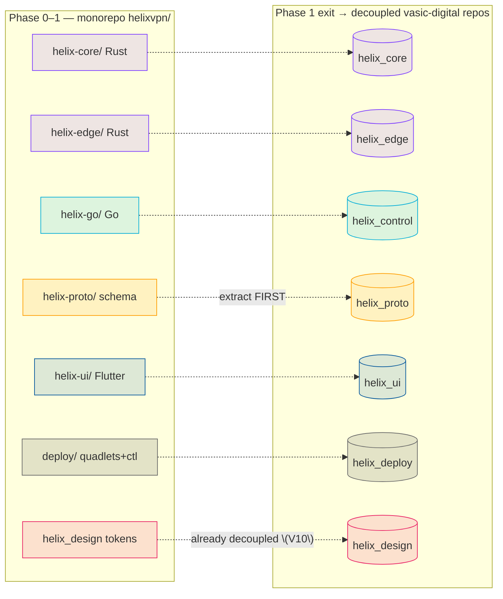
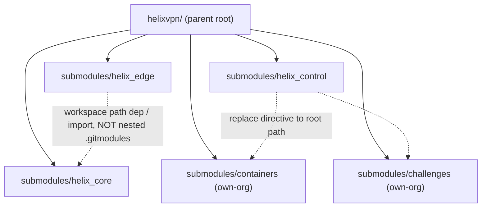
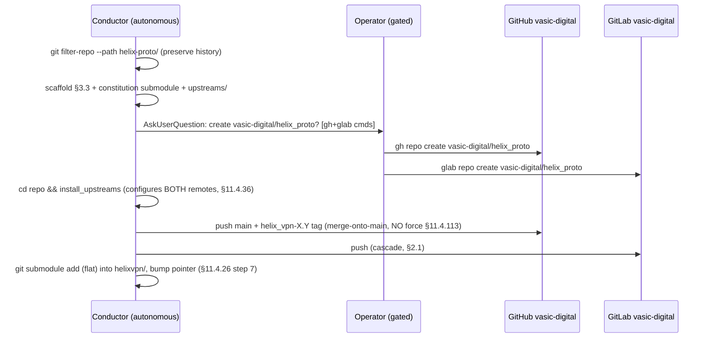

# Repo Layout & Decoupling

**Revision:** 1
**Last modified:** 2026-06-25T12:00:00Z

> Master technical specification — Volume 6 (Deployment, Tooling & Operations), nano-detail
> document. Scope: the **physical repository layout** of HelixVPN — the Phase-0/1 working
> monorepo `helixvpn/`, the planned `vasic-digital/*` decoupled reusable-component repos, the
> extraction sequencing, the decoupling invariants (§11.4.28), snake_case naming (§11.4.29),
> catalogue-first reuse (§11.4.74), the dependency-from-root layout (§11.4.28C), and the
> overview-level wiring points for the already-incorporated `submodules/` members
> (`helix_design`/`containers`/`helix_qa`/`challenges`/`docs_chain`). This deepens
> [05-overview §1/§2/§3/§6] into an implementation-ready repo spec. It is a SPEC: trees,
> manifests, and procedures are illustrative of the contract, not the shipping code (2–3
> refinement passes follow). Detailed ecosystem wiring lives in
> [`helix-ecosystem-integration.md`](helix-ecosystem-integration.md); this doc gives the
> seam, not the depth.
>
> Evidence cited inline by id: **[05_OV §N]** = `05-repo-layout-tooling-and-helix-ecosystem.md`;
> **[04_ARCH §N]** = `04_VPN_CLD/HelixVPN-Architecture-Refined.md` §11 (repo layout);
> **[04_P1]** = `HelixVPN-Phase1-MVP.md` §2 (repo skeleton); **[04_P0]** =
> `HelixVPN-Phase0-Spike.md` (surviving `Transport` trait + FFI seams); **[SYNTHESIS §N]** =
> `v09-research/_SYNTHESIS.md` §6 (reuse pillars). Unproven facts are marked **UNVERIFIED**
> per §11.4.6 — never fabricated.

---

## 0. What this document owns (and does not)

This document owns the **repository topology decisions**: the monorepo-now / extract-later
strategy, the file-by-file monorepo tree, the six decoupled-repo public-contract definitions,
the extraction order + procedure, the per-repo scaffold checklist, the `helix-deps.yaml`
dependency manifests, the release-prefix application to every repo, and the overview-level map
of which `submodules/` member binds where.

It does **not** own: the codegen pipeline internals (that is
[`codegen-pipeline.md`](codegen-pipeline.md)); the `helixvpnctl` command spec (that is
[`helixvpnctl.md`](helixvpnctl.md)); the deploy substrates
([`podman-quadlets.md`](podman-quadlets.md), [`docker-compose.md`](docker-compose.md),
[`kubernetes.md`](kubernetes.md)); the depth of each submodule's integration
([`helix-ecosystem-integration.md`](helix-ecosystem-integration.md)); the design-system repo's
internals (Volume 10, `vasic-digital/helix_design`). Those are referenced, never redefined.

---

## 1. The monorepo-now / extract-later strategy

### 1.1 The tension and its resolution

The constitution wants **decoupled, reusable, project-not-aware components**, each in its own
repo (§11.4.28/.74). The MVP wants **velocity and atomic cross-cutting changes** — one PR that
touches `.proto` + Go + Rust + Dart in lock-step. These pull in opposite directions only when
treated as simultaneous obligations; they are not. The binding resolution [05_OV §1.1]:

> **Phase 0 → Phase 1: one working monorepo `helixvpn/`** whose internal workspace boundaries
> are *already* the future repo boundaries. **Phase-1 exit gate: extract** the stabilized
> pillars into standalone `vasic-digital` repos and re-consume them as flat submodules. Nothing
> is extracted before its public surface stops churning (§11.4.124 — don't split before the
> seams are known).

This applies, at the *repository* level, the same discipline the control plane applies at the
*package* level — "one Go binary, many packages; package boundaries == future service
boundaries" [04_ARCH §4.1]. It honors §11.4.28 (the boundaries exist from day one, merely
co-located) without paying the multi-repo coordination tax during the highest-churn phase.



> **`helix_design` is the exception** (Volume 10, operator mandate 2026-06-25, §11.4.162): the
> design system is a decoupled `vasic-digital/helix_design` submodule **from day one**, not an
> extract-later pillar, because it is mandated reusable by any future app and its token contract
> is independent of HelixVPN code churn. The other six follow the extract-later path.

### 1.2 Extraction order (most-stable-first)

| Order | Monorepo dir | Extracted repo (`vasic-digital`) | Trigger to extract |
|---|---|---|---|
| 1 | `helix-proto/` | `helix_proto` | First frozen `WatchNetworkMap` version [04_P1 §3] — the schema is the contract; it must stop drifting before generated clients can stabilize. |
| 2 | `helix-core/` | `helix_core` | iOS memory gate G3 passes **and** the `helix-ffi` C-ABI/UniFFI surface freezes [04_P0]. |
| 3 | `helix-edge/` | `helix_edge` | Immediately after `helix_core` (it path-depends on `helix-transport`). |
| 4 | `helix-ui/` | `helix_ui` | Riverpod-over-status-stream contract + `runHelixApp` flavors stable by MVP DoD [04_UI]. |
| 5 | `helix-go/` | `helix_control` | Largest churn surface (policy compiler, coordinator) — extract last among code. |
| 6 | `deploy/` | `helix_deploy` | Image names + the env contract freeze (so the quadlet/compose/k8s generators reference stable names). |

Each extraction is a **visible commit** citing §11.4.35 ("Lifted from helixvpn monorepo to
vasic-digital/helix_proto per §11.4.28"), preserves history via `git filter-repo --path
helix-proto/`, and immediately re-consumes the new repo as a flat submodule (§4) [05_OV §1.2].

---

## 2. Monorepo layout (`helixvpn/`) — file-by-file

Directory and file names are **lowercase snake_case** where they are ours to name (§11.4.29);
language-mandated layouts (Rust `crates/`, Dart `lib/`, Cargo/Go file conventions) follow their
ecosystem (the §11.4.29 technology-exception) [05_OV §2].

```text
helixvpn/                                  # umbrella working repo (this repository's product code)
├── Cargo.toml                             # Rust workspace root — members: helix-core/crates/*, helix-edge
├── go.work                                # Go workspace — uses ./helix-go (+ extracted submodules later)
├── melos.yaml                             # Dart/Flutter monorepo manager (helix-ui packages)
├── buf.yaml  buf.gen.yaml  buf.lock       # schema-first codegen config (codegen-pipeline.md)
├── Makefile                               # local task runner (gen/build/test/deploy) — NO CI (§11.4.156)
├── .gitignore                             # build artifacts, .env, *.db-wal/-shm (§11.4.30)
├── .env.example                           # HELIX_RELEASE_PREFIX, infra creds template (§11.4.77/.151)
├── helix-deps.yaml                        # submodule dependency manifest (§11.4.31)
│
├── helix-proto/                           # ── reuse pillar 1: the contract ──
│   ├── proto/helix/v1/                     #   coordinator.proto, enrollment.proto, types.proto
│   ├── openapi/helix-rest.v1.yaml          #   Console/Access/Connector REST surface
│   └── gen/                                #   GENERATED (gitignored) → go/ dart/ rust/ ts/ (codegen-pipeline.md)
│
├── helix-core/                            # ── reuse pillar 2a: Rust client+connector core ──
│   ├── Cargo.toml
│   └── crates/                             #   helix-transport, helix-wg, helix-reconcile,
│                                           #   helix-netshield, helix-ffi
│
├── helix-edge/                            # ── reuse pillar 2b: Rust gateway data-plane edge ──
│   ├── Cargo.toml                          #   path-dep on helix-core/crates/helix-transport (D5)
│   └── src/                                #   quinn+h3 MASQUE termination + kernel-WG fast path
│
├── helix-go/                              # ── the Go control plane (modular monolith) ──
│   ├── go.mod                              #   module helixvpn/helix-go
│   ├── cmd/helixd/                         #   control-plane binary (all packages wired)
│   ├── cmd/helixvpnctl/                    #   operator CLI (Cobra) — helixvpnctl.md
│   └── internal/                           #   identity registry ipam pki policy coordinator events telemetry api store
│
├── helix-ui/                              # ── reuse pillar 3: Flutter ──
│   └── packages/                           #   helix_design(consumes V10), helix_core_ffi, helix_api_client,
│                                           #   app_access, app_connector, app_console
│
├── shims/                                 # per-platform TunnelPlatform providers (ONLY platform code)
│   ├── apple/ android/ windows/ linux/     #   Phase 0–2
│   └── harmonyos/ aurora/                   #   Phase 3
│
├── deploy/                                # ── deployment substrate (→ helix_deploy) ──
│   ├── quadlets/                           #   *.pod *.container *.network *.volume (CANONICAL, §11.4.76)
│   ├── compose/docker-compose.yaml         #   Docker-operator equivalence (docker-compose.md)
│   ├── k8s/                                #   plain manifests + kustomize (kubernetes.md)
│   ├── terraform/                          #   gateway VPS provisioning
│   └── grafana/                            #   dashboards-as-code (counters only)
│
├── submodules/                            # already-incorporated Helix ecosystem (§5)
│   ├── helix_design/ containers/ docs_chain/ helix_qa/ challenges/ security/
│   ├── vision_engine/ panoptic/ doc_processor/
│   └── llm_orchestrator/ llm_provider/ llms_verifier/   (dev-loop only — §5.2)
└── constitution/                          # HelixConstitution submodule (canonical root, §11.4.35)
```

### 2.1 Workspace manifests (the boundary-as-config seams)

Three workspace managers keep the internal boundaries crisp so extraction is a `git filter-repo`
+ re-consume, never a refactor [05_OV §2.1]:

- **`Cargo.toml`** (Rust) — one resolver, one shared lockfile, **path deps** so `helix-edge`
  reuses the `helix-transport` crate byte-for-byte (the D5 "shares helix-transport" property
  [SYNTHESIS §3]). The workspace members ARE the future `helix_core` crate set + `helix_edge`.
- **`go.work`** (Go) — keeps `helixd` + `helixvpnctl` in one module pre-extraction; post-
  extraction the `containers`/`challenges` submodules join via `replace` directives during dev +
  pinned SHAs in release (§11.4.76 consumption rule).
- **`melos.yaml`** (Dart/Flutter) — governs the `helix-ui` package tree; `runHelixApp(flavor,…)`
  produces all three apps from `packages/app_*` [04_UI]. The Console is the only Web build and
  omits `helix_core_ffi`.

A Cargo member, a Go package, or a Melos package is a future-repo boundary expressed today as a
workspace entry — this is the mechanical form of "the seams exist from day one".

---

## 3. The decoupled reusable-component repos (the §11.4.28/.29/.74 target)

### 3.1 The seven repos and their public contracts

Six are created **after** the spec stabilizes (per §1.2 order); `helix_design` exists from day
one (Volume 10). Each is its own GitHub **and** GitLab repo (§2.1 multi-mirror), snake_case
(§11.4.29), **flat** under the consumer (no nested own-org `.gitmodules` chains — §11.4.28C),
with an `upstreams/` recipe dir + `install_upstreams` run on clone (§11.4.36) [05_OV §3.1].

| Repo | Language | Public surface (the ONLY thing consumers depend on) | Consumed by |
|---|---|---|---|
| `helix_proto` | proto + OpenAPI | `proto/helix/v1/*.proto`, `openapi/helix-rest.v1.yaml`; ships generated Go/Dart/Rust/TS as release artifacts | core, edge, control, ui |
| `helix_core` | Rust | `Transport` trait, `helix-wg` API, `helix-ffi` C-ABI/UniFFI surface | edge, Access/Connector apps, shims |
| `helix_edge` | Rust | gateway data-plane binary + `EdgeConfig` (no lib API beyond config) | deploy |
| `helix_control` | Go | `helixd` binary + REST/proto contracts (the `internal` packages stay private) | deploy, helixvpnctl |
| `helix_ui` | Dart/Flutter | `helix_design` consumption + `runHelixApp()` entry + Riverpod status-stream contract | the 3 apps |
| `helix_deploy` | Go+YAML+HCL | `helixvpnctl` binary + quadlet/compose/k8s generators | operators |
| `helix_design` | tokens + per-platform theme packages | OpenDesign-emitted token bundles (JSON/CSS/Dart/Swift/Kotlin/ArkTS/C-Qt) + component specs (Volume 10, §11.4.162) | helix_ui + any future app |

### 3.2 Decoupling invariant (§11.4.28B) — the load-bearing rule

None of these may hardcode HelixVPN-specific hostnames, asset names, tenant assumptions, or
brand strings. `helix_core` is a generic WG-over-pluggable-transport engine; `helix_proto` is a
generic overlay-coordination schema; `helix_design` is OpenDesign tokens with brand values
injected, not baked. Project specifics enter ONLY via **config injection** — env var, config
struct, constructor parameter — never a hardcoded reach back into HelixVPN [05_OV §3.1].

The gate `CM-OWNED-SUBMODULE-DECOUPLING` (§11.4.28) greps each submodule diff for parent-project
context; a hostname/asset/tenant literal inside a submodule fails it. **UNVERIFIED:** the exact
deny-list of "parent context" tokens is set per-repo at extraction time, not fixed here.

### 3.3 Per-repo scaffold checklist (applied to all seven)

```text
<repo>/
├── README.md  CLAUDE.md  AGENTS.md  GEMINI.md  QWEN.md   # inherit constitution (§11.4.35/.157)
├── constitution/                                          # HelixConstitution submodule (canonical root)
├── upstreams/{github.sh,gitlab.sh}                        # remote recipes for install_upstreams (§11.4.36)
├── helix-deps.yaml                                        # own-org Git SSH deps (§11.4.31)
├── .gitignore  .env.example                               # §11.4.30/.77
├── docs/                                                  # Status.md + Status_Summary.md + guides (§11.4.45/.56)
│   └── .docs_chain/contexts/<repo>.yaml                   # docs_chain export + DB sync (§11.4.106)
└── (language tree)
```

### 3.4 `helix-deps.yaml` — the dependency manifest (§11.4.31)

`helix_edge` is the only code repo with an own-org build-time dependency, so its manifest is the
worked example [05_OV §3.2]:

```yaml
# helix_edge/helix-deps.yaml
schema_version: 1
deps:
  - name: helix_core
    ssh_url: git@github.com:vasic-digital/helix_core.git
    ref: main
    why: "helix-edge reuses the helix-transport crate byte-for-byte (D5)"
    layout: flat
transitive_handling:
  recursive: true
  conflict_resolution: operator-required
language_specific_subtree: false
```

`helix_ui`'s manifest declares `helix_design` the same way; `helix_control`'s declares
`containers` + `challenges`. The manifest is what lets a fresh consumer reconstruct the
dependency graph at its own root (§11.4.31) without nested own-org chains.

---

## 4. Dependency-from-root layout (§11.4.28C) — no nested own-org chains

Every dependency consumed by an owned submodule MUST be reachable from the **parent project's
root**, NOT nested inside the submodule [05_OV §3, §11.4.28C]:

```text
helixvpn/                      # parent root
├── submodules/helix_core/     # dependency at the root
├── submodules/helix_edge/     # consumer — reaches helix_core via go.work/Cargo path, NOT a nested submodule
└── submodules/helix_control/  # consumer — reaches containers/challenges via the root, not nested
```

**Forbidden:** `helix_edge/.gitmodules` pulling in `helix_core` as a nested own-org submodule.
**Required:** `helix_core` sits at `helixvpn/submodules/helix_core`, and `helix_edge` reaches it
via the workspace path dep (Cargo) / the documented import resolver — a flat graph the
`CM-OWNED-SUBMODULE-LAYOUT` gate audits (§11.4.28). Third-party submodules (the §11.4.74
`no-match → vendor` path) are exempt from the flat-only rule because we do not author them.



---

## 5. Catalogue-first reuse + ecosystem submodule map (overview-level)

### 5.1 Catalogue-first discipline (§11.4.74)

Before scaffolding ANY new module/helper/utility, the contributor MUST survey the
`vasic-digital` + `HelixDevelopment` orgs (the canonical inventory is `submodules-catalogue.md`)
and **reuse** when an existing submodule covers ≥80% of the need, **extend upstream** when 80%+
matches but features are missing, and record `Catalogue-Check: reuse|extend|no-match
<org/repo>@<sha>` on the relevant tracker row [05_OV §6, §11.4.74]. Concrete applications already
made for HelixVPN: containerization → `extend vasic-digital/containers` (§11.4.76); doc-sync →
`reuse vasic-digital/docs_chain` (§11.4.106); QA → `reuse HelixDevelopment/helix_qa` (§11.4.27);
design system → `extend OpenDesign via vasic-digital/helix_design` (§11.4.162).

### 5.2 Ecosystem submodule role map (the seam — depth in the sibling doc)

The 16 source docs predate the `submodules/` incorporation, so the spec MUST wire each in or
mark it not-applicable with a reason (§11.4.6, no silent drop) [05_OV §6.1]. This is the
overview-level binding; the full integration depth (boot/health APIs, on-demand-infra invariant,
docs_chain context schema, vision/QA harness wiring) lives in
[`helix-ecosystem-integration.md`](helix-ecosystem-integration.md).

| Submodule | HelixVPN role | Binding § | Phase |
|---|---|---|---|
| **helix_design** | Mandatory OpenDesign design system for all 3 apps × 8 platforms; decoupled reusable submodule (Volume 10) | §11.4.162 | 1+ |
| **containers** | **Sole** container-orchestration layer: `helixvpnctl deploy` boot/health/compose primitives + on-demand integration-test infra | §11.4.76/.161 | 0–1 |
| **challenges** | Challenge engine under the anti-bluff acceptance Challenges (MVP DoD as executable Challenges) | §11.4.27/.5/.69 | 1 |
| **helix_qa** | Anti-bluff QA orchestrator: drives the 8 MVP-DoD criteria with captured evidence | §11.4.27/.107/.158 | 1 |
| **docs_chain** | Mechanical sync of this spec set (`final/*.md` → HTML/PDF/DOCX) + workable-items SQLite DB ↔ docs | §11.4.106/.65/.93 | 0+ |
| **security** | Control-plane defensive libs (log PII redaction, security headers, at-rest secrets, SSRF-deny, edge privesc scan) | §11.4 (V5) | 1 |
| **vision_engine** | Video/screenshot evidence analysis for Flutter UI Challenges | §11.4.107/.158/.159 | 1–2 |
| **panoptic** | UI automation + screenshot/video capture harness feeding vision_engine | §11.4.107/.154 | 1–2 |
| **doc_processor** | Feature-map extraction → the per-feature Status ledger coverage cross-check | §11.4.153 | 1 |
| **llm_provider** | Provider abstraction **iff** Phase-2 ships LLM-assisted policy authoring; NOT in the packet/control path | §11.4.74 | 2 (opt) |
| **llm_orchestrator** | Headless CLI-agent orchestration for the *development* loop; not a product runtime dependency | §11.4.70 | dev-only |
| **llms_verifier** | Verifies any dev-loop LLM ("do you see my code?"); NOT a HelixVPN runtime component | §11.4.78 | dev-only |

**Honest classification (§11.4.6, no silent drop):** `llm_orchestrator` / `llms_verifier` are
**dev-loop only** — HelixVPN ships no LLM in its data or control path; they support the
autonomous build/QA loop and are correctly present as submodules (the project uses them to
*build* itself) but are not linked into `helixd`/`helix-edge`. `llm_provider` is **conditional**
(binds only if Phase-2 ships LLM-assisted policy authoring — Decision D-LLM-POLICY). Marking
these runtime-N/A is the honest classification, never an omission.

---

## 6. Repo creation procedure (operator-gated, §11.4.66/.101)

> **Decision D-REPO-CREATE (operator-gated).** Remote repo creation (`gh repo create` / `glab
> repo create` on `vasic-digital`) is high-blast-radius and **cannot** be done autonomously
> (§11.4.101 block-only rule). The extraction PR is prepared autonomously (filtered history,
> scaffold, submodule pointer staged); the actual repo-create + first push is surfaced to the
> operator with the exact `gh`/`glab` commands [05_OV §3.3]. **Recommended:** create all six
> extract-later repos in one batch at the Phase-1 exit gate so the release tags share the
> `helix_vpn-` prefix across every repo in one release (§11.4.151).



Each push is a fast-forward merge-onto-latest-main (§11.4.113 — **no force-push anywhere**),
fanned out to every upstream (§2.1). After the push lands, `install_upstreams` is verified by
`git remote -v | grep -c push` reporting the expected remote count (§11.4.36).

---

## 7. Release prefixing across every repo (§11.4.151)

Every release tag/version on the monorepo **and** every extracted reusable repo MUST carry the
`<PREFIX>-` prefix, resolved deterministically as (1) `HELIX_RELEASE_PREFIX` from `.env`
(authoritative; documented in the tracked `.env.example`), else (2) the lowercased snake_case
root dir name = `helix_vpn` [05_OV §9, §11.4.151]. One release tags all repos with the **same**
prefix in one batch (§6 recommendation) so a single greppable query enumerates the whole release
surface across GitHub + GitLab:

```bash
git tag -l 'helix_vpn-*'                 # enumerates the whole release across every repo
```

OCI images are tagged `<PREFIX>-<version>` to match. Version codes increment monotonically within
the prefix, never reset, never skipped (§11.4.151).

---

## 8. Mapping to workable items (§11.4.93)

This document's deliverables become rows in the git-tracked SQLite SSoT (`docs/.workable_items.db`,
§11.4.95). Representative seed items [05_OV §10]:

| ATM-id (illustrative) | Item | Type | Phase | Dep |
|---|---|---|---|---|
| HVPN-050 | Stand up `helixvpn/` monorepo workspaces (Cargo / go.work / melos / buf) | Task | 0 | — |
| HVPN-056 | Extract 6 reusable repos to vasic-digital (operator-gated, §6) | Task | 1-exit | all code repos |
| HVPN-057 | `helix_design` decoupled submodule scaffold + consumption recipe (Volume 10) | Task | 1 | HVPN-050 |
| HVPN-058 | `helix-deps.yaml` manifests + `CM-OWNED-SUBMODULE-LAYOUT` flat-graph audit | Task | 1 | HVPN-056 |
| HVPN-059 | Decoupling-invariant gate (`CM-OWNED-SUBMODULE-DECOUPLING`) per extracted repo | Task | 1 | HVPN-056 |

Each carries status/type/id on all surfaces (§11.4.148) and a comprehensive description
(§11.4.148-D2).

---

## 9. Anti-bluff evidence plan (§11.4.5/.69/.107)

| Claim | Captured-evidence proof (Phase) |
|---|---|
| Extraction preserves history (§1.2) | `git log --follow` on a sample file in the extracted repo shows pre-extraction commits; transcript under `docs/qa/<run-id>/` |
| No nested own-org submodule chains (§4) | `CM-OWNED-SUBMODULE-LAYOUT` audit of the extracted repos GREEN; mutation adding a nested `.gitmodules` own-org entry → FAIL |
| Decoupling holds (§3.2) | `CM-OWNED-SUBMODULE-DECOUPLING` GREEN; mutation injecting a HelixVPN hostname into `helix_core` → FAIL |
| Flat dependency-from-root (§4) | each consumer reaches its dep via root path; no submodule has an own-org `.gitmodules` entry |
| `install_upstreams` configured both mirrors (§6) | `git remote -v \| grep -c push` == expected count post-clone; captured |
| Release prefix uniform (§7) | `git tag -l 'helix_vpn-*'` across every repo returns the same prefix; mutation creating an unprefixed tag → `CM-RELEASE-PREFIX-NAMING` FAIL |

---

## 10. Decision callouts (options + recommendation — §11.4.66/.101)

| id | Decision | Options | Recommendation |
|---|---|---|---|
| **D-REPO-CREATE** | When to extract reusable repos | (a) eager per-pillar; (b) one batch at Phase-1 exit | **(b)** — shared release prefix, stable seams (§1.2) |
| **D-DESIGN-EXTRACT** | When `helix_design` decouples | (a) extract-later like the six; (b) decoupled day-one | **(b)** — Volume 10 mandate (§11.4.162); independent of code churn |
| **D-LLM-POLICY** | Ship LLM-assisted policy authoring? | (a) yes (binds `llm_provider`); (b) no (stays dev-only) | Defer to Phase 2; default **(b)** until product-validated (§5.2) |

These compose with the spine's decision register (D1–D8); none is resolved here without the
operator where it is irreversible/high-blast-radius (§11.4.101).

---

## Sources verified

- `05-repo-layout-tooling-and-helix-ecosystem.md` §1 (monorepo-now/extract-later), §2 (file-by-file
  tree + workspace manifests), §3 (six decoupled repos + scaffold + deps manifest + creation
  procedure), §6 (ecosystem submodule role map + N/A justifications), §9 (release prefix), §10
  (workable items), §12 (decision callouts) — `[05_OV]`.
- `04_VPN_CLD/HelixVPN-Architecture-Refined.md` §11 (repo layout), §4.1 (modular monolith /
  package-boundary discipline) — `[04_ARCH]`.
- `04_VPN_CLD/HelixVPN-Phase1-MVP.md` §2 (repo skeleton), `HelixVPN-Phase0-Spike.md` (surviving
  `Transport` trait + FFI extraction seams), `HelixVPN-helix-ui-Flutter.md` (`runHelixApp`
  flavors, Melos) — `[04_P1] [04_P0] [04_UI]`.
- `v09-research/_SYNTHESIS.md` §3 (decisions/D5 helix-transport reuse), §6 (repo layout / reuse
  pillars), §8 (submodule wiring), §9 (constitution bindings) — `[SYNTHESIS]`.
- `MASTER_INDEX.md` Volume 10 (helix_design decoupled submodule, §11.4.162) — `[MASTER_INDEX]`.
- Constitution anchors: §11.4.28/.29/.31/.36/.74 (decoupled snake_case flat submodules + upstreams
  + deps manifest), §11.4.35 (visible reconciliation / canonical-root), §11.4.66/.101 (decision
  discipline / operator-gated repo create), §11.4.76/.161 (containers submodule sole orchestration
  + rootless), §11.4.93/.95 (workable items in git-tracked SQLite SSoT), §11.4.113 (no force-push),
  §11.4.151 (release prefix), §11.4.156 (no active CI), §11.4.162 (OpenDesign decoupled submodule),
  §11.4.6 (no-guessing — UNVERIFIED marks + N/A justifications), §11.4.5/.69/.107 (captured-evidence
  proofs in §9).
