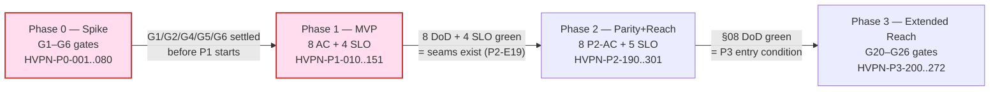
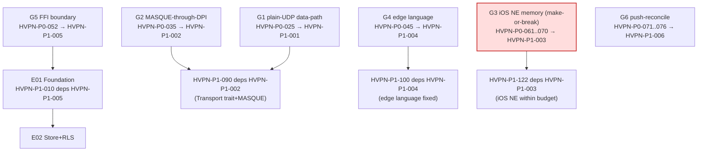
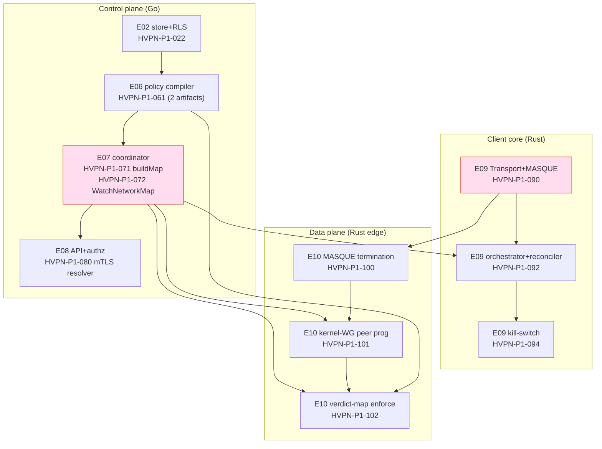
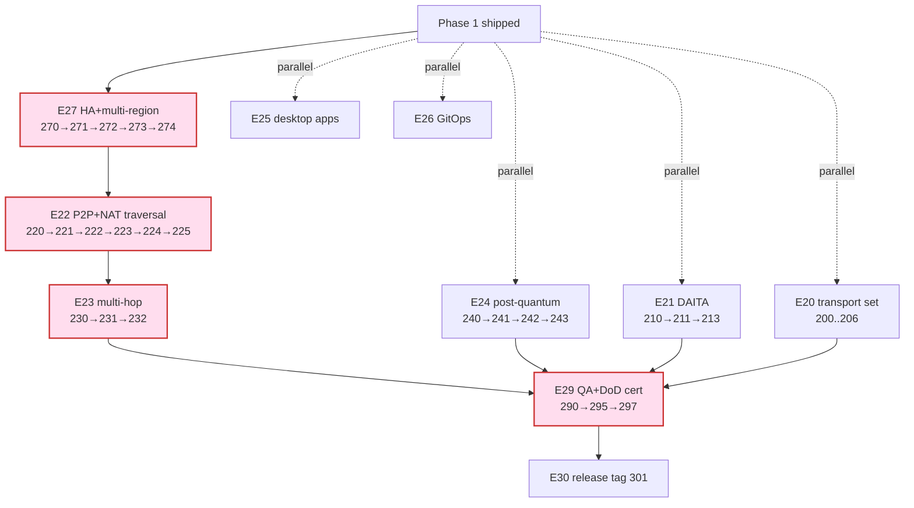
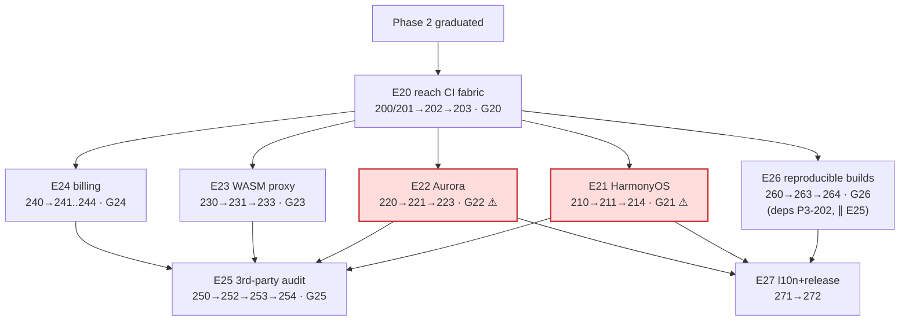

# Cross-Phase Dependency Graph — the HelixVPN delivery DAG and critical paths

**Revision:** 3
**Last modified:** 2026-07-04T12:00:00Z
**Rev 3:** Corrected §7 master-dependency-table row for `HVPN-P0-035` (G2 DPI-survival)
— it listed `HVPN-P0-039` (Rust edge build) in its `blocks` column, but `06-phase0-spike-wbs.md`
shows `HVPN-P0-039` depends directly on `HVPN-P0-031` (MASQUE framing), not `HVPN-P0-035`
(the later DPI-block-survival proof); both share the common ancestor `031`, so the edge was
transitively-plausible but not a cited `deps` field, violating this doc's own "nothing invented"
guarantee (§0). Fixed per gap analysis against `06-…` §6 (reconciled against `06-phase0-spike-wbs.md`
as the authoritative WBS for Phase-0 `depends_on` fields, per SPECIFICATION.md's spine-wins rule).

> Volume 7 (Phase Execution), document 2 of 5. This spec consolidates the
> dependency edges scattered across the four phase WBS documents into one
> **cross-phase directed acyclic graph (DAG)**: which Phase-0 spikes gate which
> Phase-1 epics, the critical path to the MVP tag, the cross-component
> dependencies that bind data-plane ↔ control-plane ↔ client, and the parallel
> fan-outs that compress wall-clock. It is **spec-only** — every edge is cited to
> a `depends_on`/`deps` field in `06-phase0-spike-wbs.md` (`HVPN-P0-NNN`),
> `07-phase1-mvp-wbs.md` (`HVPN-P1-NNN`), `08-phase2-parity-wbs.md`
> (`HVPN-P2-NNN`), or `09-phase3-reach-wbs.md` (`HVPN-P3-NNN`); nothing is
> invented. The DAG is the structure the `workable-items` loader validates for
> acyclicity (§11.4.93, see `workable-items-model.md` §8). All durations are
> sizing-only `TARGET`s — never date commitments (§11.4.6, the phase docs'
> no-commitment caveat).

---

## Table of contents

- [0. Reading the DAG](#0-reading-the-dag)
- [1. Programme-level phase DAG](#1-programme-level-phase-dag)
- [2. Phase 0 → Phase 1 gating (spikes that unblock epics)](#2-phase-0--phase-1-gating-spikes-that-unblock-epics)
- [3. The Phase-1 MVP critical path](#3-the-phase-1-mvp-critical-path)
- [4. Cross-component dependencies (data ↔ control ↔ client)](#4-cross-component-dependencies-data--control--client)
- [5. Phase-2 critical path + parallel high-risk tracks](#5-phase-2-critical-path--parallel-high-risk-tracks)
- [6. Phase-3 critical path + device-gated parking](#6-phase-3-critical-path--device-gated-parking)
- [7. Master dependency table (item → depends-on → blocks)](#7-master-dependency-table-item--depends-on--blocks)
- [8. Critical-path call-out + parallelism rules](#8-critical-path-call-out--parallelism-rules)
- [Sources verified](#sources-verified)

---

## 0. Reading the DAG

An edge `A → B` means **B depends on A** (A must be `complete` before B starts),
sourced from B's `depends_on`/`deps` field in its WBS doc. Cross-phase edges cite
the full id (`08-…` §0). The graph is acyclic by construction; `workable-items
validate` (`workable-items-model.md` §8) fails the build on any cycle.

Risk-ordering (§11.4.132) governs *sequencing within* the DAG: the irreversible
correctness floor (RLS, no-log lint, kill-switch, NAT-traversal honesty, PQ
downgrade-safety) leads; convenience UI trails. Red nodes are the critical-path /
make-or-break carries each phase doc flags.

---

## 1. Programme-level phase DAG



Each phase boundary is a hard gate (`07-…` §5, `08-…` §5, `09-…` §2.0): the
make-or-break Phase-0 carries (G3 iOS memory, G4 edge language) are *resolved
before* Phase 1 starts (`07-…` §4); Phase 2 assumes the Phase-1 seams exist
(`08-…` §5 entry gate `HVPN-P2-190/191/192`); Phase 3 starts only when Phase 2
has graduated (`09-…` §2.0).

---

## 2. Phase 0 → Phase 1 gating (spikes that unblock epics)

The six Phase-0 gates map to Phase-1 entry items `HVPN-P1-001..006` (`07-…` §5),
which in turn gate the Phase-1 epics. The dependency-bearing edges (from the
Phase-1 `deps` fields):



| Phase-0 gate | Decides | Phase-1 entry item | Phase-1 epic it unblocks |
|---|---|---|---|
| **G1** plain-UDP slice (`HVPN-P0-025`) | core viability | `HVPN-P1-001` | E09 (`HVPN-P1-090` Transport) |
| **G2** MASQUE through DPI (`HVPN-P0-035`) | obfuscation D1 | `HVPN-P1-002` | E09 `HVPN-P1-090`, E10 `HVPN-P1-100` |
| **G3** iOS NE memory (`HVPN-P0-061..070`) | **Rust-on-every-platform D2** | `HVPN-P1-003` | E12 `HVPN-P1-122` (iOS shim) |
| **G4** Go-vs-Rust edge (`HVPN-P0-045`) | edge language D5 | `HVPN-P1-004` | E10 `HVPN-P1-100` (fixes edge lang) |
| **G5** frb FFI (`HVPN-P0-052`) | FFI boundary | `HVPN-P1-005` | E01 `HVPN-P1-010` (monorepo) |
| **G6** push-reconcile (`HVPN-P0-071..076`) | push model seed | `HVPN-P1-006` | E07 `WatchNetworkMap` seed |

> **G3 fail-path (§11.4.66).** If the iOS memory gate fails, `HVPN-P1-122` (iOS
> shim) re-plans against the §6.4 fallback ladder (`07-…` §5 note) — a decision
> surfaced, not silently resolved.

---

## 3. The Phase-1 MVP critical path

The longest dependency chain to AC certification (`07-…` §22), with the red
critical-path epics E02/E03/E07/E09/E14 (`07-…` §4):


Critical path: `E01(010→011) → E02(020→021→022) → E03(032) →
E07(070→071→072→073) → E09(092→093/094) → E10(100→101→102) →
E14(140→142→144→145) → E15(151)` (`07-…` §22). The two parallel fan-outs that
keep wall-clock down: **E04/E05/E06** off E02 (disjoint scope → concurrent PWUs
§11.4.58), and **E11 UI** off E08/E09 in parallel with E10/E12.

---

## 4. Cross-component dependencies (data ↔ control ↔ client)

The architecture's three planes (data / control / client) are bound by specific
`deps` edges. The MVP is hub-and-spoke: the coordinator computes per-node maps,
the edge enforces them, the client core reconciles them.



The load-bearing cross-plane edges (from the `deps` fields):

| Edge | Cited dep | Why it binds the planes |
|---|---|---|
| policy compiler → coordinator | `HVPN-P1-070` deps `HVPN-P1-061` | `buildMap` consumes the compiled `{visible,allowedIPs,verdict-map}` (`07-…` §11/§12) |
| coordinator → client reconciler | `HVPN-P1-092` deps `HVPN-P1-072` | the client converges to streamed `MapUpdate` deltas (`07-…` §14) |
| Transport trait → edge | `HVPN-P1-100` deps `HVPN-P1-090,004` | edge reuses `helix-transport` byte-for-byte; G4 fixes language (`07-…` §15) |
| compiler verdict-map → edge | `HVPN-P1-102` deps `HVPN-P1-061,101,033` | edge applies the port-level verdict map WG `AllowedIPs` lacks (`07-…` §15) |
| PKI cert → API/coordinator authz | `HVPN-P1-080` deps `HVPN-P1-032`; `HVPN-P1-072` auth via mTLS | the device cert authenticates the stream (`07-…` §12/§13) |
| IPAM → enroll | `HVPN-P1-031` deps `HVPN-P1-040` | enroll allocates the overlay IP before issuing the map (`07-…` §8) |

---

## 5. Phase-2 critical path + parallel high-risk tracks

Phase 2 is additive off the shipped MVP (`08-…` §4). The networking/reach spine
is the critical path; PQ and DAITA are parallel measure-don't-assert tracks.



Critical path: `E27(270→271→272→273→274) → E22(220→221→222→223→224→225) →
E23(230→231→232) → E29(290→295→297) → E30(301)` (`08-…` §19). E27 leads because
the STUN endpoints, relay fleet, and NATS mesh that E22/E26/E28 consume are *its*
outputs (`08-…` §4): `HVPN-P2-220` (STUN discovery) deps `HVPN-P2-271`;
`HVPN-P2-223` (relay) deps `HVPN-P2-273`. The two high-risk parallel tracks that
converge at E29 but do **not** sit on the networking critical path: **E24 (PQ)**
and **E21 (DAITA)** — each a disjoint-scope PWU (§11.4.58). Per §11.4.132 the
correctness-and-downgrade-safety floor leads: NAT-traversal honesty
(`HVPN-P2-222` no-false-direct), PQ never-weaker-than-classical (`HVPN-P2-242`),
DAITA measured efficacy (`HVPN-P2-213`).

---

## 6. Phase-3 critical path + device-gated parking

Phase 3's two native shims (E21 HarmonyOS, E22 Aurora) are the make-or-break
carries; they run as disjoint-scope parallel PWUs the moment E20's fork runners
exist, and *park* on `PENDING_DEVICE` while host-only work proceeds (`09-…` §4).



Critical path (risk-ordered §11.4.132): `E20(200/201→203) →
{E21(210→211→214) ∥ E22(220→221→223)} → E25(250→252→253→254) →
E27(271→272)`. E25 (audit) is a **convergence gate** — it cannot start until the
surfaces it audits (E21–E24) are feature-complete (`HVPN-P3-250` deps
`214,223,233,244`). **E26 (reproducible builds, 260→263→264) runs ∥ E25**, gated
only by E20: `HVPN-P3-260` deps `HVPN-P3-202` (→ `200/201`), **not** P3-254
(`09-…` §11). Both E25 (`254`) and E26 (`264`) converge into the release set at
`HVPN-P3-271` (deps `…,254,264`). The `09-…` §14 critical-path note sequences
E25→E26; this DAG corrects that to the actual `deps` edges per §0 (nothing
invented). While E21/E22 await device access (`PENDING_DEVICE`),
E23/E24/E26-tooling progress as ≥3 background streams (§11.4.103, `09-…` §4).

---

## 7. Master dependency table (item → depends-on → blocks)

The load-bearing edges per phase (selected critical/cross-component edges; the
full set is every `deps`/`depends_on` field in the four WBS docs, which the
loader ingests). `blocks` = the inverse edge (what waits on this item).

| Item | Depends on | Blocks (selected) | Source |
|---|---|---|---|
| `HVPN-P0-004` Transport trait | `HVPN-P0-002` | `HVPN-P0-008`,`028`,`049` | `06-…` §3 |
| `HVPN-P0-008` plain-UDP | `HVPN-P0-006` | `HVPN-P0-018` (orchestrator) | `06-…` §3 |
| `HVPN-P0-025` G1 reach | `HVPN-P0-020,023` | `HVPN-P1-001` (G1 entry) | `06-…` §5 |
| `HVPN-P0-035` G2 MASQUE | `HVPN-P0-031,024` | `HVPN-P1-002` (G2 entry) | `06-…` §6 |
| `HVPN-P0-039` Rust edge (`helix-edge`) | `HVPN-P0-031` | `HVPN-P0-045` (A/B bench, G4) | `06-…` §7 |
| `HVPN-P0-045` G4 bench | `HVPN-P0-040,043` | `HVPN-P1-004` (edge lang) | `06-…` §7 |
| `HVPN-P1-010` monorepo | `HVPN-P1-005` (G5) | `HVPN-P1-011,013,110,150` | `07-…` §6 |
| `HVPN-P1-022` FORCE-RLS | `HVPN-P1-021` | `HVPN-P1-030,032,040,050,060` | `07-…` §7 |
| `HVPN-P1-061` policy compiler | `HVPN-P1-060` | `HVPN-P1-062,070,102` | `07-…` §11 |
| `HVPN-P1-072` WatchNetworkMap | `HVPN-P1-071,080` | `HVPN-P1-073,092,101` | `07-…` §12 |
| `HVPN-P1-090` Transport (prod) | `HVPN-P1-002` | `HVPN-P1-091,093,100` | `07-…` §14 |
| `HVPN-P1-100` edge MASQUE term | `HVPN-P1-090,004` | `HVPN-P1-101,102,261` | `07-…` §15 |
| `HVPN-P1-145` DoD cert | `140,141,142,143,144` | `HVPN-P1-151` (tag) | `07-…` §19 |
| `HVPN-P2-190` Transport seam | `HVPN-P1-090` | `HVPN-P2-200,201,202` | `08-…` §5 |
| `HVPN-P2-220` STUN discovery | `HVPN-P2-191,271` | `HVPN-P2-221,222,296` | `08-…` §8 |
| `HVPN-P2-222` hole-punch | `HVPN-P2-220,221` | `HVPN-P2-223,224,290` | `08-…` §8 |
| `HVPN-P2-240` ML-KEM PSK | `HVPN-P2-192` | `HVPN-P2-241,244` | `08-…` §10 |
| `HVPN-P2-272` NATS mesh | `HVPN-P2-270` | `HVPN-P2-273,281,295` | `08-…` §13 |
| `HVPN-P2-297` Phase-2 DoD | `290..296` | `HVPN-P2-301` (tag) | `08-…` §15 |
| `HVPN-P3-200/201` fork runners | `—` | `HVPN-P3-210,220,230,260` | `09-…` §5 |
| `HVPN-P3-210` OHOS cross-compile | `HVPN-P3-200` | `HVPN-P3-211` | `09-…` §6 |
| `HVPN-P3-250` audit scope | `214,223,233,244` | `HVPN-P3-252,253` | `09-…` §10 |
| `HVPN-P3-260` determinize builds | `HVPN-P3-202` | `HVPN-P3-261,262,263` | `09-…` §11 |

---

## 8. Critical-path call-out + parallelism rules

**The single longest chain to a published release** (programme critical path,
concatenating the per-phase critical paths at the gate boundaries):

```
Phase 0:  HVPN-P0-002 → 004 → 008 → 018 → 025(G1) → 031 → 035(G2) → 045(G4)
Phase 1:  → P1-010 → 022 → 032 → 070 → 071 → 072 → 092 → 094 → 100 → 102 → 145 → 151(MVP tag)
Phase 2:  → P2-270 → 271 → 272 → 220 → 222 → 223 → 224 → 230 → 232 → 295 → 297 → 301(parity tag)
Phase 3:  → P3-200 → 203(G20) → 210 → 211 → 214(G21) → 250 → 252 → 253 → 254(G25) → 271 → 272(reach tag)   [∥ E26: 260→263→264(G26), gated on P3-202, converges at 271]
```

> **`→` here is sequence, not necessarily a `deps` edge.** Within each per-phase
> line above, `→` denotes **execution sequence** (risk-ordered §11.4.132), not
> the §0 dependency relation. Some adjacent steps are ordered by phase/gate
> sequencing and reach their successor through intermediate `deps` not shown
> inline — e.g. P0 `018→025`, P1 `094→100`/`100→102`/`102→145`, P2
> `272→220`/`290→295`/`232→295`. The **direct** dependency edges (where `A → B`
> means B `deps` A per §0) are those enumerated in §2–§7 and the WBS docs.

Parallelism rules that compress this wall-clock (each cited to a constitution
anchor + the WBS note that invokes it):

| Rule | Where it applies | Anchor |
|---|---|---|
| Disjoint-scope PWUs run fully parallel | P1 E04/E05/E06 off E02; P2 E20/E21/E24/E25; P3 E23/E24 off E20 | §11.4.58 |
| ≥3 background streams + auto-backfill | every phase; P3 while shims park on `PENDING_DEVICE` | §11.4.103 |
| Single-resource-owner for shared hardware | P0 S4 vs S7 must NOT share the bench host at once | §11.4.119 (`06-…` §2 note) |
| Risk-ordered sequencing (highest-risk first) | RLS/kill-switch/NAT-honesty/PQ-downgrade-safety lead | §11.4.132 |
| Audio-style top-priority maps to correctness floor | every phase's iteration ordering | §11.4.72→§11.4.132 |

**Honest-uncertainty markers (§11.4.6).** Phase-3 device-gated nodes
(`HVPN-P3-211/221` and downstream) carry the widest error bars and are
`UNCONFIRMED:`/`PENDING_DEVICE:` until hardware exists (`09-…` §14 risk register).
A gate that cannot be cleared on the real device **is the finding** — escalate
per §11.4.66/.101/.112, never overrun silently. No edge in this DAG implies a
calendar date; every duration is a sizing-only `TARGET`.

---

## Sources verified

- `06-phase0-spike-wbs.md` §2 milestone DAG + §2 parallelism note, §3–§11 per-milestone `depends_on` fields, gates table — read 2026-06-26.
- `07-phase1-mvp-wbs.md` §4 epic DAG, §5 entry gates, §21 traceability, §22 critical path + effort caveat — read 2026-06-26.
- `08-phase2-parity-wbs.md` §4 epic DAG, §5 entry seams, §18 traceability, §19 critical path — read 2026-06-26.
- `09-phase3-reach-wbs.md` §2.1 gate DAG, §4 epic DAG, §13 traceability, §14 critical path + risk register — read 2026-06-26.
- Sibling `workable-items-model.md` (§8 loader acyclicity validation) — authored this volume.
- Constitution anchors §11.4.58/.66/.72/.101/.103/.112/.119/.132 — read 2026-06-26.

> Honest boundary (§11.4.6): every edge is transcribed from a cited WBS `deps`
> field; no dependency is inferred or invented. Durations are sizing `TARGET`s,
> never commitments; device-gated Phase-3 chains remain `PENDING_DEVICE`.
