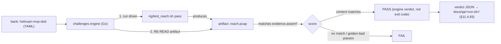
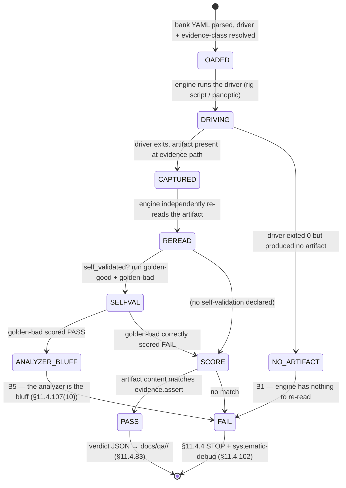

# Challenges — HelixVPN nano-detail spec (Volume 8 · §11.4.169 type 5)

**Revision:** 1
**Last modified:** 2026-06-26T12:00:00Z

> Nano-detail expansion of [§5.5 of the Volume-8 overview](../10-testing-acceptance-and-qa.md).
> Challenges are the constitution's anti-bluff Challenge layer (§11.4.27(B)) — the
> `vasic-digital/challenges` submodule, a Go engine that scores a feature PASS
> **only** on captured evidence matching the §11.4.69 shape for that feature class,
> graded by the **engine re-reading the artifact**, never by the test's own exit
> code. This is the structural defence against bluff-classes **B1 (config-only)**,
> **B2 (absence-of-error)**, and **B3 (wrong-plane)**: the Challenge engine does not
> trust the harness's claim — it re-reads the pcap / counter / recording itself. The
> eight MVP Definition-of-Done acceptance criteria (AC1–AC9, [overview §7.2](../10-testing-acceptance-and-qa.md)) are authored as executable Challenges. This
> document fixes the bank model, the engine contract, the evidence scoring, the
> determinism, the gate, the paired §1.1 mutation, and a concrete bank YAML. Spec-only;
> unproven assumptions marked `UNVERIFIED`. Siblings: [unit.md](unit.md),
> [integration.md](integration.md), [e2e.md](e2e.md), [full-automation.md](full-automation.md),
> [helixqa.md](helixqa.md).

---

## Table of contents

- [1. Scope — what a Challenge is, and what it covers](#1-scope--what-a-challenge-is-and-what-it-covers)
- [2. Harness — the challenges submodule engine](#2-harness--the-challenges-submodule-engine)
- [3. Fixtures — real on-rig drivers, engine-scored evidence](#3-fixtures--real-on-rig-drivers-engine-scored-evidence)
- [4. Evidence taxonomy — engine-re-read, not exit-code](#4-evidence-taxonomy--engine-re-read-not-exit-code)
- [5. Determinism — N-iteration identical evidence](#5-determinism--n-iteration-identical-evidence)
- [6. Acceptance gate — when CHAL blocks a release](#6-acceptance-gate--when-chal-blocks-a-release)
- [7. The paired §1.1 mutation (anti-bluff proof)](#7-the-paired-11-mutation-anti-bluff-proof)
- [8. The MVP-DoD bank (concrete YAML)](#8-the-mvp-dod-bank-concrete-yaml)
- [9. Open decisions surfaced for QA](#9-open-decisions-surfaced-for-qa)
- [Sources verified](#sources-verified)

---

## 1. Scope — what a Challenge is, and what it covers

A Challenge differs from a test in **who grades it**. A test asserts and exits with a
code; a Challenge runs a driver, then the `challenges` engine **independently
re-reads the captured evidence artifact** and scores PASS only if the artifact's
content matches the declared §11.4.69 shape for that feature class. The test's exit
code is *not* the verdict — the re-read is. This is the §11.4.27(B) anti-bluff layer:
even a perfectly-written but lying harness cannot fake a Challenge, because the
engine never sees the harness's claim, only its artifact.

| Challenge | Feature class (§11.4.69) | What the engine re-reads | Bound AC |
|---|---|---|---|
| `HVPN-CHAL-AC1-selfhost` | `boot_service` | recorded terminal + `helix_up==1` healthcheck | AC1 |
| `HVPN-CHAL-AC2-authorized-reach` | `network_connectivity` | pcap: SYN→SYN-ACK from 10.10.0.20 + non-empty body hash | AC2 |
| `HVPN-CHAL-AC3-default-deny` | `network_connectivity` (negative) | pcap: SYN out, **zero** SYN-ACK; edge `drop++` | AC3 |
| `HVPN-CHAL-AC4-masque-escalate` | `network_connectivity` | tshark: HTTP/3 flow, **no** WG signature; `transport=="masque-h3"` | AC4 |
| `HVPN-CHAL-AC5-reconcile` | counter delta | `helix_reconcile_seconds` p99 histogram bucket < 1 s | AC5 |
| `HVPN-CHAL-AC6-revoke` | counter delta | revoke-ts → edge-peer-removed-ts CSV, p99 < 1 s | AC6 |
| `HVPN-CHAL-AC7-killswitch-no-leak` | `killswitch_negative` | host pcap: **zero** plaintext egress, **zero** :53 DNS | AC7 |
| `HVPN-CHAL-AC8-no-log-schema` | negative (schema) | `schemalint` report: zero durable per-flow tables | AC8 |
| `HVPN-CHAL-AC9-three-apps` | `REC` | per-app window-scoped MP4 + `vision_engine` verdict | AC9 |

Challenges cover the **DoD acceptance set** — the release-gating proof that the
product works for the end user. They sit at the top of the test pyramid below REC
([overview §4](../10-testing-acceptance-and-qa.md)) and are driven by `helix_qa`
([helixqa.md](helixqa.md)).

---

## 2. Harness — the challenges submodule engine

The `challenges` submodule (`digital.vasic.challenges`, Go) is consumed via a
`replace` directive in development and a **pinned SHA** in release ([05 §6.1](../05-repo-layout-tooling-and-helix-ecosystem.md)), per §11.4.27(B)/§11.4.74
(reuse-don't-reimplement) + §11.4.28 (owned submodule, equal-codebase). A **bank
file** (`challenges/banks/helixvpn_mvp_dod.yaml`) maps each AC to its on-rig driver +
the evidence-class assertion the engine scores against.



- **Consumed by reference, never copied** (§11.4.28) — the engine lives in the
  submodule; the consumer registers its banks as data (the YAML), keeping the engine
  project-agnostic.
- **Engine-scored, never exit-code** — the engine runs the driver, captures the
  artifact, then **re-reads** it; `score: pass_only_if_evidence_matches` is the
  contract. A driver that exits 0 but produced no matching artifact scores **FAIL**.
- **Self-validated** (§11.4.107(10)) — a Challenge with `self_validated: true` ships a
  **golden-bad** artifact (a seeded-leak pcap, a WG flow mislabelled H3) that the
  engine **must** score FAIL; if it scores PASS, the analyzer is the bluff and the
  meta-test FAILs (`CM-ANALYZER-SELF-VALIDATED`, defeats B5).

---

## 3. Fixtures — real on-rig drivers, engine-scored evidence

| Fixture | Real or mock | Notes |
|---|---|---|
| AC drivers | **real** rig scripts ([e2e.md §8](e2e.md), [§5.7 SEC](../10-testing-acceptance-and-qa.md)) | `rig/test_reach.sh`, `rig/killswitch_drop.sh`, etc. — real packets |
| captured artifacts | **real** pcap/CSV/MP4/schemalint report | the engine re-reads these; they are not synthetic |
| golden-good fixture | real captured-clean artifact | the self-validation positive case |
| golden-bad fixture | real captured-bad artifact (seeded leak) | the self-validation negative case — **must** score FAIL |
| **mocks** | **FORBIDDEN** (§11.4.27) | Challenges are above the unit layer; the engine re-reads real evidence |

The engine's re-read is the anti-mock guarantee: there is nothing to mock — the
verdict is computed from a real pcap/CSV/MP4 captured during a real run. The only
out-of-band step is the §11.4.10 credential bootstrap for AC1's `init`.

---

## 4. Evidence taxonomy — engine-re-read, not exit-code

The defining property: the Challenge **verdict = the engine's re-read of the
artifact**, mapped to the §11.4.69 class shape:

| Class | Engine assertion | Forbidden bluff it defeats |
|---|---|---|
| `network_connectivity` | tshark/pcap filter matches (SYN-ACK present) **and** body hash non-empty | B1 config-only — a config check produces no pcap |
| `network_connectivity` (negative) | filter matches **zero** rows (no SYN-ACK) + edge `drop++` | B2 absence-of-error — "no error" is not "zero SYN-ACK captured" |
| `killswitch_negative` | `assert_zero: "ip && not loopback"` + `assert_zero_dns: "udp.port==53"` | B2 — the engine counts plaintext/DNS packets, not "kill-switch enabled" |
| counter delta | histogram bucket / timing CSV p99 < budget | B3 wrong-plane — a status field is not a measured delta |
| `REC` | `vision_engine` OCR verdict on the MP4 + core-FSM cross-check | B3 — a green shield while the FSM is `Blocked` FAILs |

Per §11.4.83 the engine's per-AC verdict JSON lands under `docs/qa/<run-id>/` (the
committed evidence trail); per §11.4.69 a PASS without a matching artifact is
impossible — the engine has nothing to score. The verdict JSON carries the artifact
path (the §11.4.116 verdict-carries-evidence-path rule, [helixqa.md §4](helixqa.md)).

---

## 5. Determinism — N-iteration identical evidence

Per §11.4.50 each Challenge runs N=3 (normal) / N=10 (cycle-validation) under the FA
wrapper ([full-automation.md §5](full-automation.md)):

1. The driver runs on the clean rig per iteration; the engine re-reads each
   iteration's artifact; the **structural hash** of the matched-evidence set is
   compared across runs; a divergence is auto-FAIL.
2. The body-hash / drop-count / schemalint-table-set are deterministic by
   construction (fixed sink page, fixed policy); timing fields are compared to a
   budget, not hashed.
3. A Challenge that scores PASS on run 1 and FAIL on run 2 is **not** a flake — it is
   a real defect surfaced (§11.4.50 mechanises §11.4.7); the §11.4.4 STOP fires.

---

## 6. Acceptance gate — when CHAL blocks a release

| Gate | Bar | Layer |
|---|---|---|
| **`make qa`** ([overview §9](../10-testing-acceptance-and-qa.md)) | every DoD Challenge scores PASS via the engine, N=3 | release sweep |
| **`CM-DOD-CHALLENGES-GREEN`** | a release tag is **blocked** while any DoD Challenge is non-PASS | pre-tag (§11.4.40) |
| **`CM-ANALYZER-SELF-VALIDATED`** (§11.4.107(10)) | every `self_validated` Challenge's golden-bad artifact scores FAIL | pre-build meta-test |

CHAL is a **release-gating layer**: the MVP ships only when all eight ACs' Challenges
score PASS on a clean baseline (§11.4.40 + §11.4.108 runtime-signature on a fresh
deploy). This is QA-D5 ([overview §10](../10-testing-acceptance-and-qa.md)) resolved:
**`challenges`-scored, not raw exit codes** — the engine re-reads the evidence
artifact, structurally defeating B1–B3; exit codes alone are bluffable (§11.4.27).

---

## 7. The paired §1.1 mutation (anti-bluff proof)

```text
# §1.1 mutation for CM-ANALYZER-SELF-VALIDATED (the engine's self-validation is real)
- the AC7 kill-switch Challenge has self_validated: true with golden-bad =
  fixtures/killswitch_leaked_dns.pcap (a seeded :53 leak)
- MUTATE the engine's assertion: strip `assert_zero_dns: "udp.port==53"`
- assert: the engine now SCORES the leaked-DNS golden-bad pcap as PASS → meta-test FAILs
  (the analyzer became a bluff — B5 caught)
- restore the assertion; assert golden-bad scores FAIL again (§11.4.84 quiescence)
```

```text
# §1.1 mutation for CM-DOD-CHALLENGES-GREEN (engine re-reads, not exit code)
- make rig/test_reach.sh `exit 0` but produce an EMPTY pcap (a lying harness)
- assert: the engine re-reads the empty pcap, finds no SYN-ACK → scores FAIL (not PASS)
  → proves the verdict comes from the artifact, not the exit code (defeats B1)
```

The second mutation is the structural proof of the Challenge model: a harness that
*claims* success but produced no matching evidence scores FAIL, because the engine
grades the artifact, never the claim.

---

## 8. The MVP-DoD bank (concrete YAML)

```yaml
# challenges/banks/helixvpn_mvp_dod.yaml — one entry per DoD AC (§11.4.27(B)/.69/.83)
bank: helixvpn-mvp-dod
engine: digital.vasic.challenges          # consumed by-reference, pinned SHA in release (§11.4.28)
score_policy: pass_only_if_evidence_matches   # NEVER trust a driver's exit code
evidence_root: docs/qa/${RUN_ID}              # §11.4.83 committed trail

challenges:
  - id: HVPN-CHAL-AC2-authorized-reach
    feature_class: network_connectivity        # §11.4.69
    driver: rig/test_reach.sh pass
    evidence:
      kind: pcap
      assert: "frame.tcp.flags.syn==1 && frame.tcp.flags.ack==1 from 10.10.0.20"
      and_body_hash_nonempty: true              # defeats B1 (config-only)

  - id: HVPN-CHAL-AC3-default-deny
    feature_class: network_connectivity_negative
    driver: rig/test_reach.sh deny
    evidence:
      kind: pcap
      assert_zero: "tcp.flags.syn==1 && tcp.flags.ack==1"   # ZERO SYN-ACK
      and_edge_counter: "drop > 0"                            # defeats B2 (absence-of-error)

  - id: HVPN-CHAL-AC4-masque-escalate
    feature_class: network_connectivity
    driver: rig/escalate.sh
    evidence:
      kind: pcap+status
      assert: "http3 present && wireguard absent"            # tshark classification
      and_status: "transport == 'masque-h3'"                 # defeats B3 (wrong-plane)

  - id: HVPN-CHAL-AC6-revoke
    feature_class: counter_delta
    driver: rig/revoke.sh
    evidence:
      kind: csv
      assert_p99_lt_seconds: 1.0                              # revoke→enforcement < 1s (SLO3)

  - id: HVPN-CHAL-AC7-killswitch-no-leak
    feature_class: killswitch_negative
    driver: rig/killswitch_drop.sh
    evidence:
      kind: pcap
      assert_zero: "ip && not loopback"          # zero plaintext egress on drop
      assert_zero_dns: "udp.port==53"            # zero DNS leak
    self_validated: true                          # golden-bad seeded-leak pcap MUST score FAIL (§3.3)
    golden_good: fixtures/killswitch_clean.pcap
    golden_bad:  fixtures/killswitch_leaked_dns.pcap

  - id: HVPN-CHAL-AC8-no-log-schema
    feature_class: schema_negative
    driver: scripts/schemalint.sh
    evidence:
      kind: report
      assert: "forbidden_table_count == 0"       # no durable per-flow table

  - id: HVPN-CHAL-AC9-three-apps
    feature_class: REC                            # §11.4.153/.159
    driver: panoptic drive --app access,connector,console --flow enroll-connect-reach
    evidence:
      kind: mp4
      window_scoped: true                         # §11.4.154 — app window only, not desktop
      filename_prefix: helixvpn---               # §11.4.155 project prefix
      vision_verdict: vision_engine               # §11.4.163 media-validation re-read
      expected_patterns: ["Connect","Connecting","Connected","shield:green"]
      cross_check: { core_fsm_at_green_shield: "Connected" }   # defeats B3
    self_validated: true                          # golden-bad MP4 (green shield, FSM Blocked) MUST FAIL
```

---

## 8a. Challenge lifecycle (engine internals)

A Challenge moves through a fixed lifecycle inside the engine; understanding it is
how the consumer reasons about a verdict:



**Failure-mode catalog (what scores FAIL, and why that is correct):**

| Symptom | Engine behaviour | Why it is a FAIL not a flake |
|---|---|---|
| driver exits 0, empty pcap | `NO_ARTIFACT → FAIL` | the verdict is the re-read, not the exit code (B1) |
| pcap present, no SYN-ACK row | `SCORE → FAIL` | reach not proven on the wire (§11.4.69) |
| `transport=="masque-h3"` but pcap has a WG signature | `SCORE → FAIL` | wrong-plane lie (B3) — status and wire disagree |
| golden-bad leaked-DNS pcap scores PASS | `ANALYZER_BLUFF → FAIL` | the analyzer cannot distinguish leak from clean (B5) |
| run 1 PASS, run 2 FAIL | §11.4.50 auto-FAIL | a real defect surfaced, never demoted to "flake" (§11.4.7) |

The engine **never** converts an empty/unreachable artifact into a PASS-counting
SKIP for a feature class that has a sink-side probe (§11.4.69 `CM-NO-FAIL-OPEN-SKIP`)
— a genuinely-absent topology is an honest §11.4.3 SKIP with a closed-set reason
surfaced on the sync channel ([helixqa.md §4](helixqa.md)), never a silent pass.

## 9. Open decisions surfaced for QA

| # | Decision | Options | Recommendation |
|---|---|---|---|
| **C-D1** | Challenge engine vs raw exit codes (QA-D5) | exit-code vs `challenges`-scored | **`challenges`-scored** ([overview §10](../10-testing-acceptance-and-qa.md)) — the engine re-reads the artifact, structurally defeating B1–B3 |
| **C-D2** | bank consumption mode | `replace` (dev) vs pinned SHA (release) | **`replace` in dev, pinned SHA in release** ([05 §6.1](../05-repo-layout-tooling-and-helix-ecosystem.md)) — reproducible release, fast dev iteration |
| **C-D3** | golden-bad fixture authorship | hand-seed each vs derive from a real failed run | **hand-seed the canonical bad artifact + add any real failed-run capture as a second golden-bad** — broadens the self-validation surface (§11.4.107(10)) |

## 9a. Challenge-vs-test-vs-HelixQA — who owns what

The three top-of-pyramid layers are distinct and composing, not redundant:

| Layer | Grades by | Owns | Spec |
|---|---|---|---|
| **test** (E2E/INT) | its own exit code + an `ab_pass_with_evidence` call | the assertion | [e2e.md](e2e.md), [integration.md](integration.md) |
| **Challenge** | the `challenges` **engine re-reading the artifact** | the DoD AC verdict (B1–B3-proof) | this doc |
| **HelixQA** | the orchestrator driving + reconciling all of them, no human | the autonomous session + sync channel + tickets | [helixqa.md](helixqa.md) |

A Challenge consumes a test's *driver* but ignores its *verdict*; HelixQA consumes a
Challenge's *verdict* and reconciles it into the coverage ledger + the workable-items
DB. The chain — test drives, Challenge re-reads, HelixQA orchestrates — is three
independent re-reads of the same captured evidence, which is precisely why a bluff
must survive all three to ship, and by construction cannot (§11.4.27(B) / §11.4.165).

**Why the engine is a submodule, not in-project (§11.4.74/.28).** The re-read logic
(pcap filters, counter parsers, OCR verdict) is reusable across every Helix project
that needs anti-bluff acceptance scoring; reimplementing it in-project would
duplicate the 80%+ that `challenges` already covers (§11.4.74 catalogue-first). The
consumer contributes only **data** (the bank YAML) and any missing assertion kind is
added by an upstream PR to `vasic-digital/challenges` (§11.4.74), never a local fork —
keeping the engine project-agnostic and the consumer decoupled (§11.4.28).

> **`UNVERIFIED`:** the `digital.vasic.challenges` engine's exact bank-YAML schema
> (`score_policy`, `assert_zero`, `self_validated`, `vision_verdict` keys) is the
> **intended** shape per the overview skeleton; confirm against the pinned
> `vasic-digital/challenges` SHA (§11.4.74 — extend upstream if a key is unsupported).

---

## Sources verified

- [Volume-8 overview](../10-testing-acceptance-and-qa.md) §2 (taxonomy row `CHAL`), §5.5 (the bank YAML skeleton + engine-scored model), §5.6 (`helix_qa` drives banks), §3.3 (self-validated analyzers), §7.2 (AC1–AC9), §10 QA-D5 — read 2026-06-26.
- Sibling specs cross-referenced: [e2e.md](e2e.md), [helixqa.md](helixqa.md), [full-automation.md](full-automation.md), [../05-repo-layout-tooling-and-helix-ecosystem.md](../05-repo-layout-tooling-and-helix-ecosystem.md) — overview + repo doc read; the `[05]` ecosystem doc is the `[P1]` overview present at `final/`.
- Constitution: §11.4.27(B) (Challenges / no-fakes-beyond-unit), §11.4.69 (sink-side evidence taxonomy), §11.4.107(10) (self-validated analyzer / golden-good+bad), §11.4.83 (`docs/qa/<run-id>/` evidence trail), §11.4.116 (verdict-carries-evidence-path), §11.4.28 (owned submodule consumed by reference), §11.4.74 (extend-upstream), §11.4.50 (determinism), §11.4.40 (pre-tag gate), §11.4.108 (runtime-signature on clean deploy), §11.4.153/.154/.155/.159/.163 (REC / window-scope / prefix / media-validation for AC9), §1.1 (paired mutation) — from `CLAUDE.md` in-context.
- The `challenges` engine bank-YAML schema is reproduced from the overview skeleton — **not independently fetched from `vasic-digital/challenges`** (`UNVERIFIED`; confirm at the pinned SHA).
