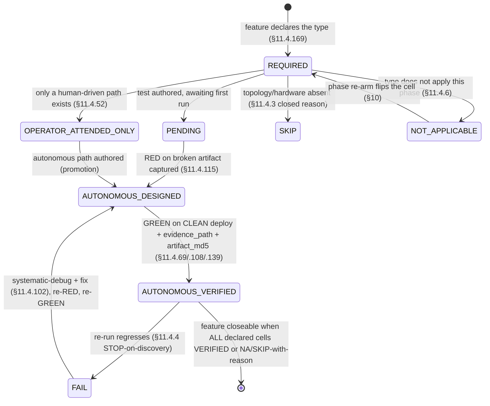
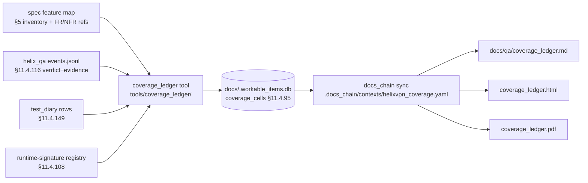

# Coverage Ledger — feature × test-type × evidence-state schema (§11.4.25/.52/.153/.169)

**Revision:** 1
**Last modified:** 2026-06-26T12:00:00Z

> Volume 8 (Testing & QA) nano-detail specification. This document deepens §6 of
> the Volume-8 overview [10 §6] into the **canonical schema, generation pipeline,
> sync model, and release-gate rule** for the HelixVPN **coverage ledger** — the
> §11.4.25 / §11.4.52 / §11.4.153 mechanical answer to *"is every feature proven,
> by every warranted §11.4.169 test type, with real captured evidence?"*. It is
> **SPEC-ONLY**: it fixes the DDL, the cell state machine, the closed evidence-state
> vocabulary, the `coverage_ledger` generator contract, the `docs_chain` sync
> context, and the §1.1 paired mutation that makes a ledger bluff mechanically
> impossible — it is not the product. Sources cited inline: the Volume-8 overview
> [10] (the test-type taxonomy §2, evidence model §3, ledger sketch §6, acceptance
> gates §7); the obfuscation/DPI spec [obf] (`v02-data-plane/obfuscation-and-dpi.md`
> — the transport survival matrix the transport-feature rows trace to); functional
> requirements [01_FR] (`v01-product/functional-requirements.md`); nonfunctional
> requirements [01_NFR] (`v01-product/nonfunctional-requirements.md`). Unproven
> facts are flagged `UNVERIFIED:` per §11.4.6.

---

## Table of contents

- [0. What the ledger is, and what it is not](#0-what-the-ledger-is-and-what-it-is-not)
- [1. The two axes: the feature inventory × the §11.4.169 test-type set](#1-the-two-axes-the-feature-inventory--the-1114169-test-type-set)
- [2. The closed evidence-state vocabulary (the cell value)](#2-the-closed-evidence-state-vocabulary-the-cell-value)
- [3. The schema (DDL, git-tracked SQLite §11.4.95)](#3-the-schema-ddl-git-tracked-sqlite-1114-95)
- [4. The per-cell state machine](#4-the-per-cell-state-machine)
- [5. The concrete HelixVPN feature inventory](#5-the-concrete-helixvpn-feature-inventory)
- [6. The full ledger table sketch (every MVP feature × type)](#6-the-full-ledger-table-sketch-every-mvp-feature--type)
- [7. Generation + sync pipeline (coverage_ledger tool + docs_chain §11.4.106)](#7-generation--sync-pipeline-coverage_ledger-tool--docs_chain-1114106)
- [8. The release-gate rule (what blocks a tag)](#8-the-release-gate-rule-what-blocks-a-tag)
- [9. Anti-bluff: the §1.1 paired mutations](#9-anti-bluff-the-11-paired-mutations)
- [10. Phase re-arm: cells that flip across phases](#10-phase-re-arm-cells-that-flip-across-phases)
- [11. Edge cases & honest gaps](#11-edge-cases--honest-gaps)
- [Sources verified](#sources-verified)

---

## 0. What the ledger is, and what it is not

The coverage ledger is a **projection**, not a source of truth about *the work*. It
cross-joins two existing sources — the §11.4.93 workable-items DB (every
feature/component/item) and the §11.4.169 test-type matrix (every type a feature
warrants) — and records, per `(feature, test-type)` cell, **one evidence-state**
plus the **evidence-artifact path** that backs it. Its single job is to make the
question *"can this phase ship?"* a mechanical `SELECT`, never a human judgement
([10 §6]).

It is therefore deliberately **derived and regenerable** (a §11.4.77-class artifact
whose regeneration mechanism is the `coverage_ledger` tool of §7), yet it lives
inside the **git-tracked** workable-items DB (`docs/.workable_items.db`, §11.4.95)
because the cell states + evidence paths *are* authoritative QA history, not a
disposable build output. The rendered Markdown/HTML/PDF (`docs/qa/coverage_ledger.md`
+ siblings) is the disposable view, regenerated by `docs_chain` (§11.4.106) from the
DB on every QA run.

What it is **not**: it is not a pass/fail test runner (the harnesses of [10 §5]
are), not a replacement for the §11.4.108 runtime-signature registry (a cell going
`AUTONOMOUS_VERIFIED` *consumes* a runtime signature; it does not replace it), and
not a substitute for the §11.4.40 full-suite retest (it is that retest's
**scoreboard**, [10 §6.2]). Honest boundary (§11.4.6): a green ledger proves *every
warranted type ran and produced cited evidence* — it does not prove the product is
defect-free (un-enumerated features are the §11.4.118 unknown-unknown surface, §11).

---

## 1. The two axes: the feature inventory × the §11.4.169 test-type set

**Axis A — features.** Every user-visible capability + every internal component the
spec declares, each a `features` row keyed `F-<SLUG>` with a `component`
(`helix-core` | `helix-go` | `helix-edge` | `helix-ui` | `shim-<os>`), a §11.4.91
self-contained title (≥40 chars), a §11.4.69 `evidence_class`, and a `phase`
(`P0`..`P3`). The full inventory is enumerated in §5.

**Axis B — the test types.** The closed sixteen-abbreviation set fixed by [10 §2]:
`UNIT INT E2E FA CHAL HQA SEC DDOS STRESS CHAOS CONC RACE MEM BENCH PERF SCALE
UI/REC`. A feature **declares** which subset it warrants (§11.4.169 — the *absence*
of a warranted type is never silent; it is an explicit `NOT_APPLICABLE: <reason>`).
A cell exists for every `(feature, declared-type)` pair; types a feature genuinely
does not warrant simply have no cell (e.g. `F-IOS-NE-MEM` warrants only `MEM`).

The cross-join `features × declared-types` is the ledger; each cell carries one
**evidence-state** from §2.

---

## 2. The closed evidence-state vocabulary (the cell value)

Eight states, a CHECK-enforced closed set (extends the [10 §6.1] enumeration with
`REQUIRED`/`PENDING` lifecycle states made explicit):

| State | Meaning | Evidence path required? | Release-blocking? |
|---|---|---|---|
| `REQUIRED` | the feature declares this type; no test authored yet | no | **yes** (Phase gate) |
| `PENDING` | test authored, not yet run on the current artifact | no | **yes** |
| `AUTONOMOUS_DESIGNED` | test authored, RED on the broken artifact (§11.4.115), GREEN not yet captured | no | **yes** |
| `AUTONOMOUS_VERIFIED` | GREEN on a clean deploy (§11.4.108/.139) + evidence path captured (§11.4.69) | **YES (schema-enforced)** | no |
| `OPERATOR_ATTENDED_ONLY` | only an operator-driven path exists (§11.4.52) | path optional | **yes** until promoted |
| `SKIP` | topology/hardware/credential genuinely absent (§11.4.3 closed reason) | skip_reason required | no |
| `NOT_APPLICABLE` | the type does not apply to this feature at this phase (§11.4.6) | skip_reason required | no |
| `FAIL` | the test regressed on re-run (§11.4.4 STOP) | evidence of the failure | **yes** |

The load-bearing rule (§11.4.69, mechanically enforced by a schema CHECK in §3):
**`AUTONOMOUS_VERIFIED` is impossible without a non-empty `evidence_path`** — the
database itself rejects a "verified" cell with no captured artifact, so the
config-only / absence-of-error PASS (the B1/B2 bluff classes of [10 §0]) cannot be
recorded. Likewise `SKIP`/`NOT_APPLICABLE` cannot be recorded without a closed-set
reason, so a silent omission cannot masquerade as a skip (§11.4.3).

`OPERATOR_ATTENDED_ONLY` is the §11.4.52 release-blocker state: it is honest (the
feature *is* validated, just not autonomously) but it does not scale to the
§11.4.156 local-CI-less re-run discipline, so it blocks the tag until promoted to
`AUTONOMOUS_VERIFIED` with a tracked migration item.

---

## 3. The schema (DDL, git-tracked SQLite §11.4.95)

```sql
-- docs/.workable_items.db  (git-tracked, §11.4.95) — coverage-ledger projection.
-- WAL-checkpointed (PRAGMA wal_checkpoint(TRUNCATE)) before stage so .db-wal/.db-shm
-- sidecars stay discardable (§11.4.95). Regenerated by coverage_ledger (§7).

CREATE TABLE IF NOT EXISTS features (
    feature_id     TEXT PRIMARY KEY,                       -- 'F-AUTHZ-REACH'
    component      TEXT NOT NULL,                           -- helix-core|helix-go|helix-edge|helix-ui|shim-<os>
    title          TEXT NOT NULL CHECK (length(title) >= 40),  -- §11.4.91 self-contained meaning
    evidence_class TEXT NOT NULL,                           -- §11.4.69 class (network_connectivity, ...)
    fr_ref         TEXT,                                    -- HVPN-FR-NNN / HVPN-NFR-NNN traceability (§v00 RTM)
    phase          TEXT NOT NULL CHECK (phase IN ('P0','P1','P2','P3'))
);

CREATE TABLE IF NOT EXISTS coverage_cells (
    feature_id   TEXT NOT NULL REFERENCES features(feature_id) ON DELETE CASCADE,
    test_type    TEXT NOT NULL CHECK (test_type IN                    -- §11.4.169 closed set [10 §2]
        ('UNIT','INT','E2E','FA','CHAL','HQA','SEC','DDOS','STRESS','CHAOS',
         'CONC','RACE','MEM','BENCH','PERF','SCALE','UI','REC')),
    state        TEXT NOT NULL CHECK (state IN
        ('REQUIRED','PENDING','AUTONOMOUS_DESIGNED','AUTONOMOUS_VERIFIED',
         'OPERATOR_ATTENDED_ONLY','SKIP','NOT_APPLICABLE','FAIL')),
    skip_reason  TEXT,                                       -- closed set (§11.4.3) when SKIP/NA
    evidence_path TEXT,                                      -- §11.4.69 captured artifact
    runtime_sig  TEXT,                                       -- §11.4.108 signature id consumed on VERIFIED
    artifact_md5 TEXT,                                       -- the clean-deploy artifact the evidence is from (§11.4.139)
    last_run_at  TEXT,                                       -- ISO-8601 UTC
    n_iters      INTEGER,                                    -- §11.4.50 determinism count (3 normal / 10 cycle)
    diary_ref    INTEGER,                                    -- §11.4.149 test_diary.diary_id
    challenge_id TEXT,                                       -- CHAL/HQA: the challenges bank entry id
    PRIMARY KEY (feature_id, test_type),

    -- §11.4.69: a VERIFIED cell MUST cite a captured artifact (defeats config-only PASS).
    CHECK (state <> 'AUTONOMOUS_VERIFIED'
           OR (evidence_path IS NOT NULL AND length(evidence_path) > 0)),
    -- §11.4.139: a VERIFIED cell MUST record the clean artifact its evidence came from.
    CHECK (state <> 'AUTONOMOUS_VERIFIED'
           OR (artifact_md5 IS NOT NULL AND length(artifact_md5) > 0)),
    -- §11.4.3: a SKIP/NA cell MUST carry a closed-set reason (no silent omission).
    CHECK (state NOT IN ('SKIP','NOT_APPLICABLE') OR (skip_reason IS NOT NULL))
);

-- The release-blocker set: any phase ships only when this view is empty for it.
CREATE VIEW IF NOT EXISTS v_coverage_gaps AS
  SELECT f.phase, f.feature_id, c.test_type, c.state, c.skip_reason
  FROM features f JOIN coverage_cells c USING (feature_id)
  WHERE c.state IN ('REQUIRED','PENDING','AUTONOMOUS_DESIGNED','OPERATOR_ATTENDED_ONLY','FAIL');

-- Per-feature roll-up for the rendered ledger + §11.4.132 risk-ordering input.
CREATE VIEW IF NOT EXISTS v_feature_rollup AS
  SELECT f.feature_id, f.component, f.phase,
         COUNT(*)                                                   AS cells,
         SUM(c.state='AUTONOMOUS_VERIFIED')                         AS verified,
         SUM(c.state IN ('SKIP','NOT_APPLICABLE'))                  AS skipped,
         SUM(c.state IN ('REQUIRED','PENDING','AUTONOMOUS_DESIGNED','OPERATOR_ATTENDED_ONLY','FAIL')) AS open
  FROM features f JOIN coverage_cells c USING (feature_id)
  GROUP BY f.feature_id;
```

The closed-set `skip_reason` vocabulary (§11.4.3 / §11.4.6) is:
`single-node-selfhost` (the DDOS/SCALE MVP defer), `hardware_not_present` (no real
iOS device for the G3 MEM gate), `topology_unsupported`, `feature_disabled_by_config`,
`structurally-impossible` (§11.4.112), `phase_deferred` (a re-arm cell, §10). A
free-text reason outside this set is itself a gate finding.

---

## 4. The per-cell state machine



A cell only reaches the terminal `AUTONOMOUS_VERIFIED` by passing through
`AUTONOMOUS_DESIGNED` — i.e. a RED-on-the-broken-artifact reproduction MUST precede
the GREEN (§11.4.115); a cell that jumps straight to `AUTONOMOUS_VERIFIED` without a
recorded RED is the §11.4.43 "test added after the fix" bluff and is rejected by the
generator (§7). The `AUTONOMOUS_VERIFIED → FAIL → AUTONOMOUS_DESIGNED` loop is the
§11.4.4 STOP-on-discovery + §11.4.102 systematic-debug cycle made visible in the
ledger.

---

## 5. The concrete HelixVPN feature inventory

The MVP feature set (the rows the ledger actually carries), grouped by component.
Each row's `evidence_class` is its §11.4.69 sink-side class; transport rows trace to
the [obf §2] survival matrix.

### 5.1 helix-core (Rust data plane) + transports

| feature_id | title (≥40 chars) | evidence_class | declared types |
|---|---|---|---|
| `F-TX-PLAIN-UDP` | Plain-UDP transport carries WireGuard at ≥80% bare-link goodput | `network_throughput` | UNIT INT E2E BENCH PERF FA |
| `F-TX-MASQUE-H3` | MASQUE CONNECT-UDP (RFC 9298) transport survives a QUIC-SNI-fronted regime | `network_throughput` | UNIT INT E2E SEC BENCH PERF FA REC |
| `F-TX-SHADOWSOCKS` | Shadowsocks AEAD-TCP transport survives a hard UDP-block regime | `network_throughput` | UNIT INT E2E SEC FA |
| `F-TX-UDP-OVER-TCP` | UDP-over-TCP last-resort transport connects under UDP-block + TLS-SNI filter | `network_throughput` | UNIT INT E2E FA |
| `F-TX-LWO` | Lightweight WG-header obfuscation defeats a WG-fingerprint-only DPI regime | `network_throughput` | UNIT INT E2E SEC FA |
| `F-TX-SELECT-LADDER` | Regime-aware escalation ladder picks the surviving transport per detected regime | `network_connectivity` | UNIT INT E2E FA CHAOS |
| `F-AUTHZ-REACH` | Enrolled client reaches an authorized LAN host through the real tunnel | `network_connectivity` | UNIT INT E2E SEC STRESS CHAOS BENCH UI/REC CHAL |
| `F-DEFAULT-DENY` | Unauthorized host is denied: SYN out, zero SYN-ACK, edge drop counter rises | `network_connectivity` | UNIT INT E2E SEC CHAOS RACE CHAL |
| `F-KILLSWITCH` | Kill-switch seals all egress on tunnel drop, zero plaintext + zero DNS leak | `wifi_link` (negative) | UNIT E2E SEC CHAOS RACE UI/REC CHAL |
| `F-DNS-LEAK` | DNS queries forced through the tunnel resolver, none escape to the ISP resolver | `wifi_link` (negative) | UNIT E2E SEC CHAOS CHAL |
| `F-IPV6-LEAK` | IPv6 egress is routed-through-tunnel or blocked; no v6 escapes the seal | `wifi_link` (negative) | UNIT E2E SEC |
| `F-MTU-ENVELOPE` | Each transport envelope's effective MTU is measured and Oversize is enforced | `network_throughput` | UNIT PERF |
| `F-CORE-FSM` | Client status FSM transitions Connecting→Connected→Reconnecting→Blocked correctly | counter delta | UNIT RACE CONC FA |

### 5.2 helix-go (control plane) + helix-edge

| feature_id | title (≥40 chars) | evidence_class | declared types |
|---|---|---|---|
| `F-ENROLL` | Device enrollment: client-generated keypair, private key never persists server-side | `permission_grant` | UNIT INT E2E SEC CONC FA |
| `F-IPAM-ALLOC` | IPAM allocates collision-free overlay ULA /48 addresses under concurrency | counter delta | UNIT INT CONC RACE |
| `F-POLICY-COMPILE` | Policy compiler turns ACL into AllowedIPs + verdict-map, fail-closed on parse error | `network_connectivity` | UNIT INT SEC |
| `F-POLICY-RECONCILE` | Policy edit reconciles all devices in <1 s with no restart (SLO1) | counter delta | UNIT INT E2E STRESS CHAOS CONC RACE PERF CHAL |
| `F-REVOKE` | Device revoke removes the peer from every map and enforces at the edge in <1 s (SLO3) | counter delta | UNIT INT E2E SEC CHAOS CONC PERF CHAL |
| `F-RLS-ISOLATION` | Postgres RLS makes a tenant-B row invisible under a tenant-A query context | `permission_grant` (negative) | UNIT INT SEC |
| `F-NO-LOG-SCHEMA` | No durable per-connection/traffic/packet table exists; schema-lint enforces it | counter delta | UNIT INT SEC CHAL |
| `F-EVENT-BACKBONE` | Redis-Streams event → coordinator consume → minimal delta emitted, idempotent | counter delta | UNIT INT CHAOS CONC |
| `F-WATCH-MAP` | WatchNetworkMap server-stream emits snapshot + policy-filtered deltas to N streams | counter delta | UNIT INT E2E CONC RACE SCALE |
| `F-EDGE-VERDICT` | Edge verdict-map hot-swaps under live classification with no torn/half-applied map | `network_connectivity` | UNIT RACE STRESS |
| `F-EDGE-PROBE` | Edge returns decoy/silent/benign-RST to an unauthenticated active prober | `network_connectivity` (negative) | SEC FA |
| `F-MTLS-CERT` | Short-lived mTLS device cert gates the control stream; expired/revoked is refused | `permission_grant` | UNIT INT SEC |

### 5.3 clients (Flutter UI + platform shims)

| feature_id | title (≥40 chars) | evidence_class | declared types |
|---|---|---|---|
| `F-UI-FLOWS` | Three Flutter flavors (Access/Connector/Console) drive enroll→connect→reach end-to-end | `REC` | UI REC FA CHAL |
| `F-FFI-BRIDGE` | flutter_rust_bridge FFI lets Dart call connect() and receive the status stream | counter delta | UNIT UI FA |
| `F-IOS-NE-MEM` | iOS NEPacketTunnelProvider Rust core stays under the jetsam memory ceiling +30% headroom | `MEM` | MEM |
| `F-ANDROID-VPN` | Android VpnService + JNI builds the tun, survives background kill, RSS bounded | `MEM` | MEM E2E |
| `F-SHIM-LINUX` | Linux kernel-WG/tun shim integrates with systemd and the kill-switch state machine | `network_connectivity` | E2E SEC |

`F-IOS-NE-MEM` declares only `MEM` because it is a platform-resource constraint, not
a reachability feature; its cell is `SKIP: hardware_not_present` on any host without
a real iOS device (§11.4.3 — never a simulator PASS, [10 QA-D3]).

### 5.4 Phase-2 parked features (MVP `NOT_APPLICABLE`)

| feature_id | title (≥40 chars) | evidence_class | MVP state |
|---|---|---|---|
| `F-DDOS-FLOOD` | Handshake-flood + volumetric flood: edge rate-limits and fails static, never crashes | `network_throughput` | `NOT_APPLICABLE: single-node-selfhost` |
| `F-SCALE-HA` | N simulated agents hold WatchNetworkMap streams; convergence + bounded memory / 24 h | `MEM` | `NOT_APPLICABLE: phase_deferred` (partial SLO4 soak at MVP) |
| `F-DAITA-SHAPE` | DAITA size/timing/cover-traffic defense (maybenot) flattens the traffic-analysis signature | `network_throughput` | `NOT_APPLICABLE: phase_deferred` |

---

## 6. The full ledger table sketch (every MVP feature × type)

The rendered `docs/qa/coverage_ledger.md` table (✓ = `AUTONOMOUS_VERIFIED`, ▣ =
authored/`DESIGNED`, — = no cell, NA = `NOT_APPLICABLE`, S = `SKIP`, AC = bound DoD
Challenge). Illustrative target state at the MVP gate; the live values are
generated from the DB (§7).

| feature_id | UNIT | INT | E2E | SEC | STRESS | CHAOS | CONC | RACE | MEM | BENCH | PERF | UI/REC | CHAL |
|---|---|---|---|---|---|---|---|---|---|---|---|---|---|
| F-TX-PLAIN-UDP | ✓ | ✓ | ✓ | — | — | — | — | — | — | ✓ | ✓ | — | G1 |
| F-TX-MASQUE-H3 | ✓ | ✓ | ✓ | ✓ | — | — | — | — | — | ✓ | ✓ | ✓ | G2/AC4 |
| F-TX-SHADOWSOCKS | ✓ | ✓ | ✓ | ✓ | — | — | — | — | — | — | — | — | T-UDPBLOCK |
| F-TX-UDP-OVER-TCP | ✓ | ✓ | ✓ | — | — | — | — | — | — | — | — | — | — |
| F-TX-LWO | ✓ | ✓ | ✓ | ✓ | — | — | — | — | — | — | — | — | T-WGFP |
| F-TX-SELECT-LADDER | ✓ | ✓ | ✓ | — | — | ✓ | — | — | — | — | — | — | T-LADDER |
| F-AUTHZ-REACH | ✓ | ✓ | ✓ | ✓ | ✓ | ✓ | — | — | — | ✓ | — | ✓ | AC2 |
| F-DEFAULT-DENY | ✓ | ✓ | ✓ | ✓ | — | ✓ | — | ✓ | — | — | — | — | AC3 |
| F-KILLSWITCH | ✓ | — | ✓ | ✓ | — | ✓ | — | ✓ | — | — | — | ✓ | AC7 |
| F-DNS-LEAK | ✓ | — | ✓ | ✓ | — | ✓ | — | — | — | — | — | — | AC7 |
| F-IPV6-LEAK | ✓ | — | ✓ | ✓ | — | — | — | — | — | — | — | — | AC7 |
| F-CORE-FSM | ✓ | — | — | — | — | — | ✓ | ✓ | — | — | — | — | — |
| F-ENROLL | ✓ | ✓ | ✓ | ✓ | — | — | ✓ | — | — | — | ✓(SLO2) | — | AC1 |
| F-IPAM-ALLOC | ✓ | ✓ | — | — | — | — | ✓ | ✓ | — | — | — | — | — |
| F-POLICY-RECONCILE | ✓ | ✓ | ✓ | — | ✓ | ✓ | ✓ | ✓ | — | — | ✓(SLO1) | — | AC5 |
| F-REVOKE | ✓ | ✓ | ✓ | ✓ | — | ✓ | ✓ | — | — | — | ✓(SLO3) | — | AC6 |
| F-RLS-ISOLATION | ✓ | ✓ | — | ✓ | — | — | — | — | — | — | — | — | — |
| F-NO-LOG-SCHEMA | ✓ | ✓ | — | ✓ | — | — | — | — | — | — | — | — | AC8 |
| F-WATCH-MAP | ✓ | ✓ | ✓ | — | — | — | ✓ | ✓ | — | — | — | — | — |
| F-EDGE-PROBE | — | — | — | ✓ | — | — | — | — | — | — | — | — | T-PROBE |
| F-MTLS-CERT | ✓ | ✓ | — | ✓ | — | — | — | — | — | — | — | — | — |
| F-UI-FLOWS | — | — | — | — | — | — | — | — | — | — | — | ✓ | AC9 |
| F-IOS-NE-MEM | — | — | — | — | — | — | — | — | ✓/S¹ | — | — | — | G3 |
| F-ANDROID-VPN | — | — | ✓ | — | — | — | — | — | ✓ | — | — | — | — |
| F-DDOS-FLOOD | NA² | NA² | — | NA² | — | — | — | — | — | — | — | — | NA² |
| F-SCALE-HA | — | — | — | — | — | — | — | — | NA³ | — | NA³ | — | — |

¹ `MEM` cell is `AUTONOMOUS_VERIFIED` on a host with a real iOS device, else
`SKIP: hardware_not_present` ([10 QA-D3]).
² `NOT_APPLICABLE: single-node-selfhost` at MVP; re-arms Phase 2 ([10 §5.8]).
³ `NOT_APPLICABLE: phase_deferred`; partial SLO4 24 h soak runs at MVP, full SCALE Phase 2.

---

## 7. Generation + sync pipeline (coverage_ledger tool + docs_chain §11.4.106)

The ledger is **generated, never hand-edited** — hand-editing a cell would let a
human assert a state the evidence does not back (the exact bluff the schema CHECKs
forbid). The pipeline:



**The generator contract** (`tools/coverage_ledger`, Go, deterministic, minimal-LLM
per §11.4.141 — pure data transform):

1. Read the §5 feature inventory + the §11.4.169 declared-type set per feature.
2. For each `(feature, type)` cell, read the **most recent** `helix_qa`
   verdict event (§11.4.116 — the event carries the evidence path; a PASS event
   with no evidence path is a contradiction → the generator records `FAIL`, never
   `AUTONOMOUS_VERIFIED`, defeating B5 at the ledger layer).
3. Cross-check the verdict's `artifact_md5` against the **current clean-deploy**
   artifact (§11.4.139) — a verdict from a stale artifact downgrades the cell to
   `PENDING` (defeats B4 stale-state, [10 §0]).
4. Enforce the **RED-precedes-GREEN** invariant: a cell may be `AUTONOMOUS_VERIFIED`
   only if the diary holds a prior `RED_MODE=1` reproduction row for it
   (§11.4.115/.43) — else the generator records `AUTONOMOUS_DESIGNED` and emits a
   finding.
5. Enforce determinism: a `*_VERIFIED` cell records `n_iters ≥ 3` (normal) /
   `≥ 10` (cycle-validation) with identical evidence-hashes (§11.4.50); a divergent
   run forces `FAIL`.
6. Write the `coverage_cells` rows, WAL-checkpoint, and hand off to `docs_chain`.

**docs_chain sync (§11.4.106).** The `.docs_chain/contexts/helixvpn_coverage.yaml`
context declares the DB→Markdown→HTML→PDF chain; `docs_chain sync` regenerates the
rendered ledger with content-hash change detection (§11.4.86, not mtime) and an
atomic-rename commit; `docs_chain verify` is the deterministic CI/pre-build gate
(`make docs-verify`, [10 §9]) that FAILs if the rendered ledger drifts from the DB.
A missing `pandoc`/`weasyprint` surfaces a typed `ToolAbsentError` + honest §11.4.3
SKIP, never a fake export (§11.4.106).

```yaml
# .docs_chain/contexts/helixvpn_coverage.yaml  (§11.4.106 — consumer-owned context)
context: helixvpn-coverage-ledger
source:
  kind: sqlite
  path: docs/.workable_items.db
  query_view: v_feature_rollup           # + coverage_cells join, rendered to a matrix
derived:
  - { kind: markdown, path: docs/qa/coverage_ledger.md }
  - { kind: html,     path: docs/qa/coverage_ledger.html }   # §11.4.65
  - { kind: pdf,      path: docs/qa/coverage_ledger.pdf }
change_detection: content_hash           # §11.4.86 drift-proof (NOT mtime)
on_tool_absent: skip_with_reason         # §11.4.106 — never a fake transform
```

The ledger generation runs on every `make qa` / `make coverage` and at the §11.4.40
pre-tag sweep, backgrounded (§11.4.89) so the main work stream is never blocked
([10 §9]).

---

## 8. The release-gate rule (what blocks a tag)

The single mechanical release rule ([10 §6.2], made precise):

> A phase `P` ships **only when** `SELECT count(*) FROM v_coverage_gaps WHERE
> phase='P'` returns **0** — i.e. every declared cell for that phase is
> `AUTONOMOUS_VERIFIED`, or `NOT_APPLICABLE`/`SKIP` with a closed-set reason.

Consequences, each a §11.4.169 / §11.4.52 / §11.4.40 obligation:

- A cell in `REQUIRED` / `PENDING` / `AUTONOMOUS_DESIGNED` is **unfinished work** —
  it blocks the tag (the feature declared the type but has no captured GREEN).
- A cell in `OPERATOR_ATTENDED_ONLY` blocks the tag until promoted, citing a tracked
  migration item (§11.4.52) — honest, but it does not scale to the §11.4.156
  local-re-run regime.
- A cell in `FAIL` blocks the tag and triggers the §11.4.4 STOP + §11.4.102
  systematic-debug + §11.4.129 huge-blocker restart if release-blocking-severity.
- `SKIP` / `NOT_APPLICABLE` do **not** block — but the closed-set reason is audited
  every §11.4.40 / §11.4.42 sweep (a `SKIP: hardware_not_present` that persists past
  the phase where the hardware should exist is itself a finding).

The ledger is the §11.4.40 full-suite-retest scoreboard: the retest run *is* what
flips cells to `AUTONOMOUS_VERIFIED`; the tag is cut only when the scoreboard is
clean for the phase. The §11.4.126 endless-loop terminal condition (a published,
prefixed tag, §11.4.151) is therefore **mechanically** `v_coverage_gaps` empty +
the §7.2 ACs all `CHAL`-scored PASS ([10 §7.2]).

---

## 9. Anti-bluff: the §1.1 paired mutations

The ledger's own gates are anti-bluff per §1.1 — each gate ships with a paired
mutation that MUST make it FAIL:

| Gate | What it asserts | Paired §1.1 mutation → expected FAIL |
|---|---|---|
| `CM-LEDGER-EVIDENCE-REQUIRED` | no `AUTONOMOUS_VERIFIED` cell without an `evidence_path` | seed a `VERIFIED` cell with `evidence_path=NULL` → the schema CHECK rejects the INSERT → mutation caught |
| `CM-LEDGER-NO-SILENT-SKIP` | every `SKIP`/`NA` cell carries a closed-set reason | seed a `SKIP` cell with `skip_reason=NULL` → CHECK rejects → caught |
| `CM-LEDGER-RED-PRECEDES-GREEN` | a `VERIFIED` cell has a prior diary RED row (§11.4.115) | mark a cell `VERIFIED` with no RED diary row → generator records `AUTONOMOUS_DESIGNED` + finding → gate FAILs on the forged cell |
| `CM-LEDGER-NO-STALE-ARTIFACT` | a `VERIFIED` cell's `artifact_md5` == current clean deploy (§11.4.139) | inject a verdict from a stale `artifact_md5` → generator downgrades to `PENDING` → the forged "verified" is gone |
| `CM-LEDGER-GAP-BLOCKS-TAG` | a non-empty `v_coverage_gaps` blocks the tag | inject an `OPERATOR_ATTENDED_ONLY` cell into the release phase → the pre-tag gate refuses → caught |
| `CM-LEDGER-DETERMINISTIC` | a `VERIFIED` cell has `n_iters ≥ 3` identical (§11.4.50) | seed a cell whose two run-hashes diverge → generator forces `FAIL` → the green is gone |

The deepest anti-bluff property is **structural, not procedural**: because
`AUTONOMOUS_VERIFIED` is unrepresentable in the schema without a non-empty
`evidence_path` + `artifact_md5`, the most common ledger bluff (marking a feature
"covered" with no captured artifact) cannot be written to the database at all — the
`INSERT`/`UPDATE` fails the CHECK. The ledger inherits the [10 §0] B1–B5 defences:
B1 (config-only) and B2 (absence-of-error) are blocked by the evidence-path CHECK;
B4 (stale-state) by the `artifact_md5` cross-check; B5 (unvalidated analyzer) by the
generator treating an evidence-less PASS event as `FAIL`.

---

## 10. Phase re-arm: cells that flip across phases

A `NOT_APPLICABLE`/`phase_deferred` cell is not dead — it is **parked** and re-arms
mechanically when its phase opens ([10 §7.3]). The generator re-reads the
per-feature declared-type set each run; when a feature's `phase` advances (e.g.
`F-DDOS-FLOOD` from MVP-`NA` to Phase-2-`REQUIRED`), the matching cells flip
`NOT_APPLICABLE → REQUIRED` and immediately appear in `v_coverage_gaps` for the new
phase — so the Phase-2 DDoS/SCALE suite cannot be silently forgotten (§11.4.118):

- **Phase 2 re-arms**: `F-DDOS-FLOOD` (DDOS), `F-SCALE-HA` (full SCALE +
  `WatchNetworkMap` 10k-stream soak), `F-DAITA-SHAPE` (maybenot traffic-analysis
  defense, [research-daita_test §4]), plus P2P NAT-traversal + multi-hop nested-WG +
  PQ-handshake-interop E2E rows.
- **Phase 3 re-arms**: HarmonyOS NEXT + Aurora OS shim `E2E`/`MEM` rows, WASM
  browser-MASQUE `E2E`, and a third-party-audit + reproducible-build attestation
  row ([10 §7.3]).

Each re-arm is a *visible* state transition in the ledger, never an edit — the
parked cell with its `phase_deferred` reason is the auditable record that the work
is owed, not omitted.

---

## 11. Edge cases & honest gaps

| # | Edge case | Required behavior | Cite |
|---|---|---|---|
| L1 | A feature exists in code but has no `features` row | reconciliation gap → the §11.4.153 feature-status audit FAILs (a code-present feature missing from the ledger is a §11.4.118 bluff) | §0, §11.4.153 |
| L2 | A `features` row with no backing code | dead-row → investigate per §11.4.124 before removing; never silent-delete | §11.4.124 |
| L3 | A `VERIFIED` cell whose evidence_path file was deleted | `docs_chain verify` + a path-existence check downgrade it to `PENDING` (evidence must be re-captured) | §7, §11.4.69 |
| L4 | Two QA runs disagree on a cell | the more-recent run wins **only if** its `artifact_md5` is the current clean deploy; else the cell is `PENDING` | §7 step 3 |
| L5 | An `OPERATOR_ATTENDED_ONLY` cell with no migration item | itself a finding — §11.4.52 requires the tracked promotion item | §8 |
| L6 | `SKIP: hardware_not_present` on the only host that has the hardware | the SKIP is dishonest there → the §11.4.40 sweep audits SKIP reasons against the running host's capability | §8 |

**Honest boundary (§11.4.6).** The ledger guarantees *every enumerated feature × its
warranted types is proven with cited evidence on a clean artifact* — it does **not**
prove the absence of un-enumerated defects (the §11.4.118 unknown-unknown surface,
which the discovery-pressure pass addresses), and a 100%-green ledger with an
incomplete §5 inventory is a §11.4.153 completeness bluff, not a coverage proof. The
inventory's completeness is itself audited by the §11.4.153 per-feature
Status-document reconciliation against the codebase. `UNVERIFIED:` the exact final
MVP feature count — §5 is the spec-stage inventory; the live count is whatever the
§11.4.153 audit reconciles against the implemented codebase.

---

## Sources verified

- [10] `docs/research/mvp/final/10-testing-acceptance-and-qa.md` §2 (test-type
  taxonomy), §3 (evidence model), §6 (ledger DDL sketch + state machine + release
  rule), §7 (acceptance gates / ACs / SLOs), §9 (local gate harness) — read
  2026-06-26.
- [obf] `docs/research/mvp/final/v02-data-plane/obfuscation-and-dpi.md` §2 (regime →
  transport survival matrix the transport-feature rows trace to), §7 (the T-id test
  points the CHAL cells bind) — read 2026-06-26.
- [research-daita_test] `docs/research/mvp/final/v09-research/research-daita_test.md`
  §4 (DAITA v2 — the parked `F-DAITA-SHAPE` Phase-2 row) — read 2026-06-26.
- [MASTER_INDEX] `docs/research/mvp/final/MASTER_INDEX.md` (Volume 8 table, this
  doc's slot) — read 2026-06-26.
- Constitution: §11.4.25 (full-automation coverage ledger), §11.4.52 (autonomous
  classification + OPERATOR_ATTENDED_ONLY release-blocker), §11.4.69 (sink-side
  evidence taxonomy + evidence-path requirement), §11.4.93/.95 (git-tracked
  workable-items SQLite SSoT), §11.4.106 (docs_chain), §11.4.108/.139 (runtime
  signature / clean-artifact), §11.4.115/.43 (RED-precedes-GREEN), §11.4.50
  (determinism), §11.4.118 (discovery-pressure / no silent gap), §11.4.153
  (per-feature status reconciliation), §11.4.156 (no remote CI), §11.4.169 (test-type
  mandate) — `CLAUDE.md`, read 2026-06-26.
