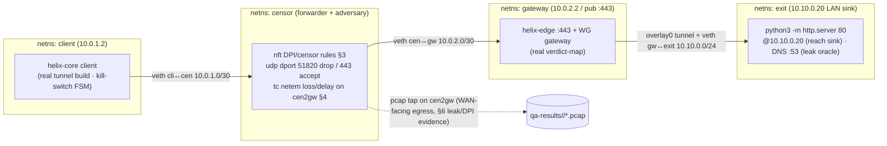

# End-to-End Testing — HelixVPN nano-detail spec (Volume 8 · §11.4.169 type 3)

**Revision:** 2
**Last modified:** 2026-06-26T12:00:00Z

> **Reconciled (§11.4.35, 2026-06-26):** the §2 harness topology + skeletons were
> rewritten onto the **canonical four-namespace rig** (`client` / `censor` /
> `gateway` / `exit`) of [test-rig.md](test-rig.md), with the DPI/censor in a
> distinct `censor-ns` middlebox and the wire/DPI capture point on the censor egress
> `cen2gw`. The earlier inferior 3-namespace rig (`client` / `gateway` / `lanA` with
> the `nft` block bolted onto the gateway forward hook) is superseded — test-rig.md
> is the single source for the rig's namespace/interface names and capture points.

> Nano-detail expansion of [§5.3 of the Volume-8 overview](../10-testing-acceptance-and-qa.md).
> E2E proves the **whole reachability slice on one box**: a real control plane issues
> a NetworkMap, a real `helix-core` client builds a real tunnel, real packets cross
> `client → gateway → connector LAN`, and a real `curl` returns the hello page — or,
> for the negative E2E, a SYN leaves and **zero** SYN-ACK returns (default-deny). The
> substrate is the Linux **netns + nftables-DPI + tc-netem rig** [04_P0 §3]. This is
> where bluff-classes **B1 (config-only)** and **B3 (wrong-plane)** are mechanically
> defeated by pcap + body-hash + `wg`-counter-advance evidence (§11.4.107). Spec-only;
> unproven assumptions marked `UNVERIFIED`. Siblings: [unit.md](unit.md),
> [integration.md](integration.md), [full-automation.md](full-automation.md),
> [challenges.md](challenges.md), [helixqa.md](helixqa.md).

---

## Table of contents

- [1. Scope — the reachability slices E2E covers](#1-scope--the-reachability-slices-e2e-covers)
- [2. Harness — the netns + nftables-DPI + tc-netem rig](#2-harness--the-netns--nftables-dpi--tc-netem-rig)
- [3. Fixtures — real processes, simulated network, zero mocks](#3-fixtures--real-processes-simulated-network-zero-mocks)
- [4. Evidence taxonomy + the §11.4.107 liveness battery](#4-evidence-taxonomy--the-1114107-liveness-battery)
- [5. Determinism — N-iteration identical evidence](#5-determinism--n-iteration-identical-evidence)
- [6. Acceptance gate — when E2E blocks a release](#6-acceptance-gate--when-e2e-blocks-a-release)
- [7. The paired §1.1 mutation (anti-bluff proof)](#7-the-paired-11-mutation-anti-bluff-proof)
- [8. Test skeletons](#8-test-skeletons)
- [9. Open decisions surfaced for QA](#9-open-decisions-surfaced-for-qa)
- [Sources verified](#sources-verified)

---

## 1. Scope — the reachability slices E2E covers

E2E owns the user-visible security properties that **only a packet on a real tunnel
can prove**. Each slice maps to a Phase-1 Definition-of-Done AC ([overview §7.2](../10-testing-acceptance-and-qa.md)).

| Slice | Path | The user-visible property | Bound AC |
|---|---|---|---|
| **Authorized reachability** | client → gateway → connector LAN, `curl http://10.10.0.20/` ⇒ 200 | the user reaches a host the policy grants | **AC2** |
| **Default-deny (negative E2E)** | client → gateway, SYN to an unauthorized host | a host the policy does **not** grant is unreachable — SYN out, **zero** SYN-ACK | **AC3** |
| **Transport escalation** | plain-WG UDP blocked → auto-escalate to MASQUE/H3 → reach preserved | the tunnel survives a DPI UDP block, classified as HTTP/3 not WireGuard | **AC4** |
| **Policy reconcile (live)** | a policy edit reconfigures the running slice with **no restart** | a revoked/added grant takes effect on the live tunnel | **AC5** |
| **Revoke (live)** | revoke a device → its peer drops from every map → tunnel sealed | a revoked device loses reachability | **AC6** |
| **Resilience** | reach under 5% loss / 40 ms jitter (tc-netem) | the tunnel holds goodput under impairment (adjacency to STRESS §11.4.85) | G1/G2 [04_P0] |

The rig is the **reproducible substrate** for AC2/AC3/AC4 and survives Phase-0→1
([overview §5.3](../10-testing-acceptance-and-qa.md)). E2E does **not** drive the
Flutter UI — that is UI/REC via `panoptic` ([overview §5.14](../10-testing-acceptance-and-qa.md));
E2E drives the *core* and the *wire*.

---

## 2. Harness — the netns + nftables-DPI + tc-netem rig

The E2E substrate is the **canonical four-namespace rig** defined in
[test-rig.md](test-rig.md): four real Linux network namespaces — `client`, `censor`,
`gateway`, `exit` — on one host. The adversary is split out of the path as its **own
`censor-ns` middlebox** the packet must traverse, so the DPI/censor `nft` ruleset is
a *distinct forwarding hop* (not an `nft` rule bolted onto an endpoint,
[test-rig.md §0](test-rig.md)); `tc netem` on the censor egress (`cen2gw`) injects
loss/delay for the resilience slice. The rig is the Phase-0 deliverable
HVPN-P0-022/023 ([06](../06-phase0-spike-wbs.md)). The rig scripts (`rig/netns_up.sh`,
`rig/netns_down.sh`, the regime `nft` profiles, `rig/impair.sh`, `rig/exercise.sh`)
are defined canonically in [test-rig.md §§2–4](test-rig.md) and shared by every
skeleton below — same namespace names, same interface names, same `cen2gw` capture
point.



The `sudo` for `ip netns add` is the **only** privileged step in the whole harness
and is a documented, scoped `CAP_NET_ADMIN` exception — never a container-management
escalation ([overview §9](../10-testing-acceptance-and-qa.md), §11.4.161). Container
infra (the real control plane's PG/Redis behind the gateway) is still booted rootless
via `containers` ([integration.md §2](integration.md)).

```bash
# rig/netns_up.sh — the 4-ns rig (CANONICAL definition: test-rig.md §2)
#   client(10.0.1.2) -> censor -> gateway(10.0.2.2:443) -> exit(10.10.0.20)
set -euo pipefail
for ns in client censor gateway exit; do ip netns add "$ns" 2>/dev/null || true; done
# veths client↔censor (10.0.1.0/30) · censor↔gateway (10.0.2.0/30) · gateway↔exit (10.10.0.0/24),
# forwarding + routes, and the exit-ns sinks are wired in full by test-rig.md §2:
ip netns exec exit python3 -m http.server 80 --bind 10.10.0.20 &   # the hello service (sink @10.10.0.20)

# rig/dpi_block.sh — DPI/censor sim on the CENSOR-ns forward hook (the middlebox), AC4 escalation E2E
ip netns exec censor nft add table inet censor
ip netns exec censor nft add chain inet censor fwd '{ type filter hook forward priority 0; policy accept; }'
ip netns exec censor nft add rule  inet censor fwd udp dport 51820 drop   # kill plain WireGuard
ip netns exec censor nft add rule  inet censor fwd udp dport 443  accept  # allow MASQUE/H3

# rig/impair.sh — loss/jitter on the censor egress cen2gw (§11.4.85 adjacency; CANONICAL: test-rig.md §4)
ip netns exec censor tc qdisc add dev cen2gw root netem loss 5% delay 40ms 10ms
```

Cleanup is non-negotiable: `trap 'rig/netns_down.sh' EXIT` deletes all four
namespaces and leaves the host quiescent (§11.4.14); the orchestrator's post-test
sanity check FAILs the run if any `client`/`censor`/`gateway`/`exit` namespace, the
`inet censor` `nft` table, or a `netem` qdisc survives.

---

## 3. Fixtures — real processes, simulated network, zero mocks

| Fixture | Real or mock | Notes |
|---|---|---|
| `helix-core` client | **real build** | builds a real WireGuard tunnel (boringtun or kernel WG, [../v02-data-plane/wireguard-core.md](../v02-data-plane/wireguard-core.md)) |
| gateway + `helix-edge` | **real build** | real verdict-map packet classification |
| control plane (PG/Redis/coordinator) | **real**, booted via `containers` | issues the real NetworkMap the client applies |
| connector LAN sink | **real** `python3 -m http.server` | a real HTTP server — the reachability target |
| DPI block | **real** `nftables` rule | a real kernel drop of UDP/51820 (not a mock) |
| network impairment | **real** `tc netem` | real loss/jitter in the kernel |
| **mocks** | **FORBIDDEN** (§11.4.27) | E2E is post-unit; a mock socket here is a §11.4.27 violation |

Everything on the path is real; only the *network topology* is simulated (netns +
nftables + netem stand in for "a censored hostile network" reproducibly). This is
exactly the §11.4.3 per-environment-topology dispatch: the rig **is** the topology,
and absence of `CAP_NET_ADMIN` ⇒ honest `SKIP: topology_unsupported`, never a fake
PASS.

---

## 4. Evidence taxonomy + the §11.4.107 liveness battery

An E2E PASS cites **packet-level captured evidence** (§11.4.69 classes
`network_throughput` / `network_connectivity`), never a status field (`B3`) or a
config check (`B1`).

| Slice | §11.4.69 evidence shape | Defeats |
|---|---|---|
| authorized reach (AC2) | pcap with a SYN→**SYN-ACK** from 10.10.0.20 **and** a non-empty `curl` body hash | B1 (config-only) |
| default-deny (AC3) | pcap showing SYN out, **zero** SYN-ACK; edge verdict-map `drop++` counter | B1, B2 |
| escalation (AC4) | `StatusReport.transport=="masque-h3"` **and** tshark classifies the flow as HTTP/3 with **no** WG signature | B3 (wrong-plane) |
| reach liveness (G1) | `iperf3 -J` JSON `sum_received.bits_per_second > 0` over ≥10 s **and** `wg show <if> transfer` rx/tx advancing | B3 |
| resilience (G2) | goodput under `netem` ≥ budget; pcap of decrypted inner packets | B3 |

**The §11.4.107 liveness battery, instantiated for E2E** ([overview §3.2](../10-testing-acceptance-and-qa.md)):

1. **Liveness over a window, not a point** — throughput sampled ≥10 s; a one-shot
   `ping` reply is a pre-filter, never the proof (§11.4.107(1)).
2. **Independent counter-advance** — goodput (`iperf3`) **and** the kernel WG counter
   (`wg show ... transfer`) must *both* move; a flat WG counter with moving `iperf3`
   means a decoy/loopback path → FAIL (§11.4.107(2)).
3. **Not-stale cross-check** — after a transport escalation, the post-escalation
   pcap's first inner packet must not replay the pre-escalation flow's last packet
   (§11.4.107(4)).
4. **Loading is a distinct state** — a handshake in progress is `Connecting`, not
   `Connected`; liveness is judged only after the FSM reaches `Connected`
   (§11.4.107(3)); timeout+reachable ⇒ FAIL, timeout+unreachable ⇒ SKIP.
5. **Metamorphic relations** (no golden source) — the same LAN host reached over
   WG-UDP vs MASQUE returns the **same body hash**; a paused tunnel stops the WG
   counter; 2× clients ⇒ ~2× aggregate goodput (§11.4.107(8)).

Every analyzer (the tshark classifier, the leak detector) is **self-validated**
(§11.4.107(10)) with a golden-good + golden-bad pcap pair ([overview §3.3](../10-testing-acceptance-and-qa.md)) — defeating bluff-class **B5**.

---

## 5. Determinism — N-iteration identical evidence

Per §11.4.50, E2E runs N=3 (normal) / N=10 (cycle-validation) and must produce
identical *verdicts* with structurally-identical evidence:

1. **Body-hash equality** — the `curl` body hash is identical across runs (the sink
   serves a fixed page); a diverging hash is auto-FAIL.
2. **Verdict equality** — pass→pass→pass or the run is a flake-FAIL; "first reach
   worked, retry it" is forbidden (§11.4.50 mechanises §11.4.7).
3. **Deterministic impairment seed** — `tc netem` uses a fixed loss/delay so the
   resilience slice's goodput stays within a tolerance band across runs; the band,
   not an exact value, is the assertion.
4. **Clean rig per iteration** — `netns_up.sh`/`netns_down.sh` bracket each iteration
   so no stale tunnel/route/qdisc shadows the next run (§11.4.108/.139 clean-artifact;
   defeats B4 stale-state).

---

## 6. Acceptance gate — when E2E blocks a release

| Gate | Bar | Bound item |
|---|---|---|
| **`make e2e`** ([overview §9](../10-testing-acceptance-and-qa.md)) | positive reach + negative deny both GREEN with pcap | AC2 + AC3 |
| **G1** (Phase-0) | `iperf3` ≥ **80%** bare-link; `curl 10.10.0.20:80` OK | E2E + BENCH |
| **G2** (Phase-0) | core over MASQUE through a DPI UDP block ≥ **50%** of plain; tshark = HTTP/3, no WG sig; survives 5% loss | E2E + SEC |
| **G6** (Phase-0) | a static-map edit reconciles the slice with **no restart** | E2E + INT |
| **AC4 / AC5 / AC6** (Phase-1) | escalation / reconcile / revoke proven on the live tunnel | E2E challenges |

E2E is the **highest-authority reachability gate**; an E2E FAIL is a release blocker
and triggers the §11.4.4 STOP + §11.4.114 known-good isolation. Per §11.4.132
risk-ordering the **security-floor E2E** (default-deny AC3, revoke AC6) runs *before*
any convenience slice, and only after that set is GREEN with captured pcap does the
rest run.

---

## 7. The paired §1.1 mutation (anti-bluff proof)

```text
# §1.1 mutation for CM-DEFAULT-DENY-E2E (defeats the most dangerous bluff: fail-open)
- in helix-edge verdict-map, change the default action:
    default: DROP                 // correct: deny unless granted
    MUTATED: default: ACCEPT      // fail-OPEN — every host reachable
- assert: rig/test_reach.sh deny now sees a SYN-ACK from the unauthorized host → E2E FAILs
- restore; assert deny PASS (zero SYN-ACK) again (§11.4.84 quiescence)
```

```text
# §1.1 mutation for CM-ESCALATION-E2E (defeats B3 wrong-plane)
- force the escalation path to leave the StatusReport.transport at "wg-udp" while the
  DPI block is active (the bug: reports masque but actually still tries WG)
- assert: tshark finds NO HTTP/3 flow + reach FAILs → the test catches the lie
```

The leak/classifier analyzers' golden-bad fixtures (a seeded-leak pcap, a WG flow
mislabelled as H3) **must** FAIL their analyzers — the §11.4.107(10) self-validation
that defeats B5; stripping the discriminating tshark filter makes golden-bad pass →
the meta-test catches the mutation.

---

## 8. Test skeletons

### 8.1 The reach assertion — positive + negative (the core E2E)

```bash
# rig/test_reach.sh — §11.4.50 N=3 deterministic; sources the anti-bluff lib (§11.4.1)
run_reach() {                                          # $1 = expected: pass|deny
  pcap="qa-results/e2e/$(date +%s)_reach.pcap"
  ip netns exec client tcpdump -i overlay0 -w "$pcap" &  TPID=$!
  body=$(ip netns exec client curl -s --max-time 5 http://10.10.0.20/ || true)
  kill "$TPID" 2>/dev/null
  if [ "$1" = pass ]; then
    [ -n "$body" ] || ab_fail "B1: no body — config-only PASS forbidden"
    tshark -r "$pcap" -Y 'tcp.flags.syn==1 && tcp.flags.ack==1' | grep -q . \
      && ab_pass_with_evidence "authorized reach" "$pcap" \
      || ab_fail "no SYN-ACK captured — reach not proven on the wire"
  else
    [ -z "$body" ] || ab_fail "default-deny breached: got a body"
    tshark -r "$pcap" -Y 'tcp.flags.syn==1 && tcp.flags.ack==1' | grep -q . \
      && ab_fail "deny breached: SYN-ACK present" \
      || ab_pass_with_evidence "default-deny (no SYN-ACK)" "$pcap"
  fi
}
```

### 8.2 Liveness with independent counter-advance (defeats B3)

```bash
# rig/liveness.sh — both iperf3 goodput AND the kernel WG counter must advance (§11.4.107(2))
wg_rx_before=$(ip netns exec client wg show overlay0 transfer | awk '{print $2}')
THRPUT=$(ip netns exec client iperf3 -J -t 10 -c 10.10.0.20 | jq '.end.sum_received.bits_per_second')
wg_rx_after=$(ip netns exec client wg show overlay0 transfer | awk '{print $2}')
adv=$(( wg_rx_after - wg_rx_before ))
{ awk -v t="$THRPUT" 'BEGIN{exit !(t>0)}' && [ "$adv" -gt 0 ]; } \
  && ab_pass_with_evidence "live tunnel: goodput $THRPUT, wg+$adv bytes" "qa-results/e2e/liveness_$(date +%s)/" \
  || ab_fail "decoy path: iperf=$THRPUT but wg counter advanced $adv (B3 wrong-plane)"
```

### 8.3 Transport escalation through a DPI block (AC4)

```bash
# rig/escalate.sh — plain WG dropped → core auto-escalates to MASQUE/H3, reach preserved
rig/dpi_block.sh                                       # nft drops udp/51820, accepts udp/443
ip netns exec client helix-core connect --target 10.10.0.20 --status-json /tmp/status.json
sleep 6                                                # allow the ladder to escalate (FSM → Connected)
transport=$(jq -r '.transport' /tmp/status.json)
[ "$transport" = "masque-h3" ] || ab_fail "did not escalate: transport=$transport (B3)"
pcap="qa-results/e2e/$(date +%s)_escalate.pcap"
ip netns exec censor tcpdump -i cen2gw -w "$pcap" & TP=$!   # tap the censor↔gateway path where DPI classifies (test-rig.md §7)
ip netns exec client curl -s --max-time 5 http://10.10.0.20/ >/dev/null
kill "$TP" 2>/dev/null
tshark -r "$pcap" -Y 'http3' | grep -q . \
  && ! tshark -r "$pcap" -Y 'wg' | grep -q . \
  && ab_pass_with_evidence "AC4: escalated to MASQUE/H3, no WG signature" "$pcap" \
  || ab_fail "escalation evidence missing (H3 absent or WG signature present)"
```

### 8.4 Live revoke (AC6) — peer drops from the running tunnel

```bash
# rig/revoke.sh — revoke a device, assert the live tunnel is sealed < 1 s (SLO3 budget)
t0=$(date +%s.%N)
helixvpnctl revoke --device device-a1                  # control-plane revoke
# poll the live edge until the peer is removed (loading is distinct, §11.4.107(3))
until ! ip netns exec gateway wg show overlay0 peers | grep -q "$DEV_A1_PUBKEY"; do
  sleep 0.05; over_budget 1.0 "$t0" && ab_fail "revoke > 1s (SLO3 missed)"
done
t1=$(date +%s.%N); echo "$t0,$t1" >> qa-results/e2e/revoke_timing.csv
# and the revoked device can no longer reach the LAN host:
ip netns exec client curl -s --max-time 3 http://10.10.0.20/ | grep -q . \
  && ab_fail "revoked device still reaches the LAN host" \
  || ab_pass_with_evidence "AC6: revoke enforced < 1s" "qa-results/e2e/revoke_timing.csv"
```

---

## 8a. The rig's four-layer mapping (§11.4.108) + clean-artifact discipline

Every E2E slice crosses the §11.4.108 four layers; the rig makes each layer's
assertion explicit so a SOURCE-green-but-RUNTIME-dead bug cannot pass (the §11.4.108
forensic class):

| Layer | E2E assertion | Defeats |
|---|---|---|
| **SOURCE** | the policy/verdict-map source compiles to the expected routes (UNIT, [unit.md §8.1](unit.md)) | — |
| **ARTIFACT** | the deployed edge binary's verdict-map **bytes** carry the route (not just the source) | B4 stale-state |
| **RUNTIME-on-clean-target** | a **fresh** `netns_up.sh` rig, no stale tunnel/route, runs the slice | B4 |
| **USER-VISIBLE** | the pcap shows the SYN-ACK / the absence thereof | B1, B3 |

**Clean-artifact discipline (§11.4.108/.139, defeats B4):** the rig is brought down
(`netns_down.sh`) and up fresh before each E2E iteration so validation never runs
against a previous deploy's running daemon (a stale tunnel, a leftover route, an old
verdict-map). The runtime-signature for an E2E slice is "the captured pcap on a
freshly-deployed clean rig shows the expected wire behaviour" — a pcap captured
against a stale rig is **invalid** and any PASS it produces is a §11.4 PASS-bluff.

## 8b. Bluff-class guard map (the five forbidden E2E bluffs)

| Bluff | What it would look like in E2E | The rig assertion that forbids it |
|---|---|---|
| **B1** config-only | "AllowedIPs contains the route" with no packet | `[ -n "$body" ]` + SYN-ACK pcap row required (§8.1) |
| **B2** absence-of-error | "kill-switch enabled, no error" | `LEAK==0 && DNS==0` packet counts on a real drop (SEC §5.7) |
| **B3** wrong-plane | `transport=="masque-h3"` but WG on the wire | independent `wg`-counter-advance + tshark H3-present/WG-absent (§8.2/§8.3) |
| **B4** stale-state | validating an old running daemon | fresh `netns_up.sh` per iteration (§8a) |
| **B5** unvalidated analyzer | the tshark classifier passes its golden-bad | self-validated golden-good/bad pcap pair (§11.4.107(10), §4) |

## 9. Open decisions surfaced for QA

| # | Decision | Options | Recommendation |
|---|---|---|---|
| **E-D1** | WG datapath in the rig | kernel WG vs boringtun userspace | **match the platform-under-test** ([../v02-data-plane/wireguard-core.md](../v02-data-plane/wireguard-core.md)); run both where both ship, evidence per-datapath (§11.4.3) |
| **E-D2** | DPI sim fidelity | nftables UDP-port drop (simple) vs a real DPI engine | **nftables port-drop for MVP** (proves AC4 escalation); a real DPI engine is a Phase-2 SEC deepening (`UNVERIFIED` whether GFW-class active probing is reproducible locally) |
| **E-D3** | rig host | local dev box vs the parked `nezha.local` heavy node ([../v06-deploy/remote-testing-infra.md](../v06-deploy/remote-testing-infra.md)) | **local for MVP**; remote node PARKED until greenlit — the rig is host-portable by design |

> **`UNVERIFIED`:** the exact `StatusReport.transport` enum value `"masque-h3"` and
> the `wg show ... transfer` output column index are taken from the overview
> skeleton; confirm against the FFI surface ([../v04-client/ffi-surface.md](../v04-client/ffi-surface.md))
> and the deployed `wg(8)` version at rig build time.

---

## Sources verified

- [Volume-8 overview](../10-testing-acceptance-and-qa.md) §2 (taxonomy row `E2E`), §3.1/§3.2/§3.3 (evidence taxonomy + liveness battery + self-validated analyzers), §5.3 (the rig scripts), §7.1 (G1/G2/G6), §7.2 (AC2–AC6), §9 (Makefile `e2e:`) — read 2026-06-26.
- Sibling specs cross-referenced: [../v02-data-plane/wireguard-core.md](../v02-data-plane/wireguard-core.md), [../v02-data-plane/transport-masque-quic.md](../v02-data-plane/transport-masque-quic.md), [../v02-data-plane/transport-selection-ladder.md](../v02-data-plane/transport-selection-ladder.md), [../v02-data-plane/routing-and-addressing.md](../v02-data-plane/routing-and-addressing.md), [../v03-control-plane/reconciliation-flow.md](../v03-control-plane/reconciliation-flow.md), [../v04-client/ffi-surface.md](../v04-client/ffi-surface.md), [../v06-deploy/remote-testing-infra.md](../v06-deploy/remote-testing-infra.md) — filenames confirmed present 2026-06-26 (v06 doc is `[GEN]`-planned per MASTER_INDEX).
- Constitution: §11.4.107 (liveness / no-frozen-frame / self-validated analyzer / metamorphic), §11.4.3 (topology dispatch / SKIP), §11.4.5/.68/.69 (captured / no-absence-of-error / sink-side evidence), §11.4.50 (determinism), §11.4.108/.139 (clean-artifact runtime signature), §11.4.114 (known-good isolation), §11.4.132 (risk-order), §11.4.14 (cleanup quiescence), §11.4.161 (rootless / scoped `CAP_NET_ADMIN` exception), §1.1 (paired mutation) — from `CLAUDE.md` in-context.
- Phase-0 spike rig **[04_P0 §3]** + WBS items HVPN-P0-022/023 cited via the overview — **not independently re-fetched** (`UNVERIFIED` for exact item numbering; the rig design is reproduced from the overview skeleton).
