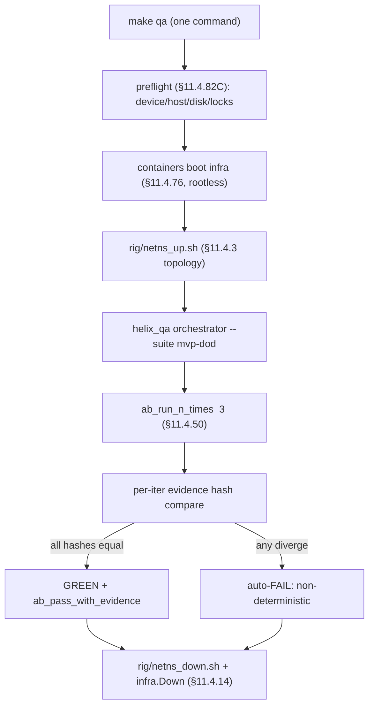

# Full-Automation Testing — HelixVPN nano-detail spec (Volume 8 · §11.4.169 type 4)

**Revision:** 1
**Last modified:** 2026-06-26T12:00:00Z

> Nano-detail expansion of [§5.4 of the Volume-8 overview](../10-testing-acceptance-and-qa.md).
> Full-automation (FA) is the §11.4.98 invariant made concrete: **every** E2E /
> integration / Challenge must be re-runnable end-to-end with **zero human
> intervention** after startup, N=3 consecutively, with self-cleaning state and an
> identical PASS each time (§11.4.50). For HelixVPN the whole MVP-DoD demo —
> `helixvpnctl init` → enroll connector+client → reach → deny → escalate → revoke →
> prove no-leak — runs as **one command**. The single permitted human touch-point is
> credential bootstrap *outside* execution (a `.env` token, §11.4.10). This document
> fixes the FA harness, the determinism wrapper, the self-driving requirement, the
> captured evidence, the gate, the paired §1.1 mutation, and skeletons. Spec-only;
> unproven assumptions marked `UNVERIFIED`. Siblings: [unit.md](unit.md),
> [integration.md](integration.md), [e2e.md](e2e.md), [challenges.md](challenges.md),
> [helixqa.md](helixqa.md).

---

## Table of contents

- [1. Scope — what FA covers (the §11.4.98 invariant)](#1-scope--what-fa-covers-the-1114-98-invariant)
- [2. Harness — make spike / make qa one-shot drivers](#2-harness--make-spike--make-qa-one-shot-drivers)
- [3. Fixtures — real system end-to-end, no human in the loop](#3-fixtures--real-system-end-to-end-no-human-in-the-loop)
- [4. Evidence taxonomy — what an FA PASS captures](#4-evidence-taxonomy--what-an-fa-pass-captures)
- [5. Determinism — the ab_run_n_times contract](#5-determinism--the-ab_run_n_times-contract)
- [6. Acceptance gate — when FA blocks a release](#6-acceptance-gate--when-fa-blocks-a-release)
- [7. The paired §1.1 mutation (anti-bluff proof)](#7-the-paired-11-mutation-anti-bluff-proof)
- [8. Test skeletons](#8-test-skeletons)
- [9. Open decisions surfaced for QA](#9-open-decisions-surfaced-for-qa)
- [Sources verified](#sources-verified)

---

## 1. Scope — what FA covers (the §11.4.98 invariant)

FA is not a *new* set of assertions — it is a **property** every higher test type
must satisfy: self-driving end-to-end, re-runnable forever, no human action after
startup. The §11.4.98 forensic anchor: *"these tests MUST be able to rerun endless
times … no false positives … every test obtains real proofs of everything working."*

| FA-covered flow | Composed from | The §11.4.98 property proven |
|---|---|---|
| **Full MVP-DoD demo** | `init` → enroll → reach (AC2) → deny (AC3) → escalate (AC4) → reconcile (AC5) → revoke (AC6) → kill-switch (AC7) | the whole product self-hosts + works with one command, N=3 |
| **Self-host from zero (AC1)** | `helixvpnctl init` + stack start, healthchecks green | a fresh operator reproduces the deploy autonomously |
| **Every E2E** ([e2e.md](e2e.md)) | the netns rig flows | each E2E re-runs with no human typing |
| **Every INT** ([integration.md](integration.md)) | containers-booted seams | infra boots itself; no manual `podman` |
| **Every Challenge** ([challenges.md](challenges.md)) | the DoD bank | the `challenges` engine drives + scores autonomously |
| **FFI round-trip (G5)** | Dart calls `connect()`, receives the status stream | a UI-less driver exercises the FFI [04_P0 G5] |

**The forbidden human touch-points** (any of these makes a test a §11.4.98 PASS-bluff
at the automation layer): an operator typing a value mid-run; a manual UI click a
test depends on; a hand-triggered webhook; a 60 s "wait for the human to respond"
window (also a §11.4.50 determinism violation); a hard-coded session UUID that
collides with a live dev session ([the Herald §11.4.98(C) lesson]). The **only**
permitted out-of-band step is one-time credential bootstrap (a `.env` token, an SSH
key) — configuration, not test driving.

---

## 2. Harness — make spike / make qa one-shot drivers

Two one-shot Make targets are the FA drivers ([overview §9](../10-testing-acceptance-and-qa.md)):

| Target | Phase | What it drives |
|---|---|---|
| `make spike` | Phase 0 | the G1–G6 gate sweep (rig reach, MASQUE-through-DPI, FFI round-trip, push-reconcile) end-to-end, N=3 |
| `make qa` | Phase 1 | the `helix_qa` autonomous session over the 8-AC DoD bank ([helixqa.md](helixqa.md)) |



The driver chains: a **preflight** (§11.4.82(C) — device/sink reachability, host
memory/disk, no stale locks, no orphan processes — a 30 s check that prevents a
45-minute run against a broken precondition); **infra boot** via `containers`
(§11.4.76, rootless §11.4.161); **rig up** (§11.4.3 topology); the **orchestrated
suite** under the determinism wrapper; **teardown** on every exit path (§11.4.14).
Long suites run **backgrounded** (`nohup … & disown`, §11.4.89) so the main work
stream is never blocked while FA runs.

---

## 3. Fixtures — real system end-to-end, no human in the loop

| Fixture | Real or mock | Notes |
|---|---|---|
| control plane + edge + client | **real** | the full stack, booted by the driver |
| infra (PG/Redis) | **real**, via `containers` | on-demand-infra invariant ([integration.md §2](integration.md)) |
| netns rig | **real** | the E2E substrate ([e2e.md §2](e2e.md)) |
| `.env` credential bootstrap | real token, **out-of-band** | §11.4.10 — the one permitted human step, *before* execution |
| programmatic drivers | real | `helixvpnctl`, `curl`, `helix-core` CLI — never a human keystroke |
| **mocks / manual steps** | **FORBIDDEN** (§11.4.27 / §11.4.98) | a manual click or a mock makes the suite non-re-runnable |

FA explicitly **drives** the UI programmatically where a UI flow is in scope —
through `panoptic` ([overview §5.14](../10-testing-acceptance-and-qa.md)) or, for
non-introspectable surfaces, the §11.4.117 CV/OCR pixel oracle — never "the operator
clicks Connect". A flow that genuinely cannot be driven autonomously (a hard
human-only login, a CAPTCHA) is an honest `operator_attended` SKIP with a tracked
migration item (§11.4.52), **never** a faked PASS.

---

## 4. Evidence taxonomy — what an FA PASS captures

FA's distinguishing evidence is the **re-runnability proof** on top of each
composed test's own §11.4.69 evidence:

| FA evidence | Produced by | Proves |
|---|---|---|
| N=3 identical evidence-hash log | `ab_run_n_times` | §11.4.50 determinism (no flake escape) |
| one-command transcript | the driver | §11.4.98 self-driving (no human step in the log) |
| self-cleaning proof | post-run sanity check | the host returned to quiescence (§11.4.14) |
| per-AC §11.4.69 artifacts | the composed E2E/INT/CHAL | the underlying features actually work |
| `helix_up==1` healthcheck | AC1 driver | the stack self-hosted from zero |

Per §11.4.69 every FA PASS flows through `ab_pass_with_evidence` citing the N=3 hash
log + the composed artifacts; the **absence of any human-action line in the run
transcript** is itself part of the evidence (a §11.4.98 grep for "operator MUST" /
manual-prompt patterns in the driver is a pre-build lint).

---

## 5. Determinism — the ab_run_n_times contract

The §11.4.50 wrapper is the heart of FA: it loops the suite, captures an
evidence-hash per iteration, and FAILs on **any** divergence — there is no
"first-pass-was-a-flake" path.

```bash
# the §11.4.50 determinism wrapper every FA suite uses ([overview §5.4])
ab_run_n_times() {                       # $1 name  $2 N  $3 fn
  local name="$1" n="$2" fn="$3" h prev=""
  for i in $(seq 1 "$n"); do
    "$fn" "$i"
    h=$(sha256sum "qa-results/$name/run_$i/evidence.json" | cut -d' ' -f1)
    [ -z "$prev" ] || [ "$h" = "$prev" ] || ab_fail "non-deterministic: run $i hash diverged from run $((i-1))"
    prev="$h"
  done
  ab_pass_with_evidence "$name x$n deterministic" "qa-results/$name/"
}
```

- **N policy:** N=3 for normal FA runs, **N=10** for cycle-validation suites (the
  pre-tag §11.4.40 sweep). The same artifact MD5 + same rig + same topology each
  iteration.
- **What hashes:** the *evidence content* (pcap structural hash, rowset, body hash,
  delta JSON) — **not** wall-clock timing (which is captured as a value compared to
  an SLO budget, not asserted equal). A timing field is normalised out of the hashed
  `evidence.json` before hashing.
- **Self-cleaning state** is the precondition for determinism: each iteration starts
  from `netns_up.sh` + a fresh `containers` boot, so run *i+1* cannot inherit run
  *i*'s tunnel/route/row (§11.4.108/.139 clean-artifact, defeats B4 stale-state).
- A 9/10 PASS is **auto-FAIL** — a real defect (a hidden timing/ordering dependency),
  never a flake (§11.4.50 mechanises §11.4.7 demotion-evidence).

---

## 6. Acceptance gate — when FA blocks a release

| Gate | Bar | Bound item |
|---|---|---|
| **`make spike`** | G1–G6 all clear N=3, evidence captured | Phase-0 exit ([overview §7.1](../10-testing-acceptance-and-qa.md)) |
| **`make qa`** | the 8-AC DoD bank PASS via `helix_qa`, N=3 | Phase-1 DoD ([overview §7.2](../10-testing-acceptance-and-qa.md)) |
| **`CM-FA-RERUNNABLE`** (§11.4.98) | every E2E/INT/CHAL passes at `-count=3`; no human-action line in any driver | pre-build + runtime |
| **`CM-FA-NO-MANUAL-STEP`** | no `operator MUST` / manual-prompt / hard-coded-session-UUID pattern in test sources | pre-build lint |

FA is the **operating-mode gate**: a feature whose only validation path is
operator-attended is a §11.4.52 release blocker (its coverage-ledger cell sits at
`OPERATOR_ATTENDED_ONLY` until promoted with a tracked migration item, [overview §6](../10-testing-acceptance-and-qa.md)). The §11.4.40 full-suite-retest-before-tag
**is** an FA run at N=10 — a release tag is created only after the whole MVP-DoD demo
runs autonomously, deterministically, on a clean baseline (§11.4.126 release-scope
terminal condition).

---

## 7. The paired §1.1 mutation (anti-bluff proof)

```text
# §1.1 mutation for CM-FA-RERUNNABLE (proves the determinism wrapper actually catches drift)
- inject a non-deterministic byte into evidence.json (e.g. an un-normalised timestamp
  or a random run-id) BEFORE hashing
- assert: ab_run_n_times reports "non-deterministic: run 2 hash diverged" → FA FAILs
- restore the normalisation; assert N=3 identical → PASS
```

```text
# §1.1 mutation for CM-FA-NO-MANUAL-STEP (proves the no-human-step lint is real)
- add a line `read -p "operator: type the token> " TOK` into a driver
- assert: the pre-build lint flags the manual-prompt pattern → gate FAILs
- restore (token from .env §11.4.10); assert PASS
```

These mutations prove the FA gates are not tautologies: the determinism wrapper
genuinely FAILs on injected drift, and the no-manual-step lint genuinely catches a
human touch-point. The mutation/restore cycle is serialised + working-tree-verified
clean before any unrelated commit (§11.4.84).

---

## 8. Test skeletons

### 8.1 The whole MVP-DoD demo as one self-driving function

```bash
# scripts/fa_mvp_dod.sh — driven by `make qa`; ZERO human steps after startup (§11.4.98)
fa_mvp_dod() {                                          # $1 = iteration index
  local run="qa-results/fa_mvp_dod/run_$1"; mkdir -p "$run"
  preflight_or_fail                                     # §11.4.82C: host/disk/locks/reachability
  trap 'rig/netns_down.sh; infra_down' EXIT             # §11.4.14 quiescence on every exit

  # AC1 — self-host from zero (token from .env, §11.4.10 — the ONE out-of-band step)
  helixvpnctl init --config "$run/helix.yaml" --token-from-env
  wait_healthy helix_up 60 || ab_fail "AC1: stack not healthy"

  # AC2 enroll + reach, AC3 deny, AC4 escalate, AC5 reconcile, AC6 revoke, AC7 kill-switch
  rig/enroll.sh connector client          | tee "$run/enroll.log"
  rig/test_reach.sh pass                   ; cp qa-results/e2e/*reach.pcap "$run/"   # AC2
  rig/test_reach.sh deny                                                            # AC3
  rig/escalate.sh                                                                   # AC4
  rig/reconcile.sh                                                                  # AC5
  rig/revoke.sh                                                                     # AC6
  rig/killswitch_drop.sh                                                            # AC7 (SEC §5.7)

  # single normalised evidence manifest the determinism wrapper hashes
  collect_evidence "$run" > "$run/evidence.json"        # timing fields normalised out
}

# the one command:  make qa  ->  ab_run_n_times "fa_mvp_dod" 3 fa_mvp_dod
```

### 8.2 AC1 self-host healthcheck poll (loading is a distinct state)

```bash
# wait_healthy — poll a real healthcheck, never a fixed sleep (§11.4.107(3))
wait_healthy() {                                        # $1 metric  $2 timeout_s
  local t0; t0=$(date +%s)
  until [ "$(curl -s localhost:9090/metrics | grep "^$1 " | awk '{print $2}')" = "1" ]; do
    sleep 0.5
    [ $(( $(date +%s) - t0 )) -lt "$2" ] || return 1    # timeout+unreachable handled by caller (SKIP vs FAIL)
  done
}
```

### 8.3 FFI round-trip (G5) — Dart drives the core, no UI

```dart
// helix-ui/integration_test/ffi_roundtrip_fa_test.dart  (G5, §11.4.98 self-driving)
// Drives the Rust core through flutter_rust_bridge with NO widget, NO human tap.
void main() {
  test('FA: connect() returns a live status stream, N-runnable', () async {
    final core = HelixCore.bridge();                    // real FFI, real core
    final statuses = <TunnelStatus>[];
    final sub = core.statusStream().listen(statuses.add);
    await core.connect(ConnectArgs(target: '10.10.0.20')); // real connect, real tunnel
    await pumpUntil(() => statuses.contains(TunnelStatus.connected),
                    timeout: const Duration(seconds: 8)); // loading distinct (§11.4.107(3))
    expect(statuses, contains(TunnelStatus.connecting));  // saw the loading state
    expect(statuses.last, TunnelStatus.connected);
    await core.disconnect(); await sub.cancel();          // self-cleaning (§11.4.14)
    writeEvidence('qa-results/fa/ffi_roundtrip', statuses);
  });
}
```

---

## 8a. Self-cleaning state — the re-runnability precondition

FA's "re-runnable forever" property is impossible without **self-cleaning state**:
run *i+1* must not inherit anything from run *i*. The catalog of state every FA flow
must reset, and how:

| State class | Left by a run | Reset mechanism | Constitution |
|---|---|---|---|
| network namespaces / veths / routes | the netns rig | `trap 'rig/netns_down.sh' EXIT` | §11.4.14 |
| `nft` DPI table + `tc netem` qdisc | `dpi_block.sh` / `impair.sh` | `netns_down.sh` flushes both | §11.4.14 |
| containers (PG/Redis/edge) | `containers/pkg/boot` | `infra.Down(ctx)` on every exit path | §11.4.14 / §11.4.76 |
| overlay tunnel + WG peers | `helix-core` | `helix-core disconnect` + a clean re-deploy | §11.4.108/.139 |
| DB rows (tenants/devices/allocations) | the seed step | fresh `containers` boot each iteration | §11.4.50 |
| `qa-results/` raw recordings (the agent's own, in-scope) | `panoptic` capture | fresh-corpus rotation before a new run | §11.4.154(B) |
| stale locks / orphan processes | a crashed prior run | preflight scan (§11.4.82(C)/(H)) | §11.4.82 |

The post-run **sanity check** asserts the host returned to quiescence; a surviving
namespace, container, qdisc, or orphan process FAILs the just-completed FA run
(§11.4.14) — a test that "passes" but leaves orphan state is itself a defect, because
the *next* run inherits it and the determinism contract silently breaks. Fresh-corpus
rotation removes **only the agent's own in-scope** prior recordings (§11.4.154(B));
foreign/operator files are surfaced, never deleted (§11.4.122 / §9.2).

## 8b. The §11.4.98 compliance audit (existing-test classification)

§11.4.98(C)(5) requires every test be classified COMPLIANT vs NON-COMPLIANT against
the no-manual-step invariant, and a NON-COMPLIANT test rewritten within the grace
window or graduated to §11.4.90 `Obsolete` citing §11.4.98. The HelixVPN audit lens:

| Pattern (NON-COMPLIANT) | HelixVPN remediation |
|---|---|
| "operator types the enrollment token" | token from `.env` (§11.4.10), `helixvpnctl enroll-token` programmatic |
| "operator taps Connect in the app" | `panoptic` drives the tap; §11.4.117 pixel oracle if the UI tree is blank |
| "operator confirms the shield is green" | `vision_engine` OCR verdict + core-FSM cross-check ([helixqa.md](helixqa.md)) |
| "operator triggers the DPI block" | `rig/dpi_block.sh` applies the `nft` rule autonomously |
| hard-coded session UUID colliding with a live session | a per-run unique id minted at startup (the Herald §11.4.98(C) lesson) |
| 60 s "wait for human response" window | replaced by a real healthcheck poll (§8.2), bounded by a timeout |

## 9. Open decisions surfaced for QA

| # | Decision | Options | Recommendation |
|---|---|---|---|
| **FA-D1** | N for the pre-tag sweep | N=3 vs N=10 | **N=10 for the §11.4.40 pre-tag cycle-validation**, N=3 for routine FA — the cost is amortised against a release, not every push |
| **FA-D2** | UI-flow driver in FA | `panoptic` drive vs CV/OCR pixel oracle vs operator-attended | **`panoptic` where the Flutter hierarchy is introspectable; §11.4.117 pixel oracle for canvas/leanback; operator-attended SKIP only when genuinely infeasible (§11.4.52)** |
| **FA-D3** | timing-field hashing | include timing (over-strict) vs normalise out | **normalise timing out of `evidence.json`** before hashing; compare timing separately to the SLO budget — avoids false non-determinism FAILs (§11.4.50) |

## 9a. FA vs the other types — the composing relationship

FA is a **property layered onto** the other types, not a parallel suite:

| Type | What FA adds to it |
|---|---|
| UNIT | `ab_run_n_times` determinism even at the unit layer (seeded property tests) |
| INT | the on-demand-infra boot is part of the one command — no manual `podman` |
| E2E | each rig flow re-runs N=3 with self-cleaning netns + identical pcap verdict |
| CHAL | the `challenges` engine runs unattended; no human triggers a driver |
| HQA | the whole autonomous session **is** the FA driver at the orchestration layer |

The §11.4.98 invariant is therefore tested *transitively*: `CM-FA-RERUNNABLE` re-runs
the entire pyramid at `-count=3` and asserts every layer is self-driving; a single
manual touch-point anywhere fails the whole FA gate, regardless of how green the
individual layer looked. This is why FA is a §11.4.52 release blocker for any feature
whose only path is operator-attended — the coverage-ledger cell cannot reach
`AUTONOMOUS_VERIFIED` until the FA property holds end-to-end.

> **`UNVERIFIED`:** the `helixvpnctl init --token-from-env` flag name and the
> `localhost:9090/metrics` `helix_up` metric name are taken from the overview/[06]
> skeleton; confirm against [../v06-deploy/helixvpnctl.md](../v06-deploy/helixvpnctl.md)
> and [../v03-control-plane/svc-telemetry.md](../v03-control-plane/svc-telemetry.md)
> at implementation time.

---

## Sources verified

- [Volume-8 overview](../10-testing-acceptance-and-qa.md) §2 (taxonomy row `FA`), §5.4 (`ab_run_n_times` wrapper), §5.6 (`helix_qa` `make qa`), §7.1 (G5), §7.2 (AC1–AC9), §9 (Makefile `qa:`) — read 2026-06-26.
- Sibling specs cross-referenced: [e2e.md](e2e.md), [integration.md](integration.md), [challenges.md](challenges.md), [helixqa.md](helixqa.md), [../v06-deploy/helixvpnctl.md](../v06-deploy/helixvpnctl.md), [../v03-control-plane/svc-telemetry.md](../v03-control-plane/svc-telemetry.md), [../v04-client/ffi-surface.md](../v04-client/ffi-surface.md) — filenames confirmed present (v06/v03 `[GEN]`-planned) 2026-06-26.
- Constitution: §11.4.98 (full-automation / re-runnable / no manual step / no false positive), §11.4.50 (determinism / `ab_run_n_times`), §11.4.52 (autonomous-validation / operator-attended is a blocker), §11.4.117 (CV/OCR pixel oracle), §11.4.10 (credential bootstrap out-of-band), §11.4.14 (cleanup quiescence), §11.4.82(C) (preflight), §11.4.89 (background execution), §11.4.40 (pre-tag full-suite retest), §11.4.108/.139 (clean-artifact), §11.4.126 (release-scope terminal condition), §1.1 (paired mutation) — from `CLAUDE.md` in-context.
- The Herald §11.4.98(C) hard-coded-session-UUID lesson is cited from the constitution text in-context — not a HelixVPN artifact.
