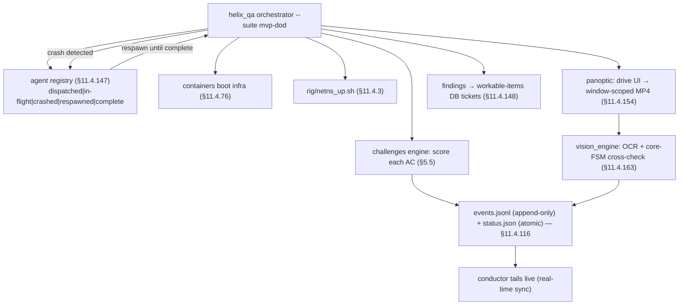
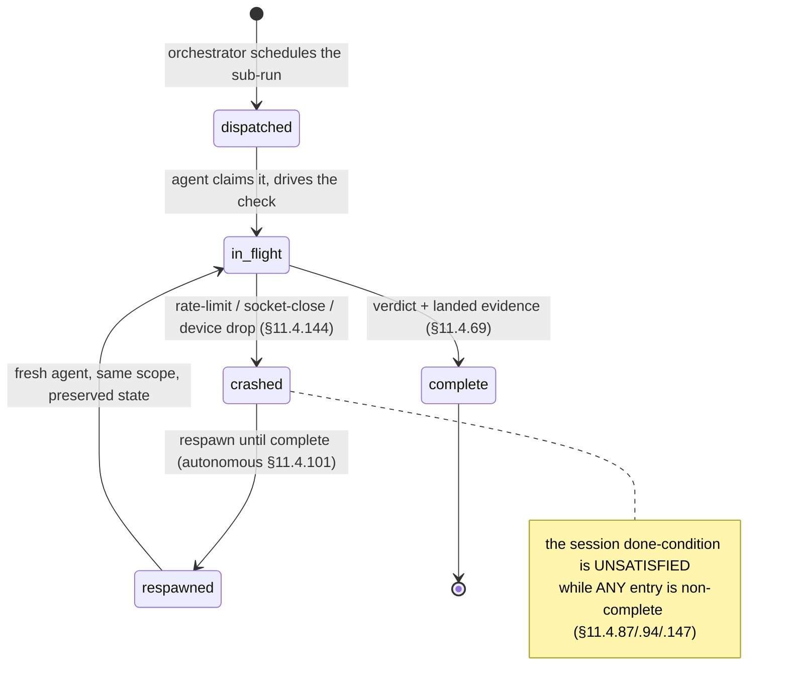

# HelixQA Autonomous Sessions — HelixVPN nano-detail spec (Volume 8 · §11.4.169 type 6)

**Revision:** 1
**Last modified:** 2026-06-26T12:00:00Z

> Nano-detail expansion of [§5.6 of the Volume-8 overview](../10-testing-acceptance-and-qa.md).
> HelixQA (`HelixDevelopment/helix_qa`) is the **autonomous QA orchestrator**
> (§11.4.27 / §11.4.107 / §11.4.158): it drives the full MVP-DoD acceptance set
> end-to-end with **no human**, consumes the `challenges` banks ([challenges.md](challenges.md)),
> boots infra via `containers` ([integration.md](integration.md)), drives the UI via
> `panoptic` and analyses frames via `vision_engine`, generates tickets for findings
> into the workable-items DB, respawns crashed sub-runs (§11.4.147), and emits the
> **real-time sync channel** (§11.4.116 — append-only JSONL event stream + atomically-
> rewritten status snapshot) that the conductor tails live. It is the §11.4.165
> **independent-verification agent for the runtime layer** — structurally separate
> from the code author. This document fixes the harness, the written test banks per
> app/service/platform, the captured wire-evidence-per-check contract, the sync
> channel, the determinism, the gate, the paired §1.1 mutation, and skeletons.
> Spec-only; unproven assumptions marked `UNVERIFIED`. Siblings: [unit.md](unit.md),
> [integration.md](integration.md), [e2e.md](e2e.md), [full-automation.md](full-automation.md),
> [challenges.md](challenges.md).

---

## Table of contents

- [1. Scope — what HelixQA orchestrates](#1-scope--what-helixqa-orchestrates)
- [2. Harness — the helix_qa orchestrator + test banks](#2-harness--the-helix_qa-orchestrator--test-banks)
- [3. Fixtures — real system, autonomous drive, captured wire evidence](#3-fixtures--real-system-autonomous-drive-captured-wire-evidence)
- [4. Evidence taxonomy — the §11.4.116 sync channel + per-check wire evidence](#4-evidence-taxonomy--the-1114116-sync-channel--per-check-wire-evidence)
- [5. Determinism — N-iteration identical evidence](#5-determinism--n-iteration-identical-evidence)
- [6. Acceptance gate — when HQA blocks a release](#6-acceptance-gate--when-hqa-blocks-a-release)
- [7. The paired §1.1 mutation (anti-bluff proof)](#7-the-paired-11-mutation-anti-bluff-proof)
- [8. Test skeletons](#8-test-skeletons)
- [9. Open decisions surfaced for QA](#9-open-decisions-surfaced-for-qa)
- [Sources verified](#sources-verified)

---

## 1. Scope — what HelixQA orchestrates

HelixQA is not a single test type — it is the **autonomous QA session orchestrator**
that drives every other type (CHAL, E2E, INT, SEC, REC) as an end-to-end run with no
human, captures wire evidence per check, and reconciles the verdicts into the
coverage ledger and the workable-items DB. Per §11.4.27 it must be used with
**written test banks (suites) for every application, service, and platform** plus
**fully-autonomous QA sessions** driving every registered bank with captured wire
evidence per check.

| HelixQA responsibility | Mechanism | Constitution |
|---|---|---|
| **drive the DoD acceptance set** end-to-end, no human | `--suite mvp-dod` over the `challenges` banks | §11.4.27 / §11.4.98 |
| **boot infra** for the run | `containers/pkg/boot` (rootless) | §11.4.76 / §11.4.161 |
| **drive the UI** flows | `panoptic` (web/desktop/mobile) → window-scoped MP4 | §11.4.154 / §11.4.159 |
| **analyse frames** for the REC verdict | `vision_engine` OCR + core-FSM cross-check | §11.4.163 / §11.4.165 |
| **emit a real-time sync channel** | append-only JSONL events + atomic status snapshot | §11.4.116 |
| **respawn crashed sub-runs** | durable agent registry, crash≠done | §11.4.147 |
| **generate tickets** for findings | write into the §11.4.93/.95 workable-items DB | §11.4.148 |
| **be the independent verifier** | structurally separate from the code author | §11.4.165 |

The **written test banks** are organised per surface:

| Bank | Surface | Suites it holds |
|---|---|---|
| `helix_qa/banks/control_plane.yaml` | the Go services | enrollment, RLS, reconcile, revoke, events, API authz (drives INT + CHAL) |
| `helix_qa/banks/data_plane.yaml` | `helix-core` + edge | reach, default-deny, escalation, kill-switch, liveness (drives E2E + SEC) |
| `helix_qa/banks/clients_<platform>.yaml` | per-platform app | connect flow, status UI, exit picker — one per platform (Access/Connector/Console × iOS/Android/Linux/Windows/macOS/Web; HarmonyOS/Aurora Phase 3) | drives UI + REC |
| `helix_qa/banks/mvp_dod.yaml` | the release gate | the 8 ACs ([challenges.md §8](challenges.md)) |

> **`UNVERIFIED`:** the exact bank-file naming and the per-platform split granularity
> are the intended layout; the obligation (a written bank per app/service/platform,
> §11.4.27) is fixed, the file layout is a Phase-1 instantiation per §11.4.35.

---

## 2. Harness — the helix_qa orchestrator + test banks

`helix_qa` (`HelixDevelopment/helix_qa`, Go) is consumed as an owned submodule
(§11.4.28, equal-codebase, consumed by reference / pinned SHA), invoked as one
command ([overview §9](../10-testing-acceptance-and-qa.md)):
`go run ./submodules/helix_qa/cmd/orchestrator --suite mvp-dod`.



- **Independent verifier (§11.4.165):** HelixQA is dispatched as a structurally-
  separate agent from the code author — it re-reads the captured evidence and
  produces its own verdict; a HelixQA PASS is the runtime-layer independent
  confirmation, never the author asserting their own work.
- **Crash-respawn (§11.4.147):** every sub-run (per-AC Challenge, per-platform UI
  drive) is a registry entry; a transient crash (rate-limit, socket-close, a device
  drop §11.4.144) flips it to `crashed`, keeps it OPEN, and respawns until
  `complete`. The session's done-condition is **not** satisfied while any entry is
  non-`complete` — a registry showing `complete` without landed evidence is a §11.4
  PASS-bluff at the agent-lifecycle layer.
- **Self-meta-test (§11.4.32):** HelixQA plants a known-broken AC and asserts the
  session reports FAIL — proving the orchestrator itself does not bluff.

---

## 3. Fixtures — real system, autonomous drive, captured wire evidence

| Fixture | Real or mock | Notes |
|---|---|---|
| the full stack (control plane + edge + client + apps) | **real** | HelixQA drives the deployed system, not a mock |
| infra (PG/Redis) | **real**, via `containers` | rootless on-demand boot |
| netns rig | **real** | the E2E substrate ([e2e.md](e2e.md)) |
| UI drive | **real** via `panoptic` | the app's own UI; §11.4.117 pixel oracle for non-introspectable surfaces |
| frame analysis | **real** `vision_engine` OCR | golden-good/bad self-validated (§11.4.107(10)) |
| `.env` credentials | real token, **out-of-band** | §11.4.10 — the one permitted human step |
| **mocks / manual steps** | **FORBIDDEN** (§11.4.27 / §11.4.98) | HelixQA is the autonomous-session layer; a human step breaks it |

HelixQA's autonomy is the §11.4.98 invariant at the orchestration layer: a session
that requires a human to type, click, or trigger anything after startup is a
PASS-bluff. A flow genuinely infeasible to drive autonomously is an honest
`operator_attended` SKIP with a tracked migration item (§11.4.52), surfaced on the
sync channel — never a faked PASS.

---

## 4. Evidence taxonomy — the §11.4.116 sync channel + per-check wire evidence

HelixQA's distinguishing evidence is the **real-time sync channel** plus a
**captured wire artifact per check**. Per §11.4.116 the channel is two parts:

1. an **append-only JSONL event stream** (`qa-results/helix_qa/events.jsonl`), one
   event per line, never rewritten;
2. an **atomically-rewritten status snapshot** (`qa-results/helix_qa/status.json`,
   write-temp-then-rename) the conductor tails.

```jsonc
// qa-results/helix_qa/events.jsonl — append-only (§11.4.116)
{"ts":"2026-…","ev":"session_start","suite":"mvp-dod","build":"<artifact-md5>"}
{"ts":"…","ev":"challenge_start","id":"HVPN-CHAL-AC2-authorized-reach"}
{"ts":"…","ev":"evidence","id":"HVPN-CHAL-AC2-…","path":"qa-results/.../reach.pcap"}
{"ts":"…","ev":"verdict","id":"HVPN-CHAL-AC2-…","result":"PASS","evidence":"qa-results/.../reach.pcap"}
{"ts":"…","ev":"agent","id":"ui-drive-ios","state":"crashed","reason":"device_dropped"}   // §11.4.147
{"ts":"…","ev":"agent","id":"ui-drive-ios","state":"respawned"}
```

**The verdict-carries-evidence-path invariant (§11.4.116):** a `verdict` event
**must** carry the `evidence` path that backs it — a PASS event with no evidence path
is a channel-layer PASS-bluff; a snapshot reporting PASS while the stream shows no
`evidence` event for that AC is a **contradiction** → treated as FAIL; an AC with no
`challenge_start` event cannot have a `verdict`. Verdicts use the closed vocabulary
PASS / FAIL / SKIP / OPERATOR-BLOCKED (§11.4.45). The captured artifacts themselves
are the §11.4.69 sink-side evidence per check ([challenges.md §4](challenges.md)).

The status snapshot:

```jsonc
// qa-results/helix_qa/status.json — atomically rewritten (write-temp-then-rename)
{ "session":"mvp-dod","build":"<artifact-md5>","phase":"running",
  "counters":{"pass":5,"fail":0,"skip":0,"operator_blocked":0,"pending":3},
  "last_verdict":{"id":"HVPN-CHAL-AC6-revoke","result":"PASS","evidence":"qa-results/.../revoke_timing.csv"},
  "open_agents":[{"id":"ui-drive-console","state":"in-flight"}] }   // §11.4.147 — not done while open
```

---

## 5. Determinism — N-iteration identical evidence

Per §11.4.50 a HelixQA session over the same artifact MD5 + same rig must produce an
identical *verdict set* with structurally-identical per-check evidence across N=3
(normal) / N=10 (cycle-validation):

1. The orchestrator runs under the FA wrapper ([full-automation.md §5](full-automation.md)); each AC's matched-evidence structural hash is compared
   across runs; a divergence is auto-FAIL.
2. The sync-channel **event ordering** is deterministic per the risk-ordered schedule
   (§11.4.132 — security-floor ACs first); a reordered run with the same verdicts is
   acceptable, a *divergent verdict* is not.
3. Crash-respawn does not break determinism: a respawned sub-run must reach the
   **same** verdict + same evidence shape as a first-attempt run; the registry proves
   the work was not lost, the evidence proves it was not corrupted (§11.4.147 honest
   boundary — durability, not correctness; correctness is the per-check evidence).

---

## 6. Acceptance gate — when HQA blocks a release

| Gate | Bar | Layer |
|---|---|---|
| **`make qa`** ([overview §9](../10-testing-acceptance-and-qa.md)) | the `mvp-dod` session reports all 8 ACs PASS with per-check evidence | release sweep |
| **`CM-AUTONOMOUS-FRAMEWORK-SYNC-CHANNEL`** (§11.4.116) | the session emits the JSONL stream + atomic snapshot; every verdict carries an evidence path | pre-build + runtime |
| **`CM-HQA-NO-COMPLETE-WITHOUT-EVIDENCE`** (§11.4.147) | the done-condition is unsatisfied while any registry entry is non-`complete`; no `complete` without landed evidence | runtime |
| **`CM-HQA-SELF-META-TEST`** (§11.4.32) | the planted known-broken AC makes the session report FAIL | pre-build meta-test |

HelixQA's session exit status **gates the release** — `make qa` is the §11.4.40
pre-tag full-suite-retest driver at N=10, and the §11.4.165 independent-verification
gate (QA-D4: **independent re-read**, [overview §10](../10-testing-acceptance-and-qa.md) — `vision_engine` re-reads the MP4 and cross-checks
the core FSM, the harness's claim is never the verdict). A finding generates a
workable-items ticket (§11.4.148); the feature's coverage-ledger cell stays out of
`AUTONOMOUS_VERIFIED` until the session re-runs GREEN.

---

## 7. The paired §1.1 mutation (anti-bluff proof)

```text
# §1.1 mutation for CM-AUTONOMOUS-FRAMEWORK-SYNC-CHANNEL (verdict-carries-evidence)
- make the orchestrator emit a verdict event WITHOUT an `evidence` path:
    {"ev":"verdict","id":"HVPN-CHAL-AC2-…","result":"PASS"}     // no evidence path
- assert: the channel validator flags a PASS-with-no-evidence-path as a contradiction
  → treats it as FAIL → gate FAILs (the bluff is caught)
- restore (evidence path required); assert PASS
```

```text
# §1.1 mutation for CM-HQA-NO-COMPLETE-WITHOUT-EVIDENCE (§11.4.147)
- mark a `crashed` registry entry as the session's done-condition `complete` WITHOUT
  its sub-run landing evidence
- assert: the done-condition checker refuses to read satisfied → session reports
  incomplete → gate FAILs (crash≠done enforced)
- restore (respawn-until-real-complete); assert the session completes only with evidence
```

```text
# §1.1 mutation for CM-HQA-SELF-META-TEST (§11.4.32 — the orchestrator itself doesn't bluff)
- plant a known-broken AC (e.g. force default-deny to fail-open in the test build)
- assert: the mvp-dod session reports AC3 FAIL (the orchestrator detects the break)
- a session that reports AC3 PASS on the broken build is itself the bluff → meta-test FAILs
```

---

## 8. Test skeletons

### 8.1 The orchestrator invocation + sync-channel consumption

```go
// submodules/helix_qa/cmd/orchestrator/main.go (invocation contract; engine in submodule)
//   go run ./submodules/helix_qa/cmd/orchestrator --suite mvp-dod
// 1. boot infra via containers (§11.4.76), bring up the rig (§11.4.3)
// 2. for each AC in the mvp-dod bank, dispatch a sub-run (registry entry §11.4.147)
// 3. score via the challenges engine (§5.5); drive UI via panoptic; analyse via vision_engine
// 4. append every event to events.jsonl; rewrite status.json atomically (§11.4.116)
// 5. on crash → flip registry to `crashed`, respawn until `complete`
// 6. session PASS only when every AC verdict==PASS AND every registry entry==complete-with-evidence
```

```bash
# the conductor's live tail of the sync channel (§11.4.116) — never idle-blind (§11.4.94)
tail -F qa-results/helix_qa/events.jsonl | while read -r ev; do
  case "$(jq -r .ev <<<"$ev")" in
    verdict)
      path=$(jq -r '.evidence // empty' <<<"$ev")
      [ -n "$path" ] || ab_fail "§11.4.116: verdict with no evidence path → contradiction (FAIL)"
      ;;
    agent) [ "$(jq -r .state <<<"$ev")" = crashed ] && note_open_workunit "$ev" ;;  # §11.4.147
  esac
done
```

### 8.2 A control-plane bank suite entry (drives INT + CHAL)

```yaml
# helix_qa/banks/control_plane.yaml — written test bank per service (§11.4.27)
bank: helixvpn-control-plane
suites:
  - name: rls-isolation
    drives: [ "go test -tags integration -run TestRLSCrossTenantDenial ./helix-go/internal/store/..." ]
    evidence_class: rls_rowset                 # §11.4.69 — captured rowset
    capture: qa-results/int/rls_${RUN_ID}.json
  - name: revoke-latency
    drives: [ "rig/revoke.sh" ]
    evidence_class: counter_delta
    assert_p99_lt_seconds: 1.0                  # SLO3
    capture: qa-results/e2e/revoke_timing.csv
```

### 8.3 A per-platform client bank suite (drives UI + REC, §11.4.165 independent re-read)

```yaml
# helix_qa/banks/clients_ios.yaml — written bank per platform (§11.4.27)
bank: helixvpn-client-ios
suites:
  - name: connect-flow
    drives: [ "panoptic drive --app access --platform ios --flow enroll-connect-reach" ]
    evidence_class: REC                         # §11.4.153/.159
    capture:
      kind: mp4
      window_scoped: true                       # §11.4.154 — app window only
      filename_prefix: helixvpn---              # §11.4.155
      vision_verdict: vision_engine             # §11.4.163 independent re-read (§11.4.165)
      expected_patterns: ["Connect","Connecting","Connected","shield:green"]
      cross_check: { core_fsm_at_green_shield: "Connected" }   # defeats B3
    on_uninstrumentable_ui: pixel_oracle        # §11.4.117 fallback, never fake PASS
    on_no_device: skip_operator_attended        # §11.4.3/.52 honest SKIP (real device required)
```

---

## 8a. The agent-lifecycle registry (§11.4.147 — crash ≠ done)

Every HelixQA sub-run (a per-AC Challenge, a per-platform UI drive, a device session)
is a durable registry entry on the §11.4.116 sync substrate, so a crash never loses,
forgets, or corrupts its work:



| Lifecycle hazard | HelixQA response |
|---|---|
| transient API rate-limit kills a sub-run | flip to `crashed`, keep OPEN, respawn with the project's defined backoff (never invented, §11.4.6) |
| a tracked device drops mid-UI-drive | §11.4.144 availability-following: log an honest offline event, wait the defined reconnect budget, re-attach + resume, escalate on timeout |
| partial UI-drive state (half a recording) | preserve, §11.4.84 quiescence check, resume-or-clean-restart from a known-good base |
| a `complete` entry has no landed evidence | the done-condition refuses to read satisfied (a `complete` without evidence is a §11.4 PASS-bluff) |

The honest boundary (§11.4.147): the registry + respawn guarantee the work is **not
lost or corrupted**, NOT that it is **correct** — a respawned sub-run's output still
crosses the per-check §11.4.69 evidence gate and the §11.4.40 retest; §11.4.147 is
the durability layer beneath those.

## 8b. HelixQA as the independent verifier (§11.4.165) — the structural seam

HelixQA is dispatched as a **structurally-separate agent from the code author**
(§11.4.70 / §11.4.165); §11.4.92 author-side self-evaluation PRECEDES but never
satisfies it. The independence is load-bearing:

| Verification axis | What HelixQA independently re-reads | The author claim it does NOT trust |
|---|---|---|
| reachability | the captured pcap (SYN-ACK present/absent) | "the reach test passed" |
| escalation | the tshark classification (H3 present, WG absent) | `StatusReport.transport=="masque-h3"` alone (B3) |
| UI flow | the window-scoped MP4 via `vision_engine` + core-FSM cross-check | "the shield went green" (a green shield while the FSM is `Blocked` FAILs) |
| no-log | the live-DB introspection report | "the schema is fine" |

A HelixQA session that rubber-stamps the harness's claims without re-reading the
artifacts is itself the bluff the §11.4.165 + §11.4.32 self-meta-test (§7) catches.

## 9. Open decisions surfaced for QA

| # | Decision | Options | Recommendation |
|---|---|---|---|
| **H-D1** | Vision verdict authority (QA-D4) | trust the harness verdict vs independent `vision_engine` re-read | **independent re-read** ([overview §10](../10-testing-acceptance-and-qa.md)) — `vision_engine` re-reads the MP4 + cross-checks the core FSM (defeats B3); the harness claim is never the verdict (§11.4.165) |
| **H-D2** | crash-respawn backoff | fixed vs project-defined budget | **project-defined backoff (§11.4.147)** reusing the recovery path's existing budgets — never invented numbers (§11.4.6) |
| **H-D3** | per-platform bank granularity | one bank per platform vs one bank with platform matrix | **one bank per platform** for clear per-surface coverage (§11.4.27); a matrix view is a derived projection |

> **`UNVERIFIED`:** the `helix_qa` orchestrator CLI (`--suite`), the bank-YAML keys
> (`drives`, `evidence_class`, `vision_verdict`, `on_no_device`), and the
> `cmd/orchestrator` path are the **intended** shape per the overview skeleton;
> confirm against the pinned `HelixDevelopment/helix_qa` SHA (§11.4.74 — extend
> upstream if unsupported).

---

## Sources verified

- [Volume-8 overview](../10-testing-acceptance-and-qa.md) §2 (taxonomy row `HQA`), §5.6 (the orchestrator + the §11.4.116 sync-channel JSONL skeleton), §5.5 (banks it consumes), §7.2 (AC set it scores), §10 QA-D4 — read 2026-06-26.
- Sibling specs cross-referenced: [challenges.md](challenges.md), [e2e.md](e2e.md), [integration.md](integration.md), [full-automation.md](full-automation.md) — written 2026-06-26 in this same volume.
- Constitution: §11.4.27 (no-fakes / 100% type coverage / HelixQA banks + autonomous sessions), §11.4.116 (real-time sync channel / verdict-carries-evidence-path), §11.4.147 (crashed-agent respawn / crash≠done registry), §11.4.165 (independent verification agent), §11.4.32 (self-meta-test), §11.4.45 (closed verdict vocabulary), §11.4.69 (sink-side evidence per check), §11.4.98 (autonomous / no manual step), §11.4.117 (pixel-oracle fallback), §11.4.52/.3 (honest operator-attended SKIP), §11.4.153/.154/.155/.159/.163 (REC / window-scope / prefix / media-validation), §11.4.148 (ticket integrity), §11.4.93/.95 (workable-items DB), §11.4.50 (determinism), §11.4.40 (pre-tag retest), §11.4.144 (device-availability following), §1.1 (paired mutation) — from `CLAUDE.md` in-context.
- The `helix_qa` orchestrator CLI + bank-YAML schema are reproduced from the overview skeleton — **not independently fetched from `HelixDevelopment/helix_qa`** (`UNVERIFIED`; confirm at the pinned SHA).
