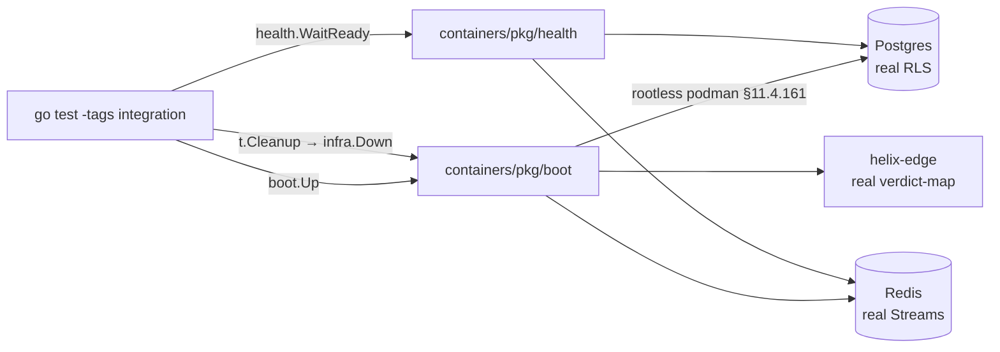
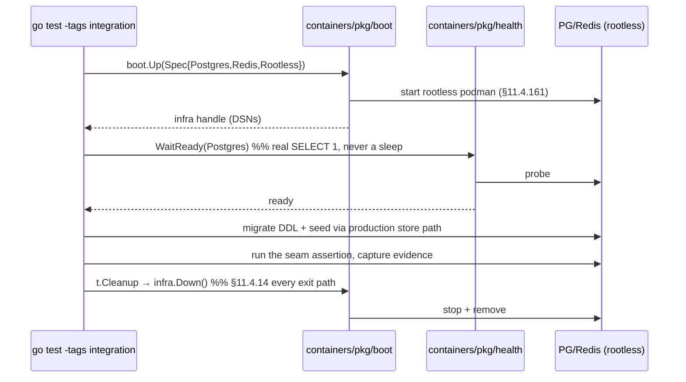

# Integration Testing — HelixVPN nano-detail spec (Volume 8 · §11.4.169 type 2)

**Revision:** 2
**Last modified:** 2026-07-04T12:00:00Z

> **Rev 2 (2026-07-04):** independently re-verified against `SPECIFICATION.md` /
> `decision-register.md` / `10-testing-acceptance-and-qa.md` during a corpus-wide
> gap-analysis pass; no contradictions or gaps found (the on-demand-infra-via-
> `containers` invariant and the no-mocks-below-unit boundary are consistent with
> the rest of the corpus). Revision bumped for the audit pass itself.

> Nano-detail expansion of [§5.2 of the Volume-8 overview](../10-testing-acceptance-and-qa.md).
> Integration (INT) is the **first layer where mocks are forbidden** (§11.4.27): every
> seam that touches real infrastructure is exercised against a *real* Postgres, a
> *real* Redis, and a *real* edge, booted **on-demand** through the `vasic-digital/containers`
> submodule (§11.4.76) running **rootless** (§11.4.161). This document fixes the INT
> surface, the on-demand-infra invariant, the no-log schema invariant, the captured
> evidence, the determinism contract, the acceptance gate, the paired §1.1 mutation,
> and concrete skeletons. Spec-only; unproven assumptions marked `UNVERIFIED`.
> Siblings: [unit.md](unit.md) (mocks live there, not here), [e2e.md](e2e.md),
> [full-automation.md](full-automation.md), [challenges.md](challenges.md),
> [helixqa.md](helixqa.md).

---

## Table of contents

- [1. Scope — the seams INT covers](#1-scope--the-seams-int-covers)
- [2. Harness — the containers submodule is the ONLY path](#2-harness--the-containers-submodule-is-the-only-path)
- [3. Fixtures — real services, seeded data, zero mocks](#3-fixtures--real-services-seeded-data-zero-mocks)
- [4. Evidence taxonomy — what an INT PASS captures](#4-evidence-taxonomy--what-an-int-pass-captures)
- [5. Determinism — N-iteration identical evidence](#5-determinism--n-iteration-identical-evidence)
- [6. Acceptance gate — when INT blocks a release](#6-acceptance-gate--when-int-blocks-a-release)
- [7. The paired §1.1 mutation (anti-bluff proof)](#7-the-paired-11-mutation-anti-bluff-proof)
- [8. Test skeletons](#8-test-skeletons)
- [9. Open decisions surfaced for QA](#9-open-decisions-surfaced-for-qa)
- [Sources verified](#sources-verified)

---

## 1. Scope — the seams INT covers

INT owns every place where two real components meet over real infrastructure — the
seams a unit test cannot reach without a mock (and a mock here is a §11.4.27
violation).

| Seam | Components | The invariant proven (real infra) | Spec source |
|---|---|---|---|
| **RLS multi-tenant isolation** | svc-identity + Postgres | a tenant-B query under tenant-A's RLS role returns **zero** tenant-B rows | [../v03-control-plane/data-model-ddl.md](../v03-control-plane/data-model-ddl.md), [../v05-security/no-logging-as-code.md](../v05-security/no-logging-as-code.md) |
| **Device enrollment end-to-end** | svc-identity + svc-registry + svc-pki + Postgres | OIDC/anon token → device-generated WG keypair (private key **never** persisted server-side) → short-lived mTLS cert issued | [../v05-security/identity-and-enrollment.md](../v05-security/identity-and-enrollment.md), [../v03-control-plane/svc-pki.md](../v03-control-plane/svc-pki.md) |
| **Event backbone round-trip** | svc-events + Redis Streams + svc-coordinator | publish on a Redis stream → coordinator consumer-group consume → minimal delta emitted; XAUTOCLAIM DLQ on a stuck consumer | [../v03-control-plane/svc-events.md](../v03-control-plane/svc-events.md), [../v03-control-plane/reconciliation-flow.md](../v03-control-plane/reconciliation-flow.md) |
| **`WatchNetworkMap` server-stream** | svc-coordinator + svc-policy + Postgres | snapshot + deltas; peers already **policy-filtered** (need-to-know); a new enroll appears as a delta | [../v03-control-plane/svc-coordinator.md](../v03-control-plane/svc-coordinator.md), [../v03-control-plane/protobuf-spec.md](../v03-control-plane/protobuf-spec.md) |
| **IPAM persistence (the allocation half)** | svc-ipam + Postgres `FOR UPDATE` | a real allocation is durable, unique, and survives a reconnect (the *math* half is UNIT, [unit.md §8.3](unit.md)) | [../v03-control-plane/svc-ipam.md](../v03-control-plane/svc-ipam.md) |
| **No-log schema invariant** | Postgres DDL + schema-lint | the live schema contains **no** durable per-flow / per-connection / per-packet table; only aggregate counters | [../v05-security/no-logging-as-code.md](../v05-security/no-logging-as-code.md) |
| **Policy compile → enforce (control half)** | svc-policy + svc-coordinator + edge config | a compiled policy reaches the edge verdict-map config (the *packet* enforcement is E2E/SEC) | [../v03-control-plane/svc-policy.md](../v03-control-plane/svc-policy.md) |
| **API authz** | svc-api (Gin/Connect-RPC) + svc-identity | a token scoped to tenant-A cannot mutate tenant-B; revoked token rejected | [../v03-control-plane/svc-api.md](../v03-control-plane/svc-api.md) |

**Boundary with E2E:** INT proves the *control-plane seams* (a delta is emitted, a
cert is issued, a row is isolated). The moment the assertion needs a **packet on a
real tunnel** (reach an authorized LAN host, default-deny a SYN) it is E2E and uses
the netns rig ([e2e.md](e2e.md)) — INT does not build tunnels.

---

## 2. Harness — the containers submodule is the ONLY path

Per §11.4.76 (containers-submodule mandate) + §11.4.161 (rootless), **all**
containerised infra is booted through `vasic-digital/containers`
(`digital.vasic.containers`, Go) via its `pkg/boot` / `pkg/compose` / `pkg/health`
primitives. There is **no** `docker`/`podman` CLI anywhere in the INT harness; no
`sudo`; no rootful Docker. This is the **on-demand-infra invariant**: `make test`
(or `go test -tags integration`) boots Postgres + Redis (+ edge where needed)
itself, runs against the real services, and tears them down — the developer never
runs `podman machine` or `docker compose up` by hand.



- **Boot:** `boot.Up(ctx, boot.Spec{Postgres:true, Redis:true, Rootless:true})`
  returns an `infra` handle exposing DSNs/addresses. The `Rootless:true` field is the
  §11.4.161 binding — a rootful spec is rejected by the submodule on a platform that
  supports rootless.
- **Health:** `health.WaitReady(ctx, infra, health.Postgres)` blocks until the
  service answers a real probe (a `SELECT 1`, a Redis `PING`) — never a fixed
  `sleep`, which is a §11.4.107(3) loading-vs-ready confusion and a flake source.
- **Teardown:** `t.Cleanup(func(){ infra.Down(ctx) })` guarantees quiescence on
  every exit path (§11.4.14); an orphaned container after the test is a §11.4.14
  violation the post-test sanity check FAILs on.
- **Missing capability ⇒ extend upstream:** if a needed lifecycle primitive is
  absent from `containers`, it is added by an upstream PR (§11.4.74), never
  reimplemented in-project with a raw `podman` call.

Invocation seam (Makefile, [overview §9](../10-testing-acceptance-and-qa.md)):
`test: cargo test && go test -race ./helix-go/... && melos run test`. The
`integration` build tag gates the boot so unit-only runs (pre-commit) do not pay the
container cost; INT runs on the **pre-push** hook (§11.4.75 Layer-2).

---

## 3. Fixtures — real services, seeded data, zero mocks

| Fixture | Real or mock | Notes |
|---|---|---|
| Postgres instance | **real** (booted via `containers`) | migrated to the production DDL ([../v03-control-plane/data-model-ddl.md](../v03-control-plane/data-model-ddl.md)); RLS policies **enabled** |
| Redis instance | **real** | Streams + consumer groups; ephemeral (no persistence — the no-log posture) |
| edge process | **real** `helix-edge` build | for policy-enforce-config INT (not packet enforcement) |
| seed tenants/devices | real rows via the real API/store | `seedTenant(db,"tenant-A","device-a1")` — inserted through the same code path production uses |
| OIDC/anon tokens | real-shaped, test-issuer | a real token validation path; the issuer is a test key (a §11.4.10 bootstrap credential, outside test execution) |
| **mocks** | **FORBIDDEN** (§11.4.27) | any `mock`/`stub`/`fake` import in an INT test file FAILs `CM-NO-FAKES-BEYOND-UNIT-TESTS` |

The seed data is inserted through the **production store interface**, not raw SQL
back-doors, so the INT test exercises the real write path. The only permitted
out-of-band setup is the §11.4.10 credential bootstrap (a `.env` test token), which
is configuration, not test driving (§11.4.98).

---

## 4. Evidence taxonomy — what an INT PASS captures

Per §11.4.5/§11.4.69 an INT PASS cites a **captured artifact** whose shape the seam
fixes — never a config-only / absence-of-error assertion (bluff-class **B1/B2**).

| Seam | §11.4.69 evidence shape | Artifact path |
|---|---|---|
| RLS isolation | the **captured rowset** under each tenant's RLS role (A sees a1, not b1) | `qa-results/int/rls_<ts>.json` |
| enrollment | the issued cert chain + a **log/DB scan proving zero private-key bytes** persisted server-side (§11.4.10) | `qa-results/int/enroll_<ts>/` |
| event round-trip | the consumed-event transcript + emitted-delta JSON, with publish-ts→delta-ts timing | `qa-results/int/events_<ts>.jsonl` |
| `WatchNetworkMap` | the server-stream transcript: snapshot frame + the post-enroll delta frame, peers policy-filtered | `qa-results/int/watch_<ts>.jsonl` |
| IPAM persistence | the durable allocation rowset + the unique-constraint-violation count (**0**) | `qa-results/int/ipam_<ts>.json` |
| no-log schema | the `schemalint` report (PASS = zero forbidden tables) | `qa-results/int/schemalint_<ts>.txt` |

The captured rowset/transcript **is** the evidence — the test re-reads it, the
Challenge engine ([challenges.md](challenges.md)) re-reads it independently. An INT
PASS that asserts only "no error returned" without capturing the rowset/transcript is
a §11.4.68 absence-of-error bluff and is rejected.

---

## 5. Determinism — N-iteration identical evidence

Per §11.4.50 every INT PASS reproduces identically across N=3 (normal) / N=10
(cycle-validation). Container-backed tests are the classic flake source; the mandate
is mechanical:

1. **Health-gate, never sleep.** Readiness is `health.WaitReady` against a real
   probe; a fixed `sleep` is forbidden (the loading-vs-ready confusion §11.4.107(3)).
2. **Fresh infra per run, deterministic seed.** Each `ab_run_n_times` iteration
   boots a clean Postgres/Redis and seeds identical data, so the captured rowset /
   transcript hashes identically; a divergent hash is auto-FAIL (no flake escape).
3. **No wall-clock in assertions.** Timing evidence (publish→delta) is captured as a
   value compared to an SLO budget, not asserted equal across runs; the *rowset* and
   *delta content* are what must hash-match.
4. **Single-resource ownership (§11.4.119).** Parallel INT suites that share an
   exclusive resource (one edge process, one stream) are partitioned — exactly one
   owner drives, others read — so cross-contaminated evidence cannot produce a
   non-deterministic PASS.

---

## 6. Acceptance gate — when INT blocks a release

| Gate | Bar | Layer |
|---|---|---|
| **pre-push hook** (§11.4.75 Layer-2) | INT subset GREEN (boots PG+Redis via containers) | local, blocks push |
| **`make test` INT stage** | all INT seams GREEN with captured evidence | release sweep |
| **`CM-RLS-ENFORCED`** | RLS isolation INT PASS + its §1.1 mutation FAILs | pre-build + runtime |
| **`schemalint` / `CM-NO-LOG-SCHEMA`** | zero durable per-flow tables; backs **AC8** ([overview §7.2](../10-testing-acceptance-and-qa.md)) | pre-build + INT |
| **`CM-NO-FAKES-BEYOND-UNIT-TESTS`** | no mock import in any INT file | pre-build |

INT is a release gate for **AC8** (no durable conn/traffic log) and a contributor to
**G6** (Phase-0 push-based reconcile, [overview §7.1](../10-testing-acceptance-and-qa.md)),
**AC2/AC5/AC6** (the control-plane half of reach/reconcile/revoke). An INT seam in
`FAIL` keeps its feature's coverage-ledger cell out of `AUTONOMOUS_VERIFIED`
([overview §6](../10-testing-acceptance-and-qa.md)), blocking the phase release.

---

## 7. The paired §1.1 mutation (anti-bluff proof)

The canonical INT mutation — RLS:

```text
# §1.1 mutation for CM-RLS-ENFORCED (meta-test plants, asserts FAIL, restores)
- in data-model-ddl migration: ALTER TABLE devices DISABLE ROW LEVEL SECURITY;
- assert: TestRLSCrossTenantDenial now sees device-b1 under tenant-A → test FAILs
- restore (re-enable RLS); assert PASS again (working-tree quiescence §11.4.84)
```

The no-log schema mutation:

```text
# §1.1 mutation for CM-NO-LOG-SCHEMA (defeats a "we forgot we log flows" regression)
- seed a forbidden table: CREATE TABLE connections (src_ip inet, dst_ip inet, started_at timestamptz);
- assert: schemalint FAILs (a durable per-flow table appeared)
- restore (drop the table); assert schemalint PASS
```

Each INT gate's mutation makes it FAIL — proving the gate is not a tautology (the
§11.4.120 reconciliation rule applies if a *correct* schema change later makes a
stale schema-lint rule FAIL: rewrite the rule to the new invariant, never weaken it).

---

## 8. Test skeletons

### 8.1 RLS cross-tenant denial (the canonical INT test)

```go
// helix-go/internal/store/rls_integration_test.go
//go:build integration
package store

import (
    "context"; "testing"
    "digital.vasic.containers/pkg/boot"     // §11.4.76 sole container seam
    "digital.vasic.containers/pkg/health"
)

func TestRLSCrossTenantDenial(t *testing.T) {
    ctx := context.Background()
    infra, err := boot.Up(ctx, boot.Spec{Postgres: true, Redis: true, Rootless: true}) // §11.4.161
    if err != nil { t.Fatalf("boot infra: %v", err) }
    t.Cleanup(func() { _ = infra.Down(ctx) })            // §11.4.14 quiescence

    if err := health.WaitReady(ctx, infra, health.Postgres); err != nil { t.Fatal(err) }
    db := mustConnect(t, infra.PostgresDSN())
    migrateProductionDDL(t, db)                          // real RLS policies enabled
    seedTenant(t, db, "tenant-A", "device-a1")           // through the production store path
    seedTenant(t, db, "tenant-B", "device-b1")

    rows := queryAs(t, db, "tenant-A", `SELECT id FROM devices`)   // under tenant-A RLS role
    requireContains(t, rows, "device-a1")
    requireNotContains(t, rows, "device-b1")             // captured rowset = evidence (§11.4.5/.69)
    writeEvidence(t, "qa-results/int/rls", rows)         // ab_pass_with_evidence cites this
    // paired §1.1 mutation: DISABLE ROW LEVEL SECURITY → this test MUST FAIL (CM-RLS-ENFORCED)
}
```

### 8.2 Enrollment — key-never-leaves-server (§11.4.10 + S2)

```go
//go:build integration
func TestEnrollmentPrivateKeyNeverPersistedServerSide(t *testing.T) {
    infra := mustBoot(t, boot.Spec{Postgres: true, Rootless: true})
    api := startAPI(t, infra)                            // real svc-identity+registry+pki

    tok := mintAnonDeviceToken(t)                        // real token path
    resp := api.Enroll(t, tok, devicePubKeyOnly())       // client sends PUBLIC key only
    requireValidMTLSCert(t, resp.Cert)                   // short-lived cert issued (svc-pki)

    // SCAN: no private-key bytes anywhere server-side (DB + logs), §11.4.10 / S2
    leaks := scanForPrivateKeyBytes(t, infra.PostgresDSN(), infra.LogDir())
    requireEmpty(t, leaks)                               // captured scan report = evidence
    // §1.1 mutation: persist the private key → scan finds it → CM-KEY-NEVER-LEAVES FAILs
}
```

### 8.3 Event backbone round-trip (Redis Streams → coordinator delta)

```go
//go:build integration
func TestEventPublishToDeltaEmit(t *testing.T) {
    infra := mustBoot(t, boot.Spec{Postgres: true, Redis: true, Rootless: true})
    coord := startCoordinator(t, infra)                  // real consumer group
    bus := connectRedisStreams(t, infra.RedisAddr())

    bus.Publish(t, "device.enrolled", enrollEvent("carol", "10.0.0.3"))
    delta := coord.AwaitDelta(t, 1*time.Second)          // SLO1 budget < 1 s
    requireDeltaAdds(t, delta, "carol")                  // minimal delta, captured transcript
    requirePolicyFiltered(t, delta, forPeer("alice"))    // need-to-know peer filtering
    // §1.1 mutation: drop the XADD ack path → delta never emitted → test FAILs
}
```

### 8.4 No-log schema invariant (DDL + schema-lint)

```sql
-- the invariant schemalint enforces against the LIVE booted DB (AC8)
-- ALLOWED: aggregate counters only
CREATE TABLE traffic_counters (
    tenant_id    uuid NOT NULL,
    window_start timestamptz NOT NULL,
    rx_bytes     bigint NOT NULL,        -- SUM over window, NOT per-connection
    tx_bytes     bigint NOT NULL,
    PRIMARY KEY (tenant_id, window_start)
);
-- FORBIDDEN (the §1.1 mutation seeds this → schemalint MUST FAIL):
-- CREATE TABLE connections (src_ip inet, dst_ip inet, started_at timestamptz, ...);
```

```bash
# scripts/schemalint.sh — runs against the containers-booted DB, NOT a static file
psql "$INT_DSN" -Atc "
  SELECT table_name FROM information_schema.columns
  WHERE column_name IN ('src_ip','dst_ip','src_port','dst_port','packet','flow_id')
    AND table_schema='public'" | grep -q . \
  && ab_fail "no-log invariant breached: a per-flow column exists" \
  || ab_pass_with_evidence "no durable conn/traffic log" "qa-results/int/schemalint_$(date +%s).txt"
```

---

## 8a. The on-demand-infra lifecycle (failure modes + cleanup)

The §11.4.76 on-demand-infra invariant has a precise lifecycle whose failure modes
are all defects, never flakes:



| Failure mode | Symptom | Classification |
|---|---|---|
| boot times out | `boot.Up` returns error | infra/host defect — surfaced, not a test FAIL bluff (§11.4.1) |
| `WaitReady` replaced by `sleep` | intermittent "connection refused" | a §11.4.107(3) loading-vs-ready bug → fix the harness, never retry-hope (§11.4.102) |
| `infra.Down` skipped | orphan container survives | §11.4.14 violation; post-test sanity check FAILs the run |
| rootful spec on a rootless platform | boot rejected | §11.4.161 — the spec must be `Rootless:true` |
| a needed primitive missing from `containers` | can't boot the edge | extend upstream (§11.4.74), never a raw `podman` workaround |

## 8b. Evidence-shape contract per seam (the §11.4.69 binding)

The INT layer's anti-bluff guarantee is that **the captured artifact's shape is
fixed per seam** — a PASS that does not produce the fixed shape is rejected at the
gate, not merely flagged:

| Seam | Required shape | A bluff that the shape rejects |
|---|---|---|
| RLS | a JSON rowset with tenant-A's rows and **without** tenant-B's | "query returned no error" (B2) — no rowset means no proof |
| enrollment | issued cert chain **+** an empty private-key scan report | "enrollment succeeded" (B1) — no scan means the key could have leaked |
| events | a consumed-event + emitted-delta transcript with timing | "delta emitted" claim with no transcript (B3 wrong-plane) |
| no-log schema | the live-DB introspection report (zero forbidden columns) | a static-DDL grep (misses a runtime migration, §11.4.108) |

## 9. Open decisions surfaced for QA

| # | Decision | Options | Recommendation |
|---|---|---|---|
| **I-D1** | Fresh-infra-per-test vs shared-infra-per-suite | clean boot each test (slow, deterministic) vs one boot per package (fast) | **clean boot per test for the security floor (RLS, enrollment); shared per-package for read-only seams** — balances §11.4.50 determinism against §11.4.82 iteration speed |
| **I-D2** | schema-lint timing | static-DDL grep vs live-DB introspection | **live-DB introspection** ([overview §5.2](../10-testing-acceptance-and-qa.md)) — a static grep misses a migration that adds a forbidden table at runtime (the SOURCE→ARTIFACT gap, §11.4.108) |
| **I-D3** | edge-in-INT vs edge-only-in-E2E | boot edge for policy-config INT vs defer all edge to E2E | **boot edge for config-reach INT, defer packet-enforce to E2E** — keeps the INT/E2E boundary at "packet on a wire" |

> **`UNVERIFIED`:** the exact `boot.Spec` field names (`Postgres`, `Redis`, `Rootless`,
> `Edge`) and `health.WaitReady` signature are the **intended** `containers` submodule
> API per the overview skeleton; confirm against the pinned `digital.vasic.containers`
> SHA at integration time (§11.4.74 — extend upstream if absent).

---

## Sources verified

- [Volume-8 overview](../10-testing-acceptance-and-qa.md) §2 (taxonomy row `INT`), §5.2 (the containers-submodule skeleton + no-log DDL), §6 (coverage ledger), §9 (Makefile `test:` + rootless note) — read 2026-06-26.
- Sibling specs cross-referenced: [../v03-control-plane/data-model-ddl.md](../v03-control-plane/data-model-ddl.md), [../v03-control-plane/svc-identity.md](../v03-control-plane/svc-identity.md), [../v03-control-plane/svc-pki.md](../v03-control-plane/svc-pki.md), [../v03-control-plane/svc-events.md](../v03-control-plane/svc-events.md), [../v03-control-plane/svc-coordinator.md](../v03-control-plane/svc-coordinator.md), [../v03-control-plane/svc-ipam.md](../v03-control-plane/svc-ipam.md), [../v05-security/no-logging-as-code.md](../v05-security/no-logging-as-code.md), [../v05-security/identity-and-enrollment.md](../v05-security/identity-and-enrollment.md) — filenames confirmed present 2026-06-26.
- Constitution: §11.4.27 (no-fakes-beyond-unit), §11.4.76 (containers-submodule sole path), §11.4.161 (rootless), §11.4.74 (extend-upstream), §11.4.14 (quiescence cleanup), §11.4.5/.68/.69 (captured / no-absence-of-error / sink-side evidence), §11.4.50 (determinism), §11.4.107(3) (loading-vs-ready), §11.4.108 (SOURCE→ARTIFACT gap), §11.4.119 (single-resource owner), §11.4.120 (gate reconciliation), §11.4.10 (credentials), §1.1 (paired mutation) — from `CLAUDE.md` in-context.
- The `containers` submodule API (`pkg/boot`/`pkg/health`/`pkg/compose`) is taken from the overview skeleton — **not independently fetched from `vasic-digital/containers`** (`UNVERIFIED`; confirm at the pinned SHA).
