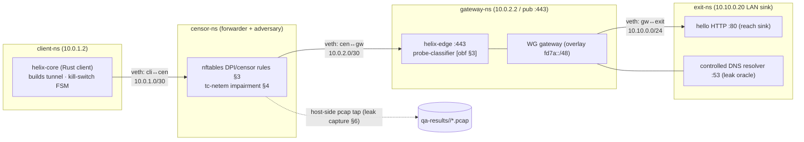

# The Network Test Rig — netns topology, nftables DPI/censor sim, tc-netem, iperf3, leak harness (§11.4.169 / §11.4.69)

**Revision:** 3
**Last modified:** 2026-07-04T12:00:00Z

> **Rev 3 (2026-07-04):** independently re-verified against `SPECIFICATION.md` /
> `e2e.md` / `security.md` during a corpus-wide gap-analysis pass; confirmed this
> document is genuinely the single canonical definition of the four-namespace rig
> topology and the `killswitch_drop.sh` driver (no divergent redefinitions found in
> sibling docs). Revision bumped for the audit pass itself.

> **Reconciled (§11.4.35, 2026-06-26):** this document's four-namespace rig
> (`client` / `censor` / `gateway` / `exit`, DPI in a distinct `censor-ns` middlebox)
> is the **canonical** test-rig topology; [e2e.md §2](e2e.md) was rewritten onto it.
> §6.1 `rig/killswitch_drop.sh` is the **single canonical definition** of the
> kill-switch driver — capture on the censor / WAN-facing egress (`cen2gw`); the SEC
> view ([security.md §9](security.md)) cites it rather than redefining it.

> Volume 8 (Testing & QA) nano-detail specification. This document deepens the
> [10 §5.3] netns E2E rig and [10 §4] topology into the **reproducible network test
> rig** that is the substrate for every E2E / SEC / BENCH / PERF / CHAOS claim in
> HelixVPN: a **four-namespace Linux topology** (client-ns ↔ gateway-ns ↔ censor-ns
> ↔ exit-ns), an **nftables-based DPI/censorship simulator** that reproduces each
> [obf §1] censorship regime, **tc-netem** impairment (loss/latency/reorder/bursty
> loss), **iperf3** throughput bars, and the **leak-test harness** (kill-switch /
> DNS / IPv6, the §11.4.69 negative-evidence triad). It is **SPEC-ONLY**: it fixes
> the topology, the concrete `ip netns` / `nft` / `tc` / `iperf3` commands, the
> per-transport × per-regime exercise matrix (tracing to the [obf §2] survival
> matrix), and the captured-evidence shape — it is not the running rig. Sources
> cited inline: the Volume-8 overview [10] (§5.3 rig sketch, §3 evidence model,
> §5.7 SEC); the obfuscation/DPI spec [obf] (`v02-data-plane/obfuscation-and-dpi.md`
> — the regime taxonomy + survival matrix); the methodology research
> **[research-daita_test]** (`v09-research/research-daita_test.md` §5 — netns,
> nftables kill-switch/leak, tc-netem, iperf3, RES-cited). Unproven facts are flagged
> `UNVERIFIED:` per §11.4.6.

---

## Table of contents

- [0. Why a four-namespace rig (and the §11.4.156 local-only constraint)](#0-why-a-four-namespace-rig-and-the-1114156-local-only-constraint)
- [1. The topology](#1-the-topology)
- [2. Namespace + veth bring-up (concrete commands)](#2-namespace--veth-bring-up-concrete-commands)
- [3. The censor-ns: nftables DPI/censorship simulator (per regime)](#3-the-censor-ns-nftables-dpicensorship-simulator-per-regime)
- [4. tc-netem impairment profiles](#4-tc-netem-impairment-profiles)
- [5. iperf3 throughput bars + the goodput evidence](#5-iperf3-throughput-bars--the-goodput-evidence)
- [6. The leak-test harness (kill-switch / DNS / IPv6)](#6-the-leak-test-harness-kill-switch--dns--ipv6)
- [7. Per-transport × per-regime exercise matrix (traces to [obf §2])](#7-per-transport--per-regime-exercise-matrix-traces-to-obf-2)
- [8. Self-validated analyzers + determinism + cleanup](#8-self-validated-analyzers--determinism--cleanup)
- [9. On-demand boot, rootlessness, and the one sanctioned sudo](#9-on-demand-boot-rootlessness-and-the-one-sanctioned-sudo)
- [10. Edge cases & honest gaps](#10-edge-cases--honest-gaps)
- [Sources verified](#sources-verified)

---

## 0. Why a four-namespace rig (and the §11.4.156 local-only constraint)

Every HelixVPN security property is a **path property** — default-deny, kill-switch,
DPI-evasion, transport escalation all assert what does or does not cross a network
path under an adversary. Proving them needs a real, reproducible path with a real
adversary in the middle, on **one host, with no remote CI** (§11.4.156). Linux
network namespaces give exactly that: isolated network stacks joined by `veth`
links, fully reproducible, no real WAN, no shared runner [research-daita_test §5.1].

The [10 §5.3] overview used a **three**-process rig (client / gateway / connector).
This document refines it into a **four-namespace** rig by splitting the adversary
out of the path as its own `censor-ns`, so the DPI/censorship simulator is a
**distinct middlebox** the packet must traverse — not an `nft` rule bolted onto an
endpoint. This matters because the [obf] survival claims are about a *middlebox*
that inspects and drops/mangles in transit; modelling it as a separate namespace is
what makes "plain WG is dropped but MASQUE survives" a genuine forwarding-path test
rather than an endpoint-local filter ([obf §1], §3 here).

The four namespaces map to the real roles ([10 §5.3], [obf §1]):

- **client-ns** — runs `helix-core` (the Rust client), builds the tunnel.
- **gateway-ns** — runs `helix-edge` (the `:443` listener + probe-classifier
  [obf §3]) and the WG gateway.
- **censor-ns** — the adversarial middlebox: forwards client↔gateway, runs the
  nftables DPI/censorship rules (§3) and tc-netem impairment (§4).
- **exit-ns** — the "authorized LAN host" / synthetic internet behind the gateway:
  the hello HTTP service (the reachability sink) + a controlled DNS resolver (the
  leak-test oracle, §6).

---

## 1. The topology



Addressing plan (fixed so captures + nft rules are stable across runs):

| Link | Subnet | client side | other side |
|---|---|---|---|
| client ↔ censor | `10.0.1.0/30` | `10.0.1.2` (client-ns) | `10.0.1.1` (censor-ns) |
| censor ↔ gateway | `10.0.2.0/30` | `10.0.2.1` (censor-ns) | `10.0.2.2` (gateway-ns, public `:443`) |
| gateway ↔ exit | `10.10.0.0/24` | `10.10.0.1` (gateway-ns) | `10.10.0.20` (exit-ns hello/DNS sink) |
| overlay (tunnel inner) | `fd7a:115c:a1e0::/48` ULA | client overlay addr | exit overlay addr |

The censor-ns is the **only** forwarding path client→gateway; `client-ns` has its
default route via `10.0.1.1` (censor-ns), which forwards to `10.0.2.2`. There is no
side path, so a packet the censor drops is genuinely gone — the negative-evidence
captures (§6) tap on the censor-ns egress interface, observing exactly what would
reach the real WAN.

---

## 2. Namespace + veth bring-up (concrete commands)

`rig/netns_up.sh` (idempotent, `set -euo pipefail`, sources the [10 §9] anti-bluff
lib; one sanctioned `sudo` per §9). Snake_case per §11.4.29.

```bash
#!/usr/bin/env bash
# rig/netns_up.sh — bring up the 4-ns rig [research-daita_test §5.1, 10 §5.3]
set -euo pipefail

for ns in client censor gateway exit; do ip netns add "$ns" 2>/dev/null || true; done

mkveth() {  # $1 a-ns $2 a-name $3 a-cidr   $4 b-ns $5 b-name $6 b-cidr
  ip link add "$2" netns "$1" type veth peer name "$5" netns "$4"
  ip -n "$1" addr add "$3" dev "$2"; ip -n "$1" link set "$2" up
  ip -n "$4" addr add "$6" dev "$5"; ip -n "$4" link set "$5" up
}
mkveth client cli2cen 10.0.1.2/30  censor  cen2cli 10.0.1.1/30
mkveth censor cen2gw  10.0.2.1/30  gateway gw2cen  10.0.2.2/30
mkveth gateway gw2exit 10.10.0.1/24 exit   exit2gw 10.10.0.20/24

# censor-ns forwards client<->gateway (it is the adversarial middlebox).
ip netns exec censor  sysctl -w net.ipv4.ip_forward=1 >/dev/null
ip netns exec gateway sysctl -w net.ipv4.ip_forward=1 >/dev/null
ip -n client  route add default via 10.0.1.1            # client -> censor
ip -n censor  route add 10.0.2.0/30 dev cen2gw          # censor -> gateway
ip -n gateway route add 10.0.1.0/30 via 10.0.2.1        # return path

# exit-ns sinks: the reach target + the controlled DNS resolver (leak oracle §6).
ip netns exec exit python3 -m http.server 80 --bind 10.10.0.20 \
  >qa-results/rig/hello.log 2>&1 &                       # reachability sink
ip netns exec exit dnsmasq -k -p 53 -a 10.10.0.20 \
  --no-resolv --address=/example.test/93.184.216.34 \
  >qa-results/rig/dns.log 2>&1 &                         # controlled resolver

echo "rig up: client(10.0.1.2) -> censor -> gateway(10.0.2.2:443) -> exit(10.10.0.20)"
```

Teardown (`rig/netns_down.sh`) deletes all four namespaces (which reaps veths +
child processes) and is wired to a `trap '... EXIT'` in every rig consumer so the
host is left quiescent (§11.4.14):

```bash
#!/usr/bin/env bash
# rig/netns_down.sh — §11.4.14 quiescence; idempotent
set -uo pipefail
for ns in client censor gateway exit; do ip netns pids "$ns" 2>/dev/null | xargs -r kill 2>/dev/null || true; done
for ns in client censor gateway exit; do ip netns del "$ns" 2>/dev/null || true; done
```

---

## 3. The censor-ns: nftables DPI/censorship simulator (per regime)

The censor-ns reproduces each [obf §1] `Regime` bit as a concrete nftables ruleset
on its `forward` hook, so a transport's [obf §2] survival claim becomes a falsifiable
forwarding-path test. Each profile is a function the rig loads before the
per-transport exercise (§7). `nft` matches sit on `inet censor` table, `forward`
chain.

### 3.1 `WG_FINGERPRINT` — drop plain WireGuard by signature

The GFW/DPI key on the WG datagram: 1-byte `type ∈ {1..4}` at offset 0 + the
invariant 148 B (init) / 92 B (response) handshake sizes [obf §5.1,
research-hysteria2 §4]. The simulator approximates this with a port+size match
(an exact payload-byte match needs `nft … @ih` raw-payload matching; the
port+handshake-size form is the rig's tractable approximation, `UNVERIFIED:` exact
byte-offset fidelity vs a real GFW classifier — the [obf §7 T-WGFP] test asserts the
behavioural outcome, not classifier-internal parity):

```bash
# rig/regimes/wg_fingerprint.nft  -> WG_FINGERPRINT
table inet censor { chain forward { type filter hook forward priority 0; policy accept;
  udp dport 51820 udp length 148 drop      # WG handshake_init invariant size [obf §5.1]
  udp dport 51820 udp length 92  drop      # WG handshake_response invariant size
  udp dport 51820 drop                     # residual: plain WG to the canonical port
} }
# Expected: plain-udp FAILs handshake; lwo (header+size mangled, [obf §5.2]) survives.
```

### 3.2 `UDP_BLOCK` — hard UDP drop (only TCP-carried survive)

```bash
# rig/regimes/udp_block.nft  -> UDP_BLOCK
table inet censor { chain forward { type filter hook forward priority 0; policy accept;
  meta l4proto udp drop                    # ALL UDP dropped (incl. QUIC/443) [obf §1 UDP_BLOCK]
} }
# Expected: plain-udp/lwo/masque-h3/connect-ip ALL fail; shadowsocks + udp-over-tcp connect.
```

### 3.3 `QUIC_SNI_FILTER` — QUIC permitted, Initial-SNI extracted + blocklisted

The GFW decrypts the QUIC Initial (RFC 9001 header-derivable key), extracts the SNI,
matches a blocklist [obf §1.1, research-hysteria2 §5(a)]. The rig models this with a
helper that inspects the first UDP/443 datagram's QUIC-Initial SNI (a small userspace
`nfqueue` classifier, since nftables alone cannot decrypt a QUIC Initial); a blocked
SNI → drop, an unblocked/fronted SNI → accept:

```bash
# rig/regimes/quic_sni_filter.nft + rig/quic_sni_classifier.py (nfqueue) -> QUIC_SNI_FILTER
table inet censor { chain forward { type filter hook forward priority 0; policy accept;
  udp dport 443 queue num 0                # hand QUIC/443 to the SNI classifier
} }
# rig/quic_sni_classifier.py: derive QUIC-Initial key, extract SNI; verdict per blocklist.
#   - does NOT reassemble Initials split across >1 datagram  -> models the GFW weakness
#     Gecko exploits [obf §5.3, research-hysteria2 §5(a)]; T-GECKO-FRAG asserts this.
# Expected: masque-h3 with PlainBlockable SNI dropped; fronted SNI + hysteria2/Salamander survive.
```

### 3.4 `TLS_SNI_FILTER`, `ACTIVE_PROBING`, `RESIDUAL_BLOCK`

```bash
# rig/regimes/tls_sni_filter.nft -> TLS_SNI_FILTER (TCP/443 ClientHello SNI blocklist via nfqueue)
table inet censor { chain forward { tcp dport 443 queue num 1; } }  # SNI classifier on TCP

# ACTIVE_PROBING -> a scripted prober (rig/active_probe.sh) connects to the gateway :443
#   with forged first bytes; the edge MUST return decoy/silent/benign-RST [obf §3], proved by T-PROBE.

# RESIDUAL_BLOCK -> stateful: after a trigger, block the (src,dst,sport,dport) tuple for a window.
table inet censor { 
  set blocked4 { type ipv4_addr . inet_service . ipv4_addr . inet_service; flags timeout; }
  chain forward { type filter hook forward priority 0; policy accept;
    ct state new udp dport 51820 add @blocked4 { ip saddr . udp sport . ip daddr . udp dport timeout 200s }
    ip saddr . udp sport . ip daddr . udp dport @blocked4 drop   # ~180s GFW window [obf §4.4]
} }
# Expected: mid-session drop -> ladder cools the tuple + rotates port/escalates [obf §4.4]; T-RESIDUAL.
```

The regime profiles compose (the GFW = `WG_FINGERPRINT | QUIC_SNI_FILTER |
ACTIVE_PROBING | RESIDUAL_BLOCK`): the rig loads the union ruleset and asserts the
ladder converges on the surviving transport ([obf §4.3], §7 T-LADDER).

---

## 4. tc-netem impairment profiles

Applied **inside the censor-ns** on the `cen2gw` veth so only the test path is
impaired [research-daita_test §5.2]. Profiles model realistic adversary/network
conditions; combined with §3 nft rules they reproduce throttle + loss regimes.

```bash
# rig/impair.sh — tc-netem profiles on the censor egress (IFACE=cen2gw, in censor-ns)
ns="ip netns exec censor"
case "$1" in
  clean)     $ns tc qdisc del dev cen2gw root 2>/dev/null || true ;;
  loss5)     $ns tc qdisc add dev cen2gw root netem loss 5% delay 40ms 10ms ;;        # uniform loss + jitter
  burst)     $ns tc qdisc add dev cen2gw root netem loss gemodel 2% 10% 70% 0.1% ;;   # Gilbert-Elliott bursty [research-daita_test §5.2]
  reorder)   $ns tc qdisc add dev cen2gw root netem delay 20ms reorder 25% 50% ;;     # reordering
  throttle)  $ns tc qdisc add dev cen2gw root tbf rate 8mbit burst 32kb latency 400ms ;; # bandwidth throttle (THROTTLE regime)
  highrtt)   $ns tc qdisc add dev cen2gw root netem delay 150ms 30ms distribution normal ;;
esac
```

The `burst` (Gilbert-Elliott) profile is the realistic-wireless loss model
[research-daita_test §5.2] used for the resilience PERF tests (T-LOSS [obf §7]); the
`throttle` profile reproduces the `THROTTLE` regime where Hysteria2/Brutal sustains
goodput and MASQUE collapses (T-THROTTLE [obf §7]).

---

## 5. iperf3 throughput bars + the goodput evidence

iperf3 server in `exit-ns`, client in `client-ns` driving traffic **through the
tunnel** (over the overlay), measured against the bare-link baseline
[research-daita_test §5.3]. The G1 gate is ≥80% bare-link plain-UDP; G2 is ≥50% of
plain over MASQUE [10 §7.1].

```bash
# rig/bench.sh — N=3 deterministic goodput bars (§11.4.50) [10 §5.13]
ip netns exec exit iperf3 -s -1 -D                              # one-shot server, exit-ns
bare=$(ip netns exec client iperf3 -J -c 10.10.0.20 -t 10 | jq '.end.sum_received.bits_per_second')
tun=$( ip netns exec client iperf3 -J -c <overlay-exit-addr> -t 10 | jq '.end.sum_received.bits_per_second')
pct=$(awk -v t="$tun" -v b="$bare" 'BEGIN{printf "%.1f", 100*t/b}')
printf '%s,%s,%s,%s,%s\n' "$TRANSPORT" "$REGIME" "$tun" "$bare" "$pct" \
  >> qa-results/bench/goodput.csv                              # the evidence (min/max/mean/p95 per §11.4.24)
ab_pass_with_evidence "goodput $TRANSPORT/$REGIME = ${pct}% bare-link" "qa-results/bench/goodput.csv"
```

The §11.4.107 liveness battery applies: goodput is sampled over a ≥10 s window (not a
one-shot ping), and an **independent** WG counter (`wg show <if> transfer` rx/tx
advancing) must also move — a moving `iperf3` with a flat WG counter is a
decoy/loopback path and FAILs (B3, [10 §3.2]). The metamorphic relation (2× clients
⇒ ~2× aggregate goodput; same exit reached over WG-UDP vs MASQUE ⇒ same body hash)
is the no-golden-source oracle ([10 §3.2]).

---

## 6. The leak-test harness (kill-switch / DNS / IPv6)

The §11.4.69 negative-evidence triad — three properties whose proof is **the absence
of a packet** captured on the censor-ns egress (the path to the synthetic WAN)
[research-daita_test §5.4/§5.5]. Each uses a host-side pcap on `cen2gw` (the only
path out) so the capture observes exactly what would reach a real ISP.

### 6.1 Kill-switch (S4) — seal on tunnel drop

> **Canonical `rig/killswitch_drop.sh`.** This is the single source of truth for the
> kill-switch driver; the SEC view ([security.md §9](security.md)) cites this
> definition rather than redefining it. The capture taps the **censor / WAN-facing
> egress (`cen2gw`)** because AC7's §11.4.69 negative-evidence (zero plaintext / zero
> `:53` leak) is only valid on the WAN path, not on the client-local interface.

```bash
# rig/killswitch_drop.sh — S4, the anti-bluff kill-switch test (defeats B2) [10 §5.7]
set -euo pipefail
pcap="qa-results/sec/$(date +%s)_killswitch.pcap"
ip netns exec censor tcpdump -i cen2gw -w "$pcap" & TPID=$!     # tap the path to the WAN
ip netns exec client curl -s --max-time 30 http://<overlay-exit>/ >/dev/null &  # traffic in flight
sleep 2
rig/force_tunnel_drop.sh        # core FSM -> Blocked, firewall seals (fwmark reject) [research-daita_test §5.4]
sleep 5
ip netns exec client nslookup example.test 2>/dev/null || true  # try to leak a DNS query
kill "$TPID" 2>/dev/null
# PASS only if, AFTER the drop (t>2s), ZERO non-loopback packets AND ZERO :53 left the host:
LEAK=$(tshark -r "$pcap" -Y 'frame.time_relative>2 && ip && not (ip.addr==127.0.0.1)' | wc -l)
DNS=$( tshark -r "$pcap" -Y 'frame.time_relative>2 && udp.port==53' | wc -l)
[ "$LEAK" -eq 0 ] && [ "$DNS" -eq 0 ] \
  && ab_pass_with_evidence "kill-switch sealed, no DNS leak" "$pcap" \
  || ab_fail "LEAK=$LEAK DNS=$DNS — plaintext/DNS escaped the seal"
```

The kill-switch mechanism is the WireGuard fwmark pattern: tunnel traffic is tagged
with an fwmark, an OUTPUT rule rejects any egress **not** matching it, so a tunnel
drop fails closed [research-daita_test §5.4].

### 6.2 DNS leak (S5) — queries forced through the tunnel resolver

The exit-ns dnsmasq (§2) is the **only** legitimate resolver; the censor-ns has no
resolver. A DNS query observed on `cen2gw` to anything other than the tunnelled
resolver is a leak. Defense-in-depth per [research-daita_test §5.5]: tunnel DNS
config → nftables drop of :53 outside the tunnel → server-side resolver. The test
asserts **zero** `udp.port==53 || tcp.port==53` on the non-tunnel path during a
resolve + during a reconnect.

### 6.3 IPv6 leak (S5b) — no v6 escapes the seal

IPv6 is the common gap [research-daita_test §5.5]: either route v6 through the tunnel
or block v6 egress at nftables. The rig asserts **zero** IPv6 packets on `cen2gw`
when the policy is v6-block, or all v6 inside the overlay when v6-tunnelled:

```bash
# IPv6-leak assertion (the censor-ns blocks/observes v6 egress)
V6=$(tshark -r "$pcap" -Y 'ipv6 && not (ipv6.addr==::1)' | wc -l)
[ "$V6" -eq 0 ] && ab_pass_with_evidence "no IPv6 leak" "$pcap" || ab_fail "IPv6 leaked: $V6 pkts"
```

Each leak test is self-validated (§8): a golden-bad pcap with a seeded :53 / v6
packet MUST score FAIL, else the detector is the bluff (§11.4.107(10), [10 §3.3]).

---

## 7. Per-transport × per-regime exercise matrix (traces to [obf §2])

This is the rig's load-bearing artifact: every [obf §2.1] survival-matrix cell is a
rig run `(transport, regime)` whose outcome is captured. The rig drives each
transport under each nft regime profile (§3) + netem profile (§4) and asserts the
expected connect/fail, tracing each expectation to the [obf] cell-source. `✓` =
expected-connect (capture goodput), `✗` = expected-fail (capture the DPI drop).

| Transport | empty | `WG_FINGERPRINT` | `UDP_BLOCK` | `QUIC_SNI_FILTER` (plain SNI) | `QUIC_SNI_FILTER` (fronted) | `TLS_SNI_FILTER` | `ACTIVE_PROBING` | trace |
|---|---|---|---|---|---|---|---|---|
| `plain-udp` | ✓ | ✗ | ✗ | ✗ (not QUIC; UDP path) | ✗ | n/a | ✗ | [obf §2.1] |
| `lwo` | ✓ | ✓ (header+size mangle) | ✗ | n/a | n/a | n/a | partial | [obf §2.1, §5.2] |
| `masque-h3` | ✓ | ✓ (no WG sig on wire) | ✗ | ✗ (SNI blockable) | ✓ (fronted) | n/a | ✓ (decoy edge) | [obf §2.1, §3] |
| `shadowsocks` | ✓ | ✓ | ✓ (TCP) | n/a | n/a | ✓ (`tls_sni` wrap) | ✓ (AEAD front) | [obf §2.1, §5.5] |
| `udp-over-tcp` | ✓ | ✓ | ✓ (TCP) | n/a | n/a | ✓ (`tls_sni` wrap) | partial | [obf §2.1, §5.5] |
| `hysteria2`+Salamander¹ | ✓ | ✓ | ✗ (needs UDP) | ✓ (SNI scrambled) | ✓ | n/a | ✓ (password front) | [obf §2.1, §5.3] |

¹ Phase-2 / feature-gated ([obf §6.3]); the MVP rig exercises `plain-udp`,
`masque-h3`, `shadowsocks`, `udp-over-tcp`, `lwo` (the MVP transport set [10 §2]).

**The UDP-block carve-out (load-bearing, [obf §2.2]).** Under `UDP_BLOCK` every
UDP-carried transport (`plain-udp`, `lwo`, `masque-h3`, `connect-ip`, `hysteria2`)
**must** fail — the rig asserts this explicitly so a mask bug cannot claim the
impossible (§11.4.6). Only the TCP-carried `shadowsocks` / `udp-over-tcp` connect.

**The ladder run (T-LADDER, [obf §4.3]).** The rig loads the composed GFW ruleset
(`WG_FINGERPRINT | QUIC_SNI_FILTER | ACTIVE_PROBING | RESIDUAL_BLOCK`) and asserts
the detector-driven ladder dials `plain-udp` (drops) → `lwo` (drops) → `masque-h3`
fronted (**connects**), commits the `QUIC_SNI_FILTER` regime estimate, and pins
`masque-h3` in per-network memory — the captured `TunnelStatus` trace is the evidence,
run `-count=3` deterministic (§11.4.50, [obf §7 T-LADDER]).

```bash
# rig/exercise.sh — drive one (transport, regime) cell and capture
load_regime "$REGIME"                       # rig/regimes/<regime>.nft + nfqueue classifier
load_impair "$NETEM"                         # §4
pcap="qa-results/e2e/${TRANSPORT}_${REGIME}.pcap"
ip netns exec censor tcpdump -i cen2gw -w "$pcap" & TPID=$!
if rig/dial.sh "$TRANSPORT"; then status=connected; else status=failed; fi
kill "$TPID" 2>/dev/null
assert_outcome "$TRANSPORT" "$REGIME" "$status" "$pcap"   # checks against the §7 matrix; ab_pass_with_evidence
```

---

## 8. Self-validated analyzers + determinism + cleanup

Every rig analyzer (the pcap classifier, the leak detector, the QUIC-SNI
classifier, the goodput parser) ships with a **golden-good + golden-bad** fixture
pair wired into the meta-test sweep (§11.4.107(10), [10 §3.3]) — an analyzer that
passes its golden-bad fixture is itself the bluff and FAILs
`CM-ANALYZER-SELF-VALIDATED`:

| Analyzer | golden-good (PASS) | golden-bad (MUST FAIL) | mutation |
|---|---|---|---|
| leak detector | `killswitch_clean.pcap` | `killswitch_leaked_dns.pcap` (seeded :53) | strip the `udp.port==53` clause → golden-bad passes → meta-test FAILs |
| WG-fingerprint sim | `wg_blocked.pcap` (plain WG dropped) | `wg_passed_through.pcap` | weaken the nft size match → WG passes → T-WGFP FAILs |
| QUIC-SNI classifier | `sni_blocked.pcap` | `sni_missed.pcap` (blocklisted SNI passed) | break the SNI extractor → blocked SNI passes → T-QUIC-SNI FAILs |
| goodput parser | `iperf_live.json` (advancing) | `iperf_frozen.json` (flat counter) | accept the flat counter → B3 → FAILs |

**Determinism (§11.4.50).** Every rig PASS runs N=3 (normal) / N=10
(cycle-validation) against the same artifact MD5 + same rig, identical
evidence-hashes; a divergent run is auto-FAIL via `ab_run_n_times` ([10 §5.4]). The
fixed addressing plan (§1) + fixed regime rulesets (§3) make the rig reproducible.

**Cleanup (§11.4.14).** Every rig consumer wires `trap 'rig/netns_down.sh' EXIT` so
the four namespaces + their child processes (http.server, dnsmasq, iperf3, tcpdump)
are reaped on every exit path; the orchestrator post-test sanity-checks that no
`client`/`censor`/`gateway`/`exit` namespace survives and FAILs the just-completed
test if one does (§11.4.14 orphan-state guard).

---

## 9. On-demand boot, rootlessness, and the one sanctioned sudo

Per [10 §9] the rig boots **on demand** — `make e2e` runs `rig/netns_up.sh`, the
exercise, then `rig/netns_down.sh`; the developer never hand-creates namespaces. The
container-backed infra the INT layer needs (Postgres + Redis for the control plane
behind the gateway) boots rootless via the `containers` submodule
(`containers/pkg/boot`, §11.4.76/.161) — no rootful Docker, no container-management
`sudo`.

The **only** `sudo` in the whole harness is `rig/netns_up.sh` /
`rig/netns_down.sh`: network-namespace + veth creation needs `CAP_NET_ADMIN`, a
documented, scoped exception ([10 §9]) — never a container-management escalation,
never host-power, never disabling session managers (§12). `UNVERIFIED:` whether
rootless netns via a user namespace (`ip netns` inside a `unshare -Un`) fully
substitutes for the `CAP_NET_ADMIN` path on every target host — the spec records the
privileged path as canonical and the rootless-netns path as a Phase-1 investigation
(§11.4.81 cross-platform-parity adjacency for macOS, where netns does not exist and
the rig SKIPs with `topology_unsupported` per §11.4.3).

---

## 10. Edge cases & honest gaps

| # | Edge case | Required behavior | Cite |
|---|---|---|---|
| R1 | nft size-match approximates, not byte-exact, the GFW WG classifier | assert the behavioural outcome (plain-udp drops, lwo survives), flag the classifier-internal parity `UNVERIFIED:` | §3.1, §11.4.6 |
| R2 | QUIC-Initial SNI needs decryption nftables can't do | offload to an `nfqueue` userspace classifier; model the GFW no-reassembly weakness explicitly (Gecko relies on it) | §3.3, [obf §5.3] |
| R3 | A regime profile leaves a stale nft table between runs | `load_regime` flushes `inet censor` first; teardown deletes the namespace (drops the table) | §3, §8 |
| R4 | iperf3 measures the bare link, not the tunnel, by mistake | the client targets the **overlay** exit addr; the independent WG counter must also advance (B3 guard) | §5 |
| R5 | A leak test "passes" because no traffic was generated at all | the test asserts traffic **was** in flight before the drop (a non-empty pre-drop capture window) — absence-of-traffic ≠ no-leak | §6, §11.4.68 |
| R6 | macOS / non-Linux host has no netns | honest §11.4.3 `SKIP: topology_unsupported` + tracked migration item; never a fake PASS | §9, §11.4.81 |
| R7 | The host lacks `CAP_NET_ADMIN` | `SKIP: topology_unsupported`; the rig cannot run unprivileged on that host (investigate rootless-netns) | §9 |

**Honest boundary (§11.4.6).** The rig proves the **path-level** security and
survival properties on a Linux netns substrate that *models* each censorship regime;
it does **not** prove behaviour against a *real* nation-state DPI deployment (the
nft/`nfqueue` simulator is a faithful behavioural model, not the GFW itself —
classifier-internal parity is `UNVERIFIED:` and the [obf §7] tests assert the
behavioural outcome, not byte-for-byte adversary parity). The on-wire
DPI-resistance claims (a `masque-h3` flow classifies as HTTP/3 with no WG signature)
are additionally proven by the `tshark`-on-capture wire-fingerprint check + a
window-scoped MP4 vision verdict (T-G2-WIRE [obf §7], §11.4.159). Real-world
DPI-evasion confidence ultimately rests on field evidence the rig cannot supply —
the rig empties the *reproducible-regime* defect class, not the *all-adversaries*
class.

---

## Sources verified

- [10] `docs/research/mvp/final/10-testing-acceptance-and-qa.md` §3 (evidence model
  + liveness battery), §4 (pyramid/topology), §5.3 (netns E2E rig), §5.7 (SEC
  invariants + killswitch_drop.sh), §5.13 (bench.sh), §9 (local gate harness +
  sanctioned sudo) — read 2026-06-26.
- [obf] `docs/research/mvp/final/v02-data-plane/obfuscation-and-dpi.md` §1 (regime
  taxonomy bits), §2 (regime → transport survival matrix + UDP-block carve-out), §3
  (probe-classifier / decoy edge), §4 (regime-aware ladder + residual-block), §5
  (wire byte-layouts), §7 (T-id test points) — read 2026-06-26.
- [research-daita_test] `docs/research/mvp/final/v09-research/research-daita_test.md`
  §5.1 (netns + veth topology), §5.2 (tc-netem incl. Gilbert-Elliott bursty loss),
  §5.3 (iperf3), §5.4 (nftables kill-switch fwmark + DNS-leak port-drop + DPI sim),
  §5.5 (DNS/kill-switch/IPv6 leak testing + defense-in-depth order) — read 2026-06-26
  (all sources access-dated 2026-06-25 in the dossier).
- Constitution: §11.4.69 (sink-side negative-evidence taxonomy), §11.4.68 (positive
  sink-side / no absence-of-error), §11.4.107 (liveness battery + self-validated
  analyzers), §11.4.50 (determinism), §11.4.14 (cleanup/quiescence), §11.4.156 (no
  remote CI — local rig), §11.4.76/.161 (containers/rootless), §11.4.81
  (cross-platform parity — macOS netns SKIP), §11.4.169 (test-type mandate) —
  `CLAUDE.md`, read 2026-06-26.
