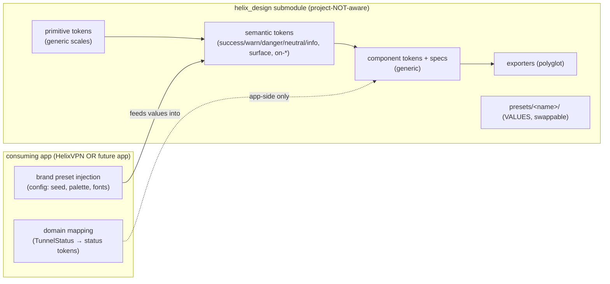
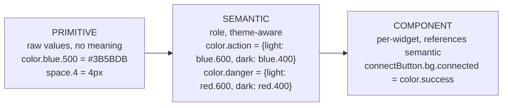
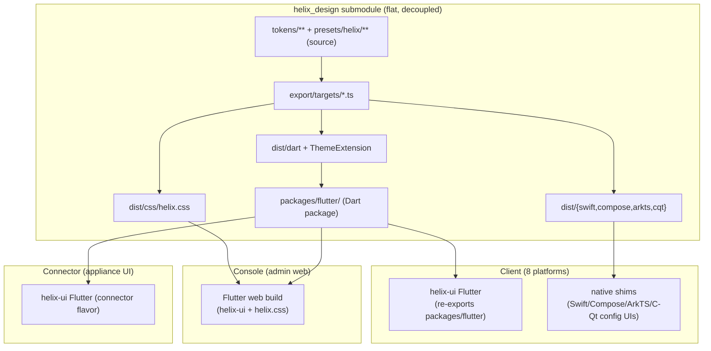
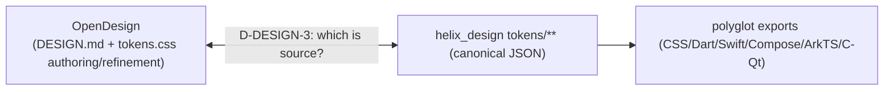
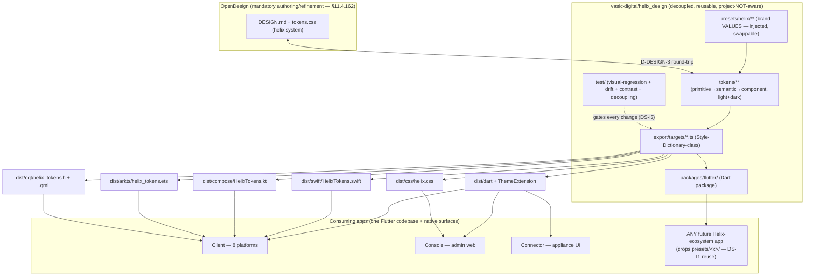

# `helix_design` — the decoupled, reusable HelixVPN design-system submodule

**Revision:** 1
**Last modified:** 2026-06-25T12:00:00Z

> Master technical specification — Volume 10 (Design System), nano-detail anchor
> document. This doc specifies **`vasic-digital/helix_design`** as a *fully decoupled,
> project-not-aware, reusable* design-system submodule: its purpose and scope, why it is
> a separate submodule (§11.4.28 equal-codebase + decoupling, §11.4.74 catalogue-first
> reuse), its repository layout, the decoupling invariants (NO HelixVPN-specific context
> leaks into the submodule — brand values are *injected* as a token preset per
> §11.4.28(B)), its semver/versioning policy, the consumption model (how Client / Console
> / Connector — and **any future app** — incorporate it), and its relationship to the
> mandatory OpenDesign design-and-refinement system (§11.4.162, detailed in the sibling
> [`opendesign-foundation.md`]). SPEC-ONLY: it describes **what to build**, not the
> shipping artifact. No bluff: every external fact about OpenDesign is verified in the
> sibling doc and cited; anything unproven is tagged `UNVERIFIED` (§11.4.6).

---

## Table of contents

- [0. Position, ownership, and invariants](#0-position-ownership-and-invariants)
- [1. Purpose & scope](#1-purpose--scope)
- [2. Why a separate submodule (§11.4.28 / §11.4.74)](#2-why-a-separate-submodule-11428--11474)
- [3. The decoupling invariants (no project context leaks)](#3-the-decoupling-invariants-no-project-context-leaks)
- [4. Repository layout](#4-repository-layout)
- [5. Token tiers, theming, and the brand-preset injection model](#5-token-tiers-theming-and-the-brand-preset-injection-model)
- [6. The export forms (one source → every consumable form)](#6-the-export-forms-one-source--every-consumable-form)
- [7. `upstreams/`, `install_upstreams`, and `helix-deps.yaml`](#7-upstreams-install_upstreams-and-helix-depsyaml)
- [8. Semver & versioning policy](#8-semver--versioning-policy)
- [9. The consumption model (how ANY app incorporates it)](#9-the-consumption-model-how-any-app-incorporates-it)
- [10. Relationship to OpenDesign (§11.4.162)](#10-relationship-to-opendesign-11462)
- [11. Architecture diagram (submodule → exporters → consuming apps)](#11-architecture-diagram-submodule--exporters--consuming-apps)
- [12. Quality, testing, and gates owned here](#12-quality-testing-and-gates-owned-here)
- [13. Open decisions surfaced by this document](#13-open-decisions-surfaced-by-this-document)
- [Sources verified](#sources-verified)

---

## 0. Position, ownership, and invariants

`helix_design` is the **single source of design truth** for every HelixVPN user-facing
surface. The Flutter `helix-ui` workspace already names a `helix_design` *package*
[04_CLIENT §1.1/§2.1] — but per the operator mandate (2026-06-25, §11.4.162) and
[MASTER_INDEX Volume 10], the design system is promoted to a **standalone, decoupled,
reusable submodule** at `vasic-digital/helix_design` (snake_case flat per §11.4.29) that
the Flutter `helix_design` *package* re-exports for Dart consumers, and that **non-Flutter**
surfaces (native shims, future apps) consume directly via the polyglot token bundle.

### 0.1 What this document owns vs. consumes

| # | Contract | Owned here | Consumed from / by |
|---|---|---|---|
| O-A1 | The **submodule's existence, identity, and flat layout** at `vasic-digital/helix_design` | §1, §4 | — |
| O-A2 | The **decoupling invariants** — no HelixVPN context inside the submodule | §3 | enforced against the whole submodule tree |
| O-A3 | The **token-tier model** (primitive → semantic → component) + brand-preset injection | §5 | deepened in [`design-tokens.md`], [`color-system.md`] |
| O-A4 | The **export-form set** (JSON source → CSS / Dart / Swift / Compose / ArkTS / C-Qt) | §6 | pipeline deepened in [`token-export-pipeline.md`] |
| O-A5 | The **consumption recipe** (git submodule add, `install_upstreams`, pull tokens) | §7, §9 | every consuming app + future app |
| O-A6 | The **relationship to OpenDesign** | §10 | detailed in [`opendesign-foundation.md`] |
| C-B1 | The **OpenDesign tool facts** (what it is, how it is consumed) | — | [`opendesign-foundation.md`] (web-verified) |
| C-B2 | The **connection-state palette ↔ `TunnelStatus`** mapping | — | [04_CLIENT §2.1], [02_ORCH §4.1] (5-variant `core::TunnelStatus` wire enum → 7-variant `ffi::TunnelStatus` Dart-facing) |
| C-B3 | The **`helix-ui` package graph** that re-exports the Dart bundle | — | [04_CLIENT §1.1/§2.1] |

### 0.2 Non-negotiable invariants

| # | Invariant | Source |
|---|---|---|
| DS-I1 | **`helix_design` contains NO project-specific HelixVPN context.** It ships generic tokens / themes / components; HelixVPN brand values arrive as an *injected* token preset (config), never hardcoded. | §11.4.28(B) |
| DS-I2 | **OpenDesign is the only design-and-refinement system.** No ad-hoc CSS, no one-off design tools. Missing patterns extend OpenDesign **upstream** (§11.4.74), never reimplemented in-project. | §11.4.162 |
| DS-I3 | **Every component & color ships a light AND a dark variant.** A token, component, or screen with only one theme is incomplete. | §11.4.162 |
| DS-I4 | **Elements MUST NOT overlap; labels MUST NOT be overlaid.** The layout-integrity rule is a release blocker, asserted by visual-regression ([`visual-regression-and-qa.md`]). | §11.4.162 |
| DS-I5 | **All UI changes carry visual-regression coverage.** Golden screenshots + token-drift assertions gate every design change. | §11.4.162, §11.4.4(b) |
| DS-I6 | **One canonical token source; every consumable form is a derived export.** Hand-editing a derived form (e.g. the Dart `ThemeData`) instead of the source is forbidden — it is a build-derivative per §11.4.30/§11.4.77, regenerated by the pipeline. | §6, §11.4.12 |
| DS-I7 | **Honest boundary** — `helix_design` governs *design tokens, themes, components, and their visual correctness*. It does **NOT** assert functional correctness (§11.4.27), accessibility *behaviour* beyond contrast/labels it can statically check, or UI-driven test methodology (§11.4.48/.49). | §11.4.162 honest boundary |

---

## 1. Purpose & scope

### 1.1 Purpose

`helix_design` exists so that **every** HelixVPN user-facing application — the **Client**
(end-user VPN app on all 8 platforms: iOS, macOS, Android, Windows, Linux, Web,
HarmonyOS, Aurora), the **Console** (admin web app), and the **Connector** (appliance
config UI) — renders from **one** design source: the same palette (light + dark), the
same type ramp, the same spacing/radius/elevation/motion scale, and the same component
anatomy, **without** any of those three apps owning a private copy of the design tokens
[SPEC roles]. A change to a brand color, a contrast fix, or a new component variant is
made **once** in `helix_design` and propagates — through the export pipeline (§6) — to
all three apps and all 8 platforms.

### 1.2 Scope (what the submodule contains)

In scope:

1. **The canonical token source** — primitive → semantic → component tiers, with the
   light + dark theme model (§5; schema deepened in [`design-tokens.md`]).
2. **The HelixVPN brand preset** — the *one* HelixVPN-flavoured config that injects the
   brand seed color, the connection-state palette, the type face choices, etc., into the
   generic token tiers (§5.4). This is the *only* place HelixVPN-specific values live, and
   it is structured as **injectable config**, not as inline submodule values (DS-I1).
3. **The exporters** — the generators that emit the token source into every consumable
   form (JSON / CSS / Dart / Swift / Compose / ArkTS / C-Qt; §6).
4. **The component library specs + reference implementations** — anatomy, states,
   variants, light+dark, a11y (deepened in [`component-library.md`]). Reference
   implementations are per-platform where the component is platform-native; otherwise the
   spec + tokens are the deliverable and each app composes the widget from tokens.
5. **The asset corpus** — icon set, illustration sources, fonts (or font references), in
   the asset forms each platform needs (deepened in [`assets-and-deliverables.md`]).
6. **The OpenDesign-native design-system folder** — the `DESIGN.md` + `tokens.css` form
   OpenDesign consumes/refines (§10; deepened in [`opendesign-foundation.md`]).
7. **The visual-regression + token-drift test suite** that gates every change (§12).
8. **Docs** — every Volume 10 nano-detail document ships with the submodule (so the
   design system is self-documenting and reusable by any future project).

Out of scope (lives in the consuming app, not the submodule):

- The Riverpod `projectUiState` state machine and `UiConnectionState` projection — that is
  *application* logic, owned by `helix_domain` [04_CLIENT §7]. `helix_design` provides the
  `colorForUiState`-style *token map*, not the state machine that drives it.
- Per-app navigation / IA / routing — owned by each app.
- FFI, control-plane wire, tunnel lifecycle — Volumes 2/3/4.

---

## 2. Why a separate submodule (§11.4.28 / §11.4.74)

### 2.1 Reuse (§11.4.74 catalogue-first)

The design system is **not** HelixVPN-specific in its machinery. A palette-tiering model,
a polyglot token exporter, a light/dark theming engine, and an icon pipeline are exactly
the kind of capability §11.4.74 says must be **reusable across ≥3 unrelated projects** and
therefore must live in the `vasic-digital` catalogue, not buried in one product. Any
future Helix-ecosystem app (a different VPN client, an admin tool, a marketing site, a
device dashboard) incorporates `helix_design`, swaps the brand preset (§5.4), and inherits
the entire token/theme/component/export machinery for free. Burying the design system
inside `helix-ui` would force the next project to either re-implement it (a §11.4.74
duplicate-implementation violation) or depend on a VPN app it does not need.

### 2.2 Equal-codebase + decoupling (§11.4.28)

Per §11.4.28(A), `helix_design` — once it is an owned submodule — is an **equal part** of
the codebase: same anti-bluff testing, same docs, same multi-upstream push discipline as
the main repo. Per §11.4.28(B), it MUST stay **project-not-aware** and **fully testable in
isolation** — which forces the clean seam this volume specifies: generic tiers in the
submodule, HelixVPN values injected as config (DS-I1, §5.4). The decoupling is not a
nicety; it is the mechanism that makes the reuse of §2.1 *real* rather than aspirational.

### 2.3 Flat-layout requirement (§11.4.28(C) / §11.4.29)

Per §11.4.28(C) nested own-org submodule chains are FORBIDDEN; the dependency is reached
from the **parent project root** at a flat path. `helix_design` is therefore added at
`helix_vpn/helix_design/` (or `helix_vpn/submodules/helix_design/`), snake_case
(§11.4.29), and the Flutter `helix-ui` workspace's `helix_design` *package* depends on it
via a path/`replace` directive — it does **not** nest `helix_design` inside `helix-ui` as a
sub-submodule.

> **D-DESIGN-1 (open).** Two viable layouts for "the Flutter package vs. the polyglot
> bundle": **(a)** a *single* `helix_design` submodule that contains BOTH the Flutter
> package (`packages/flutter/`) AND the polyglot token/asset bundle (`tokens/`, `export/`,
> `assets/`), the Flutter `helix-ui` re-exporting `packages/flutter/`; **or (b)** *two*
> submodules — `helix_design` (polyglot source + exporters) and `helix_design_flutter`
> (the Dart package that consumes the generated Dart export). §11.4.28(C) forbids nesting
> but permits sibling flat submodules. This document specifies layout **(a)** as the
> default (one submodule, one design truth, fewer moving parts) and flags (b) as the
> alternative if the Dart package's release cadence must diverge from the token source's.
> Resolved at the Volume-10 design review. `UNVERIFIED` until ratified.

---

## 3. The decoupling invariants (no project context leaks)

DS-I1 is the load-bearing rule. Concretely, **inside the `helix_design` submodule tree**
the following are FORBIDDEN (each is a §11.4.28(B) decoupling violation, caught by the
pre-commit decoupling grep `CM-OWNED-SUBMODULE-DECOUPLING`):

| Forbidden inside the submodule | Why | Where it goes instead |
|---|---|---|
| The literal strings `HelixVPN`, `helix_vpn`, `helixvpn` in **token names / component logic / exporter code** | project context leak | the brand-preset *config file* (§5.4) may carry the product name as a *value*; the machinery may not |
| A hardcoded brand seed color in a *primitive/semantic* token | couples the generic tiers to one product | the brand seed is a **preset value** injected into the semantic tier (§5.4) |
| A `TunnelStatus`-shaped enum or any VPN-domain type | VPN domain leak | the connection-state *palette* is generic "status" tokens (success/warn/danger/neutral/info); the *mapping* to `TunnelStatus` lives in `helix_domain` [04_CLIENT §7.2] |
| Import of any `helix-core` / `helix_api` / control-plane package | inverts the dependency direction | the submodule depends on NOTHING Helix-product-side (it is a leaf) |
| A hardcoded HelixVPN server list, region name, or asset path | project context | app-side config |

What the submodule **MAY** contain: generic design primitives, a *named* default brand
preset folder (e.g. `presets/helix/` — a value, swappable), generic component specs,
generic status-token semantics. The test that DS-I1 holds: **a throwaway consuming project
that injects a *different* brand preset and builds all export forms green, runs the
submodule's own tests against that layout, and contains no reference back to HelixVPN**
(the §11.4.31 manifest-paired Challenge pattern).



---

## 4. Repository layout

Layout **(a)** of D-DESIGN-1 (single submodule). Every directory is generic-by-default; the
`presets/helix/` folder holds the only HelixVPN-flavoured *values* (and even those are
structured so a future app drops a sibling `presets/<x>/`).

```
helix_design/                          # vasic-digital/helix_design  (flat submodule)
├── README.md                          # what it is, install, the per-app pull recipe (§9)
├── CLAUDE.md  AGENTS.md  QWEN.md  GEMINI.md   # inherit constitution (§11.4.157)
├── helix-deps.yaml                    # §11.4.31 dependency manifest (own-org deps, if any)
├── LICENSE  CHANGELOG.md  VERSION     # semver source of truth (§8)
├── upstreams/                         # §11.4.36 push-mirror recipes (one .sh per upstream)
│   ├── github.sh   gitlab.sh   gitflic.sh   gitverse.sh
├── tokens/                            # ── THE CANONICAL SOURCE OF TRUTH ──
│   ├── primitive/                     # raw scales: color ramps, type sizes, space, radius…
│   │   ├── color.json   type.json   space.json   radius.json
│   │   ├── elevation.json   motion.json   zindex.json   breakpoints.json
│   ├── semantic/                      # role tokens that reference primitives (light + dark)
│   │   ├── color.light.json   color.dark.json
│   │   ├── type.json   space.json   elevation.json   motion.json
│   └── component/                     # per-component tokens that reference semantics
│       ├── connect_button.json   status_chip.json   exit_picker.json   …
├── presets/                           # brand presets = VALUES injected into semantic tier
│   └── helix/                         # the ONLY HelixVPN-flavoured values (swappable)
│       ├── brand.json                 # seed, accent, logo refs, font family choices
│       └── connection_state.json      # the 7-variant status→color map (§5.5)
├── export/                            # ── THE EXPORTERS (generators) ──
│   ├── build.ts                       # orchestrator (Style-Dictionary-class; §6)
│   ├── targets/
│   │   ├── css.ts        # → dist/css/helix.css        (custom properties, light+dark)
│   │   ├── dart.ts       # → dist/dart/helix_tokens.dart (+ ThemeData / ThemeExtension)
│   │   ├── swiftui.ts    # → dist/swift/HelixTokens.swift
│   │   ├── compose.ts    # → dist/compose/HelixTokens.kt
│   │   ├── arkts.ts      # → dist/arkts/helix_tokens.ets
│   │   └── cqt.ts        # → dist/cqt/helix_tokens.h  (C header + Qt .qml resource)
│   └── schema/           # JSON-schema for tokens/** (drift + validity gate, §12)
├── dist/                              # GENERATED export forms (gitignored build-derivative
│   │                                  #   per §11.4.30/§11.4.77; regen = `pnpm export`)
│   ├── css/  dart/  swift/  compose/  arkts/  cqt/  json/
├── packages/
│   └── flutter/                       # the Dart package helix-ui re-exports (D-DESIGN-1(a))
│       ├── pubspec.yaml               # name: helix_design
│       └── lib/  (re-exports dist/dart + the reference Flutter widgets)
├── components/                        # generic component SPECS + reference impls
│   ├── specs/  (one .md per component — anatomy/states/variants/a11y/light+dark)
│   └── reference/  (platform reference implementations where applicable)
├── assets/
│   ├── icons/   (source SVG + per-platform exported forms)
│   ├── illustrations/   fonts/   logo/
├── opendesign/                        # ── OpenDesign-native design-system folder (§10) ──
│   └── helix/                         # DESIGN.md + tokens.css + manifest.json (§10.3)
├── docs/                              # every Volume 10 nano-detail doc travels here
│   └── v10-design/  (00-overview…, opendesign-foundation…, design-tokens…, …)
└── test/                             # visual-regression + token-drift + a11y-contrast (§12)
    ├── golden/   drift/   contrast/   decoupling/
```

> **`dist/` is a build-derivative.** Per DS-I6 + §11.4.30, the `dist/**` export forms are
> *gitignored* and regenerated by `pnpm export` (the §11.4.77 regeneration mechanism,
> declared in `.gitignore-meta/dist.yaml`). The **source** (`tokens/**`, `presets/**`,
> `export/**`) is tracked; the *outputs* are not. A consumer that needs a pinned binary
> bundle pulls a tagged *release artifact* (§8), not the git tree's `dist/`.
>
> **D-DESIGN-2 (open).** Whether `dist/` is gitignored-and-regenerated (above) or
> *committed* (so a Dart consumer pulling the submodule gets the generated `.dart` with no
> Node toolchain). Trade-off: §11.4.30 forbids versioned build derivatives, but a
> Dart-only consumer should not need `pnpm`. Resolution candidate: gitignore `dist/`, but
> publish the Flutter package (`packages/flutter/lib/` with a *checked-in* generated
> `helix_tokens.dart`) as the pub-consumable form, treating the Flutter package's
> generated Dart as a *source-of-the-package* (regenerated in CI-equivalent local pre-tag
> sweep, §11.4.156). `UNVERIFIED` until the Volume-10 review ratifies.

---

## 5. Token tiers, theming, and the brand-preset injection model

### 5.1 Three tiers (deepened in [`design-tokens.md`])



- **Primitive** — raw, meaningless values: color ramps (e.g. `blue.50…900`), the type
  size scale, the 4-base spacing scale `{4,8,12,16,24,32,48}`, radii `{sm8,md12,lg20,
  pill999}`, motion `{fast120,base220,slow360}`, elevation `0..3`. Mirrors the values
  already sketched in the Flutter `helix_design` package [04_CLIENT §2.1] but generalised
  (no brand seed inline — DS-I1).
- **Semantic** — role tokens that *reference* primitives and are **theme-keyed**: a
  semantic token holds a `{light, dark}` pair (DS-I3). E.g. `color.surface`,
  `color.on-surface`, `color.action`, `color.success`, `color.warn`, `color.danger`,
  `color.neutral`, `color.info`.
- **Component** — per-widget tokens that reference semantic tokens (`connectButton.bg`,
  `statusChip.fg`). A widget reads only component tokens; it never reaches a primitive.

### 5.2 Light + dark theming (DS-I3)

Theming is a **semantic-tier concern**: every semantic color token carries both a `light`
and a `dark` value. The export pipeline (§6) emits **two** resolved theme tables per
target (a `light` and a `dark` map) — never a single theme. A component spec that omits
the dark value, or an export that emits only one theme, FAILs the §12 drift gate. Example
(semantic source):

```json
// tokens/semantic/color.light.json (excerpt) — references primitives by name
{
  "color": {
    "surface":    { "value": "{color.neutral.50}"  },
    "on-surface": { "value": "{color.neutral.900}" },
    "action":     { "value": "{color.blue.600}"    },
    "success":    { "value": "{color.green.600}"   },
    "warn":       { "value": "{color.amber.600}"   },
    "danger":     { "value": "{color.red.600}"     }
  }
}
// tokens/semantic/color.dark.json — same KEYS, dark-resolved values
{
  "color": {
    "surface":    { "value": "{color.neutral.900}" },
    "on-surface": { "value": "{color.neutral.50}"  },
    "action":     { "value": "{color.blue.400}"    },
    "success":    { "value": "{color.green.400}"   },
    "warn":       { "value": "{color.amber.400}"   },
    "danger":     { "value": "{color.red.400}"     }
  }
}
```

### 5.3 Light + dark is also a CONTRAST contract

Light/dark is not just two palettes; each `(theme, semantic-on-pair)` MUST satisfy WCAG
contrast (deepened in [`color-system.md`]). The §12 contrast test asserts every
`on-X / X` pair (e.g. `on-surface / surface`) clears the AA threshold in **both** themes —
a dark theme that looks fine but fails contrast is a DS-I5 / §11.4.162 failure.

### 5.4 The brand-preset injection model (DS-I1)

The generic semantic tier references **preset tokens** for the values a brand chooses. The
HelixVPN brand preset supplies them; a future app supplies its own. The submodule ships
`presets/helix/` as the **default value set**, but the *mechanism* is injection — a
consuming project can override the preset path at build time:

```json
// presets/helix/brand.json — VALUES (the only HelixVPN-flavoured data; swappable)
{
  "brand": {
    "seed":        "#3B5BDB",          // drives the action ramp + M3 ColorScheme
    "accent":      "#10B981",
    "fontFamily":  { "sans": "Inter", "mono": "JetBrains Mono" },
    "logo":        { "light": "assets/logo/helix-light.svg",
                     "dark":  "assets/logo/helix-dark.svg" },
    "productName": "HelixVPN"          // a VALUE, not machinery (DS-I1 ok)
  }
}
```

> Illustrative seed values — the canonical brand/semantic hexes live in
> [`color-system.md`] (brand `#3D5AF1`); a seed need not equal a ramp step.

```bash
# build with a DIFFERENT brand preset (proves DS-I1 decoupling) — §12 decoupling test
pnpm export --preset presets/acme/   # → dist/** carries Acme's palette, zero HelixVPN refs
```

### 5.5 The connection-state palette (generic status tokens)

The 7-variant connection-state palette the Client renders is expressed as **generic status
tokens** in the preset (`presets/helix/connection_state.json`), mapped to the FFI
`TunnelStatus` **in the app** ([04_CLIENT §7.2]), never inside the submodule (DS-I1):

| UI state | Status token | Light | Dark | Notes |
|---|---|---|---|---|
| Disconnected | `state.neutral` | neutral.600 | neutral.400 | "Not protected" — grey |
| Connecting / Handshaking | `state.warn` | amber.600 | amber.400 | in-motion |
| Connected (direct) | `state.success` | green.600 | green.400 | safe |
| Connected (relay) | `state.success-alt` | green.700 | green.300 | sub-shade for relay path (D-UI-3 in 04_CLIENT) |
| Reconnecting | `state.warn-pulse` | amber.600 | amber.400 | animated pulse (motion token) |
| Down | `state.caution` | orange.600 | orange.400 | recoverable fault |
| Danger | `state.danger` | red.600 | red.400 | leak / kill-switch tripped |

> These are descriptive labels, not token keys — the canonical token keys are
> `color.semantic.state.<variant>.fill` per [`design-tokens.md`] §8.

The submodule provides the *tokens*; the projection is layered: the **Rust FFI
`StatusProjector` produces the 7-variant `ffi::TunnelStatus` from the 5-variant
`core::TunnelStatus` (it adds `Disconnected` and `Danger`)** [`ffi-surface.md` §3.2/§3.3],
and only the `Connected{direct|relay}` sub-shade is app-side rendering in
`helix_domain`'s `projectUiState` [04_CLIENT §7.2].

---

## 6. The export forms (one source → every consumable form)

Per the Volume 10 mandate, the canonical JSON token source is emitted into **every**
consumable form so each platform incorporates tokens **directly** (no platform re-types a
color by hand — DS-I6). Pipeline deepened in [`token-export-pipeline.md`]; here is the
form contract:

| Target | Output | Consumed by | Theme handling |
|---|---|---|---|
| **JSON** (Style-Dictionary-class source) | `dist/json/tokens.json` | the source-of-truth other exporters read; tooling | both themes as keyed maps |
| **CSS** custom properties | `dist/css/helix.css` | Console **Web** (Flutter web + any web surface) | `:root` (light) + `[data-theme=dark]` (dark) |
| **Dart** | `dist/dart/helix_tokens.dart` + `ThemeData`/`ThemeExtension` | `helix-ui` (Client/Console/Connector Flutter) [04_CLIENT §2.1] | `HelixTheme.light()` / `.dark()` `ThemeExtension` |
| **SwiftUI** | `dist/swift/HelixTokens.swift` | iOS/macOS native shim surfaces (NE config UI, widgets) | `Color` assets + `@Environment(\.colorScheme)` |
| **Jetpack Compose** | `dist/compose/HelixTokens.kt` | Android native surfaces (quick-settings tile, notification) | `lightColors()` / `darkColors()` |
| **ArkTS** | `dist/arkts/helix_tokens.ets` | HarmonyOS native surfaces | resource qualifiers `dark/` |
| **C / Qt** | `dist/cqt/helix_tokens.h` + `.qml` | Aurora Qt/C++ surfaces | C `#define` + QML `Theme` singleton |

> **Why polyglot, not Flutter-only.** Flutter `helix-ui` covers the *app* surfaces, but
> several surfaces are platform-native and never see Dart: the iOS/macOS Network-Extension
> config UI and widgets (SwiftUI), the Android quick-settings tile + notification
> (Compose), the HarmonyOS VPN-ability surfaces (ArkTS), and the Aurora Qt backend's UI
> (C/Qt) [04_CLIENT §4.4 native shims]. Each must render the **same** palette as the
> Flutter app — so the token source must emit a native form for each. A Flutter-only token
> package would leave those surfaces to hand-copy colors, the exact drift DS-I6 forbids.

> **Honest boundary on OpenDesign and the polyglot forms.** OpenDesign **does not itself
> emit Dart/Swift/Compose/ArkTS/C-Qt** (web-verified — see [`opendesign-foundation.md`] §
> Sources). OpenDesign's native artifact form is `DESIGN.md` + `tokens.css`
> (CSS custom properties). Therefore the polyglot exporters (`export/targets/*.ts`) are
> **`helix_design`'s own** Style-Dictionary-class pipeline, fed by the canonical JSON
> source, with `tokens.css` as one *input/round-trip* form to/from OpenDesign (§10). If a
> future requirement is "OpenDesign itself must emit a Compose form", that is an
> **extend-OpenDesign-upstream** task per §11.4.74 (§10.4), not an in-`helix_design`
> reimplementation. This split is stated plainly so no reader assumes OpenDesign ships a
> multi-language token compiler it does not (§11.4.6).

---

## 7. `upstreams/`, `install_upstreams`, and `helix-deps.yaml`

### 7.1 `upstreams/` + `install_upstreams` (§11.4.36)

As an owned submodule, `helix_design` ships an `upstreams/` directory with one recipe
`*.sh` per push mirror (GitHub + GitLab + GitFlic + GitVerse per the §11.4.28 owned-org
set). On clone/add, `install_upstreams` is invoked from the submodule root to configure
every mirror as a push remote (§11.4.36 mandate). Skipping it silently breaks §2.1
multi-upstream push.

```bash
# after the consuming project adds helix_design as a submodule:
cd helix_vpn/helix_design && install_upstreams      # configures all push mirrors
git remote -v | grep -c push                          # expect == number of mirrors
```

### 7.2 `helix-deps.yaml` (§11.4.31)

`helix_design` declares its own own-org dependencies (if any) in a machine-readable
manifest so a consuming project can reconstruct the dependency graph from the parent root
(no nested own-org chains — §11.4.28(C)). For a leaf design system this is typically
*empty of own-org deps* (the submodule depends on nothing Helix-product-side, DS-I1) —
but the file MUST exist and declare third-party build deps (Node/pnpm toolchain, the
Style-Dictionary-class library, weasyprint/pandoc for doc export).

```yaml
# helix_design/helix-deps.yaml
schema_version: 1
deps: []                      # leaf: no own-org runtime deps (DS-I1)
build_toolchain:
  - { name: "node",  version: "~24" }      # OpenDesign + exporter toolchain (verified §10)
  - { name: "pnpm",  version: "10.x" }
transitive_handling:
  recursive: true
  conflict_resolution: operator-required
language_specific_subtree: true            # packages/flutter/ is a pub package
```

---

## 8. Semver & versioning policy

`helix_design` is versioned **independently** of the HelixVPN product (it is reusable;
its version tracks *design-system* change, not VPN-feature change), but its release tags
carry the §11.4.151 project prefix when cut as part of a HelixVPN release wave.

| Change class | Bump | Examples |
|---|---|---|
| **MAJOR** | breaking token rename/removal, component API break, export-form schema break | rename `color.action`→`color.primary`; drop a component; change the Dart `ThemeExtension` shape |
| **MINOR** | additive — new token, new component variant, new export target, new preset | add `state.success-alt`; add the C-Qt target; add a new icon |
| **PATCH** | value-only / fix — recolor within contrast, fix a dark value, doc/asset fix | nudge `blue.600`; fix a failing dark-contrast pair |

- The submodule's `VERSION` + `CHANGELOG.md` are the source of truth; the §11.4.65 export
  pipeline keeps `.md/.html/.pdf` in sync, the §11.4.44 revision header on each doc.
- A consuming app pins a **tag** (or a commit), and bumps the pointer deliberately
  (§11.4.26 step 7 pointer-bump discipline); a pointer bump that changes tokens triggers
  the app's visual-regression suite (§12, DS-I5).
- Release tags follow §11.4.151: `<PREFIX>-helix_design-<semver>` when cut in a HelixVPN
  wave, plain `helix_design-<semver>` when cut standalone. **No force-push, ever**
  (§11.4.113) — every publish is a merge-onto-latest-main fast-forward to all mirrors.

---

## 9. The consumption model (how ANY app incorporates it)

### 9.1 The per-app pull recipe (the same five steps for every app)

```bash
# 1. Add the decoupled submodule at the FLAT parent-root path (§11.4.28(C)/.29):
git submodule add git@github.com:vasic-digital/helix_design.git helix_design

# 2. Install upstream push mirrors (§11.4.36):
( cd helix_design && install_upstreams )

# 3. Choose the brand preset (HelixVPN apps use presets/helix/; a future app drops its own):
#    (default is presets/helix/ — no flag needed for HelixVPN)

# 4. Generate the export form(s) the app needs (DS-I6 — never hand-copy tokens):
( cd helix_design && pnpm install && pnpm export )          # → dist/<target>/

# 5. Wire the generated form into the app build:
#    - Flutter app  → depend on helix_design/packages/flutter (path/replace), apply HelixTheme
#    - Web surface  → import dist/css/helix.css
#    - Apple shim   → add dist/swift/HelixTokens.swift to the NE-extension target
#    - Android shim → add dist/compose/HelixTokens.kt
#    - HarmonyOS    → add dist/arkts/helix_tokens.ets
#    - Aurora       → include dist/cqt/helix_tokens.h + the .qml resource
```

### 9.2 How the three HelixVPN apps consume it



All three apps are built from one Flutter codebase via flavors + capability gating
[04_CLIENT §5], so the Flutter package is the *primary* consumer; the native forms cover
the platform-native surfaces the Flutter app cannot reach (§6). The Console Web build adds
`dist/css/helix.css` for any non-Flutter web chrome.

### 9.3 How a FUTURE app incorporates it

Identical five steps, with step 3 dropping a new `presets/<app>/` (its own seed, palette,
fonts) — and it inherits the entire token/theme/component/export machinery with **zero**
HelixVPN coupling (DS-I1, the §2.1 reuse payoff). The §12 decoupling test *is* this
scenario, run in CI-equivalent local sweeps.

---

## 10. Relationship to OpenDesign (§11.4.162)

> Full, web-verified detail is in the sibling [`opendesign-foundation.md`]. This section
> states only the *relationship* `helix_design` ↔ OpenDesign at the submodule level.

### 10.1 OpenDesign is the design-and-refinement system; `helix_design` is the distribution layer

Per §11.4.162, OpenDesign (https://github.com/nexu-io/open-design) is the **mandatory**
system for *designing and refining* HelixVPN's UI — no ad-hoc CSS, no one-off tools. From
the web-verified facts (see sibling doc):

- OpenDesign is a **local-first generative design tool** — a desktop app + CLI (`od`) +
  MCP server — that authors/refines design artifacts and design *systems*, consumed via
  CLI/MCP rather than as an npm package dependency (verified 2026-06-25).
- An OpenDesign **design system** is a folder `design-systems/<slug>/` containing
  `DESIGN.md` (a 9-section markdown spec), `tokens.css` (compiled CSS custom properties),
  `components.html`, `manifest.json`, plus `assets/ fonts/ preview/ source/` (verified).

So `helix_design` **authors a HelixVPN OpenDesign design system** under
`helix_design/opendesign/helix/` (`DESIGN.md` + `tokens.css` + `manifest.json`), uses
OpenDesign to design/refine/preview it, and then **`helix_design`'s own exporters**
(§6) translate the canonical token source into the polyglot forms OpenDesign does not
itself produce. OpenDesign owns *authoring + refinement + the CSS/markdown design-system
form*; `helix_design` owns *the canonical JSON source + the polyglot distribution*.

### 10.2 Direction of truth (open decision)



> **D-DESIGN-3 (open).** Two candidate directions: **(a)** the OpenDesign `tokens.css` is
> the human-authored source and `helix_design` *imports* it into the canonical JSON
> (`tokens.css → tokens/**`), or **(b)** the JSON tiers are the source and `tokens.css` is
> a *generated export target* (one more `export/targets/css.ts` output) that OpenDesign
> then consumes/previews. This document leans **(b)** — JSON-as-source keeps the
> three-tier primitive→semantic→component model and light+dark theming first-class (which
> a flat `tokens.css` does not natively express), with `tokens.css` round-tripped for
> OpenDesign. (a) is simpler if designers live entirely in OpenDesign. Resolved at the
> Volume-10 review with the design team; `UNVERIFIED` until ratified.

### 10.3 The OpenDesign-native folder

```
helix_design/opendesign/helix/
├── manifest.json     # schemaVersion, id, name, category, description, source, files{}
├── DESIGN.md         # 9-section: visual theme, color, type, spacing, layout, components,
│                     #   motion, voice/tone, anti-patterns (verified section model)
├── tokens.css        # compiled CSS custom properties (light + dark) — round-trip with §6
├── components.html
└── assets/ fonts/ preview/ source/
```

### 10.4 Extend-upstream policy (§11.4.74)

If OpenDesign lacks a pattern HelixVPN needs (e.g. a richer multi-theme token model, a new
export form, a VPN-specific component archetype), the fix is a **PR to nexu-io/open-design**
(extend the catalogue tool upstream), recorded with a `Catalogue-Check: extend
nexu-io/open-design@<sha>` tracker line per §11.4.74 — **never** a private fork-and-diverge
inside `helix_design`. The honest boundary (DS-I7): OpenDesign governs design tokens,
themes, and the design-system form — it does **not** replace functional testing (§11.4.27),
the a11y *behaviour* assertions, or the §11.4.48/.49 UI-driven test methodology; those stay
in Volumes 4/8.

---

## 11. Architecture diagram (submodule → exporters → consuming apps)



---

## 12. Quality, testing, and gates owned here

`helix_design` is an equal-codebase submodule (§11.4.28(A)), so it carries the full
anti-bluff testing floor (§11.4.169) for a design system. Deepened in
[`visual-regression-and-qa.md`]; the gates owned at the submodule level:

| Gate | Asserts | Class |
|---|---|---|
| `DS-DRIFT` | `dist/**` regenerated from `tokens/**` is byte-identical to a fresh `pnpm export`; a hand-edited derived form FAILs (DS-I6) | §11.4.12 drift |
| `DS-LIGHT-DARK-COMPLETE` | every semantic color token + every component spec defines BOTH `light` and `dark` (DS-I3) | §11.4.162 |
| `DS-CONTRAST` | every `on-X / X` pair clears WCAG AA in light AND dark (DS-I5) | a11y (static, captured-evidence) |
| `DS-NO-OVERLAP` | golden screenshots show no overlapping elements / no label overlay (DS-I4) | §11.4.162 + §11.4.168 visual |
| `DS-VISUAL-REGRESSION` | per-component golden screenshots (light+dark) match the baseline within perceptual tolerance | §11.4.162 + §11.4.107(10) self-validated analyzer |
| `DS-DECOUPLING` | a build with a *non-HelixVPN* preset emits all forms green + zero `HelixVPN` refs in machinery (DS-I1) | §11.4.28(B) `CM-OWNED-SUBMODULE-DECOUPLING` |
| `DS-EXPORT-FORM-VALID` | each emitted form parses in its target toolchain (Dart analyze, swiftc parse, kotlinc, tsc/ArkTS, C compile) | §11.4.110 build-readiness |
| `DS-SCHEMA` | `tokens/**` validate against `export/schema/` JSON-schema | §11.4.110 |

Honest boundary (DS-I7): these gates prove the *design system's* internal correctness +
visual integrity. They do **not** prove a consuming app's feature works — that is the
app's functional/UI-driven testing (Volumes 4/8). A green `helix_design` is necessary, not
sufficient, for a shipped UI.

---

## 13. Open decisions surfaced by this document

| ID | Decision | Lean | Resolves at |
|---|---|---|---|
| **D-DESIGN-1** | One `helix_design` submodule (Flutter pkg + polyglot bundle together) vs. two sibling submodules | **(a)** one submodule | Volume-10 review |
| **D-DESIGN-2** | `dist/` gitignored-and-regenerated vs. committed (Dart-only consumers want no Node toolchain) | gitignore `dist/`, check in the Flutter package's generated Dart as package-source | Volume-10 review + §11.4.30 audit |
| **D-DESIGN-3** | Source-of-truth direction: OpenDesign `tokens.css` → JSON, vs. JSON → `tokens.css` export | **JSON-as-source** (keeps tiers + light/dark first-class) | Volume-10 review with design team |
| **D-DESIGN-4** | Whether the polyglot native exporters are `helix_design`-owned (this doc) vs. contributed upstream to OpenDesign so OpenDesign emits them | `helix_design`-owned now; upstream-contribute opportunistically per §11.4.74 | post-MVP |
| **D-DESIGN-5** | Font licensing/distribution: bundle font files in `assets/fonts/` vs. reference system/Google fonts per platform | per-platform (bundle where license permits; reference otherwise) | Volume-10 assets doc |

---

## Sources verified

- **OpenDesign tool facts** (what it is, how it is consumed, `DESIGN.md`/`tokens.css`
  design-system structure) — verified against https://github.com/nexu-io/open-design and
  its `QUICKSTART.md` + `design-systems/README.md`, accessed **2026-06-25**. Full quotes
  and the per-fact verification table are in the sibling [`opendesign-foundation.md`]
  "Sources verified" footer. The critical finding that OpenDesign does **not** itself emit
  Dart/Swift/Compose/ArkTS/C-Qt (so the polyglot exporters are `helix_design`'s own) is
  grounded there, not assumed.
- **Constitution clauses** §11.4.28 (equal-codebase + decoupling + dependency-layout),
  §11.4.29 (snake_case naming), §11.4.30/§11.4.77 (no versioned build derivatives +
  regeneration mechanism), §11.4.31 (submodule-dependency-manifest), §11.4.36
  (install_upstreams on clone), §11.4.74 (catalogue-first reuse / extend upstream),
  §11.4.113 (no force-push), §11.4.151 (release-prefix naming), §11.4.157 (GEMINI.md
  lockstep), §11.4.162 (OpenDesign UI design-system mandate), §11.4.168 (exported-doc
  visual validation), §11.4.169 (mandatory test types) — from the constitution submodule
  text embedded in this repo's `constitution/CLAUDE.md`, accessed **2026-06-25**.
- **HelixVPN product context** — `MASTER_INDEX.md` (Volume 10 block + roles),
  `v04-client/helix-ui-flutter.md` (the `helix_design` Flutter package, the 5-variant
  `TunnelStatus`, `projectUiState`, the native-shim languages), `SPECIFICATION.md` (roles
  Client/Console/Connector, 8 platforms) — this repo, accessed **2026-06-25**.
- All token values, layout shapes, exporter target list, and decisions are **HelixVPN's
  own original design work** (NO external source needed) — except where a fact about
  OpenDesign is cited above; those are web-verified, and every place this document
  *assumes* an OpenDesign behaviour it could not verify is tagged `UNVERIFIED` inline.
