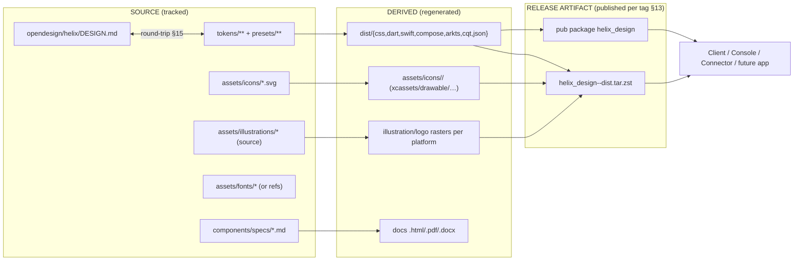
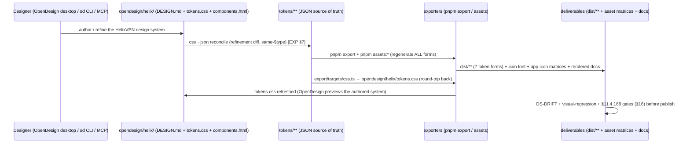

# Assets & deliverables manifest — every design resource, in every form, for every app and platform

**Revision:** 2
**Last modified:** 2026-07-04T12:00:00Z

> Master technical specification — Volume 10 (Design System), nano-detail anchor
> document. This doc is the **complete deliverables manifest** for the HelixVPN
> design system. It directly answers the operator mandate (2026-06-25): *"all
> design, UI and UX resources available in all types and forms required for
> direct incorporating for all apps and all platforms."* For **every** resource
> class — tokens, color, typography, iconography, illustration/brand,
> components, motion, design-source/handoff, and docs — it names the **concrete
> artifact forms** produced, **where each lives** inside the `vasic-digital/helix_design`
> submodule, **which app/platform consumes which form**, and the **exact pull
> command** that incorporates it directly (no platform ever re-types a design
> value by hand — DS-I6 [OV §0.2]). It carries the **master deliverables matrix**
> (resource × form × consuming platform × submodule-path × pull-command), the
> **versioning/release model** for the asset corpus, the **per-app direct-
> incorporation recipe** (Client / Console / Connector + a generic future app),
> and how OpenDesign authoring artifacts round-trip into the deliverables.
>
> **SPEC-ONLY.** It describes *what the design system ships and how each app
> takes delivery* — not the built `helix_design` artifact. The **submodule
> layout + exporters + OpenDesign relationship** are owned by
> [`00-overview-and-submodule.md`]; the **export-pipeline mechanics + per-target
> output samples** by [`token-export-pipeline.md`]; the **token model** by
> [`design-tokens.md`]; the **color values + contrast** by [`color-system.md`];
> the **type/icon/motion families** by [`typography-iconography-motion.md`]; the
> **component anatomy** by [`component-library.md`]; the **OpenDesign facts** by
> [`opendesign-foundation.md`]; the **per-platform adaptation rules** by
> [`platform-adaptation.md`]. This document **consumes** those and assembles the
> single delivery view across them.
>
> **Evidence base.** `[OV §N]` = `final/v10-design/00-overview-and-submodule.md`;
> `[EXP §N]` = `final/v10-design/token-export-pipeline.md`; `[DT §N]` =
> `design-tokens.md`; `[COLOR §N]` = `color-system.md`; `[TIM §N]` =
> `typography-iconography-motion.md`; `[CMP §N]` = `component-library.md`;
> `[OD §N]` = `opendesign-foundation.md`; `[PLAT §N]` = `platform-adaptation.md`;
> `[04_CLIENT §N]` = `final/v04-client/helix-ui-flutter.md`; `[SPINE §N]` =
> `final/SPECIFICATION.md`. Claims not grounded in the evidence base or in this
> document's own original delivery design are tagged `UNVERIFIED` per
> constitution §11.4.6 — never fabricated. Font-licensing and asset-hosting
> choices are surfaced as `D-DEL-N` decisions, not silently made.

---

## Table of contents

- [0. The delivery model at a glance](#0-the-delivery-model-at-a-glance)
- [1. The resource classes (the nine deliverable families)](#1-the-resource-classes-the-nine-deliverable-families)
- [2. Design tokens — forms & delivery](#2-design-tokens--forms--delivery)
- [3. Color — forms & delivery](#3-color--forms--delivery)
- [4. Typography — forms & delivery (+ the font-licensing decision)](#4-typography--forms--delivery--the-font-licensing-decision)
- [5. Iconography — forms & delivery](#5-iconography--forms--delivery)
- [6. Illustration & brand — forms & delivery](#6-illustration--brand--forms--delivery)
- [7. Components — forms & delivery](#7-components--forms--delivery)
- [8. Motion — forms & delivery](#8-motion--forms--delivery)
- [9. Design source / handoff — forms & delivery](#9-design-source--handoff--forms--delivery)
- [10. Docs — forms & delivery (§11.4.65 / §11.4.168)](#10-docs--forms--delivery-11465--11468)
- [11. The master deliverables matrix](#11-the-master-deliverables-matrix)
- [12. Deliverables → packaging → consumption (diagram)](#12-deliverables--packaging--consumption-diagram)
- [13. The versioning & release model for the asset corpus](#13-the-versioning--release-model-for-the-asset-corpus)
- [14. The direct-incorporation recipe per app](#14-the-direct-incorporation-recipe-per-app)
- [15. How OpenDesign authoring artifacts round-trip into the deliverables](#15-how-opendesign-authoring-artifacts-round-trip-into-the-deliverables)
- [16. Asset-corpus quality gates owned here](#16-asset-corpus-quality-gates-owned-here)
- [17. Surfaced decisions](#17-surfaced-decisions)
- [Sources verified](#sources-verified)

---

## 0. The delivery model at a glance

The HelixVPN design system ships **one canonical source** and **many derived
forms**, so each app on each platform incorporates the exact form its toolchain
consumes — directly, with zero hand-copying (DS-I6 [OV §0.2]). The delivery model
has three layers:

| Layer | What it is | Tracked in git? | Regenerated by |
|---|---|---|---|
| **SOURCE** | the canonical, human-authored design truth: `tokens/**` JSON, `presets/<brand>/**`, icon source SVG, illustration source, font files (or references), component specs, the OpenDesign `DESIGN.md` | **yes** (tracked) | authored — never machine-generated |
| **DERIVED** | every machine-emitted consumable form: `dist/**` (CSS/Dart/Swift/Compose/ArkTS/C-Qt/JSON), per-platform icon/color asset catalogs, rendered `.html`/`.pdf`/`.docx` docs | **no** (gitignored build-derivative per §11.4.30/§11.4.77) **except** the checked-in Flutter package Dart (D-DESIGN-2 [OV §4]) | `pnpm export` (tokens/colors), `pnpm assets` (icon/illustration rasterisation), `sync_all_markdown_exports` (docs) |
| **RELEASE ARTIFACT** | a tagged, pinnable bundle a consumer pulls without running the Node toolchain: the published Flutter pub package + a versioned `helix_design-<semver>-dist.tar.zst` of all `dist/**` forms | **published per tag** (not in the working tree) | the §13 release pipeline |

The operative rule for "all forms, ready for direct incorporation": **a consuming
app never builds the design system itself — it pulls a release artifact (or runs
the one `pnpm export` step once) and imports the form its platform speaks** (§14).
The SOURCE→DERIVED equality is enforced by the `DS-DRIFT` gate [EXP §5] so a
derived form can never silently diverge from source.



---

## 1. The resource classes (the nine deliverable families)

Nine resource classes cover every design/UI/UX resource the mandate names. Each is
deepened in §2–§10 and rolled up in the master matrix (§11).

| # | Resource class | Source form (tracked) | Primary deliverable forms | Detailed in |
|---|---|---|---|---|
| **R1** | **Design tokens** | `tokens/**` JSON (tiered, light+dark) | JSON bundle + CSS / Dart / Swift / Compose / ArkTS / C-Qt | §2, [DT], [EXP] |
| **R2** | **Color** | `presets/<brand>/brand.json` + `tokens/semantic/color.{light,dark}.json` | token bundles + per-platform color sets / asset catalogs | §3, [COLOR] |
| **R3** | **Typography** | font files (or refs) + `tokens/**/type.json` | font assets + licenses + type-scale tokens + per-platform text styles | §4, [TIM §1–§2] |
| **R4** | **Iconography** | `assets/icons/*.svg` | SVG set + icon-font + per-platform asset forms (xcassets/drawable/…) | §5, [TIM §3] |
| **R5** | **Illustration & brand** | logo/wordmark/app-icon/illustration source | per-platform app-icon sets + logo forms + illustration + empty-state art | §6, [TIM §3.5] |
| **R6** | **Components** | `components/specs/*.md` + `components/reference/**` | the Flutter component package + design-source + per-platform notes | §7, [CMP] |
| **R7** | **Motion** | `tokens/**/motion.json` | motion token bundle + reference specs | §8, [TIM §6–§8] |
| **R8** | **Design source / handoff** | `opendesign/helix/**` + redlines | OpenDesign `DESIGN.md`/`tokens.css`/`components.html` + redline specs | §9, [OD], [CMP] |
| **R9** | **Docs** | `docs/v10-design/*.md` | this spec set + rendered `.html`/`.pdf`(/`.docx`) | §10, [OV §4] |

> **Light + dark is universal across all nine classes (DS-I3 [OV §0.2]).** Every
> token, color set, icon-on-surface pairing, component spec, illustration that
> carries a fill, logo lockup, and rendered doc swatch ships a **light AND a dark**
> variant. A single-theme deliverable is incomplete and FAILs `DS-LIGHT-DARK-COMPLETE`
> [OV §12].

---

## 2. Design tokens — forms & delivery

### 2.1 Source (tracked)

`helix_design/tokens/**` — the three-tier JSON tree (primitive → semantic →
component), light+dark on the semantic color tier, authored in the W3C-DTCG
`$value`/`$type` envelope [DT §3.1], plus the active `presets/<brand>/` value set
[OV §5.4]. This is the **single source of truth** for R1, R2, R3 (type metrics),
R7 (motion); every other token form is a derived export [EXP §0].

### 2.2 Emitted forms (each consumed directly by a platform)

| Form | File | Consuming platform/app | How it is applied |
|---|---|---|---|
| **JSON bundle** | `dist/json/tokens.json` | tooling, the OpenDesign `tokens.css` round-trip [EXP §7], any future target | read as data |
| **CSS custom properties** | `dist/css/helix.css` | Console **Web** (Flutter web build + any web chrome) | `<link>` / `@import`; `:root` light + `[data-theme=dark]` [EXP §4.1] |
| **Dart `ThemeExtension` + `ThemeData`** | `packages/flutter/lib/src/helix_tokens.dart` (checked-in package-source per D-DESIGN-2) | `helix-ui` Flutter (Client/Console/Connector) [04_CLIENT §2.1] | `MaterialApp(theme: helixLight(), darkTheme: helixDark())`; widgets read `Theme.of(context).extension<HelixTokens>()!` [EXP §4.2] |
| **SwiftUI tokens + `.xcassets`** | `dist/swift/HelixTokens.swift` + `HelixColors.xcassets` | iOS/macOS native shims (NE config UI, widgets) [04_CLIENT §4.4] | add file + asset catalog to the extension target [EXP §4.3] |
| **Compose `ColorScheme`** | `dist/compose/HelixTokens.kt` | Android native surfaces (quick-settings tile, notification) | `MaterialTheme(colorScheme = HelixLightColorScheme)` [EXP §4.4] |
| **ArkTS resources** | `dist/arkts/helix_tokens.ets` + `resources/{base,dark}` | HarmonyOS VPN-ability surfaces | `$r('app.color.hx_*')` + qualifier tree [EXP §4.5] |
| **C/Qt header + QML singleton** | `dist/cqt/helix_tokens.h` + `Theme.qml` | Aurora Qt/C++ surfaces | `#include` + `import` the `Theme` singleton [EXP §4.6] |

### 2.3 Pull command

```bash
# from the consuming project root, after the submodule is added (§14.1):
( cd helix_design && pnpm install && pnpm export )   # regenerates every dist/** form
# OR pull the pinned release bundle without the Node toolchain (§13):
helix_design/scripts/fetch-dist.sh <semver>          # → unpacks dist/** from the tagged artifact
```

---

## 3. Color — forms & delivery

### 3.1 Source (tracked)

The light + dark palettes live as **semantic color tokens** referencing primitive
ramps [COLOR §2/§3]: `tokens/semantic/color.light.json` + `color.dark.json`, with
the brand seed + accent + the 7-variant connection-state palette in
`presets/helix/{brand.json,connection_state.json}` [OV §5.4/§5.5]. The palette is
**generic** in the submodule; HelixVPN values are injected (DS-I1).

### 3.2 Emitted forms

| Form | File | Consuming platform | Theme handling |
|---|---|---|---|
| **CSS color custom properties** | inside `dist/css/helix.css` | Web | `:root` + `[data-theme=dark]` + `@media (prefers-color-scheme)` |
| **Dart `ColorScheme` + `HelixTokens` colors** | inside the Dart package | Flutter | `ColorScheme.light()` / `.dark()` + connection-state colors as `HelixTokens` fields |
| **Apple asset-catalog colorsets** | `dist/swift/HelixColors.xcassets/*.colorset` | iOS/macOS | one colorset per themed color, light + dark appearance resolved by `@Environment(\.colorScheme)` [EXP §4.3] |
| **Android color resources** | inside `dist/compose/HelixTokens.kt` (+ optional `colors.xml` `values/` + `values-night/`) | Android | `lightColorScheme()` / `darkColorScheme()` + `values-night` qualifier |
| **HarmonyOS color resources** | `dist/arkts/resources/base/element/color.json` + `resources/dark/element/color.json` | HarmonyOS | `base` (light) / `dark` qualifier sets [EXP §4.5] |
| **Qt color set** | inside `dist/cqt/{helix_tokens.h, Theme.qml}` | Aurora | `Theme.qml` `dark` property switch |

> **The connection-state palette is a first-class color deliverable.** The 7 UI
> states (Disconnected / Connecting / Connected-direct / Connected-relay /
> Reconnecting / Down / Danger [OV §5.5]) ship as named status tokens in every
> color form so the Client's `ConnectButton`/`StatusChip` render the identical
> state color on Flutter AND on each native shim. The Rust FFI `StatusProjector`
> produces the 7-variant `ffi::TunnelStatus` from the 5-variant `core::TunnelStatus`
> (it adds `Disconnected` and `Danger`) [`ffi-surface.md` §3.2/§3.3]; only the
> `Connected{direct|relay}` sub-shade and the status-token→color rendering are
> app-side in `helix_domain` [04_CLIENT §7.2] (DS-I1), never in the color deliverable.

### 3.3 Pull command

Same as R1 (§2.3) — color is part of the token export; the Apple `.xcassets` and
HarmonyOS qualifier trees are emitted alongside the per-target token file.

---

## 4. Typography — forms & delivery (+ the font-licensing decision)

### 4.1 Source (tracked)

- **Font files (or references)** — the brand sans (`Inter`) + mono (`JetBrains
  Mono`) [OV §5.4], either bundled under `assets/fonts/` or referenced per
  platform (the **D-DEL-1 licensing decision**, §4.4).
- **Type-scale tokens** — `tokens/primitive/type.json` (the size/line/weight
  scale) + `tokens/semantic/type.json` (the role styles: `title.lg`, `body.md`,
  `label.sm`, …) [TIM §1.1].

### 4.2 Emitted forms

| Form | File | Consuming platform | How applied |
|---|---|---|---|
| **CSS `@font-face` + type custom properties** | `dist/css/helix.css` (+ `dist/css/fonts/`) | Web | `@font-face` for bundled fonts + `--hx-font-*` properties |
| **Flutter `TextTheme` + `pubspec` font decl** | Dart package `TextTheme` + `packages/flutter/pubspec.yaml` `fonts:` | Flutter | `Theme.of(context).textTheme.titleLarge` |
| **SwiftUI `Font` accessors** | inside `HelixTokens.swift` | iOS/macOS | `Font.custom("Inter", size:).weight(.semibold)` (or system font on the tiny NE surface, [TIM §2.2 D-TYPE-1]) |
| **Compose `Typography`** | inside `HelixTokens.kt` | Android | `MaterialTheme(typography = HelixTypography)` |
| **ArkTS text metrics** | inside `helix_tokens.ets` | HarmonyOS | `fontSize`/`fontWeight` numeric tokens |
| **Qt font metrics** | inside `helix_tokens.h` / `Theme.qml` | Aurora | `int` size/weight constants |

### 4.3 Font asset forms (per platform)

| Platform | Font asset form | Where it lives |
|---|---|---|
| Web | `.woff2` (subset) | `dist/css/fonts/*.woff2` |
| Flutter (all) | `.ttf`/`.otf` declared in `pubspec.yaml` | `packages/flutter/assets/fonts/` |
| iOS/macOS | `.ttf`/`.otf` in the bundle + `Info.plist` `UIAppFonts` | `assets/fonts/` → app target |
| Android | `.ttf` in `res/font/` | `assets/fonts/` → `res/font/` |
| HarmonyOS | `.ttf` registered font | `assets/fonts/` → HarmonyOS font resource |
| Aurora | system/bundled `.ttf` | `assets/fonts/` |

### 4.4 D-DEL-1 — the font-licensing decision (surfaced, not silently made)

> **D-DEL-1 (open).** Whether to **bundle** font files in `assets/fonts/` (and
> ship them in every app artifact) or **reference** a system/Google-Fonts-hosted
> face per platform. The chosen brand faces — `Inter` and `JetBrains Mono` — are
> both **SIL Open Font License 1.1** (OFL), which **permits bundling and
> redistribution inside an application** provided the OFL license text travels
> with the font and the font is not sold on its own. `UNVERIFIED` — the exact OFL
> version + that these two specific faces are the final choice MUST be re-verified
> against the upstream font repositories per §11.4.99 before the assets ship; the
> OFL text MUST be committed at `assets/fonts/<face>/OFL.txt` alongside each face.
> **Lean: bundle** (OFL permits it; bundling removes a network/runtime dependency
> and guarantees the brand face renders offline — important for a VPN client whose
> network may be down). **Fallback per platform** is always declared
> (`system-ui`/`-apple-system`/`Roboto`) so a missing bundled face degrades to a
> platform sans, never to a broken render. Resolved at the Volume-10 assets
> review; the per-face license file is a tracked deliverable regardless of the
> bundle/reference choice.

### 4.5 Pull command

Type tokens travel with the token export (§2.3); font files travel with the
release bundle (§13) or are referenced per `pubspec.yaml`/`@font-face`.

---

## 5. Iconography — forms & delivery

### 5.1 Source (tracked)

`helix_design/assets/icons/*.svg` — the master icon set as optimized source SVG
(one file per glyph, on a 24×24 grid with a documented keyline, [TIM §3.1]).
Icon **names** are semantic (`shield_connected`, `shield_disconnected`,
`exit_node`, `kill_switch`, `relay`, `settings`, …) so each platform's generated
asset keeps a stable name.

### 5.2 Emitted forms

| Form | File | Consuming platform | How applied |
|---|---|---|---|
| **Optimized SVG set** | `assets/icons/*.svg` | Web, Flutter (`flutter_svg`) | `<svg>` / `SvgPicture.asset` |
| **Icon font** | `dist/icons/helix_icons.{ttf,woff2}` + `helix_icons.dart` codepoint map | Flutter (`IconData`), Web (`@font-face` + glyph class) | `Icon(HelixIcons.shieldConnected)` |
| **Apple SF-Symbols-style imageset / PDF** | `assets/icons/apple/HelixIcons.xcassets/*.imageset` (vector PDF) | iOS/macOS | `Image("HelixShieldConnected")` |
| **Android vector drawables** | `assets/icons/android/drawable/ic_helix_*.xml` | Android | `R.drawable.ic_helix_shield_connected` |
| **HarmonyOS media resources** | `assets/icons/harmony/resources/base/media/*.svg` | HarmonyOS | `$r('app.media.helix_shield_connected')` |
| **Qt resource SVG** | `assets/icons/qt/icons.qrc` + SVG | Aurora | `image://` / `Image { source: "qrc:/icons/..." }` |

### 5.3 Sizing & rendering rules

Icons are authored at **24×24** with the [TIM §3.1] keyline; each platform asset
carries the size variants its convention needs (iOS 1×/2×/3× via vector PDF;
Android `mdpi…xxxhdpi` via vector drawable scaling; Web/Flutter scale the SVG/font
freely). On-icon color comes from the **semantic `on-*` color tokens** (R2) so an
icon on `surface` uses `on-surface` and inherits light/dark automatically — icons
ship **monochrome/templated**, never with baked-in brand color (so one icon serves
both themes). Two-tone state icons (e.g. the connection shield) are the documented
exception and carry an explicit light+dark pair [TIM §3.3].

### 5.4 Pull command

```bash
( cd helix_design && pnpm assets:icons )   # SVG → icon-font + per-platform asset forms
# emitted into dist/icons/** and assets/icons/<platform>/**
```

---

## 6. Illustration & brand — forms & delivery

### 6.1 Source (tracked)

- **Logo / wordmark** — master vector source under `assets/logo/` (light + dark
  lockups: full logo, wordmark-only, mark-only), [TIM §3.5].
- **App icons** — the master app-icon source (a single high-res master per the
  largest platform requirement) under `assets/logo/app-icon/`.
- **Illustration set** — onboarding / hero / decorative illustrations under
  `assets/illustrations/source/` (vector source).
- **Empty-state art** — the "no servers", "not connected", "error" empty-state
  illustrations under `assets/illustrations/empty-states/`.

### 6.2 Emitted forms — logo

| Form | File | Consuming platform |
|---|---|---|
| SVG (light+dark lockups) | `assets/logo/*.svg` | Web, Flutter |
| PNG @1×/2×/3× | `dist/logo/png/*` | any raster need |
| Apple imageset | `assets/logo/apple/Logo.xcassets` | iOS/macOS |
| Android drawable | `assets/logo/android/drawable/` | Android |

### 6.3 Emitted forms — app icons (per-platform size matrices)

Each platform's app-icon set is generated from the one master so every required
size/shape is present and consistent:

| Platform | App-icon form & sizes | Where it lives |
|---|---|---|
| **iOS** | `AppIcon.appiconset` — 20/29/40/60/76/83.5 pt @1×/2×/3× + 1024 marketing | `dist/app-icon/ios/AppIcon.appiconset` |
| **macOS** | `.icns` / iconset — 16…1024 | `dist/app-icon/macos/` |
| **Android** | adaptive icon (`ic_launcher` fore+back layers) + legacy `mipmap-*` (48…192) + Play 512 | `dist/app-icon/android/` |
| **Windows** | `.ico` (16…256) + Store tiles | `dist/app-icon/windows/` |
| **Linux** | `.png` hicolor theme sizes (16…512) + `.desktop` ref | `dist/app-icon/linux/` |
| **Web (PWA)** | `favicon.ico` + `manifest` icons (192/512 + maskable) | `dist/app-icon/web/` |
| **HarmonyOS** | layered app icon (fore/back) in the HarmonyOS icon form | `dist/app-icon/harmony/` |
| **Aurora** | `.png` set per Aurora packaging | `dist/app-icon/aurora/` |

> **`UNVERIFIED` (U-DEL-1).** The exact HarmonyOS layered-icon spec + the Aurora
> app-icon size matrix are SDK/platform-version dependent; stated as the *intended*
> matrices, pinned + re-verified per §11.4.99 against the live HarmonyOS / Aurora
> packaging docs before the app-icon generator ships [PLAT]. The iOS/macOS/Android/
> Windows/Linux/Web matrices are the well-documented platform conventions.

### 6.4 Emitted forms — illustration & empty-state

| Form | File | Consuming platform |
|---|---|---|
| SVG (light+dark) | `assets/illustrations/*.svg` | Web, Flutter (`flutter_svg`) |
| PNG @1×/2×/3× | `dist/illustrations/png/*` | native shims, raster fallback |
| Lottie JSON (animated onboarding/empty-state) | `assets/illustrations/lottie/*.json` | Flutter (`lottie`), Web (`lottie-web`) — **D-DEL-3** |

> **D-DEL-3 (open).** Whether onboarding/empty-state illustrations are **static**
> (SVG/PNG only) or **animated** (Lottie). Lottie adds a dependency but gives one
> cross-platform animated source (Flutter + Web + native). `UNVERIFIED` — decided
> at the Volume-10 motion review with [TIM §6]; static SVG/PNG is the guaranteed
> floor, Lottie the enhancement. Either way, every illustration ships light+dark.

### 6.5 Pull command

```bash
( cd helix_design && pnpm assets:brand )   # logo + app-icon matrices + illustration rasters
# emitted into dist/{logo,app-icon,illustrations}/** and assets/logo/<platform>/**
```

---

## 7. Components — forms & delivery

### 7.1 Source (tracked)

- **Component specs** — `components/specs/*.md`, one per component
  (anatomy / states / variants / a11y / light+dark), the **platform-neutral**
  contract [CMP].
- **Reference implementations** — `components/reference/**`, per-platform reference
  impls where a component is platform-native.

### 7.2 The deliverable forms

| Form | What it is | Consuming platform | Where it lives |
|---|---|---|---|
| **Flutter component package** | the `helix_design` Dart package that re-exports the tokens AND ships the reference Flutter widgets (`ConnectButton`, `StatusChip`, `ExitPicker`, …) | `helix-ui` Flutter (Client/Console/Connector) | `packages/flutter/lib/` [OV §4] |
| **Design-source / authoring form** | the OpenDesign `components.html` + the `DESIGN.md` component section (§9, §15) — the designer-facing component definitions | designers / OpenDesign | `opendesign/helix/components.html` |
| **Per-platform component notes** | for surfaces the Flutter package can't reach (native shims), the spec doc states how to compose the same component from the native token form (Swift/Compose/ArkTS/C-Qt) | native-shim authors | `components/specs/*.md` per-platform notes section + [PLAT] |
| **Component tokens** | the `tokens/component/*.json` per-widget tokens every form reads | all | `tokens/component/` [DT §8] |

> **Why the component deliverable is spec-first, package-second.** The three
> HelixVPN apps are one Flutter codebase [04_CLIENT §5], so the **Flutter package**
> is the primary component delivery — a widget imported directly. The native-shim
> surfaces (iOS NE config UI, Android tile, HarmonyOS ability, Aurora Qt) are tiny
> and platform-native; they don't import Dart, so their delivery is the **spec +
> the native token form** (R1/R2/R3 per-platform), from which the small native UI
> is composed. This is why R6 ships BOTH a package (Flutter) AND specs+notes
> (native): no surface is left to guess a component's anatomy.

### 7.3 Pull command

```bash
# Flutter apps depend on the package directly (path/replace), §14.2:
#   dependency_overrides: helix_design: { path: ../helix_design/packages/flutter }
# native-shim authors read components/specs/*.md + the per-platform token form (§2.2)
```

---

## 8. Motion — forms & delivery

### 8.1 Source (tracked)

`tokens/primitive/motion.json` + `tokens/semantic/motion.json` — the duration
scale (`fast120`/`base220`/`slow360`), the standard easings (cubic-bezier sets),
and the named semantic motions (`connectPulse`, `statusTransition`,
`sheetEnter`, …) [TIM §6–§7], with the `prefers-reduced-motion` zero-duration rule
[TIM §8.1].

### 8.2 Emitted forms

| Form | Where | Consuming platform |
|---|---|---|
| CSS motion custom properties (`--hx-motion-*-dur`, `*-ease`) + a `prefers-reduced-motion` block | `dist/css/helix.css` [EXP §4.1] | Web |
| Dart `Duration` + `Curve` tokens | Dart package | Flutter |
| Swift `Double` seconds + `Animation` accessors | `HelixTokens.swift` | iOS/macOS |
| Compose `Int` ms + `Easing` | `HelixTokens.kt` | Android |
| ArkTS numeric ms | `helix_tokens.ets` | HarmonyOS |
| Qt `int` ms | `helix_tokens.h` | Aurora |
| **Motion reference specs** | `docs/v10-design/typography-iconography-motion.md` §6–§8 (rendered) | designers + devs |

### 8.3 Pull command

Motion tokens travel with the token export (§2.3); the reduced-motion guard is
emitted per platform (CSS `@media`, Flutter `MediaQuery.disableAnimations`, etc.)
so the accessibility contract is honored everywhere [TIM §8.1].

---

## 9. Design source / handoff — forms & delivery

### 9.1 Source (tracked)

The **OpenDesign-native design system** under `helix_design/opendesign/helix/`
[OV §10.3] — the authoring + handoff artifacts:

| Artifact | What it is | Audience |
|---|---|---|
| `DESIGN.md` | the 9-section design-system spec (visual theme, color, type, spacing, layout, components, motion, voice/tone, anti-patterns) [OD §3.3] | designers + devs |
| `tokens.css` | compiled CSS custom properties (light+dark) — the OpenDesign-consumed form [OD §4] | OpenDesign + Web |
| `components.html` | rendered component gallery | designers + reviewers |
| `manifest.json` | OpenDesign design-system manifest (schemaVersion/id/name/files) [OD §3.3] | OpenDesign tooling |
| `assets/ fonts/ preview/ source/` | the OpenDesign asset/preview subtree | OpenDesign |
| **Redline / handoff specs** | per-screen redlines + spacing/measure callouts (rendered with the docs §10) | devs implementing a screen |

### 9.2 How a designer / dev pulls the handoff

```bash
# designer: open the OpenDesign design system (desktop / od CLI / MCP) §15
od open helix_design/opendesign/helix          # UNVERIFIED exact CLI verb (U-OD §15)
# dev: read the rendered DESIGN.md + components.html + redlines:
open helix_design/opendesign/helix/DESIGN.html  # §11.4.65 rendered sibling
open helix_design/opendesign/helix/components.html
```

The handoff is **self-contained in the submodule** — a designer or dev pulls the
one submodule and has the authoring source, the rendered gallery, the redlines,
and the tokens, all in sync (§11.4.65). No external design-tool URL is the source
of truth (that would be a §11.4.13 sink-side violation).

### 9.3 Pull command

Travels with the submodule clone; rendered `.html`/`.pdf` siblings refresh via the
docs export (§10, §11.4.65).

---

## 10. Docs — forms & delivery (§11.4.65 / §11.4.168)

### 10.1 Source (tracked)

Every Volume-10 nano-detail document under `helix_design/docs/v10-design/*.md`
(this manifest included) — so the design system is **self-documenting** and a
future project that pulls `helix_design` gets the full spec set [OV §1.2(8)].

### 10.2 Emitted forms

| Form | Generated by | Constitution clause |
|---|---|---|
| `.html` sibling per `.md` | `sync_all_markdown_exports.sh` (pandoc) | §11.4.65 |
| `.pdf` sibling per `.md` | weasyprint from the HTML | §11.4.65 |
| `.docx` sibling (feature-status class only) | the §11.4.153 export | §11.4.153 |
| **visual-validated** rendered docs | the §11.4.168 check (pdftotext no-raw-source + pdfimages diagrams-rasterised + swatch-block-present) | §11.4.168 [EXP §6] |

### 10.3 Pull command

```bash
( cd helix_design && bash scripts/testing/sync_all_markdown_exports.sh )
# every docs/v10-design/*.md → .html + .pdf (+ .docx where in scope), §11.4.168-validated
```

---

## 11. The master deliverables matrix

The single delivery view: **resource × form × consuming platform × where it lives
in the submodule × pull command**. Every row is a concrete, directly-incorporable
artifact. (`R#` = the §1 resource class; light+dark applies to every row per
DS-I3.)

| R# | Resource → form | Consuming platform(s) | Submodule path | Pull command |
|---|---|---|---|---|
| R1 | tokens → **JSON bundle** | tooling, round-trip | `dist/json/tokens.json` | `pnpm export` |
| R1 | tokens → **CSS vars** | Web (Console) | `dist/css/helix.css` | `pnpm export` |
| R1 | tokens → **Dart ThemeExtension** | Flutter (Client/Console/Connector) | `packages/flutter/lib/src/helix_tokens.dart` | pub `path`/`replace` (§14.2) |
| R1 | tokens → **SwiftUI tokens** | iOS, macOS shims | `dist/swift/HelixTokens.swift` | `pnpm export` → add to NE target |
| R1 | tokens → **Compose Kt** | Android shims | `dist/compose/HelixTokens.kt` | `pnpm export` → add to module |
| R1 | tokens → **ArkTS resources** | HarmonyOS | `dist/arkts/helix_tokens.ets` + `resources/{base,dark}` | `pnpm export` |
| R1 | tokens → **C/Qt header + QML** | Aurora | `dist/cqt/{helix_tokens.h,Theme.qml}` | `pnpm export` |
| R2 | color → **light+dark palettes (tokens)** | all | `tokens/semantic/color.{light,dark}.json` | (source) |
| R2 | color → **Apple colorsets** | iOS, macOS | `dist/swift/HelixColors.xcassets` | `pnpm export` |
| R2 | color → **Android color res** | Android | `dist/compose/HelixTokens.kt` (+ `values-night`) | `pnpm export` |
| R2 | color → **HarmonyOS color res** | HarmonyOS | `dist/arkts/resources/{base,dark}/element/color.json` | `pnpm export` |
| R2 | color → **connection-state palette** | all (Client) | `presets/helix/connection_state.json` → every form | `pnpm export` |
| R3 | type → **font files + license** | all | `assets/fonts/<face>/*.{ttf,woff2}` + `OFL.txt` | release bundle / `pubspec` |
| R3 | type → **type-scale tokens** | all | `tokens/{primitive,semantic}/type.json` | `pnpm export` |
| R3 | type → **per-platform text styles** | each | inside each `dist/**` token form | `pnpm export` |
| R4 | icons → **SVG set** | Web, Flutter | `assets/icons/*.svg` | (source) |
| R4 | icons → **icon font + codepoint map** | Flutter, Web | `dist/icons/helix_icons.{ttf,woff2}` + `.dart` | `pnpm assets:icons` |
| R4 | icons → **Apple imageset (PDF)** | iOS, macOS | `assets/icons/apple/HelixIcons.xcassets` | `pnpm assets:icons` |
| R4 | icons → **Android vector drawables** | Android | `assets/icons/android/drawable/ic_helix_*.xml` | `pnpm assets:icons` |
| R4 | icons → **HarmonyOS media** | HarmonyOS | `assets/icons/harmony/resources/base/media/*.svg` | `pnpm assets:icons` |
| R4 | icons → **Qt resource SVG** | Aurora | `assets/icons/qt/icons.qrc` | `pnpm assets:icons` |
| R5 | brand → **logo (SVG+raster, light+dark)** | all | `assets/logo/*.svg` + `dist/logo/png/*` | `pnpm assets:brand` |
| R5 | brand → **iOS appiconset** | iOS | `dist/app-icon/ios/AppIcon.appiconset` | `pnpm assets:brand` |
| R5 | brand → **macOS icns** | macOS | `dist/app-icon/macos/` | `pnpm assets:brand` |
| R5 | brand → **Android adaptive icon** | Android | `dist/app-icon/android/` | `pnpm assets:brand` |
| R5 | brand → **Windows ico + tiles** | Windows | `dist/app-icon/windows/` | `pnpm assets:brand` |
| R5 | brand → **Linux hicolor png** | Linux | `dist/app-icon/linux/` | `pnpm assets:brand` |
| R5 | brand → **Web PWA icons** | Web | `dist/app-icon/web/` | `pnpm assets:brand` |
| R5 | brand → **HarmonyOS layered icon** `UNVERIFIED` | HarmonyOS | `dist/app-icon/harmony/` | `pnpm assets:brand` |
| R5 | brand → **Aurora app-icon set** `UNVERIFIED` | Aurora | `dist/app-icon/aurora/` | `pnpm assets:brand` |
| R5 | brand → **illustration + empty-state** | all | `assets/illustrations/*.svg` (+ Lottie D-DEL-3) | `pnpm assets:brand` |
| R6 | components → **Flutter package** | Flutter (3 apps) | `packages/flutter/lib/` | pub `path`/`replace` |
| R6 | components → **design-source gallery** | designers | `opendesign/helix/components.html` | submodule clone |
| R6 | components → **per-platform notes** | native shims | `components/specs/*.md` + [PLAT] | submodule clone |
| R6 | components → **component tokens** | all | `tokens/component/*.json` | `pnpm export` |
| R7 | motion → **token bundle** | all | `tokens/{primitive,semantic}/motion.json` → every form | `pnpm export` |
| R7 | motion → **reference specs** | designers + devs | `docs/v10-design/typography-iconography-motion.md` | docs export |
| R8 | handoff → **OpenDesign DESIGN.md + tokens.css** | designers + Web | `opendesign/helix/{DESIGN.md,tokens.css,manifest.json}` | submodule clone |
| R8 | handoff → **redline specs** | devs | rendered with docs (§10) | docs export |
| R9 | docs → **this spec set** | everyone | `docs/v10-design/*.md` | submodule clone |
| R9 | docs → **rendered html/pdf(/docx)** | everyone | `docs/v10-design/*.{html,pdf,docx}` | `sync_all_markdown_exports` |

---

## 12. Deliverables → packaging → consumption (diagram)

```mermaid
flowchart TB
    subgraph SRC["SOURCE (tracked in helix_design)"]
        tk["R1 tokens/**"]
        cl["R2 color tokens + presets"]
        ty["R3 type.json + fonts"]
        ic["R4 icons/*.svg"]
        br["R5 logo/app-icon/illustration source"]
        cp["R6 component specs + reference"]
        mo["R7 motion.json"]
        hd["R8 opendesign/helix/**"]
        dc["R9 docs/v10-design/*.md"]
    end
    subgraph PKG["PACKAGING (regenerate)"]
        exp["pnpm export (tokens/color/type/motion → 7 forms)"]
        asi["pnpm assets:icons (SVG → icon-font + platform asset forms)"]
        asb["pnpm assets:brand (logo/app-icon matrices/illustration rasters)"]
        mds["sync_all_markdown_exports (docs → html/pdf/docx, §11.4.168)"]
        rel["§13 release pipeline → pub package + dist tarball (tagged)"]
    end
    tk & cl & ty & mo --> exp
    ic --> asi
    br --> asb
    dc & hd & cp --> mds
    exp & asi & asb & mds --> rel
    subgraph CONS["CONSUMPTION (direct incorporation)"]
        flutter["Flutter helix-ui → Client / Console / Connector<br/>(Dart pkg + icon font + fonts)"]
        web["Console Web (helix.css + PWA icons + woff2)"]
        ios["iOS/macOS NE shim (Swift colorsets + appiconset/icns + imageset)"]
        and["Android tile/notif (Compose + adaptive icon + drawables)"]
        win["Windows (Flutter + ico/tiles)"]
        lin["Linux (Flutter + hicolor png)"]
        hm["HarmonyOS ability (ArkTS resources + media + layered icon)"]
        au["Aurora Qt (C/Qt header+QML + qrc icons + app-icon)"]
        fut["ANY future Helix app (drops presets/&lt;x&gt;/ — inherits all forms)"]
    end
    exp --> flutter & web & ios & and & win & lin & hm & au & fut
    asi --> flutter & web & ios & and & hm & au
    asb --> flutter & web & ios & and & win & lin & hm & au
    cp --> flutter & ios & and & hm & au
    rel --> flutter & web & ios & and & win & lin & hm & au & fut
```



---

## 13. The versioning & release model for the asset corpus

The asset corpus versions **with** the design system (one semver per `helix_design`
tag [OV §8]) — assets are not versioned independently of tokens, because a logo
recolor, an icon addition, and a token change are all "design-system change". The
release model adds the **asset-corpus-specific** rules on top of [OV §8]:

| Change class | Bump | Asset examples |
|---|---|---|
| **MAJOR** | breaking asset rename/removal, app-icon shape change, dropped component | rename `ic_helix_shield` → `ic_helix_lock`; drop an illustration a screen imports; change the app-icon master silhouette |
| **MINOR** | additive — new icon, new illustration, new app-icon platform, new font weight, new component | add `ic_helix_relay`; add the Aurora app-icon matrix; add an empty-state illustration |
| **PATCH** | value-only — recolor within contrast, re-export an asset, fix a dark variant, license-text update | nudge the logo color; re-rasterise an icon; commit a corrected `OFL.txt` |

Release mechanics (compose [OV §8] + §13-specific):

1. **Source is tracked; raster/derived asset forms are gitignored build-derivatives**
   (§11.4.30/§11.4.77) — regenerated by `pnpm assets:*`; the §11.4.77
   regeneration mechanism is declared per `.gitignore-meta/<form>.yaml`. The icon
   SVG source, illustration source, logo source, font files, and the
   checked-in Flutter-package Dart are tracked; the per-platform raster matrices
   are not (they are regenerated from the masters).
2. **Each tag publishes a pinnable bundle** — `helix_design-<semver>-dist.tar.zst`
   (all `dist/**` forms + the generated icon font + the app-icon matrices) so a
   consumer pulls the assets without the Node toolchain (D-DESIGN-2 [OV §4] rationale
   generalised to assets). `scripts/fetch-dist.sh <semver>` unpacks it.
3. **A consuming app pins a tag**, bumps the pointer deliberately (§11.4.26 step 7);
   a pointer bump that changes any asset triggers the app's **visual-regression
   suite** (DS-I5 [OV §12]) — a logo recolor or icon change must pass golden
   screenshots before the app ships it.
4. **Release tags follow §11.4.151** — `<PREFIX>-helix_design-<semver>` in a
   HelixVPN wave, plain `helix_design-<semver>` standalone. **No force-push, ever**
   (§11.4.113) — every publish is a merge-onto-latest-main fast-forward to all
   mirrors.
5. **Asset provenance is captured** — the release bundle carries
   `.export-manifest.json` (every emitted form + its content hash + the
   source-commit it came from [EXP §6.1]) so a consumer can prove which source
   produced the asset it ships (§11.4.108 SOURCE→ARTIFACT).

---

## 14. The direct-incorporation recipe per app

### 14.1 The common five steps (every app, same model — [OV §9.1])

```bash
# 1. Add the decoupled submodule at the FLAT parent-root path (§11.4.28(C)/.29):
git submodule add git@github.com:vasic-digital/helix_design.git helix_design

# 2. Install upstream push mirrors (§11.4.36):
( cd helix_design && install_upstreams )

# 3. Brand preset: HelixVPN apps use presets/helix/ (default — no flag);
#    a future app drops presets/<app>/ (§14.5).

# 4. Generate the forms the app needs — OR pull the pinned release bundle:
( cd helix_design && pnpm install && pnpm export && pnpm assets:icons && pnpm assets:brand )
#   OR (no Node toolchain):  helix_design/scripts/fetch-dist.sh <semver>

# 5. Wire the generated form(s) into the app build (per-app, §14.2–§14.5).
```

### 14.2 Client (end-user VPN app, 8 platforms)

The Client is one Flutter codebase + per-platform native shims [04_CLIENT §5], so
it consumes the **Dart package** for the app body and the **native forms** for the
shim surfaces:

```yaml
# helix-ui (Client) pubspec.yaml — primary delivery: the Flutter package
dependencies:
  helix_design:
    path: ../helix_design/packages/flutter      # direct import, no hand-copy
```

```dart
// app entry — apply the generated themes (light+dark) directly:
import 'package:helix_design/helix_design.dart';
MaterialApp(theme: helixLight(), darkTheme: helixDark(), /* … */);
// fonts come from packages/flutter/pubspec.yaml fonts: (§4.3)
// icons:  Icon(HelixIcons.shieldConnected)            (§5.2)
```

| Client platform | Form(s) incorporated | Where |
|---|---|---|
| iOS / macOS | Dart package (app) + `HelixTokens.swift` + `HelixColors.xcassets` + `AppIcon.appiconset`/`.icns` + icon imageset (NE config UI, widget) | Flutter target + NE-extension target |
| Android | Dart package (app) + `HelixTokens.kt` + adaptive icon + vector drawables (quick-settings tile, notification) | Flutter target + native module |
| Windows / Linux | Dart package + `.ico`/hicolor app icon | Flutter target |
| HarmonyOS | Dart package (if Flutter-on-Harmony) **or** ArkTS forms + media + layered icon (native ability) `UNVERIFIED` | per [PLAT] |
| Aurora | Dart package (if Flutter-on-Aurora) **or** C/Qt forms + qrc icons + app-icon | per [PLAT] |
| Web (if the Client ships a web build) | `helix.css` + PWA icons + woff2 | web build |

### 14.3 Console (admin web app)

```bash
# Console is a Flutter web build → Dart package (primary) + helix.css for web chrome:
#   pubspec.yaml: helix_design: { path: ../helix_design/packages/flutter }
#   web/index.html: <link rel="stylesheet" href="dist/css/helix.css">
#   web/ PWA icons from dist/app-icon/web/, fonts from dist/css/fonts/*.woff2
```

The Console renders the **same** palette/type/components as the Client because both
read the one design source — the admin UI is visibly part of the same product
family with zero extra design work (§2.1 reuse payoff).

### 14.4 Connector (appliance config UI)

```yaml
# Connector is the helix-ui Flutter codebase in its connector flavor [04_CLIENT §5]:
dependencies:
  helix_design: { path: ../helix_design/packages/flutter }
# applies helixLight()/helixDark(); uses the connector-relevant subset of components
# (no consumer-only screens) gated by the app's capability flags — design forms identical.
```

### 14.5 A generic FUTURE Helix-ecosystem app

```bash
# Identical five steps; step 3 drops a NEW preset instead of using presets/helix/:
mkdir -p helix_design/presets/acme
cat > helix_design/presets/acme/brand.json <<'JSON'
{ "brand": { "seed": "#7C3AED", "accent": "#F59E0B",
             "fontFamily": { "sans": "Inter", "mono": "JetBrains Mono" },
             "productName": "Acme" } }
JSON
( cd helix_design && pnpm export --preset presets/acme/ )   # → every form in Acme's palette
# inherits ALL nine resource classes' machinery with ZERO HelixVPN coupling (DS-I1).
```

The future app gets the entire deliverable set — tokens, color, type, icons,
illustration scaffold, components, motion, handoff, docs — for free; it supplies
only its own brand values + its own logo/illustration source. This is the §11.4.74
reuse the decoupling exists to make real [OV §2.1].

---

## 15. How OpenDesign authoring artifacts round-trip into the deliverables

OpenDesign (§11.4.162, mandatory authoring/refinement [OD]) is where designers
**author and refine** the system; the deliverables are **derived from** the authored
source, and refinements made in OpenDesign are reconciled **back** into the token
source so every derived form follows (DS-I6):



Key facts (web-verified [OD], honest boundaries stated, §11.4.6):

1. **OpenDesign authors the design *system***; it owns `DESIGN.md` + `tokens.css` +
   `components.html` [OD §3.3]. The **deliverable token forms** (Dart/Swift/Compose/
   ArkTS/C-Qt) are **`helix_design`'s own exporters** — OpenDesign does **not** emit
   them [OD §1.2] — so the round-trip touches only the verified `tokens.css` surface,
   never an unverified OpenDesign API [EXP §7.2].
2. **JSON is the source of truth (D-DESIGN-3 lean (b) [OV §10.2]).** `tokens.css` is
   a generated export target; designer refinements in OpenDesign reconcile back into
   `tokens/**` via the `css→json` reconciler, then **all** deliverable forms
   regenerate. A `tokens.css` edit that doesn't map to a known token path is surfaced
   to the operator, never silently merged (§11.4.6 [EXP §7.2]).
3. **Missing-pattern policy** — if OpenDesign lacks a deliverable pattern HelixVPN
   needs (a richer multi-theme token model, a new export form, a VPN-specific
   component archetype), the fix is an **upstream PR to nexu-io/open-design**
   (§11.4.74), recorded `Catalogue-Check: extend nexu-io/open-design@<sha>` — never a
   private fork [OV §10.4].

> **`UNVERIFIED` (U-OD-DEL).** The exact OpenDesign CLI verbs (`od open`/`od build`)
> and whether OpenDesign honors the `[data-theme=dark]` `tokens.css` convention vs
> twin light/dark systems are [OD §5.2 U4] / [EXP §7 U-EXP-3] — confirmed against a
> live OpenDesign system in the refinement pass + pinned per §11.4.99 before the
> round-trip ships. Not asserted as fact.

---

## 16. Asset-corpus quality gates owned here

Every deliverable form is anti-bluff-gated so "the asset shipped" means "the asset
is correct, present, non-degenerate, and light+dark complete" — never a §11.4.38
stripped-asset bluff. These compose the [OV §12] / [EXP §5] gates with the
asset-specific checks:

| Gate | Asserts | Class |
|---|---|---|
| `DS-DRIFT` [EXP §5] | every `dist/**` token form byte-matches a fresh `pnpm export` (no hand-edit drift) | §11.4.12/.108 |
| `DS-ASSET-PRESENT` | every asset a component/screen references resolves to a present, non-empty file in every platform form (a referenced-but-missing icon FAILs) | §11.4.38 installable-asset evidence |
| `DS-ASSET-NON-DEGENERATE` | each emitted raster/icon is non-blank (non-zero pixels, correct dimensions per the platform matrix) | §11.4.38 + §11.4.107(10) self-validated analyzer |
| `DS-APP-ICON-MATRIX-COMPLETE` | every platform's app-icon set has every required size/shape (no missing iOS size, no missing Android density) | §11.4.110 build-readiness |
| `DS-LIGHT-DARK-COMPLETE` [OV §12] | every themed token, color set, two-tone icon, illustration fill, logo lockup, and component spec defines BOTH light and dark | §11.4.162 |
| `DS-FONT-LICENSE-PRESENT` | every bundled font face has its committed `OFL.txt` (or the per-platform reference is documented) | §11.4.10/.99 (D-DEL-1) |
| `DS-CONTRAST` [OV §12] | every `on-X / X` color pair clears WCAG AA in light AND dark | a11y (static, captured-evidence) |
| `DS-EXPORTED-DOC-VISUAL` [EXP §6] | the rendered docs show no raw Mermaid/diagram source as body text + every swatch/diagram rasterised | §11.4.168 |

Honest boundary (DS-I7 [OV §0.2]): these gates prove the **deliverables'** internal
correctness + visual integrity + completeness. They do **not** prove a consuming
app's feature works — that is the app's functional/UI-driven testing (Volumes 4/8).
A green deliverable set is necessary, not sufficient, for a shipped UI.

---

## 17. Surfaced decisions

| ID | Decision | Lean | Resolves at |
|---|---|---|---|
| **D-DEL-1** | Font licensing/distribution: **bundle** font files (OFL permits) vs **reference** system/Google fonts per platform | **bundle** (OFL-licensed Inter + JetBrains Mono; commit `OFL.txt`; per-platform fallback always declared); exact OFL version + final face choice `UNVERIFIED` until §11.4.99 re-verify | Volume-10 assets review |
| **D-DEL-2** | Asset hosting: ship raster matrices as **gitignored build-derivatives** (regenerated from masters) + a **per-tag release bundle** vs commit every raster | gitignore rasters + publish `helix_design-<semver>-dist.tar.zst`; track only masters + checked-in Flutter Dart (D-DESIGN-2) | Volume-10 review + §11.4.30 audit |
| **D-DEL-3** | Illustration form: **static** SVG/PNG only vs **animated** Lottie | static is the floor; Lottie the enhancement (one animated cross-platform source); decided with [TIM §6] | Volume-10 motion review |
| **D-DEL-4** | Icon delivery: **icon-font + per-platform asset forms** (this doc) vs SVG-only everywhere | icon-font for Flutter/Web (perf) + native asset forms for shims; SVG source is canonical | Volume-10 review |
| **U-DEL-1** `UNVERIFIED` | Exact HarmonyOS layered-icon spec + Aurora app-icon size matrix | stated as intended matrices; pinned + re-verified per §11.4.99 before the app-icon generator ships | per [PLAT] |
| **U-OD-DEL** `UNVERIFIED` | OpenDesign CLI verbs + dark-mode `tokens.css` convention for the round-trip | confirmed against a live OpenDesign system + pinned per §11.4.99 | refinement pass |

---

## Sources verified

- **The delivery model, the nine resource classes, the per-resource form sets, the
  master deliverables matrix (§11), the deliverables→packaging→consumption diagram
  (§12), the versioning/release model for the asset corpus (§13), the per-app
  direct-incorporation recipes (§14), and the asset-corpus gates (§16)** — **NO
  external source needed — original HelixVPN design work**, layered on each
  platform's documented asset conventions (Apple asset catalogs / `.appiconset` /
  `.icns`; Android adaptive icons + vector drawables + `values-night`; Windows
  `.ico`/Store tiles; Linux hicolor theme; Web PWA manifest icons + `@font-face`/
  woff2; Flutter `pubspec` fonts + `flutter_svg` + icon-font; HarmonyOS resource
  qualifiers; Qt `.qrc`/QML) and the W3C-DTCG token + Style-Dictionary-class export
  pattern. The conventions are each framework's documented norms; the *delivery
  manifest* assembling them is HelixVPN's own design.
- **The submodule layout, the `dist/**`-is-a-build-derivative + checked-in
  Flutter-Dart (D-DESIGN-2) rule, the exporter set, the 8-platform target list, the
  OpenDesign relationship, and the verified fact that OpenDesign does NOT emit
  Dart/Swift/Compose/ArkTS/C-Qt** — `final/v10-design/00-overview-and-submodule.md`
  §0/§4/§6/§8/§9/§10/§12 + `final/v10-design/token-export-pipeline.md`
  §0/§4/§5/§6/§7 + `final/v10-design/opendesign-foundation.md` §0/§1.2/§3.3/§4/§5.2
  (siblings, this wave, read **2026-06-25**). The "OpenDesign authors the system /
  helix_design owns the polyglot distribution" split + the round-trip mechanics are
  grounded there (web-verified 2026-06-25), not assumed.
- **The token model, color hexes, type metrics, icon grid, motion scale, connection-
  state palette, and component anatomy referenced in the form tables** —
  `design-tokens.md`, `color-system.md`, `typography-iconography-motion.md`,
  `component-library.md`, `platform-adaptation.md` (siblings, this wave) +
  `final/v04-client/helix-ui-flutter.md` (the `helix_design` Flutter package, the
  5-variant `core::TunnelStatus` (wire) → 7-variant `ffi::TunnelStatus` (Dart-facing),
  the native-shim languages, the one-codebase/3-flavor
  app model) + `final/SPECIFICATION.md` (roles Client/Console/Connector, 8
  platforms), this repo, read **2026-06-25**.
- **Font-license fact** — Inter and JetBrains Mono are distributed under the **SIL
  Open Font License 1.1**, which permits bundling/redistribution inside an
  application with the OFL text included and the font not sold standalone. This is
  the well-established OFL term; the exact OFL version + that these two faces are the
  final choice is **D-DEL-1 `UNVERIFIED`**, re-verified against the upstream font
  repositories per §11.4.99 before the assets ship — not asserted as a settled fact.
- **Constitution clauses** §11.4.6 (no-guessing), §11.4.10 (credentials/licenses),
  §11.4.12 (auto-generated docs sync), §11.4.26 (submodule pointer-bump), §11.4.28
  (equal-codebase + decoupling + flat layout), §11.4.29 (snake_case), §11.4.30/
  §11.4.77 (no versioned build derivatives + regeneration mechanism), §11.4.38
  (installable-asset evidence), §11.4.65 (universal Markdown export), §11.4.74
  (catalogue-first / extend upstream), §11.4.99 (latest-source verification),
  §11.4.107(10) (self-validated analyzer), §11.4.108 (SOURCE→ARTIFACT equality),
  §11.4.110 (build-readiness), §11.4.113 (no force-push), §11.4.151 (release-prefix
  naming), §11.4.162 (OpenDesign UI design-system mandate), §11.4.168 (exported-doc
  visual validation) — constitution submodule text embedded in this repo's
  `constitution/CLAUDE.md`, accessed **2026-06-25**.
- Items explicitly marked `UNVERIFIED` (D-DEL-1 exact OFL version/face choice,
  U-DEL-1 HarmonyOS/Aurora icon matrices, U-OD-DEL OpenDesign CLI/dark-mode
  convention, D-DEL-3 Lottie) are pending their named §11.4.99 verification pass per
  §11.4.6 — not asserted as fact.
