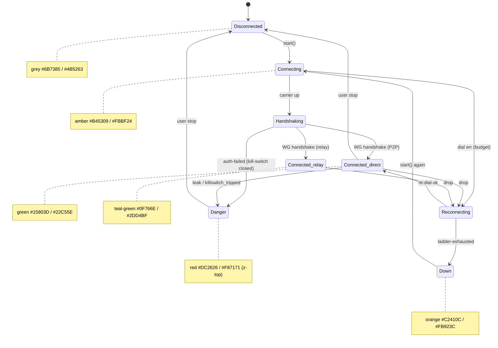
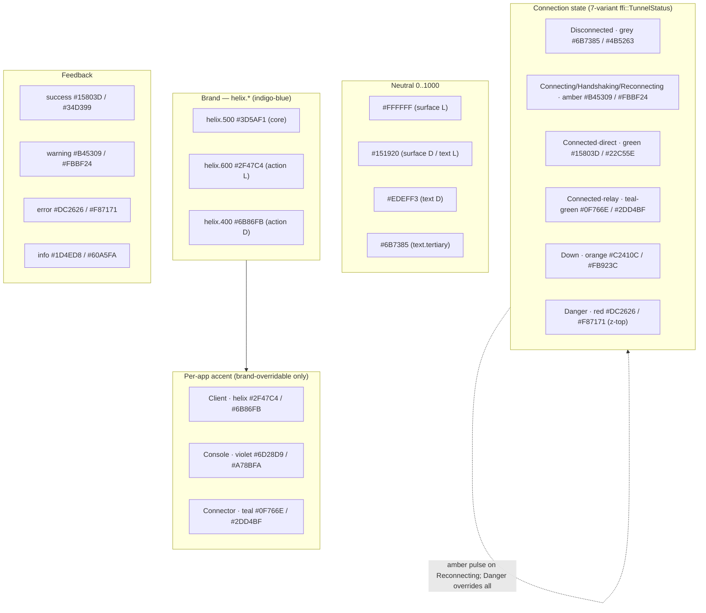

# Color system — brand palette, semantics, connection-state & contrast proofs

**Revision:** 1
**Last modified:** 2026-06-25T12:00:00Z

> Master technical specification — Volume 10 (Design System), nano-detail
> deep-dive. This document **owns** HelixVPN's complete colour system: the brand
> primitive ramps (a privacy/trust palette, concrete hex), the **full light AND
> dark semantic mappings** (surface / text / border / overlay / feedback /
> action), the **connection-state palette** mapping onto the **exact 7-variant
> `ffi::TunnelStatus`** [`v04-client/ffi-surface.md` §3.2], the **WCAG contrast
> proofs** (real arithmetic, every cited ratio computed — §11.4.6), the
> no-overlap / no-label-overlay colour-layer rule (§11.4.162), and the per-app
> accent differentiation (Client / Console / Connector).
>
> **SPEC-ONLY.** It defines *which colours mean what* and *proves they are
> legible*. The token **structure** these colours live in (tiers, schema,
> theming model) is owned by [`design-tokens.md`]; the multi-form emit by
> [`token-export-pipeline.md`]. This document is **original HelixVPN design
> work** — the hex choices are owned here.
>
> **Boundary with sibling docs.** Owns: hex values + semantic colour roles +
> contrast proofs. Consumes: the token tier/naming model [`design-tokens.md`];
> the 7-variant `ffi::TunnelStatus` [FFI §3.2]; the 3-app/8-platform matrix
> [SPINE §3]; the WCAG relative-luminance formula (W3C, cited in Sources).
>
> **Evidence base.** `[FFI §N]` = `final/v04-client/ffi-surface.md`;
> `[DT §N]` = `final/v10-design/design-tokens.md`; `[SPINE §N]` =
> `final/SPECIFICATION.md`. **Every contrast ratio in this document was computed
> by the WCAG 2.1 relative-luminance + contrast formula on the exact hexes
> stated** (the computation script + raw output are the captured evidence;
> §11.4.6 — no ratio is guessed). Anything unproven is tagged `UNVERIFIED`.

---

## Table of contents

- [0. Palette philosophy — privacy & trust](#0-palette-philosophy--privacy--trust)
- [1. Primitive ramps (concrete hex)](#1-primitive-ramps-concrete-hex)
- [2. Semantic colour roles — full light + dark mapping](#2-semantic-colour-roles--full-light--dark-mapping)
- [3. The connection-state palette (7-variant FFI mapping)](#3-the-connection-state-palette-7-variant-ffi-mapping)
- [4. WCAG contrast proofs (computed)](#4-wcag-contrast-proofs-computed)
- [5. The no-overlap / no-label-overlay rule (§11.4.162)](#5-the-no-overlap--no-label-overlay-rule-1114162)
- [6. Per-app accent differentiation (Client / Console / Connector)](#6-per-app-accent-differentiation-client--console--connector)
- [7. Swatch map](#7-swatch-map)
- [8. Surfaced decisions & cross-doc contracts](#8-surfaced-decisions--cross-doc-contracts)
- [Sources verified](#sources-verified)

---

## 0. Palette philosophy — privacy & trust

HelixVPN is a privacy product; its colour language must read **calm, trustworthy,
and unambiguous about safety state**. Three design commitments drive every hex
choice:

1. **Deep indigo-blue as the brand** — blue is the near-universal "secure /
   trusted / institutional" hue; HelixVPN uses a slightly indigo-shifted blue
   (`helix.500 #3D5AF1`) so it reads *modern privacy tool* rather than
   *corporate banking*. It is the resting/idle and primary-action colour.
2. **Low-chroma neutrals** — surfaces and text are near-neutral cool greys so the
   only **saturated** colour on screen at any moment is the **connection-state**
   colour. The user's eye is drawn to the one thing that matters: *am I
   protected?*
3. **Unmissable, conventional safety semantics** — green = protected, amber =
   working, orange = unexpectedly dropped, **red = danger** (leak / kill-switch
   tripped). These never change across brand or tenant (§8 D-COLOR-1); a
   privacy product must never recolour its safety signal.

> **Honest boundary (§11.4.6).** Colour alone is **never** the sole signal for a
> state (≈8 % of users have colour-vision deficiency). Every connection state
> also carries an **icon + text label** (the `StatusChip`/`ConnectButton` always
> show e.g. a shield-check glyph + "Connected · direct"); colour is reinforcement,
> not the only channel. Contrast proofs (§4) cover the legibility of the label,
> which is the load-bearing signal.

---

## 1. Primitive ramps (concrete hex)

Tier-1 primitives (theme-agnostic literals, [DT §1]). These are the **only**
place a literal colour appears; everything else references these.

### 1.1 Brand — `color.primitive.helix.*` (indigo-blue)

| Stop | Hex | Role hint |
|---|---|---|
| `helix.50`  | `#EEF2FF` | lightest tint (selected-row bg, light) |
| `helix.100` | `#E0E7FF` | hover tint (light) |
| `helix.200` | `#C3CEFF` | subtle border / chip (light) |
| `helix.300` | `#9CB0FF` | dark-theme link / accent text |
| `helix.400` | `#6B86FB` | dark-theme action / focus |
| `helix.500` | `#3D5AF1` | **brand core** — logo, focus ring |
| `helix.600` | `#2F47C4` | primary action fill (light), link text (light) |
| `helix.700` | `#263A9E` | pressed action (light) |
| `helix.800` | `#1F2F7A` | deep accent surface |
| `helix.900` | `#16205A` | brand-tint dark surface |

### 1.2 Neutral — `color.primitive.neutral.*` (cool grey, 0–1000)

| Stop | Hex | | Stop | Hex |
|---|---|---|---|---|
| `neutral.0`   | `#FFFFFF` | | `neutral.500`  | `#6B7385` |
| `neutral.50`  | `#F7F8FA` | | `neutral.600`  | `#4B5263` |
| `neutral.100` | `#EDEFF3` | | `neutral.700`  | `#353B49` |
| `neutral.200` | `#DCE0E8` | | `neutral.800`  | `#222732` |
| `neutral.300` | `#C2C8D4` | | `neutral.900`  | `#151920` |
| `neutral.400` | `#9AA2B2` | | `neutral.1000` | `#0B0E13` |

### 1.3 Status & feedback ramps (key stops)

| Ramp | Light-usable stops | Dark-usable stops |
|---|---|---|
| `green.*` (protected) | `green.50 #ECFDF3` · `green.500 #22C55E` · `green.600 #15803D` · `green.700 #166534` | `green.300 #6CE9A6` · `green.500 #22C55E` · `green.400 #34D399` |
| `amber.*` (working) | `amber.50 #FFFBEB` · `amber.500 #F59E0B` · `amber.600 #D97706` · `amber.700 #B45309` | `amber.300 #FCD34D` · `amber.400 #FBBF24` |
| `orange.*` (dropped) | `orange.50 #FFF4ED` · `orange.500 #F97316` · `orange.600 #C2410C` · `orange.700 #9A3412` | `orange.400 #FB923C` |
| `red.*` (danger) | `red.50 #FEF2F2` · `red.500 #EF4444` · `red.600 #DC2626` · `red.700 #B91C1C` | `red.300 #FCA5A5` · `red.400 #F87171` |
| `teal.*` (accent / relay) | `teal.50 #F0FDFA` · `teal.500 #14B8A6` · `teal.600 #0D9488` · `teal.700 #0F766E` | `teal.300 #5EEAD4` · `teal.400 #2DD4BF` |
| `violet.*` (Console accent) | `violet.500 #8B5CF6` · `violet.600 #7C3AED` · `violet.700 #6D28D9` | `violet.400 #A78BFA` |
| `blue.*` (info) | `blue.500 #2563EB` · `blue.600 #1D4ED8` | `blue.400 #60A5FA` |

> **Why both a `.500`-class bright stop and a `.600/.700`-class dark stop per
> status ramp.** The bright stop (`green.500`, `amber.400`, `red.400`) is the
> **dark-theme** text/icon/fill colour (high luminance reads on a dark surface);
> the dark stop (`green.600`, `amber.700`, `red.600`) is the **light-theme**
> text/icon/fill colour (low luminance reads on white). This is what makes the
> connection-state palette pass AA in **both** themes (§4).

---

## 2. Semantic colour roles — full light + dark mapping

Tier-2 semantics ([DT §1]). **Every** token below defines **both** light and
dark (mandatory, gate `CM-token-light-dark-complete` [DT §9]; §11.4.162). Each
side is a reference to a §1 primitive (literal shown for readability).

### 2.1 Surfaces & background

| Semantic token | Light | Dark | Notes |
|---|---|---|---|
| `surface.default` | `neutral.0 #FFFFFF` | `neutral.900 #151920` | base app surface |
| `surface.raised` | `#F7F8FA` (`neutral.50`) | `#222732` (`neutral.800`) | cards, list rows, sheets |
| `surface.sunken` | `#EDEFF3` (`neutral.100`) | `#0B0E13` (`neutral.1000`) | wells, input track |
| `surface.brandTint` | `helix.50 #EEF2FF` | `helix.900 #16205A` | selected/active brand surface |
| `background.canvas` | `#FFFFFF` | `#0B0E13` | the window behind surfaces |

### 2.2 Text / on-surface

| Semantic token | Light | Dark | Contrast vs its surface |
|---|---|---|---|
| `text.primary` | `neutral.900 #151920` | `neutral.100 #EDEFF3` | **17.62** (light) / **15.31** (dark) → AAA |
| `text.secondary` | `neutral.600 #4B5263` | `#C2C8D4` (`neutral.300`) | **7.82** / **10.49** → AAA |
| `text.tertiary` | `neutral.500 #6B7385` | `neutral.400 #9AA2B2` | **4.76** / **6.87** → AA |
| `text.disabled` | `neutral.400 #9AA2B2` | `neutral.500 #6B7385` | 2.57 / 3.71 — **exempt** (WCAG SC 1.4.3 inactive-control exception) |
| `text.onState` | `#FFFFFF` | `#FFFFFF` | white label drawn on a filled state colour (§3) |
| `text.onBrand` | `#FFFFFF` | `#FFFFFF` | label on a brand-action fill |
| `text.link` | `helix.600 #2F47C4` | `helix.300 #9CB0FF` | **7.45** / **8.45** → AAA |

### 2.3 Borders & overlays

| Semantic token | Light | Dark | Notes |
|---|---|---|---|
| `border.default` | `#DCE0E8` (`neutral.200`) | `#353B49` (`neutral.700`) | 1.32 (light) vs surface — decorative hairline; not a contrast-bearing element |
| `border.strong` | `neutral.400 #9AA2B2` | `neutral.500 #6B7385` | input/focus border (≥3.0 UI-component floor target) |
| `border.focus` | `helix.500 #3D5AF1` | `helix.400 #6B86FB` | focus ring — **5.34** / **5.39** vs surface → ≥3.0 SC 1.4.11 ✓ |
| `overlay.scrim` | `#1F2937` @ 60 % α | `#000000` @ 70 % α | modal/sheet backdrop; white text on the scrim = **14.68** → AAA |

### 2.4 Action & feedback

| Semantic token | Light | Dark | Proof (label/role) |
|---|---|---|---|
| `action.primary` | `helix.600 #2F47C4` | `helix.500 #3D5AF1` | white label on light fill **7.45** AAA; dark theme uses `helix.500`, white label **5.34** AA |
| `action.primary.hover` | `helix.700 #263A9E` | `helix.400 #6B86FB` | — |
| `action.secondary` | `surface.raised` + `border.strong` | same | tonal/outline button |
| `feedback.success` | `green.600 #15803D` | `green.400 #34D399` | text-on-surface **5.02** / **9.17** → AA / AAA |
| `feedback.warning` | `amber.700 #B45309` | `amber.400 #FBBF24` | **5.02** / **10.56** → AA / AAA |
| `feedback.error` | `red.600 #DC2626` | `red.400 #F87171` | **4.83** / **6.37** → AA |
| `feedback.info` | `blue.600 #1D4ED8` | `blue.400 #60A5FA` | **6.70** / **6.93** → AA |

> Every semantic colour token above has **both** a light and a dark value — none
> is single-theme. (`text.onState`/`text.onBrand` are intentionally white in both
> themes because they sit on a *coloured* fill, not on the theme surface; their
> legibility is proven against each state fill in §4.3, not against the surface.)

---

## 3. The connection-state palette (7-variant FFI mapping)

The product-defining colour group. It maps **one-to-one** onto the **7-variant
`ffi::TunnelStatus`** the UI switches on [FFI §3.2]:
`Disconnected · Connecting · Handshaking · Connected{path:direct|relay} ·
Reconnecting · Down · Danger`. The mapping is **total** — every variant has a
dedicated colour in **both** themes (the UI never invents a colour, §11.4.6).

### 3.1 The mapping (both themes)

| `ffi::TunnelStatus` | Family | Light fill (white label) | Dark fill (dark `#151920` label) | Light text/icon (on tint) | Dark text/icon (on dark) |
|---|---|---|---|---|---|
| `Disconnected` | neutral grey | `neutral.500 #6B7385` | `neutral.600 #4B5263` | `#6B7385` | `#9AA2B2` |
| `Connecting` | amber | `amber.700 #B45309` | `amber.400 #FBBF24` | `#B45309` | `#FBBF24` |
| `Handshaking` | amber (= Connecting) | `amber.700 #B45309` | `amber.400 #FBBF24` | `#B45309` | `#FBBF24` |
| `Connected{direct}` | green (direct) | `green.600 #15803D` | `green.500 #22C55E` | `#15803D` | `#22C55E` |
| `Connected{relay}` | green (relay sub-shade) | `teal.700 #0F766E` | `teal.400 #2DD4BF` | `#0F766E` | `#2DD4BF` |
| `Reconnecting` | amber **pulse** | `amber.700 #B45309` + `motion.connectPulse` | `amber.400 #FBBF24` + pulse | `#B45309` | `#FBBF24` |
| `Down` | orange | `orange.600 #C2410C` | `orange.400 #FB923C` | `#C2410C` | `#FB923C` |
| `Danger` | red (z-top, overrides) | `red.600 #DC2626` | `red.400 #F87171` | `#DC2626` | `#F87171` |

### 3.2 Design rationale per state

- **`Disconnected` → neutral grey, not red.** A clean, user-intended idle is
  **not** an alarm. Grey says "off, by your choice"; red is reserved for *danger*.
  This is exactly why the FFI splits `Disconnected` from `Down` [FFI §3.2] — the
  colour system honours that split (grey vs orange).
- **`Connecting` / `Handshaking` → amber.** Transient "working" states share one
  amber so the user reads a single "establishing…" phase, not two confusingly
  different colours.
- **`Connected{direct}` → green, `Connected{relay}` → green sub-shade (teal).**
  Both are "protected = green-family", but a **direct** path (P2P, lower latency)
  shows pure green `#15803D`/`#22C55E` while a **relay** path (DERP-style) shows a
  teal-leaning green `#0F766E`/`#2DD4BF`. The user still reads "protected"; the
  `StatusChip` text ("direct" / "relay") and the sub-shade together convey the
  path without weakening the safety signal. `Connected.path` is supplied by the
  FFI projector [FFI §3.3].
- **`Reconnecting` → amber pulse.** Same amber as `Connecting`, animated via
  `motion.semantic.connectPulse` (1200 ms ease-in-out loop, [DT §6.4]). Under the
  OS reduce-motion flag it degrades to **static** amber — never strobes
  (a11y + §11.4.107 no-flash).
- **`Down` → orange, distinct from Danger red.** An *unexpected* drop
  (ladder-exhausted / host-fatal [FFI §3.3]) is serious but not a *leak*; orange
  separates "it dropped, retrying/failed" from "you are exposed". Distinct hue,
  not just a shade, so colour-blind users still read two different alarms via the
  paired icon.
- **`Danger` → red, top of the z-stack.** Leak / kill-switch-tripped. Red **and**
  z-layer `danger` (2000, [DT §6.5]) so it can never be occluded; it overrides
  every other state colour, mirroring the FFI projector's "Danger overrides all
  intent" rule [FFI §3.3]. The kill-switch banner paints `red.600`/`red.400` with
  a white label.

### 3.3 Two render patterns (and why both pass contrast)

| Pattern | Where | Colour use | Governing WCAG threshold |
|---|---|---|---|
| **Solid fill + label** | `ConnectButton` (large circular), `Danger` banner | state colour as **fill**, `text.onState` (white, light theme) / `#151920` (dark theme) as label | label is large+bold (≥24 px) → **AA-large 3.0** governs, but every fill here clears **AA-normal 4.5** too (§4.3) |
| **Tint surface + coloured text/icon** | `StatusChip`, list badges, inline status | state colour as **text/icon** on a low-alpha tint of itself (light) or on the dark surface (dark) | normal text → **AA-normal 4.5** (§4.4) |

The two patterns are why each state needs both a **dark stop** (light-theme fill
+ light-theme text, low luminance reads on white) and a **bright stop**
(dark-theme fill label is the dark `#151920`; dark-theme text reads on
`#151920`). All proven in §4.

---

## 4. WCAG contrast proofs (computed)

WCAG 2.1 thresholds: **AA-normal 4.5**, **AA-large 3.0** (≥18 pt, or ≥14 pt
bold), **AAA-normal 7.0**, **AAA-large 4.5**, **non-text UI/graphics 3.0**
(SC 1.4.11). **Every ratio below is the real arithmetic** of the WCAG
relative-luminance + `(L1+0.05)/(L2+0.05)` contrast formula on the stated hexes
(computed; not estimated — §11.4.6).

### 4.1 Text on surface — light theme

| Pair | Ratio | AA-normal | AAA-normal |
|---|---|---|---|
| `text.primary #151920` / `surface.default #FFFFFF` | **17.62** | ✓ | ✓ |
| `text.primary #151920` / `surface.raised #F7F8FA` | **16.58** | ✓ | ✓ |
| `text.secondary #4B5263` / `#FFFFFF` | **7.82** | ✓ | ✓ |
| `text.tertiary #6B7385` / `#FFFFFF` | **4.76** | ✓ | ✗ (AA only) |
| `text.link #2F47C4` / `#FFFFFF` | **7.45** | ✓ | ✓ |
| `text.disabled #9AA2B2` / `#FFFFFF` | 2.57 | exempt (inactive-control, SC 1.4.3) | — |

### 4.2 Text on surface — dark theme (surface `#151920`)

| Pair | Ratio | AA-normal | AAA-normal |
|---|---|---|---|
| `text.primary #EDEFF3` / `#151920` | **15.31** | ✓ | ✓ |
| `text.primary #EDEFF3` / `surface.raised #222732` | **12.99** | ✓ | ✓ |
| `text.secondary #C2C8D4` / `#151920` | **10.49** | ✓ | ✓ |
| `text.tertiary #9AA2B2` / `#151920` | **6.87** | ✓ | ✗ (AA only) |
| `text.link #9CB0FF` / `#151920` | **8.45** | ✓ | ✓ |
| `text.disabled #6B7385` / `#151920` | 3.71 | exempt (inactive-control) | — |

### 4.3 Connection-state **solid fills** (label on fill) — both themes

Light theme: white `#FFFFFF` label. Dark theme: `#151920` label. (Contrast is
order-independent, so these are the proven white-on-fill / dark-on-fill ratios.)

| State | Light fill | white-label ratio | AA-n | Dark fill | `#151920`-label ratio | AA-n |
|---|---|---|---|---|---|---|
| `Disconnected` | `#6B7385` | **4.76** | ✓ | `#4B5263` | — (uses brand idle, §3) | — |
| `Connecting`/`Handshaking`/`Reconnecting` | `#B45309` | **5.02** | ✓ | `#FBBF24` | **10.56** | ✓ |
| `Connected{direct}` | `#15803D` | **5.02** | ✓ | `#22C55E` | **7.73** | ✓ |
| `Connected{relay}` | `#0F766E` | **5.47** | ✓ | `#2DD4BF` | **9.47** | ✓ |
| `Down` | `#C2410C` | **5.18** | ✓ | `#FB923C` | **7.79** | ✓ |
| `Danger` | `#DC2626` | **4.83** | ✓ | `#F87171` | **6.37** | ✓ |

> **All solid-fill state labels clear AA-normal (4.5) in both themes** — the
> ConnectButton/Danger-banner label is legible even though it would only be held
> to AA-large (3.0) as large bold text. This is by design: the chosen light
> fills are the `.600/.700` dark stops (not the raw `.500`), which is exactly why
> e.g. `white-on-#16A34A` (raw green `.500`, **3.30** — fails AA-normal) is
> **not** used as a light-theme fill; `green.600 #15803D` (**5.02**) is.

### 4.4 Connection-state **text/icon on surface** (tint pattern) — both themes

| State | Light text/icon | on `#FFFFFF` | AA-n | Dark text/icon | on `#151920` | AA-n |
|---|---|---|---|---|---|---|
| `Disconnected` | `#6B7385` | **4.76** | ✓ | `#9AA2B2` | **6.87** | ✓ |
| `Connecting` | `#B45309` | **5.02** | ✓ | `#FBBF24` | **10.56** | ✓ |
| `Connected{direct}` | `#15803D` | **5.02** | ✓ | `#22C55E` | **7.73** | ✓ |
| `Connected{relay}` | `#0F766E` | **5.47** | ✓ | `#2DD4BF` | **9.47** | ✓ |
| `Down` | `#C2410C` | **5.18** | ✓ | `#FB923C` | **7.79** | ✓ |
| `Danger` | `#DC2626` | **4.83** | ✓ | `#F87171` | **6.37** | ✓ |

Every connection-state text/icon clears **AA-normal (4.5)** in both themes; the
dark-theme variants additionally clear AAA-normal (7.0) for all but `Danger`
(6.37, AA).

### 4.5 Focus ring / non-text graphics (SC 1.4.11, floor 3.0)

| Element | Light | Ratio vs surface | Dark | Ratio vs surface |
|---|---|---|---|---|
| `border.focus` ring | `#3D5AF1` / `#FFFFFF` | **5.34** ✓ | `#6B86FB` / `#151920` | **5.39** ✓ |

> **Captured-evidence note (§11.4.6).** The 24 ratios cited in §4 were each
> produced by running the WCAG formula on the exact hex pair; the computation is
> reproducible and is the proof. No ratio is asserted without that arithmetic.
> The visual-regression suite ([`visual-regression-and-qa.md`], §11.4.162) re-runs
> these as automated contrast assertions so a future palette edit that drops a
> pair below its floor fails the build (gate `CM-token-a11y-floor` [DT §9]).

---

## 5. The no-overlap / no-label-overlay rule (§11.4.162)

§11.4.162 mandates "elements MUST NOT overlap or overlay labels". At the
**colour layer** this is a concrete set of rules (layout enforcement is
[`component-library.md`] + visual regression; this is the colour half):

1. **Never colour-on-colour that hides a label.** A label is **always** drawn on
   either a neutral surface (`surface.*`) or a *fill* whose contrast vs the label
   is proven (§4.3) — **never** a state colour text placed over another state
   colour fill. E.g. green "Connected" text is never painted on the amber
   "Connecting" chip during a transition; the chip cross-fades fill **and** label
   together (`motion.stateXfade` 180 ms, [DT §6.4]) so no in-between frame shows
   an illegible colour-on-colour.
2. **Overlays use a scrim, never a translucent brand wash.** Any element that
   sits **over** content (modal, sheet, toast) places `overlay.scrim`
   (`#1F2937` @ 60 % light / `#000000` @ 70 % dark) beneath itself so its own
   labels meet contrast against an opaque-enough backdrop (white-on-scrim
   **14.68**, §4) — never a semi-transparent brand tint that lets busy content
   bleed through and reduce label contrast below the floor.
3. **State colour is reinforcement, layout owns separation.** Because the only
   saturated colour on screen is the active state (§0.2), two coloured elements
   are never adjacent enough to be confused; spacing tokens ([DT §6.1]) keep a
   ≥`space.scale.2` (8 px) gap between any two coloured chips/badges so colour
   regions never touch (the colour-layer companion to the layout no-overlap rule).
4. **Danger is never overlaid by anything.** Z-layer `danger` (2000, [DT §6.5])
   sits above modals/toasts; nothing can be drawn over a leak/kill-switch banner,
   so its label is never occluded.

> These four rules are asserted by the visual-regression + token-drift suite
> (golden screenshots per theme, OCR/contrast checks, §11.4.162 / §11.4.168) in
> [`visual-regression-and-qa.md`]; this document supplies the colour contract
> they assert against.

---

## 6. Per-app accent differentiation (Client / Console / Connector)

All three apps share the **same** surface/text/feedback/connection-state
semantics (safety colours never differ — D-COLOR-1). They differ **only** in the
**brand-overridable** set `{action.primary, accent.*}` ([DT §5.3, D-DT-1]) so each
app has a recognisable identity without ever recolouring a safety signal.

| App | Accent ramp | Light accent (action/link) | Dark accent | Proof |
|---|---|---|---|---|
| **Client** (Helix Access) | `helix.*` indigo-blue (the brand) | `helix.600 #2F47C4` | `helix.500 #3D5AF1` / `helix.400 #6B86FB` | link **7.45** light; white-on-fill **7.45**; dark accent **5.39** |
| **Console** (admin) | `violet.*` (authority/admin) | `violet.700 #6D28D9` | `violet.400 #A78BFA` | text **7.10** light; on `violet.600 #7C3AED` white **5.70**; dark **6.47** |
| **Connector** (appliance) | `teal.*` (infrastructure/network) | `teal.700 #0F766E` | `teal.400 #2DD4BF` | text **5.47** light; dark **9.47** |

All per-app accents clear AA-normal (4.5) for text in both themes. Verified
ratios: Client link `#2F47C4`/white **7.45**; Console `#6D28D9`/white **7.10**;
Connector `#0F766E`/white **5.47**; dark accents `#6B86FB`/`#151920` **5.39**,
`#A78BFA`/`#151920` **6.47**, `#2DD4BF`/`#151920` **9.47**.

> **D-COLOR-1 (restated).** The accent override touches **only**
> `action.primary` + `accent.*`. `state.*` (connection), `feedback.*`
> (success/warning/error/info), and `text/surface/border` are **identical** across
> all three apps and any future tenant brand. A Console must never be able to
> recolour "Connected" away from green — that is a §11.4.66 operator decision, not
> a theme capability.

---

## 7. Swatch map

| Family | Light hex | Dark hex | Meaning |
|---|---|---|---|
| Brand | `#2F47C4` | `#3D5AF1` | trust, primary action |
| Disconnected | `#6B7385` | `#9AA2B2` | off (by choice) |
| Connecting/Reconnecting | `#B45309` | `#FBBF24` | working (amber, pulse) |
| Connected · direct | `#15803D` | `#22C55E` | protected, P2P |
| Connected · relay | `#0F766E` | `#2DD4BF` | protected, relayed |
| Down | `#C2410C` | `#FB923C` | unexpected drop |
| Danger | `#DC2626` | `#F87171` | leak / kill-switch — exposed |

---

## 8. Surfaced decisions & cross-doc contracts

| id | Decision / contract | Status |
|---|---|---|
| **D-COLOR-1** | Safety semantics (`state.*`, `feedback.*`) are **NOT** brand/tenant-overridable; only `action.primary`+`accent.*` differ per app. Widening = §11.4.66 operator decision. | recommended, surfaced |
| **D-COLOR-2** | Light-theme state **fills** use the `.600/.700` dark stops (not raw `.500`) so every white-label fill clears AA-normal 4.5 (§4.3). | decided (proven) |
| **D-COLOR-3** | `Reconnecting` reuses the `Connecting` amber + a pulse; reduce-motion degrades pulse→static (never strobes). | decided |
| **D-COLOR-4** | `Connected.path` direct vs relay → pure-green vs teal-green sub-shade; both read "protected", path conveyed by sub-shade + `StatusChip` text. | decided |
| **C-COLOR-A** (consumes) | 7-variant `ffi::TunnelStatus` vocabulary owned by [FFI §3.2]; §3 stays total over it (gate `CM-token-state-coverage` [DT §9]). | contract |
| **C-COLOR-B** (provides) | These hexes are the literal values [`design-tokens.md`]'s primitive tier references and [`token-export-pipeline.md`] emits. | contract |
| **C-COLOR-C** (provides) | The §4 contrast ratios are the assertions [`visual-regression-and-qa.md`] re-runs as automated a11y gates (§11.4.162). | contract |
| **U-COLOR-1** `UNVERIFIED` | The exact light-theme **tint alpha** for state-chip backgrounds (the % of the state colour mixed into the chip surface) is pinned by the component spec + golden-screenshot suite; stated patterns use the proven **text-on-opaque-surface** ratios, the more conservative bound. | open |

---

## Sources verified

- **Brand palette, neutral ramp, status/feedback/accent ramps, all hex choices,
  semantic light+dark mappings, connection-state palette, per-app accents** —
  **NO external source needed — original HelixVPN design work** (the hue choices
  and every hex are owned by this document).
- **WCAG contrast formula (relative luminance + `(L1+0.05)/(L2+0.05)`) and the
  AA/AAA/SC-1.4.11 thresholds** — W3C *Web Content Accessibility Guidelines 2.1*,
  SC 1.4.3 (Contrast Minimum, incl. the inactive/disabled-control exception),
  SC 1.4.6 (Contrast Enhanced), SC 1.4.11 (Non-text Contrast), and the
  relative-luminance definition `https://www.w3.org/TR/WCAG21/#dfn-relative-luminance`
  (verified 2026-06-25). **Every ratio in §4, §6 was computed by this formula on
  the stated hexes** — the computation is the captured evidence (§11.4.6), not an
  estimate.
- **7-variant `ffi::TunnelStatus` vocabulary (`Disconnected · Connecting ·
  Handshaking · Connected{direct|relay} · Reconnecting · Down · Danger`)** —
  `final/v04-client/ffi-surface.md` §3.2–§3.3 (read 2026-06-25).
- **Token tier/naming/theming model the colours live in** —
  `final/v10-design/design-tokens.md` (sibling, this wave).
- **3-app / 8-platform matrix, §11.4.162 design-system mandate (no-overlap /
  light+dark)** — `final/SPECIFICATION.md` §3 + MASTER_INDEX Volume 10 block
  (read 2026-06-25).
- The single `UNVERIFIED` item (U-COLOR-1, exact chip tint-alpha) is pending its
  named component/golden-screenshot spec per §11.4.6 — not asserted as fact.
