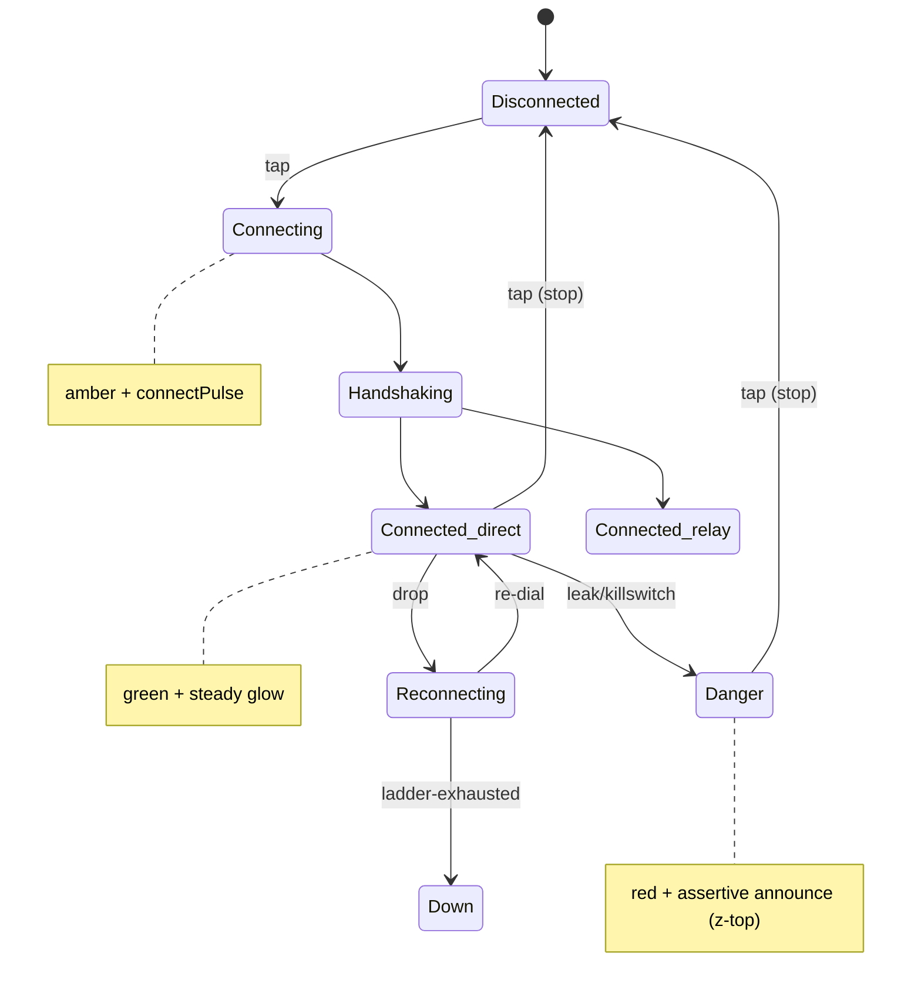
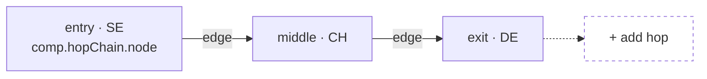

# Component library — the canonical reusable component catalog

**Revision:** 2
**Last modified:** 2026-07-04T12:00:00Z

> Master technical specification — Volume 10 (Design System), nano-detail
> deep-dive. This document **owns** HelixVPN's complete reusable **component
> library** — every component the `helix_design` submodule ships, used across
> the three apps (Client, Console, Connector) and eight platforms. For **every**
> component it specifies: purpose; anatomy (parts); the full state set; variants
> and sizes; the exact **component tokens** it consumes (cited against the
> `comp.<component>.<part>.<state>` naming owned by [`design-tokens.md`]);
> accessibility (roles, focus order, contrast floor, ≥44 px hit target,
> screen-reader labels); **light + dark** rendering; the **no-overlap /
> no-label-overlay** guarantee (§11.4.162); and an ASCII or Mermaid sketch.
>
> **SPEC-ONLY.** It describes *what each component is and how it behaves* — not
> the shipping `helix_design`/`helix_ui` build. Concrete token **values** live
> in [`color-system.md`] (hex + contrast) and [`design-tokens.md`] (scales,
> schema); this doc describes which **slots** each component has and which
> tokens fill them.
>
> **Position.** `helix_design` is a fully decoupled, reusable submodule
> (`vasic-digital/helix_design`, snake_case flat per §11.4.28/.29/.74) that
> configures **OpenDesign** (the mandatory token/theme engine, §11.4.162). Each
> component here is **OpenDesign-token-driven, decoupled, reusable**, ships a
> **light AND dark** variant, and is covered by visual-regression tests
> ([`visual-regression-and-qa.md`], §11.4.162/.168). No component hard-codes a
> colour, length, or duration — every value is a token reference.
>
> **Boundary with sibling docs.** Owns: the component catalog (anatomy, states,
> slots, a11y, sketches). Consumes: the 3-tier token model + `comp.*` naming
> [`design-tokens.md` §1, §2, §7]; the colour roles + connection-state palette
> + contrast proofs [`color-system.md` §2, §3, §4]; the **7-variant
> `ffi::TunnelStatus`** the `ConnectButton`/`StatusChip` render
> [`v04-client/ffi-surface.md` §3.2]; the `Shields`/`ExitOption` DTOs
> [FFI §2]; the client UI overview [04_CLIENT §7]. Layout/screen composition is
> [`screens-client.md`]/[`screens-console.md`]; per-platform adaptation is
> [`platform-adaptation.md`]; type/icon scales are
> [`typography-iconography-motion.md`].
>
> **Evidence base.** `[DT §N]` = `final/v10-design/design-tokens.md`;
> `[COLOR §N]` = `final/v10-design/color-system.md`; `[FFI §N]` =
> `final/v04-client/ffi-surface.md`; `[04_CLIENT §N]` =
> `final/03-client-core-and-ui.md`; `[SPINE §N]` = `final/SPECIFICATION.md`.
> The component catalog itself is **original HelixVPN design work** (modeled on
> the well-established headless-component / WAI-ARIA-Authoring-Practices pattern,
> cited in Sources). Claims not grounded in the evidence base or in this
> document's own design choices are tagged `UNVERIFIED` per §11.4.6 — never
> fabricated.

---

## Table of contents

- [0. Component inventory](#0-component-inventory)
- [1. Cross-cutting conventions](#1-cross-cutting-conventions)
  - [1.1 Anatomy vocabulary](#11-anatomy-vocabulary)
  - [1.2 The universal interactive-state model](#12-the-universal-interactive-state-model)
  - [1.3 Accessibility baseline (every component)](#13-accessibility-baseline-every-component)
  - [1.4 Light + dark by construction](#14-light--dark-by-construction)
  - [1.5 The no-overlap / no-label-overlay guarantee](#15-the-no-overlap--no-label-overlay-guarantee)
  - [1.6 Size & density](#16-size--density)
- [2. ConnectButton — the hero](#2-connectbutton--the-hero)
- [3. StatusChip](#3-statuschip)
- [4. Exit & server family](#4-exit--server-family)
  - [4.1 ServerListItem](#41-serverlistitem)
  - [4.2 ServerList](#42-serverlist)
  - [4.3 ExitPicker](#43-exitpicker)
- [5. ShieldToggle](#5-shieldtoggle)
- [6. MultiHopChainEditor](#6-multihopchaineditor)
- [7. PeerCard / DeviceListItem](#7-peercard--devicelistitem)
- [8. PolicyEditor primitives](#8-policyeditor-primitives)
- [9. TopologyGraph](#9-topologygraph)
- [10. AuditLogRow](#10-auditlogrow)
- [11. Foundational components](#11-foundational-components)
  - [11.1 Button family](#111-button-family)
  - [11.2 TextField & form fields](#112-textfield--form-fields)
  - [11.3 Toggle / Switch](#113-toggle--switch)
  - [11.4 Checkbox & Radio](#114-checkbox--radio)
  - [11.5 Dropdown / Select](#115-dropdown--select)
  - [11.6 Dialog / Sheet / Modal](#116-dialog--sheet--modal)
  - [11.7 Snackbar / Toast](#117-snackbar--toast)
  - [11.8 Banner / Alert (incl. the Danger banner)](#118-banner--alert-incl-the-danger-banner)
  - [11.9 Tabs](#119-tabs)
  - [11.10 NavRail / BottomNav / Drawer](#1110-navrail--bottomnav--drawer)
  - [11.11 Card](#1111-card)
  - [11.12 ListTile](#1112-listtile)
  - [11.13 Badge](#1113-badge)
  - [11.14 Tooltip](#1114-tooltip)
  - [11.15 ProgressIndicator (loading vs connecting)](#1115-progressindicator-loading-vs-connecting)
  - [11.16 EmptyState](#1116-emptystate)
  - [11.17 Skeleton](#1117-skeleton)
- [12. Surfaced decisions & cross-doc contracts](#12-surfaced-decisions--cross-doc-contracts)
- [Sources verified](#sources-verified)

---

## 0. Component inventory

The canonical catalog. **Component** = the reusable widget; **Used-by** =
which of the three apps render it (C = Client, K = Console, N = Connector);
**Key states** = the load-bearing states (full sets in each section);
**Tokens** = the root component-token namespace it owns (`comp.<name>.*`,
[DT §2, §7]).

| Component | Used-by | Key states | Token root |
|---|---|---|---|
| **ConnectButton** | C | Disconnected · Connecting · Handshaking · Connected{direct\|relay} · Reconnecting · Down · Danger (× hover/pressed/focus/disabled) | `comp.connectButton.*` |
| **StatusChip** | C, N | transport-kind × path(direct\|relay) × rtt-band; idle / connecting / down / danger | `comp.statusChip.*` |
| **ServerListItem** | C, K | default · hover · pressed · selected · focused · disabled · favourite · loading-rtt | `comp.serverListItem.*` |
| **ServerList** | C, K | populated · filtered · empty · loading(skeleton) · error | `comp.serverList.*` |
| **ExitPicker** | C | closed · open · searching · multihop-chain · selected | `comp.exitPicker.*` |
| **ShieldToggle** | C, N | off · on · pending · disabled · locked-by-policy | `comp.shieldToggle.*` |
| **MultiHopChainEditor** | C, K | 1-hop · 2-hop · add-hop · reorder · invalid-chain | `comp.hopChain.*` |
| **PeerCard / DeviceListItem** | K, N | online · idle · offline · expiring-key · revoked · pending-approval | `comp.peerCard.*` |
| **PolicyEditor primitives** (RuleRow, AllowDenyToggle, TargetPicker) | K | allow · deny · draft · conflict · disabled | `comp.policyRule.*` |
| **TopologyGraph** (node, edge) | K | node{healthy\|degraded\|down\|selected} · edge{direct\|relay\|blocked} | `comp.topology.*` |
| **AuditLogRow** | K | info · success · warn · error · security; expanded · selected | `comp.auditRow.*` |
| **Button** (primary/secondary/text/danger) | C, K, N | enabled · hover · pressed · focus · disabled · loading | `comp.button.*` |
| **TextField / FormField** | C, K, N | empty · focused · filled · error · disabled · readonly | `comp.field.*` |
| **Toggle/Switch** | C, K, N | off · on · focus · disabled | `comp.switch.*` |
| **Checkbox / Radio** | C, K, N | unchecked · checked · indeterminate(cb) · focus · disabled | `comp.checkbox.*` / `comp.radio.*` |
| **Dropdown / Select** | C, K, N | closed · open · option{hover\|selected\|disabled} · focus | `comp.select.*` |
| **Dialog / Sheet / Modal** | C, K, N | enter · shown · exit · scrim | `comp.dialog.*` |
| **Snackbar / Toast** | C, K, N | info · success · warn · error; entering · shown · leaving | `comp.toast.*` |
| **Banner / Alert** (incl. **Danger banner**) | C, K, N | info · success · warning · error · **danger** | `comp.banner.*` |
| **Tabs** | C, K, N | tab{default\|selected\|hover\|focus\|disabled} | `comp.tabs.*` |
| **NavRail / BottomNav / Drawer** | C, K, N | item{default\|selected\|hover\|focus} · collapsed/expanded | `comp.nav.*` |
| **Card** | C, K, N | default · interactive(hover/pressed) · selected · disabled | `comp.card.*` |
| **ListTile** | C, K, N | default · hover · pressed · selected · disabled | `comp.listTile.*` |
| **Badge** | C, K, N | neutral · info · success · warning · error · count | `comp.badge.*` |
| **Tooltip** | C, K, N | hidden · shown | `comp.tooltip.*` |
| **ProgressIndicator** | C, K, N | **loading** (indeterminate spinner) · **connecting** (state pulse) · determinate(bar) | `comp.progress.*` |
| **EmptyState** | C, K, N | empty · empty-filtered · error | `comp.emptyState.*` |
| **Skeleton** | C, K, N | shimmer · static (reduce-motion) | `comp.skeleton.*` |

> Every row ships **light + dark** variants and is covered by a per-theme
> golden-screenshot in the visual-regression suite ([`visual-regression-and-qa.md`],
> §11.4.162). A new component MUST appear in this table before it ships
> (the table is the catalog source-of-truth; the gate `CM-component-inventory`
> in [`visual-regression-and-qa.md`] asserts every `comp.*` root has a row).

---

## 1. Cross-cutting conventions

These conventions apply to **every** component and are stated once here so each
component section can reference them instead of repeating.

### 1.1 Anatomy vocabulary

Each component is described by its **parts** (the named, addressable sub-slots a
component token can target). The shared part vocabulary:

| Part | Meaning | Typical token leaf |
|---|---|---|
| `container` / `bg` | the component's background fill | `comp.<c>.bg[.<state>]` |
| `surface` | a raised inner surface (card body) | `comp.<c>.surface` |
| `border` | the outline / hairline | `comp.<c>.border[.<state>]` |
| `label` | the primary text | `comp.<c>.label[.<state>]` |
| `supporting` | secondary/caption text | `comp.<c>.supporting` |
| `icon` / `leading` / `trailing` | glyph slots | `comp.<c>.icon[.<state>]` |
| `focusRing` | the keyboard-focus indicator | `comp.<c>.focusRing` (= `color.semantic.border.focus`) |
| `ripple` / `overlay` | the press/hover state overlay | `comp.<c>.overlay.<hover\|pressed>` |
| `radius` / `padX` / `padY` / `gap` | shape & spacing | `comp.<c>.radius`, `…padX`, `…gap` |

### 1.2 The universal interactive-state model

Every interactive component resolves a **base** appearance modulated by an
**interaction layer** (a translucent overlay token), so states compose without
re-declaring colours:

```
final = base(component, semantic-state) ⊕ interaction-overlay(hover|pressed|focus|disabled)
```

| Interaction | Overlay token | Effect |
|---|---|---|
| `default` | none | base |
| `hover` | `comp.<c>.overlay.hover` (≈ on-surface @ 8 % α) | subtle lighten/darken |
| `pressed` | `comp.<c>.overlay.pressed` (≈ on-surface @ 12 % α) + `motion.semantic.press` (100 ms) | press feedback |
| `focus` (keyboard) | `comp.<c>.focusRing` = `border.focus` (2 px, ≥3.0 contrast, [COLOR §4.5]) | always-visible ring |
| `disabled` | base at reduced opacity (`opacity.semantic.disabled` ≈ 0.38) + no overlay, pointer-events off | inert |
| `loading` | base + `comp.progress.spinner` replacing the label/icon, `aria-busy=true` | busy |

Focus is **never** conveyed by colour alone — the ring is a 2 px outline offset
from the container so it is visible against any state fill (`focusRing` clears
the 3.0 non-text floor in both themes, [COLOR §4.5]).

### 1.3 Accessibility baseline (every component)

- **Role** — each component declares an explicit ARIA/semantics role (stated per
  section). Flutter `Semantics` widgets carry the equivalent on iOS/Android/
  desktop; web emits the ARIA role; HarmonyOS/Aurora map to their a11y trees.
- **Name** — every interactive element has a non-empty accessible name (from
  visible label, or `semanticLabel` when icon-only). Icon-only controls MUST
  supply an explicit label (e.g. ConnectButton announces "Connect" / "Connected,
  direct path, 28 ms").
- **Focus order** — logical, follows reading order (top→bottom, leading→trailing);
  modals trap focus; `Esc` closes dismissibles; tab order never jumps.
- **Hit target** — every interactive target is **≥44 × 44 px** (the touch floor,
  WAI/Apple HIG/Material). Visually-smaller controls (a 20 px checkbox) keep a
  44 px **transparent** tap area centred on the glyph. This is a hard gate
  (`CM-hit-target-44` in [`visual-regression-and-qa.md`]).
- **Contrast** — text/icon vs its background meets AA-normal 4.5 (or AA-large
  3.0 for ≥24 px); non-text UI parts meet 3.0; all proven in [COLOR §4].
- **Reduce-motion** — any looping/transition animation degrades to its static
  end-state via `motion.semantic.reducedMotion` ([DT §6.4]); nothing strobes
  (§11.4.107 no-flash).
- **Colour-independence** — state is never conveyed by colour alone; every
  coloured state also carries an icon and/or text ([COLOR §0]).

### 1.4 Light + dark by construction

No component declares a theme fork. Every `comp.*` token references a
**semantic** token, and the semantic tier owns the `{light, dark}` fork
([DT §1, §5.1]). Therefore **every component is dual-theme automatically** —
swapping `MaterialApp(theme:, darkTheme:)` re-resolves every slot. Each section
below notes any **theme-specific behaviour** beyond the automatic colour swap
(e.g. elevation shadows darken on dark surfaces, [DT §6.3]; the ConnectButton
glow is brighter on dark).

### 1.5 The no-overlap / no-label-overlay guarantee

§11.4.162: "elements MUST NOT overlap or overlay labels." Each component
guarantees this structurally (layout half; the colour half is [COLOR §5]):

1. **Labels live in their own box.** Every text slot is laid out in a flex/grid
   cell with intrinsic min-size; it is never absolutely positioned over a
   sibling. Truncation is `ellipsis` + a tooltip (§11.14), never overflow that
   collides with a neighbour.
2. **Minimum gaps.** Adjacent interactive/coloured elements keep ≥`space.scale.2`
   (8 px) between them; leading/trailing icons keep ≥`space.scale.1` (4 px) from
   the label.
3. **Overlays use a scrim + their own surface.** Floating parts (tooltip,
   dropdown menu, dialog) render on an **opaque** surface above an
   `overlay.scrim`, never as a translucent wash over content ([COLOR §5.2]).
4. **Badges/indicators clear the content.** A count badge or status dot anchored
   to a corner reserves its own padding box; it never paints over glyph or text.
5. **Visual-regression proof.** Each component's golden screenshot (per theme,
   per size) is OCR-/overlap-checked: any text bounding-box intersection or
   sub-3.0 label contrast fails the build (§11.4.162/.168,
   [`visual-regression-and-qa.md`]).

### 1.6 Size & density

Components offer a small closed size set keyed to the spacing scale ([DT §6.1]):

| Size | Min height | Pad-X | Use |
|---|---|---|---|
| `sm` | 32 px | `space.scale.2` (8) | dense tables, Console rows |
| `md` (default) | 40 px | `space.scale.3` (12) | most controls |
| `lg` | 48 px | `space.scale.4` (16) | primary actions, touch-first Client |
| `xl` | 56 px | `space.scale.5` (24) | TV-leanback focus targets |

The **tap target** is always ≥44 px even when the visual `sm` height is 32 px
(transparent padding, §1.3). TV-leanback ([SPINE §3]) forces `xl` and a larger
focus ring.

---

## 2. ConnectButton — the hero

**Purpose.** The single most important control in the product: the large
circular Connect/Disconnect button that **renders all seven
`ffi::TunnelStatus` variants** [FFI §3.2] with the connection-state palette
[COLOR §3] and the state motion [DT §6.4]. It is the primary safety signal —
the user's "am I protected?" answer at a glance.

**Anatomy.**

```
            ┌───────────────────────────────┐
            │            ring (glow)         │   ← comp.connectButton.ring
            │     ╭───────────────────╮      │     (Connected halo / Connecting
            │     │      ICON         │      │       pulse aura)
            │     │   (shield glyph)  │      │   ← comp.connectButton.icon
            │     │      LABEL        │      │   ← comp.connectButton.label
            │     │  "Connected"      │      │
            │     │  sub: "direct·28ms"│     │   ← comp.connectButton.subLabel
            │     ╰───────────────────╯      │   ← comp.connectButton.bg.<state>
            └───────────────────────────────┘     (circular fill, radius.full)
```

Parts: `ring` (animated halo), `bg` (circular fill, the state colour), `icon`
(state glyph), `label` (state verb), `subLabel` (path · rtt, only when
Connected), `focusRing`, `overlay.<hover|pressed>`.

**The full state set (all 7 FFI variants × interaction).** The bg, icon, label,
ring, and motion are all driven by the active `ffi::TunnelStatus`:

| `ffi::TunnelStatus` | `comp.connectButton.bg` | icon | label | subLabel | ring / motion |
|---|---|---|---|---|---|
| `Disconnected` | `…bg.disconnected` = `action.primary` (brand, idle) | shield-off | "Disconnected" / "Tap to connect" | — | none |
| `Connecting` | `…bg.connecting` = `state.connecting.fill` (amber) | spinner (state-pulse, §11.15) | "Connecting…" | — | `motion.connectPulse` aura |
| `Handshaking` | `…bg.handshaking` (amber, = Connecting) | key-exchange | "Securing…" | — | `motion.connectPulse` |
| `Connected{direct}` | `…bg.connected` = `state.connected.fill` (green) | shield-check | "Connected" | "direct · {rtt} ms" | steady `…ring` glow |
| `Connected{relay}` | `…bg.connectedRelay` (teal-green) | shield-check-relay | "Connected" | "relay · {rtt} ms" | steady glow (teal) |
| `Reconnecting` | `…bg.reconnecting` (amber, **pulsing**) | reconnect-arrows | "Reconnecting…" | — | `motion.connectPulse` (→ static on reduce-motion) |
| `Down{reason}` | `…bg.down` = `state.down.fill` (orange) | alert-triangle | "Connection lost" | reason (truncated) | none |
| `Danger{kind}` | `…bg.danger` = `state.danger.fill` (red) | shield-alert | "Not protected" | kind ("leak" / "kill-switch") | none; z-layer `danger` |

Interaction overlays (§1.2) compose on top: `hover` lightens, `pressed` adds the
12 % overlay + 100 ms press scale, `disabled` (e.g. mid-`Handshaking` when a tap
would be a no-op) drops to 0.38 opacity and announces `aria-disabled`.

**Tokens consumed** (all reference semantics, [DT §7, §8]):
`comp.connectButton.bg.{disconnected,connecting,handshaking,connected,connectedRelay,reconnecting,down,danger}`,
`comp.connectButton.label` (= `text.onState`, white on every fill),
`comp.connectButton.subLabel` (= `text.onState` @ 0.85 α),
`comp.connectButton.icon` (= `text.onState`),
`comp.connectButton.ring` (= `state.connected.glow` / `state.connecting.glow`),
`comp.connectButton.radius` (= `radius.scale.full`),
`comp.connectButton.size` (= `size.connectButton.diameter`, `lg`≈180 px / `xl`≈220 px TV),
`comp.connectButton.focusRing` (= `border.focus`),
motion: `motion.semantic.connectPulse`, `motion.semantic.stateXfade` (180 ms
cross-fade between any two state fills, [DT §6.4]).

**Accessibility.**
- Role: `button`. Accessible name is **stateful** and read aloud on change via a
  polite live-region: "Connecting", "Connected, direct path, 28 milliseconds",
  "Not protected, leak detected" (the label + subLabel composed). The icon is
  decorative (`aria-hidden`) because the name carries the meaning.
- `Connecting`/`Handshaking`/`Reconnecting` set `aria-busy=true`.
- `Danger` additionally fires an **assertive** announcement (interrupts) because
  the user must know immediately they are exposed.
- Hit target: the circular target is ≥180 px (far above 44). Keyboard: `Space`/
  `Enter` toggles; focus ring is a 4 px offset ring (`border.focus`).
- Colour-independence: every state has a distinct **glyph** + **label**, so a
  colour-blind user reads "Connected" vs "Not protected" without the green/red.
- Reduce-motion: the `Connecting`/`Reconnecting` pulse becomes a **static** amber
  ring; the spinner becomes a static arc with an animated `aria-busy` only — it
  never strobes (§11.4.107).

**Light + dark.** bg/label/icon swap automatically via the semantic fork
([COLOR §3.1]); on **dark** the ring glow is rendered brighter (the `.500`
state stops) and the `connected` glow has a higher alpha so the halo reads on
`#151920`. The white label is white in both themes (it sits on a coloured fill,
proven AA in both, [COLOR §4.3]).

**No-overlap guarantee.** Label + subLabel are stacked in a centred column with
fixed line-boxes; the icon sits above them with a `space.scale.2` gap — the glyph
never overlays the text. The ring is drawn **outside** the fill radius (a
separate larger circle) so it never occludes the label. `subLabel` truncates with
ellipsis + the full value in the accessible name; it never wraps onto the ring.



---

## 3. StatusChip

**Purpose.** A compact, always-visible chip that surfaces the **transport kind**,
the **path** (direct / relay), and the **rtt** of the active connection — the
"how am I connected" detail that complements the ConnectButton's "am I
connected". Rendered on the Client home and on the Connector status surface.
Reads from the same `ffi::TunnelStatus::Connected { transport, path, rtt_ms }`
[FFI §3.2].

**Anatomy.**

```
┌───────────────────────────────────────────────┐
│ ● [icon]  WireGuard · direct        28 ms      │
│  ↑   ↑      ↑          ↑              ↑         │
│ dot icon  transport   path-badge    rtt        │
└───────────────────────────────────────────────┘
  comp.statusChip.bg (tint surface)  / .border
```

Parts: `dot` (state colour dot), `icon` (transport glyph), `label` (transport
kind from `Transport::kind()`), `pathBadge` (a sub-pill: "direct"/"relay"),
`rtt` (number + "ms", colour-banded), `bg` (low-alpha tint of the state colour),
`border`.

**States.**

| State | Source | dot / tint | path-badge | rtt band |
|---|---|---|---|---|
| connected · direct | `Connected{path:"direct"}` | green tint, green dot | "direct" (green) | rtt colour band |
| connected · relay | `Connected{path:"relay"}` | teal tint, teal dot | "relay" (teal) | rtt colour band |
| connecting | `Connecting`/`Handshaking` | amber tint | hidden | "—" |
| reconnecting | `Reconnecting` | amber tint (pulse dot) | hidden | "—" |
| down | `Down` | orange tint | hidden | hidden |
| danger | `Danger` | red tint | hidden | hidden |
| idle | `Disconnected` | grey tint | hidden | hidden |

**rtt colour band** (`comp.statusChip.rtt.<band>`): `good` ≤ 60 ms (green text),
`fair` 61–150 ms (amber text), `poor` > 150 ms (orange text) — a secondary
quality cue. Each band's text clears AA on the chip tint (the conservative
text-on-opaque bound, [COLOR §4.4]).

**Tokens consumed:** `comp.statusChip.bg` (state tint surface),
`comp.statusChip.border`, `comp.statusChip.dot.<state>` (= `state.<state>.fill`),
`comp.statusChip.label` (= `state.<state>.onTint` text/icon, [COLOR §3.1]),
`comp.statusChip.pathBadge.{direct,relay}.{bg,label}`,
`comp.statusChip.rtt.{good,fair,poor}`,
`comp.statusChip.padX` (= `space.scale.3`), `…gap` (= `space.scale.2`),
`comp.statusChip.radius` (= `radius.scale.full`, a pill).

**Accessibility.** Role: `status` (a polite live-region — rtt/path changes are
announced without stealing focus). Accessible name composes "WireGuard, direct
path, 28 milliseconds, good". The dot is decorative; the meaning is in the label.
Not interactive by default (a `status`, not a `button`); when the Client makes it
tappable (→ open connection details), it becomes role `button` with a 44 px
target. rtt text never relies on colour alone — the band is reinforced by the
numeric value.

**Light + dark.** The tint (`bg`) and dot/label swap via the semantic fork; on
dark the tint is a low-alpha mix over `#151920` and the text uses the bright
state stops ([COLOR §3.1, §4.4]). path-badge sub-pill contrast is proven in both
themes.

**No-overlap guarantee.** Single-row flex: `dot | icon | label | pathBadge |
spacer | rtt`. The label truncates with ellipsis before it can collide with the
path-badge; the `spacer` (flex-grow) keeps rtt right-aligned with ≥`space.scale.2`
from the path-badge so the two never touch. The pulsing `reconnecting` dot scales
within its own box (it never grows over the icon).

---

## 4. Exit & server family

The three components that let the user pick where their traffic exits. Built
from `ExitOption { id, kind, label, country, rtt_ms, jurisdiction }` [FFI §2].

### 4.1 ServerListItem

**Purpose.** One selectable exit/server row: country, latency, kind, multi-hop
jurisdiction label, favourite toggle. The atom of `ServerList`/`ExitPicker`.

**Anatomy.**

```
┌──────────────────────────────────────────────────────────────┐
│ 🏴 flag  Sweden · Stockholm           ⚡ 24 ms   ★   ◉        │
│   ↑         ↑          ↑                  ↑       ↑   ↑        │
│ leading  label    supporting(city)      rtt   fav  selected  │
└──────────────────────────────────────────────────────────────┘
  comp.serverListItem.bg.<state> / .border
```

Parts: `leading` (country flag / kind glyph), `label` (country / exit label),
`supporting` (city or jurisdiction), `rtt` (latency + quality colour band, same
bands as §3), `kindBadge` ("privacy_exit" shield vs "network" globe),
`favourite` (star toggle), `selectedMark` (radio dot / check), `bg`, `border`.

**States.** `default` · `hover` · `pressed` · `selected` (active exit) ·
`focused` (keyboard) · `disabled` (offline/over-capacity) · `favourite` (starred)
· `loading-rtt` (rtt skeleton while probing). `selected` paints
`surface.brandTint` bg + a leading check + the per-app accent ([COLOR §6]).

**Tokens consumed:** `comp.serverListItem.bg.{default,hover,pressed,selected,disabled}`,
`comp.serverListItem.label`, `comp.serverListItem.supporting`,
`comp.serverListItem.rtt.{good,fair,poor}`, `comp.serverListItem.kindBadge.*`,
`comp.serverListItem.favourite.{on,off}`, `comp.serverListItem.selectedMark`,
`comp.serverListItem.border`, `comp.serverListItem.padX/padY` (scale.3/scale.2),
`comp.serverListItem.height` (≥48 px, ≥44 tap).

**Accessibility.** Role: `option` inside the `listbox` of `ServerList`
(single-select). Accessible name: "Sweden, Stockholm, privacy exit, 24
milliseconds, good latency, favourite, selected". The favourite star is a
**nested** `button` ("Add to favourites" / "Remove from favourites") with its own
44 px target, reachable by tab and not part of the row's primary activation.
Arrow keys move between options; `Enter`/`Space` selects. Selected state is
conveyed by the check glyph + `aria-selected`, not colour alone.

**Light + dark.** Row bg/selected-tint/border swap via the semantic fork; the
flag image is theme-neutral; rtt band text uses the proven on-surface stops per
theme.

**No-overlap guarantee.** A grid row: `[leading][label/supporting stack][rtt]
[kindBadge][favourite][selectedMark]`, each in its own cell with min-width. The
label/supporting stack flex-grows and ellipsises; rtt/badges/star are
fixed-width and right-anchored with `space.scale.2` gaps — no cell overlaps. The
favourite star's 44 px tap box does not overlap the row's tap box logic
(the star captures its own taps; the rest selects the row).

### 4.2 ServerList

**Purpose.** The scrollable, groupable, filterable list of `ServerListItem`s —
the body of the exit picker and the Console's location browser.

**Anatomy.** `header` (optional group label, e.g. "Recommended", "All
countries"), `searchField` (a TextField, §11.2, when filterable), `rows`
(virtualised `ServerListItem`s), `groupHeaders` (sticky country/region dividers),
`scrollbar`, `emptyState` (§11.16), `skeleton` (§11.17 while loading).

**States.** `populated` · `filtered` (search active, count shown) · `empty`
(no servers) · `empty-filtered` (no match → EmptyState with "Clear filter") ·
`loading` (skeleton rows) · `error` (load failed → Banner + retry).

**Tokens consumed:** `comp.serverList.bg` (= `surface.default`),
`comp.serverList.groupHeader.{bg,label}`, `comp.serverList.divider`
(= `border.default`), `comp.serverList.scrollThumb`, plus the `comp.serverListItem.*`
and `comp.field.*` (search) and `comp.skeleton.*` it composes.

**Accessibility.** Role: `listbox` (single-select) wrapping the `option` rows;
group headers use `group` + `aria-label`. The search field has role `searchbox`
and updates an `aria-live` count ("12 of 240 servers"). Keyboard: type-to-search,
arrow to move, `Home`/`End` to jump, `PageUp`/`Down` to page. Virtualised rows
keep `aria-setsize`/`aria-posinset` accurate so screen readers announce "row 4 of
240" despite virtualisation.

**Light + dark.** Surface, dividers, sticky-header bg swap via the fork; sticky
headers get a `surface.raised` tint so they separate from scrolling rows in both
themes.

**No-overlap guarantee.** Sticky group headers reserve their own height band; a
scrolling row never renders under a sticky header (the header has an opaque
`surface.raised` bg + `elevation.card` on dark so content does not bleed through).
The scrollbar thumb is inset and never overlaps the rtt/favourite trailing slot.

### 4.3 ExitPicker

**Purpose.** The full exit-selection surface: a launcher (current exit summary)
that opens a `ServerList`, supports search, favourites, recents, and a
**multi-hop chain** (delegating to §6). The Client's "choose where I exit"
control.

**Anatomy.** `trigger` (current-exit summary chip: flag + label + chevron),
`panel` (a Sheet on Client / a Popover on desktop containing the `ServerList`),
`tabs` (Recommended / Favourites / All / Multi-hop, §11.9), `chainSummary` (when
a multi-hop chain is active, shows the hop sequence, §6).

**States.** `closed` (showing the trigger summary) · `open` · `searching` ·
`multihop-chain` (chain editor tab active) · `selected` (a new exit chosen,
panel closes, trigger updates with a 180 ms cross-fade).

**Tokens consumed:** `comp.exitPicker.trigger.{bg,label,chevron}`,
`comp.exitPicker.panel.{bg,radius}` (= `surface.raised`, `radius.scale.lg`),
`comp.exitPicker.row.selected.bg` (= `surface.brandTint`), plus `comp.tabs.*`,
`comp.serverList.*`, `comp.dialog.*` (the panel is a Sheet/Popover, §11.6).

**Accessibility.** The trigger is role `button` with `aria-haspopup="listbox"`
and `aria-expanded`. Opening moves focus into the search field; `Esc` closes and
returns focus to the trigger (focus restoration). The active exit is announced on
selection ("Exit set to Sweden, Stockholm"). On Client (Sheet) the open panel
traps focus; on desktop (Popover) focus is trapped until `Esc`/outside-click.

**Light + dark.** Trigger and panel surfaces swap via the fork; the panel uses
`elevation.menu`/`modal` shadows that darken on dark ([DT §6.3]).

**No-overlap guarantee.** The panel opens **above** an `overlay.scrim` (Client
Sheet) or as an opaque popover with `elevation.menu` (desktop) — never a
translucent layer over the list. The trigger summary truncates the exit label
before it can collide with the chevron. The chain summary (multi-hop) lays hops
in a horizontal scroll row with arrow separators in their own boxes (§6).

---

## 5. ShieldToggle

**Purpose.** The protection-feature toggles driven by the `Shields` DTO
[FFI §2]: **kill-switch**, **DNS protection**, **DAITA** (defence against AI
traffic analysis), **post-quantum** (and per-route split-tunnel as a list, which
uses `ServerListItem`-class rows). Each is a labelled row with a Switch (§11.3),
a description, and a "what is this" affordance.

**Anatomy.**

```
┌──────────────────────────────────────────────────────────────┐
│ 🛡  Kill switch                                       [ ●──]  │
│     Blocks all traffic if the tunnel drops            ↑      │
│     ↑                                              switch     │
│   leading   label / description                              │
│                                            (?) learn-more     │
└──────────────────────────────────────────────────────────────┘
  comp.shieldToggle.bg / .border
```

Parts: `leading` (feature glyph), `label` (feature name), `description`
(one-line explainer), `switch` (the Toggle, §11.3), `learnMore` (info button →
Tooltip/Sheet), `lockIcon` (when locked by org policy), `bg`, `border`.

**States.** `off` · `on` · `pending` (awaiting `set_shields` round-trip — switch
shows a small spinner, `aria-busy`) · `disabled` (unavailable on this
platform/topology) · `locked-by-policy` (Console/Connector pushed a forced value;
switch is non-interactive + a lock glyph + "Managed by your administrator").

> **Kill-switch cross-link.** When kill-switch is `on` and the tunnel enters
> `Danger`/`Down`, the **Danger banner** (§11.8) appears; the ShieldToggle row
> for kill-switch shows an active (green) state to reassure the user the block is
> working. These two components are coordinated by the screen, not by overlap.

**Tokens consumed:** `comp.shieldToggle.bg.{default,locked}`,
`comp.shieldToggle.label`, `comp.shieldToggle.description` (= `text.secondary`),
`comp.shieldToggle.leading.{off,on}`, `comp.shieldToggle.lockIcon`
(= `text.tertiary`), plus `comp.switch.*` (the toggle) and `comp.tooltip.*`
(learn-more).

**Accessibility.** Role: `switch` (the toggle owns the state) with the row label
as its accessible name and the description as `aria-describedby`. `pending` sets
`aria-busy`; `locked-by-policy` sets `aria-disabled` + appends "managed by
administrator" to the name. The learn-more is a separate `button`
("About kill switch"). Toggling announces "Kill switch, on" / "off". 44 px
target on the switch; the whole row is also tappable as a larger target that
forwards to the switch.

**Light + dark.** Row bg/label/description and the switch track/thumb swap via
the fork (the `on` track uses `action.primary` per app accent, the `off` track
uses `border.strong`). Lock glyph uses `text.tertiary` (proven AA in both).

**No-overlap guarantee.** Grid: `[leading][label/description stack][learnMore]
[switch]`. The description wraps to at most 2 lines within its cell and never
flows under the switch; the switch is fixed-width, right-anchored with
`space.scale.3`. The lock glyph (when present) replaces the learnMore slot — they
never both occupy it.

---

## 6. MultiHopChainEditor

**Purpose.** Build and reorder a **multi-hop exit chain** (entry → … → exit),
each hop an `ExitOption` with a `jurisdiction` label [FFI §2]. The advanced
Client surface (and a Console policy primitive) for "route through Sweden then
Switzerland".

**Anatomy.**

```
   ┌────────┐      ┌────────┐      ┌────────┐
   │ 🇸🇪 SE  │ ──▶ │ 🇨🇭 CH  │ ──▶ │  EXIT  │   [+ add hop]
   │ entry  │      │  hop 2 │      │  🇩🇪 DE │
   │  ⋮⋮    │      │  ⋮⋮    │      │  ⋮⋮    │   ← dragHandle
   └────────┘      └────────┘      └────────┘
   comp.hopChain.node.<state>   comp.hopChain.edge
```

Parts: `node` (a hop card: flag + country + jurisdiction + role tag
entry/middle/exit + drag handle + remove), `edge` (the directional arrow/connector
between hops), `addHop` (button to append), `dragHandle`, `removeHop`,
`invalidMark` (when a chain is invalid).

**States.** `1-hop` (single exit, edges hidden) · `2-hop`/`n-hop` ·
`add-hop` (a placeholder slot + ServerList to pick) · `reorder` (a node lifted,
others shift, drop target highlighted) · `invalid-chain` (e.g. duplicate hop,
unreachable pair, jurisdiction-conflict → node + edge paint `feedback.error`,
the apply button disables, a Banner explains).

**Tokens consumed:** `comp.hopChain.node.{default,selected,dragging,invalid}.{bg,border,label}`,
`comp.hopChain.edge.{default,invalid}` (= `border.strong` / `feedback.error`),
`comp.hopChain.roleTag.{entry,middle,exit}`, `comp.hopChain.dragHandle`,
`comp.hopChain.addHop.*` (= `comp.button.secondary.*`), plus `comp.serverList.*`
(hop picker), `comp.banner.*` (invalid explainer).

**Accessibility.** The chain is an ordered `list`; each node is a `listitem`
with role-tag in its name ("Hop 1 of 3, entry, Sweden"). Reordering is
**keyboard-operable**: focus a node, `Space` to "lift", arrow keys to move, `Space`
to drop (a documented alternative to drag, WAI APG); a live-region announces "Hop
2 moved to position 1". Drag is pointer-only sugar; the keyboard path is the
canonical one. Remove is a nested `button` ("Remove hop 2"). Invalid chains set
`aria-invalid` on the offending node and link the Banner via `aria-describedby`.

**Light + dark.** Node cards use `surface.raised`; edges use `border.strong`;
invalid nodes/edges use `feedback.error` — all swap via the fork. The lifted
(`dragging`) node gets `elevation.menu` which darkens on dark ([DT §6.3]).

**No-overlap guarantee.** Nodes are laid in a horizontal flex (wrapping on
narrow Client / single-row scroll on desktop) with the `edge` arrow in its **own**
fixed box between nodes — the arrow never overlaps a node's flag or label. During
reorder the lifted node is rendered on an elevated layer but the drop gap is
reserved by shifting siblings (no overlap with the resting nodes). The remove and
drag-handle controls sit in dedicated corners of each node card with their own
padding.



---

## 7. PeerCard / DeviceListItem

**Purpose.** Represent one **device / peer** in the mesh — used by the Console
(admin device roster) and the Connector (appliance's known peers). Shows
identity, online state, key health, advertised routes, and admin actions.

**Anatomy.**

```
┌──────────────────────────────────────────────────────────────┐
│ ●  laptop-anna            anna@org · 100.64.0.7      ⋯ menu   │
│ ↑   ↑                       ↑          ↑                      │
│ dot device-name           owner      mesh-IP                 │
│    Linux · last seen 2m · key expires in 12d   [revoke][...]│
│         ↑ metadata row                          ↑ actions    │
└──────────────────────────────────────────────────────────────┘
  comp.peerCard.bg.<state> / .border
```

Parts: `statusDot` (online state), `name` (device name), `owner` (participant
handle, §11.4.104), `meshIp`, `meta` (OS · last-seen · key-expiry · advertised
routes), `tags` (route/tag chips, Badge §11.13), `actions` (approve / revoke /
rename / expire-key — a menu + inline buttons), `bg`, `border`.

**States.** `online` (green dot) · `idle` (amber dot, seen recently) · `offline`
(grey dot) · `expiring-key` (amber warning chip — key expires soon) · `revoked`
(struck-through, red, read-only) · `pending-approval` (new device awaiting admin
approve/deny — primary "Approve" + "Deny" actions). `online`/`idle`/`offline`
reuse the connection-state-family colours but are **device-presence**, not tunnel
state (a distinct semantic, [COLOR §2]/§8 D-CL-2).

**Tokens consumed:** `comp.peerCard.bg.{default,selected,revoked,pending}`,
`comp.peerCard.statusDot.{online,idle,offline}`, `comp.peerCard.name`,
`comp.peerCard.owner` (= `text.secondary`), `comp.peerCard.meta` (= `text.tertiary`),
`comp.peerCard.expiryWarn` (= `feedback.warning`), `comp.peerCard.revoked`
(= `feedback.error` + strikethrough), plus `comp.badge.*` (tags), `comp.button.*`
(actions), `comp.card.*` (container), `comp.menu.*`.

**Accessibility.** Role: `listitem` (in the roster `list`) or `article` when
standalone. Accessible name: "laptop-anna, owned by anna, online, key expires in
12 days". The status dot is decorative; presence is in the name. Actions are a
`menu` button ("Device actions for laptop-anna") + inline `button`s for the
high-priority `pending-approval`/`revoke` paths. `revoked` rows set
`aria-disabled` and are non-interactive except "view". Destructive actions
(revoke, expire-key) open a confirm Dialog (§11.6).

**Light + dark.** Card surface, dots, meta text, warning/error accents swap via
the fork; the `revoked` strikethrough colour reads in both themes.

**No-overlap guarantee.** Two-row grid: row 1 `[dot][name][owner][meshIp][menu]`,
row 2 `[meta…][tags][actions]`. Each cell has min-width; long device names /
owner handles ellipsise within their cell and expose the full value via tooltip +
accessible name. The trailing menu/actions are fixed-width and right-anchored with
`space.scale.2`. The status dot reserves an 8 px box left of the name and never
overlaps the glyph.

---

## 8. PolicyEditor primitives (Console)

**Purpose.** The building blocks of the Console ACL/policy editor: a **rule row**,
an **allow/deny toggle**, and a **target picker** (source/destination/port). One
rule = one row; many rows = a policy.

### 8.1 RuleRow

**Anatomy.**

```
┌────────────────────────────────────────────────────────────────────┐
│ ⋮⋮ │ [ALLOW ▾] │ src: group:eng ▾ │ → │ dst: tag:prod ▾ │ :443 │ 🗑 │
│  ↑     ↑           ↑                    ↑                  ↑     ↑   │
│ drag  verb     srcTarget            dstTarget           port  del  │
└────────────────────────────────────────────────────────────────────┘
  comp.policyRule.bg.<state> / .border
```

Parts: `dragHandle` (reorder — order matters in first-match ACLs), `verb`
(allow/deny toggle, §8.2), `srcTarget`/`dstTarget` (target pickers, §8.3),
`portField` (port/range), `arrow` (src→dst connector), `delete`, `bg`, `border`,
`conflictMark`.

**States.** `allow` (verb green-tinted) · `deny` (verb red-tinted) · `draft`
(unsaved — dashed border + "unsaved" badge) · `conflict` (shadowed by an earlier
rule, or contradicts another → amber `conflictMark` + a Tooltip explaining which
rule shadows it) · `disabled` (rule toggled off, greyed) · `selected`.

**Tokens consumed:** `comp.policyRule.bg.{default,draft,conflict,disabled,selected}`,
`comp.policyRule.border.{default,draft,conflict}`, `comp.policyRule.arrow`,
`comp.policyRule.conflictMark` (= `feedback.warning`), plus `comp.policyVerb.*`
(§8.2), `comp.select.*` (target pickers, §8.3), `comp.field.*` (port),
`comp.button.*` (delete).

### 8.2 AllowDenyToggle

A two-segment segmented control (`Allow` | `Deny`) — a specialised Tabs/segmented
control. `allow` selected → green segment + check glyph; `deny` selected → red
segment + block glyph. Tokens: `comp.policyVerb.{allow,deny}.{bg,label}.{selected,unselected}`
(allow=`feedback.success`, deny=`feedback.error`, [COLOR §2.4]). Role:
`radiogroup` of two `radio`s; the selected verb is in the rule's accessible name
("Allow rule"). Colour-independent: glyph (check / block) reinforces the verb.

### 8.3 TargetPicker

A typed Select (§11.5) constrained to policy targets: `user:`, `group:`, `tag:`,
`cidr:`, `host:`, `*` (any). Anatomy: `prefixBadge` (the kind), `value`
(autocomplete), `clear`. Validates the value against the kind (a `cidr:` must be
a valid CIDR → `aria-invalid` + `feedback.error` on bad input). Tokens:
`comp.targetPicker.prefixBadge.<kind>`, `comp.targetPicker.value`, plus
`comp.select.*`. Role: `combobox` with an autocomplete `listbox`; the kind is in
the accessible name ("destination, tag, prod").

**Accessibility (PolicyEditor overall).** The policy is an ordered `list` of
`RuleRow` `listitem`s (order = precedence, announced "rule 3 of 8"). Keyboard
reorder per §6 pattern. Conflicts set `aria-invalid` + link the explainer
Tooltip. The arrow `→` between src and dst is decorative (`aria-hidden`); the
relationship is in the name ("Allow from group eng to tag prod on port 443").

**Light + dark.** Row/verb/target surfaces and the allow-green / deny-red /
conflict-amber accents swap via the fork. Draft dashed border reads in both
themes.

**No-overlap guarantee.** A single grid track per row: every segment
(`drag|verb|src|arrow|dst|port|delete`) is a fixed/min-width cell; long target
values ellipsise and expose full value via tooltip — they never overflow into the
adjacent cell. On narrow Console widths the row wraps to two grid lines (src→dst
on line 1, port+actions on line 2) rather than overlapping. The arrow sits in its
own 24 px cell.

---

## 9. TopologyGraph (Console)

**Purpose.** A node/edge visualisation of the mesh: devices/exits as **nodes**,
connections as **edges** (direct vs relay vs blocked), with health colouring.
The Console's "see my network" surface.

**Anatomy.** `node` (a peer/exit: glyph + label + health ring), `edge` (a line
between nodes: solid=direct, dashed=relay, red=blocked), `nodeLabel`,
`healthRing`, `legend`, `controls` (zoom / fit / filter), `selectionHalo`,
`tooltip` (hover detail → §11.14).

**States.**
- **node**: `healthy` (green ring) · `degraded` (amber ring) · `down` (orange
  ring + dimmed) · `selected` (brand halo) · `focused` (keyboard ring).
- **edge**: `direct` (green solid) · `relay` (teal dashed) · `blocked` (red, with
  a block glyph at midpoint) · `highlighted` (when an incident node is selected,
  its edges thicken).
- **canvas (whole-graph, stale vs live)**: `live` (the WS/SSE snapshot stream is
  healthy — the default) · `stale` (the stream dropped; the **last-known** graph
  keeps rendering, but with a persistent `feedback.warning` banner — "may be
  stale — reconnecting" — and every node/edge desaturated ~20% so a stale render
  is never visually indistinguishable from a live one). This closes a
  cross-doc gap against [`screens-console.md`] §8, which already describes this
  exact behaviour ("if the snapshot fails, an inline retry over the last-known
  graph (marked stale)") without the component previously naming a `stale`
  canvas state/token — reconciled here against `screens-console.md` as the
  behavioural source of truth. The component-level state mirrors the Console
  shell's stream-health chip (that doc's §14) so `TopologyGraph` never silently
  paints frozen data as current (§11.4.6).

**Tokens consumed:** `comp.topology.node.{healthy,degraded,down,selected}.{fill,ring,label}`,
`comp.topology.edge.{direct,relay,blocked,highlighted}`,
`comp.topology.canvas.{live,stale}` (`stale` = the canvas at reduced opacity +
`comp.topology.staleBanner` = `feedback.warning`),
`comp.topology.selectionHalo` (= `border.focus`), `comp.topology.legend.*`,
`comp.topology.canvas` (= `surface.sunken`), plus `comp.tooltip.*`.

**Accessibility.** A graph is the hardest a11y surface; HelixVPN ships **dual
representation**: the visual canvas (role `img` with a rich `aria-label`
summarising "12 nodes, 2 degraded, 1 blocked edge") **plus** an equivalent,
always-available **data table / tree** (the same nodes+edges as a navigable
`treegrid`) so a screen-reader / keyboard user has a non-visual path — the visual
graph is never the only way to read the topology (§11.4.117 pixel-only surfaces
get a structured fallback). Nodes are keyboard-focusable in a deterministic order;
`Enter` selects (opens the PeerCard, §7); edges are reachable via their endpoints.
Health is conveyed by ring **shape pattern** (solid/dashed/dotted) + label, not
colour alone. When `canvas` is `stale`, the `aria-label` summary appends the
honest qualifier ("… data may be stale, reconnecting") so a screen-reader user
gets the same staleness signal a sighted user reads from the banner — never a
silent stale render on either channel (§11.4.6).

**Light + dark.** Canvas (`surface.sunken`), node fills, edge colours, and rings
swap via the fork. Edge **line styles** (solid/dashed) are theme-invariant so the
direct/relay/blocked distinction survives in both themes regardless of colour.

**No-overlap guarantee.** A force-directed/elk layout enforces a minimum
node-to-node distance (≥ node-diameter + `space.scale.4`) and routes edges to
avoid crossing node boxes; node labels are placed in a non-overlapping band
(below the node, collision-resolved — a label that would collide is offset or
truncated + tooltip). The legend and controls are in fixed corners on an opaque
`surface.raised` panel, never over a node. `UNVERIFIED` — the exact layout engine
(elk vs d3-force) and its label-collision parameters are pinned by the Console
graph spec ([`screens-console.md`]); marked `UNVERIFIED` until that spec exists.

---

## 10. AuditLogRow (Console)

**Purpose.** One entry in the Console audit/event log: timestamp, actor, action,
target, severity, outcome — expandable to the full event payload. The
forensics/compliance surface (composes the §11.4.83 evidence model).

**Anatomy.**

```
┌──────────────────────────────────────────────────────────────────────┐
│ ▸ │ 14:02:11Z │ ● │ anna     │ revoked device │ laptop-bob │ success  │
│ ↑     ↑        ↑     ↑            ↑                ↑           ↑        │
│ exp  time    sev  actor       action           target      outcome    │
│   └─ (expanded) full JSON payload · source IP · request id ───────────│
└──────────────────────────────────────────────────────────────────────┘
  comp.auditRow.bg.<state> / .border
```

Parts: `expandToggle` (chevron), `time` (mono, UTC), `severityDot`, `actor`
(participant handle), `action` (verb), `target`, `outcome` (success/fail badge),
`payload` (collapsible monospace detail), `bg`, `border`.

**States.** Severity: `info` · `success` · `warn` · `error` · `security`
(a distinct purple/violet accent for security-relevant events). Interaction:
`default` · `hover` · `selected` · `expanded` (payload shown).

**Tokens consumed:** `comp.auditRow.bg.{default,hover,selected}`,
`comp.auditRow.severityDot.{info,success,warn,error,security}`
(= `feedback.{info,success,warning,error}` + `accent.security`),
`comp.auditRow.time` (= `text.secondary`, `font.mono`), `comp.auditRow.actor`,
`comp.auditRow.action` (= `text.primary`), `comp.auditRow.outcome.{success,fail}`,
`comp.auditRow.payload.{bg,text}` (= `surface.sunken`, `font.mono`), plus
`comp.badge.*` (outcome).

**Accessibility.** Role: `row` in a `table`/`grid` (columns: time, severity,
actor, action, target, outcome) — proper table semantics so screen readers
announce column headers. The expand toggle is `button` with
`aria-expanded`/`aria-controls` pointing at the payload region. Severity is in the
row's accessible name + a glyph, not colour alone ("error: revoke failed").
Time is announced in a readable form. The monospace payload is a `region` with a
copy-to-clipboard `button`.

**Light + dark.** Row/payload surfaces, severity dots, outcome badges swap via the
fork; the monospace payload uses `surface.sunken` (`#EDEFF3` light / `#0B0E13`
dark, [COLOR §2.1]) so code reads in both themes.

**No-overlap guarantee.** Fixed table grid: each column is a sized cell; `action`
and `target` ellipsise within their cells (full value in the cell's tooltip +
accessible name). The expanded payload renders **below** the row in its own
full-width region pushing subsequent rows down (it never overlays the next row).
The severity dot reserves its column; the outcome badge is right-anchored.

---

## 11. Foundational components

The platform-neutral primitives every app composes. Each ships light+dark, the
§1.2 interaction model, the §1.3 a11y baseline, and the §1.5 no-overlap
guarantee; sections below add only what is component-specific.

### 11.1 Button family

**Purpose.** The four button intents: **primary** (filled brand action),
**secondary** (tonal/outline), **text** (low-emphasis), **danger** (destructive
filled red).

**Anatomy.** `container` (fill/outline), `label`, `leadingIcon`/`trailingIcon`
(optional), `spinner` (loading), `focusRing`, `overlay.<hover|pressed>`.

**Variants × states.**

| Variant | bg (rest) | label | border | Use |
|---|---|---|---|---|
| primary | `action.primary` (per-app accent) | `text.onBrand` (white) | none | the main action |
| secondary | `surface.raised` | `action.primary` | `border.strong` | secondary action |
| text | transparent | `action.primary` | none | tertiary / inline |
| danger | `feedback.error` | `text.onState` (white) | none | delete/revoke |

States (all variants): `enabled` · `hover` · `pressed` · `focus` · `disabled`
(0.38 opacity) · `loading` (spinner replaces leadingIcon, label stays, `aria-busy`).

**Tokens:** `comp.button.<variant>.{bg,label,border}.{rest,hover,pressed,disabled}`,
`comp.button.<variant>.focusRing`, `comp.button.radius` (= `radius.scale.md`),
`comp.button.padX` (= `space.scale.3/4`), `comp.button.gap`, `comp.button.minHeight`
(40 md / 48 lg).

**Accessibility.** Role `button`; visible label is the name (icon-only buttons
require `semanticLabel`). `loading` sets `aria-busy` and keeps the button width
stable (the spinner occupies the icon slot, no layout shift). Danger buttons
that perform irreversible actions are paired with a confirm Dialog (§11.6).
44 px target.

**Light + dark.** All four variants swap fills/labels/borders via the fork;
danger red and the per-app accent are proven AA for their white labels in both
themes ([COLOR §4.3, §6]).

**No-overlap.** Single row: `leadingIcon | label | trailingIcon` with
`space.scale.1` gaps; the label truncates with ellipsis (full value in tooltip)
before colliding with a trailing icon. The spinner replaces the leading icon
**in-place** — it never overlays the label.

### 11.2 TextField & form fields

**Purpose.** Single/multi-line text input and the form-field shell (label,
helper, error) wrapping any input.

**Anatomy.** `label` (above), `container` (input box), `leadingIcon`/`trailingIcon`
(e.g. clear, reveal-password), `input` (the editable text), `placeholder`,
`helper` (below), `error` (below, replaces helper), `counter` (optional),
`focusRing`, `border`.

**States.** `empty` · `focused` · `filled` · `error` (red border + error text +
`aria-invalid`) · `disabled` · `readonly` · `loading` (trailing spinner, e.g.
async validation).

**Tokens:** `comp.field.{bg,border,input,placeholder,label,helper}.<state>`,
`comp.field.border.{rest,focus,error}` (= `border.strong`/`border.focus`/`feedback.error`),
`comp.field.error` (= `feedback.error`), `comp.field.radius` (= `radius.scale.sm`),
`comp.field.padX/padY`, `comp.field.minHeight` (≥40, multiline grows).

**Accessibility.** The `label` is programmatically associated (`for`/`aria-labelledby`);
`helper`/`error` via `aria-describedby`; `error` sets `aria-invalid=true` and is
announced politely. Placeholder is **never** the only label (it disappears on
input). Password reveal is a `button` with `aria-pressed` ("Show password").
Required fields mark `aria-required`. 44 px min input height.

**Light + dark.** Box/border/text/placeholder swap via the fork; error red and
focus ring proven in both themes. Placeholder uses `text.tertiary` (AA, not the
disabled exempt stop).

**No-overlap.** label / input / helper are stacked rows (never overlapping);
leading/trailing icons sit inside the input box with `space.scale.2` insets so
they never overlay the text caret/selection; the error text replaces the helper
in the same row slot (they never both render).

### 11.3 Toggle / Switch

**Purpose.** A binary on/off control (the atom inside ShieldToggle §5).

**Anatomy.** `track`, `thumb`, `focusRing`, optional `onIcon`/`offIcon` inside the
thumb.

**States.** `off` · `on` · `focus` · `disabled` · `pending` (thumb shows a
micro-spinner during async commit, `aria-busy`).

**Tokens:** `comp.switch.track.{off,on,disabled}` (on = `action.primary`,
off = `border.strong`), `comp.switch.thumb.{off,on,disabled}`,
`comp.switch.focusRing`, `comp.switch.width/height` (≥44 px tap via padding).

**Accessibility.** Role `switch`, `aria-checked`. The thumb travels with a 180 ms
motion (→ instant on reduce-motion). State is conveyed by thumb position **and**
optional on/off glyph, not colour alone. 44 px target.

**Light + dark.** Track/thumb swap via the fork; the `on` accent differs per app
([COLOR §6]).

**No-overlap.** Thumb travels **within** the track bounds; the optional glyph is
centred in the thumb and never extends past it.

### 11.4 Checkbox & Radio

**Purpose.** Multi-select (`Checkbox`, with indeterminate) and single-select
(`Radio`) controls.

**Anatomy.** `box`/`circle`, `mark` (check / dash / dot), `label`, `focusRing`.

**States.** Checkbox: `unchecked` · `checked` · `indeterminate` · `focus` ·
`disabled`. Radio: `unselected` · `selected` · `focus` · `disabled`.

**Tokens:** `comp.checkbox.{box,mark}.{unchecked,checked,indeterminate,disabled}`,
`comp.radio.{circle,dot}.{unselected,selected,disabled}`, `…focusRing`,
`comp.checkbox.radius` (= `radius.scale.sm`); `checked`/`selected` fill =
`action.primary`, mark = `text.onBrand`.

**Accessibility.** Roles `checkbox` (with `aria-checked="mixed"` for
indeterminate) / `radio` (in a `radiogroup`). The visible label is the name and is
itself clickable (extends the 44 px target around the 20 px glyph). Arrow keys
move within a radiogroup; `Space` toggles a checkbox.

**Light + dark.** Box/circle borders, fill, and mark swap via the fork; the
20 px glyph keeps a 44 px transparent tap box in both.

**No-overlap.** `glyph | label` row with `space.scale.2` gap; the label wraps
within its cell and never flows under the glyph; the focus ring offsets outside
the glyph box.

### 11.5 Dropdown / Select

**Purpose.** Choose one (or many) from a list via a popover `listbox`. Underpins
ExitPicker (§4.3) and TargetPicker (§8.3).

**Anatomy.** `trigger` (value + chevron), `popover` (surface + options), `option`
(label + leadingIcon + selectedCheck), `search` (optional combobox input),
`focusRing`.

**States.** `closed` · `open` · `option.{default,hover,selected,disabled}` ·
`focus` · `loading-options` · `error`.

**Tokens:** `comp.select.trigger.{bg,label,chevron,border}.<state>`,
`comp.select.popover.{bg,radius}` (= `surface.raised`, `radius.scale.md`,
`elevation.menu`), `comp.select.option.{bg,label}.{default,hover,selected,disabled}`,
`comp.select.selectedCheck`, plus `comp.field.*` (when searchable).

**Accessibility.** Trigger `button` + `aria-haspopup="listbox"` + `aria-expanded`;
popover `listbox`, options `option` with `aria-selected`. `Esc` closes + restores
focus to trigger; type-ahead; arrow navigation with wrap; `Home`/`End`.
Searchable variant is a `combobox`. 44 px option rows.

**Light + dark.** Trigger + popover surfaces and option hover/selected swap via
the fork; the menu shadow darkens on dark ([DT §6.3]).

**No-overlap.** The popover is opaque (`surface.raised` + shadow), never a
translucent wash; it is positioned to avoid covering the trigger (flips above
when no room below). Option `label | check` row: the check is right-anchored,
the label ellipsises before it.

### 11.6 Dialog / Sheet / Modal

**Purpose.** A focused, blocking surface for confirms, forms, and detail. **Dialog**
(centred, desktop/Console), **Sheet** (bottom-anchored, Client mobile), **Modal**
(generic blocking). Same component, three presentations.

**Anatomy.** `scrim` (backdrop), `surface` (the panel), `header` (title + close),
`body` (content), `footer` (actions), `handle` (sheet drag affordance),
`focusTrap`.

**States.** `enter` (240 ms, [DT §6.4]) · `shown` · `exit` · variant: `dialog`
(centred) / `sheet` (bottom, drag-dismiss) / `fullscreen` (Client small screens).

**Tokens:** `comp.dialog.scrim` (= `overlay.scrim`), `comp.dialog.surface`
(= `surface.raised`, `elevation.modal`), `comp.dialog.radius` (= `radius.scale.lg`),
`comp.dialog.header.{bg,title}`, `comp.dialog.footer.bg`, plus `comp.button.*`
(actions). z-index `z.semantic.modal` (1100, [DT §6.5]).

**Accessibility.** Role `dialog` + `aria-modal=true` + `aria-labelledby` (title)
+ `aria-describedby` (body). **Focus trap** — tab cycles within; opening moves
focus to the first focusable (or the panel); `Esc` closes (unless a forced
confirm); closing **restores focus** to the trigger. The scrim click closes
dismissible dialogs. Destructive confirms put the danger button as a distinct,
non-default action.

**Light + dark.** Surface + scrim swap via the fork; the modal shadow is far
darker on dark ([DT §6.3]); the scrim alpha differs per theme ([COLOR §2.3]).

**No-overlap.** The surface sits on an opaque-enough scrim so its labels meet
contrast (white-on-scrim 14.68, [COLOR §4]); the header/body/footer are stacked
regions (close button in the header corner, never over the title); the sheet drag
handle is in its own top band above the header.

### 11.7 Snackbar / Toast

**Purpose.** Transient, non-blocking feedback ("Exit set to Sweden", "Copied").
Auto-dismisses; optionally one action.

**Anatomy.** `container`, `icon` (severity), `message`, `action` (one text
button), `dismiss` (optional), `progress` (auto-dismiss timer, optional).

**States.** Severity: `info` · `success` · `warn` · `error`. Lifecycle:
`entering` · `shown` · `leaving`. (`error` toasts get a longer/no auto-dismiss.)

**Tokens:** `comp.toast.{bg,message,icon}.<severity>`, `comp.toast.action`
(= `action.primary` or `text.onState`), `comp.toast.radius` (= `radius.scale.md`,
`elevation.menu`). z-index `z.semantic.toast` (1200, above modal so a confirm's
result toast is visible, [DT §6.5]).

**Accessibility.** Role `status` (info/success → polite) or `alert` (warn/error →
assertive). Auto-dismiss **pauses on hover/focus** and is long enough to read
(min 5 s + action time); a toast with an action does not auto-dismiss until the
action is reachable. Never the **only** channel for critical info (the Danger
*banner* §11.8, not a toast, owns kill-switch/leak — a toast can be missed).

**Light + dark.** Severity bg/icon/message swap via the fork.

**No-overlap.** Toasts **stack** with `space.scale.2` gaps (newest at the
stack origin), never overlapping; a max visible count caps the stack (older
collapse). `icon | message | action | dismiss` single row; message ellipsises to
2 lines max before the action.

### 11.8 Banner / Alert (incl. the Danger banner)

**Purpose.** A persistent, in-flow (or top-pinned) message of higher weight than a
toast: info/success/warning/error and the load-bearing **Danger banner** (leak /
kill-switch tripped — the `Danger{kind}` state's full-width alarm).

**Anatomy.** `container`, `icon` (severity), `title`, `message`, `actions`
(0–2 buttons), `dismiss` (info/success only — danger/error are not dismissible
while active), `border`/`accentBar` (a leading colour bar).

**States.** `info` · `success` · `warning` · `error` · **`danger`**.

| Variant | bg | accent / icon | dismissible? | z |
|---|---|---|---|---|
| info | `feedback.info` tint | blue | yes | in-flow |
| success | `feedback.success` tint | green | yes | in-flow |
| warning | `feedback.warning` tint | amber | yes | in-flow |
| error | `feedback.error` tint | red | no (while active) | in-flow |
| **danger** | `state.danger.fill` (solid red) | `text.onState` white, shield-alert | **no** | `z.semantic.danger` (2000 — top of everything, [DT §6.5]) |

**The Danger banner** is special: solid red (not a tint), full-width, pinned, and
on the **highest** z-layer so **nothing** (modal, toast) can occlude it
([COLOR §3.2], [DT §6.5]) — mirroring the FFI rule that `Danger` overrides all
intent [FFI §3.3]. It states the kind ("Traffic leak detected" /
"Kill switch active — traffic blocked") and offers the safe actions
(Reconnect / Stop).

**Tokens:** `comp.banner.{bg,title,message,icon,accentBar}.<variant>`,
`comp.banner.dangerBg` (= `state.danger.fill`, solid), `comp.banner.radius`
(= `radius.scale.md`, danger = 0 for full-bleed top pin), plus `comp.button.*`.

**Accessibility.** Role `alert` for warning/error/danger (assertive — announced
immediately); `status` for info/success. The Danger banner additionally moves
focus to its primary safe action so a keyboard user can act at once. It is never
auto-dismissed; it clears only when the underlying state leaves `Danger`. Icon +
title carry the meaning (not colour alone).

**Light + dark.** Tints/accents swap via the fork; the **danger** solid red and
white label are proven AA in both themes ([COLOR §4.3]) — danger does not change
between themes (always the alarm).

**No-overlap.** Full-width stacked region: `[accentBar][icon][title/message
stack][actions][dismiss]`; the message wraps within its cell. Because the Danger
banner owns z `danger` (2000) it is drawn **last/over** content but content is
laid out **below** it (it pins to the top and pushes/insets content, not overlays
it) — its own label is never occluded and it never hides an interactive element
the user needs (the safe actions are inside the banner).

### 11.9 Tabs

**Purpose.** Switch between sibling views (ExitPicker tabs §4.3, settings
sections). Also the base of the segmented AllowDenyToggle (§8.2).

**Anatomy.** `tablist`, `tab` (label + optional icon/badge), `indicator`
(active underline/pill), `panel`.

**States.** `tab.{default,selected,hover,focus,disabled}`. Variant: `underline`
(default) / `segmented` (pill, equal-width) / `scrollable` (many tabs).

**Tokens:** `comp.tabs.tab.{label,bg}.{default,selected,hover,disabled}`,
`comp.tabs.indicator` (= `action.primary`), `comp.tabs.scrollFade`,
`comp.tabs.minHeight` (≥44).

**Accessibility.** `tablist` / `tab` (`aria-selected`) / `tabpanel`
(`aria-labelledby`). Arrow keys move between tabs; `Tab` moves into the panel.
Selected is shown by indicator + `aria-selected`, not colour alone. Scrollable
tabs keep the selected tab in view.

**Light + dark.** Tab labels, indicator, and hover swap via the fork.

**No-overlap.** The indicator animates **under** the tab labels (a separate
layer, never over the text); scrollable tabs add a `scrollFade` gradient at the
edge so a tab is never half-clipped ambiguously; tabs keep `space.scale.3` gaps.

### 11.10 NavRail / BottomNav / Drawer

**Purpose.** Top-level navigation — three responsive presentations of the same
destination set: **BottomNav** (Client phone), **NavRail** (tablet/desktop side),
**Drawer** (overflow / Console sections).

**Anatomy.** `item` (icon + label + optional badge), `indicator` (active),
`header`/`footer` (logo, account), `expandToggle` (rail collapse), `scrim`
(drawer).

**States.** `item.{default,selected,hover,focus}`; rail `collapsed`/`expanded`;
drawer `open`/`closed`.

**Tokens:** `comp.nav.item.{icon,label,bg}.{default,selected,hover}`,
`comp.nav.indicator` (= `action.primary`), `comp.nav.surface` (= `surface.default`/
`raised`), `comp.nav.scrim` (drawer = `overlay.scrim`), `comp.nav.badge.*`.

**Accessibility.** `navigation` landmark; items are `link`/`button` with
`aria-current="page"` on the active one. BottomNav items are ≥44 px and labelled
(icon + text). Drawer traps focus when modal, `Esc` closes, restores focus. Rail
collapse toggle is `button` + `aria-expanded`; collapsed items keep their
accessible name via tooltip.

**Light + dark.** Surfaces, item states, indicator swap via the fork; the drawer
scrim alpha differs per theme.

**No-overlap.** BottomNav items are equal-width flex cells; the active indicator
is a separate layer under the icon. Collapsed rail shows icon-only with the label
in a tooltip (never a clipped label overlapping the next item). Drawer slides over
a scrim (opaque-enough), content laid out beneath it.

### 11.11 Card

**Purpose.** A grouped surface for related content (the container of PeerCard §7,
the hop nodes §6, dashboard tiles).

**Anatomy.** `surface`, `border` (optional), `header`/`media`/`body`/`footer`
slots, `overlay` (when interactive).

**States.** `default` (static) · `interactive` (hover/pressed when the whole card
is a target) · `selected` · `disabled`.

**Tokens:** `comp.card.surface` (= `surface.raised`), `comp.card.border`
(= `border.default`), `comp.card.radius` (= `radius.scale.md`),
`comp.card.elevation` (= `elevation.card`), `comp.card.overlay.{hover,pressed}`,
`comp.card.selected.{bg,border}` (= `surface.brandTint` + accent).

**Accessibility.** A static card is a `group`/`region` (with `aria-label` when it
has a heading). An interactive (whole-card-clickable) card is a single `button`/
`link` — and then it MUST NOT contain other independent interactive controls
(nested-interactive is forbidden); if it needs sub-actions it stays a `group`
with explicit buttons inside. 44 px when interactive.

**Light + dark.** Surface, border, elevation shadow swap via the fork (shadow
darker on dark, [DT §6.3]); selected brand tint per theme.

**No-overlap.** Card slots are a vertical/grid layout with internal padding
(`space.scale.4`); media is clipped to the card radius and never bleeds over the
body text; an interactive overlay covers the whole card uniformly (it does not
sit over only the label).

### 11.12 ListTile

**Purpose.** The generic one-line/two-line row (`leading | title/subtitle |
trailing`) — the base many of the bespoke rows (ServerListItem §4.1, ShieldToggle
§5) specialise.

**Anatomy.** `leading` (icon/avatar), `title`, `subtitle`, `trailing` (icon /
switch / badge / chevron), `overlay`, `divider`.

**States.** `default` · `hover` · `pressed` · `selected` · `disabled`.

**Tokens:** `comp.listTile.{bg,title,subtitle,leading,trailing}.<state>`,
`comp.listTile.divider` (= `border.default`), `comp.listTile.minHeight`
(48 single / 64 two-line), `comp.listTile.padX` (= `space.scale.4`).

**Accessibility.** Role depends on use: `listitem` (in a list), `button`
(actionable), `option` (selectable). Title is the name, subtitle is supporting.
A trailing interactive control (switch/button) is a separate focusable target
(nested), not folded into the row's activation. 44 px row.

**Light + dark.** All slots swap via the fork.

**No-overlap.** `[leading][title/subtitle stack][trailing]` grid; the text stack
flex-grows + ellipsises; leading/trailing are fixed-width with `space.scale.2/4`
gaps. Two-line subtitle wraps within its cell, never under the trailing control.

### 11.13 Badge

**Purpose.** A small status/count indicator — standalone (a tag chip) or anchored
to a host (a notification count on a nav item).

**Anatomy.** `container`, `label` (text/count), optional `dot` (count-less
presence).

**Variants.** `neutral` · `info` · `success` · `warning` · `error` · `count`
(numeric, caps at "99+") · `dot` (small presence dot, no label).

**Tokens:** `comp.badge.{bg,label}.<variant>` (tints + on-tint text per
`feedback.*`), `comp.badge.radius` (= `radius.scale.full`),
`comp.badge.dot.<state>`.

**Accessibility.** A standalone status badge has its meaning in text (not colour
alone). A count badge anchored to a host is exposed via the host's accessible
name ("Notifications, 3 unread") — the badge itself is `aria-hidden` so it is not
announced twice. A presence dot has a `semanticLabel` ("online").

**Light + dark.** Tints/labels swap via the fork; count badge on a coloured host
keeps a contrasting fill.

**No-overlap.** An anchored badge reserves a corner box with its own padding and
**offsets** the host's content so it never paints over the glyph/label it
annotates; standalone badges keep `space.scale.1` internal padding so the label
never touches the pill edge.

### 11.14 Tooltip

**Purpose.** A small, transient label revealing the name/help of a control (used
by truncated labels, icon-only buttons, learn-more affordances §5).

**Anatomy.** `bubble` (surface + text), `arrow` (pointer to anchor).

**States.** `hidden` · `shown` (after a hover/focus delay; dismiss on
blur/escape/move-away).

**Tokens:** `comp.tooltip.{bg,label}` (= `surface.inverse` / `text.onInverse` —
a high-contrast inverse surface so the tip pops over any content),
`comp.tooltip.radius` (= `radius.scale.sm`, `elevation.menu`),
`comp.tooltip.maxWidth`.

**Accessibility.** The tip content is associated to the anchor via
`aria-describedby` (supplementary) or, for an icon-only control with no visible
label, **the tip IS the name** via `aria-label` (a tooltip alone must not be the
only way to get a control's name for non-pointer users — so icon-only controls
carry the `aria-label` independently of hover). Keyboard: a tooltip shows on
**focus**, not only hover; `Esc` dismisses; it never traps. It is not used for
essential, action-only content (that is a Popover/Dialog).

**Light + dark.** Inverse surface flips so the tip stays high-contrast in both
themes (dark tip on light app / light tip on dark app), `UNVERIFIED` exact
inverse pairing pinned by [`color-system.md`]'s inverse-surface tokens (not yet
enumerated there) — marked `UNVERIFIED`.

**No-overlap.** The bubble is opaque (`surface.inverse` + shadow), positioned to
**not** cover its anchor (flips side when no room), and capped at `maxWidth` so it
wraps rather than running off-screen over other content; the arrow sits in its own
box pointing at the anchor edge.

### 11.15 ProgressIndicator (loading vs connecting)

**Purpose.** Two **distinct** progress affordances, kept separate per §11.4.107
(a "loading" spinner must not be confused with a "connecting" connection-state
animation — they mean different things and a stuck spinner must be detectable):

1. **loading** — a generic indeterminate spinner / determinate bar for data
   fetches (a `ServerList` loading its options, a form submitting). Neutral
   colour (`action.primary` or `text.tertiary`).
2. **connecting** — the **connection-state** progress: the amber pulse that the
   ConnectButton (§2) and StatusChip (§3) show during
   `Connecting`/`Handshaking`/`Reconnecting`. It is the **state** animation, not a
   generic spinner, and is colour-bound to `state.connecting.fill`.

**Anatomy.** `track`/`arc` (spinner), `bar`+`fill` (determinate), `label`
(optional "Loading…" / "Connecting…").

**States.** `loading.{indeterminate,determinate}` · `connecting` (state pulse) ·
`complete` (brief check before hide).

**Tokens:** `comp.progress.spinner` (= `action.primary` for loading),
`comp.progress.bar.{track,fill}`, `comp.progress.connecting`
(= `state.connecting.fill` + `motion.connectPulse`),
`comp.progress.determinate.fill`.

**Accessibility.** `loading` → role `progressbar` (`aria-valuenow` for
determinate; `aria-busy` on the host for indeterminate) + a visible/audible
"Loading". `connecting` is **part of the ConnectButton/StatusChip** semantics
(announced as "Connecting", §2/§3), not a separate progressbar. Indeterminate
loading sets a timeout so a stuck spinner surfaces an error rather than spinning
forever (§11.4.107 — a forever-spinner is a defect, not a state). Reduce-motion:
the spinner becomes a static arc with `aria-busy`; the connecting pulse becomes
static amber.

**Light + dark.** Loading spinner/bar use neutral+accent that swap via the fork;
connecting uses the amber state stops per theme ([COLOR §3.1]).

**No-overlap.** A spinner replacing a button/icon occupies that slot exactly (no
overlay onto the label, §11.1). A determinate bar is full-width in its own row;
its label sits above/beside it, never over the fill.

### 11.16 EmptyState

**Purpose.** The "nothing here" placeholder for empty lists/searches/errors — an
illustration/icon + headline + body + optional action.

**Anatomy.** `illustration` (icon/graphic), `headline`, `body`, `action`
(0–1 buttons).

**States.** `empty` (no data yet) · `empty-filtered` (search/filter excludes all
→ "No matches" + "Clear filter") · `error` (load failed → error icon + "Retry").

**Tokens:** `comp.emptyState.{illustration,headline,body}` (text.secondary/
tertiary), `comp.emptyState.action` (= `comp.button.secondary.*`).

**Accessibility.** A `status` region announcing the empty/error message; the
headline is a real heading; the action is a focusable button. Error variant uses
role `alert` if it appears after a failed action. The illustration is decorative
(`aria-hidden`) — the headline carries the meaning.

**Light + dark.** Illustration uses theme-aware line/fill tokens; text swaps via
the fork.

**No-overlap.** Centred vertical stack (illustration / headline / body / action)
with `space.scale.4` gaps; everything is in flow, nothing overlaps; on small
Client screens the illustration scales down rather than overflowing.

### 11.17 Skeleton

**Purpose.** The shimmer placeholder shown while real content (server lists, peer
rosters, audit logs) loads — distinct from the spinner: skeletons preview
**layout**, the spinner shows **activity**.

**Anatomy.** `block` (a shaped placeholder: line / circle / rect matching the
real element), `shimmer` (the animated sweep).

**States.** `shimmer` (animated) · `static` (reduce-motion → a solid muted block,
no sweep).

**Tokens:** `comp.skeleton.base` (= `surface.sunken`), `comp.skeleton.highlight`
(the sweep, a lighter tint), `comp.skeleton.radius` (matches the real element),
`motion.semantic.skeletonSweep` (→ `reducedMotion` static).

**Accessibility.** The skeleton region sets `aria-busy=true` and a `aria-label`
("Loading servers"); individual blocks are `aria-hidden` (they are decorative
placeholders). On reduce-motion the sweep stops (static block) — it never
strobes. When real content arrives, focus and `aria-busy` hand off cleanly.

**Light + dark.** Base + highlight use `surface.sunken` + a lighter sweep per
theme so the shimmer reads on both.

**No-overlap.** Skeleton blocks mirror the real layout's grid (same cells, same
gaps) so there is no overlap and **no layout shift** when real content replaces
them (the skeleton reserves the exact space the content will fill).

---

## 12. Surfaced decisions & cross-doc contracts

| id | Decision / contract | Status |
|---|---|---|
| **D-CL-1** | Every component reads **only** `comp.*` tokens (which reference semantics); no component hard-codes a colour/length/duration. Enforced by the token tier lint [DT §9 `CM-token-tiers-valid`] + a component-source grep gate. | decided |
| **D-CL-2** | Device **presence** (`online/idle/offline`, PeerCard §7) reuses the connection-state colour *family* but is a **distinct semantic** from tunnel `TunnelStatus` — they must not be conflated in tokens (presence ≠ protection). | decided |
| **D-CL-3** | The ConnectButton (§2) is **total** over the 7-variant `ffi::TunnelStatus` [FFI §3.2]; a new FFI variant is a contract change requiring a new `comp.connectButton.bg.*` slot (gate `CM-connectbutton-state-total`). | contract |
| **D-CL-4** | Critical safety info (leak / kill-switch) is owned by the **Danger banner** (§11.8, z 2000), **never** a dismissible toast — a toast can be missed. | decided |
| **D-CL-5** | Whole-card / whole-row interactive surfaces MUST NOT nest independent interactive controls (nested-interactive a11y rule); such rows stay `group` + explicit buttons. | decided |
| **D-CL-6** | TopologyGraph (§9) ships a **structured non-visual fallback** (treegrid) alongside the canvas — the graph is never the only way to read the mesh (§11.4.117). | decided |
| **C-CL-A** (consumes) | The `comp.<component>.<part>.<state>` naming + tier rules are owned by [`design-tokens.md` §2, §7]; this catalog's token citations MUST resolve there. | contract |
| **C-CL-B** (consumes) | Colour values + contrast proofs for every slot are owned by [`color-system.md` §2–§4]; a11y floors here cite those ratios. | contract |
| **C-CL-C** (consumes) | The 7-variant `ffi::TunnelStatus` + `Shields`/`ExitOption` DTOs are owned by [FFI §2, §3.2]; ConnectButton/StatusChip/ShieldToggle/ExitPicker render them. | contract |
| **C-CL-D** (provides) | This catalog is the input contract for the visual-regression + golden-screenshot suite ([`visual-regression-and-qa.md`], §11.4.162/.168) and the screen-composition docs ([`screens-client.md`]/[`screens-console.md`]). | contract |
| **U-CL-1** `UNVERIFIED` | TopologyGraph layout engine + label-collision params (§9) — pinned by [`screens-console.md`]; `UNVERIFIED` until that spec exists. | open |
| **U-CL-2** `UNVERIFIED` | Tooltip inverse-surface token pairing (§11.14) — `surface.inverse`/`text.onInverse` not yet enumerated in [`color-system.md`]; `UNVERIFIED` until added there. | open |
| **U-CL-3** `UNVERIFIED` | Exact pixel diameters/heights cited (ConnectButton 180/220 px, sizes table) are recommended defaults; final values pinned by [`screens-client.md`] + the `size.*` token tier; `UNVERIFIED` until that tier is enumerated. | open |

---

## Sources verified

- **The component catalog — anatomy, state sets, slots, variants, sizes,
  sketches, and the no-overlap / light+dark / a11y design for every component** —
  **NO external source needed — original HelixVPN design work**, modeled on the
  well-established headless-component / design-system component-catalog pattern.
- **Accessibility patterns (roles, keyboard interaction, focus management,
  listbox/combobox/dialog/switch/tabs/treegrid, drag-alternative keyboard
  reorder, name/description association, live-regions)** — W3C **WAI-ARIA
  Authoring Practices Guide** (APG) patterns and **WCAG 2.1** success criteria
  (SC 1.4.3 contrast, SC 1.4.11 non-text contrast, SC 2.4.7 focus visible,
  SC 1.4.1 use-of-colour, SC 4.1.2 name-role-value), `https://www.w3.org/WAI/ARIA/apg/`
  and `https://www.w3.org/TR/WCAG21/` (verified 2026-06-25). The ≥44 px target
  floor follows WAI/Apple HIG/Material touch-target guidance.
- **`comp.<component>.<part>.<state>` token naming, the three-tier model, scales,
  motion/reduce-motion, z-index (danger 2000), elevation** —
  `final/v10-design/design-tokens.md` §2, §6, §7, §8 (sibling, this wave).
- **Colour roles, connection-state palette, per-app accent, contrast ratios, the
  colour-layer no-overlap rules** — `final/v10-design/color-system.md` §2–§6
  (sibling, this wave).
- **7-variant `ffi::TunnelStatus` (Disconnected · Connecting · Handshaking ·
  Connected{direct|relay} · Reconnecting · Down · Danger), `Shields`
  (kill_switch/dns_protection/daita/post_quantum/split_tunnel), `ExitOption`
  (id/kind/label/country/rtt_ms/jurisdiction)** — `final/v04-client/ffi-surface.md`
  §2, §3.2 (read 2026-06-25).
- **Client UI overview (ConnectButton/StatusChip/state-token usage), 3-app /
  8-platform matrix, §11.4.162 OpenDesign design-system mandate (light+dark,
  no-overlap, visual regression)** — `final/03-client-core-and-ui.md` §7 +
  `final/SPECIFICATION.md` §3 + constitution §11.4.162 (read 2026-06-25).
- Items explicitly marked `UNVERIFIED` (U-CL-1 topology layout engine, U-CL-2
  tooltip inverse-surface tokens, U-CL-3 exact pixel sizes) are pending their
  named sibling specs/token tiers per §11.4.6 — not asserted as fact.
