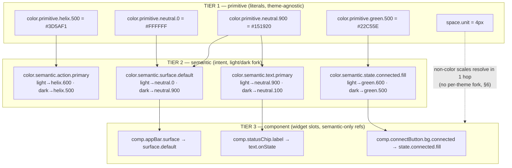
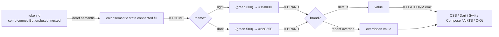
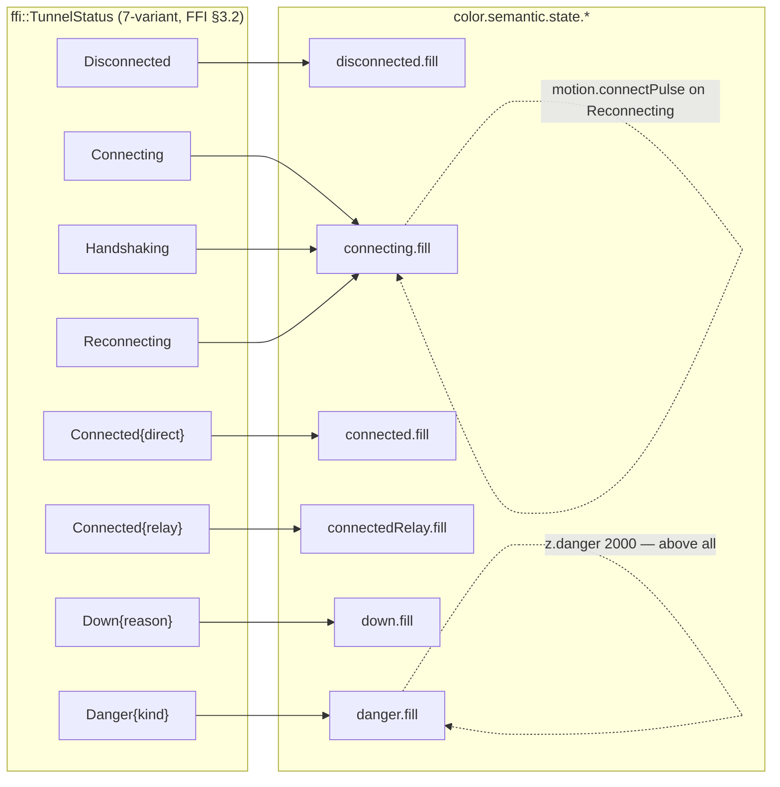

# Design tokens — taxonomy, schema & theming

**Revision:** 1
**Last modified:** 2026-06-25T12:00:00Z

> Master technical specification — Volume 10 (Design System), nano-detail
> deep-dive. This document **owns** the canonical **design-token taxonomy** and
> the **JSON source-of-truth schema** for HelixVPN's own design system: the
> three token tiers (primitive → semantic → component), the naming convention,
> the full token categories (color, typography, spacing, radius, elevation/
> shadow, motion, z-index, breakpoints) with **light + dark value pairs**, the
> theming-resolution model (theme × platform × brand), and the drift / contract
> rules that keep every emitted form (JSON / CSS / Dart / SwiftUI / Compose /
> ArkTS / C-Qt) byte-faithful to this one source.
>
> **SPEC-ONLY.** It describes *what the tokens are* and *how they resolve* — not
> the shipping `helix_design` build. The concrete hex values of the color tier
> are defined and contrast-proven in the sibling
> [`color-system.md`](color-system.md); this document defines the **structure**
> the colors live in (and reproduces the load-bearing hexes so the schema
> samples are valid, never placeholder).
>
> **Position.** `helix_design` is a **fully decoupled, reusable submodule**
> (`vasic-digital/helix_design`, snake_case flat per §11.4.28/.29/.74) that
> configures **OpenDesign** (the mandatory token/theme engine, §11.4.162) to
> emit these tokens. This doc owns the *token model*; the OpenDesign integration
> mechanics live in [`opendesign-foundation.md`], the multi-form emit in
> [`token-export-pipeline.md`], the colors in [`color-system.md`], type/icon/
> motion detail in [`typography-iconography-motion.md`].
>
> **Boundary with sibling docs.** This doc **owns** the schema + tier rules +
> naming. It **consumes**: the 7-variant connection-state vocabulary from the
> FFI surface [`v04-client/ffi-surface.md` §3.2] (the `TunnelStatus` the
> component tier's connection tokens map onto); the 3-app / 8-platform matrix
> from the spine [`SPECIFICATION.md` §3]; the OpenDesign engine contract
> [`opendesign-foundation.md`].
>
> **Evidence base.** `[04_CLIENT §N]` = `final/03-client-core-and-ui.md`;
> `[FFI §N]` = `final/v04-client/ffi-surface.md`; `[SPINE §N]` =
> `final/SPECIFICATION.md`; `[COLOR §N]` = `final/v10-design/color-system.md`.
> Claims not grounded in the evidence base or in this document's own original
> design choices are tagged `UNVERIFIED` per constitution §11.4.6 — never
> fabricated. The token taxonomy itself is **original HelixVPN design work**
> (no external source needed), modeled on the well-established
> primitive/semantic/component three-tier pattern.

---

## Table of contents

- [0. Why tokens, and the one-source rule](#0-why-tokens-and-the-one-source-rule)
- [1. The three tiers](#1-the-three-tiers)
- [2. Naming convention](#2-naming-convention)
- [3. The JSON source-of-truth schema](#3-the-json-source-of-truth-schema)
- [4. A concrete, valid token sample (all categories, light+dark)](#4-a-concrete-valid-token-sample-all-categories-lightdark)
- [5. The theming-resolution model (theme × platform × brand)](#5-the-theming-resolution-model-theme--platform--brand)
- [6. Scales — spacing, radius, elevation, motion, z-index, breakpoints](#6-scales--spacing-radius-elevation-motion-z-index-breakpoints)
- [7. Component tokens — referencing semantic, never primitive](#7-component-tokens--referencing-semantic-never-primitive)
- [8. The connection-state component tokens (the FFI seam)](#8-the-connection-state-component-tokens-the-ffi-seam)
- [9. Drift, contract & validation rules](#9-drift-contract--validation-rules)
- [10. Surfaced decisions & cross-doc contracts](#10-surfaced-decisions--cross-doc-contracts)
- [Sources verified](#sources-verified)

---

## 0. Why tokens, and the one-source rule

A **design token** is a named, platform-neutral key bound to a design value
(a color, a length, a duration, a font axis). HelixVPN ships **three apps**
(Client, Console, Connector) across **eight platforms** (iOS, macOS, Android,
Windows, Linux, Web, HarmonyOS, Aurora) from one Flutter UI core
[SPINE §3]. Without a single token source, that surface drifts: the iOS connect
button greens one way, the Web one another, and the "connected" colour stops
*meaning* "connected".

**The one-source rule.** There is exactly **one** authored source of truth — a
set of JSON token files in `helix_design/tokens/**` — and **every** consumable
form (CSS custom properties, Dart `ThemeData`, SwiftUI `Color`/`Font`, Compose
`ColorScheme`/`Typography`, ArkTS resource maps, C/Qt `.qml`/header constants)
is **generated** from it ([`token-export-pipeline.md`]). A hand-edited platform
theme is a **drift defect** (§9), the visual analogue of the schema-first
zero-drift principle the rest of HelixVPN already enforces for proto/OpenAPI
[SPINE §4 principle 8].

> **Honest boundary (§11.4.6).** Tokens guarantee *consistency and
> single-sourcing* of design values — they do **not** by themselves guarantee
> usability, accessibility, or correct layout. Contrast is proven in
> [`color-system.md`]; no-overlap / no-label-overlay layout is a component +
> visual-regression concern ([`component-library.md`], [`visual-regression-and-qa.md`],
> §11.4.162). This doc owns the values' *structure*, not their *fitness*.

---

## 1. The three tiers

Tokens resolve through **exactly three tiers**, each referencing only the tier
below it. This is the load-bearing rule that lets a single brand or theme swap
ripple correctly through every component.

| Tier | Purpose | References | May a component use it directly? | Example |
|---|---|---|---|---|
| **Primitive** (a.k.a. *global* / *core*) | The raw palette + raw scale. Theme-agnostic, brand-agnostic. A flat dictionary of literal values. | nothing (literals only) | **No** | `color.primitive.helix.500 = #3D5AF1` |
| **Semantic** (a.k.a. *alias* / *system*) | Intent. Names a *role* ("the default surface", "primary text", "the danger colour") and binds it **per theme** to a primitive. This is the **only** tier with light/dark forks. | primitive (per theme) | **Discouraged** — allowed for one-off bespoke surfaces, but components should prefer a component token | `color.semantic.surface.default = {light: helix-neutral.0, dark: helix-neutral.900}` |
| **Component** | A specific UI part's specific slot. Names the exact widget property. | **semantic only** (never primitive) | **Yes** — this is what widgets read | `comp.connectButton.bg.connected = color.semantic.state.connected.fill` |



> **Why component → semantic only (never component → primitive).** If
> `comp.connectButton.bg.connected` pointed straight at `green.500`, a brand or
> theme change would have to rewrite every component token. Routing through
> `state.connected.fill` means the theme swap touches **one** semantic binding
> and every component that references it updates for free. A component token that
> references a primitive is a **tier violation** caught by the lint in §9.

---

## 2. Naming convention

Every token id is a **dot-delimited, lowercase, `snake`-free camelCase-segment**
path. The **first segment is the category**, the **second is the tier**, the rest
narrows to the leaf. (camelCase *within* a segment; dots *between* segments —
this survives every target language's identifier rules and the OpenDesign engine
input.)

```
<category>.<tier>.<group>[.<subgroup>...].<leaf>[.<state|variant>]
```

| Part | Closed/open | Values |
|---|---|---|
| `category` | **closed** | `color` · `font` · `space` · `radius` · `elevation` · `motion` · `z` · `breakpoint` · `border` · `opacity` · `size` |
| `tier` | **closed** | `primitive` · `semantic` · (component uses the `comp.` root, below) |
| `group` | open | per category (`helix`, `neutral`, `green` for color-primitive; `surface`, `text`, `state`, `action`, `border` for color-semantic; …) |
| `leaf` | open | the terminal name (`500`, `default`, `primary`, `connected`) |
| `state/variant` | open, optional | `hover` · `pressed` · `disabled` · `focus` · `fill` · `onFill` · `subtle` |

**Component tokens** use a distinct root, `comp`, so a grep cleanly separates the
widget tier:

```
comp.<componentName>.<slot>[.<state|variant>]
```

### 2.1 Canonical examples

```
color.primitive.helix.500          # raw brand blue           → #3D5AF1
color.primitive.neutral.0          # raw white                → #FFFFFF
color.primitive.green.500          # raw connected-green       → #22C55E
color.semantic.surface.default     # the default surface role  (light/dark)
color.semantic.text.primary        # primary text role         (light/dark)
color.semantic.state.connected.fill# the "connected" fill role  (light/dark)
color.semantic.action.primary      # primary action role       (light/dark)
comp.connectButton.bg.connected    # the connect button's bg when Connected
comp.connectButton.bg.disconnected # …when Disconnected
comp.statusChip.label              # the status-chip text slot
comp.exitPicker.row.selected.bg    # selected exit row background
font.semantic.body.md              # body medium type role
space.scale.4                      # 4 × base = 16px
radius.scale.md                    # medium corner radius
elevation.semantic.menu            # the elevated-menu shadow role
motion.semantic.connectPulse.dur   # the connecting-pulse duration
z.semantic.modal                   # modal stacking layer
breakpoint.scale.md                # the medium responsive breakpoint
```

> **Naming invariants (lint-enforced, §9).** (a) every id starts with a closed
> `category`; (b) every non-`comp` id has a closed `tier` second segment;
> (c) `comp.*` ids reference only `*.semantic.*` values; (d) ids are unique
> across the whole tree; (e) ids never collide with a target-language reserved
> word after the JSON→identifier transform (the transform replaces `.`→`_`/`-`
> per form; see [`token-export-pipeline.md`]).

---

## 3. The JSON source-of-truth schema

The source is a tree of JSON files (one file per category is the recommended
layout; the loader merges them). Every **leaf token object** has a fixed shape —
a **Style-Dictionary-class** `$value`/`$type` envelope extended with HelixVPN's
**per-theme fork** for color-and-other-themed categories.

### 3.1 The leaf-token envelope

```jsonc
// the shape of EVERY leaf token (primitive or semantic or component)
{
  "$type": "color",                 // closed: color|dimension|fontFamily|fontWeight|
                                    //         number|duration|cubicBezier|shadow|zIndex
  "$value": <literal | { "light": <ref|literal>, "dark": <ref|literal> } | <ref>>,
  "$description": "human-readable intent (REQUIRED on every semantic token)",
  "$extensions": {                  // optional engine/consumer hints
    "helix.deprecated": false,
    "helix.a11yMin": "AA",          // contrast floor this token is contractually held to (§COLOR)
    "helix.platforms": ["*"]        // or a subset; "*" = all 8
  }
}
```

- **Reference syntax** — a `$value` of the form `"{color.primitive.helix.500}"`
  is a **reference** to another token (curly-brace, dotted path). The resolver
  (OpenDesign / the export pipeline) dereferences it. A reference MUST resolve to
  a token of the **same `$type`**.
- **Per-theme fork** — only the **themed categories** (`color`, `elevation`/
  `shadow`, and the small set of `border`/`opacity` tokens that differ by theme)
  carry a `{ "light": …, "dark": … }` object in `$value`. **Non-themed
  categories** (`space`, `radius`, `font` metrics, `motion`, `z`, `breakpoint`)
  carry a single literal/reference — they are identical across themes (§6).
- **Primitive `$value`** is always a **literal** (never a reference) — primitives
  are the leaves the references terminate at.
- **Semantic `$value`** is the **per-theme fork**, each side a **reference to a
  primitive**.
- **Component `$value`** is a **single reference to a semantic token** (no fork —
  the fork already happened one tier down, so a component token is theme-correct
  by construction).

### 3.2 `$type` closed vocabulary → target-form mapping

| `$type` | JSON literal form | CSS | Dart | SwiftUI | Compose | ArkTS | C/Qt |
|---|---|---|---|---|---|---|---|
| `color` | `"#RRGGBB"` / `"#RRGGBBAA"` | `--c: #…` | `Color(0xAARRGGBB)` | `Color(red:…)` | `Color(0x…)` | `$rrggbb` | `QColor("#…")` |
| `dimension` | `"16px"` / `"1.5rem"` | `16px` | `16.0` (logical px) | `16` (pt) | `16.dp` | `16vp` | `16` |
| `fontFamily` | `"Inter"` | `font-family` | `fontFamily` | `Font.custom` | `FontFamily` | `fontFamily` | `QFont` |
| `fontWeight` | `400`/`600` | `400` | `FontWeight.w400` | `.regular` | `W400` | `FontWeight.Regular` | `QFont::Normal` |
| `number` | `1.5` | unitless | `double` | `CGFloat` | `Float` | `number` | `qreal` |
| `duration` | `"180ms"` | `180ms` | `Duration(ms:180)` | `0.18` | `180` | `180` | `180` |
| `cubicBezier` | `[0.2,0,0,1]` | `cubic-bezier(…)` | `Cubic(…)` | `.timingCurve` | `CubicBezierEasing` | bezier | `QEasingCurve` |
| `shadow` | `{offsetX,offsetY,blur,spread,color}` | `box-shadow` | `BoxShadow` | `.shadow` | `Modifier.shadow` | `shadow` | `QGraphicsDropShadow` |
| `zIndex` | integer | `z-index` | `int` | `zIndex` | `zIndex` | `zIndex` | stack order |

> **`UNVERIFIED`** — the exact ArkTS resource-map key syntax and the C/Qt
> `.qml`/header emit shapes are pinned by the export-pipeline contract test
> ([`token-export-pipeline.md`] §drift-gate); the column above states the
> *intended* mapping, frozen there. Marked `UNVERIFIED` until that contract test
> exists per §11.4.6.

---

## 4. A concrete, valid token sample (all categories, light+dark)

The following is a **valid, self-consistent** slice of the source tree (not a
placeholder) covering every category. Color literals match
[`color-system.md`]; non-color scales are defined in §6 of this doc.

```jsonc
// helix_design/tokens/primitive.json  — TIER 1 (literals, theme-agnostic)
{
  "color": { "primitive": {
    "helix":   { "500": { "$type": "color", "$value": "#3D5AF1" },
                 "600": { "$type": "color", "$value": "#2F47C4" },
                 "400": { "$type": "color", "$value": "#6B86FB" } },
    "neutral": { "0":   { "$type": "color", "$value": "#FFFFFF" },
                 "100": { "$type": "color", "$value": "#EDEFF3" },
                 "500": { "$type": "color", "$value": "#6B7385" },
                 "600": { "$type": "color", "$value": "#4B5263" },
                 "900": { "$type": "color", "$value": "#151920" } },
    "green":   { "500": { "$type": "color", "$value": "#22C55E" },
                 "600": { "$type": "color", "$value": "#15803D" } },
    "amber":   { "500": { "$type": "color", "$value": "#F59E0B" },
                 "700": { "$type": "color", "$value": "#B45309" } },
    "orange":  { "600": { "$type": "color", "$value": "#C2410C" } },
    "red":     { "600": { "$type": "color", "$value": "#DC2626" } },
    "teal":    { "500": { "$type": "color", "$value": "#14B8A6" },
                 "700": { "$type": "color", "$value": "#0F766E" } }
  } },
  "space":      { "primitive": { "unit": { "$type": "dimension", "$value": "4px" } } },
  "font": { "primitive": {
    "family":  { "sans": { "$type": "fontFamily", "$value": "Inter" },
                 "mono": { "$type": "fontFamily", "$value": "JetBrains Mono" } },
    "weight":  { "regular": { "$type": "fontWeight", "$value": 400 },
                 "medium":  { "$type": "fontWeight", "$value": 500 },
                 "semibold":{ "$type": "fontWeight", "$value": 600 } }
  } }
}
```

```jsonc
// helix_design/tokens/semantic.json — TIER 2 (intent, light/dark fork)
{
  "color": { "semantic": {
    "surface": {
      "default": { "$type": "color", "$description": "the base app surface",
        "$value": { "light": "{color.primitive.neutral.0}",
                    "dark":  "{color.primitive.neutral.900}" },
        "$extensions": { "helix.a11yMin": "AAA" } },
      "raised":  { "$type": "color", "$description": "cards/sheets above the base",
        "$value": { "light": "#F7F8FA", "dark": "#222732" } }
    },
    "text": {
      "primary":   { "$type": "color", "$description": "default body/heading text",
        "$value": { "light": "{color.primitive.neutral.900}",
                    "dark":  "{color.primitive.neutral.100}" },
        "$extensions": { "helix.a11yMin": "AAA" } },
      "secondary": { "$type": "color", "$description": "supporting text",
        "$value": { "light": "{color.primitive.neutral.600}", "dark": "#C2C8D4" } },
      "onState":   { "$type": "color", "$description": "label drawn ON a filled state colour",
        "$value": { "light": "#FFFFFF", "dark": "#FFFFFF" } }
    },
    "action": {
      "primary":   { "$type": "color", "$description": "primary action/brand fill",
        "$value": { "light": "{color.primitive.helix.600}",
                    "dark":  "{color.primitive.helix.500}" },
        "$extensions": { "helix.a11yMin": "AA" } }
    },
    "state": {
      "connected": { "fill": { "$type": "color", "$description": "the Connected state colour",
        "$value": { "light": "{color.primitive.green.600}", "dark": "{color.primitive.green.500}" } } },
      "connecting":{ "fill": { "$type": "color", "$description": "Connecting/Handshaking/Reconnecting",
        "$value": { "light": "{color.primitive.amber.700}", "dark": "#FBBF24" } } },
      "danger":    { "fill": { "$type": "color", "$description": "Danger (leak/killswitch)",
        "$value": { "light": "{color.primitive.red.600}", "dark": "#F87171" } } }
    },
    "border": {
      "default": { "$type": "color", "$value": { "light": "#DCE0E8", "dark": "#353B49" } }
    }
  } },
  "font": { "semantic": {
    "body":    { "md": { "$type": "number", "$description": "body medium size (px)",
                   "$value": 14 } },
    "heading": { "lg": { "$type": "number", "$value": 22 } }
  } }
}
```

```jsonc
// helix_design/tokens/component.json — TIER 3 (widget slots, semantic-only refs)
{
  "comp": {
    "connectButton": {
      "bg": {
        "connected":    { "$type": "color", "$value": "{color.semantic.state.connected.fill}" },
        "connecting":   { "$type": "color", "$value": "{color.semantic.state.connecting.fill}" },
        "disconnected": { "$type": "color", "$value": "{color.semantic.action.primary}" },
        "danger":       { "$type": "color", "$value": "{color.semantic.state.danger.fill}" }
      },
      "label": { "$type": "color", "$value": "{color.semantic.text.onState}" },
      "radius":{ "$type": "dimension", "$value": "{radius.scale.full}" }
    },
    "statusChip": {
      "label":  { "$type": "color", "$value": "{color.semantic.text.onState}" },
      "padX":   { "$type": "dimension", "$value": "{space.scale.3}" }
    },
    "appBar": { "surface": { "$type": "color", "$value": "{color.semantic.surface.default}" } }
  }
}
```

```jsonc
// helix_design/tokens/scale.json — non-themed scales (single literal, §6)
{
  "space":  { "scale": { "1": {"$type":"dimension","$value":"4px"},  "2": {"$type":"dimension","$value":"8px"},
                         "3": {"$type":"dimension","$value":"12px"}, "4": {"$type":"dimension","$value":"16px"},
                         "5": {"$type":"dimension","$value":"24px"}, "6": {"$type":"dimension","$value":"32px"} } },
  "radius": { "scale": { "sm": {"$type":"dimension","$value":"4px"}, "md": {"$type":"dimension","$value":"8px"},
                         "lg": {"$type":"dimension","$value":"16px"},"full":{"$type":"dimension","$value":"9999px"} } },
  "elevation": { "semantic": {
     "card": { "$type": "shadow", "$value": {
        "light": { "offsetX":"0px","offsetY":"1px","blur":"3px","spread":"0px","color":"#1519201A" },
        "dark":  { "offsetX":"0px","offsetY":"1px","blur":"3px","spread":"0px","color":"#00000066" } } },
     "menu": { "$type": "shadow", "$value": {
        "light": { "offsetX":"0px","offsetY":"8px","blur":"24px","spread":"-4px","color":"#15192026" },
        "dark":  { "offsetX":"0px","offsetY":"8px","blur":"24px","spread":"-4px","color":"#00000080" } } } } },
  "motion": { "semantic": {
     "connectPulse": { "dur":  {"$type":"duration","$value":"1200ms"},
                       "ease": {"$type":"cubicBezier","$value":[0.4,0,0.6,1]} },
     "stateXfade":   { "dur":  {"$type":"duration","$value":"180ms"},
                       "ease": {"$type":"cubicBezier","$value":[0.2,0,0,1]} } } },
  "z": { "semantic": { "base":{"$type":"zIndex","$value":0}, "nav":{"$type":"zIndex","$value":100},
                       "overlay":{"$type":"zIndex","$value":1000}, "modal":{"$type":"zIndex","$value":1100},
                       "toast":{"$type":"zIndex","$value":1200}, "danger":{"$type":"zIndex","$value":2000} } },
  "breakpoint": { "scale": { "sm":{"$type":"dimension","$value":"360px"},
                             "md":{"$type":"dimension","$value":"600px"},
                             "lg":{"$type":"dimension","$value":"1024px"},
                             "xl":{"$type":"dimension","$value":"1440px"} } }
}
```

> Every `$value` above is a real, resolvable value or a real reference into the
> primitive/semantic trees in this same sample — **no placeholders, no TODO**
> (§11.4.6). The 8-hex colors (e.g. `#1519201A`) are `#RRGGBBAA` — neutral.900 at
> ~10 % alpha for the light-card shadow.

---

## 5. The theming-resolution model (theme × platform × brand)

A token id resolves to a **concrete value** along **three axes**. Resolution is
deterministic and total (every (id, theme, platform, brand) yields exactly one
value or a build error — never a silent default, §11.4.6).



### 5.1 Axis 1 — theme (light / dark) — **mandatory both**

Every **semantic** color/elevation token MUST define **both** `light` and `dark`
(§9 gate `CM-token-light-dark-complete`). A semantic token missing a theme side
is a build-blocking defect (§11.4.162 mandates light+dark for every component).
Because components reference semantics, **every component token is dual-theme by
construction** — no component ever declares a theme fork itself.

The active theme is chosen at runtime by the app (system setting → user
override → forced-by-context, e.g. `Danger` never changes theme but always
paints from the danger semantic). The Flutter `helix-ui` builds **two
`ThemeData`** (light + dark) from the emitted Dart and hands both to
`MaterialApp(theme:, darkTheme:)` [04_CLIENT §7].

### 5.2 Axis 2 — platform (emit target) — **form, not value**

Platform does **not** change a token's *value*; it changes its *emitted form*
(§3.2 table) and, rarely, its *adaptation* (e.g. a platform that lacks a shadow
primitive renders `elevation` as a hairline border). A token may opt out of a
platform via `$extensions.helix.platforms`; the export pipeline omits it from
that form's output. **Platform never forks `$value`** — that would re-introduce
drift. Per-platform *look-and-feel* adaptation (Material vs Cupertino vs
desktop vs TV-leanback vs HarmonyOS vs Aurora) is a **component-mapping**
concern owned by [`platform-adaptation.md`], built **on top of** these
identical token values.

### 5.3 Axis 3 — brand (tenant / app accent) — **override map**

The default brand is **HelixVPN** (the `helix.*` ramp). The model supports a
**brand-override layer**: a thin JSON that re-points a *small, closed* set of
semantic tokens (chiefly `action.primary` and the app-accent) to a different
primitive ramp, leaving the connection-state and feedback semantics **fixed**
(state colours MUST stay stable across brands — "connected" is always green, a
multi-tenant Console must not recolour safety semantics). The per-app accent
differentiation (Client vs Console vs Connector) is one such override and is
specified in [`color-system.md` §per-app accent]. Resolution order:
**brand-override (if present) → semantic default → primitive**.

> **D-DT-1 (surfaced, §10).** The closed set of brand-overridable semantic
> tokens is `{action.primary, accent.*, surface.brandTint}`. Allowing a tenant
> to override `state.*` or `feedback.*` is **rejected** (safety-colour drift).
> If a future product needs per-tenant state colours, that is a §11.4.66 operator
> decision, not a silent capability.

---

## 6. Scales — spacing, radius, elevation, motion, z-index, breakpoints

The non-color scales are **theme-agnostic** (one value, no light/dark fork) —
except **elevation/shadow**, whose *color* differs by theme (a shadow is darker
and more opaque on dark surfaces, §4 sample).

### 6.1 Spacing — 4-pt base scale

`space.primitive.unit = 4px`. The scale is integer multiples; component padding/
gaps reference **scale steps**, never raw px.

| token | multiplier | value | typical use |
|---|---|---|---|
| `space.scale.0` | 0 | `0px` | reset |
| `space.scale.1` | 1× | `4px` | icon-to-label gap |
| `space.scale.2` | 2× | `8px` | tight intra-component |
| `space.scale.3` | 3× | `12px` | chip padding |
| `space.scale.4` | 4× | `16px` | default content padding |
| `space.scale.5` | 6× | `24px` | section gap |
| `space.scale.6` | 8× | `32px` | screen margin (phone) |
| `space.scale.7` | 12× | `48px` | hero / connect-button ring |
| `space.scale.8` | 16× | `64px` | large desktop gutter |

> The 4-pt base is the original HelixVPN choice; it aligns with the 8 platforms'
> common density grids (Material 4dp/8dp, Cupertino 8pt) so one scale maps
> cleanly everywhere.

### 6.2 Radius scale

| token | value | use |
|---|---|---|
| `radius.scale.none` | `0px` | data tables |
| `radius.scale.sm` | `4px` | inputs, chips |
| `radius.scale.md` | `8px` | cards, sheets |
| `radius.scale.lg` | `16px` | dialogs, the connect panel |
| `radius.scale.full` | `9999px` | the circular ConnectButton, status dots, pills |

### 6.3 Elevation / shadow scale (themed color)

| token | light shadow | dark shadow | use |
|---|---|---|---|
| `elevation.semantic.flat` | none | none | base surface |
| `elevation.semantic.card` | `0 1px 3px #1519201A` | `0 1px 3px #00000066` | cards, list rows |
| `elevation.semantic.menu` | `0 8px 24px #15192026` | `0 8px 24px #00000080` | menus, popovers |
| `elevation.semantic.modal` | `0 16px 48px #15192033` | `0 16px 48px #000000A6` | dialogs, sheets |

The **shape** (offset/blur/spread) is theme-invariant; only the **shadow color +
alpha** forks — darker, more opaque on dark (a soft light-grey shadow is
invisible on a dark surface). This is the only non-color category that forks by
theme.

### 6.4 Motion tokens

| token | value | use |
|---|---|---|
| `motion.semantic.stateXfade.dur` | `180ms` | cross-fade between two `TunnelStatus` colours |
| `motion.semantic.stateXfade.ease` | `cubic-bezier(0.2,0,0,1)` | (decelerate) |
| `motion.semantic.connectPulse.dur` | `1200ms` | the `Connecting`/`Reconnecting` amber pulse loop |
| `motion.semantic.connectPulse.ease` | `cubic-bezier(0.4,0,0.6,1)` | (ease-in-out, symmetric loop) |
| `motion.semantic.press.dur` | `100ms` | button press scale/ink |
| `motion.semantic.sheet.dur` | `240ms` | sheet/dialog enter |
| `motion.semantic.reducedMotion` | `0ms` | the value all `*.dur` collapse to when the OS "reduce motion" flag is set (a11y; the `Reconnecting` "pulse" becomes a static amber, never a flash) |

> **Reduce-motion contract.** When the platform reports reduced-motion, the
> export/runtime substitutes `motion.semantic.reducedMotion` for animation
> durations. The `Reconnecting` state therefore degrades from *pulse* to *static
> amber* — it never strobes (a11y + the §11.4.107 no-flash discipline).

### 6.5 Z-index scale

`base 0 → nav 100 → overlay 1000 → modal 1100 → toast 1200 → danger 2000`. The
**`danger` layer (2000) sits above everything** so a `Danger` banner (leak /
kill-switch tripped) is never occluded by a modal or toast — the safety state
always wins the stacking order (mirrors the FFI rule that `Danger` overrides all
intent [FFI §3.2/§3.3]).

### 6.6 Breakpoints

| token | min-width | layout class |
|---|---|---|
| `breakpoint.scale.sm` | `360px` | compact phone |
| `breakpoint.scale.md` | `600px` | large phone / small tablet — two-pane begins |
| `breakpoint.scale.lg` | `1024px` | tablet / desktop — Console master-detail |
| `breakpoint.scale.xl` | `1440px` | wide desktop — Console three-pane |

The Client app is primarily `sm`/`md`; the Console (web + desktop) uses
`lg`/`xl`; the same tokens serve TV-leanback (treated as `xl` with larger touch/
focus targets). Responsive screen specs live in [`screens-client.md`] /
[`screens-console.md`].

---

## 7. Component tokens — referencing semantic, never primitive

A component token names **one widget's one slot in one state**. It is the only
tier widgets read. Example: the ConnectButton's background across its states maps
**one-to-one** onto the connection-state semantics (the FFI seam, §8).

```jsonc
"comp": { "connectButton": {
  "bg": {
    "disconnected": { "$value": "{color.semantic.action.primary}" },     // brand idle
    "connecting":   { "$value": "{color.semantic.state.connecting.fill}" },
    "handshaking":  { "$value": "{color.semantic.state.connecting.fill}" },
    "connected":    { "$value": "{color.semantic.state.connected.fill}" },
    "reconnecting": { "$value": "{color.semantic.state.connecting.fill}" },
    "down":         { "$value": "{color.semantic.state.down.fill}" },
    "danger":       { "$value": "{color.semantic.state.danger.fill}" }
  },
  "label":   { "$value": "{color.semantic.text.onState}" },             // white on every fill
  "ring":    { "$value": "{color.semantic.state.connected.glow}" },     // the "connected" halo
  "radius":  { "$value": "{radius.scale.full}" },
  "size":    { "$value": "{size.connectButton.diameter}" }
} }
```

The rule restated: **every `comp.*` `$value` is a single reference into
`*.semantic.*`** (color/elevation) or into a non-themed `*.scale.*`. A
`comp.*` token that references a `*.primitive.*` value or hard-codes a literal is
a **tier violation** (§9 lint). This is what makes a brand or theme swap a
one-tier edit.

---

## 8. The connection-state component tokens (the FFI seam)

The single most product-specific token group: the connection-state colours map
**exactly** onto the **7-variant `ffi::TunnelStatus`** the UI switches on
[FFI §3.2]. This document owns the *token structure*; [`color-system.md`] owns
the *hex values + contrast proofs*. The mapping is **total** — every one of the
seven variants has a dedicated semantic + component token, so the UI never
invents a colour for a state (§11.4.6).

| `ffi::TunnelStatus` variant | semantic token | component token (ConnectButton bg) | family |
|---|---|---|---|
| `Disconnected` | `color.semantic.state.disconnected.fill` | `comp.connectButton.bg.disconnected` (= `action.primary` brand, idle) | neutral / brand |
| `Connecting` | `color.semantic.state.connecting.fill` | `comp.connectButton.bg.connecting` | amber |
| `Handshaking` | `color.semantic.state.connecting.fill` (shared with Connecting) | `…bg.handshaking` | amber |
| `Connected { path:"direct" }` | `color.semantic.state.connected.fill` | `…bg.connected` | green (direct sub-shade) |
| `Connected { path:"relay" }` | `color.semantic.state.connectedRelay.fill` | `…bg.connectedRelay` | green (relay sub-shade, teal-leaning) |
| `Reconnecting` | `color.semantic.state.connecting.fill` (amber, **pulsing** via `motion.connectPulse`) | `…bg.reconnecting` | amber (animated) |
| `Down { reason }` | `color.semantic.state.down.fill` | `…bg.down` | orange |
| `Danger { kind }` | `color.semantic.state.danger.fill` | `…bg.danger` | red (z-layer `danger`, overrides intent) |



- **Direct vs relay sub-shade.** `Connected.path` is `"direct"` (P2P) or
  `"relay"` (DERP-style) [FFI §3.2]. Two distinct *green* semantics
  (`connected.fill` vs `connectedRelay.fill`) let the `StatusChip` show the path
  without changing the "I am protected = green" signal. Hexes in
  [`color-system.md`].
- **Reconnecting = amber pulse, not a new colour.** It reuses
  `connecting.fill` + `motion.connectPulse`; reduce-motion degrades it to static
  amber (§6.4).
- **Danger overrides intent.** The `Danger` family is red **and** sits on
  z-layer `danger` (2000) — it can never be hidden, mirroring the FFI projector
  rule that `Danger` overrides every other state [FFI §3.3].

---

## 9. Drift, contract & validation rules

Tokens are only single-source if **machine-checked**. The following gates run in
`helix_design` CI and the consuming `helix-ui` pre-build (paired §1.1 mutation
each):

| Gate | Asserts | Mutation that must FAIL it |
|---|---|---|
| `CM-token-tiers-valid` | every id starts with a closed `category`; non-`comp` ids carry a closed `tier`; `comp.*` ids reference only `*.semantic.*`/`*.scale.*` (never primitive, never literal) | point a `comp.*` `$value` at `color.primitive.*` |
| `CM-token-light-dark-complete` | every **semantic** `color`/`elevation` token defines **both** `light` and `dark` | delete the `dark` side of `surface.default` |
| `CM-token-refs-resolve` | every `{…}` reference resolves to an existing token of the **same `$type`** | reference a non-existent / wrong-type token |
| `CM-token-ids-unique` | no duplicate id across the whole tree | duplicate `color.primitive.helix.500` |
| `CM-token-a11y-floor` | every token carrying `helix.a11yMin` meets its floor against its paired surface (computed, [COLOR §contrast]) | drop `text.primary` to a value below its AAA floor |
| `CM-token-no-drift` | every emitted form (CSS/Dart/Swift/Compose/ArkTS/C-Qt) re-generates byte-identically from the JSON source; a hand-edited emitted file is a finding ([`token-export-pipeline.md`]) | hand-edit `helix_tokens.dart` |
| `CM-token-state-coverage` | all **7** `ffi::TunnelStatus` variants (§8) have a semantic + component token | remove `state.danger.fill` |

> **The drift gate is the load-bearing one.** It is the visual analogue of
> HelixVPN's proto/OpenAPI zero-drift principle [SPINE §4.8]: the only way a
> platform theme can diverge from the source is a hand-edit, and the gate catches
> that hand-edit. Emitted forms are **never** authored, only generated
> ([`token-export-pipeline.md`]); exported docs of the token reference carry the
> §11.4.65/.168 visual-validation per [`visual-regression-and-qa.md`].

---

## 10. Surfaced decisions & cross-doc contracts

| id | Decision / contract | Status |
|---|---|---|
| **D-DT-1** | Closed brand-overridable semantic set = `{action.primary, accent.*, surface.brandTint}`; `state.*`/`feedback.*` are **NOT** brand-overridable (safety-colour stability). Widening requires a §11.4.66 operator decision. | recommended, surfaced |
| **D-DT-2** | Per-theme fork lives **only** on `color`, `elevation` (+ a tiny `border`/`opacity` set). All other categories are theme-invariant single values. | decided |
| **D-DT-3** | Component tokens reference **semantic only**; the lint (`CM-token-tiers-valid`) enforces it. | decided |
| **C-DT-A** (consumes) | The 7-variant `ffi::TunnelStatus` vocabulary is owned by [FFI §3.2]; §8's token set MUST stay total over it (gate `CM-token-state-coverage`). A new FFI variant is a contract change here. | contract |
| **C-DT-B** (provides) | This schema (§3) is the input contract for [`token-export-pipeline.md`] (the emit) and [`color-system.md`] (the color values + contrast). | contract |
| **C-DT-C** (provides) | The naming convention (§2) is the identifier contract every emitted form's transform must honor. | contract |
| **U-DT-1** `UNVERIFIED` | Exact ArkTS resource-map key syntax + C/Qt emit shapes (§3.2) — pinned by the export-pipeline contract test; `UNVERIFIED` until that test exists. | open |

---

## Sources verified

- **Token taxonomy, tier model, naming, theming model, scales, drift rules** —
  **NO external source needed — original HelixVPN design work**, modeled on the
  well-established primitive→semantic→component three-tier token pattern and the
  Style-Dictionary `$value`/`$type` envelope convention (engine-neutral; the
  concrete engine is OpenDesign per §11.4.162, integration in
  [`opendesign-foundation.md`]).
- **7-variant `ffi::TunnelStatus` vocabulary (§8)** — `final/v04-client/ffi-surface.md`
  §3.2 (read 2026-06-25). The token set is held total over it by gate
  `CM-token-state-coverage`.
- **3-app / 8-platform matrix, schema-first zero-drift principle (§0, §5)** —
  `final/SPECIFICATION.md` §3, §4 (read 2026-06-25).
- **Color hex values reproduced in the JSON samples (§4)** — defined +
  contrast-proven in `final/v10-design/color-system.md` (this doc reproduces only
  the load-bearing subset to keep the samples valid).
- **WCAG contrast floors referenced by `helix.a11yMin`** — W3C WCAG 2.1 SC 1.4.3
  / 1.4.6 and the relative-luminance formula (`https://www.w3.org/TR/WCAG21/#dfn-relative-luminance`);
  the arithmetic is performed in [`color-system.md`].
- Items explicitly marked `UNVERIFIED` (U-DT-1) are pending their named contract
  test per §11.4.6 — not asserted as fact.
