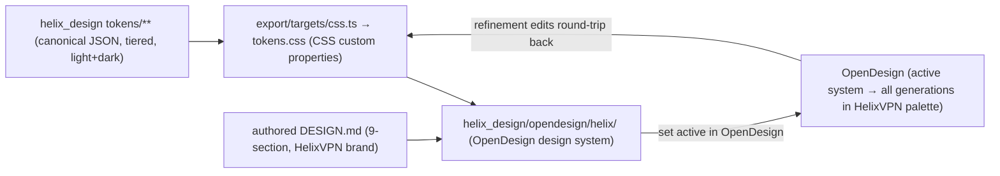
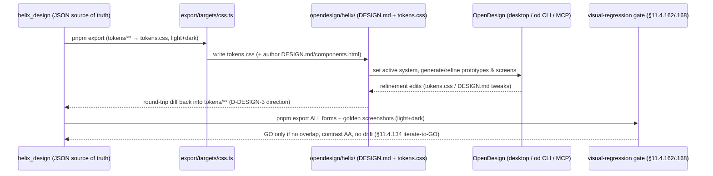

# OpenDesign integration foundation (§11.4.162)

**Revision:** 1
**Last modified:** 2026-06-25T12:00:00Z

> Master technical specification — Volume 10 (Design System), nano-detail deep-dive.
> This document is the **foundation** for HelixVPN's mandatory use of **OpenDesign**
> (https://github.com/nexu-io/open-design) as the design-and-refinement system (§11.4.162):
> what OpenDesign actually is (web-verified, **not** invented), how it is installed and
> consumed, its design-system / token / theme model **as far as the live source confirms
> it**, how `helix_design` (the sibling [`00-overview-and-submodule.md`]) configures
> OpenDesign to carry the HelixVPN palette / type / spacing / component tokens, the
> extend-upstream policy (§11.4.74) for missing patterns, and the honest boundary
> (OpenDesign ≠ functional / accessibility testing). SPEC-ONLY.
>
> **CRITICAL ANTI-BLUFF NOTICE (§11.4.6 / §11.4.99).** OpenDesign is a real but niche,
> fast-moving project. **Every** OpenDesign-specific claim below is one of two kinds:
> **(V)** verified against the live GitHub source on the access date in the Sources
> footer — cited; or **(U)** an explicit `UNVERIFIED (OpenDesign source not confirmed):`
> assumption that MUST be re-checked against the live repo in a refinement pass before it
> is relied on. No OpenDesign API is stated as fact unless it carries a (V). Where the
> live repo contradicts the brief's prior assumptions (it did — see §1.2), this document
> follows the **verified source**, not the assumption.

---

## Table of contents

- [0. The headline finding (read this first)](#0-the-headline-finding-read-this-first)
- [1. What OpenDesign actually is (verified)](#1-what-opendesign-actually-is-verified)
- [2. Installation & how it is consumed](#2-installation--how-it-is-consumed)
- [3. The OpenDesign design-system model (verified subset)](#3-the-opendesign-design-system-model-verified-subset)
- [4. The token / theme model — verified vs. unverified](#4-the-token--theme-model--verified-vs-unverified)
- [5. How `helix_design` configures OpenDesign for HelixVPN](#5-how-helix_design-configures-opendesign-for-helixvpn)
- [6. The authoring & refinement workflow](#6-the-authoring--refinement-workflow)
- [7. Extend-upstream policy for missing patterns (§11.4.74)](#7-extend-upstream-policy-for-missing-patterns-11474)
- [8. The honest boundary (OpenDesign ≠ functional / a11y testing)](#8-the-honest-boundary-opendesign--functional--a11y-testing)
- [9. Risk register & refinement-pass checklist](#9-risk-register--refinement-pass-checklist)
- [10. Inventory of UNVERIFIED markers](#10-inventory-of-unverified-markers)
- [Sources verified](#sources-verified)

---

## 0. The headline finding (read this first)

The §11.4.162 mandate and the Volume-10 brief were drafted with the *mental model* of
OpenDesign as a **Style-Dictionary-class token-compilation engine** that you "install as a
project dependency" and that "emits design tokens/themes" in many languages. **The live
source does not match that model** (verified 2026-06-25):

| Prior assumption (brief / §11.4.162 phrasing) | What the live repo shows (V) |
|---|---|
| OpenDesign is an npm package dependency you install into the project | OpenDesign is a **local-first desktop app + CLI (`od`) + MCP server**; it "doesn't distribute as an npm package dependency" — agents consume it via local CLI / MCP / API mode |
| OpenDesign emits tokens in CSS / Dart / Swift / Compose / ArkTS / C-Qt | OpenDesign's design-system form is `DESIGN.md` (9-section markdown) + `tokens.css` (CSS custom properties); its *export* formats are HTML / PDF / PPTX / MP4 / ZIP (generated **prototypes**, not multi-language token bundles) |
| OpenDesign has a token-engine theming API | Theming is **system-based** — you pick/author a `DESIGN.md` design system; "no traditional theme API exists" |

This is not a blocker — it *clarifies the division of labour* the sibling doc already
specified: **OpenDesign is the design *authoring + refinement + generation* layer
(DESIGN.md/tokens.css + prototype generation); `helix_design` owns the canonical token
source and the polyglot (Dart/Swift/Compose/ArkTS/C-Qt) distribution OpenDesign does not
itself produce.** §11.4.162 is still satisfied — OpenDesign is the mandatory
design-and-refinement system, no ad-hoc CSS / one-off tool; we just consume it as the tool
it actually is, and extend it upstream (§11.4.74) for anything missing (§7).

> **D-OD-1 (open, raise to operator).** §11.4.162's literal text ("install as a project
> dependency; use its design tokens/themes system") describes a tool shape OpenDesign does
> not have. Recommend an operator clarification (§11.4.66) that the mandate is satisfied by
> consuming OpenDesign as a CLI/MCP design-and-refinement tool + authoring a HelixVPN
> OpenDesign design system, with `helix_design` owning the polyglot distribution — OR an
> upstream extension (§7) that gives OpenDesign the missing token-export capability.
> `UNVERIFIED` (operator decision) until ratified.

---

## 1. What OpenDesign actually is (verified)

### 1.1 Identity & purpose (V)

- **Name:** Open Design. **Repo:** `nexu-io/open-design`. **License:** Apache-2.0 (bundled
  components retain their original MIT licenses). (V)
- **What it is (verbatim framing from the README):** "the local-first, open-source Claude
  Design alternative" — a **native desktop application** + **CLI toolkit** that generates
  design artifacts (prototypes, decks, images, videos) using coding agents already on the
  machine. (V)
- **Capabilities (V):** generate web/mobile/desktop prototypes from natural-language
  briefs; create decks/dashboards/motion graphics; export to HTML/PDF/PPTX/MP4/ZIP; runs
  entirely **locally** (no cloud dependency); works with many coding agents (Claude Code,
  Codex, Cursor, Copilot, Qwen, Kimi, …).
- **Ships with (V):** a large library of brand-grade `DESIGN.md` design systems
  (the README/releases cite "142+ Design Systems"; the design-systems dropdown is
  documented as shipping a set of built-in systems — counts vary by version, so treat the
  exact number as version-dependent (U)).
- **Tech stack (V):** Next.js 16 / React / TypeScript front-end; Node 24 + Express daemon
  with SSE + better-sqlite3; Electron desktop; primarily TypeScript.

### 1.2 What it is NOT (verified by absence)

- **Not** an npm/pub package you add to `pubspec.yaml`/`package.json` as a runtime token
  dependency (V — "doesn't distribute as an npm package dependency").
- **Not** a multi-language token compiler — it does **not** emit Dart / Swift / Compose /
  ArkTS / C-Qt token forms (V — its export formats are HTML/PDF/PPTX/MP4/ZIP/Markdown; its
  token form is `tokens.css`).
- **Not** a traditional theme-API or primitive→semantic→component token-tier engine (V —
  "Open Design does not use a traditional token taxonomy"; "theming is system-based, not
  API-driven").

These absences are **load-bearing** for §5–§7: they are *why* `helix_design` owns the
token tiers and the polyglot export, and *what* an upstream extension (§7) would add.

---

## 2. Installation & how it is consumed

### 2.1 Install paths (V)

```bash
# Desktop app (recommended for designers) — download from open-design.ai:
#   macOS (Apple Silicon + Intel), Windows (x64), Linux AppImage (GitHub Releases). (V)

# As a CLI / MCP server for a coding agent:
od mcp install <agent>        # agent = claude | codex | cursor | copilot | … (V)

# From source (the toolchain helix_design's build env pins — §11.4.31 build_toolchain):
git clone https://github.com/nexu-io/open-design.git
cd open-design
corepack enable && pnpm install        # Node ~24, pnpm 10.x (V)
pnpm tools-dev run web

# Docker (containerized, no local Node) — runs at http://localhost:7456 (V):
cd open-design/deploy && cp .env.example .env
openssl rand -hex 32                    # token for .env
docker compose up -d
```

### 2.2 The `od` CLI & daemon env (V)

`od` is the daemon CLI entry point (built from `apps/daemon/dist/cli.js`); the daemon
spawns local agents and handles media generation. When an agent runs, the daemon injects:
`OD_BIN` (CLI path), `OD_DAEMON_URL`, `OD_PROJECT_ID`, `OD_PROJECT_DIR` (V).

### 2.3 The agent-consumption model (V)

Agents consume OpenDesign through (1) **local CLI mode** — the daemon spawns the installed
agent and composes the prompt as `BASE_SYSTEM_PROMPT + active design-system body + active
skill body`; or (2) **API mode** — a BYOK fallback when no agent CLI is detected. The
"active design system" (a `DESIGN.md`) is injected into the agent's system prompt so every
generation respects it (V).

### 2.4 What this means for HelixVPN's build env

`helix_design` (sibling doc §7.2) declares Node ~24 + pnpm 10.x in `helix-deps.yaml`
`build_toolchain` — that toolchain is exactly OpenDesign's (V). For HelixVPN, OpenDesign
is consumed as: (a) the **designer/agent authoring + refinement tool** (desktop app or
`od` CLI / MCP) operating on the HelixVPN design system folder; and (b) **not** as a build
dependency of the consuming *apps* — the apps depend on `helix_design`'s generated forms,
not on OpenDesign (§11.4.162 is about the *design process*, not the app runtime).

> **D-OD-2 (open).** Whether HelixVPN runs OpenDesign as the **desktop app** (designer-
> driven), the **`od` CLI / MCP server** (agent-driven, fits the §11.4.20/.70
> subagent-driven default + §11.4.102 plugin-availability mandate), or **both**.
> Recommend: MCP/CLI mode wired into the agent toolchain for autonomous refinement +
> desktop app available to designers. `UNVERIFIED` until the Volume-10 review picks.

---

## 3. The OpenDesign design-system model (verified subset)

### 3.1 A design system is a folder (V)

```
design-systems/<slug>/
├── manifest.json      # v1 requires: schemaVersion, id, name, category, description,
│                      #   source, files{} (pointing to the fixed filenames)  (V)
├── DESIGN.md          # the 9-section markdown spec (the system body)         (V)
├── tokens.css         # canonical compiled CSS custom properties             (V)
├── components.html    # component reference markup                           (V)
├── assets/  fonts/  preview/  source/                                        (V)
```

"File locations are intentionally fixed" for v1; `DESIGN.md` and `tokens.css` are the core
required files (V).

### 3.2 `DESIGN.md` structure (V, partial)

- The **first H1** is the title shown in the system picker. (V)
- The line immediately after the H1 is parsed for `> Category: <name>` and used to group
  the dropdown. (V)
- It is a **9-section** spec. The README excerpt names the shape but not all nine
  verbatim; from the project-analysis the nine sections are: **color palette, typography,
  spacing, layout, components, motion, voice/tone, brand identity, anti-patterns** (V for
  the *set*; the exact section **headings/numbering** as they must appear in the file is
  **(U)** — see §10).

```markdown
# HelixVPN Design System
> Category: Security & Privacy
## 1. Visual Theme & Atmosphere
…
## 2. Color Palette
…  (light + dark — DS-I3; see §5.2)
## 3. Typography
…
## 4. Spacing & Layout
…
## 5. Components
…
## 6. Motion
…
## 7. Voice & Tone
…
## 8. Brand Identity
…
## 9. Anti-patterns
…
```

> `UNVERIFIED (OpenDesign source not confirmed): the exact ## section headings/order in a
> v1 DESIGN.md.` The example above reflects the *verified 9-section set* but the precise
> heading text + numbering must be copied from a live built-in `design-systems/<slug>/
> DESIGN.md` in the refinement pass (the README confirmed the *concept* and the H1 +
> `> Category:` lines verbatim, not the nine headings).

### 3.3 `tokens.css` (V, partial)

- `tokens.css` holds "canonical compiled CSS custom properties" for the system (V).
- Releases reference a "structured `tokens.css` schema for design systems (default +
  kami)" (V) — i.e. there is a defined schema, and MCP-compatible agents can read
  `tokens.css` "as a structured API queryable by name" (V).
- The **exact CSS custom-property names / categories** in that schema (e.g. is it
  `--color-bg`, `--font-size-1`, …?) and whether it natively encodes **light + dark** (two
  blocks? a `[data-theme]` selector? `prefers-color-scheme`?) are **(U)** — the live
  `tokens.css` of a built-in system must be read in the refinement pass.

---

## 4. The token / theme model — verified vs. unverified

| Aspect | Verified (V) | Unverified (U) — resolve in refinement |
|---|---|---|
| Token home | `tokens.css` (CSS custom properties) + concrete values in `DESIGN.md` | exact property names / categories |
| Taxonomy | **No** primitive→semantic→component tiering inside OpenDesign | n/a (this is precisely why `helix_design` owns the tiers — §5.1) |
| Theming | system-based (pick a `DESIGN.md`); "no traditional theme API" | whether `tokens.css` encodes light+dark natively, and how |
| Light/dark | README "does not explicitly detail built-in light/dark support; design systems can theoretically define dual palettes, delegated to the DESIGN.md author" | the canonical mechanism a built-in system uses for dark mode |
| Export forms | HTML / PDF / PPTX / MP4 / ZIP / Markdown (these are **prototype** exports) | — |
| Multi-language token export | **None** (no Dart/Swift/Compose/ArkTS/C-Qt) | whether a plugin/skill could add one (§7) |
| Agent read access | MCP agents read `tokens.css` / JSX components / entry HTML "as a structured API queryable by name" | the exact MCP tool/resource names |

**Consequence for HelixVPN (the design that follows from the verified facts):** because
OpenDesign has no token tiers and no multi-language export, the **canonical, tiered,
light+dark, polyglot-exported** token system lives in `helix_design` (sibling doc §5–§6).
OpenDesign's `tokens.css` + `DESIGN.md` is the **authoring/refinement + preview** form,
round-tripped with the `helix_design` JSON source (sibling doc D-DESIGN-3). Nothing here
*requires* an unverified OpenDesign API: the round-trip touches only the **verified**
`tokens.css` (CSS custom properties) form.

---

## 5. How `helix_design` configures OpenDesign for HelixVPN

### 5.1 The configuration is "author a HelixVPN design system" (not "set theme-engine knobs")

Since OpenDesign theming is system-based (V), "configuring OpenDesign to emit the HelixVPN
palette/type/spacing/component tokens" means: **author `helix_design/opendesign/helix/`**
as a valid OpenDesign design system (`manifest.json` + `DESIGN.md` + `tokens.css` +
`components.html` + assets), make it the **active** system in OpenDesign, and every
OpenDesign generation/refinement then renders in the HelixVPN palette (V — the active
system is injected into the agent system prompt).



### 5.2 Light + dark in the OpenDesign form (DS-I3)

The HelixVPN `DESIGN.md` color section and the generated `tokens.css` MUST express **both**
light and dark (DS-I3). Because OpenDesign's native dark-mode mechanism is **(U)**, the
HelixVPN `tokens.css` encodes dark explicitly using a standard CSS pattern that does not
depend on any unverified OpenDesign feature:

```css
/* helix_design/opendesign/helix/tokens.css — generated by export/targets/css.ts */
:root {                          /* light (default) */
  --hx-color-surface: #FAFAFA;
  --hx-color-on-surface: #111827;
  --hx-color-action: #3B5BDB;    /* brand seed (preset, sibling §5.4) */
  --hx-color-success: #059669;   /* Connected */
  --hx-color-warn: #D97706;      /* Connecting/Reconnecting */
  --hx-color-danger: #DC2626;    /* leak / kill-switch tripped */
  --hx-color-neutral: #6B7280;   /* Disconnected */
}
[data-theme="dark"] {            /* dark */
  --hx-color-surface: #0B0F19;
  --hx-color-on-surface: #F3F4F6;
  --hx-color-action: #6B8AFD;
  --hx-color-success: #34D399;
  --hx-color-warn: #FBBF24;
  --hx-color-danger: #F87171;
  --hx-color-neutral: #9CA3AF;
}
```

> Illustrative of OpenDesign's `tokens.css` authoring output — canonical HelixVPN hexes
> are owned by [`color-system.md`]; these sample values are not the shipped palette.

> `UNVERIFIED (OpenDesign source not confirmed): whether OpenDesign's renderer honours a
> [data-theme="dark"] block or expects a different dark-mode convention (e.g.
> prefers-color-scheme, or twin DESIGN.md systems "HelixVPN Light"/"HelixVPN Dark").` The
> `[data-theme]` pattern above is a safe, tool-agnostic CSS encoding; the refinement pass
> confirms how a built-in OpenDesign system encodes dark and aligns. If OpenDesign expects
> twin systems, `helix_design` authors `opendesign/helix-light/` + `opendesign/helix-dark/`
> from the same JSON source — a generation detail, not a token-source change.

### 5.3 Components & spacing in the OpenDesign form

`DESIGN.md` §5 (Components) and §4 (Spacing & Layout) carry the HelixVPN component archetypes
(ConnectButton, StatusChip, ExitPicker, ShieldToggle, ServerList, PeerCard, TopologyGraph,
dialogs, forms, nav — full list in sibling [`component-library.md`]) and the 4-base spacing
scale, written as the design *intent* OpenDesign generations follow, with `components.html`
holding the reference markup. These are authored from the same `helix_design` component
specs that drive the polyglot component tokens — one source, two renderings (V that
`DESIGN.md`+`components.html` are the OpenDesign component form; the *mapping discipline*
is HelixVPN's own design).

### 5.4 The no-overlap / no-overlay rule in OpenDesign output (DS-I4)

Because OpenDesign **generates** layouts, its output is subject to DS-I4 (elements MUST NOT
overlap; labels MUST NOT be overlaid) and DS-I5 (visual-regression coverage). The
`DESIGN.md` §9 (Anti-patterns) explicitly lists "overlapping elements" and "label overlay"
as forbidden, and every OpenDesign-generated artifact accepted as HelixVPN UI passes the
§11.4.168 + §11.4.162 visual-regression gate ([`visual-regression-and-qa.md`]) — OpenDesign
*generating* a layout does not exempt it from the layout-integrity gate (§11.4.6: a
generator's output is evidence to validate, not a claim to trust).

---

## 6. The authoring & refinement workflow



Key points: (1) refinement happens **in OpenDesign** (mandate §11.4.162 — no ad-hoc CSS,
no Figma-only, no hand-tuned one-off); (2) the refined result is reconciled back into the
`helix_design` JSON source so the polyglot exports stay in sync (DS-I6); (3) nothing ships
until the visual-regression + contrast + no-overlap gates GO, iterating per §11.4.134.

---

## 7. Extend-upstream policy for missing patterns (§11.4.74)

When OpenDesign lacks a capability HelixVPN needs, the fix is an **upstream contribution to
`nexu-io/open-design`** (extend the catalogue tool), never a private fork-and-diverge or an
in-`helix_design` reimplementation (§11.4.74). The likely extension candidates, ranked:

| Gap (from §1.2 / §4 verified absences) | Upstream extension shape (V: OpenDesign's documented extension points) | Priority |
|---|---|---|
| OpenDesign cannot emit multi-language token forms (Dart/Swift/Compose/ArkTS/C-Qt) | a **Skill** (`skills/<name>/SKILL.md` + assets — V documented extension) OR a **Plugin** (`plugins/community/<name>/open-design.json` + `SKILL.md` — V) that reads `tokens.css` and emits the polyglot forms | High (would let OpenDesign own the export `helix_design` currently owns — D-DESIGN-4) |
| No first-class tiered (primitive→semantic→component) token model | propose a richer `tokens.css`/`DESIGN.md` schema upstream (a Design-System schema PR) | Medium |
| Dark-mode encoding convention unclear/under-documented | upstream a documented light+dark `tokens.css` convention + example | Medium (also unblocks §5.2 (U)) |
| A VPN-specific component archetype (connection-state chip, topology graph) | a HelixVPN-authored `DESIGN.md` system contributed to the public `design-systems/` set (V documented path) — only if non-confidential | Low (optional community give-back) |

**OpenDesign's verified extension points (V):**

```text
Skills:         drop skills/<name>/ with SKILL.md + assets        (spec: docs/skills-protocol.md)
Design systems: add design-systems/<slug>/DESIGN.md               (guide: design-systems/README.md)
Plugins:        plugins/community/<name>/ with open-design.json + SKILL.md  (spec: plugins/spec/SPEC.md)
New agents:     add an adapter entry to apps/daemon/src/agents.ts
```

Every extension is recorded with a `Catalogue-Check: extend nexu-io/open-design@<sha>`
tracker line (§11.4.74) and follows OpenDesign's `Contributing` process (V — the README
has a Contributing section). A contribution that is rejected upstream is *not* silently
forked; the gap is re-scoped to `helix_design`-owned with the rejection recorded (§11.4.6).

> `UNVERIFIED (OpenDesign source not confirmed): the exact contents of
> docs/skills-protocol.md, plugins/spec/SPEC.md, and whether a Skill/Plugin can register a
> new EXPORT format (vs. only a generation skill).` The extension *paths* above are
> verified to exist; whether a plugin can hook the *export* pipeline (to add Dart/Swift/…
> output) must be confirmed against those spec files in the refinement pass before
> D-DESIGN-4 is decided in OpenDesign's favour. Until confirmed, the polyglot exporters
> stay `helix_design`-owned (sibling doc §6, the safe default).

---

## 8. The honest boundary (OpenDesign ≠ functional / a11y testing)

§11.4.162's honest boundary, restated for this foundation: **OpenDesign governs design
tokens, themes, and the design-system / generated-artifact form. It does NOT:**

| OpenDesign does NOT cover | Owned instead by |
|---|---|
| Functional correctness of a feature (does Connect actually start the tunnel?) | Volume 4 (client) + Volume 8 (testing) §11.4.27/.169 |
| Accessibility **behaviour** (screen-reader focus order, live-region announcements, semantic labels at runtime) | Volume 4 (`UiConnectionState.semanticLabel`, [04_CLIENT §7.2]) + Volume 8 a11y tests |
| UI-driven / dual-approach test methodology (drive the real UI, assert the real result) | §11.4.48 / §11.4.49 (Volume 8) |
| Liveness / not-stale / content-correctness of what renders on screen | §11.4.107 / §11.4.117 / §11.4.137 (Volume 8) |
| The 5-variant `core::TunnelStatus` (wire) → 7-variant `ffi::TunnelStatus` (Dart-facing) contract & its UI projection | Volume 2 [02_ORCH §4.1] + Volume 4 [04_CLIENT §7.2] |

What OpenDesign + `helix_design` **do** assert (the design layer): the *visual* correctness
— palette (light+dark), type, spacing, component anatomy, no-overlap/no-overlay (DS-I4),
contrast (DS-I3/DS-I5) — verified by the §11.4.162/.168 visual-regression gate. A green
design layer is **necessary, not sufficient** for a shipped, usable UI (§11.4.6 honest
boundary): the feature must still pass its functional + a11y-behaviour + UI-driven tests in
Volumes 4/8. Stating this plainly is itself a §11.4.162 requirement — OpenDesign is a
design system, not a test oracle.

---

## 9. Risk register & refinement-pass checklist

| Risk | Impact | Mitigation / refinement action |
|---|---|---|
| OpenDesign API/schema drifts (fast-moving, "0.x" releases — V) | a built integration breaks on an OpenDesign bump | pin a specific OpenDesign release in the toolchain (§11.4.31); re-verify `tokens.css`/`DESIGN.md` schema each bump per §11.4.99 90-day staleness |
| §11.4.162 literal mismatch (D-OD-1) | mandate appears unmet on a literal reading | operator clarification (§11.4.66) recording the consume-as-CLI/MCP interpretation OR an upstream token-export extension (§7) |
| Dark-mode convention (U) | dark theme renders wrong in OpenDesign previews | read a built-in system's `tokens.css`; align §5.2; possibly twin systems |
| `DESIGN.md` 9-section headings (U) | authored system rejected by OpenDesign's parser | copy headings from a live built-in `DESIGN.md` |
| `tokens.css` property schema (U) | round-trip (D-DESIGN-3) misaligns | read a built-in `tokens.css`; map property names to `helix_design` semantic tokens |
| Plugin export-hook capability (U, §7) | D-DESIGN-4 (upstream vs. in-house export) cannot be decided | read `plugins/spec/SPEC.md` + `docs/skills-protocol.md` |

**Refinement-pass checklist (do these against the LIVE repo before relying on §3–§7):**

1. Read a built-in `design-systems/<slug>/DESIGN.md` → confirm the exact 9 section
   headings + order (resolves §3.2 (U)).
2. Read that system's `tokens.css` → record the exact custom-property schema + how it
   encodes (or does not encode) dark (resolves §3.3 + §5.2 (U)).
3. Read `manifest.json` of a built-in system → confirm the v1 required keys verbatim.
4. Read `docs/skills-protocol.md` + `plugins/spec/SPEC.md` → confirm whether an export
   format can be registered by a plugin/skill (resolves §7 (U), decides D-DESIGN-4).
5. Confirm the current OpenDesign release to pin (releases page) + re-date this doc's
   Sources footer (§11.4.99).

---

## 10. Inventory of UNVERIFIED markers

Every `UNVERIFIED`/`(U)`/open-decision in this document, for the reviewer to discharge:

| # | Marker | Location | What to verify |
|---|---|---|---|
| U1 | exact `DESIGN.md` 9-section headings + numbering | §3.2 | read a live built-in `DESIGN.md` |
| U2 | exact `tokens.css` custom-property schema (names/categories) | §3.3, §4 | read a live `tokens.css` |
| U3 | whether `tokens.css` natively encodes light+dark, and how | §3.3, §4, §5.2 | read a live `tokens.css` / dark system |
| U4 | OpenDesign's canonical dark-mode mechanism (`[data-theme]` vs `prefers-color-scheme` vs twin systems) | §5.2 | refinement pass |
| U5 | exact MCP tool/resource names OpenDesign exposes for reading `tokens.css` | §4 (table) | OpenDesign MCP docs |
| U6 | whether a Skill/Plugin can register a new EXPORT format (decides D-DESIGN-4) | §7 | `docs/skills-protocol.md`, `plugins/spec/SPEC.md` |
| U7 | exact built-in-design-system count (version-dependent) | §1.1 | releases page (informational only) |
| D-OD-1 | §11.4.162 literal "install as dependency / token engine" mismatch | §0, §1.2 | operator clarification (§11.4.66) |
| D-OD-2 | desktop app vs. `od` CLI/MCP vs. both for HelixVPN | §2.4 | Volume-10 review |

None of these blocks the **design** of `helix_design` (sibling doc), because every
`helix_design` ↔ OpenDesign interaction is specified to touch only **verified** surfaces
(the `tokens.css` CSS-custom-property form + the design-system folder layout) or to be
`helix_design`-owned (the polyglot export). The unverified items refine *how cleanly* the
round-trip aligns, not *whether* the architecture stands.

---

## Sources verified

- **https://github.com/nexu-io/open-design** (repository root / README) — identity, "local-
  first open-source Claude Design alternative", desktop-app + CLI + MCP nature, capabilities,
  HTML/PDF/PPTX/MP4/ZIP export formats, Apache-2.0 license, Next.js/Node 24/Electron stack,
  extension points (Skills / Design Systems / Plugins / New agents), Contributing section.
  Accessed **2026-06-25** (via WebFetch + WebSearch).
- **https://github.com/nexu-io/open-design/blob/main/QUICKSTART.md** — install commands
  (`corepack enable && pnpm install`, Docker `docker compose up -d` on :7456), Node ~24 /
  pnpm 10.x, the `od` CLI / daemon, `OD_BIN`/`OD_DAEMON_URL`/`OD_PROJECT_ID`/`OD_PROJECT_DIR`
  env injection, the agent-consumption model (local CLI mode / API BYOK mode), prompt
  composition `BASE_SYSTEM_PROMPT + active design system + active skill`, "doesn't
  distribute as an npm package dependency". Accessed **2026-06-25**.
- **https://github.com/nexu-io/open-design/blob/main/design-systems/README.md** — the
  `design-systems/<slug>/` folder shape (`manifest.json`, `DESIGN.md`, `tokens.css`,
  `components.html`, `assets/ fonts/ preview/ source/`), "file locations are intentionally
  fixed" for v1, the first-H1-is-title + `> Category:` parsing rule, the 9-section
  `DESIGN.md` concept, `manifest.json` v1 required keys (schemaVersion/id/name/category/
  description/source/files), "tokens.css = canonical compiled CSS custom properties".
  Accessed **2026-06-25**.
- **WebSearch (nexu-io open-design design system tokens)** — corroborated the structured
  `tokens.css` schema ("default + kami"), MCP agents reading tokens.css/JSX/HTML "as a
  structured API queryable by name", built-in-system counts (version-dependent), the
  releases (`open-design-v0.7.0`, `v0.8.0`). Accessed **2026-06-25**.
- **Verified-by-absence claims** (§1.2): "no npm package dependency", "no Dart/Swift/
  Compose/ArkTS/C-Qt export", "no primitive/semantic/component taxonomy", "no traditional
  theme API" — each is the explicit finding of the WebFetch project analysis of the live
  README/docs on **2026-06-25**, not an inference from silence; they are restated as the
  *reason* `helix_design` owns the token tiers + polyglot export.
- **Constitution clauses** §11.4.6 (no-guessing), §11.4.20/.70 (subagent-driven),
  §11.4.66 (interactive clarification), §11.4.74 (catalogue-first / extend-upstream),
  §11.4.99 (latest-source doc cross-reference), §11.4.102 (plugin-availability), §11.4.134
  (iterate-to-GO), §11.4.162 (OpenDesign mandate + honest boundary), §11.4.168 (exported-doc
  visual validation) — constitution submodule text in this repo, accessed **2026-06-25**.
- **HelixVPN product context** — sibling [`00-overview-and-submodule.md`],
  `v04-client/helix-ui-flutter.md` ([04_CLIENT]), `MASTER_INDEX.md` (Volume 10 block) —
  this repo, accessed **2026-06-25**.
- HelixVPN-specific design decisions (the `tokens.css` light+dark example values, the
  component archetype list, the round-trip workflow, the extension priority ranking) are
  **HelixVPN's own original design work** layered on the verified OpenDesign facts; every
  point where an OpenDesign behaviour is assumed rather than verified is tagged `(U)` /
  `UNVERIFIED` and inventoried in §10.
