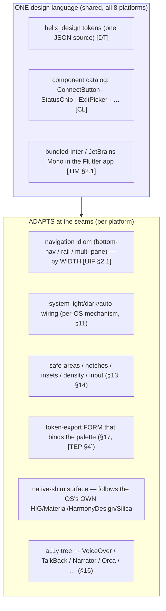
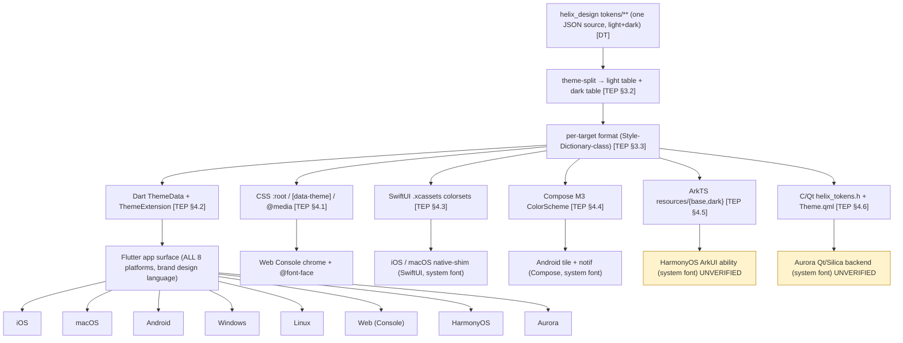

# Platform adaptation — one design language across eight platforms

**Revision:** 2
**Last modified:** 2026-07-04T12:00:00Z

> Master technical specification — Volume 10 (Design System), nano-detail
> deep-dive. This document **owns** how HelixVPN's **one** `helix_design` design
> system adapts to each of the **eight** supported platforms — **iOS, macOS,
> Android, Windows, Linux, Web, HarmonyOS, Aurora** — from a **single Flutter
> codebase** (`helix-ui`) plus the per-platform native tunnel shims. For every
> platform it pins: the **design-language posture** (Material 3 on the Flutter
> app, with the native-shim surface following each OS's own HIG / Material /
> HarmonyDesign / Silica); **which token-export form binds** there
> ([`token-export-pipeline.md`]); the **navigation idiom**; **system theme
> (light / dark / auto) integration**; **safe-areas / notches / insets / density
> / input model** (touch / mouse / remote); **per-platform component
> substitution**; **capability gating** (the Console-web build has no tunnel
> core); and the **per-platform accessibility API** the Flutter `Semantics` tree
> maps onto (VoiceOver / TalkBack / Narrator / Orca / …).
>
> **SPEC-ONLY.** It describes *how the design system meets each platform* — not
> the shipping `helix_design` / `helix-ui` build. The **token model** (tiers,
> schema, theming axes) is owned by [`design-tokens.md`]; the **per-target emit
> forms** (CSS / Dart / SwiftUI / Compose / ArkTS / C-Qt) by
> [`token-export-pipeline.md`]; the **component catalog** (anatomy, states,
> a11y baseline, the no-overlap guarantee) by [`component-library.md`]; the
> **type / icon / motion** families + the per-platform font strategy by
> [`typography-iconography-motion.md`]; the **colours + contrast** by
> [`color-system.md`]; the **Flutter app shell / capability gating / flavor
> model** by [`v04-client/helix-ui-flutter.md`]; the **per-platform tunnel
> shim bodies** by the shim docs ([`v04-client/shim-apple.md`],
> [`shim-android.md`], [`shim-windows.md`], [`shim-linux.md`],
> [`shim-harmonyos.md`], [`shim-aurora.md`]); the **Web Console** by
> [`v04-client/web-console.md`]. This document is **original HelixVPN design
> work**, layered on each framework's documented conventions.
>
> **Boundary with sibling docs.** Owns: the platform-adaptation posture, the
> platform × adaptation matrix, the per-OS system-theme / navigation / safe-area /
> input / a11y mapping, the token→theme→platform binding, the
> brand-consistency-vs-native-feel decision. Consumes: the seven export forms +
> the light/dark theme-split [`token-export-pipeline.md` §3–§4]; the
> width-not-`Platform.isX` `AdaptiveScaffold` rule + the flavor/capability model
> [`helix-ui-flutter.md` §2.1, §5]; the system-font-on-native-shims decision
> (D-TYPE-1) [`typography-iconography-motion.md` §2.2]; the no-overlap /
> no-label-overlay guarantee + the a11y baseline [`component-library.md` §1.3,
> §1.5]; the per-platform shim surface (SwiftUI / Compose / ArkTS / Qt / named
> pipe) [the shim docs]; the no-system-tunnel-in-a-browser structural fact
> [`web-console.md` §1].
>
> **Evidence base.** `[TEP §N]` = `final/v10-design/token-export-pipeline.md`;
> `[CL §N]` = `final/v10-design/component-library.md`; `[DT §N]` =
> `final/v10-design/design-tokens.md`; `[TIM §N]` =
> `final/v10-design/typography-iconography-motion.md`; `[COLOR §N]` =
> `final/v10-design/color-system.md`; `[UIF §N]` =
> `final/v04-client/helix-ui-flutter.md`; `[APPLE §N]` =
> `final/v04-client/shim-apple.md`; `[ANDROID §N]` =
> `final/v04-client/shim-android.md`; `[WIN §N]` =
> `final/v04-client/shim-windows.md`; `[LINUX §N]` =
> `final/v04-client/shim-linux.md`; `[OHOS §N]` =
> `final/v04-client/shim-harmonyos.md`; `[AURORA §N]` =
> `final/v04-client/shim-aurora.md`; `[WEB §N]` =
> `final/v04-client/web-console.md`; `[SPINE §N]` = `final/SPECIFICATION.md`.
> Claims not grounded in the evidence base or in this document's own original
> design choices are tagged `UNVERIFIED` per constitution §11.4.6 — never
> fabricated. HarmonyOS (HarmonyDesign / ArkUI theming) and Aurora (Sailfish
> Silica-Qt) platform specifics are tagged `UNVERIFIED` where they depend on an
> SDK-version-specific fact this document cannot assert; they are pinned +
> re-verified per §11.4.99 before the corresponding surface ships.

---

## Table of contents

- [0. Position & the core adaptation principle](#0-position--the-core-adaptation-principle)
- [1. The adaptation model — what is shared, what adapts](#1-the-adaptation-model--what-is-shared-what-adapts)
- [2. iOS](#2-ios)
- [3. macOS](#3-macos)
- [4. Android](#4-android)
- [5. Windows](#5-windows)
- [6. Linux](#6-linux)
- [7. Web (Console)](#7-web-console)
- [8. HarmonyOS](#8-harmonyos)
- [9. Aurora](#9-aurora)
- [10. The platform × adaptation matrix](#10-the-platform--adaptation-matrix)
- [11. System theme (light / dark / auto) integration per OS](#11-system-theme-light--dark--auto-integration-per-os)
- [12. Navigation idioms & responsive breakpoints](#12-navigation-idioms--responsive-breakpoints)
- [13. Input model, density & the TV-leanback focus model](#13-input-model-density--the-tv-leanback-focus-model)
- [14. Safe-areas, notches & insets](#14-safe-areas-notches--insets)
- [15. Capability gating per platform](#15-capability-gating-per-platform)
- [16. Accessibility APIs per platform](#16-accessibility-apis-per-platform)
- [17. The token → theme → platform binding](#17-the-token--theme--platform-binding)
- [18. Surfaced decisions & cross-doc contracts](#18-surfaced-decisions--cross-doc-contracts)
- [Sources verified](#sources-verified)

---

## 0. Position & the core adaptation principle

HelixVPN ships **three apps** (Client / "Access", Console, Connector) across
**eight platforms** from **one Flutter UI core** (`helix-ui`) plus a thin native
**tunnel shim** per OS [SPINE §3, UIF §0]. The design system is **one** decoupled
submodule (`vasic-digital/helix_design`, §11.4.28/.29/.74) that configures
**OpenDesign** (the mandatory token/theme engine, §11.4.162) and emits its tokens
into **seven** consumable forms [TEP §0].

The central adaptation principle — and the load-bearing design decision of this
document — is:

> **D-PA-1 (decided). One brand design language, adapted at the seams; not a
> wholesale per-OS reskin.** HelixVPN renders **its own** brand design language
> (a Material-3-foundation system via Flutter, OpenDesign-token-driven) **consistently**
> on the Flutter app across all eight platforms. It does **NOT** swap to a fully
> native control set (Cupertino-everywhere on iOS, WinUI-everywhere on Windows).
> The reason is stated verbatim in [TIM §2.1]: a system-font / native-control
> strategy would make "the *connected* label … a different shape per OS, a
> brand-consistency leak" — and the connection-state palette + glyph **must mean
> the same thing** on every platform ([COLOR §3], [CL §2]) so the user's "am I
> protected?" answer is identical everywhere. Adaptation therefore happens at the
> **seams** — navigation idiom, system-theme wiring, safe-areas/insets, input
> model, the per-platform **token-export form** that binds the palette, and the
> **native-shim surface** (which *does* follow each OS's own HIG / Material /
> HarmonyDesign / Silica because it is genuinely native code) — **not** by
> reskinning the shared component catalog. Option B (full per-OS native control
> set) is rejected for the brand-consistency reason above; the honest tradeoff is
> recorded in §18.

This is consistent with [UIF §2.1]'s `AdaptiveScaffold` rule: the shell branches
on **width**, *never* on `Platform.isX` — "a resized desktop window behaves like a
phone; web just works." Platform identity drives *system integration*, not *which
widgets exist*.



**Two kinds of surface per platform.** Every platform has (a) the **Flutter app
surface** (where the user spends ~all their time — full brand design language,
bundled font, the shared catalog), and (b) optionally a **native-shim surface** (a
tiny OS-native config/status UI living in the tunnel extension/service — system
font per D-TYPE-1 [TIM §2.2], native controls). The two carry the **same palette**
(the colour token export reaches both [TEP §4]) but the native-shim surface
follows the OS's own design language because it is genuinely native code.

---

## 1. The adaptation model — what is shared, what adapts

| Concern | Shared (one design language) | Adapts per platform |
|---|---|---|
| Colour palette + connection-state meaning | **yes** — one token source [COLOR §3], light+dark | the **export form** that carries it (CSS / Dart / SwiftUI / Compose / ArkTS / C-Qt) [TEP §4] |
| Components (ConnectButton, StatusChip, …) | **yes** — one catalog [CL §0] | native-shim surface uses native controls (SwiftUI/Compose/ArkUI/Qt) |
| Type ramp + bundled brand font | **yes** in the Flutter app [TIM §1] | native shims use the **system font** (D-TYPE-1) |
| Navigation structure | the responsive `AdaptiveScaffold` rule [UIF §2.1] | bottom-nav vs rail vs multi-pane resolved by **width**, plus per-OS back/affordance idioms |
| Light / dark | **mandatory both** ([TEP] `DS-LIGHT-DARK-COMPLETE`) | the per-OS **auto / system-theme** wiring mechanism (§11) |
| Motion + reduced-motion | one motion-token set [TIM §6] | honoured via each OS's reduce-motion signal (§11, §13) |
| Accessibility semantics | one Flutter `Semantics` tree [CL §1.3] | maps to the OS a11y API (VoiceOver / TalkBack / Narrator / Orca) (§16) |
| Tunnel capability | the `TunnelStatus`-driven UI | **absent on Web** (NoCore) [WEB §3]; present on the other 7 |

> **Honest boundary (§11.4.6).** "One design language" guarantees brand + meaning
> consistency; it does **not** mean pixel-identical rendering — each platform's
> compositor, text-shaper, density, and safe-area geometry differ, and the
> visual-regression suite captures a **per-platform, per-theme** golden, not one
> universal golden ([`visual-regression-and-qa.md`], §11.4.162/.168).

---

## 2. iOS

**Design-language posture.** Flutter app surface = the HelixVPN brand design
language (Material-3-foundation, brand-font bundled). HelixVPN deliberately does
**not** reskin to Cupertino controls (D-PA-1) — the `ConnectButton` / `StatusChip`
are the shared catalog [CL §2, §3]. iOS HIG conventions that **are** honoured
without changing the control set: the system back-swipe gesture, bottom safe-area
respect, large-title-style screen headers via `headline.lg` [TIM §1.1], the
home-indicator inset, and Dynamic-Type-equivalent scaling (the type ramp scales
with the OS text-size setting where Flutter exposes it — `UNVERIFIED` exact
Flutter↔Dynamic-Type binding, pinned per §11.4.99).

**Token binding form.** SwiftUI form [TEP §4.3] — `HelixTokens.swift` +
`.xcassets` **asset-catalog colorsets** (one colorset per themed colour, light +
dark appearance). This is the load-bearing iOS theme carrier: a colorset holds
both appearances and is resolved by `@Environment(\.colorScheme)` **automatically**
by the OS, so the **native-shim surface** (the `NEPacketTunnelProvider` config UI,
SwiftUI [APPLE §1]) gets correct light/dark with zero runtime branching. The
**Flutter app** consumes the Dart `ThemeData` form [TEP §4.2] (`helixLight()` /
`helixDark()`), not the Swift form — the Swift export is for the SwiftUI shim
surface only.

**Navigation idiom.** Compact width (phone) → bottom navigation + single pane
[UIF §2.1]; the Client home is the `ConnectButton` hero [CL §2]. iPad (medium /
expanded) → NavigationRail / multi-pane via the same width rule.

**System theme (light/dark/auto).** Flutter `MaterialApp(themeMode: system)` +
the SwiftUI shim's asset-catalog auto-resolution; both follow the iOS
Appearance setting and switch live on toggle. Light + dark are both first-class
([TEP] `DS-LIGHT-DARK-COMPLETE`).

**Safe-areas / notches / insets.** Notch / Dynamic Island / home-indicator
respected via Flutter `SafeArea` + `MediaQuery.viewPadding`; the `ConnectButton`
hero never renders under the status bar or the home indicator (the [CL §1.5]
no-overlap guarantee extended to device cutouts). Keyboard insets via
`MediaQuery.viewInsets`.

**Density / input.** Touch-first; ≥44×44 pt hit targets are already the [CL §1.3]
floor (Apple HIG's own minimum). No mouse/remote on iPhone; iPad supports pointer
(hover states from [CL §1.2] apply when a trackpad is attached).

**Component substitution.** None at the control level (D-PA-1) — the toggle is the
shared `ShieldToggle` [CL §5], not `UISwitch`. The **only** native-control surface
is the SwiftUI NE-config shim, which uses native SwiftUI `Toggle`/`Label` because
it is native code [APPLE §2].

**Native-shim surface.** SwiftUI, system font (SF Pro / SF Mono) per D-TYPE-1
[TIM §2.2]; same palette via the asset-catalog colorsets [TEP §4.3]. Tiny surface
(a toggle + a status line) — the iOS NE memory ceiling [APPLE §6] forbids bundling
the brand font into the extension.

**Accessibility API.** Flutter `Semantics` → **VoiceOver**; the stateful
`ConnectButton` name ("Connected, direct path, 28 milliseconds") is read on change
via a polite live-region, `Danger` via an assertive announcement [CL §2 a11y].
Dynamic-Type-equivalent text scaling honoured.

---

## 3. macOS

**Design-language posture.** Same brand design language as iOS, **desktop-class**.
HelixVPN does not adopt AppKit/SwiftUI native controls for the Flutter surface
(D-PA-1); it honours macOS conventions that do not require a control swap: window
chrome / traffic-light inset, menu-bar integration (a status-item / menu-bar VPN
toggle is a natural macOS affordance — `UNVERIFIED` whether MVP ships a menu-bar
extra; surfaced §18), keyboard-first navigation, and pointer hover states [CL §1.2].

**Token binding form.** SwiftUI form [TEP §4.3] for the native (System Extension)
shim surface; Dart `ThemeData` for the Flutter app. macOS does **not** share the
iOS NE memory ceiling [APPLE §6.5], so the desktop shim surface is not size-constrained.

**Navigation idiom.** Expanded width → extended NavigationRail + multi-pane
[UIF §2.1] (macOS windows are large); resizing the window down reflows to
rail/bottom-nav by the same width rule.

**System theme.** `themeMode: system` + the asset-catalog auto-resolution follow
the macOS Appearance (Light / Dark / Auto) setting; the macOS "graphite/accent"
tint is **not** adopted for the brand accent (the connection-state palette is
brand-fixed [COLOR §3]).

**Safe-areas / insets.** No notch on most Macs (notebook camera-housing menubar
inset handled by the OS); window title-bar inset respected. Keyboard insets are
N/A (desktop).

**Density / input.** Pointer + keyboard first: focus rings always visible
([CL §1.2] `focusRing`), full keyboard navigation, a `⌘K` command palette on the
Console [WEB §5.1]/[UIF]. `≥44 px` hit targets still apply (pointer precision does
not relax the a11y floor, but `sm`/`md` densities [CL §1.6] are appropriate for
dense desktop tables).

**Component substitution.** None at the control level. The native shim surface (if
a separate System-Extension config window exists) is SwiftUI/AppKit-native.

**Native-shim surface.** SwiftUI, system font [TIM §2.2]; same palette
[TEP §4.3]. Desktop-class memory.

**Accessibility API.** Flutter `Semantics` → **VoiceOver** (macOS); full keyboard
navigation + focus order [CL §1.3]; macOS "Increase contrast" / "Reduce motion"
accessibility settings honoured (reduce-motion degrades the connect pulse to a
static ring [CL §2, TIM §8]).

---

## 4. Android

**Design-language posture.** Flutter renders **Material 3** natively here — the
brand design language *is* a Material-3-foundation system [UIF §2.1], so Android is
the most "native-feeling" of the eight without any reskin: `ThemeData(useMaterial3:
true)` + the generated `lightColorScheme()` / `darkColorScheme()` [TEP §4.4]. The
system **back button / gesture** and predictive-back are honoured by Flutter's
navigator. Material's edge-to-edge + dynamic-color (Material You) is **not** adopted
for the brand accent (the connection-state palette is brand-fixed [COLOR §3]); the
M3 `primary/surface/error` slots carry the brand + error mapping while the
connection-state colours are exposed as `HelixColors` tokens the `StatusChip` /
`ConnectButton` read directly [TEP §4.4].

**Token binding form.** Jetpack **Compose** form [TEP §4.4] —
`HelixTokens.kt` + M3 `lightColorScheme`/`darkColorScheme` — for the **native-shim
surfaces** (the quick-settings **tile** and the `VpnService` foreground-service
**notification** [ANDROID §7]). The Flutter app uses the Dart `ThemeData` form
[TEP §4.2].

**Navigation idiom.** Compact → `BottomNavigationBar`; medium → NavigationRail;
expanded (foldables / tablets / Chromebooks) → extended rail / multi-pane, all by
width [UIF §2.1]. The foreground-service notification (an Android requirement to
survive background-kill [ANDROID §7]) reflects `TunnelStatus` text
("Protected · masque-h3 · 23 ms") [ANDROID §8.3].

**System theme.** `themeMode: system` follows the Android Dark-theme setting;
Compose shim surfaces follow `isSystemInDarkTheme()`; light + dark mandatory.

**Safe-areas / insets.** Display cutouts / gesture-nav inset / status + nav bars
via Flutter `SafeArea` + `MediaQuery`; edge-to-edge handled so content never sits
under the system bars (no-overlap [CL §1.5]). IME insets via `viewInsets`.

**Density / input.** Touch-first; foldable + Chromebook (mouse/keyboard) supported
via the width rule + hover states [CL §1.2]. **Android TV** is the platform where
the **TV-leanback focus model** applies (§13): D-pad focus traversal, `xl`
component size + a larger focus ring [CL §1.6]. `UNVERIFIED` whether Android TV is
an MVP target vs Phase-2 — the leanback design is specified but the ship-gating is
[SPINE §3]-dependent; marked here, not assumed.

**Component substitution.** None at the control level — the shared `ShieldToggle`
[CL §5], not a raw `Switch`. The native quick-settings tile is a Compose-native
`Tile` because it is OS-native code [ANDROID §7].

**Native-shim surface.** Compose, system font (Roboto) per D-TYPE-1 [TIM §2.2];
same palette via the generated M3 `ColorScheme` [TEP §4.4]. The
quick-settings tile + the persistent notification.

**Accessibility API.** Flutter `Semantics` → **TalkBack**; the stateful
ConnectButton name + live-region announcements [CL §2]; TV-leanback focus order is
deterministic and D-pad-navigable (§13).

---

## 5. Windows

**Design-language posture.** Flutter app surface = the brand design language
(Material-3-foundation), **not** WinUI/Fluent controls (D-PA-1). Windows
conventions honoured without a control swap: window chrome / title-bar,
keyboard-first + pointer hover, system tray affordance (a tray icon + connect
toggle is a natural Windows VPN idiom — `UNVERIFIED` whether MVP ships a tray
integration; surfaced §18), and the Mica/acrylic backdrop is **not** adopted (the
brand surface tokens are fixed [COLOR §2]).

**Token binding form.** The Flutter app uses the Dart `ThemeData` form [TEP §4.2].
**Windows has no Flutter-bundled native-shim UI surface in the design sense** — the
privileged tunnel core runs in a **SYSTEM service** (`HelixTunnelSvc`, C#/Rust) the
unprivileged Flutter app talks to over a **named pipe** (`\\.\pipe\helixvpn`); the
Dart `TunnelPlatform` impl is `WindowsPipeTunnelPlatform`, not the default
MethodChannel [UIF §4.4, WIN]. The service has **no UI** — there is no SwiftUI/Compose-class
shim surface to theme; all user-facing UI is the Flutter app. (`UNVERIFIED` exact
service↔app theme-handoff details — pinned against [WIN] before that surface ships.)

**Navigation idiom.** Expanded width (desktop windows are large) → extended
NavigationRail / multi-pane [UIF §2.1]; reflows to rail/bottom-nav on resize.

**System theme.** `themeMode: system` follows the Windows "Choose your mode"
(Light / Dark) setting + the high-contrast themes; the Windows **accent colour** is
**not** adopted for the brand accent (connection-state palette is brand-fixed
[COLOR §3]). Light + dark mandatory; the CSS/Compose/Swift forms are not used on
Windows — only Dart `ThemeData`.

**Safe-areas / insets.** No device notches; window-edge + title-bar insets only.
Keyboard insets N/A (desktop).

**Density / input.** Pointer + keyboard first — focus rings, `⌘`/`Ctrl`-K palette
(Console), full keyboard nav; `sm`/`md` densities for dense tables [CL §1.6].

**Component substitution.** None at the control level.

**Native-shim surface.** None in the themed sense (headless SYSTEM service); same
palette is irrelevant to the service (no UI). All UI is brand-design-language
Flutter.

**Accessibility API.** Flutter `Semantics` → **Narrator** (UI Automation);
keyboard focus order + visible focus rings [CL §1.3]; Windows "Show animations" /
high-contrast honoured (reduce-motion → static states [TIM §8]).

---

## 6. Linux

**Design-language posture.** Flutter app surface = the brand design language,
**not** GTK/libadwaita or Qt native controls (D-PA-1). Linux desktops are diverse
(GNOME / KDE / others); HelixVPN renders the **same** brand system regardless of DE
rather than chasing per-DE theming — which keeps the connection-state meaning
identical and avoids a per-DE matrix the project cannot fully verify
(`UNVERIFIED` per-DE theme-integration depth — beyond following the freedesktop
dark-mode preference, see below).

**Token binding form.** Dart `ThemeData` [TEP §4.2] for the Flutter app. The Linux
tunnel shim is a native helper (wireguard/tun via a privileged path [LINUX]) with
**no themed UI surface** — all UI is the Flutter app.

**Navigation idiom.** Expanded → extended NavigationRail / multi-pane [UIF §2.1];
width-reflow.

**System theme.** `themeMode: system` follows the freedesktop / XDG dark-mode
preference (`org.freedesktop.appearance color-scheme`) where the desktop exposes it
and Flutter surfaces it (`UNVERIFIED` exact Flutter-Linux dark-preference binding
across DEs — pinned per §11.4.99; the safe default is a manual light/dark toggle in
HelixVPN settings so the user is never stuck on the wrong theme). Light + dark mandatory.

**Safe-areas / insets.** No device notches; window-edge insets only.

**Density / input.** Pointer + keyboard first — focus rings, palette, full keyboard
nav, dense-table densities [CL §1.6].

**Component substitution.** None at the control level.

**Native-shim surface.** None in the themed sense (headless privileged tunnel
helper [LINUX]); all UI is brand-design-language Flutter.

**Accessibility API.** Flutter `Semantics` → **Orca** (AT-SPI / ATK); keyboard
focus order + visible focus rings [CL §1.3]; reduce-motion honoured where the DE
exposes the preference (`UNVERIFIED` per-DE reduce-motion signal — manual setting
fallback, never a silent ignore §11.4.6).

---

## 7. Web (Console)

**Design-language posture.** The Web flavor is the **Console only** — the admin app
[WEB §0]; **Access and Connector do not build to Web** because a browser cannot
open a system TUN ([WEB §1], §11.4.112 structural fact). It renders the **same**
brand design language as the desktop Console build (one Flutter web app, CanvasKit
default / `--wasm` for heavy tables [WEB §2.4]) — never Electron, never a
webview-wrap [WEB §9]. The Console is admin-dense (tables, policy editor, topology)
so it leans desktop conventions (pointer + keyboard, `⌘K`/`Ctrl-K` palette).

**Token binding form.** **CSS custom properties** [TEP §4.1] —
`dist/css/helix.css` with `:root` (light) + `[data-theme="dark"]` (dark) + a
`@media (prefers-color-scheme: dark)` block so OS dark works without an explicit
attribute. This is the **only** platform where the CSS export is the theme carrier
(every other platform uses the Dart `ThemeData` form for the Flutter app). The
Flutter web build also carries the Dart `ThemeData` form for its own widgets; the
`helix.css` is for web chrome / `@font-face` self-hosting [TIM §2.2].

**Navigation idiom.** Width-responsive [WEB §5]: compact (<600) → bottom-nav +
single pane; medium (600–1024) → NavigationRail + master/detail; expanded (>1024) →
extended rail + multi-pane (list | detail | live events). Path-based clean URLs +
route-level deferred loading of heavy admin modules [WEB §2.4]. WS/SSE-driven live
data (push, never poll) with a "reconnecting… last updated HH:MM:SS" honesty banner
[WEB §7.3].

**System theme.** `prefers-color-scheme` via the `@media` block in `helix.css`
[TEP §4.1] + Flutter `themeMode: system`; an explicit `data-theme` attribute
overrides for a manual toggle. Light + dark mandatory; admins skew dark [WEB §5.3].

**Safe-areas / insets.** Browser viewport — no device cutouts (mobile-web uses the
browser's own chrome insets); responsive reflow handles small viewports.

**Density / input.** Pointer + keyboard first (the most desktop-like platform):
focus rings, `⌘K`/`Ctrl-K` command palette, full keyboard nav [WEB §5.1].

**Component substitution.** None — the same shared catalog. The **`StatusChip`** is
reused **only** by the optional browser-scoped WASM-proxy chip (Phase 3), driven by
a **distinct** `ProxyStatus` type (never `TunnelStatus`) with explicit "this tab
only — not a device VPN" honesty copy [WEB §8.4/§8.5]. There is **no
`ConnectButton`** on Web (no tunnel capability — tree-shaken [WEB §4]).

**Capability gating.** `Capability.admin` only — **no `Capability.tunnel`**, so
`helixCoreProvider` resolves to `NoCore` and every tunnel widget (`ConnectButton`,
`ShieldToggle`, `ExitPicker`) is tree-shaken out [WEB §4]; the `CM-WEB-NO-CORE-FFI`
build gate asserts zero `helix_core_ffi`/`dart:ffi` in the web graph [WEB §2.3].

**Native-shim surface.** None (browser sandbox). The optional in-page **WASM MASQUE
proxy** is page-scoped, not a system VPN [WEB §8].

**Accessibility API.** Flutter web emits **ARIA** roles (the [CL §1.3] roles map
to DOM ARIA); state announced not colour-only [WEB §5.3]; the topology graph ships
a `treegrid` non-visual fallback alongside the visual canvas [CL §9].

---

## 8. HarmonyOS

**Design-language posture.** Flutter app surface = the brand design language via
the **OpenHarmony Flutter SIG fork** (`flutter-ohos`, pinned per fork [UIF §1.4]) —
the same shared catalog [CL]. HelixVPN does **not** reskin to HarmonyDesign / ArkUI
native components for the Flutter surface (D-PA-1). HarmonyDesign / ArkUI
conventions are honoured **only** on the **native-shim surface** (the
`VpnExtensionAbility`, ArkTS/ArkUI [UIF §4.4, OHOS]) — its toggle + status line use
native ArkUI components because that surface is genuinely ArkTS code.
`UNVERIFIED`: the precise HarmonyDesign navigation / component conventions the
ArkUI shim should follow are HarmonyOS-SDK-version-dependent and are pinned +
re-verified per §11.4.99 against the live HarmonyOS docs before the ArkTS surface
ships — **not** asserted here (§11.4.6).

**Token binding form.** **ArkTS** form [TEP §4.5] — `helix_tokens.ets` + the
HarmonyOS resource qualifier tree (`resources/base/element/color.json` = light,
`resources/dark/element/color.json` = dark; the OS resolves the qualifier by system
theme). `UNVERIFIED` (U-EXP-1 [TEP §4.5]): the exact `$r('app.color.…')` resolver
key form + the `resources/dark/` qualifier directory name are SDK-version-dependent
— pinned per §11.4.99 before the ArkTS exporter ships. The **Flutter app** uses the
Dart `ThemeData` form [TEP §4.2] (the Flutter SIG fork renders Dart themes); the
ArkTS form is for the ArkUI shim surface only.

**Navigation idiom.** Width-responsive `AdaptiveScaffold` on the Flutter surface
[UIF §2.1]; the native ArkUI shim follows HarmonyDesign navigation (`UNVERIFIED`
specifics, §11.4.99).

**System theme.** The ArkTS `resources/{base,dark}` qualifier tree resolves
light/dark by the HarmonyOS system theme automatically [TEP §4.5]; the Flutter app
uses `themeMode: system`. Light + dark mandatory. `UNVERIFIED`: the exact
HarmonyOS dark-theme system signal Flutter surfaces — pinned per §11.4.99.

**Safe-areas / insets.** HarmonyOS device cutouts / system bars handled via
Flutter `SafeArea` + `MediaQuery` on the Flutter surface (`UNVERIFIED` SIG-fork
inset parity with mainline — pinned per §11.4.99); the ArkUI shim uses native ArkUI
safe-area APIs.

**Density / input.** Touch-first (phones / tablets); the brand font is bundled in
the Flutter app, the ArkUI shim uses the system font (HarmonyOS Sans) per D-TYPE-1
[TIM §2.2].

**Component substitution.** None on the Flutter surface; the native ArkUI shim uses
native ArkUI controls (it is ArkTS code) [OHOS].

**Native-shim surface.** ArkTS / ArkUI `VpnExtensionAbility`, system font [TIM §2.2];
same palette via the `resources/{base,dark}` qualifier export [TEP §4.5].

**Accessibility API.** Flutter `Semantics` → the HarmonyOS accessibility tree
(`UNVERIFIED` exact HarmonyOS screen-reader / a11y service name + the SIG-fork
`Semantics` mapping — pinned per §11.4.99; the [CL §1.3] semantic roles are emitted
regardless, never colour-only).

---

## 9. Aurora

**Design-language posture.** Flutter app surface = the brand design language via
the **OMP `flutter-aurora` fork** (pinned per fork [UIF §1.4]) — the same shared
catalog [CL]. HelixVPN does **not** reskin to Sailfish **Silica** (the Aurora/
Sailfish Qt component set) for the Flutter surface (D-PA-1). Silica-Qt conventions
are honoured **only** on the **native-shim surface** (the Qt/C++ tunnel backend's
config UI, if present [UIF §4.4, AURORA]) because that is genuinely Qt code.
`UNVERIFIED`: the precise Silica navigation / gesture conventions (Sailfish's
pulley-menu / cover idioms) the Qt shim should follow are Aurora-SDK-version-dependent
and are pinned + re-verified per §11.4.99 before that surface ships — **not**
asserted here (§11.4.6). Aurora is the **ru-market** platform (`ru` is a
first-tier locale [UIF §2.5]), so localized connection-state legibility matters
most here.

**Token binding form.** **C / Qt** form [TEP §4.6] — `helix_tokens.h` (`#define`
constants) + `Theme.qml` (a QML singleton exposing a `light`/`dark` property set,
switched by a `dark` property) — for the Qt/C++ shim surface. `UNVERIFIED`
(U-EXP-2 [TEP §4.6]): the exact QML singleton registration (`qmldir` /
`.qrc` / module-import form) is Aurora-Qt-version-dependent — pinned per §11.4.99
before the C/Qt exporter ships. The **Flutter app** uses the Dart `ThemeData` form
[TEP §4.2] (the Aurora Flutter fork renders Dart themes); the C/Qt form is for the
Qt shim surface only.

**Navigation idiom.** Width-responsive `AdaptiveScaffold` on the Flutter surface
[UIF §2.1]; the native Qt/Silica shim follows Sailfish navigation (`UNVERIFIED`
pulley-menu / cover specifics, §11.4.99).

**System theme.** The QML `Theme.qml` singleton's `dark` property switches the
Qt-shim light/dark set [TEP §4.6]; the Flutter app uses `themeMode: system`.
Sailfish's **ambience** system (user-chosen accent + light/dark) is **not** adopted
for the brand accent (the connection-state palette is brand-fixed [COLOR §3]);
`UNVERIFIED` whether the Aurora ambience light/dark signal drives `Theme.qml.dark`
automatically vs a manual toggle — pinned per §11.4.99. Light + dark mandatory.

**Safe-areas / insets.** Aurora device geometry handled via the Flutter fork's
`SafeArea`/`MediaQuery` (`UNVERIFIED` fork inset parity — pinned per §11.4.99) on
the Flutter surface; the Qt shim uses native Qt safe-area handling.

**Density / input.** Touch-first; brand font bundled in the Flutter app, the Qt
shim uses the system font per D-TYPE-1 [TIM §2.2].

**Component substitution.** None on the Flutter surface; the native Qt shim uses
native Silica-Qt controls [AURORA].

**Native-shim surface.** Qt / C++ (Silica), system font [TIM §2.2]; same palette
via the `helix_tokens.h` + `Theme.qml` export [TEP §4.6].

**Accessibility API.** Flutter `Semantics` → the Aurora/Qt accessibility tree
(`UNVERIFIED` exact Aurora screen-reader + the Qt-shim `QAccessible` mapping —
pinned per §11.4.99; the [CL §1.3] semantic roles are emitted regardless, never
colour-only). Localized state strings (`ru`) are first-class [UIF §2.5].

---

## 10. The platform × adaptation matrix

| Platform | Flutter-app design language | Token-export form (shim surface) | Nav idiom (by width) | System-theme mechanism | Native-shim surface | Input | A11y API |
|---|---|---|---|---|---|---|---|
| **iOS** | brand (M3-foundation), bundled font | SwiftUI `.xcassets` colorsets [TEP §4.3] | bottom-nav / rail (iPad) | `colorScheme` auto + `themeMode:system` | SwiftUI NE-config (system font) | touch (+pointer iPad) | VoiceOver |
| **macOS** | brand, desktop-class | SwiftUI colorsets [TEP §4.3] | extended rail / multi-pane | `colorScheme` auto + `themeMode:system` | SwiftUI/AppKit (system font) | pointer + keyboard | VoiceOver |
| **Android** | brand = **M3 native** [UIF §2.1] | Compose M3 `ColorScheme` [TEP §4.4] | bottom-nav → rail → multi-pane | `isSystemInDarkTheme()` + `themeMode:system` | Compose tile + notif (system font) | touch (+ TV D-pad, §13) | TalkBack |
| **Windows** | brand | Dart `ThemeData` (no themed shim) [TEP §4.2] | extended rail / multi-pane | `themeMode:system` (Win mode) | none (SYSTEM service, no UI) [WIN] | pointer + keyboard | Narrator |
| **Linux** | brand (DE-agnostic) | Dart `ThemeData` (no themed shim) [TEP §4.2] | extended rail / multi-pane | XDG `color-scheme` + `themeMode:system` `UNVERIFIED` | none (privileged helper) [LINUX] | pointer + keyboard | Orca (AT-SPI) |
| **Web** | brand (Console only) | **CSS** `:root`/`[data-theme]`/`@media` [TEP §4.1] | bottom-nav → rail → multi-pane | `prefers-color-scheme` + `data-theme` | none (browser sandbox) | pointer + keyboard | ARIA |
| **HarmonyOS** | brand (SIG fork) | **ArkTS** `resources/{base,dark}` [TEP §4.5] `UNVERIFIED` | `AdaptiveScaffold` by width | resource qualifier auto `UNVERIFIED` | ArkTS/ArkUI ability (system font) | touch | HarmonyOS a11y `UNVERIFIED` |
| **Aurora** | brand (OMP fork) | **C/Qt** `.h` + `Theme.qml` [TEP §4.6] `UNVERIFIED` | `AdaptiveScaffold` by width | QML `Theme.qml.dark` `UNVERIFIED` | Qt/Silica backend (system font) | touch | Qt/Aurora a11y `UNVERIFIED` |

Every row ships **light + dark** ([TEP] `DS-LIGHT-DARK-COMPLETE`) and a
per-platform / per-theme golden in the visual-regression suite (§11.4.162/.168,
[`visual-regression-and-qa.md`]). Web is the only row with **no tunnel capability**
(NoCore [WEB §4]).

---

## 11. System theme (light / dark / auto) integration per OS

Light **and** dark are mandatory on every platform — a target emitting one theme
fails the [TEP] `DS-LIGHT-DARK-COMPLETE` gate. The **mechanism** that picks the OS
theme differs per platform; the **values** are the same token source [DT §5.1],
theme-split into a light table + a dark table at export [TEP §3.2].

| Platform | Auto/system-theme signal | Carrier form | Manual override |
|---|---|---|---|
| iOS / macOS | OS Appearance → `@Environment(\.colorScheme)` (shim) + `themeMode:system` (Flutter) | asset-catalog colorset (both appearances) [TEP §4.3] | in-app light/dark toggle (Flutter `themeMode`) |
| Android / HarmonyOS | Dark-theme setting → `isSystemInDarkTheme()` / resource qualifier + `themeMode:system` | Compose `ColorScheme` [TEP §4.4] / ArkTS `resources/dark` [TEP §4.5] | in-app toggle |
| Windows | "Choose your mode" + high-contrast → `themeMode:system` | Dart `ThemeData` [TEP §4.2] | in-app toggle |
| Linux | XDG `org.freedesktop.appearance color-scheme` `UNVERIFIED` → `themeMode:system` | Dart `ThemeData` [TEP §4.2] | in-app toggle (the safe default when the DE signal is unavailable) |
| Web | `prefers-color-scheme` (`@media`) + `data-theme` attribute | CSS custom properties [TEP §4.1] | `data-theme="light\|dark"` toggle |
| Aurora | ambience light/dark `UNVERIFIED` → `Theme.qml.dark` | C/Qt `Theme.qml` singleton [TEP §4.6] | in-app toggle |

> **Honesty (§11.4.6).** Where the OS auto-theme signal is `UNVERIFIED` (Linux XDG,
> HarmonyOS qualifier, Aurora ambience), the **safe default is a manual in-app
> light/dark toggle** so the user is never stranded on the wrong theme — the auto
> binding is added once verified per §11.4.99, never guessed.

System dark-mode interplay with the connection-state palette: on **dark** the
`ConnectButton` ring glow renders brighter (the `.500` state stops) and the
`connected` glow has higher alpha so the halo reads on `#151920` [CL §2]; the white
on-state label stays white in both themes (proven AA on the coloured fill,
[COLOR §4.3]). Reduce-motion (an OS accessibility setting on every platform)
degrades the `Connecting`/`Reconnecting` pulse to a static ring via
`motion.semantic.reducedMotion` [TIM §8, CL §1.3].

---

## 12. Navigation idioms & responsive breakpoints

The navigation structure is resolved by **width, not `Platform.isX`** — the single
`AdaptiveScaffold` rule [UIF §2.1, WEB §5] — so the same build behaves correctly on
a phone, a resized desktop window, a foldable, and the web:

```
compact  (< 600 px)    → BottomNavigationBar · single pane
medium   (600–1024 px) → NavigationRail · master/detail
expanded (> 1024 px)   → extended NavigationRail · multi-pane (list | detail | live)
```

Per-platform navigation idioms layered on top of the width rule:

| Platform | Layered idiom |
|---|---|
| iOS | system back-swipe; large-title-style headers (`headline.lg`); bottom-nav on phone |
| macOS / Windows / Linux | window chrome; menu/tray affordance `UNVERIFIED` (§18); `⌘K`/`Ctrl-K` palette (Console); extended rail |
| Android | system back / predictive-back; foreground-service notification mirrors status [ANDROID §8.3]; foldable multi-pane |
| Web | path-based clean URLs; route-level deferred loading; WS/SSE live panes with staleness banner [WEB §5/§7.3] |
| HarmonyOS | HarmonyDesign navigation on the ArkUI shim `UNVERIFIED` (§11.4.99) |
| Aurora | Sailfish pulley-menu / cover idioms on the Qt shim `UNVERIFIED` (§11.4.99) |

The Client home is always the `ConnectButton` hero [CL §2]; the Console is the
admin shell (Tenants · Devices · Networks · Policy · Audit · Topology) [WEB §5.1];
the Connector is the appliance dashboard (the headless Connector entrypoint has no
UI at all [UIF §5.4]).

---

## 13. Input model, density & the TV-leanback focus model

| Input model | Platforms | Design consequence |
|---|---|---|
| **Touch** | iOS (iPhone), Android (phone/tablet), HarmonyOS, Aurora, iPad (no pointer) | ≥44×44 px hit targets (the [CL §1.3] floor); `md`/`lg` densities [CL §1.6] |
| **Pointer + keyboard** | macOS, Windows, Linux, Web; iPad w/ trackpad; Chromebook | always-visible focus rings [CL §1.2]; `⌘K` palette; `sm`/`md` dense tables; hover states |
| **Remote (D-pad)** | TV-leanback (Android TV `UNVERIFIED` MVP-gating) | `xl` component size + a **larger focus ring** [CL §1.6]; deterministic D-pad focus order |

**The TV-leanback focus model.** Where HelixVPN runs on a 10-foot TV surface (the
leanback context [SPINE §3]), the design adapts: components use the `xl` size
(56 px min height [CL §1.6]), the focus ring is enlarged so it reads across the
room, and focus traversal is **D-pad-driven** with a deterministic, predictable
order (no mouse, no touch) — the [CL §1.2] focus model with a TV-scaled ring. This
is the one place the **size token** (`xl`) and the focus affordance change by
platform context rather than by width. `UNVERIFIED`: which of the eight platforms
actually ships a TV-leanback surface in MVP (Android TV is the natural candidate)
vs Phase-2 — the leanback design is specified but the ship-gating is
[SPINE §3]-dependent; marked, not assumed (§11.4.6).

Density never relaxes the a11y floor: a visually-`sm` 32 px control still keeps a
44 px transparent tap area centred on its glyph [CL §1.6]; pointer precision on
desktop allows denser tables but the focus ring + keyboard path remain.

---

## 14. Safe-areas, notches & insets

Handled uniformly on the **Flutter surface** via `SafeArea` + `MediaQuery`
(`viewPadding` for cutouts/bars, `viewInsets` for the keyboard) so the [CL §1.5]
no-overlap / no-label-overlay guarantee extends to device geometry — the
`ConnectButton` hero never renders under a status bar, notch, home indicator, or
IME.

| Platform | Insets handled |
|---|---|
| iOS | notch / Dynamic Island / home-indicator / status bar / keyboard |
| Android | display cutouts / gesture-nav bar / status + nav bars / IME (edge-to-edge) |
| HarmonyOS | device cutouts / system bars / IME (`UNVERIFIED` SIG-fork parity — §11.4.99) |
| Aurora | device geometry / system bars (`UNVERIFIED` fork parity — §11.4.99) |
| macOS / Windows / Linux | window-edge + title-bar insets; no device cutouts; keyboard N/A |
| Web | browser viewport; mobile-web browser-chrome insets; responsive reflow |

The native-shim surfaces (SwiftUI / Compose / ArkUI / Qt) use their **own** native
safe-area APIs because they are native code — the Flutter `SafeArea` applies only
to the Flutter surface.

---

## 15. Capability gating per platform

Capability gating ([UIF §5.3]) decides which features compile into a flavor; it is
also the mechanism that lets **Web omit the tunnel core** entirely.

| Capability | iOS | macOS | Android | Windows | Linux | Web | HarmonyOS | Aurora |
|---|---|---|---|---|---|---|---|---|
| `tunnel` (ConnectButton, ShieldToggle, ExitPicker, core_ffi) | ● | ● | ● | ● | ● | — (NoCore) | ● | ● |
| `account` (Access) | ● | ● | ● | ● | ● | — | ● | ● |
| `admin` (Console screens) | (Console build) | ● | (Console build) | ● | ● | ● | (Console build) | (Console build) |

> The **Web** column is the load-bearing exception: `Capability.tunnel` is
> **absent**, so `helixCoreProvider` = `NoCore`, every tunnel widget is
> tree-shaken, and the `CM-WEB-NO-CORE-FFI` gate asserts no `dart:ffi` reaches the
> web bundle [WEB §2.3/§4]. On the other seven platforms the tunnel capability is
> present and the `ConnectButton` is the hero. Console builds to desktop on
> macOS/Windows/Linux too (admin from a workstation), and to Web; Access/Connector
> build to the seven native platforms but **not** Web [WEB §0].

---

## 16. Accessibility APIs per platform

One Flutter `Semantics` tree [CL §1.3] (roles, names, focus order, live-regions)
maps to each OS's accessibility API. The semantic content is identical across
platforms — only the OS-side service differs:

| Platform | A11y service | Notes |
|---|---|---|
| iOS / macOS | **VoiceOver** | stateful ConnectButton name read on change (polite); `Danger` assertive [CL §2] |
| Android | **TalkBack** | same live-region pattern; TV-leanback D-pad focus order (§13) |
| Windows | **Narrator** (UI Automation) | keyboard focus order + visible rings [CL §1.3] |
| Linux | **Orca** (AT-SPI / ATK) | keyboard nav; reduce-motion via DE preference `UNVERIFIED` |
| Web | **ARIA** (DOM roles) | the [CL §1.3] roles → ARIA; topology graph `treegrid` fallback [CL §9] |
| HarmonyOS | HarmonyOS a11y tree `UNVERIFIED` | SIG-fork `Semantics` mapping pinned per §11.4.99 |
| Aurora | Qt/Aurora a11y (`QAccessible`) `UNVERIFIED` | localized (`ru`) state strings first-class [UIF §2.5] |

Cross-cutting a11y guarantees that hold on **every** platform [CL §1.3]: explicit
roles + non-empty accessible names; ≥44 px hit targets; AA-normal 4.5 / AA-large
3.0 / non-text 3.0 contrast proven in both themes [COLOR §4]; reduce-motion →
static end-state [TIM §8]; **colour-independence** — every coloured state also
carries a glyph + text, so the `Connected` vs `Not protected` distinction survives
for a colour-blind user without the green/red [COLOR §0, CL §1.3]. This is itself
a §11.4.162 mandate (no element overlaps a label) verified per platform/theme by
the visual-regression golden.

---

## 17. The token → theme → platform binding



The **Flutter app surface** on every platform binds the **Dart `ThemeData`** form
[TEP §4.2] — one consistent brand design language. The **other five forms** bind
the **native-shim surface** of their platform (SwiftUI colorsets on Apple, Compose
on Android, ArkTS on HarmonyOS, C/Qt on Aurora) and the **CSS** form binds web
chrome. All six forms are generated from the **same** JSON source, so the palette
is byte-faithful across every platform (the [TEP §5] drift gate proves no platform
theme diverges from source).

---

## 18. Surfaced decisions & cross-doc contracts

| id | Decision / contract | Status |
|---|---|---|
| **D-PA-1** | **One brand design language adapted at the seams, not a per-OS native control reskin.** Flutter app = the shared catalog on all 8 platforms (brand-consistency: the connect label must not differ in shape per OS [TIM §2.1]); native-shim surfaces follow each OS's own HIG/Material/HarmonyDesign/Silica because they are native code. Option B (full per-OS native control set) rejected for brand consistency. | decided |
| **D-PA-2** | **Token-export form per surface** — Flutter app = Dart `ThemeData`; iOS/macOS shim = SwiftUI colorsets; Android shim = Compose M3; HarmonyOS shim = ArkTS resources; Aurora shim = C/Qt; Web chrome = CSS [TEP §4]. | decided (per §17) |
| **D-PA-3** | **Theme is system-driven by default with a manual in-app override** on every platform; where the OS auto-signal is `UNVERIFIED` (Linux XDG / HarmonyOS qualifier / Aurora ambience), the manual toggle is the safe default until the auto binding is verified per §11.4.99. | decided (§11) |
| **D-PA-4** `UNVERIFIED` | **TV-leanback surface** — `xl` size + enlarged D-pad focus ring [CL §1.6]; which platform ships it in MVP (Android TV candidate) vs Phase-2 is [SPINE §3]-dependent — pinned, not assumed. | open |
| **D-PA-5** `UNVERIFIED` | **Desktop menu-bar / system-tray affordance** (macOS menu-bar extra, Windows tray, Linux indicator) — a natural VPN idiom; whether MVP ships it is surfaced, not silently decided (§11.4.66). | open |
| **C-PA-A** (consumes) | The seven export forms + the light/dark theme-split + the drift gate [TEP §3–§5] — this doc maps each form to its platform surface; a new form is a new platform binding here. | contract |
| **C-PA-B** (consumes) | The width-not-`Platform.isX` `AdaptiveScaffold` rule + the flavor/capability model [UIF §2.1, §5] — navigation + capability gating are resolved by width/capability, not OS identity. | contract |
| **C-PA-C** (consumes) | D-TYPE-1 (native shims use the **system font**, the Flutter app the bundled brand font) [TIM §2.2] — this doc applies it per platform. | contract |
| **C-PA-D** (consumes) | The no-system-tunnel-in-a-browser structural fact + the Console-only Web build + NoCore [WEB §1/§4] — the Web row's capability gating. | contract |
| **U-PA-1** `UNVERIFIED` | HarmonyOS HarmonyDesign / ArkUI navigation + a11y + dark-signal specifics — pinned + re-verified per §11.4.99 before the ArkTS surface ships (composes [TEP] U-EXP-1). | open |
| **U-PA-2** `UNVERIFIED` | Aurora Sailfish-Silica navigation (pulley/cover) + ambience dark-signal + a11y specifics — pinned per §11.4.99 before the C/Qt surface ships (composes [TEP] U-EXP-2/U-EXP-3). | open |
| **U-PA-3** `UNVERIFIED` | Linux per-DE dark-preference + reduce-motion signal depth (GNOME/KDE/…) — manual toggle fallback until verified per §11.4.99. | open |

---

## Sources verified

- **The platform-adaptation posture (one brand design language adapted at the
  seams; the per-platform navigation / system-theme / safe-area / input / a11y
  mapping; the platform × adaptation matrix; the token→theme→platform binding)** —
  **NO external source needed — original HelixVPN design work**, layered on each
  framework's documented conventions (Flutter `AdaptiveScaffold` / `Semantics` /
  `SafeArea` / `themeMode`; SwiftUI asset-catalog colorsets; Compose Material 3
  `ColorScheme`; HarmonyOS resource qualifiers; Qt QML; CSS `prefers-color-scheme`;
  the platform a11y services VoiceOver / TalkBack / Narrator / Orca / ARIA). The
  per-platform idioms are each framework's documented conventions; the *adaptation
  model* (what is shared vs what adapts, and D-PA-1) is HelixVPN's own design.
- **The seven token-export forms + the light/dark theme-split + the drift gate +
  every per-target output sample, and the `UNVERIFIED` markers U-EXP-1 (ArkTS
  resolver), U-EXP-2 (QML registration), U-EXP-3 (OpenDesign dark convention)** —
  `final/v10-design/token-export-pipeline.md` §3/§4/§5/§9 (sibling, this wave, read
  2026-06-25). Each platform's binding form (§17, the matrix §10) is reproduced
  from that document.
- **The component catalog (ConnectButton/StatusChip states, the a11y baseline,
  the no-overlap / no-label-overlay guarantee, the `sm`/`md`/`lg`/`xl` size set +
  TV-leanback `xl`, the universal interaction/focus model)** —
  `final/v10-design/component-library.md` §0/§1.2/§1.3/§1.5/§1.6/§2/§3/§9 (sibling,
  read 2026-06-25).
- **The type ramp + the per-platform font strategy (D-TYPE-1 native-shim system
  font; bundled Inter/JetBrains Mono in the Flutter app; the system-font fallback
  chain) + reduced-motion** — `final/v10-design/typography-iconography-motion.md`
  §1/§2.1/§2.2/§8 (sibling, read 2026-06-25).
- **The token model (tiers, theming axes, light+dark fork) + the colour roles /
  connection-state palette / contrast proofs** —
  `final/v10-design/design-tokens.md` §1/§5 + `final/v10-design/color-system.md`
  §0/§2/§3/§4 (siblings, read 2026-06-25; load-bearing hexes reproduced via the
  export-pipeline samples).
- **The Flutter app shell (the width-not-`Platform.isX` `AdaptiveScaffold` rule,
  the flavor/capability model, `runHelixApp`, the per-platform native-shim
  signatures incl. Windows named-pipe `WindowsPipeTunnelPlatform` and Web
  `NoTunnelPlatform`, the OHOS/Aurora SIG-fork pins, the first-tier locales
  en/ru/zh-Hans)** — `final/v04-client/helix-ui-flutter.md` §1.4/§2.1/§2.5/§4.4/§5
  (sibling, read 2026-06-25).
- **The per-platform tunnel-shim surfaces (iOS/macOS SwiftUI NE config + the iOS NE
  memory ceiling vs desktop-class macOS; Android Compose tile + foreground-service
  notification + TV/foldable input; HarmonyOS ArkTS `VpnExtensionAbility`; Aurora
  Qt/C++ backend; Windows SYSTEM-service named pipe)** —
  `final/v04-client/shim-apple.md` §1/§6/§6.5, `final/v04-client/shim-android.md`
  §7/§8.3 (read 2026-06-25); `shim-windows.md`, `shim-linux.md`,
  `shim-harmonyos.md`, `shim-aurora.md` referenced by filename for the per-OS
  native surface (their UI-surface specifics that are SDK-version-dependent are
  marked `UNVERIFIED` here, not asserted).
- **The Web Console (Console-only Web build, no system TUN structural fact, NoCore,
  CanvasKit/Wasm renderer, width breakpoints, OS-dark via `prefers-color-scheme`,
  ARIA a11y, the browser-scoped WASM proxy chip with distinct `ProxyStatus`)** —
  `final/v04-client/web-console.md` §0/§1/§2.4/§4/§5/§7.3/§8 (sibling, read
  2026-06-25).
- **Constitution clauses** §11.4.6 (no-guessing — every `UNVERIFIED` marked, none
  fabricated), §11.4.66 (decisions surfaced as options, never silently resolved),
  §11.4.99 (latest-source cross-reference — the HarmonyOS/Aurora/Linux platform
  specifics are pinned + re-verified before the surface ships), §11.4.112
  (structural impossibility — browser has no system TUN), §11.4.162 (OpenDesign UI
  design-system mandate, light+dark every component, no-overlap, visual-regression),
  §11.4.168 (exported-doc visual validation) — constitution submodule text embedded
  in this repo's `constitution/CLAUDE.md`, accessed 2026-06-25.
- Items explicitly marked `UNVERIFIED` (HarmonyOS HarmonyDesign/ArkUI navigation +
  a11y + dark-signal U-PA-1; Aurora Silica navigation + ambience + a11y U-PA-2;
  Linux per-DE dark + reduce-motion U-PA-3; TV-leanback MVP-gating D-PA-4; desktop
  menu/tray affordance D-PA-5) are pending their §11.4.99 verification pass — not
  asserted as fact (§11.4.6).
