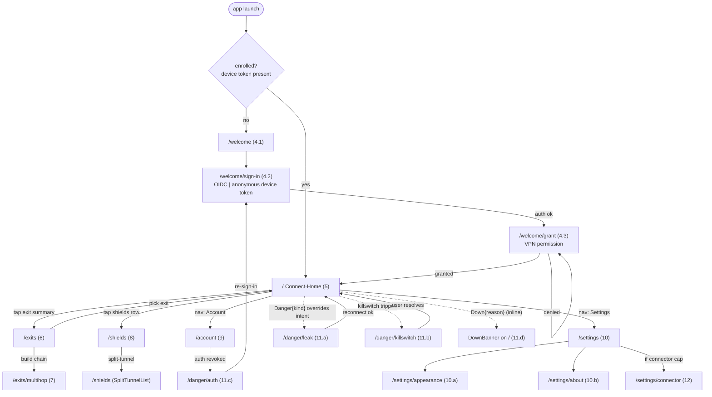

# Client screens — every end-user surface, in depth (light + dark, phone→tablet→desktop→TV)

**Revision:** 2
**Last modified:** 2026-07-04T12:00:00Z

> Master technical specification — Volume 10 (Design System), nano-detail
> deep-dive. This document **owns** the complete **screen-level UX specification
> of the HelixVPN Client app** (flavor `access` / "Helix Access" — the end-user
> VPN application). It specifies **every screen** the end user can reach:
> purpose, region layout, the **responsive behaviour across all four form factors**
> (phone / tablet / desktop / TV-leanback), the components each composes (cited to
> the sibling [`component-library.md`]), the **states** each renders
> (loading / empty / error / success + the **7 connection states** where
> relevant), in/out navigation, key interactions, accessibility, **light + dark**
> notes, and an **ASCII wireframe** (plus a Mermaid navigation map). It is
> **original HelixVPN UX design work**.
>
> **The product's emotional centre of gravity** is one question — *"am I protected
> right now?"* [04_CLIENT §7]. Every screen is designed so that question is
> answered instantly and unambiguously, and so the **loading/connecting** state is
> never mistaken for the **connected** state (§11.4.107 — a spinner is **not**
> proof of connection; the Home screen distinguishes them with colour **and** icon
> **and** text **and** an independent "tunnel-up" signal).
>
> **SPEC-ONLY.** It describes *what each screen is and how it lays out and
> behaves* — not the shipping Flutter widget tree. The component internals are
> owned by [`component-library.md`]; the colours by [`color-system.md`]; the
> token structure/scales by [`design-tokens.md`]; the type/icon/motion by
> [`typography-iconography-motion.md`]; the Console screens by
> [`screens-console.md`]; the Connector-appliance screens by
> [`screens-connector.md`]. This doc consumes all of those.
>
> **Boundary with sibling docs.** Owns: the Client **screen inventory**, each
> screen's regions / responsive rules / state matrix / nav / a11y / wireframe.
> Consumes: the **7-variant `ffi::TunnelStatus`** the Home screen switches on
> [FFI §3.2]; the connection-state palette + contrast proofs [COLOR §3–§4]; the
> token scales (spacing/breakpoints/radius/motion) [DT §6]; the Client
> capability set `{tunnel, account, splitTunnel}` and the `AdaptiveScaffold`
> responsive contract [04_CLIENT §6, §7.3]; the named signature components
> (`ConnectButton`, `StatusChip`, `ExitPicker`, `ShieldIndicator`, `NetworkTile`)
> [04_CLIENT §7.2].
>
> **Evidence base.** `[04_CLIENT §N]` = `final/03-client-core-and-ui.md`;
> `[FFI §N]` = `final/v04-client/ffi-surface.md`; `[UI §N]` =
> `final/v04-client/helix-ui-flutter.md`; `[COLOR §N]` =
> `final/v10-design/color-system.md`; `[DT §N]` =
> `final/v10-design/design-tokens.md`; `[SPINE §N]` = `final/SPECIFICATION.md`.
> Claims not grounded in the evidence base or this document's own original UX
> design choices are tagged `UNVERIFIED` per constitution §11.4.6 — never
> fabricated. `[`component-library.md`]` is a **same-wave sibling** that this doc
> forward-references for every component; component internals are owned there.

---

## Table of contents

- [0. Scope, platforms & the §11.4.162 layout covenant](#0-scope-platforms--the-1114162-layout-covenant)
- [1. Screen inventory (table)](#1-screen-inventory-table)
- [2. Navigation map](#2-navigation-map)
- [3. The responsive shell — `AdaptiveScaffold`](#3-the-responsive-shell--adaptivescaffold)
- [4. Onboarding / first-run](#4-onboarding--first-run)
  - [4.1 Welcome](#41-welcome)
  - [4.2 Sign-in (OIDC vs anonymous device token)](#42-sign-in-oidc-vs-anonymous-device-token)
  - [4.3 VPN permission grant](#43-vpn-permission-grant)
- [5. Connect / Home (the hero)](#5-connect--home-the-hero)
- [6. Exit selection](#6-exit-selection)
- [7. Multi-hop builder](#7-multi-hop-builder)
- [8. Shields / Privacy settings](#8-shields--privacy-settings)
- [9. Account](#9-account)
- [10. Settings](#10-settings)
- [11. Error / Danger states](#11-error--danger-states)
- [12. Connector-mode toggle](#12-connector-mode-toggle)
- [13. Cross-screen patterns (loading/empty/error, a11y, motion)](#13-cross-screen-patterns-loadingemptyerror-a11y-motion)
- [14. Surfaced decisions & cross-doc contracts](#14-surfaced-decisions--cross-doc-contracts)
- [Sources verified](#sources-verified)

---

## 0. Scope, platforms & the §11.4.162 layout covenant

This document specifies the **Client app** (`HelixFlavor.access`, "Helix Access")
— the consumer VPN application whose home is the big ConnectButton
[04_CLIENT §6]. Its capability set is `{tunnel, account, splitTunnel}`; it links
the real Rust `helix-core` via FFI and a per-platform `TunnelPlatform` shim
[04_CLIENT §6, §4]. (The **Console** admin app and the **Connector** appliance
app have their own screen docs; this doc cross-references them only at the
boundaries — §9, §12.)

**Form factors.** Every screen is specified across **four** size classes, branched
on **width, never on `Platform.isX`** [04_CLIENT §7.3] so a resized desktop window
behaves like a phone and Web/desktop "just work":

| Size class | Width (token [DT §6.6]) | Shell | Primary device archetype |
|---|---|---|---|
| **compact** | `< breakpoint.md` (600 px) | `BottomNavigationBar`, single pane | phone (portrait) |
| **medium** | 600–1024 px | `NavigationRail`, master/detail | large phone landscape / tablet |
| **expanded** | `> breakpoint.lg` (1024 px) | extended `NavigationRail`, multi-pane | desktop (macOS/Windows/Linux) |
| **tv** | `≥ breakpoint.xl` (1440 px) **+ leanback input** | extended rail, **enlarged focus targets**, D-pad focus traversal | Android TV / leanback HarmonyOS |

> **TV-leanback is a size class + an input model**, not a separate platform tree.
> It renders the `expanded` layout with: focus targets ≥ `space.scale.7` (48 px →
> enlarged to ~64 px hit area), a **visible focus ring** (`border.focus`,
> [COLOR §2.3]) on every focusable, D-pad/remote traversal order declared per
> screen, and no hover-only affordances. `UNVERIFIED` — the exact TV focus-order
> matrices per screen are pinned by the platform-adaptation spec
> [`platform-adaptation.md`] + the leanback golden-screenshot suite; this doc
> states the focus *intent* per screen, frozen there.

**Platforms the Client ships on (7 of the 8).** iOS, macOS, Android, Windows,
Linux, HarmonyOS NEXT, Aurora OS. **Web is NOT a Client target** — the Web build
is the Console only (it lacks `Capability.tunnel`, so it never links the Rust
staticlib) [04_CLIENT §5.7, §6]. Every screen below therefore assumes a native
host with a `TunnelPlatform` shim available.

**The §11.4.162 layout covenant (applies to every screen below).** Per the
OpenDesign mandate: **no element overlaps another; no element overlays a label;
every screen ships a light AND a dark variant; every screen is covered by visual
regression** [`visual-regression-and-qa.md`]. At the layout level this doc
enforces:

1. **One column of meaning at a time on compact.** Regions stack vertically with a
   `space.scale.4` (16 px) gap minimum; nothing floats over body text except the
   intentional overlay surfaces (sheets, the Danger banner) which always sit on a
   scrim ([COLOR §5.2]).
2. **The connection state owns the screen** [04_CLIENT §7.2]; secondary chrome
   recedes. Only **one** saturated colour (the active state) is on screen at a time
   ([COLOR §0.2]).
3. **Labels are never drawn on a coloured fill that is not contrast-proven**
   ([COLOR §4.3]); state cross-fades swap fill **and** label together
   (`motion.semantic.stateXfade`, 180 ms [DT §6.4]) so no in-between frame is
   illegible.
4. **The Danger banner is z-top** (`z.semantic.danger` 2000 [DT §6.5]) and can
   never be occluded — even by a modal or a toast.

---

## 1. Screen inventory (table)

Routes are go_router-style paths (`UNVERIFIED` exact router config — owned by
[`navigation-and-routing.md`], a planned sibling; the *paths + hierarchy* here are
this doc's design intent). "Key components" cite [`component-library.md`].

| # | Screen | Route | Key components | States rendered |
|---|---|---|---|---|
| 4.1 | Welcome | `/welcome` | `OnboardPager`, `HeroIllustration`, `PrimaryButton`, `TextButton` | static (no async) |
| 4.2 | Sign-in | `/welcome/sign-in` | `AuthChoiceCard` ×2, `OidcWebView`/`DeviceCodePanel`, `InlineError` | idle · in-progress · error · success |
| 4.3 | VPN permission grant | `/welcome/grant` | `PermissionExplainer`, `PrimaryButton`, `PlatformConsentSheet` (OS) | prompting · granted · denied · re-prompt |
| 5 | **Connect / Home** | `/` (home) | **`ConnectButton`**, **`StatusChip`**, `ExitSummaryCard`, **`ShieldIndicator`** row, `DangerBanner` | **all 7 `TunnelStatus`** + loading-vs-connected |
| 6 | Exit selection | `/exits` | **`ExitPicker`**, `SearchField`, `FavoriteToggle`, `ExitRow` (rtt + jurisdiction), `SegmentTabs` | loading · empty · error · populated · selected |
| 7 | Multi-hop builder | `/exits/multihop` | `HopChainEditor`, `HopRow` ×N, `AddHopButton`, `ChainSummaryBar` | empty(1 hop) · building · invalid · valid |
| 8 | Shields / Privacy | `/shields` | **`ShieldIndicator`** tiles, `SwitchTile`, `SplitTunnelList`, `CostNoteSheet` | each shield: on · off · unavailable · pending |
| 9 | Account | `/account` | `IdentityCard`, `SubscriptionCard`*, `DeviceList`/`DeviceRow`, `SignOutButton` | loading · loaded · offline-cached · error |
| 10 | Settings | `/settings` | `SettingsGroup`, `ThemeSelector`, `NotificationToggles`, `AboutPanel` | static + per-toggle async |
| 10.a | Appearance | `/settings/appearance` | `ThemeSelector` (light/dark/system), `AccentPreview` | applied immediately |
| 10.b | About | `/settings/about` | `AboutPanel`, `VersionRow`, `LicensesList`, `DiagnosticsButton` | static |
| 11.a | Leak detected (full) | `/danger/leak` (modal route) | `DangerScreen`, `DangerBanner`, `LeakDetail`, `ReconnectButton` | `Danger{kind:"leak"}` |
| 11.b | Kill-switch tripped (full) | `/danger/killswitch` | `DangerScreen`, `KillSwitchDetail`, `PrimaryButton` | `Danger{kind:"killswitch_tripped"}` |
| 11.c | Auth revoked (full) | `/danger/auth` | `AuthRevokedScreen`, `ReSignInButton` | auth-revoked (→ re-enroll) |
| 11.d | Connection dropped | inline banner on `/` | `DownBanner` | `Down{reason}` |
| 12 | Connector-mode toggle | `/settings/connector` (gated) | `ConnectorModeCard`, `AdvertiseCidrList`, `SwitchTile` | unavailable* · off · advertising · conflict |

\* `SubscriptionCard` and the `connector` capability are **flavor/deployment
conditional** — see §9 (subscription is `UNVERIFIED` for the self-hostable MVP)
and §12 (connector-in-client is a surfaced decision D-SC-3).

---

## 2. Navigation map



- **First-run gate.** Launch checks for a persisted device token / session
  [04_CLIENT §8]. Absent → onboarding (§4); present → straight to Home.
- **Home is the root** of the post-onboarding `AdaptiveScaffold`; Exits, Shields,
  Account, Settings are its peer destinations (bottom-nav on compact, rail on
  medium+).
- **Danger routes are pushed over everything** and are **input-overriding** — a
  `Danger{kind}` from the status stream forces the Danger surface regardless of
  where the user is ([FFI §3.2], "Danger overrides any user intent"). `Down` is an
  **inline banner** on Home (a drop, retrying — not an exposure), distinct from
  Danger (red, full surface).

---

## 3. The responsive shell — `AdaptiveScaffold`

Every post-onboarding screen renders inside one shell whose navigation affordance
is chosen by **size class** [04_CLIENT §7.3]. The shell is a single widget; the
size class flips its nav region and pane count — the body screens are identical
across classes.

```
COMPACT (<600)                 MEDIUM (600–1024)             EXPANDED / TV (>1024)
┌───────────────────────┐      ┌──┬────────────────────┐    ┌────┬───────────────┬──────────────┐
│   AppBar (title)      │      │  │  AppBar            │    │    │  AppBar       │              │
│                       │      │R │                    │    │ R  │               │  (optional   │
│      BODY (1 pane)    │      │A │   BODY             │    │ A  │  BODY (list)  │   detail/    │
│                       │      │I │   (master | detail │    │ I  │               │   live pane) │
│                       │      │L │    where width     │    │ L  │               │              │
│                       │      │  │    allows)         │    │ +  │               │              │
├───┬───┬───┬───┬───────┤      │  │                    │    │lbl │               │              │
│Hom│Exi│Shl│Acc│ Set   │      └──┴────────────────────┘    └────┴───────────────┴──────────────┘
└───┴───┴───┴───┴───────┘      rail = icon-only            rail = icon + label, body multi-pane
 BottomNavigationBar           NavigationRail               extended NavigationRail
```

- **compact:** `BottomNavigationBar`, 5 destinations (Home · Exits · Shields ·
  Account · Settings), single body pane, full-width ConnectButton on Home.
- **medium:** `NavigationRail` (icon-only), body becomes master/detail where the
  screen defines one (Exits list | selected-exit detail; Settings group |
  sub-page).
- **expanded:** extended `NavigationRail` (icon + label), multi-pane bodies.
- **tv:** the expanded layout, focus-traversal model (§0), enlarged targets, no
  bottom nav (D-pad reaches the rail).

A11y: the active destination carries `selected` semantics; the rail/bottom-nav is
keyboard-traversable on desktop/web-less native; the focus ring is the
`border.focus` token (≥3.0 contrast vs surface, both themes [COLOR §4.5]).

Light/dark: shell `surface.default` (`#FFFFFF` / `#151920`), rail/appbar
`surface.default`, selected destination tinted `surface.brandTint`
(`helix.50` / `helix.900`); both proven AAA-legible [COLOR §2.1].

---

## 4. Onboarding / first-run

Three steps, each its own route so the OS back gesture is sane and a partial
enrollment resumes at the right step. A linear `OnboardPager` on compact; a
single centred card column on medium+; never more than one decision per screen
(§0 covenant).

### 4.1 Welcome

**Purpose.** Establish trust + the one value promise ("your traffic, private —
your servers or ours") and route into sign-in. No account interaction yet.

**Layout (regions, top→bottom):** hero illustration → headline → 1-line subhead →
`PrimaryButton` "Get started" → `TextButton` "I already have an account /
device". On a multi-slide value carousel, a `PageIndicator` sits between subhead
and the buttons (never overlapping them — `space.scale.5` gap).

**Components** [`component-library.md`]: `OnboardPager`, `HeroIllustration`,
`PrimaryButton`, `TextButton`, `PageIndicator`.

**States.** Static only (no async). No empty/error/loading.

**Responsive.**
- *phone (compact):* full-bleed hero top ~40 % height, content column 16 px
  margins (`space.scale.4`), buttons full-width pinned to safe-area bottom.
- *tablet (medium):* hero + copy in a centred 420-px card, buttons inline width.
- *desktop (expanded):* two-column — illustration left 50 %, copy/actions right,
  max content width 480 px.
- *TV:* centred, enlarged type (display scale), "Get started" is the default
  focused control; D-pad down reaches the secondary `TextButton`.

**Navigation.** in: app launch (unenrolled). out: "Get started" → `/welcome/sign-in`.

**Interactions.** swipe/arrow between carousel slides; "Get started" advances.

**A11y.** hero illustration is `decorative` (empty semantic label, not announced);
headline is an `h1` heading node; buttons carry role + label; carousel exposes
"slide N of M" live region; full keyboard/remote traversal.

**Light + dark.** `surface.default` bg; hero illustration ships **two assets**
(light/dark variants per §11.4.162); headline `text.primary`, subhead
`text.secondary`; primary button `action.primary` fill + white label.

```
┌──────────────────────────────────┐
│        ╭──────────────╮          │
│        │  hero art    │          │   ← decorative, light+dark asset pair
│        ╰──────────────╯          │
│                                  │
│   Private by default.            │   ← h1, text.primary
│   Your servers, or ours.         │   ← text.secondary
│                                  │
│            ● ○ ○                 │   ← PageIndicator (carousel)
│                                  │
│  ┌────────────────────────────┐  │
│  │       Get started          │  │   ← PrimaryButton (action.primary)
│  └────────────────────────────┘  │
│   I already have an account      │   ← TextButton (text.link)
└──────────────────────────────────┘
```

### 4.2 Sign-in (OIDC vs anonymous device token)

**Purpose.** Enrol the device by one of two paths the spine supports
[04_CLIENT §6 `account` capability]: **OIDC** (hosted/managed identity) **or**
**anonymous device-token** (self-hostable, privacy-max — no personal identity,
just a per-device credential). The user picks; both end in a usable session.

**Layout.** Two stacked `AuthChoiceCard`s (compact) / side-by-side (medium+):
- **Card A — Sign in with your provider (OIDC).** Tapping opens an
  `OidcWebView`/system browser to the configured issuer; on success the redirect
  returns a code the client exchanges for a session.
- **Card B — Use this device anonymously (device token).** Tapping shows a
  `DeviceCodePanel`: the client generates/registers a device token against the
  configured server (the server URL is entered here on first run if not preset).
  No email, no personal identity.

Below the cards: a one-line "Self-hosting? Enter your server" link expanding a
`ServerUrlField`.

**Components.** `AuthChoiceCard` ×2, `OidcWebView` (or system-browser handoff),
`DeviceCodePanel`, `ServerUrlField`, `InlineError`, `ProgressIndicator`.

**States.**
- *idle:* two choices presented.
- *in-progress:* the chosen path shows a determinate-where-possible
  `ProgressIndicator` ("Contacting your server…"); the **other** card disables
  (no double-enrol).
- *error:* `InlineError` under the active card with a typed, human message
  (unreachable server, bad URL, issuer rejected, token already bound elsewhere);
  the card returns to idle for retry. Never a silent fail (§11.4.6).
- *success:* advances to `/welcome/grant`.

**Responsive.** compact: cards stack, full-width; medium/expanded: cards
side-by-side in a centred 640-px row; TV: cards as large focusable tiles, OIDC
path uses a device-code/QR flow if no embedded browser (`UNVERIFIED` — the TV OIDC
device-flow is owned by the OIDC integration spec; flagged there).

**Navigation.** in: `/welcome` "Get started", or `/danger/auth` re-sign-in (§11.c).
out (success): `/welcome/grant` (or directly Home if permission already granted).

**Interactions.** pick a card → run that flow; expand server-URL field; paste/scan
server URL; cancel returns to idle.

**A11y.** each card is a single labelled button announcing its path + privacy
implication ("anonymous, no personal identity"); the in-progress state announces
via live region; errors are announced and focus moves to the `InlineError`.

**Light + dark.** cards `surface.raised`; selected/active card border
`border.focus`; OIDC web-view inherits issuer styling (out of our control —
flagged in About as third-party); error text `feedback.error` (proven AA both
themes [COLOR §2.4]).

```
┌──────────────────────────────────┐
│  Sign in                         │  ← h1
│                                  │
│  ┌────────────────────────────┐  │
│  │ 🔑  Sign in with provider  │  │  ← AuthChoiceCard A (OIDC)
│  │     Managed identity (SSO) │  │
│  └────────────────────────────┘  │
│  ┌────────────────────────────┐  │
│  │ 🛡  Use this device only    │  │  ← AuthChoiceCard B (device token)
│  │     Anonymous · no email   │  │
│  └────────────────────────────┘  │
│                                  │
│  ▸ Self-hosting? Enter server    │  ← expands ServerUrlField
│  ⚠ Server unreachable. Retry.    │  ← InlineError (error state only)
└──────────────────────────────────┘
```

### 4.3 VPN permission grant

**Purpose.** Obtain the **OS-level VPN configuration consent** the `TunnelPlatform`
shim requires before the first tunnel can be created [04_CLIENT §4, §5]. This is a
**platform-mediated** step — our screen explains *why*, then triggers the OS
consent dialog the platform owns.

**Per-platform OS mechanism** (we explain, the OS prompts) [04_CLIENT §5]:

| Platform | OS consent the shim triggers |
|---|---|
| iOS / macOS | `NETunnelProviderManager.saveToPreferences` → system "… Would Like to Add VPN Configurations" |
| Android | `VpnService.prepare()` → system VPN-consent dialog |
| Windows | install/authorise the privileged tunnel service (UAC elevation) |
| Linux | privileged helper / capability grant for the kernel-WG / tun device |
| HarmonyOS NEXT | Network Kit VPN ability authorisation |
| Aurora OS | platform tun authorisation |

> `UNVERIFIED` — the exact OS dialog copy + the per-platform privileged-service
> install flow are owned by [`platform-adaptation.md`] + the per-platform shim
> specs; this screen owns only the **pre-consent explainer** and the
> **post-consent state handling**.

**Layout.** `PermissionExplainer` (icon + 2-line "Helix needs permission to
create a VPN tunnel on this device. We never see your traffic.") → `PrimaryButton`
"Allow VPN" → on tap, the OS `PlatformConsentSheet` appears (OS-rendered) → result
handled.

**States.**
- *prompting:* explainer + button (idle).
- *granted:* brief success tick → navigate Home.
- *denied:* a calm re-explain ("Helix can't connect without VPN permission") +
  "Try again" (re-triggers) + a "How to enable in Settings" deep-link helper. Never
  dead-ends.
- *re-prompt:* if the OS won't re-show the dialog (already-denied-permanently), we
  show the Settings deep-link path.

**Responsive.** centred single-column all classes; on desktop the privileged-
service install may show an elevation prompt (OS); TV: button default-focused.

**Navigation.** in: `/welcome/sign-in` success. out (granted): Home. (denied stays.)

**Interactions.** "Allow VPN" → OS sheet; "Try again"; "Open system settings".

**A11y.** explainer is body text + an `info` icon (decorative); the result state
is announced; focus lands on the actionable button in each state.

**Light + dark.** `surface.default`; explainer icon uses `feedback.info`; success
tick `feedback.success`; denied re-explain uses `feedback.warning` (not error —
it's recoverable).

```
┌──────────────────────────────────┐
│            ╭────╮                 │
│            │ 🔐 │                 │  ← info-tinted lock
│            ╰────╯                 │
│   Allow Helix to create a        │  ← text.primary
│   VPN tunnel on this device.     │
│   We never see your traffic.     │  ← text.secondary
│                                  │
│  ┌────────────────────────────┐  │
│  │        Allow VPN           │  │  ← PrimaryButton → OS consent sheet
│  └────────────────────────────┘  │
└──────────────────────────────────┘
   (denied → calm re-explain + "Try again" + "Open Settings")
```

---

## 5. Connect / Home (the hero)

**Purpose.** The product. Answer *"am I protected right now?"* at a glance, let the
user connect/disconnect with one tap, and surface the current exit, transport/path,
and shields summary. This is the **only** screen that renders **all 7
`TunnelStatus` variants** [FFI §3.2], and the screen where the **loading/connecting
vs connected distinction** is load-bearing (§11.4.107).

**Layout (regions, top→bottom; compact).**
1. `AppBar` — app title + a small avatar/menu (→ Account).
2. **`DangerBanner` slot** (hidden unless `Danger`/`Down`; z-top when shown).
3. **`ConnectButton`** — the giant circular tap target, vertically centred, ~`space.scale.7`-class diameter. Its **fill colour, ring, icon, and label all switch on the status** ([COLOR §3], `comp.connectButton.bg.*` [DT §8]).
4. **`StatusChip`** directly under the button — `transport · path · rtt` (e.g. `MASQUE · direct · 23 ms`) when `Connected`; the in-flight phase text ("Handshaking…") otherwise.
5. **`ExitSummaryCard`** — current exit name + flag/jurisdiction; tap → `/exits`.
6. **`ShieldIndicator` row** — kill-switch / DNS / DAITA / PQ badges, active/inactive; tap → `/shields`.

**The 7-state render matrix** (fill from [COLOR §3.1]; the ConnectButton is the
solid-fill+label pattern [COLOR §3.3]):

| `ffi::TunnelStatus` | Button fill (light / dark) | Icon | Label | StatusChip | Motion |
|---|---|---|---|---|---|
| `Disconnected` | grey `#6B7385` / brand idle | power/off | **Not connected** | "Tap to connect" | none |
| `Connecting` | amber `#B45309` / `#FBBF24` | spinner-ring | **Connecting…** | "Contacting exit…" | `connectPulse` |
| `Handshaking` | amber (= Connecting) | spinner-ring | **Securing…** | "Handshaking…" | `connectPulse` |
| `Connected{direct}` | green `#15803D` / `#22C55E` | shield-check | **Protected** | `transport · direct · {rtt} ms` | settle (one-shot) |
| `Connected{relay}` | teal-green `#0F766E` / `#2DD4BF` | shield-check | **Protected · relayed** | `transport · relay · {rtt} ms` | settle |
| `Reconnecting` | amber **pulse** `#B45309` / `#FBBF24` | rotating | **Reconnecting…** | "Lost link, retrying…" | `connectPulse` |
| `Down{reason}` | orange `#C2410C` / `#FB923C` (button) + `DownBanner` | warning | **Disconnected — dropped** | reason (stable-prefix) | none |
| `Danger{kind}` | red `#DC2626` / `#F87171` + full `DangerBanner` | alert | **Exposed** / **Kill-switch** | the danger detail | none (no strobe) |

> **The loading-vs-connected distinction (§11.4.107).** A spinner is **not**
> "connected". `Connecting`/`Handshaking`/`Reconnecting` are **amber + animated +
> "…"-suffixed labels + a non-committal chip**; `Connected` is **green/teal +
> static settle + a shield-check icon + a chip showing real `transport·path·rtt`
> from the live `Connected{...}` payload**. The status is a **pure function of the
> FFI stream** [04_CLIENT §8.2] — the button never shows "Protected" off a timer or
> an optimistic guess; only an actual `Connected{...}` event paints green. (This is
> the UI honouring the FFI's own no-fabrication rule [FFI §3.5].) The three signals
> — colour, icon, text — are independent so colour-blind and screen-reader users
> also get the distinction (§13 a11y).

**States (non-connection).**
- *loading (first frame / stream not yet seeded):* the button renders the last
  cached status if any, else `Disconnected` as the safe default (never a fake
  "connected"); a subtle skeleton on the StatusChip until the first event.
- *offline (no network at all):* `Disconnected` with chip "No network"; connect is
  attemptable (the shim surfaces the failure honestly) [04_CLIENT §8.4].
- *error:* surfaced as `Down`/`Danger` per the stream; transient action errors
  (e.g. start failed) show a `SnackBar` with the typed reason, button returns to
  `Disconnected`.

**Responsive.**
- *phone (compact):* single centred column, ConnectButton dominant (~40 % height),
  chip + exit card + shields stacked below.
- *tablet (medium):* the ConnectButton stays centred but a **side panel** appears
  showing the ExitSummaryCard + Shields as a persistent column (master/detail: tap
  exit → detail in the side pane without leaving Home).
- *desktop (expanded):* ConnectButton left-centre; a right pane shows live
  StatusChip detail (throughput/rtt sparkline `UNVERIFIED` — owned by a future
  live-stats spec), exit, shields; nothing overlaps.
- *TV:* ConnectButton centred and **default-focused**; D-pad: down → exit card,
  down → shields row; the chip is enlarged; the connect action is the `OK`/center
  remote button.

**Navigation.** in: post-onboarding root, or any nav destination's Home tab. out:
ExitSummaryCard → `/exits`; Shields row → `/shields`; avatar → `/account`;
`Danger` → pushes the danger surface (§11).

**Interactions.** **tap ConnectButton** → `connectController.toggle(status)`
(connect if not `Connected`, disconnect if `Connected`) [04_CLIENT §8.2]; tap exit
→ Exits; tap a shield badge → Shields (scrolled to that shield); long-press
ConnectButton → quick transport override sheet (`auto`/specific) `UNVERIFIED`
(transport-override UX pinned by [`component-library.md`]).

**A11y.** the ConnectButton has a **semantic label that announces the full state**
("Connected, direct path, 23 milliseconds" / "Connecting") and a role of toggle
button; state changes fire a polite live-region announcement; the icon + label +
colour triple means no colour-only signal (CI5 [04_CLIENT §7.2]); large-text safe
(the button scales, label wraps, never truncates under accessibility text sizes —
no label overlay §11.4.162).

**Light + dark.** button fills per [COLOR §3.1] (both themes proven AA on the white
/ dark label, [COLOR §4.3]); the screen bg `surface.default`; the ExitSummaryCard
+ shields on `surface.raised`; the connected "glow" ring uses a low-alpha tint of
the state colour (`UNVERIFIED` exact glow alpha — U-COLOR-1 [COLOR §8]).

```
COMPACT — Connected{direct}            COMPACT — Connecting             COMPACT — Danger{leak}
┌──────────────────────────┐  ┌──────────────────────────┐  ┌──────────────────────────┐
│ Helix Access        ◐ ⋮  │  │ Helix Access        ◐ ⋮  │  │■■ EXPOSED — leak detected■│ ← DangerBanner (z-top, red)
│                          │  │                          │  ├──────────────────────────┤
│        ╭────────╮        │  │        ╭────────╮        │  │ Helix Access        ◐ ⋮  │
│        │  ✓SHIELD│        │  │        │ ◌spin  │        │  │        ╭────────╮        │
│        │ green   │        │  │        │ amber  │        │  │        │  ! red │        │
│        ╰────────╯        │  │        ╰────────╯        │  │        ╰────────╯        │
│       Protected          │  │      Connecting…         │  │       Exposed            │
│  MASQUE · direct · 23ms  │  │   Contacting exit…       │  │  Traffic may be visible  │
│                          │  │                          │  │                          │
│ ┌──────────────────────┐ │  │ ┌──────────────────────┐ │  │ ┌──────────────────────┐ │
│ │ 🇸🇪 Stockholm  exit › │ │  │ │ 🇸🇪 Stockholm  exit › │ │  │ │  Reconnect securely  │ │
│ └──────────────────────┘ │  │ └──────────────────────┘ │  │ └──────────────────────┘ │
│ 🛡KS  DNS  DAITA  PQ   › │  │ 🛡KS  DNS  DAITA  PQ   › │  │  See what happened   ›   │
└──────────────────────────┘  └──────────────────────────┘  └──────────────────────────┘
```

---

## 6. Exit selection

**Purpose.** Choose the exit gateway (or network) traffic leaves through: a
searchable, RTT-sorted, favourite-able list with jurisdiction labels; and the
entry point to the multi-hop builder (§7). Distinguishes a **privacy-exit** (a
public/managed exit gateway) from a **network** (a private overlay network the
device has joined) [04_CLIENT §7.2 `ExitPicker`].

> **Zero-trust tie (load-bearing, not decorative).** The list this screen
> renders is **already policy-filtered before it reaches the client** — the
> coordinator's `WatchNetworkMap` snapshot/delta only ever contains peers and
> networks this device's compiled policy authorizes [SPINE §7.2, `v05-security/
> zero-trust-and-default-deny.md` "need-to-know peer filtering"]. The picker
> therefore has no client-side "hide unauthorized networks" filter to get wrong
> — there is structurally nothing unauthorized in the list to accidentally
> show. This is why a compromised/jailbroken client cannot self-grant access to
> an un-joined network by tampering with picker UI state: the authorization
> boundary is enforced server-side, in the data the stream carries, not in
> this screen's rendering logic.

**Layout (regions).**
1. `SearchField` (sticky top) — filters by name/city/country/jurisdiction.
2. `SegmentTabs` — **Exits | My networks | Favourites** (+ a "Multi-hop" entry).
3. The `ExitPicker` list of `ExitRow`s, each: flag/glyph, name + city, jurisdiction
   chip (e.g. "🇨🇭 no-logs jurisdiction" — `UNVERIFIED` jurisdiction taxonomy,
   owned by the exits/catalog spec), **RTT** (live, colour-graded green→amber), a
   `FavoriteToggle` star, and a selected check.
4. A footer `MultiHopEntry` row → `/exits/multihop`.

**States.**
- *loading:* skeleton rows while `core.exits()` resolves [04_CLIENT §7.2].
- *empty:* "No exits available" (self-host with none configured) → CTA "Add a
  server" / "Join a network"; never a blank screen.
- *error:* "Couldn't load exits" + retry + the typed reason; the last cached list
  shown stale-labelled if available (honesty rule [04_CLIENT §8.4]).
- *populated:* RTT-sorted ascending (fastest first); favourites pinned to top of
  their tab.
- *selected:* the active exit row carries a check + `surface.brandTint`
  background; selecting one updates Home's ExitSummaryCard and (if connected)
  triggers a seamless re-route (`apply_map`/`set_exit` [FFI §2]).

**Responsive.**
- *phone:* full-width list, sticky search, bottom-nav present.
- *tablet (medium):* master/detail — list left, selected-exit **detail pane**
  right (latency history, jurisdiction note, "make default").
- *desktop (expanded):* same master/detail wider; multi-column row metadata.
- *TV:* large rows, D-pad vertical traversal, search via on-screen keyboard or
  voice (`UNVERIFIED` TV search input); favourite = remote long-press.

**Navigation.** in: Home ExitSummaryCard, or Exits nav destination. out: pick an
exit → back to Home (state applied); "Multi-hop" → `/exits/multihop`.

**Interactions.** type to filter; tap a row to select; star to favourite; pull to
refresh RTT; switch tabs (Exits/Networks/Favourites).

**A11y.** each row announces name + jurisdiction + RTT + selected-state + favourite
state; RTT colour is paired with the numeric value (never colour-only); search
field labelled; list is a single focus group with arrow traversal.

**Light + dark.** rows on `surface.raised`; selected row `surface.brandTint`; RTT
colour grades green `feedback.success` → amber `feedback.warning` → (slow) red
`feedback.error`, all AA both themes; jurisdiction chip neutral
(`surface.sunken` + `text.secondary`).

```
┌──────────────────────────────────┐
│ 🔍 Search exits…                 │  ← SearchField (sticky)
│ [ Exits ][ Networks ][ ★ Fav ]   │  ← SegmentTabs
├──────────────────────────────────┤
│ 🇸🇪 Stockholm   no-logs   18ms ★✓│  ← ExitRow (selected: brandTint + ✓)
│ 🇨🇭 Zürich      no-logs   24ms ☆ │
│ 🇩🇪 Frankfurt   EU        31ms ☆ │
│ 🇺🇸 New York    US-5eyes  88ms ☆ │  ← RTT colour-graded + numeric
│ … (RTT-sorted ascending)         │
├──────────────────────────────────┤
│ ⛓  Build a multi-hop chain     › │  ← MultiHopEntry → §7
└──────────────────────────────────┘
```

---

## 7. Multi-hop builder

**Purpose.** Compose an ordered chain of exits (entry → … → final exit) so traffic
is relayed through multiple jurisdictions [04_CLIENT §7.2 `ExitPicker` "multi-hop
chain"]. Build, validate, and apply the chain.

**Layout.** A vertical `HopChainEditor`: an ordered list of `HopRow`s
(`Hop 1 (entry) → Hop 2 → … → Hop N (exit)`), each a chosen exit with a remove
control; an `AddHopButton` at the tail; a sticky `ChainSummaryBar` at the bottom
(total estimated added latency = Σ hop RTTs, hop count, "Apply chain").

**States.**
- *empty (default):* a single entry hop (= the current exit); building begins by
  adding a second.
- *building:* rows being added/reordered; live recompute of summed latency.
- *invalid:* a hop reachability/conflict problem (duplicate hop, an exit that
  cannot relay, overlapping CIDR if a network hop) → the offending row flags + the
  Apply button disables with a typed reason; never silently accept (§11.4.6).
- *valid:* Apply enabled; applying calls `apply_map`/`set_exit` [FFI §2] and the
  chain becomes active.

**Responsive.** phone: single column, drag-handle reorder; tablet/desktop: the
chain on the left, a per-hop detail (latency, jurisdiction) on the right; TV: D-pad
reorder via a "move mode", enlarged rows.

**Navigation.** in: Exits "Multi-hop" entry. out: Apply → Home (chain active) or
Back (discard).

**Interactions.** add hop (opens an ExitPicker sub-sheet), reorder (drag / move
mode), remove hop, apply.

**A11y.** each hop announces its ordinal + exit + jurisdiction; reorder is
keyboard/remote operable (move-up/move-down actions), not drag-only; the summary
bar announces total latency + validity.

**Light + dark.** hop rows `surface.raised` with an ordinal badge; the chain
connector lines use `border.strong`; an invalid hop flags with `feedback.error`
icon + text; summary bar `surface.raised` elevated (`elevation.semantic.menu`).

```
┌──────────────────────────────────┐
│  Multi-hop chain                 │
│  ┌────────────────────────────┐  │
│  │ ①  🇸🇪 Stockholm  (entry) ⠿│  │  ← HopRow (drag handle ⠿)
│  └────────────┃───────────────┘  │
│  ┌────────────┃───────────────┐  │
│  │ ②  🇨🇭 Zürich          ✕ ⠿│  │
│  └────────────┃───────────────┘  │
│  ┌────────────┃───────────────┐  │
│  │ ③  🇮🇸 Reykjavík (exit) ✕ ⠿│  │
│  └────────────────────────────┘  │
│        ＋ Add hop                 │  ← AddHopButton
├──────────────────────────────────┤
│ 3 hops · +71 ms     [ Apply ]    │  ← ChainSummaryBar (sticky)
└──────────────────────────────────┘
```

---

## 8. Shields / Privacy settings

**Purpose.** Control the privacy "shields" the tunnel enforces and view their
honest cost: **kill-switch**, **DNS protection**, **DAITA** (defence-against-AI
traffic-analysis), **post-quantum** (PQ key exchange), and **split-tunnel** (per-
app/per-route bypass) [04_CLIENT §6 `splitTunnel`, §7.2 `ShieldIndicator` "honest
cost note on tap"]. Backed by the FFI `set_shields` call [FFI §2].

**Layout (regions).** A list of `ShieldIndicator` tiles, each a `SwitchTile`:
icon + name + 1-line description + a toggle + an info affordance opening a
`CostNoteSheet` (the honest trade-off — e.g. "PQ adds ~N ms handshake", "DAITA adds
constant-rate cover traffic, more battery/data"). Split-tunnel is a tile that
expands into a `SplitTunnelList` (apps/routes to include or bypass).

**Per-shield state.**
- *on:* toggle on, tile accent = `feedback.success` check; active badge mirrored on
  Home's shields row.
- *off:* toggle off, neutral.
- *unavailable:* the platform/exit can't offer it (e.g. DAITA not supported by the
  chosen exit) → toggle disabled + a "why" note; never a toggle that silently does
  nothing (§11.4.6).
- *pending:* applying a change is in flight (`set_shields` round-trip) → a small
  inline spinner on that tile; the rest stay interactive.

**Split-tunnel sub-list states.** loading apps / empty (all routed) / populated
(per-app include-or-bypass toggles, searchable on platforms that enumerate apps —
`UNVERIFIED` which platforms expose an app list; owned by the per-platform shim).

**Responsive.** phone: single column of tiles; tablet/desktop: two-column tile
grid or master/detail (tile list | the selected shield's cost detail + split-tunnel
editor); TV: enlarged tiles, D-pad traversal, cost sheets as focusable panels.

**Navigation.** in: Home shields row, or Shields nav destination. out: back to Home
(changes apply live); split-tunnel deep into its editor.

**Interactions.** toggle a shield (applies via `set_shields`); open cost note;
edit split-tunnel include/bypass lists; the kill-switch toggle carries an extra
confirmation if turning it **off** (lowering protection).

**A11y.** each tile announces name + on/off + availability; the cost sheet is a
labelled dialog; toggles are standard switch semantics; disabled (unavailable)
toggles announce the reason; lowering protection (kill-switch off, split-tunnel
bypass) is announced as a protection-reducing action.

**Light + dark.** tiles `surface.raised`; an **on** tile shows a
`feedback.success` accent; an **unavailable** tile dims to `text.disabled` (exempt
contrast, SC 1.4.3) with the reason in `text.secondary`; the kill-switch-off
confirmation uses `feedback.warning`.

```
┌──────────────────────────────────┐
│  Shields                         │
│ ┌──────────────────────────────┐ │
│ │ 🛡  Kill-switch        [ ●  ]│ │  ← SwitchTile (on, success accent)
│ │     Blocks traffic if tunnel │ │
│ │     drops              ⓘ     │ │  ← ⓘ → CostNoteSheet
│ ├──────────────────────────────┤ │
│ │ 🌐  DNS protection     [ ●  ]│ │
│ ├──────────────────────────────┤ │
│ │ 🫥  DAITA              [  ○ ]│ │
│ │     Anti-traffic-analysis ⓘ  │ │
│ ├──────────────────────────────┤ │
│ │ 🔒  Post-quantum   [ unavail]│ │  ← disabled + reason (exit lacks PQ)
│ ├──────────────────────────────┤ │
│ │ ◧  Split-tunnel             ›│ │  ← expands SplitTunnelList
│ └──────────────────────────────┘ │
└──────────────────────────────────┘
```

---

## 9. Account

**Purpose.** Show the device's identity/enrolment, the (optional) subscription, and
the **device list** (other devices on this identity), with sign-out / unenroll.
The Client's `account` capability [04_CLIENT §6].

**Layout (regions).**
1. `IdentityCard` — who/what this device is enrolled as: OIDC identity (name/email
   + issuer) **or** the anonymous device-token label ("This device · anonymous"),
   plus the server it's bound to.
2. `SubscriptionCard`* — plan/tier + renewal, if the deployment has billing.
3. `DeviceList` of `DeviceRow`s — each other enrolled device (name, platform, last
   seen, this-device marker) with a per-row "remove device".
4. `SignOutButton` (and a destructive "Unenroll this device").

> `UNVERIFIED` — **subscription/billing is not asserted for the self-hostable
> MVP.** The MVP's anonymous-device-token path implies **no billing** for
> self-host; `SubscriptionCard` renders **only** when the deployment advertises a
> billing capability. The plan/tier model, renewal copy, and purchase flow are
> owned by a future commercial-offering spec and are flagged `UNVERIFIED` here —
> not designed as fact. The IdentityCard + DeviceList are the asserted MVP
> surfaces.

**States.**
- *loading:* skeleton identity + device rows while `helix_api` resolves.
- *loaded:* full data.
- *offline-cached:* last-known identity + devices shown with a "Last updated …"
  stale label (honesty rule [04_CLIENT §8.4]); device removal disabled offline.
- *error:* "Couldn't reach your server" + retry; identity from cache if present.
- *auth-revoked:* if the session/identity has been revoked server-side, Account is
  the natural place it surfaces → routes to `/danger/auth` (§11.c).

**Responsive.** phone: single column; tablet/desktop: identity + subscription in a
left column, device list right (master/detail — tap a device → its detail); TV:
enlarged cards, D-pad list traversal.

**Navigation.** in: Home avatar, or Account nav destination. out: sign-out →
`/welcome`; auth-revoked → `/danger/auth`; device-detail (medium+) inline.

**Interactions.** remove another device (confirm); sign out (confirm); unenroll
this device (destructive confirm — wipes the local token); copy the server URL.

**A11y.** identity announced incl. the privacy mode ("anonymous device"); each
device row announces name + platform + last-seen + this-device; destructive
actions carry confirming dialogs and are announced as destructive.

**Light + dark.** cards `surface.raised`; the current device marked with a
`feedback.info` "this device" chip; destructive actions use `feedback.error` text
on confirm; the anonymous badge uses a neutral chip (no identity leak in colour).

```
┌──────────────────────────────────┐
│  Account                         │
│ ┌──────────────────────────────┐ │
│ │ 🛡 This device · anonymous   │ │  ← IdentityCard (device-token path)
│ │    bound to vpn.example.org  │ │
│ └──────────────────────────────┘ │
│ ┌──────────────────────────────┐ │
│ │ (Subscription — only if the  │ │  ← SubscriptionCard* (UNVERIFIED)
│ │  deployment has billing)     │ │
│ └──────────────────────────────┘ │
│  Devices                         │
│ ┌──────────────────────────────┐ │
│ │ 📱 Pixel 9   Android  • now ✓ │ │  ← DeviceRow (✓ = this device)
│ │ 💻 MacBook   macOS    3 d ago│ │
│ │ 🖥 Desktop   Windows  remove ⌫│ │
│ └──────────────────────────────┘ │
│  [ Sign out ]   Unenroll device  │
└──────────────────────────────────┘
```

---

## 10. Settings

**Purpose.** General preferences, appearance, notifications, and about/diagnostics.
Settings **recede** — the connection state owns the product; settings are a calm
list [04_CLIENT §7.2].

**Layout.** Grouped `SettingsGroup`s:
- **General** — launch-on-startup, auto-connect (on trusted/untrusted networks),
  default transport (`auto`/specific), reconnect behaviour.
- **Appearance** → `/settings/appearance` (10.a).
- **Notifications** — connection events, drop/Danger alerts, updates (`NotificationToggles`).
- **Connector mode** → `/settings/connector` (§12), **only if** the connector
  capability is present (D-SC-3).
- **About** → `/settings/about` (10.b).

**States.** static list; each toggle is independently async (persists immediately,
shows a momentary pending tick; failure reverts + a typed message — no silent
drop §11.4.6).

**Responsive.** phone: single scrolling list; tablet/desktop: master/detail (group
list left, the selected group's detail right — Settings is the canonical
master/detail screen); TV: enlarged rows, D-pad.

**Navigation.** in: Settings nav destination. out: sub-pages (appearance, about,
connector).

**A11y.** groups are landmark/heading nodes; toggles standard switch semantics;
the selected sub-page is announced.

**Light + dark.** standard list on `surface.default`, rows `surface.raised`,
section headers `text.secondary`.

```
┌──────────────────────────────────┐
│  Settings                        │
│  GENERAL                         │
│   Launch on startup        [ ● ] │
│   Auto-connect            ›      │
│   Default transport  Auto ›      │
│  APPEARANCE                      │
│   Theme            System ›      │  → 10.a
│  NOTIFICATIONS                   │
│   Connection events       [ ● ] │
│   Drop / Danger alerts     [ ● ] │
│  ADVANCED                        │
│   Connector mode          ›      │  → §12 (if capability)
│   About                   ›      │  → 10.b
└──────────────────────────────────┘
```

### 10.a Appearance (light / dark / system)

**Purpose.** Choose the theme — **Light**, **Dark**, or **System** (follow OS) — and
preview the accent. Light + dark are both first-class (privacy users skew dark)
[04_CLIENT §7.1]; this screen is where the §11.4.162 light+dark mandate is
user-visible.

**Layout.** A `ThemeSelector` (3-segment or 3 radio cards: Light / Dark / System)
+ an `AccentPreview` showing a mini ConnectButton + StatusChip in the chosen theme
so the change is visible before leaving.

**States.** applied **immediately** on selection (the whole app re-themes live via
the two `ThemeData` [DT §5.1]); "System" tracks OS changes live.

**Responsive.** phone: stacked cards + preview below; tablet/desktop: selector left,
live preview right; TV: enlarged segments, default focus on the current choice.

**Navigation.** in: Settings → Appearance. out: back (choice persisted).

**A11y.** the three options are a labelled radio group announcing the current
selection; the live preview is decorative-but-described ("preview of the connect
button in dark theme").

**Light + dark.** this screen itself respects the chosen theme instantly; the
preview demonstrates both connection-state palettes (proven [COLOR §3]).

```
┌──────────────────────────────────┐
│  Appearance                      │
│  ( ) Light   (•) Dark  ( ) System│  ← ThemeSelector
│  ┌──────────────────────────────┐│
│  │  preview:  ╭──────╮          ││  ← AccentPreview (live, chosen theme)
│  │            │ ✓green│ Protected││
│  │            ╰──────╯ MASQUE…  ││
│  └──────────────────────────────┘│
└──────────────────────────────────┘
```

### 10.b About

**Purpose.** Version, licenses, and a privacy-respecting diagnostics export.

**Layout.** `AboutPanel` — app name/version/build, server it's bound to, the Rust
core version; `LicensesList` (open-source notices); a `DiagnosticsButton`
(generates a redacted, user-reviewable diagnostics bundle — no traffic, no keys,
per §11.4.10) + links (privacy policy, source).

**States.** static; diagnostics export shows a progress + a share/save result.

**Responsive.** phone: single column; desktop: two-column (info left, licenses
right); TV: enlarged, focusable links.

**Navigation.** in: Settings → About. out: licenses detail; OS share sheet for
diagnostics.

**A11y.** version is a readable row; licenses list is navigable; the diagnostics
action announces what it includes/excludes (privacy-honest).

**Light + dark.** standard panel; version/build in `text.secondary`.

---

## 11. Error / Danger states

Two visual classes, by severity — this is the screen group that makes "am I
exposed?" impossible to miss. **`Down`** (an unexpected drop, retrying/failed) is an
**inline orange banner** on Home; **`Danger`** (leak / kill-switch tripped / auth
revoked) is a **full red surface that overrides intent** (z-top, [FFI §3.2]).

### 11.a Leak detected — `Danger{kind:"leak"}`

**Purpose.** Tell the user, unambiguously and immediately, that traffic may be
escaping the tunnel, and give the one safe action. Driven by the FFI projector's
`shields_tripped` → `Danger` override [FFI §3.3], which **paints red regardless of
where the user is**.

**Layout.** Full-screen `DangerScreen`: a z-top `DangerBanner` ("EXPOSED — leak
detected"), a `LeakDetail` (what leaked — DNS/IPv6/route, in plain language, with
the captured signal if available), and a single primary `ReconnectButton`
("Reconnect securely") + a secondary "See what happened" (the detail). Red
`#DC2626`/`#F87171` fill, white label, never occluded.

**States.** `Danger{kind:"leak"}` is the entry; on a successful re-establish the
status stream returns to `Connected` and the surface dismisses to Home; if the
kill-switch is on, traffic is already blocked (the screen says so — "Your traffic
is blocked while exposed").

**Responsive.** all classes: centred, single decisive action; the banner spans full
width; TV: the ReconnectButton is default-focused.

**Navigation.** in: pushed by any `Danger{leak}` event (overrides). out: reconnect
ok → Home; "See what happened" → expands inline.

**Interactions.** Reconnect (re-runs connect); view detail; the screen cannot be
swiped away while the danger persists (it is the truth, not a dismissible toast).

**A11y.** an **assertive** live-region announces "Exposed — leak detected" the
moment it appears; the icon + "Exposed" text + red mean no colour-only signal; the
single action is auto-focused.

**Light + dark.** red `feedback.error`/`state.danger` fill is identical-intent in
both themes (safety colours never change [COLOR §6 D-COLOR-1]); the surface uses
the danger palette over a scrim so nothing bleeds through.

```
┌──────────────────────────────────┐
│■■■ EXPOSED — leak detected ■■■■■■│  ← DangerBanner (red, z-top 2000)
│                                  │
│            ╭────╮                │
│            │ !  │                │  ← alert, red
│            ╰────╯                │
│   Your traffic may be visible.   │  ← text.onState / plain language
│   DNS queries leaked outside     │
│   the tunnel.                    │  ← LeakDetail
│                                  │
│  ┌────────────────────────────┐  │
│  │     Reconnect securely     │  │  ← ReconnectButton (primary)
│  └────────────────────────────┘  │
│        See what happened    ›    │
└──────────────────────────────────┘
```

### 11.b Kill-switch tripped — `Danger{kind:"killswitch_tripped"}`

**Purpose.** Explain that the kill-switch has **blocked all traffic** because the
tunnel failed/auth-failed (the projector maps `auth-failed` → `Danger`
[FFI §3.3]), and offer reconnect / sign-in-again / (last resort) disable
kill-switch.

**Layout.** Full red `DangerScreen` + `KillSwitchDetail` ("All traffic is blocked
to keep you private") + primary "Reconnect" + secondary "Sign in again" (if auth)
+ a guarded "Turn off kill-switch" (protection-reducing, extra confirm).

**States.** `Danger{killswitch_tripped}`; resolves to `Connected` on a successful
reconnect/re-auth, or the user explicitly lowers protection (confirmed).

**Responsive / a11y / light+dark.** as 11.a (assertive announce, default-focused
primary, red both themes, guarded destructive action announced as
protection-reducing).

```
┌──────────────────────────────────┐
│■■ Kill-switch active — blocked ■■│
│   All traffic is blocked to keep │
│   you private.                   │
│  ┌────────────────────────────┐  │
│  │        Reconnect           │  │
│  └────────────────────────────┘  │
│       Sign in again      ›       │
│   Turn off kill-switch (unsafe)  │  ← guarded, protection-reducing
└──────────────────────────────────┘
```

### 11.c Auth revoked

**Purpose.** The session/identity has been revoked server-side (admin removed the
device, token expired/rotated). The device can no longer connect; it must
re-enrol.

**Layout.** `AuthRevokedScreen`: explain ("This device's access was revoked"),
single primary `ReSignInButton` → `/welcome/sign-in` (re-runs OIDC or
device-token), and a "Contact your admin" note for managed deployments.

**States.** entered from Account / a 401-class API response / a `Danger` mapped
from auth failure; exits via successful re-enrol → Home.

**Responsive / a11y / light+dark.** centred single action; assertive announce; uses
`feedback.warning`/`feedback.error` framing (recoverable via re-sign-in, so warning
unless traffic is exposed).

```
┌──────────────────────────────────┐
│  Access revoked                  │
│  This device's access was        │
│  revoked. Sign in again to       │
│  reconnect.                      │
│  ┌────────────────────────────┐  │
│  │       Sign in again        │  │  → /welcome/sign-in
│  └────────────────────────────┘  │
│  Managed device? Contact admin.  │
└──────────────────────────────────┘
```

### 11.d Connection dropped — `Down{reason}` (inline banner)

**Purpose.** Distinguish an **unexpected drop that is being retried / has failed**
(`Down`, orange) from an **exposure** (`Danger`, red). A drop is serious but not a
leak — it is an **inline `DownBanner` on Home**, not a full red takeover ([FFI §3.2]
splits `Down` from `Danger`; [COLOR §3.2] orange vs red).

**Layout.** A `DownBanner` strip at the top of Home (under the AppBar, above the
ConnectButton): orange `#C2410C`/`#FB923C`, the stable-prefix reason in plain
language ("Connection dropped — retrying" / "Couldn't reconnect"), and a
`Reconnect` action. The ConnectButton beneath also reflects the orange `Down`
state.

**States.** `Down{reason}`; while `Reconnecting` it shows "retrying" (amber pulse on
the button); a successful re-dial → `Connected` and the banner clears; an exhausted
ladder stays "Couldn't reconnect" with a manual Reconnect.

**Responsive / a11y / light+dark.** the banner spans the content width all classes;
a **polite** (not assertive — it's a drop, not an exposure) live-region announce;
orange `feedback.warning`-adjacent (distinct hue from red so colour-blind users
read two alarms via the paired icon, [COLOR §3.2]); never overlays the
ConnectButton label (sits above it, §11.4.162).

```
┌──────────────────────────────────┐
│ ▦ Connection dropped — retrying  │  ← DownBanner (orange, inline on Home)
│                       [Reconnect]│
├──────────────────────────────────┤
│        ╭────────╮                │  ← ConnectButton renders Down/Reconnecting
│        │ ◌ amber │                │
│        ╰────────╯                │
│       Reconnecting…              │
└──────────────────────────────────┘
```

---

## 12. Connector-mode toggle

**Purpose.** Optionally let the Client device act as a **connector** — advertising
local CIDRs into the overlay network so other peers can reach this device's LAN —
*if* the build/deployment enables it. The Connector flavor's `advertise` /
`localAcl` capabilities live primarily in the dedicated Connector app
[04_CLIENT §6]; surfacing a *toggle* inside the Client is a **surfaced decision**
(D-SC-3) — when present it reuses the Connector components, gated behind the
capability so the Client binary stays lean when it's absent (tree-shaken
[04_CLIENT §6]).

**Layout.** A `ConnectorModeCard` (master switch "Act as a connector") that, when
on, expands an `AdvertiseCidrList` (the local CIDRs this device advertises, each
with an add/remove + an **overlapping-CIDR conflict** surface [04_CLIENT §6 table])
and a local-ACL note (→ the full editor lives in the Connector app /
[`screens-connector.md`]).

**States.**
- *unavailable:* the capability isn't compiled in → the whole Settings entry is
  **absent** (not a disabled stub) — tree-shaken [04_CLIENT §6].
- *off:* master switch off; no advertising.
- *advertising:* switch on, CIDRs listed, peers can reach them; a live "advertising
  N routes" status.
- *conflict:* an advertised CIDR overlaps another peer's → the offending row flags
  with the conflict detail; advertising that row is blocked until resolved (§11.4.6
  — never silently advertise a conflicting route).

**Responsive.** phone: single column card + list; tablet/desktop: card + CIDR
editor master/detail; TV: enlarged, D-pad (rare for a connector, but supported).

**Navigation.** in: Settings → Connector mode (capability-gated). out: deeper ACL
config → the Connector surface [`screens-connector.md`].

**Interactions.** toggle connector mode; add/remove an advertised CIDR; resolve a
conflict; (advanced) edit local ACL.

**A11y.** the master switch announces it changes this device's role (it now serves
traffic, a meaningful posture change); each CIDR row announces its value +
advertising state + any conflict; conflicts are announced.

**Light + dark.** the card uses the **Connector teal accent** [COLOR §6] when in
the Client only for this surface's affordance (the connection-state safety colours
are unchanged); a conflict row uses `feedback.error`.

```
┌──────────────────────────────────┐
│  Connector mode                  │
│ ┌──────────────────────────────┐ │
│ │ ⇄  Act as a connector  [ ● ] │ │  ← ConnectorModeCard (teal accent)
│ │    Advertise this device's   │ │
│ │    LAN to your network       │ │
│ └──────────────────────────────┘ │
│  ADVERTISED ROUTES               │
│   192.168.10.0/24        ✓        │  ← AdvertiseCidrList
│   10.0.0.0/24      ⚠ overlaps    │  ← conflict (blocked, feedback.error)
│   ＋ Add CIDR                     │
└──────────────────────────────────┘
```

---

## 13. Cross-screen patterns (loading/empty/error, a11y, motion)

These patterns apply to **every** screen so the spec above doesn't restate them.

### 13.1 The loading / empty / error triad

- **Loading** = a **skeleton** of the eventual layout (never a bare spinner on a
  blank screen), seeded from the **last cached value** where one exists so the user
  sees plausible structure immediately [04_CLIENT §8.4]. The ConnectButton's loading
  default is `Disconnected` — **never a fabricated `Connected`** (§11.4.107).
- **Empty** = an explanatory line + the single most useful CTA (add a server, join a
  network, add a CIDR) — never a blank pane.
- **Error** = a **typed, human message** + a retry, plus the stale-cached value
  shown stale-labelled when available (the honesty rule, [04_CLIENT §8.4]). Errors
  are **never silent** (§11.4.6) and never a fake success.

### 13.2 Accessibility (every screen, CI5 [04_CLIENT §7.2])

- **No colour-only signal.** Every connection state and every shield/danger state
  carries **colour + icon + text** (the load-bearing signal is the label, contrast-
  proven [COLOR §4]); ≈8 % of users have colour-vision deficiency ([COLOR §0]).
- **Screen-reader announcements.** State changes fire **polite** announcements;
  **Danger** fires **assertive**; the ConnectButton announces its full state.
- **Large text / high contrast.** Layouts reflow under accessibility text sizes
  with **no label overlap or truncation** (§11.4.162); text meets AA/AAA per
  [COLOR §4].
- **Keyboard / D-pad.** Full keyboard navigation on desktop; declared D-pad focus
  order on TV; every actionable has a visible `border.focus` ring (≥3.0 both
  themes [COLOR §4.5]); touch targets ≥48 dp (enlarged on TV) [04_CLIENT §7.3].

### 13.3 Motion (reserved for state change [04_CLIENT §7.2])

- The **connect transition** is the one place animation budget is spent: the
  ConnectButton morphs disconnected→connecting→connected, cross-fading **fill +
  label together** (`motion.semantic.stateXfade` 180 ms) so no in-between frame is
  illegible colour-on-colour (§11.4.162).
- `Connecting`/`Reconnecting` **pulse** (`motion.semantic.connectPulse` 1200 ms);
  under the OS **reduce-motion** flag the pulse degrades to **static amber** — it
  **never strobes** (a11y + §11.4.107 no-flash [DT §6.4]).
- Sheets/dialogs use `motion.semantic.sheet` (240 ms); presses `motion.semantic.press`
  (100 ms). All durations collapse to `motion.semantic.reducedMotion` (0 ms) under
  reduce-motion [DT §6.4].

### 13.4 Light + dark (every screen)

Every screen ships **both** themes (mandatory, §11.4.162 / gate
`CM-token-light-dark-complete` [DT §9]); surfaces/text/borders from the semantic
tokens [COLOR §2] (proven AA/AAA both themes), connection-state colours from
[COLOR §3] (proven AA both themes), safety colours **identical** across themes and
brands (D-COLOR-1 [COLOR §6]). The golden-screenshot/visual-regression suite
renders **every screen × both themes × representative state** and asserts the
[COLOR §4] contrast ratios + the no-overlap/no-label-overlay rule
[`visual-regression-and-qa.md`], §11.4.162 / §11.4.168).

---

## 14. Surfaced decisions & cross-doc contracts

| id | Decision / contract | Status |
|---|---|---|
| **D-SC-1** | The Home ConnectButton renders **all 7** `ffi::TunnelStatus` variants with **colour + icon + text + an independent connected-payload check** — a spinner is never "connected" (§11.4.107). | decided |
| **D-SC-2** | `Down` is an **inline orange banner on Home**; `Danger` is a **full red, intent-overriding surface** (z-top). The split mirrors the FFI's `Down` vs `Danger` distinction [FFI §3.2]. | decided |
| **D-SC-3** `UNVERIFIED` | Whether the **Client** exposes a connector-mode **toggle** (§12) vs requiring the separate **Connector app** is capability-gated and deployment-dependent; the toggle is specified here but its inclusion is a build decision (the Connector app remains the primary surface). | open |
| **D-SC-4** `UNVERIFIED` | **Subscription/billing** (§9 `SubscriptionCard`) is **not** asserted for the self-hostable MVP (anonymous device-token ⇒ no billing); the card renders only when a billing capability is advertised. Plan/purchase UX is owned by a future commercial spec. | open |
| **C-SC-A** (consumes) | The 7-variant `ffi::TunnelStatus` vocabulary + the `Connected{transport,path,rtt}` / `Down{reason}` / `Danger{kind}` payloads are owned by [FFI §3.2]; the Home matrix (§5) stays total over them. A new variant is a contract change here. | contract |
| **C-SC-B** (consumes) | Connection-state colours + contrast proofs [COLOR §3–§4]; token scales (spacing/breakpoint/radius/motion) [DT §6]; the `AdaptiveScaffold` size-class contract [04_CLIENT §7.3]; the signature components (`ConnectButton`/`StatusChip`/`ExitPicker`/`ShieldIndicator`/`NetworkTile`) [04_CLIENT §7.2]. | contract |
| **C-SC-C** (provides) | This screen inventory + each screen's region/state/responsive/a11y contract is the input the component internals [`component-library.md`], the routing config [`navigation-and-routing.md`], and the visual-regression suite [`visual-regression-and-qa.md`] build against. | contract |
| **U-SC-1** `UNVERIFIED` | Exact router paths/config (§1), TV per-screen focus-order matrices (§0), the transport-override sheet UX (§5), per-platform OS-consent copy + privileged-service install (§4.3), jurisdiction taxonomy (§6), and which platforms enumerate apps for split-tunnel (§8) are pinned by their named owner docs — stated as design intent here, frozen there. | open |

---

## Sources verified

- **The Client screen inventory, each screen's regions / responsive rules / state
  matrices / navigation / a11y / wireframes, the loading-vs-connected Home design,
  the Down-vs-Danger severity split, the onboarding three-step flow, the multi-hop
  builder, the shields layout, and all ASCII wireframes** — **NO external source
  needed — original HelixVPN UX design work** (owned by this document).
- **The 7-variant `ffi::TunnelStatus` vocabulary (`Disconnected · Connecting ·
  Handshaking · Connected{transport,path,rtt} · Reconnecting · Down{reason} ·
  Danger{kind}`), the `Danger`-overrides-intent rule, the `Down`-vs-`Disconnected`
  split, and the no-fabrication stream rule** — `final/v04-client/ffi-surface.md`
  §3.2–§3.5 (read 2026-06-25).
- **The Client flavor (`access`), its capability set `{tunnel, account,
  splitTunnel}`, the connector capabilities `{advertise, localAcl}`, the
  `AdaptiveScaffold` size-class contract (compact/medium/expanded), the signature
  components (`ConnectButton`/`StatusChip`/`ExitPicker`/`ShieldIndicator`/
  `NetworkTile`), the tunnel-state provider / toggle behaviour, the honesty rule
  for offline/cached/error, and the per-platform `TunnelPlatform` shim + OS-consent
  mechanisms (NEPacketTunnelProvider / VpnService / privileged service / Network
  Kit / tun)** — `final/03-client-core-and-ui.md` §4, §5, §6, §7, §8 (read
  2026-06-25).
- **Connection-state palette, the connection-state colour mapping onto the 7
  variants, WCAG contrast proofs, safety-colour stability (D-COLOR-1), per-app
  accents (the Connector teal used in §12), and the no-overlap/no-label-overlay
  colour rules** — `final/v10-design/color-system.md` §3, §4, §5, §6 (read
  2026-06-25).
- **Token scales referenced for spacing/breakpoints/radius/motion/z-index, the
  light+dark mandate + gate, and the reduce-motion contract** —
  `final/v10-design/design-tokens.md` §5, §6, §8, §9 (read 2026-06-25).
- **3-app / 8-platform matrix, Web = Console-only (Client ships on the 7 native
  platforms), and the §11.4.162 OpenDesign no-overlap / light+dark / visual-
  regression mandate** — `final/SPECIFICATION.md` §3 + MASTER_INDEX Volume 10
  block (read 2026-06-25).
- **Component internals (`component-library.md`), router config
  (`navigation-and-routing.md`), platform adaptation + TV focus order
  (`platform-adaptation.md`), Console/Connector screens
  (`screens-console.md` / `screens-connector.md`), and the visual-regression
  suite (`visual-regression-and-qa.md`)** — same-wave / planned sibling docs;
  forward-referenced as the owners of the detail this doc defers to. Items those
  docs own are tagged `UNVERIFIED` here per §11.4.6, not asserted as fact.
- All `UNVERIFIED` items (D-SC-3 connector-in-client inclusion, D-SC-4
  subscription/billing for self-host, U-SC-1 router paths / TV focus matrices /
  transport-override sheet / OS-consent copy / jurisdiction taxonomy / split-tunnel
  app enumeration) are pending their named owner docs — stated as design intent,
  never asserted as shipped fact.
