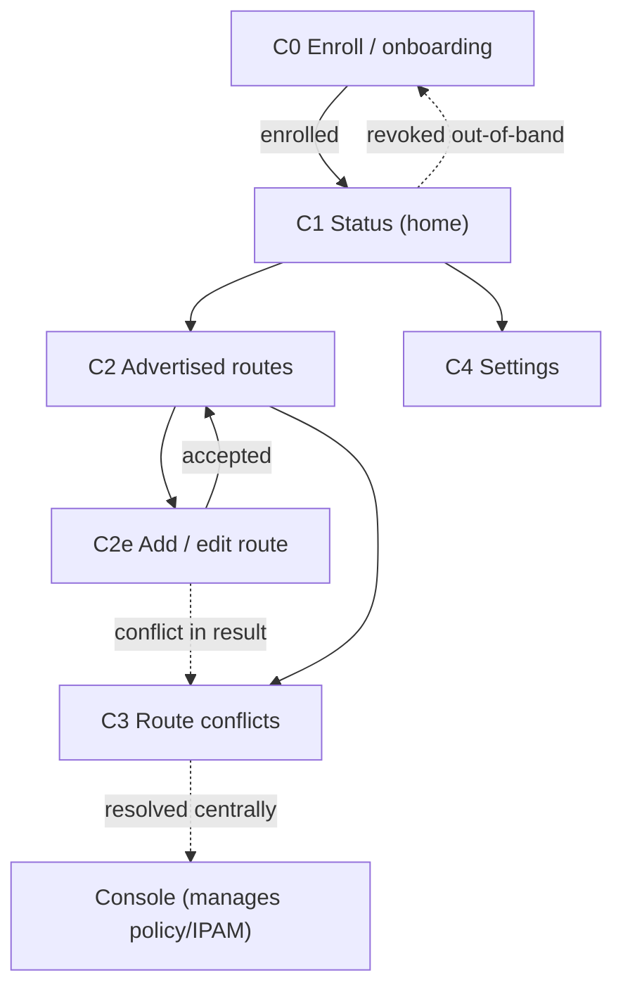

# Screens — Helix Connector (appliance UI)

**Revision:** 1
**Last modified:** 2026-06-25T12:00:00Z

> Master technical specification — Volume 10 (Design System), nano-detail
> deep-dive. This document **owns** the complete screen inventory and per-screen
> UX specification of **Helix Connector** — the HelixVPN appliance/network-side
> agent UI (Flutter, `flavor: HelixFlavor.connector`, capabilities
> `{Capability.tunnel, Capability.advertise, Capability.localAcl}`)
> [`03-client-core-and-ui.md` §6]. A Connector is the device that *advertises a
> subnet into the overlay* — it joins one or more private LANs to the HelixVPN
> network so authorized clients can reach LAN hosts (default-deny, C4).
>
> It defines, screen by screen: purpose, layout (compact-first appliance form
> factor, responsive up to desktop config), the `helix_design` components used,
> every state (loading / empty / error / live), navigation, interactions,
> accessibility, and the **light + dark** rendering — each backed by an ASCII
> wireframe.
>
> **SPEC-ONLY.** It describes *what each screen is and how it behaves* — not the
> shipping `connector` build. Original HelixVPN UX design work; the control-plane
> data each screen surfaces is owned by the cited control-plane docs.
>
> **Headless-first note (load-bearing).** The Connector ships **both** a
> headless daemon entrypoint (the same Rust core, no UI — primary on appliances)
> **and** this **optional** Flutter config UI [`03-client-core-and-ui.md` §6,
> D-CLIENT-4]. On a true headless appliance there is no screen at all; this UI is
> the **web-managed / local-attended** surface for the same daemon. That headless
> ⇄ UI duality is surfaced as decision **D-CONN-0** below.
>
> **Boundary with sibling docs.** **Owns:** the Connector screen set + per-screen
> layout/state/interaction/a11y. **Consumes:** colour roles + connection /
> feedback semantics + per-app **teal** accent [`color-system.md` §3/§6]; token
> tiers + spacing/radius/breakpoint scales [`design-tokens.md` §6]; the signature
> components (`ConnectButton`, `StatusChip`, `NetworkTile`, `ShieldIndicator`)
> [`component-library.md`, sibling]; the OpenDesign engine [`opendesign-foundation.md`];
> the **Console** counterpart that manages the same data centrally
> [`screens-console.md`, sibling]; the **Client** screens [`screens-client.md`,
> sibling]. The **data** is owned by the control-plane [`02-control-plane.md`] +
> [`v03-control-plane/svc-registry.md`], [`…/svc-ipam.md`], [`…/svc-identity.md`],
> [`…/svc-coordinator.md`]; the FFI status enum + shim by
> [`03-client-core-and-ui.md` §3/§4].
>
> **Evidence base.** `[CP §N]` = `final/02-control-plane.md`; `[CLIENT §N]` =
> `final/03-client-core-and-ui.md`; `[REG §N]`/`[IPAM §N]`/`[COORD §N]` = the
> matching `final/v03-control-plane/svc-*.md`; `[COLOR §N]` =
> `final/v10-design/color-system.md`; `[DT §N]` = `final/v10-design/design-tokens.md`;
> `[FFI §N]` = `final/03-client-core-and-ui.md` §3 (the `TunnelStatus`/`AdvertiseResult`
> surface). Claims not grounded in the evidence base or in this document's own
> original design choices are tagged `UNVERIFIED` per §11.4.6 — never fabricated.

---

## Table of contents

- [0. What the Connector is — and the principles that shape its screens](#0-what-the-connector-is--and-the-principles-that-shape-its-screens)
- [1. The Connector shell (form factor, responsive law)](#1-the-connector-shell-form-factor-responsive-law)
- [2. Screen inventory + navigation map](#2-screen-inventory--navigation-map)
- [3. Enroll / onboarding (enroll token, key generation)](#3-enroll--onboarding-enroll-token-key-generation)
- [4. Connection / health status (the home screen)](#4-connection--health-status-the-home-screen)
- [5. Advertised routes (the subnets it exposes)](#5-advertised-routes-the-subnets-it-exposes)
- [6. Route conflicts (overlapping-CIDR surfacing)](#6-route-conflicts-overlapping-cidr-surfacing)
- [7. Settings (appliance mode, kill-switch typically Off)](#7-settings-appliance-mode-kill-switch-typically-off)
- [8. Cross-screen states, a11y & light/dark contract](#8-cross-screen-states-a11y--lightdark-contract)
- [9. Surfaced decisions & cross-doc contracts](#9-surfaced-decisions--cross-doc-contracts)
- [Sources verified](#sources-verified)

---

## 0. What the Connector is — and the principles that shape its screens

A **Connector** is a `device` with `kind = connector` [CP §2.2, REG §2] that
**advertises CIDRs** into the overlay so authorized clients can reach the private
LAN behind it — the HelixVPN "1 user → N networks" differentiator [CP §3.1]. It
runs the *same* Rust core as the Client, in `CoreMode.Connector` / advertise mode
[CLIENT §6], and is typically an always-on appliance (a small box at a site,
`warehouse-gw`, `office-gw`). Its UI is intentionally **narrow**: get enrolled,
prove it is connected and healthy, declare which subnets it exposes, and surface
any conflicts — nothing more. Central management (policy, who-may-reach-it) lives
in the **Console** [`screens-console.md`]; the Connector UI is the *local* face.

Five principles govern every Connector screen:

1. **Status legibility above all.** Like the Client, the Connector's emotional
   centre is "am I up and serving my subnets?" — the home screen is a big,
   unambiguous health surface driven by the core's `statusStream` [FFI §3.2,
   CLIENT §0.1 CI2]. The UI is a **pure function of that stream** — never paints
   "up" on intent alone.
2. **Infrastructure accent = teal, safety colours unchanged.** The Connector's
   brand-overridable accent is `teal.*` [COLOR §6] — it reads as a network/
   infrastructure device, distinct from the Client's indigo and the Console's
   violet. The **connection-state and feedback semantics never change**
   (D-COLOR-1): "connected" is the same green everywhere.
3. **Declare subnets safely, conflict-aware.** The core advertise action returns
   `AdvertiseResult { accepted, conflicts }` [FFI §3.1]; the UI shows accepted vs
   conflicting CIDRs honestly and never claims a conflicting prefix is live.
4. **Appliance defaults, not consumer defaults.** A Connector is a server, not a
   personal device — so the kill-switch (which would sever the LAN it serves) is
   **Off by default**; turning it on is a deliberate, explained choice (§7,
   D-CONN-1).
5. **Headless-first, UI-optional.** The same daemon runs with **no screen** on a
   true appliance (D-CLIENT-4). This UI is the optional local/web-managed surface;
   it must degrade gracefully to "the daemon is the source of truth" and never
   imply the UI is required for the Connector to function.

> **Honest boundary (§11.4.6).** This document specifies layout, state, and
> interaction. It does **not** re-specify the FFI/REST payloads (owned by
> [FFI]/[CP §8]) nor the token hex/contrast (owned by [COLOR]/[DT]). A value not
> grounded in those is marked `UNVERIFIED`.

---

## 1. The Connector shell (form factor, responsive law)

The Connector UI runs on whatever screen the appliance offers — often a small
local display or, more commonly, a **browser pointed at the appliance** (local
management) — so it is **compact-first** but renders the full responsive ladder
[CLIENT §7.3, DT §6.6]:

| Breakpoint [DT §6.6] | Width | Shell layout |
|---|---|---|
| `compact` | < 600 | `BottomNavigationBar` (Status · Routes · Settings) + single pane — the appliance default |
| `medium` | 600–1024 | `NavigationRail` + master/detail (routes list │ route editor) |
| `expanded` | > 1024 | extended `NavigationRail` + two-pane (e.g. routes │ conflict detail) — desktop config |

```
┌───────────────────────────────────────────┐
│ ◆ Helix Connector   warehouse-gw   ◐  ◉live │  ← top bar (teal brand mark)
├───────────────────────────────────────────┤
│                                           │
│            (primary content pane)          │
│                                           │
├───────────────────────────────────────────┤
│   ▲ Status     ▦ Routes     ⚙ Settings     │  ← BottomNav (compact, 3 destinations)
└───────────────────────────────────────────┘
```

- **Top bar:** teal brand mark, the connector's name (`site_name` [CP §2.2]), a
  theme toggle (◐ system/light/dark), and a **live indicator** (◉ green stream
  healthy / amber reconnecting / red down — reuses the connection-state palette
  [COLOR §3]).
- **Three primary destinations** keep the appliance UI minimal: **Status**
  (home), **Routes** (advertised subnets, with the conflicts sub-view), and
  **Settings**. Onboarding (Enroll) is a pre-enrollment flow that precedes the
  shell.

---

## 2. Screen inventory + navigation map

| # | Screen | Route | Primary data source | Components |
|---|---|---|---|---|
| C0 | Enroll / onboarding | `/enroll` | identity enroll-token + local WG keygen [CP §9.2, FFI §3] | token field/QR scan, keygen, progress steps |
| C1 | Connection / health status (home) | `/` | `statusStream` [FFI §3.2] + presence [REG §5] | `ConnectButton`/health hero, `StatusChip`, serving summary |
| C2 | Advertised routes | `/routes` | `advertised_prefixes` + `advertise()` [REG §6, FFI §3.1] | route table, add/edit CIDR, enable toggle |
| C2e | Route — add / edit | `/routes/edit` | local form → `advertise()` | CIDR input, validation, accepted/conflict result |
| C3 | Route conflicts | `/routes/conflicts` | `route.conflict.detected` [REG §6.2, IPAM §6] | conflict list, 4via6 explanation, guidance |
| C4 | Settings | `/settings` | local config + appliance mode | mode, kill-switch (Off default), transport, identity, danger zone |



The Connector is a **near-linear** flow: enroll once → live on the Status home →
declare routes → handle conflicts. Deep policy/IPAM resolution is delegated to the
Console (the conflict view *explains* and links, it does not resolve centrally
itself). An out-of-band `device.revoke` from the Console [CP §9.3] drops the
Connector back to an enroll-required state.

---

## 3. Enroll / onboarding (enroll token, key generation)

**Purpose.** First-run: turn a single-use **enroll token** (minted by an operator
in the Console [CP §9.2]) into an enrolled connector identity — the device
**generates its WG keypair locally and the private key never leaves it** (C6
[CP §9.2]); only the 32-byte public key is registered. The flow mirrors the
enrollment sequence in [CP §9.2] from the device side.

**Layout (stepper, compact-first).**

```
┌───────────────────────────────────────────┐
│ ◆ Set up this Connector                    │
│  ●───────○───────○───────○                 │  ← step indicator
│  token   keys    name    done              │
├───────────────────────────────────────────┤
│  Step 1 · Enroll token                     │
│  Paste the token from your Console, or     │
│  scan its QR code.                         │
│  ┌─────────────────────────────────────┐   │
│  │  HLX-…………………………                      │   │  ← token input
│  └─────────────────────────────────────┘   │
│            [ Scan QR ]                      │
│                                           │
│  Control-plane URL                        │
│  ┌─────────────────────────────────────┐   │
│  │ https://cp.acme.example               │   │
│  └─────────────────────────────────────┘   │
│                              [ Continue ▸ ] │
└───────────────────────────────────────────┘
```

**Steps.** (1) **Token + control-plane URL** — paste/scan the single-use token;
(2) **Key generation** — the UI shows "generating WireGuard keypair on this
device — the private key never leaves here" with a brief progress state (the
keygen is local, C6); (3) **Name / site** — confirm the connector's `site_name`
[CP §2.2]; (4) **Done** — `Enroll(token, wg_pubkey, os, kind=CONNECTOR)` is sent
[CP §4]; on success the device receives `{device_id, overlay_ip, device_cert,
gateway}` [CP §9.2] and the UI advances to the Status home.

```
│  Step 2 · Generating keys                  │
│   🔑  Creating WireGuard keypair…           │
│   The private key is generated on this      │
│   device and never transmitted (C6).        │
│   ▓▓▓▓▓▓▓▓░░  done in a moment               │
```

**States.** *Loading* — per-step progress; keygen shows honest progress, never a
fake instant "done". *Empty* — first-run default (no token yet). *Error* — an
invalid/expired/already-consumed token returns a precise error ("this token was
already used — mint a new one in the Console", `feedback.error`); an unreachable
control-plane URL is a distinct error with retry. *Success* — a brief confirmation
(overlay IP assigned `fd7a:helix:…` [IPAM §1]) then auto-advance to C1.

**Interactions / a11y.** Token field is the default focus; QR scan uses the
device camera (with a manual-paste fallback for headless/no-camera appliances).
The token is **never logged** (§11.4.10). Full keyboard nav; step indicator has
SR labels. **Light/dark:** the stepper card is `surface.raised`; `[ Continue ]`
is `action.primary` (teal `#0F766E` light / `#2DD4BF` dark — AA-proven [COLOR §6]);
the key-privacy note is `feedback.info`/`text.secondary`.

---

## 4. Connection / health status (the home screen)

**Purpose.** The Connector's home and emotional centre: **is this appliance
up, connected to the gateway, and serving its subnets?** It is a pure function of
the core's `statusStream` [FFI §3.2, CI2] — the 7-variant `TunnelStatus`
(`Disconnected · Connecting · Handshaking · Connected{direct|relay} ·
Reconnecting · Down · Danger`) drives the hero colour + label via the
connection-state palette [COLOR §3], **always with a glyph + text** (CI5).

**Layout (status hero + serving summary).**

```
┌───────────────────────────────────────────┐
│ warehouse-gw                       ◉ live  │
├───────────────────────────────────────────┤
│                                           │
│              ╭───────────────╮             │
│              │   ✔  ONLINE    │             │  ← status hero (green = Connected)
│              │   serving 1    │             │     paints state colour + label
│              │   subnet       │             │
│              ╰───────────────╯             │
│                                           │
│   MASQUE · relay · 23 ms                    │  ← StatusChip (transport·path·rtt)
│                                           │
├──────────────── Serving ───────────────────┤
│   ▦ 10.10.0.0/24   ✓ advertised · enabled  │  ← NetworkTile per advertised CIDR
│   Overlay IP   fd7a:helix:a1b2::5           │
│   Gateway      gw.acme.example   ● reachable│
├───────────────────────────────────────────┤
│  ⓘ This appliance exposes its LAN subnets   │
│    to authorized clients only (default-deny)│
└───────────────────────────────────────────┘
```

**Per-state hero rendering** (the 7-variant mapping, [COLOR §3.1]):

| `TunnelStatus` [FFI §3.2] | Hero label | Hero colour family [COLOR §3] |
|---|---|---|
| `Disconnected` | "Offline — not connected (by choice)" | grey |
| `Connecting` / `Handshaking` | "Connecting…" | amber |
| `Connected{direct}` | "Online — serving · direct" | green (pure) |
| `Connected{relay}` | "Online — serving · relay" | teal-green sub-shade |
| `Reconnecting` | "Reconnecting…" (amber **pulse**, reduce-motion → static) | amber |
| `Down{reason}` | "Dropped — \<honest reason\>, retrying" | orange |
| `Danger{kind}` | "Danger — \<leak/killswitch\>" (z-top, overrides) | red |

**Components.** The **status hero** (a Connector-tuned `ConnectButton`/health
surface — for an always-on appliance it reads as a *status* surface more than a
tap target, but tapping toggles connect/disconnect for local control); a
**`StatusChip`** showing transport · path · RTT (`MASQUE · relay · 23ms`) live
from `Connected{transport,path,rtt}` [FFI §3.2]; a **serving summary** — one
`NetworkTile` per enabled advertised CIDR [CLIENT §7.2], the overlay IP, and the
gateway reachability dot.

**States.** *Loading* — hero in a neutral "connecting…" skeleton until the first
`statusStream` event (never green before the stream confirms it). *Empty* —
enrolled but **no routes advertised yet** ⇒ hero shows online but the serving
summary shows "no subnets advertised — add one in Routes" with a CTA to C2.
*Error/Down* — `Down{reason}` paints orange with the **honest reason** [FFI §3.2,
§11.4.6] and a retry; gateway-unreachable is distinguished from core-down.
*Danger* — `Danger{kind}` overrides everything with the red banner at z-top
[COLOR §3.2/§5] (e.g. a leak/kill-switch trip). *Revoked* — an out-of-band
`device.revoke` flips the hero to "revoked — re-enrollment required" and routes to
C0.

**A11y / light-dark.** The hero state is **announced** (SR), never colour-only
(CI5); the amber `Reconnecting` pulse degrades to static under reduce-motion
(never strobes, [COLOR §3.2], §11.4.107). Light/dark via the connection-state
palette (every state AA-proven both themes [COLOR §4.3/§4.4]); the teal accent
appears only on brand/action chrome, never on a safety signal.

---

## 5. Advertised routes (the subnets it exposes)

**Purpose.** The Connector's defining function: declare which LAN **CIDRs** this
appliance advertises into the overlay [REG §6]. Add / edit / enable / disable
prefixes; each change runs through the core `advertise(cidrs)` action that returns
`AdvertiseResult { accepted, conflicts }` [FFI §3.1] (the same code path as a
Console-side prefix edit [REG §6.1]).

**Layout (route table + add).**

```
┌───────────────────────────────────────────┐
│ Advertised routes (2)         [+ Add CIDR ] │
├──────────────────┬──────────┬───────────────┤
│ CIDR             │ ENABLED  │ STATUS        │
├──────────────────┼──────────┼───────────────┤
│ 10.10.0.0/24     │   ✓      │ ✓ advertised  │ ← accepted, live
│ 10.20.0.0/24     │   ✓      │ ⚠ conflict    │ ← overlaps another connector → C3
│ 10.30.0.0/24     │   ○      │ disabled      │ ← toggled off locally
├──────────────────┴──────────┴───────────────┤
│  2 advertised · 1 conflict · 1 disabled      │
│  ⚠ 1 conflict — review                       │  → tap → C3
└───────────────────────────────────────────┘
```

**Add / edit (C2e).**

```
┌───────────────────────────────────────────┐
│ ‹ Routes   Add CIDR                         │
│  CIDR                                       │
│  ┌─────────────────────────────────────┐    │
│  │ 10.40.0.0/24                          │    │  ← validated as a CIDR on blur
│  └─────────────────────────────────────┘    │
│  ⓘ Advertise a private subnet this appliance │
│    can route to. Reachability is governed by │
│    your Console policy (default-deny).       │
│                         [ Cancel ] [ Add ▸ ] │
├─────────────────────────────────────────────┤
│  RESULT (from advertise())                   │
│   ✓ accepted: 10.40.0.0/24                    │
│   (or)  ⚠ conflict: overlaps office-gw → C3   │
└─────────────────────────────────────────────┘
```

**Components.** A **route table** (one row per `advertised_prefixes` entry [REG §6]
with CIDR, enable toggle, per-row status: advertised / conflict / disabled); an
**add/edit form** validating CIDR syntax locally before calling `advertise()`; the
**`AdvertiseResult`** rendered honestly — `accepted` CIDRs flip to "✓ advertised",
`conflicts` flip to "⚠ conflict" and link to C3 (never shown as live [FFI §3.1]).

**Interactions.** Add a CIDR → `advertise()` → result shown inline; toggle
`enabled` (writes the prefix's `enabled` flag [CP §2.2]); edit/remove with a
§11.4.66 confirm for removal (it withdraws a subnet authorized clients may be
using). A conflicting result does **not** block the local declaration but is
clearly marked non-live and routed to C3 — resolution is central (Console/IPAM
[REG §6.3]).

**States.** *Loading* — table skeleton. *Empty* — "no subnets advertised yet — add
the LAN CIDR this appliance should expose" with the primary CTA. *Error* — a
failed `advertise()` shows the honest core error + retry; an invalid CIDR is
caught at the form before the call. *Conflict present* — conflict rows are amber
with a count badge linking to C3.

**A11y / light-dark.** Status cells pair colour with a glyph + text (✓/⚠, never
colour-only). The CIDR field uses `font.primitive.family.mono` [DT §4]. Light:
table on `surface.raised`, accepted = `feedback.success`, conflict =
`feedback.warning`; dark mirrors with the same roles.

---

## 6. Route conflicts (overlapping-CIDR surfacing)

**Purpose.** Surface and **explain** overlapping-CIDR conflicts — when this
Connector advertises a subnet that another connector in the tenant also advertises
(`route.conflict.detected` [REG §6.2, IPAM §6]). The defining HelixVPN problem
("two home/lab LANs both `192.168.1.0/24`" [CP §3.1]) shown from the appliance
side. Conflicts are **advisory, never blocking** [REG §6.3]; resolution is central
(Console/IPAM) — this screen makes the situation legible and points the right way.

**Layout.**

```
┌───────────────────────────────────────────┐
│ ‹ Routes   Route conflicts (1)              │
├───────────────────────────────────────────┤
│  ⚠ 10.20.0.0/24                              │
│     This appliance (warehouse-gw, site-1)    │
│     advertises a subnet that overlaps:       │
│       office-gw (site-2)                      │
│                                             │
│  How HelixVPN resolves this (4via6):         │
│   Each site gets a unique IPv6 mapping so     │
│   clients can reach the right host:           │
│     warehouse → fd7a:helix:a1b2:0001::/96     │
│     office    → fd7a:helix:a1b2:0002::/96     │
│                                             │
│  ⓘ Conflicts are advisory and never block.    │
│    Resolve centrally in the Console / IPAM,   │
│    or keep both via 4via6 disambiguation.     │
│                         [ open in Console ]   │
└───────────────────────────────────────────┘
```

**Components.** A **conflict list** (each overlapping-CIDR pairing with the other
connector's name + site-id); a **4via6 explanation** spelling out the per-site
`/96` IPv6 mappings that disambiguate the collision [IPAM §4.3, CP §3.1 D4]; an
**advisory note** + a deep-link to the Console's IPAM/conflict view where central
resolution happens [`screens-console.md` §10].

**States.** *Loading* — list skeleton. *Empty* — "no conflicts — all advertised
subnets are unique" (the healthy default). *Error* — inline retry over last-known.
The screen is **read + explain + link**; it does not itself perform central
resolution (that is a Console/operator action per §11.4.66 [REG §6.3]).

**A11y / light-dark.** Conflict headers carry a ⚠ glyph + text; the 4via6 mappings
are monospace. Light/dark via surface/text/feedback roles; the conflict emphasis
is amber in both themes; no colour-only signalling (CI5).

---

## 7. Settings (appliance mode, kill-switch typically Off)

**Purpose.** Local appliance configuration. Crucially, the Connector's **defaults
differ from the Client's** because it is a server, not a personal device — the
kill-switch is **Off by default** (turning it on would sever the very LAN the
appliance serves on a control-channel blip).

**Layout (sectioned).**

```
┌───────────────────────────────────────────┐
│ Settings                                   │
├───────────────────────────────────────────┤
│ ▸ Appliance                                 │
│    Mode        ◉ headless-managed  ○ local  │  ← D-CONN-0
│    Name/site   warehouse-gw                  │
│    Auto-start  ✓  (start on boot)            │
├───────────────────────────────────────────┤
│ ▸ Protection                                 │
│    Kill-switch         ○ Off   (default)     │  ← D-CONN-1 — Off for appliances
│      ⓘ On a connector, kill-switch would cut  │
│        the LAN it serves if control drops.    │
│        Leave Off unless you understand this.  │
│    DNS protection      ○ Off                  │
│    (DAITA / post-quantum — client shields,    │
│     not typically a connector concern)        │
├───────────────────────────────────────────┤
│ ▸ Transport                                  │
│    Escalation ladder  plain-udp → lwo →       │
│                        masque-h3  (from CP)   │
├───────────────────────────────────────────┤
│ ▸ Appearance   theme ◐ system ○ light ○ dark │
├───────────────────────────────────────────┤
│ ▸ Identity     overlay fd7a:helix:a1b2::5     │
│                cert valid · auto-renews       │
│    [ Re-enroll ]                              │
├───────────────────────────────────────────┤
│ ▸ Danger zone  Leave network (de-enroll)      │  ← confirmed, irreversible
└───────────────────────────────────────────┘
```

**Components & key decisions.**

- **Appliance mode** (D-CONN-0): *headless-managed* (the daemon is primary, this
  UI is a window onto it) vs *local* (UI-attended). Auto-start-on-boot toggle.
- **Protection** — the `ShieldIndicator`-class controls [CLIENT §7.2] wired to the
  core `Shields` [FFI §3.1], but with **appliance defaults**: **kill-switch Off**
  (D-CONN-1) with an explicit explanation of why a connector should usually leave
  it off (it serves a LAN; cutting it on a blip is rarely desired). DAITA /
  post-quantum are surfaced as client-oriented shields and de-emphasised here.
- **Transport** — the escalation ladder the control plane ships
  (`TransportPolicy.order` [CP §4]); shown read-mostly (the Console owns the
  default; local override is `allow_user_override`-gated [CP §4]).
- **Identity** — overlay IP + cert status (auto-renewing over the control channel
  [CP §9.3]) + a re-enroll action.
- **Danger zone** — "Leave network (de-enroll)" — irreversible, §11.4.66
  double-confirmed (it withdraws the appliance and its subnets).

**States.** *Loading* — section skeletons. *Error* — per-section inline. *Kill-
switch toggle* — turning it **On** raises a §11.4.66 confirm explaining the LAN-
severing consequence (it is not a silent flip). *Revoked* — identity section shows
revoked + re-enroll guidance.

**A11y / light-dark.** Every toggle is keyboard-operable + labelled; the kill-
switch warning is `feedback.warning` (amber both themes); danger-zone uses
`feedback.error` + a typed confirm. Standard surface/text roles, light + dark.

---

## 8. Cross-screen states, a11y & light/dark contract

These hold for **every** Connector screen (so each section above states only its
specifics):

| Concern | Contract | Source |
|---|---|---|
| **Status truth** | the UI is a pure function of the core `statusStream`; never paints "up/serving" on intent alone | CI2 [CLIENT §0.1], [FFI §3.2] |
| **Loading** | skeleton placeholders, never a green-before-confirmed hero; the status hero waits for the first stream event | original UX, §11.4.6 |
| **Empty** | purposeful empty states with the next action (enroll, add a CIDR) — never an ambiguous blank | original UX |
| **Error / Down** | the **honest** reason from `Down{reason}` / core error, an inline retry; gateway-unreachable distinguished from core-down | §11.4.6, [FFI §3.2] |
| **Danger** | `Danger{kind}` (leak / kill-switch tripped) overrides everything, red, at z-top, never occluded | [COLOR §3.2/§5], [FFI §3.2] |
| **Confirm** | every consequential action (remove route, enable kill-switch, de-enroll) is confirmed via the interactive mechanism | §11.4.66 |
| **Colour ≠ only signal** | every state dot/badge pairs colour with a glyph + text; the `Reconnecting` pulse degrades to static under reduce-motion | CI5 [CLIENT §0.1], [COLOR §0/§3.2] |
| **No overlap / no label-overlay** | ≥ `space.scale.2` (8 px) between coloured regions; overlays use `overlay.scrim`; danger at z-top | §11.4.162, [COLOR §5] |
| **Light + dark** | every screen renders in both, all roles AA-proven both themes; teal accent is the only per-app difference | §11.4.162, [COLOR §2/§4/§6] |
| **Headless honesty** | the UI never implies it is required; on a headless appliance the daemon is the source of truth and the UI is an optional window | D-CLIENT-4 [CLIENT §6] |

**The teal light/dark accent (the Connector's only brand difference).**

| Role | Light | Dark | Proof [COLOR §6] |
|---|---|---|---|
| `action.primary` / accent | `teal.700 #0F766E` | `teal.400 #2DD4BF` | text **5.47** light / **9.47** dark — AA both |

Everything else — surfaces, text, borders, **connection-state**, **feedback** — is
the identical shared semantic set used by Client and Console (D-COLOR-1); the
Connector never recolours a safety signal. (Note: the teal accent and the
`Connected{relay}` sub-shade are deliberately the same hue family — but the relay
state is still distinguished from the brand accent by the paired glyph + "relay"
label, never colour alone, [COLOR §3.2].)

---

## 9. Surfaced decisions & cross-doc contracts

| id | Decision / contract | Status |
|---|---|---|
| **D-CONN-0** | Headless-first: the Connector daemon runs with **no UI** on a true appliance (primary); this Flutter UI is the **optional** local/web-managed surface for the same core. The UI degrades to "daemon is source of truth" and never implies it is required. | decided [CLIENT §6, D-CLIENT-4] |
| **D-CONN-1** | The kill-switch is **Off by default** on a Connector (a server serving a LAN), unlike the Client (On-favoured). Enabling it is a §11.4.66-confirmed choice with an explicit LAN-severing warning. | decided (recommended) |
| **D-CONN-2** | Conflicts are surfaced + explained (4via6) locally but **resolved centrally** (Console/IPAM); the Connector UI links out, it does not perform central resolution. | decided [REG §6.3] |
| **D-CONN-3** | Minimal three-destination shell (Status · Routes · Settings) — the appliance UI stays narrow; policy / who-may-reach-it lives in the Console. | decided |
| **C-CONN-A** (consumes) | The `TunnelStatus`/`AdvertiseResult`/`Shields` FFI surface owned by [FFI §3]; control-plane data + payloads by [CP §8] + [REG]/[IPAM]. | contract |
| **C-CONN-B** (consumes) | Colour roles + teal accent owned by [COLOR]; token scales/breakpoints by [DT]; signature components by [`component-library.md`]. | contract |
| **C-CONN-C** (provides) | This screen set + per-screen states are the spec the visual-regression + golden suite asserts against (light+dark, every breakpoint, §11.4.162). | contract |
| **U-CONN-1** `UNVERIFIED` | The exact local-management transport for the web-managed UI (does the browser UI talk to the local daemon over a local HTTP/IPC socket, or only via the control plane?) is pinned by the shim/daemon spec [CLIENT §5]; stated here as "web-managed", binding `UNVERIFIED`. | open |
| **U-CONN-2** `UNVERIFIED` | Whether the Connector UI exposes a local-ACL/site-restriction editor (the flavor carries `Capability.localAcl` [CLIENT §6]) as its own screen vs folding it into Settings — surfaced; the MVP folds local-ACL into Settings, a dedicated screen is `UNVERIFIED`/Phase-2. | open |

---

## Sources verified

- **Connector flavor (`{tunnel, advertise, localAcl}`), headless daemon +
  optional Flutter config UI (D-CLIENT-4), capability model, `runHelixApp`, the
  signature components (`ConnectButton`/`StatusChip`/`NetworkTile`/`ShieldIndicator`),
  responsive law, a11y (UI = pure function of status stream, colour ≠ only signal,
  reduce-motion)** — `final/03-client-core-and-ui.md` §6 (flavors/capabilities),
  §7 (design system + responsive + a11y), §3 (the FFI `TunnelStatus`/`AdvertiseResult`/
  `Shields` surface), §4 (`TunnelPlatform` shim), §0.1 (CI2/CI5), §14 (D-CLIENT-4
  headless+UI) (read 2026-06-25).
- **Connector control-plane data** — `final/02-control-plane.md`: §2.2
  (`devices`/`connectors`/`advertised_prefixes` DDL, `kind=connector`), §3 (IPAM ULA
  /48 + 4via6, the colliding-subnet problem D4), §4 (`Coordinator` proto: `Enroll`,
  `AdvertisePrefixes`, `AdvertiseResponse{conflicts}`, `TransportPolicy`), §9
  (enrollment: local WG keygen, private key never leaves C6; cert auto-renew; revoke
  < 1 s) (read 2026-06-25).
- **Per-service screen data** — `final/v03-control-plane/`: `svc-registry.md` §2/§5/§6
  (connector/device model, presence, prefix advertisement + intra-tenant overlap
  conflict detection, advisory-not-blocking semantics); `svc-ipam.md` §1/§4/§6 (ULA
  address plan, per-connector site-id, 4via6 route derivation, conflict lifecycle);
  `svc-coordinator.md` §4 (event reactions: `connector.attached`,
  `connector.prefixes.changed`); `svc-identity.md` (enroll-token issue/consume) (read
  2026-06-25).
- **Colour roles, the Connector teal accent + its AA contrast proofs, the 7-variant
  connection-state palette (the status-hero mapping), reduce-motion pulse rule,
  no-overlap / no-label-overlay rule, light+dark mandate** —
  `final/v10-design/color-system.md` §3 (connection-state palette + per-state
  rationale), §4 (contrast proofs), §5 (no-overlap rule), §6 (per-app accent:
  Connector = teal) (sibling, this wave).
- **Token tiers, spacing/radius/breakpoint scales (the responsive breakpoints +
  surfaces the layouts use), motion (`connectPulse`/`stateXfade`), the mono font** —
  `final/v10-design/design-tokens.md` §6 (scales/motion), §4 (font), §1 (tiers)
  (sibling, this wave).
- **OpenDesign engine that emits the tokens** —
  `final/v10-design/opendesign-foundation.md` (sibling, this wave; §11.4.162).
- **Signature-component contracts + the Console (central management) / Client
  counterpart screens** — `final/v10-design/component-library.md`,
  `…/screens-console.md`, `…/screens-client.md` (siblings; screens-console + the
  component library land in this same Volume-10 wave — cross-referenced, not
  duplicated).
- Items marked `UNVERIFIED` (U-CONN-1 local-management transport, U-CONN-2
  dedicated local-ACL screen vs Settings-fold) are pending their named decision/
  contract spec per §11.4.6 — **not** asserted as fact.
- **Layout, per-screen state machines, interaction flows, wireframes, the
  appliance-default decisions (kill-switch Off, headless-first, minimal shell)** —
  **NO external source needed — original HelixVPN UX design work** (the screen
  compositions are owned by this document; they render the cited control-plane /
  FFI data through the cited design-system tokens/components).
