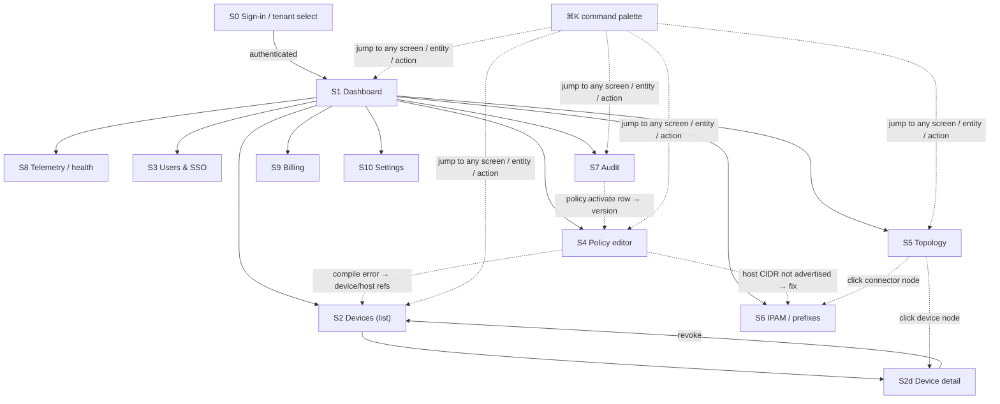

# Screens — Helix Console (admin web/desktop app)

**Revision:** 1
**Last modified:** 2026-06-25T12:00:00Z

> Master technical specification — Volume 10 (Design System), nano-detail
> deep-dive. This document **owns** the complete screen inventory and per-screen
> UX specification of **Helix Console** — the HelixVPN administration app
> (Flutter, `flavor: HelixFlavor.console`, capability `{Capability.admin}`,
> **no `helix_core_ffi`**, the **only** flavor that builds to Web)
> [`03-client-core-and-ui.md` §6, CI3]. It defines, screen by screen: purpose,
> desktop-first responsive layout, the `helix_design` components used, every
> state (loading / empty / error / partial / live), navigation, interactions,
> accessibility, and the **light + dark** rendering — each backed by an ASCII
> wireframe.
>
> **SPEC-ONLY.** It describes *what each screen is and how it behaves* — not the
> shipping `console` build. Original HelixVPN UX design work; the control-plane
> data each screen surfaces is owned by the cited control-plane docs.
>
> **Boundary with sibling docs.** **Owns:** the Console screen set + per-screen
> layout/state/interaction/a11y. **Consumes:** the colour roles + connection /
> feedback semantics + per-app **violet** accent [`color-system.md` §2/§6]; the
> token tiers + spacing/radius/breakpoint scales [`design-tokens.md` §6]; the
> signature components (`AdaptiveScaffold`, `NetworkTile`, `PolicyEditor`, …)
> [`component-library.md`, sibling, this wave]; the OpenDesign engine that emits
> the tokens [`opendesign-foundation.md`]; the **Connector** counterpart screens
> [`screens-connector.md`, sibling]; the **Client** screens [`screens-client.md`,
> sibling]. The **data** every screen renders is owned by the control-plane:
> [`02-control-plane.md`] + the V3 service docs
> [`v03-control-plane/svc-registry.md`], [`…/svc-policy.md`],
> [`…/svc-coordinator.md`], [`…/svc-telemetry.md`], [`…/svc-ipam.md`],
> [`…/svc-identity.md`].
>
> **Evidence base.** `[CP §N]` = `final/02-control-plane.md`; `[CLIENT §N]` =
> `final/03-client-core-and-ui.md`; `[REG §N]`/`[POL §N]`/`[COORD §N]`/`[TEL §N]`/
> `[IPAM §N]` = the matching `final/v03-control-plane/svc-*.md`; `[COLOR §N]` =
> `final/v10-design/color-system.md`; `[DT §N]` = `final/v10-design/design-tokens.md`.
> Claims not grounded in the evidence base or in this document's own original
> design choices are tagged `UNVERIFIED` per constitution §11.4.6 — never
> fabricated. Layout/state/interaction designs are **original HelixVPN UX work**.

---

## Table of contents

- [0. What the Console is — and the design principles that shape every screen](#0-what-the-console-is--and-the-design-principles-that-shape-every-screen)
- [1. The Console shell (AdaptiveScaffold, responsive law, command palette)](#1-the-console-shell-adaptivescaffold-responsive-law-command-palette)
- [2. Screen inventory + navigation map](#2-screen-inventory--navigation-map)
- [3. Sign-in (OIDC + tenant select)](#3-sign-in-oidc--tenant-select)
- [4. Dashboard / overview](#4-dashboard--overview)
- [5. Devices (list · detail · approve / revoke)](#5-devices-list--detail--approve--revoke)
- [6. Users & SSO (OIDC config, roles)](#6-users--sso-oidc-config-roles)
- [7. Policy editor (ACL rules, compile / preview, fail-closed)](#7-policy-editor-acl-rules-compile--preview-fail-closed)
- [8. Topology (the coordinator graph)](#8-topology-the-coordinator-graph)
- [9. Audit log (control-action audit — no traffic logs)](#9-audit-log-control-action-audit--no-traffic-logs)
- [10. IPAM / prefixes](#10-ipam--prefixes)
- [11. Telemetry / health (counters, convergence & event-lag SLOs)](#11-telemetry--health-counters-convergence--event-lag-slos)
- [12. Billing / subscription](#12-billing--subscription)
- [13. Settings](#13-settings)
- [14. Cross-screen states, a11y & light/dark contract](#14-cross-screen-states-a11y--lightdark-contract)
- [15. Surfaced decisions & cross-doc contracts](#15-surfaced-decisions--cross-doc-contracts)
- [Sources verified](#sources-verified)

---

## 0. What the Console is — and the design principles that shape every screen

Helix Console is the **admin brain's front end**: it is where a tenant
administrator manages *who may reach what*. It is the UI over the Go control
plane's REST + WebSocket/SSE surface [CP §8] — it **never** opens a tunnel, never
links the Rust core (`Capability.admin`, no `helix_core_ffi`, CI3
[CLIENT §6]) — so it is the one flavor that builds to **Web** and also ships as a
desktop app (macOS / Windows / Linux from the same tree).

Five principles govern every Console screen:

1. **Density without clutter — desktop-first.** The Console is a power tool used
   on `lg` (1024) and `xl` (1440) viewports [DT §6.6]; it presents heavy tables,
   a graph, and a code-like policy editor. It uses the **expanded
   `AdaptiveScaffold`** (extended `NavigationRail` + multi-pane) [CLIENT §7.3] and
   degrades gracefully to a phone layout, but the home turf is the wide screen.
2. **Authority accent = violet, safety colours unchanged.** The Console's
   brand-overridable accent is `violet.*` [COLOR §6] — it reads as an
   admin/authority surface, distinct from the Client's indigo and the Connector's
   teal. The **connection-state and feedback semantics never change** (D-COLOR-1):
   a device shown "online/protected" is the same green everywhere.
3. **Live, not polled.** Device lists, the topology graph, and the audit feed fold
   `GET /v1/stream` WS/SSE events (`device.online`, `route.changed`,
   `policy.compiled`, `device.revoked`) into state and update **without a manual
   refresh** [CLIENT §8.3, CP §8]. A small live-connection indicator tells the
   admin the stream is healthy.
4. **Fail-closed, preview-before-apply.** The highest-stakes screen (Policy
   editor) compiles **dry-run first** and shows an effect-diff before anything
   activates [POL §4/§5]; destructive control actions (revoke, deactivate)
   require explicit confirmation per §11.4.66.
5. **Privacy by construction is visible.** The Console **cannot** show traffic /
   connection / flow logs because they do not exist (C3 [CP §0.1]). The Audit
   screen states this plainly — it shows *control actions*, never user traffic.

> **Honest boundary (§11.4.6).** This document specifies layout, state, and
> interaction. It does **not** re-specify the REST/WS payloads (owned by [CP §8] +
> the V3 service docs) nor the token hex/contrast (owned by [COLOR]/[DT]). Where a
> concrete control-plane field name is cited it is grounded in those docs; a value
> not so grounded is marked `UNVERIFIED`.

---

## 1. The Console shell (AdaptiveScaffold, responsive law, command palette)

Every screen renders **inside** the Console shell. The shell is `AdaptiveScaffold`
[CLIENT §7.2] branching on **width, never `Platform.isX`** [CLIENT §7.3]:

| Breakpoint [DT §6.6] | Width | Shell layout |
|---|---|---|
| `compact` | < 600 | `BottomNavigationBar` (5 primary destinations) + single pane; overflow destinations in a "More" sheet |
| `medium` | 600–1024 | `NavigationRail` (icons + labels) + master/detail two-pane |
| `expanded` | > 1024 | **Extended `NavigationRail`** (icon + text, pinned) + multi-pane (list │ detail │ live-events rail) — the Console home turf |

```
┌──────────────────────────────────────────────────────────────────────────┐
│ Helix Console      [acme-corp ▾]            ⌘K  ◐ theme   ◉ live   ⦿ admin │  ← top app bar (surface.default, violet brand mark)
├───────────────┬──────────────────────────────────────────┬───────────────┤
│ ▣ Dashboard   │                                          │  LIVE EVENTS  │
│ ▤ Devices     │            (primary content pane)         │  ───────────  │
│ ⦿ Users & SSO │                                          │ 12:04 dev on  │
│ ⛨ Policy      │                                          │ 12:03 policy  │
│ ◈ Topology    │                                          │      v8 act.  │
│ ▦ IPAM        │                                          │ 12:01 dev off │
│ ☰ Audit       │                                          │ …             │
│ ▲ Telemetry   │                                          │ (folds /v1/   │
│ ▮ Billing     │                                          │  stream WS)   │
│ ⚙ Settings    │                                          │               │
│ ───────────── │                                          │               │
│ ◉ stream OK   │                                          │               │
└───────────────┴──────────────────────────────────────────┴───────────────┘
   extended rail            content (master│detail)           live-events rail
```

- **Top app bar** carries: the Console brand mark (violet), the **tenant
  switcher** `[acme-corp ▾]` (an admin with rights to >1 tenant; one tenant ⇒
  static label), the **⌘K command palette** trigger, a **theme toggle** (◐
  system/light/dark), the **live-stream indicator** (◉ green = stream healthy /
  amber = reconnecting / red = stream down — reuses the connection-state palette
  [COLOR §3]), and the signed-in admin avatar + role chip.
- **Command palette (⌘K / Ctrl-K)** [CLIENT §7.3] — fuzzy jump to any screen,
  device, user, policy version, or action ("revoke device …", "activate policy
  v7"). Keyboard-first; every action it lists is also reachable by mouse.
- **Live-events rail** (expanded only) folds the WS/SSE stream; on `medium`/
  `compact` it collapses into a bell/notification sheet.
- The **stream-health chip** at the rail foot is the §11.4.6-honest signal that
  "live" is real: amber when the WS reconnects, red + a banner when it is down
  (the lists then show a "may be stale — reconnecting" notice rather than lying).

---

## 2. Screen inventory + navigation map

| # | Screen | Route | Primary data source | Min role [CP §8.1] | Key components |
|---|---|---|---|---|---|
| S0 | Sign-in / tenant select | `/signin` | identity (OIDC) [`svc-identity.md`] | (unauth) | brand splash, OIDC button, tenant chooser |
| S1 | Dashboard / overview | `/` | aggregate of registry + telemetry + policy | member+ | stat cards, SLO sparkline, live-event digest |
| S2 | Devices — list | `/devices` | `GET /v1/devices` [REG §3] | member+ | data table, presence dot, filter bar |
| S2d | Device — detail | `/devices/:id` | device + certs + presence [REG §2/§5] | member+ | detail header, cert panel, revoke action |
| S3 | Users & SSO | `/users` | identity / OIDC config [`svc-identity.md`] | admin | roster table, role editor, OIDC config form |
| S4 | Policy editor | `/policy` | `policies.spec` + compiler [POL §2/§4] | operator+ | `PolicyEditor`, effect-diff, version history |
| S5 | Topology | `/topology` | coordinator graph [COORD §1] | member+ | graph canvas, node/edge inspector |
| S6 | IPAM / prefixes | `/ipam` | overlay pool + advertised_prefixes [IPAM §1, REG §6] | operator+ | pool card, prefix table, conflict list |
| S7 | Audit | `/audit` | `audit_events` [TEL §4] | admin (read) | audit feed, action filter, no-traffic banner |
| S8 | Telemetry / health | `/health` | Prometheus series [TEL §3] | operator+ | SLO gauges, convergence histogram, alert list |
| S9 | Billing / subscription | `/billing` | billing provider `UNVERIFIED` | admin | plan card, seat usage, invoices |
| S10 | Settings | `/settings` | tenant config + per-user prefs | varies | tenant settings, theme, session, danger zone |



The map is a hub-and-spoke from the Dashboard, with **cross-links that follow the
data**: a policy compile error that names an un-advertised host CIDR links to
IPAM (S6); a topology connector node links to its IPAM prefixes; an audit
`policy.activate` row links to that policy version in the editor.

---

## 3. Sign-in (OIDC + tenant select)

**Purpose.** Authenticate a tenant admin (OIDC session) and, when the identity
maps to more than one tenant, choose which to administer. Managed (OIDC) is the
Console's identity mode [CP §9.1] — the anonymous device-token path is a *Client*
enrollment concern, not a Console sign-in.

**Layout (desktop-first, centred card).**

```
┌──────────────────────────────────────────────────────────────────────────┐
│                                                                            │
│                      ◆  Helix Console                                       │  ← violet brand mark
│                      Administer your private network                       │
│                                                                            │
│              ┌────────────────────────────────────────────┐                │
│              │  Continue with your identity provider       │                │
│              │  ┌──────────────────────────────────────┐  │                │
│              │  │   ⦿  Sign in with SSO  (OIDC)          │  │  ← action.primary (violet)
│              │  └──────────────────────────────────────┘  │                │
│              │                                            │                │
│              │  Self-hosted? Enter your control-plane URL │                │
│              │  ┌──────────────────────────────────────┐  │                │
│              │  │ https://cp.acme.example                │  │  ← input
│              │  └──────────────────────────────────────┘  │                │
│              └────────────────────────────────────────────┘                │
│                                                                            │
│      No traffic is ever logged. Helix stores identity & policy only.       │  ← privacy note (C3)
└──────────────────────────────────────────────────────────────────────────┘
```

**Tenant select (post-auth, multi-tenant identity).**

```
┌──────────────────────────────┐
│  Choose a tenant             │
│  ┌────────────────────────┐  │
│  │ ◈ acme-corp     142 dev │  │ ← selectable rows; presence count from registry
│  │ ◈ acme-eu        38 dev │  │
│  │ ◈ lab            6 dev   │  │
│  └────────────────────────┘  │
└──────────────────────────────┘
```

**States.** *Loading* — brand splash + indeterminate progress while the OIDC
redirect resolves. *Empty* — identity maps to **zero** tenants ⇒ a clear "your
account is not an admin on any tenant; contact your operator" message (not a
spinner that hangs). *Error* — OIDC failure shows the honest provider reason
(`feedback.error`, [COLOR §2.4]) with a retry, never a generic "something went
wrong"; an unreachable control-plane URL is a distinct, actionable error.

**Interactions / a11y.** SSO button is the default focus + Enter-activates; the
control-plane-URL field validates as a URL on blur. Full keyboard nav; the brand
mark has an `alt`. **Light/dark:** the card is `surface.raised`, the SSO button
`action.primary` (violet `#6D28D9` light / `#A78BFA` dark, both AA-proven
[COLOR §6]); the privacy note is `text.secondary`.

---

## 4. Dashboard / overview

**Purpose.** The at-a-glance health of the tenant's network: how many devices are
online, whether the active policy is healthy, whether the control plane is meeting
its < 1 s convergence SLO [CP §10.2], and a digest of recent control activity. It
is a **read** screen (member+) that links into every deeper screen.

**Layout (expanded, three-zone).**

```
┌──────────────────────────────────────────────────────────────────────────┐
│  Dashboard — acme-corp                                   updated live ◉    │
├──────────────────────────────────────────────────────────────────────────┤
│  ┌───────────┐ ┌───────────┐ ┌───────────┐ ┌───────────┐                  │
│  │ DEVICES   │ │ CONNECTORS│ │ ACTIVE    │ │ CONVERGE  │   ← stat cards     │
│  │ 142       │ │ 7         │ │ POLICY    │ │ p99       │     (elevation.card)│
│  │ 118 online│ │ 6 online  │ │ v8 ✓      │ │ 0.42 s ✓  │                   │
│  │ ▲ green   │ │ ▲ green   │ │ green     │ │ green     │                   │
│  └───────────┘ └───────────┘ └───────────┘ └───────────┘                  │
│  ┌──────────────────────────────────┐  ┌──────────────────────────────┐   │
│  │ CONVERGENCE (event→delta, p99)    │  │ RECENT CONTROL ACTIONS        │   │
│  │  1s┤                              │  │ 12:04 alice revoked dev-31    │   │
│  │    │      ╭╮      ╭─╮            │  │ 12:03 system activated pol v8 │   │
│  │ .5s┤ ╭──╮╱  ╲╭───╯  ╲──         │  │ 12:01 bob enrolled connector  │   │
│  │    │╱            (sparkline)     │  │ 11:58 carol changed prefixes  │   │
│  │  0 └──────────────────────────  │  │ → see full Audit              │   │
│  └──────────────────────────────────┘  └──────────────────────────────┘   │
│  ┌──────────────────────────────────────────────────────────────────────┐ │
│  │ ⚠ 2 advisory route conflicts (overlapping CIDRs) — review in IPAM      │ │ ← advisory banner (warning)
│  └──────────────────────────────────────────────────────────────────────┘ │
└──────────────────────────────────────────────────────────────────────────┘
```

**Components.** Four **stat cards** (`elevation.semantic.card` [DT §6.3]) each
with a value, a sub-count, and a state-coloured indicator dot; a **convergence
sparkline** sourced from `helix_reconcile_seconds` p99 [TEL §3.2, COORD §7.3]; a
**recent-actions digest** (last N `audit_events` [TEL §4]); an **advisory banner**
summarising open `route.conflict.detected` items [REG §6.3] (advisory, never
blocking — links to IPAM S6).

**States.** *Loading* — skeleton cards (shimmer placeholders, never a blank
screen). *Empty* — a freshly-bootstrapped tenant with 0 devices shows an
onboarding card: "Enroll your first connector" → mint an enroll token (links to
Devices/enroll). *Error* — if an aggregate query fails, that one card shows an
inline error + retry while the rest render (no all-or-nothing). *Live* — counts
and digest update from `/v1/stream` without refresh; the "updated live ◉" chip
goes amber if the stream drops.

**SLO colour logic (honest, §11.4.6).** The convergence card is green only when
p99 < the SLO target (1 s [CP §10.2]); amber within 1–2×; red above — and the
card states the *measured* number, never "healthy" without the figure.

**A11y / light-dark.** Stat values are `text.primary` (AAA both themes); the
indicator dots carry a text/icon label too (never colour-only, CI5 [CLIENT §0.1]).
Cards are `surface.raised`; the warning banner is `feedback.warning`
(`amber.700` light / `amber.400` dark [COLOR §2.4]).

---

## 5. Devices (list · detail · approve / revoke)

### 5.1 Devices — list (S2)

**Purpose.** The roster of every device (clients **and** connectors — one
`devices` table, `kind` discriminates [CP §2.2, REG §2]). Filter, sort, search,
and drill in. Live presence from Redis TTL keys via the stream [REG §5.3, TEL §5].

**Layout (data table + filter bar).**

```
┌──────────────────────────────────────────────────────────────────────────┐
│ Devices (142)        [ search name / overlay-ip ]   [+ Enroll device ▾]    │
│ Filter: ◉ all  ○ clients  ○ connectors    Status: ○ online ○ offline ○ all │
├───┬──────────────┬─────────┬────────────────────┬──────────┬──────────────┤
│ ● │ NAME         │ KIND    │ OVERLAY IP         │ OS       │ LAST SEEN     │
├───┼──────────────┼─────────┼────────────────────┼──────────┼──────────────┤
│ ● │ alice-mbp    │ client  │ fd7a:helix:1::2    │ macos    │ online        │ ← green presence dot
│ ● │ warehouse-gw │ connect.│ fd7a:helix:1::5    │ linux    │ online        │
│ ○ │ bob-pixel    │ client  │ fd7a:helix:1::9    │ android  │ 3 h ago       │ ← grey (offline)
│ ⊘ │ old-laptop   │ client  │ fd7a:helix:1::4    │ windows  │ revoked       │ ← red (revoked)
│ … │              │         │                    │          │               │
├───┴──────────────┴─────────┴────────────────────┴──────────┴──────────────┤
│  118 online · 23 offline · 1 revoked            ‹ 1 2 3 … ›  rows: 25 ▾     │
└──────────────────────────────────────────────────────────────────────────┘
```

**Interactions.** Click a row → device detail (S2d). The `[+ Enroll device ▾]`
split-button mints a single-use enroll token [CP §9.2] and shows it as text + QR
(operator hands it to the device); the QR/token is **never** logged
(§11.4.10). Column sort; multi-facet filter; debounced search over name +
overlay IP. Presence dot uses the connection-state palette: green online / grey
offline / red revoked — **always paired with the text status** (CI5).

**States.** *Loading* — table skeleton rows. *Empty* — "No devices yet — enroll
your first connector or client" with the enroll CTA. *Error* — a banner
("couldn't load devices — retry") above the last-known rows (stale, marked).
*Live* — `device.online`/`.offline`/`.revoked`/`.enrolled` events mutate rows in
place; a newly enrolled device animates in (`motion.stateXfade` [DT §6.4]).

### 5.2 Device — detail (S2d)

**Purpose.** Everything known about one device (identity only, never traffic):
identity, overlay IP, presence, current transport/RTT (presence/health only,
C3), certificate state, group memberships, and the **revoke** action. For a
connector it also surfaces its advertised prefixes (links to IPAM).

```
┌──────────────────────────────────────────────────────────────────────────┐
│ ‹ Devices   alice-mbp                              ● online   [ Revoke ⊘ ] │
├──────────────────────────────────────────────────────────────────────────┤
│ Identity                          │ Certificate                           │
│  Kind      client                 │  Serial    9f2c…                      │
│  Owner     alice@acme  (user)     │  Not after 2026-06-26 12:00Z (23 h)   │
│  OS        macos                  │  Status    valid  ✓                   │
│  Overlay   fd7a:helix:1::2        │  Auto-renews over control channel     │
│  Enrolled  2026-06-20             │                                       │
│  WG pubkey 32B  Yg8…==  (public)  │  [ Force re-issue ]                    │
├───────────────────────────────────┴───────────────────────────────────────┤
│ Presence / health (no traffic data — C3)                                   │
│  Last seen   online (live)     Transport  masque-h3     RTT  23 ms         │
│  Groups      group:admins                                                  │
├──────────────────────────────────────────────────────────────────────────┤
│ ⓘ HelixVPN stores identity & policy only. There is no connection,          │
│   destination, or bandwidth record for this device, by construction.       │
└──────────────────────────────────────────────────────────────────────────┘
```

**Revoke flow (§11.4.66 confirm).** `[ Revoke ⊘ ]` opens a confirmation dialog
("Revoke alice-mbp? Its tunnel is force-closed and its peer is removed from every
map within ~1 s [CP §9.3]. This cannot be undone — re-enrollment is required.").
On confirm: `POST /v1/devices/:id/revoke` (admin-only [CP §8.1]); the row flips to
revoked, an audit `device.revoke` row is written, and the topology graph drops the
node live. Revoke is **admin-only**; operator/member see it disabled with a
tooltip stating the required role.

**States.** *Loading* — header skeleton + panels shimmer. *Error* — per-panel
inline error (cert panel can fail independently of identity). *Revoked device* —
the whole header tints with the danger/revoked treatment and the revoke button
becomes a disabled "Revoked" label; re-enroll guidance is shown.

**A11y / light-dark.** The connector "advertised prefixes" sub-panel (for
connectors) links to IPAM. Panels are `surface.raised`; "valid ✓" is
`feedback.success`, an expiring-soon cert (< 1 h) is `feedback.warning`. The
privacy note is `text.secondary`, present on **every** device surface so the
no-logging guarantee is never out of sight.

---

## 6. Users & SSO (OIDC config, roles)

**Purpose.** Manage the human roster and how they authenticate. Two halves:
**Users & roles** (the `users` table — `admin` > `operator` > `member`
[CP §2.2/§8.1]) and **SSO configuration** (the OIDC IdP the tenant trusts —
Keycloak/Authentik [CP §9.1]). Admin-only.

```
┌──────────────────────────────────────────────────────────────────────────┐
│ Users & SSO                                          [+ Invite user ]      │
├───────────────────────────── Users ───────────────────────────────────────┤
│ NAME / EMAIL          IDENTITY      ROLE          DEVICES   STATUS          │
│ alice@acme            OIDC          admin   ▾     3         active          │
│ bob@acme              OIDC          operator ▾    2         active          │
│ carol@ext             OIDC          member  ▾     1         active          │
│ (device-token user)   anonymous     member        1         no PII (C6)     │ ← anon user row
├──────────────────────────── SSO (OIDC) ────────────────────────────────────┤
│  Provider     Keycloak                              Status  ● connected     │
│  Issuer URL   https://id.acme.example/realms/acme                          │
│  Client ID    helix-console                                                │
│  Client secret  ••••••••  [ rotate ]                (never displayed/logged)│
│  Group claim  groups   → maps IdP groups to Helix groups                   │
│  [ Test connection ]                          [ Save ]                      │
└──────────────────────────────────────────────────────────────────────────┘
```

**Interactions.** Inline **role editor** per user (a dropdown that writes the new
`role`; an admin cannot demote the last remaining admin — guarded with an
explanatory disable). **Invite** mints an OIDC-bound invitation or, in privacy
mode, points to the anonymous device-token path. **SSO config** edits the issuer /
client-id / claim mapping; the **client secret is masked, never rendered or
logged** (§11.4.10) and only ever rotated. `[ Test connection ]` performs a live
OIDC discovery probe and reports the honest result.

**States.** *Loading* — roster skeleton. *Empty* — a single bootstrap admin + "no
SSO configured yet — using local/bootstrap auth" guidance. *Error* — a failed SSO
test shows the precise discovery/JWKS error (`feedback.error`), never a vague
failure. The **anonymous user row** is rendered with a "no PII" badge to make the
privacy posture (C6) visible, not hidden.

**A11y / light-dark.** Role dropdowns are keyboard-operable; the secret field has
an `aria-label` and a copy-suppressed value. Status dots ("connected") pair with
text. Light: `surface.default`/`surface.raised`; the rotate/secret controls use
`feedback.warning` emphasis to signal sensitivity.

---

## 7. Policy editor (ACL rules, compile / preview, fail-closed)

**Purpose.** The Console's highest-stakes screen — author the declarative ACL
document (`policies.spec` jsonb [CP §7.1, POL §2]), **dry-run compile** it,
inspect the **effect-diff** vs the active version, and **activate** (with instant
rollback). This is where "1 user → N networks" becomes compiled per-node
visibility (default-deny, fail-closed [POL §0.1]).

**Layout (three-pane: editor │ effect-diff │ version history).**

```
┌──────────────────────────────────────────────────────────────────────────┐
│ Policy editor          active: v8        editing: v9 (draft)   ⊘ not saved │
├──────────────────────────┬────────────────────────────┬───────────────────┤
│ SPEC (declarative ACL)   │ EFFECT PREVIEW (dry-run)    │ VERSIONS          │
│ ┌──────────────────────┐ │  Compile: ✓ ok (0.04 s)     │  v9 draft  ●      │
│ │ groups:              │ │  ───────────────────────    │  v8 active ✓      │
│ │   group:admins: […]  │ │  + admins → office-lan:*     │  v7        ↺      │
│ │ hosts:               │ │  + admins → warehouse-cams   │  v6        ↺      │
│ │   warehouse-cams:    │ │  − contractors → office-lan  │  v5        ↺      │
│ │     10.10.0.0/24     │ │  (removed from prior draft)  │  …                │
│ │ acls:                │ │  ───────────────────────    │  [ diff v8↔v9 ]   │
│ │  - action: accept    │ │  Visible-peer changes:       │                   │
│ │    src: [group:admins│ │   alice-mbp  +2  −0          │                   │
│ │    dst: ["*:*"]      │ │   carol-lap  +0  −1          │                   │
│ │  - action: accept    │ │  ───────────────────────    │                   │
│ │    src:[group:contr.]│ │  ⚠ advisory: warehouse-cams │                   │
│ │    dst:["warehouse-  │ │     overlaps office-lan CIDR │                   │
│ │      cams:554,80"]   │ │     → resolved by 4via6      │                   │
│ │ exitNodes:[group:adm]│ │                              │                   │
│ └──────────────────────┘ │  [ Validate ]  [ Activate v9 ]                  │
├──────────────────────────┴────────────────────────────┴───────────────────┤
│ ✗ ERROR (fail-closed): host "cam-net" dst CIDR not covered by any          │ ← blocking error state
│   advertised prefix → fix in IPAM, or correct the host.   [ go to IPAM ]   │
└──────────────────────────────────────────────────────────────────────────┘
```

**Components.** `PolicyEditor` [CLIENT §7.2] — a structured text/JSONC editor with
syntax highlighting of the ACL grammar [POL §2.3]; the **effect-diff** pane shows
the dry-run `CompiledPolicy` delta vs the active version (added/removed edges,
per-device visible-peer +/− counts [POL §4.3]); a **version history** rail
listing every `policies.version` with the active one marked and each prior one
**one-click re-activatable** (instant rollback [POL §6, CP §7.4]).

**Fail-closed behaviour (the load-bearing UX).** Activation is **disabled** until
a clean dry-run [POL §5]. Blocking errors (unknown group/host; a `dst` CIDR not
covered by any `advertised_prefixes`; a rule granting a *revoked* device; an
`exitNodes` entry resolving to a connector) render in the bottom error bar with
the **exact** offending token and an actionable link (e.g. "→ go to IPAM") — never
a generic "invalid". Advisory findings (overlapping-CIDR `route.conflict`) appear
as warnings in the preview and **do not block** activation [POL §5.1, REG §6.3].

**Activation flow.** `[ Activate v9 ]` → confirm dialog summarising the
effect-diff ("activate v9: 2 devices gain access, 1 loses access; convergence ~<1
s, no restart [CP §10.1]"). On confirm → `POST /v1/policies/{v}/activate`; the
active marker moves to v9, an audit `policy.activate` row is written, and the
topology + device maps reconcile live. A bad activation is rolled back by
re-activating an older version from the rail (instant, no recompile [POL §6.3]).

**States.** *Loading* — editor + panes skeleton; the active version loads first.
*Empty* — a brand-new tenant shows a **starter template** (default-deny + a
commented example) rather than a blank document. *Compiling* — the preview shows a
"compiling…" state with the elapsed timer; a clean result flips to the diff.
*Error* — blocking compile errors (red bar, activate disabled); the editor
highlights the offending line. *Dirty* — an unsaved draft shows "⊘ not saved" and
warns on navigate-away.

**A11y / light-dark.** The editor is fully keyboard-navigable with a screen-reader
description of compile status (announced, not colour-only). Added edges are
`feedback.success` green, removed are `feedback.error` red, advisory is
`feedback.warning` amber — each with a `+`/`−`/`⚠` glyph so the diff is legible
without colour (CI5). Light: editor on `surface.sunken` (code well), panes on
`surface.raised`; dark mirrors with the same roles.

---

## 8. Topology (the coordinator graph)

**Purpose.** Visualise the tenant's overlay as the **coordinator's in-memory
topology graph** [COORD §1] — devices, connectors, advertised prefixes, group
membership, and *who-can-reach-whom* edges as compiled by the active policy
(need-to-know, C4). It is the spatial companion to the tabular Devices/Policy
views and updates live.

**Layout (graph canvas + inspector).**

```
┌──────────────────────────────────────────────────────────────────────────┐
│ Topology — acme-corp        [ layout: force ▾ ] [ filter: group ▾ ] ◉ live │
├────────────────────────────────────────────────────┬───────────────────────┤
│                                                    │  INSPECTOR            │
│        (alice-mbp)───────┐                          │  ───────────         │
│            │             ▼                          │  Node  warehouse-gw  │
│            │        ╔══════════╗   advertises        │  Kind  connector     │
│            ▼        ║ GATEWAY  ║◄──────(warehouse-gw)│  Site  warehouse     │
│      (bob-pixel)    ╚══════════╝       10.10.0.0/24  │  Prefixes            │
│            ▲             ▲                          │   10.10.0.0/24 ✓     │
│            │             │                          │  Reachable by        │
│        (carol-lap)──────┘                           │   group:admins       │
│                                                    │  Presence  ● online  │
│   ● online  ○ offline  ⊘ revoked   ── reach edge    │  [ open in IPAM ]    │
└────────────────────────────────────────────────────┴───────────────────────┘
```

**Components.** A graph canvas (`UNVERIFIED`: the concrete graph-render library is
pinned by the component spec — stated here as a force/hierarchical layout choice,
not a fixed lib). **Nodes** = devices/connectors/gateway, coloured by presence
(connection-state palette, green/grey/red, **with a glyph + label**, never
colour-only). **Edges** = reach relationships from the compiled policy
(`visible[d]` [POL §4.1]). An **inspector** pane shows the selected node's
identity, prefixes, who-can-reach-it, presence, and deep-links (connector → IPAM,
device → device detail).

**Interactions.** Click a node → inspector + cross-links; pan/zoom; filter by
group or kind; layout toggle. Live: `device.online/offline/revoked`,
`connector.prefixes.changed`, and `policy.compiled` events animate the graph
(node colour change, edge add/remove) without refresh [COORD §4.2].

**States.** *Loading* — graph skeleton (placeholder node ring) while the snapshot
hydrates. *Empty* — a 1-node graph (just the gateway) with "enroll a connector or
client to grow your network". *Error* — if the snapshot fails, an inline retry over
the last-known graph (marked stale). *Large-graph* — beyond a node threshold the
view clusters by group/site and offers search-to-focus (so the canvas stays
legible — no overlap, §11.4.162; nodes are spaced and labels never overlay each
other).

**A11y / light-dark.** A **table fallback** of the same graph data is available
(the graph is reinforcement, not the only way to read topology — keyboard/SR
users get the tabular Devices + a reach matrix). Canvas background is
`background.canvas`; edges use `border.strong`; the danger/revoked node uses the
red state colour at z-top so it is never occluded [COLOR §3.2/§5].

---

## 9. Audit log (control-action audit — no traffic logs)

**Purpose.** The tamper-evident record of **control actions** — device
enroll/revoke, policy create/activate, prefix changes, user/role changes, cert
issue/revoke (`audit_events`, closed `AuditAction` vocabulary [TEL §4.2]). The
screen's defining feature is what it **cannot** show: there is **no** connection,
destination, flow, or bandwidth record — by construction (C3 [CP §0.1/§2.4]).

```
┌──────────────────────────────────────────────────────────────────────────┐
│ Audit                       [ action ▾ ] [ actor ▾ ] [ 2026-06-25 range ] │
│ ⓘ This is a CONTROL-action log. HelixVPN keeps NO traffic, connection,    │ ← the no-traffic banner
│   destination, or bandwidth records — that data does not exist (C3).      │
├──────────────┬──────────┬────────────────────┬────────────────────────────┤
│ TIME (UTC)   │ ACTOR    │ ACTION             │ TARGET / META               │
├──────────────┼──────────┼────────────────────┼────────────────────────────┤
│ 12:04:31     │ alice    │ device.revoke      │ dev-31 (old-laptop)         │
│ 12:03:10     │ system   │ policy.activate    │ v8  → see Policy editor      │
│ 12:01:55     │ bob      │ device.enroll      │ connector warehouse-gw      │
│ 11:58:02     │ carol    │ prefixes.change    │ +10.20.0.0/24 on conn-B     │
│ 11:40:18     │ alice    │ user.role.change   │ carol member→operator       │
│ …            │          │                    │                             │
├──────────────┴──────────┴────────────────────┴────────────────────────────┤
│              ‹ newer   older ›    export: CSV ▾  (control actions only)    │
└──────────────────────────────────────────────────────────────────────────┘
```

**Components.** A reverse-chronological feed (indexed `audit_events (tenant_id, ts
DESC)` [CP §2.2]); **filters** by closed `action` vocabulary + actor + time range;
deep-links from a row's target to the relevant screen (a `policy.activate` row →
that version in S4; a `device.revoke` row → S2d). Export is **CSV of control
actions only** — the export pipe shares the no-traffic guarantee.

**The privacy banner is load-bearing.** It is always visible at the top of S7 and
restated near the export control: the Console is *incapable* of producing a
traffic log because the schema holds none (the §2.4 schema-lint is the runtime
proof [CP §2.4]). This turns "we don't log" from a promise into a visible product
property.

**States.** *Loading* — feed skeleton. *Empty* — "no control actions in this
range" (a legitimate empty, not an error). *Error* — banner + retry over
last-known rows. *Read authz* — audit **read** is admin-gated [TEL §4.5];
operator/member see a "audit is admin-only" state, not a partial leak.

**A11y / light-dark.** The feed is a semantic table; rows are keyboard-navigable;
the privacy banner uses `feedback.info` (blue) so it reads as informational, not
alarming. Light/dark via standard surface/text roles.

---

## 10. IPAM / prefixes

**Purpose.** The address plane: the tenant's overlay **ULA /48** pool [IPAM §1,
CP §3] and the **advertised prefixes** each connector exposes [REG §6], including
the **overlapping-CIDR conflict** surface and the `4via6` site-disambiguation that
resolves it (D4). Operator+.

```
┌──────────────────────────────────────────────────────────────────────────┐
│ IPAM / prefixes — acme-corp                                                │
├───────────────────────── Overlay pool ─────────────────────────────────────┤
│  ULA /48     fd7a:helix:a1b2::/48        allocated hosts  144              │
│  Gateway     fd7a:helix:a1b2::1          next host        ::92             │
│  ⓘ /48 capacity is astronomically large; hosts are never recycled (IPAM).  │
├──────────────────── Advertised prefixes (by connector) ────────────────────┤
│  CONNECTOR        SITE-ID   CIDR            ENABLED   STATUS                │
│  warehouse-gw     site-1    10.10.0.0/24    ✓         ok                    │
│  office-gw        site-2    192.168.50.0/24 ✓         ok                    │
│  branch-gw        site-3    192.168.50.0/24 ✓         ⚠ overlaps office-gw  │ ← conflict row
├──────────────────────────── Conflicts ─────────────────────────────────────┤
│  ⚠ 192.168.50.0/24 advertised by office-gw (site-2) AND branch-gw (site-3) │
│    Advisory — not blocking. Resolved by 4via6 site disambiguation:         │
│    office  → fd7a:helix:a1b2:0002::/96   branch → …:0003::/96               │
│    [ accept 4via6 mapping ]   [ choose authoritative connector ]            │
└──────────────────────────────────────────────────────────────────────────┘
```

**Components.** An **overlay-pool card** (ULA prefix, gateway address, next host,
allocated count [IPAM §1.2]); an **advertised-prefix table** grouped by connector
with site-id, CIDR, enable toggle, and per-row status; a **conflicts panel**
listing overlapping-CIDR `route.conflict.detected` items [REG §6.2] with the
**4via6 resolution** spelled out (the per-site `/96` mapping the control plane
ships in the network map [IPAM §4.3]) and the two operator choices (accept 4via6 /
designate authoritative).

**Interactions.** Toggle a prefix `enabled`; edit a connector's CIDRs (writes the
same path as the connector-side advertise, [REG §6.1] — links to the Connector
app for the source). Resolve a conflict via the offered choices (§11.4.66 — never
auto-resolved silently). Cross-link: the Policy editor's "host CIDR not advertised"
error lands here (S4 ↔ S6).

**States.** *Loading* — pool/table skeleton. *Empty* — "no connectors advertising
prefixes yet". *Conflict present* — the conflict panel is highlighted
(`feedback.warning`) and a count badges the nav item; it is **advisory** (never
blocks policy activation [POL §5.1]). *Error* — per-section inline retry.

**A11y / light-dark.** Conflict rows carry a ⚠ glyph + text (not colour-only);
the 4via6 mapping is shown as monospace addresses (`font.primitive.family.mono`
[DT §4]). Light/dark via surface/text/feedback roles; the conflict highlight is
amber in both themes.

---

## 11. Telemetry / health (counters, convergence & event-lag SLOs)

**Purpose.** The operator's window into whether the control plane is **meeting its
measured SLOs** [TEL §3, CP §10.2]: convergence p99 (event → delta-on-wire < 1 s),
revoke latency (< 1 s), event lag, stream pending depth, and runtime health — all
from Prometheus series the telemetry service emits [TEL §3.2/§3.3]. This is the
anti-bluff "is it actually fast?" screen.

```
┌──────────────────────────────────────────────────────────────────────────┐
│ Telemetry / health — acme-corp                          window: 1h ▾       │
├───────────────┬───────────────┬───────────────┬────────────────────────────┤
│ CONVERGENCE   │ REVOKE        │ EVENT LAG     │ STREAM DEPTH               │
│ p99 0.42 s    │ p99 0.31 s    │ 0.08 s        │ events:policy   0          │
│ target <1s ✓  │ target <1s ✓  │ healthy ✓     │ events:routes   2          │
│ ▲ green       │ ▲ green       │ ▲ green       │ events:presence 0          │
├───────────────┴───────────────┴───────────────┴────────────────────────────┤
│  helix_reconcile_seconds (event → delta) — last 1h                          │
│  1s┤ - - - - - - - - - - - - - - - - - - - - - - - (SLO line) - - - - - -   │
│    │                  ╭╮                                                    │
│ .5s┤   ╭──╮ ╭───╮ ╭──╯╰──╮  ╭───╮       (p99 histogram band)               │
│    │ ──╯  ╰─╯   ╰─╯      ╰──╯   ╰────                                       │
│  0 └─────────────────────────────────────────────────────────────────────  │
├──────────────────────────────────────────────────────────────────────────┤
│  ALERTS                                                                     │
│   ● none firing      (SLO breach → alert rules live in deploy/, TEL §3.4)   │
│  RUNTIME                                                                    │
│   open streams 124   coordinator RSS 412 MB (24h slope ≈ 0)  DLQ 0          │
└──────────────────────────────────────────────────────────────────────────┘
```

**Components.** Four **SLO gauges** (convergence p99, revoke p99, event lag,
stream depth) each green/amber/red against its target [TEL §3.4]; a **convergence
histogram** with the SLO line drawn at 1 s so a breach is visually obvious; an
**alerts** list (the *series* are emitted here, the *alert rules* live in
`deploy/` [TEL §3.4] — the screen states this honestly); a **runtime** strip (open
stream count, coordinator RSS with the 24 h ≈0 slope soak signal [CP §10.2], DLQ
depth `helix_events_dlq_total` [CP §5.4]).

**Honest-SLO logic (§11.4.6).** Every gauge shows the *measured* number and its
target; "✓" appears only when measured < target. A breach turns the gauge red and
surfaces in the alerts list — the screen never shows "healthy" without the figure
that justifies it. This is the visible face of the anti-bluff < 1 s promise.

**States.** *Loading* — gauge/chart skeleton. *Empty* — a just-bootstrapped tenant
with no traffic yet shows "no data in window — generate activity or widen the
window". *Error* — if the metrics scrape fails, the screen says so (it does **not**
paint green on absence of data — absence ≠ healthy). *Breach* — red gauge + alert
row + a link to the offending series.

**A11y / light-dark.** Gauges pair colour with a value + ✓/⚠/✗ glyph; the SLO line
is labelled. Charts have an accessible data-table fallback. Light/dark via
standard roles; the SLO line uses `feedback.info`, breaches `feedback.error`.

---

## 12. Billing / subscription

**Purpose.** Manage the tenant's plan, seat/device usage against plan limits, and
invoices. This is a **commercial** surface layered over the self-hostable core —
its data source (the billing provider) is not specified by the control-plane docs.

```
┌──────────────────────────────────────────────────────────────────────────┐
│ Billing — acme-corp                                                        │
├──────────────────────── Plan ─────────────────────┬───────── Usage ────────┤
│  Plan      Team                                   │  Devices  142 / 250    │
│  Renews    2026-07-20                              │  Seats    18 / 25      │
│  Status    ● active                                │  Connectors 7 / 10     │
│  [ Change plan ]   [ Manage payment method ]       │  ▓▓▓▓▓▓░░░░ 57%        │
├──────────────────────── Invoices ──────────────────────────────────────────┤
│  DATE        AMOUNT     STATUS      INVOICE                                 │
│  2026-06-20  $240.00    paid        [ download PDF ]                        │
│  2026-05-20  $240.00    paid        [ download PDF ]                        │
│  …                                                                          │
└──────────────────────────────────────────────────────────────────────────┘
```

**Components.** A **plan card** (tier, renewal, status, change/payment actions); a
**usage panel** (devices/seats/connectors against plan limits with a progress
bar); an **invoice table** (date/amount/status/download). Approaching a limit
shows a `feedback.warning` nudge; over-limit a `feedback.error` block on new
enrollment.

> **D-CON-BILL-1 `UNVERIFIED`.** The billing provider + its API are **not**
> specified by the control-plane docs [CP] — this screen's data source is a
> Phase-2 commercial decision (§11.4.66). The layout/states here are the *intended*
> shape; the provider binding is `UNVERIFIED` until that decision lands. The
> self-hostable MVP may ship the Console with Billing **hidden** behind a
> capability flag (no commercial backend) — also `UNVERIFIED`.

**States.** *Loading* — skeleton. *Empty / self-hosted* — when no billing backend
is configured, the screen shows "self-hosted — no subscription" rather than a
broken integration. *Error* — provider errors shown honestly with retry.

**A11y / light-dark.** Usage bars carry a numeric label; status dots pair with
text. Standard surface/text/feedback roles, light + dark.

---

## 13. Settings

**Purpose.** Tenant-level configuration + per-admin preferences + the danger zone.
Sectioned, with role-gated controls.

```
┌──────────────────────────────────────────────────────────────────────────┐
│ Settings                                                                   │
├──────────────────────────────────────────────────────────────────────────┤
│ ▸ Tenant       name, control-plane URL, default policy template            │
│ ▸ Appearance   theme  ◐ system ○ light ○ dark        (per-admin)           │
│ ▸ Session      signed-in devices, sign-out-everywhere, session TTL          │
│ ▸ Transport    default escalation ladder order (plain-udp→lwo→masque-h3)    │
│ ▸ Notifications which control events page the live rail / send alerts        │
│ ▸ Danger zone  rotate tenant CA · delete tenant   (admin-only, confirmed)   │
└──────────────────────────────────────────────────────────────────────────┘
```

**Components.** Collapsible sections. **Appearance** is the per-admin theme toggle
(system/light/dark — both themes first-class [CLIENT §7.1]). **Transport** edits
the default `TransportPolicy.order` ladder the control plane ships to agents
[CP §4 `TransportPolicy`]. **Danger zone** holds irreversible, admin-only,
double-confirmed actions (rotate the tenant CA key [CP §9.3] — the one true secret;
delete tenant) each gated per §11.4.66 with a typed-confirmation dialog.

**States.** *Loading* — section skeletons. *Error* — per-section inline. *Role-
gated* — operator/member see read-only or hidden danger-zone controls with the
required-role tooltip.

**A11y / light-dark.** Every toggle is keyboard-operable and labelled; the theme
toggle previews live. Danger-zone actions use `feedback.error` emphasis and
require typing the tenant name to confirm. Standard roles, light + dark.

---

## 14. Cross-screen states, a11y & light/dark contract

These hold for **every** Console screen (so each section above states only its
specifics):

| Concern | Contract | Source |
|---|---|---|
| **Loading** | skeleton placeholders (shimmer), never a bare spinner on a blank screen; the most-important data loads first | original UX |
| **Empty** | a purposeful empty state with the next action (enroll, configure, invite) — never an ambiguous blank | original UX |
| **Error** | the **honest** cause (provider/JWKS/scrape error), an inline retry, and last-known data marked stale — never a generic "something went wrong" | §11.4.6 |
| **Stale/live** | the live-stream chip goes amber on WS drop and lists show "may be stale — reconnecting"; the UI never paints fresh data it cannot prove is fresh | CI2 [CLIENT §0.1] |
| **Confirm** | every destructive control action (revoke, deactivate, rotate CA, delete) is double-confirmed via the interactive mechanism | §11.4.66 |
| **Colour ≠ only signal** | every state dot/badge pairs colour with a glyph + text label | CI5 [CLIENT §0.1], [COLOR §0] |
| **No overlap / no label-overlay** | spacing tokens keep ≥ `space.scale.2` (8 px) between coloured regions; overlays use `overlay.scrim`, never a translucent brand wash; danger sits at z-top | §11.4.162, [COLOR §5] |
| **Light + dark** | every screen renders in both, all surface/text/feedback roles AA-proven both themes; the violet accent is the only per-app difference | §11.4.162, [COLOR §2/§4/§6] |
| **Keyboard / SR** | full keyboard nav (the Console is desktop-first); ⌘K command palette; data-heavy visuals (graph, charts) have table fallbacks | CI5, [CLIENT §7.3] |
| **No traffic data** | no Console screen can show connection/flow/bandwidth records; the Audit screen states this is by construction | C3 [CP §0.1/§2.4] |

**The violet light/dark accent (the Console's only brand difference).**

| Role | Light | Dark | Proof [COLOR §6] |
|---|---|---|---|
| `action.primary` / accent | `violet.700 #6D28D9` | `violet.400 #A78BFA` | white-on-`violet.600` **5.70**; text **7.10** light / **6.47** dark — AA both |

Everything else — surfaces, text, borders, **connection-state**, **feedback** — is
the identical shared semantic set used by Client and Connector (D-COLOR-1); the
Console never recolours a safety signal.

---

## 15. Surfaced decisions & cross-doc contracts

| id | Decision / contract | Status |
|---|---|---|
| **D-CON-1** | Console is desktop-first (`lg`/`xl` home turf) but renders the full responsive ladder down to `compact`; the graph + policy editor + heavy tables deferred-load so they never bloat a small layout. | decided |
| **D-CON-2** | Live data via `GET /v1/stream` WS/SSE folded into Riverpod; a visible stream-health chip + "may be stale" honesty when it drops. | decided [CLIENT §8.3] |
| **D-CON-3** | The Audit screen makes the no-traffic-log guarantee a *visible product property* (banner + control-actions-only export), backed by the §2.4 schema-lint runtime proof. | decided [CP §2.4] |
| **D-CON-4** | Policy activation is fail-closed: disabled until a clean dry-run; blocking errors name the exact token + an actionable link; advisory CIDR conflicts never block. | decided [POL §5] |
| **C-CON-A** (consumes) | All control-plane data + payloads owned by [CP §8] + the V3 `svc-*.md` docs; this doc owns only layout/state/interaction over them. | contract |
| **C-CON-B** (consumes) | Colour roles + violet accent owned by [COLOR]; token scales/breakpoints by [DT]; signature components by [`component-library.md`]. | contract |
| **C-CON-C** (provides) | This screen set + per-screen states are the spec the visual-regression + golden suite asserts against (light+dark, every breakpoint, §11.4.162). | contract |
| **U-CON-1** `UNVERIFIED` | Billing provider + API (S12) — a Phase-2 commercial decision (§11.4.66); the MVP may ship Billing hidden behind a capability flag. | open |
| **U-CON-2** `UNVERIFIED` | The concrete topology graph-render library (S8) is pinned by the `component-library.md` spec; layout choice (force/hierarchical) stated here, library `UNVERIFIED`. | open |
| **U-CON-3** `UNVERIFIED` | The exact `GET /v1/stream` event field set the live rail/dashboard digest renders is owned by [CP §8]; the digest's column choice is stated here, the wire shape `UNVERIFIED` against a frozen WS contract test. | open |

---

## Sources verified

- **Console flavor (admin, no `core_ffi`, Web-only build), capability model,
  `AdaptiveScaffold`, responsive law, ⌘K palette, live-WS folding, theme-per-role,
  signature components (`PolicyEditor`/`NetworkTile`/…), a11y (colour ≠ only
  signal)** — `final/03-client-core-and-ui.md` §6 (flavors/capabilities), §7
  (design system + responsive + a11y), §8.3 (Console live data), §0.1 (CI2/CI3/CI5)
  (read 2026-06-25).
- **Control-plane data every screen surfaces** — `final/02-control-plane.md`:
  §2.2 (devices/users/policies/audit DDL), §3 (IPAM ULA /48 + 4via6, D4), §4
  (`Coordinator` proto + `TransportPolicy`), §7 (policy model/compiler, fail-closed,
  activate/rollback), §8 (REST + WS/SSE + RBAC), §9 (identity/enrollment/PKI/revoke
  < 1 s), §10.2 (measured SLOs), §0.1 C3 (no-logging by construction) + §2.4
  (schema-lint) (read 2026-06-25).
- **Per-service screen data** — `final/v03-control-plane/`: `svc-registry.md` §2/§5/§6
  (device model, presence, prefix conflict detection); `svc-policy.md` §2/§4/§5/§6
  (ACL spec, compile, validation, activation/rollback, effect data); `svc-coordinator.md`
  §1/§4 (topology graph + event reactions); `svc-telemetry.md` §3/§4/§5 (Prometheus
  series, audit sink + closed `AuditAction` vocab, presence); `svc-ipam.md` §1/§4
  (ULA address plan, 4via6 derivation); `svc-identity.md` (OIDC/anonymous identity
  modes) (read 2026-06-25).
- **Colour roles, the Console violet accent + its AA contrast proofs, the no-overlap
  / no-label-overlay colour rule, light+dark mandate** —
  `final/v10-design/color-system.md` §2 (semantic roles), §3 (connection-state
  palette), §4 (contrast proofs), §5 (no-overlap rule), §6 (per-app accent: Console
  = violet) (sibling, this wave).
- **Token tiers, spacing/radius/elevation/motion/z/breakpoint scales (the
  responsive breakpoints + the surfaces/shadows the layouts use)** —
  `final/v10-design/design-tokens.md` §6 (scales), §1 (tiers) (sibling, this wave).
- **OpenDesign engine that emits the tokens** —
  `final/v10-design/opendesign-foundation.md` (sibling, this wave; §11.4.162).
- **Signature-component contracts (`AdaptiveScaffold`, `PolicyEditor`, `NetworkTile`,
  graph canvas) + the Connector/Client counterpart screens** —
  `final/v10-design/component-library.md`, `…/screens-connector.md`,
  `…/screens-client.md` (siblings; component-library + client-screens land in this
  same Volume-10 wave — cross-referenced, not duplicated).
- Items marked `UNVERIFIED` (U-CON-1 billing provider, U-CON-2 graph-render
  library, U-CON-3 frozen WS field set) are pending their named decision/contract
  test per §11.4.6 — **not** asserted as fact.
- **Layout, per-screen state machines, interaction flows, wireframes** — **NO
  external source needed — original HelixVPN UX design work** (the screen
  compositions are owned by this document; they render the cited control-plane data
  through the cited design-system tokens/components).
