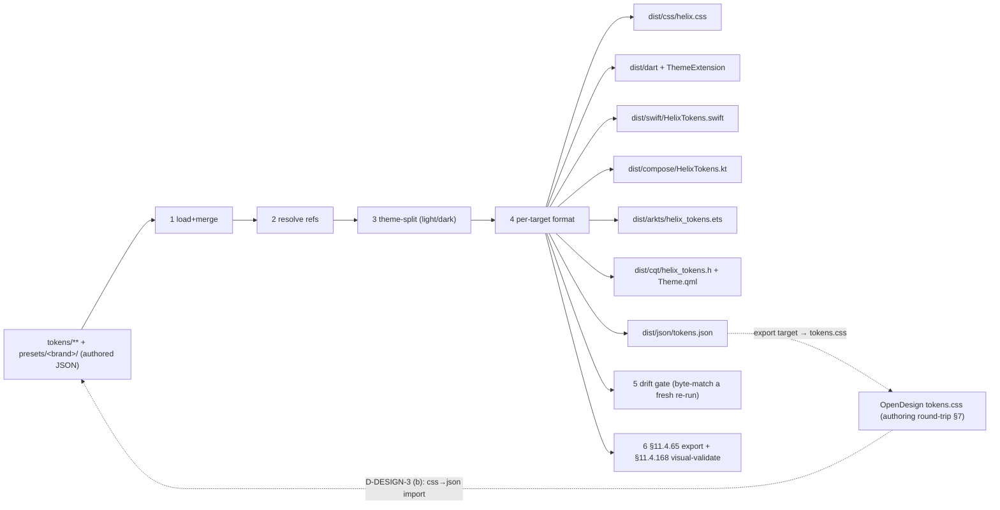
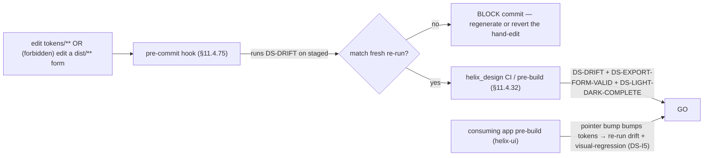
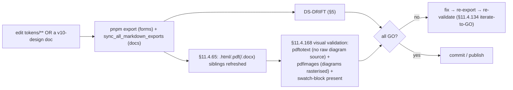
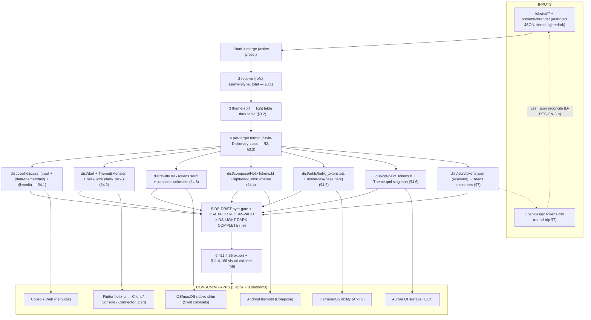

# Token export pipeline — one JSON source → every consumable form

**Revision:** 1
**Last modified:** 2026-06-25T12:00:00Z

> Master technical specification — Volume 10 (Design System), nano-detail
> deep-dive. This document **owns** the **build pipeline** that turns
> `helix_design`'s one canonical JSON token source into **every** consumable
> platform form: the transform tool (a **Style-Dictionary-class** generator —
> role named, exact tool choice surfaced as a decision), the per-target emit (CSS
> custom properties light+dark, Dart `ThemeExtension` + `ThemeData`, SwiftUI,
> Jetpack Compose Material3 `ColorScheme`, ArkTS HarmonyOS resources, C/Qt header
> + QML singleton), each with a **concrete output sample**, the **drift gate**
> (generated output MUST match a fresh regenerate — a hand-edited derived form
> fails the build, §11.4.108-style), the §11.4.65 / §11.4.168 export + visual-
> validation hook, and how OpenDesign's `tokens.css` feeds **in** as one
> authoring input (D-DESIGN-3 round-trip).
>
> **SPEC-ONLY.** It describes *the pipeline contract* — the transforms, the output
> shapes, the gates — not the shipping `helix_design` build. The **token model**
> (tiers, `$value`/`$type` envelope, naming, theming axes) is owned by
> [`design-tokens.md`]; the **colour values + contrast** by [`color-system.md`];
> the **type/icon/motion** token families by [`typography-iconography-motion.md`];
> the **submodule layout + the `export/targets/*.ts` placement + OpenDesign
> relationship** by [`00-overview-and-submodule.md`] (§4, §6, §10) and
> [`opendesign-foundation.md`]. This document is **original HelixVPN design work**
> (the pipeline architecture is owned here, layered on the verified OpenDesign
> facts).
>
> **Boundary with sibling docs.** Owns: the transform stages, the per-target
> output samples, the drift gate, the round-trip-with-OpenDesign mechanics, the
> §11.4.65/.168 export hook. Consumes: the JSON schema + the `$type`→target
> mapping table [`design-tokens.md` §3.2]; the 8-platform target list +
> `dist/**`-is-a-build-derivative rule [`00-overview-and-submodule.md` §4/§6,
> DS-I6]; the verified fact that OpenDesign does **not** emit Dart/Swift/Compose/
> ArkTS/C-Qt (so these exporters are `helix_design`'s own)
> [`opendesign-foundation.md` §0/§1.2].
>
> **Evidence base.** `[DT §N]` = `final/v10-design/design-tokens.md`;
> `[COLOR §N]` = `final/v10-design/color-system.md`; `[TIM §N]` =
> `final/v10-design/typography-iconography-motion.md`; `[OV §N]` =
> `final/v10-design/00-overview-and-submodule.md`; `[OD §N]` =
> `final/v10-design/opendesign-foundation.md`; `[SPINE §N]` =
> `final/SPECIFICATION.md`. Claims not grounded in the evidence base or in this
> document's own original design choices are tagged `UNVERIFIED` per constitution
> §11.4.6 — never fabricated. The **exact** transform-library API shapes (the
> precise `dist/**` byte forms) are pinned by the pipeline's own contract test and
> tagged `UNVERIFIED` until that test exists.

---

## Table of contents

- [0. The pipeline at a glance](#0-the-pipeline-at-a-glance)
- [1. Inputs — JSON source + the OpenDesign round-trip](#1-inputs--json-source--the-opendesign-round-trip)
- [2. The transform tool (Style-Dictionary-class) — role & decision](#2-the-transform-tool-style-dictionary-class--role--decision)
- [3. The transform stages (resolve → theme-split → per-target format)](#3-the-transform-stages-resolve--theme-split--per-target-format)
- [4. Per-target output samples (concrete)](#4-per-target-output-samples-concrete)
  - [4.1 CSS custom properties (light + dark)](#41-css-custom-properties-light--dark)
  - [4.2 Dart — ThemeExtension + ThemeData](#42-dart--themeextension--themedata)
  - [4.3 SwiftUI — generated tokens + asset catalog](#43-swiftui--generated-tokens--asset-catalog)
  - [4.4 Jetpack Compose — Material3 ColorScheme + Typography](#44-jetpack-compose--material3-colorscheme--typography)
  - [4.5 ArkTS — HarmonyOS resources / AppStorage](#45-arkts--harmonyos-resources--appstorage)
  - [4.6 C / Qt — header + QML singleton](#46-c--qt--header--qml-singleton)
- [5. The drift gate (generated MUST match source)](#5-the-drift-gate-generated-must-match-source)
- [6. The §11.4.65 / §11.4.168 export + visual-validation hook](#6-the-11465--11468-export--visual-validation-hook)
- [7. How OpenDesign's tokens.css feeds in](#7-how-opendesigns-tokenscss-feeds-in)
- [8. The full pipeline diagram](#8-the-full-pipeline-diagram)
- [9. Surfaced decisions & cross-doc contracts](#9-surfaced-decisions--cross-doc-contracts)
- [Sources verified](#sources-verified)

---

## 0. The pipeline at a glance

`helix_design` holds **one** authored source of truth — the tiered JSON token
tree (`tokens/**` + `presets/**`, [DT §3], [OV §4]). The export pipeline
(`export/`) is the machine that turns that one source into the **seven** forms
the 3 apps × 8 platforms consume, so **no platform ever re-types a token by
hand** (DS-I6, [OV §0.2]). The pipeline is the **enforcement** of the one-source /
zero-drift rule: the only way a platform theme can diverge from source is a
hand-edit of a generated file, and the drift gate (§5) catches that hand-edit.

| # | Stage | Input | Output |
|---|---|---|---|
| 1 | **Load + merge** | `tokens/**` JSON files + active `presets/<brand>/` | one in-memory token dictionary |
| 2 | **Resolve references** | the dictionary | every `{ref}` dereferenced to a literal (same-`$type`-checked) |
| 3 | **Theme-split** | the resolved dictionary | a `light` table + a `dark` table per [DT §5.1] |
| 4 | **Per-target format** | the two theme tables | `dist/{css,dart,swift,compose,arkts,cqt,json}/**` |
| 5 | **Drift gate** | a fresh re-run | byte-compare vs the committed package-source forms (§5) |
| 6 | **Export + visual-validate** | the docs + the emitted forms | §11.4.65 `.html`/`.pdf` siblings + §11.4.168 visual validation |



---

## 1. Inputs — JSON source + the OpenDesign round-trip

### 1.1 The primary input — the tiered JSON source

The authored input is the three-tier JSON tree [DT §3, OV §4]:

```
helix_design/tokens/
├── primitive/   color.json type.json space.json radius.json elevation.json
│                motion.json zindex.json breakpoints.json icon.json
├── semantic/    color.light.json color.dark.json type.json space.json
│                elevation.json motion.json border.json
└── component/   connect_button.json status_chip.json exit_picker.json …
helix_design/presets/<brand>/   brand.json connection_state.json
```

The active **brand preset** ([OV §5.4]) is selected at build time
(`--preset presets/helix/`, default HelixVPN; a future app drops
`presets/<x>/`). The preset supplies the values the semantic tier references —
the **only** place brand-specific values live (DS-I1, [OV §3]).

### 1.2 The secondary input — OpenDesign `tokens.css` (round-trip)

OpenDesign authoring/refinement [OD §6] edits the HelixVPN design system's
`tokens.css`. Per **D-DESIGN-3** ([OV §10.2]) the project **leans (b)** — JSON is
the source, `tokens.css` is a **generated export target** that OpenDesign
consumes/previews; refinement edits made *in* OpenDesign are reconciled **back**
into `tokens/**` (a `css→json` import diff). The round-trip touches only the
**verified** OpenDesign surface (CSS custom properties, [OD §4]) — never an
unverified OpenDesign API. §7 details the mechanics.

---

## 2. The transform tool (Style-Dictionary-class) — role & decision

### 2.1 The role

The transform tool is a **token-build engine** that: loads a tiered token tree,
resolves `{ref}` references, applies per-platform **transforms** (e.g. `#RRGGBB`
→ Dart `Color(0xAARRGGBB)`, `16px` → Compose `16.dp`), and runs per-platform
**formatters** that emit a file in the target language. This is exactly the
**Style-Dictionary** category of tool (Amazon's open-source design-token build
system is the canonical example; the W3C Design-Tokens Community Group format the
ecosystem converges on is the `$value`/`$type` envelope [DT §3.1] this project
already authors in).

### 2.2 The decision

> **D-EXP-1 (open, §9) — exact transform engine.** The pipeline is specified
> against the **Style-Dictionary-class role** (§2.1), not hard-bound to one
> library, so the choice is surfaced, not silently made (§11.4.6):
>
> | Candidate | Note |
> |---|---|
> | **Style Dictionary** (amzn, v4) | the reference implementation; native W3C-DTCG `$type`/`$value` support, custom transforms/formats in TS; the **lean** default |
> | **Terrazzo** (formerly `cobalt-ui`) | W3C-DTCG-native, TS-first, plugin per target | 
> | a **bespoke TS generator** in `export/build.ts` | full control, no dep; more code to own/test |
>
> Lean: **Style Dictionary v4** (mature, DTCG-native, custom-format API covers all
> 6 non-JSON targets), with bespoke formatters for the targets it lacks built-in
> (ArkTS, C/Qt). The engine is a **build-time dev dependency** declared in
> `helix-deps.yaml build_toolchain` ([OV §7.2]) — never a runtime dependency of
> the consuming apps. **`UNVERIFIED`** until the Volume-10 review ratifies the
> exact library + pins its version per §11.4.99; the *pipeline contract* (stages
> §3, outputs §4, drift gate §5) holds regardless of which engine fills the role.

> **Honest boundary (§11.4.6 / [OD §0]).** OpenDesign does **NOT** itself emit
> Dart/Swift/Compose/ArkTS/C-Qt (verified, [OD §1.2]). These exporters are
> therefore **`helix_design`'s own** Style-Dictionary-class pipeline — *not* an
> OpenDesign feature. If a future requirement is "OpenDesign itself emits a
> Compose form", that is an **extend-OpenDesign-upstream** task per §11.4.74
> ([OD §7], D-DESIGN-4) — not assumed here.

---

## 3. The transform stages (resolve → theme-split → per-target format)

### 3.1 Stage 1–2 — load, merge, resolve

The loader merges every `tokens/**` file + the active preset into one dictionary,
then resolves references depth-first. Resolution is **total** and **type-checked**
([DT §3.1]): a `{ref}` MUST resolve to an existing token of the **same `$type`**,
else the build **fails** (never a silent default, §11.4.6 + [DT §9
`CM-token-refs-resolve`]).

### 3.2 Stage 3 — theme-split

Only **themed** categories (`color`, `elevation`, a small `border`/`opacity` set
[DT §3.1/§6]) carry a `{light, dark}` fork. Stage 3 produces **two** fully-resolved
flat tables — a `light` table and a `dark` table — where every themed token has
collapsed to its theme-specific literal and every non-themed token (space, radius,
type metrics, motion, z, breakpoints, [DT §6]) appears identically in both. The
two tables are the input to every formatter, so **every** target emits a light
**and** a dark form (a target emitting one theme fails [OV §12 `DS-LIGHT-DARK-COMPLETE`]).

### 3.3 Stage 4 — per-target format

Each target is a `transform-set` + a `formatter`:

| Target | Transform highlights (`$type` → form, [DT §3.2]) | Formatter emits |
|---|---|---|
| CSS | color→`#RRGGBB[AA]`, dim→`px`/`rem`, dur→`ms`, bezier→`cubic-bezier()` | `:root` (light) + `[data-theme=dark]` (dark) custom-property blocks |
| Dart | color→`Color(0xAARRGGBB)`, dim→`double` logical px, weight→`FontWeight.wNNN`, dur→`Duration` | a tokens file + a `ThemeExtension<HelixTokens>` with `.light()`/`.dark()` |
| SwiftUI | color→`Color(.sRGB,…)`/asset-catalog entry, dim→`CGFloat`, weight→`Font.Weight` | a `HelixTokens.swift` + a `.xcassets` colorset per themed colour |
| Compose | color→`Color(0x…)`, dim→`.dp`/`.sp`, weight→`FontWeight.WNNN` | a `HelixTokens.kt` with `lightColors`/`darkColors` + an M3 `ColorScheme` builder |
| ArkTS | color→`$rrggbb`/resource, dim→`vp`/`fp` | a `helix_tokens.ets` + `resources/base` + `resources/dark` qualifier sets |
| C/Qt | color→`QColor("#…")`, dim→int px | a `helix_tokens.h` (`#define`) + a `Theme.qml` singleton (light/dark property sets) |
| JSON | identity (resolved) | `dist/json/tokens.json` — the flattened resolved source (other tooling + the §7 css round-trip read it) |

---

## 4. Per-target output samples (concrete)

Every sample below is a **valid, self-consistent** emit of the **same** small
token slice — `color.semantic.surface.default`, `text.primary`,
`action.primary`, `state.connected.fill`, `state.danger.fill`,
`font.semantic.title.lg`, `space.scale.4`, `radius.scale.full`,
`motion.semantic.connectPulse` — in **both** themes. Colour literals match
[COLOR §2/§3]; type metrics match [TIM §1.1]; scales match [DT §6]. **No
placeholders, no TODO** (§11.4.6).

### 4.1 CSS custom properties (light + dark)

`dist/css/helix.css` — light on `:root`, dark on `[data-theme="dark"]`
(consumed by the Console Web build + any web chrome, [OV §6]). A `@media
(prefers-color-scheme: dark)` block mirrors the attribute so OS dark works
without an explicit `data-theme`.

```css
/* dist/css/helix.css — GENERATED, do not edit (drift gate §5) */
:root {
  /* color — light */
  --hx-color-surface-default: #FFFFFF;
  --hx-color-text-primary:    #151920;
  --hx-color-action-primary:  #2F47C4;
  --hx-color-state-connected-fill: #15803D;
  --hx-color-state-danger-fill:    #DC2626;
  /* type (theme-invariant) */
  --hx-font-title-lg-family: 'Inter', system-ui, sans-serif;
  --hx-font-title-lg-size:   20px;
  --hx-font-title-lg-line:   1.30;
  --hx-font-title-lg-weight: 600;
  /* scales (theme-invariant) */
  --hx-space-4:        16px;
  --hx-radius-full:    9999px;
  --hx-motion-connect-pulse-dur:  1200ms;
  --hx-motion-connect-pulse-ease: cubic-bezier(0.4, 0, 0.6, 1);
}
[data-theme="dark"] {
  --hx-color-surface-default: #151920;
  --hx-color-text-primary:    #EDEFF3;
  --hx-color-action-primary:  #3D5AF1;
  --hx-color-state-connected-fill: #22C55E;
  --hx-color-state-danger-fill:    #F87171;
}
@media (prefers-color-scheme: dark) {
  :root:not([data-theme="light"]) {
    --hx-color-surface-default: #151920;
    --hx-color-text-primary:    #EDEFF3;
    --hx-color-action-primary:  #3D5AF1;
    --hx-color-state-connected-fill: #22C55E;
    --hx-color-state-danger-fill:    #F87171;
  }
}
@media (prefers-reduced-motion: reduce) {
  :root { --hx-motion-connect-pulse-dur: 0ms; } /* [TIM §8.1] */
}
```

### 4.2 Dart — ThemeExtension + ThemeData

`dist/dart/helix_tokens.dart` — a `ThemeExtension` carrying every token so a
widget reads `Theme.of(context).extension<HelixTokens>()!`; plus a `ThemeData`
light/dark pair the `helix-ui` `MaterialApp(theme:, darkTheme:)` consumes
([DT §5.1], [OV §6]).

```dart
// dist/dart/helix_tokens.dart — GENERATED, do not edit (drift gate §5)
import 'package:flutter/material.dart';

@immutable
class HelixTokens extends ThemeExtension<HelixTokens> {
  final Color surfaceDefault, textPrimary, actionPrimary, stateConnected, stateDanger;
  final Duration connectPulseDur;
  const HelixTokens({
    required this.surfaceDefault, required this.textPrimary, required this.actionPrimary,
    required this.stateConnected, required this.stateDanger, required this.connectPulseDur,
  });

  static const light = HelixTokens(
    surfaceDefault: Color(0xFFFFFFFF), textPrimary: Color(0xFF151920),
    actionPrimary:  Color(0xFF2F47C4), stateConnected: Color(0xFF15803D),
    stateDanger:    Color(0xFFDC2626), connectPulseDur: Duration(milliseconds: 1200));
  static const dark = HelixTokens(
    surfaceDefault: Color(0xFF151920), textPrimary: Color(0xFFEDEFF3),
    actionPrimary:  Color(0xFF3D5AF1), stateConnected: Color(0xFF22C55E),
    stateDanger:    Color(0xFFF87171), connectPulseDur: Duration(milliseconds: 1200));

  @override
  HelixTokens copyWith({Color? surfaceDefault, Color? textPrimary, Color? actionPrimary,
      Color? stateConnected, Color? stateDanger, Duration? connectPulseDur}) => HelixTokens(
    surfaceDefault: surfaceDefault ?? this.surfaceDefault,
    textPrimary: textPrimary ?? this.textPrimary,
    actionPrimary: actionPrimary ?? this.actionPrimary,
    stateConnected: stateConnected ?? this.stateConnected,
    stateDanger: stateDanger ?? this.stateDanger,
    connectPulseDur: connectPulseDur ?? this.connectPulseDur);

  @override
  HelixTokens lerp(ThemeExtension<HelixTokens>? other, double t) {
    if (other is! HelixTokens) return this;
    return HelixTokens(
      surfaceDefault: Color.lerp(surfaceDefault, other.surfaceDefault, t)!,
      textPrimary: Color.lerp(textPrimary, other.textPrimary, t)!,
      actionPrimary: Color.lerp(actionPrimary, other.actionPrimary, t)!,
      stateConnected: Color.lerp(stateConnected, other.stateConnected, t)!,
      stateDanger: Color.lerp(stateDanger, other.stateDanger, t)!,
      connectPulseDur: t < 0.5 ? connectPulseDur : other.connectPulseDur);
  }
}

const _titleLg = TextStyle(fontFamily: 'Inter', fontSize: 20, height: 1.30, fontWeight: FontWeight.w600);

ThemeData helixLight() => ThemeData(
  useMaterial3: true, brightness: Brightness.light,
  scaffoldBackgroundColor: const Color(0xFFFFFFFF),
  colorScheme: const ColorScheme.light(
    primary: Color(0xFF2F47C4), surface: Color(0xFFFFFFFF), onSurface: Color(0xFF151920)),
  textTheme: const TextTheme(titleLarge: _titleLg),
  extensions: const [HelixTokens.light]);

ThemeData helixDark() => ThemeData(
  useMaterial3: true, brightness: Brightness.dark,
  scaffoldBackgroundColor: const Color(0xFF151920),
  colorScheme: const ColorScheme.dark(
    primary: Color(0xFF3D5AF1), surface: Color(0xFF151920), onSurface: Color(0xFFEDEFF3)),
  textTheme: const TextTheme(titleLarge: _titleLg),
  extensions: const [HelixTokens.dark]);
```

> Dart colour is `Color(0xAARRGGBB)` — the leading `FF` is full alpha; an 8-hex
> token like `#1519201A` ([DT §4] light-card shadow) emits `Color(0x1A151920)`.

### 4.3 SwiftUI — generated tokens + asset catalog

`dist/swift/HelixTokens.swift` — a generated Swift file referencing **asset-catalog
colorsets** (the idiomatic SwiftUI way to carry light+dark: one named colorset
holds both appearances, resolved by `@Environment(\.colorScheme)` automatically).
The exporter emits both the `.swift` accessor and the `.xcassets` colorset JSON.

```swift
// dist/swift/HelixTokens.swift — GENERATED, do not edit (drift gate §5)
import SwiftUI

public enum HelixTokens {
    // colours resolve light/dark automatically via the asset catalog (below)
    public static let surfaceDefault = Color("HXSurfaceDefault", bundle: .module)
    public static let textPrimary    = Color("HXTextPrimary",    bundle: .module)
    public static let actionPrimary  = Color("HXActionPrimary",  bundle: .module)
    public static let stateConnected = Color("HXStateConnected", bundle: .module)
    public static let stateDanger    = Color("HXStateDanger",    bundle: .module)
    // type (theme-invariant)
    public static let titleLg = Font.custom("Inter", size: 20).weight(.semibold)
    // scale / motion (theme-invariant)
    public static let space4: CGFloat = 16
    public static let radiusFull: CGFloat = 9999
    public static let connectPulse: Double = 1.200   // seconds
}
```

```json
// dist/swift/Resources/HelixColors.xcassets/HXStateConnected.colorset/Contents.json
// GENERATED — one colorset per themed colour, light + dark appearance
{
  "colors": [
    { "idiom": "universal",
      "color": { "color-space": "srgb",
        "components": { "red": "0x15", "green": "0x80", "blue": "0x3D", "alpha": "1.000" } } },
    { "idiom": "universal",
      "appearances": [ { "appearance": "luminosity", "value": "dark" } ],
      "color": { "color-space": "srgb",
        "components": { "red": "0x22", "green": "0xC5", "blue": "0x5E", "alpha": "1.000" } } }
  ],
  "info": { "author": "helix_design exporter", "version": 1 }
}
```

> The native shim's font is the **system font** for the tiny NE-extension surface
> ([TIM §2.2 D-TYPE-1]) — `Font.custom("Inter",…)` above is for any iOS/macOS
> surface that *does* bundle the brand font; the colorset (palette) reaches **all**
> native surfaces regardless of font.

### 4.4 Jetpack Compose — Material3 ColorScheme + Typography

`dist/compose/HelixTokens.kt` — a Compose object plus `lightColorScheme()` /
`darkColorScheme()` Material3 builders the Android quick-settings tile /
notification surfaces consume ([OV §6]).

```kotlin
// dist/compose/HelixTokens.kt — GENERATED, do not edit (drift gate §5)
package com.helixvpn.design

import androidx.compose.material3.*
import androidx.compose.ui.graphics.Color
import androidx.compose.ui.text.TextStyle
import androidx.compose.ui.text.font.FontWeight
import androidx.compose.ui.unit.dp
import androidx.compose.ui.unit.sp

object HelixColors {            // raw tokens (both themes)
  val SurfaceLight = Color(0xFFFFFFFF); val SurfaceDark = Color(0xFF151920)
  val OnSurfaceLight = Color(0xFF151920); val OnSurfaceDark = Color(0xFFEDEFF3)
  val ActionLight = Color(0xFF2F47C4); val ActionDark = Color(0xFF3D5AF1)
  val ConnectedLight = Color(0xFF15803D); val ConnectedDark = Color(0xFF22C55E)
  val DangerLight = Color(0xFFDC2626); val DangerDark = Color(0xFFF87171)
}

val HelixLightColorScheme: ColorScheme = lightColorScheme(
  primary = HelixColors.ActionLight, surface = HelixColors.SurfaceLight,
  onSurface = HelixColors.OnSurfaceLight, error = HelixColors.DangerLight)
val HelixDarkColorScheme: ColorScheme = darkColorScheme(
  primary = HelixColors.ActionDark, surface = HelixColors.SurfaceDark,
  onSurface = HelixColors.OnSurfaceDark, error = HelixColors.DangerDark)

object HelixType {
  val TitleLg = TextStyle(fontSize = 20.sp, lineHeight = 26.sp, fontWeight = FontWeight.W600)
}
object HelixScale { val Space4 = 16.dp; val RadiusFull = 9999.dp }
object HelixMotion { const val ConnectPulseMs = 1200L }
// "connected" is not an M3 slot → exposed as a HelixColors token the StatusChip reads.
```

> Material3's `ColorScheme` has no "connected/danger-state" slot, so the
> connection-state colours ([COLOR §3]) are exposed as **`HelixColors` tokens**
> the `StatusChip`/`ConnectButton` read directly (the [DT §8] component-token
> seam), while the M3 slots (`primary`/`surface`/`error`) carry the brand +
> error mapping for stock M3 widgets.

### 4.5 ArkTS — HarmonyOS resources / AppStorage

`dist/arkts/helix_tokens.ets` + the HarmonyOS resource qualifier tree — light in
`resources/base/element/`, dark in `resources/dark/element/` (HarmonyOS resolves
the qualifier by system theme), consumed by the HarmonyOS VPN-ability surfaces
([OV §6]).

```typescript
// dist/arkts/helix_tokens.ets — GENERATED, do not edit (drift gate §5)
export class HelixTokens {
  // colour tokens resolve light/dark via the resource qualifier tree (below)
  static readonly surfaceDefault: Resource = $r('app.color.hx_surface_default');
  static readonly textPrimary:    Resource = $r('app.color.hx_text_primary');
  static readonly actionPrimary:  Resource = $r('app.color.hx_action_primary');
  static readonly stateConnected: Resource = $r('app.color.hx_state_connected');
  static readonly stateDanger:    Resource = $r('app.color.hx_state_danger');
  // type / scale / motion (theme-invariant)
  static readonly titleLgSize: number = 20;        // fp
  static readonly titleLgWeight: number = 600;
  static readonly space4: number = 16;             // vp
  static readonly radiusFull: number = 9999;       // vp
  static readonly connectPulseMs: number = 1200;
}
```

```json
// dist/arkts/resources/base/element/color.json  (LIGHT — system default)
{ "color": [
  { "name": "hx_surface_default", "value": "#FFFFFF" },
  { "name": "hx_text_primary",    "value": "#151920" },
  { "name": "hx_action_primary",  "value": "#2F47C4" },
  { "name": "hx_state_connected", "value": "#15803D" },
  { "name": "hx_state_danger",    "value": "#DC2626" }
] }
// dist/arkts/resources/dark/element/color.json  (DARK — resolved when system dark)
{ "color": [
  { "name": "hx_surface_default", "value": "#151920" },
  { "name": "hx_text_primary",    "value": "#EDEFF3" },
  { "name": "hx_action_primary",  "value": "#3D5AF1" },
  { "name": "hx_state_connected", "value": "#22C55E" },
  { "name": "hx_state_danger",    "value": "#F87171" }
] }
```

> **`UNVERIFIED` (U-EXP-1).** The exact ArkTS `$r('app.color.…')` resolver key
> form + the `resources/dark/` qualifier directory name are HarmonyOS-SDK-version
> dependent; stated as the *intended* mapping per [DT §3.2 U-DT-1], pinned +
> re-verified per §11.4.99 against the live HarmonyOS docs before the ArkTS
> exporter ships. Not asserted as fact (§11.4.6).

### 4.6 C / Qt — header + QML singleton

`dist/cqt/helix_tokens.h` (`#define` constants for C/C++) + `dist/cqt/Theme.qml`
(a QML singleton exposing a `light`/`dark` property set, switched by a `theme`
property) — consumed by the Aurora Qt/C++ surfaces ([OV §6]).

```cpp
// dist/cqt/helix_tokens.h — GENERATED, do not edit (drift gate §5)
#ifndef HELIX_TOKENS_H
#define HELIX_TOKENS_H
/* light */
#define HX_LIGHT_SURFACE_DEFAULT "#FFFFFF"
#define HX_LIGHT_TEXT_PRIMARY    "#151920"
#define HX_LIGHT_ACTION_PRIMARY  "#2F47C4"
#define HX_LIGHT_STATE_CONNECTED "#15803D"
#define HX_LIGHT_STATE_DANGER    "#DC2626"
/* dark */
#define HX_DARK_SURFACE_DEFAULT  "#151920"
#define HX_DARK_TEXT_PRIMARY     "#EDEFF3"
#define HX_DARK_ACTION_PRIMARY   "#3D5AF1"
#define HX_DARK_STATE_CONNECTED  "#22C55E"
#define HX_DARK_STATE_DANGER     "#F87171"
/* type / scale / motion (theme-invariant) */
#define HX_FONT_TITLE_LG_SIZE_PX 20
#define HX_FONT_TITLE_LG_WEIGHT  600
#define HX_SPACE_4_PX            16
#define HX_RADIUS_FULL_PX        9999
#define HX_MOTION_CONNECT_PULSE_MS 1200
#endif /* HELIX_TOKENS_H */
```

```qml
// dist/cqt/Theme.qml — GENERATED QML singleton, do not edit (drift gate §5)
pragma Singleton
import QtQuick 2.15
QtObject {
    property bool dark: false
    readonly property color surfaceDefault: dark ? "#151920" : "#FFFFFF"
    readonly property color textPrimary:    dark ? "#EDEFF3" : "#151920"
    readonly property color actionPrimary:  dark ? "#3D5AF1" : "#2F47C4"
    readonly property color stateConnected: dark ? "#22C55E" : "#15803D"
    readonly property color stateDanger:    dark ? "#F87171" : "#DC2626"
    readonly property int   titleLgSize:    20
    readonly property int   titleLgWeight:  600
    readonly property int   space4:         16
    readonly property int   radiusFull:     9999
    readonly property int   connectPulseMs: 1200
}
```

> **`UNVERIFIED` (U-EXP-2).** The exact QML singleton registration form
> (`qmldir` `singleton Theme 1.0 Theme.qml`) and whether Aurora's Qt build uses a
> resource (`.qrc`) vs. a module import is Aurora-Qt-version dependent; pinned +
> re-verified per §11.4.99 before the C/Qt exporter ships ([DT §3.2 U-DT-1]).

---

## 5. The drift gate (generated MUST match source)

The drift gate is the **load-bearing** §11.4.108-class mechanism: it makes a
hand-edit of a generated form a **build failure**, so the only way to change a
platform's tokens is to change the JSON source + regenerate.

### 5.1 What it asserts

```
DS-DRIFT  (the §11.4.108 SOURCE→ARTIFACT equality gate for tokens):
  1. run `pnpm export` into a CLEAN temp dir
  2. byte-compare each freshly-generated form against the committed package-source form
  3. ANY difference ⇒ FAIL (the committed form was hand-edited or the source drifted)
```

The comparison is **byte-for-byte** (after a deterministic format pass, so
formatter non-determinism — map ordering, trailing newline — is normalised at
generation, never papered over at compare time). A generated file carries a
`GENERATED, do not edit` banner + a content hash header; the gate also asserts
the hash matches the file body (a hand-edit that forgets to update the banner is
still caught by the byte-compare).

### 5.2 Why byte-compare, not "looks equivalent"

Per §11.4.108 (runtime-signature / artifact-byte equality) and §11.4.6
(no-guessing): "the Dart and the CSS *look* like the same colour" is not a proof
the source and the artifact agree. The byte-compare against a fresh re-run is the
**captured evidence** that `dist/**` (and the checked-in package-source Dart, [OV
§4 D-DESIGN-2]) is exactly what the current `tokens/**` produces — no drift, no
stale form from a previous source state.

### 5.3 The paired mutation (§1.1)

| Gate | Mutation that MUST make it FAIL |
|---|---|
| `DS-DRIFT` | hand-edit one hex in `helix_tokens.dart` (e.g. `0xFF2F47C4` → `0xFF000000`) without touching `tokens/**` → the fresh re-run differs → FAIL |
| `DS-DRIFT` (source side) | change a `tokens/**` value but commit the **old** `dist/**` → fresh re-run differs → FAIL (forces regenerate-on-source-change) |
| `DS-EXPORT-FORM-VALID` ([OV §12]) | emit syntactically-broken Dart (drop a `;`) → `dart analyze` fails → FAIL (the form must also *parse* in its toolchain, §11.4.110 build-readiness) |
| `DS-LIGHT-DARK-COMPLETE` ([OV §12]) | delete the dark colorset appearance / the `[data-theme=dark]` block → a theme is missing → FAIL ([TIM]/[COLOR] light+dark mandate) |

### 5.4 Where the gate runs



The gate runs at three seams: the **pre-commit** hook (§11.4.75, blocks a
hand-edit landing), `helix_design` **CI/pre-build** (§11.4.32 post-pull sweep),
and the **consuming app's** pre-build when a submodule-pointer bump changes tokens
([OV §8] — a token change triggers the app's visual-regression suite, DS-I5).

---

## 6. The §11.4.65 / §11.4.168 export + visual-validation hook

### 6.1 §11.4.65 — Markdown export of the pipeline + token docs

Every Volume-10 doc (this one included) travels in the submodule
(`helix_design/docs/v10-design/`, [OV §4]) and is a §11.4.65-scope Markdown doc:
each edit regenerates synchronized `.html` + `.pdf` siblings, and (for the
§11.4.153 feature-status class) `.docx`. The pipeline's own run produces a
machine-readable **export manifest** (`dist/.export-manifest.json` — every emitted
form + its content hash + the source-commit it was generated from) that the docs
reference, so a reader of the rendered token reference sees exactly which source
produced it.

### 6.2 §11.4.168 — visual validation of the rendered token reference

Because the token reference docs contain **rendered swatches + Mermaid diagrams**
(this doc's pipeline diagram, the [COLOR] swatch map, the [TIM] type-scale
diagram), the §11.4.168 exported-document validation applies: an **independent**
check confirms the exported `.pdf`/`.html` (a) carries the content faithfully,
(b) shows **no raw Mermaid/diagram source as body text** (the §11.4.168 forensic
failure), and (c) renders every diagram as an **image** + every swatch as a
visible colour block. `pdftotext` catches raw source leaking as text; `pdfimages`
confirms the diagrams rasterised; the self-validated golden-good/golden-bad
analyzer ([§11.4.107(10)]) is seeded with a known-bad export (raw `flowchart`
source in the body) that MUST FAIL the gate.

### 6.3 The combined hook



A token-doc PDF that ships raw `flowchart TD …` as readable text, or a swatch
table with no rendered colour blocks, is a §11.4.168 violation — a release
blocker — caught here, never shipped (the [COLOR §5]/[TIM §4] no-overlay rule
extended to the *documentation* of the design system).

---

## 7. How OpenDesign's tokens.css feeds in

### 7.1 The round-trip (D-DESIGN-3, lean (b))

Per [OV §10.2] / [OD §4–§5] the project leans **JSON-as-source**: `tokens.css` is
a **generated export target** (one more formatter, `export/targets/css.ts` →
`opendesign/helix/tokens.css`) that OpenDesign consumes as the active design
system; refinement edits a designer makes *in* OpenDesign land in that
`tokens.css`, and a **`css→json` reconciliation** imports the diff back into
`tokens/**` so the polyglot exports stay in sync (DS-I6).

```mermaid
sequenceDiagram
    participant J as tokens/** (JSON source of truth)
    participant E as export/targets/css.ts
    participant ODC as opendesign/helix/tokens.css
    participant OD as OpenDesign (desktop / od CLI / MCP)
    participant REC as css→json reconciler
    J->>E: pnpm export (themed, light+dark)
    E->>ODC: write tokens.css (:root + [data-theme=dark])
    ODC->>OD: set active system; designer/agent refines
    OD-->>ODC: refinement edits (tokens.css tweaks)
    ODC->>REC: diff tokens.css vs last-generated
    REC->>J: apply the human edits back into tokens/** (same-$type)
    J->>E: re-export ALL polyglot forms (drift gate §5 + visual §6)
```

### 7.2 Why the round-trip is safe (only verified OpenDesign surface)

The round-trip touches **only** `tokens.css` — CSS custom properties, the
**verified** OpenDesign token form ([OD §3.3/§4]). It does **not** depend on any
`UNVERIFIED` OpenDesign API (no theme-engine knobs, no multi-language export OD
lacks, [OD §1.2]). The `css→json` reconciler is `helix_design`-owned (a CSS
parser → token-path mapper); it maps `--hx-color-state-connected-fill` ↔
`color.semantic.state.connected.fill` by the [DT §2] naming convention
(`--hx-` prefix + `-` for `.`). A `tokens.css` edit that does not map cleanly to
a known token path is surfaced to the operator (§11.4.6 — never silently dropped
or guessed), not auto-merged.

> **`UNVERIFIED` (U-EXP-3).** Whether OpenDesign's renderer honours the
> `[data-theme="dark"]` block the css exporter emits, or expects a different
> dark-mode convention (twin "HelixVPN Light"/"HelixVPN Dark" systems,
> `prefers-color-scheme`) is [OD §5.2 U4] — confirmed against a live built-in
> OpenDesign `tokens.css` in the refinement pass. If twin systems are required,
> the css exporter emits `opendesign/helix-light/tokens.css` +
> `opendesign/helix-dark/tokens.css` from the same JSON source — a **formatter
> option**, not a token-source change (the JSON stays the single source). Not
> asserted as fact (§11.4.6).

---

## 8. The full pipeline diagram



---

## 9. Surfaced decisions & cross-doc contracts

| id | Decision / contract | Status |
|---|---|---|
| **D-EXP-1** `UNVERIFIED` | Transform engine = a **Style-Dictionary-class** tool; lean **Style Dictionary v4** (DTCG-native) + bespoke formatters for ArkTS/C-Qt. Build-time dev dep only. Exact library + pinned version ratified at Volume-10 review per §11.4.99. | open |
| **D-EXP-2** | Theme is handled by **theme-split** (Stage 3) into two resolved tables, so every target emits light **and** dark; no target emits one theme ([OV §12 `DS-LIGHT-DARK-COMPLETE`]). | decided |
| **D-EXP-3** | `tokens.css` is a **generated export target** (D-DESIGN-3 (b)), OpenDesign consumes it; refinement round-trips back via the `css→json` reconciler (§7) — JSON stays the single source. | recommended (leans (b)) |
| **D-EXP-4** | SwiftUI light/dark via **asset-catalog colorsets** (idiomatic), not runtime `colorScheme` branching; Compose via `light/darkColorScheme`; ArkTS via `resources/{base,dark}`; CSS via `[data-theme]`+`@media`; C/Qt via a `dark`-property QML singleton. | decided (per §4) |
| **C-EXP-A** (consumes) | The JSON schema + the `$type`→target mapping table [DT §3.2] is this pipeline's **input contract**; a `$type` added there is a new transform here. | contract |
| **C-EXP-B** (consumes) | The 8-platform target list + the `dist/**`-is-a-build-derivative + checked-in-package-Dart rule [OV §4/§6, D-DESIGN-2]. | contract |
| **C-EXP-C** (consumes) | The verified fact OpenDesign does **not** emit Dart/Swift/Compose/ArkTS/C-Qt [OD §1.2] — so these exporters are `helix_design`-owned, not an OpenDesign feature. | contract |
| **C-EXP-D** (provides) | The drift gate (§5) is the §11.4.108 SOURCE→ARTIFACT equality proof the whole design system rests on; the §6 visual-validation is the §11.4.168 proof for the rendered token docs. | contract |
| **U-EXP-1** `UNVERIFIED` | Exact ArkTS `$r('app.color.…')` resolver + `resources/dark/` qualifier form (HarmonyOS-SDK-version dependent) — pinned + re-verified per §11.4.99 before the ArkTS exporter ships. | open |
| **U-EXP-2** `UNVERIFIED` | Exact QML singleton registration (`qmldir`/`.qrc`) + Aurora-Qt module form — pinned + re-verified per §11.4.99 before the C/Qt exporter ships. | open |
| **U-EXP-3** `UNVERIFIED` | OpenDesign's canonical dark-mode `tokens.css` convention (`[data-theme]` vs `prefers-color-scheme` vs twin systems, [OD §5.2 U4]) — confirmed against a live built-in system in the refinement pass; css exporter has a twin-systems formatter option ready. | open |

---

## Sources verified

- **The pipeline architecture (stages, theme-split, per-target transforms +
  formatters, the drift gate, the round-trip mechanics, the §11.4.65/.168 export
  hook) and every per-target output sample (§4)** — **NO external source needed —
  original HelixVPN design work**, layered on the well-established
  Style-Dictionary-class token-build pattern and each platform's idiomatic theme
  carrier (CSS custom properties + `[data-theme]`; Flutter `ThemeExtension`/
  `ThemeData`; SwiftUI asset-catalog colorsets; Compose Material3 `ColorScheme`;
  HarmonyOS `resources/{base,dark}` qualifiers; Qt QML singleton). The exact
  per-platform idioms are the documented conventions of each framework; the
  *pipeline* that emits them is HelixVPN's own design.
- **The W3C Design-Tokens Community-Group `$value`/`$type` envelope + the
  Style-Dictionary build-engine category (Stage transforms/formatters)** — the
  DTCG format the token source [DT §3.1] already authors in, and the
  Style-Dictionary (amzn) reference implementation of a token-build engine; the
  exact engine + version is **D-EXP-1 `UNVERIFIED`**, ratified + pinned per
  §11.4.99 at the Volume-10 review (not asserted as a settled fact here).
- **The token model (tiers, `$value`/`$type` envelope, naming, theming axes, the
  `$type`→target mapping), the colour hexes, the type metrics, the scales** —
  `final/v10-design/design-tokens.md` §3/§5/§6, `final/v10-design/color-system.md`
  §2/§3, `final/v10-design/typography-iconography-motion.md` §1/§6 (siblings, this
  wave, read 2026-06-25). Every literal in the §4 samples is reproduced from those
  documents to keep the samples valid (no placeholders).
- **The submodule layout (`export/targets/*.ts`, `dist/**`-is-a-build-derivative,
  the checked-in package-Dart D-DESIGN-2), the 8-platform target list, the
  OpenDesign relationship + the verified absence of OpenDesign multi-language
  export** — `final/v10-design/00-overview-and-submodule.md` §4/§6/§10 +
  `final/v10-design/opendesign-foundation.md` §0/§1.2/§3.3/§4/§5.2 (siblings, read
  2026-06-25). The "OpenDesign does not emit Dart/Swift/Compose/ArkTS/C-Qt"
  finding is grounded there (web-verified 2026-06-25), not assumed.
- **Constitution clauses** §11.4.6 (no-guessing), §11.4.32 (post-pull validation
  sweep), §11.4.65 (universal Markdown export), §11.4.75 (mechanical enforcement /
  pre-commit), §11.4.99 (latest-source cross-reference), §11.4.107(10)
  (self-validated analyzer), §11.4.108 (SOURCE→ARTIFACT equality — the drift
  gate's class), §11.4.110 (build-readiness / form-must-parse), §11.4.134
  (iterate-to-GO), §11.4.162 (OpenDesign mandate), §11.4.168 (exported-doc visual
  validation) — constitution submodule text embedded in this repo's
  `constitution/CLAUDE.md`, accessed 2026-06-25.
- Items explicitly marked `UNVERIFIED` (U-EXP-1 ArkTS resolver, U-EXP-2 QML
  registration, U-EXP-3 OpenDesign dark-mode convention, D-EXP-1 exact engine) are
  pending their named contract test / §11.4.99 verification pass per §11.4.6 — not
  asserted as fact.
