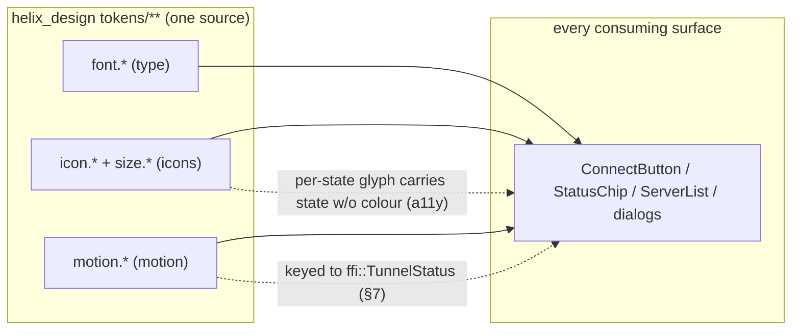
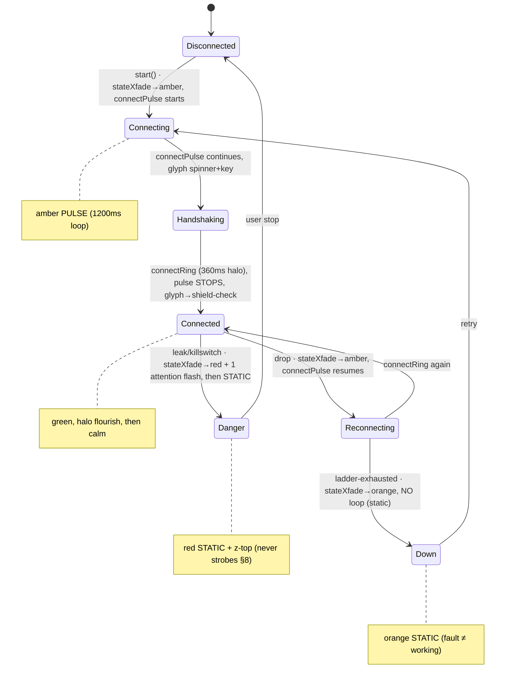

# Typography, iconography & motion — type ramp, icon system, motion tokens

**Revision:** 1
**Last modified:** 2026-06-25T12:00:00Z

> Master technical specification — Volume 10 (Design System), nano-detail
> deep-dive. This document **owns** three of HelixVPN's design-token families that
> sit alongside the colour system: the **typographic ramp** (display / headline /
> title / body / label tiers, each a triple of size / line-height / weight, all
> as tokens), the **font-family strategy** per platform (system vs bundled, the
> §11.4.162 no-overlap / no-collision concern, font licensing flagged as a
> decision), the **iconography system** (icon-set strategy, the sizing grid, the
> per-platform asset forms SVG / icon-font / native), and the **motion / animation
> token system** (durations, easing curves, the named transitions that drive the
> connection-state UI, and the reduced-motion accessibility contract).
>
> **SPEC-ONLY.** It defines *what the type/icon/motion tokens are* and *how they
> resolve into each platform's form* — not the shipping `helix_design` build. The
> token **structure** these live in (tiers, schema, the `$value`/`$type` envelope,
> the `font.*` / `motion.*` categories) is owned by [`design-tokens.md`]; the
> **colours** the type and icons are painted in by [`color-system.md`]; the
> **multi-form emit** (how a `font.semantic.body.md` becomes a SwiftUI `Font`, a
> Compose `TextStyle`, …) by [`token-export-pipeline.md`]. This document is
> **original HelixVPN design work** — the ramp, the icon grid, the motion curves
> are owned here.
>
> **Boundary with sibling docs.** Owns: the type-scale values, the font-family
> matrix, the icon grid + asset-form policy, the motion durations/curves/named
> transitions, the reduced-motion contract. Consumes: the token tier/naming model
> + the `font`/`motion` `$type` envelopes [`design-tokens.md` §2, §3, §6.4]; the
> connection-state palette + the 7-variant `ffi::TunnelStatus` the motion
> transitions are keyed to [`color-system.md` §3], [`v04-client/ffi-surface.md`
> §3.2]; the 3-app / 8-platform matrix [`SPECIFICATION.md` §3]; the OpenDesign
> `DESIGN.md` §3 (Typography) / §6 (Motion) authoring form
> [`opendesign-foundation.md` §3.2].
>
> **Evidence base.** `[DT §N]` = `final/v10-design/design-tokens.md`;
> `[COLOR §N]` = `final/v10-design/color-system.md`; `[OD §N]` =
> `final/v10-design/opendesign-foundation.md`; `[OV §N]` =
> `final/v10-design/00-overview-and-submodule.md`; `[FFI §N]` =
> `final/v04-client/ffi-surface.md`; `[SPINE §N]` = `final/SPECIFICATION.md`.
> Claims not grounded in the evidence base or in this document's own original
> design choices are tagged `UNVERIFIED` per constitution §11.4.6 — never
> fabricated. Font *licensing* facts (Inter, JetBrains Mono) are tagged
> `UNVERIFIED` pending the verification pass mandated by §11.4.99 (latest-source
> cross-reference before any guide is published).

---

## Table of contents

- [0. Position & the three families](#0-position--the-three-families)
- [1. The typographic ramp](#1-the-typographic-ramp)
- [2. Font families per platform (system vs bundled)](#2-font-families-per-platform-system-vs-bundled)
- [3. Type tokens — the JSON shape & per-platform emit](#3-type-tokens--the-json-shape--per-platform-emit)
- [4. The no-overlap / no-collision typographic rule (§11.4.162)](#4-the-no-overlap--no-collision-typographic-rule-1114162)
- [5. Iconography — set strategy, grid, asset forms](#5-iconography--set-strategy-grid-asset-forms)
- [6. Motion & animation token system](#6-motion--animation-token-system)
- [7. The connection-state motion choreography (the FFI seam)](#7-the-connection-state-motion-choreography-the-ffi-seam)
- [8. Reduced-motion & accessibility contract](#8-reduced-motion--accessibility-contract)
- [9. Drift, contract & validation rules](#9-drift-contract--validation-rules)
- [10. Surfaced decisions & cross-doc contracts](#10-surfaced-decisions--cross-doc-contracts)
- [Sources verified](#sources-verified)

---

## 0. Position & the three families

The colour system [`color-system.md`] answers *what colour means what*. This
document answers the other three questions a design system must answer for every
one of HelixVPN's **3 apps × 8 platforms**:

| Family | Category root [DT §2] | Owns | The product-defining slice |
|---|---|---|---|
| **Typography** | `font.*` | the type ramp (size/line-height/weight tiers), font families, the per-platform font emit | the `StatusChip` / `ConnectButton` label legibility; mono for keys/IPs |
| **Iconography** | `icon.*` (+ `size.*` for the grid) | the icon set, the sizing grid, the asset forms (SVG / font / native) | the per-state icon (shield-check, spinner, warning-triangle) that carries state **without** colour (CVD a11y, [COLOR §0]) |
| **Motion** | `motion.*` | durations, easing curves, named transitions, reduced-motion | the `Connecting`/`Reconnecting` pulse, the state cross-fade, the connect ring |

All three obey the same three-tier token model [DT §1] (primitive → semantic →
component) and the same one-source / zero-drift rule [DT §0]: one JSON source,
every consumable form generated [`token-export-pipeline.md`]. All three also obey
§11.4.162: light + dark where colour is involved (icons are colour-tinted, so
they ship a light + dark tint), no element overlap, no label overlay, and
visual-regression coverage on every change.



---

## 1. The typographic ramp

The ramp is **five tiers** — `display`, `headline`, `title`, `body`, `label` —
each with a small closed set of sizes. Every step is a **triple**: a font
**size** (`dimension`), a **line-height** (`number`, unitless multiplier), and a
**weight** (`fontWeight`). The ramp is a **modular scale** anchored at
`body.md = 14px` with a ratio of **1.25** (major third) rounded to the 4-pt grid
[DT §6.1] so every size lands on a clean device pixel.

### 1.1 The full ramp (all tiers, all steps)

| Token | Size | Line-height (×) | Computed LH | Weight | Family | Typical use |
|---|---|---|---|---|---|---|
| `font.semantic.display.lg`  | `40px` | 1.10 | 44px | `bold 700`     | sans | onboarding hero, splash |
| `font.semantic.display.md`  | `32px` | 1.15 | 37px | `bold 700`     | sans | empty-state title |
| `font.semantic.headline.lg` | `28px` | 1.20 | 34px | `semibold 600` | sans | screen title (Console master) |
| `font.semantic.headline.md` | `24px` | 1.25 | 30px | `semibold 600` | sans | dialog title, section header |
| `font.semantic.title.lg`    | `20px` | 1.30 | 26px | `semibold 600` | sans | card title, `ConnectButton` label |
| `font.semantic.title.md`    | `18px` | 1.35 | 24px | `medium 500`   | sans | list-section title |
| `font.semantic.title.sm`    | `16px` | 1.40 | 22px | `medium 500`   | sans | `ExitPicker` row primary |
| `font.semantic.body.lg`     | `16px` | 1.50 | 24px | `regular 400`  | sans | reading copy (settings help) |
| `font.semantic.body.md`     | `14px` | 1.50 | 21px | `regular 400`  | sans | **default body** — most text |
| `font.semantic.body.sm`     | `13px` | 1.45 | 19px | `regular 400`  | sans | secondary/supporting text |
| `font.semantic.label.lg`    | `14px` | 1.20 | 17px | `medium 500`   | sans | button label, tab |
| `font.semantic.label.md`    | `12px` | 1.30 | 16px | `medium 500`   | sans | `StatusChip` text, badge |
| `font.semantic.label.sm`    | `11px` | 1.30 | 14px | `semibold 600` | sans | overline, uppercase eyebrow |
| `font.semantic.mono.md`     | `13px` | 1.45 | 19px | `regular 400`  | mono | IP / pubkey / fingerprint / region code |
| `font.semantic.mono.sm`     | `12px` | 1.40 | 17px | `regular 400`  | mono | inline key fragments, logs |

> **Why anchor at `body.md = 14px`, not 16px.** HelixVPN's densest surfaces are
> the Console server table and the Client `ExitPicker`/log — list-heavy, many rows
> visible at once. A 14px body keeps row density high while `body.lg = 16px`
> serves prose (settings help). Reading copy that the user *reads* (not scans)
> uses `body.lg`; chrome/labels use `label.*`. This is the original HelixVPN
> choice; both clear the platform minimum-legible floors (iOS Dynamic Type
> `body` 17pt is met by `body.lg` for accessibility-large; the 14px default is a
> dense-UI baseline, never the only size for body prose).

### 1.2 The modular scale (visualised)

```mermaid
flowchart TD
    subgraph SCALE["Modular type scale — anchor body.md=14, ratio 1.25, snapped to 4-pt grid"]
        d1["display.lg · 40 / 700"]
        d2["display.md · 32 / 700"]
        h1["headline.lg · 28 / 600"]
        h2["headline.md · 24 / 600"]
        t1["title.lg · 20 / 600  ← ConnectButton label"]
        t2["title.md · 18 / 500"]
        t3["title.sm · 16 / 500"]
        b1["body.lg · 16 / 400  ← reading copy"]
        b2["body.md · 14 / 400  ★ ANCHOR (default body)"]
        b3["body.sm · 13 / 400"]
        l1["label.lg · 14 / 500"]
        l2["label.md · 12 / 500  ← StatusChip"]
        l3["label.sm · 11 / 600 (uppercase eyebrow)"]
        m1["mono.md · 13 / 400  ← IP / pubkey"]
    end
    d1 --> d2 --> h1 --> h2 --> t1 --> t2 --> t3 --> b1 --> b2 --> b3 --> l1 --> l2 --> l3
    b2 -. "mono pair shares body sizes, different family" .-> m1
```



### 1.3 The tier semantics (when to use which)

| Tier | Role | Never used for |
|---|---|---|
| `display.*` | one-per-screen marketing/hero moment (onboarding, splash, empty-state) | running UI; it is too large to repeat |
| `headline.*` | the screen's or dialog's single title | body or labels |
| `title.*` | section / card / row titles; the `ConnectButton` label (`title.lg`, large-bold → governs AA-large [COLOR §3.3]) | long prose |
| `body.*` | sentences the user reads or scans; settings descriptions | a button label (use `label.*`) |
| `label.*` | chrome: buttons, tabs, chips, badges, the `StatusChip` (`label.md`) | a paragraph |
| `mono.*` | anything the user might copy/compare character-by-character — IP, WireGuard pubkey, fingerprint, region code, log line | prose (proportional reads faster) |

> **`mono.*` is product-load-bearing.** A VPN UI shows keys, IPs, fingerprints and
> exit identifiers the user verifies character-by-character (is this *really* my
> pubkey?). A proportional font makes `l`/`1`/`I` and `O`/`0` ambiguous — a real
> security-legibility hazard, not a stylistic preference. Every such value uses
> `mono.*` (a slashed-zero / disambiguated mono — see §2.3).

---

## 2. Font families per platform (system vs bundled)

### 2.1 The strategy — bundled sans/mono for brand consistency, with a system fallback chain

HelixVPN's primary surface is **one Flutter codebase** [SPINE §3], where bundling
the font guarantees the **same** glyphs render on all 8 platforms (a system-font
strategy would make iOS render SF Pro, Android Roboto, Windows Segoe — the
"connected" label would have a different shape per OS, a brand-consistency leak).
The chosen bundled families (primitive tokens [DT §4]):

| Primitive token | Family | Role |
|---|---|---|
| `font.primitive.family.sans` | **Inter** | all proportional text (display→label) |
| `font.primitive.family.mono` | **JetBrains Mono** | all monospace (keys/IPs/logs) |

These bind the semantic ramp's `family` column (§1.1). The **fallback chain** (if
the bundled font fails to load, or on a native shim that cannot bundle) degrades
to the platform system font, *never* to a random serif:

```
sans:  Inter → -apple-system / SF Pro (Apple) → Roboto (Android/Harmony) →
       Segoe UI (Windows) → system-ui (Linux/Web/Aurora) → sans-serif
mono:  JetBrains Mono → ui-monospace / SF Mono (Apple) → Roboto Mono (Android) →
       Cascadia Code / Consolas (Windows) → monospace
```

### 2.2 The per-platform decision matrix

| Platform | Flutter app surface | Native-shim surface (small) | Font delivery |
|---|---|---|---|
| iOS / macOS | bundle Inter + JetBrains Mono in the Flutter asset bundle | NE-config-UI / widgets (SwiftUI) — **system font** (SF Pro / SF Mono), brand sans not bundled into the tiny extension | Flutter bundles; native shims use system per §2.4 |
| Android / HarmonyOS | bundle in Flutter | quick-settings tile / VPN-ability (Compose / ArkTS) — **system font** (Roboto / HarmonyOS Sans) | as above |
| Windows / Linux | bundle in Flutter | — | Flutter bundles |
| Web (Console) | bundle as a `@font-face` web font (woff2), with the fallback chain in the CSS export | — | self-host woff2 (no third-party CDN — privacy, [COLOR §0]) |
| Aurora | bundle in Flutter; Qt/C++ shim (C-Qt export) uses the system font | Qt surface — **system font** | as above |

> **D-TYPE-1 (surfaced, §10).** *Native shims use the system font, not the brand
> font.* The iOS NE-extension / Android tile / HarmonyOS ability / Aurora Qt
> surfaces are tiny config UIs; bundling a 300 KB+ font family into each is
> disproportionate, and these surfaces show little text (a toggle + a status
> line). They render the **same palette** (the colour token export reaches them,
> [OV §6]) but the **system font** — a deliberate, documented exception to brand
> sans, justified by binary-size + the surfaces' minimal text. The Flutter app —
> where the user spends ~all their time — is always brand-font.

### 2.3 Mono disambiguation requirement

The chosen mono (`font.primitive.family.mono`) MUST disambiguate the
security-critical glyph pairs `0/O`, `1/l/I`, `5/S`, `8/B`. JetBrains Mono ships a
slashed/dotted zero and distinct `1`/`l`/`I` by design — the reason it is chosen
over a generic mono. The §9 gate `CM-type-mono-disambiguated` is a *manual*
design-review checkpoint (an automated glyph-shape oracle is `UNVERIFIED` —
flagged §11.4.6, not claimed).

### 2.4 Licensing — flagged as a decision (§11.4.99)

> **D-TYPE-2 (open, §10) — font licensing.** Inter (SIL Open Font License 1.1)
> and JetBrains Mono (Apache-2.0 / OFL depending on distribution) are both
> understood to permit embedding + web self-hosting, **but** the exact license
> text, version, and bundling terms MUST be verified against the **latest**
> upstream source per §11.4.99 (latest-source doc cross-reference) **before** any
> font file is committed to `helix_design/assets/fonts/` or a setup guide is
> published. The license file + the verified URL + access date go into
> `assets/fonts/<family>/LICENSE` and the §11.4.99 "Sources verified" footer.
> Marked **`UNVERIFIED`** here: the OFL/Apache assumption is *not* asserted as
> fact — it is the hypothesis the verification pass confirms. If a license turns
> out to forbid embedding, the fallback is a system-font-only strategy (§2.1
> fallback chain becomes primary) — a §11.4.66 operator decision, not a silent
> swap. Composes [OV §13 D-DESIGN-5] (bundle-vs-reference font decision).

---

## 3. Type tokens — the JSON shape & per-platform emit

### 3.1 The composite type token

A type-ramp step is a **composite** — a small object of `size` / `lineHeight` /
`weight` / `family` references, each a leaf of its own `$type` [DT §3.1]. The
ramp lives in the semantic tier; components reference a whole step.

```jsonc
// helix_design/tokens/semantic/type.json (excerpt) — composite type tokens
{
  "font": { "semantic": {
    "body": {
      "md": {
        "$description": "default body text",
        "size":       { "$type": "dimension",  "$value": "14px" },
        "lineHeight": { "$type": "number",     "$value": 1.50 },
        "weight":     { "$type": "fontWeight",  "$value": "{font.primitive.weight.regular}" },
        "family":     { "$type": "fontFamily",  "$value": "{font.primitive.family.sans}" }
      }
    },
    "title": {
      "lg": {
        "$description": "card title / ConnectButton label",
        "size":       { "$type": "dimension",  "$value": "20px" },
        "lineHeight": { "$type": "number",     "$value": 1.30 },
        "weight":     { "$type": "fontWeight",  "$value": "{font.primitive.weight.semibold}" },
        "family":     { "$type": "fontFamily",  "$value": "{font.primitive.family.sans}" }
      }
    },
    "mono": {
      "md": {
        "$description": "IP / pubkey / fingerprint",
        "size":       { "$type": "dimension",  "$value": "13px" },
        "lineHeight": { "$type": "number",     "$value": 1.45 },
        "weight":     { "$type": "fontWeight",  "$value": "{font.primitive.weight.regular}" },
        "family":     { "$type": "fontFamily",  "$value": "{font.primitive.family.mono}" }
      }
    }
  } }
}
```

```jsonc
// helix_design/tokens/component/connect_button.json (excerpt) — references the step
{
  "comp": { "connectButton": {
    "label": {
      "type":  { "$type": "typeRef", "$value": "{font.semantic.title.lg}" },
      "color": { "$type": "color",   "$value": "{color.semantic.text.onState}" }
    }
  } }
}
```

> A component references a **whole** ramp step (`{font.semantic.title.lg}`) — it
> never re-specifies size/weight inline (a tier violation [DT §7]). The exporter
> expands the composite into each platform's native text-style object (§3.2).

### 3.2 Per-platform type emit (sample, all 6 forms)

The export pipeline [`token-export-pipeline.md`] expands one composite step into
each target's idiomatic text style. The light/dark **colour** is applied by the
component, not the type token (the type token is theme-invariant — size/weight/
family do not fork by theme; only the colour the text is painted in does
[DT §5.1]).

```css
/* CSS — dist/css/helix.css */
.hx-font-title-lg {
  font-family: var(--hx-font-family-sans);
  font-size: 20px; line-height: 1.30; font-weight: 600;
}
```
```dart
// Dart — dist/dart/helix_tokens.dart  (TextStyle, colour applied by widget)
static const TextStyle titleLg = TextStyle(
  fontFamily: 'Inter', fontSize: 20, height: 1.30, fontWeight: FontWeight.w600);
```
```swift
// SwiftUI — dist/swift/HelixTokens.swift
static let titleLg = Font.custom("Inter", size: 20).weight(.semibold)
// line-height applied via .lineSpacing(20 * (1.30 - 1.0)) at the call site
```
```kotlin
// Jetpack Compose — dist/compose/HelixTokens.kt
val TitleLg = TextStyle(
  fontFamily = InterFamily, fontSize = 20.sp, lineHeight = 26.sp, fontWeight = FontWeight.W600)
```
```typescript
// ArkTS — dist/arkts/helix_tokens.ets
export const titleLg = { fontFamily: 'Inter', fontSize: 20, lineHeight: 26, fontWeight: 600 };
```
```cpp
// C/Qt — dist/cqt/helix_tokens.h
#define HX_FONT_TITLE_LG_FAMILY "Inter"
#define HX_FONT_TITLE_LG_SIZE_PX 20
#define HX_FONT_TITLE_LG_WEIGHT  600
#define HX_FONT_TITLE_LG_LH_PX   26
```

> **`UNVERIFIED` (U-TIM-1).** The exact line-height idiom per platform (CSS
> unitless multiplier vs. Compose `lineHeight` in `sp` vs. SwiftUI's
> `.lineSpacing` *additional* spacing) is pinned by the export-pipeline contract
> test [`token-export-pipeline.md` §drift-gate]. The samples above state the
> *intended* mapping (multiplier → absolute sp/px where the platform needs
> absolute); marked `UNVERIFIED` until that contract test exists (§11.4.6).

---

## 4. The no-overlap / no-collision typographic rule (§11.4.162)

§11.4.162 mandates "fonts MUST NOT collide, labels MUST NOT overlay labels". At
the **type layer** this is concrete (layout enforcement is
[`component-library.md`] + visual regression [`visual-regression-and-qa.md`];
this is the type half):

1. **Line-height ≥ 1.30 for any multi-line text block** so descenders of one line
   never touch ascenders of the next (collision). The ramp encodes this: every
   `body.*`/`title.*` step is ≥ 1.30 (`title.lg` 1.30, `body.*` 1.45–1.50);
   only single-line `label.*` (chips, never wrapping) and `display.*` (one line,
   generous) drop below.
2. **A label never overlaps another label.** Two text runs in one component
   (e.g. the `ExitPicker` row's primary `title.sm` + secondary `body.sm`) are
   separated by ≥ `space.scale.1` (4px) vertical gap [DT §6.1], and the
   `StatusChip` label has ≥ `space.scale.2` (8px) horizontal padding so the text
   never touches the chip edge or an adjacent chip.
3. **Truncation, never overflow.** Any text that may exceed its container
   (a long exit name, a wide pubkey) truncates with an ellipsis (proportional) or
   a middle-ellipsis (mono keys — preserve both ends) — it never overflows to
   overlay a neighbour. The full value is available on hover/long-press.
4. **One type family per role, no mixed-family runs.** A single text run is one
   family (sans **or** mono) — a key is rendered entirely `mono.*`, its label
   entirely `sans` — never a mid-string family switch that produces a baseline
   collision.

> These four rules are asserted by the visual-regression suite (golden
> screenshots per theme, OCR-readback to confirm no clipped/overlapping glyphs,
> §11.4.162 / §11.4.168) in [`visual-regression-and-qa.md`]; this document
> supplies the type contract they assert against.

---

## 5. Iconography — set strategy, grid, asset forms

### 5.1 Set strategy — one cohesive line-icon set, brand-tinted

HelixVPN uses **one** cohesive **stroke (line) icon set** at a uniform 1.5px
optical stroke, drawn on a 24×24 grid (§5.2). One set (not a mix of filled +
line + brand logos from different families) is what keeps the UI cohesive — a
§11.4.162 design-system requirement.

> **D-ICON-1 (surfaced, §10) — base icon set.** The recommended base is a
> permissively-licensed open line-icon set (e.g. **Lucide**, ISC license) extended
> with HelixVPN-bespoke glyphs for the VPN-specific concepts no generic set has
> (shield-check, shield-slash, tunnel, relay-hop, kill-switch, exit-node,
> split-tunnel). Per §11.4.74 the base set is reused, not reinvented, and bespoke
> glyphs are added in the HelixVPN style. The **exact** base set + its license are
> **`UNVERIFIED`** pending the §11.4.99 verification pass (same discipline as
> fonts, §2.4) — Lucide/ISC is the *hypothesis*, confirmed before any SVG is
> committed. Composes [OV §13 D-DESIGN-5].

### 5.2 The sizing grid

Icons are authored on a **24×24** base grid with a **2px live-area padding** (a
20×20 optical safe area), so a glyph never touches the bounding box (the icon
analogue of the §4.2 label-padding rule). Rendered sizes are a closed token set
keyed to `size.*`:

| Token | Size | Stroke | Use |
|---|---|---|---|
| `icon.size.xs` | `12px` | 1.25px | inline-with-`label.sm`, dense badges |
| `icon.size.sm` | `16px` | 1.5px  | inline-with-`body`/`label`, list-row leading |
| `icon.size.md` | `20px` | 1.5px  | **default** — buttons, nav, `StatusChip` glyph |
| `icon.size.lg` | `24px` | 1.5px  | section headers, dialog icons |
| `icon.size.xl` | `32px` | 2px    | empty-state, the `ConnectButton` centre glyph |
| `icon.size.2xl`| `48px` | 2.5px  | onboarding / hero |

Stroke scales with size so optical weight stays constant (a 12px icon at 1.5px
looks heavier than a 32px icon at 1.5px — hence the per-size stroke).

### 5.3 The per-state status icon set (carries state WITHOUT colour — CVD a11y)

The single most product-specific icon group: each of the 7 `ffi::TunnelStatus`
variants [FFI §3.2] has a **distinct glyph** so a colour-blind user reads the
state from the *shape*, not only the [COLOR §3] colour (the [COLOR §0] honest
boundary — colour is reinforcement, never the sole channel).

| `ffi::TunnelStatus` | `icon.semantic.state.*` | Glyph | Why distinct shape |
|---|---|---|---|
| `Disconnected` | `state.disconnected` | shield (outline, hollow) | "off" — empty shield |
| `Connecting` | `state.connecting` | spinner / 3-dot (animated, §7) | "working" |
| `Handshaking` | `state.handshaking` | spinner + key (animated) | "working — authenticating" |
| `Connected{direct}` | `state.connected` | **shield-check** (filled) | "protected, P2P" — the success glyph |
| `Connected{relay}` | `state.connectedRelay` | shield-check + relay-hop dots | "protected, relayed" |
| `Reconnecting` | `state.reconnecting` | circular-arrows (pulsing, §7) | "retrying" |
| `Down` | `state.down` | shield-slash / broken-link | "dropped" — distinct from danger |
| `Danger` | `state.danger` | warning-triangle (!) | "exposed" — the universal alarm shape |

> The glyph + the [COLOR §3] colour + the text label are **three** redundant
> channels for the state — any one alone is sufficient to read it. `Down`
> (shield-slash) vs `Danger` (warning-triangle) are deliberately *different
> shapes*, not just different colours, so the two alarms are distinguishable
> under colour-vision deficiency (the [COLOR §3.2] rationale, satisfied at the
> icon layer).

### 5.4 Asset forms per platform

The icon source is **SVG** (the authoring form); the export pipeline
[`token-export-pipeline.md`] emits the form each platform consumes:

| Platform | Consumed icon form | How |
|---|---|---|
| Flutter (all app surfaces) | SVG via `flutter_svg`, or a generated **icon font** (`.ttf` + a Dart `IconData` map) | one source SVG → both; icon-font is smaller for the full set |
| Web (Console) | inline `<svg>` sprite (`<symbol>` + `<use>`) or an icon-font `@font-face` | sprite preferred (per-icon CSS colour) |
| iOS / macOS shim | SF Symbols where an equivalent exists; bespoke glyphs as SVG→PDF vector assets | system-consistent; bespoke as asset catalogue |
| Android / HarmonyOS shim | vector drawable (`<vector>`) / ArkTS resource | one source SVG → per-platform vector |
| Aurora (Qt) | SVG via Qt's SVG renderer | direct |

Icons are **tinted at render** by a colour token (never baked-in colour in the
SVG — the SVG uses `currentColor` / a single fill placeholder) so the same glyph
serves light + dark (DS-I3) by swapping the tint token ([COLOR §3]); a
state-icon's tint is its `color.semantic.state.*` value.

> **D-ICON-2 (surfaced, §10).** SVG-direct vs. generated icon-font for Flutter
> (size vs. per-icon tint flexibility). Lean: **icon-font** for the static UI set
> (smaller, one glyph map) + **SVG-direct** for the few icons that need
> multi-colour or animation (the animated spinner/pulse, §7). Resolved at the
> Volume-10 assets review [OV §13]. `UNVERIFIED` until ratified.

---

## 6. Motion & animation token system

### 6.1 The motion token families

Motion lives in `motion.*` [DT §6.4]. Three leaf families compose into named
transitions:

| Family | `$type` | Tokens |
|---|---|---|
| **duration** | `duration` | `motion.primitive.dur.{instant 0, fast 100, base 180, moderate 240, slow 360, pulse 1200}` (ms) |
| **easing** | `cubicBezier` | `motion.primitive.ease.{standard, decelerate, accelerate, emphasized, loop}` |
| **named transition** (semantic) | composite | `motion.semantic.{press, stateXfade, sheet, connectPulse, ...}` — each a `{dur, ease}` pair |

### 6.2 The easing curves (concrete control points)

| Token | Cubic-bézier | Character | Use |
|---|---|---|---|
| `motion.primitive.ease.standard`   | `cubic-bezier(0.2, 0, 0, 1)` | quick-out, settle-in | most enter/move |
| `motion.primitive.ease.decelerate` | `cubic-bezier(0, 0, 0, 1)`   | enters fast, eases to rest | elements entering the screen |
| `motion.primitive.ease.accelerate` | `cubic-bezier(0.3, 0, 1, 1)` | starts slow, exits fast | elements leaving the screen |
| `motion.primitive.ease.emphasized` | `cubic-bezier(0.2, 0, 0, 1)` (long dur) | expressive, for hero moments | connect success flourish |
| `motion.primitive.ease.loop`       | `cubic-bezier(0.4, 0, 0.6, 1)` | symmetric in-out | the `Connecting`/`Reconnecting` pulse (loops without a visible seam) |

### 6.3 The named transitions (semantic motion tokens)

| Token | Duration | Easing | Use |
|---|---|---|---|
| `motion.semantic.press`        | `100ms` (`fast`)     | `standard`   | button press scale/ink-ripple |
| `motion.semantic.hover`        | `100ms` (`fast`)     | `standard`   | hover tint (desktop/web) |
| `motion.semantic.stateXfade`   | `180ms` (`base`)     | `decelerate` | cross-fade between two `TunnelStatus` colours+glyphs |
| `motion.semantic.sheet`        | `240ms` (`moderate`) | `decelerate` | sheet / dialog enter |
| `motion.semantic.sheetExit`    | `180ms` (`base`)     | `accelerate` | sheet / dialog leave |
| `motion.semantic.connectPulse` | `1200ms` (`pulse`)   | `loop`       | the `Connecting`/`Reconnecting` amber pulse loop |
| `motion.semantic.connectRing`  | `360ms` (`slow`)     | `emphasized` | the `ConnectButton` halo expand on reaching `Connected` |
| `motion.semantic.toast`        | `240ms` in / `180ms` out | `decelerate`/`accelerate` | toast enter/leave |
| `motion.semantic.reducedMotion`| `0ms` (`instant`)    | — | the value every `*.dur` collapses to under OS reduce-motion (§8) |

```jsonc
// helix_design/tokens/semantic/motion.json (excerpt) — named-transition composites
{
  "motion": { "semantic": {
    "stateXfade":   { "dur": {"$type":"duration","$value":"180ms"},
                      "ease":{"$type":"cubicBezier","$value":[0.0,0,0,1]} },
    "connectPulse": { "dur": {"$type":"duration","$value":"1200ms"},
                      "ease":{"$type":"cubicBezier","$value":[0.4,0,0.6,1]} },
    "connectRing":  { "dur": {"$type":"duration","$value":"360ms"},
                      "ease":{"$type":"cubicBezier","$value":[0.2,0,0,1]} }
  } }
}
```

---

## 7. The connection-state motion choreography (the FFI seam)

Motion is keyed to the **7-variant `ffi::TunnelStatus`** [FFI §3.2] the same way
colour ([COLOR §3]) and icons (§5.3) are — the three layers move together so a
state transition reads as one coherent change, never three independent flickers.

| Transition (FFI variant change) | Motion | What animates |
|---|---|---|
| any → any (colour/glyph change) | `stateXfade` (180ms) | the `StatusChip`/`ConnectButton` fill **and** glyph **and** label cross-fade **together** (no in-between illegible frame, [COLOR §5.1]) |
| → `Connecting` / `Handshaking` | `connectPulse` (1200ms loop) starts | the amber fill breathes (opacity/scale loop); the spinner/3-dot glyph rotates |
| `Connecting` → `Connected{*}` | `connectRing` (360ms, emphasized) | a green halo expands once from the button; pulse stops, glyph swaps spinner→shield-check |
| → `Reconnecting` | `connectPulse` (1200ms loop) resumes | amber breathes again; circular-arrows glyph rotates |
| → `Down` | `stateXfade` to orange, **no loop** | shield-slash glyph settles (static — a fault is not "working") |
| → `Danger` | `stateXfade` to red + a single `connectRing`-class attention flash, then **static** | warning-triangle settles on top of the z-`danger` layer [DT §6.5]; never strobes (§8) |



> **The choreography rule.** A *working* state (`Connecting`/`Handshaking`/
> `Reconnecting`) **loops** (pulse) — motion signals "in progress". A *settled*
> state (`Connected`/`Down`/`Danger`/`Disconnected`) is **static** after its
> entry transition — motion stops so a steady state looks steady. This is why
> `Down` and `Danger` get a one-shot entry (xfade / flash) but no loop: a leak
> banner that pulses forever would be both annoying and an a11y strobe hazard
> (§8). One source of truth for "is it moving?" = "is the tunnel still working on
> it?".

---

## 8. Reduced-motion & accessibility contract

§11.4.162 a11y + the §11.4.107 no-flash discipline mandate that motion never
harms a motion-sensitive or photosensitive user.

### 8.1 The reduce-motion substitution

When the platform reports **reduce-motion** (`UIAccessibility.isReduceMotionEnabled`
/ `Settings.Global.ANIMATOR_DURATION_SCALE==0` / CSS `prefers-reduced-motion:
reduce` / equivalent), the export/runtime substitutes `motion.semantic.reducedMotion`
(`0ms`) for every animation **duration**, with these state-specific degradations:

| Normal motion | Reduce-motion degradation |
|---|---|
| `connectPulse` (amber breathing loop) | **static amber** — the `Connecting`/`Reconnecting` state shows a steady amber fill + a static spinner-glyph (or a textual "Connecting…"); it **never pulses** and **never strobes** |
| `stateXfade` (180ms cross-fade) | **instant** colour/glyph swap (0ms) — no fade, just the new state |
| `connectRing` (halo flourish) | **omitted** — the button simply *is* green; no expanding ring |
| `Danger` attention flash | **omitted** — the red banner appears statically (still z-top, still unmissable via colour+icon+text) |

### 8.2 The hard no-strobe invariant

**No HelixVPN animation flashes more than 3× per second, ever** (WCAG 2.1
SC 2.3.1 — Three Flashes). The `connectPulse` at 1200ms is ~0.83 Hz (well under
3 Hz) even *without* reduce-motion; under reduce-motion every loop becomes static.
There is no code path that produces a >3 Hz flash — the pulse period is a token
(`pulse 1200ms`) the gate (§9 `CM-motion-no-strobe`) asserts is ≥ 334ms.

### 8.3 Motion never the sole channel

Like colour, motion is **reinforcement, never the only signal**. The pulse says
"working", but the glyph (§5.3 spinner) and the text label ("Connecting…") say it
too — a user with reduce-motion on, or who cannot perceive the pulse, still reads
the state from the static glyph + label. The state is always conveyed by ≥ 2
non-motion channels (icon + text, plus colour) so removing motion removes **no**
information (§11.4.107 / §11.4.137 content-correctness — the meaning survives the
degradation).

---

## 9. Drift, contract & validation rules

Type/icon/motion tokens are single-source only if machine-checked. Gates run in
`helix_design` CI + the consuming pre-build (paired §1.1 mutation each, [DT §9]
pattern):

| Gate | Asserts | Mutation that must FAIL it |
|---|---|---|
| `CM-type-ramp-complete` | every ramp step (§1.1) has all four of size/lineHeight/weight/family resolvable | delete the `weight` of `title.lg` |
| `CM-type-lineheight-floor` | every multi-line tier (`body.*`/`title.*`) has `lineHeight ≥ 1.30` (§4.1 no-collision) | drop `body.md` line-height to 1.10 |
| `CM-type-mono-disambiguated` | the mono family is on the disambiguation allow-list (§2.3) | swap mono to a family with ambiguous `0/O` |
| `CM-icon-state-coverage` | all **7** `ffi::TunnelStatus` variants (§5.3) have a distinct `icon.semantic.state.*` glyph | remove `state.down` (would collide visually with `danger`) |
| `CM-icon-grid-padding` | every source SVG keeps ≥ 2px live-area padding on the 24-grid (§5.2) | author a glyph touching the bounding box |
| `CM-motion-no-strobe` | every loop/pulse duration ≥ 334ms (≤ 3 Hz, §8.2) | set `connectPulse.dur` to 200ms (5 Hz) |
| `CM-motion-reduced-complete` | every animated named transition (§6.3) has a defined reduce-motion degradation (§8.1) | add a new transition with no reduce-motion mapping |
| `CM-motion-state-coverage` | every `TunnelStatus` transition (§7) has a defined motion | leave `→ Danger` with no motion mapping |
| `CM-tim-no-drift` | every emitted form (CSS/Dart/Swift/Compose/ArkTS/C-Qt) of type/icon/motion regenerates byte-identically from the JSON source; a hand-edit is a finding [`token-export-pipeline.md`] | hand-edit `HelixTokens.kt` `TitleLg` |

> The drift gate (`CM-tim-no-drift`) is the load-bearing one — same role as
> [DT §9 `CM-token-no-drift`]: the only way a platform's type/icon/motion can
> diverge from source is a hand-edit, and the gate catches it. Exported docs of
> these tables carry the §11.4.65/.168 visual-validation per
> [`visual-regression-and-qa.md`].

---

## 10. Surfaced decisions & cross-doc contracts

| id | Decision / contract | Status |
|---|---|---|
| **D-TYPE-1** | Native shims (iOS NE / Android tile / HarmonyOS ability / Aurora Qt) use the **system font**, not bundled brand sans (binary-size vs. minimal-text trade-off); the Flutter app is always brand-font. | recommended, surfaced |
| **D-TYPE-2** `UNVERIFIED` | Font choice **Inter (sans) + JetBrains Mono (mono)** + their licenses (OFL/Apache assumed) MUST be verified against latest upstream per §11.4.99 before any font file is committed; OFL/Apache is the hypothesis, not asserted fact. | open — §11.4.99 pass |
| **D-ICON-1** `UNVERIFIED` | Base icon set = a permissive open line set (Lucide/ISC hypothesised) + HelixVPN-bespoke VPN glyphs (shield-check/slash, tunnel, relay, kill-switch); license verified per §11.4.99 before any SVG committed. | open — §11.4.99 pass |
| **D-ICON-2** | Flutter icon delivery: icon-font for the static set + SVG-direct for animated/multi-colour glyphs. | recommended, surfaced |
| **D-TIM-1** | Type ramp anchored at `body.md=14px`, ratio 1.25, snapped to the 4-pt grid; `body.lg=16px` for reading prose. | decided |
| **D-TIM-2** | Motion choreography: *working* states loop (pulse), *settled* states are static after their one-shot entry transition (§7). | decided |
| **C-TIM-A** (consumes) | The 7-variant `ffi::TunnelStatus` vocabulary owned by [FFI §3.2]; §5.3 (icons) + §7 (motion) stay total over it (gates `CM-icon-state-coverage`, `CM-motion-state-coverage`). A new FFI variant is a contract change here. | contract |
| **C-TIM-B** (consumes) | The token tier/naming model + the `font`/`motion` `$type` envelopes from [`design-tokens.md` §2/§3/§6.4]; the colours type/icons paint in from [`color-system.md` §2/§3]. | contract |
| **C-TIM-C** (provides) | The type/icon/motion token shapes (§3, §5.4, §6) are the input contract for [`token-export-pipeline.md`]'s type/icon/motion emit. | contract |
| **C-TIM-D** (provides) | The §4 / §8 type-collision + reduce-motion contracts are the assertions [`visual-regression-and-qa.md`] re-runs as automated gates (§11.4.162 / §11.4.107). | contract |
| **U-TIM-1** `UNVERIFIED` | The exact per-platform line-height idiom (multiplier vs. absolute sp/px) + the ArkTS/C-Qt type-emit shapes — pinned by the export-pipeline contract test; `UNVERIFIED` until it exists. | open |

---

## Sources verified

- **Type ramp (tiers, sizes, line-heights, weights, the modular scale + 14px
  anchor), font-family strategy + fallback chain, icon set/grid/asset-form policy,
  the per-state status-icon set, the motion durations/curves/named transitions,
  the connection-state choreography, the reduce-motion + no-strobe contract** —
  **NO external source needed — original HelixVPN design work**, modeled on the
  well-established modular-type-scale, 24-grid line-icon, and Material/M3-class
  motion-token conventions (engine-neutral; the authoring engine is OpenDesign per
  §11.4.162, [`opendesign-foundation.md`] §3.2 `DESIGN.md` §3 Typography / §6
  Motion).
- **7-variant `ffi::TunnelStatus` vocabulary (`Disconnected · Connecting ·
  Handshaking · Connected{direct|relay} · Reconnecting · Down · Danger`)** —
  `final/v04-client/ffi-surface.md` §3.2–§3.3 (read 2026-06-25); the icon (§5.3)
  + motion (§7) sets are held total over it by gates `CM-icon-state-coverage` /
  `CM-motion-state-coverage`.
- **Token tier/naming model + `font.*`/`motion.*` `$type` envelopes the type/
  motion tokens live in; the elevation/colour tokens icons are tinted by** —
  `final/v10-design/design-tokens.md` §1/§2/§3/§6.4 + `final/v10-design/color-system.md`
  §2/§3 (siblings, this wave, read 2026-06-25).
- **3-app / 8-platform matrix, the per-platform font/icon/native-shim languages
  (SwiftUI / Compose / ArkTS / C-Qt), the OpenDesign `DESIGN.md` authoring form** —
  `final/SPECIFICATION.md` §3 + `final/v10-design/00-overview-and-submodule.md`
  §6 + `final/v10-design/opendesign-foundation.md` §3.2 (read 2026-06-25).
- **WCAG SC 2.3.1 (Three Flashes, the ≤3 Hz no-strobe floor) + the reduce-motion
  platform flags (`prefers-reduced-motion`, `isReduceMotionEnabled`,
  `ANIMATOR_DURATION_SCALE`)** — W3C *Web Content Accessibility Guidelines 2.1*
  SC 2.3.1 / SC 2.3.3 (`https://www.w3.org/TR/WCAG21/#three-flashes-or-below-threshold`,
  verified 2026-06-25) + the named platform reduce-motion APIs (Apple /
  Android / CSS) — the API names are platform-standard; the §8.1 substitution
  policy is HelixVPN's own design.
- **Font + icon-set licensing (Inter, JetBrains Mono, Lucide)** — `UNVERIFIED`
  (D-TYPE-2 / D-ICON-1): the OFL/Apache/ISC assumptions are **NOT** asserted as
  fact; they are the hypotheses the mandatory §11.4.99 latest-source verification
  pass confirms (with the license file + verified URL + access date recorded)
  **before** any font/icon file is committed. Stated as unverified per §11.4.6.
- Items explicitly marked `UNVERIFIED` (U-TIM-1, D-TYPE-2, D-ICON-1) are pending
  their named contract test / verification pass per §11.4.6 — not asserted as fact.
