# UX flows & interaction patterns — the end-to-end behaviour of every HelixVPN surface

**Revision:** 1
**Last modified:** 2026-06-25T12:00:00Z

> Master technical specification — Volume 10 (Design System), nano-detail
> deep-dive. This document **owns** HelixVPN's **end-to-end UX flows and the
> universal interaction patterns** that bind the three apps (Client, Console,
> Connector) across eight platforms and four form factors into one coherent
> product. It is the **behavioural** half of the design system: where
> [`screens-client.md`] / [`screens-console.md`] / [`screens-connector.md`]
> own *each screen* and [`component-library.md`] owns *each component*, this
> doc owns the **journeys between them** — the step-by-step sequences, the
> per-app information architecture + navigation model, the universal
> interaction grammar (gestures, keyboard, TV-remote D-pad, long-press,
> pull-to-refresh), the reusable **loading / empty / error / success** state
> contract, the **motion choreography**, the full **accessibility** spec
> (WCAG 2.1 AA target), and the **i18n / RTL / localization** patterns.
>
> **The product's emotional centre of gravity** is one question —
> *"am I protected right now?"* [04_CLIENT §7]. Every flow below is designed so
> that question is answered instantly and unambiguously, and so the
> **loading / connecting** state is never mistaken for the **connected** state
> (§11.4.107 — a spinner is **not** proof of connection; the connected state is
> reached only on an actual `Connected{...}` FFI event, never on a timer or an
> optimistic guess).
>
> **SPEC-ONLY.** It describes *what each flow is and how each interaction
> behaves* — not the shipping Flutter navigator, gesture recognisers, or
> focus-traversal code. Screen layouts are owned by the three `screens-*` docs;
> component internals by [`component-library.md`]; colours by [`color-system.md`];
> token scales (spacing / motion / breakpoints) by [`design-tokens.md`]; the
> type/icon/motion catalog by [`typography-iconography-motion.md`].
>
> **Boundary with sibling docs.** **Owns:** the cross-screen **journeys**, the
> per-app **navigation model**, the **interaction grammar**, the **state-pattern
> contract**, **motion choreography**, the **a11y flow**, and **i18n/RTL**.
> **Consumes:** the **7-variant `ffi::TunnelStatus`** state machine + its
> Dart-facing state diagram [FFI §3.2, §3.4]; the connection-state palette
> [COLOR §3]; the motion tokens [DT §6.4]; the screen inventories + nav maps of
> the three `screens-*` docs; the components each flow drives
> [`component-library.md`].
>
> **Evidence base.** `[04_CLIENT §N]` = `final/03-client-core-and-ui.md`;
> `[FFI §N]` = `final/v04-client/ffi-surface.md`; `[SC §N]` =
> `final/v10-design/screens-client.md`; `[SK §N]` =
> `final/v10-design/screens-console.md`; `[SN §N]` =
> `final/v10-design/screens-connector.md`; `[CL §N]` =
> `final/v10-design/component-library.md`; `[COLOR §N]` =
> `final/v10-design/color-system.md`; `[DT §N]` =
> `final/v10-design/design-tokens.md`; `[CP §N]` = `final/02-control-plane.md`;
> `[POL §N]`/`[REG §N]`/`[IPAM §N]`/`[COORD §N]` = the matching
> `final/v03-control-plane/svc-*.md`. Claims not grounded in the evidence base
> or in this document's own original UX design choices are tagged `UNVERIFIED`
> per constitution §11.4.6 — never fabricated. The flow and interaction designs
> are **original HelixVPN UX design work** (modelled on well-established
> WAI-ARIA Authoring-Practices, Material/Apple-HIG, and TV-leanback focus
> patterns, cited in Sources).

---

## Table of contents

- [0. Scope & the principles that shape every flow](#0-scope--the-principles-that-shape-every-flow)
- [1. Information architecture & navigation model (per app, per form factor)](#1-information-architecture--navigation-model-per-app-per-form-factor)
  - [1.1 The navigation-affordance ladder](#11-the-navigation-affordance-ladder)
  - [1.2 Client IA](#12-client-ia)
  - [1.3 Console IA](#13-console-ia)
  - [1.4 Connector IA](#14-connector-ia)
- [2. The state-machine spine every flow rides](#2-the-state-machine-spine-every-flow-rides)
- [3. Flow 1 — first-run onboarding → first connect](#3-flow-1--first-run-onboarding--first-connect)
- [4. Flow 2 — connect → established → graceful disconnect](#4-flow-2--connect--established--graceful-disconnect)
- [5. Flow 3 — reconnect / drop recovery](#5-flow-3--reconnect--drop-recovery)
- [6. Flow 4 — leak / kill-switch-tripped Danger (intent-override)](#6-flow-4--leak--kill-switch-tripped-danger-intent-override)
- [7. Flow 5 — exit switch + multi-hop build](#7-flow-5--exit-switch--multi-hop-build)
- [8. Flow 6 — Console: enroll a device → author a policy → see it converge](#8-flow-6--console-enroll-a-device--author-a-policy--see-it-converge)
- [9. Flow 7 — Connector: enroll → advertise a subnet → resolve a CIDR conflict](#9-flow-7--connector-enroll--advertise-a-subnet--resolve-a-cidr-conflict)
- [10. Universal interaction patterns](#10-universal-interaction-patterns)
  - [10.1 Gestures (touch)](#101-gestures-touch)
  - [10.2 Keyboard navigation (desktop / web-less native)](#102-keyboard-navigation-desktop--web-less-native)
  - [10.3 TV-leanback D-pad / remote](#103-tv-leanback-d-pad--remote)
  - [10.4 Long-press / context actions](#104-long-press--context-actions)
  - [10.5 Pull-to-refresh & live-vs-pull](#105-pull-to-refresh--live-vs-pull)
- [11. The loading / empty / error / success state contract](#11-the-loading--empty--error--success-state-contract)
- [12. Motion choreography](#12-motion-choreography)
- [13. Accessibility (WCAG 2.1 AA)](#13-accessibility-wcag-21-aa)
- [14. Internationalization, RTL & localization](#14-internationalization-rtl--localization)
- [15. Surfaced decisions & cross-doc contracts](#15-surfaced-decisions--cross-doc-contracts)
- [Sources verified](#sources-verified)

---

## 0. Scope & the principles that shape every flow

This document specifies the **dynamic** behaviour of HelixVPN: the ordered
sequences a user moves through, and the grammar of interaction those sequences
share. Six principles govern every flow:

1. **The status stream is the single source of truth.** Every connection-bearing
   screen is a **pure function** of the `ffi::TunnelStatus` stream [FFI §3.4];
   no flow ever paints "Protected" off a timer, an optimistic local guess, or a
   button-press it merely *initiated*. Only an actual `Connected{...}` event
   paints green (§11.4.107, [04_CLIENT §8.2]).
2. **`Danger` overrides intent.** A `Danger{kind}` event interrupts whatever the
   user is doing and pushes the red surface to the top of the stack
   [FFI §3.3, SC §11]. No flow can suppress it; every flow yields to it.
3. **No dead ends.** Every error, empty, denied, or blocked state offers a next
   action (retry, re-explain, deep-link, alternative path). A flow never strands
   the user (§11.4.66 — closed-set choices use the interactive question
   mechanism, never a silent wait).
4. **Honesty over optimism (§11.4.6).** A flow shows *cached + stale-labelled*
   data rather than a fake-fresh value; a "loading" spinner is visually +
   semantically distinct from a "connected" success; a partial result is shown
   as partial, never rounded up to done.
5. **One decision per step.** Onboarding and destructive flows present a single
   decision per screen (the §11.4.162 no-overlap covenant applied to time, not
   just space) so the path is unambiguous on every form factor.
6. **Reachable on every input model.** Each flow is fully operable by touch,
   keyboard, screen reader, and TV-remote D-pad — the canonical path is never
   gesture-only or hover-only (§13).

> **Honest boundary (§11.4.6).** This doc owns *flow + interaction behaviour*.
> The exact router config is deferred to a Volume-10 navigation refinement pass
> (see MASTER_INDEX; not yet authored); the gesture-recogniser thresholds and
> focus-traversal matrices are pinned by [`platform-adaptation.md`]; where a
> concrete numeric threshold or per-platform focus order is named without a
> grounding citation it is tagged `UNVERIFIED`.

---

## 1. Information architecture & navigation model (per app, per form factor)

### 1.1 The navigation-affordance ladder

All three apps share one responsive law: **the navigation affordance is chosen by
width size-class, never by `Platform.isX`** [04_CLIENT §7.3, SC §0, SK §1, SN §1],
so a resized desktop window degrades to a phone layout and Web/desktop "just
work". The shared ladder:

| Size class | Width [DT §6.6] | Nav affordance | Body | Archetype |
|---|---|---|---|---|
| **compact** | < 600 px | `BottomNavigationBar` | single pane | phone (portrait) |
| **medium** | 600–1024 px | `NavigationRail` (icon-only) | master / detail | tablet / landscape phone |
| **expanded** | > 1024 px | extended `NavigationRail` (icon + label) | multi-pane | desktop |
| **tv** | ≥ 1440 px + leanback input | extended rail, enlarged focus targets, D-pad traversal | multi-pane | Android TV / leanback |

`Drawer` is **not** a primary HelixVPN nav affordance: the destination count per
app is small (Client 5, Console 10, Connector 3), so a bottom-nav (compact) or
rail (medium+) holds them all without a hamburger-hidden menu. A drawer is used
only for **secondary overflow** where a screen genuinely needs it (Console's
"More" sheet on compact for destinations beyond the bottom-nav's 5 [SK §1]). This
is **D-UX-1**.

> **TV-leanback is a size class + an input model**, not a separate platform tree
> [SC §0]. It renders the `expanded` layout with focus targets enlarged to a
> ~64 px hit area, a visible focus ring (`border.focus` [COLOR §4.5]) on every
> focusable, and a per-screen declared D-pad traversal order (§10.3). The Console
> and Connector also render on TV via the same ladder, but the **Client** is the
> only flavor whose hero (the ConnectButton) is designed as the default-focused
> TV control [SC §5].

### 1.2 Client IA

The Client is a **hub-and-spoke from Home** [SC §2]. Home (`/`) is the root of
the post-onboarding `AdaptiveScaffold`; Exits, Shields, Account, Settings are its
peer destinations.

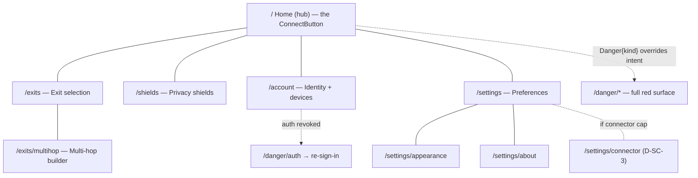

- **compact:** bottom-nav with 5 destinations (Home · Exits · Shields · Account ·
  Settings); Home shows the full-width ConnectButton [SC §3].
- **medium:** icon-only rail; Exits and Settings become master/detail (list left,
  selected detail right) without leaving the destination.
- **expanded:** extended rail; Home gains a right pane (live status detail), Exits
  gains a wide detail pane.
- **tv:** extended rail; ConnectButton is the default-focused control; D-pad down
  reaches the exit summary then the shields row [SC §5].

### 1.3 Console IA

The Console is a **hub-and-spoke from the Dashboard** with **cross-links that
follow the data** [SK §2] (a policy compile error naming an un-advertised host
CIDR links to IPAM; a topology connector node links to its prefixes; an audit
`policy.activate` row links to that policy version). It adds a **⌘K command
palette** [SK §1] as a keyboard-first jump-to-anything affordance orthogonal to
the rail, and a **live-events rail** (expanded only) folding the WS/SSE stream.

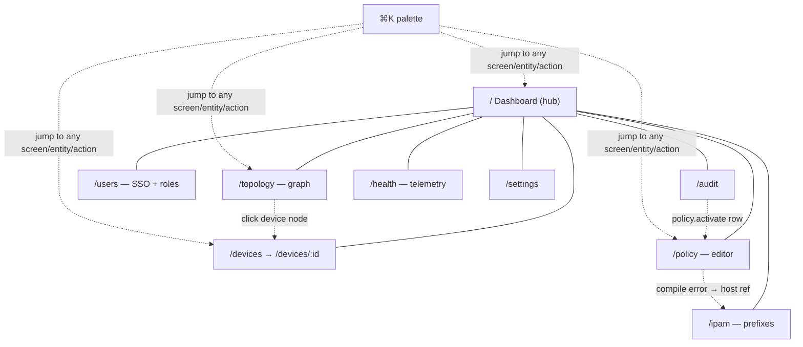

### 1.4 Connector IA

The Connector is a **near-linear flow** [SN §2] with a deliberately narrow IA: get
enrolled, prove healthy, declare subnets, surface conflicts. Three primary
destinations only (Status · Routes · Settings); Enroll precedes the shell.

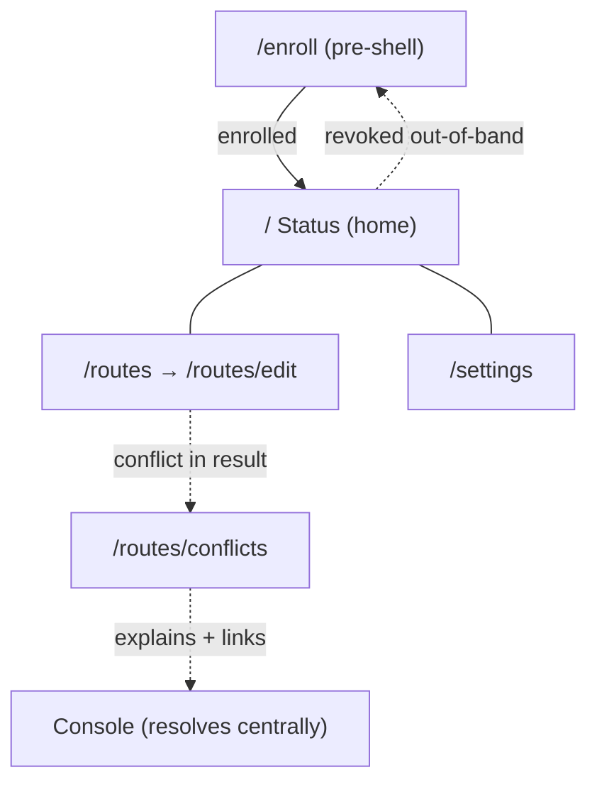

---

## 2. The state-machine spine every flow rides

Every connection-bearing flow (Client Home, Connector Status) switches on the
**7-variant `ffi::TunnelStatus`** [FFI §3.2] via the Dart-facing state diagram
[FFI §3.4]. This is the spine the flows in §4–§6 map onto; it is reproduced here
as the canonical reference (owned by [FFI §3.4], consumed here):

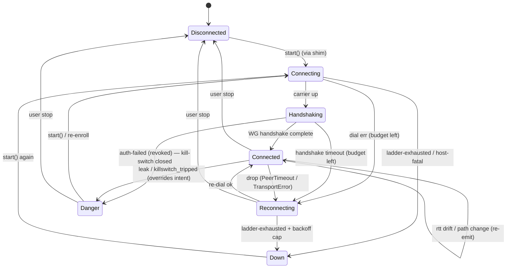

**The UI mapping** of each state (fill colour / icon / label / motion) is owned
by the Home render matrix [SC §5] and the `ConnectButton` state table [CL §2];
the **flows below reference state names**, not colours, so they stay valid
regardless of theme.

---

## 3. Flow 1 — first-run onboarding → first connect

**Goal.** A brand-new install reaches its first `Connected{...}` with the minimum
decisions, never dead-ending, honouring the OS-mediated VPN-consent step.

**Entry.** App launch with **no persisted device token / session** [04_CLIENT §8]
→ the launch gate routes to `/welcome` [SC §2]. (A present token skips straight
to Home — Flow 2.)

**Step-by-step.**

1. **Welcome (`/welcome`, SC §4.1).** Static value-promise; one decision: **Get
   started** (→ sign-in) or "I already have an account / device". No async.
2. **Sign-in (`/welcome/sign-in`, SC §4.2).** The user picks **one of two**
   enrolment paths the spine supports [04_CLIENT §6]:
   - **OIDC** (managed identity / SSO) — opens the issuer in an `OidcWebView` /
     system browser; success returns a code exchanged for a session.
   - **Anonymous device token** (self-hostable, privacy-max) — generates +
     registers a per-device token against the configured server (server URL
     entered here on first run). No email, no personal identity.
   While the chosen path runs, the **other card disables** (no double-enrol); on
   failure an `InlineError` gives a typed, human reason (unreachable server, bad
   URL, issuer rejected, token bound elsewhere) and returns to idle for retry —
   never a silent fail (§11.4.6).
3. **VPN permission grant (`/welcome/grant`, SC §4.3).** A pre-consent explainer
   ("Helix needs permission to create a VPN tunnel; we never see your traffic")
   then **Allow VPN** triggers the **OS-owned** consent dialog the
   `TunnelPlatform` shim requires (NEPacketTunnelProvider `saveToPreferences` /
   `VpnService.prepare()` / privileged-service install, per platform [SC §4.3]).
   - *granted* → brief success tick → Home.
   - *denied* → a **calm re-explain** + "Try again" + a "How to enable in
     Settings" deep-link; if the OS won't re-show the dialog
     (denied-permanently), the Settings deep-link is the path. Never a dead end.
4. **Home, `Disconnected` (`/`, SC §5).** First post-onboarding frame. The
   ConnectButton renders `Disconnected` (the safe default — never a fake
   "connected" first frame) with chip "Tap to connect".
5. **First connect.** The user taps the ConnectButton →
   `connectController.toggle(Disconnected)` calls `start()` via the shim
   [04_CLIENT §8.2]. The status stream now drives the UI through
   `Connecting → Handshaking → Connected{...}` (Flow 2). The first
   `Connected{...}` event paints green — and **only** that event does
   (§11.4.107).

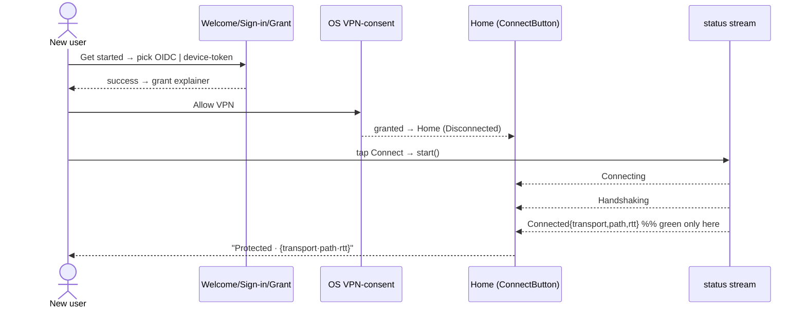

**a11y.** Each onboarding step is its own route (sane OS back; partial enrolment
resumes at the right step); the actionable button is focused per step; success /
denied results are announced via a polite live-region; the headline is an `h1`
heading node [SC §4]. **Resume:** a half-finished enrolment (token saved, consent
not granted) resumes at step 3, not step 1.

---

## 4. Flow 2 — connect → established → graceful disconnect

**Goal.** The everyday happy path: connect, observe the established connection
honestly (the §11.4.107 loading-vs-connected distinction), then disconnect
cleanly.

**The state transitions this flow maps to UI** (the spine, §2):

| Transition | UI on Home [SC §5] | Why it is honest |
|---|---|---|
| `Disconnected → Connecting` | amber fill, spinner-ring, **"Connecting…"**, chip "Contacting exit…", `connectPulse` | animated + "…"-suffixed + non-committal chip ⇒ not "connected" |
| `Connecting → Handshaking` | amber (= Connecting), key-exchange glyph, **"Securing…"**, chip "Handshaking…" | still amber, still busy (`aria-busy`) |
| `Handshaking → Connected{direct}` | **green** fill, shield-check, **"Protected"**, chip `transport·direct·{rtt}ms`, one-shot settle | green painted **only** on the real `Connected{...}` event |
| `Handshaking → Connected{relay}` | teal-green, shield-check-relay, **"Protected · relayed"**, chip `transport·relay·{rtt}ms` | relay path surfaced honestly (not hidden as "direct") |
| `Connected → Connected` (rtt drift / path change) | chip updates in place; fill steady | re-emit coalesced [FFI §4.4]; no flicker |
| `Connected → Disconnected` (user stop) | grey, power-off glyph, **"Not connected"** | clean idle, distinct from a drop |

**Step-by-step.**

1. **Tap ConnectButton** from `Disconnected` → `start()` [04_CLIENT §8.2].
2. **`Connecting`** — amber + `connectPulse`; the chip shows the in-flight phase;
   the button announces "Connecting" with `aria-busy=true` [CL §2].
3. **`Handshaking`** — "Securing…"; still amber, still busy. The user cannot
   mistake this for connected: colour (amber) + icon (spinner/key) + text
   ("…"-suffixed) + the non-committal chip are **four independent signals** that
   say "not yet" (§11.4.107, §13 colour-independence).
4. **`Connected{...}`** — green/teal **settle** (a one-shot, non-looping motion,
   §12); the chip now shows the live `transport · path · rtt`; the button
   announces "Connected, direct path, 28 milliseconds" via a polite live-region.
   This is the **only** state painted as protected, and it is reached **only**
   from a real FFI `Connected{...}` event — never from the tap, a timeout, or an
   optimistic guess.
5. **Established steady state.** rtt drift / path change re-emit `Connected`,
   updating the chip without re-animating the fill (coalesced [FFI §4.4]). The
   shields row + exit summary reflect the live session.
6. **Graceful disconnect.** The user taps the ConnectButton (now in `Connected`)
   → `toggle(Connected)` calls `stop()`. The orchestrator emits
   `Down{reason:"stopped"}`, which the projector maps to **`Disconnected`**
   [FFI §3.3] (a *user* stop is clean idle, **not** a `Down` drop). The button
   cross-fades grey → "Not connected"; no Danger, no banner.

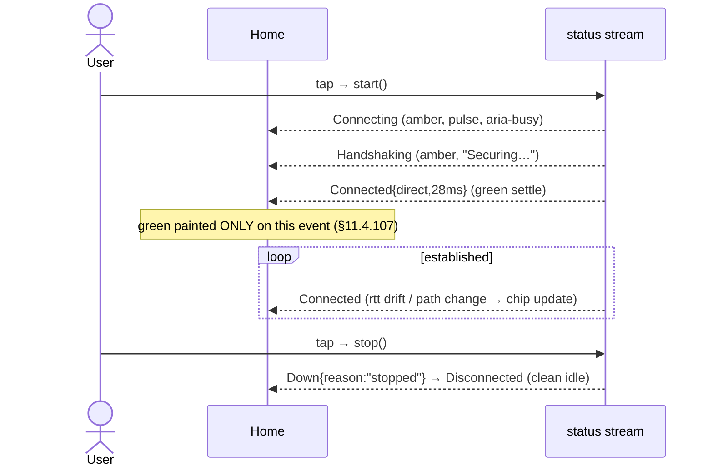

**a11y.** State changes fire polite live-region announcements; `Connected` adds
the composed `transport·path·rtt` to the accessible name; the loading states set
`aria-busy`; the disconnect tap is announced as a protection-reducing action only
when a shield (kill-switch) would be lowered (it isn't here — a clean stop is
neutral). **Connector parity:** the Connector Status home rides the same spine
(its hero answers "am I up and serving my subnets?" [SN §0]) but with no user
"connect" tap — an appliance is connected by config, so its home shows the live
state read-only and surfaces re-enroll only on revoke (Flow 7).

---

## 5. Flow 3 — reconnect / drop recovery

**Goal.** An *unexpected* link loss recovers automatically without alarming the
user as if they were exposed — distinct from both a clean stop (Flow 2) and a
Danger exposure (Flow 4).

**The distinction (load-bearing, §11.4.6).** Three different "not fully connected"
situations get three different visual languages so the user is never misled:

| Situation | FFI state | Home language | Severity |
|---|---|---|---|
| User stopped | `Disconnected` | grey, "Not connected" | neutral |
| Link dropped, retrying | `Reconnecting` | **amber pulse**, "Reconnecting…", chip "Lost link, retrying…" | transient (no exposure) |
| Retry budget exhausted | `Down{reason}` | **orange** + inline `DownBanner` on Home, "Disconnected — dropped", reason (stable-prefix) | failed (no exposure) |
| Traffic may be escaping | `Danger{kind}` | **red full surface** (Flow 4) | exposure |

**Step-by-step.**

1. From `Connected`, the carrier drops (PeerTimeout / TransportError) → the
   orchestrator's re-dial driver begins; the FFI emits **`Reconnecting`**.
2. **`Reconnecting`** — amber **pulsing** fill, rotating glyph, "Reconnecting…",
   chip "Lost link, retrying…"; `aria-busy=true`. This is an **inline** state on
   Home — *not* a full red surface — because a retrying drop is not an exposure.
3. **Recovery path A — `Reconnecting → Connected`.** Re-dial succeeds → green
   settle; the chip returns to live `transport·path·rtt`. A polite announcement:
   "Reconnected, direct path, 31 milliseconds".
4. **Recovery path B — `Reconnecting → Down{reason}`.** The re-dial ladder is
   exhausted + the backoff cap is hit → **`Down{reason}`**: an orange button +
   the inline **`DownBanner`** on Home (z below Danger, never full-screen-red),
   label "Disconnected — dropped", the reason shown by **stable prefix**
   (`ladder-exhausted` / `host-fatal`) not parsed prose (§11.4.6). The banner
   offers **Reconnect** (→ `start()` again, back to `Connecting`).
5. **The kill-switch interaction.** If the kill-switch shield is **on**, traffic
   is blocked while `Reconnecting`/`Down` (the protection is *working*) — the
   shields row shows kill-switch active to reassure; this is coordinated by the
   screen, not an overlap [CL §5]. (If kill-switch is *off*, a drop may expose
   traffic → that path is a `Danger{kind:"leak"}`, Flow 4.)

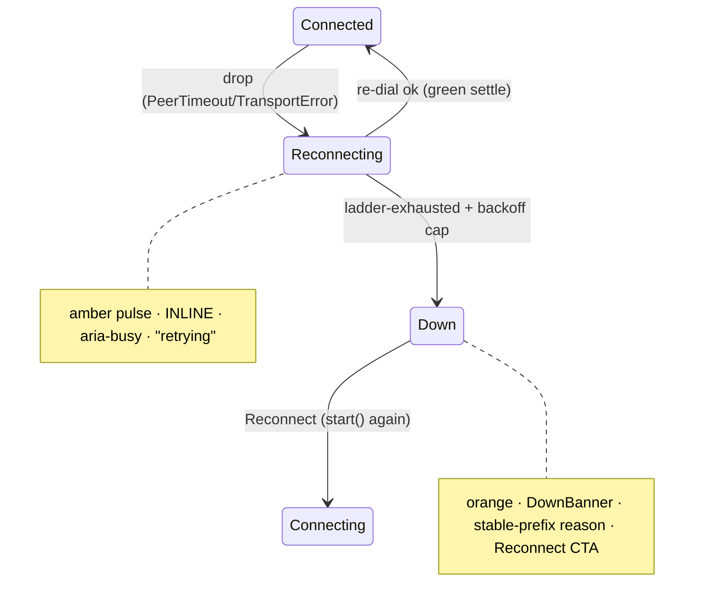

**a11y.** `Reconnecting` announces politely (not assertively — it is not an
emergency); `Down` announces the typed reason and moves focus to the
`DownBanner`'s Reconnect action. The pulse degrades to a **static** amber ring
under reduce-motion (§12) — it never strobes (§11.4.107 no-flash).

---

## 6. Flow 4 — leak / kill-switch-tripped Danger (intent-override)

**Goal.** Make "you may be exposed" impossible to miss and impossible to suppress,
and give exactly one safe action — without strobing or panicking.

**The override rule.** A `Danger{kind}` from the stream **paints red regardless
of where the user is** [FFI §3.3, §3.2]: the projector returns `Danger` *before
matching any other state* ("Danger overrides everything"). The UI honours this by
**pushing the Danger surface over the entire stack** — over Home, over Exits,
over Settings, even over a modal or a toast (the `DangerBanner` is z-top,
`z.semantic.danger` 2000, and can never be occluded [SC §0]). This is **D-UX-2**:
the Danger surface is the only input-overriding navigation event in the product.

**The two kinds.**

| `Danger.kind` | Source | Surface [SC §11] | Safe action |
|---|---|---|---|
| `"leak"` | `shields_tripped = "leak"` (DNS/IPv6/route escape) [FFI §3.3] | `/danger/leak` — full red `DangerScreen` + `LeakDetail` (what leaked, plain language) | **Reconnect securely** |
| `"killswitch_tripped"` | `auth-failed` (revoked) → kill-switch closed [FFI §3.3] | `/danger/killswitch` — full red + `KillSwitchDetail` | resolve (re-sign-in / re-enroll) |

**Step-by-step.**

1. The core detects an exposure (a shield trips, or auth fails and the
   kill-switch closes) → the FFI emits **`Danger{kind}`**.
2. **Immediate, anywhere.** Wherever the user is, the **`DangerBanner`** appears
   z-top (red, "EXPOSED — leak detected" / "Kill-switch engaged") and the full
   `DangerScreen` is pushed. An **assertive** screen-reader announcement
   interrupts (this is the one place an assertive announcement is correct, §13)
   because the user must know *now* [CL §2].
3. **No strobe.** The red is a **static** fill — there is **no flashing**
   (§11.4.107 no-flash; a strobing exposure warning would be both an a11y hazard
   and a panic trigger). Colour + the alert glyph + the "Exposed" text are three
   independent signals so colour-blind and screen-reader users get it too (§13).
4. **One safe action.**
   - *leak* → **Reconnect securely** re-establishes the tunnel (→ `Connecting`);
     a secondary "See what happened" expands the `LeakDetail`.
   - *killswitch_tripped (auth revoked)* → resolve by re-sign-in / re-enroll
     (→ `/welcome/sign-in`, Flow 1 step 2); the kill-switch *stays closed*
     (blocking traffic) until resolved — the block is the protection working.
5. **Exit.** `Danger → Connecting` (reconnect / re-enroll) or
   `Danger → Disconnected` (user stop). The red surface is dismissed only by an
   actual state transition off `Danger` — never by a back-gesture that would
   merely hide an active exposure.

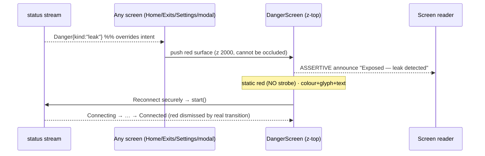

**a11y.** Assertive announcement (the only one in the product); focus moves to the
single safe action; the red surface traps focus until a real state transition
dismisses it; the static red clears the §11.4.107 no-flash rule. **Connector
note:** an appliance with kill-switch *off by default* [SN §0 principle 4] does
not enter `Danger{leak}` on a drop the way a Client does — its exposure model is
different (it serves a LAN); the Connector surfaces a drop as a health-degraded
state, and a revoke as a re-enroll-required state, not a red consumer-exposure
surface. This is **D-UX-3**.

---

## 7. Flow 5 — exit switch + multi-hop build

**Goal.** Change where traffic exits (single exit) or compose an ordered multi-hop
chain — applied live, with honest validation, without dropping protection.

**Sub-flow A — single exit switch.**

1. From Home, tap the **`ExitSummaryCard`** → `/exits` (SC §6).
2. The `ExitPicker` list loads (`core.exits()`): **loading** = skeleton rows;
   **empty** = "No exits available" + a CTA (self-host with none configured) —
   never a blank screen; **error** = "Couldn't load exits" + retry + the last
   cached list shown stale-labelled [SC §6, §11.4.6]; **populated** = RTT-sorted
   ascending, favourites pinned.
3. The user filters (`SearchField`), optionally stars a favourite, taps a row.
4. **Apply live.** Selecting an exit while `Connected` triggers a **seamless
   re-route** (`apply_map` / `set_exit` [FFI §2]) — the orchestrator switches the
   active path without a full drop where possible; Home's `ExitSummaryCard`
   updates and the chip re-emits the new `transport·path·rtt`. The user returns
   to Home with the new exit active.

**Sub-flow B — multi-hop build (SC §7, CL §6).**

1. From Exits, tap **"Build a multi-hop chain"** → `/exits/multihop`.
2. The `HopChainEditor` opens with **one entry hop** (= the current exit). The
   user **adds** a second hop (an `ExitPicker` sub-sheet), then more
   (`entry → middle → … → exit`).
3. **Live validation.** As hops are added/reordered, the summed estimated latency
   (Σ hop RTTs) recomputes in the sticky `ChainSummaryBar`. An **invalid** chain
   (duplicate hop, a non-relaying exit, overlapping-CIDR if a network hop) flags
   the offending row (`feedback.error`) and **disables Apply** with a typed
   reason — never silently accepted (§11.4.6).
4. **Reorder is keyboard/remote-operable**, not drag-only: focus a hop, `Space`
   to lift, arrow to move, `Space` to drop, with a live-region announcing "Hop 2
   moved to position 1" (WAI APG reorder pattern [CL §6]).
5. **Apply** (enabled only when valid) calls `apply_map`/`set_exit` [FFI §2]; the
   chain becomes the active route; Home reflects it.

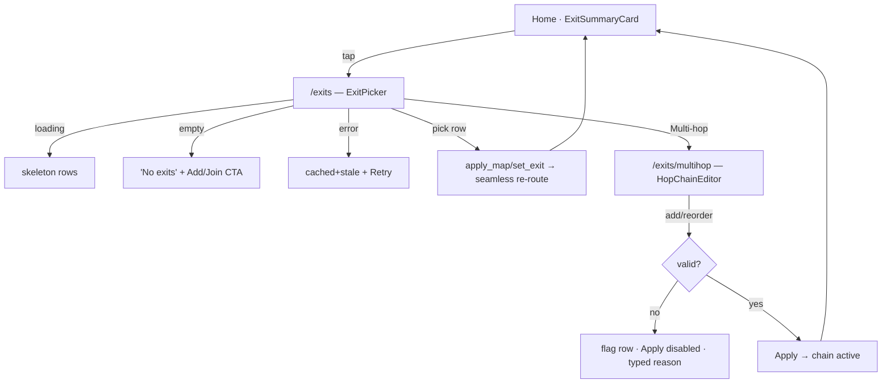

**a11y.** Each exit row announces name + jurisdiction + RTT + selected + favourite
(RTT colour is paired with the numeric value — never colour-only [SC §6]); the
favourite star is a nested button with its own 44 px target; each hop announces
its ordinal + role ("Hop 1 of 3, entry, Sweden"); the chain summary announces
total latency + validity.

---

## 8. Flow 6 — Console: enroll a device → author a policy → see it converge

**Goal.** An admin admits a new device, writes an access rule for it, and watches
the change propagate — fail-closed, preview-before-apply, live-not-polled
[SK §0].

**Step-by-step.**

1. **Enroll / approve a device.** A new device appears in Devices (`/devices`,
   SK §5) as **`pending-approval`** (a `PeerCard` with primary **Approve** /
   **Deny** [CL §7]). The admin Approves → the control plane admits it; the
   live-events rail shows `device.online` [SK §1]. (Token minting for the device
   itself is the Console operator action in [CP §9.2]; the device-side enroll is
   Flow 7 / Flow 1.)
2. **Author a policy (`/policy`, SK §7).** The admin adds a `RuleRow` in the
   `PolicyEditor`: an **AllowDenyToggle** (allow/deny), a **TargetPicker** source
   (e.g. `group:eng`), a destination (`tag:prod`), a port (`:443`) [CL §8]. Order
   matters (first-match ACL) — rows are keyboard-reorderable.
3. **Compile dry-run first (fail-closed).** The editor compiles the spec
   **dry-run** and shows an **effect-diff** before anything activates [POL §4/§5,
   SK §0]: what access this rule grants/revokes, and any **conflict** (a rule
   shadowed by an earlier one → amber `conflictMark` + a tooltip naming the
   shadowing rule [CL §8]). A compile error that names an un-advertised host CIDR
   **links to IPAM** (S6) — cross-links follow the data [SK §2].
4. **Activate.** Only after the admin reviews the diff and confirms (§11.4.66
   confirmation for a high-stakes change) does the policy version activate; the
   live-events rail shows `policy.compiled` / version-activated.
5. **See it converge.** The admin watches convergence live: the topology graph
   (`/topology`, SK §8) and telemetry (`/health`) fold the WS/SSE stream so edges
   / device state update **without a manual refresh** [SK §0 principle 3]; the
   convergence/event-lag SLOs show the change landing. The **stream-health chip**
   is the §11.4.6-honest signal that "live" is real — amber when reconnecting, red
   + a "may be stale" notice when down, rather than lying [SK §1].

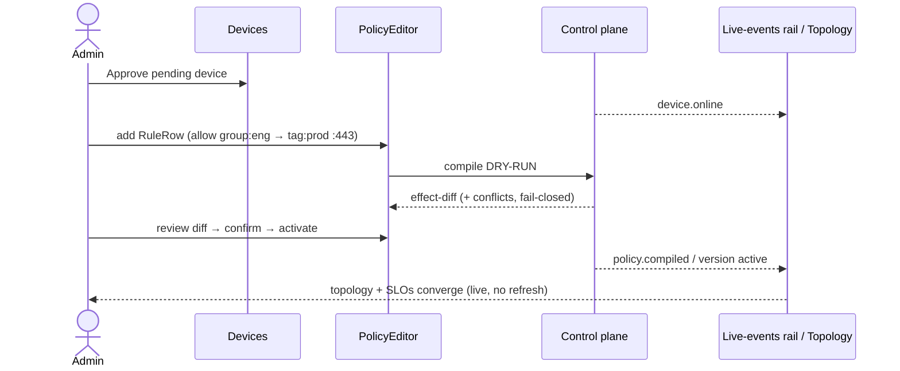

**a11y.** The policy is an ordered `list` of `RuleRow` `listitem`s (order =
precedence, announced "rule 3 of 8" [CL §8]); the allow/deny verb is colour +
glyph (check / block), never colour alone; the effect-diff is a reviewable region;
destructive control actions (revoke, deactivate) carry confirm dialogs [SK §0].
The topology graph ships a **dual representation** — the visual canvas plus an
always-available navigable `treegrid` of the same nodes+edges — so a screen-reader
/ keyboard admin has a non-visual path (§11.4.117, [CL §9]).

---

## 9. Flow 7 — Connector: enroll → advertise a subnet → resolve a CIDR conflict

**Goal.** Stand up an appliance: turn an enroll token into an identity, declare the
LAN subnet it exposes, and handle an overlapping-CIDR conflict honestly [SN §0].

**Step-by-step.**

1. **Enroll (`/enroll`, SN §3).** A first-run stepper (`token → keys → name →
   done`). The operator pastes the single-use **enroll token** (minted in the
   Console [CP §9.2]) or scans its QR. The device **generates its WG keypair
   locally — the private key never leaves it** (C6 [CP §9.2]); only the 32-byte
   public key registers. Steps show honest progress; on success → the Status home.
2. **Status home (`/`, SN §4).** The connector proves it is up and **serving its
   subnets** — the home is a pure function of the `statusStream` [FFI §3.2],
   never "up" on intent alone [SN §0 principle 1]. (Kill-switch is **Off by
   default** on an appliance — turning it on would sever the LAN it serves; that
   is a deliberate, explained choice [SN §0 principle 4, §7].)
3. **Advertise a subnet (`/routes` → `/routes/edit`, SN §5).** The operator adds a
   CIDR (e.g. `10.20.0.0/24`) and enables it. The core `advertise()` call returns
   `AdvertiseResult { accepted, conflicts }` [FFI §3.1]; the UI shows **accepted**
   vs **conflicting** CIDRs honestly and **never claims a conflicting prefix is
   live** [SN §0 principle 3].
4. **Resolve a conflict (`/routes/conflicts`, SN §6).** If the result carries a
   conflict (another site already advertises an overlapping CIDR), the conflict
   view **explains** it (with the 4via6 / overlapping-prefix explanation
   [REG §6.2, IPAM §6]) and **links to the Console**, which resolves IPAM/policy
   **centrally** — the Connector view explains + guides, it does not resolve
   centrally itself [SN §0, SN §2]. The operator either changes the local CIDR or
   coordinates the central fix.
5. **Out-of-band revoke.** A `device.revoke` from the Console [CP §9.3] drops the
   Connector back to an **enroll-required** state (→ `/enroll`), surfaced honestly
   on the Status home, not as a silent failure.

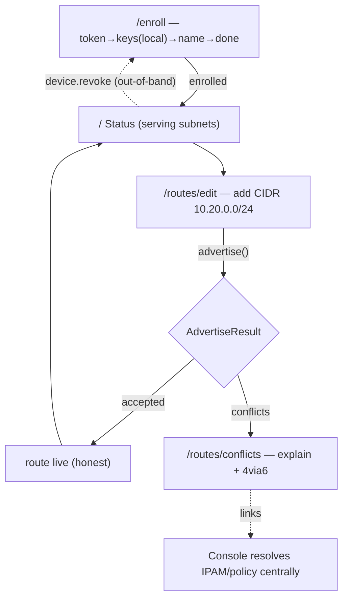

**a11y.** The enroll stepper announces "step N of M" + the current step's purpose;
the keygen step states the private key never leaves the device (privacy-honest);
each route row announces its CIDR + accepted/conflict state (never colour-only);
the conflict view's explanation is body text + a link, focus-ordered. The
appliance form factor is compact-first, so the bottom-nav (Status · Routes ·
Settings) is the default affordance [SN §1].

---

## 10. Universal interaction patterns

These patterns are shared by all three apps; a flow above composes them.

### 10.1 Gestures (touch)

| Gesture | Meaning | Where | Reduce-/no-touch fallback |
|---|---|---|---|
| **tap** | activate the primary action | everywhere | keyboard `Enter`/`Space`; D-pad `OK` |
| **long-press** | reveal context actions (§10.4) | list rows, ConnectButton (transport-override sheet `UNVERIFIED`) | keyboard menu key / a visible `⋯` button |
| **swipe (horizontal)** | onboarding carousel; reveal row actions (favourite/remove) where used | Welcome pager [SC §4.1]; list rows | arrow keys; visible inline action buttons |
| **drag** | reorder (hops, policy rules) — **sugar only** | multi-hop, PolicyEditor | keyboard lift/move/drop is the **canonical** path [CL §6] |
| **pull-to-refresh** | re-probe live data (RTT, devices) | Exits list, Console tables | a visible Refresh button; live stream where present (§10.5) |
| **pinch / pan** | zoom the topology graph | Console topology | zoom/fit controls + keyboard pan [CL §9] |

Every gesture has a non-gesture equivalent (§13) — the canonical path is never
gesture-only. Gesture thresholds are `UNVERIFIED` (owned by
[`platform-adaptation.md`]).

### 10.2 Keyboard navigation (desktop / web-less native)

- **Tab order** follows reading order (top→bottom, leading→trailing); modals
  **trap** focus; `Esc` closes dismissibles and **restores focus** to the trigger
  (e.g. ExitPicker trigger [CL §4.3]); tab order never jumps [CL §1.3].
- **Activation:** `Enter` / `Space` on buttons + the ConnectButton toggle;
  arrow keys traverse lists/rails/segmented controls; `Home`/`End` jump list ends;
  `PageUp`/`Down` page long lists [CL §4.2].
- **Reorder:** focus → `Space` lift → arrows move → `Space` drop, with live-region
  feedback (multi-hop, policy rules) [CL §6].
- **Console command palette:** **⌘K / Ctrl-K** jumps to any screen / entity /
  action; keyboard-first, but every action it lists is also mouse-reachable
  [SK §1].
- **Focus is never colour-only:** a 2 px `border.focus` ring, offset from the
  container, visible against any state fill (≥3.0 non-text contrast both themes
  [COLOR §4.5]) [CL §1.2].

### 10.3 TV-leanback D-pad / remote

- **Default focus** is declared per screen (Client Home → ConnectButton;
  Welcome → "Get started"; Appearance → the current theme choice) so the remote
  lands on the right control [SC §4, §5, §10.a].
- **Traversal:** D-pad up/down/left/right moves focus along the per-screen
  declared order; `OK`/center activates; `Back` pops. No hover-only affordances;
  no gesture-only paths.
- **Enlarged targets + ring:** focus targets are enlarged to ~64 px hit area with
  an always-visible focus ring (`border.focus`); the rail is reachable by D-pad
  (no bottom-nav on TV) [SC §0, §3].
- The exact per-screen D-pad focus-order matrices are `UNVERIFIED` — pinned by
  [`platform-adaptation.md`] + the leanback golden-screenshot suite; this doc and
  the `screens-*` docs state the focus **intent** per screen [SC §0].

### 10.4 Long-press / context actions

Long-press (touch) / menu-key (keyboard) / long-`OK` (remote) reveals **secondary**
actions that are never the only path to a capability:

- **Client:** long-press the ConnectButton → a quick transport-override sheet
  (`auto` / specific) [SC §5] (`UNVERIFIED` — the override UX is pinned by
  [CL §2]); long-press an exit row → favourite/details (also reachable by the
  visible star + row tap).
- **Console:** a `PeerCard` / `AuditLogRow` exposes its actions via a visible
  `⋯`-menu button **and** the high-priority actions inline (Approve / Revoke), so
  the menu is an accelerator, not a requirement [CL §7, §10].

Every long-press target also exposes a **visible** affordance (a `⋯` button, a
star, an inline action) so the capability is discoverable without knowing the
gesture (§13).

### 10.5 Pull-to-refresh & live-vs-pull

HelixVPN distinguishes **live** surfaces (folding a stream) from **pull** surfaces
(on-demand re-probe). This is **D-UX-4**:

- **Live surfaces** (Client Home status, Console device list / topology / audit /
  live-events rail, Connector Status) fold the FFI status stream or the control
  plane's WS/SSE `/v1/stream` and update **without a manual refresh** [SK §0, FFI
  §4]. A **stream-health chip** honestly signals stream state (green / amber
  reconnecting / red down + "may be stale" notice) — the live claim is never a
  lie [SK §1].
- **Pull surfaces** (Exit-list RTT re-probe, Console tables on a non-stream view)
  support **pull-to-refresh** + a visible Refresh button; a pull shows a
  determinate-where-possible progress, then the fresh (or cached+stale-labelled
  on failure) data [SC §6].

A surface is **never both lying-fresh and stale**: if a live stream is down, the
data is shown with an explicit stale label, not silently frozen as fresh
(§11.4.6).

---

## 11. The loading / empty / error / success state contract

Every async surface in every app renders one of **four** states, each a reusable
contract (composed from [CL §11.15] ProgressIndicator, [CL §11.16] EmptyState,
[CL §11.17] Skeleton, [CL §11.8] Banner). This is **D-UX-5** — the single state
grammar all three apps share.

| State | What it MUST do | What it MUST NOT do |
|---|---|---|
| **loading** | show a **skeleton** (list/table) or an **indeterminate spinner** (action), `aria-busy=true`, distinct colour/motion from any success state | **never** look like the connected/success state (§11.4.107); never block forever with no timeout path |
| **empty** | state the empty reason + offer a **next action** (CTA: "Add a server" / "Join a network" / "Clear filter") | never a blank screen; never imply data exists |
| **error** | a typed, human reason + **retry** + show the **last cached** value stale-labelled if available (§11.4.6) | never a silent fail; never a raw stack/error code as the only message; never fake-fresh cached data |
| **success** | render the real data; for the connection hero, paint the protected/connected language **only** on a real `Connected{...}` event | never paint success off a timer, a tap, or an optimistic guess (§11.4.107) |

**The §11.4.107 loading-vs-connected rule is the contract's keystone.** On the
connection hero (Client Home, Connector Status), "loading/connecting" and
"connected" are kept distinct by **four independent signals** — colour (amber vs
green/teal), icon (spinner/key vs shield-check), text ("…"-suffixed vs
"Protected"), and the chip (non-committal vs live `transport·path·rtt`) — so the
distinction survives colour-blindness, a muted screen, and a screen reader
(§11.4.107, §13). A spinner is **never** proof of connection.

**State transitions** cross-fade fill **and** label together
(`motion.semantic.stateXfade`, 180 ms [DT §6.4]) so no in-between frame is
illegible (§12, [SC §0]).

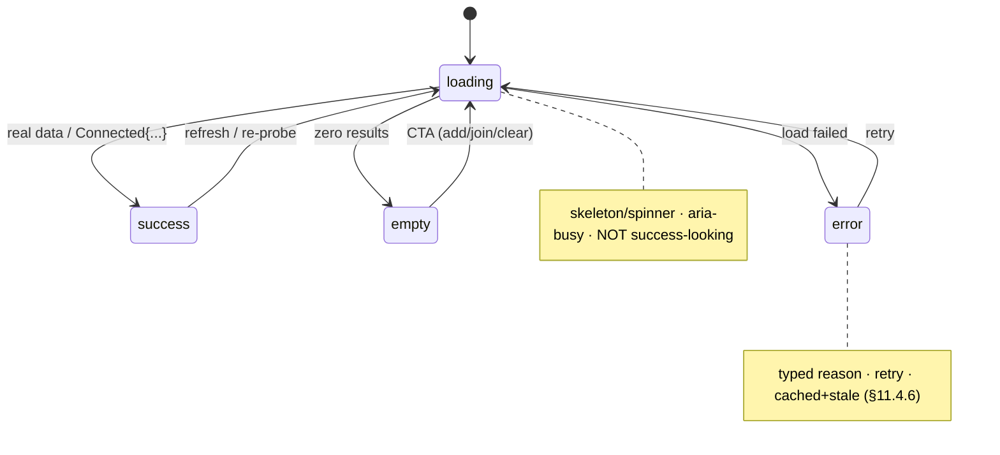

---

## 12. Motion choreography

Motion is **functional, not decorative** — it communicates state change, spatial
relationship, and busy-ness, and it always degrades to a static end-state under
reduce-motion. All durations/curves are **tokens** [DT §6.4]; this doc names the
*choreography*, the values live in tokens.

| Moment | Motion token | Behaviour | Reduce-motion fallback |
|---|---|---|---|
| **state cross-fade** (any state→state on the hero) | `motion.semantic.stateXfade` (180 ms) | fill **and** label cross-fade together; no illegible mid-frame | instant swap to the end-state |
| **connecting / reconnecting** | `motion.semantic.connectPulse` (looping aura) | amber pulse aura while `Connecting`/`Handshaking`/`Reconnecting` | **static** amber ring (no loop, no strobe) |
| **connected settle** | one-shot settle | a single, non-looping "lock-in" on reaching `Connected{...}` | static green/teal end-state |
| **press feedback** | `motion.semantic.press` (≈100 ms) | a brief scale/overlay on tap | overlay only, no scale |
| **danger** | none | **static** red — **no strobe, no flash** (§11.4.107) | already static |
| **skeleton shimmer** | `comp.skeleton` shimmer | a low-contrast sweep while loading | static skeleton (`motion.semantic.reducedMotion`) |
| **route/sheet transitions** | `motion.semantic.*` page/sheet | enter/exit slide+fade | fade only / instant |

**Hard rules.** (1) **Nothing strobes** — the `Danger` surface and every pulse are
static or sub-flash-threshold (§11.4.107 no-flash; the connecting pulse is a slow
aura, not a flash). (2) **Every looping/transition animation degrades** to its
static end-state via `motion.semantic.reducedMotion` [DT §6.4, CL §1.3] when the
OS reduce-motion setting is on. (3) **Motion never conveys state alone** — it
reinforces a colour+icon+text signal, never replaces it (a reduce-motion user
loses no information).

---

## 13. Accessibility (WCAG 2.1 AA)

HelixVPN targets **WCAG 2.1 Level AA** across all three apps and eight platforms.
This is **D-UX-6**. The baseline (every component) is owned by [CL §1.3]; this
section owns the **flow-level** a11y guarantees.

**Screen-reader flow.**
- Every flow above is fully operable by screen reader (VoiceOver / TalkBack /
  Narrator / Orca / the HarmonyOS+Aurora a11y trees [CL §1.3]); the canonical path
  is never gesture- or hover-only.
- **Connection state is announced** on every change: the ConnectButton announces a
  **stateful** name ("Connecting" / "Connected, direct path, 28 milliseconds" /
  "Not protected, leak detected") via a **polite** live-region — except `Danger`,
  which fires an **assertive** announcement (the one place interruption is
  correct, §6) [CL §2].
- Loading states set `aria-busy`; the StatusChip is a polite `status` live-region
  [CL §3]; error states move focus to the error/retry control.

**Focus order.** Logical (reading order); modals + the Danger surface **trap**
focus; `Esc` closes dismissibles and restores focus to the trigger; the multi-hop
and policy reorders are keyboard lift/move/drop with live-region feedback
[CL §1.3, §6].

**Contrast.** Text vs background ≥ **4.5** AA-normal (or 3.0 AA-large for ≥24 px);
non-text UI parts ≥ **3.0**; every state fill is proven against its white/dark
label in both themes [COLOR §4]. The focus ring clears the 3.0 non-text floor in
both themes [COLOR §4.5].

**Reduced motion.** Every looping/transition animation degrades to its static
end-state (§12); nothing strobes (§11.4.107 no-flash).

**Hit targets.** Every interactive target is **≥ 44 × 44 px** (touch floor); a
visually-smaller control keeps a 44 px transparent tap area centred on the glyph;
TV-leanback enlarges to ~64 px (a hard gate `CM-hit-target-44`
[CL §1.3, `visual-regression-and-qa.md`]).

**Colour-independent state (the load-bearing a11y rule for a *VPN* product).**
State is **never** conveyed by colour alone — every coloured state also carries an
**icon and text**: connecting (amber + spinner + "Connecting…"), connected (green
+ shield-check + "Protected"), reconnecting (amber-pulse + rotate + "Reconnecting…"),
down (orange + alert + "dropped"), danger (red + alert + "Exposed"). A colour-blind
user reads "Protected" vs "Exposed" from the **glyph + label**, not the green/red
[COLOR §0, CL §2, §11.4.107]. RTT, presence dots, allow/deny verbs, and audit
severities are all icon/text-reinforced too.

**Graph fallback.** The Console topology ships a **dual representation** — the
visual canvas **plus** an always-available navigable `treegrid` of the same
nodes+edges — so a non-visual user has a structured path (§11.4.117, [CL §9]).

**The §11.4.162 covenant.** Every screen ships light AND dark, no element overlaps
another, no element overlays a label, and visual-regression goldens (per theme,
per size, per app) OCR-/overlap-check every surface [CL §1.5, SC §0].

---

## 14. Internationalization, RTL & localization

HelixVPN is multi-region (the spine targets self-host + managed worldwide), so
every flow is **i18n-ready by construction**. This is **D-UX-7**.

**String externalization.** No user-visible string is hard-coded; all copy is in
ARB/`.arb`-class resource bundles resolved at runtime (`UNVERIFIED` exact l10n
toolchain — owned by [`platform-adaptation.md`]). Status labels ("Connecting…",
"Protected", "Exposed"), error reasons, and CTAs are localized; the **stable
reason prefixes** the FFI carries (`ladder-exhausted`, `auth-failed`,
`killswitch_tripped` [FFI §3.3]) are **keys**, mapped to localized human strings
in the UI layer — never the raw key shown to a user, never the localized string
parsed back (§11.4.6).

**RTL (right-to-left).** Every layout mirrors for Arabic / Hebrew / Persian:
leading/trailing swap (the favourite star, chevrons, the `→` policy arrow, the
multi-hop chain direction all mirror); the bottom-nav / rail order mirrors; text
aligns to the start edge. Directional glyphs (chevron, arrow, reorder) use
**start/end** semantics, not fixed left/right, so they flip correctly. The
multi-hop chain renders `entry → … → exit` start-to-end, mirroring in RTL so the
*meaning* (entry first) is preserved [CL §6].

**Text expansion.** Layouts tolerate ~+30–40 % string growth (German / Finnish):
the no-overlap covenant (§11.4.162) means a label grows within its own box and
ellipsises + tooltips rather than colliding with a neighbour [CL §1.5]; the
ConnectButton label wraps (never truncates) under large accessibility text sizes
+ long localizations, never overlaying the icon or sub-label [SC §5].

**Numerals, dates, units.** RTT ("28 ms"), latency sums ("+71 ms"), timestamps
(audit UTC), and counts use locale-aware formatting; the audit log keeps UTC for
forensic precision but announces a locale-readable form [CL §10]. Country/flag
labels in the exit list are localized country names, not only flags (the flag is
decorative; the name carries meaning, §13).

**Bi-di safety.** Mixed-direction content (an LTR server URL or CIDR inside an RTL
sentence) uses bidi isolation so a CIDR like `10.20.0.0/24` or a URL renders
correctly within RTL copy.

---

## 15. Surfaced decisions & cross-doc contracts

| ID | Decision | Status |
|---|---|---|
| **D-UX-1** | Bottom-nav (compact) / rail (medium+) are the primary nav affordances; drawer is secondary-overflow only (Console "More" sheet on compact). | Asserted (this doc) |
| **D-UX-2** | The `Danger{kind}` surface is the **only input-overriding** navigation event; it pushes z-top over everything, dismissed only by a real state transition off `Danger`. | Grounded [FFI §3.3, SC §11] |
| **D-UX-3** | The Connector's exposure model differs from the Client's (kill-switch Off by default; a drop is health-degraded, a revoke is re-enroll-required — not a red consumer-exposure surface). | Grounded [SN §0, CP §9.3] |
| **D-UX-4** | Live surfaces (status / device list / topology / audit) fold a stream + a stream-health chip; pull surfaces (RTT re-probe, non-stream tables) use pull-to-refresh; a surface is never lying-fresh while stale. | Asserted (this doc); grounded [SK §0, FFI §4] |
| **D-UX-5** | One **loading / empty / error / success** state grammar shared by all three apps; the §11.4.107 loading-vs-connected distinction is its keystone. | Asserted (this doc) |
| **D-UX-6** | WCAG 2.1 **AA** is the accessibility target across all apps/platforms; colour-independent state (icon+text) is the load-bearing rule for a VPN product. | Asserted (this doc) |
| **D-UX-7** | Every flow is i18n-ready by construction: externalized strings, full RTL mirroring (start/end semantics), +30–40 % expansion tolerance, locale-aware numerals/dates, bidi isolation. | Asserted (this doc) |

**Cross-doc contracts this doc depends on.**
- The **7-variant `ffi::TunnelStatus`** state machine + Dart-facing state diagram
  [FFI §3.2, §3.4] — the spine §2–§6 ride; if the FFI enum changes, the flows
  here re-map.
- The **Home render matrix** [SC §5] + **ConnectButton state table** [CL §2] — the
  per-state colour/icon/label/motion this doc references by state name.
- The **connection-state palette** + contrast proofs [COLOR §3, §4] and **motion
  tokens** [DT §6.4] — every colour/motion reference resolves there.
- The three **screen inventories + nav maps** [SC §2, SK §2, SN §2] — the
  per-app IA §1 consumes.
- The **component a11y baseline** [CL §1.3] + **topology dual-representation**
  [CL §9] — the §13 flow-level a11y builds on.
- The §11.4.162 **no-overlap / light+dark / visual-regression** covenant
  [CL §1.5, SC §0] — enforced on every surface a flow renders.

**`UNVERIFIED` surfaces in this doc** (flagged inline, never fabricated): exact
gesture thresholds + per-screen TV D-pad focus-order matrices
([`platform-adaptation.md`]); the ConnectButton transport-override long-press UX
([CL §2]); the l10n toolchain ([`platform-adaptation.md`]); the exact router
config (deferred to a Volume-10 navigation refinement pass — see MASTER_INDEX;
not yet authored).

---

## Sources verified

- **HelixVPN sibling specs (same wave, on disk, read for consistency):**
  `final/v10-design/screens-client.md` (Client screen inventory, nav map,
  AdaptiveScaffold ladder, Home 7-state render matrix, Danger surfaces) ·
  `final/v10-design/screens-console.md` (Console IA, command palette, live-events
  rail, policy fail-closed, stream-health chip) ·
  `final/v10-design/screens-connector.md` (Connector near-linear IA, enroll,
  advertise, conflict, appliance defaults) ·
  `final/v10-design/component-library.md` (ConnectButton/StatusChip state sets,
  reorder pattern, topology dual-representation, a11y baseline, no-overlap
  guarantee) · `final/v10-design/color-system.md` (connection-state palette,
  contrast proofs, focus-ring contrast) · `final/v04-client/ffi-surface.md` §3
  (the 7-variant `ffi::TunnelStatus`, projector, §3.4 Dart-facing state diagram,
  §4 StreamSink delivery + current-truth guarantee). Verified 2026-06-25 against
  the files at the cited paths.
- **External interaction/accessibility precedent** (pattern grounding, not copied):
  W3C **WAI-ARIA Authoring Practices Guide** (listbox, dialog focus-trap +
  restoration, keyboard reorder, treegrid) — https://www.w3.org/WAI/ARIA/apg/ ·
  **WCAG 2.1** Level AA success criteria (1.4.3 contrast, 1.4.11 non-text
  contrast, 2.1.1 keyboard, 2.3.1 no-flash, 2.5.5 target size, 1.4.10 reflow,
  1.3.4 orientation) — https://www.w3.org/TR/WCAG21/ · **Material Design 3**
  adaptive navigation (bottom-nav / rail / drawer by window-size class) —
  https://m3.material.io/foundations/layout/understanding-layout/overview ·
  **Apple HIG** — Designing for tvOS (focus + parallax, remote interaction) —
  https://developer.apple.com/design/human-interface-guidelines/designing-for-tvos
  · **Android TV** leanback / D-pad focus guidance —
  https://developer.android.com/training/tv/start/navigation .
  Verified 2026-06-25 (latest-source check per §11.4.99; these are stable W3C/
  vendor references used for pattern grounding only — no HelixVPN behaviour is
  asserted from them).
- **Constitution anchors applied:** §11.4.6 (no-guessing — `UNVERIFIED` tags, no
  fabrication), §11.4.107 (loading ≠ connected — the keystone of §4, §11, §12),
  §11.4.117 (pixel-only graph → structured fallback, §13), §11.4.162 (OpenDesign:
  light+dark, no overlap / no label overlay, visual regression — §11, §13).
