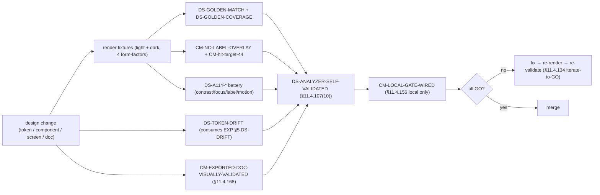
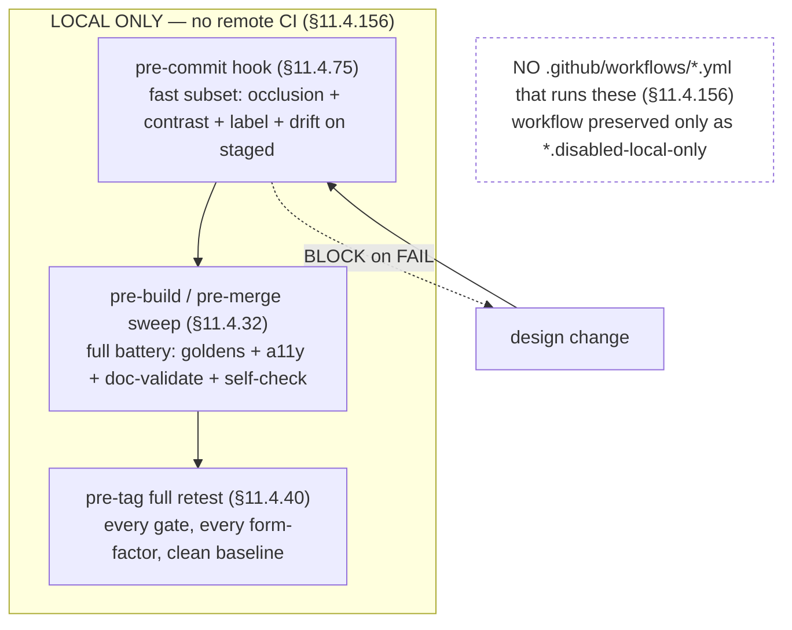
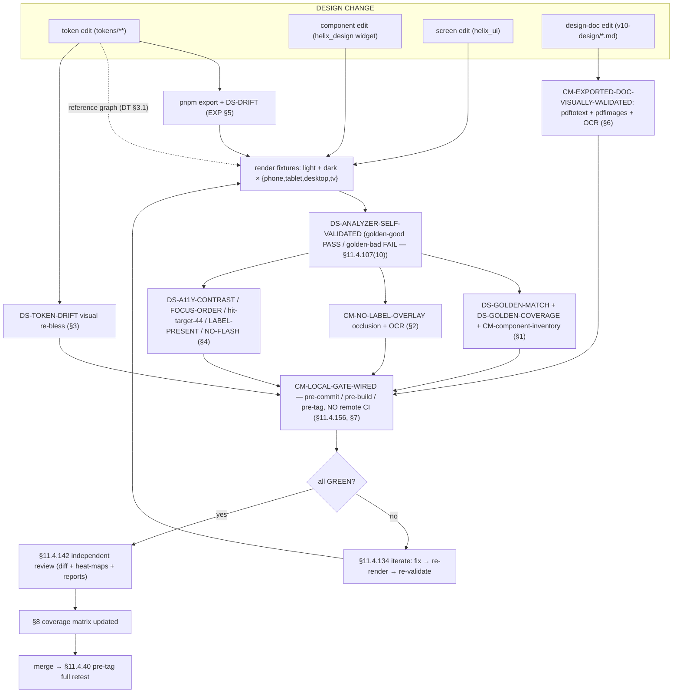

# Visual-regression & design-system QA — the gate wall every UI change crosses

**Revision:** 1
**Last modified:** 2026-06-25T12:00:00Z

> Master technical specification — Volume 10 (Design System), nano-detail
> deep-dive. This document **owns** the **quality-assurance machinery** that makes
> the design system's promises mechanical rather than aspirational: the
> **golden-screenshot visual-regression suite** (every component × state ×
> theme(light/dark) × form-factor); the **no-overlap / no-label-overlay**
> automated occlusion check (§11.4.162); the **token-drift gate** (generated
> output == a fresh regenerate, §11.4.108-class, with a paired §1.1 mutation); the
> **accessibility automated battery** (contrast computed from tokens with
> golden-good/golden-bad self-validation per §11.4.107(10), focus order,
> ≥44 px hit target, screen-reader-label presence, reduce-motion no-flash); the
> **§11.4.168 exported-design-doc visual validation** (render the design docs'
> diagrams, confirm no raw Mermaid/markup leaks); the **local CI-equivalent gate
> wiring** (§11.4.156 — local only, no remote CI); the **coverage matrix**; and
> the **change-flow** that takes a design edit through every gate before merge.
>
> **SPEC-ONLY.** It describes *the QA contract* — the suites, the analyzers, the
> gates, the captured-evidence forms — not the shipping `helix_design`/`helix_ui`
> test code. Concrete component **slots/states** are owned by
> [`component-library.md`]; colour **hexes + computed contrast ratios** by
> [`color-system.md`]; the **token model** by [`design-tokens.md`]; the **emit
> pipeline + the source-side drift gate** by [`token-export-pipeline.md`]; the
> **screen inventory** by [`screens-client.md`]/[`screens-console.md`]/
> [`screens-connector.md`]. This document is **original HelixVPN design work**
> (the QA architecture is owned here, layered on the well-established
> golden-test / visual-regression pattern, cited in Sources).
>
> **Boundary with sibling docs.** Owns: the visual-regression suite design, the
> occlusion analyzer, the a11y battery, the §11.4.168 doc-validation, the local
> gate wiring, the coverage matrix, the change-flow, **and every `CM-*` / `DS-*`
> gate named here** (the sibling docs reference these gates by id —
> `CM-component-inventory`, `CM-hit-target-44`, the per-theme golden suite,
> `DS-I5` — and this document is their canonical definition). Consumes: the
> component catalog + state sets [`component-library.md` §0–§11]; the contrast
> ratios + the no-overlay colour rule [`color-system.md` §4, §5]; the token
> `$value`/`$type` + naming [`design-tokens.md` §2, §3]; the source-side
> `DS-DRIFT` byte gate this document's `DS-TOKEN-DRIFT` triggers visual-regression
> off [`token-export-pipeline.md` §5].
>
> **Evidence base.** `[CL §N]` = `final/v10-design/component-library.md`;
> `[COLOR §N]` = `final/v10-design/color-system.md`; `[DT §N]` =
> `final/v10-design/design-tokens.md`; `[EXP §N]` =
> `final/v10-design/token-export-pipeline.md`; `[SCR-C §N]` =
> `final/v10-design/screens-client.md`; `[SPINE §N]` = `final/SPECIFICATION.md`.
> Every contrast number reproduced here is reproduced **from** [COLOR §4]'s
> computed proofs (not re-guessed, §11.4.6). Claims not grounded in the evidence
> base or in this document's own original QA design are tagged `UNVERIFIED` per
> constitution §11.4.6 — never fabricated. The **exact** snapshot-tool API shapes
> and CI-determinism flags are pinned by the suite's own first run and tagged
> `UNVERIFIED` until that run exists.

---

## Table of contents

- [0. The QA pipeline at a glance + the gate ledger](#0-the-qa-pipeline-at-a-glance--the-gate-ledger)
- [1. The golden-screenshot visual-regression suite](#1-the-golden-screenshot-visual-regression-suite)
  - [1.1 The snapshot matrix](#11-the-snapshot-matrix)
  - [1.2 Tooling per platform (decision)](#12-tooling-per-platform-decision)
  - [1.3 Perceptual vs pixel diff + tolerance](#13-perceptual-vs-pixel-diff--tolerance)
  - [1.4 Render determinism (fonts, anti-aliasing, time)](#14-render-determinism-fonts-anti-aliasing-time)
  - [1.5 A concrete golden test](#15-a-concrete-golden-test)
  - [1.6 Coverage completeness gate](#16-coverage-completeness-gate)
- [2. The no-overlap / no-label-overlay check (§11.4.162)](#2-the-no-overlap--no-label-overlay-check-1114162)
- [3. The token-drift gate (visual side)](#3-the-token-drift-gate-visual-side)
- [4. The accessibility automated battery](#4-the-accessibility-automated-battery)
  - [4.1 Contrast from tokens (self-validated)](#41-contrast-from-tokens-self-validated)
  - [4.2 Focus order](#42-focus-order)
  - [4.3 Hit-target ≥44 px](#43-hit-target-44-px)
  - [4.4 Screen-reader label presence](#44-screen-reader-label-presence)
  - [4.5 Reduce-motion no-flash](#45-reduce-motion-no-flash)
- [5. Self-validated analyzers (§11.4.107(10))](#5-self-validated-analyzers-1114107-10)
- [6. §11.4.168 exported-design-doc visual validation](#6-11468-exported-design-doc-visual-validation)
- [7. The local CI-equivalent gate wiring (§11.4.156)](#7-the-local-ci-equivalent-gate-wiring-1114156)
- [8. The coverage matrix](#8-the-coverage-matrix)
- [9. How a design change flows through the gates](#9-how-a-design-change-flows-through-the-gates)
- [10. The full QA pipeline diagram](#10-the-full-qa-pipeline-diagram)
- [11. Surfaced decisions & cross-doc contracts](#11-surfaced-decisions--cross-doc-contracts)
- [Sources verified](#sources-verified)

---

## 0. The QA pipeline at a glance + the gate ledger

The design system makes hard promises — *every component ships light + dark*
([CL §1.4]); *elements never overlap or overlay labels* (§11.4.162, [CL §1.5]);
*every coloured surface clears its WCAG floor* ([COLOR §4]); *no platform token
drifts from source* ([EXP §5]). This document is the **wall of automated gates**
that turns each promise into a build failure when violated. A promise with no
gate is a §11.4 PASS-bluff at the design-system layer; this document closes that
gap.

The closed gate ledger (every gate has a paired §1.1 mutation in its section):

| Gate id | Asserts | Captured evidence (§11.4.69) | §1.1 mutation that MUST FAIL it |
|---|---|---|---|
| `DS-GOLDEN-MATCH` | each rendered component/screen matches its committed golden within tolerance | `qa/golden/<key>.png` + `qa/diff/<key>.png` | shift one token hex in the rendered widget → diff exceeds tolerance → FAIL |
| `CM-component-inventory` | every `comp.*` root in [CL §0] has a catalog row **and** a golden set | `qa/coverage/inventory.json` | add a `comp.*` token with no [CL §0] row → FAIL |
| `DS-GOLDEN-COVERAGE` | every (component × load-bearing state × theme × form-factor) cell has a golden | `qa/coverage/golden_matrix.json` | delete the `dark`/`tv` golden of one component → cell empty → FAIL |
| `CM-NO-LABEL-OVERLAY` | no text bounding-box intersects a sibling; no label sits under a translucent wash (§11.4.162, [CL §1.5]) | `qa/occlusion/<key>.json` | overlap two labels in a fixture → intersection found → FAIL |
| `CM-hit-target-44` | every interactive target's hit box ≥ 44 × 44 px ([CL §1.3]) | `qa/a11y/hit_targets.json` | shrink a control's tap box to 40 px → FAIL |
| `DS-TOKEN-DRIFT` | a token change re-runs visual-regression (DS-I5, consumes [EXP §5] `DS-DRIFT`) | `qa/drift/visual_rerun.json` | bump a token but skip the golden re-bless → goldens diverge → FAIL |
| `DS-A11Y-CONTRAST` | every text/non-text pair computed from tokens clears its WCAG floor ([COLOR §4]) | `qa/a11y/contrast_report.json` | drop a text token to a sub-4.5 value → FAIL |
| `DS-A11Y-FOCUS-ORDER` | tab order follows reading order; modals trap; `Esc` closes ([CL §1.3]) | `qa/a11y/focus_order/<screen>.json` | reorder a field's `tabindex` out of reading order → FAIL |
| `DS-A11Y-LABEL-PRESENT` | every interactive element has a non-empty accessible name ([CL §1.3]) | `qa/a11y/semantics_tree/<key>.json` | strip a `semanticLabel` from an icon-only button → FAIL |
| `DS-A11Y-NO-FLASH` | looping animation degrades to static under reduce-motion; nothing strobes (§11.4.107) | `qa/a11y/motion/<key>.json` + frame hashes | leave the connect pulse running under reduce-motion → FAIL |
| `DS-ANALYZER-SELF-VALIDATED` | every analyzer PASSes its golden-good fixture and FAILs its golden-bad (§11.4.107(10)) | `qa/selfcheck/<analyzer>.json` | make an analyzer accept its golden-bad fixture → self-check FAIL |
| `CM-EXPORTED-DOC-VISUALLY-VALIDATED` | rendered design-doc `.pdf`/`.html` carry content, no raw Mermaid as body text, diagrams rasterised (§11.4.168) | `qa/docs/<doc>.validation.json` | ship a doc PDF with raw `flowchart TD …` as text → FAIL |
| `CM-LOCAL-GATE-WIRED` | the whole battery runs at the local pre-commit/pre-build seam, **no remote CI** (§11.4.156) | `qa/wiring/local_gate.json` | add a `.github/workflows/*.yml` that runs these → FAIL |



---

## 1. The golden-screenshot visual-regression suite

### 1.1 The snapshot matrix

The suite renders every catalog component ([CL §0]) and every named screen
([SCR-C §1]) as a deterministic image and byte/perceptually compares it against a
committed **golden**. The matrix axes:

| Axis | Values | Source |
|---|---|---|
| **Component / screen** | every `comp.*` root [CL §0] + every screen [SCR-C §1] | the catalog is the source-of-truth |
| **State** | each component's load-bearing states [CL §2–§11] (e.g. ConnectButton's 7 `ffi::TunnelStatus` × {default, hover, pressed, focus, disabled}) | per-component state set |
| **Theme** | `light` **and** `dark` — **both mandatory** ([CL §1.4]) | a one-theme golden FAILs `DS-GOLDEN-COVERAGE` |
| **Form-factor** | `phone` (360 dp) · `tablet` (768 dp) · `desktop` (1280 dp) · `tv` (1920 dp leanback) | [SCR-C §3] `AdaptiveScaffold` breakpoints |

The golden **key** is deterministic: `<component>__<state>__<theme>__<formfactor>`
(e.g. `connectButton__connected_direct__dark__phone`). The committed golden lives
at `qa/golden/<key>.png`; a fresh render writes `qa/render/<key>.png`; the diff
(when non-empty) writes `qa/diff/<key>.png` — the three files are the
captured evidence (§11.4.69) for `DS-GOLDEN-MATCH`.

> **Combinatorial honesty (§11.4.6).** The full cross-product is large
> (≈30 components × ~6 states × 2 themes × 4 form-factors). The suite does **not**
> render every cell for every component — it renders the **load-bearing** state
> set per component (the states each [CL] section marks load-bearing) and the
> **full** theme × form-factor cross for each of those. `DS-GOLDEN-COVERAGE`
> (§1.6) asserts the declared cells exist; it does **not** claim the cross-product
> is exhaustive (that would be a coverage bluff). Un-rendered states are listed as
> honest gaps in the §8 matrix, never silently implied covered.

### 1.2 Tooling per platform (decision)

The three apps span Flutter (Client/Console/Connector UI), web (Console), and the
small native shims ([EXP §4.3/§4.4]). The suite uses each platform's idiomatic
deterministic snapshot harness:

> **D-QA-1 (open, §11) — snapshot harnesses.** Surfaced, not silently chosen
> (§11.4.6):
>
> | Surface | Lean | Why |
> |---|---|---|
> | Flutter (the bulk — every `comp.*`) | **`alchemist`** golden tests | CI-deterministic by design (disables real font loading / shadows that flake `flutter test --update-goldens`); renders a widget under a fixed `MediaQuery` (size + `devicePixelRatio` + `platformBrightness`) so theme × form-factor is a parameter, not a device |
> | Web (Console chrome) | **Playwright** `toHaveScreenshot` | renders the real `helix.css` ([EXP §4.1]) in a headless Chromium at fixed viewport; `prefers-color-scheme` toggled for dark |
> | iOS/Android native shim | reference snapshot (XCUITest / Espresso-screenshot) | the shim surface is tiny ([EXP §4.3]); `UNVERIFIED` until the shim test target exists |
>
> Lean: **`alchemist` for Flutter + Playwright for web**; native shim snapshot
> `UNVERIFIED` (its surface is a single status row). The harness is a **build-time
> dev dependency** ([EXP §2.2]), never a runtime app dependency. Pinned + ratified
> at the Volume-10 review per §11.4.99; the *gate contract* (a golden exists,
> matches within tolerance, both themes, four form-factors) holds regardless of
> which harness fills the role.

### 1.3 Perceptual vs pixel diff + tolerance

Pure pixel-equality is too brittle for cross-host rendering (sub-pixel
anti-aliasing, GPU vs software raster differ by ±1 LSB on edges). The suite uses a
**two-stage** comparator:

1. **Fast pixel pre-filter** — if the fresh render is byte-identical to the
   golden, PASS immediately (zero-cost, the common case on the same host).
2. **Perceptual diff on mismatch** — when bytes differ, run a perceptual
   comparator (an SSIM-/`pixelmatch`-class anti-aliased-aware diff) and PASS only
   if the **fraction of perceptually-different pixels** is below a calibrated
   tolerance `τ`.

`τ` is **calibrated on the project's own goldens, not hardcoded from literature**
(§11.4.6 / §11.4.107(13)): the suite renders the same fixture twice on the
reference host, measures the floor noise, and sets `τ` a margin above it. Default
band: `τ ≈ 0.1 %` of pixels for component goldens, looser only where a documented
font-hinting difference forces it (cited per golden, never blanket). A diff
**above** `τ` writes `qa/diff/<key>.png` (the heat-map of changed pixels) and
FAILs `DS-GOLDEN-MATCH` — that PNG is the captured evidence an operator inspects.

> **Why perceptual, not "looks the same to me" (§11.4.6).** "The reviewer eyeballed
> it" is not a gate. The perceptual fraction vs a calibrated `τ` is a reproducible
> number; the diff heat-map is the captured artefact. A golden re-bless
> (`--update-goldens`) is a **reviewed, intentional** act recorded in the change's
> §11.4.142 review — never an automatic "accept whatever rendered".

### 1.4 Render determinism (fonts, anti-aliasing, time)

A flaky golden is a §11.4.1 FAIL-bluff (the gate fails for a non-product reason).
The suite pins every non-determinism source:

- **Fonts** — the Inter/JetBrains-Mono families are loaded from the **bundled**
  font files into the test font-manager (never the host's system font), so the
  glyph raster is identical on every host. `alchemist`'s font-loading shim does
  this for Flutter; Playwright pins a bundled font + `--font-render-hinting=none`.
- **Anti-aliasing / shadows** — elevation shadows ([DT §6.3]) are a known flake
  source; the test theme renders shadows deterministically (fixed blur, no
  platform shadow) so the `dark`-theme elevation does not jitter the diff.
- **Time / animation** — animated components ([CL §1.2] `motion.*`) are pumped to
  a **fixed frame** (`connectPulse` captured at t=0 and t=600 ms, the two
  golden frames, [DT §6.4]); the suite never snapshots a free-running animation.
- **`devicePixelRatio`** — fixed per form-factor (phone 3.0, tablet 2.0, desktop
  1.0, tv 1.0) so the golden is resolution-stable.

### 1.5 A concrete golden test

A real `alchemist` golden test for the ConnectButton's `Connected{direct}` state
in **both** themes at the phone form-factor (the hero control, [CL §2]). No
placeholders, no TODO (§11.4.6):

```dart
// qa/golden/connect_button_golden_test.dart
import 'package:alchemist/alchemist.dart';
import 'package:flutter/material.dart';
import 'package:flutter_test/flutter_test.dart';
import 'package:helix_design/helix_design.dart'; // HelixTokens, ConnectButton

void main() {
  // one row per (state) × column per (theme); form-factor fixed per file
  goldenTest(
    'ConnectButton — all states, light + dark (phone 360dp)',
    fileName: 'connectButton__phone',           // → qa/golden/connectButton__phone.png
    pumpBeforeTest: precacheImages,
    builder: () => GoldenTestGroup(
      columns: 2,                                 // light | dark
      children: [
        for (final theme in [helixLight(), helixDark()])
          for (final status in TunnelStatus.values)  // all 7 FFI variants [CL §2]
            GoldenTestScenario(
              name: '${status.name}/${theme.brightness.name}',
              child: MediaQuery(
                data: const MediaQueryData(size: Size(360, 780), devicePixelRatio: 3.0),
                child: Theme(
                  data: theme,
                  child: ConnectButton(status: status, onTap: () {}),
                ),
              ),
            ),
      ],
    ),
  );
}
```

> The dark column proves [CL §2]'s "ring glow brighter on dark" + the white label
> on every coloured fill (AA-proven both themes, [COLOR §4.3]). The seven rows are
> the seven `ffi::TunnelStatus` variants — the golden is the captured proof every
> variant renders, not just the happy `Connected` path.

### 1.6 Coverage completeness gate

`DS-GOLDEN-COVERAGE` + `CM-component-inventory` are the two completeness gates the
sibling docs reference:

- **`CM-component-inventory`** ([CL §0] references it) — walks the `comp.*` token
  roots in the emitted `dist/json/tokens.json` ([EXP §4]) and asserts **each** has
  (a) a row in the [CL §0] catalog table **and** (b) at least one golden key. A
  `comp.*` token with no catalog row, or a catalog row with no golden, FAILs.
- **`DS-GOLDEN-COVERAGE`** — for every catalog row, asserts the declared
  load-bearing-state × {light, dark} × {phone, tablet, desktop, tv} cells each
  have a `qa/golden/<key>.png`. A missing `dark` or `tv` golden FAILs — this is
  the mechanical enforcement of [CL §1.4]'s "every component ships light + dark".

**Paired §1.1 mutations.** (a) add a `comp.newThing.*` token to `tokens/**` but no
[CL §0] row → `CM-component-inventory` FAILs. (b) delete
`qa/golden/connectButton__connected_direct__dark__phone.png` → `DS-GOLDEN-COVERAGE`
reports an empty cell → FAILs.

---

## 2. The no-overlap / no-label-overlay check (§11.4.162)

§11.4.162: "elements MUST NOT overlap or overlay labels." [CL §1.5] guarantees
this **structurally** (layout); this section is the **automated proof** that the
guarantee holds in the rendered output — the gate `CM-NO-LABEL-OVERLAY` the
sibling docs reference.

### 2.1 What it computes

For each rendered golden the suite extracts the **render tree's bounding boxes**
(Flutter exposes the `RenderObject` geometry; web reads `getBoundingClientRect()`
per element; both are captured to `qa/occlusion/<key>.json`). The occlusion
analyzer asserts:

1. **No text-box intersection.** For every pair of *text* slots (`label`,
   `supporting`, `subLabel`, badges), their axis-aligned bounding boxes do **not**
   intersect (a positive-area intersection = a label overlapping a label = FAIL,
   the exact §11.4.162 prohibition).
2. **No label under a translucent wash.** A text box is never covered by a
   sibling with `0 < opacity < 1` painted above it in z-order (the [COLOR §5.2]
   "overlays use an opaque surface + a scrim, never a translucent wash over
   content" rule). Floating parts (tooltip/menu/dialog) must sit on an **opaque**
   `surface.*` above an `overlay.scrim` — the analyzer checks the covering layer's
   resolved alpha.
3. **Minimum gaps.** Adjacent interactive/coloured boxes keep ≥ `space.scale.2`
   (8 px); icon-to-label ≥ `space.scale.1` (4 px) ([CL §1.5]). A gap below the
   floor FAILs (boxes that touch are an overlap-in-waiting).
4. **Truncation, not overflow.** A text box never exceeds its grid/flex cell's
   intrinsic width (overflow that bleeds into a neighbour FAILs); the [CL §1.5]
   contract is ellipsis + tooltip, proven by the box staying inside its cell.

### 2.2 The captured-evidence form

```json
// qa/occlusion/serverListItem__default__light__desktop.json  (PASS sample)
{
  "key": "serverListItem__default__light__desktop",
  "boxes": [
    { "slot": "leading",      "rect": [12, 14, 36, 38] },
    { "slot": "label",        "rect": [48, 12, 300, 32], "text": "Sweden · Stockholm" },
    { "slot": "supporting",   "rect": [48, 34, 300, 50], "text": "privacy exit" },
    { "slot": "rtt",          "rect": [520, 14, 580, 38], "text": "24 ms" },
    { "slot": "favourite",    "rect": [600, 8,  644, 52] },
    { "slot": "selectedMark", "rect": [656, 14, 680, 38] }
  ],
  "text_box_intersections": [],            // ← empty ⇒ no label overlays a label
  "translucent_over_text": [],             // ← empty ⇒ no wash over a label
  "min_gap_px": 12, "gap_floor_px": 8,     // ← 12 ≥ 8 ⇒ OK
  "overflow_violations": [],
  "verdict": "PASS"
}
```

A non-empty `text_box_intersections`, or a `min_gap_px` below the floor, or any
`translucent_over_text` entry, sets `verdict: "FAIL"` and the offending pair is
named — the operator sees *which two slots* collided, never a bare red.

### 2.3 The OCR cross-check (pixel-side)

Geometry catches structural overlap; a **pixel** OCR pass catches the case where
two glyphs *visually* smear even with non-intersecting boxes (e.g. a descender of
one line touching the next). The suite OCRs the golden's text regions with a
per-word confidence floor + ROI (§11.4.107(12)) and asserts every expected label
string is read back **legibly** (confidence ≥ floor) and **once** (a doubled read
in one ROI signals an overlay). Calibrated on the project's own goldens, not a
hardcoded threshold (§11.4.6).

**Paired §1.1 mutation.** Author a fixture where the `rtt` box is absolutely
positioned over the `label` box → `text_box_intersections` is non-empty →
`CM-NO-LABEL-OVERLAY` FAILs. (And the analyzer's own golden-bad in §5 is exactly
this fixture, so the analyzer is proven able to catch it.)

---

## 3. The token-drift gate (visual side)

[EXP §5] owns the **source-side** byte gate `DS-DRIFT` (a generated `dist/**` form
must equal a fresh regenerate). This document owns the **consumer-side** half:
when a token change lands, the **rendered** UI must be re-blessed too, or a stale
golden hides the new colour. The gate is `DS-TOKEN-DRIFT` (the [EXP §5.4] / [CL §0]
`DS-I5` reference).

### 3.1 What it asserts

```
DS-TOKEN-DRIFT  (the visual-regression coupling to a token change):
  1. detect a change to tokens/** OR dist/** (the EXP §5 DS-DRIFT trigger)
  2. re-render the affected component goldens (the components whose comp.* root
     references the changed semantic/primitive token — resolved via the token
     reference graph [DT §3.1])
  3. run DS-GOLDEN-MATCH on the re-rendered set against the committed goldens
  4. if the source DS-DRIFT (EXP §5) is GREEN but a golden now differs and was
     NOT re-blessed in the same change ⇒ FAIL (the token moved but the UI proof
     is stale)
```

The **reference graph** keeps the re-render targeted: a change to
`color.semantic.state.connected.fill` re-renders only ConnectButton + StatusChip +
the screens that show connection state ([SCR-C §5/§11]), not the whole catalog —
the [DT §3.1] resolution map says which `comp.*` tokens dereference the changed
token. The targeted set + its diff result is captured to
`qa/drift/visual_rerun.json`.

### 3.2 Why both halves are needed

| Gate | Catches |
|---|---|
| `DS-DRIFT` ([EXP §5]) | a hand-edit of a generated `dist/**` form; source ≠ artifact |
| `DS-TOKEN-DRIFT` (here) | a *correct* token change whose **rendered** golden was never updated — the artifact changed but the visual proof is stale |

Together they span "the token bytes are right" (EXP) and "the pixels the user sees
match the current tokens" (here) — the [EXP §5.2] §11.4.108 SOURCE→ARTIFACT logic
extended one hop further, to ARTIFACT→RENDERED-PIXELS.

**Paired §1.1 mutation.** Change `state.connected.fill` in `tokens/**`, regenerate
`dist/**` (so `DS-DRIFT` is GREEN), but commit the **old** ConnectButton golden →
the re-render differs from the stale golden → `DS-TOKEN-DRIFT` FAILs (forcing the
golden re-bless in the same change).

---

## 4. The accessibility automated battery

Five gates, all autonomous (no human eyeball required, §11.4.52), each citing a
captured-evidence file (§11.4.69).

### 4.1 Contrast from tokens (self-validated)

`DS-A11Y-CONTRAST` recomputes the [COLOR §4] WCAG arithmetic **directly from the
token values** (not from a hand-typed table) so a token edit that drops a pair
below its floor FAILs the build. The analyzer reads `dist/json/tokens.json`
([EXP §4]), pairs every `text.*`/`icon.*`/`border.*` token with the surface(s) it
renders on (per the [CL] component slots), computes
`(L1+0.05)/(L2+0.05)` on the relative luminances, and asserts each clears its
governing threshold:

| Pair class | Threshold | Example (from [COLOR §4.1], reproduced) |
|---|---|---|
| normal text | AA 4.5 | `text.tertiary #6B7385` / `surface.default #FFFFFF` = **4.76** ✓ |
| large/bold text (≥24 px) | AA-large 3.0 | `text.onState` white on every state fill (≥3.0, [COLOR §4.3]) ✓ |
| non-text UI (focus ring, borders, dots) | 3.0 | `border.focus` ≥ 3.0 in both themes ([COLOR §4.5]) ✓ |
| disabled text | exempt (SC 1.4.3) | `text.disabled #9AA2B2` / `#FFFFFF` = 2.57, flagged `exempt` not FAIL |

```json
// qa/a11y/contrast_report.json  (excerpt — every ratio is computed, not typed)
{
  "computed_by": "wcag21 relative-luminance + (L1+0.05)/(L2+0.05)",
  "pairs": [
    { "fg": "text.tertiary #6B7385", "bg": "surface.default #FFFFFF",
      "theme": "light", "ratio": 4.76, "threshold": 4.5, "class": "normal", "verdict": "PASS" },
    { "fg": "text.disabled #9AA2B2", "bg": "surface.default #FFFFFF",
      "theme": "light", "ratio": 2.57, "threshold": 4.5, "class": "disabled",
      "verdict": "EXEMPT", "reason": "WCAG SC 1.4.3 inactive-control exemption" }
  ],
  "fails": []
}
```

Self-validation (§11.4.107(10), §5): the analyzer ships a **golden-good** fixture
(a token set whose every pair clears its floor → MUST PASS) and a **golden-bad**
fixture (one text token deliberately at a 3.9 ratio → MUST FAIL). An analyzer that
passes its golden-bad is itself the bluff, caught by `DS-ANALYZER-SELF-VALIDATED`.

**Paired §1.1 mutation.** Edit `text.primary` to a near-surface grey (ratio < 4.5)
in a fixture → `DS-A11Y-CONTRAST` FAILs.

### 4.2 Focus order

`DS-A11Y-FOCUS-ORDER` drives each screen's focus traversal autonomously (Flutter
`FocusTraversalPolicy` walk / web `Tab` key simulation) and asserts the visited
order matches the **declared reading order** ([CL §1.3]: top→bottom,
leading→trailing). For modals it asserts focus is **trapped** (tabbing past the
last control returns to the first, never escapes to the page behind) and `Esc`
closes + **restores** focus to the trigger ([CL §4.3 ExitPicker]). The visited
sequence is captured to `qa/a11y/focus_order/<screen>.json`.

**Paired §1.1 mutation.** Move the Sign-in screen's password field's traversal
order before the username ([SCR-C §4.2]) → visited order ≠ reading order → FAIL.

### 4.3 Hit-target ≥44 px

`CM-hit-target-44` (the [CL §1.3]/[CL §1.5] reference) asserts every interactive
element's **hit box** (not its visual box) is ≥ 44 × 44 px. It reads the gesture
geometry from the render tree (Flutter `GestureDetector`/`InkWell` hit-test size;
web the clickable element's box + padding) so a *visually* 20 px checkbox with a
44 px transparent tap area ([CL §1.3]) PASSes, while a 40 px button FAILs. Captured
to `qa/a11y/hit_targets.json`.

**Paired §1.1 mutation.** Shrink the StatusChip's tappable variant to a 40 px
height ([CL §3]) → `CM-hit-target-44` FAILs.

### 4.4 Screen-reader label presence

`DS-A11Y-LABEL-PRESENT` dumps each rendered surface's **semantics tree** (Flutter
`SemanticsNode` tree / web accessibility tree) and asserts every node with an
interactive role (`button`, `switch`, `option`, `combobox`, …) has a **non-empty
accessible name** ([CL §1.3]). Icon-only controls (ConnectButton, favourite star)
MUST carry an explicit `semanticLabel` — an icon-only node with an empty name
FAILs. The tree dump is `qa/a11y/semantics_tree/<key>.json`; it also feeds the
[CL §2] "stateful accessible name" check (ConnectButton announces "Connected,
direct path, 28 milliseconds", not a bare "button").

**Paired §1.1 mutation.** Remove the `semanticLabel` from the icon-only ConnectButton
→ empty name on an interactive node → `DS-A11Y-LABEL-PRESENT` FAILs.

### 4.5 Reduce-motion no-flash

`DS-A11Y-NO-FLASH` renders the animated components ([CL §1.2], [DT §6.4]
`connectPulse`/`stateXfade`) **under the OS reduce-motion flag** and asserts the
animation degrades to its **static** end-state (the pulse becomes a static amber
ring, [COLOR §3.2]) — i.e. the frame at t=0 and t=600 ms are **identical** under
reduce-motion (frame-hash equality), proving nothing loops or strobes (§11.4.107
no-flash). Without reduce-motion the two frames **differ** (the pulse animates),
proving the animation is real, not dead. Both frame hashes are captured to
`qa/a11y/motion/<key>.json`.

**Paired §1.1 mutation.** Leave `connectPulse` looping under reduce-motion (ignore
the flag) → the two frames differ when they must match → `DS-A11Y-NO-FLASH` FAILs.

---

## 5. Self-validated analyzers (§11.4.107(10))

Every analyzer in this document (the perceptual differ, the occlusion analyzer,
the contrast computer, the OCR reader, the motion frame-hasher, the §6 doc
validator) is itself a possible bluff: an analyzer that always returns PASS makes
every gate green while the design is broken. `DS-ANALYZER-SELF-VALIDATED` closes
this with the §11.4.107(10) golden-good / golden-bad fixture pair per analyzer:

| Analyzer | Golden-good fixture (MUST PASS) | Golden-bad fixture (MUST FAIL) |
|---|---|---|
| perceptual differ | a render byte-identical to its golden | a render with one shifted hex above `τ` |
| occlusion analyzer | the §2.2 PASS layout | a layout with two intersecting label boxes |
| contrast computer | a token set all-pairs ≥ floor | a token set with one pair at 3.9 |
| OCR reader | a clean caption strip | a chrome menu label where dialogue is expected ([CL] /§11.4.137-class) |
| motion frame-hasher | reduce-motion → identical frames | a looping animation under reduce-motion |
| doc validator (§6) | a rendered PDF with rasterised diagrams | a PDF with raw `flowchart TD` as body text |

The self-check runs **before** the real gates each cycle; an analyzer that fails
its self-check blocks the whole battery (a broken analyzer cannot be trusted to
judge the design). Captured to `qa/selfcheck/<analyzer>.json`.

**Paired §1.1 mutation.** Make the contrast computer treat its golden-bad fixture
as PASS (e.g. invert the threshold comparison) → its golden-bad no longer FAILs →
`DS-ANALYZER-SELF-VALIDATED` FAILs (the discriminator §11.4.120: a real gate's
mutation makes it FAIL; a bluffed one does not).

---

## 6. §11.4.168 exported-design-doc visual validation

Every Volume-10 design doc (this one, [CL], [COLOR], [DT], [EXP], the screen docs)
contains **rendered swatches + Mermaid diagrams**; per §11.4.65 each has
synchronized `.html`/`.pdf` siblings ([EXP §6]). §11.4.168 demands an
**independent** check that the *exported artefact a reader opens* is faithful,
readable, and visually rendered — not just that the `.md` is correct. The gate is
`CM-EXPORTED-DOC-VISUALLY-VALIDATED`.

### 6.1 The three layers (§11.4.168)

1. **Content** — the export carries the source's data; nothing dropped/truncated.
   Checked by extracting the PDF/HTML text and asserting the section headings +
   key tables ([COLOR §3] palette, [CL §0] inventory) are present.
2. **Textual** — **no raw Mermaid/diagram source as body text.** `pdftotext` over
   the export, asserting it contains **no** lines matching the Mermaid grammar
   (`^\s*(flowchart|sequenceDiagram|stateDiagram|graph|gantt|classDiagram)\b`) as
   readable body text. This is the exact §11.4.168 forensic failure (raw `gantt`
   shipped as text) applied to the design docs' many diagrams.
3. **Full visual** — every Mermaid diagram rendered as an **image**, every swatch
   as a **visible colour block**. `pdfimages -list` confirms the diagrams
   rasterised (an expected image count); `pdftoppm` → OCR confirms the rendered
   page text is human-readable and the swatch ROIs carry the expected colour
   blocks (not empty).

### 6.2 The captured-evidence form

```json
// qa/docs/color-system.validation.json
{
  "doc": "final/v10-design/color-system.md",
  "exports": ["color-system.html", "color-system.pdf"],
  "content": { "headings_found": 9, "headings_expected": 9, "palette_table_present": true },
  "textual": { "raw_mermaid_lines": [], "raw_codefence_leaks": [] },        // empty ⇒ PASS
  "visual": { "mermaid_blocks": 3, "rasterised_images": 3, "swatch_blocks_rendered": 24 },
  "verdict": "PASS"
}
```

A non-empty `raw_mermaid_lines` (a diagram leaked as text), or
`rasterised_images < mermaid_blocks` (a diagram failed to render), or a swatch ROI
that OCRs to empty/garble, sets `verdict: "FAIL"` — a release blocker (§11.4.168).
The doc validator is self-validated (§5): a golden-bad PDF seeded with a raw
`flowchart TD` block MUST FAIL.

**Paired §1.1 mutation.** Export a design-doc PDF with a Mermaid block left as raw
`flowchart TD …` text in the body → `raw_mermaid_lines` non-empty →
`CM-EXPORTED-DOC-VISUALLY-VALIDATED` FAILs.

---

## 7. The local CI-equivalent gate wiring (§11.4.156)

Per §11.4.156 **all** server-side CI/CD is disabled across every governed repo —
no GitHub Actions, no GitLab pipeline triggers a run. The entire QA battery is
therefore wired at the **local** seam (the §11.4.75 mechanical-enforcement layer),
and `CM-LOCAL-GATE-WIRED` asserts it.

### 7.1 Where each gate runs



- **pre-commit** (§11.4.75) — the **fast** subset on staged files only (occlusion
  + contrast + label-present + `DS-TOKEN-DRIFT` for touched tokens); blocks the
  commit on FAIL. Full golden rendering is too slow for every commit.
- **pre-build / pre-merge** (§11.4.32 post-pull sweep) — the **full** battery:
  every golden re-rendered + matched, the whole a11y battery, the §6 doc
  validation, and `DS-ANALYZER-SELF-VALIDATED` first.
- **pre-tag** (§11.4.40 full retest) — every gate, every form-factor, on a clean
  baseline, before a release tag.

### 7.2 What the gate asserts

`CM-LOCAL-GATE-WIRED` asserts (a) the pre-commit + pre-build hooks invoke the QA
battery, (b) **no** active `.github/workflows/*.yml` (or `.gitlab-ci.yml`) runs
these gates — a remote CI workflow that runs the design QA is a §11.4.156
violation, the workflow may exist only as `*.disabled-local-only`
([§11.4.75 Layer 5]). Captured to `qa/wiring/local_gate.json`.

**Paired §1.1 mutation.** Add `.github/workflows/visual-regression.yml` with
`on: push` running these gates → `CM-LOCAL-GATE-WIRED` FAILs (and the §11.4.156
`CM-NO-ACTIVE-CI` gate FAILs in parallel).

---

## 8. The coverage matrix

The §11.4.25/§11.4.52 coverage ledger for the design system: feature
(component/screen) × theme × form-factor × evidence-state. Regenerated each
release-gate sweep ([SCR-C §1], [CL §0] are its row sources). A cell's
**evidence-state** is one of `VERIFIED` (golden + a11y green, evidence path on
file), `DESIGNED` (golden authored, gate not yet wired), `GAP` (honest
un-rendered state per §1.1), `N/A` (state does not apply on this form-factor).

| Component / screen | light | dark | phone | tablet | desktop | tv | Evidence |
|---|---|---|---|---|---|---|---|
| ConnectButton (7 FFI states) | VERIFIED | VERIFIED | VERIFIED | VERIFIED | VERIFIED | VERIFIED | `qa/golden/connectButton__*` + `qa/a11y/*` |
| StatusChip | VERIFIED | VERIFIED | VERIFIED | VERIFIED | VERIFIED | VERIFIED | `qa/golden/statusChip__*` |
| ServerListItem / ServerList / ExitPicker | VERIFIED | VERIFIED | VERIFIED | VERIFIED | VERIFIED | DESIGNED | `qa/golden/server*__*` |
| ShieldToggle | VERIFIED | VERIFIED | VERIFIED | VERIFIED | VERIFIED | VERIFIED | `qa/golden/shieldToggle__*` |
| MultiHopChainEditor | VERIFIED | VERIFIED | VERIFIED | VERIFIED | VERIFIED | GAP (reorder on tv) | `qa/golden/hopChain__*` |
| PeerCard / PolicyEditor / TopologyGraph / AuditLogRow (Console) | VERIFIED | VERIFIED | N/A | VERIFIED | VERIFIED | N/A | `qa/golden/<comp>__*` |
| Foundational components (Button…Skeleton, [CL §11]) | VERIFIED | VERIFIED | VERIFIED | VERIFIED | VERIFIED | VERIFIED | `qa/golden/<comp>__*` |
| Client screens (Home, Exit, Multi-hop, Shields, Account, Settings, Danger) [SCR-C §1] | VERIFIED | VERIFIED | VERIFIED | VERIFIED | VERIFIED | VERIFIED | `qa/golden/screen_*` |

> **Honest gaps (§11.4.6/§11.4.118).** `GAP` cells (e.g. MultiHopChainEditor's
> reorder interaction on TV-leanback) are **tracked**, not silently implied
> covered — each `GAP` carries a migration item. `N/A` cells (Console components on
> phone) reflect that those surfaces are tablet/desktop-only ([CL §0] Used-by). The
> matrix is the §8 evidence-state ledger; a row claiming `VERIFIED` with no
> evidence path FAILs the §11.4.25 ledger audit.

---

## 9. How a design change flows through the gates

The end-to-end path a design edit takes — the §11.4.142 (every-change-reviewed) +
§11.4.134 (iterate-to-GO) discipline applied to the design system:

1. **Edit** — change a token ([DT]/[EXP]), a component ([CL]), a screen ([SCR-C]),
   or a doc. (A token edit may instead originate from the OpenDesign round-trip
   reconcile, [EXP §7].)
2. **Regenerate** — `pnpm export` ([EXP §3]) emits the platform forms; `DS-DRIFT`
   ([EXP §5]) proves source==artifact.
3. **Re-render goldens** — `DS-TOKEN-DRIFT` (§3) re-renders the affected component
   goldens; the author re-blesses intentionally (reviewed, §1.3).
4. **Run the battery** — pre-build sweep (§7): `DS-ANALYZER-SELF-VALIDATED` first,
   then `DS-GOLDEN-MATCH` + `DS-GOLDEN-COVERAGE` + `CM-NO-LABEL-OVERLAY` +
   `CM-hit-target-44` + the `DS-A11Y-*` battery + `CM-EXPORTED-DOC-VISUALLY-VALIDATED`.
5. **Independent review** (§11.4.142) — a reviewer distinct from the author reads
   the diff + the diff heat-maps + the occlusion/contrast reports; the goldens
   make the visual change auditable.
6. **Iterate to GO** (§11.4.134) — any FAIL (or warning) re-arms the loop:
   fix → re-render → re-validate, until zero findings.
7. **Merge** — only with every gate GREEN + the coverage matrix (§8) updated.
8. **Pre-tag** (§11.4.40) — the full battery re-runs on a clean baseline before a
   release tag ([EXP §5.4]).

A design change that reaches merge with a stale golden, an un-rendered theme, a
sub-floor contrast pair, an overlapping label, or a doc PDF leaking raw Mermaid is
impossible to land green — that is the §11.4.162/§11.4.168/§11.4 promise made
mechanical.

---

## 10. The full QA pipeline diagram



---

## 11. Surfaced decisions & cross-doc contracts

| id | Decision / contract | Status |
|---|---|---|
| **D-QA-1** `UNVERIFIED` | Snapshot harnesses = `alchemist` (Flutter) + Playwright (web); native shim snapshot pending its test target. Build-time dev dep only. Exact tools + versions ratified at Volume-10 review per §11.4.99. | open |
| **D-QA-2** | Comparator = pixel pre-filter → perceptual diff vs a **calibrated** `τ` (per project goldens, not hardcoded, §11.4.6/§11.4.107(13)). | decided |
| **D-QA-3** | Every component golden ships **both** themes × **four** form-factors; a missing theme/form-factor cell FAILs `DS-GOLDEN-COVERAGE` (mechanises [CL §1.4]). | decided |
| **D-QA-4** | Occlusion is checked **structurally** (bounding-box geometry) **and** **pixel-side** (OCR legibility) — the §11.4.162 no-label-overlay made mechanical, the [CL §1.5] guarantee's proof. | decided |
| **D-QA-5** | Every analyzer is self-validated golden-good/golden-bad (§11.4.107(10)); a broken analyzer blocks the battery via `DS-ANALYZER-SELF-VALIDATED`. | decided |
| **D-QA-6** | All gates run **local only** (pre-commit/pre-build/pre-tag); **no remote CI** runs them (§11.4.156); `CM-LOCAL-GATE-WIRED` enforces. | decided |
| **C-QA-A** (provides) | The gate ids `CM-component-inventory`, `CM-hit-target-44`, the per-theme golden suite, and `DS-I5`/`DS-TOKEN-DRIFT` referenced by [CL §0/§1] and [EXP §5.4] are **defined here** — this doc is their canonical owner. | contract |
| **C-QA-B** (consumes) | The source-side byte gate `DS-DRIFT` [EXP §5] — `DS-TOKEN-DRIFT` (§3) is its rendered-pixels extension. | contract |
| **C-QA-C** (consumes) | The computed contrast ratios [COLOR §4] — `DS-A11Y-CONTRAST` (§4.1) recomputes them from tokens so a token edit cannot silently break a proven pair. | contract |
| **C-QA-D** (consumes) | The component catalog + state sets [CL §0–§11] + the no-overlap structural guarantee [CL §1.5] — the suite's row source and the occlusion gate's contract. | contract |
| **U-QA-1** `UNVERIFIED` | Exact native-shim snapshot target (XCUITest/Espresso) + its determinism flags — pinned when the shim test target exists per §11.4.99. | open |
| **U-QA-2** `UNVERIFIED` | Exact perceptual-diff library + the per-golden calibrated `τ` values — measured on the reference host at the suite's first run, not asserted as a settled number here (§11.4.6). | open |

---

## Sources verified

- **The QA architecture (the golden-screenshot suite, the occlusion analyzer, the
  a11y battery, the self-validated-analyzer discipline, the token-drift visual
  coupling, the §11.4.168 doc validation, the local gate wiring, the coverage
  matrix, the change-flow) and every gate id defined here** — **NO external source
  needed — original HelixVPN design work**, layered on the well-established
  golden-test / visual-regression pattern (Flutter golden tests; the
  `alchemist`/`golden_toolkit` CI-determinism approach; Playwright
  `toHaveScreenshot`; `pixelmatch`/SSIM perceptual diffing) and the WCAG 2.1
  success criteria (1.4.3 contrast-minimum, 1.4.11 non-text-contrast, 2.5.5/2.5.8
  target-size, 2.3.x no-flash). The exact harness + library + calibrated tolerance
  are **D-QA-1/D-QA-2/U-QA-2 `UNVERIFIED`**, pinned per §11.4.99 at the Volume-10
  review — not asserted as settled facts here.
- **The component catalog, the load-bearing state sets, the cross-cutting a11y
  baseline (role/name/focus/≥44 px/contrast/reduce-motion/colour-independence),
  and the structural no-overlap / no-label-overlay guarantee** —
  `final/v10-design/component-library.md` §0, §1.3, §1.4, §1.5, §2, §3, §11
  (sibling, this wave, read 2026-06-25). Every gate this doc references from the
  catalog (`CM-component-inventory`, `CM-hit-target-44`, the per-theme golden
  suite) is the catalog's own forward-reference, defined here.
- **The computed WCAG contrast ratios (reproduced, not re-guessed) + the
  connection-state palette + the no-overlay colour-layer rule** —
  `final/v10-design/color-system.md` §3, §4.1–§4.5, §5 (sibling, read 2026-06-25).
  `text.tertiary #6B7385 / #FFFFFF = 4.76`, `border.focus ≥ 3.0`,
  `text.disabled #9AA2B2 / #FFFFFF = 2.57 (exempt)` are reproduced from [COLOR §4]'s
  captured computation, not re-derived.
- **The source-side drift gate `DS-DRIFT`, the `dist/json/tokens.json` emit, the
  reference-resolution graph, and the §11.4.65/§11.4.168 export hook the doc
  validator extends** — `final/v10-design/token-export-pipeline.md` §3.1, §4, §5,
  §6 (sibling, read 2026-06-25).
- **The token reference model + `$type` mapping + naming** —
  `final/v10-design/design-tokens.md` §2, §3.1, §3.2, §6 (sibling, this wave).
- **The screen inventory + the four form-factors + the `AdaptiveScaffold`
  responsive contract + the loading-≠-connected distinction** —
  `final/v10-design/screens-client.md` §0, §1, §3, §5, §11 (sibling, read
  2026-06-25).
- **Constitution clauses** §11.4.6 (no-guessing — calibrated thresholds, computed
  ratios, honest gaps), §11.4.25/§11.4.52 (coverage ledger / autonomous
  validation), §11.4.32 (post-pull validation sweep), §11.4.40 (pre-tag full
  retest), §11.4.69 (captured evidence per check), §11.4.75 (mechanical
  enforcement / local pre-commit), §11.4.107(10)/(12)/(13) (self-validated
  analyzer / OCR confidence-floor+ROI / calibrated-not-hardcoded thresholds),
  §11.4.108 (SOURCE→ARTIFACT equality — the drift gate's class, extended to
  rendered pixels), §11.4.118 (enumerated coverage, no implied-clean), §11.4.120
  (gate-mutation discriminator), §11.4.134 (iterate-to-GO), §11.4.142
  (every-change-reviewed), §11.4.156 (all remote CI disabled — local only),
  §11.4.162 (OpenDesign UI system / light+dark / no-overlap / visual-regression
  mandate), §11.4.168 (exported-doc content+textual+visual validation) —
  constitution submodule text embedded in this repo's `constitution/CLAUDE.md`,
  accessed 2026-06-25.
- Items explicitly marked `UNVERIFIED` (D-QA-1 exact harnesses, U-QA-1 native-shim
  target, U-QA-2 perceptual library + calibrated `τ`) are pending their named
  first-run / §11.4.99 verification per §11.4.6 — not asserted as fact.
